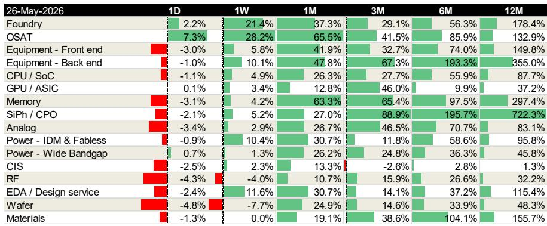
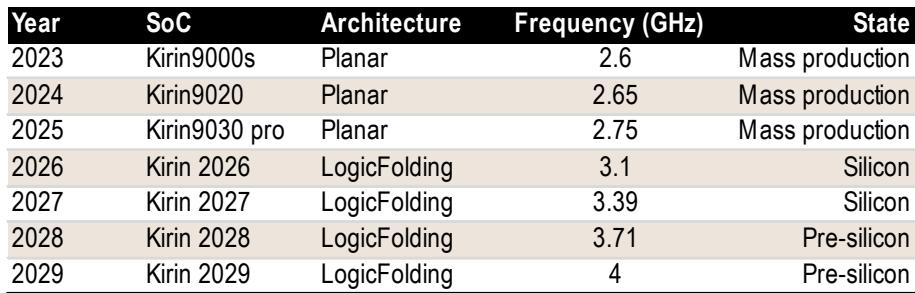
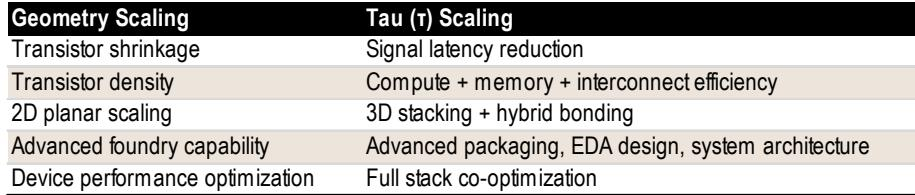

# Huawei’s Tau Scaling Rewrites the Rules of Chip Competition: Time, Not Transistors, Is Now the Battleground

The semiconductor industry has operated for over five decades under a single governing logic: shrink the transistor, improve the chip. Moore’s Law and Dennard scaling defined the rhythm of innovation, and access to advanced lithography determined who could compete. That era is ending, not because the physics has given out entirely, but because a new contender has refused to play by the old rules. On May 25, 2026, at the IEEE International Symposium on Circuits and Systems, Huawei unveiled a design philosophy that breaks with the geometry-centric tradition. It calls this the Tau Scaling Law, and it substitutes the metric of transistor shrinkage with signal latency reduction. The first commercial implementation, a mobile SoC called the Kirin 2026, uses a technique called LogicFolding to vertically stack logic, analog, and memory circuits with ultra-fine hybrid bonding at a 1.5-micron pitch. Huawei claims a 55 percent increase in transistor density to 238 million transistors per square millimeter and a 41 percent power-efficiency gain at a fixed device node.

This is not merely a technical curiosity. It is a strategic pivot that redefines what it means to lead in semiconductor performance. For an industry long accustomed to measuring progress by nanometers, Tau Scaling signals that the next frontier of competition will be won through system-level co-optimization, advanced packaging, and design architecture rather than pure foundry capability. The implications extend far beyond Huawei’s product roadmap. They reshape the supply chain, the valuation of equipment providers, and the strategic calculus for every firm that depends on chip performance.

The timing of this announcement is not accidental. Huawei operates under significant constraints on access to extreme ultraviolet lithography and advanced process nodes. Tau Scaling is a credible engineering response to those restrictions, but it is also a harbinger of a broader shift. If this approach proves scalable and manufacturable, it will force every major semiconductor player to reconsider where value is created. The companies that own the tools for hybrid bonding, the software for 3D design, and the assembly expertise for complex stacking will become the new bottleneck suppliers. The companies that master full-stack co-optimization will define the performance frontier.

This article unpacks what Tau Scaling means, why it matters for investors and strategists, and what questions remain unanswered. The argument is straightforward: the semiconductor industry is entering a phase where design innovation can partially substitute for process technology leadership, and the winners will be those who control the enabling layers of that new stack.

## Huawei’s Tau Scaling Is Not a Substitute for Geometry Shrinkage, but It Is a Credible and Strategic Alternative for Performance Gains

Let us be clear about what Tau Scaling does and does not achieve. The 238 million transistors per square millimeter density that Huawei claims for the Kirin 2026 is achieved in a three-dimensional stacked configuration, not in a planar design. This is not equivalent to matching the transistor density of a 3-nanometer or 2-nanometer planar process from leading foundries. The geometry constraints remain. Huawei still lacks access to the extreme ultraviolet lithography tools required to shrink transistors at the rate of TSMC or Samsung. No amount of clever stacking can fully close that gap.

What Tau Scaling does accomplish, however, is a different kind of performance improvement. By focusing on signal latency reduction rather than transistor density, Huawei optimizes for the metric that most directly impacts real-world application performance: how fast data moves between compute, memory, and analog functions. In a vertically stacked architecture with ultra-fine hybrid bonding, the distance signals travel is dramatically shorter than in a planar design. This reduces power consumption and increases speed without requiring a smaller transistor.

The Kirin 2026 achieves a 3.1 gigahertz operating frequency, compared to 2.75 gigahertz for the prior-generation Kirin 9030 Pro. By 2029, Huawei projects a 4 gigahertz target. These are meaningful improvements, and they come from architecture, not lithography. The Tau Scaling roadmap targets 1.4-nanometer-equivalent logic density by 2031, but that equivalence is in system performance, not in physical transistor dimensions.

The strategic significance is this: for applications where latency and power efficiency are paramount, a well-designed 3D stack can compete with a planar chip built on a more advanced node. This is particularly relevant for mobile SoCs, edge AI, and certain data center workloads. The constraint is that Tau Scaling requires mastery of multiple technologies simultaneously: hybrid bonding, optical I/O, backside power delivery, and EDA flows that can handle 3D design complexity. Huawei is investing across all of these fronts.

## The Supply Chain Winners Are Clear: Advanced Packaging Equipment, OSAT Providers, and EDA Tools Will See Structural Demand Shifts

A global investment bank report identifies four categories of beneficiaries from the Tau Scaling trend: advanced packaging equipment providers, outsourced semiconductor assembly and test companies, foundries with advanced design capabilities, and EDA software vendors. The market data supports this. Over the past twelve months, back-end equipment stocks have risen 355 percent. OSAT companies have gained 133 percent. Foundry stocks have risen 178 percent. EDA and design service firms have gained 115 percent. These are not speculative moves. They reflect a market that is pricing in a structural shift in how chip performance is delivered.

The most direct beneficiary is the equipment segment that supplies hybrid bonders. Ultra-fine-pitch hybrid bonding at 1.5 microns is the enabling technology for LogicFolding. This is not the same as the hybrid bonding used in image sensors or memory stacking. It requires higher precision, tighter thermal control, and the ability to bond active logic tiers. The number of suppliers capable of this is limited, and the barriers to entry are high. Any foundry or OSAT that wants to offer 3D stacking services will need to invest in this equipment, and that creates a multi-year demand cycle.

OSAT companies benefit from the rising complexity of packaging. A LogicFolded chip requires more assembly steps, more testing, and more integration than a conventional planar chip. The value per unit of packaging services increases. This is not a commoditized business. It is a specialized capability that commands premium pricing.

Foundries benefit in a more nuanced way. Tau Scaling does not eliminate the need for advanced logic, but it shifts the value proposition. A foundry that can offer both advanced process nodes and sophisticated 3D integration capabilities becomes more attractive to customers who want to mix and match. The foundry that owns the design rules for 3D stacking will capture a larger share of the total system value.

EDA vendors face both an opportunity and a challenge. Designing a 3D chip with multiple active tiers, hybrid bonding, and thermal constraints is far more complex than planar design. Existing EDA tools are not fully equipped for this. The vendors that can deliver validated 3D design flows, thermal simulation, and signal integrity analysis for stacked architectures will gain a competitive advantage. This is a multi-year product development cycle, and the first movers will set the standards.

## The Unanswered Question: Can Tau Scaling Overcome Thermal and EDA Limitations at Scale?

Every new architecture has its Achilles’ heel. For Tau Scaling and LogicFolding, the two most significant constraints are thermal management and EDA tool limitations. These are not theoretical concerns. They are practical barriers that will determine whether Tau Scaling remains a niche capability for mobile SoCs or becomes a broadly adopted design paradigm.

Heat dissipation in a vertically stacked chip is fundamentally harder than in a planar design. When multiple active tiers are bonded together, the heat generated by each layer must be conducted through the stack to a heatsink. The thermal resistance increases with each additional tier. Huawei’s current implementation uses a relatively small number of tiers, but the roadmap to higher transistor density and higher frequency will require more layers. Without breakthroughs in thermal interface materials, microfluidic cooling, or backside power delivery that reduces heat generation, the performance gains from stacking could be offset by thermal throttling.

The EDA challenge is equally daunting. Designing a 3D chip requires simultaneous optimization across multiple tiers, with interdependencies that do not exist in planar design. Signal integrity, power distribution, clock synchronization, and thermal effects must be co-simulated. Most existing EDA tools are architected for 2D design and have limited support for 3D. Huawei has developed its own internal EDA flows, but the broader ecosystem of third-party IP providers, design services, and verification tools is not yet ready for volume production of complex 3D chips.

The report acknowledges these limitations but does not provide a detailed assessment of how Huawei plans to address them. This is a critical gap. If thermal constraints cap the number of tiers that can be stacked, the density gains may plateau. If EDA tools cannot handle the complexity, design cycles will lengthen and defect rates will rise. Investors and strategists need to monitor developments in these two areas closely. The companies that solve thermal management for 3D chips and the EDA vendors that deliver validated 3D design flows will be the next wave of beneficiaries.

## A Decision Framework for Investors: How to Evaluate Exposure to the Tau Scaling Theme

For readers who want to translate this analysis into actionable investment thinking, a structured framework is more useful than a list of stock picks. The Tau Scaling theme touches multiple segments of the semiconductor supply chain, but not all are equally exposed or equally attractive.

The first dimension to consider is technology specificity. Some equipment, such as hybrid bonders, is uniquely required for Tau Scaling and has no substitute in conventional planar manufacturing. Other equipment, such as test handlers or die sorters, is more generic. The more specific the technology to the Tau Scaling process, the stronger the pricing power and the lower the risk of substitution.

The second dimension is competitive concentration. How many credible suppliers exist for each enabling technology? Hybrid bonding equipment has a small number of qualified suppliers. EDA tools for 3D design have even fewer. OSAT services are more fragmented. Higher concentration typically means higher margins and lower competitive risk.

The third dimension is timing. Some beneficiaries will see revenue impact within one to two years as Huawei ramps Kirin 2026 production and other customers evaluate similar approaches. Others, such as EDA vendors developing new 3D design tools, will see impact over a three- to five-year horizon. Investors need to match their time horizon to the adoption curve.

The fourth dimension is geographic exposure. Companies that supply equipment to Chinese foundries and OSATs face export control risk. The report flags this explicitly for back-end equipment. Investors need to assess whether a supplier’s revenue is concentrated in China and whether that concentration creates regulatory vulnerability.

A fifth dimension, often overlooked, is the second-order effect on memory and interconnect. Tau Scaling’s emphasis on latency reduction increases the importance of memory proximity and high-bandwidth interconnects. Companies that produce high-bandwidth memory, silicon photonics, or co-packaged optics could see incremental demand as 3D architectures become more common.

This framework does not produce a single answer. It produces a set of questions that each investor must answer based on their risk tolerance, time horizon, and geographic preferences. The key insight is that Tau Scaling is not a single-stock story. It is a structural shift that will create winners and losers across multiple segments, and the winners will be those who own the enabling technologies that are hardest to replicate.

## The Open Questions That Deserve Close Attention

No single report can answer every question about a technology that was announced only days ago. Several important issues remain unresolved, and they will determine the magnitude and duration of the investment opportunity.

First, can Huawei scale LogicFolding beyond mobile SoCs? The Kirin 2026 is a relatively simple implementation. Scaling to data center CPUs or AI accelerators with dozens of tiers and higher power densities is a different challenge. The thermal and EDA constraints will be far more severe. If Tau Scaling remains confined to mobile, the addressable market is large but not transformative. If it extends to high-performance computing, the implications are much larger.

Second, will other Chinese chip designers adopt Tau Scaling? Huawei’s internal capabilities are unique. Most Chinese fabless companies do not have the design expertise, the EDA tools, or the foundry relationships to replicate LogicFolding. The broader ecosystem may take years to develop. Government support could accelerate adoption, but it could also create dependency.

Third, how will incumbent foundries respond? TSMC and Samsung have their own 3D stacking technologies, but they have not adopted a Tau-like philosophy of optimizing for latency rather than density. If Tau Scaling proves commercially successful, incumbents may need to adjust their roadmaps. That could accelerate investment in hybrid bonding and 3D EDA, benefiting equipment and software vendors regardless of which company leads.

Fourth, what is the export control risk for back-end equipment? The report notes this as a risk for ASMPT. If restrictions on advanced packaging equipment expand, the beneficiary set could shrink. Investors need to monitor policy developments closely.

These questions do not diminish the significance of Tau Scaling. They define the range of outcomes. The most prudent approach is to treat Tau Scaling as a credible and important development that warrants close monitoring, but not as a certainty that justifies aggressive positioning without further evidence.

## Join the Community to Read the Full Report and Review the Original Charts

The analysis above is based on a 12-page research report published by a global investment bank on May 26, 2026. The full report includes detailed comparisons of geometry scaling versus Tau scaling, performance projections for the Kirin series through 2029, share price movements across 15 semiconductor sub-sectors over multiple time horizons, and a deep dive on ASMPT as a key beneficiary. The original charts provide data that cannot be fully conveyed in text.

For readers who want to study the underlying numbers, understand the valuation methodology, and see the complete set of disclosures, the full report is available. Join the community to read the full report and review the original charts.

*This article is for learning and discussion only and does not constitute investment advice.*

Personal reading notes and learning share only. Not investment advice.

