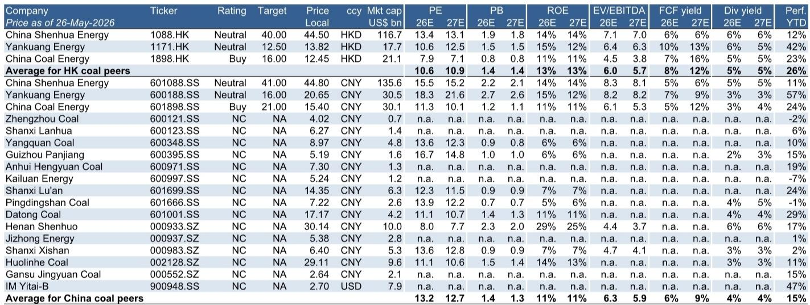
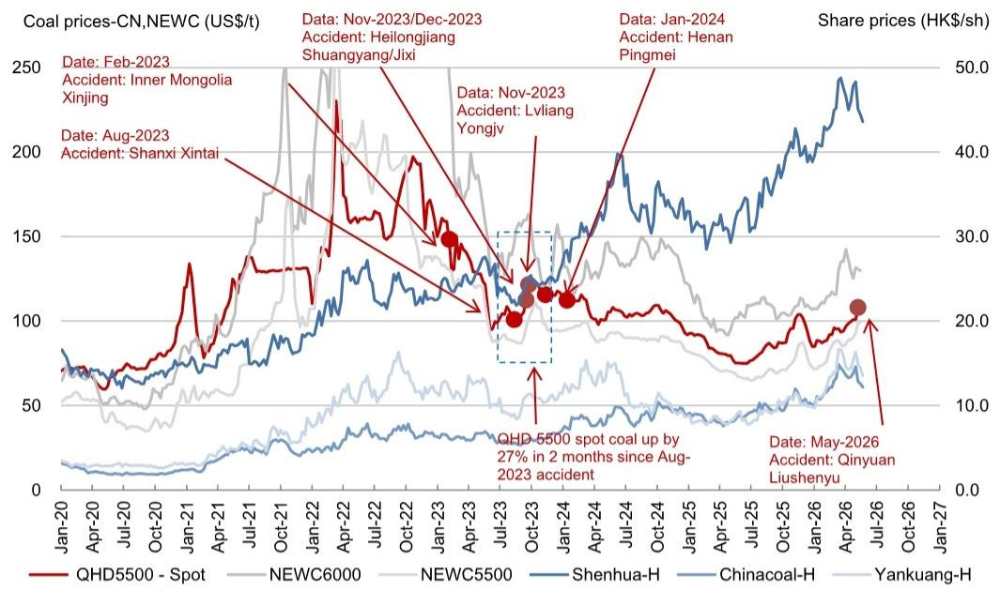
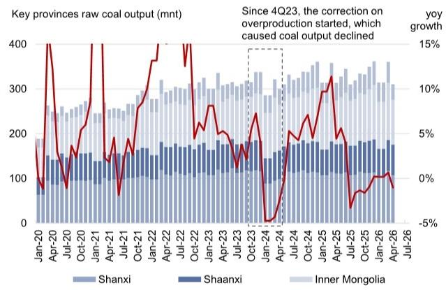

# 煤炭市场的真正风险不是事故本身，而是安全监管的系统性收紧

## 市场低估了供给侧的连锁反应

2026年5月22日，山西长治柳树余煤矿发生重大瓦斯爆炸事故，造成严重人员伤亡。这起发生在焦煤主产区的事故，在资本市场引发的反应远不止是对单一产能损失的定价。根据某外资投行最新发布的研报，截至当前，山西省因该事故而停产安检的煤矿产能已达到1.25亿吨原煤/年，涉及113座煤矿。其中近8000万吨产能预计将至少停产一个月以上或尚无明确复产时间表，这些产能几乎全部为炼焦煤，折合约6000万吨商品煤年产能，占国内炼焦煤市场超过10%。

市场习惯于将此类事件视为短期扰动，并在情绪消退后迅速回归对需求侧的关注。但这份报告的真正价值在于揭示一个更深层的判断：事故本身是催化剂，真正改变行业基本面的是正在加速落地的安全生产三年行动方案。这一政策变量正在重塑中国煤炭供给曲线的斜率，其影响将超越市场当前定价所反映的范畴。

## 1. 安全监管从“阶段性运动”转向“制度性约束”，这才是供给收缩的真正驱动力

市场对煤炭供给侧的认知存在一个系统性偏差：倾向于将安全监管视为可逆的短期行政干预，而非长期制度安排。2023年下半年国内连续发生多起煤矿事故后，中国启动了“安全生产治本攻坚三年行动方案”。这并非普通的专项整治，而是一个明确以“治本”为目标的制度性框架。

报告的Exhibit 2清晰地展示了这一政策转向的效果：自2023年四季度起，主要产煤省份的产量开始出现趋势性下降。山西、陕西、内蒙古三大主产区的原煤产量同比增速从此前的正增长转为持续负增长。这一变化并非由需求端驱动，而是供给端主动收缩的结果。

这意味着，即使不考虑本次事故，中国煤炭供给已经处于一个政策驱动的下行通道中。事故的发生只会加速这一进程，而非开启一个全新的周期。市场如果仅仅将本次事故视为一次性冲击，而忽视其背后正在强化的制度性约束，就可能低估未来几个季度供给收缩的持续性。

## 2. 焦煤市场面临的结构性缺口比表面数字更严峻

本次停产产能集中于炼焦煤，这是理解供给冲击影响的关键。报告明确指出，受影响产能几乎全部为炼焦煤，折合6000万吨商品煤年产能，占国内炼焦煤市场超过10%。这一比例本身已经相当可观，但更值得关注的是以下几个结构性因素叠加后的放大效应。

第一，炼焦煤的资源禀赋决定其复产难度远高于动力煤。炼焦煤开采条件更复杂，瓦斯治理要求更高，事故后的复产审批流程更严格。报告提到，64%的停产产能“预计将至少停产一个月以上或尚无明确复产时间表”，这一表述本身就暗示了复产的不确定性。

第二，进口补充空间正在收窄。报告Exhibit 3显示，2026年至今中国月度煤炭进口量较2025年平均下降约4300万吨。进口下降的原因报告没有完全展开，但可以合理推断，全球炼焦煤贸易流正在重新分配，而中国并非唯一的需求方。

第三，下游库存处于低位。Exhibit 4的数据表明，截至2026年5月，国内六大电力企业的煤炭库存低于正常季节性水平。虽然电力企业主要消耗动力煤，但焦煤下游的钢铁企业库存情况同样值得关注——报告没有提供这一数据，但这是判断价格传导弹性的关键变量。

这三个因素的叠加，意味着焦煤市场当前面临的不是简单的“供给冲击”，而是一个供给收缩、进口下降、库存偏低同时发生的“三重压力”。这种结构性的供需失衡，其价格弹性将显著高于市场历史经验所暗示的水平。

## 3. 动力煤市场的价格上行风险同样被低估，但逻辑不同

与焦煤市场的直接供给冲击不同，动力煤市场的价格风险更多来自需求侧的结构性变化和季节性因素的共振。

报告提到一个值得注意的现象：自春节以来，动力煤现货价格已从718元/吨上涨至835元/吨，涨幅约16%，这与正常的季节性规律相反。通常在春节后、夏季高峰来临前，动力煤价格会经历季节性回落，但今年的走势明显偏离了这一模式。

背后的驱动因素有三点。其一，煤化工消费占比持续提升。报告Exhibit 5显示，2025年煤化工已占中国煤炭消费总量的9%，与钢铁行业并列第二大消费部门。煤化工的产能扩张正在为煤炭需求提供新的增长极，这一结构性变化尚未被市场充分定价。

其二，电力企业提前补库。5月份独立发电企业的补库行为本身就是对供给不确定性的提前反应。如果后续供给持续偏紧，这种预防性补库可能进一步推高现货价格。

其三，进口下降同样影响动力煤市场。虽然动力煤的进口替代弹性高于焦煤，但全球煤炭贸易格局正在经历调整，中国作为最大进口国的议价能力正在发生变化。

报告给出的弹性分析值得认真对待：对于每10%的现货价格上涨，中国神华的盈利将增长4.1%，中煤能源增长7.8%，兖矿能源增长4.0%。如果当前价格上行趋势持续，这些公司的盈利弹性将显著超出市场预期。

## 4. 报告尚未完全回答的关键问题：复产节奏与政策执行力度

任何分析都有其边界，这份报告最大的价值之一在于明确标示了不确定性所在。以下几个关键问题的答案，将决定整个判断的准确程度。

第一，停产煤矿的实际复产节奏。报告明确表示“对供给恢复的时间线不持有任何观点”，这是应有的审慎。但投资者需要追问的是：历史上类似事故后的复产周期有多长？当前监管环境下，复产审批是否会比以往更严格？这些问题报告没有给出明确答案，但可以基于已知信息进行合理推演。

第二，安全生产三年行动方案的实际执行力度。政策目标与执行效果之间往往存在差距。2023年下半年以来的产量下降是否已经反映了政策的大部分影响？还是说，政策执行才刚刚开始，后续仍有进一步收紧的空间？报告提供的数据显示产量下降已经发生，但无法区分哪些是政策驱动、哪些是事故驱动的短期扰动。

第三，价格传导的微观机制。报告给出的盈利弹性分析是基于历史关系的线性外推，但当前的市场结构是否与历史可比？如果供给收缩与需求增长同时发生，价格弹性可能非线性放大。报告没有讨论这一可能性，而这恰恰是判断风险收益比的核心。

## 5. 投资者需要重新审视的观察框架：从需求侧转向供给侧定价

基于以上分析，投资者对煤炭板块的定价框架需要进行系统性调整。传统的煤炭投资逻辑高度依赖需求侧判断：地产投资、基建投资、制造业景气度等宏观变量决定了煤炭的估值中枢。但在当前环境下，供给侧已经从一个“调节变量”上升为“定价变量”。

这意味着，投资者需要建立一套新的观察框架。第一，关注安全监管政策的制度性变化，而非仅仅跟踪事故本身。安全生产三年行动方案的阶段性评估、地方政府的执行力度、事故后的问责强度，这些指标比月度产量数据更具前瞻性。

第二，重新评估不同煤种的价值差异。焦煤与动力煤的供给弹性不同，需求结构不同，价格传导机制也不同。在供给收缩的环境下，焦煤的稀缺溢价可能进一步扩大，而动力煤的价格上限则受到电力市场化改革的约束。

第三，关注公司层面的差异化。报告给出的盈利弹性分析显示，中煤能源对煤价变化的敏感度最高（每10%涨价对应7.8%盈利增长），这与其资产结构和成本特征有关。在供给收缩、价格上涨的环境下，拥有低成本资源和较高经营杠杆的公司将获得超额收益。

第四，警惕库存数据的误导。当前的低库存水平既是价格上涨的支撑因素，也可能掩盖真实的需求疲软。如果库存持续低位但价格不涨，反而说明需求端存在隐忧。库存与价格的背离信号需要结合下游开工率、出口订单等指标综合判断。

## 6. 供给侧的长期重塑才刚刚开始

回到本次事故本身。柳树余煤矿1.2亿吨的年产能，在1.25亿吨的停产总量中占比不足10%。真正重要的不是单一产能的损失，而是这一事件所触发的系统性安全审查，以及正在加速落地的制度性约束。

中国煤炭行业正在经历一个历史性的转折：从“保供”优先转向“安全”优先。这一转变的短期影响是价格上涨和供给收缩，但其长期影响可能更为深远。安全标准的提高将推动行业集中度上升，淘汰落后产能，加速优质资源的溢价定价。那些拥有先进安全技术、合规成本较低的大型企业，将在这一过程中获得结构性竞争优势。

当然，这一判断的成立需要满足几个前提条件：政策执行不打折扣、需求侧不出现超预期下滑、进口替代能力有限。这三个条件目前看起来都偏向支持供给收缩的方向，但市场永远需要保持对不确定性的敬畏。

报告中还有一个值得玩味的细节：在某外资投行覆盖的煤炭股中，只有中煤能源（A股和H股）获得了“买入”评级，其余均为“中性”。这一评级分布本身就暗示了，即使在供给收缩、价格上涨的预期下，分析师仍然认为大部分煤炭公司的估值已经反映了这些利好。真正的超额收益，可能只属于那些在安全监管趋严的环境中能够实现份额扩张和成本优势的企业。

关于复产节奏的具体时间表、安全生产三年行动方案的后续执行细则、以及不同煤种的价格弹性差异，这些内容在研报中有更详细的数据支撑和情景分析。欢迎来星球微信群里继续讨论，我们可以一起拆解这些尚未完全定价的关键变量。

Personal reading notes and learning share only. Not investment advice.

