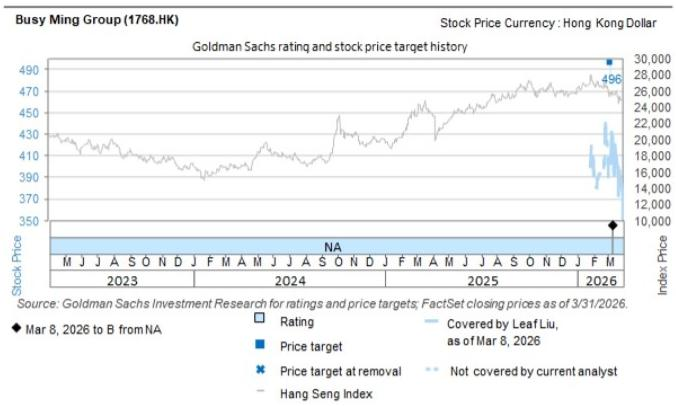
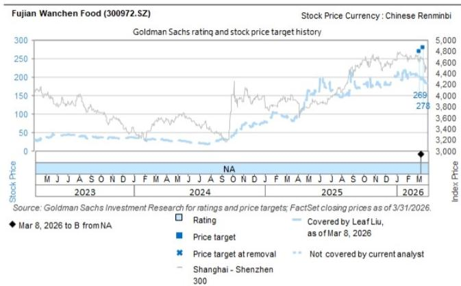

# CHINA CONSUMER STAPLES

# Value retailers: Addressing key investor questions on recent competition; Reiterate Buy on Busy Ming/Wanchen

Our value retailers coverage, Busy Ming/Wanchen's share prices (initiation in March) are up +66%/+1% since begin-2026 to 26 May respectively, outperforming MSCI China Consumer Staples index at -11%. However, share prices pulled back 9%/6% on May 27 with rising investors questions and concerns on the recent regional escalation of subsidies to franchisees (mainly on new store opens). GS view: Despite concerns over localized competition, the TAM remains vast in our view with substantial room for further penetration and category expansion (our view that the industry-wide stores have the potential to reach up to c.100k ultimately vs. <60k currently), esp. given YTD gross store opens at c.2,500+ for each system and are growing at a much faster pace vs. 1H25. With this, we think investor concerns on potential earnings risks seems overdone and address key investor questions below:

1) This round of subsidies are localized and store-specific (“one store, one policy”), which are targeted at specific high-competition zones to prevent competitor encroachment: While market concerns mainly focus on any aggressive subsidy wars, this round of subsidy structure is targeted (regional focus) and was introduced as a disciplined, preemptive counter-measure. We note the following key differences for this round vs. the competition measures in 2024 including: i) Strict evaluation for applications by franchisees: Approval is strict, and incentives are often tied to performance gradients (e.g., monthly efficiency targets/distance/franchisee investments on store display etc.) and not open-ended, vs. more open-ended policies in 2024 covering signage, rent, and promotional margin on top of a fixed subsidy amount at Rmb10k\~12k in 2024 (see Exhibit 4); ii) More selective and regionally focused (unlike the broad-based national expansion seen in 2024): our channel checks suggest Busy Ming mostly focuses on its home market Central and South China (i.e. Hunan/Guizhou/Hubei/Jiangxi/Guangdong), while Wanchen mainly focuses on selective regions i.e. Shaanxi; iii) the key ROI for evaluating store performance has shifted to payback periods and site selection, and both Busy Ming and Wanchen still remain rational in terms of granting subsidies using lessons from 2024 to prevent franchisees opening stores solely to collect grants; we also view localized counter-measures as a tool to prevent irrational over-saturation and excessive store saturation in a close competitive radius by competitors.

# Leaf Liu

+852-3966-4169 | leaf.liu@gs.com

GS (Asia) L.L.C.

# Christina Liu

+852-2978-6983 | christina.liu@gs.com

GS (Asia) L.L.C.

# Valerie Zhou

+852-2978-0820 | valerie.zhou@gs.com

GS (Asia) L.L.C.

2) Earnings impact: We note that in 2024, subsidies supported overall store open run-rate and accelerated market consolidation by value retailers while both GPM/NPM actually benefited from economies of scales and bargaining power (i.e. Busy Ming's 2024 GPM rose 0.12pp vs. 2023, Wanchen's retail business GPM rose 1.3pp yoy in 2024). We maintain our earnings forecasts (our base-case forecasts of 5.1k/6.5k new stores for Busy Ming/Wanchen in 2026 with GPM expansion at 0.43ppt/1.0ppt respectively on operation gains), but perform two earnings sensitivity tests to examine the potential impact from new store opens/subsidy (See Exhibit 1 & Exhibit 2).

3) Along with the rapid increase in store counts, there is still a significant “toolset” available for growth: We note accelerated store openings by leaders in 1Q26 while single-store performance improved with LNY seasonality, category expansion and operational refinements. We expect value retailers to capture more market share within China’s Rmb4trn snack and beverage market, while both leading players have yet to fully leverage tools such as product innovation/extension, member management, and digitalization. We are also seeing enhanced collaboration from F&B brands with value retailers as brands seek to navigate a subdued consumption environment with value retailers representing a growth vector suggesting a fundamental reshaping of the value chain, for which competition is increasingly requiring a strategic pivot toward channel-specific innovation and efficiency focus (see section below on “what F&B brands are telling us about Value Retailers”).

We reiterate our Buy ratings on Busy Ming/Wanchen on attractive risk/reward. Busy Ming/Wanchen are trading at 17x/14x 2026E P/Es post correction. Catalysts include: 1) Busy Ming's inclusion into the Hang Seng Composite Index (HSCI), announced on May 22, 2026 (which is a prerequisite for the Southbound Stock Connect); 2) We anticipate a robust 1H26/2Q26 earnings report by Busy Ming/Wanchen with strong new store open run-rate and margin expansion from scale/efficiency; 3) Positive signals in per-store GMV trend uplift helped by category expansion, esp. for Busy Ming.

The authors would like to thank Lily Qi for her contribution to this report.

# Store opens/subsidy sensitivity

We perform a sensitivity analysis on the size of subsidies issued by the company to franchisees for new stores at both companies on our 2026E forecasts, incorporating the potential impact of incremental store-openings motivated by the additional subsidy incentive, similar to those seen during the intense subsidy-driven competition in 2024. For the sensitivity, we flex: 1) 0\~1.2k additional 2026 new store openings for each company vs. our base-case forecasts of 5.1k/6.5k new stores for Busy Ming/Wanchen, driven by more aggressive subsidy incentives; 2) Subsidies of Rmb50k\~70k (considering the historical one-time new store subsidy level at Rmb72\~100k in 2024, and that the regions applying this round subsidies hold c.50% of current total store count for Busy Ming) per new store opened in 2026 on average for both companies, including the regular Rmb36k new-store opening subsidy since late 2024 that we already factor into our base cases plus the additional competitive subsidy associated with direct overlap with the other player. Our sensitivity analysis suggests this could result in up to -0.3pp/-0.4pp potential gross profit margin dilution and -0.2pp/-0.2pp potential net profit margin drag for Busy Ming/Wanchen in 2026E, translating into up to -3.0%/-4.1% drag on (adjusted) net profit growth, respectively.

2) We also perform a sensitivity analysis assuming 2026E topline/new store opens are unchanged, flexing: 1) 30\~70% of 2026 new store openings are drawn into direct head-to-head competition considering that only selected regions participate in this round subsidies and therefore qualify for subsidies; 2) Rmb40\~80k additional subsidies granted per participating store considering the historical one-time new store subsidy level at Rmb72\~100k in 2024 though we believe the amount may be more disciplined/rational this time around. The sensitivity test suggests up to 0.3pp/0.4pp potential GPM dilution and 0.2pp/0.3pp NPM drag for Busy Ming/Wanchen in 2026, with up to -5%/-7% (adj.) potential NP drag vs. our current earnings growth forecast of +52%/+90% yoy in 2026E, respectively.

Exhibit 1: Sensitivity test of GPM/NPM/NP impact flexing 2026 store open and avg. subsidies per new store (incl. regular subsidies) 

<table><tr><td colspan="7">Busy Ming Sensitivity test2026E GPM impact</td></tr><tr><td rowspan="2" colspan="2"></td><td colspan="5">vg. subsidies per new store (Rmb k) - incl. normal Rmb36</td></tr><tr><td>50</td><td>55</td><td>60</td><td>65</td><td>70</td></tr><tr><td rowspan="5">2026 newstore open</td><td>5100</td><td>-0.07pp</td><td>-0.10pp</td><td>-0.12pp</td><td>-0.15pp</td><td>-0.17pp</td></tr><tr><td>5400</td><td>-0.09pp</td><td>-0.11pp</td><td>-0.14pp</td><td>-0.17pp</td><td>-0.19pp</td></tr><tr><td>5700</td><td>-0.10pp</td><td>-0.13pp</td><td>-0.16pp</td><td>-0.18pp</td><td>-0.21pp</td></tr><tr><td>6000</td><td>-0.12pp</td><td>-0.14pp</td><td>-0.17pp</td><td>-0.20pp</td><td>-0.23pp</td></tr><tr><td>6300</td><td>-0.13pp</td><td>-0.16pp</td><td>-0.19pp</td><td>-0.22pp</td><td>-0.25pp</td></tr></table>

<table><tr><td colspan="7">2026E adj.NPM impact</td></tr><tr><td rowspan="2" colspan="2"></td><td colspan="5">vg. subsidies per new store (Rmb k) - incl. normal Rmb36</td></tr><tr><td>50</td><td>55</td><td>60</td><td>65</td><td>70</td></tr><tr><td rowspan="5">2026 newstore open</td><td>5100</td><td>-0.05pp</td><td>-0.07pp</td><td>-0.09pp</td><td>-0.11pp</td><td>-0.12pp</td></tr><tr><td>5400</td><td>-0.06pp</td><td>-0.08pp</td><td>-0.10pp</td><td>-0.12pp</td><td>-0.14pp</td></tr><tr><td>5700</td><td>-0.07pp</td><td>-0.09pp</td><td>-0.11pp</td><td>-0.13pp</td><td>-0.15pp</td></tr><tr><td>6000</td><td>-0.08pp</td><td>-0.10pp</td><td>-0.12pp</td><td>-0.14pp</td><td>-0.17pp</td></tr><tr><td>6300</td><td>-0.09pp</td><td>-0.11pp</td><td>-0.14pp</td><td>-0.16pp</td><td>-0.18pp</td></tr></table>

<table><tr><td colspan="7">2026E adj. NP Impact</td></tr><tr><td rowspan="2" colspan="2"></td><td colspan="5">vg. subsidies per new store (Rmb k) - incl. normal Rmb36</td></tr><tr><td>50</td><td>55</td><td>60</td><td>65</td><td>70</td></tr><tr><td rowspan="5">2026 newstore open</td><td>5100</td><td>-1.3%</td><td>-1.7%</td><td>-2.1%</td><td>-2.5%</td><td>-3.0%</td></tr><tr><td>5400</td><td>-0.9%</td><td>-1.3%</td><td>-1.8%</td><td>-2.3%</td><td>-2.7%</td></tr><tr><td>5700</td><td>-0.5%</td><td>-1.0%</td><td>-1.5%</td><td>-2.0%</td><td>-2.4%</td></tr><tr><td>6000</td><td>-0.2%</td><td>-0.7%</td><td>-1.2%</td><td>-1.7%</td><td>-2.2%</td></tr><tr><td>6300</td><td>0.2%</td><td>-0.3%</td><td>-0.9%</td><td>-1.4%</td><td>-1.9%</td></tr></table>

<table><tr><td colspan="7">2026E adj. NP value impact (Rmb mn)</td></tr><tr><td rowspan="2" colspan="2"></td><td colspan="5">vg. subsidies per new store (Rmb k) - incl. normal Rmb36</td></tr><tr><td>50</td><td>55</td><td>60</td><td>65</td><td>70</td></tr><tr><td rowspan="5">2026 newstore open</td><td>5100</td><td>4,039</td><td>4,022</td><td>4,004</td><td>3,987</td><td>3,969</td></tr><tr><td>5400</td><td>4,054</td><td>4,035</td><td>4,017</td><td>3,998</td><td>3,980</td></tr><tr><td>5700</td><td>4,069</td><td>4,049</td><td>4,030</td><td>4,010</td><td>3,991</td></tr><tr><td>6000</td><td>4,084</td><td>4,063</td><td>4,043</td><td>4,022</td><td>4,001</td></tr><tr><td>6300</td><td>4,099</td><td>4,077</td><td>4,055</td><td>4,034</td><td>4,012</td></tr></table>

<table><tr><td colspan="7">Wanchen Sensitivity test</td></tr><tr><td colspan="7">2026E GPM impact</td></tr><tr><td rowspan="2" colspan="2"></td><td colspan="5">Avg. subsidies per new store (Rmb k) - incl. normal Rmb36k</td></tr><tr><td>50</td><td>55</td><td>60</td><td>65</td><td>70</td></tr><tr><td rowspan="5">2026 newstore open</td><td>6500</td><td>-0.12pp</td><td>-0.16pp</td><td>-0.20pp</td><td>-0.24pp</td><td>-0.28pp</td></tr><tr><td>6800</td><td>-0.14pp</td><td>-0.18pp</td><td>-0.22pp</td><td>-0.26pp</td><td>-0.31pp</td></tr><tr><td>7100</td><td>-0.16pp</td><td>-0.20pp</td><td>-0.24pp</td><td>-0.29pp</td><td>-0.33pp</td></tr><tr><td>7400</td><td>-0.17pp</td><td>-0.22pp</td><td>-0.26pp</td><td>-0.31pp</td><td>-0.35pp</td></tr><tr><td>7700</td><td>-0.19pp</td><td>-0.24pp</td><td>-0.28pp</td><td>-0.33pp</td><td>-0.38pp</td></tr></table>

<table><tr><td colspan="7">2026E NPM impact</td></tr><tr><td rowspan="2" colspan="2"></td><td colspan="5">Avg. subsidies per new store (Rmb k) - incl. normal Rmb36k</td></tr><tr><td>50</td><td>55</td><td>60</td><td>65</td><td>70</td></tr><tr><td rowspan="5">2026 newstore open</td><td>6500</td><td>-0.10pp</td><td>-0.12pp</td><td>-0.14pp</td><td>-0.16pp</td><td>-0.18pp</td></tr><tr><td>6800</td><td>-0.11pp</td><td>-0.13pp</td><td>-0.15pp</td><td>-0.17pp</td><td>-0.19pp</td></tr><tr><td>7100</td><td>-0.12pp</td><td>-0.14pp</td><td>-0.16pp</td><td>-0.18pp</td><td>-0.20pp</td></tr><tr><td>7400</td><td>-0.12pp</td><td>-0.15pp</td><td>-0.17pp</td><td>-0.19pp</td><td>-0.21pp</td></tr><tr><td>7700</td><td>-0.13pp</td><td>-0.15pp</td><td>-0.18pp</td><td>-0.20pp</td><td>-0.22pp</td></tr></table>

<table><tr><td colspan="7">2026E NP Impact</td></tr><tr><td rowspan="2" colspan="2"></td><td colspan="5">Avg. subsidies per new store (Rmb k) - incl. normal Rmb36k</td></tr><tr><td>50</td><td>55</td><td>60</td><td>65</td><td>70</td></tr><tr><td rowspan="5">2026 newstore open</td><td>6500</td><td>-1.8%</td><td>-2.3%</td><td>-2.9%</td><td>-3.5%</td><td>-4.1%</td></tr><tr><td>6800</td><td>-1.3%</td><td>-1.9%</td><td>-2.5%</td><td>-3.2%</td><td>-3.8%</td></tr><tr><td>7100</td><td>-0.9%</td><td>-1.5%</td><td>-2.2%</td><td>-2.8%</td><td>-3.5%</td></tr><tr><td>7400</td><td>-0.5%</td><td>-1.1%</td><td>-1.8%</td><td>-2.5%</td><td>-3.1%</td></tr><tr><td>7700</td><td>0.0%</td><td>-0.7%</td><td>-1.4%</td><td>-2.1%</td><td>-2.8%</td></tr></table>

<table><tr><td colspan="7">2026E NP value impact (Rmb mn)</td></tr><tr><td rowspan="2" colspan="2"></td><td colspan="5">Avg. subsidies per new store (Rmb k) - incl. normal Rmb36k</td></tr><tr><td>50</td><td>55</td><td>60</td><td>65</td><td>70</td></tr><tr><td rowspan="5">2026 newstore open</td><td>6500</td><td>2,511</td><td>2,496</td><td>2,481</td><td>2,466</td><td>2,451</td></tr><tr><td>6800</td><td>2,522</td><td>2,506</td><td>2,491</td><td>2,475</td><td>2,459</td></tr><tr><td>7100</td><td>2,533</td><td>2,517</td><td>2,500</td><td>2,484</td><td>2,468</td></tr><tr><td>7400</td><td>2,544</td><td>2,527</td><td>2,510</td><td>2,493</td><td>2,476</td></tr><tr><td>7700</td><td>2,555</td><td>2,537</td><td>2,519</td><td>2,502</td><td>2,484</td></tr></table>

Source: GS Global Investment Research

Exhibit 2: Sensitivity test of GPM/NPM/NP impact flexing new store competitive subsidy coverage rate and additional competitive subsidy amount per store 

<table><tr><td colspan="7">Busy Ming Sensitivity test</td></tr><tr><td colspan="7">2026E GPM impact</td></tr><tr><td></td><td colspan="6">Additional subsidies per store (Rmb k)</td></tr><tr><td></td><td>40</td><td>50</td><td>60</td><td>70</td><td>80</td><td></td></tr><tr><td>2026 newstoreparticipationrate %</td><td colspan="6">30%-0.06pp-0.07pp-0.09pp-0.10pp-0.12pp40%-0.08pp-0.10pp-0.12pp-0.14pp-0.16pp50%-0.10pp-0.12pp-0.15pp-0.17pp-0.20pp60%-0.12pp-0.15pp-0.18pp-0.21pp-0.24pp70%-0.14pp-0.17pp-0.21pp-0.24pp-0.28pp</td></tr><tr><td colspan="7">Wanchen Sensitivity test</td></tr><tr><td colspan="7">2026E GPM impact</td></tr><tr><td></td><td colspan="6">Additional subsidies per store (Rmb k)</td></tr><tr><td></td><td>40</td><td>50</td><td>60</td><td>70</td><td>80</td><td></td></tr><tr><td>2026 newstoreparticipationrate %</td><td colspan="6">30%-0.10pp-0.12pp-0.14pp-0.17pp-0.19pp40%-0.13pp-0.16pp-0.19pp-0.23pp50%-0.16pp-0.20pp-0.24pp-0.28pp60%-0.19pp-0.24pp-0.29pp-0.34pp-0.39pp70%-0.23pp-0.28pp-0.34pp-0.39pp-0.45pp</td></tr><tr><td colspan="7">2026E adj.NPM impact</td></tr><tr><td></td><td colspan="6">Additional subsidies per store (Rmb k)</td></tr><tr><td></td><td>40</td><td>50</td><td>60</td><td>70</td><td>80</td><td></td></tr><tr><td>2026 newstoreparticipationrate %</td><td colspan="6">30%-0.05pp-0.06pp-0.07pp-0.08pp-0.09pp40%-0.06pp-0.08pp-0.09pp-0.11pp-0.12pp50%-0.08pp-0.09pp-0.11pp-0.13pp-0.15pp60%-0.09pp-0.11pp-0.14pp-0.16pp-0.18pp70%-0.11pp-0.13pp-0.16pp-0.18pp-0.21pp</td></tr><tr><td colspan="7">2026E NPM impact</td></tr><tr><td></td><td colspan="6">Additional subsidies per store (Rmb k)</td></tr><tr><td></td><td>40</td><td>50</td><td>60</td><td>70</td><td>80</td><td></td></tr><tr><td>2026 newstoreparticipationrate %</td><td colspan="6">30%-0.09pp-0.10pp-0.11pp-0.13pp-0.14pp-0.17pp40%-0.11pp-0.12pp-0.14pp-0.16pp-0.19pp50%-0.12pp-0.14pp-0.16pp-0.19pp60%-0.14pp-0.16pp-0.19pp-0.22pp70%-0.16pp-0.19pp-0.22pp-0.24pp-0.27pp</td></tr><tr><td colspan="7">2026E adj. NP Impact</td></tr><tr><td></td><td colspan="6">Additional subsidies per store (Rmb k)</td></tr><tr><td></td><td>40</td><td>50</td><td>60</td><td>70</td><td>80</td><td></td></tr><tr><td>2026 newstoreparticipationrate %</td><td colspan="6">30%-1.1%-1.3%-1.6%-1.9%-2.2%40%-1.4%-1.8%-2.2%-2.5%-2.9%50%-1.8%-2.2%-2.7%-3.1%-3.6%60%-2.2%-2.7%-3.2%-3.8%-4.3%70%-2.5%-3.1%-3.8%-4.4%-5.0%</td></tr><tr><td colspan="7">2026E adj. NP value impact (Rmb mn)</td></tr><tr><td></td><td colspan="6">Additional subsidies per store (Rmb k)</td></tr><tr><td></td><td>40</td><td>50</td><td>60</td><td>70</td><td>80</td><td></td></tr><tr><td>2026 newstoreparticipationrate %</td><td colspan="6">30%4,0464,0354,0244,0134,00240%4,0324,0174,0023,9883,97350%4,0173,9993,9803,9623,94360%4,0023,9803,9583,9363,91470%3,9883,9623,9363,9103,885</td></tr><tr><td colspan="7">2026E NP value impact (Rmb mn)</td></tr><tr><td></td><td colspan="6">Additional subsidies per store (Rmb k)</td></tr><tr><td></td><td>40</td><td>50</td><td>60</td><td>70</td><td>80</td><td></td></tr><tr><td>2026 newstoreparticipationrate %</td><td colspan="6">30%2,5182,5082,4992,4892,48040%2,5052,4922,4802,46750%2,4922,4762,4602,44560%2,48070%2,4672,4452,4222,4002,378</td></tr></table>

Source: GS Global Investment Research

Exhibit 3: Value retailer monthly store opening table (this data may have time/lagging difference vs. the actual number) 

<table><tr><td>Store number monthly tracker</td><td>Jan-25</td><td>Feb-25</td><td>Mar-25</td><td>Apr-25</td><td>May-25</td><td>Jun-25</td><td>Jul-25</td><td>Aug-25</td><td>Sep-25</td><td>Oct-25</td><td>Nov-25</td><td>Dec-25</td><td>Jan-26</td><td>Feb-26</td><td>Mar-26</td><td>Apr-26</td><td>May-26</td></tr><tr><td>Busy Ming</td><td>14,737</td><td>14,956</td><td>15,152</td><td>15,474</td><td>15,989</td><td>16,783</td><td>17,584</td><td>18,551</td><td>19,517</td><td>20,513</td><td>21,041</td><td>21,948</td><td>22,801</td><td>23,291</td><td>23,771</td><td>24,271</td><td>25,178</td></tr><tr><td>Net add</td><td>343</td><td>219</td><td>196</td><td>322</td><td>515</td><td>794</td><td>801</td><td>967</td><td>967</td><td>996</td><td>528</td><td>907</td><td>853</td><td>490</td><td>480</td><td>500</td><td>907</td></tr><tr><td>store open %</td><td>2.4%</td><td>1.5%</td><td>1.3%</td><td>2.1%</td><td>3.3%</td><td>5.0%</td><td>4.8%</td><td>5.5%</td><td>5.2%</td><td>5.1%</td><td>2.6%</td><td>4.3%</td><td>3.9%</td><td>2.1%</td><td>2.1%</td><td>2.1%</td><td>3.7%</td></tr><tr><td>Haoxianglai only</td><td>12,977</td><td>13,325</td><td>13,632</td><td>14,119</td><td>14,356</td><td>15,365</td><td>15,565</td><td>15,612</td><td>16,320</td><td>16,619</td><td>16,626</td><td>17,248</td><td>17,834</td><td>18,434</td><td>18,909</td><td>19,509</td><td></td></tr><tr><td>Net add</td><td>1,229</td><td>348</td><td>307</td><td>487</td><td>237</td><td>1,009</td><td>200</td><td>47</td><td>708</td><td>299</td><td>7</td><td>622</td><td>586</td><td>600</td><td>475</td><td>600</td><td></td></tr><tr><td>store open %</td><td>10.5%</td><td>2.7%</td><td>2.3%</td><td>3.6%</td><td>1.7%</td><td>7.0%</td><td>1.3%</td><td>0.3%</td><td>4.5%</td><td>1.8%</td><td>0.0%</td><td>3.7%</td><td>3.4%</td><td>3.4%</td><td>2.6%</td><td>3.2%</td><td></td></tr></table>

The data may have time/lagging difference vs the act. number.   
Source: Douyin, Wechat official accounts, GeoQ, Company data, GS Global Investment Research

# Evolution of Subsidy Policies

We identify 3 stages for value retailers' fast development in terms of competition landscape evolution and subsidy policies by leading players below including 1) Rapid expansion stage (2024), 2) Consolidation stage (2025) and 3) Rational & strategic competition stage (2026TD).

1. Rapid Expansion stage (2024): This is characterized by securing primary locations actions by leading players around key provinces in China. New store opens hiked in 2Q24-3Q24 with aggressive store open policies (subsidies reaching Rmb100k-200k per store, covering signage, rent, and promotional margins) by both Busy Ming and Wanchen in early 2024. The escalated subsidy war remained until the end of 2024 when both players extended their nationwide/regular policy since 2Q24, and gradually moderated in Dec 2024 (Rmb100k or Rmb72k one-time subsidy was removed in Dec 2024).

2. Consolidation Stage (2025): Leading players' strategic focus shifted toward “high-quality growth” and single-store performance optimization post fast expansion in 2024. Subsidies were significantly reduced to approximately Rmb36k \~65k (vs. Rmb100k\~120k in 2024), and per store performance observed a recovery in momentum in 2H25 (Busy Ming, Wanchen).

3. Rational and strategic competition stage (2026TD): Subsidies are now more localized and store-specific (“one store, one policy”). Franchisees view localized “counter-measures” as a positive tool to prevent irrational over-saturation by competitors. In general for stores in normal circumstances, both Busy Ming and Wanchen have sustained their end-25 level of new stores open policy for franchisees to 1Q26, waiving franchising fees/training fees etc. Busy Ming will give Rmb36k subsidy for new stores which are larger than 150sqm and Rmb300-500/sqm for additional signage larger than 20sqm contingent on the passing of- the company’s inspection.

Exhibit 4: Busy Ming and Wanchen subsidy timeline (NA for no change vs. previous policies) 

<table><tr><td>Time line</td><td>1/18/24 - 4/30/2024</td><td>5/1/24 - 6/30/2024</td><td>7/1/2024 - 9/30/2024</td><td>11/1/2024 - 12/30/2024</td><td>1/1/2025 - 12/31/2025</td><td>1/1/2026 - 6/30/2026</td></tr><tr><td>Busy for you</td><td>1) Waive franchising fee, decoration fee and training fee;2) One-time store open subsidy at Rmb100k; For the area larger than 20 sqm, can receive subsidy with Rmb300/sqm3) Stores facing pricing competition can get subsidy to ensure 15% GPM or 50% annual rent/store transfer fee4) One-time store transfer fee at Rmb200k due to operational reasons applied to new renewal during this period</td><td>N.A</td><td>N.A</td><td>1) Waive franchising fee, decoration fee and training fee;2) One-time store open subsidy at Rmb72k for the area larger than 150 sqm3) Rmb36k/monthly Rmb300 for comor store with effective area larger than 40 sqm4) Rmb300-500/sqm signage subsidy - for areas within 20-40 sqm, subsidy at Rmb300/sqm for areas exceeding 20sqm; for areas within 40-60 sqm, subsidy at Rmb400/sqm for areas exceeding 40sqm; for areas larger than 60 sqm, subsidy at Rmb500/sqm</td><td>1) Waive franchising fee, decoration fee and training fee;2) One-time store open subsidy at Rmb36k for the area larger than 150 sqm3) Rmb36k/monthly Rmb300 for comor store with effective area larger than 40 sqm4) Rmb300-500/sqm signage subsidy - for areas within 20-40 sqm, subsidy at Rmb300/sqm for areas exceeding 20sqm; for areas within 40-60 sqm, subsidy by Rmb400/sqm for areas exceeding 40sqm; for areas larger than 60 sqm, subsidy at Rmb500/sqm</td><td>1) Waive franchising fee, decoration fee and training fee;2) One-time store open subsidy at Rmb36k for the area larger than 150 sqm3) Rmb300-500/sqm signage subsidy - for areas larger than 20 sqm4) per channel checks - selected regions have additional subsidy for head-to-head store open vs Haoxianglai and &quot;one store one policy&quot; (incl. Hubei/Hunan/Jiangxi/Guangdong/Guangxi/Guizhou)</td></tr><tr><td>Time line</td><td>1/22/24 - 4/30/2024</td><td>5/1/24 - 6/30/2024</td><td>7/1/2024 - 9/30/2024</td><td>11/1/2024 - 12/30/2024</td><td>1/1/2025 - 12/31/2025</td><td>1/1 /26 - 6/30/2026</td></tr><tr><td>Super Ming</td><td>1) Waive franchising fee, decoration fee and training fee;2) One-time store open subsidy at Rmb100k; For the area larger than 20 sqm, can receive subsidy with Rmb300/sqm3) Stores facing pricing competition can get subsidy to ensure 15% GPM or 50% annual rent/store transfer fee4) One-time store transfer fee at Rmb200k due to operational reasons applied to New renewal during this period</td><td>1) Waive franchising fee, decoration fee and training fee;2) One-time store open subsidy at Rmb100k; For the area larger than 20 sqm, can receive one-time subsidy</td><td>1) Waive franchising fee, decoration fee and training fee;2) One-time store open subsidy at Rmb70k for the area larger than 150 sqm3) Rmb30k/monthly Rmb300 for comor store with effective area larger than 40 sqm4) Rmb300-500/sqm signage subsidy - for areas within 20-40 sqm, subsidy at Rmb300/sqm for areas exceeding 20sqm; for areas within 40-60 sqm, subsidy at Rmb400/sqm for areas exceeding 40sqm; for area larger than 60 sqm, subsidy at Rmb500/sqm</td><td>1) Waive franchising fee, decoration fee and training fee;2) One-time store open subsidy at Rmb72k for the area larger than 150 sqm3) Rmb36k/monthly Rmb300 for comor store with effective area larger than 40 sqm4) Rmb300-500/sqm signage subsidy - for areas within 20-40 sqm, subsidy at Rmb 300/sqm for areas exceeding 20sqm; for areas within 40-60 sqm, subsidy by Rmb400/sqm for areas exceeding 40sqm; for areas larger than 60 sqm, subsidy at Rmb500/sqm</td><td>1) Waive franchising fee, decoration fee and training fee;2) One-time store open subsidy at Rmb36k for the area larger than 15o sqm3) Rmb36k/monthly Rmb300 for comor store with effective area larger than 40 sqm4) Rmb300-500/sqm signage subsidy - for areas within 20-40 sqm, subsidy at Rmb300/sqm for areas exceeding 20sqm; for areas within 40-60 sqm, subsidy by Rmb400/sqm for areas excluding 40sqm; for areas larger than 60 sqm, subsidy at Rmb500/sqm</td><td>1) Waive franchising fee, decoration fee and training fee;2) One-time store open subsidy at Rmb36k for the area larger than 150 sqm3) Rmb300-500/sqm signage subsidy for areas larger than 20 sqm4) per channel checks - selected regions have additional subsidy for head-to-head store open vs Haoxianglai and &quot;one store one policy&quot; (incl. Hubei/Hunan/Jiangxi/Guangdong/Guangxi/Guizhou)</td></tr><tr><td>Time line</td><td>1/1/2024 - 6/30/2024</td><td></td><td>7/1/2024 - 12/31/2024</td><td>10/21/2024</td><td>1/1/2025 - 6/30/2025</td><td>1/1/26 - 6/30/2026</td></tr><tr><td>Haoxianglai</td><td>1) Support for promotions for stores within 200m away from Buys Ming store2) Waive franchising fee at Rmb38k, decoration fee, training fee and deposit fee at Rmb20k3) One-time decoration subsidy at Rmb100k if move to larger store/better location4) For the area larger than 30 sqm but larger than 120 sqm, can receive subsidy with Rmb500/sqm</td><td>N.A</td><td>1) Waive franchising fee, decoration fee and training fee;2) Deposite fee at Rmb20k</td><td>1) Waive franchising fee, decoration fee and training etc</td><td>1) Waive franchising fee, decoration fee and transportation fee at Rmb50k</td><td>1) Waive 6 fees (franchising fee, delivery fee, site selection fee, training fee, administration fee and services fee)2) per channel checks - selected regions have additional subsidy for head-to-head store open vs Busy Ming within 200m (incl. Shaanxi Gansu Guangdong Shandong)</td></tr></table>

Source: Company data, Douyin

# What F&B brands are telling us about their operation?

Admittedly, pricing still remains as a key concern for brands, however for more and more consumer staples brands, embracing the structural offline channel reform may be an inevitable trend as brands seek to navigate a subdued consumption environment looking at value retailers' ability to help stimulate incremental demand. For F&B brands that benefited from the collaboration with value retailers to drive growth, F&B value retailers represent not just a growth vector but suggest a fundamental reshaping of the value chain, for which competition is increasingly requiring a strategic pivot toward channel-specific innovation and efficiency focus.

(+) A high growth vector that can benefit leading brands: For many staples companies, sales in value retailers have become one of the fastest-growing offline segments. Yankershop, for example, delivered strong growth in the discounter channel, with sales rising about $80\%$ in 2024 and $30\%+$ in 2025E, while Weilong also scaled up rapidly, posting roughly $170\%/60\%+$ YoY growth in 2024/2025E, respectively, per GSe based on mgmt comments. Tingyi/UPC/Mengniu/Yili also commented on rapid growth from value retailer

channels (i.e. doubling sales for Tingyi/UPC in 2025). Looking ahead to 2026, the outlook for snack players such as Yankershop/Weilong remains constructive, while Tingyi/Mengniu continue to enhance collaboration with value retailers.

(+) Cooperation in new launches/customized products to drive incremental volume and share gains: A key pillar of the relationship between brands and value retailers has been direct cooperation on launching exclusive products and customized specifications, which also serves as a testing ground for innovation. At Busy Ming, c.34% of SKUs are reportedly co-developed with brands (in 9M25), and they introduce hundreds of new products each monthly that provide fast turnover of new product tests. Particularly, our value retailer new product tracker reveals that leading brands contribute to a higher portion of new products in value retailer channel. For example, Weilong's two popular new-flavors Konjac SKUs were each launched in Busy Ming and Wanchen systems during 2026 LNY exclusively as strong collaboration with two leading value retailers.

(=) Margin balancing lower ASP with scale benefits and distribution efficiency: While value retailers demand value-for money offerings, the value chain is also designed to preserve operating margins for brands by eliminating intermediary layers, saving channel investments, and through scale effects. F&B brands have commented on largely neutral OPM for brands' sales to value retailers such as Tingyi/Yankershop/UPC etc., and usually with better margin vs. traditional supermarket channels (usually break-even or loss making). Especially the Accounts Payable days by value retailers are better than other traditional KAs channels, helping on brands' cash turnover.

(-/+) Cost discipline and customized products to prevent system disruption: To mitigate potential disruption to current wholesaler pricing and distribution systems, brands have implemented rigorous cost discipline, procurement efficiency and product segregation strategies. For example, UPC maintains strict pricing floors requiring retail prices in value channels to remain at no less than 90% of the suggested retail price for core SKUs and 70% for others, as indicated by our regional site visit in Chengdu. Meanwhile, the trend toward customized products is a direct response to these concerns. Similarly, Tingyi and UPC have adapted their portfolios to align with the price points and formats preferred by value-seeking consumers. Tingyi has deployed smaller pack sizes, such as “mini cups,” and its “Zhen Wei Dao” economy series specifically for discounters. The same trend is seen in beverages/dairy, with Mengniu also focusing on promoting 180ml/200ml pack UHT milk, differentiating from the regular pack in KAs/mom-pops at 250ml.

We reiterate our Buy ratings on Busy Ming/Wanchen on attractive risk/reward; Busy Ming/Wanchen are trading at 17x/14x 2026E P/Es post correction and as we see both as well-placed to benefit from the shift in value retail chain.

# Price Target Risks and Methodology - Busy Ming Group

Valuation: Our 12-month target price for Busy Ming is HK\$550, based on a 23x target P/E applied to our 2027E EPS and discounted back to end-2026E, using a COE of 9.4%, referencing the average trading 2027 P/E of global value-focused retail peers including

Dollar General and Dollar Tree in the US, and Ryohin Keikaku and Pan Pacific International Holdings (operates Donki) in Japan, as they are scaled, price-led operators with broad, defensible customer reach similar to Busy Ming.

Key risks: 1) Intensifying competition and price investment; 2) Network density and cannibalization; 3) Franchise model risk and scaling complexity; 4) Supply chain, food safety, and logistics.

# Price Target Risks and Methodology - Fujian Wanchen Good

Valuation: Our 12m TP is Rmb319, based on a target 2027E P/E at 21.5x discounted back to end-2026E at an $8.2\%$ COE. The target P/E is at a HSD% valuation discount to Busy Ming, as we reference the average gap of DLTR's NTM P/E vs. DG's in the past two years, factoring in the relatively slower network scaling momentum and less favorable UE (lower per-store GMV but profits driven by high mix of smaller brands/white labels).

Key risks: 1) intensifying market competition and price sustainability; 2) franchise model risk and scaling complexity; 3) M&A risks; 4) supply chain, food safety and logistics.

# Disclosure Appendix

# Reg AC

We, Leaf Liu, Christina Liu and Valerie Zhou, hereby certify that all of the views expressed in this report accurately reflect our personal views about the subject company or companies and its or their securities. We also certify that no part of our compensation was, is or will be, directly or indirectly, related to the specific recommendations or views expressed in this report.

Unless otherwise stated, the individuals listed on the cover page of this report are analysts in GS' Global Investment Research division.

Contributing Authors: Leaf Liu GS (Asia) L.L.C., Christina Liu GS (Asia) L.L.C., Valerie Zhou GS (Asia) L.L.C..

Unless otherwise stated, the individuals listed in the Contributing Authors disclosure of this report are analysts in GS' Global Investment Research division.

# GS Factor Profile

The GS Factor Profile provides investment context for a stock by comparing key attributes to the market (i.e. our universe of rated stocks) and its sector peers. The four key attributes depicted are: Growth, Financial Returns, Multiple (e.g. valuation) and Integrated (a composite of Growth, Financial Returns and Multiple). Growth, Financial Returns and Multiple are calculated by using normalized ranks for specific metrics for each stock. The normalized ranks for the metrics are then averaged and converted into percentiles for the relevant attribute. The precise calculation of each metric may vary depending on the fiscal year, industry and region, but the standard approach is as follows:

Growth is based on a stock's forward-looking sales growth, EBITDA growth and EPS growth (for financial stocks, only EPS and sales growth), with a higher percentile indicating a higher growth company. Financial Returns is based on a stock's forward-looking ROE, ROCE and CROCI (for financial stocks, only ROE), with a higher percentile indicating a company with higher financial returns. Multiple is based on a stock's forward-looking P/E, P/B, price/dividend (P/D), EV/EBITDA, EV/FCF and EV/Debt Adjusted Cash Flow (DACF) (for financial stocks, only P/E, P/B and P/D), with a higher percentile indicating a stock trading at a higher multiple. The Integrated percentile is calculated as the average of the Growth percentile, Financial Returns percentile and (100% - Multiple percentile).

Financial Returns and Multiple use the GS analyst forecasts at the fiscal year-end at least three quarters in the future. Growth uses inputs for the fiscal year at least seven quarters in the future compared with the year at least three quarters in the future (on a per-share basis for all metrics).

For a more detailed description of how we calculate the GS Factor Profile, please contact your GS representative.

# M&A Rank

Across our global coverage, we examine stocks using an M&A framework, considering both qualitative factors and quantitative factors (which may vary across sectors and regions) to incorporate the potential that certain companies could be acquired. We then assign a M&A rank as a means of scoring companies under our rated coverage from 1 to 3, with 1 representing high (30%-50%) probability of the company becoming an acquisition target, 2 representing medium (15%-30%) probability and 3 representing low (0%-15%) probability. For companies ranked 1 or 2, in line with our standard departmental guidelines we incorporate an M&A component into our target price. M&A rank of 3 is considered immaterial and therefore does not factor into our price target, and may or may not be discussed in research.

# Quantum

Quantum is GS' proprietary database providing access to detailed financial statement histories, forecasts and ratios. It can be used for in-depth analysis of a single company, or to make comparisons between companies in different sectors and markets.

# Disclosures

The rating(s) for Busy Ming Group and Fujian Wanchen Food is/are relative to the other companies in its/their coverage universe: Anhui Gujing Distillery Co., Budweiser APAC, Busy Ming Group, China Feihe Ltd., China Resources Beer, China Resources Beverage, Chongqing Brewery, Eastroc Beverage (A), Foshan Haitian Flavouring & Food (A), Foshan Haitian Flavouring & Food (H), Fujian Wanchen Food, Jiangsu King's Luck Brewery, Jiangsu Yanghe, Jiugui Liquor, Jonjee Hi-Tech, Kweichow Moutai, Luzhou Laojiao, Mengniu Dairy, Nongfu Spring, Qianhe Condiment and Food, Shanghai Bairun, Shanxi Xinghuacun Fen Wine, Sichuan Swellfun Co., Sichuan Teway Food Group, Tingyi, Tsingtao Brewery (A), Tsingtao Brewery (H), Uni-President China, Wuliangye Yibin, Yihai International Holding, Yili Industrial, ZJLD

# Company-specific regulatory disclosures

The following disclosures relate to relationships between The GS Group, Inc. (with its affiliates, “GS”) and companies covered by GS Global Investment Research and referred to in this research.

GS beneficially owned $1\%$ or more of common equity (excluding positions managed by affiliates and business units not required to be aggregated under US securities law) as of the month end preceding this report: Fujian Wanchen Food (Rmb190.00)

GS has received compensation for investment banking services in the past 12 months: Busy Ming Group (HK\$356.80)

GS expects to receive or intends to seek compensation for investment banking services in the next 3 months: Busy Ming Group (HK\$356.80)

GS had an investment banking services client relationship during the past 12 months with: Busy Ming Group (HK\$356.80)

GS has managed or co-managed a public or Rule 144A offering in the past 12 months: Busy Ming Group (HK\$356.80)

# Distribution of ratings/investment banking relationships

GS Investment Research global Equity coverage universe

<table><tr><td rowspan="2"></td><td colspan="3">Rating Distribution</td><td colspan="3">Investment Banking Relationships</td></tr><tr><td>Buy</td><td>Hold</td><td>Sell</td><td>Buy</td><td>Hold</td><td>Sell</td></tr><tr><td>Global</td><td>50%</td><td>34%</td><td>16%</td><td>65%</td><td>60%</td><td>45%</td></tr></table>

As of April 1, 2026, GS Global Investment Research had investment ratings on 3,074 equity securities. GS assigns stocks as

Buys and Sells on various regional Investment Lists; stocks not so assigned are deemed Neutral. Such assignments equate to Buy, Hold and Sell for the purposes of the above disclosure required by the FINRA Rules. See ‘Ratings, Coverage universe and related definitions’ below. The Investment Banking Relationships chart reflects the percentage of subject companies within each rating category for whom GS has provided investment banking services within the previous twelve months.

Price target and rating history chart(s)   

line

| Date       | Stock Price | Index Price |
|------------|-------------|-------------|
| Mar 8, 2026 | NA          | 10,000      |
| Jun 2026   | 496         | 30,000      |

The price targets shown should be considered in the context of all prior published GS, which may or may not have included price targets, as well as developments relating to the company, its industry and financial markets.

line

| Date       | Stock Price | Index Price |
|------------|-------------|-------------|
| Mar 8, 2026 | NA          | 3,000       |
| Jun 2026   | 269         | 3,000       |
| Sep 2026   | 278         | 3,000       |

The price targets shown should be considered in the context of all prior published GS, which may or may not have included price targets, as well as developments relating to the company, its industry and financial markets.

# Target price history table(s)

Fujian Wanchen Food (300972.SZ) 

<table><tr><td>Date of report</td><td>Target price (Rmb)</td><td>Closing price (Rmb)</td></tr><tr><td>28-Apr-26</td><td>319.00</td><td>203.81</td></tr><tr><td>17-Mar-26</td><td>278.00</td><td>192.10</td></tr><tr><td>08-Mar-26</td><td>269.00</td><td>201.81</td></tr></table>

Busy Ming Group (1768.HK) 

<table><tr><td>Date of report</td><td>Target price (HK$)</td><td>Closing price (HK$)</td></tr><tr><td>01-Apr-26</td><td>550.00</td><td>362.60</td></tr><tr><td>08-Mar-26</td><td>496.00</td><td>403.20</td></tr></table>

Price targets shown in table(s) are unadjusted for corporate actions.

# Regulatory disclosures

# Disclosures required by United States laws and regulations

See company-specific regulatory disclosures above for any of the following disclosures required as to companies referred to in this report: manager or co-manager in a pending transaction; $1\%$ or other ownership; compensation for certain services; types of client relationships; managed/co-managed public offerings in prior periods; directorships; for equity securities, market making and/or specialist role. GS trades or may trade as a principal in debt securities (or in related derivatives) of issuers discussed in this report.

The following are additional required disclosures: Ownership and material conflicts of interest: GS policy prohibits its analysts, professionals reporting to analysts and members of their households from owning securities of any company in the analyst's area of coverage. Analyst compensation: Analysts are paid in part based on the profitability of GS, which includes investment banking revenues. Analyst as officer or director: GS policy generally prohibits its analysts, persons reporting to analysts or members of their households from serving as an officer, director or advisor of any company in the analyst's area of coverage. Non-U.S. Analysts: Non-U.S. analysts may not be associated persons of GS & Co. LLC and therefore may not be subject to FINRA Rule 2241 or FINRA Rule 2242 restrictions on communications with a subject company, public appearances and trading in securities covered by the analysts.

Distribution of ratings: See the distribution of ratings disclosure above. Price chart: See the price chart, with changes of ratings and price targets in prior periods, above, or, if electronic format or if with respect to multiple companies which are the subject of this report, on the GS website at https://www.gs.com/research/hedge.html.

# Additional disclosures required under the laws and regulations of jurisdictions other than the United States

The following disclosures are those required by the jurisdiction indicated, except to the extent already made above pursuant to United States laws and regulations. Australia: GS Australia Pty Ltd and its affiliates are not authorised deposit-taking institutions (as that term is defined in the Banking Act 1959 (Cth)) in Australia and do not provide banking services, nor carry on a banking business, in Australia. This research, and any access to it, is intended only for “wholesale clients” within the meaning of the Australian Corporations Act, unless otherwise agreed by GS. In producing research reports, members of Global Investment Research of GS Australia may attend site visits and other meetings hosted by the companies and other entities which are the subject of its research reports. In some instances the costs of such site visits or meetings may be met in part or in whole by the issuers concerned if GS Australia considers it is appropriate and reasonable in the specific circumstances relating to the site visit or meeting. To the extent that the contents of this document contains any financial product advice, it is general advice only and has been prepared by GS without taking into account a client’s objectives, financial situation or needs. A client should, before acting on any such advice, consider the appropriateness of the advice having regard to the client’s own objectives, financial situation and needs. A copy of certain GS Australia and New Zealand disclosure of interests and a copy of GS’ Australian Sell-Side Research Independence Policy Statement are available at: https://www.goldmansachs.com/disclosures/australia-new-zealand/index.html. Brazil: Disclosure information in relation to CVM Resolution n. 20 is available at https://www.gs.com/worldwide/brazil/area/gir/index.html. Where applicable, the Brazil-registered analyst primarily responsible for the content of this research report, as defined in Article 20 of CVM Resolution n. 20, is the first author named at the beginning of this report, unless indicated otherwise at the end of the text. Canada: This information is being provided to you for information purposes only and is not, and under no circumstances should be construed as, an advertisement, offering or solicitation by GS & Co. LLC for purchasers of securities in Canada to trade in any Canadian security. GS & Co. LLC is not registered as a dealer in any jurisdiction in Canada under applicable Canadian securities laws and generally is not permitted to trade in Canadian securities and may be prohibited from selling certain securities and products in certain jurisdictions in Canada. If you wish to trade in any Canadian securities or other products in Canada please contact GS Canada Inc., an affiliate of The GS Group Inc., or another registered Canadian dealer. Hong Kong: Further information on the securities of covered companies referred to in this research may be obtained on request from GS (Asia) L.L.C. India: Further information on the subject company or companies referred to in this research may be obtained from GS (India) Securities Private Limited, Research Analyst - SEBI Registration Number INH000001493, 10th Floor, Ascent-Worli, Sudam Kalu Ahire Marg, Worli, Mumbai-400 025, India, Corporate Identity Number U74140MH2006FTC160634, Phone +91 22 6616 9000, Fax +91 22 6616 9001. GS may beneficially own 1% or more of the securities (as such term is defined in clause 2 (h) the Indian Securities Contracts (Regulation) Act, 1956) of the subject company or companies referred to in this research report. Investment in securities market are subject to market risks. Read all the related documents carefully before investing. Registration granted by SEBI and certification from NISM in no way guarantee performance of the intermediary or provide any assurance of returns to investors. GS (India) Securities Private Limited compliance officer and investor grievance contact details can be found at: https://www.goldmansachs.com/worldwide/india/documents/Grievance-Redressal-and-Escalation-Matrix.pdf, and a copy of the annual audit compliance report can be found at this link: https://publishing.gs.com/content/site/india-annual-compliance-report.html. Japan: See below. Korea: This research, and any access to it, is intended only for “professional investors” within the meaning of the Financial Services and Capital Markets Act, unless otherwise agreed by GS. Further information on the subject company or companies referred to in this research may be obtained from GS (Asia) L.L.C., Seoul Branch. New Zealand: GS New Zealand Limited and its affiliates are neither “registered banks” nor “deposit takers” (as defined in the Reserve Bank of New Zealand Act 1989) in New Zealand. This research, and any access to it, is intended for “wholesale clients” (as defined in the Financial Advisers Act 2008) unless otherwise agreed by GS. A copy of certain GS Australia and New Zealand disclosure of interests is available at: https://www.goldmansachs.com/disclosures/australia-new-zealand/index.html. Russia: Research reports distributed in the Russian Federation are not advertising as defined in the Russian legislation, but are information and analysis not having product promotion as their main purpose and do not provide appraisal within the meaning of the Russian legislation on appraisal activity. Research reports do not constitute a personalized investment recommendation as defined in Russian laws and regulations, are not addressed to a specific client, and are prepared without analyzing the financial circumstances, investment profiles or risk profiles of clients. GS assumes no responsibility for any investment decisions that may be taken by a client or any other person based on this research report. Singapore: GS (Singapore) Pte. (Company Number: 198602165W), which is regulated by the Monetary Authority of Singapore, accepts legal responsibility for this research, and should be contacted with respect to any matters arising from, or in connection with, this research. Taiwan: This material is for reference only and must not be reprinted without permission. Investors should carefully consider their own investment risk. Investment results are the responsibility of the individual investor. United Kingdom: Persons who would be categorized as retail clients in the United Kingdom, as such term is defined in the rules of the Financial Conduct Authority, should read this research in conjunction with prior GS on the covered companies referred to herein and should refer to the risk warnings that have been sent to them by GS International. A copy of these risks warnings, and a glossary of certain financial terms used in this report, are available from GS International on request.

European Union and United Kingdom: Disclosure information in relation to Article 6 (2) of the European Commission Delegated Regulation (EU) (2016/958) supplementing Regulation (EU) No 596/2014 of the European Parliament and of the Council (including as that Delegated Regulation is implemented into United Kingdom domestic law and regulation following the United Kingdom's departure from the European Union and the European Economic Area) with regard to regulatory technical standards for the technical arrangements for objective presentation of investment recommendations or other information recommending or suggesting an investment strategy and for disclosure of particular interests or indications of conflicts of interest is available at https://www.gs.com/disclosures/europeanpolicy.html which states the European Policy for Managing Conflicts of Interest in Connection with Investment Research.

Japan: GS Japan Co., Ltd. is a Financial Instrument Dealer registered with the Kanto Financial Bureau under registration number Kinsho 69, and a member of Japan Securities Dealers Association, Financial Futures Association of Japan Type II Financial Instruments Firms Association, and Investment Management Association of Japan. Sales and purchase of equities are subject to commission pre-determined with clients plus consumption tax. See company-specific disclosures as to any applicable disclosures required by Japanese stock exchanges, the Japanese Securities Dealers Association or the Japanese Securities Finance Company.

# Ratings, coverage universe and related definitions

Buy (B), Neutral (N), Sell (S) Analysts recommend stocks as Buys or Sells for inclusion on various regional Investment Lists. Being assigned a Buy or Sell on an Investment List is determined by a stock's total return potential relative to its coverage universe. Any stock not assigned as a Buy or a Sell on an Investment List with an active rating (i.e., a stock that is not Rating Suspended, Not Rated, Early-Stage Biotech, Coverage Suspended or Not Covered), is deemed Neutral. Each region manages Regional Conviction Lists, which are selected from Buy rated stocks on the respective region's Investment Lists and represent investment recommendations focused on the size of the total return potential and/or the likelihood of the realization of the return across their respective areas of coverage. The addition or removal of stocks from such Conviction Lists are managed by the Investment Review Committee or other designated committee in each respective region and do not represent a change in the analysts' investment rating for such stocks.

Total return potential represents the upside or downside differential between the current share price and the price target, including all paid or anticipated dividends, expected during the time horizon associated with the price target. Price targets are required for all covered stocks. The total return potential, price target and associated time horizon are stated in each report adding or reiterating an Investment List membership.

Coverage Universe: A list of all stocks in each coverage universe is available by primary analyst, stock and coverage universe at https://www.gs.com/research/hedge.html.

Not Rated (NR). The investment rating, target price and earnings estimates (where relevant) are removed pursuant to GS policy when GS is acting in an advisory capacity in a merger or in a strategic transaction involving this company, when there are legal, regulatory or policy constraints due to GS' involvement in a transaction, and in certain other circumstances. Early-Stage Biotech (ES). An investment rating and a target price are not assigned pursuant to GS policy when this company has neither a drug, treatment or medical device that has passed a Phase II clinical trial nor a license to distribute a post-Phase II drug, treatment or medical device. Rating Suspended (RS). GS has suspended the investment rating and price target for this stock, because there is not a sufficient fundamental basis for determining an investment rating or target price. The previous investment rating and target price, if any, are no longer in effect for this stock and should not be relied upon. Coverage Suspended (CS). GS has suspended coverage of this company. Not Covered (NC). GS does not cover this company.

# Global product; distributing entities

GS Global Investment Research produces and distributes research products for clients of GS on a global basis. Analysts based in GS offices around the world produce research on industries and companies, and research on macroeconomics, currencies, commodities and portfolio strategy. This research is disseminated in Australia by GS Australia Pty Ltd (ABN 21 006 797 897); in Brazil by GS do Brasil Corretora de Títulos e Valores Mobiliários S.A.; Public Communication Channel GS Brazil: 0800 727 5764 and / or contatogoldmanbrasil@gs.com. Available Weekdays (except holidays), from 9am to 6pm. Canal de Comunicação com o Público GS Brasil: 0800 727 5764 e/ou contatogoldmanbrasil@gs.com. Horário de funcionamento: segunda-feira à sexta-feira (exceto feriados), das 9h às 18h; in Canada by GS & Co. LLC; in Hong Kong by GS (Asia) L.L.C.; in India by GS (India) Securities Private Ltd.; in Japan by GS Japan Co., Ltd.; in the Republic of Korea by GS (Asia) L.L.C., Seoul Branch; in New Zealand by GS New Zealand Limited; in Russia by OOO GS; in Singapore by GS (Singapore) Pte. (Company Number: 198602165W); and in the United States of America by GS & Co. LLC. GS International has approved this research in connection with its distribution in the United Kingdom.

GS International (“GSI”), authorised by the Prudential Regulation Authority (“PRA”) and regulated by the Financial Conduct Authority (“FCA”) and the PRA, has approved this research in connection with its distribution in the United Kingdom.

European Economic Area: GS Bank Europe SE (“GSBE”) is a credit institution incorporated in Germany and, within the Single Supervisory Mechanism, subject to direct prudential supervision by the European Central Bank and in other respects supervised by German Federal Financial Supervisory Authority (Bundesanstalt für Finanzdienstleistungsaufsicht, BaFin) and Deutsche Bundesbank and disseminates research within the European Economic Area.

# General disclosures

This research is for our clients only. Other than disclosures relating to GS, this research is based on current public information that we consider reliable, but we do not represent it is accurate or complete, and it should not be relied on as such. The information, opinions, estimates and forecasts contained herein are as of the date hereof and are subject to change without prior notification. We seek to update our research as appropriate, but various regulations may prevent us from doing so. Other than certain industry reports published on a periodic basis, the large majority of reports are published at irregular intervals as appropriate in the analyst's judgment.

GS conducts a global full-service, integrated investment banking, investment management, and brokerage business. We have investment banking and other business relationships with a substantial percentage of the companies covered by Global Investment Research. GS & Co. LLC, the United States broker dealer, is a member of SIPC (https://www.sipc.org).

Our salespeople, traders, and other professionals may provide oral or written market commentary or trading strategies to our clients and principal trading desks that reflect opinions that are contrary to the opinions expressed in this research. Our asset management area, principal trading desks and investing businesses may make investment decisions that are inconsistent with the recommendations or views expressed in this research.

The analysts named in this report may have from time to time discussed with our clients, including GS salespersons and traders, or may discuss in this report, trading strategies that reference catalysts or events that may have a near-term impact on the market price of the equity securities discussed in this report, which impact may be directionally counter to the analyst's published price target expectations for such stocks. Any such trading strategies are distinct from and do not affect the analyst's fundamental equity rating for such stocks, which rating reflects a stock's return potential relative to its coverage universe as described herein.

We and our affiliates, officers, directors, and employees will from time to time have long or short positions in, act as principal in, and buy or sell, the securities or derivatives, if any, referred to in this research, unless otherwise prohibited by regulation or GS policy.

The views attributed to third party presenters at GS arranged conferences, including individuals from other parts of GS, do not necessarily reflect those of Global Investment Research and are not an official view of GS.

Any third party referenced herein, including any salespeople, traders and other professionals or members of their household, may have positions in the products mentioned that are inconsistent with the views expressed by analysts named in this report.

This research is not an offer to sell or the solicitation of an offer to buy any security in any jurisdiction where such an offer or solicitation would be illegal. It does not constitute a personal recommendation or take into account the particular investment objectives, financial situations, or needs of individual clients. Clients should consider whether any advice or recommendation in this research is suitable for their particular circumstances and, if appropriate, seek professional advice, including tax advice. The price and value of investments referred to in this research and the income from them may fluctuate. Past performance is not a guide to future performance, future returns are not guaranteed, and a loss of original capital may occur. Fluctuations in exchange rates could have adverse effects on the value or price of, or income derived from, certain investments.

Certain transactions, including those involving futures, options, and other derivatives, give rise to substantial risk and are not suitable for all investors. Investors should review current options and futures disclosure documents which are available from GS sales representatives or at https://www.theocc.com/about/publications/character-risks.jsp and https://www.goldmansachs.com/disclosures/cftc\_fcm\_disclosures. Transaction costs may be significant in option strategies calling for multiple purchase and sales of options such as spreads. Supporting documentation will be supplied upon request.

Differing Levels of Service provided by Global Investment Research: The level and types of services provided to you by GS Global Investment Research may vary as compared to that provided to internal and other external clients of GS, depending on various factors including your individual preferences as to the frequency and manner of receiving communication, your risk profile and investment focus and perspective (e.g., marketwide, sector specific, long term, short term), the size and scope of your overall client relationship with GS, and legal and regulatory constraints. As an example, certain clients may request to receive notifications when research on specific securities is published, and certain clients may request that specific data underlying analysts' fundamental analysis available on our internal client websites be delivered to them electronically through data feeds or otherwise. No change to an analyst's fundamental research views (e.g., ratings, price targets, or material changes to earnings estimates for equity securities), will be communicated to any client prior to inclusion of such information in a research report broadly disseminated through electronic publication to our internal client websites or through other means, as necessary, to all clients who are entitled to receive such reports.

All research reports are disseminated and available to all clients simultaneously through electronic publication to our internal client websites. Not all research content is redistributed to our clients or available to third-party aggregators, nor is GS responsible for the redistribution of our research by third party aggregators. For research, models or other data related to one or more securities, markets or asset classes (including related services) that may be available to you, please contact your GS representative or go to https://research.gs.com.

Disclosure information is also available at https://www.gs.com/research/hedge.html or from Research Compliance, 200 West Street, New York, NY 10282.

# © 2026 GS.

You are permitted to store, display, analyze, modify, reformat, and print the information made available to you via this service only for your own use. You may not resell or reverse engineer this information to calculate or develop any index for disclosure and/or marketing or create any other derivative works or commercial product(s), data or offering(s) without the express written consent of GS. You are not permitted to publish, transmit, or otherwise reproduce this information, in whole or in part, in any format to any third party without the express written consent of GS. This foregoing restriction includes, without limitation, using, extracting, downloading or retrieving this information, in whole or in part, to train or finetune a machine learning or artificial intelligence system, or to provide or reproduce this information, in whole or in part, as a prompt or input to any such system.