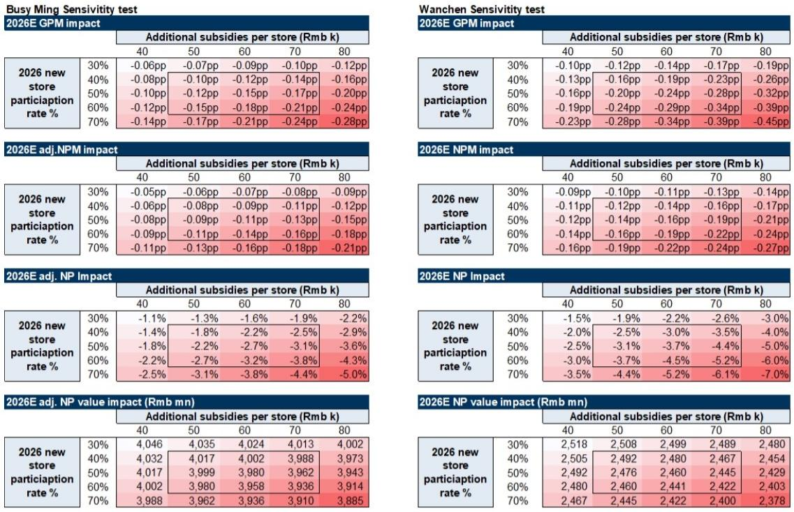
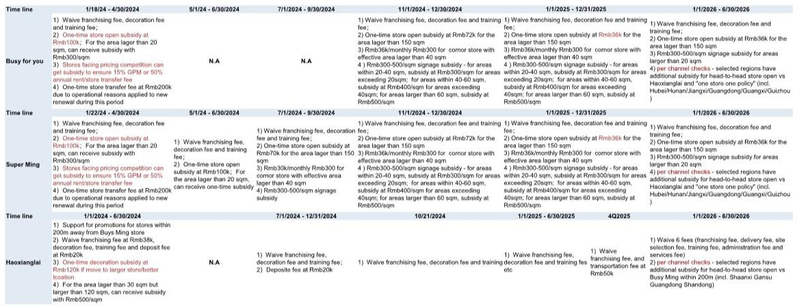
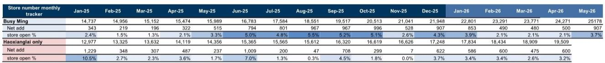

# 市场真正担心的不是补贴战，而是补贴战之后谁还能涨

过去两周，中国量贩零食赛道经历了典型的“好消息出尽、坏消息放大”的行情。两家头部公司——鸣鸣很忙和万辰集团，自年初至5月26日分别累计上涨66%和1%，显著跑赢同期下跌11%的MSCI中国必需消费指数。然而5月27日，两者股价单日回撤9%和6%，导火索是市场对区域性加盟补贴升级的担忧。

这份来自某外资投行的研报，恰恰选择在这个时点发出。它的核心判断不是“补贴战不足为惧”，而是给出了一套更值得推敲的叙事：市场低估了量贩零食行业结构性扩张的韧性，高估了本轮补贴的破坏力，同时忽略了一个更本质的变化——供应链价值正在被重新分配。

以下是我们从这份报告中提炼出的五个关键层次，每一个层次都在回答同一个问题：为什么当前的回调，可能是一次重新定价的机会，而不是趋势的逆转。

## 1. 本轮补贴不是2024年补贴战的翻版，而是一次有纪律的“定点防御”

市场最直接的担忧是：补贴战重来，利润又要被侵蚀。但报告通过渠道调研揭示了本轮补贴的三个关键区别。

第一，审批更严格。2024年的补贴政策相对开放，涵盖招牌、租金、促销补贴，且固定补贴金额在1万至1.2万元左右。而本轮补贴引入了绩效梯度评估——月度效率目标、门店间距、加盟商对门店陈列的投资等，都被纳入考核。补贴不是“开店就给”，而是“达标才给”。

第二，区域更聚焦。2024年的补贴是全国性的扩张工具，而本轮补贴主要集中在特定高竞争区域。鸣鸣很忙的补贴重点在华中与华南——湖南、贵州、湖北、江西、广东；万辰则主要聚焦陕西等选择性区域。这不是全面战争，而是“定点防御”。

第三，评估逻辑变了。报告指出，2024年之后，头部企业已经吸取了教训，不再允许加盟商单纯为拿补贴而开店。当前ROI评估的核心已转向回本周期和选址质量，而非开店数量本身。

这意味着什么？本轮补贴的本质，不是价格战的升级，而是头部企业用更精细化的工具来防止竞争对手在核心区域过度渗透。它更像是一种“竞争性防守”，而非“烧钱式进攻”。如果市场把两者混为一谈，就可能高估了对利润的实际冲击。

## 2. 利润影响的上限是5%至7%，而增长基数却是52%至90%

报告做了两组敏感性测试，这是全文最硬核的部分，也最值得投资者仔细推敲。

第一组测试假设：2026年新开门店数量在基准预测之上增加0至1200家，同时每店平均补贴（含常规补贴）在5万至7万元之间。结果显示，对鸣鸣很忙和万辰集团2026年毛利率的拖累最多为0.3和0.4个百分点，净利润率拖累约0.2个百分点，对应调整后净利润增速的拖累分别为-3.0%和-4.1%。

第二组测试假设：2026年新店中30%至70%卷入直接竞争，每店额外补贴4万至8万元。极端情形下，净利润增速拖累可达-5%和-7%。

这两个数字放在一起，才能看出问题的全貌。市场担忧的是“补贴会吃掉利润”，但报告揭示的真相是：即便在极端假设下，利润增速的拖累上限是5%至7%，而两家公司2026年的净利润增速基准预测分别是+52%和+90%。换句话说，补贴的潜在冲击，相对于增长本身，是一个数量级以下的扰动。

当然，这里有一个隐含假设需要验证：补贴是否会从“定点”演变为“全面”。报告认为不会，理由是头部企业已经建立了更理性的补贴审批机制。但这一判断的成立，取决于行业竞争格局是否继续保持双寡头稳态。如果第三梯队玩家选择激进扩张，局面可能不同。报告没有完全展开这一风险，值得持续跟踪。

## 3. 真正的增长故事不是补贴，而是4万亿市场里的渗透率翻倍

市场对补贴战的过度关注，可能让人忽略了报告中最核心的长期判断：中国量贩零食行业的门店天花板，可能从当前的不到6万家，最终达到约10万家。这意味着行业仍有接近翻倍的扩张空间。

支撑这一判断的逻辑有三层。

第一，存量门店增速并未放缓。截至2026年5月，鸣鸣很忙和万辰集团各自年内累计新开门店均已超过2500家，增速显著快于2025年上半年。这不是补贴驱动的虚火，而是行业渗透率提升的自然结果。

第二，单店模型仍在改善。报告指出，2026年一季度，在春节旺季、品类扩张和运营优化的共同作用下，头部企业的单店GMV趋势出现了积极信号。补贴并没有破坏单店经济性，反而可能通过加速优质选址的占领，间接巩固了单店模型。

第三，量贩零食正在重塑整个快消价值链。报告提到一个值得深思的现象：越来越多的食品饮料品牌正在主动加强与量贩零食渠道的合作。在一个消费整体偏弱的环境下，量贩零食成了品牌方为数不多的增长通道。这意味着，量贩零食不仅仅是一个零售渠道的崛起，更是整个供应链权力从品牌方向渠道方转移的过程。

如果这个判断成立，那么当前对补贴战的担忧，本质上是把“行业成长中的正常竞争成本”误读为“行业见顶的信号”。两者的区别，决定了投资框架的完全不同。

## 4. 报告尚未完全回答的关键问题：补贴的“二阶效应”可能比直接财务影响更值得关注

尽管报告对补贴的财务影响做了详尽的敏感性分析，但有一个问题它没有完全展开：补贴的“二阶效应”是什么？

所谓二阶效应，不是补贴花了多少钱，而是补贴改变了什么行为。具体来说，有两个方向值得追问。

第一，补贴是否改变了加盟商的选址偏好？如果补贴集中在特定区域，是否会导致加盟商过度集中于这些区域，从而在局部形成过度饱和，最终反过来压低单店收入？报告提到了“防止非理性的过度饱和”是补贴设计的目标之一，但实际效果仍需数据验证。

第二，补贴是否改变了头部企业的扩张节奏？如果补贴让鸣鸣很忙和万辰在核心区域提前完成了布局，那么这些区域的竞争格局是否会提前固化，从而让后来者更难进入？如果是，那么本轮补贴的战略价值可能远超其财务成本。但报告对此只是点到为止，没有做深入的情景推演。

这两个问题，是理解补贴长期影响的关键。它们决定了补贴是一次性的财务支出，还是一种改变行业竞争结构的战略投资。目前来看，答案可能更接近后者，但这需要更多的时间和数据来验证。

## 5. 投资者真正需要观察的，不是补贴金额，而是三个先行指标

基于报告的框架，我们认为投资者在当前阶段不需要纠结于补贴的具体金额，而应关注三个更前置的信号。

第一个信号：新店回本周期是否在拉长。报告明确指出，当前头部企业评估新店的核心指标是回本周期和选址质量。如果回本周期出现系统性拉长，那才是真正的危险信号，因为它意味着行业扩张遇到了需求瓶颈。反之，如果回本周期保持稳定或缩短，那么补贴只是扩张的成本，而不是负担。

第二个信号：单店GMV趋势是否持续改善。报告提到，2026年一季度单店GMV出现了积极信号，部分得益于品类扩张。品类扩张是一个被低估的变量——量贩零食正在从传统的零食向饮料、短保食品等更高频、更高客单价的品类延伸。如果这一趋势持续，单店模型的上限将被重新定义。

第三个信号：头部企业与品牌方的合作关系是否在深化。报告提到，F&B品牌正在主动寻求与量贩零食渠道的合作，因为这已成为品牌在消费疲软环境下的少数增长通道之一。如果这一趋势持续，量贩零食渠道的议价权将进一步增强，从而在供应链端获得更大的利润空间。这可能是比门店数量更重要的长期变量。

这三个信号，任何一个都比补贴金额更能说明行业的真实健康状况。但报告对此的讨论相对分散，没有形成一个系统的观察框架。这也正是完整报告的阅读价值所在——它提供了更详尽的渠道调研数据和品牌合作案例，可以帮助投资者构建自己的判断体系。

---

补贴战的担忧不会一夜消失，市场的定价偏差也不会立刻纠正。但这份报告提供了一个清晰的逻辑链条：如果将补贴视为行业成长中的正常竞争成本，而非行业见顶的信号，那么当前的回调可能提供了一个重新审视这个赛道的窗口。

当然，关键假设的验证需要时间，行业竞争格局的动态演变也需要持续跟踪。如果你对这个赛道的长期逻辑和短期风险感兴趣，欢迎来星球微信群里继续讨论。我们会在群里分享更多关于量贩零食行业的渠道调研笔记、品牌合作动态，以及这份完整报告的原始图表和敏感性分析模型。

Personal reading notes and learning share only. Not investment advice.

