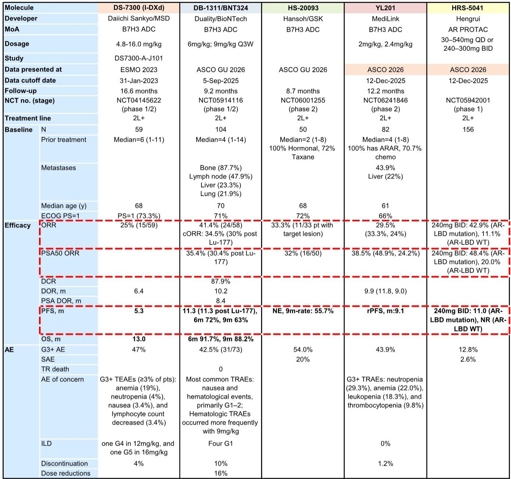
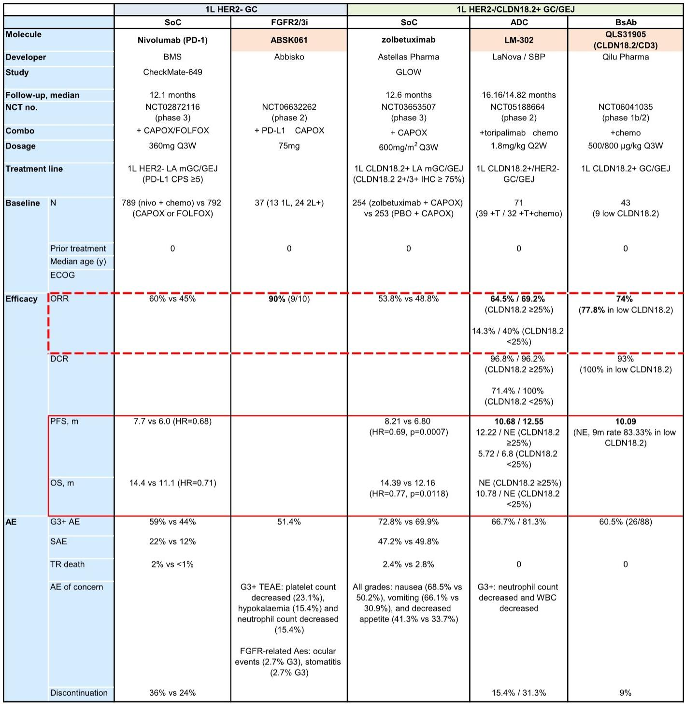
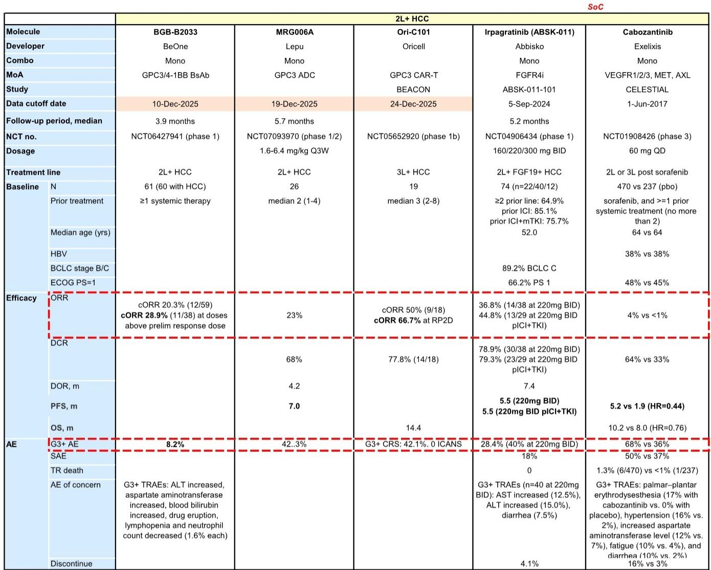

# NSCLC一线治疗格局正在被重新定义，但真正的赢家尚未完全浮现

ASCO 2026摘要数据已经解封。在大量中国药企披露的临床数据中，一个清晰的信号正在浮现：非小细胞肺癌（NSCLC）的一线治疗标准正在被系统性挑战，但这场格局重塑的赢家，可能不是那些拥有最高ORR的分子，而是那些能在疗效与安全性之间找到最优平衡、并同时具备规模化商业化能力的企业。

某外资投行最新发布的ASCO 2026预览报告，聚焦于中国药企在NSCLC、SCLC及其他实体瘤领域的关键数据更新。报告的核心判断是：NSCLC一线治疗正在从“PD-1单药+化疗”的标准化时代，进入一个由双抗、ADC和新型免疫疗法共同驱动的差异化竞争阶段。但报告也留下了一个尚未完全回答的问题——在这些令人振奋的早期数据背后，哪些分子真正具备改变临床指南的潜力，哪些只是统计意义上的“更好”？

以下是基于该报告的深度解析与延伸思考。

## 1. 1L NSCLC的竞争已从“PD-1+化疗”升级为“PD-1/VEGF双抗+化疗”的军备竞赛

从摘要数据来看，1L NSCLC的治疗格局正在经历一次结构性跃迁。过去五年，K药联合化疗（KEYNOTE-189）以48.3%的ORR和约22个月的mOS确立了标准地位。而如今，多个中国药企的双抗分子正在将这个基准线大幅上移。

最引人注目的是信达生物的IBI363（PD-1/IL-2α偏向双抗）。在联合化疗的1L治疗中，其采用了一种特殊的“诱导-维持”给药方案——首周期3mg/kg，后续降至1.5mg/kg。这一策略带来了81.8%的cORR，不仅显著高于K药的历史数据，也高于依沃西单抗（75.9%）和sac-TMT（70.2%）。更重要的是，这种给药方案在提高ORR的同时，还改善了耐受性：G3+ TEAE为65.2%，远低于3mg/kg固定剂量的93.1%。

这里的关键洞察不在于数字本身，而在于给药策略的优化正在成为差异化竞争的重要手段。报告指出，这种“诱导-维持”方案的设计初衷是获得更平衡的治疗指数，但其背后的机制仍值得深入讨论——为什么降低剂量反而带来更高的ORR？这是否意味着IL-2通路在初始高剂量激活后，后续只需要维持性刺激即可持续抗肿瘤免疫？

对于产业决策者而言，这意味着未来1L NSCLC的竞争不再仅仅是分子的选择，更是给药方案和生物标志物策略的竞争。那些能够通过灵活的剂量设计来优化治疗指数的公司，将在商业化竞争中占据明显优势。

## 2. 安全性数据的隐性价值正在被市场低估

在比较不同分子的疗效数据时，市场往往过度关注ORR和PFS，而忽视了安全性数据的长期价值。然而，从报告的详细数据来看，安全性差异正在成为决定临床实践采纳速度的关键变量。

以BioNTech的pumitamig（PM80002，PD-L1/VEGF-A双抗）为例，其联合化疗的ORR为70%，与sac-TMT持平，略低于依沃西单抗。但它的G3+ TRAE仅为44.2%，远低于依沃西单抗的63.9%和sac-TMT的55.3%。在真实世界临床中，这种安全性优势可能转化为更高的完成率和更低的停药率，从而在长期OS数据上实现反超。

报告特别提到了三生制药的SSGJ707（PD-1/VEGF双抗）在15.2个月的随访后更新的安全性数据：G3+ TRAE为42.2%，其中VEGF相关的G3+ AE率为18.1%，高于依沃西单抗的10.2%。虽然SSGJ707的cORR（67.6%）和mPFS（12.4个月）在数值上具有竞争力，但较高的VEGF毒性可能会限制其在真实世界中的使用，尤其是对于有出血风险或心血管合并症的患者。

对于投资者而言，这意味着在评估1L NSCLC的竞争格局时，不能简单地将ORR作为唯一指标。一个安全性更优但ORR略低的分子，在长期OS数据和真实世界证据（RWE）的支持下，完全有可能侵蚀高ORR分子的市场份额。目前市场尚未对这些安全性差异进行充分定价。

## 3. SCLC治疗格局正在被DLL3靶向疗法重塑，但基线差异是关键未解问题

在SCLC领域，报告最值得关注的更新来自泽璟制药的alveltamig（ZG006，DLL3/DLL3/CD3三特异性T细胞衔接器）。在3L+ SCLC中，10mg和30mg剂量的12个月OS率分别为65.9%和59.2%，暗示中位OS可能达到15-20个月，显著优于tarlatamab在2L SCLC中的13.6个月。

在2L+ SCLC中，alveltamig的mDOR达到12.6个月（vs. ZL-1310的6.1个月，tarlatamab的6.9个月），12个月PFS率为50.5%（vs. ZL-1310的mPFS 5.4个月，tarlatamab的4.2个月）。这些数据在数值上具有明显的差异化优势。

然而，这里存在一个尚未完全回答的关键问题：基线特征的差异。alveltamig的入组患者中，45.8%（10mg组）和37.5%（30mg组）接受过3线及以上治疗，而tarlatamab的DeLLphi-304试验中，患者仅接受过1线治疗。理论上，更后线的患者预后更差，但alveltamig却显示出更优的生存数据，这进一步强化了其潜力。但同时，alveltamig的脑转移患者比例（约29%）低于tarlatamab（44%），这可能对OS结果产生正向偏倚。

报告提示，需要仔细分析alveltamig ph1/2试验的完整患者基线数据，才能准确评估其在竞争格局中的真实定位。对于投资者而言，这意味着当前的市场定价尚未完全反映alveltamig的潜力，但同时也存在因基线差异导致的过度乐观风险。

## 4. 早期数据令人振奋，但“从ORR到OS”的验证鸿沟尚未跨越

报告披露的多个早期阶段数据（ph1/ph2）显示出令人鼓舞的疗效信号，但一个根本性的问题仍然存在：ORR的提升能否转化为OS的改善？

在1L NSCLC中，IBI363的81.8% cORR、基石药业CS2009的90% ORR（小样本，N=10）都显著超越了现有标准。但在肿瘤治疗中，ORR与OS之间的相关性并非线性关系，尤其是在免疫治疗时代。高ORR可能反映的是快速应答，而OS改善则需要更长时间的随访来验证。

报告没有完全展开的一个关键点是：这些高ORR是否伴随着持久的应答？在IBI363的数据中，由于中位随访时间仅5.8个月，DOR尚未成熟。如果高ORR伴随着短DOR，那么其临床意义将大打折扣。

对于投资者而言，这意味着在现阶段对IBI363和CS2009进行估值时，需要给予较大的不确定性折价。真正的价值验证节点是ASCO 2026会议上披露的更新数据，特别是DOR和PFS/OS的成熟度。

## 5. 报告尚未完全回答的关键问题：谁能在商业化阶段实现“规模-议价权”的正向循环

报告在技术层面提供了丰富的数据分析，但一个更深层次的竞争问题未能充分展开：在这些分子中，哪些企业具备将其临床优势转化为商业成功的能力？

在1L NSCLC这个百亿美元级别的市场中，即使拥有最优的临床数据，商业化成功也取决于多个非临床因素：生产规模与成本控制、与KOL和临床指南制定者的关系管理、医保谈判策略、以及后续适应症的扩展路径。

以sac-TMT为例，其由科伦博泰与默沙东合作开发，后者拥有全球最成熟的肿瘤商业化网络。而依沃西单抗由康方生物与Summit合作，Summit在美国市场的商业化能力尚未得到验证。IBI363由信达生物自主开发，其在中国市场的商业化能力已通过信迪利单抗得到验证，但海外市场仍存在不确定性。

报告没有明确讨论的一个判断是：在1L NSCLC这个即将进入“红海”的市场中，最终胜出的可能不是拥有最佳数据的分子，而是拥有最强商业化基础设施的企业。这一判断需要结合各公司的商业化团队、生产能力、以及全球合作伙伴关系来进一步验证。

## 6. 一个更系统的观察框架：如何评估ASCO 2026数据的真实投资含义

基于报告的解析，我们建议读者在评估ASCO 2026数据时，采用以下多维框架，而不是简单地比较ORR：

第一，疗效-安全性平衡指数。将ORR与G3+ AE率进行联合评估，计算“每单位毒性带来的疗效增量”。一个ORR 70%但G3+ AE 44%的分子，可能比ORR 76%但G3+ AE 64%的分子具有更好的临床价值。

第二，基线校正后的疗效比较。在比较不同试验的数据时，必须对入组患者的基线特征（如PD-L1表达水平、脑转移比例、既往治疗线数）进行校正。未校正的跨试验比较具有误导性。

第三，给药方案的创新性。是否采用了灵活的剂量设计？是否探索了生物标志物驱动的人群选择？这些因素将决定分子在真实世界中的适用性和可及性。

第四，商业化准备的成熟度。从临床数据到商业成功，中间存在巨大的执行鸿沟。企业是否拥有足够的产能、销售团队和市场准入能力？

第五，适应症扩展的广度。一个在1L NSCLC中表现优异的分子，如果能够快速扩展至其他实体瘤（如SCLC、胃癌、肝癌），其峰值销售潜力将远高于单一适应症分子。

---

上述观察框架中的许多维度，在原始报告中仅有部分展开。例如，报告提到了alveltamig的基线特征差异，但没有量化其对OS比较的影响；报告展示了IBI363的给药方案创新，但没有讨论其背后的免疫学机制。这些未解问题，恰恰是深入理解ASCO 2026数据投资含义的关键。

我们将在社群中继续讨论这些悬而未决的问题：如何量化基线差异对疗效比较的影响？哪些分子最有可能在商业化阶段实现“规模-议价权”的正向循环？以及，报告未提及的下一代分子（如PROTAC、CAR-T在实体瘤中的应用）将对现有格局产生怎样的颠覆性影响？

欢迎来星球微信群里继续讨论，我们将围绕上述问题展开更深入的交流，并分享完整的原始报告图表与数据。

Personal reading notes and learning share only. Not investment advice.

