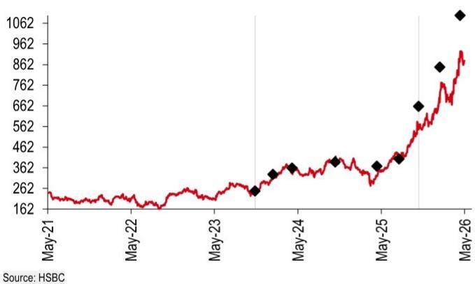
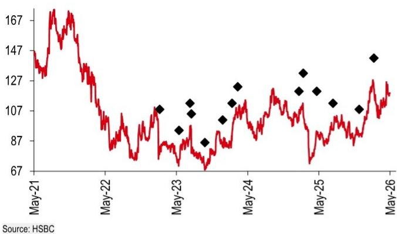
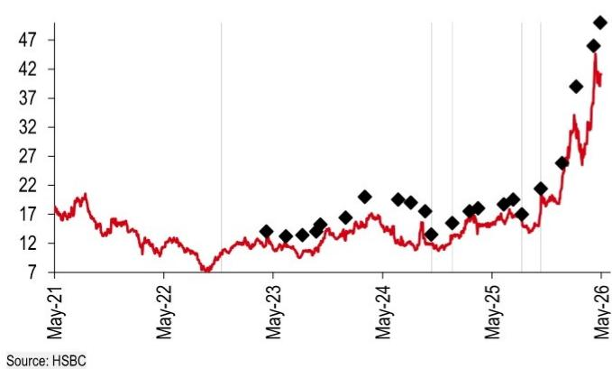
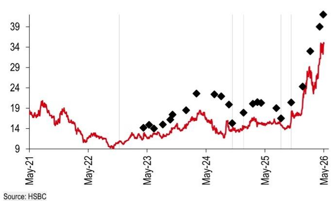

# Powering AI

# Positive read-across from Cummins and Deere

# Equities Machinery

Global

- CMI saw continued high back-up power demand & tight prime power supply – positive read-across for CAT and Weichai   
- AIDC buildout is lifting US construction demand – positive read-across for CAT and Techtronic   
- We like CAT (prime power upside), Weichai (prime power + SOFC potential), and Techtronic (AIDC construction demand)

Cummins (CMI US, USD638.78, Not rated) hosted its Capital Markets Day, and Deere (DE US, USD531.35, Hold) hosted its 2Q26 earnings call on 21 May. Key messages further validate our positive view on CAT, Weichai and Techtronic.

Strong AIDC power demand: On backup power, CMI continued to see strong demand in the US and China. 95% of CMI power gen business is behind-the-meter backup power and it is taking AIDC backup power orders for 2028 deliveries. Therefore, CMI announced a USD450m investment to add 20GW high-horsepower engine and genset capacity, reaching total 55 GW by 2030. On prime power, we expect the tight supply to persist to at least 2028. CMI announced the development of a 4MW gas engine solution with an expected 2028 launch, based on its existing HSK78 platform (now 1.6-2MW). We see it as a positive read-across for CAT (engine offerings up to 10MW with leading market positions) and Weichai (targeting deliveries of 2.5-3MW gas gensets to the US from 4Q26).

AIDC buildout lifting US construction demand: Despite investor concerns around higher interest rates, Deere's upgraded construction outlook reaffirmed steady US construction demand, especially driven by strong AIDC and infrastructure buildout. Deere raised its FY26 Construction & Forestry net sales growth guidance to +20% vs +15% previously. Its order book is at the highest level since April 2024, with over 80% of FY26 production slots filled. Deere also noted data center construction spend is expected to exceed USD100m in 2026, with double-digit growth into 2027, supporting equipment demand across (i) large-scale site preparation (construction contractors) and (ii) grid/cooling-related works (water and utility contractors). We see it as a positive read-across for CAT's Construction Industries and TTI's tool demand.

Reiterate Buy ratings on CAT, Weichai and Techtronic: We like CAT for its multi-year AIDC prime power upside and strong market position. We like Weichai for its prime power and SOFC potential. We like that Techtronic benefits from AIDC buildout (11% of TTI's sales). Key downside risks: slower AIDC buildout, higher rates.

Our global coverage of companies that provide power equipment for AIDCs 

<table><tr><td>Company</td><td>Ticker</td><td>Currency</td><td>Current price</td><td>TP Unchanged</td><td>Rating Unchanged</td><td>Upside/ downside</td><td>Market cap (USDm)</td><td>3m ADTV (USDm)</td><td>P/B 2026e</td><td>P/E 2026e</td><td>ROE 2026e</td></tr><tr><td>Caterpillar</td><td>CAT US</td><td>USD</td><td>879.89</td><td>1,100.00</td><td>Buy</td><td>25.0%</td><td>405,270</td><td>522.5</td><td>21.7</td><td>36.3</td><td>44.1</td></tr><tr><td>Weichai Power – H</td><td>2338 HK</td><td>HKD</td><td>41.12</td><td>50.00</td><td>Buy</td><td>21.6%</td><td>44,043</td><td>95.0</td><td>3.6</td><td>21.1</td><td>12.2</td></tr><tr><td>Weichai Power – A</td><td>000338 CH</td><td>CNY</td><td>34.01</td><td>42.00</td><td>Buy</td><td>23.5%</td><td>44,043</td><td>523.9</td><td>3.4</td><td>10.1</td><td>12.2</td></tr><tr><td>Techtronic</td><td>0669 HK</td><td>HKD</td><td>118.80</td><td>142.00</td><td>Buy</td><td>19.5%</td><td>27,745</td><td>94.0</td><td>3.6</td><td>19.9</td><td>19.1</td></tr></table>

Source: LSEG Eikon, HSBC estimates. Priced as of close at 22 May 2026

# Disclosures & Disclaimer

This report must be read with the disclosures and the analyst certifications in the Disclosure appendix, and with the Disclaimer, which forms part of it.

# Helen Fang\*

Head of Industrials Research, Asia Pacific

The Hongkong and Shanghai Banking Corporation Limited helen.c.fang@hsbc.com.hk

+852 2996 6942

# Sunny SUN\*

Associate, Asia Industrials

The Hongkong and Shanghai Banking Corporation Limited
sunny.x.y.sun@hsbc.com.hk

+852 3945 3230

# Kenneth Chin\*, CFA

Associate, Asia Industrials

The Hongkong and Shanghai Banking Corporation Limited
kenneth.t.k.chin@hsbc.com.hk

+852 2822 4521

# Jennifer Pan\*

Associate

Guangzhou

\* Employed by a non-US affiliate of HSBC Securities (USA) Inc, and is not registered/qualified pursuant to FINRA regulations

# HSBC Funding the Future Survey

# Sentiment, AI and Private Credit

Click to view

Issuer of report: The Hongkong and Shanghai Banking Corporation Limited

View HSBC Global Investment Research at:

https://www.research.hsbc.com

Valuation and risks 

<table><tr><td colspan="2"></td><td>Valuation</td><td>Risks</td></tr><tr><td>Caterpillar CAT US</td><td rowspan="2">Current price: USD879.89Target price: USD1,100.00Up/downside: +25.0%</td><td rowspan="2">Methodology: DCF valuationAssumptions:We maintain terminal growth at 3%, to reflect the prolonged AIDC power story. We use a Bloomberg-sourced beta of 1.04 as of 4 May 2026 (unchanged), covering the past 10 years. Risk-free rate of 4.25% and equity risk premium of 4.0%, as per HSBC&#x27;s equity strategy team; cost of debt of 4.1%, target gearing ratio of 45%, tax rate of 23%, WACC remains 6.1%. (all unchanged)Factoring in our estimate changes, our rounded DCF-derived target price is USD1,100 (unchanged), which implies c25% upside and 38x 2027e P/E. We maintain Buy as we think CAT has an indispensable position in AIDC buildouts.Helen Fang* | helen.c.fang@hsbc.com.hk | +852 2996 6942</td><td rowspan="2">Downside risks:(1) Worse-than-expected economic slowdown;(2) slower AIDC buildout;(3) global competition is more intense than expected; and (4) worse-than-expected tariff impact on costs.</td></tr><tr><td>Buy</td></tr><tr><td>Weichai Power 2338 HK/000338 CH</td><td rowspan="2">Current price:HKD41.12RMB34.01Target price:HKD50.00RMB42.00Upside:H: +23.5%A: +19.5%</td><td rowspan="2">Methodology: Sum-of-the parts approach and target PE multipleAssumptions: We use a sum-of-the-parts approach to value Weichai. We illustrate our valuation for each part in the table below.We maintain our rounded H-share target price at HKD50.00 (unchanged). We use an A/H premium of -2% (unchanged), the YTD average, to factor in the converging A/H premium. Thus, we also maintain our rounded A-share target price at RMB42.00 (unchanged).Our H/A-share target prices imply c24%/20% upside, respectively, therefore we maintain our Buy/Buy ratings. We are positive on its AIDC power business growth.Helen Fang* | helen.c.fang@hsbc.com.hk | +852 2996 6942</td><td rowspan="2">Downside risks: unexpected slowdown in AIDC buildout, softer large engine sales (especially gas gensets for prime power and diesel engines for backup power), delayed SOFC deliveries and HDT renewals, and hawkish Fed.</td></tr><tr><td>Buy/Buy</td></tr><tr><td>Techtronic 669 HK</td><td>Current price:HKD118.80Target price:HKD142.00Up/downside: +19.5%</td><td>Methodology: Target P/E multiple.Assumptions: We value TTI using a 20.5x target forward P/E multiple, the average during 2024, when EPS grew 15%, similar to HSBC 2025-28e EPS CAGR of 16%.Applying our target P/E of 20.5x to our 2027 EPS estimate, we derive a target price of HKD142 (unchanged), implying c20% upside. We retain our Buy rating as we believe strong Milwaukee end-market demand should continue to support growth, and margin expansion should accelerate from 2026e.Helen Fang* | helen.c.fang@hsbc.com.hk | +852 2996 6942</td><td>Downside risks: 1) Stronger-than-expected margin pressure if higher-than-expected tariff is levied on Vietnam or Mexico in the future; 2) a slowdown in data centre/ utilities/ infrastructure construction demand, slowdown down professional tool sales; 3) further slowdown in non-core power tool products or floorcare demand; 4) slower-than-expected growth in overseas markets; and 5) higher-than-expected SG&amp;A expenses slowing margin expansion</td></tr></table>

\* Employed by a non-US affiliate of HSBC Securities (USA) Inc, and is not registered/ qualified pursuant to FINRA regulations
Priced at 22 May 2026
Source: HSBC estimates

Weichai Power: SOTP approach 

<table><tr><td></td><td>Valuation method</td><td>Estimate year</td><td>% contribution to TP</td><td>Valuation assumptions/rationale</td></tr><tr><td>HDT-related and other business</td><td>PE</td><td>2027e</td><td>24%</td><td>We value HDT-related and other business using a target PE for 2027e of 9x, the average PE for the last downcycle to reflect the negative impact from fierce HDT competition and electric adoption (unchanged). Applying our target PE multiple to our EPS for 2027e of RMB1.13 (unchanged) and using HSBC&#x27;s end-2026 HKD-RMB rate of 1.17 (unchanged) renders its valuation per share to Weichai&#x27;s valuation, i.e., HKD11.59/RMB10.19 (unchanged).</td></tr><tr><td>Large diameter engine for data centres</td><td>PE</td><td>2027e</td><td>54%</td><td>We value the large diameter engine for the data centre business using a target PE for 2027e of 31x (unchanged), the market cap weighted average 1-year forward PE of the key comparables, as of 21 May 2026. Applying our target PE multiple to our EPS for 2027e of RMB0.75 (unchanged) and using HSBC&#x27;s end-2026 HKD-RMB rate of 1.17 (unchanged) renders its valuation per share to Weichai&#x27;s valuation, i.e., HKD27.27/RMB23.25 (unchanged).</td></tr><tr><td>SOFC business</td><td>PS</td><td>2027e</td><td>11%</td><td>We use Bloom Energy&#x27;s PS ratio of 13.9x as of 21 May 2026 (unchanged) to value Weichai&#x27;s SOFC business, as BE is a leader in the market. Applying our target PS multiple to our sales for 2027e of RMB2,975m (unchanged) and using HSBC&#x27;s end-2026 HKD-RMB rate of 1.17 (unchanged) renders its valuation per share to Weichai&#x27;s valuation, i.e., HKD5.57/RMB4.75 (unchanged).</td></tr><tr><td>Smart logistics business - KION</td><td>Bloomberg consensus TP</td><td>2027e</td><td>8%</td><td>We value Weichai&#x27;s 46.52% stake in Kion (KGX GR, EUR44.19, not rated) using the Bloomberg consensus target price of EUR60.61 as of 21 May 2026 (unchanged), multiplying Kion&#x27;s number of outstanding shares and using HSBC&#x27;s end-2026 EUR-RMB rate of 7.85 (unchanged). Then dividing by Weichai&#x27;s number of outstanding shares, we derive Kion&#x27;s valuation per share contributing to Weichai&#x27;s valuation, i.e., HKD3.91/RMB3.33 (unchanged).</td></tr><tr><td>Agricultural machinery business - Lovol</td><td>PE</td><td>2027e</td><td>3%</td><td>We value the agricultural machinery business using a target PE for 2027e of 14.8x (unchanged), the 1-year forward PE of First Tractor (601038 CH, RMB12.68, not rated) as of 21 May 2026. Applying our target PE multiple to our EPS for 2027e of RMB0.08 (unchanged) and using HSBC&#x27;s end-2026 HKD-RMB rate of 1.17 (unchanged) renders its valuation per share to Weichai&#x27;s valuation, i.e., HKD1.43/RMB1.22 (unchanged).</td></tr></table>

Source: Bloomberg, HSBC estimates. Priced at 22 May 2026

# Disclosure appendix

# Analyst Certification

The following analyst(s), economist(s), or strategist(s) who is(are) primarily responsible for this report, including any analyst(s) whose name(s) appear(s) as author of an individual section or sections of the report and any analyst(s) named as the covering analyst(s) of a subsidiary company in a sum-of-the-parts valuation certifies(y) that the opinion(s) on the subject security(ies) or issuer(s), any views or forecasts expressed in the section(s) of which such individual(s) is(are) named as author(s), and any other views or forecasts expressed herein, including any views expressed on the back page of the research report, accurately reflect their personal view(s) and that no part of their compensation was, is or will be directly or indirectly related to the specific recommendation(s) or views contained in this research report: Helen Fang, Sunny SUN and Kenneth Chin, CFA

# Important disclosures

# Equities: Stock ratings and basis for financial analysis

HSBC and its affiliates, including the issuer of this report ("HSBC") believes an investor's decision to buy or sell a stock should depend on individual circumstances such as the investor's existing holdings, risk tolerance and other considerations and that investors utilise various disciplines and investment horizons when making investment decisions. Ratings should not be used or relied on in isolation as investment advice. Different securities firms use a variety of ratings terms as well as different rating systems to describe their recommendations and therefore investors should carefully read the definitions of the ratings used in each research report. Further, investors should carefully read the entire research report and not infer its contents from the rating because research reports contain more complete information concerning the analysts' views and the basis for the rating.

# From 23rd March 2015 HSBC has assigned ratings on the following basis:

The target price is based on the analyst's assessment of the stock's actual current value, although we expect it to take six to 12 months for the market price to reflect this. When the target price is more than $20\%$ above the current share price, the stock will be classified as a Buy; when it is between $5\%$ and $20\%$ above the current share price, the stock may be classified as a Buy or a Hold; when it is between $5\%$ below and $5\%$ above the current share price, the stock will be classified as a Hold; when it is between $5\%$ and $20\%$ below the current share price, the stock may be classified as a Hold or a Reduce; and when it is more than $20\%$ below the current share price, the stock will be classified as a Reduce.

Our ratings are re-calibrated against these bands at the time of any 'material change' (initiation or resumption of coverage, change in target price or estimates).

Upside/Downside is the percentage difference between the target price and the share price.

# Prior to this date, HSBC's rating structure was applied on the following basis:

For each stock we set a required rate of return calculated from the cost of equity for that stock's domestic or, as appropriate, regional market established by our strategy team. The target price for a stock represented the value the analyst expected the stock to reach over our performance horizon. The performance horizon was 12 months. For a stock to be classified as Overweight, the potential return, which equals the percentage difference between the current share price and the target price, including the forecast dividend yield when indicated, had to exceed the required return by at least 5 percentage points over the succeeding 12 months (or 10 percentage points for a stock classified as Volatile\*). For a stock to be classified as Underweight, the stock was expected to underperform its required return by at least 5 percentage points over the succeeding 12 months (or 10 percentage points for a stock classified as Volatile\*). Stocks between these bands were classified as Neutral.

\*A stock was classified as volatile if its historical volatility had exceeded $40\%$ , if the stock had been listed for less than 12 months (unless it was in an industry or sector where volatility is low) or if the analyst expected significant volatility. However, stocks which we did not consider volatile may in fact also have behaved in such a way. Historical volatility was defined as the past month's average of the daily 365-day moving average volatilities. In order to avoid misleadingly frequent changes in rating, however, volatility had to move 2.5 percentage points past the $40\%$ benchmark in either direction for a stock's status to change.

# Rating distribution for long-term investment opportunities

As of 31 March 2026, the distribution of all independent ratings published by HSBC is as follows: 

<table><tr><td>Buy</td><td>59%</td><td>(12% of these provided with Investment Banking Services in the past 12 months)</td></tr><tr><td>Hold</td><td>36%</td><td>(12% of these provided with Investment Banking Services in the past 12 months)</td></tr><tr><td>Sell</td><td>6%</td><td>(6% of these provided with Investment Banking Services in the past 12 months)</td></tr></table>

For the purposes of the distribution above the following mapping structure is used during the transition from the previous to current rating models: under our previous model, Overweight = Buy, Neutral = Hold and Underweight = Sell; under our current model Buy = Buy, Hold = Hold and Reduce = Sell. For rating definitions under both models, please see “Stock ratings and basis for financial analysis” above.

For the distribution of non-independent ratings published by HSBC, please see the disclosure page available at http://www.hsbcnet.com/gbm/financial-regulation/investment-recommendations-disclosures.

Share price and rating changes for long-term investment opportunities   
Caterpillar Inc (CAT.N) share price performance USD Vs HSBC rating history   

line

| Date   | Value |
|--------|-------|
| May-21 | 262   |
| May-22 | 262   |
| May-23 | 262   |
| May-24 | 362   |
| May-25 | 362   |
| May-26 | 1062  |

Techtronic Industries (0669.HK) share price performance HKD Vs HSBC rating history

line

| Date   | Value |
|--------|-------|
| May-21 | 167   |
| May-22 | 87    |
| May-23 | 107   |
| May-24 | 127   |
| May-25 | 147   |
| May-26 | 167   |

Rating & target price history 

<table><tr><td>From</td><td>To</td><td>Date</td><td>Analyst</td></tr><tr><td>N/A</td><td>Hold</td><td>19 Nov 2023</td><td>Helen Fang</td></tr><tr><td>Hold</td><td>Buy</td><td>05 Nov 2025</td><td>Helen Fang</td></tr><tr><td>Target price</td><td>Value</td><td>Date</td><td>Analyst</td></tr><tr><td>Price 1</td><td>250</td><td>19 Nov 2023</td><td>Helen Fang</td></tr><tr><td>Price 2</td><td>330</td><td>06 Feb 2024</td><td>Helen Fang</td></tr><tr><td>Price 3</td><td>360</td><td>29 Apr 2024</td><td>Helen Fang</td></tr><tr><td>Price 4</td><td>390</td><td>04 Nov 2024</td><td>Helen Fang</td></tr><tr><td>Price 5</td><td>370</td><td>06 May 2025</td><td>Helen Fang</td></tr><tr><td>Price 6</td><td>405</td><td>11 Aug 2025</td><td>Helen Fang</td></tr><tr><td>Price 7</td><td>660</td><td>05 Nov 2025</td><td>Helen Fang</td></tr><tr><td>Price 8</td><td>850</td><td>05 Feb 2026</td><td>Helen Fang</td></tr><tr><td>Price 9</td><td>1100</td><td>05 May 2026</td><td>Helen Fang</td></tr><tr><td colspan="4">Source: HSBC</td></tr></table>

Rating & target price history 

<table><tr><td>From</td><td>To</td><td>Date</td><td>Analyst</td></tr><tr><td>Hold</td><td>Buy</td><td>15 Jul 2020</td><td>Helen Fang</td></tr><tr><td>Target price</td><td>Value</td><td>Date</td><td>Analyst</td></tr><tr><td>Price 1</td><td>108.00</td><td>01 Mar 2023</td><td>Helen Fang</td></tr><tr><td>Price 2</td><td>94.00</td><td>08 Jun 2023</td><td>Helen Fang</td></tr><tr><td>Price 3</td><td>112.00</td><td>03 Aug 2023</td><td>Helen Fang</td></tr><tr><td>Price 4</td><td>105.00</td><td>10 Aug 2023</td><td>Helen Fang</td></tr><tr><td>Price 5</td><td>86.00</td><td>19 Oct 2023</td><td>Helen Fang</td></tr><tr><td>Price 6</td><td>101.00</td><td>18 Jan 2024</td><td>Helen Fang</td></tr><tr><td>Price 7</td><td>112.00</td><td>06 Mar 2024</td><td>Helen Fang</td></tr><tr><td>Price 8</td><td>123.00</td><td>04 Apr 2024</td><td>Helen Fang</td></tr><tr><td>Price 9</td><td>120.00</td><td>12 Feb 2025</td><td>Helen Fang</td></tr><tr><td>Price 10</td><td>132.00</td><td>06 Mar 2025</td><td>Helen Fang</td></tr><tr><td>Price 11</td><td>120.00</td><td>15 May 2025</td><td>Helen Fang</td></tr><tr><td>Price 12</td><td>112.00</td><td>06 Aug 2025</td><td>Helen Fang</td></tr><tr><td>Price 13</td><td>108.00</td><td>18 Dec 2025</td><td>Helen Fang</td></tr><tr><td>Price 14</td><td>142.00</td><td>04 Mar 2026</td><td>Helen Fang</td></tr><tr><td colspan="4">Source: HSBC</td></tr></table>

Weichai Power (2338.HK) share price performance HKD Vs HSBC rating history   

line

| Date   | Value |
|--------|-------|
| May-21 | 17    |
| May-22 | 12    |
| May-23 | 13    |
| May-24 | 18    |
| May-25 | 19    |
| May-26 | 47    |

Weichai Power A (000338.SZ) share price performance CNY Vs HSBC rating history   

line

| Date   | Value |
|--------|-------|
| May-21 | 18.0  |
| May-22 | 14.0  |
| May-23 | 14.0  |
| May-24 | 24.0  |
| May-25 | 19.0  |
| May-26 | 39.0  |

Rating & target price history 

<table><tr><td>From</td><td>To</td><td>Date</td><td>Analyst</td></tr><tr><td>Hold</td><td>Buy</td><td>05 Dec 2022</td><td>Helen Fang</td></tr><tr><td>Buy</td><td>Hold</td><td>04 Nov 2024</td><td>Helen Fang</td></tr><tr><td>Hold</td><td>Buy</td><td>13 Jan 2025</td><td>Helen Fang</td></tr><tr><td>Buy</td><td>Hold</td><td>02 Sep 2025</td><td>Helen Fang</td></tr><tr><td>Hold</td><td>Buy</td><td>05 Nov 2025</td><td>Helen Fang</td></tr><tr><td>Target price</td><td>Value</td><td>Date</td><td>Analyst</td></tr><tr><td>Price 1</td><td>14.00</td><td>03 May 2023</td><td>Helen Fang</td></tr><tr><td>Price 2</td><td>13.20</td><td>07 Jul 2023</td><td>Helen Fang</td></tr><tr><td>Price 3</td><td>13.40</td><td>01 Sep 2023</td><td>Helen Fang</td></tr><tr><td>Price 4</td><td>14.00</td><td>17 Oct 2023</td><td>Helen Fang</td></tr><tr><td>Price 5</td><td>15.20</td><td>31 Oct 2023</td><td>Helen Fang</td></tr><tr><td>Price 6</td><td>16.40</td><td>23 Jan 2024</td><td>Helen Fang</td></tr><tr><td>Price 7</td><td>20.00</td><td>27 Mar 2024</td><td>Helen Fang</td></tr><tr><td>Price 8</td><td>19.50</td><td>16 Jul 2024</td><td>Helen Fang</td></tr><tr><td>Price 9</td><td>19.00</td><td>27 Aug 2024</td><td>Helen Fang</td></tr><tr><td>Price 10</td><td>17.50</td><td>15 Oct 2024</td><td>Helen Fang</td></tr><tr><td>Price 11</td><td>13.50</td><td>04 Nov 2024</td><td>Helen Fang</td></tr><tr><td>Price 12</td><td>15.50</td><td>13 Jan 2025</td><td>Helen Fang</td></tr><tr><td>Price 13</td><td>17.50</td><td>12 Mar 2025</td><td>Helen Fang</td></tr><tr><td>Price 14</td><td>18.00</td><td>09 Apr 2025</td><td>Helen Fang</td></tr><tr><td>Price 15</td><td>18.70</td><td>04 Jul 2025</td><td>Helen Fang</td></tr><tr><td>Price 16</td><td>19.50</td><td>04 Aug 2025</td><td>Helen Fang</td></tr><tr><td>Price 17</td><td>17.00</td><td>02 Sep 2025</td><td>Helen Fang</td></tr><tr><td>Price 18</td><td>21.40</td><td>05 Nov 2025</td><td>Helen Fang</td></tr><tr><td>Price 19</td><td>25.80</td><td>15 Jan 2026</td><td>Helen Fang</td></tr><tr><td>Price 20</td><td>39.00</td><td>03 Mar 2026</td><td>Helen Fang</td></tr><tr><td>Price 21</td><td>46.00</td><td>30 Apr 2026</td><td>Helen Fang</td></tr><tr><td>Price 22</td><td>50.00</td><td>22 May 2026</td><td>Helen Fang</td></tr></table>

Source: HSBC

Rating & target price history 

<table><tr><td>From</td><td>To</td><td>Date</td><td>Analyst</td></tr><tr><td>Hold</td><td>Buy</td><td>05 Dec 2022</td><td>Helen Fang</td></tr><tr><td>Buy</td><td>Hold</td><td>04 Nov 2024</td><td>Helen Fang</td></tr><tr><td>Hold</td><td>Buy</td><td>13 Jan 2025</td><td>Helen Fang</td></tr><tr><td>Buy</td><td>Hold</td><td>02 Sep 2025</td><td>Helen Fang</td></tr><tr><td>Hold</td><td>Buy</td><td>05 Nov 2025</td><td>Helen Fang</td></tr><tr><td>Target price</td><td>Value</td><td>Date</td><td>Analyst</td></tr><tr><td>Price 1</td><td>14.20</td><td>03 May 2023</td><td>Helen Fang</td></tr><tr><td>Price 2</td><td>14.90</td><td>07 Jun 2023</td><td>Helen Fang</td></tr><tr><td>Price 3</td><td>14.00</td><td>07 Jul 2023</td><td>Helen Fang</td></tr><tr><td>Price 4</td><td>15.00</td><td>01 Sep 2023</td><td>Helen Fang</td></tr><tr><td>Price 5</td><td>16.20</td><td>17 Oct 2023</td><td>Helen Fang</td></tr><tr><td>Price 6</td><td>17.40</td><td>31 Oct 2023</td><td>Helen Fang</td></tr><tr><td>Price 7</td><td>18.50</td><td>23 Jan 2024</td><td>Helen Fang</td></tr><tr><td>Price 8</td><td>22.60</td><td>27 Mar 2024</td><td>Helen Fang</td></tr><tr><td>Price 9</td><td>22.40</td><td>16 Jul 2024</td><td>Helen Fang</td></tr><tr><td>Price 10</td><td>21.90</td><td>27 Aug 2024</td><td>Helen Fang</td></tr><tr><td>Price 11</td><td>19.90</td><td>15 Oct 2024</td><td>Helen Fang</td></tr><tr><td>Price 12</td><td>15.30</td><td>04 Nov 2024</td><td>Helen Fang</td></tr><tr><td>Price 13</td><td>17.90</td><td>13 Jan 2025</td><td>Helen Fang</td></tr><tr><td>Price 14</td><td>20.10</td><td>12 Mar 2025</td><td>Helen Fang</td></tr><tr><td>Price 15</td><td>20.50</td><td>09 Apr 2025</td><td>Helen Fang</td></tr><tr><td>Price 16</td><td>20.30</td><td>02 May 2025</td><td>Helen Fang</td></tr><tr><td>Price 17</td><td>19.00</td><td>04 Aug 2025</td><td>Helen Fang</td></tr><tr><td>Price 18</td><td>16.50</td><td>02 Sep 2025</td><td>Helen Fang</td></tr><tr><td>Price 19</td><td>20.40</td><td>05 Nov 2025</td><td>Helen Fang</td></tr><tr><td>Price 20</td><td>24.30</td><td>15 Jan 2026</td><td>Helen Fang</td></tr><tr><td>Price 21</td><td>33.00</td><td>03 Mar 2026</td><td>Helen Fang</td></tr><tr><td>Price 22</td><td>39.00</td><td>30 Apr 2026</td><td>Helen Fang</td></tr><tr><td>Price 23</td><td>42.00</td><td>22 May 2026</td><td>Helen Fang</td></tr></table>

Source: HSBC

To view a list of all the independent fundamental ratings/recommendations disseminated by HSBC during the preceding 12-month period, and the location where we publish our quarterly distribution of non-fundamental recommendations (applicable to Fixed Income and Currencies research only), please use the following links to access the disclosure page:

Clients of HSBC Private Bank: www.research.privatebank.hsbc.com/Disclosures

All other clients: www.research.hsbc.com/A/Disclosures

# HSBC & Analyst disclosures

Disclosure checklist 

<table><tr><td>Company</td><td>Ticker</td><td>Recent price</td><td>Price date</td><td>Disclosure</td></tr><tr><td>CATERPILLAR INC</td><td>CAT.N</td><td>879.89</td><td>25 May 2026</td><td>7</td></tr><tr><td>TECHTRONIC INDS</td><td>0669.HK</td><td>118.80</td><td>25 May 2026</td><td>4, 7</td></tr><tr><td>WEICHAI POWER</td><td>2338.HK</td><td>41.12</td><td>25 May 2026</td><td>4, 7, 11</td></tr><tr><td>WEICHAI POWER A</td><td>000338.SZ</td><td>34.85</td><td>26 May 2026</td><td>4, 7, 11</td></tr></table>

Source: HSBC

1 HSBC has managed or co-managed a public offering of securities for this company within the past 12 months.   
2 HSBC expects to receive or intends to seek compensation for investment banking services from this company in the next 3 months.   
3 At the time of publication of this report, HSBC Securities (USA) Inc. is a Market Maker in securities issued by this company.   
4 As of 30 April 2026, HSBC beneficially owned $1\%$ or more of a class of common equity securities of this company.   
5 This company was a client of HSBC or had during the preceding 12 month period been a client of and/or paid compensation to HSBC in respect of investment banking services.   
6 This company was a client of HSBC or had during the preceding 12 month period been a client of and/or paid compensation to HSBC in respect of non-investment banking securities-related services.   
7 This company was a client of HSBC or had during the preceding 12 month period been a client of and/or paid compensation to HSBC in respect of non-securities services.   
8 A covering analyst/s has received compensation from this company in the past 12 months.   
9 A covering analyst/s or a member of his/her household has a financial interest in the securities of this company, as detailed below.   
10 A covering analyst/s or a member of his/her household is an officer, director or supervisory board member of this company, as detailed below.   
11 At the time of publication of this report, HSBC is a non-US Market Maker in securities issued by this company and/or in securities in respect of this company.   
12 As of 20 May 2026, HSBC beneficially held a net long position of more than $0.5\%$ of this company's total issued share capital, calculated according to the SSR methodology.   
13 As of 20 May 2026, HSBC beneficially held a net short position of more than $0.5\%$ of this company's total issued share capital, calculated according to the SSR methodology.   
14 HSBC Qianhai Securities Limited holds 1% or more of a class of common equity securities of this company.

HSBC and its affiliates will from time to time sell to and buy from customers the securities/instruments, both equity and debt (including derivatives) of companies covered in HSBC on a principal or agency basis or act as a market maker or liquidity provider in the securities/instruments mentioned in this report.

Analysts, economists, and strategists are paid in part by reference to the profitability of HSBC which includes investment banking, sales & trading, and principal trading revenues.

Whether, or in what time frame, an update of this analysis will be published is not determined in advance.

Non-U.S. analysts may not be associated persons of HSBC Securities (USA) Inc, and therefore may not be subject to FINRA Rule 2241 or FINRA Rule 2242 restrictions on communications with the subject company, public appearances and trading securities held by the analysts.

Economic sanctions laws imposed by certain jurisdictions such as the US, the EU, the UK, and others, may prohibit persons subject to those laws from making certain types of investments, including by transacting or dealing in securities of particular issuers, sectors, or regions. This report does not constitute advice in relation to any such laws and should not be construed as an inducement to transact in securities in breach of such laws.

For disclosures in respect of any company mentioned in this report, please see the most recently published report on that company available at www.hsbcnet.com/research. HSBC Private Bank clients should contact their Relationship Manager for queries regarding other research reports. In order to find out more about the proprietary models used to produce this report, please contact the authoring analyst.

# Additional disclosures

1 This report is dated as at 26 May 2026.   
2 All market data included in this report are dated as at close 22 May 2026, unless a different date and/or a specific time of day is indicated in the report.   
3 HSBC has procedures in place to identify and manage any potential conflicts of interest that arise in connection with its Research business. HSBC's analysts and its other staff who are involved in the preparation and dissemination of Research operate and have a management reporting line independent of HSBC's Investment Banking business. Information Barrier procedures are in place between the Investment Banking, Principal Trading, and Research businesses to ensure that any confidential and/or price sensitive information is handled in an appropriate manner.   
4 You are not permitted to use, for reference, any data in this document for the purpose of (i) determining the interest payable, or other sums due, under loan agreements or under other financial contracts or instruments, (ii) determining the price at which a financial instrument may be bought or sold or traded or redeemed, or the value of a financial instrument, and/or (iii) measuring the performance of a financial instrument or of an investment fund.   
5 As of 20 May 2026 HSBC owned a significant interest in the debt securities of the following company(ies): CATERPILLAR INC

# Production & distribution disclosures

1. This report was produced and signed off by the author on 26 May 2026 08:31 GMT.   
2. In order to see when this report was first disseminated please see the disclosure page available at https://www.research.hsbc.com/R/34/ZVNHLrc

# Disclaimer

Legal entities as at 13 May 2026:

HSBC Bank plc; HSBC Continental Europe; HSBC Continental Europe SA, Germany; HSBC Bank Middle East Limited, DIFC; HSBC Bank Middle East Limited, Dubai branch; HSBC Yatirim Menkul Degerler AS, Istanbul; The Hongkong and Shanghai Banking Corporation Limited, Hong Kong; The Hongkong and Shanghai Banking Corporation Limited, Singapore Branch; The Hongkong and Shanghai Banking Corporation Limited, Seoul Securities Branch; The Hongkong and Shanghai Banking Corporation Limited, Seoul Branch; HSBC Qianhai Securities Limited; HSBC Securities (Taiwan) Corporation Limited; HSBC Securities and Capital Markets (India) Private Limited, Mumbai; HSBC Bank Australia Limited; HSBC Securities (USA) Inc., New York; HSBC México, SA, Institución de Banca Múltiple, Grupo Financiero HSBC; Banco HSBC SA

Issuer of report

The Hongkong and Shanghai Banking Corporation Limited

Level 16, 1 Queen's Road Central

Hong Kong SAR

Telephone: +852 2843 9111

Fax: +852 2596 0200

Website: www.research.hsbc.com

This document has been issued by The Hongkong and Shanghai Banking Corporation Limited ("HSBC") in the conduct of its Hong Kong regulated business for the information of its institutional and professional investor (as defined by Securities and Future Ordinance (Chapter 571)) customers; it is not intended for and should not be distributed to retail customers in Hong Kong, unless permitted otherwise. The Hongkong and Shanghai Banking Corporation Limited is regulated by the Hong Kong Monetary Authority. All enquires by recipients in Hong Kong must be directed to your HSBC contact in Hong Kong. If it is received by a customer of an affiliate of HSBC, its provision to the recipient is subject to the terms of business in place between the recipient and such affiliate. This document is not and should not be construed as an offer to sell or the solicitation of an offer to purchase or subscribe for any investment. HSBC has based this document on information obtained from sources it believes to be reliable but which it has not independently verified; HSBC makes no guarantee, representation or warranty and accepts no responsibility or liability as to its accuracy or completeness. Expressions of opinion are those of the Research Division of HSBC only and are subject to change without notice. From time to time research analysts conduct site visits of covered issuers. HSBC policies prohibit research analysts from accepting payment or reimbursement for travel expenses from the issuer for such visits. HSBC and its affiliates and/or their officers, directors and employees may have positions in any securities mentioned in this document (or in any related investment) and may from time to time add to or dispose of any such securities (or investment). HSBC and its affiliates may act as market maker or have assumed an underwriting commitment in the securities of companies discussed in this document (or in related investments), may sell them to or buy them from customers on a principal basis and may also perform or seek to perform investment banking or underwriting services for or relating to those companies. The document is intended to be distributed in its entirety. Unless governing law permits otherwise, you must contact a HSBC Group member in your home jurisdiction if you wish to use HSBC Group services in effecting a transaction in any investment mentioned in this document.

In the UK, this publication is distributed by HSBC Bank plc for the information of its Clients (as defined in the Rules of FCA) and those of its affiliates only. Nothing herein excludes or restricts any duty or liability to a customer which HSBC Bank plc has under the Financial Services and Markets Act 2000 or under the Rules of FCA and PRA. A recipient who chooses to deal with any person who is not a representative of HSBC Bank plc in the UK will not enjoy the protections afforded by the UK regulatory regime. HSBC Bank plc is regulated by the Financial Conduct Authority and the Prudential Regulation Authority.

In the European Economic Area, this publication has been distributed by HSBC Continental Europe or by such other HSBC affiliate from which the recipient receives relevant services.

In Japan, this publication has been distributed by HSBC Securities (Japan) Co., Ltd.. It may not be further distributed in whole or in part for any purpose. In Korea, this publication is distributed by either The Hongkong and Shanghai Banking Corporation Limited, Seoul Securities Branch ("HBAP SLS") or The Hongkong and Shanghai Banking Corporation Limited, Seoul Branch ("HBAP SEL") for the general information of professional investors specified in Article 9 of the Financial Investment Services and Capital Markets Act ("FSCMA"). This publication is not a prospectus as defined in the FSCMA. It may not be further distributed in whole or in part for any purpose. Both HBAP SLS and HBAP SEL are regulated by the Financial Services Commission and the Financial Supervisory Service of Korea. In Singapore, this publication is distributed by The Hongkong and Shanghai Banking Corporation Limited, Singapore Branch for the general information of institutional investors or other persons specified in Sections 274 and 304 of the Securities and Futures Act 2001 of Singapore ("SFA") and accredited investors and other persons in accordance with the conditions specified in Sections 275 and 305 of the SFA. Only Economics or Currencies reports are intended for distribution to a person who is not an Accredited Investor, Expert Investor or Institutional Investor as defined in SFA. The Hongkong and Shanghai Banking Corporation Limited, Singapore Branch accepts legal responsibility for the contents of reports. This publication is not a prospectus as defined in the SFA. It may not be further distributed in whole or in part for any purpose. The Hongkong and Shanghai Banking Corporation Limited Singapore Branch is regulated by the Monetary Authority of Singapore. Recipients in Singapore should contact a "Hongkong and Shanghai Banking Corporation Limited, Singapore Branch" representative in respect of any matters arising from, or in connection with this report. Please refer to The Hongkong and Shanghai Banking Corporation Limited Singapore Branch's website at www.business.hsbc.com.sg for contact details. In Australia, this publication has been distributed by The Hongkong and Shanghai Banking Corporation Limited (ABN 65 117 925 970, AFSL 301737) for the general information of its "wholesale" customers (as defined in the Corporations Act 2001). Where distributed to retail customers, this research is distributed by HSBC Bank Australia Limited (ABN 48 006 434 162, AFSL No. 232595). These respective entities make no representations that the products or services mentioned in this document are available to persons in Australia or are necessarily suitable for any particular person or appropriate in accordance with local law. No consideration has been given to the particular investment objectives, financial situation or particular needs of any recipient.

HSBC Securities (USA) Inc. accepts responsibility for the content of this research report prepared by its non-US foreign affiliate. The information contained herein is under no circumstances to be construed as investment advice and is not tailored to the needs of the recipient. All US persons receiving and/or accessing this report and wishing to effect transactions in any security discussed herein should do so with HSBC Securities (USA) Inc. in the United States and not with its non-US foreign affiliate, the issuer of this report. HSBC México, S.A., Institución de Banca Múltiple, Grupo Financiero HSBC is authorized and regulated by Secretaría de Hacienda y Crédito Público and Comisión Nacional Bancaria y de Valores (CNBV). In Brazil, this document has been distributed by Banco HSBC SA ("HSBC Brazil"), and/or its affiliates. As required by Resolution No. 20/2021 of the Securities and Exchange Commission of Brazil (Comissão de Valores Mobiliários), potential conflicts of interest concerning (i) HSBC Brazil and/or its affiliates; and (ii) the analyst(s) responsible for authoring this report are stated on the chart above labelled "HSBC & Analyst Disclosures".

If you are a customer of HSBC International Wealth & Premier Banking ("IWPB"), including HSBC Private Bank, you are eligible to receive this publication only if: (i) you have been approved to receive relevant research publications by an applicable HSBC legal entity; (ii) you have agreed to the applicable HSBC entity's terms and conditions and/or customer declaration for accessing research; and (iii) you have agreed to the terms and conditions of any other internet banking, online banking, mobile banking and/or investment services offered by that HSBC entity, through which you will access research publications (collectively with (ii), the "Terms"). If you do not meet the above eligibility requirements, please disregard this publication and, if you are a IWPB customer, please notify your Relationship Manager or call the relevant customer hotline. Distribution of this publication is the sole responsibility of the HSBC entity with whom you have agreed the Terms. Receipt of research publications is strictly subject to the Terms and any other conditions or disclaimers applicable to the provision of the publications that may be advised by IWPB.

© Copyright 2026, The Hongkong and Shanghai Banking Corporation Limited, ALL RIGHTS RESERVED. No part of this publication may be reproduced, stored in a retrieval system, or transmitted, on any form or by any means, electronic, mechanical, photocopying, recording, or otherwise, without the prior written permission of The Hongkong and Shanghai Banking Corporation Limited.

[1280079]