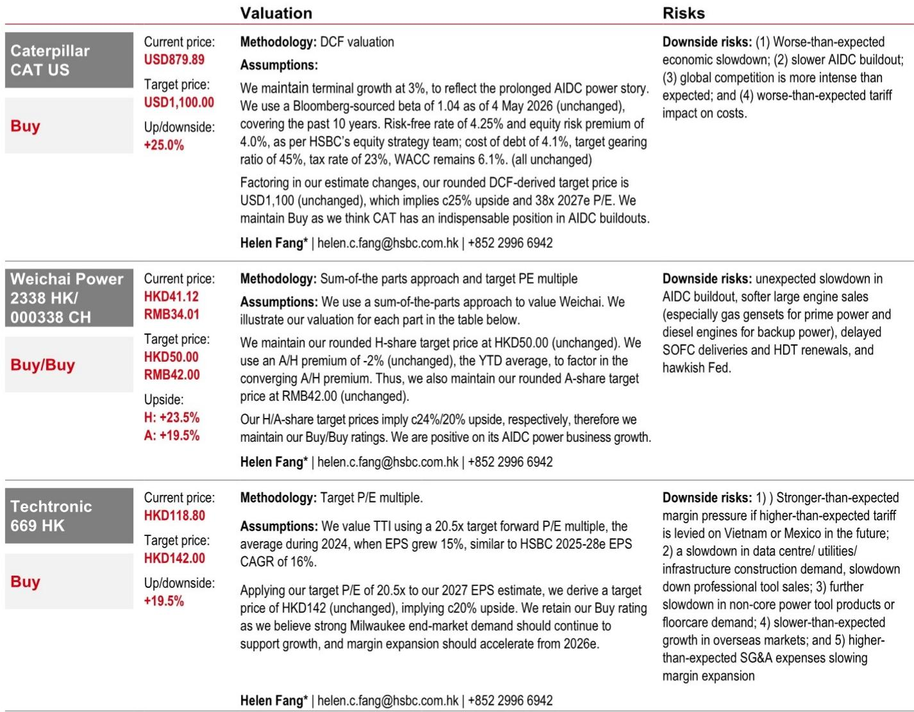
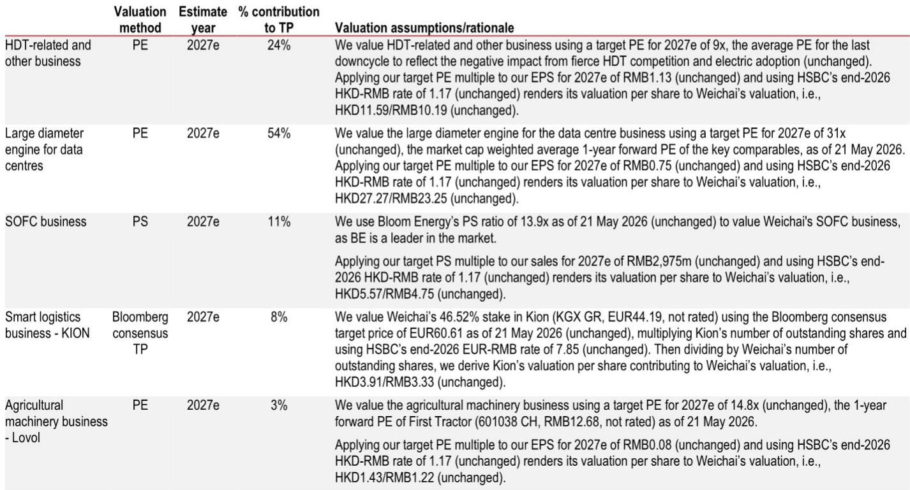
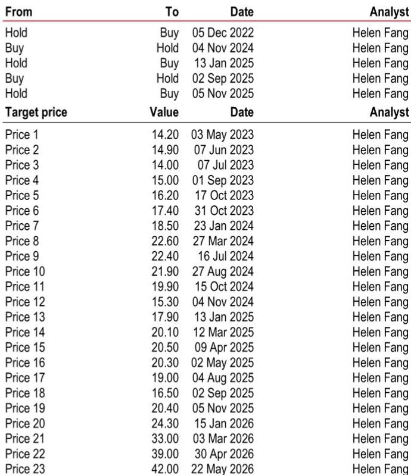

# The AI Data Center Power Bottleneck Is Now a Multi-Year Growth Engine for Industrial Equipment

The artificial intelligence infrastructure buildout has moved beyond a theoretical demand story into a tangible, capital-committed reality that is reshaping the industrial equipment landscape. Recent capital markets events from two major industrial bellwethers have confirmed what many investors suspected but lacked the evidence to act upon: the power requirements for AI data centers are creating a structural, multi-year demand cycle for backup generators, prime power systems, and construction equipment that extends well beyond the typical capital spending cycle. This is not a transitory tailwind. It is a fundamental shift in how industrial capacity must be planned, financed, and deployed.

The implications are profound for investors who understand that the bottleneck in AI deployment is no longer chip supply or data center construction timelines. The bottleneck is power. And the companies that build the engines, generators, and construction tools to deliver that power are positioned for a demand cycle that stretches into the next decade. Three companies stand out as the primary beneficiaries: Caterpillar, Weichai Power, and Techtronic Industries. Each occupies a distinct but complementary position in the AI data center power ecosystem, and each is supported by evidence that the demand is real, growing, and underpinned by capital expenditure commitments that extend through 2028 and beyond.

The strategic question for investors is not whether this theme will play out. The question is which companies have the capacity, the technology, and the market position to capture the most value from a supply-constrained environment. The answer requires a careful examination of the power generation value chain, the construction demand that accompanies data center buildout, and the competitive dynamics that will determine winners and losers.

## The Backup Power Market Is Tightening So Rapidly That Lead Times Now Extend to 2028

The most striking data point to emerge from recent industry events is that one major engine manufacturer is now taking orders for AI data center backup power systems with delivery dates in 2028. This is not a forecast. This is a current operational reality. The same manufacturer announced a $450 million investment to add 20 gigawatts of high-horsepower engine and genset capacity, bringing total capacity to 55 gigawatts by 2030. These numbers are not incremental. They represent a doubling of capacity in a market that was already supply-constrained before the AI buildout accelerated.

The strategic implication is straightforward: the backup power market has shifted from a just-in-time inventory model to a multi-year forward ordering environment. This benefits incumbents with existing production capacity and established customer relationships. New entrants cannot simply build factories and compete overnight. The engineering, testing, and certification cycles for high-horsepower engines take years. The companies that already have the production lines, the supply chains, and the regulatory approvals are the ones that will capture the majority of this demand.

For Caterpillar, the read-across is particularly compelling. The company already offers engine solutions up to 10 megawatts and holds leading market positions across multiple power generation segments. The fact that a competitor is investing heavily to expand capacity is a confirmation that the market is larger and more durable than most investors appreciate. Caterpillar does not need to announce a similar investment to prove its positioning. Its existing capacity and market share are the assets that matter. The question is whether the company will choose to expand capacity further or allow pricing to do the work of rationing supply.

The backup power dynamic also creates a natural hedge against the risk of an AI investment slowdown. Even if new data center construction decelerates, the existing installed base of data centers will require ongoing backup power maintenance, testing, and eventual replacement. The multi-year order book provides visibility that most industrial end markets cannot match.

## Prime Power Supply Constraints Create an Opening for Gas Engine Solutions That Did Not Previously Exist

While backup power is the most visible segment of the AI data center power market, prime power represents the more significant long-term opportunity. Backup power systems run only during grid outages. Prime power systems run continuously to provide baseload electricity. As data center operators confront the reality that grid capacity in many regions is insufficient to support their planned buildouts, the demand for on-site prime power generation is accelerating.

The tight supply of prime power solutions is expected to persist through at least 2028. This is not a function of insufficient demand. It is a function of insufficient supply of the large, high-efficiency gas engines that are the preferred solution for continuous power generation. The announcement that a major manufacturer is developing a 4-megawatt gas engine solution based on its existing platform, with an expected 2028 launch, confirms that the industry recognizes the gap and is working to fill it. But 2028 is four years away. In the interim, the companies that already have prime power solutions available will command premium pricing and capture market share.

Caterpillar is the clear leader in this segment with engine offerings up to 10 megawatts. The company does not need to develop new platforms to participate in the prime power opportunity. It needs to allocate production capacity to meet demand. Weichai Power is the more interesting story because it is targeting the US market with 2.5 to 3 megawatt gas gensets beginning in the fourth quarter of 2026. This is a deliberate strategic move to capture the prime power opportunity in the world's largest data center market, and it represents a significant expansion of Weichai's addressable market beyond its traditional Chinese customer base.

The prime power opportunity also opens the door for solid oxide fuel cell technology, which Weichai is developing as a longer-term solution. Fuel cells offer higher efficiency and lower emissions than gas engines, making them attractive for data center operators with sustainability commitments. The technology is not yet commercially competitive at scale, but the AI data center demand creates a use case that justifies continued investment. Weichai's positioning in both gas engines and fuel cells gives it a dual-path strategy that reduces technology risk while maintaining exposure to the prime power theme.

## AI Data Center Construction Is Lifting US Construction Equipment Demand in Ways That Broader Economic Data Do Not Capture

The construction demand generated by AI data center buildout is not limited to the data centers themselves. It extends to the surrounding infrastructure: grid connections, cooling systems, water utilities, and the site preparation work that precedes any major construction project. The recent earnings call from a major agricultural and construction equipment manufacturer confirmed this dynamic. The company raised its full-year construction net sales growth guidance from 15 percent to 20 percent, citing strong AI data center and infrastructure demand. Its order book is at the highest level since April 2024, with over 80 percent of production slots for the current fiscal year already filled.

The strategic insight here is that AI data center construction demand is partially insulated from the interest rate sensitivity that affects other construction segments. Data center investment decisions are driven by the expected return on AI compute capacity, not by the cost of borrowing. As long as AI remains a strategic priority for technology companies and their customers, data center construction will continue regardless of the interest rate environment. This creates a floor under construction equipment demand that does not exist in residential or commercial real estate.

For Caterpillar, the construction demand read-across is significant because its Construction Industries segment represents a large portion of total revenue. The company benefits from both the direct sale of equipment for data center site preparation and the indirect demand from infrastructure projects that support data center operations. For Techtronic Industries, the opportunity is more focused but no less compelling. Professional tools account for a meaningful portion of Techtronic's sales, and data center construction is a highly tool-intensive activity. The company estimates that approximately 11 percent of its sales are exposed to AI data center buildout, a figure that is likely to grow as construction activity accelerates.

The construction demand theme also highlights an important distinction between different types of equipment exposure. Large-scale site preparation benefits construction contractors who purchase heavy earthmoving equipment. Grid and cooling-related works benefit water and utility contractors who purchase specialized equipment for trenching, piping, and electrical work. Both segments are experiencing demand growth, but the composition of that demand matters for company-specific positioning. Companies with broad product portfolios that serve both contractor segments are better positioned than companies that specialize in only one.

## The Report Leaves Open Critical Questions About Capacity Constraints and Competitive Dynamics

For all the clarity that recent industry events provide about demand direction, the report leaves several important questions unanswered. The most pressing is whether the announced capacity expansions will be sufficient to meet demand, or whether the industry will face a prolonged period of supply constraints that drives pricing higher and extends lead times further. The $450 million investment to add 20 gigawatts of capacity is substantial, but it represents only one manufacturer's response to a global demand surge. The industry as a whole may need to invest significantly more to prevent the power bottleneck from becoming the binding constraint on AI deployment.

A second open question concerns the competitive dynamics in the Chinese market. Weichai's strategy of targeting US prime power demand is clear, but the domestic Chinese market for AI data center power is also growing rapidly. How Weichai balances domestic and export demand, and whether Chinese data center operators will face similar supply constraints as their US counterparts, are questions that have significant implications for the company's growth trajectory.

A third unresolved issue is the role of alternative power technologies. Solid oxide fuel cells are promising, but they have not yet been deployed at commercial scale for data center applications. Battery storage systems can provide backup power for short durations, but they are not a substitute for engine-based systems that can run continuously for days or weeks. The report does not address whether technological shifts could disrupt the engine-based power model that currently dominates the market.

These unanswered questions create analytical tension that makes the full report worth reading. The demand thesis is clear and supported by data. But the supply side, competitive dynamics, and technology risk are areas where deeper analysis is required to make informed investment decisions.

## A Decision Framework for Investors Evaluating AI Data Center Power Exposure

For investors looking to translate this analysis into actionable decisions, a structured framework can help evaluate the three companies against the key drivers of value creation. The framework should assess each company's exposure to backup power versus prime power, its capacity to meet demand without significant capital investment, its competitive moat in its primary markets, and its exposure to downside risks from slower AI buildout or higher interest rates.

Caterpillar scores highest on competitive moat and product breadth. The company's engine offerings cover the full range of backup and prime power requirements, and its global distribution network provides a service and support advantage that competitors cannot easily replicate. The primary risk is that Caterpillar's size and complexity make it difficult for the company to allocate capital optimally across its multiple business segments. The AI data center opportunity is large, but it is not Caterpillar's only growth priority.

Weichai Power offers the highest growth potential from its prime power and fuel cell initiatives. The company is smaller than Caterpillar and more focused on the power generation opportunity, which creates a purer expression of the AI data center theme. The risks are more significant: execution risk in entering the US market, technology risk in fuel cell development, and currency risk from the renminbi exchange rate.

Techtronic Industries provides the most indirect exposure to the AI data center theme, but also the most diversified business model. The company's tool business serves multiple end markets, which reduces single-theme risk. The AI data center exposure is a growth accelerator rather than the primary investment thesis. The risk is that the tool business faces margin pressure from tariffs or input cost inflation that offsets the demand benefit from data center construction.

The decision framework should also incorporate valuation. The companies trade at different multiples that reflect different growth expectations. The question is not which company has the highest absolute growth potential, but which company offers the best risk-adjusted return given current valuations and the probabilities of different demand scenarios.

## Join the Community to Read the Full Report and Review the Original Charts

The analysis presented here captures the strategic implications of recent industry events, but the full report contains additional detail on valuation methodology, risk factors, and the specific assumptions underlying each company's target price. The original charts provide visual context for the capacity expansion plans, order book trends, and demand projections that support the investment thesis. For investors who want to deepen their understanding of the AI data center power opportunity and evaluate the evidence for themselves, the full report is an essential resource. Join the community to read the full report and review the original charts.

*This article is for learning and discussion only and does not constitute investment advice.*

Personal reading notes and learning share only. Not investment advice.

