# Greater China Semiconductors | Asia Pacific

# Old Memory: Upside Surprise Ahead

We think wider supply/demand will boost earnings. SLC NAND and Si Cap should offer re-rating potential. We upgrade Winbond and Nanya to OW.

# Key Takeaways

We reduce our supply assumptions from Micron in the near term and for Hynix in the next few quarters.   
We believe DDR4 enterprise demand from both eSSD and datacenters is getting stronger.   
Our DDR4 supply/demand model suggests a 19-20% gap for 2H26 vs. the prior 14%, and an 18-20% gap for 2027-28.   
SiCap and SLC NAND (for servers) could be a potential re-rating factor.   
■ NOR is seeing more tightness on mature foundry shortages.

We had been too conservative; supply/demand gap widening in 2H: We downgraded Winbond and Nanya in March 2026, citing a potentially narrowing supply/demand gap into 2H26 and moderating pricing hikes. We now believe the gap could widen into 2H. We also expect rising CPU server demand to drive enterprise demand growth into 2027. As a result, we upgrade both stocks back to OW.

Less supply and rising demand = stronger pricing: We believe the recent Micron (covered by Joseph Moore) announcement (link) will mean reduced supply in the next 2-4 quarters, reflecting equipment movement from Taiwan to the US. At the same time, we think Hynix's (covered by Shawn Kim) Wuxi capacity for D4/LPD4 will be further reduced for DDR5 back-end capacity. We thus expect DDR4 pricing to continue to trend up, likely 20% in 3Q. Our supply/demand models suggests a 19-20% gap in 2H26 and an 18-20% gap in 2027/28.

SiCap and SLC NAND could be re-rating factors: SiCap (link) is a new growth driver for niche memory vendors. Recent developments for servers (for high performance NAND) also suggest potential adoption of SLC in datacenters, as SLC is ideal for fast reading and writing speed. Currently, SLC NAND could be supplied by Greater China vendors such as GigaDevice, Winbond, and Macronix.

Estimate changes: For Winbond, we raise 2026, 2027 and 2028 EPS estimates by 23%, 65% and 94%, respectively, to reflect DDR4 pricing strength and opportunities from SiCap and SLC NAND. For Nanya, we increase respective estimates by 15%, 29% and 33% to reflect DDR4 pricing strength; we also turn positive on more LTAs with server and enterprise SSD customers, along with their additional 5kwpm capacity to DDR5 starting 3Q26. For GigaDevice, we raise 2026e by 58% and 2027e by 60% to reflect DDR4 pricing strength and opportunities from SLC NAND.

MS TAIWAN LIMITED+

# Daniel Yen, CFA

Equity Analyst

Daniel.Yen@morganstanley.com +886 2 2730-2863

# Charlie Chan

Equity Analyst

Charlie.Chan@morganstanley.com +886 2 2730-1725

MS ASIA LIMITED+

# Daisy Dai, CFA

Equity Analyst

Daisy.Dai@morganstanley.com +852 2848-7310

MS TAIWAN LIMITED+

# Tiffany Yeh

Equity Analyst

Tiffany.Yeh@morganstanley.com +886 2 7712-3032

MS ASIA LIMITED+

# Ethan Jia

Research Associate

Ethan.Jia@morganstanley.com +852 3963-2287

GREATER CHINA TECHNOLOGY SEMICONDUCTORS 

<table><tr><td>Asia Pacific Industry View</td><td>Attractive</td></tr></table>

WHAT'S CHANGED 

<table><tr><td>Nanya Technology Corp.(2408.TW)</td><td>From</td><td>To</td></tr><tr><td>Rating</td><td>Equal-weight</td><td>Overweight</td></tr><tr><td>Price Target</td><td>NT$278.00</td><td>NT$380.00</td></tr></table>

<table><tr><td>Winbond Electronics Corp(2344.TW)</td><td>From</td><td>To</td></tr><tr><td>Rating</td><td>Equal-weight</td><td>Overweight</td></tr><tr><td>Price Target</td><td>NT$100.00</td><td>NT$222.00</td></tr></table>

<table><tr><td colspan="3">GigaDevice Semiconductor</td></tr><tr><td>Beijing Inc (603986.SS)</td><td>From</td><td>To</td></tr><tr><td>Price Target</td><td>Rmb348.00</td><td>Rmb585.00</td></tr></table>

MS does and seeks to do business with companies covered in MS. As a result, investors should be aware that the firm may have a conflict of interest that could affect the objectivity of MS. Investors should consider MS as only a single factor in making their investment decision.

# For analyst certification and other important disclosures, refer to the Disclosure Section, located at the end of this report.

+= Analysts employed by non-U.S. affiliates are not registered with FINRA, may not be associated persons of the member and may not be subject to FINRA restrictions on communications with a subject company, public appearances and trading securities held by a research analyst account.

# Key Charts and Exhibits

Exhibit 1: Order of preference: GC memory 

<table><tr><td></td><td>Macronix2337.TW</td><td>AP Memory6531.TW</td><td>Winbond2344.TW</td><td>Nanya Tech2408.TW</td><td>PSMC6770.TW</td><td>GigaDevice603986.SS</td></tr><tr><td>Rating</td><td>Overweight</td><td>Overweight</td><td>Overweight</td><td>Overweight</td><td>Overweight</td><td>Overweight</td></tr><tr><td>Trading Currency</td><td>TWD</td><td>TWD</td><td>TWD</td><td>TWD</td><td>TWD</td><td>CNY</td></tr><tr><td>Price Target</td><td>202.0</td><td>1,555.0</td><td>222.0</td><td>380.0</td><td>88.0</td><td>585.0</td></tr><tr><td>Current Price (as of 2026/5/27)</td><td>155.5</td><td>1,080.0</td><td>155.0</td><td>312.0</td><td>74.8</td><td>514.2</td></tr><tr><td>Upside/(Downside) (%)</td><td>30%</td><td>44%</td><td>43%</td><td>22%</td><td>18%</td><td>14%</td></tr><tr><td>Market Cap (in USD mm)</td><td>8,932.0</td><td>5,562.4</td><td>20,620.6</td><td>30,605.2</td><td>9,970.0</td><td>50,574.4</td></tr><tr><td>Avg Daily Traded Vol (in USD mm)</td><td>215.3</td><td>68.1</td><td>372.8</td><td>558.3</td><td>206.4</td><td>1,088.1</td></tr><tr><td colspan="7">Street View: Ratings</td></tr><tr><td>Buy/Overweight</td><td>90%</td><td>75%</td><td>91%</td><td>75%</td><td>50%</td><td>93%</td></tr><tr><td>Hold/Equal-weight</td><td>0%</td><td>25%</td><td>9%</td><td>19%</td><td>50%</td><td>7%</td></tr><tr><td>Sell/Underweight</td><td>10%</td><td>0%</td><td>0%</td><td>6%</td><td>0%</td><td>0%</td></tr><tr><td>Bull Case Value</td><td>326.0</td><td>1,830.0</td><td>264.0</td><td>805.0</td><td>140.0</td><td>1,016.0</td></tr><tr><td>Upside (%)</td><td>110%</td><td>69%</td><td>70%</td><td>158%</td><td>87%</td><td>98%</td></tr><tr><td>Bear Case Value</td><td>119.5</td><td>620.0</td><td>91.0</td><td>210.0</td><td>44.0</td><td>427.0</td></tr><tr><td>Downside (%)</td><td>-23%</td><td>-43%</td><td>-41%</td><td>-33%</td><td>-41%</td><td>-17%</td></tr><tr><td>Risk/Reward Skew</td><td>4.7</td><td>1.6</td><td>1.7</td><td>4.8</td><td>2.1</td><td>5.8</td></tr><tr><td colspan="7">MS Estimates</td></tr><tr><td>FY26e</td><td>TWD</td><td>TWD</td><td>TWD</td><td>TWD</td><td>TWD</td><td>CNY</td></tr><tr><td>Sales</td><td>66,682</td><td>9,601</td><td>258,581</td><td>332,719</td><td>73,014</td><td>22,018</td></tr><tr><td>EBITDA</td><td>24,507</td><td>3,037</td><td>129,462</td><td>253,840</td><td>13,009</td><td>9,882</td></tr><tr><td>EBIT</td><td>16,970</td><td>2,976</td><td>113,852</td><td>241,654</td><td>5,445</td><td>9,632</td></tr><tr><td>EPS</td><td>7.35</td><td>17.65</td><td>20.36</td><td>61.50</td><td>4.64</td><td>12.81</td></tr><tr><td colspan="7">FY27e</td></tr><tr><td>Sales</td><td>126,013</td><td>17,829</td><td>377,335</td><td>471,750</td><td>89,835</td><td>32,133</td></tr><tr><td>EBITDA</td><td>54,966</td><td>6,491</td><td>203,533</td><td>342,723</td><td>27,573</td><td>15,564</td></tr><tr><td>EBIT</td><td>48,496</td><td>6,429</td><td>183,356</td><td>319,538</td><td>20,109</td><td>15,314</td></tr><tr><td>EPS</td><td>20.82</td><td>34.34</td><td>32.73</td><td>80.92</td><td>3.78</td><td>20.71</td></tr><tr><td colspan="7">FY26 MSe vs. Consensus Mean</td></tr><tr><td>Sales</td><td>-16.5%</td><td>-3.0%</td><td>11.7%</td><td>13.0%</td><td>6.7%</td><td>24.5%</td></tr><tr><td>EBITDA</td><td>-22.7%</td><td>-0.9%</td><td>12.3%</td><td>13.5%</td><td>-55.9%</td><td>42.6%</td></tr><tr><td>EBIT</td><td>-40.8%</td><td>3.8%</td><td>9.9%</td><td>15.0%</td><td>-78.0%</td><td>47.9%</td></tr><tr><td>EPS</td><td>-44.7%</td><td>-0.7%</td><td>9.1%</td><td>23.8%</td><td>-13.7%</td><td>50.6%</td></tr><tr><td colspan="7">FY27 MSe vs. Consensus Mean</td></tr><tr><td>Sales</td><td>6.8%</td><td>19.6%</td><td>25.9%</td><td>21.5%</td><td>8.8%</td><td>41.2%</td></tr><tr><td>EBITDA</td><td>-18.8%</td><td>26.0%</td><td>19.5%</td><td>16.5%</td><td>-9.7%</td><td>80.2%</td></tr><tr><td>EBIT</td><td>-13.2%</td><td>33.0%</td><td>37.9%</td><td>14.5%</td><td>-4.7%</td><td>81.6%</td></tr><tr><td>EPS</td><td>-24.8%</td><td>25.1%</td><td>31.5%</td><td>24.8%</td><td>-8.3%</td><td>91.6%</td></tr><tr><td colspan="7">Valuation Multiples at Last Close</td></tr><tr><td colspan="7">FY26e</td></tr><tr><td>P/E</td><td>21.1x</td><td>61.2x</td><td>7.6x</td><td>5.1x</td><td>16.1x</td><td>40.1x</td></tr><tr><td>EV/EBIT</td><td>24.2x</td><td>80.6x</td><td>8.5x</td><td>5.6x</td><td>34.0x</td><td>38.9x</td></tr><tr><td>EV/EBITDA</td><td>13.3x</td><td>53.6x</td><td>5.3x</td><td>4.5x</td><td>13.9x</td><td>33.1x</td></tr><tr><td>EV/Sales</td><td>4.9x</td><td>17.0x</td><td>2.7x</td><td>3.4x</td><td>2.5x</td><td>14.9x</td></tr><tr><td>FCF Yield</td><td>-11.6%</td><td>1.2%</td><td>4.7%</td><td>-23.4%</td><td>32.4%</td><td>2.1%</td></tr><tr><td colspan="7">FY27e</td></tr><tr><td>P/E</td><td>7.5x</td><td>31.4x</td><td>4.7x</td><td>3.9x</td><td>19.8x</td><td>24.8x</td></tr><tr><td>EV/EBIT</td><td>5.9x</td><td>25.0x</td><td>2.9x</td><td>2.8x</td><td>6.7x</td><td>20.7x</td></tr><tr><td>EV/EBITDA</td><td>5.2x</td><td>24.8x</td><td>2.6x</td><td>2.6x</td><td>4.9x</td><td>20.4x</td></tr><tr><td>EV/Sales</td><td>2.3x</td><td>9.0x</td><td>1.4x</td><td>1.9x</td><td>1.5x</td><td>9.9x</td></tr><tr><td>FCF Yield</td><td>15.3%</td><td>2.2%</td><td>24.5%</td><td>26.1%</td><td>16.0%</td><td>3.5%</td></tr><tr><td colspan="7">Implied Multiples on MS Price Target</td></tr><tr><td colspan="7">FY26e</td></tr><tr><td>P/E</td><td>27.5x</td><td>88.1x</td><td>10.9x</td><td>6.2x</td><td>19.0x</td><td>45.7x</td></tr><tr><td>EV/EBIT</td><td>24.2x</td><td>80.6x</td><td>8.5x</td><td>5.6x</td><td>34.0x</td><td>38.9x</td></tr><tr><td>EV/EBITDA</td><td>16.7x</td><td>79.0x</td><td>7.5x</td><td>5.3x</td><td>14.2x</td><td>37.9x</td></tr><tr><td>EV/Sales</td><td>6.1x</td><td>25.0x</td><td>3.7x</td><td>4.1x</td><td>2.5x</td><td>17.0x</td></tr><tr><td colspan="7">FY27e</td></tr><tr><td>P/E</td><td>9.7x</td><td>45.3x</td><td>6.8x</td><td>4.7x</td><td>23.3x</td><td>28.2x</td></tr><tr><td>EV/EBIT</td><td>7.7x</td><td>40.0x</td><td>5.2x</td><td>3.8x</td><td>18.8x</td><td>28.9x</td></tr><tr><td>EV/EBITDA</td><td>6.8x</td><td>39.6x</td><td>4.7x</td><td>3.5x</td><td>13.7x</td><td>28.4x</td></tr><tr><td>EV/Sales</td><td>3.0x</td><td>14.4x</td><td>2.5x</td><td>2.5x</td><td>4.2x</td><td>13.8x</td></tr></table>

Source: FactSet (consensus mean), MS (e) estimates.

Exhibit 2: NOR flash demand and supply growth rates   
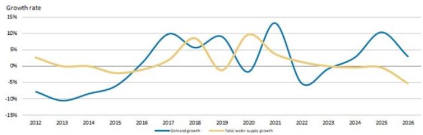

line

| Year | Demand growth | Total water supply growth |
|------|---------------|----------------------------|
| 2012 | -10%          | 3%                         |
| 2013 | -12%          | 0%                         |
| 2014 | -8%           | -1%                        |
| 2015 | -5%           | -3%                        |
| 2016 | 0%            | 0%                         |
| 2017 | 10%           | 5%                         |
| 2018 | 5%            | 8%                         |
| 2019 | 8%            | -3%                        |
| 2020 | -5%           | 10%                        |
| 2021 | 15%           | 5%                         |
| 2022 | -5%           | 0%                         |
| 2023 | 0%            | -3%                        |
| 2024 | 5%            | -3%                        |
| 2025 | 10%           | -3%                        |
| 2026 | 3%            | -5%                        |

Source: Company data, MS

Exhibit 4: DDR4 quarterly supply and demand summary   
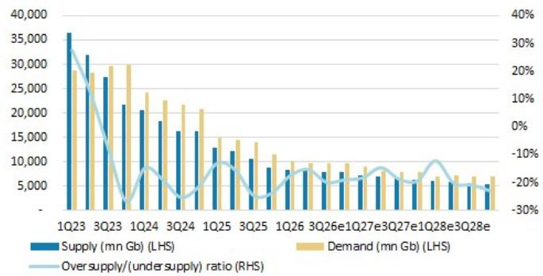

bar_line

| Quarter | Supply (mn Gb) (LHS) | Demand (mn Gb) (LHS) | Oversupply/(under supply) ratio (RHS) |
|---|---|---|---|
| 1Q23 | 36000 | 29000 | 35% |
| 2Q23 | 32000 | 29000 | 25% |
| 3Q23 | 28000 | 30000 | -15% |
| 4Q23 | 22000 | 30000 | -25% |
| 1Q24 | 21000 | 24000 | -10% |
| 2Q24 | 19000 | 23000 | -15% |
| 3Q24 | 17000 | 22000 | -15% |
| 4Q24 | 16000 | 21000 | -15% |
| 1Q25 | 13000 | 15000 | -15% |
| 2Q25 | 12000 | 14000 | -15% |
| 3Q25 | 11000 | 13000 | -15% |
| 4Q25 | 9000 | 12000 | -15% |
| 1Q26 | 8000 | 11000 | -15% |
| 2Q26e | 7500 | 10500 | -15% |
| 3Q26e | 7500 | 10500 | -15% |
| 4Q26e | 7500 | 10500 | -15% |
| 1Q27e | 7500 | 10500 | -15% |
| 2Q27e | 7500 | 10500 | -15% |
| 3Q27e | 7500 | 10500 | -15% |
| 4Q27e | 7500 | 10500 | -15% |
| 1Q28e | 7500 | 10500 | -15% |
| 2Q28e | 7500 | 10500 | -15% |
| 3Q28e | 7500 | 10500 | -15% |

Source: Company data, IDC, MS (e) estimates

Exhibit 6: Quarterly supply breakdown (mn Gb)   
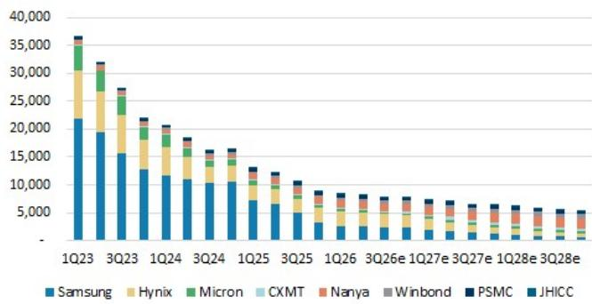

bar_stacked

| Quarter | Samsung | Hynix | Micron | CXMT | Nanya | Winbond | PSMC | JHICC |
| :--- | :--- | :--- | :--- | :--- | :--- | :--- | :--- | :--- |
| 1Q23 | 21500 | 7500 | 4000 | 0 | 0 | 0 | 0 | 0 |
| 3Q23 | 19500 | 6500 | 3500 | 0 | 0 | 0 | 0 | 0 |
| 1Q24 | 12500 | 4500 | 2500 | 0 | 0 | 0 | 0 | 0 |
| 3Q24 | 11500 | 4000 | 2000 | 0 | 0 | 0 | 0 | 0 |
| 1Q25 | 7500 | 2500 | 1500 | 0 | 0 | 0 | 0 | 0 |
| 3Q25 | 6500 | 2500 | 1500 | 0 | 0 | 0 | 0 | 0 |
| 1Q26e | 3500 | 1500 | 1000 | 0 | 0 | 0 | 0 | 0 |
| 3Q26e | 3500 | 1500 | 1000 | 0 | 0 | 0 | 0 | 0 |
| 1Q27e | 3500 | 1500 | 1000 | 0 | 0 | 0 | 0 | 0 |
| 3Q27e | 3500 | 1500 | 1000 | 0 | 0 | 0 | 0 | 0 |
| 1Q28e | 3500 | 1500 | 1000 | 0 | 0 | 0 | 0 | 0 |
| 3Q28e | 3500 | 1500 | 1000 | 0 | 0 | 0 | 0 | 0 |
The chart displays the quarterly revenue (in thousands) for Samsung, Hynix, Micron, CXMT, Nanya, Winbond, PSMC, and JHICC. The values for each quarter are explicitly labeled on the chart. There is no additional data series in this view. The title of the chart is 'Quarterly Revenue'. The x-axis represents the quarters from Q1 to Q4, and the y-axis represents the revenue in thousands. The legend indicates the color-coded categories of each company.

Source: Company data, MS (e) estimates

Exhibit 8: DDR4 8Gb (1Gx8) pricing chart   
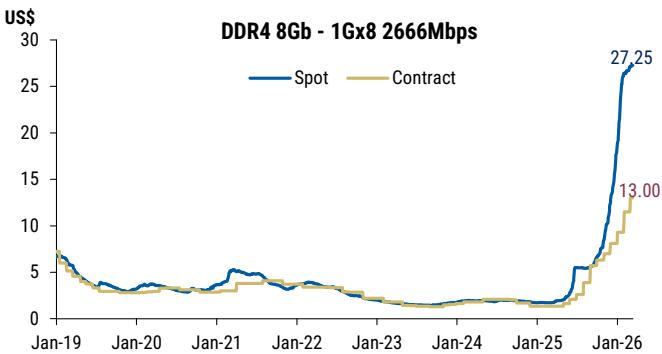

line

| Date   | Spot  | Contract |
|--------|-------|----------|
| Jan-26 | 27.25 | 13.00    |

Source: DRAMeXchange, MS. Data as of Mar 13, 2026.

Exhibit 3: NOR flash demand growth and supply growth by density   
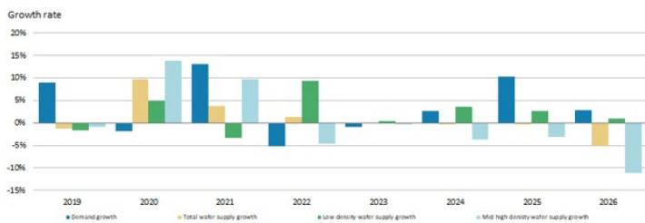

bar

| Year | Demand growth (%) | Total water supply growth (%) | Low density water supply growth (%) | Mid high density water supply growth (%) |
|---|---|---|---|---|
| 2019 | 8.5 | -1.5 | -0.5 | -0.5 |
| 2020 | -2.0 | 10.0 | 4.5 | 13.5 |
| 2021 | 13.0 | 4.0 | -3.0 | 10.0 |
| 2022 | -5.5 | 1.5 | 9.5 | -6.0 |
| 2023 | -0.5 | 0.0 | -0.5 | 0.0 |
| 2024 | 3.0 | 0.0 | 4.0 | -5.5 |
| 2025 | 10.5 | 0.0 | 3.0 | -3.0 |
| 2026 | 3.5 | -7.0 | -1.0 | -10.5 |
The chart displays the annual growth rates for each metric from 2019 to 2026. The values are estimated based on the percentage change from prior year (e.g., +13% in 2021). The legend indicates four categories: Demand growth (blue), Total water supply growth (yellow), Low density water supply growth (green), and Mid high density water supply growth (light blue). The data is presented in a single column format.

Source: Company data, MS

Exhibit 5: Quarterly oversupply/undersupply ratio vs. Nanya and Winbond pricing Q/Q change   
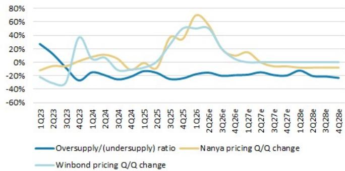

line

| Quarter | Oversupply/(undersupply) ratio | Nanya pricing Q/Q change | Winbond pricing Q/Q change |
|---------|----------------------------------|---------------------------|----------------------------|
| 1Q23    | 30%                              | -10%                      | -20%                       |
| 2Q23    | 20%                              | -5%                       | -30%                       |
| 3Q23    | -10%                             | 0%                        | -40%                       |
| 4Q23    | -20%                             | 10%                       | 40%                        |
| 1Q24    | -15%                             | 5%                        | 10%                        |
| 2Q24    | -10%                             | 0%                        | 5%                         |
| 3Q24    | -5%                              | -5%                       | 0%                         |
| 4Q24    | -10%                             | -10%                      | -5%                        |
| 1Q25    | -15%                             | -15%                      | -10%                       |
| 2Q25    | -20%                             | -20%                      | -15%                       |
| 3Q25    | -25%                             | -25%                      | -20%                       |
| 4Q25    | -30%                             | -30%                      | -25%                       |
| 1Q26    | -35%                             | -35%                      | -30%                       |
| 2Q26e   | -40%                             | -40%                      | -35%                       |
| 3Q26e   | -45%                             | -45%                      | -40%                       |
| 4Q26e   | -50%                             | -50%                      | -45%                       |
| 1Q27e   | -55%                             | -55%                      | -50%                       |
| 2Q27e   | -60%                             | -60%                      | -55%                       |
| 3Q27e   | -65%                             | -65%                      | -60%                       |
| 4Q27e   | -70%                             | -70%                      | -65%                       |
| 1Q28e   | -75%                             | -75%                      | -70%                       |
| 2Q28e   | -80%                             | -80%                      | -75%                       |
| 3Q28e   | -85%                             | -85%                      | -80%                       |
| 4Q28e   | -90%                             | -90%                      | -85%                       |

Source: Company data, IDC, MS (e) estimates

Exhibit 7: Quarterly demand breakdown by product (mn Gb)   
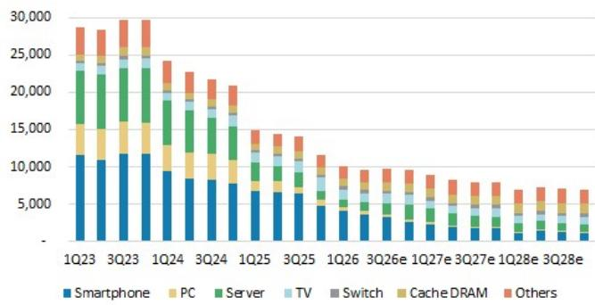

bar_stacked

| Quarter | Smartphone | PC | Server | TV | Switch | Cache DRAM | Others |
|---|---|---|---|---|---|---|---|
| 1Q23 | 11500 | 4000 | 6500 | 1000 | 500 | 0 | 28000 |
| 3Q23 | 11800 | 4200 | 6700 | 1100 | 550 | 0 | 29500 |
| 1Q24 | 9500 | 3500 | 5500 | 1200 | 600 | 0 | 24000 |
| 3Q24 | 8500 | 3800 | 5200 | 1300 | 650 | 0 | 22500 |
| 1Q25 | 7500 | 3200 | 4800 | 1400 | 700 | 0 | 21000 |
| 3Q25 | 6800 | 2800 | 4500 | 1500 | 750 | 0 | 19500 |
| 1Q26 | 5500 | 2200 | 3800 | 1600 | 800 | 100 | 16500 |
| 3Q26e | 4800 | 1800 | 3200 | 1700 | 850 | 150 | 14500 |
| 1Q27e | 4200 | 1500 | 2800 | 1800 | 900 | 180 | 13500 |
| 3Q27e | 3800 | 1300 | 2500 | 1900 | 950 | 220 | 12500 |
| 1Q28e | 3500 | 1200 | 2300 | 2000 | 1000 | 250 | 11500 |
| 3Q28e | 3200 | 1100 | 2100 | 2100 | 1150 | 325 | 11556 |
The chart displays a stacked bar chart with each bar representing the total revenue for that quarter. The categories are Smartphone, PC, Server, TV, Switch, Cache DRAM, and Others. The values in the table represent the total revenue for each quarter. The data is presented in a long format with labels above the bars. The title of the chart is 'Revenue by Quarter' and the axis labels are not explicitly labeled but correspond to the time periods. The legend is embedded in the bars but is not explicitly labeled in the image. The chart type is a single series.

Source: IDC, MS (e) estimates

Exhibit 9: DDR5 16Gb (2Gx8) pricing chart   
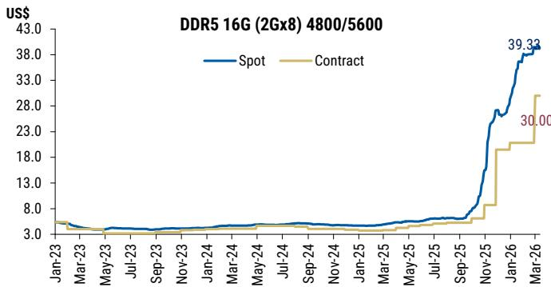

line

| Date    | Spot   | Contract |
|---------|--------|----------|
| Mar-26  | 39.33  | 30.00    |

Source: DRAMeXchange, MS. Data as of Mar 13, 2026.

# Winbond: Estimate Revisions and Quarterly Financials

We raise our 2026, 2027, and 2028 EPS estimates by 23%, 65%, and 94%,

respectively. This reflects DDR4 pricing strength, an enlarged SLC NAND TAM, and SiCap foundry business with SEMCO.

Exhibit 10: Winbond: Estimate revisions 

<table><tr><td>NT$ mn</td><td>New &#x27;26E</td><td>Old &#x27;26E</td><td>Diff.</td><td>New &#x27;27E</td><td>Old &#x27;27E</td><td>Diff.</td><td>New &#x27;28E</td><td>Old &#x27;28E</td><td>Diff.</td></tr><tr><td>Net sales</td><td>258,581</td><td>224,249</td><td>15%</td><td>377,335</td><td>264,897</td><td>42%</td><td>410,515</td><td>256,015</td><td>60%</td></tr><tr><td>COGS</td><td>(111,702)</td><td>(103,295)</td><td></td><td>(158,768)</td><td>(123,965)</td><td></td><td>(178,012)</td><td>(127,994)</td><td></td></tr><tr><td>Gross profit</td><td>146,879</td><td>120,954</td><td>21%</td><td>218,567</td><td>140,932</td><td>55%</td><td>232,503</td><td>128,021</td><td>82%</td></tr><tr><td>Operating expenses</td><td>(33,028)</td><td>(30,277)</td><td></td><td>(35,211)</td><td>(31,693)</td><td></td><td>(36,149)</td><td>(31,941)</td><td></td></tr><tr><td>Operating profit</td><td>113,852</td><td>90,677</td><td>26%</td><td>183,356</td><td>109,239</td><td>68%</td><td>196,354</td><td>96,080</td><td>104%</td></tr><tr><td>Non-op. income (exp)</td><td>715</td><td>917</td><td></td><td>776</td><td>917</td><td></td><td>756</td><td>897</td><td></td></tr><tr><td>Pretax Income</td><td>114,567</td><td>91,594</td><td>25%</td><td>184,133</td><td>110,157</td><td>67%</td><td>197,111</td><td>96,977</td><td>103%</td></tr><tr><td>Taxes</td><td>(22,946)</td><td>(18,319)</td><td></td><td>(36,827)</td><td>(22,031)</td><td></td><td>(40,609)</td><td>(20,583)</td><td></td></tr><tr><td>Net income</td><td>91,607</td><td>74,586</td><td>23%</td><td>147,293</td><td>89,436</td><td>65%</td><td>156,488</td><td>77,705</td><td>101%</td></tr><tr><td>Reported EPS</td><td>20.36</td><td>16.57</td><td>23%</td><td>32.73</td><td>19.87</td><td>65%</td><td>36.09</td><td>18.59</td><td>94%</td></tr><tr><td colspan="10">Margins</td></tr><tr><td>Gross margin</td><td>56.8%</td><td>53.9%</td><td>2.9 ppt</td><td>57.9%</td><td>53.2%</td><td>4.7 ppt</td><td>56.6%</td><td>50.0%</td><td>6.6 ppt</td></tr><tr><td>Operating margin</td><td>44.0%</td><td>40.4%</td><td>3.6 ppt</td><td>48.6%</td><td>41.2%</td><td>7.4 ppt</td><td>47.8%</td><td>37.5%</td><td>10.3 ppt</td></tr><tr><td>Pretax margin</td><td>44.3%</td><td>40.8%</td><td>3.5 ppt</td><td>48.8%</td><td>41.6%</td><td>7.2 ppt</td><td>48.0%</td><td>37.9%</td><td>10.1 ppt</td></tr><tr><td>Net margin</td><td>35.4%</td><td>33.3%</td><td>2.2 ppt</td><td>39.0%</td><td>33.8%</td><td>5.3 ppt</td><td>38.1%</td><td>30.4%</td><td>7.8 ppt</td></tr><tr><td>Opex %</td><td>12.8%</td><td>13.5%</td><td>-0.7 ppt</td><td>9.3%</td><td>12.0%</td><td>-2.6 ppt</td><td>8.8%</td><td>12.5%</td><td>-3.7 ppt</td></tr><tr><td>NT$</td><td>New &#x27;26E</td><td>Old &#x27;26E</td><td>Diff.</td><td>New &#x27;27E</td><td>Old &#x27;27E</td><td>Diff.</td><td>New &#x27;28E</td><td>Old &#x27;28E</td><td>Diff.</td></tr><tr><td>BVPS</td><td>40.54</td><td>37.59</td><td>8%</td><td>73.32</td><td>57.51</td><td>27%</td><td>82.20</td><td>62.39</td><td>32%</td></tr></table>

Source: MS (E) estimates

Exhibit 11: Winbond: Quarterly financials 

<table><tr><td>NT$ in million</td><td>1Q25</td><td>2Q25</td><td>3Q25</td><td>4Q25</td><td>1Q26</td><td>2Q26E</td><td>3Q26E</td><td>4Q26E</td><td>1Q27E</td><td>2Q27E</td><td>3Q27E</td><td>4Q27E</td><td>1Q28E</td><td>2Q28E</td><td>3Q28E</td><td>4Q28E</td><td>2025</td><td>2026E</td><td>2027E</td><td>2028E</td></tr><tr><td>Total Revenues</td><td>19,993</td><td>21,018</td><td>21,771</td><td>26,625</td><td>38,253</td><td>54,396</td><td>75,948</td><td>89,984</td><td>91,342</td><td>93,039</td><td>95,199</td><td>97,755</td><td>100,164</td><td>102,137</td><td>103,436</td><td>104,778</td><td>89,406</td><td>258,581</td><td>377,335</td><td>410,515</td></tr><tr><td>Sequential Change</td><td>7.0%</td><td>5.1%</td><td>3.6%</td><td>22.3%</td><td>43.7%</td><td>42.2%</td><td>39.6%</td><td>18.5%</td><td>1.5%</td><td>1.9%</td><td>2.3%</td><td>2.7%</td><td>2.5%</td><td>2.0%</td><td>1.3%</td><td>1.3%</td><td></td><td></td><td></td><td></td></tr><tr><td>Change vs Year Ago</td><td>-0.6%</td><td>-2.2%</td><td>2.1%</td><td>42.4%</td><td>91.3%</td><td>158.8%</td><td>248.9%</td><td>238.0%</td><td>138.8%</td><td>71.0%</td><td>25.3%</td><td>8.6%</td><td>9.7%</td><td>9.8%</td><td>8.7%</td><td>7.2%</td><td>9.6%</td><td>189.2%</td><td>45.9%</td><td>8.9%</td></tr><tr><td>Cost of Sales</td><td>(14,871)</td><td>(16,255)</td><td>(11,655)</td><td>(15,479)</td><td>(17,838)</td><td>(23,986)</td><td>(31,990)</td><td>(37,385)</td><td>(38,024)</td><td>(38,867)</td><td>(40,252)</td><td>(41,625)</td><td>(41,404)</td><td>(42,426)</td><td>(43,627)</td><td>(44,617)</td><td>(58,210)</td><td>(111,702)</td><td>(158,768)</td><td>(178,012)</td></tr><tr><td>Percent of Revenues</td><td>74.4%</td><td>77.3%</td><td>53.1%</td><td>58.1%</td><td>46.6%</td><td>44.1%</td><td>42.1%</td><td>42.1%</td><td>41.6%</td><td>42.3%</td><td>42.3%</td><td>41.3%</td><td>41.3%</td><td>42.2%</td><td>42.2%</td><td>42.2%</td><td>65.1%</td><td>43.2%</td><td>42.1%</td><td>43.4%</td></tr><tr><td>Gross Margin</td><td>5,122</td><td>1,763</td><td>10,166</td><td>11,146</td><td>20,415</td><td>30,407</td><td>43,957</td><td>52,100</td><td>53,318</td><td>54,172</td><td>54,947</td><td>56,130</td><td>58,760</td><td>59,700</td><td>59,809</td><td>60,160</td><td>31,196</td><td>146,879</td><td>218,567</td><td>232,503</td></tr><tr><td>Percent of Revenues</td><td>25.6%</td><td>22.7%</td><td>46.7%</td><td>41.9%</td><td>53.4%</td><td>55.9%</td><td>57.9%</td><td>57.9%</td><td>58.4%</td><td>58.2%</td><td>57.7%</td><td>57.4%</td><td>58.7%</td><td>58.5%</td><td>57.8%</td><td>57.4%</td><td>34.9%</td><td>56.8%</td><td>57.9%</td><td>56.6%</td></tr><tr><td>Total Opex</td><td>(6,087)</td><td>(6,058)</td><td>(8,463)</td><td>(7,054)</td><td>(7,865)</td><td>(7,919)</td><td>(8,463)</td><td>(8,780)</td><td>(8,565)</td><td>(8,677)</td><td>(8,912)</td><td>(9,056)</td><td>(9,056)</td><td>(9,049)</td><td>(9,031)</td><td>(9,012)</td><td>(25,662)</td><td>(33,028)</td><td>(35,211)</td><td>(36,149)</td></tr><tr><td>Percent of Revenues</td><td>30.4%</td><td>28.8%</td><td>29.7%</td><td>26.5%</td><td>20.6%</td><td>14.6%</td><td>11.1%</td><td>9.4%</td><td>9.4%</td><td>9.4%</td><td>9.5%</td><td>9.0%</td><td>9.7%</td><td>8.6%</td><td>8.7%</td><td>8.6%</td><td>28.7%</td><td>12.8%</td><td>9.8%</td><td>8.8%</td></tr><tr><td>Operating Income</td><td>(965)</td><td>(1,295)</td><td>3,703</td><td>4,092</td><td>12,550</td><td>22,488</td><td>35,494</td><td>43,319</td><td>44,753</td><td>45,494</td><td>46,035</td><td>47,074</td><td>49,704</td><td>50,660</td><td>50,779</td><td>51,148</td><td>5,534</td><td>113,852</td><td>183,356</td><td>196,354</td></tr><tr><td>Percent of Revenues</td><td>-4.8%</td><td>-6.2%</td><td>17.0%</td><td>15.4%</td><td>32.8%</td><td>41.3%</td><td>46.7%</td><td>48.1%</td><td>49.0%</td><td>48.9%</td><td>48.4%</td><td>48.2%</td><td>49.6%</td><td>49.6%</td><td>49.1%</td><td>48.8%</td><td>6.2%</td><td>44.0%</td><td>48.6%</td><td>47.8%</td></tr><tr><td>Total Non-operating Income(Loss)</td><td>(180)</td><td>(524)</td><td>(145)</td><td>(75)</td><td>138</td><td>199</td><td>189</td><td>189</td><td>199</td><td>199</td><td>189</td><td>189</td><td>189</td><td>189</td><td>189</td><td>189</td><td>(924)</td><td>715</td><td>776</td><td>756</td></tr><tr><td>Profit Before Taxes</td><td>(1,146)</td><td>(1,819)</td><td>3,558</td><td>4,017</td><td>12,688</td><td>22,687</td><td>35,683</td><td>43,508</td><td>44,952</td><td>45,694</td><td>46,225</td><td>47,263</td><td>49,893</td><td>50,849</td><td>50,968</td><td>51,337</td><td>4,610</td><td>114,567</td><td>184,133</td><td>197,111</td></tr><tr><td>Percent of Revenues</td><td>-5.7%</td><td>-8.7%</td><td>16.3%</td><td>13.1%</td><td>33.2%</td><td>41.7%</td><td>47.0%</td><td>48.4%</td><td>49.2%</td><td>49.1%</td><td>48.6%</td><td>48.3%</td><td>49.8%</td><td>49.8%</td><td>49.3%</td><td>49.0%</td><td>5.2%</td><td>44.3%</td><td>48.8%</td><td>48.0%</td></tr><tr><td>Tax Rate</td><td>159</td><td>(188)</td><td>(857)</td><td>(922)</td><td>(2,571)</td><td>(4,533)</td><td>(7,113)</td><td>(9,702)</td><td>(9,800)</td><td>(9,130)</td><td>(9,345)</td><td>(9,979)</td><td>(10,194)</td><td>(10,247)</td><td>(10,267)</td><td>(10,307)</td><td>(1,433)</td><td>(22,946)</td><td>(36,837)</td><td>(40,680)</td></tr><tr><td>Tax Rate</td><td>13.9%</td><td>10.3%</td><td>24.1%</td><td>23.0%</td><td>20.3%</td><td>20.0%</td><td>20.0%</td><td>20.0%</td><td>20.0%</td><td>20.0%</td><td>20.0%</td><td>20.0%</td><td>20.0%</td><td>20.0%</td><td>20.0%</td><td>20.0%</td><td>31.1%</td><td>20.0%</td><td>20.0%</td><td>20.6%</td></tr><tr><td>Reported Income (TW GAAP)</td><td>(1,091)</td><td>(1,312)</td><td>2,943</td><td>3,422</td><td>10,114</td><td>18,146</td><td>28,543</td><td>34,803</td><td>35,958</td><td>36,551</td><td>36,976</td><td>37,807</td><td>39,911</td><td>40,676</td><td>40,771</td><td>41,066</td><td>3,962</td><td>91,607</td><td>147,293</td><td>156,488</td></tr><tr><td>Percent of Revenues</td><td>-5.5%</td><td>-6.2%</td><td>13.5%</td><td>12.9%</td><td>26.4%</td><td>33.4%</td><td>37.6%</td><td>38.7%</td><td>39.4%</td><td>39.3%</td><td>38.8%</td><td>38.7%</td><td>39.8%</td><td>39.8%</td><td>39.4%</td><td>39.2%</td><td>4.4%</td><td>35.4%</td><td>39.0%</td><td>38.1%</td></tr><tr><td>Change vs Year Ago</td><td>135.0%</td><td>N.A.</td><td>N.A.</td><td>N.A.</td><td>0.0%</td><td>N.A.</td><td>N.A.</td><td>N.A.</td><td>255.1%</td><td>101.4%</td><td>29.5%</td><td>8.6%</td><td>11.3%</td><td>11.3%</td><td>10.3%</td><td>8.6%</td><td>559.2%</td><td>2212.2%</td><td>60.6%</td><td>6.3%</td></tr><tr><td>Reported EPS (NTS, TW GAAP)</td><td>(0.24)</td><td>(0.29)</td><td>0.65</td><td>0.76</td><td>2.25</td><td>4.03</td><td>6.34</td><td>7.73</td><td>7.99</td><td>8.12</td><td>8.22</td><td>8.46</td><td>8.87</td><td>9.04</td><td>9.06</td><td>9.13</td><td>0.88</td><td>20.36</td><td>32.73</td><td>36.09</td></tr><tr><td>Sequential Change</td><td>61%</td><td>20%</td><td>-324%</td><td>16%</td><td>196%</td><td>79%</td><td>57%</td><td>22%</td><td>3%</td><td>2%</td><td>1%</td><td>2%</td><td>6%</td><td>2%</td><td>0%</td><td>1%</td><td>493.9%</td><td>212.2%</td><td>60.8%</td><td>10.3%</td></tr><tr><td>Change vs Year Ago</td><td>118%</td><td>N.A.</td><td>N.A.</td><td>N.A.</td><td>N.A.</td><td>0%</td><td>870%</td><td>917%</td><td>256%</td><td>101%</td><td>30%</td><td>9%</td><td>11%</td><td>11%</td><td>10%</td><td>9%</td><td></td><td></td><td></td><td></td></tr><tr><td>Book value per share</td><td>21.8</td><td>21.0</td><td>22.5</td><td>26.4</td><td>26.5</td><td>30.5</td><td>32.8</td><td>40.5</td><td>48.5</td><td>56.7</td><td>64.9</td><td>73.3</td><td>82.2</td><td>0.0</td><td>13.8</td><td>13.4</td><td>25.4</td><td>40.5</td><td>73.3</td><td>82.2</td></tr></table>

Source: Company data, MS (E) estimates

# Winbond: Valuation Methodology

We raise our PT to NT\$222 from NT\$100: We continue to apply P/B multiple methodology to derive our price target, in line with our approach for Greater China memory IDM peers and in view of the industry's high earnings volatility. Our new price target (base case scenario value) implies 5.5x 2026e BVPS and 3.0x 2027e BVPS, vs. our prior target multiple of 2.7x 2026e BVPS, as we think DDR4 pricing and strength and SLC NAND / SiCap opportunities could drive re-rating. We raise our bull case value to NT\$264 (6.5x our 2026e BVPS) and our bear case value to NT\$91 (2.2x our 2026e BVPS).

Exhibit 12: Winbond: Historical forward P/B   
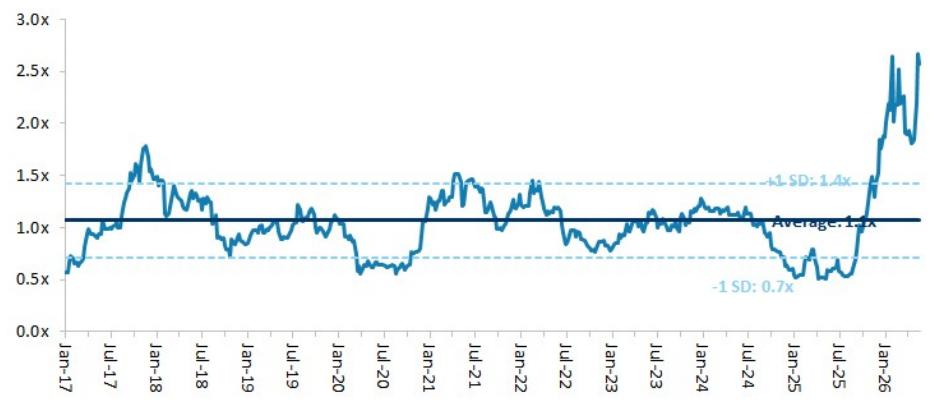

line

| Date   | Value |
|--------|-------|
| Jan-17 | 0.6x  |
| Jul-17 | 1.0x  |
| Jan-18 | 1.8x  |
| Jul-18 | 1.2x  |
| Jan-19 | 0.9x  |
| Jul-19 | 1.1x  |
| Jan-20 | 0.6x  |
| Jul-20 | 0.7x  |
| Jan-21 | 1.5x  |
| Jul-21 | 1.4x  |
| Jan-22 | 1.3x  |
| Jul-22 | 0.9x  |
| Jan-23 | 1.0x  |
| Jul-23 | 1.2x  |
| Jan-24 | 1.3x  |
| Jul-24 | 1.1x  |
| Jan-25 | 0.6x  |
| Jul-25 | 0.8x  |
| Jan-26 | 2.7x  |

Source: Company data, MS estimates

Exhibit 13: Winbond: Historical forward P/B vs ROE   
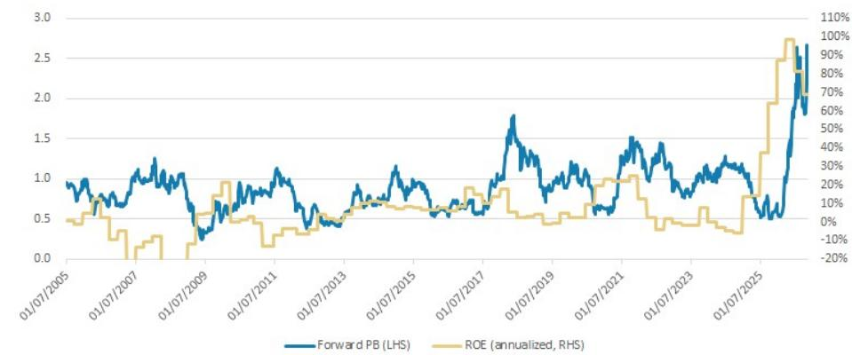

line

| Date       | Forward PB (LHS) | ROE (annualized, RHS) |
| ---------- | ----------------- | ---------------------- |
| 01/07/2005 | 0.9               | 0%                     |
| 01/07/2007 | 1.1               | 10%                    |
| 01/07/2009 | 0.3               | -10%                   |
| 01/07/2011 | 1.1               | 10%                    |
| 01/07/2013 | 0.5               | 0%                     |
| 01/07/2015 | 1.1               | 10%                    |
| 01/07/2017 | 0.6               | 0%                     |
| 01/07/2019 | 1.8               | 30%                    |
| 01/07/2021 | 1.5               | 30%                    |
| 01/07/2023 | 1.3               | 30%                    |
| 01/07/2025 | 2.8               | 90%                    |

Source: Company data, MS estimates

Exhibit 14: Winbond: Earnings estimate revision breadth   
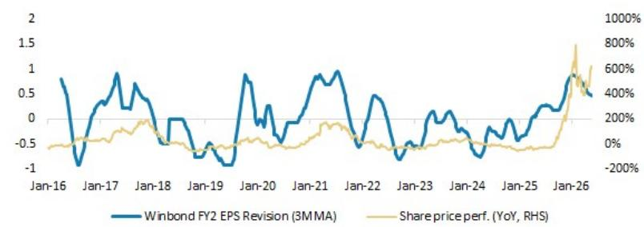

line

| Date   | Winbond FY2 EPS Revision (3MMA) | Share price perf. (YoY, RHS) |
|--------|----------------------------------|-------------------------------|
| Jan-16 | 0.8                              | -0.5                          |
| Jan-17 | -0.9                             | -0.4                          |
| Jan-18 | 0.6                              | -0.3                          |
| Jan-19 | -0.7                             | -0.5                          |
| Jan-20 | 0.9                              | -0.4                          |
| Jan-21 | 0.7                              | -0.3                          |
| Jan-22 | 0.5                              | -0.4                          |
| Jan-23 | -0.6                             | -0.5                          |
| Jan-24 | -0.8                             | -0.6                          |
| Jan-25 | 0.3                              | -0.5                          |
| Jan-26 | 0.5                              | 800%                          |

Source: Company data, MS estimates

# Risk Reward – Winbond Electronics Corp (2344.TW)

DDR, NOR and SLC NAND pricing upside; long-term opportunities in CUBE

# PRICE TARGET NT\$222.00

Base case, 5.5x 2026e P/B. This method is in line with the approach we adopt for Greater China memory IDM peers, in view of the industry's high volatility. We believe the stock merits a multiple beyond the high end of its historical band of 0.5-1.5x since 2017, as we are seeing DRAM pricing upside, a sustainable NOR price hike, and opportunities in SLC NAND and SiCap foundry business.

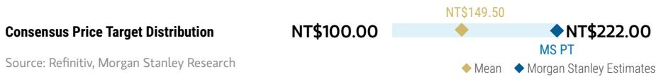

bar_line

| Consensus Price Target | Value     |
| ---------------------- | --------- |
| NT$100.00              | 100.00    |
| NT$149.50              | 149.50    |
| NT$222.00              | 222.00    |

RISK REWARD CHART   
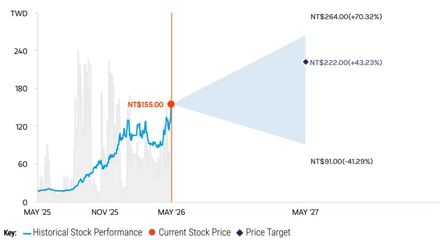

line

| Date       | Historical Stock Performance | Current Stock Price | Price Target |
| ---------- | ----------------------------- | ------------------- | ------------ |
| MAY '25    | ~10                           | -                   | -            |
| NOV '25    | ~60                           | -                   | -            |
| MAY '26    | $155.00                       | -                   | -            |
| MAY '27    | $264.00 (NT$)                 | +70.32%             | $222.00 (NT$) |
| MAY '27    | $91.00 (NT$)                  | -41.29%             | -            |

Source: Refinitiv, MS

# OVERWEIGHT THESIS

■ We expect DDR3 and DDR4 price increases to continue in 2026. The supply/demand gap should widen into 2H26.   
■ We see NOR price hikes continuing throughout 2026.   
■ High density SLC NAND pricing is catching up, and we now expect a larger TAM from data center applications.   
■ We share management's view that CUBE could be meaningful in 2026, given engagement with multiple foundry partners and customers.   
■ We see potential for several headwinds ahead for the logic business.   
■ Our PT implies 3.0x 2027e P/B.

Consensus Rating Distribution   
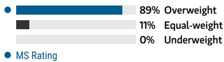

bar

| Category | Value (%) |
|---|---|
| Overweight | 89 |
| Equal-weight | 11 |
| Underweight | 0 |
| MS Rating | (not labeled with value) |

Source: Refinitiv, MS

# Risk Reward Themes

Pricing Power: Positive

View descriptions of Risk Rewards Themes here

# BULL CASE

# 6.5x 2026e BVPS

NOR Flash pricing and DRAM prices rebound more in the next 12 months: NOR Flash rises dramatically. DRAM prices continue to rise drastically within the next 12 months, with 25nm accounting for >80% of sales.

# NT\$264.00

# BASE CASE

# 5.5x 2026e BVPS

Margin expansion benefiting from the memory up-cycle: 1) NOR Flash pricing rises significantly in the next 12 months; and 2) DRAM prices rise significantly in the next 12 months.

# NT\$222.00

# BEAR CASE

# NT\$91.00

# 2.2x 2026e BVPS

NOR Flash prices face pressure in the next 12 months; DRAM market back to oversupply, with slower technology migration: 1) NOR Flash shows price declines; and 2) DRAM prices drop in the next 12 months.

# Risk Reward – Winbond Electronics Corp (2344.TW)

KEY EARNINGS INPUTS 

<table><tr><td>Drivers</td><td>2025</td><td>2026e</td><td>2027e</td><td>2028e</td></tr><tr><td>NOR ASP (%)</td><td>8</td><td>91</td><td>15</td><td>(9)</td></tr><tr><td>DRAM ASP (%)</td><td>(2)</td><td>250</td><td>23</td><td>5</td></tr><tr><td>Mobile RAM sales (NT$, mn)</td><td>5,302</td><td>20,466</td><td>31,117</td><td>33,443</td></tr><tr><td>DRAM sales (NT$, mn)</td><td>27,808</td><td>162,393</td><td>262,521</td><td>295,448</td></tr><tr><td>Flash sales (NT$, mn)</td><td>31,106</td><td>65,008</td><td>83,222</td><td>76,142</td></tr></table>

# INVESTMENT DRIVERS

- DRAM pricing   
- NOR pricing   
- Technology migration

# GLOBAL REVENUE EXPOSURE

0-10% Europe ex UK   
0-10% India   
0-10% Japan   
0-10% MEA   
0-10% North America   
0-10% UK   
20-30% APAC, ex Japan, Mainland China and India   
40-50% Mainland China

Source: MS Estimate View explanation of regional hierarchies here

# MS ALPHA MODELS

1/5

MOST

3 Month

Horizon

Source: Refinitiv, FactSet, MS; 1 is the highest favored Quintile and 5 is the least favored Quintile

# RISKS TO PT/RATING

# RISKS TO UPSIDE

- NOR Flash pricing increase, driven by stronger-than-expected demand   
• Stronger-than-expected DRAM pricing given ongoing supply shortage   
- Faster-than-expected SLC NAND development

# RISKS TO DOWNSIDE

- NOR Flash downcycle, driven by weaker demand   
- Lower-than-expected DRAM pricing given ongoing oversupply   
- Slower-than-expected SLC NAND development

# OWNERSHIP POSITIONING

Inst. Owners, % Active

47.5%

Source: Refinitiv, MS

# MS ESTIMATES VS. CONSENSUS

FY Dec 2026e

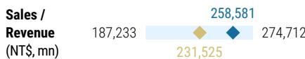

bar_line

| Sales / Revenue (NT$, mn) | Value     |
| -------------------------- | --------- |
| 187,233                    | 258,581   |
| 231,525                    | 274,712   |

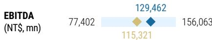

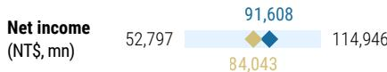

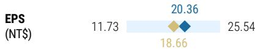

Stanley Estimates

Source: Refinitiv, MS

# Winbond: Financial Summary

Exhibit 15: Financial summary   
Income Statement 

<table><tr><td>NT$mn (Years End Dec )</td><td>2025</td><td>2026E</td><td>2027E</td><td>2028E</td></tr><tr><td>Net sales</td><td>89,406</td><td>258,581</td><td>377,335</td><td>410,515</td></tr><tr><td>COGS</td><td>(58,210)</td><td>(111,702)</td><td>(158,768)</td><td>(178,012)</td></tr><tr><td>Depreciation Expense</td><td>(12,683)</td><td>(15,219)</td><td>(19,785)</td><td>(25,721)</td></tr><tr><td>Variable Cost</td><td>(26,224)</td><td>(77,544)</td><td>(120,048)</td><td>(129,023)</td></tr><tr><td>Gross profit</td><td>31,196</td><td>146,879</td><td>218,567</td><td>232,503</td></tr><tr><td>Operating expenses</td><td>(25,662)</td><td>(33,028)</td><td>(35,211)</td><td>(36,149)</td></tr><tr><td>Operating income</td><td>5,534</td><td>113,852</td><td>183,356</td><td>196,354</td></tr><tr><td>Non-operating income</td><td>(924)</td><td>715</td><td>776</td><td>756</td></tr><tr><td>Pre-tax income</td><td>4,610</td><td>114,567</td><td>184,133</td><td>197,111</td></tr><tr><td>Income tax</td><td>(649)</td><td>(22,960)</td><td>(36,840)</td><td>(40,623)</td></tr><tr><td>Reported net Income</td><td>3,962</td><td>91,607</td><td>147,293</td><td>156,488</td></tr><tr><td>Adj.wtd avg.shrs( m)</td><td>4,500</td><td>4,500</td><td>4,500</td><td>4,500</td></tr><tr><td>Reported EPS (NT$)</td><td>0.88</td><td>20.36</td><td>32.73</td><td>36.09</td></tr><tr><td>Modelware EPS (NT$)</td><td>0.88</td><td>20.36</td><td>32.73</td><td>36.09</td></tr></table>

Balance Sheet 

<table><tr><td>NT$mn (Years End Dec )</td><td>2025</td><td>2026E</td><td>2027E</td><td>2028E</td></tr><tr><td>Cash</td><td>15,734</td><td>19,403</td><td>169,426</td><td>207,048</td></tr><tr><td>Mkt Securities</td><td>13,347</td><td>13,347</td><td>13,347</td><td>13,347</td></tr><tr><td>AR/NR</td><td>16,071</td><td>51,991</td><td>56,480</td><td>57,873</td></tr><tr><td>Inventory</td><td>25,758</td><td>96,884</td><td>105,250</td><td>107,844</td></tr><tr><td>Other</td><td>2,281</td><td>2,281</td><td>2,281</td><td>2,281</td></tr><tr><td>Current Assets</td><td>73,191</td><td>183,906</td><td>346,785</td><td>388,393</td></tr><tr><td>Long-term investments</td><td>19,266</td><td>19,216</td><td>19,156</td><td>19,146</td></tr><tr><td>Fixed assets</td><td>93,800</td><td>88,581</td><td>78,796</td><td>76,838</td></tr><tr><td>Other assets</td><td>5,935</td><td>5,935</td><td>5,935</td><td>5,935</td></tr><tr><td>Total Assets</td><td>192,192</td><td>297,638</td><td>450,672</td><td>490,312</td></tr><tr><td>S/T borrowings</td><td>2,739</td><td>2,739</td><td>2,739</td><td>2,739</td></tr><tr><td>AP/NP</td><td>8,224</td><td>26,133</td><td>28,713</td><td>28,561</td></tr><tr><td>Other ST liabilities</td><td>35,652</td><td>54,893</td><td>57,832</td><td>57,658</td></tr><tr><td>LT debt</td><td>26,399</td><td>26,399</td><td>26,399</td><td>26,399</td></tr><tr><td>Other LT liabilities</td><td>5,048</td><td>5,048</td><td>5,048</td><td>5,048</td></tr><tr><td>Total Liabilities</td><td>78,062</td><td>115,213</td><td>120,731</td><td>120,406</td></tr><tr><td>Common stocks</td><td>45,000</td><td>45,000</td><td>45,000</td><td>45,000</td></tr><tr><td>Preferred stocks</td><td>0</td><td>0</td><td>0</td><td>0</td></tr><tr><td>Capital Reserve</td><td>13,752</td><td>13,752</td><td>13,752</td><td>13,752</td></tr><tr><td>Retained earning</td><td>49,184</td><td>117,480</td><td>264,994</td><td>304,961</td></tr><tr><td>Other shareholders&#x27; equity</td><td>0</td><td>0</td><td>0</td><td>0</td></tr><tr><td>Total Equity</td><td>114,130</td><td>182,426</td><td>329,940</td><td>369,907</td></tr><tr><td>Total Liab. &amp; Shrhldr&#x27;s Equity</td><td>192,192</td><td>297,638</td><td>450,672</td><td>490,312</td></tr><tr><td>BVPS</td><td>25.4</td><td>40.5</td><td>73.3</td><td>82.2</td></tr></table>

Cash Flow Statement 

<table><tr><td>NT$mn (Years End Dec )</td><td>2025</td><td>2026E</td><td>2027E</td><td>2028E</td></tr><tr><td>Cashflow from Operations</td><td>18,668</td><td>45,959</td><td>168,780</td><td>180,980</td></tr><tr><td>Net profits</td><td>3,962</td><td>91,607</td><td>147,293</td><td>156,488</td></tr><tr><td>Depreciation</td><td>12,308</td><td>15,219</td><td>19,785</td><td>19,785</td></tr><tr><td>Working Capital Change</td><td>(6,405)</td><td>(89,136)</td><td>(10,276)</td><td>(4,139)</td></tr><tr><td>Other adjustments</td><td>8,802</td><td>28,269</td><td>11,978</td><td>8,845</td></tr><tr><td>Cashflow from Investing</td><td>(18,259)</td><td>(10,342)</td><td>(10,331)</td><td>(18,209)</td></tr><tr><td>Capex</td><td>(5,300)</td><td>(10,000)</td><td>(10,000)</td><td>(10,000)</td></tr><tr><td>Change of LT Investment</td><td>0</td><td>0</td><td>0</td><td>0</td></tr><tr><td>Change of ST Investment</td><td>(4,827)</td><td>0</td><td>0</td><td>0</td></tr><tr><td>Other adjustments</td><td>(8,132)</td><td>(342)</td><td>(331)</td><td>(8,209)</td></tr><tr><td>Cashflow from financing</td><td>9,931</td><td>(23,311)</td><td>222</td><td>(116,522)</td></tr><tr><td>Increase in L/T debt</td><td>(1,698)</td><td>0</td><td>0</td><td>0</td></tr><tr><td>Increase in S/T debt</td><td>619</td><td>0</td><td>0</td><td>0</td></tr><tr><td>Cash Dividend Paid</td><td>0</td><td>(18,321)</td><td>0</td><td>0</td></tr><tr><td>Dir&amp; Emp Bonus Paid</td><td>0</td><td>0</td><td>0</td><td>0</td></tr><tr><td>Other adjustments</td><td>11,009</td><td>(4,990)</td><td>222</td><td>(116,522)</td></tr><tr><td>Exchange rate adjustment</td><td>(8,706)</td><td>(8,636)</td><td>(8,647)</td><td>(8,627)</td></tr><tr><td>Net change in cash</td><td>1,633</td><td>3,669</td><td>150,023</td><td>37,622</td></tr></table>

Financial Ratio 

<table><tr><td></td><td>2025</td><td>2026E</td><td>2027E</td><td>2028E</td></tr><tr><td colspan="5">Growth(%)</td></tr><tr><td>Turnover</td><td>9.6</td><td>189.2</td><td>45.9</td><td>8.8</td></tr><tr><td colspan="5">Margins (%)</td></tr><tr><td>Gross Margin</td><td>34.9</td><td>56.8</td><td>57.9</td><td>56.6</td></tr><tr><td>Operating Margin</td><td>6.2</td><td>44.0</td><td>48.6</td><td>47.8</td></tr><tr><td>EBITA Margin</td><td>-8.0</td><td>38.1</td><td>43.3</td><td>41.6</td></tr><tr><td>Pretax Margin</td><td>5.2</td><td>44.3</td><td>48.8</td><td>48.0</td></tr><tr><td>Net Profit</td><td>4.4</td><td>35.4</td><td>39.0</td><td>38.1</td></tr><tr><td colspan="5">Return (%)</td></tr><tr><td>ROAE</td><td>4.3</td><td>84.9</td><td>83.6</td><td>48.3</td></tr><tr><td>ROAA</td><td>2.1</td><td>37.4</td><td>39.4</td><td>33.3</td></tr><tr><td colspan="5">Gearing (%)</td></tr><tr><td>Net Debt/Equity</td><td>31.9</td><td>17.9</td><td>(35.6)</td><td>(41.9)</td></tr><tr><td>Liabilities/Equity</td><td>68.4</td><td>63.2</td><td>36.6</td><td>32.6</td></tr><tr><td colspan="5">Ratios (X)</td></tr><tr><td>Current ratio</td><td>1.6</td><td>2.2</td><td>3.9</td><td>4.4</td></tr><tr><td>Quick ratio</td><td>0.7</td><td>0.9</td><td>2.5</td><td>3.0</td></tr><tr><td colspan="5">Others</td></tr><tr><td>AR/NR Turnover (days)</td><td>45</td><td>53</td><td>48</td><td>52</td></tr><tr><td>Inventory Turnover (days)</td><td>107</td><td>102</td><td>87</td><td>98</td></tr><tr><td>AP Turnover (days)</td><td>45</td><td>52</td><td>85</td><td>66</td></tr><tr><td>Cash Conversion (days)</td><td>107</td><td>104</td><td>49</td><td>84</td></tr></table>

Source: Company data, MS (E) estimates

# GigaDevice: Estimate Revisions and Quarterly Financials

We raise our EPS estimates by 58% for 2026 and 60% for 2027. This reflects DDR4 pricing strength and an enlarged SLC NAND TAM.

Exhibit 16: GigaDevice: Estimate revisions 

<table><tr><td>Rmb mn</td><td>2026E</td><td>2026E</td><td>Diff.</td><td>2027E</td><td>2027E</td><td>Diff.</td><td>2028E</td></tr><tr><td>Net sales</td><td>22,018</td><td>17,061</td><td>29%</td><td>32,133</td><td>24,555</td><td>31%</td><td>37,996</td></tr><tr><td>COGS</td><td>9,437</td><td>8,509</td><td></td><td>13,736</td><td>12,045</td><td></td><td>17,583</td></tr><tr><td>Gross profit</td><td>12,581</td><td>8,552</td><td>47%</td><td>18,397</td><td>12,510</td><td>47%</td><td>20,413</td></tr><tr><td>Operating expenses</td><td>2,949</td><td>2,816</td><td></td><td>3,083</td><td>3,275</td><td></td><td>3,354</td></tr><tr><td>Operating profit</td><td>9,632</td><td>5,736</td><td>68%</td><td>15,314</td><td>9,235</td><td>66%</td><td>17,059</td></tr><tr><td>Non-op. income (exp.)</td><td>(125)</td><td>100</td><td></td><td>20</td><td>100</td><td></td><td>20</td></tr><tr><td>Pretax Income</td><td>9,507</td><td>5,836</td><td>63%</td><td>15,334</td><td>9,335</td><td>64%</td><td>17,079</td></tr><tr><td>Taxes</td><td>873</td><td>175</td><td></td><td>1,408</td><td>280</td><td></td><td>1,568</td></tr><tr><td>Net income</td><td>8,589</td><td>5,628</td><td>53%</td><td>13,881</td><td>9,022</td><td>54%</td><td>15,465</td></tr><tr><td>Reported EPS (Rmb)</td><td>12.81</td><td>8.10</td><td>58%</td><td>20.71</td><td>12.98</td><td>60%</td><td>23.07</td></tr><tr><td colspan="8">Margins</td></tr><tr><td>Gross margin</td><td>57.1%</td><td>50.1%</td><td>7.0%</td><td>57.3%</td><td>50.9%</td><td>6.3%</td><td>53.7%</td></tr><tr><td>Operating margin</td><td>43.7%</td><td>33.6%</td><td>10.1%</td><td>47.7%</td><td>37.6%</td><td>10.0%</td><td>44.9%</td></tr><tr><td>Pretax margin</td><td>43.2%</td><td>34.2%</td><td>9.0%</td><td>47.7%</td><td>38.0%</td><td>9.7%</td><td>44.9%</td></tr><tr><td>Net margin</td><td>39.0%</td><td>33.0%</td><td>6.0%</td><td>43.2%</td><td>36.7%</td><td>6.5%</td><td>40.7%</td></tr></table>

Source: MS (E) estimates

Exhibit 17: GigaDevice: Quarterly financials 

<table><tr><td>Rmb mn</td><td>1Q25</td><td>2Q25</td><td>3Q25</td><td>4Q25</td><td>1Q26</td><td>2Q26E</td><td>3Q26E</td><td>4Q26E</td><td>1Q27E</td><td>2Q27E</td><td>3Q27E</td><td>4Q27E</td><td>1Q28E</td><td>2Q28E</td><td>3Q28E</td><td>4Q28E</td><td>2024</td><td>2025</td><td>2026E</td><td>2027E</td><td>2028E</td></tr><tr><td>Total Revenues</td><td>1,909</td><td>2,241</td><td>2,681</td><td>2,372</td><td>4,188</td><td>4,957</td><td>5,936</td><td>6,936</td><td>7,316</td><td>7,900</td><td>8,303</td><td>8,614</td><td>8,852</td><td>9,278</td><td>9,727</td><td>10,140</td><td>7,356</td><td>9,203</td><td>22,018</td><td>32,133</td><td>37,996</td></tr><tr><td>Sequential Change</td><td>11.9%</td><td>17.4%</td><td>19.6%</td><td>-11.5%</td><td>76.6%</td><td>18.4%</td><td>19.7%</td><td>16.8%</td><td>5.5%</td><td>8.0%</td><td>5.1%</td><td>3.7%</td><td>2.8%</td><td>4.8%</td><td>4.8%</td><td>4.2%</td><td></td><td></td><td></td><td></td><td></td></tr><tr><td>Change vs Year Ago</td><td>17.3%</td><td>13.1%</td><td>31.4%</td><td>39.0%</td><td>119.4%</td><td>133.7%</td><td>121.4%</td><td>192.4%</td><td>74.7%</td><td>59.3%</td><td>39.9%</td><td>24.2%</td><td>21.0%</td><td>17.5%</td><td>17.1%</td><td>17.7%</td><td>27.7%</td><td>25.1%</td><td>139.2%</td><td>45.9%</td><td>18.2%</td></tr><tr><td>Cost of Sales</td><td>1,194</td><td>1,417</td><td>1,589</td><td>1,307</td><td>1,798</td><td>2,270</td><td>2,558</td><td>2,803</td><td>3,010</td><td>3,348</td><td>3,618</td><td>3,761</td><td>3,945</td><td>4,255</td><td>4,578</td><td>4,865</td><td>4,561</td><td>5,502</td><td>9,437</td><td>13,736</td><td>17,583</td></tr><tr><td>Percent of Revenues</td><td>63%</td><td>63%</td><td>59%</td><td>55%</td><td>43%</td><td>46%</td><td>43%</td><td>40%</td><td>41%</td><td>42%</td><td>44%</td><td>45%</td><td>45%</td><td>46%</td><td>47%</td><td>47%</td><td>62%</td><td>60%</td><td>43%</td><td>43%</td><td>46%</td></tr><tr><td>Gross Profit</td><td>715</td><td>830</td><td>1,092</td><td>1,065</td><td>2,390</td><td>2,680</td><td>3,378</td><td>4,132</td><td>4,306</td><td>4,552</td><td>4,686</td><td>4,853</td><td>4,907</td><td>5,023</td><td>5,148</td><td>5,338</td><td>2,795</td><td>3,701</td><td>12,581</td><td>18,397</td><td>20,413</td></tr><tr><td>Percent of Revenues</td><td>37.4%</td><td>37.0%</td><td>40.7%</td><td>44.9%</td><td>57.1%</td><td>54.1%</td><td>56.9%</td><td>59.6%</td><td>58.9%</td><td>57.6%</td><td>56.4%</td><td>56.3%</td><td>55.4%</td><td>54.1%</td><td>52.9%</td><td>52.6%</td><td>38.0%</td><td>40.2%</td><td>57.1%</td><td>57.3%</td><td>53.7%</td></tr><tr><td>Incremental Margin</td><td>73%</td><td>35%</td><td>60%</td><td>NM</td><td>73%</td><td>38%</td><td>71%</td><td>73%</td><td>46%</td><td>42%</td><td>33%</td><td>54%</td><td>22%</td><td>27%</td><td>28%</td><td>45%</td><td>51%</td><td>49%</td><td>69%</td><td>58%</td><td>34%</td></tr><tr><td>Total Opex</td><td>540</td><td>545</td><td>524</td><td>518</td><td>666</td><td>706</td><td>757</td><td>819</td><td>719</td><td>753</td><td>786</td><td>826</td><td>789</td><td>818</td><td>852</td><td>896</td><td>1,984</td><td>2,176</td><td>2,948</td><td>3,083</td><td>3,334</td></tr><tr><td>Percent of Revenues</td><td>28.3%</td><td>24.3%</td><td>21.4%</td><td>21.8%</td><td>15.9%</td><td>14.2%</td><td>12.8%</td><td>11.8%</td><td>9.8%</td><td>9.5%</td><td>9.5%</td><td>9.6%</td><td>8.9%</td><td>8.8%</td><td>8.8%</td><td>8.8%</td><td>27.0%</td><td>23.6%</td><td>13.4%</td><td>9.6%</td><td>8.8%</td></tr><tr><td>R&amp;D</td><td>292</td><td>276</td><td>292</td><td>257</td><td>358</td><td>368</td><td>383</td><td>403</td><td>290</td><td>300</td><td>315</td><td>335</td><td>290</td><td>300</td><td>315</td><td>335</td><td>1,122</td><td>1,117</td><td>1,513</td><td>1,240</td><td>1,240</td></tr><tr><td>Percent of Revenues</td><td>15.3%</td><td>12.3%</td><td>10.9%</td><td>10.8%</td><td>8.6%</td><td>7.4%</td><td>6.5%</td><td>5.8%</td><td>4.0%</td><td>3.8%</td><td>3.8%</td><td>3.9%</td><td>3.3%</td><td>3.2%</td><td>3.2%</td><td>3.3%</td><td>15.3%</td><td>12.1%</td><td>6.9%</td><td>3.9%</td><td>3.3%</td></tr><tr><td>General &amp; administrative</td><td>136</td><td>156</td><td>161</td><td>160</td><td>174</td><td>179</td><td>184</td><td>194</td><td>195</td><td>200</td><td>205</td><td>215</td><td>216</td><td>221</td><td>226</td><td>236</td><td>491</td><td>612</td><td>732</td><td>816</td><td>900</td></tr><tr><td>Percent of Revenues</td><td>7.1%</td><td>6.9%</td><td>6.0%</td><td>6.7%</td><td>4.2%</td><td>3.6%</td><td>3.1%</td><td>2.8%</td><td>2.7%</td><td>2.5%</td><td>2.5%</td><td>2.5%</td><td>2.4%</td><td>2.4%</td><td>2.3%</td><td>2.3%</td><td>6.7%</td><td>6.7%</td><td>3.3%</td><td>2.5%</td><td>2.4%</td></tr><tr><td>Selling &amp; marketing</td><td>112</td><td>113</td><td>121</td><td>101</td><td>134</td><td>158</td><td>190</td><td>222</td><td>234</td><td>252</td><td>265</td><td>275</td><td>283</td><td>296</td><td>311</td><td>324</td><td>371</td><td>446</td><td>704</td><td>1,027</td><td>1,214</td></tr><tr><td>Percent of Revenues</td><td>5.8%</td><td>5.0%</td><td>4.5%</td><td>4.3%</td><td>3.2%</td><td>3.2%</td><td>3.2%</td><td>3.2%</td><td>3.2%</td><td>3.2%</td><td>3.2%</td><td>3.2%</td><td>3.2%</td><td>3.2%</td><td>3.2%</td><td>3.2%</td><td>5.0%</td><td>4.8%</td><td>3.2%</td><td>3.2%</td><td>3.2%</td></tr><tr><td>Operating Income</td><td>175</td><td>285</td><td>518</td><td>547</td><td>1,724</td><td>1,974</td><td>2,621</td><td>3,313</td><td>3,587</td><td>3,799</td><td>3,900</td><td>4,028</td><td>4,118</td><td>4,205</td><td>4,296</td><td>4,440</td><td>811</td><td>1,526</td><td>9,632</td><td>15,314</td><td>17,059</td></tr><tr><td>Percent of Revenues</td><td>9.2%</td><td>12.7%</td><td>19.3%</td><td>23.1%</td><td>41.2%</td><td>39.8%</td><td>44.1%</td><td>47.8%</td><td>49.0%</td><td>48.1%</td><td>47.0%</td><td>46.8%</td><td>46.5%</td><td>45.3%</td><td>44.2%</td><td>43.8%</td><td>11.0%</td><td>16.6%</td><td>43.7%</td><td>47.7%</td><td>44.9%</td></tr><tr><td>Change in Year Ago</td><td>12.7%</td><td>19.4%</td><td>36.9%</td><td>1331.9%</td><td>883.7%</td><td>562.4%</td><td>406.0%</td><td>505.4%</td><td>108.1%</td><td>92.5%</td><td>48.8%</td><td>21.6%</td><td>14.8%</td><td>10.7%</td><td>10.2%</td><td>20.2%</td><td>130%</td><td>88%</td><td>531%</td><td>59%</td><td>11%</td></tr><tr><td>Total Non-operating Income/(loss)</td><td>60</td><td>75</td><td>10</td><td>35</td><td>(103)</td><td>(7)</td><td>(7)</td><td>(7)</td><td>5</td><td>5</td><td>5</td><td>5</td><td>5</td><td>5</td><td>5</td><td>5</td><td>313</td><td>181</td><td>(125)</td><td>20</td><td>20</td></tr><tr><td>Profit Before Taxes</td><td>236</td><td>360</td><td>528</td><td>683</td><td>1,621</td><td>1,966</td><td>2,614</td><td>3,306</td><td>3,592</td><td>3,804</td><td>3,905</td><td>4,033</td><td>4,123</td><td>4,210</td><td>4,301</td><td>4,440</td><td>1,124</td><td>1,706</td><td>9,057</td><td>15,334</td><td>17,079</td></tr><tr><td>Percent of Revenues</td><td>12%</td><td>16%</td><td>20%</td><td>25%</td><td>39%</td><td>40%</td><td>44%</td><td>48%</td><td>49%</td><td>49%</td><td>47%</td><td>47%</td><td>47%</td><td>45%</td><td>44%</td><td>44%</td><td>15%</td><td>19%</td><td>43%</td><td>48%</td><td>45%</td></tr><tr><td>Taxes</td><td>(4)</td><td>12</td><td>11</td><td>10</td><td>149</td><td>181</td><td>245</td><td>304</td><td>330</td><td>349</td><td>359</td><td>370</td><td>379</td><td>387</td><td>395</td><td>408</td><td>23</td><td>29</td><td>873</td><td>1,408</td><td>1,568</td></tr><tr><td>Tax Rate</td><td>-1.7%</td><td>3.4%</td><td>2.1%</td><td>1.7%</td><td>9.2%</td><td>9.2%</td><td>9.2%</td><td>9.2%</td><td>9.2%</td><td>9.2%</td><td>9.2%</td><td>9.2%</td><td>9.2%</td><td>9.2%</td><td>9.2%</td><td>9.2%</td><td>2.0%</td><td>1.7%</td><td>9.2%</td><td>9.2%</td><td>9.2%</td></tr><tr><td>Net Income, Cont Ops</td><td>240</td><td>348</td><td>517</td><td>573</td><td>1,473</td><td>1,786</td><td>2,374</td><td>3,002</td><td>3,262</td><td>3,455</td><td>3,547</td><td>3,663</td><td>3,744</td><td>3,826</td><td>3,906</td><td>4,030</td><td>1,101</td><td>1,677</td><td>8,634</td><td>13,926</td><td>15,511</td></tr><tr><td>Percent of Revenues</td><td>13%</td><td>16%</td><td>19%</td><td>24%</td><td>35%</td><td>36%</td><td>40%</td><td>43%</td><td>45%</td><td>44%</td><td>43%</td><td>43%</td><td>42%</td><td>41%</td><td>40%</td><td>40%</td><td>15%</td><td>18%</td><td>39%</td><td>43%</td><td>41%</td></tr><tr><td>Reported Income</td><td>235</td><td>341</td><td>508</td><td>565</td><td>1,461</td><td>1,774</td><td>2,362</td><td>2,991</td><td>3,251</td><td>3,444</td><td>3,535</td><td>3,651</td><td>3,733</td><td>3,813</td><td>3,895</td><td>4,025</td><td>1,103</td><td>1,648</td><td>8,589</td><td>13,881</td><td>15,465</td></tr><tr><td>Percent of Revenues</td><td>12%</td><td>15%</td><td>19%</td><td>24%</td><td>35%</td><td>36%</td><td>40%</td><td>43%</td><td>44%</td><td>44%</td><td>43%</td><td>42%</td><td>42%</td><td>41%</td><td>40%</td><td>40%</td><td>15%</td><td>18%</td><td>39%</td><td>43%</td><td>41%</td></tr><tr><td>Change in Year Ago</td><td>15%</td><td>9%</td><td>61%</td><td>109%</td><td>522%</td><td>421%</td><td>365%</td><td>430%</td><td>122%</td><td>94%</td><td>50%</td><td>22%</td><td>15%</td><td>11%</td><td>10%</td><td>10%</td><td>584%</td><td>49%</td><td>421%</td><td>62%</td><td>11%</td></tr><tr><td>Reported EPS (Rmb)</td><td>0.35</td><td>0.51</td><td>0.76</td><td>0.85</td><td>2.18</td><td>2.65</td><td>3.52</td><td>4.46</td><td>4.85</td><td>5.14</td><td>5.27</td><td>5.45</td><td>5.57</td><td>5.69</td><td>5.81</td><td>6.01</td><td>1.66</td><td>2.48</td><td>12.81</td><td>20.71</td><td>23.07</td></tr><tr><td>Change in Year Ago</td><td>15%</td><td>60%</td><td>118%</td><td>108%</td><td>517%</td><td>416%</td><td>362%</td><td>428%</td><td>122%</td><td>94%</td><td>50%</td><td>22%</td><td>15%</td><td>11%</td><td>10%</td><td>10%</td><td>585%</td><td>50%</td><td>417%</td><td>62%</td><td>11%</td></tr></table>

Source: Company data, MS (E) estimates

# GigaDevice: Valuation methodology

We raise our price target (base case scenario value) by 68% to Rmb585: We continue to derive our price target from a residual income model, which we believe best captures the stock's long-term value. Our key assumptions include a cost of equity of 8.9% (beta 1.1, risk-free rate 2%, and risk premium 6%), a payout ratio of 40%, a medium-term growth rate of 16.4% and a terminal growth rate of 3.0% (all unchanged). Our new price target implies 2026e P/E of 46x, above the historical average of 40x since 2016. Our bull case value rises to Rmb1,016 from Rmb604, and our bear case value increases to Rmb427 from Rmb254.

Exhibit 18: GigaDevice: Residual Income model 

<table><tr><td>Rmb mn</td><td>2026E</td><td>2027E</td><td>2028E</td><td>2029E</td><td>2030E</td><td>2031E</td><td>2032E</td><td>2033E</td><td>2034E</td><td>2035E</td><td>2036E</td><td>2037E</td></tr><tr><td>Total Equity</td><td>27,317</td><td>38,622</td><td>49,923</td><td>61,407</td><td>74,768</td><td>90,314</td><td>108,402</td><td>129,447</td><td>153,933</td><td>182,423</td><td>215,570</td><td>254,138</td></tr><tr><td>Net Profit</td><td>8,589</td><td>13,881</td><td>15,465</td><td>17,994</td><td>20,936</td><td>24,359</td><td>28,342</td><td>32,976</td><td>38,367</td><td>44,640</td><td>51,939</td><td>60,431</td></tr><tr><td>ROAE</td><td>36.9%</td><td>42.1%</td><td>34.9%</td><td>32.3%</td><td>30.7%</td><td>29.5%</td><td>28.5%</td><td>27.7%</td><td>27.1%</td><td>26.5%</td><td>26.1%</td><td>25.7%</td></tr><tr><td>Residual Income</td><td>5,387</td><td>9,074</td><td>10,059</td><td>11,701</td><td>13,425</td><td>15,421</td><td>17,736</td><td>20,425</td><td>23,548</td><td>27,179</td><td>31,402</td><td>36,312</td></tr><tr><td>Spread</td><td>28.0%</td><td>33.2%</td><td>26.0%</td><td>23.4%</td><td>21.9%</td><td>20.6%</td><td>19.6%</td><td>18.8%</td><td>18.2%</td><td>17.7%</td><td>17.2%</td><td>16.8%</td></tr><tr><td>Ending Equity Capital</td><td>27,317</td><td></td><td></td><td></td><td></td><td></td><td></td><td></td><td></td><td></td><td></td><td></td></tr><tr><td>PV of Forecast Period</td><td>93,912</td><td></td><td></td><td></td><td></td><td></td><td></td><td></td><td></td><td></td><td></td><td></td></tr><tr><td>PV of Continuing Value</td><td>271,171</td><td></td><td></td><td></td><td></td><td></td><td></td><td></td><td></td><td></td><td></td><td></td></tr><tr><td>Equity Value</td><td>392,401</td><td></td><td></td><td></td><td></td><td></td><td></td><td></td><td></td><td></td><td></td><td></td></tr><tr><td>No. of Shares</td><td>670</td><td></td><td></td><td></td><td></td><td></td><td></td><td></td><td></td><td></td><td></td><td></td></tr><tr><td>Projected Price (Rmb)</td><td>585</td><td></td><td></td><td></td><td></td><td></td><td></td><td></td><td></td><td></td><td></td><td></td></tr></table>

Source: MS (E) estimates

Exhibit 19: GigaDevice: historical forward P/E   
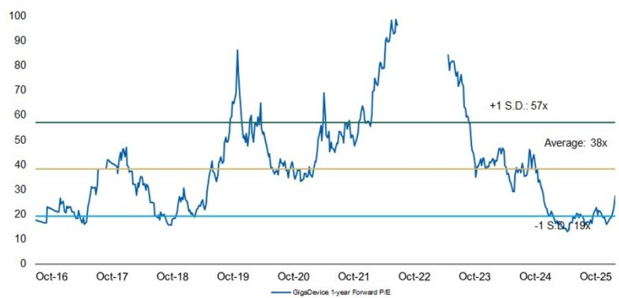

line

| Date    | GigaDevice 1-year Forward P/E |
|---------|-------------------------------|
| Oct-16  | ~18                           |
| Oct-17  | ~45                           |
| Oct-18  | ~20                           |
| Oct-19  | ~85                           |
| Oct-20  | ~35                           |
| Oct-21  | ~65                           |
| Oct-22  | ~95                           |
| Oct-23  | ~40                           |
| Oct-24  | ~20                           |
| Oct-25  | ~19                           |

Source: Company data, MS estimates

# Risk Reward – GigaDevice Semiconductor Beijing Inc (603986.SS)

Multiple drivers ahead

# PRICE TARGET Rmb585.00

Our price target is our base case value, derived from our residual income model. Key assumptions: cost of equity of 8.9% (beta 1.1, risk-free rate 2% and risk premium 6%), a payout ratio of 40%, medium-term growth rate of 16.4%, and a terminal growth rate of 3.0%.

Consensus Price Target Distribution

Source: Refinitiv, MS

Rmb220.00

◆ Mean ◆ MS Estimates

RISK REWARD CHART   
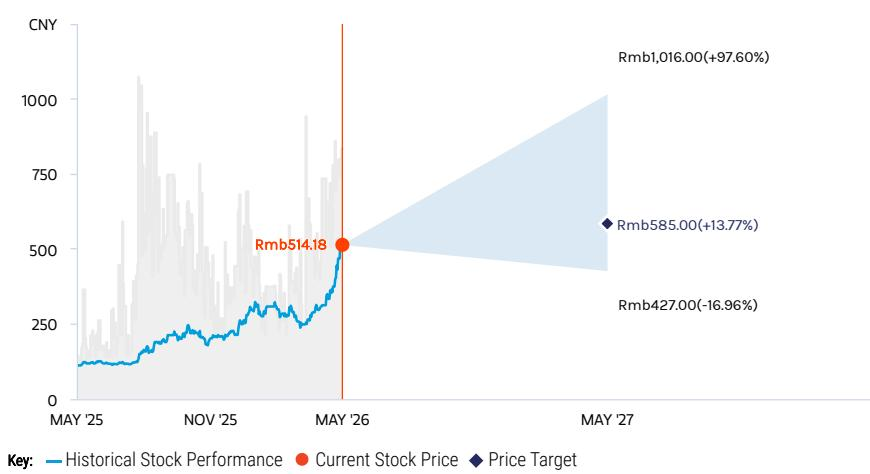

line

| Date     | Historical Stock Performance | Current Stock Price | Price Target |
| -------- | ---------------------------- | ------------------- | ------------ |
| MAY '25  | ~100                         | -                   | -            |
| NOV '25  | ~200                         | -                   | -            |
| MAY '26  | ~500                         | Rmb514.18           | -            |
| MAY '27  | -                            | Rmb1,016.00         | Rmb585.00    |
|        | -                            | -                   | Rmb427.00    |

Source: Refinitiv, MS

# OVERWEIGHT THESIS

■ We expect GigaDevice to continue to gain share in China's MCU market. Auto MCUs offer bigger opportunities as local self-sufficiency is low.

■ We see further NOR Flash pricing upside, and expect GigaDevice NOR quality to catch up in the auto segment.   
■ Specialty DRAM pricing started to rebound in late 1Q25, and there are opportunities such as wafer-on-wafer specialty memory.   
■ We believe GigaDevice will ramp up 16G LPDDR4 and 32G DDR4 at CXMT's Gen 4 platform in 2027.   
- Our price target implies 2026e P/E of 46x, slightly above the historical average of 40x since 2016.

Consensus Rating Distribution   
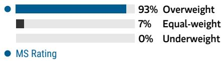

bar

| Category      | Value |
| ------------- | ----- |
| Overweight    | 93%   |
| Equal-weight  | 7%    |
| Underweight   | 0%    |
| MS Rating     | 0%    |

Source: Refinitiv, MS

# Risk Reward Themes

Pricing Power: Positive

Secular Growth: Positive

View descriptions of Risk Rewards Themes here

# BULL CASE

# 79x 2026e EPS

NOR flash prices rise more sharply into 2H26, and the company increases production of mid-/high-density NOR; MCU growth accelerates; DRAM business shows significant contribution: 1) NOR flash sales grow 120%+ Y/Y in 2026 via price hikes and meaningful growth in demand; 2) MCU sales growth significantly exceeds 40% in 2026; 3) contribution from WoW tops expectations in 2026-27e; 4) DDR4 price hike stronger than expected; 5) gross margin above 60% in 2026.

# Rmb1,016.00

# BASE CASE

# 46x 2026e EPS

NOR and DRAM pricing upside in 2026; moderate WoW contribution: 1) NOR flash sales rise 91%+ Y/Y in 2026; 2) MCU grows 28% in 2026; 3) moderate contribution from WoW in 2026-27e; 4) significant DDR4 price hike in 2026; 5) gross margin at \~57% in 2026.

# Rmb585.00

# BEAR CASE

# 33x 2026e EPS

# Rmb427.00

NOR Flash price falls sharply into 2H26; MCU faces stronger competition from foreign and local vendors; pause in DRAM business development: 1) NOR flash sales decline in 2026, as ASP starts to drop; 2) MCU sales decrease >10% Y/Y in 2026; 3) contribution from WoW falls below expectations in 2026-27e; 4) DDR4 price declines; 5) gross margin below 35% in 2026.

# Risk Reward – GigaDevice Semiconductor Beijing Inc (603986.SS)

KEY EARNINGS INPUTS 

<table><tr><td>Drivers</td><td>2025</td><td>2026e</td><td>2027e</td><td>2028e</td></tr><tr><td>NOR Flash ASP growth (%)</td><td>4</td><td>52</td><td>8</td><td>0</td></tr><tr><td>MCU ASP growth (%)</td><td>(8)</td><td>0</td><td>0</td><td>0</td></tr><tr><td>Gross margin (%)</td><td>40</td><td>56</td><td>57</td><td>54</td></tr></table>

# INVESTMENT DRIVERS

• Beneficiary of MCU localization   
• Decreasing opex burden   
• Development of AI glasses market

# GLOBAL REVENUE EXPOSURE

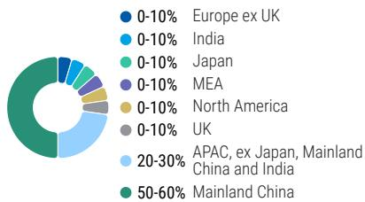

pie

| Region | Percentage (%) |
| :--- | :--- |
| Europe ex UK | 0-10 |
| India | 0-10 |
| Japan | 0-10 |
| MEA | 0-10 |
| North America | 0-10 |
| UK | 0-10 |
| APAC, ex Japan, Mainland China and India | 20-30 |
| Mainland China | 50-60 |

Source: MS Estimate View explanation of regional hierarchies here

# MS ALPHA MODELS

4/5

MOST

3 Month

Horizon

Source: Refinitiv, FactSet, MS; 1 is the highest favored Quintile and 5 is the least favored Quintile

# RISKS TO PT/RATING

# RISKS TO UPSIDE

• NOR up-cycle driven by stronger demand   
- Superior chip design, leading to increasing exposure to low-density NOR   
- Faster-than-expected DRAM development

# RISKS TO DOWNSIDE

• NOR down-cycle driven by weaker demand   
- Inferior chip design, leading to increasing exposure to mid-/high-density NOR   
- Slower-than-expected DRAM development

# OWNERSHIP POSITIONING

Inst. Owners, % Active

61.1%

Source: Refinitiv, MS

# MS ESTIMATES VS. CONSENSUS

FY Dec 2026e

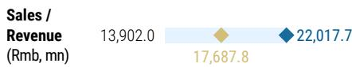

bar_line

| Sales / Revenue (Rmb, mn) | Value    |
| -------------------------- | -------- |
|                 | 13,902.0 |
|                 | 17,687.8 |
|                 | 22,017.7 |

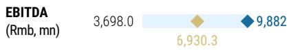

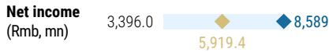

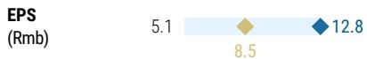

Mean

lorc

Star

Est

ima

Source: Refinitiv, MS

# GigaDevice: Financial Summary

Exhibit 20: Financial Summary   
Income Statement 

<table><tr><td>Rmb mn (Years End Dec )</td><td>2024</td><td>2025</td><td>2026E</td><td>2027E</td><td>2028E</td></tr><tr><td>Net sales</td><td>7,356</td><td>9,203</td><td>22,018</td><td>32,133</td><td>37,996</td></tr><tr><td>COGS</td><td>(4,561)</td><td>(5,502)</td><td>(9,437)</td><td>(13,736)</td><td>(17,583)</td></tr><tr><td>Gross profit</td><td>2,795</td><td>3,701</td><td>12,581</td><td>18,397</td><td>20,413</td></tr><tr><td>Operating expenses</td><td>(1,984)</td><td>(2,176)</td><td>(2,949)</td><td>(3,083)</td><td>(3,354)</td></tr><tr><td>Operating income</td><td>811</td><td>1,526</td><td>9,632</td><td>15,314</td><td>17,059</td></tr><tr><td>Non-operating income</td><td>313</td><td>181</td><td>(125)</td><td>20</td><td>20</td></tr><tr><td>Pre-tax income</td><td>1,124</td><td>1,706</td><td>9,507</td><td>15,334</td><td>17,079</td></tr><tr><td>Income tax</td><td>23</td><td>29</td><td>873</td><td>1,408</td><td>1,568</td></tr><tr><td>Minority interests</td><td>2</td><td>(29)</td><td>(45)</td><td>(45)</td><td>(45)</td></tr><tr><td>Reported net income</td><td>1,103</td><td>1,648</td><td>8,589</td><td>13,881</td><td>15,465</td></tr><tr><td>Adj.wtd.avg.shrs(m)</td><td>666</td><td>666</td><td>670</td><td>670</td><td>670</td></tr><tr><td>MW EPS (Rmb)</td><td>1.66</td><td>2.48</td><td>12.81</td><td>20.71</td><td>23.07</td></tr><tr><td>Reported EPS (Rmb)</td><td>1.66</td><td>2.48</td><td>12.81</td><td>20.71</td><td>23.07</td></tr></table>

Balance Sheet 

<table><tr><td>Rmb mn (Years End Dec )</td><td>2024</td><td>2025</td><td>2026E</td><td>2027E</td><td>2028E</td></tr><tr><td>Cash</td><td>9,128</td><td>9,186</td><td>15,986</td><td>25,582</td><td>35,432</td></tr><tr><td>Mkt Securities</td><td>120</td><td>102</td><td>102</td><td>102</td><td>102</td></tr><tr><td>AR/NR</td><td>232</td><td>199</td><td>537</td><td>784</td><td>927</td></tr><tr><td>Inventory</td><td>2,346</td><td>3,066</td><td>4,487</td><td>6,532</td><td>8,361</td></tr><tr><td>Other</td><td>609</td><td>873</td><td>873</td><td>873</td><td>873</td></tr><tr><td>Current Assets</td><td>12,435</td><td>13,425</td><td>21,985</td><td>33,872</td><td>45,694</td></tr><tr><td>Long-term investments</td><td>3,503</td><td>4,085</td><td>4,085</td><td>4,085</td><td>4,085</td></tr><tr><td>Fixed assets</td><td>1,062</td><td>1,325</td><td>1,325</td><td>1,325</td><td>1,325</td></tr><tr><td>Deferred assets</td><td>426</td><td>432</td><td>432</td><td>432</td><td>432</td></tr><tr><td>Other assets</td><td>1,803</td><td>2,129</td><td>2,129</td><td>2,129</td><td>2,129</td></tr><tr><td>Total Assets</td><td>19,229</td><td>21,397</td><td>29,956</td><td>41,843</td><td>53,665</td></tr><tr><td>S/T borrowings</td><td>898</td><td>200</td><td>200</td><td>200</td><td>200</td></tr><tr><td>AP/NP</td><td>734</td><td>813</td><td>1,278</td><td>1,860</td><td>2,382</td></tr><tr><td>Other ST liabilities</td><td>699</td><td>934</td><td>934</td><td>934</td><td>934</td></tr><tr><td>LT debt</td><td>0</td><td>0</td><td>0</td><td>0</td><td>0</td></tr><tr><td>Other LT liabilities</td><td>220</td><td>226</td><td>226</td><td>226</td><td>226</td></tr><tr><td>Total Liabilities</td><td>2,550</td><td>2,174</td><td>2,639</td><td>3,221</td><td>3,742</td></tr><tr><td>Common shares</td><td>664</td><td>668</td><td>668</td><td>668</td><td>668</td></tr><tr><td>Additional capital</td><td>8,656</td><td>9,201</td><td>9,201</td><td>9,201</td><td>9,201</td></tr><tr><td>Retained earning</td><td>6,796</td><td>8,407</td><td>16,502</td><td>27,806</td><td>39,107</td></tr><tr><td>Other shareholders&#x27; equity</td><td>563</td><td>946</td><td>946</td><td>946</td><td>946</td></tr><tr><td>Total Equity</td><td>16,679</td><td>19,223</td><td>27,317</td><td>38,622</td><td>49,923</td></tr><tr><td>Total Liab. &amp; Shrhldr&#x27;s Equity</td><td>19,229</td><td>21,397</td><td>29,956</td><td>41,843</td><td>53,665</td></tr></table>

E = MS Estimates   
Source: MS, Company Data

Cash Flow Statement 

<table><tr><td>Rmb mn (Years End Dec )</td><td>2024</td><td>2025</td><td>2026E</td><td>2027E</td><td>2028E</td></tr><tr><td>Cashflow from Operations</td><td>2,032</td><td>2,032</td><td>7,544</td><td>12,422</td><td>14,264</td></tr><tr><td>Net profits</td><td>1,103</td><td>1,648</td><td>8,589</td><td>13,881</td><td>15,465</td></tr><tr><td>Depreciation</td><td>269</td><td>250</td><td>250</td><td>250</td><td>250</td></tr><tr><td>Working Capital Change</td><td>(397)</td><td>(440)</td><td>(1,295)</td><td>(1,709)</td><td>(1,451)</td></tr><tr><td>Other adjustments</td><td>1,058</td><td>574</td><td>0</td><td>0</td><td>0</td></tr><tr><td>Cashflow from Investing</td><td>(669)</td><td>(1,391)</td><td>(250)</td><td>(250)</td><td>(250)</td></tr><tr><td>Capex</td><td>(499)</td><td>(1,049)</td><td>(250)</td><td>(250)</td><td>(250)</td></tr><tr><td>Change of LT Investment</td><td>(1,975)</td><td>(1,886)</td><td>0</td><td>0</td><td>0</td></tr><tr><td>Change of ST Investment</td><td>0</td><td>0</td><td>0</td><td>0</td><td>0</td></tr><tr><td>Other adjustments</td><td>1,805</td><td>1,544</td><td>0</td><td>0</td><td>0</td></tr><tr><td>Cashflow from financing</td><td>480</td><td>(517)</td><td>(494)</td><td>(2,577)</td><td>(4,164)</td></tr><tr><td>Increase in L/T debt</td><td>0</td><td>0</td><td>0</td><td>0</td><td>0</td></tr><tr><td>Increase in S/T debt</td><td>898</td><td>(698)</td><td>0</td><td>0</td><td>0</td></tr><tr><td>Cash Dividend Paid</td><td>(15)</td><td>(243)</td><td>(494)</td><td>(2,577)</td><td>(4,164)</td></tr><tr><td>Dir&amp; Emp Bonus Paid</td><td>0</td><td>0</td><td>0</td><td>0</td><td>0</td></tr><tr><td>Issuance of stock</td><td>5</td><td>516</td><td>0</td><td>0</td><td>0</td></tr><tr><td>Other adjustments</td><td>(407)</td><td>(92)</td><td>0</td><td>0</td><td>0</td></tr><tr><td>Exchange rate adjustment</td><td>107</td><td>21</td><td>0</td><td>0</td><td>0</td></tr><tr><td>Net change in cash</td><td>1,950</td><td>146</td><td>6,800</td><td>9,596</td><td>9,850</td></tr></table>

Financial Ratios 

<table><tr><td></td><td>2024</td><td>2025</td><td>2026E</td><td>2027E</td><td>2028E</td></tr><tr><td colspan="6">Growth(%)</td></tr><tr><td>Turnover</td><td>27.7</td><td>25.1</td><td>139.2</td><td>45.9</td><td>18.2</td></tr><tr><td>Operating profits</td><td>129.9</td><td>88.1</td><td>531.4</td><td>59.0</td><td>11.4</td></tr><tr><td>EPS</td><td>585.3</td><td>49.6</td><td>417.5</td><td>61.6</td><td>11.4</td></tr><tr><td colspan="6">Margins (%)</td></tr><tr><td>Gross Margin</td><td>38.0</td><td>40.2</td><td>57.1</td><td>57.3</td><td>53.7</td></tr><tr><td>Operating Margin</td><td>11.0</td><td>16.6</td><td>43.7</td><td>47.7</td><td>44.9</td></tr><tr><td>Pretax Margin</td><td>15.3</td><td>18.5</td><td>43.2</td><td>47.7</td><td>44.9</td></tr><tr><td>Net Margin</td><td>15.0</td><td>17.9</td><td>39.0</td><td>43.2</td><td>40.7</td></tr><tr><td colspan="6">Return (%)</td></tr><tr><td>ROAE</td><td>6.9</td><td>9.2</td><td>36.9</td><td>42.1</td><td>34.9</td></tr><tr><td>ROAA</td><td>6.2</td><td>8.1</td><td>33.5</td><td>38.7</td><td>32.4</td></tr><tr><td colspan="6">Gearing (%)</td></tr><tr><td>Net Debt/Equity</td><td>(49.3)</td><td>(46.7)</td><td>(57.8)</td><td>(65.7)</td><td>(70.6)</td></tr><tr><td>Liabilities/Equity</td><td>15.3</td><td>11.3</td><td>9.7</td><td>8.3</td><td>7.5</td></tr><tr><td colspan="6">Ratios (X)</td></tr><tr><td>Current ratio</td><td>5.3</td><td>6.9</td><td>9.1</td><td>11.3</td><td>13.0</td></tr><tr><td>Quick ratio</td><td>4.0</td><td>4.8</td><td>6.8</td><td>8.8</td><td>10.3</td></tr><tr><td colspan="6">Others</td></tr><tr><td>AR/NR Turnover (days)</td><td>9</td><td>9</td><td>9</td><td>9</td><td>9</td></tr><tr><td>Inventory Turnover (days)</td><td>174</td><td>174</td><td>174</td><td>174</td><td>174</td></tr><tr><td>AP Turnover (days)</td><td>49</td><td>49</td><td>49</td><td>49</td><td>49</td></tr><tr><td>Cash Conversion (days)</td><td>133</td><td>133</td><td>133</td><td>133</td><td>133</td></tr></table>

# Nanya Tech: Estimate Revisions and Quarterly Financials

We raise our EPS estimates by 15% for 2026, 29% for 2027, and 33% for 2028, reflecting DDR4 pricing strength. We also turn positive on more LTAs with server and enterprise SSD customers, along with their additional 5kwpm capacity to DDR5 starting 3Q26..

Exhibit 21: Nanya Tech: Estimate revisions 

<table><tr><td>NT$ mn</td><td>New &#x27;26E</td><td>Old &#x27;26E</td><td>Diff.</td><td>New &#x27;27E</td><td>Old &#x27;27E</td><td>Diff.</td><td>New &#x27;28E</td><td>Old &#x27;28E</td><td>Diff.</td></tr><tr><td>Net sales</td><td>332,719</td><td>301,785</td><td>10%</td><td>471,750</td><td>377,418</td><td>25%</td><td>341,113</td><td>275,445</td><td>24%</td></tr><tr><td>Gross profit</td><td>258,553</td><td>230,616</td><td>12%</td><td>359,775</td><td>276,873</td><td>30%</td><td>205,545</td><td>154,803</td><td>33%</td></tr><tr><td>Operating profit</td><td>241,654</td><td>205,800</td><td>17%</td><td>319,538</td><td>242,266</td><td>32%</td><td>174,123</td><td>127,189</td><td>37%</td></tr><tr><td>Pretax Income</td><td>246,334</td><td>209,831</td><td>17%</td><td>323,815</td><td>245,628</td><td>32%</td><td>178,412</td><td>130,563</td><td>37%</td></tr><tr><td>Net income</td><td>198,340</td><td>169,050</td><td>17%</td><td>260,940</td><td>197,849</td><td>32%</td><td>144,097</td><td>105,458</td><td>37%</td></tr><tr><td>EPS (NT$)</td><td>61.50</td><td>53.71</td><td>15%</td><td>80.92</td><td>62.86</td><td>29%</td><td>44.68</td><td>33.50</td><td>33%</td></tr><tr><td colspan="10">Margins</td></tr><tr><td>Gross margin</td><td>77.7%</td><td>76.4%</td><td></td><td>76.3%</td><td>73.4%</td><td></td><td>60.3%</td><td>56.2%</td><td></td></tr><tr><td>Operating margin</td><td>72.6%</td><td>68.2%</td><td></td><td>67.7%</td><td>64.2%</td><td></td><td>51.0%</td><td>46.2%</td><td></td></tr><tr><td>Pretax margin</td><td>74.0%</td><td>69.5%</td><td></td><td>68.6%</td><td>65.1%</td><td></td><td>52.3%</td><td>47.4%</td><td></td></tr><tr><td>Net margin</td><td>59.6%</td><td>56.0%</td><td></td><td>55.3%</td><td>52.4%</td><td></td><td>42.2%</td><td>38.3%</td><td></td></tr><tr><td></td><td></td><td></td><td></td><td></td><td></td><td></td><td></td><td></td><td></td></tr><tr><td>NT$</td><td>New &#x27;26E</td><td>Old &#x27;26E</td><td>Diff.</td><td>New &#x27;27E</td><td>Old &#x27;27E</td><td>Diff.</td><td>New &#x27;27E</td><td>Old &#x27;27E</td><td>Diff.</td></tr><tr><td>BVPS (NT$)</td><td>117.90</td><td>109.59</td><td>8%</td><td>202.11</td><td>173.44</td><td>17%</td><td>248.61</td><td>207.48</td><td>20%</td></tr></table>

Source: MS (E) estimates

Exhibit 22: Nanya Tech: Quarterly financials 

<table><tr><td>NT$ in million</td><td>1Q26</td><td>2Q26E</td><td>3Q26E</td><td>4Q26E</td><td>1Q27E</td><td>2Q27E</td><td>3Q27E</td><td>4Q27E</td><td>2024</td><td>2025</td><td>2026e</td><td>2027e</td><td>2028e</td></tr><tr><td>Total Revenues</td><td>49,087</td><td>79,416</td><td>97,208</td><td>107,008</td><td>123,151</td><td>123,242</td><td>115,934</td><td>109,423</td><td>34,132</td><td>66,587</td><td>332,719</td><td>471,750</td><td>341,113</td></tr><tr><td>Sequential Change</td><td>63.1%</td><td>61.8%</td><td>22.4%</td><td>10.1%</td><td>15.1%</td><td>0.1%</td><td>-5.9%</td><td>-5.6%</td><td></td><td></td><td></td><td></td><td></td></tr><tr><td>Change vs Year Ago</td><td>582.9%</td><td>654.5%</td><td>417.6%</td><td>255.6%</td><td>150.9%</td><td>55.2%</td><td>19.3%</td><td>2.3%</td><td>14.2%</td><td>95.1%</td><td>399.7%</td><td>41.8%</td><td>-27.7%</td></tr><tr><td>Cost of Sales</td><td>(15,771)</td><td>(17,635)</td><td>(19,500)</td><td>(21,260)</td><td>(22,522)</td><td>(23,977)</td><td>(25,432)</td><td>(40,044)</td><td>(32,292)</td><td>(50,841)</td><td>(74,166)</td><td>(111,975)</td><td>(135,568)</td></tr><tr><td>Percent of Revenues</td><td>32.1%</td><td>22.2%</td><td>20.1%</td><td>19.9%</td><td>18.3%</td><td>19.5%</td><td>21.9%</td><td>36.6%</td><td>94.6%</td><td>76.4%</td><td>22.3%</td><td>23.7%</td><td>39.7%</td></tr><tr><td>Variable costs</td><td>(12,874)</td><td>(14,650)</td><td>(16,453)</td><td>(18,003)</td><td>(19,658)</td><td>(21,113)</td><td>(22,568)</td><td>(25,451)</td><td>(18,408)</td><td>(37,321)</td><td>(61,981)</td><td>(88,791)</td><td>(111,163)</td></tr><tr><td>as a % of revenue</td><td>26.2%</td><td>18.4%</td><td>16.9%</td><td>16.8%</td><td>16.0%</td><td>17.1%</td><td>19.5%</td><td>23.3%</td><td>53.9%</td><td>56.0%</td><td>18.6%</td><td>18.8%</td><td>32.6%</td></tr><tr><td>Dep. &amp; Amort. expense</td><td>(2,897)</td><td>(2,986)</td><td>(3,046)</td><td>(3,257)</td><td>(2,864)</td><td>(2,864)</td><td>(2,864)</td><td>(14,593)</td><td>(13,883)</td><td>(13,520)</td><td>(12,186)</td><td>(23,184)</td><td>(24,404)</td></tr><tr><td>as a % of COGS</td><td>18.4%</td><td>16.9%</td><td>15.6%</td><td>15.3%</td><td>12.7%</td><td>11.9%</td><td>11.3%</td><td>36.4%</td><td>43.0%</td><td>26.6%</td><td>16.4%</td><td>20.7%</td><td>18.0%</td></tr><tr><td>as a % of revenue</td><td>5.9%</td><td>3.8%</td><td>3.1%</td><td>3.0%</td><td>2.3%</td><td>2.3%</td><td>2.5%</td><td>13.3%</td><td>40.7%</td><td>20.3%</td><td>3.7%</td><td>4.9%</td><td>7.2%</td></tr><tr><td>Gross Margin</td><td>33,316</td><td>61,781</td><td>77,708</td><td>85,748</td><td>100,629</td><td>99,265</td><td>90,502</td><td>69,379</td><td>1,840</td><td>15,745</td><td>258,553</td><td>359,775</td><td>205,545</td></tr><tr><td>Percent of Revenues</td><td>67.9%</td><td>77.8%</td><td>79.9%</td><td>80.1%</td><td>81.7%</td><td>80.5%</td><td>78.1%</td><td>63.4%</td><td>5.4%</td><td>23.6%</td><td>77.7%</td><td>76.3%</td><td>60.3%</td></tr><tr><td>Total Opex</td><td>(3,205)</td><td>(3,987)</td><td>(4,592)</td><td>(5,114)</td><td>(10,066)</td><td>(10,211)</td><td>(10,043)</td><td>(9,916)</td><td>(10,134)</td><td>(9,741)</td><td>(16,899)</td><td>(40,236)</td><td>(31,422)</td></tr><tr><td>Percent of Revenues</td><td>6.5%</td><td>5.0%</td><td>4.7%</td><td>4.8%</td><td>8.2%</td><td>8.3%</td><td>8.7%</td><td>9.1%</td><td>29.7%</td><td>14.6%</td><td>5.1%</td><td>8.5%</td><td>9.2%</td></tr><tr><td>R&amp;D</td><td>(2,109)</td><td>(2,214)</td><td>(2,325)</td><td>(2,511)</td><td>(2,800)</td><td>(2,940)</td><td>(3,087)</td><td>(3,241)</td><td>(7,685)</td><td>(7,041)</td><td>(9,160)</td><td>(12,068)</td><td>(11,637)</td></tr><tr><td>Percent of Revenues</td><td>4.3%</td><td>2.8%</td><td>2.4%</td><td>2.3%</td><td>2.3%</td><td>2.4%</td><td>2.7%</td><td>3.0%</td><td>22.5%</td><td>10.6%</td><td>2.8%</td><td>2.6%</td><td>3.4%</td></tr><tr><td>Sales and Marketing</td><td>(347)</td><td>(562)</td><td>(688)</td><td>(757)</td><td>(1,970)</td><td>(1,972)</td><td>(1,855)</td><td>(1,751)</td><td>(665)</td><td>(832)</td><td>(2,354)</td><td>(7,548)</td><td>(5,458)</td></tr><tr><td>Percent of Revenues</td><td>0.7%</td><td>0.7%</td><td>0.7%</td><td>0.7%</td><td>1.6%</td><td>1.6%</td><td>1.6%</td><td>1.6%</td><td>1.9%</td><td>1.2%</td><td>0.7%</td><td>1.6%</td><td>1.6%</td></tr><tr><td>General and Admin</td><td>(748)</td><td>(1,211)</td><td>(1,579)</td><td>(1,846)</td><td>(5,295)</td><td>(5,299)</td><td>(5,101)</td><td>(4,924)</td><td>(1,784)</td><td>(1,868)</td><td>(5,385)</td><td>(20,620)</td><td>(14,327)</td></tr><tr><td>Percent of Revenues</td><td>1.5%</td><td>1.5%</td><td>1.6%</td><td>1.7%</td><td>4.3%</td><td>4.3%</td><td>4.4%</td><td>4.5%</td><td>5.2%</td><td>2.8%</td><td>1.6%</td><td>4.4%</td><td>4.2%</td></tr><tr><td>Operating Income</td><td>30,111</td><td>57,794</td><td>73,115</td><td>80,634</td><td>90,563</td><td>89,054</td><td>80,459</td><td>59,463</td><td>(8,294)</td><td>6,004</td><td>241,654</td><td>319,538</td><td>174,123</td></tr><tr><td>Percent of Revenues</td><td>61.3%</td><td>72.8%</td><td>75.2%</td><td>75.4%</td><td>73.5%</td><td>72.3%</td><td>69.4%</td><td>54.3%</td><td>-24.3%</td><td>9.0%</td><td>72.6%</td><td>67.7%</td><td>51.0%</td></tr><tr><td>EBITDA</td><td>33,008</td><td>60,779</td><td>76,162</td><td>83,891</td><td>93,426</td><td>91,918</td><td>83,322</td><td>74,056</td><td>5,589</td><td>19,524</td><td>253,840</td><td>342,723</td><td>198,528</td></tr><tr><td>EBITDA margin</td><td>67%</td><td>77%</td><td>78%</td><td>78%</td><td>76%</td><td>75%</td><td>72%</td><td>68%</td><td>16%</td><td>29%</td><td>76%</td><td>73%</td><td>58%</td></tr><tr><td>Non-operating Income(Loss)</td><td>1,607</td><td>1,020</td><td>1,020</td><td>1,034</td><td>1,070</td><td>1,070</td><td>1,070</td><td>1,067</td><td>3,998</td><td>2,639</td><td>4,680</td><td>4,277</td><td>4,288</td></tr><tr><td>Profit Before Taxes</td><td>31,718</td><td>58,813</td><td>74,135</td><td>81,667</td><td>91,633</td><td>90,124</td><td>81,529</td><td>60,530</td><td>(4,297)</td><td>8,643</td><td>246,334</td><td>323,815</td><td>178,412</td></tr><tr><td>Percent of Revenues</td><td>64.6%</td><td>74.1%</td><td>76.3%</td><td>76.3%</td><td>74.4%</td><td>73.1%</td><td>70.3%</td><td>55.3%</td><td>-12.6%</td><td>13.0%</td><td>74.0%</td><td>68.6%</td><td>52.3%</td></tr><tr><td>Taxes</td><td>(5,660)</td><td>(11,512)</td><td>(16,843)</td><td>(13,979)</td><td>(16,351)</td><td>(17,640)</td><td>(18,523)</td><td>(10,361)</td><td>1,474</td><td>(1,269)</td><td>(47,994)</td><td>(62,875)</td><td>(34,314)</td></tr><tr><td>Tax Rate</td><td>17.8%</td><td>19.6%</td><td>22.7%</td><td>17.1%</td><td>17.8%</td><td>19.6%</td><td>22.7%</td><td>17.1%</td><td>34.3%</td><td>14.7%</td><td>19.5%</td><td>19.4%</td><td>19.2%</td></tr><tr><td>Reported Income (TW GAAP)</td><td>26,058</td><td>47,302</td><td>57,292</td><td>67,688</td><td>75,281</td><td>72,484</td><td>63,006</td><td>50,169</td><td>(2,823)</td><td>7,373</td><td>198,340</td><td>260,940</td><td>144,097</td></tr><tr><td>Percent of Revenues</td><td>53.1%</td><td>59.6%</td><td>58.9%</td><td>63.3%</td><td>61.1%</td><td>58.8%</td><td>54.3%</td><td>45.8%</td><td>-8.3%</td><td>11.1%</td><td>59.6%</td><td>55.3%</td><td>42.2%</td></tr><tr><td>Change vs Year Ago</td><td>-1443%</td><td>-1253%</td><td>3565%</td><td>510%</td><td>189%</td><td>53%</td><td>10%</td><td>-26%</td><td>-59%</td><td>-361%</td><td>2590%</td><td>32%</td><td>-45%</td></tr><tr><td>Reported EPS (NTS, TW GAAP)</td><td>8.08</td><td>14.67</td><td>17.77</td><td>20.99</td><td>23.34</td><td>22.48</td><td>19.54</td><td>15.56</td><td>(0.91)</td><td>2.36</td><td>61.50</td><td>80.92</td><td>44.68</td></tr><tr><td>Sequential Change</td><td>129%</td><td>82%</td><td>21%</td><td>18%</td><td>11%</td><td>-4%</td><td>-13%</td><td>-20%</td><td>-59%</td><td>-359%</td><td>2505%</td><td>32%</td><td>-45%</td></tr><tr><td>Book value per share</td><td></td><td></td><td></td><td></td><td></td><td></td><td></td><td></td><td>53.3</td><td>54.6</td><td>113.3</td><td>194.2</td><td>238.9</td></tr></table>

Source: Company data, MS (E) estimates

# Nanya Tech: Valuation Methodology

We raise our price target (base case scenario value) from NT\$278 to NT\$380. Our price target reflects BVPS estimates of 3.22x 2026 and 1.88x 2027, vs. ROE seen at 74% for 2026 and 53% for 2027. We expect DDR4 pricing and strength plus LTAs to drive re-rating. We raise our bull and bear case values from NT\$588 and NT\$155 to NT\$805 and NT\$210, respectively, implying 6.83x and 1.78x 2026e BVPS.

Exhibit 23: Nanya Tech – Historical P/B band   
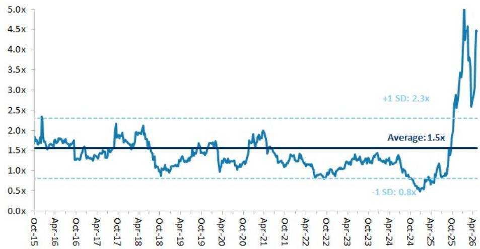

line

| Date   | Value |
|--------|-------|
| Oct-15 | 2.3x  |
| Average| 1.5x  |
| +1 SD  | 2.3x  |
| -1 SD  | 0.8x  |

Source: Company data, MS estimates

Exhibit 24: Nanya Tech: Historical forward P/B vs ROE   
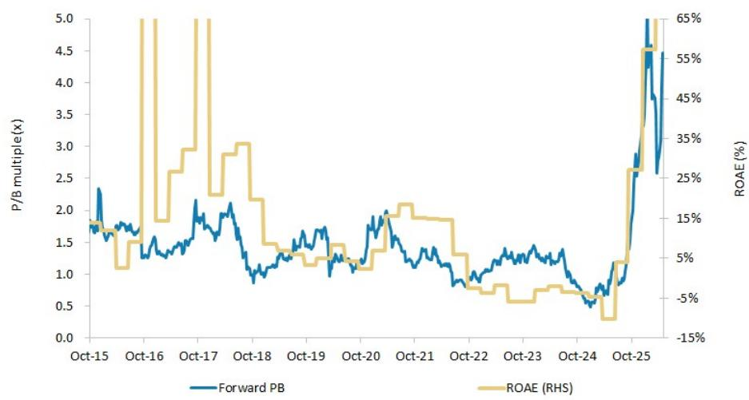

line

| Date   | Forward PB | ROAE (%) |
|--------|------------|----------|
| Oct-15 | 1.8        | 10       |
| Oct-16 | 1.7        | 65       |
| Oct-17 | 2.1        | 30       |
| Oct-18 | 1.0        | 15       |
| Oct-19 | 1.5        | 5        |
| Oct-20 | 1.8        | 10       |
| Oct-21 | 1.3        | 15       |
| Oct-22 | 0.9        | 5        |
| Oct-23 | 1.2        | 0        |
| Oct-24 | 0.6        | -5       |
| Oct-25 | 3.0        | 65       |

Source: Company data, MS estimates

Exhibit 25: Nanya Tech: Earnings estimate revision breadth   
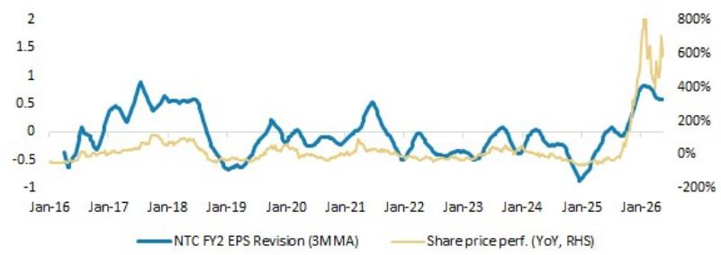

line

| Date   | NTC FY2 EPS Revision (3MMA) | Share price perf. (YoY, RHS) |
|--------|-----------------------------|------------------------------|
| Jan-16 | -0.5                        | -50%                         |
| Jan-17 | 0.5                         | 0%                           |
| Jan-18 | 0.8                         | 100%                         |
| Jan-19 | -0.5                        | -100%                        |
| Jan-20 | 0.2                         | 0%                           |
| Jan-21 | 0.5                         | 100%                         |
| Jan-22 | -0.5                        | -100%                        |
| Jan-23 | -0.2                        | -50%                         |
| Jan-24 | 0.1                         | 0%                           |
| Jan-25 | -0.8                        | -100%                        |
| Jan-26 | 0.8                         | 800%                         |

Source: Company data, MS estimates

# Risk Reward – Nanya Technology Corp. (2408.TW)

DDR4 S/D becoming more favorable; OW

# PRICE TARGET NT\$380.00

Base case, P/B. We expect the stock to trade at 3.22x 2026, 1.88x 2027, and 1.53x 2028 BVPS, above its average since 2015. We think NTC will benefit from a supply-driven up-cycle as major memory players are exiting the DDR4 market. That should help NTC more than offset the competitive impact from CXMT in the near term.

Consensus Price Target Distribution

Source: Refinitiv, MS

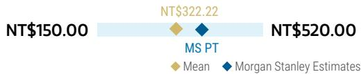

bar_line

| Metric | Value     |
|--------|-----------|
| NT$150.00 | 322.22    |
| NT$520.00 | 520.00    |

RISK REWARD CHART   
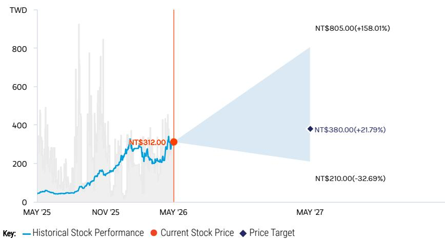

line

| Date       | Historical Stock Performance | Current Stock Price | Price Target |
| ---------- | ----------------------------- | ------------------- | ------------ |
| MAY '25    | ~50                           | -                   | -            |
| NOV '25    | ~150                          | -                   | -            |
| MAY '26    | NT$312.00                     | -                   | -            |
| MAY '27    | -                             | NT$805.00(+158.01%) | NT$380.00(-32.69%) |

Source: Refinitiv, MS

# OVERWEIGHT THESIS

■ Major memory suppliers are gradually exiting the DDR4 market, benefiting existing Taiwanese players, including Nanya Tech.   
■ We expect DDR4 shortage into 2H26 to help NTC more than offset the competitive impact from CXMT in 2026. The supply shortage appears set to widen into 2H26.   
■ Our price target reflects BVPS of 3.22x for 2026, 1.88x for 2027, and 1.53x for 2028.

Consensus Rating Distribution   
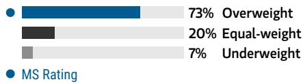

bar

| Category      | Value |
| ------------- | ----- |
| Overweight    | 73%   |
| Equal-weight  | 20%   |
| Underweight   | 7%    |

Source: Refinitiv, MS

# Risk Reward Themes

Pricing Power: Positive

View descriptions of Risk Rewards Themes here

# BULL CASE

# 6.83x 2026e BVPS

DRAM prices strong; faster-than-expected 1a/1b nm ramp; competition from Korea and China is a non-factor: DRAM pricing becomes very strong in 2026 thanks to production cuts and relief of inventory pressure. NTC's utilization rate returns to the 100% level. Korean and Chinese competitors all exit the consumer DRAM market.

# NT\$805.00

# BASE CASE

# 3.22x 2026e BVPS

Strong DRAM cycle: Major DRAM players now plan to exit the DDR4 market, which positions Taiwanese players to benefit. We expect price-hike momentum to continue through 2026, with widened supply shortage into 2H26.

# NT\$380.00

# BEAR CASE

# NT\$210.00

# 1.78x 2026e BVPS

Specialty DRAM demand becomes weak in 2026 with intensifying Chinese competition: Nanya Tech could face more pressure from pricing and technological competition amid a weak cycle. Inventory remains at historical peak levels. SK hynix and Chinese DRAM competitors take all the market share in China. Nanya Tech's utilization rate falls to the 40% level.

# Risk Reward – Nanya Technology Corp. (2408.TW)

KEY EARNINGS INPUTS 

<table><tr><td>Drivers</td><td>2025</td><td>2026e</td><td>2027e</td><td>2028e</td></tr><tr><td>12&quot; Wafers Out per quarter (000s)</td><td>825.0</td><td>830.0</td><td>855.0</td><td>900.0</td></tr><tr><td>Average Wafer Yield (%)</td><td>81.8</td><td>108.1</td><td>106.5</td><td>95.0</td></tr><tr><td>Total Die shipments - 2 gb equivalent (mn)</td><td>2,368.0</td><td>3,178.8</td><td>3,244.9</td><td>3,090.4</td></tr></table>

# INVESTMENT DRIVERS

• Specialty DRAM pricing   
• Monthly sales momentum   
• Industry outlook reported by industry peers

# GLOBAL REVENUE EXPOSURE

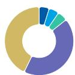

0-10% Europe ex UK   
0-10% Japan   
0-10% North America   
40-50% APAC, ex Japan, Mainland China and India   
40-50% Mainland China

Source: MS Estimate View explanation of regional hierarchies here

# MS ALPHA MODELS

2/5

MOST

3 Month

Horizon

Source: Refinitiv, FactSet, MS; 1 is the highest favored Quintile and 5 is the least favored Quintile

# RISKS TO PT/RATING

# RISKS TO UPSIDE

- Sustained DRAM prices from more disciplined supply and stronger demand   
- Stronger pricing environment, enabling revenue guidance to be beaten   
- Faster-than-expected 1a/1b nm ramp-up progress   
- Slower-than-expected 1a/1b nm ramp-up   
- Less demand for specialty DRAM from 4K2K TVs and smart set-top boxes

# RISKS TO DOWNSIDE

# OWNERSHIP POSITIONING

Inst. Owners, % Active

54.7%

Source: Refinitiv, MS

# MS ESTIMATES VS. CONSENSUS

FY Dec 2026e

Sales / Revenue (NT\$, mn) 259,718 294,571 332,719

EBITDA (NT\$, mn)
191,966 253,840
223,622 254,943

Net income (NT\$, mn)
154,740 198,340
173,479 198,615

EPS (NT\$) 40.62 49.69 61.50

◆ Mean ◆ MS Estimates

Source: Refinitiv, MS

# Nanya Tech: Financial Summary

Income Statement 

<table><tr><td>NT$mn (Years End Dec )</td><td>2024</td><td>2025</td><td>2026E</td><td>2027E</td><td>2028E</td></tr><tr><td>Net sales</td><td>34,132</td><td>66,587</td><td>332,719</td><td>471,750</td><td>341,113</td></tr><tr><td>COGS</td><td>(32,292)</td><td>(50,841)</td><td>(74,166)</td><td>(111,975)</td><td>(135,568)</td></tr><tr><td>Depreciation Expense</td><td>(13,883)</td><td>(13,520)</td><td>(12,186)</td><td>(23,184)</td><td>(24,404)</td></tr><tr><td>Variable Cost</td><td>(18,408)</td><td>(37,321)</td><td>(61,981)</td><td>(88,791)</td><td>(111,163)</td></tr><tr><td>Gross profit</td><td>1,840</td><td>15,745</td><td>258,553</td><td>359,775</td><td>205,545</td></tr><tr><td>Operating expenses</td><td>(10,134)</td><td>(9,741)</td><td>(16,899)</td><td>(40,236)</td><td>(31,422)</td></tr><tr><td>Operating income</td><td>(8,294)</td><td>6,004</td><td>241,654</td><td>319,538</td><td>174,123</td></tr><tr><td>Non-operating income</td><td>3,998</td><td>2,639</td><td>4,680</td><td>4,277</td><td>4,288</td></tr><tr><td>Pre-tax income</td><td>(4,297)</td><td>8,643</td><td>246,334</td><td>323,815</td><td>178,412</td></tr><tr><td>Income tax</td><td>1,474</td><td>(1,269)</td><td>(47,994)</td><td>(62,875)</td><td>(34,314)</td></tr><tr><td>Reported net Income</td><td>(2,823)</td><td>7,373</td><td>198,340</td><td>260,940</td><td>144,097</td></tr><tr><td>Adj. wtd. avg. shrs( m)</td><td>3,099</td><td>3,123</td><td>3,225</td><td>3,225</td><td>3,225</td></tr><tr><td>Reported EPS (NT$)</td><td>(0.91)</td><td>2.36</td><td>61.50</td><td>80.92</td><td>44.68</td></tr><tr><td>EPS for consensus (NT$)</td><td>(0.91)</td><td>2.36</td><td>61.50</td><td>80.92</td><td>44.68</td></tr></table>

Balance Sheet 

<table><tr><td>NT$mn (Years End Dec )</td><td>2024</td><td>2025</td><td>2026E</td><td>2027E</td><td>2028E</td></tr><tr><td>Cash</td><td>61,903</td><td>58,074</td><td>73,074</td><td>328,871</td><td>603,415</td></tr><tr><td>Mkt Securities</td><td>0</td><td>0</td><td>0</td><td>0</td><td>0</td></tr><tr><td>AR/NR</td><td>4,132</td><td>16,558</td><td>54,623</td><td>55,855</td><td>36,120</td></tr><tr><td>Inventory</td><td>35,318</td><td>27,288</td><td>371,653</td><td>380,041</td><td>245,759</td></tr><tr><td>Other</td><td>6,593</td><td>6,621</td><td>16,982</td><td>17,264</td><td>12,739</td></tr><tr><td>Current Assets</td><td>107,946</td><td>108,541</td><td>516,331</td><td>782,031</td><td>898,033</td></tr><tr><td>Long-term investments</td><td>4,645</td><td>5,904</td><td>7,583</td><td>8,538</td><td>9,492</td></tr><tr><td>Fixed assets</td><td>84,327</td><td>85,031</td><td>125,252</td><td>132,068</td><td>137,663</td></tr><tr><td>Other assets</td><td>9,789</td><td>8,977</td><td>5,145</td><td>5,145</td><td>5,145</td></tr><tr><td>Total Assets</td><td>206,706</td><td>208,453</td><td>654,311</td><td>927,781</td><td>1,050,333</td></tr><tr><td>S/T borrowings</td><td>14,536</td><td>5,060</td><td>240,000</td><td>245,000</td><td>225,000</td></tr><tr><td>AP/NP</td><td>5,180</td><td>6,481</td><td>8,496</td><td>16,002</td><td>14,462</td></tr><tr><td>Other ST liabilities</td><td>6,330</td><td>7,480</td><td>17,772</td><td>17,796</td><td>17,791</td></tr><tr><td>LT debt</td><td>3,995</td><td>14,196</td><td>17,796</td><td>17,796</td><td>17,796</td></tr><tr><td>Other LT liabilities</td><td>4,878</td><td>4,698</td><td>4,927</td><td>4,927</td><td>4,927</td></tr><tr><td>Total Liabilities</td><td>41,653</td><td>37,914</td><td>288,991</td><td>301,522</td><td>279,977</td></tr><tr><td>Common stocks</td><td>30,986</td><td>30,986</td><td>30,986</td><td>30,986</td><td>30,986</td></tr><tr><td>Preferred stocks</td><td>0</td><td>0</td><td>0</td><td>0</td><td>0</td></tr><tr><td>Capital Researve</td><td>32,834</td><td>33,081</td><td>33,168</td><td>33,168</td><td>33,168</td></tr><tr><td>Retained earning</td><td>101,233</td><td>106,333</td><td>301,028</td><td>561,968</td><td>706,065</td></tr><tr><td>Other shareholders&#x27; equity</td><td>0</td><td>0</td><td>0</td><td>0</td><td>0</td></tr><tr><td>Total Equity</td><td>165,053</td><td>170,538</td><td>365,319</td><td>626,259</td><td>770,357</td></tr><tr><td>Total Liab. &amp; Shrhldr&#x27;s Equity</td><td>206,706</td><td>208,453</td><td>654,311</td><td>927,781</td><td>1,050,333</td></tr><tr><td>BVPS</td><td>53.27</td><td>54.61</td><td>113.28</td><td>194.20</td><td>238.89</td></tr></table>

Cash Flow Statement 

<table><tr><td>NT$mn (Years End Dec )</td><td>2024</td><td>2025</td><td>2026E</td><td>2027E</td><td>2028E</td></tr><tr><td>Cashflow from Operations</td><td>1,952</td><td>18,568</td><td>(174,468)</td><td>280,797</td><td>324,544</td></tr><tr><td>Net profits</td><td>(2,823)</td><td>7,373</td><td>198,340</td><td>260,940</td><td>144,097</td></tr><tr><td>Depreciation</td><td>15,892</td><td>14,034</td><td>12,186</td><td>23,184</td><td>24,404</td></tr><tr><td>Working Capital Change</td><td>8,316</td><td>5,697</td><td>(380,415)</td><td>(2,114)</td><td>152,477</td></tr><tr><td>Other adjustments</td><td>(19,433)</td><td>(8,536)</td><td>(4,579)</td><td>(1,213)</td><td>3,566</td></tr><tr><td>Cashflow from Investing</td><td>(16,188)</td><td>(14,110)</td><td>(50,005)</td><td>(30,000)</td><td>(30,000)</td></tr><tr><td>Capex</td><td>(16,141)</td><td>(13,441)</td><td>(50,000)</td><td>(30,000)</td><td>(30,000)</td></tr><tr><td>Change of LT Investment</td><td>0</td><td>(612)</td><td>0</td><td>0</td><td>0</td></tr><tr><td>Change of ST Investment</td><td>0</td><td>0</td><td>0</td><td>0</td><td>0</td></tr><tr><td>Other adjustments</td><td>(46)</td><td>(57)</td><td>(5)</td><td>0</td><td>0</td></tr><tr><td>Cashflow from financing</td><td>13,707</td><td>(6,317)</td><td>238,453</td><td>5,000</td><td>(20,000)</td></tr><tr><td>Increase in L/T debt</td><td>6,750</td><td>(6,750)</td><td>3,600</td><td>0</td><td>0</td></tr><tr><td>Increase in S/T debt</td><td>3,355</td><td>(9,477)</td><td>234,941</td><td>5,000</td><td>(20,000)</td></tr><tr><td>Cash Dividend Paid</td><td>0</td><td>0</td><td>0</td><td>0</td><td>0</td></tr><tr><td>Dir&amp; Emp Bonus Paid</td><td>0</td><td>(7,000)</td><td>0</td><td>0</td><td>0</td></tr><tr><td>Proceed fmNewIssue</td><td>0</td><td>0</td><td>0</td><td>0</td><td>0</td></tr><tr><td>Other adjustments</td><td>3,602</td><td>16,909</td><td>(87)</td><td>0</td><td>0</td></tr><tr><td>Exchange rate adjustment</td><td>3,619</td><td>(1,970)</td><td>1,019</td><td>0</td><td>0</td></tr><tr><td>Net change in cash</td><td>3,091</td><td>-3,829</td><td>15,000</td><td>255,797</td><td>274,544</td></tr></table>

Financial Ratios 

<table><tr><td></td><td>2024</td><td>2025</td><td>2026E</td><td>2027E</td><td>2028E</td></tr><tr><td colspan="6">Growth(%)</td></tr><tr><td>Turnover</td><td>14.2</td><td>95.1</td><td>399.7</td><td>41.8</td><td>-27.7</td></tr><tr><td colspan="6">Margins (%)</td></tr><tr><td>Gross Margin</td><td>5.4</td><td>23.6</td><td>77.7</td><td>76.3</td><td>60.3</td></tr><tr><td>Operating Margin</td><td>-24.3</td><td>9.0</td><td>72.6</td><td>67.7</td><td>51.0</td></tr><tr><td>EBITA Margin</td><td>-65.0</td><td>-11.3</td><td>69.0</td><td>62.8</td><td>43.9</td></tr><tr><td>Pretax Margin</td><td>-12.6</td><td>13.0</td><td>74.0</td><td>68.6</td><td>52.3</td></tr><tr><td>Net Profit</td><td>-8.3</td><td>11.1</td><td>59.6</td><td>55.3</td><td>42.2</td></tr><tr><td colspan="6">Return (%)</td></tr><tr><td>ROAE</td><td>(1.7)</td><td>4.4</td><td>74.0</td><td>52.6</td><td>20.6</td></tr><tr><td>ROAA</td><td>(1.4)</td><td>3.6</td><td>46.0</td><td>33.0</td><td>14.6</td></tr><tr><td colspan="6">Gearing (%)</td></tr><tr><td>Net Debt/Equity</td><td>(26.3)</td><td>(22.7)</td><td>50.6</td><td>(10.6)</td><td>(46.8)</td></tr><tr><td>Liabilities/Equity</td><td>25.2</td><td>22.2</td><td>79.1</td><td>48.1</td><td>36.3</td></tr><tr><td colspan="6">Ratios (X)</td></tr><tr><td>Current ratio</td><td>4.1</td><td>5.7</td><td>1.9</td><td>2.8</td><td>3.5</td></tr><tr><td>Quick ratio</td><td>2.5</td><td>3.9</td><td>0.5</td><td>1.4</td><td>2.5</td></tr><tr><td colspan="6">Others</td></tr><tr><td>AR/NR Turnover (days)</td><td>59</td><td>50</td><td>57</td><td>39</td><td>43</td></tr><tr><td>Inventory Turnover (days)</td><td>311</td><td>337</td><td>172</td><td>219</td><td>291</td></tr><tr><td>AP Turnover (days)</td><td>37</td><td>59</td><td>47</td><td>42</td><td>52</td></tr><tr><td>Cash Conversion (days)</td><td>333</td><td>328</td><td>182</td><td>216</td><td>281</td></tr></table>

Source: Company data, TEJ, MSE= MS Estimates

This report references U.S. Executive Order 14032 and/or entities or securities that are designated thereunder. U.S. persons may be prohibited from buying certain securities of entities named in this report. Readers are solely responsible for ensuring that their investment activities are carried out in compliance with applicable laws.

This report references export controls and/or entities that may be subject to export control restrictions. Readers are solely responsible for ensuring that their investment or trade activities are carried out in compliance with applicable laws.

This report references U.S. Executive Order 14105 and/or entities that may be in scope of such order. U.S. persons may be prohibited from engaging in certain transactions or otherwise require certain other transactions be notified to the U.S. Department of Treasury. Readers are solely responsible for ensuring that their investment or trade activities are carried out in compliance with applicable laws.

# Risk Reward Reference links

1. View explanation of Options Probabilities methodology - Options\_Probabilities\_Exhibit\_Link.pdf   
2. View descriptions of Risk Rewards Themes - RR\_Themes\_Exhibit\_Link.pdf   
3. View explanation of regional hierarchies - GEG\_Exhibit\_Link.pdf   
4. View explanation of Theme/Exposure methodology - ESG\_Sustainable\_Solutions\_External\_Link.pdf   
5. View explanation of HERS methodology - ESG\_HERS\_External\_Link.pdf

# Disclosure Section

The information and opinions in MS were prepared or are disseminated by MS Asia Limited (which accepts the responsibility for its contents) and/or MS Asia (Singapore) Pte. (Registration number 199206298Z) and/or MS Asia (Singapore) Securities Pte Ltd (Registration number 200008434H), regulated by the Monetary Authority of Singapore (which accepts legal responsibility for its contents and should be contacted with respect to any matters arising from, or in connection with, MS), and/or MS Taiwan Limited and/or MS & Co International plc, Seoul Branch, and/or MS Australia Limited (A.B.N. 67 003 734 576, holder of Australian financial services license No. 233742, which accepts responsibility for its contents), and/or MS Wealth Management Australia Pty Ltd (A.B.N. 19 009 145 555, holder of Australian financial services license No. 240813, which accepts responsibility for its contents), and/or MS India Company Private Limited having Corporate Identification No (CIN) U22990MH1998PTC115305, regulated by the Securities and Exchange Board of India ("SEBI") and holder of licenses as a Research Analyst (SEBI Registration No. INH000001105); Stock Broker (SEBI Stock Broker Registration No. INZ000244438), Merchant Banker (SEBI Registration No. INM000011203), and depository participant with National Securities Depository Limited (SEBI Registration No. IN-DP-NSDL-567-2021) having registered office at Altimus, Level 39 & 40, Pandurang Budhkar Marg, Worli, Mumbai 400018, India; Telephone no. +91-22-61181000; Compliance Officer Details: Mr. Tejarshi Hardas, Tel. No.: +91-22-61181000 or Email: tejarshi.hardas@morganstanley.com; Grievance officer details: Mr. Tejarshi Hardas, Tel. No.: +91-22-61181000 or Email: msic-compliance@morganstanley.com which accepts the responsibility for its contents and should be contacted with respect to any matters arising from, or in connection with, MS, and their affiliates (collectively, "MS"). MS India Company Private Limited (MSICPL) may use AI tools in providing research services. All recommendations contained herein are made by the duly qualified research analysts.

For important disclosures, stock price charts and equity rating histories regarding companies that are the subject of this report, please see the MS Disclosure Website at www.morganstanley.com/eqr/disclosures/webapp/generalresearch, or contact your investment representative or MS at 1585 Broadway, (Attention: Research Management), New York, NY, 10036 USA.

For valuation methodology and risks associated with any recommendation, rating or price target referenced in this research report, please contact the Client Support Team as follows: US/Canada +1 800 303-2495; Hong Kong +852 2848-5999; Latin America +1 718 754-5444 (U.S.); London +44 (0)20-7425-8169; Singapore +65 6834-6860; Sydney +61 (0)2-9770-1505; Tokyo +81 (0)3-6836-9000. Alternatively you may contact your investment representative or MS at 1585 Broadway, (Attention: Research Management), New York, NY 10036 USA.

# Analyst Certification

The following analysts hereby certify that their views about the companies and their securities discussed in this report are accurately expressed and that they have not received and will not receive direct or indirect compensation in exchange for expressing specific recommendations or views in this report: Charlie Chan; Daisy Dai, CFA; Tiffany Yeh; Daniel Yen, CFA.

# Global Research Conflict Management Policy

MS has been published in accordance with our conflict management policy, which is available at www.morganstanley.com/institutional/research/conflictpolicies. A Portuguese version of the policy can be found at www.morganstanley.com.br

# Important Regulatory Disclosures on Subject Companies

As of April 30, 2026, MS beneficially owned 1% or more of a class of common equity securities of the following companies covered in MS: ACM Research Inc, Advanced Micro-Fabrication Equipment Inc, Advanced Wireless Semiconductor Co, Alchip Technologies Ltd, AllRing Tech Co., AP Memory Technology Corp, ASE Technology Holding Co. Ltd., ASMPT Ltd, Aspeed Technology, Cambricon Technology Corporation, Global Unichip Corp, GlobalWafers Co Ltd, Gudeng Precision, Hon Precision, Hua Hong Semiconductor Ltd, JCET Group Co Ltd, King Yuan Electronics Co Ltd, Macronix International Co Ltd, Montage Technology Co Ltd, MPI Corporation, Nanya Technology Corp., NAURA Technology Group Co Ltd, Novatek, Nuvoton Technology Corporation, Phison Electronics Corp, Realtek Semiconductor, SG Micro Corp., Shanghai Fudan Microelectronics, Silergy Corp., Silicon Motion, TSMC, UMC, Vanguard International Semiconductor, WIN Semiconductors Corp, Winbond Electronics Corp, WPG Holdings, WT Microelectronics Co. Ltd..

Within the last 12 months, MS managed or co-managed a public offering (or 144A offering) of securities of Montage Technology Co Ltd.

Within the last 12 months, MS has received compensation for investment banking services from ASMPT Ltd, Montage Technology Co Ltd.

In the next 3 months, MS expects to receive or intends to seek compensation for investment banking services from Advanced Micro-Fabrication Equipment Inc, Alchip Technologies Ltd, AP Memory Technology Corp, ASE Technology Holding Co. Ltd., ASMedia Technology Inc, ASMPT Ltd, Espressif Systems, GigaDevice Semiconductor Beijing Inc, GlobalWafers Co Ltd, Gudeng Precision, Himax Technologies Inc, Hua Hong Semiconductor Ltd, Iluvatar CoreX Semiconductor Co., Ltd., Innoscience, King Yuan Electronics Co Ltd, Macronix International Co Ltd, MediaTek, Montage Technology Co Ltd, Novatek, Phison Electronics Corp, Powerchip Semiconductor Manufacturing Co, Realtek Semiconductor, Shenzhen Longsys Electronics Co Ltd, Silergy Corp., Silicon Motion, TSMC, UMC, Vanguard International Semiconductor, Winbond Electronics Corp, WinWay Technology Co Ltd, WPG Holdings, WT Microelectronics Co. Ltd..

Within the last 12 months, MS has received compensation for products and services other than investment banking services from ASE Technology Holding Co. Ltd., King Yuan Electronics Co Ltd, MediaTek, Nanya Technology Corp., Novatek, Nuvoton Technology Corporation, Realtek Semiconductor, Silicon Motion, SMIC, TSMC, UMC, Universal Scientific Ind. (Shanghai), Winbond Electronics Corp, WT Microelectronics Co. Ltd..

Within the last 12 months, MS has provided or is providing investment banking services to, or has an investment banking client relationship with, the following company: Advanced Micro-Fabrication Equipment Inc, Alchip Technologies Ltd, AP Memory Technology Corp, ASE Technology Holding Co. Ltd., ASMedia Technology Inc, ASMPT Ltd, Espressif Systems, GigaDevice Semiconductor Beijing Inc, GlobalWafers Co Ltd, Gudeng Precision, Himax Technologies Inc, Hua Hong Semiconductor Ltd, Iluvatar CoreX Semiconductor Co., Ltd., Innoscience, King Yuan Electronics Co Ltd, Macronix International Co Ltd, MediaTek, Montage Technology Co Ltd, Novatek, Phison Electronics Corp, Powerchip Semiconductor Manufacturing Co, Realtek Semiconductor, Shenzhen Longsys Electronics Co Ltd, Silergy Corp., Silicon Motion, TSMC, UMC, Vanguard International Semiconductor, Winbond Electronics Corp, WinWay Technology Co Ltd, WPG Holdings, WT Microelectronics Co. Ltd..

Within the last 12 months, MS has either provided or is providing non-investment banking, securities-related services to and/or in the past has entered into an agreement to provide services or has a client relationship with the following company: ASE Technology Holding Co. Ltd., King Yuan Electronics Co Ltd, MediaTek, Montage Technology Co Ltd, Nanya Technology Corp., Novatek, Nuvoton Technology Corporation, Realtek Semiconductor, Silicon Motion, SMIC, TSMC, UMC, Universal Scientific Ind. (Shanghai), Winbond Electronics Corp, WT Microelectronics Co. Ltd..

MS & Co. LLC makes a market in the securities of ACM Research Inc, Himax Technologies Inc, Silicon Motion.

The equity research analysts or strategists principally responsible for the preparation of MS have received compensation based upon various factors, including quality of research, investor client feedback, stock picking, competitive factors, firm revenues and overall investment banking revenues. Equity Research analysts' or strategists' compensation is not linked to investment banking or capital markets transactions performed by MS or the profitability or revenues of particular trading desks.

MS and its affiliates do business that relates to companies/instruments covered in MS, including market making, providing liquidity, fund management, commercial banking, extension of credit, investment services and investment banking. MS sells to and buys from customers the securities/instruments of companies covered in MS on a principal basis. MS may have a position in the debt of the Company or instruments discussed in this report. MS trades or may trade as principal in the debt securities (or in related derivatives) that are the subject of the debt research report.

Certain disclosures listed above are also for compliance with applicable regulations in non-US jurisdictions.

# STOCK RATINGS

MS uses a relative rating system using terms such as Overweight, Equal-weight, Not-Rated or Underweight (see definitions below). MS does not assign ratings of Buy, Hold or Sell to the stocks we cover. Overweight, Equal-weight, Not-Rated and Underweight are not the equivalent of buy, hold and sell. Investors should carefully read the definitions of all ratings used in MS. In addition, since MS contains more complete information concerning the analyst's views, investors should carefully read MS, in its entirety, and not infer the contents from the rating alone. In any case, ratings (or research) should not be used or relied upon as investment advice. An investor's decision to buy or sell a stock should depend on individual circumstances (such as the investor's existing holdings) and other considerations.

# Global Stock Ratings Distribution

(as of April 30, 2026)

The Stock Ratings described below apply to MS's Fundamental Equity Research and do not apply to Debt Research produced by the Firm.

For disclosure purposes only (in accordance with FINRA requirements), we include the category headings of Buy, Hold, and Sell alongside our ratings of Overweight, Equal-weight, Not-Rated and Underweight. MS does not assign ratings of Buy, Hold or Sell to the stocks we cover. Overweight, Equal-weight, Not-Rated and Underweight are not the equivalent of buy, hold, and sell but represent recommended relative weightings (see definitions below). To satisfy regulatory requirements, we correspond Overweight, our most positive stock rating, with a buy recommendation; we correspond Equal-weight and Not-Rated to hold and Underweight to sell recommendations, respectively.

<table><tr><td></td><td colspan="2">Coverage Universe</td><td colspan="3">Investment Banking Clients (IBC)</td><td colspan="2">Other Material Investment ServicesClients (MISC)</td></tr><tr><td>Stock RatingCategory</td><td>Count</td><td>% of Total</td><td>Count</td><td>% of Total IBC</td><td>% of RatingCategory</td><td>Count</td><td>% of Total OtherMISC</td></tr><tr><td>Overweight/Buy</td><td>1546</td><td>42%</td><td>467</td><td>51%</td><td>30%</td><td>709</td><td>44%</td></tr><tr><td>Equal-weight/Hold</td><td>1568</td><td>43%</td><td>358</td><td>39%</td><td>23%</td><td>715</td><td>44%</td></tr><tr><td>Not-Rated/Hold</td><td>4</td><td>0%</td><td>0</td><td>0%</td><td>0%</td><td>1</td><td>0%</td></tr><tr><td>Underweight/Sell</td><td>555</td><td>15%</td><td>84</td><td>9%</td><td>15%</td><td>202</td><td>12%</td></tr><tr><td>Total</td><td>3,673</td><td></td><td>909</td><td></td><td></td><td>1627</td><td></td></tr></table>

Data include common stock and ADRs currently assigned ratings. Investment Banking Clients are companies from whom MS received investment banking compensation in the last 12 months. Due to rounding off of decimals, the percentages provided in the "% of total" column may not add up to exactly 100 percent.

# Analyst Stock Ratings

Overweight (O). The stock's total return is expected to exceed the average total return of the analyst's industry (or industry team's) coverage universe, on a risk-adjusted basis, over the next 12-18 months.

Equal-weight (E). The stock's total return is expected to be in line with the average total return of the analyst's industry (or industry team's) coverage universe, on a risk-adjusted basis, over the next 12-18 months.

Not-Rated (NR). Currently the analyst does not have adequate conviction about the stock's total return relative to the average total return of the analyst's industry (or industry team's) coverage universe, on a risk-adjusted basis, over the next 12-18 months.

Underweight (U). The stock's total return is expected to be below the average total return of the analyst's industry (or industry team's) coverage universe, on a risk-adjusted basis, over the next 12-18 months.

Unless otherwise specified, the time frame for price targets included in MS is 12 to 18 months.

# Analyst Industry Views

Attractive (A): The analyst expects the performance of his or her industry coverage universe over the next 12-18 months to be attractive vs. the relevant broad market benchmark, as indicated below.

In-Line (I): The analyst expects the performance of his or her industry coverage universe over the next 12-18 months to be in line with the relevant broad market benchmark, as indicated below. Cautious (C): The analyst views the performance of his or her industry coverage universe over the next 12-18 months with caution vs. the relevant broad market benchmark, as indicated below. Benchmarks for each region are as follows: North America - S&P 500; Latin America - relevant MSCI country index or MSCI Latin America Index; Europe - MSCI Europe; Japan - TOPIX; Asia - relevant MSCI country index or MSCI sub-regional index or MSCI AC Asia Pacific ex Japan Index.

# Important Disclosures for MS Smith Barney LLC Customers

Important disclosures regarding any material conflict of interest that can reasonably be expected to have influenced MS Smith Barney LLC's choice of a third-party research provider or the subject company of a third-party research report, are available on the MS Wealth Management disclosure website at www.morganstanley.com/online/researchdisclosures. For MS specific disclosures, you may refer to https://www.morganstanley.com/eqr/disclosures/webapp/generalresearch.

Each MS report is reviewed and approved on behalf of MS Smith Barney LLC. This review and approval is conducted by the same person who reviews the research report on behalf of MS. This could create a conflict of interest.

# Other Important Disclosures

MS policy is to update research reports as and when the Research Analyst and Research Management deem appropriate, based on developments with the issuer, the sector, or the market that may have a material impact on the research views or opinions stated therein. In addition, certain Research publications are intended to be updated on a regular periodic basis (weekly/monthly/quarterly/annual) and will ordinarily be updated with that frequency, unless the Research Analyst and Research Management determine that a different publication schedule is appropriate based on current conditions.

MS is not acting as a municipal advisor and the opinions or views contained herein are not intended to be, and do not constitute, advice within the meaning of Section 975 of the Dodd-Frank Wall Street Reform and Consumer Protection Act.

MS produces an equity research product called a "Tactical Idea." Views contained in a "Tactical Idea" on a particular stock may be contrary to the recommendations or views expressed in research on the same stock. This may be the result of differing time horizons, methodologies, market events, or other factors. For all research available on a particular stock, please contact your sales representative or go to Matrix at http://www.morganstanley.com/matrix.

MS is provided to our clients through our proprietary research portal on Matrix and also distributed electronically by MS to clients. Certain, but not all, MS products are also made available to clients through third-party vendors or redistributed to clients through alternate electronic means as a convenience. For access to all available MS, please contact your sales representative or go to Matrix at http://www.morganstanley.com/matrix.

Any access and/or use of MS is subject to MS's Terms of Use (http://www.morganstanley.com/terms.html). By accessing and/or using MS, you are indicating that you have read and agree to be bound by our Terms of Use (http://www.morganstanley.com/terms.html). In addition you consent to MS processing your personal data and using cookies in accordance with our Privacy Policy and our Global Cookies Policy (http://www.morganstanley.com/privacy\_pledge.html), including for the purposes of setting your preferences and to collect readership data so that we can deliver better and more personalized service and products to you. To find out more information about how MS processes personal data, how we use cookies and how to reject cookies see our Privacy Policy and our Global Cookies Policy (http://www.morganstanley.com/privacy\_pledge.html). Please use the provided link to review the Terms and Conditions and Most Important Terms and Conditions for MS India Company Private Limited (https://www.morganstanley.com/assets/pdfs/about-us-global-offices/india/Terms\_and\_conditions.pdf) and the following link to review the audit report (https://ny.matrix.ms.com/eqr/research/webapp/researchdocs/MSICPL\_Morgan\_Stanley\_Research\_Audit\_Report.pdf).

If you do not agree to our Terms of Use and/or if you do not wish to provide your consent to MS processing your personal data or using cookies please do not access our research. MS does not provide individually tailored investment advice. MS has been prepared without regard to the circumstances and objectives of those who receive it. MS recommends that investors independently evaluate particular investments and strategies, and encourages investors to seek the advice of a financial adviser. The appropriateness of an investment or strategy will depend on an investor's circumstances and objectives. The securities, instruments, or strategies discussed in MS may not be suitable for all investors, and certain investors may not be eligible to purchase or participate in some or all of them. MS is not an offer to buy or sell or the solicitation of an offer to buy or sell any security/instrument or to participate in any particular trading strategy. The value of and income from your investments may vary because of changes in interest rates, foreign exchange rates, default rates, prepayment rates, securities/instruments prices, market indexes, operational or financial conditions of companies or other factors. There may be time limitations on the exercise of options or other rights in securities/instruments transactions. Past performance is not necessarily a guide to future performance. Estimates of future performance are based on assumptions that may not be realized. If provided, and unless otherwise stated, the closing price on the cover page is that of the primary exchange for the subject company's securities/instruments.

The fixed income research analysts, strategists or economists principally responsible for the preparation of MS have received compensation based upon various factors, including quality, accuracy and value of research, firm profitability or revenues (which include fixed income trading and capital markets profitability or revenues), client feedback and competitive factors. Fixed Income Research analysts', strategists' or economists' compensation is not linked to investment banking or capital markets transactions performed by MS or the profitability or revenues of particular trading desks.

The "Important Regulatory Disclosures on Subject Companies" section in MS lists all companies mentioned where MS owns 1% or more of a class of common equity securities of the companies. For all other companies mentioned in MS, MS may have an investment of less than 1% in securities/instruments or derivatives of securities/instruments of companies and may trade them in ways different from those discussed in MS. Employees of MS not involved in the preparation of MS may have investments in securities/instruments or derivatives of securities/instruments of companies mentioned and may trade them in ways different from those discussed in MS. Derivatives may be issued by MS or associated persons.

With the exception of information regarding MS, MS is based on public information. MS makes every effort to use reliable, comprehensive information, but we make no representation that it is accurate or complete. We have no obligation to tell you when opinions or information in MS change apart from when we intend to discontinue equity research coverage of a subject company. Facts and views presented in MS have not been reviewed by, and may not reflect information known to, professionals in other MS business areas, including investment banking personnel.

MS personnel may participate in company events such as site visits and are generally prohibited from accepting payment by the company of associated expenses unless pre-approved by authorized members of Research management.

MS may make investment decisions that are inconsistent with the recommendations or views in this report.

To our readers based in Taiwan or trading in Taiwan securities/instruments: Information on securities/instruments that trade in Taiwan is distributed by MS Taiwan Limited ("MSTL"). Such information is for your reference only. The reader should independently evaluate the investment risks and is solely responsible for their investment decisions. MS may not be distributed to the public media or quoted or used by the public media without the express written consent of MS. Any non-customer reader within the scope of Article 7-1 of the Taiwan Stock Exchange Recommendation Regulations accessing and/or receiving MS is not permitted to provide MS to any third party (including but not limited to related parties, affiliated companies and any other third parties) or engage in any activities regarding MS which may create or give the appearance of creating a conflict of interest. Information on securities/instruments that do not trade in Taiwan is for informational purposes only and is not to be construed as a recommendation or a solicitation to trade in such securities/instruments. MSTL may not execute transactions for clients in these securities/instruments.

Certain information in MS was sourced by employees of the Shanghai Representative Office of MS Asia Limited for the use of MS Asia Limited. MS is not incorporated under PRC law and the research in relation to this report is conducted outside the PRC. MS does not constitute an offer to sell or the solicitation of an offer to buy any securities in the PRC. PRC investors shall have the relevant qualifications to invest in such securities and shall be responsible for obtaining all relevant approvals, licenses, verifications and/or registrations from the relevant governmental authorities themselves. Neither this report nor any part of it is intended as, or shall constitute, provision of any consultancy or advisory service of securities investment as defined under PRC law. Such information is provided for your reference only.

MS is disseminated in Brazil by MS C.T.V.M. S.A. located at Av. Brigadeiro Faria Lima, 3600, 6th floor, São Paulo - SP, Brazil; and is regulated by the Comissão de Valores Mobiliários; in Mexico by MS México, Casa de Bolsa, S.A. de C.V which is regulated by Comision Nacional Bancaria y de Valores. Paseo de los Tamarindos 90, Torre 1, Col. Bosques de las Lomas Floor 29, 05120 Mexico City; in Japan by MS MUFG Securities Co., Ltd. and, for Commodities related research reports only, MS Capital Group Japan Co., Ltd; in Hong Kong by MS Asia Limited (which accepts responsibility for its contents) and by MS Bank Asia Limited; in Singapore by MS Asia (Singapore) Pte. (Registration number 199206298Z) and/or MS Asia (Singapore) Securities Pte Ltd (Registration number 200008434H), regulated by the Monetary Authority of

Singapore (which accepts legal responsibility for its contents and should be contacted with respect to any matters arising from, or in connection with, MS) and by MS Bank Asia Limited, Singapore Branch (Registration number T14FC0118); in Australia to "wholesale clients" within the meaning of the Australian Corporations Act by MS Australia Limited A.B.N. 67 003 734 576, holder of Australian financial services license No. 233742, which accepts responsibility for its contents; in Australia to "wholesale clients" and "retail clients" within the meaning of the Australian Corporations Act by MS Wealth Management Australia Pty Ltd (A.B.N. 19 009 145 555, holder of Australian financial services license No. 240813, which accepts responsibility for its contents; in Korea by MS & Co International plc, Seoul Branch; in India by MS India Company Private Limited having Corporate Identification No (CIN) U22990MH1998PTC115305, regulated by the Securities and Exchange Board of India ("SEBI") and holder of licenses as a Research Analyst (SEBI Registration No. INH000001105); Stock Broker (SEBI Stock Broker Registration No. INZ000244438), Merchant Banker (SEBI Registration No. INM000011203), and depository participant with National Securities Depository Limited (SEBI Registration No. IN-DP-NSDL-567-2021) having registered office at Altimus, Level 39 & 40, Pandurang Budhkar Marg, Worli, Mumbai 400018, India; Telephone no. +91-22-61181000; Compliance Officer Details: Mr. Tejarshi Hardas, Tel. No.: +91-22-61181000 or Email: tejarshi.hardas@morganstanley.com; Grievance officer details: Mr. Tejarshi Hardas, Tel. No.: +91-22-61181000 or Email: msic-compliance@morganstanley.com. MS India Company Private Limited (MSICPL) may use AI tools in providing research services. All recommendations contained herein are made by the duly qualified research analysts; in Canada by MS Canada Limited; in Germany and the European Economic Area where required by MS Europe S.E., authorised and regulated by Bundesanstalt fuer Finanzdienstleistungsaufsicht (BaFin) under the reference number 149169; in the US by MS & Co. LLC, which accepts responsibility for its contents. MS & Co. International plc, authorized by the Prudential Regulation Authority and regulated by the Financial Conduct Authority and the Prudential Regulation Authority, disseminates in the UK research that it has prepared, and research which has been prepared by any of its affiliates, only to persons who (i) are investment professionals falling within Article 19(5) of the Financial Services and Markets Act 2000 (Financial Promotion) Order 2005 (as amended, the "Order"); (ii) are persons who are high net worth entities falling within Article 49(2)(a) to (d) of the Order; or (iii) are persons to whom an invitation or inducement to engage in investment activity (within the meaning of section 21 of the Financial Services and Markets Act 2000, as amended) may otherwise lawfully be communicated or caused to be communicated. RMB MS Proprietary Limited is a member of the JSE Limited and A2X (Pty) Ltd. RMB MS Proprietary Limited is a joint venture owned equally by MS International Holdings Inc. and RMB Investment Advisory (Proprietary) Limited, which is wholly owned by FirstRand Limited. The information in MS is being disseminated by MS Saudi Arabia, regulated by the Capital Market Authority in the Kingdom of Saudi Arabia, and is directed at Sophisticated investors only.

MS Hong Kong Securities Limited is the liquidity provider/market maker for securities of ASMPT Ltd, Hua Hong Semiconductor Ltd listed on the Stock Exchange of Hong Kong Limited. An updated list can be found on HKEx website: http://www.hkex.com.hk.

The information in MS is being communicated by MS & Co. International plc (DIFC Branch), regulated by the Dubai Financial Services Authority (the DFSA) or by MS & Co. International plc (ADGM Branch), regulated by the Financial Services Regulatory Authority Abu Dhabi (the FSRA), and is directed at Professional Clients only, as defined by the DFSA or the FSRA, respectively. The financial products or financial services to which this research relates will only be made available to a customer who we are satisfied meets the regulatory criteria of a Professional Client. A distribution of the different MS Research ratings or recommendations, in percentage terms for Investments in each sector covered, is available upon request from your sales representative.

The information in MS is being communicated by MS & Co. International plc (QFC Branch), regulated by the Qatar Financial Centre Regulatory Authority (the QFCRA), and is directed at business customers and market counterparties only and is not intended for Retail Customers as defined by the QFCRA.

As required by the Capital Markets Board of Turkey, investment information, comments and recommendations stated here, are not within the scope of investment advisory activity. Investment advisory service is provided exclusively to persons based on their risk and income preferences by the authorized firms. Comments and recommendations stated here are general in nature. These opinions may not fit to your financial status, risk and return preferences. For this reason, to make an investment decision by relying solely to this information stated here may not bring about outcomes that fit your expectations.

The trademarks and service marks contained in MS are the property of their respective owners. Third-party data providers make no warranties or representations relating to the accuracy, completeness, or timeliness of the data they provide and shall not have liability for any damages relating to such data. The Global Industry Classification Standard (GICS) was developed by and is the exclusive property of MSCI and S&P.

MS, or any portion thereof may not be reprinted, sold or redistributed without the written consent of MS.

Indicators and trackers referenced in MS may not be used as, or treated as, a benchmark under Regulation EU 2016/1011, or any other similar framework.

The issuers and/or fixed income products recommended or discussed in certain fixed income research reports may not be continuously followed. Accordingly, investors should regard those fixed income research reports as providing stand-alone analysis and should not expect continuing analysis or additional reports relating to such issuers and/or individual fixed income products. MS may hold, from time to time, material financial and commercial interests regarding the company subject to the Research report.

Registration granted by SEBI and certification from the National Institute of Securities Markets (NISM) in no way guarantee performance of the intermediary or provide any assurance of returns to investors. Investment in securities market are subject to market risks. Read all the related documents carefully before investing.

Tiffany Yeh   
INDUSTRY COVERAGE: Greater China Technology Semiconductors 

<table><tr><td>COMPANY (TICKER)</td><td>RATING (AS OF)</td><td>PRICE* (05/27/2026)</td></tr><tr><td colspan="3">Charlie Chan</td></tr><tr><td>ACM Research Inc (ACMR.O)</td><td>O (03/07/2023)</td><td>US$88.64</td></tr><tr><td>Advanced Micro-Fabrication Equipment Inc (688012.SS)</td><td>O (11/06/2023)</td><td>Rmb455.05</td></tr><tr><td>Advanced Wireless Semiconductor Co (8086.TWO)</td><td>U (07/14/2025)</td><td>NT$173.50</td></tr><tr><td>Alchip Technologies Ltd (3661.TW)</td><td>O (05/14/2021)</td><td>NT$4,500.00</td></tr><tr><td>ASE Technology Holding Co. Ltd. (3711.TW)</td><td>O (09/15/2024)</td><td>NT$642.00</td></tr><tr><td>Cambricon Technology Corporation (688256.SS)</td><td>O (04/27/2026)</td><td>Rmb1,340.00</td></tr><tr><td>Global Unichip Corp (3443.TW)</td><td>O (07/27/2024)</td><td>NT$5,100.00</td></tr><tr><td>GlobalWafers Co Ltd (6488.TWO)</td><td>E (05/19/2026)</td><td>NT$930.00</td></tr><tr><td>Gudeng Precision (3680.TWO)</td><td>O (11/25/2025)</td><td>NT$557.00</td></tr><tr><td>Hua Hong Semiconductor Ltd (1347.HK)</td><td>E (03/12/2026)</td><td>HK$152.40</td></tr><tr><td>Iluvatar CoreX Semiconductor Co., Ltd. (9903.HK)</td><td>O (04/27/2026)</td><td>HK$536.50</td></tr><tr><td>King Yuan Electronics Co Ltd (2449.TW)</td><td>O (03/03/2023)</td><td>NT$315.50</td></tr><tr><td>Maxscend Microelectronics Co Ltd (300782.SZ)</td><td>U (01/11/2021)</td><td>Rmb116.97</td></tr><tr><td>MediaTek (2454.TW)</td><td>O (11/28/2025)</td><td>NT$4,640.00</td></tr><tr><td>MetaX Integrated Circuits (688802.SS)</td><td>E (04/27/2026)</td><td>Rmb695.00</td></tr><tr><td>Nanya Technology Corp. (2408.TW)</td><td>O (05/28/2026)</td><td>NT$312.00</td></tr><tr><td>NAURA Technology Group Co Ltd (002371.SZ)</td><td>O (11/06/2023)</td><td>Rmb654.77</td></tr><tr><td>OmniVision Integrated Circuits Group Inc (603501.SS)</td><td>E (11/17/2025)</td><td>Rmb104.96</td></tr><tr><td>Phison Electronics Corp (8299.TWO)</td><td>E (02/25/2026)</td><td>NT$2,480.00</td></tr><tr><td>SG Micro Corp. (300661.SZ)</td><td>E (11/03/2025)</td><td>Rmb119.39</td></tr><tr><td>Silergy Corp. (6415.TW)</td><td>U (05/19/2026)</td><td>NT$665.00</td></tr><tr><td>SMIC (0981.HK)</td><td>O (10/21/2025)</td><td>HK$85.20</td></tr><tr><td>TSMC (2330.TW)</td><td>O (02/07/2022)</td><td>NT$2,300.00</td></tr><tr><td>UMC (2303.TW)</td><td>O (05/19/2026)</td><td>NT$143.50</td></tr><tr><td>Vanguard International Semiconductor (5347.TWO)</td><td>E (01/14/2026)</td><td>NT$166.00</td></tr><tr><td>WIN Semiconductors Corp (3105.TWO)</td><td>U (07/14/2025)</td><td>NT$560.00</td></tr><tr><td colspan="3">Daisy Dai, CFA</td></tr><tr><td>ASMPT Ltd (0522.HK)</td><td>O (07/24/2025)</td><td>HK$203.80</td></tr><tr><td>China Resources Microelectronics Limited (688396.SS)</td><td>U (03/02/2026)</td><td>Rmb65.98</td></tr><tr><td>Elan Microelectronics Corp (2458.TW)</td><td>O (10/03/2025)</td><td>NT$164.50</td></tr><tr><td>Empyrean Technology Co Ltd (301269.SZ)</td><td>E (01/17/2025)</td><td>Rmb127.42</td></tr><tr><td>Hangzhou Silan Microelectronics Co. Ltd. (600460.SS)</td><td>U (08/25/2025)</td><td>Rmb35.58</td></tr><tr><td>Innoscience (2577.HK)</td><td>E (10/13/2025)</td><td>HK$80.30</td></tr><tr><td>JCET Group Co Ltd (600584.SS)</td><td>E (01/16/2026)</td><td>Rmb86.16</td></tr><tr><td>Shanghai Fudan Microelectronics (1385.HK)</td><td>O (03/07/2025)</td><td>HK$36.94</td></tr><tr><td>SICC Co Ltd (688234.SS)</td><td>O (03/20/2026)</td><td>Rmb166.99</td></tr><tr><td>StarPower Semiconductor Ltd (603290.SS)</td><td>E (05/14/2026)</td><td>Rmb135.00</td></tr><tr><td>Unigroup Guoxin Microelectronics Co Ltd (002049.SZ)</td><td>U (01/10/2023)</td><td>Rmb85.06</td></tr><tr><td>Universal Scientific Ind. (Shanghai) (601231.SS)</td><td>O (11/05/2025)</td><td>Rmb43.43</td></tr><tr><td>Yangjie Technology (300373.SZ)</td><td>O (06/10/2022)</td><td>Rmb110.02</td></tr><tr><td colspan="3">Daniel Yen, CFA</td></tr><tr><td>AP Memory Technology Corp (6531.TW)</td><td>O (07/11/2025)</td><td>NT$1,080.00</td></tr><tr><td>ASMedia Technology Inc (5269.TW)</td><td>U (10/03/2025)</td><td>NT$1,495.00</td></tr><tr><td>Aspeed Technology (5274.TWO)</td><td>O (06/09/2025)</td><td>NT$18,230.00</td></tr><tr><td>Egis Technology Inc (6462.TWO)</td><td>E (01/28/2026)</td><td>NT$133.00</td></tr><tr><td>Espressif Systems (688018.SS)</td><td>O (05/15/2023)</td><td>Rmb181.08</td></tr><tr><td>GigaDevice Semiconductor Beijing Inc (603986.SS)</td><td>O (05/15/2025)</td><td>Rmb514.18</td></tr><tr><td>Macronix International Co Ltd (2337.TW)</td><td>O (09/18/2025)</td><td>NT$155.50</td></tr><tr><td>Montage Technology Co Ltd (6809.HK)</td><td>O (03/18/2026)</td><td>HK$469.00</td></tr><tr><td>Montage Technology Co Ltd (688008.SS)</td><td>O (03/18/2026)</td><td>Rmb265.50</td></tr><tr><td>Novatek (3034.TW)</td><td>U (02/04/2026)</td><td>NT$485.00</td></tr><tr><td>Nuvoton Technology Corporation (4919.TW)</td><td>U (11/10/2025)</td><td>NT$206.50</td></tr><tr><td>Parade Technologies Ltd (4966.TWO)</td><td>O (05/27/2026)</td><td>NT$870.00</td></tr><tr><td>Powerchip Semiconductor Manufacturing Co (6770.TW)</td><td>O (10/27/2025)</td><td>NT$74.80</td></tr><tr><td>Realtek Semiconductor (2379.TW)</td><td>E (01/30/2026)</td><td>NT$605.00</td></tr><tr><td>Shenzhen Goodix Technology Co Ltd (603160.SS)</td><td>U (07/14/2025)</td><td>Rmb66.50</td></tr><tr><td>Winbond Electronics Corp (2344.TW)</td><td>O (05/28/2026)</td><td>NT$155.00</td></tr><tr><td>WPG Holdings (3702.TW)</td><td>O (03/16/2026)</td><td>NT$120.50</td></tr><tr><td>WT Microelectronics Co. Ltd. (3036.TW)</td><td>O (01/27/2026)</td><td>NT$296.00</td></tr><tr><td colspan="3">Duan Liu</td></tr><tr><td>Dosilicon Co Ltd (688110.SS)</td><td>U (09/06/2024)</td><td>Rmb148.00</td></tr><tr><td>Shenzhen Longsys Electronics Co Ltd (301308.SZ)</td><td>E (02/25/2026)</td><td>Rmb551.59</td></tr></table>

<table><tr><td>AllRing Tech Co. (6187.TWO)</td><td>O (09/23/2025)</td><td>NT$1,130.00</td></tr><tr><td>FOCI Fiber Optic Communications Inc (3363.TWO)</td><td>O (01/15/2025)</td><td>NT$847.00</td></tr><tr><td>Himax Technologies Inc (HIMX.O)</td><td>E (02/04/2026)</td><td>US$20.65</td></tr><tr><td>Hon Precision (7769.TW)</td><td>O (04/17/2026)</td><td>NT$7,800.00</td></tr><tr><td>MPI Corporation (6223.TWO)</td><td>O (04/17/2026)</td><td>NT$6,390.00</td></tr><tr><td>Silicon Motion (SIMO.O)</td><td>O (05/06/2024)</td><td>US$284.98</td></tr><tr><td>WinWay Technology Co Ltd (6515.TW)</td><td>O (04/17/2026)</td><td>NT$9,795.00</td></tr></table>

Stock Ratings are subject to change. Please see latest research for each company.   
\* Historical prices are not split adjusted.

© 2026 MS