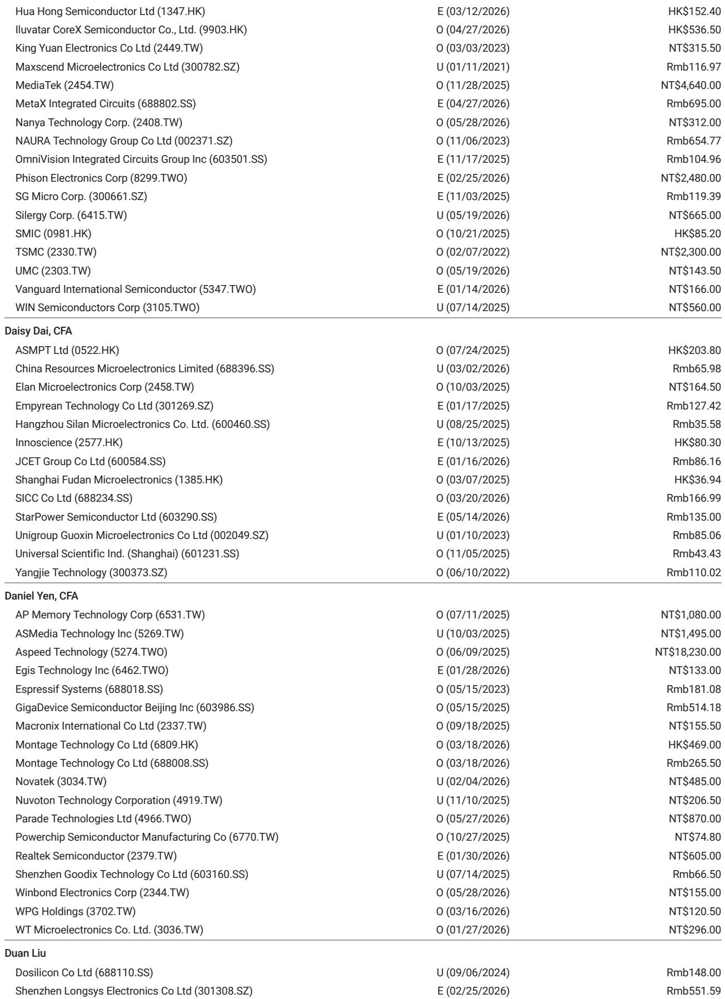
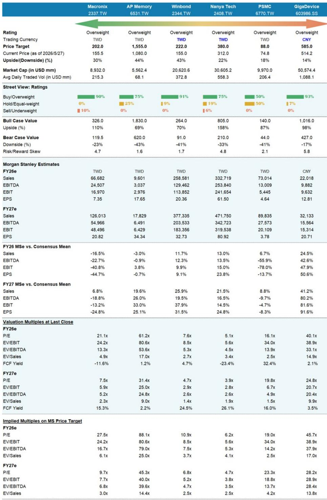
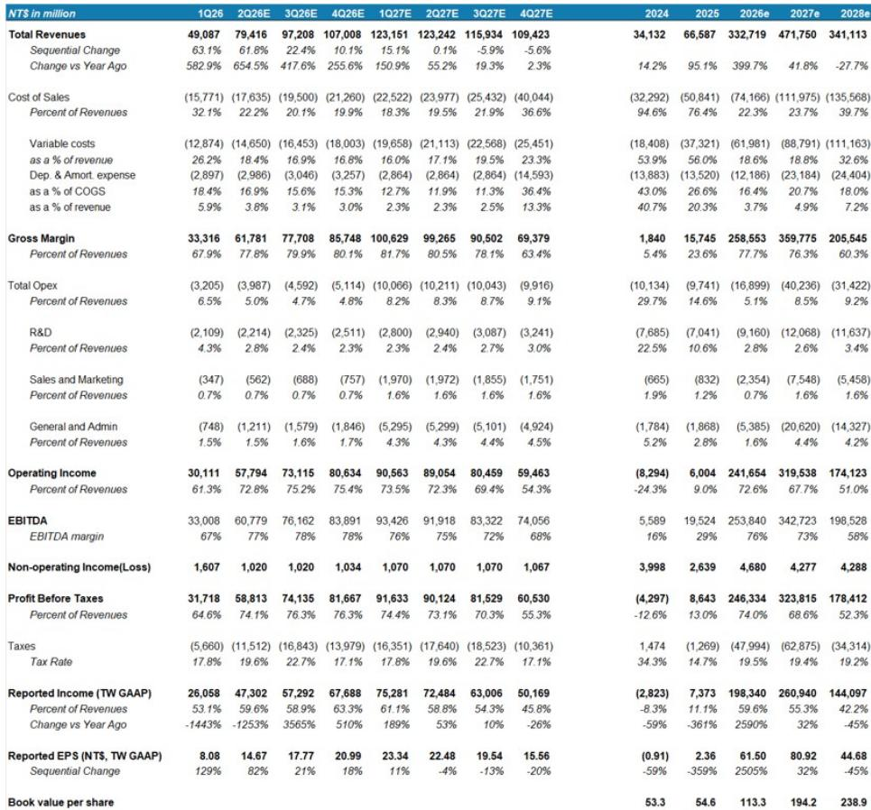

# The Memory Market Has Misread the Supply Picture: Why Greater China Niche Players Are Poised for a Structural Re-rating

The conventional wisdom on memory semiconductors has been wrong. For most of early 2026, the prevailing view held that the supply-demand gap in legacy DRAM would narrow through the second half of the year, capping pricing upside and compressing margins for niche players. That thesis is now collapsing. A global investment bank report has reversed its position on two of the largest Greater China memory vendors, upgrading both Winbond and Nanya from Equal-weight to Overweight, and raising price targets by 122% and 37% respectively. The catalyst is not a cyclical uptick but a structural reassessment of supply dynamics that most investors have not yet priced in.

The core argument is deceptively simple: less supply is coming than the market expects, and more demand is forming than the market recognizes. But the implications are far-reaching. The supply-demand gap for DDR4, the workhorse memory standard that the industry assumed would fade quietly, is actually widening into 2027 and 2028. According to the report's model, the undersupply ratio will reach 19-20% in the second half of 2026, up from a prior estimate of 14%, and will persist at 18-20% through 2028. This is not a temporary imbalance. It is a multi-year structural deficit that will reshape pricing power, margin profiles, and the competitive landscape for niche memory vendors.

Why now? Three forces are converging. First, the largest DRAM manufacturers are redirecting capacity away from legacy nodes. A major US memory maker is moving equipment from Taiwan to the United States, reducing supply for the next two to four quarters. A Korean giant is converting its Wuxi DDR4 and LPDDR4 capacity to DDR5 back-end production. These are not temporary adjustments; they represent a permanent shift in the industry's center of gravity. Second, enterprise demand for DDR4 is accelerating, driven by CPU server upgrades and enterprise SSD adoption. Third, two emerging product categories--silicon capacitors and SLC NAND for servers--are creating new growth vectors that the market has not yet assigned value to.

The strategic question for investors is not whether these trends are real. They are. The question is whether the market fully understands the magnitude and duration of the supply-demand shift, and whether it has correctly priced the optionality embedded in Greater China memory stocks.

## The Supply-Demand Gap for DDR4 Is Not Narrowing. It Is Structurally Widening Through 2028.

The most important single data point in this report is the revision to the DDR4 supply-demand model. The undersupply ratio was previously estimated at 14% for the second half of 2026. It is now 19-20%. For 2027 and 2028, the gap is projected at 18-20%. This is not a rounding error. It is a fundamental reassessment of the market's structural balance.

What changed? The report identifies two specific supply-side shocks. First, a major US memory manufacturer announced equipment movement from Taiwan to the United States, which will reduce available supply for two to four quarters. This is not a capacity addition; it is a capacity relocation that creates a temporary but meaningful supply hole. Second, a Korean DRAM leader is reducing its Wuxi output of DDR4 and LPDDR4 to free up back-end capacity for DDR5. This reflects a strategic decision by the largest players to prioritize high-margin, high-growth products over legacy standards.

The demand side is equally important. The report notes that DDR4 enterprise demand from both enterprise SSDs and data centers is getting stronger. This is counterintuitive. Many investors assumed that DDR4 demand would naturally decline as the industry transitions to DDR5. But the transition is slower than expected, and the installed base of servers running on DDR4 is large and growing. CPU server upgrades are driving incremental demand that the market had not fully captured in its models.

The implication is clear: the DDR4 market is not a declining legacy business. It is a structurally undersupplied market with multi-year pricing power. For companies like Winbond and Nanya, which have significant exposure to DDR4, this translates directly into revenue and margin upside that the consensus has not yet reflected.

## Silicon Capacitors and SLC NAND Are Not Speculative Stories. They Are Tangible Re-rating Catalysts That the Market Is Ignoring.

The report identifies two product categories that could drive a structural re-rating for Greater China memory vendors: silicon capacitors and SLC NAND for servers. These are not conceptual or early-stage technologies. They are products with established demand, existing customers, and clear adoption trajectories.

Silicon capacitors represent a new growth driver for niche memory vendors. The report cites recent developments in server applications that suggest potential adoption of SLC NAND in data centers. SLC NAND is ideal for applications requiring fast read and write speeds, which aligns with the performance requirements of high-performance server workloads. Currently, SLC NAND can be supplied by Greater China vendors including GigaDevice, Winbond, and Macronix. This is not a speculative future opportunity. It is a present-day market that is expanding.

The report also notes that NOR flash is experiencing increasing tightness due to mature foundry shortages. This is a supply-side constraint that benefits vendors with in-house manufacturing capacity. The combination of NOR tightness, SLC NAND adoption, and silicon capacitor demand creates a diversified growth story that extends well beyond the DDR4 cycle.

For investors, the key insight is that these product categories represent sources of earnings upside that are independent of the DDR4 pricing cycle. They provide a floor under valuations and create optionality that the market has not yet priced. The report's estimate revisions reflect this: for Winbond, 2028 EPS estimates were raised by 94%. For GigaDevice, 2027 estimates were raised by 60%. These are not incremental adjustments. They are structural re-ratings.

## The Upgrade Cycle Has Only Just Begun: Why Earnings Estimates Are Likely Still Too Low

The report's estimate revisions are dramatic, but they may still understate the full opportunity. For Winbond, the bank raised 2026, 2027, and 2028 EPS estimates by 23%, 65%, and 94% respectively. For Nanya, the increases were 15%, 29%, and 33%. For GigaDevice, 58% and 60% for 2026 and 2027.

These revisions are driven by two factors: DDR4 pricing strength and new product opportunities. But the report's own data suggests that the pricing cycle may have further to run. The DDR4 supply-demand model shows an undersupply gap that persists through 2028. If pricing continues to trend up at the 20% quarterly pace the report expects for the third quarter of 2026, the earnings impact could be significantly larger than current estimates.

There is also a second-order effect that the report does not fully explore. As DDR4 pricing strengthens, the economics of legacy capacity become more attractive. This could lead to capacity additions by niche players, which would create additional revenue growth beyond the pricing cycle. The report notes that Nanya is adding 5kwpm of DDR5 capacity starting in the third quarter of 2026, and that the company is signing more long-term agreements with server and enterprise SSD customers. These are signs of a business that is gaining strategic traction, not just riding a pricing wave.

The open question is whether the market will re-rate these stocks to reflect the structural nature of the supply-demand imbalance. The report's price targets imply significant upside: 43% for Winbond, 22% for Nanya, and 14% for GigaDevice. But the bull case values suggest even larger potential: 70%, 158%, and 98% respectively. The risk-reward skew is heavily positive across the board.

## What the Report Does Not Fully Answer: The Unresolved Questions That Matter for Investors

For all its analytical rigor, the report leaves several important questions unanswered. These are not weaknesses in the analysis but rather areas where the future is genuinely uncertain and where investors must form their own judgments.

First, how durable is the DDR4 demand from enterprise customers? The report assumes that CPU server upgrades and enterprise SSD adoption will sustain demand growth into 2027. But the pace of the DDR5 transition is a wild card. If hyperscale data center operators accelerate their migration to DDR5, DDR4 demand could peak sooner than the model projects. Conversely, if the transition is slower than expected, the supply-demand gap could widen further.

Second, what is the competitive response from Chinese DRAM manufacturers? The report's supply model includes CXMT and JHICC as suppliers, but their capacity contributions are relatively small in the near term. If these players ramp production faster than expected, they could close the supply-demand gap and compress pricing. The report does not provide a detailed scenario analysis for this risk.

Third, how should investors think about the valuation of these stocks relative to global memory peers? Winbond trades at 7.6x 2026 P/E and 4.7x 2027 P/E. Nanya trades at 5.1x and 3.9x respectively. These are deeply discounted multiples relative to the growth rates implied by the estimate revisions. But the discount may persist if investors remain skeptical about the sustainability of the cycle. The report does not provide a framework for thinking about multiple expansion.

Fourth, what is the long-term competitive position of these companies in silicon capacitors and SLC NAND? The report identifies these as re-rating factors but does not provide detailed market share analysis or competitive dynamics. Investors need to assess whether these are sustainable growth businesses or temporary opportunities that will attract competition.

## A Decision Framework for Investors: How to Position Across the Greater China Memory Value Chain

For investors looking to act on this thesis, a structured decision framework is essential. The following framework is derived from the report's logic and is designed to help investors evaluate their exposure across the Greater China memory ecosystem.

**Step 1: Assess your view on the DDR4 supply-demand trajectory.** If you believe the report's supply-side assumptions are correct--that major manufacturers will continue to reallocate capacity away from DDR4 and that enterprise demand will hold--then the case for overweighting DDR4-exposed names is strong. If you are more skeptical about the durability of enterprise demand or the pace of capacity reallocation, a more cautious approach is warranted.

**Step 2: Evaluate the new product optionality.** The report identifies silicon capacitors and SLC NAND as re-rating catalysts. Investors should assess which companies have the strongest positions in these markets. GigaDevice appears to have significant SLC NAND exposure. Winbond and Macronix are also well-positioned. Nanya's opportunity is more concentrated in DDR4 and DDR5.

**Step 3: Consider the risk-reward skew.** The report provides bull and bear case values for each stock. The bull cases imply substantial upside, while the bear cases suggest limited downside from current levels. The risk-reward skew is particularly attractive for Nanya (4.8x) and GigaDevice (5.8x), suggesting that the potential upside significantly outweighs the downside risk.

**Step 4: Monitor the key data points.** The most important leading indicators are DDR4 pricing trends, capacity announcements from major manufacturers, and enterprise server shipment data. If DDR4 pricing accelerates beyond the 20% quarterly pace the report expects, the earnings upside could be even larger. If major manufacturers reverse their capacity decisions, the thesis would need to be reevaluated.

**Step 5: Determine your time horizon.** The report's thesis is multi-year, with supply-demand gaps persisting through 2028. Near-term volatility is possible, particularly if the market is slow to re-rate these stocks. Investors with a long-term horizon are better positioned to capture the full earnings growth and multiple expansion.

## The Full Picture Requires More Than This Summary: What the Original Charts Reveal

This article has synthesized the core argument of the report, but the full analytical depth is best appreciated through the original charts and data. The supply-demand model, the pricing trajectory, and the competitive positioning analysis contain nuances that a written summary cannot fully capture. The exhibit showing the quarterly supply breakdown by manufacturer, for example, reveals the precise timing of capacity shifts that drive the model's conclusions. The NOR flash demand and supply growth chart shows a pattern of structural tightness that reinforces the broader thesis.

For serious investors who want to make informed decisions, reviewing the original data is not optional. It is essential. The charts provide the granularity that allows investors to stress-test the assumptions and form their own independent judgments.

Join the community to read the full report and review the original charts.

*This article is for learning and discussion only and does not constitute investment advice.*

Personal reading notes and learning share only. Not investment advice.

