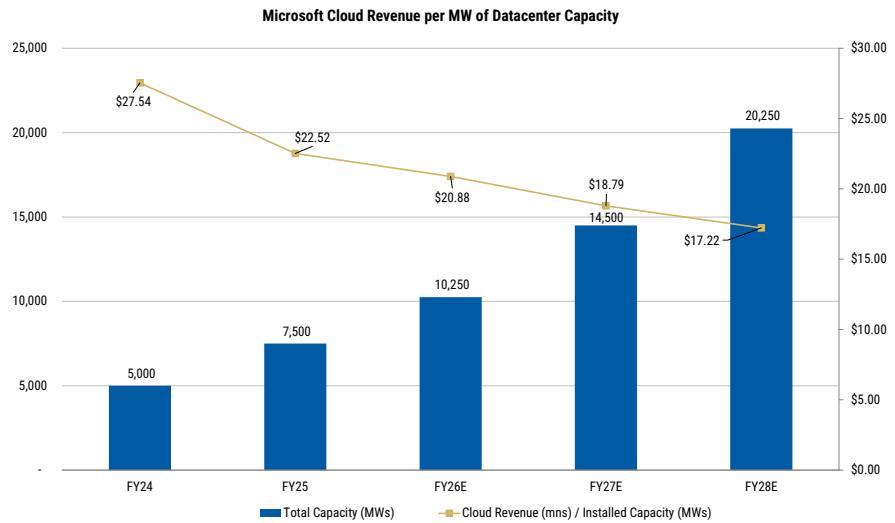
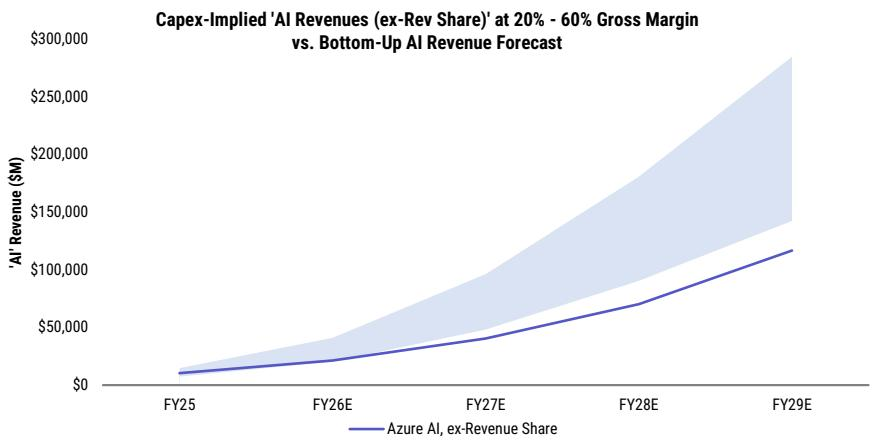
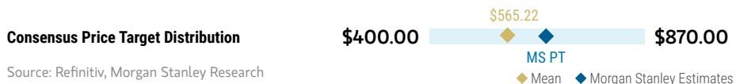
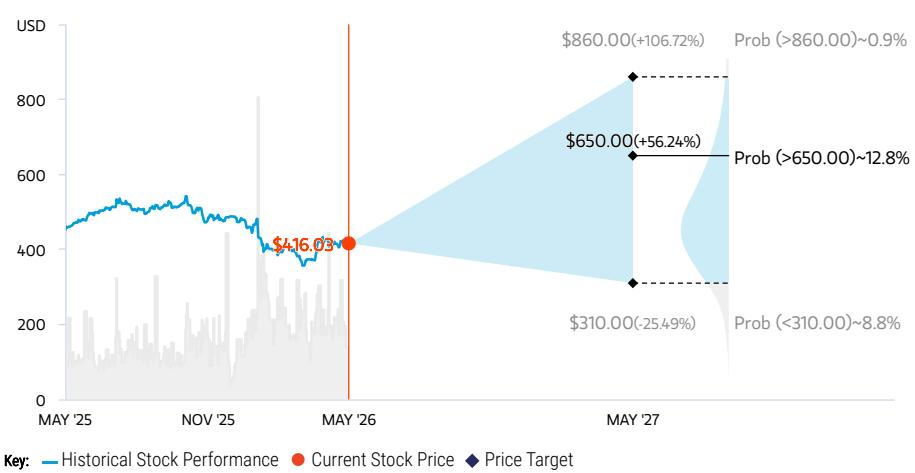
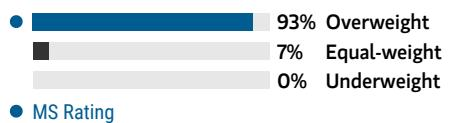
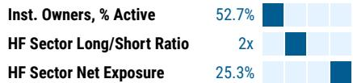
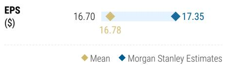
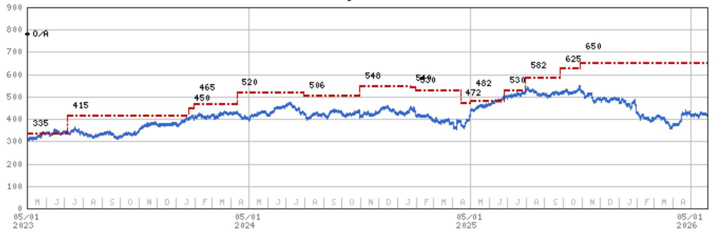

May 27, 2026 03:06 AM GMT

# Microsoft | North America

# Infrastructure Monetization – Still Early Days in the AI Cycle

GenAI demand well ahead of supply has yielded swiftly ramping Capex forecasts in our Microsoft model over the past year. However, our Monetization per Megawatt and Capex-Implied Azure forecasts suggest revenues estimates may be inappropriately lagging, leaving room for upward revisions. OW.

# Key Takeaways

■ Along with our Hyperscaler Capex Deep Dive, we analyze Microsoft cloud revenues relative to datacenter capacity, and come away bullish on upside potential.   
- Our analysis suggests Microsoft is deploying AI datacenter capacity well ahead of near-term monetization, based on our Microsoft cloud revenue estimates.   
■ Microsoft's installed datacenter footprint could scale from \~5GW in FY24 to \~20GW by FY28, based on our estimates.   
Declining revenue per MW through FY29 well accounts for increasing capital intensity and suggests the potential for additional upside to estimates   
Overall, Microsoft's existing AI infrastructure footprint may be capable of supporting significantly higher long-term revenue estimates than currently expected.

We would greatly appreciate your support in the Software Large Cap and Software SmidCap categories in this year's All-America Extel survey. Thank you so much! - Keith and Josh

How to vote: To request a ballot, please go to https://www.extelinsights.com/voting.

2026 EXTEL

ALL-AMERICA
RESEARCH POLL

May 26 – June 12, 2026

We appreciate your support

VOTE HERE

Framework for Analyzing Microsoft's AI Infrastructure Monetization. Following up on our deep dive into Hyperscaler Capex (see How Much Capacity Will \$2 Trillion of Hyperscaler Capex Bring By '27? (17 May 2026)), we ran an exercise to frame Microsoft's cloud and AI infrastructure expansion through the lens of 'revenue per megawatt' (MW) of datacenter capacity, which is becoming increasingly relevant as hyperscalers scale AI infrastructure at unprecedented levels. We estimate Microsoft's cloud ecosystem currently generates \~\$20-30 million of annualized

MS & CO. LLC

# Keith Weiss, CFA

Equity Analyst

Keith.Weiss@morganstanley.com +1 212 761-4149

# Josh Baer, CFA

Equity Analyst

Josh.Baer@morganstanley.com +1 212 761-4223

# Jonathan Eisenson

Research Associate

Jonathan.Eisenson@morganstanley.com +1 212 761-2808

Microsoft (MSFT.O, MSFT US)   
Software | United States of America 

<table><tr><td>Stock Rating</td><td>Overweight</td></tr><tr><td>Industry View</td><td>Attractive</td></tr><tr><td>Price target</td><td>$650.00</td></tr><tr><td>Shr price, close (May 26, 2026)</td><td>$416.03</td></tr><tr><td>Mkt cap, curr (mm)</td><td>$3,097,343</td></tr><tr><td>52-Week Range</td><td>$555.45-356.28</td></tr></table>

<table><tr><td>Fiscal Year Ending</td><td>06/25</td><td>06/26e</td><td>06/27e</td><td>06/28e</td></tr><tr><td>EPS ($)**</td><td>13.64</td><td>17.35</td><td>19.71</td><td>24.03</td></tr><tr><td>Prior EPS ($)**</td><td>-</td><td>-</td><td>-</td><td>-</td></tr><tr><td>P/E</td><td>36.5</td><td>24.0</td><td>21.1</td><td>17.3</td></tr><tr><td>EPS ($)§</td><td>-</td><td>16.78</td><td>19.42</td><td>22.87</td></tr><tr><td>Div yld (%)</td><td>0.7</td><td>0.9</td><td>1.0</td><td>1.1</td></tr></table>

Unless otherwise noted, all metrics are based on MS ModelWare framework   
\*\* = Based on consensus methodology   
§ = Consensus data is provided by Refinitiv Estimates   
e = MS estimates

QUARTERLY EPS (\$) 

<table><tr><td>Quarter</td><td>2025</td><td>2026e Prior</td><td>2026e Current</td><td>2027e Prior</td><td>2027e Current</td></tr><tr><td>Q1</td><td>3.30</td><td>-</td><td>3.72a</td><td>-</td><td>4.69</td></tr><tr><td>Q2</td><td>3.23</td><td>-</td><td>5.16a</td><td>-</td><td>4.88</td></tr><tr><td>Q3</td><td>3.46</td><td>-</td><td>4.27a</td><td>-</td><td>4.84</td></tr><tr><td>Q4</td><td>3.65</td><td>-</td><td>4.21</td><td>-</td><td>5.30</td></tr></table>

e = MS estimates, a = Actual Company reported data

MS does and seeks to do business with companies covered in MS. As a result, investors should be aware that the firm may have a conflict of interest that could affect the objectivity of MS. Investors should consider MS as only a single factor in making their investment decision.

For analyst certification and other important disclosures, refer to the Disclosure Section, located at the end of this report.

revenue per MW of datacenter capacity, with our forecasts suggesting a decline to closer to high-teens by FY28 (see Exhibit 1). Our revenue build for Microsoft Cloud includes Azure and other cloud services, M365 Commercial Cloud, Dynamics 365, and commercial LinkedIn revenue, reflecting our view that Microsoft's datacenter footprint increasingly supports a unified cloud and AI platform across Azure and multiple 1st party applications (rather than just Azure/Azure AI).

# Installed Capacity Assumptions Reflect Forward AI Demand Positioning.

Importantly, our framework assumes the denominator reflects total installed and available datacenter capacity rather than currently utilized load. In our view, this distinction is important given the current stage of the AI infrastructure cycle, as all of the hyperscalers are aggressively investing in and deploying capacity ahead of anticipated Cloud/AI usage. Since Microsoft does not directly disclose installed power capacity, we triangulated our estimates using available news reports and blog posts, with further incremental capacity additions largely based on management's comments regarding cloud/AI infrastructure expansion (i.e., 'All up, we added another gigawatt of capacity this quarter' from the F3Q26 earnings call). Under our assumptions, Microsoft's installed datacenter footprint expands from approximately 5GW in FY24 to roughly 20GW by FY28 after exiting CY25 with roughly 7-9GW, supported by management's recent comments: 'We will increase our total AI capacity by over 80% this year, and roughly double our total datacenter footprint over the next two years, reflecting the demand signals we see.' This increase in capacity also reflects both traditional cloud growth and the significantly higher power intensity associated with generative AI training and inference workloads.

# Declining Revenue per MW Suggests Infrastructure Deployment Is Running

Ahead of Monetization. One of the more notable takeaways from our analysis is that revenue per MW declines over the next few years despite substantial expected growth in AI demand and cloud revenue (revenue per MW should decrease with higher capital intensity AI infrastructure increasing in mix, but the declines account for this and paint our estimates as conservative still). We do not

interpret this dynamic as evidence of a deteriorating monetization opportunity, but rather an indication that 1) Microsoft is deploying AI-specific capacity ahead of the associated monetization cycle and 2) our forecasts likely prove conservative. Said differently, our framework suggests Microsoft is building for a future level of AI demand that has not yet fully materialized in current revenue estimates. This dynamic is consistent with management commentary surrounding AI capacity constraints and long-duration infrastructure planning cycles, particularly given the lead times associated with power procurement, datacenter construction, networking, and GPU deployment. Since our model assumes substantial capacity additions ahead of utilization and monetization, the embedded revenue conversion potential of Microsoft's installed infrastructure footprint may not yet be fully reflected in our revenue estimates today. To the extent AI adoption accelerates faster than expected, inference workloads scale more rapidly, or software attach across Copilot, Azure, Dynamics, GitHub, and M365 (more broadly) improves, Microsoft could potentially generate materially higher revenue per unit of deployed power capacity over time without requiring the same level of incremental infrastructure investment. In that scenario, the company's existing datacenter footprint could support significantly greater revenue productivity than our current

assumptions imply.

\*The datacenter capacity estimates presented herein are based on publicly available information, third-party industry sources, and internal assumptions, and have not been verified nor confirmed by Microsoft. Actual installed capacity, utilization levels, and future deployment plans may differ materially from our estimates.\*

Exhibit 1: We Estimate Microsoft's Revenue per MW Declines as the Company Accelerates DC Capacity Expansion, Supporting Upside to Our Revenue Estimates Over Time   

bar_line

Microsoft Cloud Revenue per MW of Datacenter Capacity
| Fiscal Year | Total Capacity (MWs) | Cloud Revenue (mns) / Installed Capacity (MWs) |
| :--- | :--- | :--- |
| FY24 | 5,000 | 27.54 |
| FY25 | 7,500 | 22.52 |
| FY26E | 10,250 | 20.88 |
| FY27E | 14,500 | 18.79 |
| FY28E | 20,250 | 17.22 |

Source: MS, Company Data \*Assuming Datacenter Capacity for Microsoft Represents Installed Capacity || Cloud Revenue = M365 Commercial Cloud + Dynamics 365 + Commercial LinkedIn + Azure and Other Cloud Services\*

# Supporting Our Above Exercise With Our Latest Capex-Implied AI Revenue Analysis – We See Meaningful Upside to Azure As Long as Azure AI Gross

Margins >15-20%: Our assumption for capex has consistently been revised higher.

Therefore, we continue to lean on our capex driven forecast model to yield our sustained bullish conclusions about the trajectory of Azure growth, which continues to suggest significant upside to our forward Azure forecasts. Our capex model sizes the implied contribution from Azure AI based on the capital expenditures dedicated to AI-related initiatives. We compare the capex-implied Azure AI forecasts, assuming various gross margin levels, with the Azure AI estimates in our MS model.

Consistently repeated on the most recent earnings calls, capex (and corresponding infrastructure) is not just allocated for new Azure demand, as Microsoft must support its 1st party applications, internal R&D/Research efforts, internal training, and a replacement capex cycle. Management has also been vocal for some time that a significant portion of capex is for longer duration assets like land and buildings, which could generate revenue for >15 years. We had previously contemplated this split between short-lived and long-lived capex, and already allocated a significant portion of capex to non-AI cloud (i.e. 1st party apps) as well as AI businesses like Copilot (non-Azure AI). Net, We See Meaningful Upside to Azure As Long as Azure

AI Gross Margins >15-20% Our latest analysis, which utilizes our latest total capex estimates and Azure revenue estimates post-F3Q26 earnings (see 3Q26 Results – Onto Newer and Better Things (30 Apr 2026)), suggests further upside to our current Azure estimates based on our Capex-Implied framework.

Exhibit 2: Capex-Implied Azure AI Revenue Potential is Well Ahead of Our Azure AI Forecast   

line

| Fiscal Year | Azure AI, ex-Revenue Share ($M) |
|-------------|----------------------------------|
| FY25        | ~10,000                          |
| FY26E       | ~20,000                          |
| FY27E       | ~40,000                          |
| FY28E       | ~70,000                          |
| FY29E       | ~120,000                         |

Source: MS

Exhibit 3: Back of the Envelope Compute Math Suggests Microsoft AI Server Capex Implies \~98.2 Million H100 Equivalents by FY29 

<table><tr><td>($ in Millions)</td><td>FY25</td><td>FY26E</td><td>FY27E</td><td>FY28E</td><td>FY29E</td></tr><tr><td>Total Capex</td><td>$88,200</td><td>$145,432</td><td>$250,038</td><td>$312,596</td><td>$375,126</td></tr><tr><td>YoY Growth</td><td>58%</td><td>65%</td><td>72%</td><td>25%</td><td>20%</td></tr><tr><td>Cash Capex</td><td>$64,551</td><td>$110,034</td><td>$193,138</td><td>$242,018</td><td>$290,507</td></tr><tr><td>YoY Growth</td><td>45%</td><td>70%</td><td>76%</td><td>25%</td><td>20%</td></tr><tr><td>Non-Cloud Capex</td><td>$4,725</td><td>$6,999</td><td>$11,154</td><td>$13,598</td><td>$16,023</td></tr><tr><td>YoY Growth</td><td>27%</td><td>48%</td><td>59%</td><td>22%</td><td>18%</td></tr><tr><td>Data Center Cash Capex</td><td>$59,826</td><td>$103,035</td><td>$181,983</td><td>$228,420</td><td>$274,484</td></tr><tr><td>YoY Growth</td><td>47%</td><td>72%</td><td>77%</td><td>26%</td><td>20%</td></tr><tr><td>% of Total Capex</td><td>93%</td><td>94%</td><td>94%</td><td>94%</td><td>94%</td></tr><tr><td>PPE Acquired Under Capital Lease</td><td>$23,649</td><td>$35,398</td><td>$56,900</td><td>$70,578</td><td>$84,618</td></tr><tr><td>Capital Lease as % of Cash Capex</td><td>40%</td><td>34%</td><td>31%</td><td>31%</td><td>31%</td></tr><tr><td>Total Data Center Capex</td><td>$83,475</td><td>$138,433</td><td>$238,883</td><td>$298,998</td><td>$359,103</td></tr><tr><td>YoY Growth</td><td>61%</td><td>66%</td><td>73%</td><td>25%</td><td>20%</td></tr><tr><td>Total Monetizable Data Center Capex</td><td>$72,963</td><td>$124,822</td><td>$220,069</td><td>$274,787</td><td>$331,097</td></tr><tr><td>Total Cloud Capex Intensity</td><td>34%</td><td>48%</td><td>70%</td><td>71%</td><td>69%</td></tr><tr><td>Non-AI Cloud Capex Intensity</td><td>14%</td><td>13%</td><td>13%</td><td>12%</td><td>12%</td></tr><tr><td>M365 Copilot Capex Intensity</td><td>47%</td><td>42%</td><td>37%</td><td>33%</td><td>29%</td></tr><tr><td>Azure AI Capex Intensity</td><td>396%</td><td>413%</td><td>438%</td><td>318%</td><td>231%</td></tr><tr><td>Segment-level Capex</td><td></td><td></td><td></td><td></td><td></td></tr><tr><td>Non-AI Cloud Capex</td><td>$30,796</td><td>$35,227</td><td>$41,034</td><td>$48,424</td><td>$57,667</td></tr><tr><td>Internal AI Training Capex (Non-Monetizable)</td><td>$1,000</td><td>$2,000</td><td>$3,000</td><td>$4,000</td><td>$5,000</td></tr><tr><td>Internal R&amp;D/Research Capex (Non-Monetizable) 1.5% of Total Data Center Capex</td><td>$1,252</td><td>$2,076</td><td>$3,583</td><td>$4,485</td><td>$5,387</td></tr><tr><td>Replacement Capex (55% of 6yr prior Data Center Capex [Servers] + 45% of 15 year Prior [Building])</td><td>$8,260</td><td>$9,535</td><td>$12,231</td><td>$15,726</td><td>$17,619</td></tr><tr><td>Microsoft &#x27;AI Capex&#x27; (Monetizable)</td><td>$42,167</td><td>$89,595</td><td>$179,035</td><td>$226,363</td><td>$273,429</td></tr><tr><td>M365 Copilot Capex</td><td>$1,054</td><td>$1,676</td><td>$2,385</td><td>$3,055</td><td>$3,562</td></tr><tr><td>Azure AI Capex</td><td>$41,113</td><td>$87,919</td><td>$176,650</td><td>$223,309</td><td>$269,868</td></tr></table>

Note: M365 Copilot capex intensity assumes the intensity is maps to the capex intensity of Microsoft Cloud at similar revenue scales (i.e. FY14-19).

<table><tr><td>Server-Related AI Capex</td><td>$27,920</td><td>$57,795</td><td>$118,709</td><td>$150,344</td><td>$180,861</td></tr><tr><td>Chip Version</td><td>H/B100</td><td>B1/B200</td><td>Rubin</td><td>Rubin</td><td>Rubin Ultra</td></tr><tr><td>Cost per Chip ($)</td><td>$37,500</td><td>$43,750</td><td>$62,500</td><td>$62,500</td><td>$181,250</td></tr><tr><td>Impl. Chips Purchased</td><td>744,527</td><td>1,321,040</td><td>1,899,351</td><td>2,405,510</td><td>997,855</td></tr><tr><td>Ratio of Compute to H100s</td><td>1.5x</td><td>2.5x</td><td>11.0x</td><td>11.0x</td><td>46.0x</td></tr><tr><td>Impl. H100 Equivalents Purchased</td><td>1,116,790</td><td>3,302,599</td><td>20,892,861</td><td>26,460,609</td><td>45,901,344</td></tr><tr><td>Cumulative H100 Equivalents</td><td>1,601,778</td><td>4,904,377</td><td>25,797,238</td><td>52,257,846</td><td>98,159,190</td></tr></table>

Note: Grossing up cost per chip to account for "fully-loaded" server cost, which assumes 80% of the server cost is attributable to the cost of the chip.

<table><tr><td>Microsoft Cloud Revenues, ex-Revenue Share</td><td>$216,375</td><td>$261,274</td><td>$316,067</td><td>$387,924</td><td>$481,250</td></tr><tr><td>Non-AI Cloud Revenues</td><td>$203,757</td><td>$236,031</td><td>$269,310</td><td>$308,556</td><td>$352,386</td></tr><tr><td>Bottom-Up AI Revenues (Copilots + Azure AI, ex-rev share)</td><td>$12,618</td><td>$25,243</td><td>$46,757</td><td>$79,368</td><td>$128,864</td></tr><tr><td>M365 Copilot</td><td>$2,227</td><td>$3,961</td><td>$6,389</td><td>$9,166</td><td>$12,146</td></tr><tr><td>Azure AI, ex-Revenue Share</td><td>$10,391</td><td>$21,282</td><td>$40,367</td><td>$70,202</td><td>$116,718</td></tr><tr><td>Azure AI, Total</td><td>$12,097</td><td>$25,669</td><td>$49,419</td><td>$86,202</td><td>$141,218</td></tr><tr><td>Total Azure (MSe)</td><td>$75,428</td><td>$105,605</td><td>$149,423</td><td>$209,338</td><td>$291,186</td></tr></table>

<table><tr><td>&#x27;Monetizable&#x27; Azure AI Capex</td><td>$41,113</td><td>$87,919</td><td>$176,650</td><td>$223,309</td><td>$269,868</td></tr><tr><td>Incremental Depreciation Waterfall</td><td></td><td></td><td></td><td></td><td></td></tr><tr><td>FY23</td><td>$22</td><td>$22</td><td>$22</td><td>$22</td><td>$22</td></tr><tr><td>FY24</td><td>$1,965</td><td>$1,965</td><td>$1,965</td><td>$1,965</td><td>$1,965</td></tr><tr><td>FY25</td><td>$2,460</td><td>$4,920</td><td>$4,920</td><td>$4,920</td><td>$4,920</td></tr><tr><td>FY26</td><td></td><td>$5,392</td><td>$10,785</td><td>$10,785</td><td>$10,785</td></tr><tr><td>FY27</td><td></td><td></td><td>$11,188</td><td>$22,376</td><td>$22,376</td></tr><tr><td>FY28</td><td></td><td></td><td></td><td>$14,143</td><td>$28,286</td></tr><tr><td>FY29</td><td></td><td></td><td></td><td></td><td>$17,092</td></tr><tr><td>Incremental Depreciation</td><td>$4,447</td><td>$12,299</td><td>$28,879</td><td>$54,210</td><td>$85,445</td></tr></table>

Note: Assumes capex splits half between infrastructure needs (build and lease data centers) depreciated over 15 years and the remaining   
half for servers (GPU and CPU) depreciated over 6 years. Further, assumes 50% linearity for Capex in first year.

Source: MS

Exhibit 4: More Confidence in Model Conservatism; Material Upside Likely 

<table><tr><td>AZURE AI EX-REV SHARE</td><td>FY25</td><td>FY26E</td><td>FY27E</td><td>FY28E</td><td>FY29E</td></tr><tr><td>Capex-implied &#x27;Azure AI ex-Revenue Share&#x27; Revenues @ 20% GMs</td><td>$7,412</td><td>$20,499</td><td>$48,132</td><td>$90,350</td><td>$142,408</td></tr><tr><td>Capex-implied &#x27;Azure AI ex-Revenue Share&#x27; Revenues @ 30% GMs</td><td>$8,471</td><td>$23,427</td><td>$55,009</td><td>$103,258</td><td>$162,752</td></tr><tr><td>Capex-implied &#x27;Azure AI ex-Revenue Share&#x27; Revenues @ 40% GMs</td><td>$9,882</td><td>$27,332</td><td>$64,177</td><td>$120,467</td><td>$189,877</td></tr><tr><td>Capex-implied &#x27;Azure AI ex-Revenue Share&#x27; Revenues @ 50% GMs</td><td>$11,859</td><td>$32,798</td><td>$77,012</td><td>$144,561</td><td>$227,853</td></tr><tr><td>Capex-implied &#x27;Azure AI ex-Revenue Share&#x27; Revenues @ 60% GMs</td><td>$14,823</td><td>$40,998</td><td>$96,265</td><td>$180,701</td><td>$284,816</td></tr><tr><td colspan="6">Note: Assumes depreciation constitutes ~75% of COGS while power, labor, etc. constitute the difference.</td></tr><tr><td>Capex-implied &#x27;Azure AI ex-Rev Share&#x27; Upside @ 20% GMs</td><td>-29%</td><td>-4%</td><td>19%</td><td>29%</td><td>22%</td></tr><tr><td>Capex-implied &#x27;Azure AI ex-Rev Share&#x27; Upside @ 30% GMs</td><td>-18%</td><td>10%</td><td>36%</td><td>47%</td><td>39%</td></tr><tr><td>Capex-implied &#x27;Azure AI ex-Rev Share&#x27; Upside @ 40% GMs</td><td>-5%</td><td>28%</td><td>59%</td><td>72%</td><td>63%</td></tr><tr><td>Capex-implied &#x27;Azure AI ex-Rev Share&#x27; Upside @ 50% GMs</td><td>14%</td><td>54%</td><td>91%</td><td>106%</td><td>95%</td></tr><tr><td>Capex-implied &#x27;Azure AI ex-Rev Share&#x27; Upside @ 60% GMs</td><td>43%</td><td>93%</td><td>138%</td><td>157%</td><td>144%</td></tr><tr><td>TOTAL AZURE AI (GMS % of ex-Rev Share)</td><td>FY25</td><td>FY26E</td><td>FY27E</td><td>FY28E</td><td>FY29E</td></tr><tr><td>Capex-implied &#x27;Total Azure AI&#x27; Revenues @ 20% GMs for ex-Rev Share Azure AI</td><td>$9,117</td><td>$24,886</td><td>$57,184</td><td>$106,350</td><td>$166,908</td></tr><tr><td>Capex-implied &#x27;Total Azure AI&#x27; Revenues @ 30% GMs for ex-Rev Share Azure AI</td><td>$10,176</td><td>$27,814</td><td>$64,060</td><td>$119,258</td><td>$187,252</td></tr><tr><td>Capex-implied &#x27;Total Azure AI&#x27; Revenues @ 40% GMs for ex-Rev Share Azure AI</td><td>$11,588</td><td>$31,719</td><td>$73,228</td><td>$136,467</td><td>$214,377</td></tr><tr><td>Capex-implied &#x27;Total Azure AI&#x27; Revenues @ 50% GMs for ex-Rev Share Azure AI</td><td>$13,564</td><td>$37,185</td><td>$86,063</td><td>$160,561</td><td>$252,353</td></tr><tr><td>Capex-implied &#x27;Total Azure AI&#x27; Revenues @ 60% GMs for ex-Rev Share Azure AI</td><td>$16,529</td><td>$45,385</td><td>$105,316</td><td>$196,701</td><td>$309,316</td></tr><tr><td colspan="6">Note: Assumes depreciation constitutes ~75% of COGS while power, labor, etc. constitute the difference.</td></tr><tr><td>Capex-implied &#x27;Total Azure AI&#x27; Upside @ 20% GMs</td><td>-25%</td><td>-3%</td><td>16%</td><td>23%</td><td>18%</td></tr><tr><td>Capex-implied &#x27;Total Azure AI&#x27; Upside @ 30% GMs</td><td>-16%</td><td>8%</td><td>30%</td><td>38%</td><td>33%</td></tr><tr><td>Capex-implied &#x27;Total Azure AI&#x27; Upside @ 40% GMs</td><td>-4%</td><td>24%</td><td>48%</td><td>58%</td><td>52%</td></tr><tr><td>Capex-implied &#x27;Total Azure AI&#x27; Upside @ 50% GMs</td><td>12%</td><td>45%</td><td>74%</td><td>86%</td><td>79%</td></tr><tr><td>Capex-implied &#x27;Total Azure AI&#x27; Upside @ 60% GMs</td><td>37%</td><td>77%</td><td>113%</td><td>128%</td><td>119%</td></tr><tr><td>TOTAL AZURE (GMS % of ex-Rev Share)</td><td>FY25</td><td>FY26E</td><td>FY27E</td><td>FY28E</td><td>FY29E</td></tr><tr><td>Capex-implied &#x27;Total Azure&#x27; Revenues @ 20% GMs for ex-Rev Share Azure AI</td><td>$72,448</td><td>$104,822</td><td>$157,188</td><td>$229,487</td><td>$316,876</td></tr><tr><td>Capex-implied &#x27;Total Azure&#x27; Revenues @ 30% GMs for ex-Rev Share Azure AI</td><td>$73,507</td><td>$107,750</td><td>$164,064</td><td>$242,394</td><td>$337,220</td></tr><tr><td>Capex-implied &#x27;Total Azure&#x27; Revenues @ 40% GMs for ex-Rev Share Azure AI</td><td>$74,919</td><td>$111,655</td><td>$173,232</td><td>$259,604</td><td>$364,345</td></tr><tr><td>Capex-implied &#x27;Total Azure&#x27; Revenues @ 50% GMs for ex-Rev Share Azure AI</td><td>$76,895</td><td>$117,121</td><td>$186,068</td><td>$283,697</td><td>$402,320</td></tr><tr><td>Capex-implied &#x27;Total Azure&#x27; Revenues @ 60% GMs for ex-Rev Share Azure AI</td><td>$79,860</td><td>$125,321</td><td>$205,321</td><td>$319,837</td><td>$459,284</td></tr><tr><td colspan="6">Note: Assumes depreciation constitutes ~75% of COGS while power, labor, etc. constitute the difference.</td></tr><tr><td>Capex-implied &#x27;Total Azure&#x27; Upside @ 20% GMs</td><td>-4%</td><td>-1%</td><td>5%</td><td>10%</td><td>9%</td></tr><tr><td>Capex-implied &#x27;Total Azure&#x27; Upside @ 30% GMs</td><td>-3%</td><td>2%</td><td>10%</td><td>16%</td><td>16%</td></tr><tr><td>Capex-implied &#x27;Total Azure&#x27; Upside @ 40% GMs</td><td>-1%</td><td>6%</td><td>16%</td><td>24%</td><td>25%</td></tr><tr><td>Capex-implied &#x27;Total Azure&#x27; Upside @ 50% GMs</td><td>2%</td><td>11%</td><td>25%</td><td>36%</td><td>38%</td></tr><tr><td>Capex-implied &#x27;Total Azure&#x27; Upside @ 60% GMs</td><td>6%</td><td>19%</td><td>37%</td><td>53%</td><td>58%</td></tr></table>

Source: MS

# Going One Step Further... Decomposing Blended Revenue per MW: AI Mix Shift Likely Driving Lower Aggregate Revenue Productivity. One important nuance

within our Revenue per MW framework above (Exhibit 1) is that aggregate datacenter revenue productivity should not necessarily remain stable as hyperscalers increasingly deploy AI-oriented infrastructure. GenAI workloads are materially more power-intensive than traditional cloud compute, with GPU-heavy training and inference clusters likely generating structurally lower revenue per MW than mature general-purpose cloud workloads, particularly in the early stages of deployment and utilization ramp. As a result, we believe it is important to separate the economics of Microsoft's broader cloud footprint from the incremental AI-specific infrastructure currently being deployed at scale. Microsoft generated approximately \~\$28mn of cloud revenue per MW in FY24, which we view as largely reflective of a pre-AI or primarily non-AI cloud mix. Under a simplifying assumption that Microsoft's core cloud business continues generating roughly similar revenue productivity over time, the decline in blended revenue per MW embedded in our forecasts can be interpreted as the partial impact of an increasing mix of AI infrastructure capacity.

Importantly, this analysis suggests that our current forecasts may already embed a meaningful impact from lower-productivity AI infrastructure deployment, which is still in the early days. Said differently, the decline in blended revenue per MW in the above analysis likely reflects the significantly higher capital and power intensity associated with AI workloads, and may support further revenue upside to our estimates going forward. To that end, to the extent Microsoft ultimately drives stronger inference utilization, higher software attach, or improved monetization across Azure AI and Copilot offerings, revenue productivity on incremental AI capacity could ultimately prove higher than what is currently embedded in our estimates.

Under this framework, the implied monetization profile of incremental AI capacity appears relatively conservative vs. current market pricing for GPU infrastructure and neocloud bare-metal offerings.

Exhibit 5: Implied AI Revenue per MW Based on Blended Revenue Mix Analysis 

<table><tr><td>($ in mns)</td><td>FY24</td><td>FY25</td><td>FY26E</td><td>FY27E</td><td>FY28E</td></tr><tr><td>Total Capacity (MWs)</td><td>5,000</td><td>7,500</td><td>10,250</td><td>14,500</td><td>20,250</td></tr><tr><td>$/MW</td><td>$27.5</td><td>$22.5</td><td>$20.9</td><td>$18.8</td><td>$17.2</td></tr><tr><td>Cloud &amp; AI Revenue</td><td>$137,700</td><td>$168,900</td><td>$214,061</td><td>$272,521</td><td>$348,734</td></tr><tr><td>Azure AI Revs</td><td>$3,872</td><td>$12,097</td><td>$25,669</td><td>$49,419</td><td>$86,202</td></tr><tr><td>M365 Copilot Rev</td><td>$794</td><td>$2,227</td><td>$3,961</td><td>$6,389</td><td>$9,166</td></tr><tr><td>Total AI Revenue</td><td>$4,666</td><td>$14,324</td><td>$29,630</td><td>$55,808</td><td>$95,368</td></tr><tr><td>Core Cloud</td><td>$133,034</td><td>$154,576</td><td>$184,432</td><td>$216,713</td><td>$253,367</td></tr><tr><td>$/MW</td><td>$27.5</td><td>$27.5</td><td>$27.5</td><td>$27.5</td><td>$27.5</td></tr><tr><td>MWs</td><td>4,831</td><td>5,613</td><td>6,697</td><td>7,869</td><td>9,200</td></tr><tr><td>% of Total Capacity</td><td>97%</td><td>75%</td><td>65%</td><td>54%</td><td>45%</td></tr><tr><td>Total AI</td><td></td><td>$14,324</td><td>$29,630</td><td>$55,808</td><td>$95,368</td></tr><tr><td>IMPLIED $ / MW</td><td></td><td>$7.59</td><td>$8.34</td><td>$8.42</td><td>$8.63</td></tr><tr><td>MWs (MSFT AI)</td><td>169</td><td>1,887</td><td>3,553</td><td>6,631</td><td>11,050</td></tr><tr><td>$ Rev / MW (CRWV)</td><td></td><td>$10.00</td><td>$9.61</td><td>$10.63</td><td>$10.62</td></tr><tr><td>$ Rev / MW (NBIS)</td><td>$10.23</td><td>$8.22</td><td>$8.67</td><td>$8.87</td><td>$8.97</td></tr></table>

Source: MS, Company Data \*Note CRWV & NBIS FYs are December End vs. MSFT's June End\* \*\*Rev / MW calculations for CRWV & NBIS are based on revenue in the period / average MW in the period (average beginning and ending MW)\*\*

# Risk Reward – Microsoft (MSFT.O)

Durability of Earnings Growth & AI Leadership Not Priced-In

# PRICE TARGET \$650.00

30x Base Case CY27e EPS of \$21.76. 30x PE is a slight premium to large cap software peers, 1.5x PEG is relatively in line with MSFT historical PEG while a premium to peers, justified by Microsoft's strong positioning and strong execution.

bar_line

| Category | Value     |
| -------- | --------- |
| MS PT    | $870.00   |
| Mean     | $565.22   |
| MS Estimates | $400.00  |

RISK REWARD CHART AND OPTIONS IMPLIED PROBABILITIES (12M)   

line

| Date     | Historical Stock Performance | Current Stock Price | Price Target Change |
| -------- | ----------------------------- | ------------------- | --------------------- |
| MAY '25  | ~450                          | -                   | -                     |
| NOV '25  | ~500                          | -                   | -                     |
| MAY '26  | $416.03                       | -                   | -                     |
| MAY '27  | -                             | $416.03             | $860.00 (+106.72%)   |
| MAY '27  | -                             | -                   | $650.00 (+56.24%)    |
| MAY '27  | -                             | -                   | $310.00 (-25.49%)    |
| MAY '27  | -                             | -                   | $310.00 (~8.8%)      |

Source: Refinitiv, MS, MS Institutional Equities Division. The probabilities of our Bull, Base, and Bear case scenarios playing out were estimated with implied volatility data from the options market as of 26 May 2026. All figures are approximate risk-neutral probabilities of the stock reaching beyond the scenario price in either three-months' or one-years' time. View explanation of Options Probabilities methodology here

# OVERWEIGHT THESIS

■ Strong positioning for public cloud adoption & AI, large distribution channels and installed customer base, and expanding margins supports EPS growth. Weaker cyclical environment improves as cloud optimizations complete - LT trends remain durable.

\- Teens revenue growth, opex discipline and strong capital return lead to durable mid- to high-teens total return profile long term.
- At \~30x CY27e GAAP EPS, the durability of Microsoft's earnings growth and the company's premium return profile remains underpriced. Multiple expansion and positive estimate revisions will come from greater than expected strength in commercial businesses including Azure.

Consensus Rating Distribution   

bar

| Category     | Value |
| ------------ | ----- |
| Overweight   | 93%   |
| Equal-weight | 7%    |
| Underweight  | 0%    |

Source: Refinitiv, MS

# Risk Reward Themes

<table><tr><td>New Data Era:</td><td>Positive</td></tr><tr><td>Pricing Power:</td><td>Positive</td></tr><tr><td>Secular Growth:</td><td>Positive</td></tr></table>

View descriptions of Risk Rewards Themes here

# BULL CASE

# \$860.00

# BASE CASE

# \$650.00

# BEAR CASE

# \$310.00

# \~35x Bull Case CY27e EPS: \$24.42

Azure, O365 & Robust Contribution from AI Drive Top-Line Growth. Acceleration in Azure growth, adoption of higher priced M365 Commercial SKUs and continued seat growth, and robust adoption of Azure AI services and Microsoft AI Copilots across business lines drive mid-teens revenue CAGR in the coming years. Operating margins expand to \~49.3% by CY27 and CY27e EPS is \$24.42. \~35x PE represents a premium to large cap software peers, but roughly inline with Hist Avg PEG at \~1.4x given >20% EPS CAGR.

# \~30x Base Case CY27e EPS of \$21.76

Azure, M365 & Ramping Contribution from AI Drive Top-Line Growth. Durability of Azure growth, adoption of higher priced M365 Commercial SKUs and continued seat growth, and ramping adoption of Azure AI services & Microsoft AI Copilots across business lines drive low-teens rev CAGR ahead. Operating margins expand beyond \~47.3% by CY27 and CY27e EPS is \$21.76. 30x PE is a premium to large cap software peers, given strong positioning and execution. 1.5x PEG is inline with MSFT historical PEG.

# \~16x Bear Case CY27e EPS: \$19.70

Macro, Scale & Limited AI Adoption Drives Top-Line Growth Deceleration. Azure growth continues deceleration given scale, while M365 reaches penetration and adoption of Azure AI services & Microsoft AI Copilots across business lines remains limited. This drives low double-digit rev CAGR. Operating margins only expand to \~45.3% by CY27 from gross margin pressure and CY27e EPS is \$19.70. \~16x PE is a discount to large cap software peers and a discount on a PEG.

# Risk Reward – Microsoft (MSFT.O)

KEY EARNINGS INPUTS 

<table><tr><td>Drivers</td><td>2025</td><td>2026e</td><td>2027e</td><td>2028e</td></tr><tr><td>Azure Revenue Growth (%)</td><td>29.7</td><td>30.2</td><td>26.4</td><td>22.4</td></tr><tr><td>Server Products On-Prem Growth (%)</td><td>(2.0)</td><td>(1.0)</td><td>(1.0)</td><td>(1.0)</td></tr><tr><td>Gross Margins (%)</td><td>68.8</td><td>67.7</td><td>66.2</td><td>65.7</td></tr><tr><td>Operating Margins (%)</td><td>45.6</td><td>46.6</td><td>46.9</td><td>47.7</td></tr><tr><td>GAAP EPS Growth (%)</td><td>15.6</td><td>27.2</td><td>13.6</td><td>22.0</td></tr></table>

# INVESTMENT DRIVERS

- Sustainability of commercial growth, cloud momentum, improving cloud margins   
- Improving PC data points

# GLOBAL REVENUE EXPOSURE

0-10% APAC, ex Japan, Mainland China and India   
0-10% India   
0-10% Japan   
0-10% Latin America   
0-10% MEA   
0-10% Mainland China   
0-10% UK   
10-20% Europe ex UK   
50-60% North America

Source: MS Estimate View explanation of regional hierarchies here

# MS ALPHA MODELS

3/5 BEST

24 Month Horizon

1/5
MOST

3 Month Horizon

Source: Refinitiv, FactSet, MS; 1 is the highest favored Quintile and 5 is the least favored Quintile

# RISKS TO PT/RATING

# RISKS TO UPSIDE

- Cloud adoption accelerates, with Azure as convincing winner   
- AI leadership results in substantial revenue contribution over-time   
- Operational efficiencies leading to greater than anticipated economies of scale and margin expansion

# RISKS TO DOWNSIDE

- Weak macro impacting IT spending   
- On-premises cannibalization by Cloud   
- Increased investments hurt margin expansion   
• AI adoption proves limited

# OWNERSHIP POSITIONING

bar

| Category | Value |
| -------- | ----- |
| Inst. Owners, % Active | 52.7% |
| HF Sector Long/Short Ratio | 2x |
| HF Sector Net Exposure | 25.3% |

Refinitiv; MSPB Content. Includes certain hedge fund exposures held with MSPB. Information may be inconsistent with or may not reflect broader market trends. Long/Short Ratio = Long Exposure / Short exposure. Sector % of Total Net Exposure = (For a particular sector: Long Exposure - Short Exposure) / (Across all sectors: Long Exposure – Short Exposure).

# MS ESTIMATES VS. CONSENSUS

<table><tr><td colspan="3">FY Jun 2026e</td></tr><tr><td rowspan="2">Sales / Revenue($, mm)</td><td rowspan="2">327,677</td><td>329,533</td></tr><tr><td>329,373</td></tr><tr><td rowspan="2">EBITDA($, mm)</td><td rowspan="2">184,508</td><td>196,656</td></tr><tr><td>197,457</td></tr><tr><td rowspan="3">Net income($, mm)</td><td rowspan="3">124,463</td><td>125,569</td></tr><tr><td>129,248</td></tr><tr><td>130,613</td></tr></table>

bar_line

|        | EPS ($) |
| ------ | ------- |
| Mean   | 16.70   |
| MS Estimates | 17.35   |
| Latest Estimate | 16.78   |

Source: Refinitiv, MS

# Risk Reward Reference links

1. View explanation of Options Probabilities methodology - Options\_Probabilities\_Exhibit\_Link.pdf   
2. View descriptions of Risk Rewards Themes - RR\_Themes\_Exhibit\_Link.pdf   
3. View explanation of regional hierarchies - GEG\_Exhibit\_Link.pdf   
4. View explanation of Theme/Exposure methodology - ESG\_Sustainable\_Solutions\_External\_Link.pdf   
5. View explanation of HERS methodology - ESG\_HERS\_External\_Link.pdf

# Disclosure Section

The information and opinions in MS were prepared by MS & Co. LLC, and/or MS C.T.V.M. S.A., and/or MS Mexico, Casa de Bolsa, S.A. de C.V., and/or MS Canada Limited. As used in this disclosure section, "MS" includes MS & Co. LLC, MS C.T.V.M. S.A., MS Mexico, Casa de Bolsa, S.A. de C.V., MS Canada Limited and their affiliates as necessary.

For important disclosures, stock price charts and equity rating histories regarding companies that are the subject of this report, please see the MS Disclosure Website at www.morganstanley.com/eqr/disclosures/webapp/generalresearch, or contact your investment representative or MS at 1585 Broadway, (Attention: Research Management), New York, NY, 10036 USA.

For valuation methodology and risks associated with any recommendation, rating or price target referenced in this research report, please contact the Client Support Team as follows: US/Canada +1 800 303-2495; Hong Kong +852 2848-5999; Latin America +1 718 754-5444 (U.S.); London +44 (0)20-7425-8169; Singapore +65 6834-6860; Sydney +61 (0)2-9770-1505; Tokyo +81 (0)3-6836-9000. Alternatively you may contact your investment representative or MS at 1585 Broadway, (Attention: Research Management), New York, NY 10036 USA.

# Analyst Certification

The following analysts hereby certify that their views about the companies and their securities discussed in this report are accurately expressed and that they have not received and will not receive direct or indirect compensation in exchange for expressing specific recommendations or views in this report: Josh Baer, CFA; Keith Weiss, CFA.

# Global Research Conflict Management Policy

MS has been published in accordance with our conflict management policy, which is available at www.morganstanley.com/institutional/research/conflictpolicies. A Portuguese version of the policy can be found at www.morganstanley.com.br

# Important Regulatory Disclosures on Subject Companies

The analyst or strategist (or a household member) identified below owns the following securities (or related derivatives): Jonathan Eisenson - Adobe Inc.(common or preferred stock), Sprout Social Inc(common or preferred stock).

As of April 30, 2026, MS beneficially owned 1% or more of a class of common equity securities of the following companies covered in MS: Adobe Inc., Akamai Technologies, Inc., Amplitude Inc., Appian Corp, Asana Inc, Atlassian Corporation PLC, Autodesk, BILL Holdings Inc, Blackline Inc, Box Inc, C3.ai, CCC Intelligent Solutions Holdings Inc, Check Point Software Technologies Ltd., Cloudflare Inc, CoreWeave, Coursera, Inc., CrowdStrike Holdings Inc, Datadog, Inc., Descartes Systems Group Inc, DigitalOcean Holdings Inc, DocuSign Inc, Elastic NV, Figma Inc, Five9 Inc, Fortinet Inc., Freshworks Inc, Gen Digital Inc., GitLab Inc, GoDaddy Inc, HubSpot, Inc., Intuit, Klaviyo, Inc, LegalZoom.com Inc, Lightspeed Commerce Inc., Liveramp Holdings Inc, Manhattan Associates Inc., Microsoft, monday.com Ltd, MongoDB Inc, Nebius Group NV, NICE Ltd., Okta, Inc., Oracle Corporation, PagerDuty, Inc., Palantir Technologies Inc., Palo Alto Networks Inc, Qualys Inc, Rapid7 Inc, RingCentral Inc, Sabre Corp, Salesforce, Inc., Samsara Inc, SentinelOne, Inc., ServiceNow Inc, ServiceTitan Inc, Shopify Inc, Snowflake Inc., Sprinklr Inc, Sprout Social Inc, SPS Commerce Inc, Tenable Holdings Inc, Toast, Inc., Twilio Inc, UiPath Inc, Varonis Systems, Inc., Vertex Inc., Wix.Com Ltd, Workday Inc, Zeta Global Holdings Corp, ZoomInfo Technologies Inc, Zscaler Inc.

Within the last 12 months, MS managed or co-managed a public offering (or 144A offering) of securities of Akamai Technologies, Inc., Autodesk, Check Point Software Technologies Ltd., Cloudflare Inc, CoreWeave, DigitalOcean Holdings Inc, Figma Inc, Navan Inc, Nebius Group NV, Netskope, Inc., Palo Alto Networks Inc, Salesforce, Inc., ServiceNow Inc, Via Transportation Inc, Wix.Com Ltd.

Within the last 12 months, MS has received compensation for investment banking services from Akamai Technologies, Inc., Autodesk, Blackline Inc, CCC Intelligent Solutions Holdings Inc, Check Point Software Technologies Ltd., Cloudflare Inc, CoreWeave, DigitalOcean Holdings Inc, Figma Inc, HubSpot, Inc., Intuit, Microsoft, Navan Inc, Nebius Group NV, Netskope, Inc., NICE Ltd., Palo Alto Networks Inc, RingCentral Inc, SailPoint Inc, Salesforce, Inc., ServiceNow Inc, Via Transportation Inc, Wix.Com Ltd, Workday Inc, Zeta Global Holdings Corp.

In the next 3 months, MS expects to receive or intends to seek compensation for investment banking services from Adobe Inc., Akamai Technologies, Inc., Amplitude Inc., Appian Corp, Asana Inc, Atlassian Corporation PLC, Autodesk, BILL Holdings Inc, Blackline Inc, Box Inc, C3.ai, CCC Intelligent Solutions Holdings Inc, Check Point Software Technologies Ltd., Cloudflare Inc, Commerce.com Inc., CoreWeave, Coursera, Inc., CrowdStrike Holdings Inc, Datadog, Inc., Descartes Systems Group Inc, DigitalOcean Holdings Inc, Docebo Inc., DocuSign Inc, Elastic NV, Figma Inc, Five9 Inc, Fortinet Inc., Freshworks Inc, Gen Digital Inc., GitLab Inc, GoDaddy Inc, HubSpot, Inc., Intuit, JFrog Ltd., Klaviyo, Inc, LegalZoom.com Inc, Lightspeed Commerce Inc., Liveramp Holdings Inc, Microsoft, monday.com Ltd, MongoDB Inc, Navan Inc, Nebius Group NV, Netskope, Inc., NICE Ltd., Okta, Inc., Oracle Corporation, PagerDuty, Inc., Palantir Technologies Inc., Palo Alto Networks Inc, Qualys Inc, Rapid7 Inc, RingCentral Inc, Sabre Corp, SailPoint Inc, Salesforce, Inc., Samsara Inc, SentinelOne, Inc., ServiceNow Inc, ServiceTitan Inc, Shopify Inc, Snowflake Inc., Sprinklr Inc, Sprout Social Inc, SPS Commerce Inc, Tenable Holdings Inc, Toast, Inc., Twilio Inc, UiPath Inc, Varonis Systems, Inc., Vertex Inc., Via Transportation Inc, Wix.Com Ltd, Workday Inc, Zeta Global Holdings Corp, Zoom Communications, Zscaler Inc.

Within the last 12 months, MS has received compensation for products and services other than investment banking services from Adobe Inc., Amplitude Inc., Asana Inc, Atlassian Corporation PLC, Autodesk, Blackline Inc, Box Inc, CCC Intelligent Solutions Holdings Inc, Check Point Software Technologies Ltd., Cloudflare Inc, CoreWeave, CrowdStrike Holdings Inc, DocuSign Inc, Freshworks Inc, Gen Digital Inc., GitLab Inc, HubSpot, Inc., Intuit, JFrog Ltd., Klaviyo, Inc, Microsoft, monday.com Ltd, MongoDB Inc, NICE Ltd., Oracle Corporation, Palo Alto Networks Inc, RingCentral Inc, Sabre Corp, Salesforce, Inc., SentinelOne, Inc., ServiceNow Inc, Snowflake Inc., Toast, Inc., UiPath Inc, Varonis Systems, Inc., Workday Inc, Zoom Communications, Zscaler Inc. Within the last 12 months, MS has provided or is providing investment banking services to, or has an investment banking client relationship with, the following company: Adobe Inc., Akamai Technologies, Inc., Amplitude Inc., Appian Corp, Asana Inc, Atlassian Corporation PLC, Autodesk, BILL Holdings Inc, Blackline Inc, Box Inc, C3.ai, CCC Intelligent Solutions Holdings Inc, Check Point Software Technologies Ltd., Cloudflare Inc, Commerce.com Inc., CoreWeave, Coursera, Inc., CrowdStrike Holdings Inc, Datadog, Inc., Descartes Systems Group Inc, DigitalOcean Holdings Inc, Docebo Inc., DocuSign Inc, Elastic NV, Figma Inc, Five9 Inc, Fortinet Inc., Freshworks Inc, Gen Digital Inc., GitLab Inc, GoDaddy Inc, HubSpot, Inc., Intuit, JFrog Ltd., Klaviyo, Inc, LegalZoom.com Inc, Lightspeed Commerce Inc., Liveramp Holdings Inc, Microsoft, monday.com Ltd, MongoDB Inc, Navan Inc, Nebius Group NV, Netskope, Inc., NICE Ltd., Okta, Inc., Oracle Corporation, PagerDuty, Inc., Palantir Technologies Inc., Palo Alto Networks Inc, Qualys Inc, Rapid7 Inc, RingCentral Inc, Sabre Corp, SailPoint Inc, Salesforce, Inc., Samsara Inc, SentinelOne, Inc., ServiceNow Inc, ServiceTitan Inc, Shopify Inc, Snowflake Inc., Sprinklr Inc, Sprout Social Inc, SPS Commerce Inc, Tenable Holdings Inc, Toast, Inc., Twilio Inc, UiPath Inc, Varonis Systems, Inc., Vertex Inc., Via Transportation Inc, Wix.Com Ltd, Workday Inc, Zeta Global Holdings Corp, Zoom Communications, Zscaler Inc.

Within the last 12 months, MS has either provided or is providing non-investment banking, securities-related services to and/or in the past has entered into an agreement to provide services or has a client relationship with the following company: Adobe Inc., Akamai Technologies, Inc., Amplitude Inc., Asana Inc, Atlassian Corporation PLC, Autodesk, Blackline Inc, Box Inc, CCC Intelligent Solutions Holdings Inc, Check Point Software Technologies Ltd., Cloudflare Inc, Commerce.com Inc., CoreWeave, CrowdStrike Holdings Inc, Datadog, Inc., DocuSign Inc, Five9 Inc, Fortinet Inc, Freshworks Inc, Gen Digital Inc, GitLab Inc, GoDaddy Inc, HubSpot, Inc., Intuit, JFrog Ltd., Klaviyo, Inc, Microsoft, monday.com Ltd, MongoDB Inc, Nebius Group NV, NICE Ltd., Oracle Corporation, PagerDuty, Inc., Palo Alto Networks Inc, Qualys Inc, RingCentral Inc, Sabre Corp, Salesforce, Inc., SentinelOne, Inc., ServiceNow Inc, Shopify Inc, Snowflake Inc., Toast, Inc.,

Twilio Inc, UiPath Inc, Varonis Systems, Inc., Wix.Com Ltd, Workday Inc, Zoom Communications, Zscaler Inc.

An employee, director or consultant of MS is a director of Elastic NV, Tenable Holdings Inc. This person is not a research analyst or a member of a research analyst's household. MS & Co. LLC makes a market in the securities of Amplitude Inc., Appian Corp, Asana Inc, Autodesk, Blackline Inc, Box Inc, Check Point Software Technologies Ltd., Coursera, Inc., Docebo Inc., Five9 Inc, Freshworks Inc, HubSpot, Inc., LegalZoom.com Inc, Liveramp Holdings Inc, Manhattan Associates Inc., monday.com Ltd, PagerDuty, Inc., Qualys Inc, Rapid7 Inc, RingCentral Inc, Sabre Corp, Sprinklr Inc, Sprout Social Inc, SPS Commerce Inc, Tenable Holdings Inc, Twilio Inc, Varonis Systems, Inc., Vertex Inc., ZoomInfo Technologies Inc.

The equity research analysts or strategists principally responsible for the preparation of MS have received compensation based upon various factors, including quality of research, investor client feedback, stock picking, competitive factors, firm revenues and overall investment banking revenues. Equity Research analysts' or strategists' compensation is not linked to investment banking or capital markets transactions performed by MS or the profitability or revenues of particular trading desks.

MS and its affiliates do business that relates to companies/instruments covered in MS, including market making, providing liquidity, fund management, commercial banking, extension of credit, investment services and investment banking. MS sells to and buys from customers the securities/instruments of companies covered in MS on a principal basis. MS may have a position in the debt of the Company or instruments discussed in this report. MS trades or may trade as principal in the debt securities (or in related derivatives) that are the subject of the debt research report.

Certain disclosures listed above are also for compliance with applicable regulations in non-US jurisdictions.

# STOCK RATINGS

MS uses a relative rating system using terms such as Overweight, Equal-weight, Not-Rated or Underweight (see definitions below). MS does not assign ratings of Buy, Hold or Sell to the stocks we cover. Overweight, Equal-weight, Not-Rated and Underweight are not the equivalent of buy, hold and sell. Investors should carefully read the definitions of all ratings used in MS. In addition, since MS contains more complete information concerning the analyst's views, investors should carefully read MS, in its entirety, and not infer the contents from the rating alone. In any case, ratings (or research) should not be used or relied upon as investment advice. An investor's decision to buy or sell a stock should depend on individual circumstances (such as the investor's existing holdings) and other considerations.

# Global Stock Ratings Distribution

(as of April 30, 2026)

The Stock Ratings described below apply to MS's Fundamental Equity Research and do not apply to Debt Research produced by the Firm.

For disclosure purposes only (in accordance with FINRA requirements), we include the category headings of Buy, Hold, and Sell alongside our ratings of Overweight, Equal-weight, Not-Rated and Underweight. MS does not assign ratings of Buy, Hold or Sell to the stocks we cover. Overweight, Equal-weight, Not-Rated and Underweight are not the equivalent of buy, hold, and sell but represent recommended relative weightings (see definitions below). To satisfy regulatory requirements, we correspond Overweight, our most positive stock rating, with a buy recommendation; we correspond Equal-weight and Not-Rated to hold and Underweight to sell recommendations, respectively.

<table><tr><td></td><td colspan="2">Coverage Universe</td><td colspan="3">Investment Banking Clients (IBC)</td><td colspan="2">Other Material Investment ServicesClients (MISC)</td></tr><tr><td>Stock RatingCategory</td><td>Count</td><td>% of Total</td><td>Count</td><td>% of Total IBC</td><td>% of RatingCategory</td><td>Count</td><td>% of Total OtherMISC</td></tr><tr><td>Overweight/Buy</td><td>1546</td><td>42%</td><td>467</td><td>51%</td><td>30%</td><td>709</td><td>44%</td></tr><tr><td>Equal-weight/Hold</td><td>1568</td><td>43%</td><td>358</td><td>39%</td><td>23%</td><td>715</td><td>44%</td></tr><tr><td>Not-Rated/Hold</td><td>4</td><td>0%</td><td>0</td><td>0%</td><td>0%</td><td>1</td><td>0%</td></tr><tr><td>Underweight/Sell</td><td>555</td><td>15%</td><td>84</td><td>9%</td><td>15%</td><td>202</td><td>12%</td></tr><tr><td>Total</td><td>3,673</td><td></td><td>909</td><td></td><td></td><td>1627</td><td></td></tr></table>

Data include common stock and ADRs currently assigned ratings. Investment Banking Clients are companies from whom MS received investment banking compensation in the last 12 months. Due to rounding off of decimals, the percentages provided in the "% of total" column may not add up to exactly 100 percent.

# Analyst Stock Ratings

Overweight (O). The stock's total return is expected to exceed the average total return of the analyst's industry (or industry team's) coverage universe, on a risk-adjusted basis, over the next 12-18 months.

Equal-weight (E). The stock's total return is expected to be in line with the average total return of the analyst's industry (or industry team's) coverage universe, on a risk-adjusted basis, over the next 12-18 months.

Not-Rated (NR). Currently the analyst does not have adequate conviction about the stock's total return relative to the average total return of the analyst's industry (or industry team's) coverage universe, on a risk-adjusted basis, over the next 12-18 months.

Underweight (U). The stock's total return is expected to be below the average total return of the analyst's industry (or industry team's) coverage universe, on a risk-adjusted basis, over the next 12-18 months.

Unless otherwise specified, the time frame for price targets included in MS is 12 to 18 months.

# Analyst Industry Views

Attractive (A): The analyst expects the performance of his or her industry coverage universe over the next 12-18 months to be attractive vs. the relevant broad market benchmark, as indicated below.

In-Line (I): The analyst expects the performance of his or her industry coverage universe over the next 12-18 months to be in line with the relevant broad market benchmark, as indicated below. Cautious (C): The analyst views the performance of his or her industry coverage universe over the next 12-18 months with caution vs. the relevant broad market benchmark, as indicated below. Benchmarks for each region are as follows: North America - S&P 500; Latin America - relevant MSCI country index or MSCI Latin America Index; Europe - MSCI Europe; Japan - TOPIX; Asia - relevant MSCI country index or MSCI sub-regional index or MSCI AC Asia Pacific ex Japan Index.

Stock Price, Price Target and Rating History (See Rating Definitions)   
Microsoft (MSFT.0) - As of 05/27/26 GMT in USD   
Industry : Software   

line

| Date       | Blue Line | Red Dashed Line |
|------------|-----------|-----------------|
| 05/01 2023 | 335       | 335             |
| 05/01 2024 | 415       | 415             |
| 05/01 2024 | 465       | 465             |
| 05/01 2024 | 520       | 520             |
| 05/01 2024 | 506       | 506             |
| 05/01 2024 | 548       | 548             |
| 05/01 2024 | 549       | 549             |
| 05/01 2024 | 472       | 472             |
| 05/01 2024 | 482       | 482             |
| 05/01 2024 | 530       | 530             |
| 05/01 2024 | 582       | 582             |
| 05/01 2024 | 625       | 625             |
| 05/01 2024 | 650       | 650             |
| 05/01 2026 |           |                 |

Stock Rating History: 5/1/21 : 0/A   
Price Target History: 4/28/21 : 300; 7/28/21 : 305; 9/14/21 : 331; 10/27/21 : 364; 1/26/22 : 372; 7/12/22 : 354; 10/14/22 : 325;   
10/26/22 : 307; 4/26/23 : 335; 7/6/23 : 415; 1/23/24 : 450; 1/31/24 : 465; 4/11/24 : 520; 7/31/24 : 506; 10/31/24 : 548;   
1/22/25 : 540; 1/30/25 : 530; 4/15/25 : 472; 5/1/25 : 482; 6/26/25 : 530; 7/31/25 : 582; 9/26/25 : 625; 10/30/25 : 650   
Source: MS Date Format : MM/DD/YY Price Target = No Price Target Assigned (NA)   
Stock Price (Not Covered by Current Analyst) — Stock Price (Covered by Current Analyst)   
Stock and Industry Ratings (abbreviations below) appear as ♦ Stock Rating/Industry View   
Stock Ratings: Overweight (O) Equal-weight (E) Underweight (U) Not-Rated (NR) No Rating Available (NA)   
Industry View: Attractive (A) In-line (I) Cautious (C) No Rating (NR)   
Effective January 13, 2014, the stocks covered by MS Asia Pacific will be rated relative to the analyst's industry (or industry team's) coverage.   
Effective January 13, 2014, the industry view benchmarks for MS Asia Pacific are as follows: relevant MSCI country index or MSCI sub-regional index or MSCI AC Asia Pacific ex Japan Index.

# Important Disclosures for MS Smith Barney LLC Customers

Important disclosures regarding any material conflict of interest that can reasonably be expected to have influenced MS Smith Barney LLC's choice of a third-party research provider or the subject company of a third-party research report, are available on the MS Wealth Management disclosure website at www.morganstanley.com/online/researchdisclosures. For MS specific disclosures, you may refer to https://www.morganstanley.com/eqr/disclosures/webapp/generalresearch.

Each MS report is reviewed and approved on behalf of MS Smith Barney LLC. This review and approval is conducted by the same person who reviews the research report on behalf of MS. This could create a conflict of interest.

# Other Important Disclosures

A member of Research who had or could have had access to the research prior to completion owns securities (or related derivatives) in the Atlassian Corporation PLC, Microsoft, Workday Inc. This person is not a research analyst or a member of research analyst's household.

MS policy is to update research reports as and when the Research Analyst and Research Management deem appropriate, based on developments with the issuer, the sector, or the market that may have a material impact on the research views or opinions stated therein. In addition, certain Research publications are intended to be updated on a regular periodic basis (weekly/monthly/quarterly/annual) and will ordinarily be updated with that frequency, unless the Research Analyst and Research Management determine that a different publication schedule is appropriate based on current conditions.

MS is not acting as a municipal advisor and the opinions or views contained herein are not intended to be, and do not constitute, advice within the meaning of Section 975 of the Dodd-Frank Wall Street Reform and Consumer Protection Act.

MS produces an equity research product called a "Tactical Idea." Views contained in a "Tactical Idea" on a particular stock may be contrary to the recommendations or views expressed in research on the same stock. This may be the result of differing time horizons, methodologies, market events, or other factors. For all research available on a particular stock, please contact your sales representative or go to Matrix at http://www.morganstanley.com/matrix.

MS is provided to our clients through our proprietary research portal on Matrix and also distributed electronically by MS to clients. Certain, but not all, MS products are also made available to clients through third-party vendors or redistributed to clients through alternate electronic means as a convenience. For access to all available MS, please contact your sales representative or go to Matrix at http://www.morganstanley.com/matrix.

Any access and/or use of MS is subject to MS's Terms of Use (http://www.morganstanley.com/terms.html). By accessing and/or using MS, you are indicating that you have read and agree to be bound by our Terms of Use (http://www.morganstanley.com/terms.html). In addition you consent to MS processing your personal data and using cookies in accordance with our Privacy Policy and our Global Cookies Policy (http://www.morganstanley.com/privacy\_pledge.html), including for the purposes of setting your preferences and to collect readership data so that we can deliver better and more personalized service and products to you. To find out more information about how MS processes personal data, how we use cookies and how to reject cookies see our Privacy Policy and our Global Cookies Policy (http://www.morganstanley.com/privacy\_pledge.html). Please use the provided link to review the Terms and Conditions and Most Important Terms and Conditions for MS India Company Private Limited (https://www.morganstanley.com/assets/pdfs/about-us-global-offices/india/Terms\_and\_conditions.pdf) and the following link to review the audit report (https://ny.matrix.ms.com/eqr/research/webapp/researchdocs/

# MSICPL\_Morgan\_Stanley\_Research\_Audit\_Report.pdf).

If you do not agree to our Terms of Use and/or if you do not wish to provide your consent to MS processing your personal data or using cookies please do not access our research. MS does not provide individually tailored investment advice. MS has been prepared without regard to the circumstances and objectives of those who receive it. MS recommends that investors independently evaluate particular investments and strategies, and encourages investors to seek the advice of a financial adviser. The appropriateness of an investment or strategy will depend on an investor's circumstances and objectives. The securities, instruments, or strategies discussed in MS may not be suitable for all investors, and certain investors may not be eligible to purchase or participate in some or all of them. MS is not an offer to buy or sell or the solicitation of an offer to buy or sell any security/instrument or to participate in any particular trading strategy. The value of and income from your investments may vary because of changes in interest rates, foreign exchange rates, default rates, prepayment rates, securities/instruments prices, market indexes, operational or financial conditions of companies or other factors. There may be time limitations on the exercise of options or other rights in securities/instruments transactions. Past performance is not necessarily a guide to future performance. Estimates of future performance are based on assumptions that may not be realized. If provided, and unless otherwise stated, the closing price on the cover page is that of the primary exchange for the subject company's securities/instruments.

The fixed income research analysts, strategists or economists principally responsible for the preparation of MS have received compensation based upon various factors, including quality, accuracy and value of research, firm profitability or revenues (which include fixed income trading and capital markets profitability or revenues), client feedback and competitive factors. Fixed Income Research analysts', strategists' or economists' compensation is not linked to investment banking or capital markets transactions performed by MS or the profitability or revenues of particular trading desks.

The "Important Regulatory Disclosures on Subject Companies" section in MS lists all companies mentioned where MS owns 1% or more of a class of common equity securities of the companies. For all other companies mentioned in MS, MS may have an investment of less than 1% in securities/instruments or derivatives of securities/instruments of companies and may trade them in ways different from those discussed in MS. Employees of MS not involved in the preparation of MS may have investments in securities/instruments or derivatives of securities/instruments of companies mentioned and may trade them in ways different from those discussed in MS. Derivatives may be issued by MS or associated persons.

With the exception of information regarding MS, MS is based on public information. MS makes every effort to use reliable, comprehensive information, but we make no representation that it is accurate or complete. We have no obligation to tell you when opinions or information in MS change apart from when we intend to discontinue equity research coverage of a subject company. Facts and views presented in MS have not been reviewed by, and may not reflect information known to, professionals in other MS business areas, including investment banking personnel.

MS personnel may participate in company events such as site visits and are generally prohibited from accepting payment by the company of associated expenses unless pre-approved by authorized members of Research management.

MS may make investment decisions that are inconsistent with the recommendations or views in this report.

To our readers based in Taiwan or trading in Taiwan securities/instruments: Information on securities/instruments that trade in Taiwan is distributed by MS Taiwan Limited ("MSTL"). Such information is for your reference only. The reader should independently evaluate the investment risks and is solely responsible for their investment decisions. MS may not be distributed to the public media or quoted or used by the public media without the express written consent of MS. Any non-customer reader within the scope of Article 7-1 of the Taiwan Stock Exchange Recommendation Regulations accessing and/or receiving MS is not permitted to provide MS to any third party (including but not limited to related parties, affiliated companies and any other third parties) or engage in any activities regarding MS which may create or give the appearance of creating a conflict of interest. Information on securities/instruments that do not trade in Taiwan is for informational purposes only and is not to be construed as a recommendation or a solicitation to trade in such securities/instruments. MSTL may not execute transactions for clients in these securities/instruments.

MS is not incorporated under PRC law and the research in relation to this report is conducted outside the PRC. MS does not constitute an offer to sell or the solicitation of an offer to buy any securities in the PRC. PRC investors shall have the relevant qualifications to invest in such securities and shall be responsible for obtaining all relevant approvals, licenses, verifications and/or registrations from the relevant governmental authorities themselves. Neither this report nor any part of it is intended as, or shall constitute, provision of any consultancy or advisory service of securities investment as defined under PRC law. Such information is provided for your reference only.

MS is disseminated in Brazil by MS C.T.V.M. S.A. located at Av. Brigadeiro Faria Lima, 3600, 6th floor, São Paulo - SP, Brazil; and is regulated by the Comissão de Valores Mobiliários; in Mexico by MS México, Casa de Bolsa, S.A. de C.V which is regulated by Comision Nacional Bancaria y de Valores. Paseo de los Tamarindos 90, Torre 1, Col. Bosques de las Lomas Floor 29, 05120 Mexico City; in Japan by MS MUFG Securities Co., Ltd. and, for Commodities related research reports only, MS Capital Group Japan Co., Ltd; in Hong Kong by MS Asia Limited (which accepts responsibility for its contents) and by MS Bank Asia Limited; in Singapore by MS Asia (Singapore) Pte. (Registration number 199206298Z) and/or MS Asia (Singapore) Securities Pte Ltd (Registration number 200008434H), regulated by the Monetary Authority of Singapore (which accepts legal responsibility for its contents and should be contacted with respect to any matters arising from, or in connection with, MS) and by MS Bank Asia Limited, Singapore Branch (Registration number T14FC0118J); in Australia to "wholesale clients" within the meaning of the Australian Corporations Act by MS Australia Limited A.B.N. 67 003 734 576, holder of Australian financial services license No. 233742, which accepts responsibility for its contents; in Australia to "wholesale clients" and "retail clients" within the meaning of the Australian Corporations Act by MS Wealth Management Australia Pty Ltd (A.B.N. 19 009 145 555, holder of Australian financial services license No. 240813, which accepts responsibility for its contents; in Korea by MS & Co International plc, Seoul Branch; in India by MS India Company Private Limited having Corporate Identification No (CIN) U22990MH1998PTC115305, regulated by the Securities and Exchange Board of India ("SEBI") and holder of licenses as a Research Analyst (SEBI Registration No. INH000001105); Stock Broker (SEBI Stock Broker Registration No. INZ000244438), Merchant Banker (SEBI Registration No. INM000011203), and depository participant with National Securities Depository Limited (SEBI Registration No. IN-DP-NSDL-567-2021) having registered office at Altimus, Level 39 & 40, Pandurang Budhkar Marg, Worli, Mumbai 400018, India; Telephone no. +91-22-61181000; Compliance Officer Details: Mr. Tejarshi Hardas, Tel. No.: +91-22-61181000 or Email: tejarshi.hardas@morganstanley.com; Grievance officer details: Mr. Tejarshi Hardas, Tel. No.: +91-22-61181000 or Email: msic-compliance@morganstanley.com. MS India Company Private Limited (MSICPL) may use AI tools in providing research services. All recommendations contained herein are made by the duly qualified research analysts; in Canada by MS Canada Limited; in Germany and the European Economic Area where required by MS Europe S.E., authorised and regulated by Bundesanstalt fuer Finanzdienstleistungsaufsicht (BaFin) under the reference number 149169; in the US by MS & Co. LLC, which accepts responsibility for its contents. MS & Co. International plc, authorized by the Prudential Regulation Authority and regulated by the Financial Conduct Authority and the Prudential Regulation Authority, disseminates in the UK research that it has prepared, and research which has been prepared by any of its affiliates, only to persons who (i) are investment professionals falling within Article 19(5) of the Financial Services and Markets Act 2000 (Financial Promotion) Order 2005 (as amended, the "Order"); (ii) are persons who are high net worth entities falling within Article 49(2)(a) to (d) of the Order; or (iii) are persons to whom an invitation or inducement to engage in investment activity (within the meaning of section 21 of the Financial Services and Markets Act 2000, as amended) may otherwise lawfully be communicated or caused to be communicated. RMB MS Proprietary Limited is a member of the JSE Limited and A2X (Pty) Ltd. RMB MS Proprietary Limited is a joint venture owned equally by MS International Holdings Inc. and RMB Investment Advisory (Proprietary) Limited, which is wholly owned by FirstRand Limited. The information in MS is being disseminated by MS Saudi Arabia, regulated by the Capital Market Authority in the Kingdom of Saudi Arabia, and is directed at Sophisticated investors only.

The information in MS is being communicated by MS & Co. International plc (DIFC Branch), regulated by the Dubai Financial Services Authority (the DFSA) or by MS & Co. International plc (ADGM Branch), regulated by the Financial Services Regulatory Authority Abu Dhabi (the FSRA), and is directed at Professional Clients only, as defined by the DFSA or the FSRA, respectively. The financial products or financial services to which this research relates will only be made available to a customer who we are satisfied meets the regulatory criteria of a Professional Client. A distribution of the different MS Research ratings or recommendations, in percentage terms for Investments in each sector covered, is available upon request from your sales representative.

The information in MS is being communicated by MS & Co. International plc (QFC Branch), regulated by the Qatar Financial Centre Regulatory Authority (the QFCRA), and is directed at business customers and market counterparties only and is not intended for Retail Customers as defined by the QFCRA.

As required by the Capital Markets Board of Turkey, investment information, comments and recommendations stated here, are not within the scope of investment advisory activity. Investment advisory service is provided exclusively to persons based on their risk and income preferences by the authorized firms. Comments and recommendations stated here are general in nature. These opinions may not fit to your financial status, risk and return preferences. For this reason, to make an investment decision by relying solely to this information stated here may not bring about outcomes that fit your expectations.

The trademarks and service marks contained in MS are the property of their respective owners. Third-party data providers make no warranties or representations relating to the accuracy, completeness, or timeliness of the data they provide and shall not have liability for any damages relating to such data. The Global Industry Classification Standard (GICS) was developed by and is the exclusive property of MSCI and S&P.

MS, or any portion thereof may not be reprinted, sold or redistributed without the written consent of MS.

Indicators and trackers referenced in MS may not be used as, or treated as, a benchmark under Regulation EU 2016/1011, or any other similar framework.

The issuers and/or fixed income products recommended or discussed in certain fixed income research reports may not be continuously followed. Accordingly, investors should regard those fixed income research reports as providing stand-alone analysis and should not expect continuing analysis or additional reports relating to such issuers and/or individual fixed income products. MS may hold, from time to time, material financial and commercial interests regarding the company subject to the Research report.

Registration granted by SEBI and certification from the National Institute of Securities Markets (NISM) in no way guarantee performance of the intermediary or provide any assurance of returns to investors. Investment in securities market are subject to market risks. Read all the related documents carefully before investing.

INDUSTRY COVERAGE: Software 

<table><tr><td>COMPANY (TICKER)</td><td>RATING (AS OF)</td><td>PRICE* (05/26/2026)</td></tr><tr><td colspan="3">Chris Quintero</td></tr><tr><td>BILL Holdings Inc (BILL.N)</td><td>E (06/10/2025)</td><td>$34.90</td></tr><tr><td>Blackline Inc (BL.O)</td><td>O (09/29/2024)</td><td>$28.87</td></tr><tr><td>Descartes Systems Group Inc (DSGX.O)</td><td>O (01/15/2026)</td><td>$70.58</td></tr><tr><td>Manhattan Associates Inc. (MANH.O)</td><td>E (10/21/2025)</td><td>$139.67</td></tr><tr><td>Navan Inc (NAVN.O)</td><td>O (11/24/2025)</td><td>$19.13</td></tr><tr><td>SPS Commerce Inc (SPSC.O)</td><td>E (11/11/2025)</td><td>$53.55</td></tr><tr><td>Vertex Inc. (VERX.O)</td><td>O (01/17/2024)</td><td>$13.06</td></tr><tr><td colspan="3">Elizabeth Porter, CFA</td></tr><tr><td>Amplitude Inc. (AMPL.O)</td><td>O (01/15/2026)</td><td>$6.84</td></tr><tr><td>Autodesk (ADSK.O)</td><td>O (08/23/2024)</td><td>$238.23</td></tr><tr><td>Figma Inc (FIG.N)</td><td>E (08/25/2025)</td><td>$21.96</td></tr><tr><td>Five9 Inc (FIVN.O)</td><td>E (10/10/2022)</td><td>$22.79</td></tr><tr><td>Freshworks Inc (FRSH.O)</td><td>E (10/18/2021)</td><td>$9.04</td></tr><tr><td>GoDaddy Inc (GDDY.N)</td><td>E (07/19/2021)</td><td>$88.99</td></tr><tr><td>HubSpot, Inc. (HUBS.N)</td><td>O (03/21/2023)</td><td>$197.99</td></tr><tr><td>Klaviyo, Inc (KVYO.N)</td><td>O (04/29/2026)</td><td>$14.46</td></tr><tr><td>LegalZoom.com Inc (LZ.O)</td><td>U (07/28/2022)</td><td>$6.40</td></tr><tr><td>Liveramp Holdings Inc (RAMP.N)</td><td>E (01/13/2025)</td><td>$37.66</td></tr><tr><td>NICE Ltd. (NICE.O)</td><td>O (10/16/2023)</td><td>$94.16</td></tr><tr><td>RingCentral Inc (RNG.N)</td><td>E (08/08/2023)</td><td>$42.55</td></tr><tr><td>Sprinklr Inc (CXM.N)</td><td>E (07/19/2021)</td><td>$5.30</td></tr><tr><td>Sprout Social Inc (SPT.O)</td><td>E (11/17/2020)</td><td>$6.84</td></tr><tr><td>Twilio Inc (TWLO.N)</td><td>O (02/24/2025)</td><td>$189.65</td></tr><tr><td>Wix.Com Ltd (WIX.O)</td><td>O (01/13/2025)</td><td>$55.33</td></tr><tr><td>Zeta Global Holdings Corp (ZETA.N)</td><td>E (08/01/2024)</td><td>$19.65</td></tr><tr><td>ZoomInfo Technologies Inc (GTM.O)</td><td>E (02/01/2024)</td><td>$3.50</td></tr></table>

Josh Baer, CFA

<table><tr><td>Asana Inc (ASAN.N)</td><td>U (05/20/2025)</td><td>$6.58</td></tr><tr><td>Box Inc (BOX.N)</td><td>E (05/21/2024)</td><td>$25.62</td></tr><tr><td>CCC Intelligent Solutions Holdings Inc (CCC.O)</td><td>O (11/13/2024)</td><td>$4.62</td></tr><tr><td>Commerce.com Inc. (CMRC.O)</td><td>++</td><td>$2.91</td></tr><tr><td>Coursera, Inc. (COUR.N)</td><td>E (04/22/2026)</td><td>$5.29</td></tr><tr><td>DigitalOcean Holdings Inc (DOCN.N)</td><td>O (01/16/2025)</td><td>$160.72</td></tr><tr><td>Docebo Inc. (DCBO.O)</td><td>E (05/12/2025)</td><td>$17.37</td></tr><tr><td>DocuSign Inc (DOCU.O)</td><td>E (01/16/2024)</td><td>$49.32</td></tr><tr><td>Lightspeed Commerce Inc. (LSPD.N)</td><td>E (02/18/2021)</td><td>$8.82</td></tr><tr><td>monday.com Ltd (MNDY.O)</td><td>O (08/12/2025)</td><td>$76.83</td></tr><tr><td>Nebius Group NV (NBIS.O)</td><td>E (01/15/2026)</td><td>$208.06</td></tr><tr><td>Sabre Corp (SABR.O)</td><td>E (03/16/2021)</td><td>$1.62</td></tr><tr><td>ServiceTitan Inc (TTAN.O)</td><td>O (01/20/2026)</td><td>$62.71</td></tr><tr><td>Toast, Inc. (TOST.N)</td><td>O (12/16/2021)</td><td>$23.32</td></tr><tr><td>Via Transportation Inc (VIA.N)</td><td>O (01/20/2026)</td><td>$14.44</td></tr><tr><td>Zoom Communications (ZM.O)</td><td>E (10/11/2022)</td><td>$100.09</td></tr><tr><td colspan="3">Keith Weiss, CFA</td></tr><tr><td>Adobe Inc. (ADBE.O)</td><td>E (09/24/2025)</td><td>$240.49</td></tr><tr><td>Atlassian Corporation PLC (TEAM.O)</td><td>O (01/13/2020)</td><td>$84.92</td></tr><tr><td>Cloudflare Inc (NET.N)</td><td>O (12/02/2024)</td><td>$217.54</td></tr><tr><td>CoreWeave (CRWV.O)</td><td>E (04/22/2025)</td><td>$105.89</td></tr><tr><td>Intuit (INTU.O)</td><td>O (02/26/2025)</td><td>$304.35</td></tr><tr><td>Microsoft (MSFT.O)</td><td>O (01/13/2016)</td><td>$416.03</td></tr><tr><td>Oracle Corporation (ORCL.N)</td><td>E (01/15/2019)</td><td>$193.06</td></tr><tr><td>Salesforce, Inc. (CRM.N)</td><td>O (12/21/2023)</td><td>$179.08</td></tr><tr><td>Samsara Inc (IOT.N)</td><td>E (03/23/2023)</td><td>$31.16</td></tr><tr><td>ServiceNow Inc (NOW.N)</td><td>O (09/24/2025)</td><td>$99.92</td></tr><tr><td>Shopify Inc (SHOP.O)</td><td>O (04/19/2024)</td><td>$104.90</td></tr><tr><td>Workday Inc (WDAY.O)</td><td>E (02/19/2025)</td><td>$124.02</td></tr><tr><td colspan="3">Meta A Marshall</td></tr><tr><td>Check Point Software Technologies Ltd. (CHKPO)</td><td>E (10/16/2023)</td><td>$131.08</td></tr><tr><td>CrowdStrike Holdings Inc (CRWD.O)</td><td>O (03/10/2026)</td><td>$671.55</td></tr><tr><td>Fortinet Inc. (FTNT.O)</td><td>U (09/02/2025)</td><td>$133.96</td></tr><tr><td>Gen Digital Inc. (GEN.O)</td><td>E (06/07/2024)</td><td>$24.76</td></tr><tr><td>Netskope, Inc. (NTSK.O)</td><td>O (10/13/2025)</td><td>$12.12</td></tr><tr><td>Okta, Inc. (OKTA.O)</td><td>O (12/02/2024)</td><td>$93.81</td></tr><tr><td>Palo Alto Networks Inc (PANW.O)</td><td>O (10/10/2017)</td><td>$256.75</td></tr><tr><td>Qualys Inc (QLYS.O)</td><td>U (02/09/2021)</td><td>$102.31</td></tr><tr><td>Rapid7 Inc (RPD.O)</td><td>E (08/11/2015)</td><td>$7.19</td></tr><tr><td>SailPoint Inc (SAIL.O)</td><td>O (09/02/2025)</td><td>$15.87</td></tr><tr><td>SentinelOne, Inc. (S.N)</td><td>E (12/02/2024)</td><td>$18.56</td></tr><tr><td>Tenable Holdings Inc (TENB.O)</td><td>E (12/02/2024)</td><td>$25.82</td></tr><tr><td>Varonis Systems, Inc. (VRNS.O)</td><td>E (01/26/2026)</td><td>$31.05</td></tr><tr><td>Zscaler Inc (ZS.O)</td><td>E (04/22/2026)</td><td>$184.60</td></tr><tr><td colspan="3">Sanjit K Singh</td></tr><tr><td>Akamai Technologies, Inc. (AKAM.O)</td><td>O (01/12/2026)</td><td>$148.21</td></tr><tr><td>Appian Corp (APPN.O)</td><td>E (04/30/2026)</td><td>$21.67</td></tr><tr><td>C3.ai (AI.N)</td><td>U (01/04/2021)</td><td>$9.59</td></tr><tr><td>Datadog, Inc. (DDOG.O)</td><td>O (01/12/2026)</td><td>$223.65</td></tr><tr><td>Dynatrace Inc (DT.N)</td><td>E (02/13/2024)</td><td>$40.60</td></tr><tr><td>Elastic NV (ESTC.N)</td><td>O (12/16/2024)</td><td>$54.41</td></tr><tr><td>GitLab Inc (GTLB.O)</td><td>E (01/12/2026)</td><td>$26.77</td></tr><tr><td>JFrog Ltd. (FROG.O)</td><td>O (12/21/2023)</td><td>$73.01</td></tr><tr><td>MongoDB Inc (MDB.O)</td><td>O (04/12/2023)</td><td>$307.35</td></tr><tr><td>PagerDuty, Inc. (PD.N)</td><td>E (01/24/2024)</td><td>$7.19</td></tr><tr><td>Palantir Technologies Inc. (PLTR.O)</td><td>E (02/04/2025)</td><td>$136.60</td></tr><tr><td>Snowflake Inc. (SNOW.N)</td><td>O (06/24/2025)</td><td>$177.60</td></tr><tr><td>UiPath Inc (PATH.N)</td><td>E (09/07/2022)</td><td>$11.09</td></tr></table>

Stock Ratings are subject to change. Please see latest research for each company.   
\* Historical prices are not split adjusted.

© 2026 MS