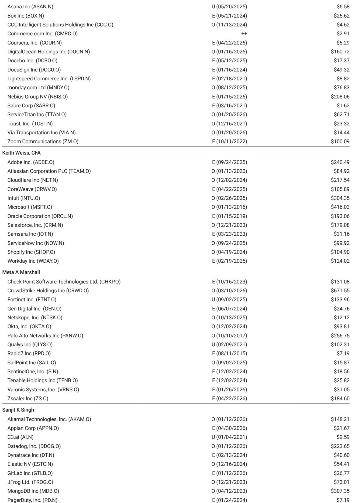
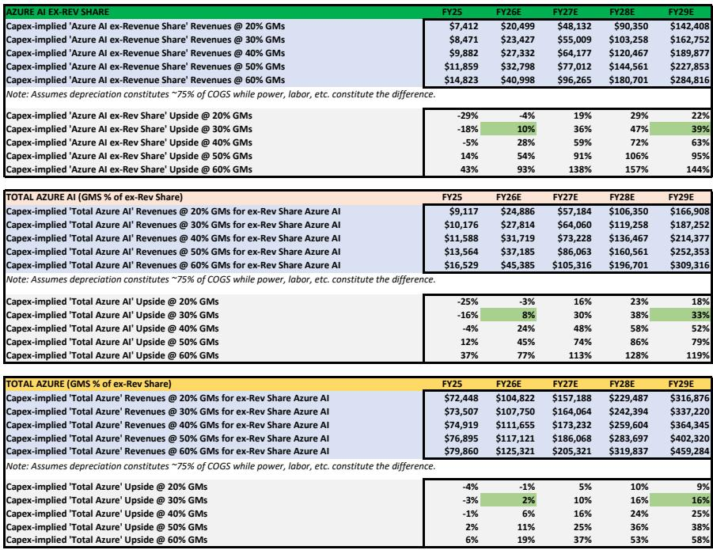
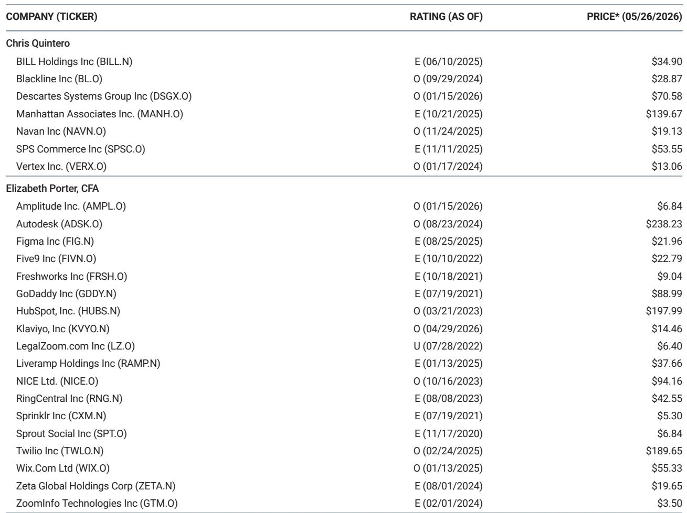

# 微软的AI基建投入，市场低估的不是需求，而是变现的时间差

当一家公司在一年内将资本开支从880亿推高至1450亿美元，并计划在三年后达到3750亿美元时，市场通常的反应是担忧：产能过剩何时到来？回报率何时开始下降？

但某外资投行近期发布的一份关于微软的深度研报，提出了一个逆向但有力的判断：市场真正应该担心的，不是微软投得太多，而是它投得太早——而恰恰是这个“太早”，构成了当前收入预期可能被系统性低估的核心原因。

这份报告的核心主张并不复杂：微软正在以远超当前变现速度的步伐部署AI数据中心容量。但分析师认为，这不是危险的信号，而是保守预期的来源。当基础设施建成、利用率爬坡、软件层开始大规模变现时，现有的收入预测将需要被显著上修。

对于任何关注AI基础设施投资逻辑的产业决策者而言，这份报告提供了一个关键的观察框架：如何区分“建设超前于收入”与“建设过剩”，以及如何识别那些尚未被定价的变现期权。

## 1. 数据中心容量扩张的速度，远超当前收入曲线的斜率

报告中最具冲击力的数据，是微软数据中心装机容量的扩张路径。分析师估算，微软的装机容量将从FY24的约5GW，扩张至FY28的约20GW。这意味着四年内规模翻两番。

这一估算并非凭空而来。管理层在F3Q26电话会上明确表示：“本季度我们又增加了一个吉瓦的容量。”而更早的指引则承诺：“今年我们将把AI总容量提升80%以上，并在未来两年内将数据中心总规模大约翻倍。”

但关键问题在于：当容量以这样的速度扩张时，收入能否跟上？

报告构建了一个“每兆瓦收入”的分析框架。结果显示，尽管微软云收入本身在快速增长，但由于分母（装机容量）扩张更快，每兆瓦收入反而从FY24的约2754万美元，持续下降至FY28的约1722万美元。

这组数字乍看令人不安。但分析师明确指出，这恰恰是“建设超前于变现”的典型特征，而非变现能力恶化的证据。在AI基础设施投资周期中，产能建设通常领先收入确认12-18个月，而当前微软的领先幅度可能更大。

这里的含义是：如果分析师基于当前的收入预期测算出的每兆瓦收入已经是下降的，那么一旦收入开始加速追赶，现有预测就存在系统性的上行风险。

## 2. 资本开支隐含的AI收入潜力，远高于当前模型中的假设

报告的第二层分析，是从资本开支倒推AI收入潜力。这一方法的核心逻辑是：给定已知的资本投入和合理的毛利率假设，可以反算出需要多少收入才能支撑这些投资的经济性。

分析师的测算显示，微软的“可货币化AI资本开支”（即扣除内部研发、替换性资本开支和非AI云投入后的部分）将从FY25的约422亿美元，飙升至FY29的约2734亿美元。基于这些投入，即便假设Azure AI的毛利率仅为15-20%，资本开支隐含的Azure AI收入潜力也显著高于微软当前模型中的预测。

具体来看，报告中的数据显示：FY25年Azure AI收入（扣除收入分成后）约为104亿美元，而资本开支隐含的潜力已远超这一数字；到FY29年，模型中的Azure AI收入约为1167亿美元，但资本开支隐含的潜力仍然更高。

这意味着什么？只要微软能够维持Azure AI的毛利率在15-20%以上——考虑到规模效应和硬件效率提升，这并非苛刻的条件——当前的收入预测就存在显著的上修空间。

这一分析框架对于理解AI基础设施投资的经济性至关重要。它揭示了资本开支与收入之间并非简单的线性关系，而是存在一个“隐藏的杠杆”：当基础设施建成后，增量收入的边际资本密集度将大幅下降，从而释放出巨大的利润弹性。

## 3. 每兆瓦收入下降的真相：不是效率恶化，而是期权价值正在积累

对于不熟悉基础设施投资节奏的读者来说，“每兆瓦收入下降”很容易被误读为投资回报率恶化。但这份报告提供了一个更精确的解读框架。

关键在于区分“装机容量”与“已利用容量”。微软的装机容量中，有相当一部分是处于“已建成但尚未满载”的状态。这类似于开发商建成一栋写字楼后，出租率从0%逐步爬升到95%的过程。在出租率爬升期间，每平方米收入自然是下降的，但这并不意味着项目失败——恰恰相反，它意味着未来收入增长的确定性在提高。

报告明确指出：“我们的框架假设分母代表总装机容量而非当前已利用负载。”这一区分在当前阶段尤为关键。微软正在为未来18-24个月的AI需求预建容量，而这些容量对应的收入尚未进入任何财务模型。

从投资角度看，这相当于微软持有了一组“实物期权”：已建成的数据中心和已部署的GPU集群，可以在需求爆发时快速转化为收入，而无需经历漫长的建设周期。在当前AI需求仍高度不确定的环境下，这种“容量储备”本身就是一种战略优势。

但这里有一个尚未被充分讨论的问题：这些容量的实际利用率爬坡速度，取决于下游AI应用的真实需求，而非微软自身的供给能力。如果AI应用层的采用速度慢于预期，这些容量可能会在更长时间内处于低利用率状态，从而对折旧和利润率形成压力。报告对此并未给出明确的假设，而是将其作为上行风险的来源——这意味着读者需要自行判断“AI需求加速”这一前提的置信度。

## 4. 报告尚未完全回答的关键问题：Copilot的变现路径与竞争格局

尽管这份报告在基础设施层面提供了极具洞察力的分析，但它对于微软AI变现的另一条关键路径——Copilot系列产品——着墨相对有限。

报告将M365 Copilot的资本开支强度单独列出，并假设其强度映射到微软云在FY14-19年间的水平。这意味着分析师认为Copilot的资本效率将随着规模扩大而提升。但这里存在一个尚未被充分验证的假设：Copilot的采用率和定价能力是否足以支撑这一效率提升路径？

从公开信息来看，M365 Copilot的商用客户渗透率仍在早期阶段，而企业客户对AI助手类产品的付费意愿和续约率，仍需更多数据点来验证。报告虽然提到了“软件附加率提升”作为收入上行的潜在来源，但并未给出具体的量化路径。

此外，竞争格局也是一个值得关注但报告未深入展开的维度。当微软、亚马逊云科技、谷歌云三家都在以类似的速度扩张AI基础设施时，行业整体的供需平衡将如何演变？如果三家同时出现“建设超前于变现”，那么当需求真正爆发时，价格竞争是否会侵蚀利润率？这些问题对于长期投资判断至关重要，但单一公司的研报很难给出全面的答案。

## 5. 一个更实用的观察框架：用“容量利用率”替代“每兆瓦收入”

对于希望将这份报告的洞见转化为自身投资或决策框架的读者，一个更实用的指标可能是“装机容量的隐含利用率”，而非单纯的每兆瓦收入。

具体来说，可以关注以下三个信号：

第一，管理层在财报电话会上是否开始主动披露利用率数据。目前微软并未直接披露装机容量或利用率，但分析师通过公开信息进行了三角验证。如果未来管理层开始提供更透明的数据，这本身就是信心增强的信号。

第二，Azure AI收入的季度环比增速是否开始超过资本开支增速。一旦出现这一拐点，意味着“建设超前于变现”的阶段正在结束，收入开始追赶容量。

第三，Copilot的渗透率数据是否出现非线性加速。如果企业客户从试用转向大规模部署，这将是AI需求从“训练”转向“推理”的关键信号，而推理工作负载的资本效率通常高于训练。

这些信号比单纯的收入数字更具前瞻性，因为它们直接指向了基础设施变现的“时间差”何时开始收敛。

## 6. 顺着这些未解问题，继续深读

回到这份研报最核心的贡献：它提供了一个将资本开支、装机容量与收入预期联系起来的系统性框架，并有力地论证了当前市场可能低估了微软AI基础设施的变现潜力。

但正如报告自身所承认的，这些分析建立在多个关键假设之上：装机容量的估算、资本开支中可货币化部分的拆分、以及毛利率水平的假设。这些假设中的任何一个发生变化，都可能改变最终的结论。

对于真正希望深入理解AI基础设施投资逻辑的读者来说，这份报告的价值不仅在于它的结论，更在于它提供的分析框架和未解问题。比如：微软的资本开支中到底有多大比例是“可货币化”的？不同AI工作负载的资本效率差异如何量化？当行业整体都在超前建设时，供应过剩的风险如何评估？

这些问题在完整报告中有着更细致的拆解和图表支撑。如果你希望获得这些原始数据和更完整的分析逻辑，欢迎加入我们的星球和微信群，与更多关注AI基础设施投资的同行一起持续讨论。

Personal reading notes and learning share only. Not investment advice.

