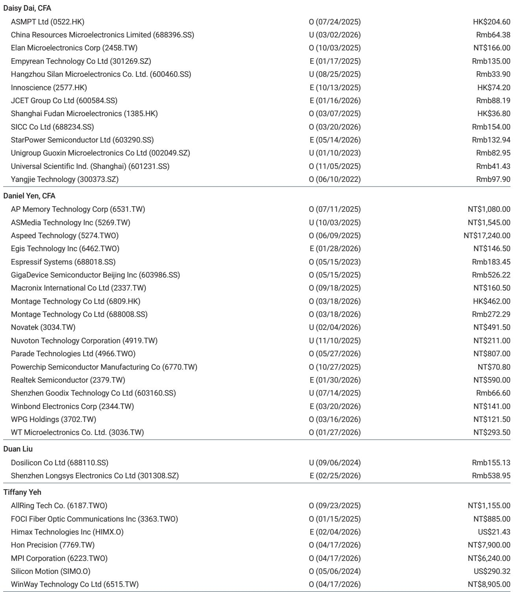
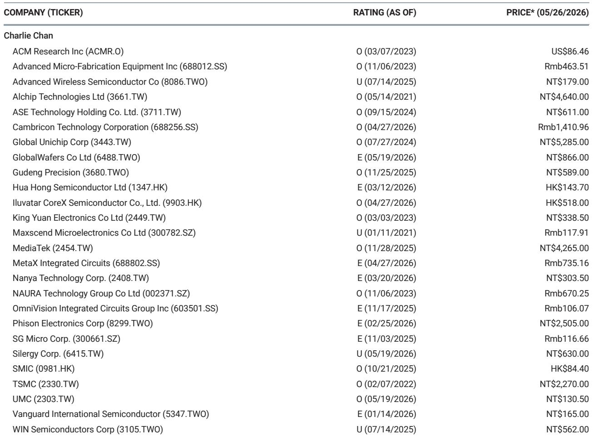
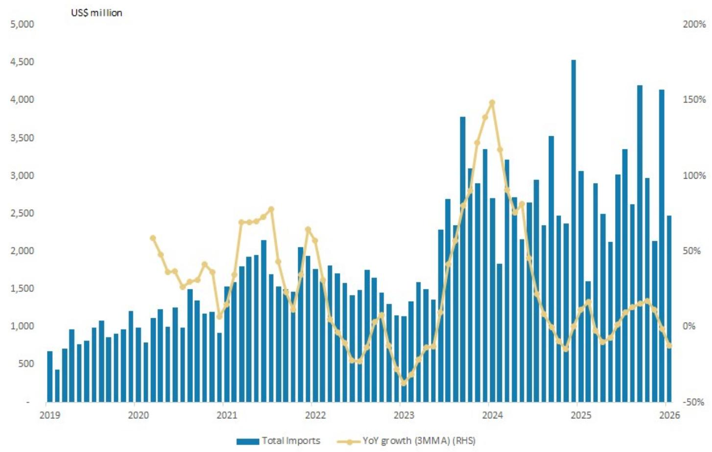

# 市场真正低估的不是需求，而是中国半导体设备供给侧的再定价

过去一年，围绕中国半导体设备的讨论大多集中在两个维度：一是美国出口管制如何限制先进制程设备流入，二是国产替代能在多大程度上填补缺口。这些讨论并非没有价值，但它们都指向同一个隐含假设——中国半导体设备市场的主要驱动力是“被动的替代需求”。某外资投行最新发布的研报提供了一个截然不同的叙事框架：真正驱动中国WFE市场未来三年增长的，不是防御性的国产替代，而是进攻性的产能扩张与架构创新。这份报告将中国WFE市场2026年和2027年的预测分别上调至480亿美元和560亿美元，同比增速分别达到15%和18%。上调的核心引擎有两个——存储厂激进的新建产能计划，以及华为在3D IC架构上的突破性进展。这两个引擎的共同点在于，它们都不是对既有需求的替代，而是在创造全新的增量需求。

市场可能低估了这一点。如果只是国产替代，中国WFE市场的天花板是清晰的——全球份额的再分配总有尽头。但如果中国本土存储厂正在以超过市场预期的速度扩建产能，同时华为的架构创新正在催生全新的设备品类需求，那么中国半导体设备公司的成长逻辑就发生了根本性变化。它们不再只是替代者，而是全球WFE增量需求的重要参与者。这份研报最值得看的判断，恰恰是这个逻辑切换。

## 1. 存储厂IPO加速产能扩张，规模曲线正在陡峭化

中国存储双雄——长江存储与长鑫存储——的产能扩张节奏，是这份研报上调预测的最直接支撑。报告显示，长鑫存储的科创板IPO已进入上市委审议阶段，长江存储也于5月正式启动上市辅导。这两个事件的意义不仅在于融资，更在于它们释放了一个清晰信号：政策层面正在为存储厂的长期资本开支提供制度性保障。

研报基于产业调研大幅上调了两家公司的产能预测。长鑫存储2026至2028年的产能预测从原先的3万、5万、5万片/月（12英寸等效）分别上调至8万、9万、10万片/月。长江存储2027至2028年的产能预测则从4万、5万片/月上调至8.5万、10万片/月，并在武汉规划了Fab 3/4/5的阶梯式建设路线图。

这些数字背后的含义是：中国存储厂正在从“追赶式扩产”转向“前瞻性建厂”。过去几年，市场习惯于用“成熟制程扩产”来框架中国晶圆厂的资本开支，但存储厂的新建产能计划——尤其是长江存储Fab 3及后续厂房的规划——意味着它们正在为未来3-5年的技术迭代和市场份额做准备。这不是短期的补库存行为，而是结构性的产能跃迁。

对于设备供应商而言，这意味着订单能见度正在从季度级别延长到年度级别。更重要的是，存储厂的扩产节奏往往具有“先建后填”的特点——厂房建设期的设备采购集中且规模巨大，这为设备公司的收入曲线提供了陡峭的斜率。市场如果仍用线性外推来估算这些公司的营收，可能正在低估未来两年的爆发力。

## 2. 华为的Tau定律打开了设备需求的新品类

如果说存储厂的扩产是“量的扩张”，那么华为提出的Tau标度理论（t-scaling）则可能带来“质的重构”。这份研报用较大篇幅分析了华为5月发表的这篇论文，并将其解读为中国半导体产业绕过先进制程限制的关键路径。

Tau理论的核心主张是：与其在几何尺寸微缩上与台积电、三星正面竞争，不如通过垂直堆叠数字电路（LogicFolding）来缩短互连长度、降低RC延迟，从而在成熟制程节点上实现接近先进节点的性能。这种架构的实质是3D IC——通过晶圆制造阶段的电路层垂直集成来提升系统性能，而非依赖光刻精度的提升。

研报特别指出，这一架构的两个关键工艺使能器是混合键合（hybrid bonding）和硅通孔（TSV）。论文对这两项技术提出了严苛的工艺参数要求，包括混合键合间距低于2微米、对准精度低于0.5微米等。这意味着，如果华为的架构从论文走向量产，将直接拉动混合键合设备、TSV刻蚀设备和铜电镀设备的增量需求。

这一判断的价值在于，它识别了一个被市场忽视的“新品类需求”。过去市场讨论国产替代时，焦点往往集中在刻蚀、沉积、清洗等传统设备品类上。但华为的架构创新正在催生一个全新的设备需求图谱——先进封装设备不再只是后道工序的附属品，而是成为前道制造的核心环节。能够供应混合键合系统和TSV铜电镀设备的公司，将获得一个独立于传统WFE周期的增长曲线。

## 3. 国产化率正在发生结构性跃迁，但分布极不均匀

研报中一张关于不同晶圆厂国产设备采用率的图表，值得反复审视。数据显示，2024年中国WFE整体国产化率约为16%，2025年预计提升至22%，2026年进一步升至25%。但更关键的是这张图表揭示的结构性差异：长江存储Fab 3的国产化率高达60%，而中芯国际京城厂和临港厂分别只有22%和18%，华虹Fab 9为20%，长鑫存储上海厂为35%。

这些数字意味着什么？国产化率的提升不是均匀发生的，而是高度集中在特定客户和特定工艺段。长江存储之所以能够实现60%的国产化率，根本原因在于3D NAND的工艺路线相对标准化，且长江存储自身在设备验证上投入了大量资源。相比之下，逻辑代工厂的工艺切换成本更高、验证周期更长，国产设备进入的门槛也更高。

这一分布特征对投资者的启示是：不能简单用“国产化率提升”这个宏观叙事来覆盖所有设备公司。那些深度绑定高国产化率客户的设备商，将获得远超行业平均的订单增速；而那些产品线集中在逻辑代工领域的设备商，可能需要更长的时间来兑现增长。市场当前对国产设备公司的定价，可能尚未充分反映这种结构性差异。

## 4. 报告尚未完全回答的关键问题：Tau理论从论文到量产的验证周期

这份研报最具洞察力的部分——华为Tau理论对设备需求的拉动——恰恰也是不确定性最高的部分。报告本身对此也有清晰认知：论文提出的工艺参数要求极为严苛，包括接近100%的良率要求。从学术论文到实验室验证，再到量产导入，中间存在巨大的不确定性。

这里有几个关键问题仍然悬而未决。第一，LogicFolding架构是否已经通过完整的晶圆级验证？论文中提到的“production-proven advance”具体指代什么规模的生产验证？第二，混合键合和TSV工艺在3D NAND领域已有成熟应用，但在逻辑芯片的垂直堆叠中，热管理、信号完整性、测试复杂度等问题是否已有解决方案？第三，即使技术路径可行，设备供应商的产能准备是否能够匹配华为的量产时间表？

这些问题不是对研报判断的否定，而是对投资逻辑的进一步细化。如果Tau理论最终被证明是可量产的，那么设备需求的增量将是巨大的，但这一验证可能需要12-18个月。在这段窗口期内，市场对于相关设备公司的定价更多是基于预期而非订单。对于产业决策者而言，当前最理性的做法是保持对该技术路径的密切跟踪，而不是过早下注。

## 5. 观察框架：三个信号决定中国WFE投资的节奏

基于以上分析，我们建议读者建立一个三层次的观察框架，用以判断中国WFE市场的投资节奏。

第一层是存储厂的资本开支节奏。长江存储和长鑫存储的IPO进展、厂房建设招标、设备招标公告，是最直接的先行指标。如果两家公司如期完成上市并披露详细的募投项目，市场将获得一个清晰的未来3年资本开支路线图。

第二层是华为Tau理论的量产验证。关键信号包括：华为是否公布具体的量产时间表、是否与设备供应商签订批量采购协议、以及第三方机构是否发布相关工艺的验证报告。这些信号的出现时间点，将直接决定先进封装设备公司的估值逻辑。

第三层是国产设备厂商的品类扩张。在刻蚀、沉积、清洗等传统品类之外，能够率先在混合键合、TSV电镀、高精度对准等新品类上实现订单突破的公司，将获得独立于行业周期的alpha。研报重点提及的某电镀设备公司，其非清洗业务的增长潜力正是基于这一逻辑。

这三个信号构成了一个从宏观到微观、从确定性到弹性的投资决策层级。宏观层面的存储厂资本开支提供的是确定性，中观层面的技术验证提供的是弹性，微观层面的公司品类扩张提供的是alpha。市场当前的定价可能更多反映了第一层，而对第二层和第三层的认知尚不充分。

华为的这篇论文全文、长鑫存储和长江存储的IPO招股说明书（如已披露），以及报告中对各设备公司目标价调整的详细测算逻辑，都包含在完整研报中。这些原始材料能够帮助读者更准确地评估上述三个信号的真实进度。欢迎来星球微信群里继续讨论这些未解问题的跟踪方法，以及如何将这些信号转化为具体的投资决策框架。

Personal reading notes and learning share only. Not investment advice.

