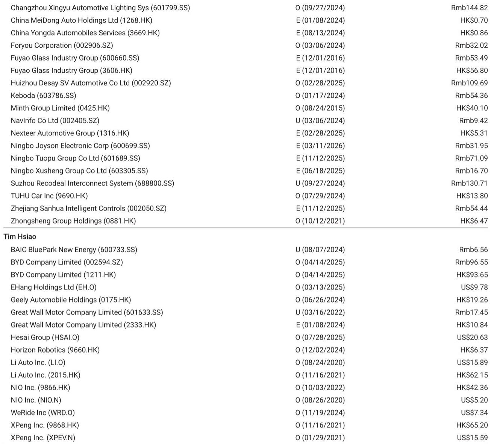
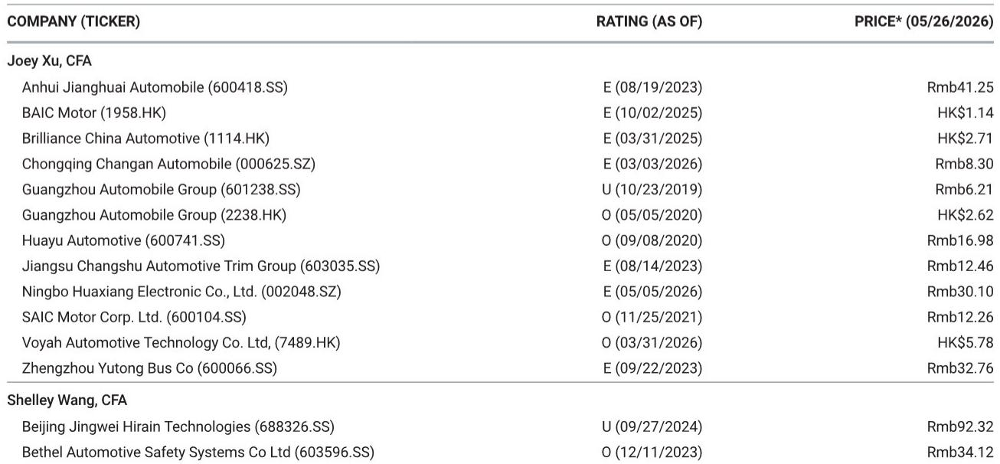
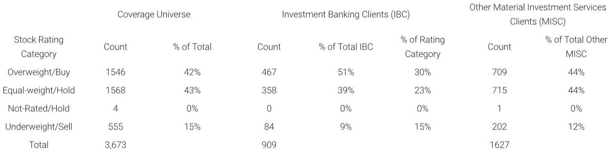

# 中国电动车市场真正的博弈，已经从“卖多少”转向“靠什么卖”

理解当前中国电动车市场，不能只看周订单的环比波动。某外资投行最新发布的周度追踪数据显示，5月18日至24日这一周，头部企业的订单表现出现了极端分化：小鹏汽车周订单环比暴增375%，而理想汽车环比下滑40%。这种剧烈波动并非偶然，它揭示了一个正在发生的结构性转变——市场不再奖励“有产品”的企业，而是开始惩罚“只有产品”的企业。真正决定一家公司能否在接下来的竞争中站稳脚跟的，不是它推出了多少款新车，而是它能否通过新产品的节奏、定价策略和品牌定位，持续创造并占据消费者的心智份额。这份报告的核心判断是：中国电动车市场的竞争，已经从“规模竞赛”进入了“节奏战争”。

## 1. 新车型的“脉冲效应”正在取代稳态增长，成为衡量企业竞争力的核心指标

过去，投资者习惯于用月度或季度交付量来评估一家电动车企业的基本面。但这份报告传递出的信号是，在当前的行业环境下，稳态增长已经难以维持。几乎所有“现有车型”都出现了环比下滑，唯一的增长引擎来自新车发布带来的订单脉冲。

小鹏汽车周订单从6千量级跃升至近3万，背后的推手是GX车型的“超预期”销售。吉利银河的订单环比增长83%，同样得益于星舰7的拉动。相反，理想汽车和蔚来汽车在经历了L9 Livis和L80的初期销售高峰后，订单迅速回归常态，周环比分别下降40%。

这个现象的含义是：企业的估值逻辑正在从“交付量乘以单车利润”的线性模型，转向“新车发布频率乘以单次脉冲强度”的周期性模型。一家公司如果无法保持每季度都有具有市场影响力的新车上市，其订单曲线就会迅速趋于平庸。这解释了为什么市场对蔚来ES9和比亚迪“大唐”的发布如此关注——它们不仅是产品，更是下一阶段的订单“定海神针”。

## 2. 比亚迪的“稳健”背后，隐藏着规模优势能否转化为定价权的新考验

比亚迪周订单维持在5.6万至5.7万的水平，环比增长11%，但同比下滑26%。这个数据本身并不差，尤其是在行业整体需求疲软的背景下。但真正值得深思的是，比亚迪的订单增长并非来自市场扩张，而是依赖于即将到来的“智享技术”发布事件和搭载第二代刀片电池的“大唐”、元Plus、秦Max等走量车型。

这引出了一个更深层的问题：当一家企业的体量达到百万级别时，单纯依靠新车型拉动增长的边际效率正在下降。比亚迪需要回答的关键问题不再是“能不能卖更多”，而是“能不能卖更贵”。规模优势如果不能转化为品牌溢价和定价权，那么每一轮新车发布都只是对现有订单池的重新分配，而非真正创造增量价值。这份报告没有直接给出答案，但数据暗示，比亚迪的下一阶段竞争焦点将从“量”转向“价”。

## 3. 理想与蔚来的“高开低走”模式，暴露了高端市场复购与留存的结构性难题

理想汽车和蔚来汽车在经历新车上市初期的订单高峰后，都出现了超过40%的周环比下滑。这种“高开低走”的模式并非偶然，它反映了高端电动车市场的一个根本性矛盾：新车型可以吸引尝鲜用户，但难以维持持续的需求。

理想汽车的L9 Livis和蔚来的L80，本质上都是针对存量客户群体的升级或补充产品。它们的初期爆发力很强，但一旦尝鲜需求释放完毕，订单就会迅速回归到品牌的基本盘水平。对于这两家公司而言，真正的挑战不在于如何打造一款爆款，而在于如何构建一个能持续产生复购和推荐的产品矩阵。

这份报告没有完全展开的一个维度是，高端品牌的生命周期管理能力。理想和蔚来都需要证明，它们的品牌忠诚度和用户生态能否支撑起多款车型同时保持健康订单，而不是依靠单一车型的脉冲来维持季度目标。这是投资者需要持续跟踪的关键变量。

## 4. 小鹏的“逆袭”并非偶然，而是产品定义能力对渠道效率的一次胜利

小鹏汽车周订单环比增长375%，同比增长319%，这个数字在行业整体下行的背景下显得格外突出。GX车型的“超预期”销售，不能简单归因于产品力本身。更深层的原因是，小鹏在经历了一段时间的战略调整后，重新找到了产品定义与目标用户之间的精准匹配。

报告中没有详细拆解GX的成功因素，但从行业规律来看，一款车型能够在上市初期实现如此高的订单转化，通常意味着它在定价、配置和营销话术上，击中了此前被忽视的需求区间。这不仅是产品团队的胜利，更是市场洞察能力的体现。

对于其他竞争对手而言，小鹏的案例提供了一个重要启示：在技术参数趋同、供应链成熟的今天，产品定义能力正在成为最稀缺的竞争力。谁能更准确地识别出“未被满足的需求”，谁就能在混乱的市场中获得超额回报。

## 5. 报告尚未完全回答的关键问题：周度数据的“信号”与“噪音”如何区分？

这份报告提供了极其高频的周度订单数据，这对于追踪市场动态非常有价值。但投资者必须意识到，周度数据的波动中包含大量“噪音”——比如新车型的短期热度、促销活动的脉冲效应、以及渠道端的备货节奏。

报告本身也承认，随着6月传统淡季的到来，市场情绪可能软化。这意味着，当前看到的某些订单增长可能只是季节性因素或一次性事件的产物，而非趋势性改善。报告没有完全回答的一个问题是：如何从周度数据中提取出真正具有预测价值的结构性信号？

例如，小鹏的订单爆发能否持续到6月？理想的订单下滑是暂时性的调整，还是品牌吸引力下降的征兆？蔚来的ES9发布能否复制L80的初期热度？这些问题的答案，需要更长的时间序列和更精细的订单结构分析才能得出。这也是读者如果希望深入理解市场趋势，需要进一步探讨的方向。

## 6. 给决策者的观察框架：从“订单数字”转向“订单质量”

基于这份报告提供的数据，我们建议读者建立一个更精细的追踪框架，而不是简单关注每家公司的周订单绝对值。

第一，关注“订单可持续性”。比较新车上市后第二、第三周的订单衰减速度，而非首周峰值。衰减越慢的企业，产品生命周期管理能力越强。

第二，关注“订单结构”。区分订单是来自新用户还是老用户复购，是来自增量市场还是存量替代。这决定了增长的质量。

第三，关注“定价能力”。在订单数据之外，追踪平均成交价格和折扣力度。能够在不降价的情况下维持订单增长的企业，才真正具备护城河。

第四，关注“新车发布节奏”。评估一家企业未来12个月的新车规划密度和产品线覆盖广度。节奏越紧凑、覆盖越完整的企业，越有可能在“节奏战争”中胜出。

这个框架不是报告直接给出的，但从报告的数据模式中可以合理推导出来。它可以帮助投资者在信息爆炸的环境中，过滤噪音，聚焦真正影响企业长期价值的变量。

---

以上分析基于某外资投行最新周度追踪报告的核心数据与逻辑框架。限于篇幅，我们无法在此展开所有细节，包括报告中对各车企订单结构的拆解、对6月传统淡季的量化影响测算、以及对重点车型生命周期管理的深度分析。

如果您希望获取完整报告原文及专业解读，欢迎加入我们的知识星球与微信群，与产业研究者一起持续追踪中国电动车市场的结构性变化。

Personal reading notes and learning share only. Not investment advice.

