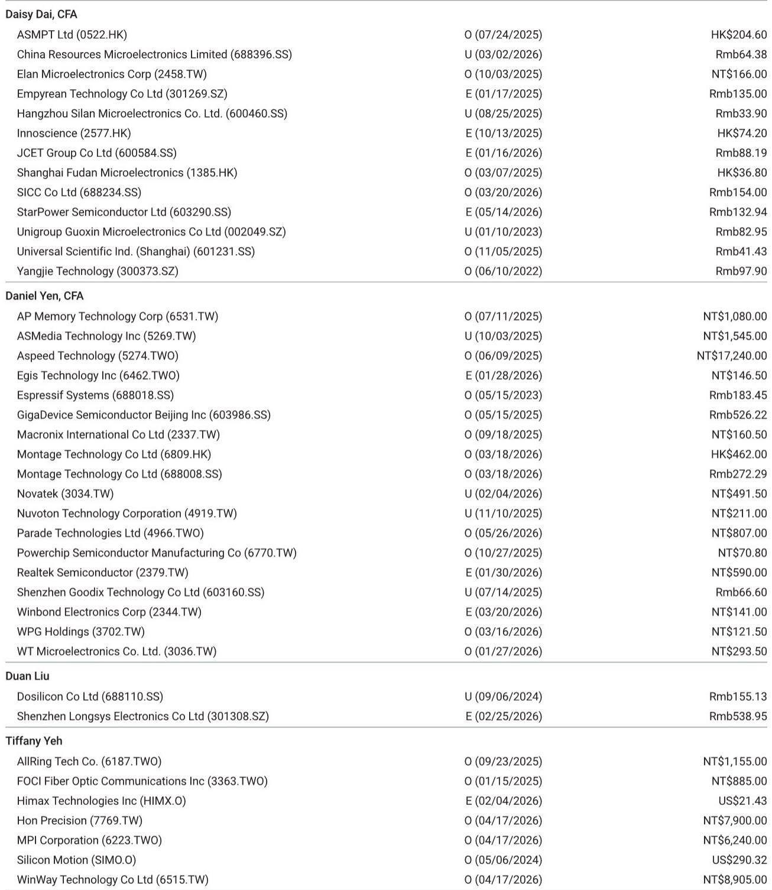
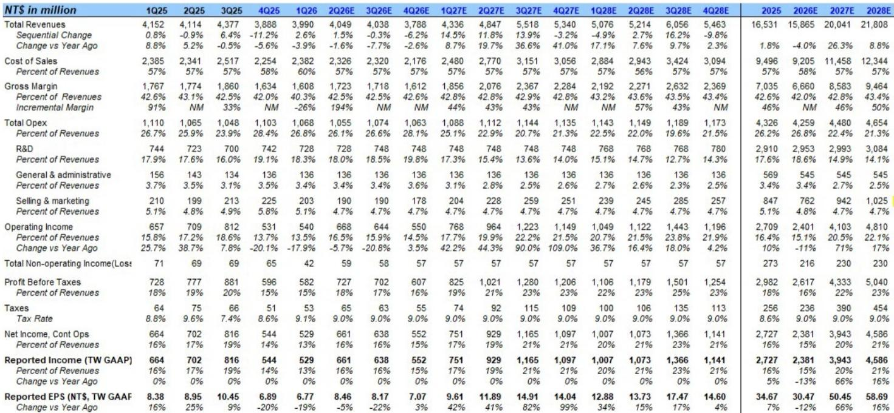
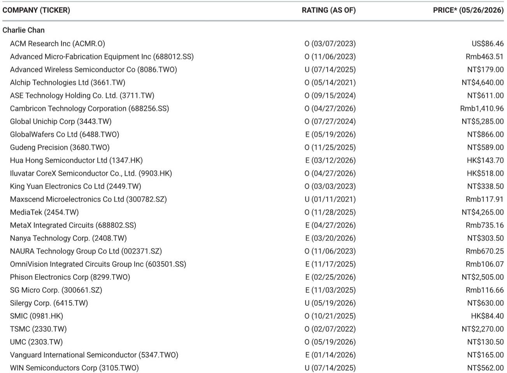

# PC半导体正在经历一轮被低估的供给侧重构

市场当前对PC半导体的讨论，大多停留在需求端——换机周期是否到来、AI PC能否拉动出货、下半年旺季成色几何。这些问题的答案，坦白说，并不令人兴奋。某外资投行最新研报给出的判断是：DT PC半导体在未来几个季度仍将承压，NB PC半导体的需求可能好于悲观预期，但真正驱动2027年增长的核心变量，不是需求，而是供给侧的份额迁移。

这份报告最值得关注的判断，不是某个季度出货量的环比预测，而是一个结构性的变化：PC芯片组市场正在从一家独大走向多元化。报告将一家此前被视为追赶者的公司——Parade——从等权重上调至超配，目标价从530元新台币直接翻倍至1000元，2027年与2028年EPS预测分别高出市场共识16%和17%。与此同时，维持对另一家行业龙头ASMedia的低配评级，EPS预测低于市场共识22%和30%。

这一多一空的背后，是一个关于“功耗优势如何改写竞争格局”的故事。而故事的主角，不是AI，不是地缘政治，而是最朴素的工程指标：每瓦性能。

## 1. 下半年需求并非一片黯淡，但结构分化远比总量重要

先看短期。报告覆盖的PC半导体公司一季度业绩整体好于预期，且二季度指引呈现明显的分化信号。瑞昱半导体给出的二季度指引显示，终端需求平稳，客户仍在拉货，季度环比增速可能达到10%。联咏科技表示，NB显示驱动芯片二季度仍在环比增长，营收指引中值对应季度环比增长21%。即便是偏保守的义隆电子，也预期二季度实现低个位数的同比增长。

这些信号与下游ODM的出货预测基本吻合。报告引用了下游同事的预测：二季度NB ODM出货量环比增长4%，同比下降8%。环比改善，同比仍弱——这是典型的库存回补而非需求爆发。

真正的分化在于DT与NB。报告明确指出，内存价格上涨对DT PC半导体的冲击更为明显，而NB半导体客户目前仍不愿调整订单。这意味着，DT相关标的（如ASMedia）在下半年面临更大的盈利压力，而NB与苹果供应链相关的公司（如Parade、联咏）则相对具有韧性。

So what：投资者不应把PC半导体视为一个同质化板块。DT与NB、苹果与非苹果、份额赢家与份额输家之间的差异，将远大于行业总量的波动。二季度财报季的核心看点，不是营收是否超预期，而是各公司对下半年的订单可见度描述——这份报告直言“当前能见度仍然很低”，这本身就是一种谨慎信号。

## 2. 真正的alpha藏在份额迁移中，而非行业beta

如果说需求端只能提供有限的beta，那么供给侧正在酝酿的份额迁移，才是这份报告真正的alpha来源。

报告在2025年9月曾表示，判断ASMedia与Parade之间的份额变化为时尚早。但六个月后，分析师的观点出现了明确转变：“多元化正在发生。”报告认为，Parade有望在芯片组市场夺取部分份额，核心驱动力是功耗性能更优。

这一判断的底层逻辑值得深究。PC芯片组市场长期以来由ASMedia主导，其竞争优势建立在与AMD的紧密合作关系以及成熟的生态兼容性上。但Parade正在从两个维度切入：一是功耗表现，二是在ASIC-like业务上的布局。后者尤其关键——如果Parade能够将芯片组业务从标准品拓展到半定制化领域，其客户粘性和单价都将显著提升。

报告给出的数字印证了这一判断的力度。Parade的2027年营收预测从171亿新台币上调至200亿，增幅17%；2028年从173亿上调至218亿，增幅26%。更值得注意的是营业利润率的变化——2027年从17.3%上调至20.5%，2028年从18.2%上调至22.1%。这意味着，份额迁移不仅带来营收增长，还伴随着显著的经营杠杆。

So what：PC半导体投资的叙事正在从“押注行业复苏”转向“押注竞争格局变化”。在总量增长有限的背景下，份额变化对企业盈利的影响往往被低估。Parade与ASMedia的估值差异，本质上是市场对“多元化能否持续”的定价分歧。目前看来，报告站在了多元化的一方。

## 3. 苹果供应链的韧性被低估，但需要区分“被动受益”与“主动突围”

报告多次提及苹果供应链的韧性。在整体PC半导体需求疲软的背景下，有iOS业务敞口的公司表现出更强的抗跌性。Parade恰好是苹果NB的供应商之一，这也是报告看好其下半年表现的一个支撑因素。

但这部分逻辑需要谨慎拆解。苹果供应链的韧性，更多来自其产品周期的独立性——Mac产品线的更新节奏不受Windows PC换机周期的影响，且苹果在芯片选择上的封闭生态，使得其供应链格局相对稳定。对于Parade而言，苹果业务更多是“安全垫”而非“增长引擎”。

真正值得关注的，是Parade如何在苹果业务之外建立新的增长曲线。芯片组市场的份额迁移，如果成功，将使其从“苹果供应商”升级为“PC芯片组平台级玩家”。这两者的估值逻辑完全不同。前者是零部件供应商，后者是平台型芯片设计公司。

So what：投资者不应将苹果供应链的韧性等同于公司的长期竞争力。苹果业务提供的是防御性，而非进攻性。真正决定Parade估值中枢能否上移的，是非苹果业务的份额进展。这也是报告估值模型中隐含的最关键假设——中间增长率从9.0%上调至11.9%，全部由芯片组业务驱动。

## 4. 报告尚未完全回答的关键问题：份额迁移的可持续性与可量化性

尽管报告对Parade的份额前景给出了明确判断，但仍有几个关键问题未被完全解答。

第一，功耗优势的可持续性。ASMedia是否会通过制程升级或架构优化缩小功耗差距？如果功耗差距被抹平，Parade的竞争壁垒将显著削弱。报告没有详细讨论ASMedia的技术路线图作为对照。

第二，客户切换成本。芯片组并非标准化商品，客户一旦选定供应商，涉及主板设计、BIOS适配、验证周期等一系列沉没成本。Parade的份额获取，是来自新客户增量，还是来自现有客户的存量替代？两者的速度和难度截然不同。报告没有给出具体的客户渗透进展。

第三，估值的安全边际。Parade当前股价约807元新台币，报告目标价1000元，对应约24%的上行空间。但牛市情景下目标价为1600元，熊市情景下仅为520元。这一区间跨度本身就说明，份额迁移的路径存在高度不确定性。报告上调估值假设中的中间增长率至11.9%，但这一数字是否隐含了过于乐观的假设，仍需验证。

So what：对于决策者而言，Parade的投资逻辑成立，但需要设置清晰的验证节点。2026年下半年是关键的观察窗口——如果NB需求确实好于预期且份额数据开始体现在营收中，逻辑将得到初步验证；反之，如果份额进展不及预期，当前估值所隐含的乐观假设将面临修正。

## 5. 一个观察框架：如何跟踪PC半导体竞争格局的变化

基于这份报告的逻辑，我们可以提炼出一个简洁的观察框架，用于跟踪PC半导体竞争格局的变化。

第一个信号是营收结构的变化。Parade的芯片组业务营收占比是否持续提升？如果到2026年底，芯片组业务贡献超过30%的营收，说明份额迁移正在加速。反之，如果营收增长仍主要依赖既有产品线，则逻辑尚未兑现。

第二个信号是客户名单的扩展。报告提及Parade在ASIC-like业务上的进展，但没有披露具体客户。投资者应关注公司是否公开新的设计中标（design win）信息，特别是来自非苹果的PC OEM客户。

第三个信号是毛利率趋势。如果份额迁移顺利，Parade的毛利率应从当前的42%左右向45%以上迈进。报告预测2028年毛利率达到43.4%，这实际上是一个相对保守的假设——如果份额迁移超预期，毛利率上行空间可能更大。

第四个信号是ASMedia的反制措施。ASMedia是否会通过降价、推出低功耗版本或与AMD深化绑定来守住份额？这是竞争格局中最不确定的变量。如果ASMedia采取激进的价格策略，Parade的份额获取可能以牺牲毛利率为代价。

---

这份报告提供了一个清晰的判断：PC半导体真正的投资机会，不在总量复苏，而在供给侧重构。Parade与ASMedia的此消彼长，可能只是这一轮重构的开始。但份额迁移的路径从来不是线性的，技术差距、客户关系、产能保障，每一个环节都可能成为变数。

关于ASMedia的反制策略、Parade的具体客户进展、以及苹果供应链之外的增量机会，报告中有更详细的数据和图表未能在此展开。欢迎来星球微信群里继续讨论，我们会在社群中分享完整的估值模型拆解和后续跟踪框架。

Personal reading notes and learning share only. Not investment advice.

