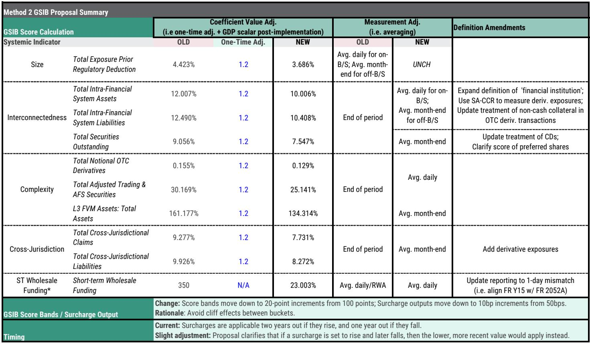
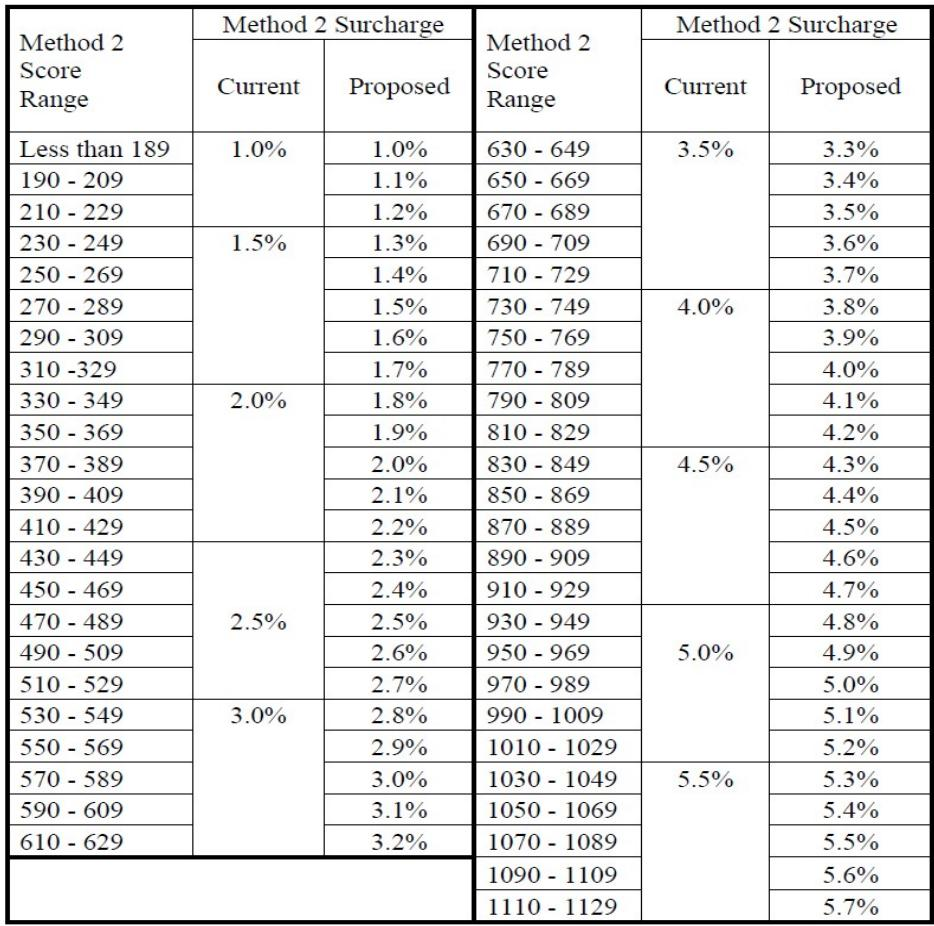
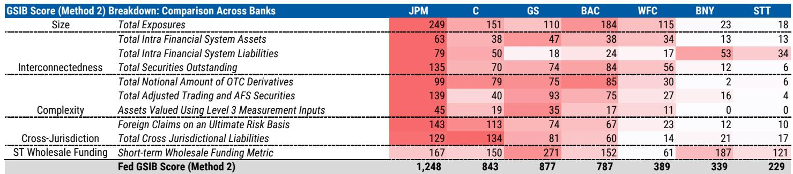

# 市场真正低估的不是需求，而是GSIB附加资本的重新定价

这份报告最值得看的判断是：2026年一季度，美国大型银行的GSIB评分在现行规则下中位数环比上升了50个基点，但市场可能低估了这一变化对资本分配和股东回报的长期结构性影响。大多数投资者的注意力仍然集中在贷款需求和净息差上，而一个更隐蔽、更具决定性的变量正在形成——监管资本成本的重新定价。

某外资投行在最新发布的研报中，基于刚刚公布的Y-15监管申报文件，更新了其GSIB评分追踪模型。报告的核心发现是：在现行规则下，所有货币中心银行的GSIB附加资本均环比上升，其中JPM的升幅最为显著。这并非意外——一季度交易账户余额在所有货币中心银行均出现了有意义的环比增长。但真正值得关注的，是现行规则与新资本提案之间的巨大差异：后者仅显示中位数10个基点的温和上升。

这种差异背后隐藏着一个关键的制度性变化——从时点余额到平均余额的计算方式转变。这不仅是一个技术细节，而是可能从根本上改变银行资产负债管理的激励机制。报告预期，3月19日发布的新资本提案最早将在2026年三季度最终敲定。

## 1. 现行规则下GSIB附加资本中位数环比上升50个基点，JPM首当其冲

根据该投行的估算，在现行规则下，2026年一季度GSIB附加资本的中位数从4.0%上升至4.0%（注：中位数未变，但各银行分布发生了显著变化），而平均值从3.1%上升至3.6%。JPM的附加资本从5.5%跳升至7.0%，评分从1,089升至1,248，环比增加159分——这一增幅是其他大型银行的三到五倍。

评分的驱动因素分解揭示了问题的根源。JPM评分上升的最大贡献者是“调整后交易与AFS证券”指标（+46分）和“非美国债权”指标（+37分）。这两个指标的飙升直接反映了2026年一季度全球市场活动的高度活跃——交易量上升、跨境资金流动加速，以及证券投资组合的重新配置。

这不是一个孤立事件。GS的评分上升74分，Citi上升53分，美国银行上升32分。整个系统的评分都在上行，只是JPM作为全球最大的交易商和资产管理机构，受到的冲击最为集中。

## 2. 新资本提案的缓冲效应被严重低估，平均余额机制是核心变量

与现行规则形成鲜明对比的是，在新资本提案框架下，同一组银行的GSIB附加资本中位数仅上升10个基点，平均值仅上升10个基点。JPM的附加资本从5.2%升至5.4%，评分从1,016升至1,050，仅增加35分——远低于现行规则下的159分。

这种差异的根源在于新规则引入了平均余额计算。现行规则基于季度末的时点余额，这使得银行在季末有强烈的动机进行“窗口粉饰”——暂时压缩资产负债表以降低评分。新规则采用年内日均余额或月末平均余额，彻底消除了这种操作空间。

但更重要的是，这种变化意味着银行无法再通过短期行为来管理GSIB评分。它们必须真正改变业务结构和资产负债表的长期配置。对于JPM这样的大型交易商，这意味着其庞大的交易账户和跨境业务将面临更高的资本占用成本，而这种成本无法通过季末的临时调整来规避。

报告预期新资本提案最早将在2026年三季度最终敲定，这意味着银行只有不到一年的时间来适应新的监管环境。

## 3. 现行规则下的时间滞后效应可能导致2027-2028年附加资本阶梯式上升

理解GSIB评分的实际影响，必须掌握其时间滞后机制。根据现行规则，GSIB附加资本仅基于年末（即四季度）数据，并且如果评分上升，新附加资本将在两年后生效；如果评分下降，则在一年后生效。银行有一年的“缓冲期”来将评分降回较低档次。

报告提供了一个关键的时间表：如果银行在2024年12月31日的评分导致附加资本上升，该附加资本将从2027年1月1日起适用，除非银行能在2025年12月31日前将评分降回。同样，2025年的评分影响2028年的附加资本，2026年的评分影响2029年的附加资本。

这意味着，2026年一季度的评分飙升虽然不会立即转化为附加资本上升，但它是一个重要的预警信号。如果银行无法在2026年四季度前将评分降回，那么从2027年开始，附加资本将出现阶梯式上升。对于JPM而言，其当前适用的附加资本为4.5%，但已确认从2027年1月1日起将升至5.0%，如果无法在2026年底前将评分降回5.0%对应的档次，则2028年1月1日起将进一步升至5.5%。

美国银行的情况类似：当前适用3.0%，2027年1月1日起升至3.5%，2028年可能升至4.0%。

这种时间滞后效应意味着，市场对银行2026-2027年的资本回报预期可能过于乐观。附加资本的上升将直接压缩银行的股息和回购空间。

## 4. 报告尚未完全回答的关键问题：新规则下银行的真实应对空间有多大？

新资本提案虽然引入了平均余额机制来平滑波动，但它并没有解决一个更根本的问题：新规则下的系数调整是否足以抵消评分上升对资本占用的影响？

报告显示，新规则对系数进行了1.2倍的一次性调整——这比该投行此前预期的1.7倍更为保守。这意味着新规则下的附加资本计算系数实际上更低了，但评分本身可能因为定义调整和范围扩大而上升。

具体而言，新规则扩大了“金融机构”的定义，采用SA-CCR方法计量衍生品风险暴露，并更新了非现金抵押品的处理方式。这些变化对不同类型的银行影响各异。对于衍生品业务占比大的银行（如GS、JPM），SA-CCR方法可能提高其衍生品风险暴露的计量值，从而推高评分。对于托管银行（如纽约梅隆、道富），扩大后的金融机构定义可能将其大量客户资产重新分类为“金融系统内资产”，从而推高其互联性指标。

报告没有完全展开的是，这些定义变化对不同银行的差异化影响究竟有多大。这是一个需要进一步拆解的关键问题。

## 5. 投资者应建立的新观察框架：从关注净息差转向关注资本效率

传统上，投资者评估大型银行时主要关注净息差、贷款增长和信用成本。但GSIB评分的结构性上升正在改变这一分析框架。在附加资本持续上升的环境下，银行的资本效率——即每单位资本能够产生的风险加权资产回报——将成为更核心的估值驱动因素。

具体而言，投资者应关注三个指标。

第一，银行的GSIB评分构成中，“规模”和“复杂性”指标的权重是否在上升。如果一家银行的评分上升主要来自交易账户和衍生品业务，这意味着其资本占用将更加刚性，难以通过业务调整来快速降低。

第二，银行是否有能力在保持业务规模的同时降低评分。这要求银行优化资产负债表结构，例如减少低效的证券投资组合、压缩非核心的跨境业务、或通过资产证券化转移风险。

第三，新规则最终版本中短期批发融资指标的变化。报告显示，新规则将短期批发融资从比率输入改为余额输入。这一变化对依赖短期融资的银行（如GS）影响较大，因为其短期批发融资指标在现行规则下已经很高（GS为271分，是所有银行中最高的）。

## 6. 新资本提案的最终版本仍有变数，银行游说能力和政治周期是关键不确定因素

报告预期新资本提案最早在2026年三季度最终敲定，但这一时间表面临两个重要的不确定性。

第一，银行游说。新规则对大型银行的影响远大于小型银行，而大型银行在华盛顿的游说能力不容小觑。报告本身也指出，最终版本可能比提案更为宽松。如果银行成功将系数调整从1.2倍提高到更高水平，或者争取到更长的过渡期，那么附加资本的实际影响将显著降低。

第二，政治周期。2026年是美国中期选举年，监管机构在选举前后可能更加谨慎。如果新规则在选举前发布，可能面临更大的政治压力；如果推迟到选举后，则可能面临不同的政治环境。

这些不确定性意味着，投资者在评估银行股时，需要为不同的监管情景分配概率。最乐观的情景是最终版本大幅宽松，附加资本上升幅度有限；最悲观的情景是当前提案基本保持不变，且银行无法在缓冲期内有效降低评分。

这些未解问题，正是深入阅读完整报告的价值所在。报告的图表和详细数据提供了更精确的评分分解和时间线推演，这些在本文中无法完整呈现。欢迎来星球微信群里继续讨论，我们可以基于原始报告数据，对不同银行的资本效率进行更细致的拆解，并跟踪后续监管动态对投资组合的影响。

Personal reading notes and learning share only. Not investment advice.

