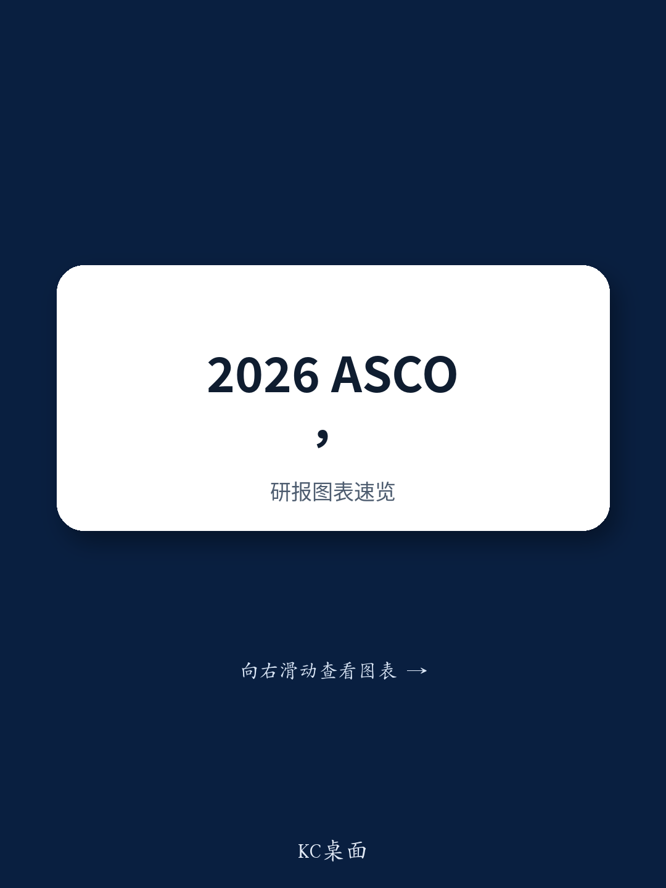
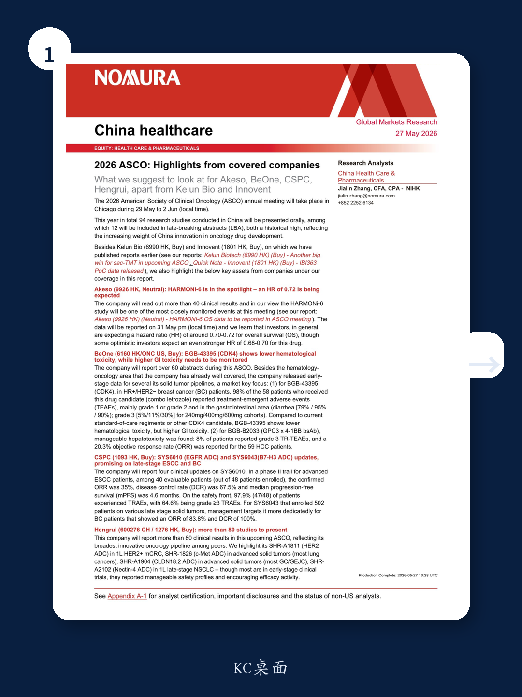
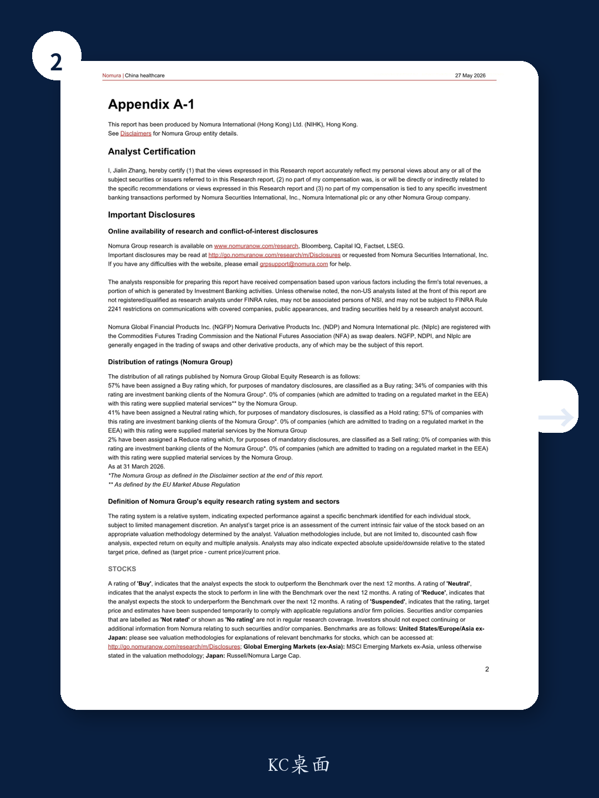

# 中国创新药在ASCO的“量变”已确认，但“质变”的定价权尚未被市场充分消化

2026年美国临床肿瘤学会年会即将在芝加哥召开。今年将有94项由中国研究者主导的研究进行口头报告，其中12项被选入最新突破摘要，两项数据均创历史新高。这个数字本身已经不再令人意外——过去几年，中国创新药在国际学术舞台上的存在感持续上升，几乎每年都在刷新纪录。但真正值得追问的是：当“数量创新高”成为常态，市场是否已经将这种进步充分定价？或者说，市场对“中国创新药”的估值框架，是否仍然停留在“追赶者”的叙事里，而忽略了某些公司正在发生的结构性变化？

某外资投行在近期发布的ASCO前瞻报告中，系统梳理了其覆盖的中国创新药企即将披露的关键数据。这份报告的价值不在于罗列哪些公司将发布什么数据——这类信息在会议日程公布后已基本透明。它的核心贡献在于，通过对比不同资产的数据特征、临床定位和竞争格局，揭示了一个更深层的判断：市场真正低估的不是中国创新药的整体研发能力，而是少数头部公司在特定靶点和技术路线上已经建立起的“局部定价权”。

这种定价权并非来自某个单一数据的“惊艳”，而是来自多个数据点共同指向的一个趋势：中国公司在部分领域的临床开发效率、适应症布局策略和安全性差异化能力，已经开始影响全球标准治疗方案的演进方向。以下是我们从这份报告中提炼出的几个关键观察。

## 1. 中国创新药在ASCO的“存在感”已不再是新闻，真正的新信号是“关键数据点”的密度在上升

今年中国研究在ASCO上的入选数量再创新高，这本身并不令人意外。过去五年，这个数字几乎每年都在增长。真正值得关注的变化是“关键数据点”的密度——即那些能够直接影响标准治疗方案、改变竞争格局或重新定义靶点成药性的临床结果，正在从零星出现变为集中涌现。

某外资投行的报告覆盖了Akeso、BeOne、CSPC、恒瑞医药等多家公司，每家都有至少一个值得密切关注的资产。Akeso的HARMONi-6研究将报告总生存期数据，市场对其风险比的预期集中在0.70-0.72之间，部分乐观投资者甚至预期0.68-0.70。BeOne的CDK4抑制剂BGB-43395首次披露了HR+/HER2-乳腺癌患者的完整安全性数据，显示出与现有标准疗法和其他在研CDK4药物不同的毒性谱。CSPC的EGFR ADC在食管鳞癌中报告了35%的确认客观缓解率和4.6个月的中位无进展生存期。恒瑞医药则一口气带来超过80项临床结果，覆盖HER2、c-Met、CLDN18.2、Nectin-4等多个靶点。

这些数据点单独看或许都不足以“改变游戏规则”，但合在一起，它们传递的信号是明确的：中国创新药企正在从“跟随式验证”转向“差异化竞争”。市场对此的定价是否充分，取决于投资者是否愿意接受一个更复杂的估值框架——不是简单地看某个资产是否达到终点，而是看这些资产在各自领域内是否具备“不可替代性”。

## 2. BeOne的CDK4数据揭示了差异化安全性的真实代价：低血液毒性换来了更高的胃肠道毒性

BeOne的BGB-43395是本次ASCO上最值得关注的早期资产之一。作为一款CDK4选择性抑制剂，它的核心卖点是理论上可以避免CDK6抑制带来的血液学毒性。从已披露的数据看，这一假设得到了初步验证：在58例HR+/HER2-乳腺癌患者中，98%出现了治疗相关不良事件，但主要为1级或2级，且血液学毒性确实低于现有标准疗法和部分其他CDK4在研药物。

然而，报告同时揭示了一个不容忽视的代价：胃肠道毒性显著偏高。在240mg、400mg和600mg剂量组中，腹泻的发生率分别为79%、95%和90%，3级腹泻的比例分别为5%、11%和30%。这个安全性谱意味着，BGB-43395虽然在血液学毒性上实现了差异化，但胃肠道耐受性可能成为其临床推广的主要障碍。

这里的核心问题是：这种“以胃肠道毒性换血液毒性”的权衡，在临床实践中是否真的优于现有选择？现有CDK4/6抑制剂如哌柏西利、阿贝西利虽然存在血液学毒性，但临床医生对其管理经验丰富，患者的耐受性总体可控。BGB-43395的差异化价值，取决于其疗效数据是否足够强大，以至于医生和患者愿意接受一种新的、可能更难以管理的毒性谱。

报告对此没有给出明确结论——因为疗效数据尚未成熟。这正是早期数据的特点：它告诉你“这个药是安全的，但安全性的含义需要结合疗效来解读”。对于投资者而言，BGB-43395的下一步关键观察点不是它能否获批，而是它在后续数据中能否展现出足以覆盖胃肠道毒性的疗效优势。

## 3. CSPC的ADC资产正在验证“后线治疗”到“前线布局”的跨越能力，但毒性数据仍需警惕

CSPC的SYS6010（EGFR ADC）在食管鳞癌后线治疗中报告了35%的确认ORR和67.5%的疾病控制率，中位PFS为4.6个月。这个数据在同类ADC中处于什么位置？报告没有直接对比，但提供了一个重要参考：48例入组患者中，97.9%出现治疗相关不良事件，64.6%为3级及以上。这个毒性水平在后线治疗中或许可以接受，但如果CSPC计划将SYS6010推向前线治疗，这个安全性谱将面临更严格的审视。

更值得关注的是SYS6043（B7-H3 ADC）的数据。这款药物在502例晚期实体瘤患者中展现了广泛的活性，而管理层的策略是将其重点聚焦于乳腺癌患者。在乳腺癌亚组中，ORR达到83.8%，DCR为100%。这个数据令人印象深刻，但需要注意两点：第一，样本量尚未披露，高ORR可能来自较小的、经过选择的患者群体；第二，B7-H3靶点在乳腺癌中的竞争格局正在快速变化，多个公司都在布局，CSPC能否建立先发优势取决于后续注册性试验的设计和执行速度。

CSPC的ADC管线策略有一个值得关注的逻辑：它不是在每个靶点上追求“同类最佳”，而是通过多靶点布局来覆盖不同的适应症和患者群体。这种策略的优势在于分散风险——如果某个靶点失败，其他资产仍可能成功。但代价是资源分散，每个资产都难以获得足够的临床开发资源来快速推进。报告没有直接讨论这一点，但这是投资者在评估CSPC时需要考虑的核心问题之一。

## 4. 恒瑞医药的80项研究背后，是“广度”与“深度”之间的结构性张力

恒瑞医药将在本次ASCO上报告超过80项临床结果，覆盖从HER2到c-Met、CLDN18.2、Nectin-4等多个靶点。报告重点提及了SHR-A1811（HER2 ADC）在1L HER2+ mCRC中的数据、SHR-1826（c-Met ADC）在晚期实体瘤（以肺癌为主）中的数据、SHR-A1904（CLDN18.2 ADC）在晚期实体瘤（以胃癌/胃食管交界处癌为主）中的数据，以及SHR-A2102（Nectin-4 ADC）在1L晚期NSCLC中的数据。

这些资产大多处于早期临床阶段，报告的评价是“安全性可控，疗效令人鼓舞”。但这里有一个结构性问题需要投资者思考：恒瑞医药的管线广度在中国药企中首屈一指，但广度本身并不等同于竞争力。当一家公司同时推进超过80项临床研究时，资源分配、优先级排序和执行力将成为关键约束。恒瑞医药的管理层是否具备在如此庞大的管线中识别“真正有差异化价值的资产”并集中资源突破的能力？这可能是比任何单个数据点更重要的判断依据。

报告没有直接回答这个问题，但提供了一个观察框架：恒瑞医药在HER2、c-Met、CLDN18.2等靶点上都有布局，但这些靶点的竞争格局已经非常拥挤。真正能决定恒瑞医药长期价值的，不是它有多少个ADC在研，而是它能否在某个靶点上建立起“不可替代的临床地位”——比如通过更优的安全性、更广的适应症覆盖，或更快的开发速度。

## 5. 报告尚未完全回答的关键问题：中国创新药的“局部定价权”能否转化为全球定价权？

某外资投行的这份报告提供了丰富的数据和清晰的分析框架，但有一个问题它没有完全展开：中国创新药企在ASCO上展示的“局部优势”，究竟能在多大程度上转化为全球市场的定价权？

这个问题之所以重要，是因为中国创新药企的估值逻辑正在经历一个根本性的转变。过去，市场主要关注的是“能否在中国市场获批并放量”。这个逻辑下，估值的主要驱动因素是中国的医保谈判、医院准入和医生处方习惯。但现在，越来越多的中国公司开始在全球范围内进行注册性试验，目标是在美国、欧洲等高价市场获批。这意味着它们的估值将越来越多地受到全球定价逻辑的影响。

全球定价逻辑的核心是“不可替代性”。如果一个药物在疗效或安全性上与现有标准疗法没有显著差异，那么它在全球市场上的定价空间将非常有限。反之，如果它能够在一个明确的适应症上展现出“同类最佳”或“同类首个”的特征，那么它就有机会获得溢价。

从本次ASCO的数据看，少数中国公司正在接近这个目标，但尚未完全实现。Akeso的HARMONi-6数据如果达到预期的HR范围，将为其在特定肺癌适应症中的全球注册提供有力支持。BeOne的CDK4数据如果能在后续试验中证明疗效优势，它有可能成为CDK4/6抑制剂领域的一个重要竞争者。但这些都还停留在“如果”阶段。

对于投资者而言，本次ASCO的真正价值不在于确认“中国创新药在进步”这个已经广为人知的判断，而在于提供一组新的数据点，帮助判断哪些公司正在从“进步”走向“领先”。这个判断需要的时间可能比市场预期的更长，但回报也可能更大。

## 6. 如何用“竞争格局图谱”而非“单点数据”来评估本次ASCO的信息价值

基于以上分析，我们建议读者在跟踪本次ASCO数据时，采用一个不同于传统的观察框架。传统的做法是关注单个资产的数据是否“超出预期”或“低于预期”，然后据此调整估值。但这种做法容易忽略一个更重要的维度：这些数据如何改变所在领域的竞争格局。

具体来说，可以关注三个问题：

第一，某个资产的数据是否改变了该靶点或适应症领域的“标准治疗”预期。例如，如果Akeso的HARMONi-6数据达到预期，它是否会成为EGFR突变非小细胞肺癌一线治疗的新标准？如果会，那么哪些公司的资产会受到冲击，哪些会受益？

第二，安全性差异是否足以改变医生的处方偏好。例如，BeOne的CDK4数据虽然在胃肠道毒性上存在挑战，但如果它在疗效上展现出优势，医生是否会调整现有的治疗路径？这个问题的答案取决于后续疗效数据的强度和竞争产品的迭代速度。

第三，中国公司的“开发速度”是否正在成为竞争壁垒。恒瑞医药同时推进80多项临床研究的能力，是否意味着它可以在竞争对手之前覆盖更多的适应症组合？如果是，那么这种速度优势本身就是一种护城河，尽管它难以量化。

这三个问题都没有标准答案，但它们是比“数据是否超预期”更重要的判断依据。报告提供了足够的数据点来启动这些讨论，但最终的结论需要投资者结合自己的判断来得出。

本次ASCO上中国创新药企的数据密度和广度都达到了新的高度。但正如一位分析师在报告中所暗示的，“数量创新高”本身已经不构成投资信号。真正的信号来自那些能够改变竞争格局的关键数据点——它们正在增多，但尚未成为主流。对于愿意深入跟踪的投资者来说，这意味着机会仍在，但需要更精细的分析框架来捕捉。

欢迎在星球微信群里继续讨论本次ASCO的关键数据点，以及这些数据对不同公司估值框架的含义。我们将基于完整报告的未解问题，在群内持续更新我们的分析。

Personal reading notes and learning share only. Not investment advice.

