# Global AI Trend Tracker

Global Markets Research

27 May 2026

EQUITY: TECHNOLOGY

# Google's next-gen AI network for TPUv8t / v8i...

...And implications for the AI networking value chain

# TPU v8t & v8i's networking architecture may lead to stronger demand for OCS and benefit Google's TPU supply chain

Google (GOOG US, Not rated) released its eighth-generation tensor processing unit (TPU) at its Cloud Next 2026 in April, and the company for the first time distinguished its TPU products into training (TPU 8t) and inference (TPU vi). TPU 8t improves large-scale pre-training performance with SparseCore cores and Virgo network topology, while TPU 8i is designed for real-time reasoning and complex decision-making, with CAE (Collectives Acceleration Engine) and new Boardfly topology solving the latency bottleneck of long context reasoning to a certain extent. We think the purpose-built networks for TPUv8t and v8i reflect the AI market trend of decoupling network architecture for training and inference, in order to better unlock their performance in different scenarios, while reducing cost and power consumption at the same time. We think Boardfly network brings incremental demand for optical circuit switches (OCS0 at both the scale-up and the scale-out level). Meanwhile, as a technology leader in optical networks, we expect Google's stronger TPU shipments of would accelerate its adoption of all the mainstream optical communication solutions, including 1.6T pluggable transceivers, NPO (near-field packaged optics) and CPO (co-packaged optics). We think this is positive for Google's TPU supply chain, including substrate and PCB suppliers such as VGT (300476 CH/2476 HK, Buy), as well as optical communication solution providers.

# Google introduced Virgo Network and Boardfly topology for TPU 8t and 8i, respectively, aiming at lower latency and higher bandwidth

Regarding networking solutions, TPU 8t still uses 3D Torus topology (similar to TPU v7) to connect chips at the scale-up level to form a pod with up to 9,600 cards, and we think that there are still 48 OCS in each pod, but the number of ports may increase to $300^{*}300$ (from 288\*288). Google introduced Virgo Network, a flat two-layer non-blocking topology, for TPU V8t scale-out network. According to the company, this new network architecture enables up to 4x increased data center network (DCN) bandwidth and uses high-radix switches that reduce network layers by allowing more ports per switch. Moreover, Google has designed a new network topology, called Boardfly, for the TPU 8i cluster that can connect up to 1,152 of chips. The network connects 8 boards via copper cabling and further scales to 36 groups (up to 1,024 active chips) linked through OCS.

# Growth of CPU demand accelerates in agentic era

In addition, both eighth-generation TPU chips will be working with Google's self-developed ARM-based Axion CPU as the main controller. We think CPUs may become the key to running large AI clusters in the future, due to the exponential growth of inference workloads. According to comments from Intel's CEO during the company's 1Q26 earnings call, the CPU-to-GPU attach rate used to be 1:8, which has increased to 1:4 now, and may increase to 1:1 in the future. We think this reflects growing demand for CPUs in AI clusters for the agentic era.

# Research Analysts

# China Technology

# Bing Duan - NIHK

bing.duan1@NOM.com

+852 2252 2141

# Joel Ying, CFA - NIHK

joel.ying@NOM.com

+852 2252 2153

# Introduction to TPU V8i & V8t

On 22 April 2026, Google released its eighth-generation TPU at the Cloud Next 2026 conference, which is divided into the TPU 8t training chip and the TPU 8i inference chip. From the perspective of Google's chip development path, the current divergence between training and inference architecture requirements is widening, with training clusters focusing on optimizing computing power and inference clusters focusing on optimizing HBM bandwidth and memory capacity. The current mainstream large language models (LLM) are all MoE architectures, which require long context reasoning and the chain of thought scheme, and the importance of communication efficiency, memory access speed, and low-latency synchronization between chips far exceeds that of single-chip computing power. Therefore, Google designed the training chip and the inference chip separately and optimized their internal architectures to achieve high computing performance and low latency for the training chip, and high memory and low power consumption for the inference chip.

Fig. 1: Development path of Google TPU 

<table><tr><td></td><td>TPU</td><td>TPU chips per superpod</td><td>Topology</td><td>ICI bandwidth per TPU chip</td><td>ICI optical transceiver</td><td>Optical lane rate</td><td>OCS</td></tr><tr><td>2018</td><td>v2</td><td>256</td><td>2D Torus</td><td>800GB/s</td><td>None</td><td>NA</td><td>None</td></tr><tr><td>2020</td><td>v3</td><td>1024</td><td>2D Torus</td><td>800GB/s</td><td>400G AOC</td><td>50G</td><td>None</td></tr><tr><td>2022</td><td>v4</td><td>4096</td><td>3D Torus</td><td>600GB/s</td><td>400G OSFP</td><td>50G</td><td>OCS</td></tr><tr><td>2023</td><td>v5p</td><td>8960</td><td>3D Torus</td><td>1200GB/s</td><td>800G OSFP</td><td>100G</td><td>OCS</td></tr><tr><td>2025</td><td>v7</td><td>9216</td><td>3D Torus</td><td>1200GB/s</td><td>800G OSFP</td><td>200G</td><td>OCS</td></tr><tr><td>2026</td><td>V8t</td><td>9600</td><td>3D Torus</td><td>2400GB/s</td><td>NA</td><td>400G</td><td>OCS</td></tr><tr><td>2026</td><td>V8i</td><td>1152</td><td>Boardfly</td><td>2400GB/s</td><td>NA</td><td>400G</td><td>OCS</td></tr></table>

Source: Google, NOM

TPU 8t improves large-scale pre-training performance with SparseCore and Virgo network topology. TPU 8i is designed for real-time reasoning and complex decision-making, and its CAE acceleration engine and new Boardfly topology solve the latency bottleneck of long context reasoning to a certain extent, allowing AI to evolve from single-next-word prediction to scene simulation and deep logical reasoning, and AI responses will become more timely and coherent. Supported by the computing power of Google's self-developed ARM Axion architecture CPUs, Boardfly topology has achieved a double leap in energy efficiency.

The SparseCore is a specialized accelerator designed to handle the irregular memory access patterns of embedding lookups. The MoE LLM only activates a small number of parameters each time, and although the hybrid expert technology is highly energy efficient, it produces a large number of irregular memory accesses. SparseCore technology is specifically designed to handle this task, working with the Matrix Multiply Unit (MXU) to keep the chip running at high load. Moreover, TPU 8t minimizes exposed vector operation time by implementing more balanced Vector Processing Unit (VPU) scaling. In terms of computing, TPU 8t introduces native 4-bit floating point (FP4) to overcome memory bandwidth bottlenecks, doubling MXU throughput while maintaining accuracy for LLMs even at lower-precision quantization. In terms of memory, TPU 8t adopts de-intermediated TPU Direct technology, and HBM memory can directly talk to the Network Interface Card (NIC), bypassing the CPU and DRAM, resulting in 10x faster memory access speed than the previous generation TPU. Overall, TPU 8t solves several key bottlenecks in training tasks: efficiently processing sparse data, reducing data handling overhead between memory and compute units, and optimizing network communication between large-scale chip clusters. Google claims that compared with the previous generation, the "performance per dollar" of the 8T in training scenarios can be improved by up to 2.7x.

Fig. 2: TPU 8t ASIC block diagram   
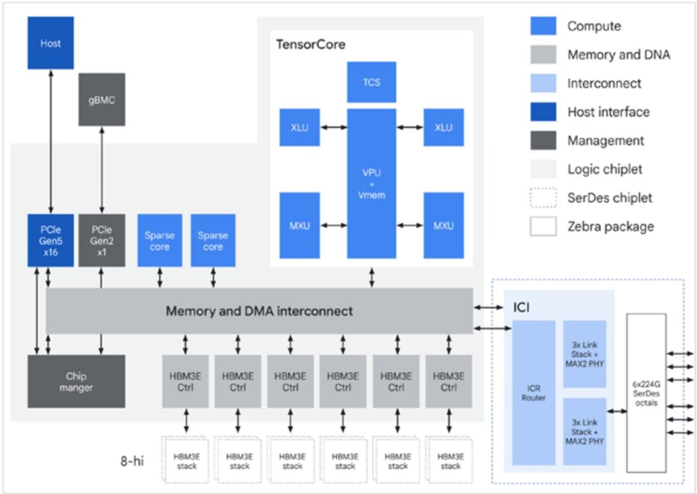

<details>
<summary>flowchart</summary>

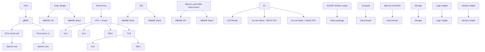
</details>

Source: Google, NOM

TPU 8i is a new chip designed for inference tasks, with the most notable feature being the tilt of resource allocation towards memory. Although its peak hash rate is lower than that of 8t, it is equipped with a 384MB on-chip SRAM cache (3x that of 8t), higher HBM memory capacity (288GB), and greater bandwidth. Google claimed that TPU 8i can host a larger KV Cache entirely on silicon, significantly reducing the idle time of the cores during long-context decoding. In addition, when an LLM performs inference, chips need to frequently synchronize data and summarize results, a process called collective communication. Chains-of-thought require multiple computing cores to frequently synchronize intermediate results, and traditional synchronization operations have extremely high latency. Therefore, TPU 8i uses the CAE, which aggregates results across cores with near-zero latency, specifically accelerating the reduction and synchronization steps required during auto-regressive decoding and chain-of-thought processing. For each TPU 8i chip, there are two Tensor Cores (TC) on-core dies and one CAE on the chiplet die, replacing four SparseCores (SCs) on core dies in the previous-generation Ironwood TPU. CAE further reduces the on-chip latency of collectives by 5x. Lower latency per collective operation means less time spent waiting, directly contributing to higher throughput required to run millions of agents concurrently.

Fig. 3: TPU 8i ASIC block diagram   
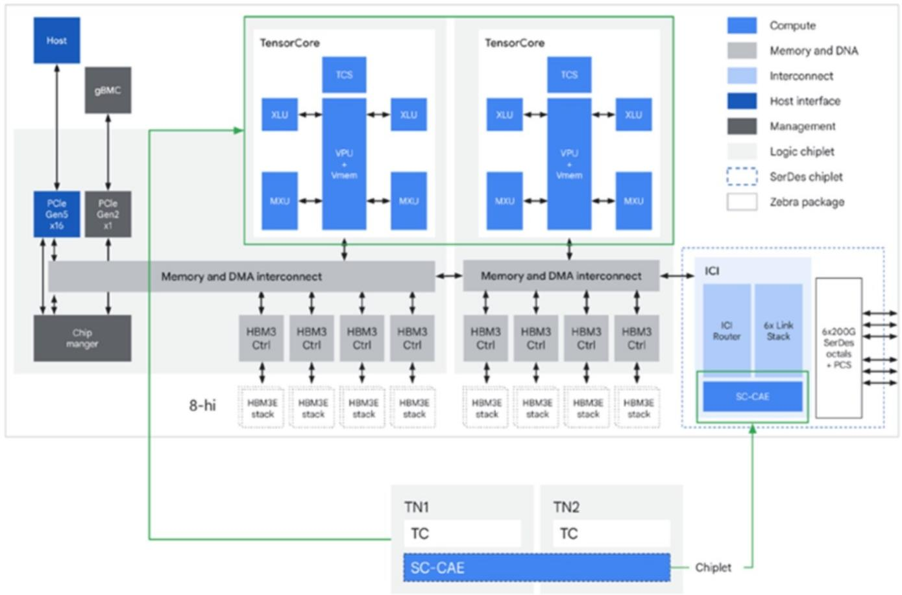

<details>
<summary>flowchart</summary>

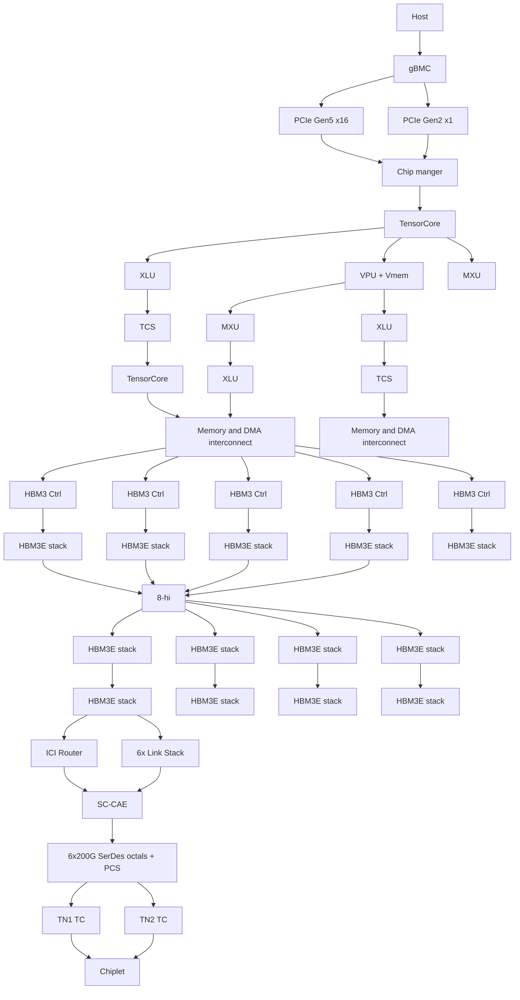
</details>

Source: Google, NOM

Fig. 4: Comparison of TPU v7, TPU v8t and TPU v8i 

<table><tr><td></td><td>TPU v7</td><td>TPU 8t</td><td>TPU 8i</td></tr><tr><td>Primary workload</td><td>High-performance ASIC for training and inference</td><td>Focus on large-scale training</td><td>Focus on large-scale inference</td></tr><tr><td>Design of die</td><td>Dual die</td><td>Single die</td><td>Dual die</td></tr><tr><td>HBM capacity</td><td>192GB HBM3E</td><td>216GB HBM</td><td>288GB HBM</td></tr><tr><td>HBM bandwidth</td><td>7.3TB/s</td><td>6.5TB/s</td><td>8.6TB/s</td></tr><tr><td>on-chip SRAM</td><td>-</td><td>128MB</td><td>384MB</td></tr><tr><td>Core feature</td><td>SparseCore, shared memory</td><td>SparseCore and LLM decoder engine, native FP4, Vrigo network</td><td>CAE, large SRAM, Boardfly network</td></tr><tr><td>Pod size</td><td>9216</td><td>9600</td><td>1152</td></tr><tr><td>Network topology</td><td>3D Torus</td><td>3D Torus</td><td>Boardfly</td></tr><tr><td>Peak FP4 PFLOPs</td><td>4.6</td><td>12.6</td><td>10.1</td></tr></table>

Source: Google, NOM

With the explosive growth of inference workloads, CPUs are the key to determining the efficiency and cost of AI systems. Data orchestration and memory management of inference tasks are highly dependent on the CPU, and the "logical scheduling" and "serial processing" used by AI Agents to perform complex tasks such as reading databases, running code, and parsing documents are the expertise of CPUs. According to comments from the Intel CEO during the company's 1Q26 earnings call, the CPU-to-GPU attach rate used to be 1:8, which has increased to 1:4 now, and may increase to 1:1 in the future. We think this reflects growing demand for CPU in AI clusters for agentic era.

Axion is Google's first custom ARM architecture-based CPU designed specifically for data centers, announced in 2024. For AI inference, Axion's dedicated optimizations can significantly boost performance, enabling AI workloads to run faster and more efficiently, according to management. The Axion product portfolio now includes three options: N4A, C4A, and C4A metal. Compared to virtual machines using mainstream x86 architecture CPUs, N4A offers twice the cost-performance ratio and leads in energy efficiency by up to 80% per watt, according to Google. In the TPU v8 series, Google is the first to use the Axion CPU as the main computing header, effectively reducing data preprocessing latency and ensuring the TPU computing engine runs at full capacity.

Fig. 5: AI inference performance on Axion CPU

# AI Inference Performance on Google Axion

Prompt Encoding & Tokens Generated /Sec

# Gemma-3-12b

Arm Neoverse based Google Axion

c4a-highmem with 48 vCPU

$$
+29 \%
$$

Better Performance over

AMD Turin

c4d-highmem-48 vCPU

$$
+23 \%
$$

Better Performance over

Intel Granite Rapids

c4-highmem-48 vCPU

Model Format: w8a8 | Benchmark: Throughput Serving | Serving Framework: vLLM | Concurrency: 1 and 16

(Compared to x86 based Instances)

Source: Google, NOM

# TPU V8i & V8t networking solutions

TPU 8t still uses 3D Torus topology to connect chips at the scale-up level to form a pod. The pod volume has increased to 9,600 cards (vs. 9216 cards for Ironwood), and the single-card scale-up bidirectional bandwidth is 19.2Tb (2x that of Ironwood), and we think that there are still 48 OCS in each pod, but the number of ports may increase to 300\*300. To support the massive data requirements of TPU 8t, Google introduced Virgo Network for scale-out networking. This new networking architecture enables up to 4x increased data center network (DCN) bandwidth on TPU 8t training over DCN. Built on high-radix switches that reduce network layers by allowing more ports per switch, Virgo Network employs a flat, two-layer non-blocking topology. Compared with traditional datacenter networks, this significantly reduces latency by minimizing network tiers. It features a multi-planar design with independent control domains to connect TPU 8t chips. The TPU 8t racks also connect with the Jupiter north-south fabric to access compute and memory services. Virgo Network can connect more than 1 million TPU chips into a single training cluster, with a single network architecture connecting 134,000 chips.

Fig. 6: Virgo Network architecture   
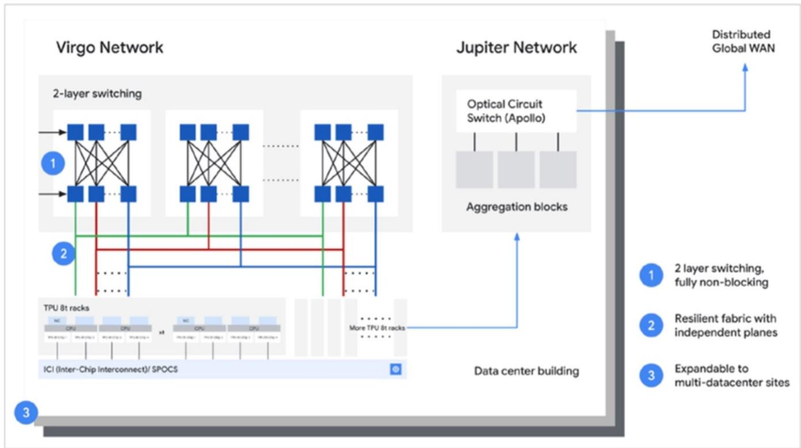

<details>
<summary>flowchart</summary>

```mermaid
graph TD
    subgraph Virgo Network
        A["1"] --> B["2-layer switching"]
        B --> C["3"]
        D["2"] --> E["3"]
        F["3"] --> G["3"]
        H["3"] --> I["3"]
        J["3"] --> K["3"]
        L["3"] --> M["3"]
        N["3"] --> O["3"]
        P["3"] --> Q["3"]
        R["3"] --> S["3"]
        T["3"] --> U["3"]
        V["3"] --> W["3"]
        X["3"] --> Y["3"]
        Z["3"] --> AA["3"]
        AB["3"] --> AC["3"]
        AD["3"] --> AE["3"]
        AF["3"] --> AG["3"]
        AH["3"] --> AI["3"]
        AJ["3"] --> AK["3"]
        AL["3"] --> AM["3"]
        AN["3"] --> AO["3"]
        AP["3"] --> AQ["3"]
        AR["3"] --> AS["3"]
        AT["3"] --> AU["3"]
        AV["3"] --> AW["3"]
        AX["3"] --> AY["3"]
        AZ["3"] --> BA["3"]
        BB["3"] --> BC["3"]
        BD["3"] --> BE["3"]
        BF["3"] --> BG["3"]
        BH["3"] --> BI["3"]
        BJ["3"] --> BK["3"]
        BL["3"] --> BM["3"]
        BN["3"] --> BO["3"]
        BP["3"] --> BQ["3"]
        BR["3"] --> BS["3"]
        BT["3"] --> BU["3"]
        BV["3"] --> BW["3"]
        BX["3"] --> BY["3"]
        BZ["3"] --> CA["3"]
        CB["3"] --> CD["3"]
        CE["3"] --> CF["3"]
        CG["3"] --> DH["3"]
        DI["3"] --> DJ["3"]
        DE["3"] --> DF["3"]
        DG["3"] --> DH
    end

    subgraph Jupiter Network
        E
        F
        G
        H
        I
        J
        K
        L
        M
        N
        O
        P
        Q
        R
        S
        T
        U
        V
        W
        X
        Y
        Z
        AA
        AB
        AC
        AD
    end

    subgraph Data Center Building
    AE
    AF
    AG
    AH
    AI
    AJ
    AK
    AL
    AM
    AN
    AO
    AP
    AQ
    AR
    AS
    AT
    AU
    AV
    AW
    AX
    AY
    AZ
    BA
    BB
    BC
    BD
    AE
    AF
    AG
    AH
    AI
    AJ
    AK
    AL
    AM
    AN
    AO
    AP
    AQ
    AR
    AS
    AT
    AU
    AV
    AW
    AX
    AY
    AZ
    BA
    BB
    AC
    AD
    AE
    AF
    AG
    AH
    AI
    AJ
    AK
    AL
    AM
    AO
    AP
    AQ
    AR
    AS
    AT
    AU
    AV
    AW
   AX
   AB
   AC
   AD
    AE
    AF
    AG
    AH
   AI
   AD
    AO
    AP
    AQ
   AR
   AS
   AT
    AU
    AV
   AB
   AC
   AD
    AE
    AF
    AG
    AH
   AI
   AD
    AO
    AP
    AQ
   AR
   AS
   AT
    AU
    AV
   AB
   AC
   AD
    AE
    AF
    AG
    AH
   AI
   AD
    AO
    AP
    AQ
   AR
   AS
   AT
    AU1: 2 layer switching, fully non-blocking; 2 layer switching, fully non-blocking; resilient fabric with independent planes; expandable to multi-datacenter sites; ICI (Inter-Chip Interconnect)/SPOCS; 7.5% TPU 8t racks; 10% TPU 8t racks; More TPU 8t racks; More TPU 8t racks; More TPU 8t racks; More TPU 8t racks; More TPU 8t racks; More TPU 8t racks; More TPU 8t racks; More TPU 8t racks; More TPU 8t racks; More TPU 8t racks; More TPU 8t racks; More TPU 8t racks; More TPU 6s; More TPU 6s; More TPU 6s; More TPU 6s; More TPU 6s; More TPU 6s; More TPU 6s; More TPU 6s; More TPU 6s; More TPU 6s; More TPU 6s; More TPU 6s; More TPU 6s; More TPU 6s; More TPU 6s; Total Data Center Building: Distributed Global WAN
```
</details>

Source: Google, NOM

Google designed TPU 8i with a new serving optimized network topology called Boardfly. Boardfly is a flat two-layer architecture, significantly reducing the latency. Utilizing a high-radix design, Google connects up to 1,152 of these chips together, reducing the network diameter and the number of hops a data packet must take to cross the system. By slashing the hops required for all-to-all communication, Boardfly achieves up to a $50\%$ improvement in latency for communication-intensive workloads, according to Google. For that same 1,024-chip pod, Boardfly reduces the network diameter from 16 hops down to 7, which directly leads to lower tail latency.

Boardfly consists of the following elements, and its topology is hierarchical by nature:

1. Building Block (BB): Each tray forms a four-chip ring using internal ICI links (connected by PCB), providing 16 external connections for broader networking.   
2. Group (G): 8 boards are fully connected via copper cabling to create a localized group, utilizing 11 of the available external links for intra-group communication.   
3. Pod structure: The final architecture scales to 36 groups (up to 1,024 active chips) linked through Optical Circuit Switches (OCS), ensuring a maximum latency of seven hops for any chip-to-chip communication.

Fig. 7: TPU 8i hierarchical Boardfly topology   
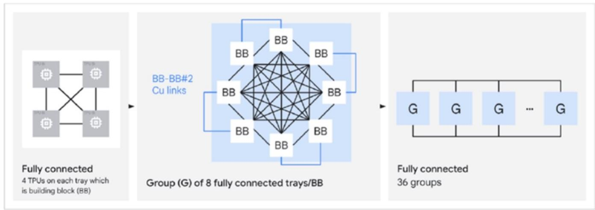

<details>
<summary>flowchart</summary>

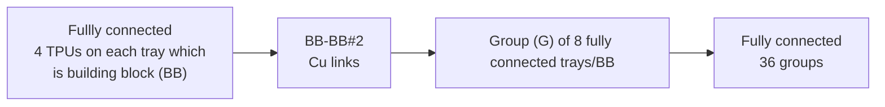
</details>

Source: Google, NOM

Fig. 8: ICI network diameter via optical circuit switch on TPU 8i pod   
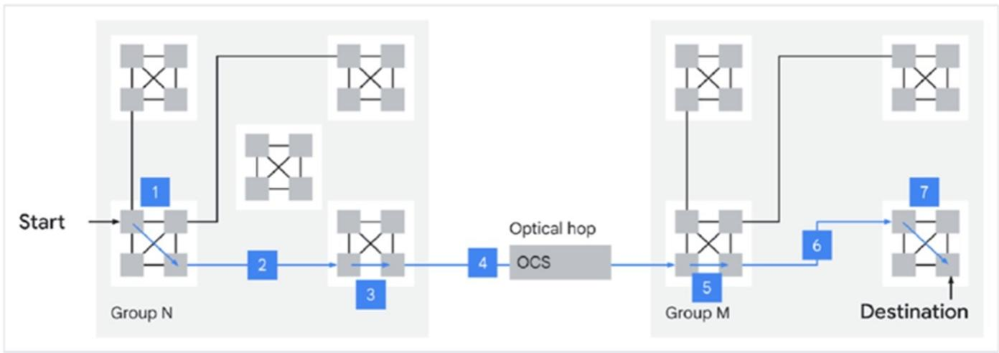

<details>
<summary>flowchart</summary>

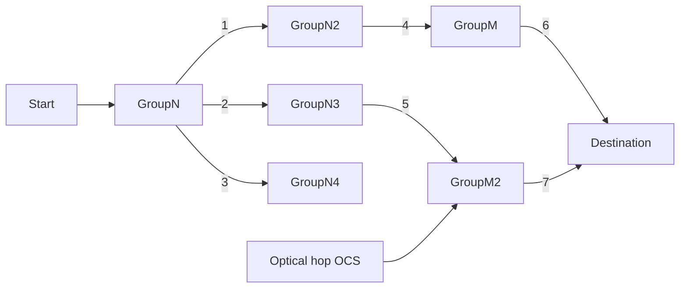
</details>

Source: Google, NOM

# Impact of TPU v8 on AI networking

The scale-up networking of TPU 8t continues the 3D Torus topology, and the pod volume has increased to 9,600 cards. The number of copper cables has also increased accordingly, while the optical transceiver ratio is about 1:1.5, according to Semi analysis, but the absolute number increases with the number of TPUs.

Fig. 9: TPU v7 3D Torus connection solutions 

<table><tr><td colspan="3">TPU v7 3D Torus Connection Solutions</td></tr><tr><td></td><td>Per TPU</td><td>Rack Total</td></tr><tr><td colspan="3">8 Interior TPUs</td></tr><tr><td>Copper cables</td><td>4</td><td>32</td></tr><tr><td>PCB Traces</td><td>2</td><td>16</td></tr><tr><td>Optical Transceivers</td><td>0</td><td>0</td></tr><tr><td colspan="3">8 Corner TPUs</td></tr><tr><td>Copper cables</td><td>1</td><td>8</td></tr><tr><td>PCB Traces</td><td>2</td><td>16</td></tr><tr><td>Optical Transceivers</td><td>3</td><td>24</td></tr><tr><td colspan="3">24 Edge TPUs</td></tr><tr><td>Copper cables</td><td>2</td><td>48</td></tr><tr><td>PCB Traces</td><td>2</td><td>48</td></tr><tr><td>Optical Transceivers</td><td>2</td><td>48</td></tr><tr><td colspan="3">24 Face TPUs</td></tr><tr><td>Copper cables</td><td>3</td><td>72</td></tr><tr><td>PCB Traces</td><td>2</td><td>48</td></tr><tr><td>Optical Transceivers</td><td>1</td><td>24</td></tr><tr><td colspan="3">Total for 64 TPU Rack</td></tr><tr><td>Copper cables</td><td>1.25</td><td>80</td></tr><tr><td>PCB Traces</td><td>1.00</td><td>64</td></tr><tr><td>Optical Transceivers</td><td>1.50</td><td>96</td></tr></table>

Source: SemiAnalysis, NOM

The design of Google TPU 8i shows that in addition to model training requiring high-density computing clusters, large-scale inference involving multi-agent collaboration and complex chain-of-thought is also communication-intensive, which increases the requirements for low latency between chips. Judging from Google's new Boardfly topology, copper cables are still the main interconnect method at the ICI level, and the demand for OCS extends from scale-out to scale-up between chipsets.

Fig. 10: Calculation of usage of DAC/optical transceiver/OCS in TPU 8i pod 

<table><tr><td></td><td>BB</td><td>Group</td><td>Between group</td></tr><tr><td>DAC</td><td>8x11x36=3168</td><td>-</td><td>-</td></tr><tr><td>Optical transceiver</td><td>-</td><td>5x8x36=1440</td><td>-</td></tr><tr><td>OCS</td><td>-</td><td>-</td><td>20 72*72 OCS / 5 288*288 OCS</td></tr></table>

Source: NOM estimates

Theoretically, the switching response speed of scale-up networking for OCS is required to reach nanoseconds. The MEMS-based OCS relies on the mechanical motion of the micromirror and the DLC-based OCS relies on the rearrangement of liquid crystal molecules, both of which have a switching time in the millisecond range, which cannot meet this requirement in terms of physical principle. However, the SiPh-based OCS can achieve nanosecond-level switching by virtue of the principle of electronically controlled refractive index, which matches the requirements of the scale-up networking, but it is still in the small-batch delivery stage. As a representative manufacturer of SiPh-based OCS, iPronics (unlisted) has released a 32\*32-port SiPh-based OCS in 2025 and expects to release a 64\*64-port OCS in 2026. Meanwhile, it has cooperated with Fabrinet (FN US, Not rated) to build the world's first mass-produced SiPh-based OCS production line, which should enter operation from 2Q26, according to company. The new manufacturing line enables iPronics to scale production rapidly to meet customer demand for SiPh-based OCS in training and inference AI clusters. On the other hand, although MEMS-based OCS switching speed is relatively slow, Google has made up for its switching delay through software scheduling, which is also the current strategy adopted by Google. Therefore, we believe that both the solutions have the potential to be used in TPU v8 clusters, and we will continue to catch up the latest progress in SiPh-based OCS.

In addition, both the eighth-generation TPU chips are equipped with Google's self-developed ARM architecture Axion CPU as the main controller, which solves the host computing power bottleneck caused by data preprocessing delays. The number of CPUs has been upgraded from "1 CPU with 4 TPUs" to "1 CPU with 2 TPUs", and the number of CPU hosts per server has doubled. The CEO of Arm, Rene Haas, mentioned in latest earnings call that as AI shifts from "human-computer interaction" to "agentized continuous workloads", data center CPU capacity will more than quadruple and the market size will exceed USD100bn by 2030. We think that the rapid growth of demand for CPUs will drive revenue growth of CPU PCB suppliers, server foundries and other related supply chain manufacturers.

Google's TPU v8 series chips adopt a dual-vendor strategy, with the TPU 8t being co-designed by Google and Broadcom (AVGO US, Not rated), and the TPU 8i being designed by Google and MediaTek (2454 TT, Buy; covered by Aaron Jeng) for the first time. Broadcom has rich experience in high-performance ASIC design, and the pursuit of extreme computing performance and interconnect bandwidth in training chips is Broadcom's strength, while MediaTek has advantages in power efficiency and cost optimization. Compared to single-chip performance, inference chips need to provide higher inference throughput per-unit power consumption. MediaTek's low-power design experience in the mobile SoC market could be well used for the inference chip.

Based on Counterpoint Research's latest Global AI Server Compute ASIC Shipment Forecast, the combined TPU v8t and v8e shipments are projected to approach 5mn units in 2028, more than 10x growth from the \~400k units shipped in 2026. We believe that the separation of TPU v8 training and inference chips and strong demand will likely help further expand Google's TPU supply chain.

Fig. 11: Google PCB and CCL supply chain 

<table><tr><td>Generation</td><td>Content</td><td>Time</td><td>Structure</td><td>CCL Material</td><td>CCL Supplier(s)</td><td>PCB Supplier(s)</td></tr><tr><td rowspan="2">TPU v6p</td><td>TPU UBB</td><td>2H25~</td><td>34L PCB (16+18, N+M)</td><td>M7, HVLP2</td><td>Panasonic, EMC</td><td>WUS, ISU, TTM, VGT</td></tr><tr><td>CPU board (New)</td><td>4Q25~</td><td>22L PCB</td><td>M8</td><td>EMC, Panasonic</td><td>VGT, WUS, ISU, TTM, others?</td></tr><tr><td rowspan="3">TPU v7p, v7e</td><td>TPU UBB</td><td>mid-26~</td><td>36~40L+ PCB</td><td>M8+M8, HVLP3</td><td>Panasonic, EMC</td><td>WUS, ISU, TTM, LCS, VGT?</td></tr><tr><td>CPU board (New)</td><td>4Q25~</td><td>22L PCB</td><td>M8</td><td>EMC, Panasonic</td><td>VGT, WUS, ISU, TTM, others?</td></tr><tr><td>PCIe switch (New)</td><td>mid-26~</td><td>22-24L PCB</td><td>M8?</td><td>EMC</td><td>WUS, ISU, GCE, ZDT, others?</td></tr><tr><td rowspan="2">TPU v8t, v8i</td><td>TPU UBB?</td><td>2028?</td><td>24~28L? HDI?</td><td>M8.5? MBQ?</td><td>Panasonic? EMC?</td><td>WUS, ISU, Unimicron, others?</td></tr><tr><td colspan="6">More other boards?</td></tr></table>

Source: NOM

Fig. 12: OCS industry supply chain 

<table><tr><td colspan="5">MEMS</td></tr><tr><td>Core components</td><td>MEMS array</td><td>Optical filter</td><td>Fiber collimator array</td><td>Lens array</td></tr><tr><td>Global supplier</td><td>Silex</td><td></td><td>Corning</td><td></td></tr><tr><td>Domestic supplier</td><td>Yitoa Intelligent</td><td>Optowide Technologies, DOTI Micro</td><td>TFC, T&amp;S, EverProX, Optowide Technologies</td><td>Focuslight Technologies</td></tr><tr><td>OCS manufacturer/foundry</td><td colspan="4">Lumentum, Accelink, Eoptolink, Triple-stone, Calient, Advanced Fiber Resources (foundry), Taclink (foundry)</td></tr><tr><td colspan="5">DLC</td></tr><tr><td>Core components</td><td>Liquid crystal light module</td><td>Fiber collimator array</td><td> ${\mathrm{{YVO}}}_{4}$  crystal</td><td></td></tr><tr><td>Global supplier</td><td>Coherent</td><td>Corning</td><td></td><td></td></tr><tr><td>Domestic supplier</td><td></td><td>TFC, T&amp;S, EverProX, Optowide Technologies</td><td>Castech, Optowide Technologies</td><td></td></tr><tr><td>OCS manufacturer/foundry</td><td colspan="4">Coherent, Celestica (foundry)</td></tr><tr><td colspan="5">DLBS</td></tr><tr><td>Core components</td><td>Piezoelectric Ceramics module</td><td>Fiber collimator array</td><td></td><td></td></tr><tr><td>Global supplier</td><td>Polatis</td><td>Corning</td><td></td><td></td></tr><tr><td>Domestic supplier</td><td>Luster</td><td>TFC, T&amp;S, EverProX, Optowide Technologies</td><td></td><td></td></tr><tr><td>OCS manufacturer/foundry</td><td colspan="4">Polatis, Luster</td></tr><tr><td colspan="5">SiPh-based solution</td></tr><tr><td>Core components</td><td>SiPh chip</td><td>PIC</td><td>MPO</td><td>PCB</td></tr><tr><td>Global supplier</td><td>iPronic</td><td></td><td>Corning</td><td></td></tr><tr><td>Domestic supplier</td><td></td><td></td><td>T&amp;S, EverProX</td><td></td></tr><tr><td>OCS manufacturer/foundry</td><td colspan="4">iPronic, Taclink</td></tr></table>

Source: Company data, NOM

# Appendix A-1

This report has been produced by NOM International (Hong Kong) Ltd. (NIHK), Hong Kong.

See Disclaimers for NOM Group entity details.

# Analyst Certification

I, Bing Duan, hereby certify (1) that the views expressed in this Research report accurately reflect my personal views about any or all of the subject securities or issuers referred to in this Research report, (2) no part of my compensation was, is or will be directly or indirectly related to the specific recommendations or views expressed in this Research report and (3) no part of my compensation is tied to any specific investment banking transactions performed by NOM Securities International, Inc., NOM International plc or any other NOM Group company.

# Issuer Specific Regulatory Disclosures

The terms "NOM" and "NOM Group" used herein refer to NOM Holdings, Inc. and its affiliates and subsidiaries, including NOM Securities International, Inc. ('NSI') and Instinet, LLC ('ILLC'), U. S. registered broker dealers and members of SIPC.

Materially mentioned issuers 

<table><tr><td>Issuer</td><td>Ticker</td><td>Price</td><td>Price date</td><td>Stock rating</td><td>Sector rating</td><td>Disclosures</td></tr><tr><td>MediaTek</td><td>2454 TT</td><td>TWD 4,265.00</td><td>26-May-2026</td><td>Buy</td><td>N/A</td><td></td></tr><tr><td>Victory Giant</td><td>2476 HK</td><td>HKD 436.80</td><td>27-May-2026</td><td>Buy</td><td>N/A</td><td></td></tr><tr><td>Victory Giant</td><td>300476 CH</td><td>CNY 379.30</td><td>27-May-2026</td><td>Buy</td><td>N/A</td><td></td></tr></table>

# MediaTek (2454 TT)

Rating and target price chart (three year history)

# TWD 4,265.00 (26-May-2026) Buy (Sector rating: N/A)

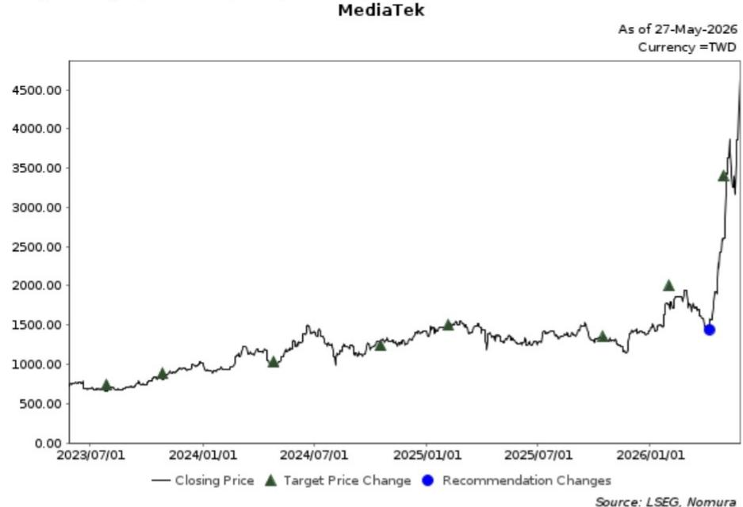

<details>
<summary>line</summary>

| Date       | Closing Price | Target Price Change | Recommendation Changes |
| ---------- | ------------- | ------------------- | ---------------------- |
| 2023/07/01 | ~750.00       | ~750.00             | -                      |
| 2024/01/01 | ~1000.00      | ~1000.00            | -                      |
| 2024/07/01 | ~1400.00      | ~1400.00            | -                      |
| 2025/01/01 | ~1500.00      | ~1500.00            | -                      |
| 2025/07/01 | ~1300.00      | ~1300.00            | -                      |
| 2026/01/01 | ~1800.00      | ~2000.00            | -                      |
| 2026/12/14 | ~3500.00      | ~3500.00            | 1450.00                |
</details>

<table><tr><td>Date</td><td>Rating</td><td>Target price</td><td>Closing price</td></tr><tr><td>30-Apr-26</td><td></td><td>3,400.00</td><td>2,610.00</td></tr><tr><td>30-Mar-26</td><td>Buy</td><td></td><td>1,510.00</td></tr><tr><td>01-Feb-26</td><td></td><td>2,000.00</td><td>1,760.00</td></tr><tr><td>16-Oct-25</td><td></td><td>1,350.00</td><td>1,330.00</td></tr><tr><td>05-Feb-25</td><td></td><td>1,500.00</td><td>1,525.00</td></tr><tr><td>17-Oct-24</td><td></td><td>1,250.00</td><td>1,275.00</td></tr><tr><td>26-Apr-24</td><td></td><td>1,040.00</td><td>1,005.00</td></tr><tr><td>27-Oct-23</td><td></td><td>890.00</td><td>801.00</td></tr><tr><td>28-Jul-23</td><td></td><td>740.00</td><td>658.00</td></tr></table>

For explanation of ratings refer to the stock rating keys located after chart(s)

Valuation Methodology Our TP of TWD3,400 is based on 25x our average 2027-28F EPS. Our target multiple of 25x is at its high end of historical range. The benchmark index for this stock is TAIEX.

Risks that may impede the achievement of the target price Key downside risks include: 1) fierce price competition from Qualcomm and Spreadtrum; 2) the company's execution (i.e. a continuous rollout of good products in terms of specification, price and cost); 3) smartphone demand, especially in China and emerging markets, where MediaTek has higher revenue exposure; and 4) ASIC execution and competition.

Victory Giant (2476 HK)   
Rating and target price chart (three year history)   
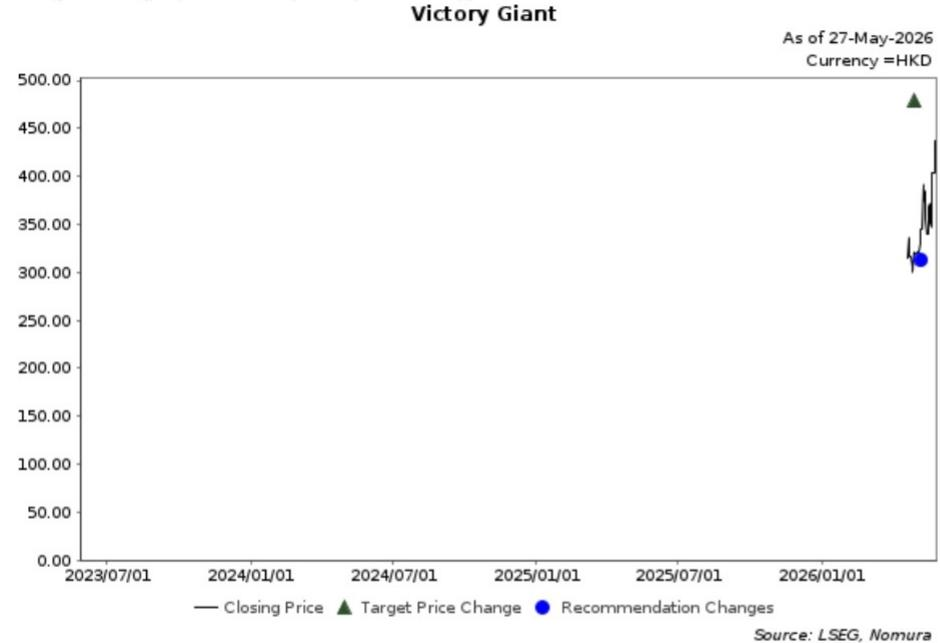

<details>
<summary>line</summary>

| Date       | Closing Price | Target Price Change | Recommendation Changes |
| ---------- | ------------- | ------------------- | ---------------------- |
| 2026/01/01 | ~350.00       | ~480.00             | ~320.00                |
</details>

HKD 436.80 (27-May-2026) Buy (Sector rating: N/A) 

<table><tr><td>Date</td><td>Rating</td><td>Target price</td><td>Closing price</td></tr><tr><td>30-Apr-26</td><td>Buy</td><td></td><td>319.40</td></tr><tr><td>30-Apr-26</td><td></td><td>479.00</td><td>319.40</td></tr></table>

For explanation of ratings refer to the stock rating keys located after chart(s)

Valuation Methodology Our TP of HKD479.00 is based on 27x 2027F EPS of CNY15.44, in line with its A-share historical median P/E. The benchmark index is Hang Seng Index.

Risks that may impede the achievement of the target price Downside risks: 1) lower-than-expected PCB demand in downstream sectors such as servers and auto electronics; 2) more fierce competition in the high-end PCB market leading to pressure on margins; 3) higher-than-expected raw material cost pressure, and 4) worse-than-expected geopolitical tensions in global AI value chain.

Victory Giant (300476 CH)   
Rating and target price chart (three year history)   
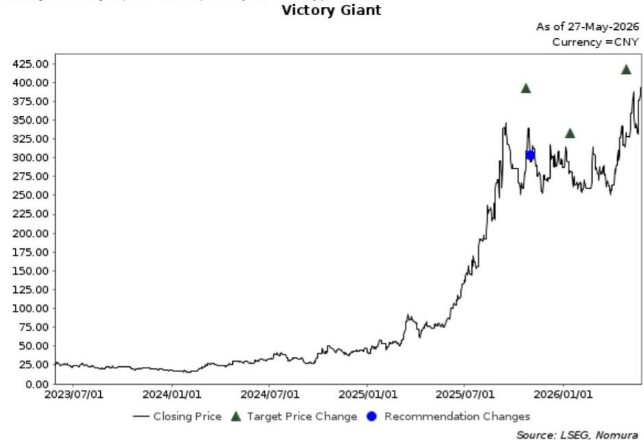

<details>
<summary>line</summary>

| Date       | Closing Price | Target Price Change | Recommendation Changes |
| ---------- | ------------- | ------------------- | ---------------------- |
| 2026/01/01 | ~380.00       | ~410.00             | Yes                    |
</details>

CNY 379.30 (27-May-2026) Buy (Sector rating: N/A) 

<table><tr><td>Date</td><td>Rating</td><td>Target price</td><td>Closing price</td></tr><tr><td>30-Apr-26</td><td></td><td>417.00</td><td>328.49</td></tr><tr><td>15-Jan-26</td><td></td><td>333.00</td><td>283.07</td></tr><tr><td>24-Oct-25</td><td>Buy</td><td></td><td>308.98</td></tr><tr><td>24-Oct-25</td><td></td><td>392.00</td><td>308.98</td></tr></table>

For explanation of ratings refer to the stock rating keys located after chart(s)

Valuation Methodology Our target price of CNY417.00 is based on 27x 2027F EPS of CNY15.44, in line with company's historical median P/E of 27x. The benchmark index is CSI300.

Risks that may impede the achievement of the target price Downside risks include: 1) key customers' supply chain diversification and more intensified competition from peers; 2) technology changes such as COWOP which may change the competition landscape and threat company's market shares; 3) slower technology upgrade in AI PCB market; and 4) escalations on geopolitical tensions.

# Important Disclosures

# Online availability of research and conflict-of-interest disclosures

NOM Group research is available on www.NOMnow.com/research, Bloomberg, Capital IQ, Factset, LSEG.

Important disclosures may be read at http://go.NOMnow.com/research/m/Disclosures or requested from NOM Securities International, Inc. If you have any difficulties with the website, please email grpsupport@NOM.com for help.

The analysts responsible for preparing this report have received compensation based upon various factors including the firm's total revenues, a portion of which is generated by Investment Banking activities. Unless otherwise noted, the non-US analysts listed at the front of this report are not registered/qualified as research analysts under FINRA rules, may not be associated persons of NSI, and may not be subject to FINRA Rule 2241 restrictions on communications with covered companies, public appearances, and trading securities held by a research analyst account.

NOM Global Financial Products Inc. (NGFP) NOM Derivative Products Inc. (NDP) and NOM International plc. (NIplc) are registered with the Commodities Futures Trading Commission and the National Futures Association (NFA) as swap dealers. NGFP, NDPI, and NIplc are generally engaged in the trading of swaps and other derivative products, any of which may be the subject of this report.

# Distribution of ratings (NOM Group)

The distribution of all ratings published by NOM Group Global Equity Research is as follows:

57% have been assigned a Buy rating which, for purposes of mandatory disclosures, are classified as a Buy rating; 34% of companies with this rating are investment banking clients of the NOM Group\*. 0% of companies (which are admitted to trading on a regulated market in the EEA) with this rating were supplied material services\*\* by the NOM Group.

41% have been assigned a Neutral rating which, for purposes of mandatory disclosures, is classified as a Hold rating; 57% of companies with this rating are investment banking clients of the NOM Group\*. 0% of companies (which are admitted to trading on a regulated market in the EEA) with this rating were supplied material services by the NOM Group

2% have been assigned a Reduce rating which, for purposes of mandatory disclosures, are classified as a Sell rating; 0% of companies with this rating are investment banking clients of the NOM Group\*. 0% of companies (which are admitted to trading on a regulated market in the EEA) with this rating were supplied material services by the NOM Group.

As at 31 March 2026.

\*The NOM Group as defined in the Disclaimer section at the end of this report.

\*\* As defined by the EU Market Abuse Regulation

# Definition of NOM Group's equity research rating system and sectors

The rating system is a relative system, indicating expected performance against a specific benchmark identified for each individual stock, subject to limited management discretion. An analyst's target price is an assessment of the current intrinsic fair value of the stock based on an appropriate valuation methodology determined by the analyst. Valuation methodologies include, but are not limited to, discounted cash flow analysis, expected return on equity and multiple analysis. Analysts may also indicate expected absolute upside/downside relative to the stated target price, defined as (target price - current price)/current price.

# STOCKS

A rating of 'Buy', indicates that the analyst expects the stock to outperform the Benchmark over the next 12 months. A rating of 'Neutral', indicates that the analyst expects the stock to perform in line with the Benchmark over the next 12 months. A rating of 'Reduce', indicates that the analyst expects the stock to underperform the Benchmark over the next 12 months. A rating of 'Suspended', indicates that the rating, target price and estimates have been suspended temporarily to comply with applicable regulations and/or firm policies. Securities and/or companies that are labelled as 'Not rated' or shown as 'No rating' are not in regular research coverage. Investors should not expect continuing or additional information from NOM relating to such securities and/or companies. Benchmarks are as follows: United States/Europe/Asia ex-Japan: please see valuation methodologies for explanations of relevant benchmarks for stocks, which can be accessed at: http://go.NOMnow.com/research/m/Disclosures; Global Emerging Markets (ex-Asia): MSCI Emerging Markets ex-Asia, unless otherwise stated in the valuation methodology; Japan: Russell/NOM Large Cap.

# SECTORS

A 'Bullish' stance, indicates that the analyst expects the sector to outperform the Benchmark during the next 12 months. A 'Neutral' stance, indicates that the analyst expects the sector to perform in line with the Benchmark during the next 12 months. A 'Bearish' stance, indicates that the analyst expects the sector to underperform the Benchmark during the next 12 months. Sectors that are labelled as 'Not rated' or shown as 'N/A' are not assigned ratings. Benchmarks are as follows: United States: S&P 500; Europe: Dow Jones STOXX 600; Global Emerging Markets (ex-Asia): MSCI Emerging Markets ex-Asia. Japan/Asia ex-Japan: Sector ratings are not assigned.

# Target Price

A Target Price, if discussed, indicates the analyst's forecast for the share price with a 12-month time horizon, reflecting in part the analyst's estimates for the company's earnings. The achievement of any target price may be impeded by general market and macroeconomic trends, and by other risks related to the company or the market, and may not occur if the company's earnings differ from estimates.

# Disclaimers

This publication contains material that has been prepared by the NOM Group entity identified on page 1 and, if applicable, with the contributions of one or more NOM Group entities whose employees and their respective affiliations are specified on page 1 or identified elsewhere in this publication. The term "NOM Group" used herein refers to NOM Holdings, Inc. and its affiliates and subsidiaries including: (a) NOM Securities Co., Ltd. ('NSC') Tokyo, Japan, (b) NOM Financial Products Europe GmbH ('NFPE'), Germany, (c) NOM International plc ('NIplc'), UK, (d) NOM Securities International, Inc. ('NSI'), New York, US, (e) NOM International (Hong Kong) Ltd.

('NIHK'), Hong Kong, (f) NOM Financial Investment (Korea) Co., Ltd. ('NFIK'), Korea (Information on NOM analysts registered with the Korea Financial Investment Association ('KOFIA') can be found on the KOFIA Intranet at http://dis.kofia.or.kr, (g) NOM Singapore Ltd. ('NSL'), Singapore (Registration number 197201440E, regulated by the Monetary Authority of Singapore) (h) NOM Australia Ltd. ('NAL'), Australia (ABN 48 003 032 513), regulated by the Australian Securities and Investment Commission ('ASIC') and holder of an Australian financial services licence number 246412, (i) NOM Securities Malaysia Sdn. Bhd. ('NSM'), Malaysia, (j) NIHK, Taipei Branch ('NITB'), Taiwan, (k) NOM Financial Advisory and Securities (India) Private Limited ('NFASL'), Mumbai, India (Registered Address: Ceejay House, Level 11, Plot F, Shivsagar Estate, Dr. Annie Besant Road, Worli, Mumbai- 400 018, India; Tel: 91 22 4037 4037, Fax: 91 22 4037 4111; CIN No: U74140MH2007PTC169116, SEBI Registration No. for Stock Broking activities : INZ000255633; SEBI Registration No. for Merchant Banking : INM000011419; SEBI Registration No. for Research: INH000001014 - Compliance Officer: Ms. Pratiksha Tondwalkar, 91 22 40374904, grievance email: investorgrievancesra@NOM.com Webpage: LINK

For reports with respect to Indian public companies or authored by India-based NFASL research analysts: (i) Investment in securities markets is subject to market risks. Read all the related documents carefully before investing. (ii) Registration granted by SEBI, and certification from NISM in no way guarantee performance of the intermediary or provide any assurance of returns to investors. (iii) NFASL terms and conditions for availing research services is disclosed on NFASL webpage.

(I) NOM Fiduciary Research & Consulting Co., Ltd. ('NFRC') Tokyo, Japan. (m) NOM Orient International Securities Co., Ltd ("NOI"), is a majority owned joint venture amongst NOM Group, Orient International (Holding) Co., Ltd, and Shanghai Huangpu Investment Holding (Group) Co., Ltd. In accordance with the laws of the People's Republic of China ("PRC", excluding Hong Kong, Macau and Taiwan, for the purpose of this document), NOI is licensed in the PRC to provide securities research and investment recommendations and it operates independently from the other members of the NOM Group; in particular, NOI's interests in PRC securities are not disclosed to, or aggregated with the holdings of, any other NOM Group entities and the interests in PRC securities of other NOM Group entities are not disclosed to, or aggregated with the holdings of, NOI. An individual name printed next to NOI on the front page of a research report indicates that individual is employed by NOI to provide research assistance to NIHK under a research partnership agreement. 'NSFSPL' next to an employee's name on the front page of a research report indicates that the individual is employed by NOM Structured Finance Services Private Limited to provide assistance to certain NOM entities under inter-company agreements. 'Verdhana' next to an individual's name on the front page of a research report indicates that the individual is employed by PT Verdhana Sekuritas Indonesia ('Verdhana') to provide research assistance to NIHK under a research partnership agreement and neither Verdhana nor such individual is licensed outside of Indonesia.

THIS MATERIAL IS: (I) FOR YOUR PRIVATE INFORMATION, AND WE ARE NOT SOLICITING ANY ACTION BASED UPON IT; (II) NOT TO BE CONSTRUED AS AN OFFER TO SELL OR A SOLICITATION OF AN OFFER TO BUY ANY SECURITIES IN ANY JURISDICTION WHERE SUCH OFFER OR SOLICITATION WOULD BE ILLEGAL; AND (III) OTHER THAN DISCLOSURES RELATING TO THE NOM GROUP, BASED UPON INFORMATION FROM SOURCES THAT WE CONSIDER RELIABLE, BUT HAS NOT BEEN INDEPENDENTLY VERIFIED BY NOM GROUP.

Other than disclosures relating to the NOM Group, the NOM Group does not warrant, represent or undertake, express or implied, that the document is fair, accurate, complete, correct, reliable or fit for any particular purpose or merchantable, and to the maximum extent permissible by law and/or regulation, does not accept liability (in negligence or otherwise, and in whole or in part) for any act (or decision not to act) resulting from use of this document and related data. To the maximum extent permissible by law and/or regulation, all warranties and other assurances by the NOM Group are hereby excluded and the NOM Group shall have no liability (in negligence or otherwise, and in whole or in part) for any loss howsoever arising from the use, misuse, or distribution of this material or the information contained in this material or otherwise arising in connection therewith.

Opinions or estimates expressed are current opinions as of the original publication date appearing on this material and the information, including the opinions and estimates contained herein, are subject to change without notice. The NOM Group, however, expressly disclaims any obligation, and therefore is under no duty, to update or revise this document. Any comments or statements made herein are those of the author(s) and may differ from views held by other parties within NOM Group. Clients should consider whether any advice or recommendation in this report is suitable for their particular circumstances and, if appropriate, seek professional advice, including tax advice. The NOM Group does not provide tax advice.

The NOM Group, and/or its officers, directors, employees and affiliates, may, to the extent permitted by applicable law and/or regulation, deal as principal, agent, or otherwise, or have long or short positions in, or buy or sell, the securities, commodities or instruments, or options or other derivative instruments based thereon, of issuers or securities mentioned herein. The NOM Group companies may also act as market maker or liquidity provider (within the meaning of applicable regulations in the UK) in the financial instruments of the issuer. Where the activity of market maker is carried out in accordance with the definition given to it by specific laws and regulations of the US or other jurisdictions, this will be separately disclosed within the specific issuer disclosures.

This document may contain information obtained from third parties, including, but not limited to, ratings from credit ratings agencies such as Standard & Poor's. The NOM Group hereby expressly disclaims all representations, warranties or undertakings of originality, fairness, accuracy, completeness, correctness, merchantability or fitness for a particular purpose with respect to any of the information obtained from third parties contained in this material or otherwise arising in connection therewith, and shall not be liable (in negligence or otherwise, and in whole or in part) for any direct, indirect, incidental, exemplary, compensatory, punitive, special or consequential damages, costs, expenses, legal fees, or losses (including lost income or profits and opportunity costs) in connection with any use or misuse of any of the information obtained from third parties contained in this material or otherwise arising in connection therewith. Reproduction and distribution of third-party content in any form is prohibited except with the prior written permission of the related third-party. Third-party content providers do not, express or implied, guarantee the fairness, accuracy, completeness, correctness, timeliness or availability of any information, including ratings, and are not in any way responsible for any errors or omissions (negligent or otherwise), regardless of the cause, or for the results obtained from the use or misuse of such content. Third-party content providers give no express or implied warranties, including, but not limited to, any warranties of merchantability or fitness for a particular purpose or use. Third-party content providers shall not be liable (in negligence or otherwise, and in whole or in part) for any direct, indirect, incidental, exemplary, compensatory, punitive, special or consequential damages, costs, expenses, legal fees, or losses (including lost income or profits and opportunity costs) in connection with any use or misuse of their content, including ratings. Credit ratings are statements of opinions and are not statements of fact or recommendations to purchase hold or sell securities. They do not address the suitability of securities or the suitability of securities for investment purposes, and should not be relied on as investment advice. Any MSCI sourced information in this document is the exclusive property of MSCI Inc. ('MSCI'). Without prior written permission of MSCI, this information and any other MSCI intellectual property may not be duplicated, reproduced, re-disseminated, redistributed or used, in whole or in part, for any purpose whatsoever, including creating any financial products and any indices. This information is provided on an "as is" basis. The user assumes the entire risk of any use made of this information. MSCI, its affiliates and any third party involved in, or related to, computing or compiling the information hereby expressly disclaim all representations, warranties or undertakings of originality, fairness, accuracy, completeness, correctness, merchantability or fitness for a particular purpose with respect to any of this material or the information contained in this material or otherwise arising in connection therewith. Without limiting any of the foregoing, in no event shall MSCI, any of its affiliates or any third party involved in, or related to, computing or compiling the information have any liability (in negligence or otherwise, and in whole or in part) for any damages of any kind. MSCI and the MSCI indexes are services marks of MSCI and its affiliates.

The intellectual property rights and any other rights, in Russell/NOM Japan Equity Index belong to NOM Fiduciary Research & Consulting Co., Ltd. ("NFRC") and FTSE Russell ("Russell"). NFRC and Russell do not guarantee fairness, accuracy, completeness, correctness, reliability, usefulness, marketability, merchantability or fitness of the Index, and do not account for business activities or services that any index user and/or its affiliates undertakes with the use of the Index.

Investors should consider this document as only a single factor in making their investment decision and, as such, the report should not be viewed as identifying or suggesting all risks, direct or indirect, that may be associated with any investment decision. NOM Group produces a number of different types of research product including, among others, fundamental analysis and quantitative analysis; recommendations contained in one type of research product may differ from recommendations contained in other types of research product, whether as a result of differing time horizons, methodologies or otherwise. The NOM Group publishes research product in a number of different ways including the posting of product on the NOM Group portals and/or distribution directly to clients. Different groups of clients may receive different products and services from the research department depending on their individual requirements.

Figures presented herein may refer to past performance or simulations based on past performance which are not reliable indicators of future or likely performance. Where the information contains an expectation, projection or indication of future performance and business prospects, such forecasts may not be a reliable indicator of future or likely performance. Moreover, simulations are based on models and simplifying assumptions which may oversimplify and not reflect the future distribution of returns. Any figure, strategy or index created and published for illustrative purposes within this document is not intended for “use” as a “benchmark” as defined by the European Benchmark Regulation.

Certain securities are subject to fluctuations in exchange rates that could have an adverse effect on the value or price of, or income derived from, the investment.

With respect to Fixed Income Research: Recommendations fall into two categories: tactical, which typically last up to three months; or strategic, which typically last from 6-12 months. However, trade recommendations may be reviewed at any time as circumstances change. 'Stop loss' levels for trades are also provided; which, if hit, closes the trade recommendation automatically. Prices and yields shown in recommendations are taken at the time of submission for publication and are based on either indicative Bloomberg, LSEG or NOM prices and yields at that time. The prices and yields shown are not necessarily those at which the trade recommendation can be implemented.

The securities described herein may not have been registered under the US Securities Act of 1933 (the '1933 Act'), and, in such case, may not be offered or sold in the US or to US persons unless they have been registered under the 1933 Act, or except in compliance with an exemption from the registration requirements of the 1933 Act. Unless governing law permits otherwise, any transaction should be executed via a NOM entity in your home jurisdiction.

This document has been approved for distribution in the UK as investment research by NIplc. NIplc is authorised by the Prudential Regulation Authority and regulated by the Financial Conduct Authority and the Prudential Regulation Authority. NIplc is a member of the London Stock Exchange. This document does not constitute a personal recommendation within the meaning of applicable regulations in the UK, or take into account the particular investment objectives, financial situations, or needs of individual investors. This document is intended only for investors who are 'eligible counterparties' or 'professional clients' for the purposes of applicable regulations in the UK, and may not, therefore, be redistributed to persons who are 'retail clients' for such purposes.

This document has been approved for distribution in the European Economic Area as investment research by NOM Financial Products Europe GmbH ("NFPE"). NFPE is a company organized as a limited liability company under German law registered in the Commercial Register of the Court of Frankfurt/Main under HRB 110223. NFPE is authorized and regulated by the German Federal Financial Supervisory Authority (BaFin).

This document has been approved by NIHK, which is regulated by the Hong Kong Securities and Futures Commission, for distribution in Hong Kong by NIHK. This document is intended only for investors who are 'professional investors' for the purposes of applicable regulations in Hong Kong and may not, therefore, be redistributed to persons who are not 'professional investors' for such purposes.

This document has been approved for distribution in Australia by NAL, which is authorized and regulated in Australia by the ASIC. This document has also been approved for distribution in Malaysia by NSM.

In Singapore, this document has been distributed by NSL, an exempt financial adviser as defined under the Financial Advisers Act (Chapter 110), among other things, and regulated by the Monetary Authority of Singapore. NSL may distribute this document produced by its foreign affiliates pursuant to an arrangement under Regulation 32C of the Financial Advisers Regulations. This document is intended for accredited, expert or institutional investors as defined by the Securities and Futures Act (Chapter 289). Where the recipient of this document is not an accredited, expert or institutional investor, NSL accepts legal responsibility for the contents of this document in respect of such recipient only to the extent required by law. Recipients of this document in Singapore should contact NSL in respect of matters arising from, or in connection with, this document. THIS DOCUMENT IS INTENDED FOR GENERAL CIRCULATION. IT DOES NOT TAKE INTO ACCOUNT THE SPECIFIC INVESTMENT OBJECTIVES, FINANCIAL SITUATION OR PARTICULAR NEEDS OF ANY PARTICULAR PERSON. RECIPIENTS SHOULD

TAKE INTO ACCOUNT THEIR SPECIFIC INVESTMENT OBJECTIVES, FINANCIAL SITUATION OR PARTICULAR NEEDS BEFORE MAKING A COMMITMENT TO PURCHASE ANY SECURITIES, INCLUDING SEEKING ADVICE FROM AN INDEPENDENT FINANCIAL ADVISER REGARDING THE SUITABILITY OF THE INVESTMENT, UNDER A SEPARATE ENGAGEMENT, AS THE RECIPIENT DEEMS FIT. Unless prohibited by the provisions of Regulation S of the 1933 Act, this material is distributed in the US, by NSI, a US-registered broker-dealer, which accepts responsibility for its contents in accordance with the provisions of Rule 15a-6, under the US Securities Exchange Act of 1934. The entity that prepared this document permits its separately operated affiliates within the NOM Group to make copies of such documents available to their clients.

This document has not been approved for distribution to persons other than ‘Authorised Persons’, ‘Exempt Persons’ or ‘Institutions’ (as defined by the Capital Markets Authority) in the Kingdom of Saudi Arabia (‘Saudi Arabia’) or a ‘Market Counterparty’ or a ‘Professional Client’ (as defined by the Dubai Financial Services Authority) in the United Arab Emirates (‘UAE’) or a ‘Market Counterparty’ or a ‘Business Customer’ (as defined by the Qatar Financial Centre Regulatory Authority) in the State of Qatar (‘Qatar’) by NOM Saudi Arabia, NIplc or any other member of the NOM Group, as the case may be. Neither this document nor any copy thereof may be taken or transmitted or distributed, directly or indirectly, by any person other than those authorised to do so into Saudi Arabia or in the UAE or in Qatar or to any person other than ‘Authorised Persons’, ‘Exempt Persons’ or ‘Institutions’ located in Saudi Arabia or a ‘Market Counterparty’ or a ‘Professional Client’ in the UAE or a ‘Market Counterparty’ or a ‘Business Customer’ in Qatar. Any failure to comply with these restrictions may constitute a violation of the laws of the UAE or Saudi Arabia or Qatar.

For report with reference of TAIWAN public companies or authored by Taiwan based research analyst:

THIS DOCUMENT IS SOLELY FOR REFERENCE ONLY. You should independently evaluate the investment risks and are solely responsible for your investment decisions. NO PORTION OF THE REPORT MAY BE REPRODUCED OR QUOTED BY THE PRESS OR ANY OTHER PERSON WITHOUT WRITTEN AUTHORIZATION FROM NOM GROUP. Pursuant to Operational Regulations Governing Securities Firms Recommending Trades in Securities to Customers and/or other applicable laws or regulations in Taiwan, you are prohibited to provide the reports to others (including but not limited to related parties, affiliated companies and any other third parties) or engage in any activities in connection with the reports which may involve conflicts of interests. INFORMATION ON SECURITIES / INSTRUMENTS NOT EXECUTABLE BY NOM INTERNATIONAL (HONG KONG) LTD., TAIPEI BRANCH IS FOR INFORMATIONAL PURPOSES ONLY AND IS NOT BE CONSTRUED AS A RECOMMENDATION OR A SOLICITATION TO TRADE IN SUCH SECURITIES / INSTRUMENTS.

This material may not be distributed in Indonesia or passed on within the territory of the Republic of Indonesia or to persons who are Indonesian citizens (wherever they are domiciled or located) or entities of or residents in Indonesia in a manner which constitutes a public offering under the laws of the Republic of Indonesia. The securities mentioned in this document may not be offered or sold in Indonesia or to persons who are citizens of Indonesia (wherever they are domiciled or located) or entities of or residents in Indonesia in a manner which constitutes a public offering under the laws of the Republic of Indonesia.

An individual name printed next to NOI on the front page of a research report indicates that this document is a translation of a research report issued by NOI in the PRC. In all other cases, this document is prepared by NOM Group or its subsidiary or affiliate (collectively, “Offshore Issuers”) that is not licensed in the PRC to provide securities research. This research report is not approved or intended to be circulated in the PRC. The A-share related analysis (if any) is not produced for any persons located or incorporated in the PRC. The recipients should not rely on any information contained in this research report in making investment decisions and Offshore Issuers take no responsibility in this regard. NO PART OF THIS MATERIAL MAY BE (I) COPIED, PHOTOCOPIED, REPRODUCED OR DUPLICATED IN ANY FORM, BY ANY MEANS; OR (II) REDISSEMINATED, REPUBLISHED OR REDISTRIBUTED WITHOUT THE PRIOR WRITTEN CONSENT OF A MEMBER OF THE NOM GROUP. If this document has been distributed by electronic transmission, such as e-mail, then such transmission cannot be guaranteed to be secure or error-free as information could be intercepted, corrupted, lost, destroyed, arrive late or incomplete, or contain viruses. The sender therefore does not accept liability (in negligence or otherwise, and in whole or in part) for any errors or omissions in the contents of this document, which may arise as a result of electronic transmission. If verification is required, please request a hard-copy version.

The NOM Group manages conflicts with respect to the production of research through its compliance policies and procedures (including, but not limited to, Conflicts of Interest, Chinese Wall and Confidentiality policies) as well as through the maintenance of Chinese Walls and employee training.

Additional information regarding the methodologies or models used in the production of any investment recommendations contained within this document is available upon request by contacting the Research Analysts of NOM listed on the front page. Disclosures information is available upon request and disclosure information is available at the NOM Disclosure web page:

http://go.NOMnow.com/research/m/Disclosures

Copyright © 2026 NOM International (Hong Kong) Ltd., Hong Kong. All rights reserved.