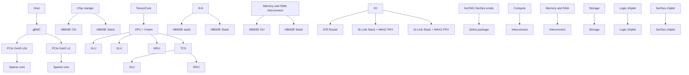
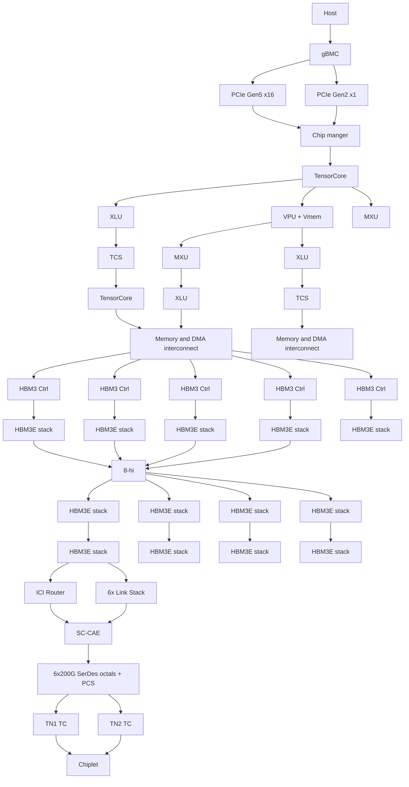

你是闲鱼资料类商品文案编辑，擅长把一份投研/行业/公司研报改写成适合闲鱼发布的商品说明。

【目标】
- 基于下面研报解析内容，生成一份可以复制到闲鱼商品详情里的中文文案。
- 风格参考用户提供的闲鱼对标笔记：标题直给、信息密度高、用途明确、适合人群明确、交付方式清楚。
- 语言要自然，像真实卖家发布，不要像公众号文章、小红书笔记或 AI 摘要。
- 不要使用太夸张的营销词，不要承诺收益，不要说“稳赚”“内幕”“必涨”。
- 可以适度口语化，但不要低俗。

【必须输出结构】
1. `闲鱼标题：` 一行，控制在 30 字以内，适合商品标题。
2. `商品描述：` 正文，适合直接粘贴到闲鱼详情页。
3. `Hashtag：` 一行，给 6-10 个平台可用标签，用 `#` 开头，空格分隔。

【严禁输出】
- 不要输出 `建议价格：`。
- 不要输出 `搜索关键词：`。
- 不要输出“搜索词”“关键词”“搜索关键词”等栏目。
- 不要给具体价格区间、成交承诺或价格建议。

【商品描述写法】
- 第一段：直接说明这是什么报告，页数/语言/主题/公司或行业。如果页数、日期、语言不确定，就不要编。
- 第二段：说明适合谁，比如投研、券商面试、PE/VC、行业研究、学习参考、写报告等。
- 第三段：用 3-5 个亮点 bullet，风格参考：
  ✅ 三大情景框架：DCF、P/ARR、EV/Sales
  ✅ 关键变量分析
  ✅ 估值逻辑、假设、终值占比等核心内容覆盖
  ✅ 适合准备 AI 相关面试、研究 AI 估值的同学
- 第四段：交付说明，参考：`资料为电子版 PDF，拍下后 24 小时内发网盘链接或邮箱。`
- 第五段：虚拟商品说明，参考：`电子类资料一经发货不退不换，有问题可以提前咨询。`
- 可以补一句：`需要其他报告也可以私聊，支持一站式咨询。`

【Hashtag 写法】
- 只输出平台相对安全、偏学习和资料属性的标签。
- 推荐从这些里选择：`#学习资料` `#研究笔记` `#学习笔记` `#行业研究` `#研报资料` `#资料整理` `#报告学习` `#案例研究`。
- 不要输出 `#财经` `#投资` `#股票` `#基金` `#理财` `#暴富` `#内幕` 等敏感标签。

【平台发布合规要求】
- 不要出现“投资建议”“买入”“卖出”“强烈推荐”“稳赚”“保本”“必涨”“抄底”“上车”“内幕”“翻倍”等金融操作或收益承诺表达。
- “投资”相关词尽量改成“投研”“研究”“观察”“学习参考”；如果必须保留，也要保持中性。
- 不要出现“独家”“原版”“内部”“无水印”“全网最低”“最全”“最强”“必看”等高风险或极限词。
- 不要写“关注”“点赞”“求关注”“评论区留言”等直接互动诱导。
- 不要承诺资料一定可用于获利、就业、通过面试或获得收益。

【合规与避坑】
- 默认避免出现具体投行品牌名，比如“GS”“GS”“MS”，统一写作“投行研报”或“投行研报”。
- 不要承诺研究或交易结果。
- 不要伪造页数、日期、作者、公司覆盖范围。研报未给出时就不写。
- 不要输出解释说明，只输出闲鱼文案本身。

【研报解析内容】
"""
# Global AI Trend Tracker

Global Markets Research

27 May 2026

EQUITY: TECHNOLOGY

# Google's next-gen AI network for TPUv8t / v8i...

...And implications for the AI networking value chain

# TPU v8t & v8i's networking architecture may lead to stronger demand for OCS and benefit Google's TPU supply chain

Google (GOOG US, Not rated) released its eighth-generation tensor processing unit (TPU) at its Cloud Next 2026 in April, and the company for the first time distinguished its TPU products into training (TPU 8t) and inference (TPU vi). TPU 8t improves large-scale pre-training performance with SparseCore cores and Virgo network topology, while TPU 8i is designed for real-time reasoning and complex decision-making, with CAE (Collectives Acceleration Engine) and new Boardfly topology solving the latency bottleneck of long context reasoning to a certain extent. We think the purpose-built networks for TPUv8t and v8i reflect the AI market trend of decoupling network architecture for training and inference, in order to better unlock their performance in different scenarios, while reducing cost and power consumption at the same time. We think Boardfly network brings incremental demand for optical circuit switches (OCS0 at both the scale-up and the scale-out level). Meanwhile, as a technology leader in optical networks, we expect Google's stronger TPU shipments of would accelerate its adoption of all the mainstream optical communication solutions, including 1.6T pluggable transceivers, NPO (near-field packaged optics) and CPO (co-packaged optics). We think this is positive for Google's TPU supply chain, including substrate and PCB suppliers such as VGT (300476 CH/2476 HK, Buy), as well as optical communication solution providers.

# Google introduced Virgo Network and Boardfly topology for TPU 8t and 8i, respectively, aiming at lower latency and higher bandwidth

Regarding networking solutions, TPU 8t still uses 3D Torus topology (similar to TPU v7) to connect chips at the scale-up level to form a pod with up to 9,600 cards, and we think that there are still 48 OCS in each pod, but the number of ports may increase to $300^{*}300$ (from 288\*288). Google introduced Virgo Network, a flat two-layer non-blocking topology, for TPU V8t scale-out network. According to the company, this new network architecture enables up to 4x increased data center network (DCN) bandwidth and uses high-radix switches that reduce network layers by allowing more ports per switch. Moreover, Google has designed a new network topology, called Boardfly, for the TPU 8i cluster that can connect up to 1,152 of chips. The network connects 8 boards via copper cabling and further scales to 36 groups (up to 1,024 active chips) linked through OCS.

# Growth of CPU demand accelerates in agentic era

In addition, both eighth-generation TPU chips will be working with Google's self-developed ARM-based Axion CPU as the main controller. We think CPUs may become the key to running large AI clusters in the future, due to the exponential growth of inference workloads. According to comments from Intel's CEO during the company's 1Q26 earnings call, the CPU-to-GPU attach rate used to be 1:8, which has increased to 1:4 now, and may increase to 1:1 in the future. We think this reflects growing demand for CPUs in AI clusters for the agentic era.

# Research Analysts

# China Technology

# Bing Duan - NIHK

bing.duan1@NOM.com

+852 2252 2141

# Joel Ying, CFA - NIHK

joel.ying@NOM.com

+852 2252 2153

# Introduction to TPU V8i & V8t

On 22 April 2026, Google released its eighth-generation TPU at the Cloud Next 2026 conference, which is divided into the TPU 8t training chip and the TPU 8i inference chip. From the perspective of Google's chip development path, the current divergence between training and inference architecture requirements is widening, with training clusters focusing on optimizing computing power and inference clusters focusing on optimizing HBM bandwidth and memory capacity. The current mainstream large language models (LLM) are all MoE architectures, which require long context reasoning and the chain of thought scheme, and the importance of communication efficiency, memory access speed, and low-latency synchronization between chips far exceeds that of single-chip computing power. Therefore, Google designed the training chip and the inference chip separately and optimized their internal architectures to achieve high computing performance and low latency for the training chip, and high memory and low power consumption for the inference chip.

Fig. 1: Development path of Google TPU 

<table><tr><td></td><td>TPU</td><td>TPU chips per superpod</td><td>Topology</td><td>ICI bandwidth per TPU chip</td><td>ICI optical transceiver</td><td>Optical lane rate</td><td>OCS</td></tr><tr><td>2018</td><td>v2</td><td>256</td><td>2D Torus</td><td>800GB/s</td><td>None</td><td>NA</td><td>None</td></tr><tr><td>2020</td><td>v3</td><td>1024</td><td>2D Torus</td><td>800GB/s</td><td>400G AOC</td><td>50G</td><td>None</td></tr><tr><td>2022</td><td>v4</td><td>4096</td><td>3D Torus</td><td>600GB/s</td><td>400G OSFP</td><td>50G</td><td>OCS</td></tr><tr><td>2023</td><td>v5p</td><td>8960</td><td>3D Torus</td><td>1200GB/s</td><td>800G OSFP</td><td>100G</td><td>OCS</td></tr><tr><td>2025</td><td>v7</td><td>9216</td><td>3D Torus</td><td>1200GB/s</td><td>800G OSFP</td><td>200G</td><td>OCS</td></tr><tr><td>2026</td><td>V8t</td><td>9600</td><td>3D Torus</td><td>2400GB/s</td><td>NA</td><td>400G</td><td>OCS</td></tr><tr><td>2026</td><td>V8i</td><td>1152</td><td>Boardfly</td><td>2400GB/s</td><td>NA</td><td>400G</td><td>OCS</td></tr></table>

Source: Google, NOM

TPU 8t improves large-scale pre-training performance with SparseCore and Virgo network topology. TPU 8i is designed for real-time reasoning and complex decision-making, and its CAE acceleration engine and new Boardfly topology solve the latency bottleneck of long context reasoning to a certain extent, allowing AI to evolve from single-next-word prediction to scene simulation and deep logical reasoning, and AI responses will become more timely and coherent. Supported by the computing power of Google's self-developed ARM Axion architecture CPUs, Boardfly topology has achieved a double leap in energy efficiency.

The SparseCore is a specialized accelerator designed to handle the irregular memory access patterns of embedding lookups. The MoE LLM only activates a small number of parameters each time, and although the hybrid expert technology is highly energy efficient, it produces a large number of irregular memory accesses. SparseCore technology is specifically designed to handle this task, working with the Matrix Multiply Unit (MXU) to keep the chip running at high load. Moreover, TPU 8t minimizes exposed vector operation time by implementing more balanced Vector Processing Unit (VPU) scaling. In terms of computing, TPU 8t introduces native 4-bit floating point (FP4) to overcome memory bandwidth bottlenecks, doubling MXU throughput while maintaining accuracy for LLMs even at lower-precision quantization. In terms of memory, TPU 8t adopts de-intermediated TPU Direct technology, and HBM memory can directly talk to the Network Interface Card (NIC), bypassing the CPU and DRAM, resulting in 10x faster memory access speed than the previous generation TPU. Overall, TPU 8t solves several key bottlenecks in training tasks: efficiently processing sparse data, reducing data handling overhead between memory and compute units, and optimizing network communication between large-scale chip clusters. Google claims that compared with the previous generation, the "performance per dollar" of the 8T in training scenarios can be improved by up to 2.7x.

Fig. 2: TPU 8t ASIC block diagram   

flowchart

Source: Google, NOM

TPU 8i is a new chip designed for inference tasks, with the most notable feature being the tilt of resource allocation towards memory. Although its peak hash rate is lower than that of 8t, it is equipped with a 384MB on-chip SRAM cache (3x that of 8t), higher HBM memory capacity (288GB), and greater bandwidth. Google claimed that TPU 8i can host a larger KV Cache entirely on silicon, significantly reducing the idle time of the cores during long-context decoding. In addition, when an LLM performs inference, chips need to frequently synchronize data and summarize results, a process called collective communication. Chains-of-thought require multiple computing cores to frequently synchronize intermediate results, and traditional synchronization operations have extremely high latency. Therefore, TPU 8i uses the CAE, which aggregates results across cores with near-zero latency, specifically accelerating the reduction and synchronization steps required during auto-regressive decoding and chain-of-thought processing. For each TPU 8i chip, there are two Tensor Cores (TC) on-core dies and one CAE on the chiplet die, replacing four SparseCores (SCs) on core dies in the previous-generation Ironwood TPU. CAE further reduces the on-chip latency of collectives by 5x. Lower latency per collective operation means less time spent waiting, directly contributing to higher throughput required to run millions of agents concurrently.

Fig. 3: TPU 8i ASIC block diagram   

flowchart

Source: Google, NOM

Fig. 4: Comparison of TPU v7, TPU v8t and TPU v8i 

<table><tr><td></td><td>TPU v7</td><td>TPU 8t</td><td>TPU 8i</td></tr><tr><td>Primary workload</td><td>High-performance ASIC for training and inference</td><td>Focus on large-scale training</td><td>Focus on large-scale inference</td></tr><tr><td>Design of die</td><td>Dual die</td><td>Single die</td><td>Dual die</td></tr><tr><td>HBM capacity</td><td>192GB HBM3E</td><td>216GB HBM</td><td>288GB HBM</td></tr><tr><td>HBM bandwidth</td><td>7.3TB/s</td><td>6.5TB/s</td><td>8.6TB/s</td></tr><tr><td>on-chip SRAM</td><td>-</td><td>128MB</td><td>384MB</td></tr><tr><td>Core feature</td><td>SparseCore, shared memory</td><td>SparseCore and LLM decoder engine, native FP4, Vrigo network</td><td>CAE, large SRAM, Boardfly network</td></tr><tr><td>Pod size</td><td>9216</td><td>9600</td><td>1152</td></tr><tr><td>Network topology</td><td>3D Torus</td><td>3D Torus</td><td>Boardfly</td></tr><tr><td>Peak FP4 PFLOPs</td><td>4.6</td><td>12.6</td><td>10.1</td></tr></table>

Source: Google, NOM

With the explosive growth of inference workloads, CPUs are the key to determining the efficiency and cost of AI systems. Data orchestration and memory management of inference tasks are highly dependent on the CPU, and the "logical scheduling" and "serial processing" used by AI Agents to perform complex tasks such as reading databases, running code, and parsing documents are the expertise of CPUs. According to comments from the Intel CEO during the company's 1Q26 earnings call, the CPU-to-GPU attach rate used to be 1:8, which has increased to 1:4 now, and may increase to 1:1 in the future. We think this reflects growing demand for CPU in AI clusters for agentic era.

Axion is Google's first custom ARM architecture-based CPU designed specifically for data centers, announced in 2024. For AI inference, Axion's dedicated optimizations can significantly boost performance, enabling AI workloads to run faster and more efficiently, according to management. The Axion product portfolio now includes three options: N4A, C4A, and C4A metal. Compared to virtual machines using mainstream x86 architecture CPUs, N4A offers twice the cost-performance ratio and leads in energy efficiency by up to 80% per watt, according to Google. In the TPU v8 series, Google is the first to use the Axion CPU as the main computing header, effectively reducing data preprocessing latency and ensuring the TPU computing engine runs at full capacity.

Fig. 5: AI inference performance on Axion CPU

# AI Inference Performance on Google Axion

Prompt Encoding & Tokens Generated /Sec

# Gemma-3-12b

Arm Neoverse based Google Axion

c4a-highmem with 48 vCPU

$$
+29 \%
$$

Better Performance over

AMD Turin

c4d-highmem-48 vCPU

$$
+23 \%
$$

Better Performance over

Intel Granite Rapids

c4-highmem-48 vCPU

Model Format: w8a8 | Benchmark: Throughput Serving | Serving Framework: vLLM | Concurrency: 1 and 16

(Compared to x86 based Instances)

Source: Google, NOM

# TPU V8i & V8t networking solutions

TPU 8t still uses 3D Torus topology to connect chips at the scale-up level to form a pod. The pod volume has increased to 9,600 cards (vs. 9216 cards for Ironwood), and the single-card scale-up bidirectional bandwidth is 19.2Tb (2x that of Ironwood), and we think that there are still 48 OCS in each pod, but the number of ports may increase to 300\*300. To support the massive data requirements of TPU 8t, Google introduced Virgo Network for scale-out networking. This new networking architecture enables up to 4x increased data center network (DCN) bandwidth on TPU 8t training over DCN. Built on high-radix switches that reduce network layers by allowing more ports per switch, Virgo Network employs a flat, two-layer non-blocking topology. Compared with traditional datacenter networks, this significantly reduces latency by minimizing network tiers. It features a multi-planar design with independent control domains to connect TPU 8t chips. The TPU 8t racks also connect with the Jupiter north-south fabric to access compute and memory services. Virgo Network can connect more than 1 

[中间内容因长度限制已省略]

bai Financial Services Authority) in the United Arab Emirates (‘UAE’) or a ‘Market Counterparty’ or a ‘Business Customer’ (as defined by the Qatar Financial Centre Regulatory Authority) in the State of Qatar (‘Qatar’) by NOM Saudi Arabia, NIplc or any other member of the NOM Group, as the case may be. Neither this document nor any copy thereof may be taken or transmitted or distributed, directly or indirectly, by any person other than those authorised to do so into Saudi Arabia or in the UAE or in Qatar or to any person other than ‘Authorised Persons’, ‘Exempt Persons’ or ‘Institutions’ located in Saudi Arabia or a ‘Market Counterparty’ or a ‘Professional Client’ in the UAE or a ‘Market Counterparty’ or a ‘Business Customer’ in Qatar. Any failure to comply with these restrictions may constitute a violation of the laws of the UAE or Saudi Arabia or Qatar.

For report with reference of TAIWAN public companies or authored by Taiwan based research analyst:

THIS DOCUMENT IS SOLELY FOR REFERENCE ONLY. You should independently evaluate the investment risks and are solely responsible for your investment decisions. NO PORTION OF THE REPORT MAY BE REPRODUCED OR QUOTED BY THE PRESS OR ANY OTHER PERSON WITHOUT WRITTEN AUTHORIZATION FROM NOM GROUP. Pursuant to Operational Regulations Governing Securities Firms Recommending Trades in Securities to Customers and/or other applicable laws or regulations in Taiwan, you are prohibited to provide the reports to others (including but not limited to related parties, affiliated companies and any other third parties) or engage in any activities in connection with the reports which may involve conflicts of interests. INFORMATION ON SECURITIES / INSTRUMENTS NOT EXECUTABLE BY NOM INTERNATIONAL (HONG KONG) LTD., TAIPEI BRANCH IS FOR INFORMATIONAL PURPOSES ONLY AND IS NOT BE CONSTRUED AS A RECOMMENDATION OR A SOLICITATION TO TRADE IN SUCH SECURITIES / INSTRUMENTS.

This material may not be distributed in Indonesia or passed on within the territory of the Republic of Indonesia or to persons who are Indonesian citizens (wherever they are domiciled or located) or entities of or residents in Indonesia in a manner which constitutes a public offering under the laws of the Republic of Indonesia. The securities mentioned in this document may not be offered or sold in Indonesia or to persons who are citizens of Indonesia (wherever they are domiciled or located) or entities of or residents in Indonesia in a manner which constitutes a public offering under the laws of the Republic of Indonesia.

An individual name printed next to NOI on the front page of a research report indicates that this document is a translation of a research report issued by NOI in the PRC. In all other cases, this document is prepared by NOM Group or its subsidiary or affiliate (collectively, “Offshore Issuers”) that is not licensed in the PRC to provide securities research. This research report is not approved or intended to be circulated in the PRC. The A-share related analysis (if any) is not produced for any persons located or incorporated in the PRC. The recipients should not rely on any information contained in this research report in making investment decisions and Offshore Issuers take no responsibility in this regard. NO PART OF THIS MATERIAL MAY BE (I) COPIED, PHOTOCOPIED, REPRODUCED OR DUPLICATED IN ANY FORM, BY ANY MEANS; OR (II) REDISSEMINATED, REPUBLISHED OR REDISTRIBUTED WITHOUT THE PRIOR WRITTEN CONSENT OF A MEMBER OF THE NOM GROUP. If this document has been distributed by electronic transmission, such as e-mail, then such transmission cannot be guaranteed to be secure or error-free as information could be intercepted, corrupted, lost, destroyed, arrive late or incomplete, or contain viruses. The sender therefore does not accept liability (in negligence or otherwise, and in whole or in part) for any errors or omissions in the contents of this document, which may arise as a result of electronic transmission. If verification is required, please request a hard-copy version.

The NOM Group manages conflicts with respect to the production of research through its compliance policies and procedures (including, but not limited to, Conflicts of Interest, Chinese Wall and Confidentiality policies) as well as through the maintenance of Chinese Walls and employee training.

Additional information regarding the methodologies or models used in the production of any investment recommendations contained within this document is available upon request by contacting the Research Analysts of NOM listed on the front page. Disclosures information is available upon request and disclosure information is available at the NOM Disclosure web page:

http://go.NOMnow.com/research/m/Disclosures

Copyright © 2026 NOM International (Hong Kong) Ltd., Hong Kong. All rights reserved.
"""
