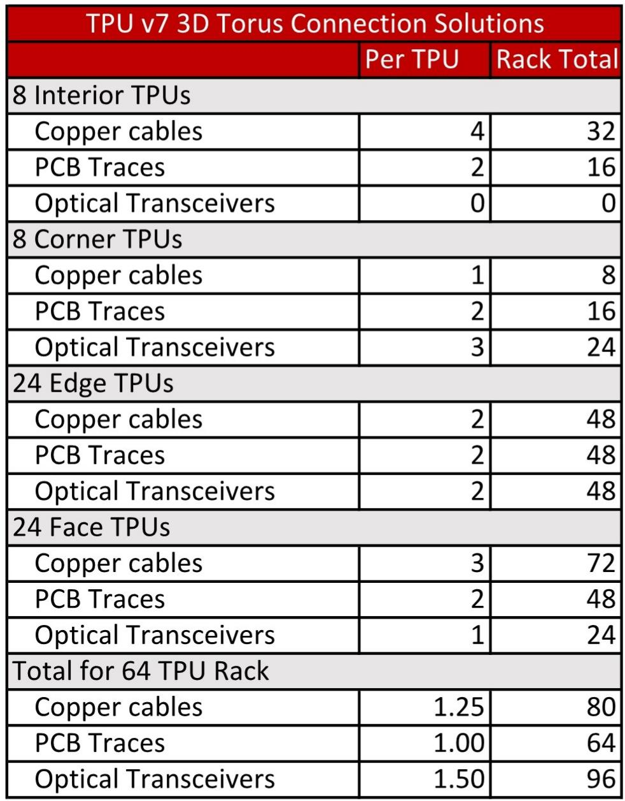
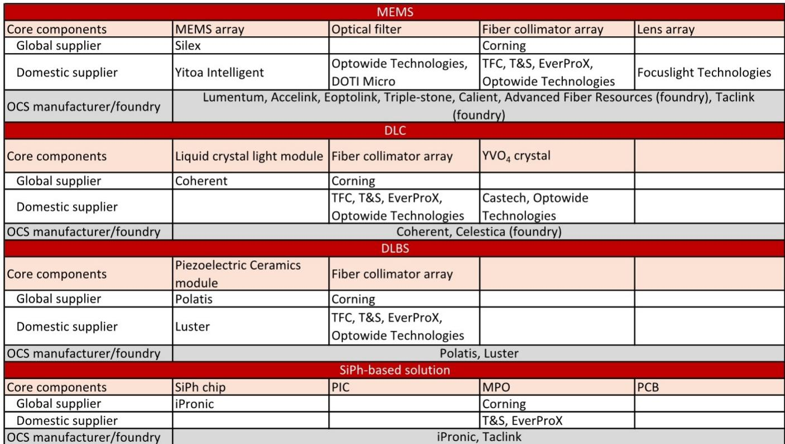
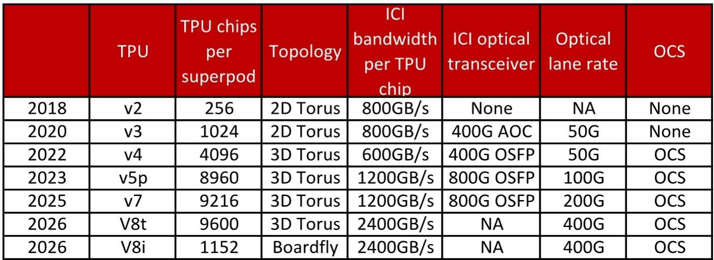

# Google’s TPU v8 Split Proves That AI Networking Is No Longer a One-Size-Fits-All Market

The era of a unified AI accelerator architecture is over. When Google introduced its eighth-generation Tensor Processing Unit at Cloud Next 2026, it did more than unveil new silicon. It formally acknowledged what industry insiders have suspected for at least two years: training and inference have diverged so sharply in their computational demands that a single chip design can no longer serve both effectively. Google’s decision to split its TPU line into the v8t for training and the v8i for inference is not merely a product segmentation move. It is a strategic signal that the networking infrastructure supporting AI must also bifurcate. The implications for the optical networking supply chain, for CPU demand in AI clusters, and for the competitive dynamics of hyperscaler architecture are profound. Investors and strategists who continue to view AI networking as a homogeneous market risk missing the most important architectural shift since the adoption of the transformer model.

The decision to decouple the network topology for each chip type—Virgo for the v8t and Boardfly for the v8i—reflects a fundamental truth about modern AI workloads. Training clusters need to move enormous volumes of data across tens of thousands of chips with minimal latency for gradient synchronization. Inference clusters, particularly those handling chain-of-thought reasoning and agentic workflows, need to minimize collective communication latency above all else. These are not just different performance targets. They are different physics. And they demand different network fabrics.

This report from a global investment bank’s research division provides the deepest available look into how Google is engineering its way through this divergence. The analysis reveals specific topology choices, port counts, and optical switch deployments that have direct implications for the entire AI networking value chain. More importantly, it raises questions that no single report can fully answer: How far will the training-inference decoupling go? Will other hyperscalers follow Google’s lead? And what does the rise of the CPU as a critical AI cluster component mean for the balance of power in the data center?

## The Training-Inference Divergence Is Now Hardwired into Silicon Architecture

The most important single fact in this report is not a performance number. It is the architectural decision to give the v8i a 384MB on-chip SRAM cache—three times that of the v8t—while accepting a lower peak hash rate. This is a deliberate tradeoff. Google has concluded that inference workloads, particularly those involving long-context reasoning and agentic chains of thought, are memory-bandwidth constrained rather than compute-constrained. The v8i’s larger HBM capacity (288GB versus 216GB) and higher HBM bandwidth (8.6TB/s versus 6.5TB/s) confirm this priority.

The corollary is that the v8t is optimized for the opposite regime. Its native FP4 support, SparseCore accelerator, and de-intermediated TPU Direct memory architecture are all designed to maximize throughput for large-scale pre-training, where the bottleneck is moving data through the compute pipeline rather than keeping a large KV cache resident on chip. The report’s claim that the v8t delivers up to 2.7x better performance per dollar in training scenarios is striking, but the real insight is that this improvement comes from architectural specialization, not from a general-purpose advance.

What this means for the networking layer is clear. Training networks must prioritize bisection bandwidth and scale-out capacity. The Virgo network’s two-layer non-blocking topology, capable of connecting over one million TPU chips, is designed for exactly this purpose. Inference networks, by contrast, must prioritize latency at the collective communication level. The Boardfly topology, with its copper cabling at the board level and OCS links at the group level, is a fundamentally different design philosophy. The report notes that Boardfly can connect up to 1,152 chips, a far smaller pod size than the v8t’s 9,600 chips, because inference clusters do not need the same massive scale-out. They need tight, low-latency coupling.

## Optical Circuit Switches Are the Hidden Beneficiary of the Boardfly Topology

The report’s analysis of optical circuit switch (OCS) demand is where the strategic implications become concrete. Google has used OCS in its TPU pods since the v4 generation, but the Boardfly topology for the v8i introduces a new role for these switches. In the v8t’s 3D Torus, OCS serves as a scale-out interconnect within each pod. In the v8i’s Boardfly, OCS connects 36 groups of chips, each group containing up to 1,024 active chips. This is a different function: it is a scale-up interconnect that must handle the latency-sensitive collective operations required for chain-of-thought inference.

The report estimates that each v8t pod still uses 48 OCS, but with ports increasing from 288x288 to 300x300. The v8i pods, with their smaller card count, may use fewer OCS per pod, but the total number of v8i pods deployed could be significantly higher if inference workloads continue their explosive growth. The net effect is likely to be incremental demand for OCS at both the scale-up and scale-out levels. More importantly, the report argues that Google’s stronger TPU shipments will accelerate adoption of all mainstream optical communication solutions, including 1.6T pluggable transceivers, near-field packaged optics (NPO), and co-packaged optics (CPO).

The open question that the report does not fully answer is whether this OCS demand is sustainable or a transitional phenomenon. If Google or other hyperscalers eventually adopt fully optical switching at the chip level, the role of OCS as a separate component could diminish. But for the next three to five years, the report’s conclusion that OCS benefits from the training-inference decoupling appears well-supported. The supply chain implications are direct: substrate and PCB suppliers, as well as optical communication solution providers, are positioned to capture this growth.

## The CPU Is Becoming a Critical Bottleneck in AI Clusters, and That Changes the Economics

One of the most underappreciated insights in this report is the growing importance of the CPU in AI inference clusters. The report cites Intel’s CEO stating that the CPU-to-GPU attach rate has moved from 1:8 to 1:4 and may reach 1:1 in the future. This is not a minor trend. It implies that for every GPU or TPU in a cluster, there may soon be one CPU handling data orchestration, memory management, and serial processing tasks. The report explicitly ties this to the rise of agentic AI, where agents must perform complex, sequential tasks such as reading databases, running code, and parsing documents.

Google’s use of its own Axion ARM-based CPU as the main controller for the TPU v8 series is a direct response to this trend. The report notes that Axion offers twice the cost-performance ratio of mainstream x86 CPUs and up to 80% better energy efficiency per watt. If these claims hold in production deployments, they represent a significant competitive advantage for Google. But they also raise a strategic question for the broader industry: if CPUs become as important as accelerators in AI clusters, does the balance of power shift back toward traditional CPU vendors, or do hyperscalers vertically integrate further by designing their own CPUs?

The report does not resolve this question, but it provides enough data to frame the debate. The v8i’s reliance on the CAE (Collectives Acceleration Engine) to reduce on-chip latency by 5x is a hardware-level response to a problem that CPUs traditionally handle in software. The fact that Google chose to embed this function in the TPU itself, rather than offloading it to the CPU, suggests that the boundary between accelerator and CPU is blurring. The long-term winner may be the vendor that can most effectively integrate these functions, whether that is a hyperscaler with a custom chip or a traditional semiconductor company with a broad portfolio.

## What the Report Does Not Fully Answer: The Competitive Response and the Optical Tipping Point

For all its depth, this report leaves several critical questions open. The first is competitive response. Google is not the only hyperscaler pursuing a training-inference split. Amazon’s Trainium and Inferentia, and Microsoft’s partnership with AMD and its own Maia chip, represent similar strategies. But the report does not compare these approaches or assess whether Google’s architectural choices are superior. The Virgo network’s ability to connect 134,000 chips in a single network architecture is impressive, but it is not clear whether this scale is necessary for most training workloads or whether it introduces diminishing returns in terms of cost and complexity.

The second open question is the optical tipping point. The report argues that Google’s TPU shipments will accelerate adoption of 1.6T transceivers, NPO, and CPO. But it does not quantify the inflection point at which these technologies become economically dominant over existing copper and lower-speed optical solutions. The v8i’s Boardfly topology uses copper cabling at the board level, suggesting that copper still has a role in low-latency, short-reach connections. The transition to full optical interconnect at the chip level may be further away than some optimists assume.

The third question is the most strategic: will the training-inference decoupling become an industry standard, or is it specific to Google’s internal architecture? The report notes that the current generation of large language models all use Mixture-of-Experts architectures, which create irregular memory access patterns that benefit from specialized hardware like SparseCore. If the industry shifts to a different model architecture, the optimization priorities could change. The report’s analysis is rigorous, but it is necessarily backward-looking, based on current model trends rather than future architectural shifts.

## A Decision Framework for Investors and Strategists

Given the report’s findings, decision-makers should evaluate opportunities in the AI networking value chain using a three-part framework.

First, assess the degree of architectural specialization in the target market. Companies that provide components for both training and inference networks—such as OCS manufacturers, optical transceiver vendors, and PCB suppliers—benefit from diversification. Companies that are specialized in one segment face higher risk if the balance shifts. The report’s data on port counts, pod sizes, and topology choices provides a basis for estimating the relative size of each segment.

Second, evaluate the CPU-accelerator attach rate as a leading indicator of cluster economics. The 1:4 ratio cited by Intel is already a significant shift from the historical 1:8. If the ratio moves to 1:2 or 1:1, the total addressable market for data center CPUs could double or triple relative to current expectations. This has implications for CPU vendors, memory manufacturers, and power infrastructure providers.

Third, monitor the adoption timeline for advanced optical solutions. The report’s claim that Google’s TPU shipments will accelerate adoption of 1.6T and CPO is plausible, but the actual pace depends on cost curves and manufacturing yields. Investors should look for concrete deployment milestones rather than extrapolating from architectural specifications alone.

The report’s most valuable contribution is not any single data point but the framework it provides for thinking about AI networking as a set of distinct, diverging markets. The old assumption that a single network architecture could serve all AI workloads is no longer valid. The new reality is that training and inference are becoming separate engineering problems, with separate hardware solutions and separate supply chain dynamics. Understanding this divergence is the first step to identifying the winners and losers in the next phase of AI infrastructure buildout.

---

Join the community to read the full report and review the original charts.

*This article is for learning and discussion only and does not constitute investment advice.*

Personal reading notes and learning share only. Not investment advice.

