# GLOBAL ECONOMICS ANALYST

# Assessing Global Growth Risks from Middle Eastern Supply Shortages

Three months into the Iran War and despite ongoing negotiations, transits through the Strait of Hormuz remain depressed. While global growth has so far held up reasonably well, concerns persist that it is just a matter of time before accumulating supply shortages lead to outsized reductions in activity. In this Global Economics Analyst we evaluate the economic impacts of a risk scenario where persistent closure of the strait leads to an indefinite loss of Middle Eastern commodity supplies.

We continue to expect that most of the demand destruction required to clear markets will be driven by prices, which have risen sharply for highly exposed products. This is especially true for oil, where we continue to see our growth rules of thumb as appropriate. That said, if supply constraints were to start binding for oil, the growth impacts could rise beyond the $1 - 1.5\%$ implied by our severely adverse price scenario.

The bigger risk of outright stockouts probably resides with non-oil commodities, where markets are less global and supply is often regional. Non-oil commodity supply from the Middle East only accounts for 1.3% of global GDP, but under an extreme assumption in which each input is critical and output in each industry declines in proportion to the binding commodity supply restriction—what economists call a Leontief production function—supply losses could drive very large reductions to output.

There are three reasons why we would expect the growth hit to remain more contained, however. First, the implied GDP hit falls sharply when we exclude inputs that account for a trivial share of production. Second, reallocation of scarce inputs from low- to high-value-add uses materially lowers the drag. Third, even modest substitutability across inputs lowers it further. Under reasonable assumptions for each channel, we estimate the direct growth headwinds from non-oil supply disruptions could lower global GDP by $0.4 - 0.5\%$ , with downstream supply impacts moderately amplifying these impacts.

Data so far appears to align with these predictions, as anecdotes suggest that demand destruction has skewed toward lower-income countries and lower-value added industries, and industrial production data has yet to show signs of binding supply constraints. Moreover, supply-constrained product prices have retraced somewhat in recent weeks.

# Megan Peters

+44(20)7051-2058

megan.l.peters@gs.com

GS International

# Assessing Global Growth Risks from Middle Eastern Supply Shortages

Three months into the Iran War and despite ongoing negotiations, transits through the Strait of Hormuz remain depressed, with reported vessel counts down over $90\%$ from normal levels. Our baseline commodity and economic forecasts assume a normalization in Gulf exports by end-June, but risks appear increasingly skewed towards a longer supply disruption.

Exports from the Persian Gulf account for sizeable shares of global trade in several key industrial and agricultural inputs—most notably oil, but also fertilizers, natural gas, refined products, petrochemicals, steel and aluminum (Exhibit 1). While we argued shortly after the start of the war that the supply shock would be manageable and mostly limited to energy, the extended supply disruption has raised concerns that accumulating shortages and production bottlenecks could be more disruptive to the global economy.

Against this backdrop, in this Global Economics Analyst we model an indefinite loss of Middle Eastern commodity supplies to estimate the GDP headwind if supply constraints increasingly become binding.

Exhibit 1: Exports from the Middle East Account for a Large Share of Global Trade in Certain Key Industrial and Agricultural Inputs, Although Their Share of Global GDP is Smaller   
Middle East Goods Exports to RoW   
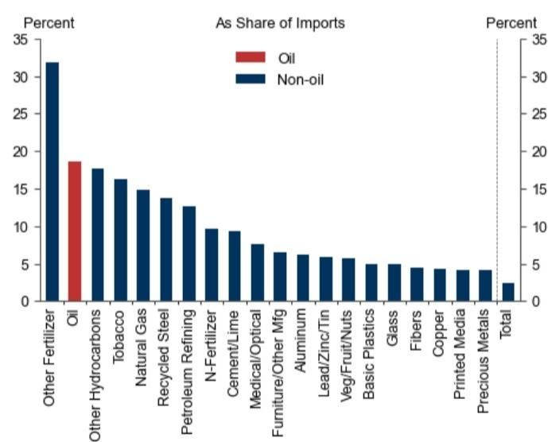

bar

| Category | As Share of Imports (%) |
|---|---|
| Other Fertilizer | 32 |
| Oil | 18.5 |
| Other Hydrocarbons | 17.5 |
| Tobacco | 16.0 |
| Natural Gas | 14.5 |
| Recycled Steel | 13.5 |
| Petroleum Refining | 12.5 |
| N-Fertilizer | 9.5 |
| Cement/Lime | 9.0 |
| Medical/Optical | 7.5 |
| Furniture/Other Mfg | 6.5 |
| Aluminum | 6.0 |
| Lead/Zinc/Tin | 5.5 |
| Veg/Fruit/Nuts | 5.5 |
| Basic Plastics | 4.5 |
| Glass | 4.5 |
| Fibers | 4.0 |
| Copper | 4.0 |
| Printed Media | 4.0 |
| Precious Metals | 4.0 |
| Total | 2.0 |

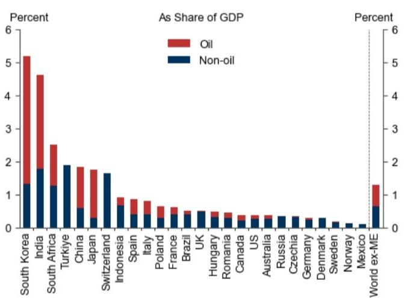

bar_stacked

| Country/Region | Oil (%) | Non-oil (%) |
|---|---|---|
| South Korea | 2.8 | 1.3 |
| India | 2.5 | 1.8 |
| South Africa | 0.6 | 1.3 |
| Türkiye | 0.0 | 1.9 |
| China | 1.4 | 0.6 |
| Japan | 1.7 | 0.3 |
| Switzerland | 0.0 | 1.6 |
| Indonesia | 0.3 | 0.7 |
| Spain | 0.4 | 0.4 |
| Italy | 0.4 | 0.4 |
| Poland | 0.5 | 0.3 |
| France | 0.3 | 0.4 |
| Brazil | 0.2 | 0.4 |
| UK | 0.3 | 0.5 |
| Hungary | 0.3 | 0.4 |
| Romania | 0.3 | 0.4 |
| Canada | 0.2 | 0.3 |
| US | 0.2 | 0.3 |
| Australia | 0.2 | 0.3 |
| Russia | 0.2 | 0.3 |
| Czechia | 0.2 | 0.3 |
| Germany | 0.2 | 0.3 |
| Denmark | 0.2 | 0.3 |
| Sweden | 0.1 | 0.2 |
| Norway | 0.1 | 0.1 |
| Mexico | 0.1 | 0.1 |
| World ex-ME | 0.8 | 0.6 |

Source: Exiobase, GS Global Investment Research

We continue to expect that most of the demand destruction required to clear markets will be driven by prices, which have risen sharply for highly exposed products (Exhibit 2). Crude oil prices have risen by up to $50\%$ , with even larger increases for refined products like gasoline, jet fuel and diesel (Exhibit 2, left). At the same time, base chemical prices rose more than $60\%$ from the start of the conflict to April, the fastest rate ever recorded. Spot prices for helium—a byproduct of natural gas extraction and an indispensable input for cryogenic applications including semiconductor production—are reported to have doubled since the start of the conflict (though the majority of the industry works on contract pricing that is up much less). Sulfur and sulfuric acid, key inputs for copper refining, phosphate fertilizer and titanium dioxide production, are up over $60\%$ , while methanol—a critical feedstock for a range of petrochemicals including formaldehyde

and acetic acid—is up $40\%$ (Exhibit 2, right).

Exhibit 2: Commodity Prices Have Surged In Response to the Supply Shock   
Reported Price Increases Since Feb 27, 2026   
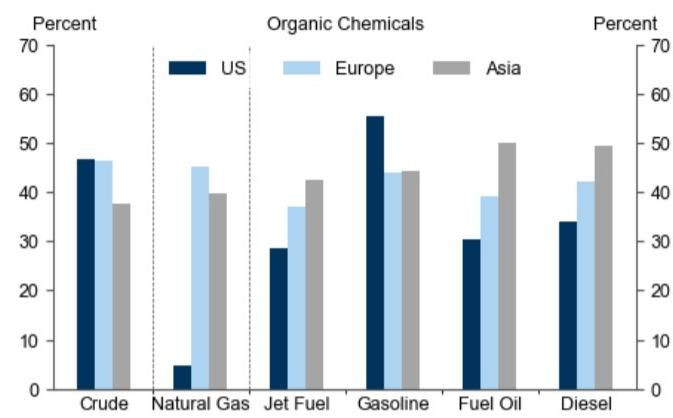

bar

| Category | US (%) | Europe (%) | Asia (%) |
|---|---|---|---|
| Crude | 47 | 46 | 38 |
| Natural Gas | 5 | 45 | 40 |
| Jet Fuel | 29 | 37 | 43 |
| Gasoline | 56 | 44 | 44 |
| Fuel Oil | 31 | 39 | 50 |
| Diesel | 34 | 42 | 50 |
Organic Chemicals
| Percent: US | Organic Chemicals
| Percent: Europe | Organic Chemicals
| Percent: Asia |
The chart displays two vertical bars for each category. The first bar is labeled 'Natural Gas', and the second bar is labeled 'Gasoline'. The legend indicates the color coding: dark blue for US, light blue for Europe, gray for Asia.

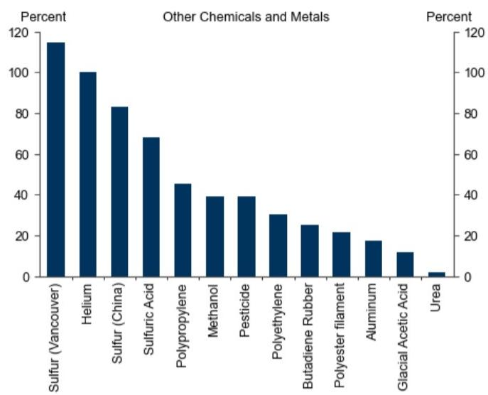

bar

Other Chemicals and Metals
| Category | Percent (%) |
|---|---|
| Sulfur (Vancouver) | 116 |
| Helium | 100 |
| Sulfur (China) | 83 |
| Sulfuric Acid | 69 |
| Polypropylene | 45 |
| Methanol | 39 |
| Pesticide | 39 |
| Polyethylene | 30 |
| Butadiene Rubber | 25 |
| Polyester filament | 22 |
| Aluminum | 18 |
| Glacial Acetic Acid | 12 |
| Urea | 2 |

Source: ICE, Platts, Haver Analytics, GS FICC and Equities, Trading Economics, CNBC, GS Global Investment Research

Our expectation that price increases will destroy enough demand to avoid outright stockouts applies especially to oil. While oil inventories are being drawn down rapidly, under our baseline forecasts OECD commercial oil inventories remain above pre-shale averages, although commercial products inventories are lower. Against this backdrop, we continue to see our standard rules of thumb—particularly those adjusted for natural gas price increases—as providing a valid guide to the hit to GDP from higher energy prices. Currently our growth estimates and baseline commodity forecasts imply a 1/2pp hit to GDP, although the drag could rise dramatically if supply remains curtailed for much longer (Exhibit 3).

Exhibit 3: Crude Inventories Remain Above Historical Levels Despite Rapid Drawdowns; Our Rules of Thumb Capture the Growth Impact of Demand Destruction via Higher Prices   
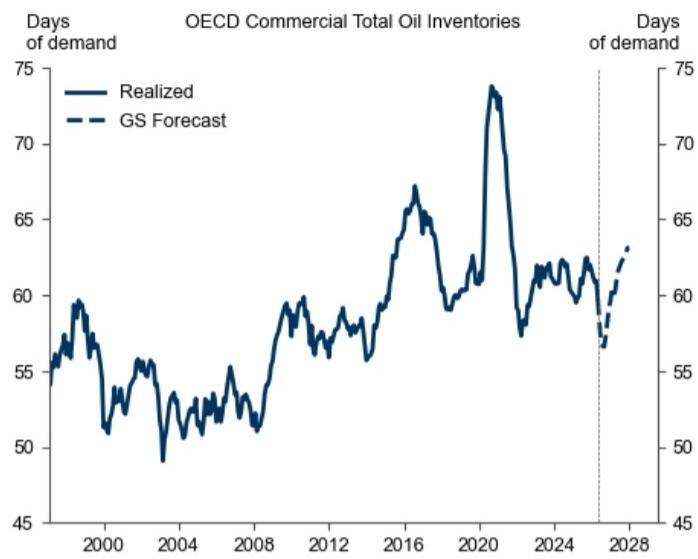

line

| Year | Realized | GS Forecast |
|------|----------|-------------|
| 2000 | ~58      | ~56         |
| 2004 | ~51      | ~50         |
| 2008 | ~53      | ~52         |
| 2012 | ~59      | ~58         |
| 2016 | ~67      | ~66         |
| 2020 | ~74      | ~73         |
| 2024 | ~62      | ~61         |
| 2028 | ~63      | ~62         |

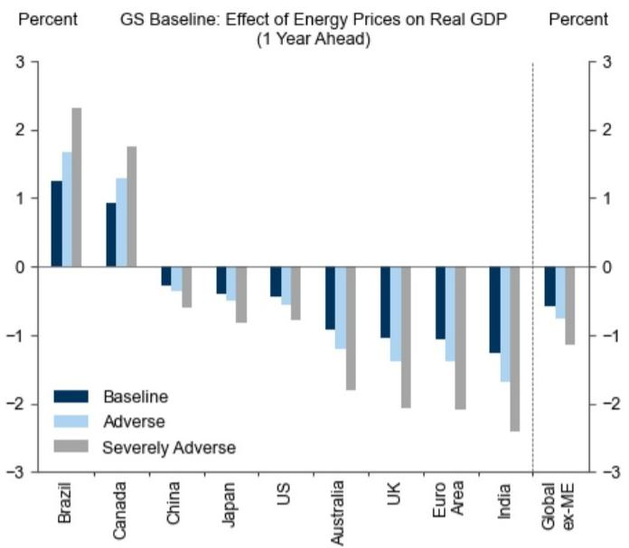

bar

GS Baseline: Effect of Energy Prices on Real GDP (1 Year Ahead)
| Country/Region | Baseline (%) | Adverse (%) | Severely Adverse (%) |
| :--- | :--- | :--- | :--- |
| Brazil | 1.25 | 1.65 | 2.35 |
| Canada | 0.95 | 1.3 | 1.75 |
| China | -0.2 | -0.4 | -0.6 |
| Japan | -0.4 | -0.5 | -0.8 |
| US | -0.4 | -0.6 | -0.7 |
| Australia | -0.9 | -1.1 | -1.8 |
| UK | -1.0 | -1.3 | -2.0 |
| Euro Area | -1.05 | -1.35 | -2.1 |
| India | -1.35 | -1.65 | -2.5 |
| Global ex-ME | -0.6 | -0.85 | -1.1 |

Source: GS Global Investment Research

# A Quantity-Based Approach to the GDP Impacts from Supply Reductions

A complementary approach to assessing the growth downside from supply disruptions is to look at quantity losses rather than price increases. This approach is agnostic to the price increases necessary to lower commodity demand enough to match supply, while potentially providing useful insights into where GDP hits could emerge due to supply shortages when markets are less global and regional dynamics matter more.

To implement this quantity-based approach, we leverage the Exiobase IO tables, which measure the supply linkages for 200 products in 163 industries across 44 countries. These tables allow us to measure not only the direct impacts from loss of Middle Eastern commodity supplies, but also the indirect effects on downstream industries. In all subsequent analysis we use these mapped linkages to simulate a complete loss of Middle Eastern supply without considering potential offsets from inventory drawdowns.

To start, Exhibit 4 shows the potential impact of a complete loss of Middle Eastern crude oil supply under the assumption that each downstream sector reduces its output in proportion to its direct and indirect Middle Eastern oil consumption. This exercise implies that around $2\%$ of global GDP is dependent on Middle Eastern oil supply—reflecting a reliance on oil both as a source of energy and petrochemical feedstocks (over $95\%$ of manufactured goods contain petrochemicals)—with South Korea $(-8\%)$ , India $(-7\%)$ and Mainland China $(-5\%)$ especially exposed to oil supply losses. As noted above, however, oil stockouts are less likely given the global nature of oil markets where an outsized price increase would likely be sufficient to destroy demand.

Exhibit 4: A Complete Loss of Middle Eastern Crude Oil Supply Would Likely Lower Global GDP by 2%   
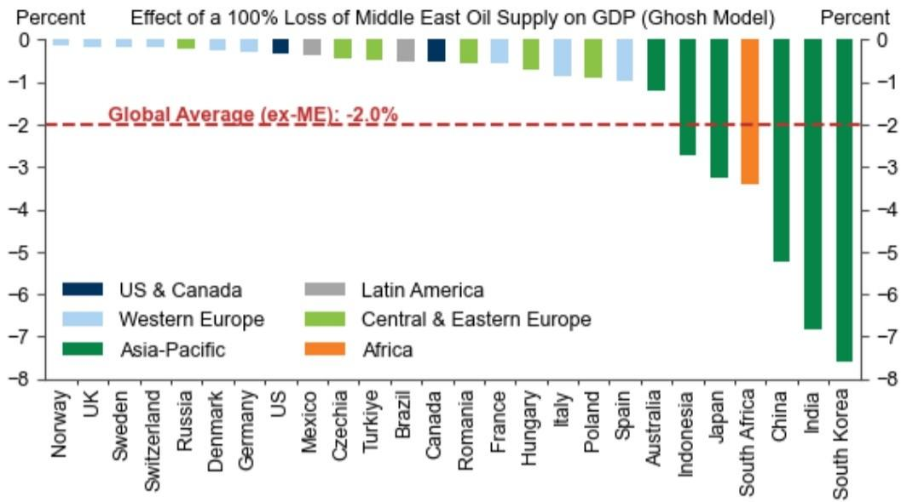

bar

Effect of a 100% Loss of Middle East Oil Supply on GDP (Ghosh Model)
| Country | Region | Percent |
| :--- | :--- | :--- |
| Norway | US & Canada | -0.1 |
| UK | Western Europe | -0.1 |
| Sweden | Western Europe | -0.1 |
| Switzerland | Western Europe | -0.1 |
| Russia | Central & Eastern Europe | -0.2 |
| Denmark | Central & Eastern Europe | -0.2 |
| Germany | Central & Eastern Europe | -0.2 |
| US | US & Canada | -0.3 |
| Mexico | Latin America | -0.4 |
| Czechia | Latin America | -0.5 |
| Türkiye | Central & Eastern Europe | -0.6 |
| Brazil | Latin America | -0.7 |
| Canada | US & Canada | -0.8 |
| Romania | Central & Eastern Europe | -0.9 |
| France | Western Europe | -1.0 |
| Hungary | Central & Eastern Europe | -1.1 |
| Italy | Western Europe | -1.2 |
| Poland | Central & Eastern Europe | -1.3 |
| Spain | Western Europe | -1.4 |
| Australia | Asia-Pacific | -1.5 |
| Indonesia | Asia-Pacific | -2.8 |
| Japan | Asia-Pacific | -3.2 |
| South Africa | Asia-Pacific | -3.5 |
| China | Asia-Pacific | -5.2 |
| India | Asia-Pacific | -7.0 |
| South Korea | Asia-Pacific | -8.0 |
Global Average (ex-ME): -2.0%

The Ghosh model assumes that each downstream sector reduces its output in proportion to its direct and indirect consumption of the shocked inputs.

Source: Exiobase, GS Global Investment Research

For other refined products and chemicals, supply and stockout concerns are more pressing. Our commodities strategists see the largest shortage risks for petrochemical feedstocks (particularly naphtha), diesel and jet fuel. Shortage risks are particularly acute for diesel, where demand is highly price-inelastic given its importance in industrial applications and limited available substitutes. Across countries, South Africa, India and Taiwan appear most at-risk given large reductions in local product supply and relatively low crude stocks. On the chemicals side, some Asian petrochemical plants have already declared force majeure, and our analysts warn that supply disruptions could extend through to 2027 even if the Strait of Hormuz opens imminently.

We therefore repeat the analysis in Exhibit 4 for non-oil exports from the Middle East in Exhibit 5. Indefinite loss of supply of these products would reflect an $0.7\%$ loss of global non-oil imports and $1.3\%$ hit to global GDP—led by declines in India $(-3.6\%)$ , Turkiye $(-3.3\%)$ and South Korea $(-3.1\%)$ —under the assumption that downstream output is proportionally affected.

Exhibit 5: Downstream GDP Exposure to Middle East Goods Supply Ranges from $0.3\%$ in the US to Over $3\%$ in India, Turkiye and South Korea   
Effect of a 100% Loss of Middle East Non-Oil Goods Supply on GDP (Ghosh Model)   
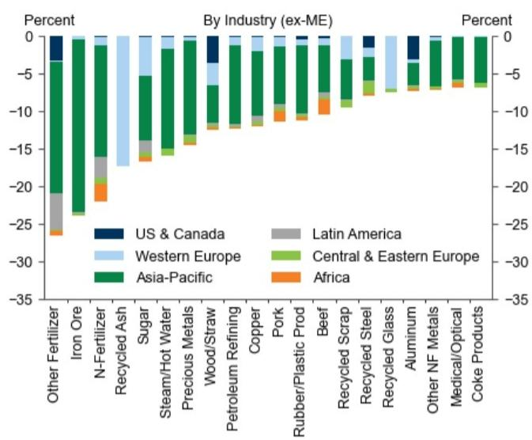

bar_stacked

| Category | US & Canada (%) | Latin America (%) | Western Europe (%) | Central & Eastern Europe (%) | Asia-Pacific (%) | Africa (%) |
|---|---|---|---|---|---|---|
| Other Fertilizer | -1.5 | -20.0 | -18.0 | -24.0 | -23.0 | -27.0 |
| Iron Ore | 0.0 | 0.0 | 0.0 | -24.0 | -23.0 | 0.0 |
| N-Fertilizer | 0.0 | -12.0 | -16.0 | -24.0 | -23.0 | -21.0 |
| Recycled Ash | 0.0 | 0.0 | -18.0 | -24.0 | -23.0 | -19.0 |
| Sugar | 0.0 | -14.0 | -16.0 | -24.0 | -23.0 | -17.0 |
| Steam/Hot Water | 0.0 | 0.0 | -16.0 | -24.0 | -23.0 | -17.0 |
| Precious Metals | 0.0 | 0.0 | -16.0 | -24.0 | -23.0 | -17.0 |
| Wood/Straw | 1.5 | 0.0 | -14.0 | -24.0 | -23.0 | -17.0 |
| Petroleum Refining | 0.0 | 0.0 | -14.0 | -24.0 | -23.0 | -17.0 |
| Copper | 0.0 | 0.0 | -14.0 | -24.0 | -23.0 | -17.0 |
| Pork | 0.0 | 0.0 | -14.0 | -24.0 | -23.0 | -17.0 |
| Rubber/Plastic Prod | 0.0 | 0.0 | -14.0 | -24.0 | -23.0 | -17.0 |
| Beef | 0.0 | 0.0 | -14.0 | -24.0 | -23.0 | -17.0 |
| Recycled Scrap | 0.0 | 0.0 | -14.0 | -24.0 | -23.0 | -17.0 |
| Recycled Steel | 1.5 | 0.0 | -14.0 | -24.0 | -23.0 | -17.0 |
| Recycled Glass | 1.5 | 1.5 | -14.0 | -24.0 | -23.0 | -17.0 |
| Aluminum | 1.5 | 1.5 | -14.0 | -24.0 | -23.0 | -17.0 |
| Other NF Metals | 1.5 | 1.5 | -14.0 | -24.0 | -23.0 | -17.0 |
| Medical/Optical Products (Coke Products) | 1.5 | 1.5 | -14.0 | -24.0 | -23.0 | -17.0 |
By Industry (ex-ME) Percent
-

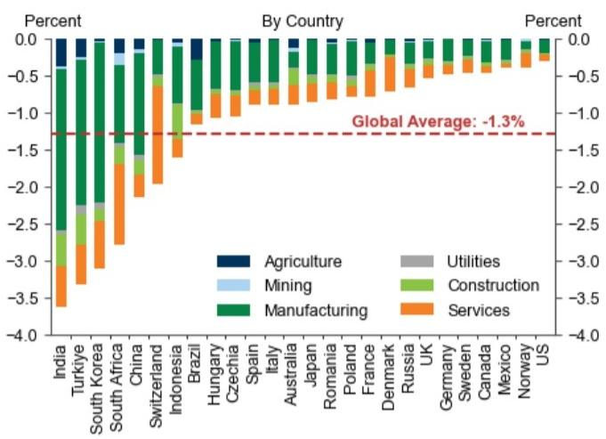

bar_stacked

| Country | Agriculture (%) | Mining (%) | Manufacturing (%) | Services (%) | Utilities (%) |
|---|---|---|---|---|---|
| India | -0.2 | -0.4 | -2.8 | -3.5 | 0.0 |
| Turkey | -0.1 | -0.3 | -2.6 | -3.3 | 0.0 |
| South Korea | -0.1 | -0.2 | -2.4 | -3.1 | 0.0 |
| South Africa | -0.1 | -0.2 | -2.2 | -2.9 | 0.0 |
| China | -0.1 | -0.2 | -2.1 | -2.7 | 0.0 |
| Switzerland | -0.1 | -0.2 | -2.0 | -2.5 | 0.0 |
| Indonesia | -0.1 | -0.2 | -1.9 | -2.3 | 0.0 |
| Brazil | -0.1 | -0.2 | -1.8 | -2.1 | 0.0 |
| Hungary | -0.1 | -0.2 | -1.7 | -1.9 | 0.0 |
| Czechia | -0.1 | -0.2 | -1.6 | -1.8 | 0.0 |
| Spain | -0.1 | -0.2 | -1.5 | -1.7 | 0.0 |
| Italy | -0.1 | -0.2 | -1.4 | -1.6 | 0.0 |
| Australia | -0.1 | -0.2 | -1.3 | -1.5 | 0.0 |
| Japan | -0.1 | -0.2 | -1.2 | -1.4 | 0.0 |
| Romania | -0.1 | -0.2 | -1.1 | -1.3 | 0.0 |
| Poland | -0.1 | -0.2 | -1.0 | -1.2 | 0.0 |
| France | -0.1 | -0.2 | -0.9 | -1.1 | 0.0 |
| Denmark | -0.1 | -0.2 | -0.8 | -1.0 | 0.0 |
| Russia | -0.1 | -0.2 | -0.7 | -0.9 | 0.0 |
| UK | -0.1 | -0.2 | -0.6 | -0.8 | 0.0 |
| Germany | -0.1 | -0.2 | -0.5 | -0.7 | 0.0 |
| Sweden | -0.1 | -0.2 | -0.4 | -0.6 | 0.0 |
| Canada | -0.1 | -0.2 | -0.3 | -0.5 | 0.0 |
| Mexico | -0.1 | -0.2 | -0.2 | -0.4 | 0.0 |
| Norway | -0.1 | -0.2 | -0.1 | -0.3 | 0.0 |
| US | -0.1 | -0.2 | 0.0 | 0.1 | 0.2 |
Global Average: -1.3%

The Ghosh model assumes that each downstream sector reduces its output in proportion to its direct and indirect consumption of the shocked inputs.   
Source: Exiobase, GS Global Investment Research

While these losses are notable, a key lesson from the supply disruptions after the pandemic is that product shortages can create critical chokepoints that propagate through supply chains, thereby reducing output by a larger amount than the share of lost inputs. These dynamics have been of particular concern to investors, since amplified supply reductions (particularly due to limited chemical supplies) could lead to much sharper increases in prices of downstream goods, as was the case for global semiconductor shortages in 2021-2022.

To shed light on these concerns, we repeat our analysis using a bottleneck model of production (formally, a Leontief production function) where a 10% loss of supply of any input leads to a 10% reduction in output in the receiving sector, regardless of whether other inputs are available. Under this more extreme assumption, each input is critical and cannot be substituted, and production is constrained by the input made most scarce due to the loss of Middle East supply. Under this extreme assumption, the hit to global GDP would rise to 27%. Moreover, if we allow these effects to cascade along supply chains, then almost all output would eventually be lost. This is because if just one industry relies entirely on the Middle East for supply of any one of its inputs (no matter how small a share of production it accounts for), that industry, and all industries which depend on it, would cease production under a Leontief production function. Given how interconnected global supply chains are, these effects quickly propagate throughout the global economy.

Exhibit 6: In an Extreme Scenario Where Goods from the Middle East Are Critical for Production and No Opportunities for Substitution Exist, the Growth Impact Would Be Severe   
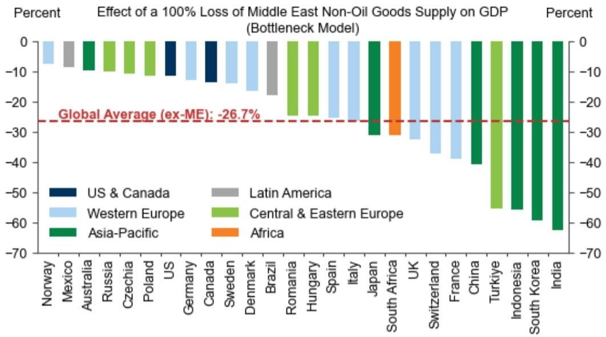

bar

Effect of a 100% Loss of Middle East Non-Oil Goods Supply on GDP (Bottleneck Model)
| Country | Region | Percent Change (%) |
| :--- | :--- | :--- |
| Norway | US & Canada | -5 |
| Mexico | Western Europe | -8 |
| Australia | Asia-Pacific | -8 |
| Russia | Central & Eastern Europe | -8 |
| Czechia | Central & Eastern Europe | -8 |
| Poland | Asia-Pacific | -8 |
| US | US & Canada | -12 |
| Germany | Western Europe | -14 |
| Canada | US & Canada | -14 |
| Sweden | Western Europe | -14 |
| Denmark | Western Europe | -16 |
| Brazil | Latin America | -18 |
| Romania | Central & Eastern Europe | -26.7 |
| Hungary | Central & Eastern Europe | -26.7 |
| Spain | Western Europe | -26.7 |
| Italy | Western Europe | -26.7 |
| Japan | Asia-Pacific | -32 |
| South Africa | Asia-Pacific | -32 |
| UK | Western Europe | -34 |
| Switzerland | Western Europe | -38 |
| France | Western Europe | -38 |
| China | Asia-Pacific | -42 |
| Turkey | Central & Eastern Europe | -55 |
| Indonesia | Asia-Pacific | -55 |
| South Korea | Asia-Pacific | -59 |
| India | Asia-Pacific | -62 |
Global Average (ex-ME): -26.7%

Source: Exiobase, GS Global Investment Research

# Many Margins of Adjustment

While the bottleneck model highlights the possibility that binding supply constraints could be very problematic, we expect the impacts on the overall economy will be much more limited since households and businesses have many margins of adjustment.

As a recent precedent, when Russian gas supplies to Europe were completely cut off, the resulting impact on GDP was far less severe than some forecasters had initially feared, largely because firms and households adapted their behaviour in response to the shock more effectively than expected. As highlighted by Moll et al (2023)'s retrospective on the German gas shortages, the most pessimistic forecasters anticipated a $12\%$ hit to GDP due to the loss of supply, while in reality Germany experienced only a slight technical recession. Significantly, adjustments by households and firms meant that the hit to industrial production was largely contained within the most exposed sectors, with the German economy avoiding the cascading effects highlighted above which could wipe out entire supply chains. In the analysis that follows, we therefore focus primarily on the first-round effects of supply shortages.

Even if non-oil supply from the Middle East were permanently curtailed, we would expect the global economy to respond similarly to limit the impacts on activity. Below, we highlight three key margins of adjustment that could mitigate the effects of a complete loss of exports from the Persian Gulf.

# Mechanism 1: Cutting consumption of 'non-critical' inputs

The assumption in the bottleneck model that all inputs are critical for production is very strong, and for some inputs, supply losses are likely to have only a tiny effect on output. As an example, the Japanese food manufacturer Calbee has switched to

black-and-white packaging due to shortages of naphtha, a key ingredient in ink production.

To quantify how rapidly the hit to global GDP diminishes after allowing for non-critical inputs, in Exhibit 7 we maintain our bottleneck model but relax the critical input assumption for inputs that account for less than a certain percentage of gross output. This exercise demonstrates that a large portion of the growth drag in the worst-case scenario is driven by industries with trivial exposure to Middle East supply. Raising the bottleneck threshold to just $0.01\%$ of gross output would reduce the growth hit from $27\%$ to $10\%$ , while a threshold of $1\%$ would imply only a $6\%$ drag. In the analysis that follows, we continue to impose a $0.01\%$ threshold, which we see as a conservative assumption. Allowing for non-critical goods also eliminates many of the cascading supply chain effects. If we account for all forward linkages, raising the bottleneck threshold to $1\%$ reduces the growth hit by around a third, and raising it to $5\%$ lowers it by over $95\%$ .

Exhibit 7: The Growth Impact Would Be Much Smaller If Goods That Account for a Trivial Share of Overall Inputs are Non-Critical for Production   
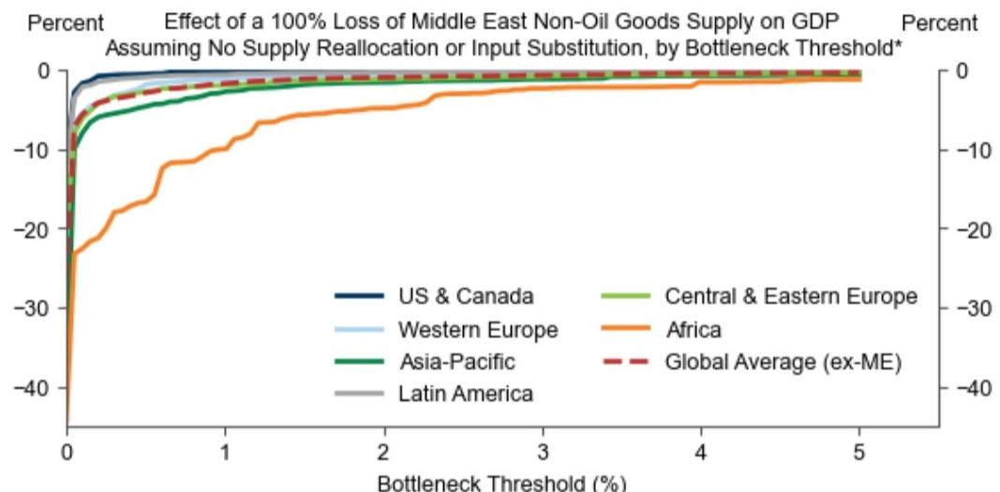

line

| Bottleneck Threshold (%) | US & Canada | Western Europe | Asia-Pacific | Latin America | Central & Eastern Europe | Africa | Global Average (ex-ME) |
| ------------------------ | ----------- | -------------- | ------------ | ------------- | ------------------------ | ------ | ---------------------- |
| 0                        | 0           | 0              | 0            | 0             | 0                        | -40    | -40                    |
| 1                        | ~-2         | ~-3            | ~-4          | ~-5           | ~-6                      | ~-20   | ~-3                    |
| 2                        | ~-3         | ~-4            | ~-5          | ~-6           | ~-7                      | ~-10   | ~-4                    |
| 3                        | ~-4         | ~-5            | ~-6          | ~-7           | ~-8                      | ~-8    | ~-5                    |
| 4                        | ~-5         | ~-6            | ~-7          | ~-8           | ~-9                      | ~-6    | ~-6                    |
| 5                        | ~-6         | ~-7            | ~-8          | ~-9           | ~-10                     | ~-5    | ~-7                    |

\*Bottleneck threshold refers to the minimum direct requirement of an intermediate input (as a share of gross output) for it to be deemed critical for production.   
Source: Exiobase, GS Global Investment Research

# Mechanism 2: Supply reallocation

Second, we expect higher prices will help reallocate resources towards their most productive uses, thereby diminishing the overall GDP hit.

For example, helium is a crucial input for the semiconductor industry but around 5-7% of global supply is used for party balloons. Higher prices would likely redirect helium supply from partygoers to semiconductor manufacturers with little cost to output. Such reallocation dynamics are already playing out. In Asia, our chemicals analysts have flagged that production cuts due to petrochemical shortages have mostly been concentrated to low value-added sectors like textiles and packaging. Similarly, Europe is successfully redirecting US jet fuel flows away from Asian EMs by bidding up prices.

In Exhibit 8 (left), we present the results of a simple model (maintaining our bottleneck production function) where supply is optimally reallocated across industries to minimize the hit to GDP. We consider three scenarios: no reallocation, within-country reallocation and global reallocation. In our model, reallocating resources within countries dampens the growth hit from $10\%$ to just $0.4\%$ , while frictionless global reallocation reduces the hit to less than $0.1\%$ .

Exhibit 8 zooms in on the loss of all phosphate fertilizer supply from the Middle East to China to illustrate why reallocation significantly dampens output losses. In this illustration, we assume that fertilizers can be reallocated within China but do not allow for import substitution. We then highlight sectors that are reallocated more or less fertilizer (compared to a scenario with no reallocation). As shown in the chart, supply is diverted away from industries where fertilizer accounts for a large share of costs but generates lower value added (e.g., vegetables and nuts) toward industries where fertilizer accounts for a tiny share of costs but higher value added (e.g., plant-based fibers). While this example does not consider the welfare costs of a reduction in food supply (as well as the likely significant upward pressure on food prices) that may also factor into supply allocation decisions, it highlights how reallocation can help address supply shortages in some industries.

Exhibit 8: Diverting Supply to Higher Value-Added Industries Could Reduce the Global GDP Hit from $10\%$ to Less than $1\%$   
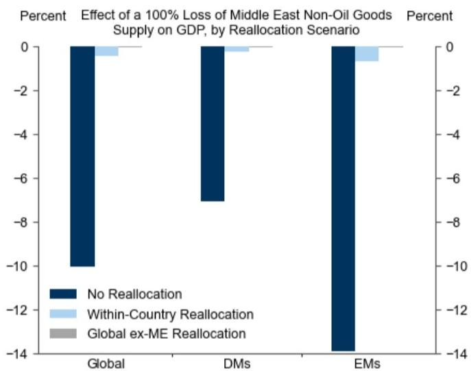

bar

Effect of a 100% Loss of Middle East Non-Oil Goods Supply on GDP, by Reallocation Scenario
| Category | No Reallocation (%) | Within-Country Reallocation (%) | Global ex-ME Reallocation (%) |
|---|---|---|---|
| Global | -10 | -0.5 | 0 |
| DMs | -7 | -0.2 | 0 |
| EMs | -14 | -0.8 | 0 |

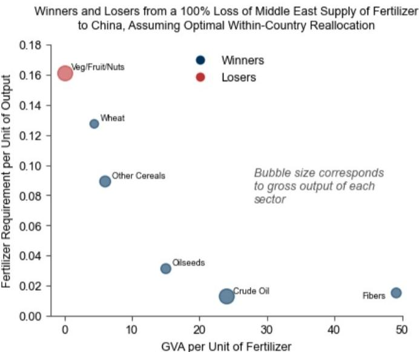

scatter

Winners and Losers from a 100% Loss of Middle East Supply of Fertilizer to China, Assuming Optimal Within-Country Reallocation
| Category | GVA per Unit of Fertilizer | Fertilizer Requirement per Unit of Output |
|---|---|---|
| Veg/Fruit/Nuts | 0 | 0.16 |
| Wheat | 4 | 0.13 |
| Other Cereals | 5 | 0.09 |
| Oilseeds | 15 | 0.03 |
| Crude Oil | 24 | 0.015 |
| Fibers | 49 | 0.015 |
Bubble size corresponds to gross output of each sector

Note: We consider a higher bottleneck threshold of $1\%$ for ease of exposition.   
Source: Exiobase, GS Global Investment Research

In practice, the amount of reallocation will depend on individual products. Some products like aluminum have deep global markets that will facilitate reallocation across countries and industries, whereas regional supply dynamics and contract structures will limit natural gas reallocation in some countries. Nevertheless, the results above highlight that supply reallocation can be very effective in dampening the overall GDP hit from loss of Middle East supply. Moreover, supply reallocation can play a key role in dampening the cascading effects of supply losses. Amending our model to account for all downstream linkages still yields less than a $0.2\%$ hit to global growth in a world where global supply can be reallocated freely.

# Mechanism 3: Substitution between intermediate inputs

Third, firms may be able to substitute between some intermediate inputs.

For instance, basic plastics such as polyethylene can be replaced by paper, glass or aluminum packaging. Environmental concerns and legislation in recent years have already prompted firms to find alternatives to single-use plastic: some more innovative solutions include supermarkets in Asia wrapping produce with banana leaves, and

cosmetics brands switching from traditional liquid shampoos to solid versions packaged in cardboard $^{1}$ . The loss of plastics (and upstream feedstocks such as naphtha) could accelerate the rollout of such measures while leaving GDP little changed.

Admittedly, some products are likely less substitutable at the micro level. For example, it is difficult for individual petrochemical plants to substitute away from their respective feedstocks. Likewise, there are few satisfactory substitutes for sulfuric acid in copper refining and ore leaching. That said, at the industry level, the elasticity of substitution will likely be higher than it is for any individual plant, since firms employ varied production technologies, enabling supply reallocation within industries which can moderate growth impacts.

To model substitutability, in Exhibit 9, we calibrate a constant elasticity of substitution (CES) production function to match the observed input-output linkages. As the elasticity of substitution increases from zero (Leontief) to 1 (Cobb-Douglas), the global growth hit declines from $10\%$ to just less than $5\%$ , with most of this reduction resulting from allowing for only a modest degree of substitutability.

Exhibit 9: Even a Small Degree of Substitutability Between Imports Would Dampen the GDP Hit Substantially   
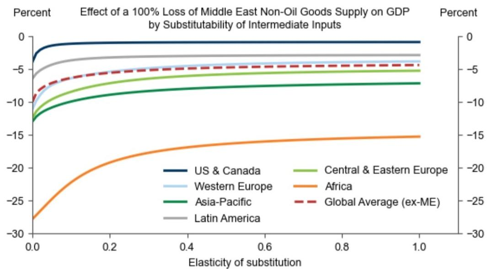

line

| Elasticity of substitution | US & Canada | Western Europe | Asia-Pacific | Latin America | Central & Eastern Europe | Africa | Global Average (ex-ME) |
| -------------------------- | ----------- | -------------- | ------------ | ------------- | ------------------------ | ------ | ---------------------- |
| 0.0                        | -2          | -8             | -12          | -6            | -10                      | -28    | -9                     |
| 0.2                        | -1          | -6             | -10          | -5            | -8                       | -20    | -7                     |
| 0.4                        | -1          | -5             | -9           | -4            | -7                       | -18    | -6                     |
| 0.6                        | -1          | -5             | -8           | -4            | -6                       | -16    | -5                     |
| 0.8                        | -1          | -5             | -8           | -4            | -6                       | -15    | -5                     |
| 1.0                        | -1          | -5             | -8           | -4            | -6                       | -15    | -5                     |

Source: Exiobase, GS Global Investment Research

# Combining Margins of Adjustment

To assess the magnitude of the potential growth hit after accounting for these margins of adjustment, we make reasonable assumptions on the bottleneck threshold, ease of reallocation and substitutability of inputs, guided by the academic literature and our own judgement. $^{2}$

Under these assumptions, we estimate that a complete loss of non-oil goods supply from the Middle East would directly lower global GDP by 0.4-0.5% (incremental to the hit from higher oil and gas prices shown in Exhibit 3), with the largest hits in Turkiye (2.2%) and India (1.1%). DMs such as the US and Norway would face much smaller growth hits (0.1% or less), reflecting their higher-value added production and lower dependence on Middle Eastern supply. While fully accounting for all downstream linkages would lead to a moderately larger GDP hit—simulations suggest up to three times as large—these impacts remain much smaller than the extreme scenario shown in Exhibit 6 where all goods are critical, not substitutable, and no reallocation occurs.

While there is admittedly significant uncertainty how active each of these margins of adjustment will be in practice and we remain concerned that non-energy supply reductions could pose incremental challenges to growth in 2026H2 (particularly in Asia, consistent with the predictions in Exhibit 10) our results highlight that adjustments to production and pre-existing supply chains can meaningfully dampen economic losses.

Exhibit 10: Under Reasonable Assumptions, We Estimate that a Complete and Persistent Loss of Non-Oil Goods Supply from the Middle East Would Directly Lower Global GDP by $0.4 - 0.5\%$   

bar

Effect of a 100% Loss of Middle East Non-Oil Goods Supply on GDP
| Country | Region | Percent Change (with Bottleneck Threshold) | Global Average (ex-ME) |
|---|---|---|---|
| Norway | US & Canada | -0.05 | -0.46 |
| US | Western Europe | -0.08 | -0.46 |
| Germany | Mexico | -0.12 | -0.46 |
| Sweden | Western Europe | -0.15 | -0.46 |
| Russia | Western Europe | -0.18 | -0.46 |
| Japan | Western Europe | -0.22 | -0.46 |
| Switzerland | Western Europe | -0.25 | -0.46 |
| Hungary | Western Europe | -0.28 | -0.46 |
| Romania | Western Europe | -0.32 | -0.46 |
| Czechia | Western Europe | -0.35 | -0.46 |
| UK | Western Europe | -0.38 | -0.46 |
| Italy | Western Europe | -0.42 | -0.46 |
| Canada | US & Canada | -0.45 | -0.46 |
| Poland | Western Europe | -0.48 | -0.46 |
| Spain | Western Europe | -0.52 | -0.46 |
| France | Western Europe | -0.55 | -0.46 |
| Denmark | Western Europe | -0.58 | -0.46 |
| Australia | Asia-Pacific | -0.62 | -0.46 |
| China | Asia-Pacific | -0.65 | -0.46 |
| Indonesia | Asia-Pacific | -0.7 | -0.46 |
| South Africa | Africa | -1.15 | -0.46 |
| Brazil | Latin America | -0.75 | -0.46 |
| South Korea | Asia-Pacific | -1.18 | -0.46 |
| India | Asia-Pacific | -1.22 | -0.46 |
| Turkeye | Central & Eastern Europe | -2.15 | -0.46 |
Effect of a 100% Loss of Middle East Non-Oil Goods Supply on GDP
Global Average (ex-ME): -0.46

Source: Exiobase, GS Global Investment Research

Our results also have implications for potential price increases. While prices of directly affected commodities will likely lead to significant upward inflation pressures, if adjustments keep downstream goods production mostly intact, extremely large price increases may be mostly avoided. For example, combining the implied reduction in Exhibit 10 with our typical goods supply elasticity (-0.8) implies only 0.4pp upward pressure on core inflation from chemical and refined product shortages, incremental to the impact from higher energy prices (which we expect will raise global headline inflation by 1.0pp and core inflation by 0.3pp). While latent chokepoints leading to outsized price increases could still emerge, these results support our long-standing view that energy prices will remain the main driver of inflation.

# What to Watch

As the conflict evolves, we will be closely watching business surveys as an early signal of supply chain stress. Manufacturing suppliers' delivery times have lengthened across countries over the last three months—Euro area delivery times saw the largest increase since 2022 in April—with commentary attributing this to the conflict in the Middle East. The New York Fed's Global Supply Chain Pressure Index—which incorporates signals from the manufacturing PMIs, as well as additional information on freight costs—also surged in April to its highest level since the pandemic. Initial PMI numbers for May point to ongoing delays in supply chains, with modest relief in Australia and Japan following large upticks in April (Exhibit 11).

Exhibit 11: Business Surveys Point to Emerging Supply Chain Stress   
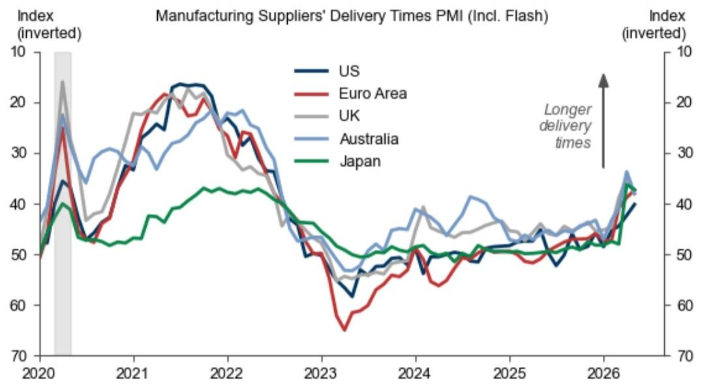

line

| Year | US  | Euro Area | UK  | Australia | Japan |
|------|-----|-----------|-----|-----------|-------|
| 2020 | 50  | 50        | 50  | 50        | 50    |
| 2021 | 25  | 25        | 25  | 25        | 25    |
| 2022 | 20  | 20        | 20  | 20        | 20    |
| 2023 | 50  | 50        | 50  | 50        | 50    |
| 2024 | 50  | 50        | 50  | 50        | 50    |
| 2025 | 50  | 50        | 50  | 50        | 50    |
| 2026 | 40  | 40        | 40  | 40        | 40    |

Source: Haver Analytics, GS Global Investment Research

That said and consistent with our model results above, anecdotes suggest that production cutbacks so far have been skewed toward low value-added sectors and countries (Exhibit 12). Looking ahead, we will be watching closely for new anecdotes of output reductions further up the value chain. We will also be monitoring the industrial production (IP) data for signs that supply shocks are broadening out across supply chains, although these numbers are reported with more of a lag. Where we do have more timely IP data, the April numbers surprised notably to the downside in China, but with weakness mostly limited to sectors directly exposed to exports from the Middle East. Conversely, industrial production was stronger than expected in the US, consistent with our view that the US will remain relatively insulated from supply disruptions due to its limited dependence on Middle East exports and its ability to outbid poorer economies.

Exhibit 12: Anecdotal Evidence Suggests Supply Constraints May Be Starting to Bind in Some Sectors 

<table><tr><td>Industry</td><td>Country/Region</td><td>Summary</td></tr><tr><td rowspan="4">Petrochemicals</td><td>India</td><td>- Reliance Industries cut aromatics production, which could result in a loss of 75,000 tonnes of paraxylene producer, according to ICIS estimates.- Bharat Petroleum Corporation Ltd halted production of acrylic acid and butyl acrylate at its Kochi plant.- The Gas Authority of India shit down its high-density polyethylene (HDPE) and linear low-density polyethylene (LLDPE) units in Uttar Pradesh.- Indian Oil Corp Ltd shut a polypropylene unit in Paradip amid polypropylene shortages.- Deepak Phenolics declared force majeure on its phenol and acetone plants.</td></tr><tr><td>Indonesia</td><td>- Indonesian petrochemical manufacturer PT Chandra Asri Pacific declared force majeure</td></tr><tr><td>Taiwan</td><td>- Taiwan&#x27;s Formosa Petrochemical announced the implementation of force majeure on certain petrochemical products, including ethylene and propylene</td></tr><tr><td>South Korea</td><td>- Yeochun NCC, the nation&#x27;s largest ethylene producer, and other petrochemical manufacturers declared force majeure.</td></tr><tr><td>Textiles</td><td>India</td><td>- Textile weaving units in Surat have decided to restrict operations to a single 12-hour shift per day to curb production.</td></tr><tr><td rowspan="2">Fertilizers/Urea</td><td>India</td><td>- Manufacturers in India, including top producer India Farmers Fertiliser Cooperative Ltd, have shut down some of their facilities or moved up annual maintenance.</td></tr><tr><td>Bangladesh</td><td>- Bangladesh Chemical Industries Corporation has shut four out of five of its urea factories due to gas rationing.</td></tr><tr><td>Steel</td><td>Europe</td><td>- ArcelorMittal and several other European long steel producers suspended sales of rebar, sections and wire rod.</td></tr><tr><td>Air Travel</td><td>Worldwide</td><td>- A number of airlines globally have announced flight reductions in response to higher jet fuel prices.</td></tr></table>

Source: ICIS, Bloomberg, Quantum Commodity Intelligence, Eurometal, GS Global Investment Research

To more systematically track reports of production shutdowns, in Exhibit 13 we count the number of Bloomberg articles relating to both supply disruptions and specific regions. Following a surge in news articles at the start of the conflict, the news flow around production bottlenecks has slowed somewhat in recent weeks. While this may partly reflect ‘news fatigue’, we believe the retracing partly reflects a transition from panic-buying in the early stages of the conflict to destocking, while demand destruction is likely also playing a role in rebalancing markets and alleviating concerns around quantity constraints. Firms may have also started to find solutions to circumvent some of the logistical challenges which arose at the onset of the conflict.

Exhibit 13: News Reports of Supply Disruptions Have Slowed Somewhat in Recent Weeks but Remain Elevated   
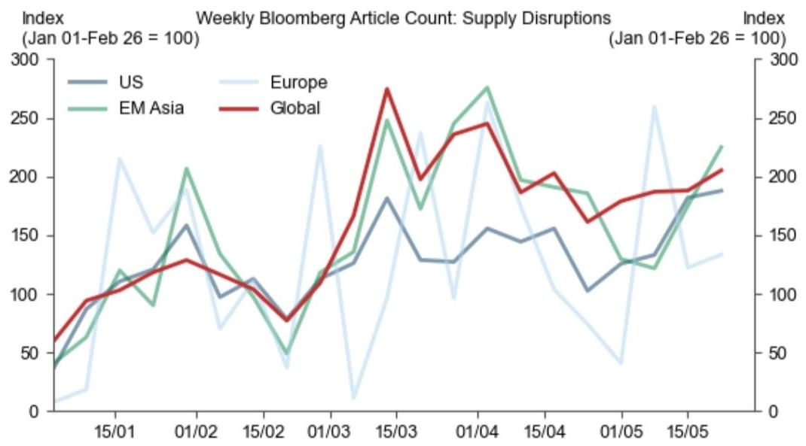

line

| Date   | US  | EM Asia | Global | Europe |
|--------|-----|---------|--------|--------|
| 15/01  | 100 | 120     | 90     | 220    |
| 01/02  | 160 | 210     | 130    | 180    |
| 15/02  | 110 | 50      | 80     | 40     |
| 01/03  | 120 | 130     | 170    | 230    |
| 15/03  | 180 | 250     | 280    | 170    |
| 01/04  | 150 | 280     | 240    | 250    |
| 15/04  | 155 | 190     | 200    | 160    |
| 01/05  | 130 | 120     | 180    | 40     |
| 15/05  | 190 | 230     | 210    | 130    |

Source: Bloomberg, GS Global Investment Research

This narrative is consistent with recent moves in product prices, which provide some signal of supply/demand balances. Exhibit 14 shows that prices remain elevated but have generally stabilized or moderated recently. While some of the recent moderation reflects a compression in risk premium and therefore should not necessarily be taken as a signal that supply shortages are becoming less of a concern, a further leg up in prices from here would potentially signal renewed shortage concerns.

Exhibit 14: Prices for Exposed Products Have Retraced Following Outsized Gains at the Start of the Conflict   
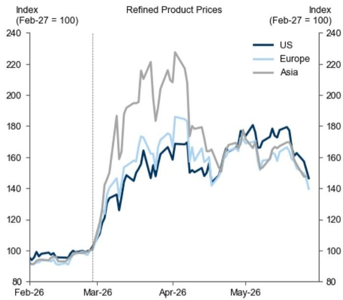

line

| Date    | US   | Europe | Asia |
|---------|------|--------|------|
| Feb-26  | 95   | 93     | 94   |
| Mar-26  | 100  | 100    | 100  |
| Apr-26  | 170  | 185    | 230  |
| May-26  | 180  | 170    | 175  |
| Jun-26  | 150  | 140    | 145  |

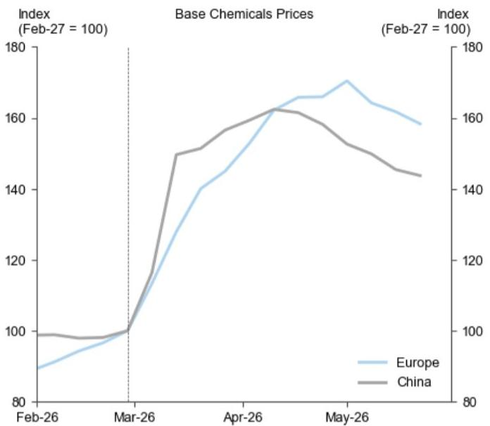

line

| Date   | Europe | China |
|--------|--------|-------|
| Feb-26 | 90     | 100   |
| Mar-26 | 100    | 100   |
| Apr-26 | 160    | 160   |
| May-26 | 170    | 150   |

The refined products indices are averages of gasoline, diesel, jet fuel, fuel oil, and naphtha prices weighted by 2025 average demand shares of each product. The base chemicals indices are unweighted averages of contract prices for ethylene, propylene, benzene, styrene and methanol.   
Source: Platts, Argus, GS Global Investment Research

The upshot is that both our model-based analysis and recent signals point to a moderate but contained hit to global growth from Middle Eastern supply disruptions.

# Megan Peters

# The Global Economics Team

# Jan Hatzius

+1(212)902-0394

jan.hatzius@gs.com

GS & Co. LLC

# Joseph Briggs

+1(212)902-2163

joseph.briggs@gs.com

GS & Co. LLC

# Sarah Dong

+1(212)357-9741

sarah.dong@gs.com

GS & Co. LLC

# Megan Peters

+44(20)7051-2058

megan.l.peters@gs.com

GS International

# Disclosure Appendix

# Reg AC

I, Megan Peters, hereby certify that all of the views expressed in this report accurately reflect my personal views, which have not been influenced by considerations of the firm's business or client relationships.

Unless otherwise stated, the individuals listed on the cover page of this report are analysts in GS' Global Investment Research division.

Contributing Authors: Megan Peters GS International.

Unless otherwise stated, the individuals listed in the Contributing Authors disclosure of this report are analysts in GS' Global Investment Research division.

# Disclosures

# Regulatory disclosures

# Disclosures required by United States laws and regulations

See company-specific regulatory disclosures above for any of the following disclosures required as to companies referred to in this report: manager or co-manager in a pending transaction; $1\%$ or other ownership; compensation for certain services; types of client relationships; managed/co-managed public offerings in prior periods; directorships; for equity securities, market making and/or specialist role. GS trades or may trade as a principal in debt securities (or in related derivatives) of issuers discussed in this report.

The following are additional required disclosures: Ownership and material conflicts of interest: GS policy prohibits its analysts, professionals reporting to analysts and members of their households from owning securities of any company in the analyst's area of coverage. Analyst compensation: Analysts are paid in part based on the profitability of GS, which includes investment banking revenues. Analyst as officer or director: GS policy generally prohibits its analysts, persons reporting to analysts or members of their households from serving as an officer, director or advisor of any company in the analyst's area of coverage. Non-U.S. Analysts: Non-U.S. analysts may not be associated persons of GS & Co. LLC and therefore may not be subject to FINRA Rule 2241 or FINRA Rule 2242 restrictions on communications with a subject company, public appearances and trading in securities covered by the analysts.

# Additional disclosures required under the laws and regulations of jurisdictions other than the United States

The following disclosures are those required by the jurisdiction indicated, except to the extent already made above pursuant to United States laws and regulations. Australia: GS Australia Pty Ltd and its affiliates are not authorised deposit-taking institutions (as that term is defined in the Banking Act 1959 (Cth)) in Australia and do not provide banking services, nor carry on a banking business, in Australia. This research, and any access to it, is intended only for “wholesale clients” within the meaning of the Australian Corporations Act, unless otherwise agreed by GS. In producing research reports, members of Global Investment Research of GS Australia may attend site visits and other meetings hosted by the companies and other entities which are the subject of its research reports. In some instances the costs of such site visits or meetings may be met in part or in whole by the issuers concerned if GS Australia considers it is appropriate and reasonable in the specific circumstances relating to the site visit or meeting. To the extent that the contents of this document contains any financial product advice, it is general advice only and has been prepared by GS without taking into account a client’s objectives, financial situation or needs. A client should, before acting on any such advice, consider the appropriateness of the advice having regard to the client’s own objectives, financial situation and needs. A copy of certain GS Australia and New Zealand disclosure of interests and a copy of GS’ Australian Sell-Side Research Independence Policy Statement are available at: https://www.goldmansachs.com/disclosures/australia-new-zealand/index.html. Brazil: Disclosure information in relation to CVM Resolution n. 20 is available at https://www.gs.com/worldwide/brazil/area/gir/index.html. Where applicable, the Brazil-registered analyst primarily responsible for the content of this research report, as defined in Article 20 of CVM Resolution n. 20, is the first author named at the beginning of this report, unless indicated otherwise at the end of the text. Canada: This information is being provided to you for information purposes only and is not, and under no circumstances should be construed as, an advertisement, offering or solicitation by GS & Co. LLC for purchasers of securities in Canada to trade in any Canadian security. GS & Co. LLC is not registered as a dealer in any jurisdiction in Canada under applicable Canadian securities laws and generally is not permitted to trade in Canadian securities and may be prohibited from selling certain securities and products in certain jurisdictions in Canada. If you wish to trade in any Canadian securities or other products in Canada please contact GS Canada Inc., an affiliate of The GS Group Inc., or another registered Canadian dealer. Hong Kong: Further information on the securities of covered companies referred to in this research may be obtained on request from GS (Asia) L.L.C. India: Further information on the subject company or companies referred to in this research may be obtained from GS (India) Securities Private Limited, Research Analyst - SEBI Registration Number INH000001493, 10th Floor, Ascent-Worli, Sudam Kalu Ahire Marg, Worli, Mumbai-400 025, India, Corporate Identity Number U74140MH2006FTC160634, Phone +91 22 6616 9000, Fax +91 22 6616 9001. GS may beneficially own 1% or more of the securities (as such term is defined in clause 2 (h) the Indian Securities Contracts (Regulation) Act, 1956) of the subject company or companies referred to in this research report. Investment in securities market are subject to market risks. Read all the related documents carefully before investing. Registration granted by SEBI and certification from NISM in no way guarantee performance of the intermediary or provide any assurance of returns to investors. GS (India) Securities Private Limited compliance officer and investor grievance contact details can be found at: https://www.goldmansachs.com/worldwide/india/documents/Grievance-Redressal-and-Escalation-Matrix.pdf, and a copy of the annual audit compliance report can be found at this link: https://publishing.gs.com/content/site/india-annual-compliance-report.html. Japan: See below. Korea: This research, and any access to it, is intended only for “professional investors” within the meaning of the Financial Services and Capital Markets Act, unless otherwise agreed by GS. Further information on the subject company or companies referred to in this research may be obtained from GS (Asia) L.L.C., Seoul Branch. New Zealand: GS New Zealand Limited and its affiliates are neither “registered banks” nor “deposit takers” (as defined in the Reserve Bank of New Zealand Act 1989) in New Zealand. This research, and any access to it, is intended for “wholesale clients” (as defined in the Financial Advisers Act 2008) unless otherwise agreed by GS. A copy of certain GS Australia and New Zealand disclosure of interests is available at: https://www.goldmansachs.com/disclosures/australia-new-zealand/index.html. Russia: Research reports distributed in the Russian Federation are not advertising as defined in the Russian legislation, but are information and analysis not having product promotion as their main purpose and do not provide appraisal within the meaning of the Russian legislation on appraisal activity. Research reports do not constitute a personalized investment recommendation as defined in Russian laws and regulations, are not addressed to a specific client, and are prepared without analyzing the financial circumstances, investment profiles or risk profiles of clients. GS assumes no responsibility for any investment decisions that may be taken by a client or any other person based on this research report. Singapore: GS (Singapore) Pte. (Company Number: 198602165W), which is regulated by the Monetary Authority of Singapore, accepts legal responsibility for this research, and should be contacted with respect to any matters arising from, or in connection with, this research. Taiwan: This material is for reference only and must not be reprinted without permission. Investors should carefully consider their own investment risk. Investment results are the responsibility of the individual investor. United Kingdom: Persons who would be categorized as retail clients in the United Kingdom, as such term is defined in the rules of the Financial Conduct Authority, should read this research in conjunction with prior GS on the covered

companies referred to herein and should refer to the risk warnings that have been sent to them by GS International. A copy of these risks warnings, and a glossary of certain financial terms used in this report, are available from GS International on request.

European Union and United Kingdom: Disclosure information in relation to Article 6 (2) of the European Commission Delegated Regulation (EU) (2016/958) supplementing Regulation (EU) No 596/2014 of the European Parliament and of the Council (including as that Delegated Regulation is implemented into United Kingdom domestic law and regulation following the United Kingdom's departure from the European Union and the European Economic Area) with regard to regulatory technical standards for the technical arrangements for objective presentation of investment recommendations or other information recommending or suggesting an investment strategy and for disclosure of particular interests or indications of conflicts of interest is available at https://www.gs.com/disclosures/europeanpolicy.html which states the European Policy for Managing Conflicts of Interest in Connection with Investment Research.

Japan: GS Japan Co., Ltd. is a Financial Instrument Dealer registered with the Kanto Financial Bureau under registration number Kinsho 69, and a member of Japan Securities Dealers Association, Financial Futures Association of Japan Type II Financial Instruments Firms Association, and Investment Management Association of Japan. Sales and purchase of equities are subject to commission pre-determined with clients plus consumption tax. See company-specific disclosures as to any applicable disclosures required by Japanese stock exchanges, the Japanese Securities Dealers Association or the Japanese Securities Finance Company.

# Global product; distributing entities

GS Global Investment Research produces and distributes research products for clients of GS on a global basis. Analysts based in GS offices around the world produce research on industries and companies, and research on macroeconomics, currencies, commodities and portfolio strategy. This research is disseminated in Australia by GS Australia Pty Ltd (ABN 21 006 797 897); in Brazil by GS do Brasil Corretora de Títulos e Valores Mobiliários S.A.; Public Communication Channel GS Brazil: 0800 727 5764 and / or contatogoldmanbrasil@gs.com. Available Weekdays (except holidays), from 9am to 6pm. Canal de Comunicação com o Público GS Brasil: 0800 727 5764 e/ou contatogoldmanbrasil@gs.com. Horário de funcionamento: segunda-feira à sexta-feira (exceto feriados), das 9h às 18h; in Canada by GS & Co. LLC; in Hong Kong by GS (Asia) L.L.C.; in India by GS (India) Securities Private Ltd.; in Japan by GS Japan Co., Ltd.; in the Republic of Korea by GS (Asia) L.L.C., Seoul Branch; in New Zealand by GS New Zealand Limited; in Russia by OOO GS; in Singapore by GS (Singapore) Pte. (Company Number: 198602165W); and in the United States of America by GS & Co. LLC. GS International has approved this research in connection with its distribution in the United Kingdom.

GS International (“GSI”), authorised by the Prudential Regulation Authority (“PRA”) and regulated by the Financial Conduct Authority (“FCA”) and the PRA, has approved this research in connection with its distribution in the United Kingdom.

European Economic Area: GS Bank Europe SE (“GSBE”) is a credit institution incorporated in Germany and, within the Single Supervisory Mechanism, subject to direct prudential supervision by the European Central Bank and in other respects supervised by German Federal Financial Supervisory Authority (Bundesanstalt für Finanzdienstleistungsaufsicht, BaFin) and Deutsche Bundesbank and disseminates research within the European Economic Area.

# General disclosures

This research is for our clients only. Other than disclosures relating to GS, this research is based on current public information that we consider reliable, but we do not represent it is accurate or complete, and it should not be relied on as such. The information, opinions, estimates and forecasts contained herein are as of the date hereof and are subject to change without prior notification. We seek to update our research as appropriate, but various regulations may prevent us from doing so. Other than certain industry reports published on a periodic basis, the large majority of reports are published at irregular intervals as appropriate in the analyst's judgment.

GS conducts a global full-service, integrated investment banking, investment management, and brokerage business. We have investment banking and other business relationships with a substantial percentage of the companies covered by Global Investment Research. GS & Co. LLC, the United States broker dealer, is a member of SIPC (https://www.sipc.org).

Our salespeople, traders, and other professionals may provide oral or written market commentary or trading strategies to our clients and principal trading desks that reflect opinions that are contrary to the opinions expressed in this research. Our asset management area, principal trading desks and investing businesses may make investment decisions that are inconsistent with the recommendations or views expressed in this research.

We and our affiliates, officers, directors, and employees will from time to time have long or short positions in, act as principal in, and buy or sell, the securities or derivatives, if any, referred to in this research, unless otherwise prohibited by regulation or GS policy.

The views attributed to third party presenters at GS arranged conferences, including individuals from other parts of GS, do not necessarily reflect those of Global Investment Research and are not an official view of GS.

Any third party referenced herein, including any salespeople, traders and other professionals or members of their household, may have positions in the products mentioned that are inconsistent with the views expressed by analysts named in this report.

This research is focused on investment themes across markets, industries and sectors. It does not attempt to distinguish between the prospects or performance of, or provide analysis of, individual companies within any industry or sector we describe.

Any trading recommendation in this research relating to an equity or credit security or securities within an industry or sector is reflective of the investment theme being discussed and is not a recommendation of any such security in isolation.

This research is not an offer to sell or the solicitation of an offer to buy any security in any jurisdiction where such an offer or solicitation would be illegal. It does not constitute a personal recommendation or take into account the particular investment objectives, financial situations, or needs of individual clients. Clients should consider whether any advice or recommendation in this research is suitable for their particular circumstances and, if appropriate, seek professional advice, including tax advice. The price and value of investments referred to in this research and the income from them may fluctuate. Past performance is not a guide to future performance, future returns are not guaranteed, and a loss of original capital may occur. Fluctuations in exchange rates could have adverse effects on the value or price of, or income derived from, certain investments.

Certain transactions, including those involving futures, options, and other derivatives, give rise to substantial risk and are not suitable for all investors. Investors should review current options and futures disclosure documents which are available from GS sales representatives or at https://www.theocc.com/about/publications/character-risks.jsp and https://www.goldmansachs.com/disclosures/cftc\_fcm\_disclosures. Transaction costs may be significant in option strategies calling for multiple purchase and sales of options such as spreads. Supporting documentation will be supplied upon request.

Differing Levels of Service provided by Global Investment Research: The level and types of services provided to you by GS Global Investment Research may vary as compared to that provided to internal and other external clients of GS, depending on various factors including your individual preferences as to the frequency and manner of receiving communication, your risk profile and investment focus and perspective (e.g.,

marketwide, sector specific, long term, short term), the size and scope of your overall client relationship with GS, and legal and regulatory constraints. As an example, certain clients may request to receive notifications when research on specific securities is published, and certain clients may request that specific data underlying analysts' fundamental analysis available on our internal client websites be delivered to them electronically through data feeds or otherwise. No change to an analyst's fundamental research views (e.g., ratings, price targets, or material changes to earnings estimates for equity securities), will be communicated to any client prior to inclusion of such information in a research report broadly disseminated through electronic publication to our internal client websites or through other means, as necessary, to all clients who are entitled to receive such reports.

All research reports are disseminated and available to all clients simultaneously through electronic publication to our internal client websites. Not all research content is redistributed to our clients or available to third-party aggregators, nor is GS responsible for the redistribution of our research by third party aggregators. For research, models or other data related to one or more securities, markets or asset classes (including related services) that may be available to you, please contact your GS representative or go to https://research.gs.com.

Disclosure information is also available at https://www.gs.com/research/hedge.html or from Research Compliance, 200 West Street, New York, NY 10282.

# © 2026 GS.

You are permitted to store, display, analyze, modify, reformat, and print the information made available to you via this service only for your own use. You may not resell or reverse engineer this information to calculate or develop any index for disclosure and/or marketing or create any other derivative works or commercial product(s), data or offering(s) without the express written consent of GS. You are not permitted to publish, transmit, or otherwise reproduce this information, in whole or in part, in any format to any third party without the express written consent of GS. This foregoing restriction includes, without limitation, using, extracting, downloading or retrieving this information, in whole or in part, to train or finetune a machine learning or artificial intelligence system, or to provide or reproduce this information, in whole or in part, as a prompt or input to any such system.