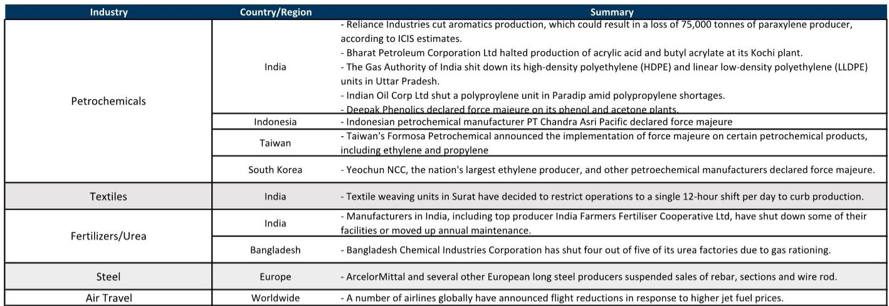
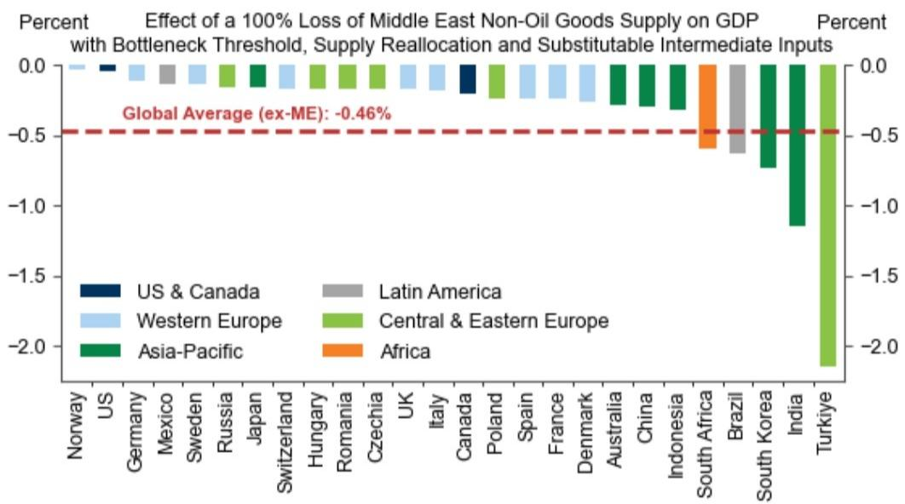

# The Real Economic Danger from the Strait of Hormuz Is Not Oil—It Is the Invisible Inputs That No One Prices Correctly

The Strait of Hormuz remains effectively closed three months into the Iran War, with vessel traffic down more than 90% from normal levels. Global GDP has not yet cratered, and many market participants have taken comfort in the resilience of headline growth figures. That comfort is premature and potentially dangerous. The conventional wisdom—that oil price increases will absorb the shock through demand destruction—is largely correct for crude. But the deeper risk to global output does not come from the barrel of oil that trades on liquid futures markets. It comes from the commodities that do not have deep global spot markets: fertilizers, sulfur, helium, methanol, and specialized petrochemical feedstocks. These are the inputs where supply constraints can become binding, stockouts can occur, and production chains can break in ways that price signals alone cannot quickly repair.

A global investment bank report modeling an indefinite loss of Middle Eastern commodity supplies provides the analytical foundation for understanding this risk. The headline numbers are sobering enough. Under a proportional-output-loss assumption, a complete loss of Middle Eastern non-oil goods supply would reduce global GDP by roughly 1.3%, with India, Turkey, and South Korea facing hits above 3%. But these figures, while significant, understate the true danger. The more extreme scenario—where each input is treated as critical and production declines proportionally to the most constrained input—implies GDP losses that could reach nearly 5% globally and exceed 10% in some Asian economies. The gap between these two estimates is not a modeling curiosity. It is the analytical space where actual economic crises unfold.

The question every investor and policymaker should be asking is not whether the global economy can absorb a prolonged Middle Eastern supply disruption. It is whether the mechanisms that normally prevent such disruptions from spiraling—price-driven demand destruction, inventory buffers, input substitution, and supply reallocation—will hold in the specific markets where they are weakest. The evidence so far is mixed, and the report leaves several critical questions unresolved.

## The Oil Shock Is Manageable Through Prices, But the Real Risk Lies in Non-Oil Commodities Where Markets Are Less Global

The report makes a clear distinction between oil and non-oil commodities, and this distinction is the most important analytical contribution of the entire analysis. For oil, the mechanism is straightforward and well-understood. Global oil markets are deep, liquid, and integrated. When supply falls, prices rise, and higher prices destroy demand until the market clears. The report estimates that the current oil price increases imply a GDP drag of roughly half a percentage point, with a severely adverse scenario pushing that to 1.0–1.5%. These are serious numbers, but they are within the range of historical experience and are manageable through conventional macroeconomic adjustment.

The situation for non-oil commodities is fundamentally different. Middle Eastern exports of fertilizers, petrochemicals, sulfur, helium, and specialty chemicals account for a much smaller share of global trade by value—only about 1.3% of global GDP. But these markets are regional, not global. They have thinner spot markets, longer contract cycles, and fewer alternative suppliers. When supply from the Middle East disappears, there is no liquid futures market to absorb the shock through price discovery. Instead, the adjustment happens through rationing, force majeure declarations, and production curtailments downstream.

This is where the report's Leontief production function analysis becomes genuinely illuminating. Under the assumption that every input is critical and production falls proportionally to the most constrained input, the GDP impact from non-oil supply losses jumps dramatically. For India, the implied GDP loss rises from 3.6% to over 10%. For South Korea, from 3.1% to nearly 9%. For China, from 2.7% to over 7%. These are not hypothetical tail risks. They represent the actual outcome if supply constraints become binding in key industrial sectors and if firms cannot substitute away from Middle Eastern inputs quickly enough.

The report is careful to note three reasons why the actual impact is likely to be more contained: the GDP hit falls sharply when trivial inputs are excluded; reallocation of scarce inputs from low-value to high-value uses reduces the drag; and input substitutability lowers it further. Under reasonable assumptions for each channel, the direct growth headwinds from non-oil supply disruptions are estimated at 0.4–0.5% of global GDP. But this estimate depends critically on the assumption that substitution and reallocation work smoothly. In practice, they may not.

## The Most Dangerous Supply Bottlenecks Are in Fertilizers, Helium, and Specialty Chemicals—Where Stockouts Have Already Begun

The report identifies specific commodities where shortage risks are most acute, and these deserve close attention. Fertilizers are the most obvious concern. The Middle East accounts for 32% of global trade in other fertilizers and 9.5% of nitrogen fertilizers. Fertilizer supply disruptions have direct consequences for agricultural output, and those consequences are felt with a lag. If farmers cannot secure sufficient fertilizer for the next planting season, crop yields will fall, food prices will rise, and the inflationary impulse will compound the direct GDP drag from industrial supply shortages.

Helium is a less obvious but potentially more disruptive bottleneck. As a byproduct of natural gas extraction, helium supply is concentrated in a few global locations, and the Middle East is a significant source. Helium is indispensable for cryogenic applications, including semiconductor manufacturing, medical imaging, and scientific research. A doubling of spot prices since the conflict began signals that the market is already tightening. The majority of helium is sold under long-term contracts, so the spot price spike may not immediately translate into widespread shortages. But if contract renewals occur at significantly higher prices, or if physical supply constraints force rationing, the impact on semiconductor production could be severe. The report notes that semiconductor shortages in 2021–2022 demonstrated how a single constrained input can cascade through global supply chains.

Sulfur and sulfuric acid are critical inputs for copper refining, phosphate fertilizer production, and titanium dioxide manufacturing. Prices have risen over 60% since the conflict began. Copper refining is particularly exposed because sulfuric acid is consumed in large quantities and has few substitutes. If copper refineries cannot secure sufficient sulfuric acid, refined copper supply will fall, driving up prices for one of the most important industrial metals. This is not a hypothetical scenario. The report indicates that some Asian petrochemical plants have already declared force majeure, and analysts warn that supply disruptions could extend through 2027 even if the Strait of Hormuz opens imminently.

## The Data So Far Is Reassuring, But It May Be Masking a Lagged Adjustment That Has Not Yet Arrived

The report presents data suggesting that the worst-case scenarios have not materialized. Demand destruction has skewed toward lower-income countries and lower-value-added industries, which is consistent with the price-driven adjustment mechanism. Industrial production data has yet to show signs of binding supply constraints, and prices for some supply-constrained products have retraced somewhat in recent weeks. This is genuinely encouraging, but it should not be interpreted as proof that the risk has passed.

There are at least three reasons why the data may be misleading. First, supply chains have significant inertia. Firms hold inventories, have long-term contracts, and can draw on buffer stocks. The fact that industrial production has not yet fallen does not mean it will not fall if the disruption persists. The report explicitly models an indefinite loss of supply, and the three-month mark may simply be within the inventory cushion period for many industries.

Second, the demand destruction that has occurred may be masking the severity of the underlying supply constraint. If lower-income countries and lower-value-added industries are being rationed first, that is a rational market response. But it means that the GDP impact is being concentrated in the most vulnerable parts of the global economy, where the social and political consequences are most severe. The aggregate GDP numbers may look manageable, but the distributional effects are deeply concerning.

Third, the price retracement in some commodities may reflect demand destruction rather than supply normalization. If prices fall because industrial users have cut production, that is not a sign that the crisis is easing. It is a sign that the adjustment mechanism is working through output reductions rather than price increases. The report's framework assumes that price-driven demand destruction is the primary mechanism for clearing markets. If that mechanism is working, it should reduce GDP. The fact that GDP has not yet fallen significantly may simply mean that the demand destruction is happening with a lag.

## What the Report Does Not Fully Answer: How Fast Can Substitution and Reallocation Work in Practice?

The report identifies three channels that moderate the GDP impact—excluding trivial inputs, reallocating scarce inputs, and substituting across inputs—and provides reasonable assumptions for each. But it does not fully address the question of how quickly these channels can operate in a crisis. The assumption that substitution and reallocation happen smoothly is a standard modeling convenience, but it may not hold in practice.

Consider the case of sulfuric acid for copper refining. If Middle Eastern sulfuric acid supply is lost, can refineries quickly source alternative supplies from other regions? The answer depends on whether other producers have spare capacity, whether transportation infrastructure can handle the rerouting, and whether the alternative sulfuric acid meets the required purity specifications. Each of these questions introduces uncertainty. The report's estimate of a 0.4–0.5% GDP drag assumes that such substitution is possible. If it is not, the actual impact could be significantly larger.

Similarly, the reallocation of scarce inputs from low-value to high-value uses assumes that markets function efficiently and that firms can identify and execute reallocation strategies quickly. In practice, reallocation requires information, contracts, and logistics. It may take months to arrange, and during that period, production may be disrupted. The report acknowledges that downstream supply impacts could moderately amplify the direct effects, but it does not quantify how large this amplification could be under adverse conditions.

The unresolved question is whether the global economy has enough slack in non-oil commodity markets to absorb a prolonged Middle Eastern supply disruption without significant output losses. The report provides a range of estimates, but the upper end of that range—the Leontief scenario—remains a genuine possibility if substitution and reallocation prove slower or more difficult than assumed.

## A Decision Framework for Investors: Distinguish Between Price-Driven and Quantity-Driven Risks

The report provides the analytical tools for a decision framework that investors can apply to their own portfolios. The key distinction is between commodities where the adjustment mechanism is price-driven and those where it is quantity-driven.

For oil and other globally traded commodities with deep futures markets, the primary risk is price risk. Investors should focus on the trajectory of oil prices, the inventory drawdown rate, and the demand elasticity of the most price-sensitive consumers. The report's rules of thumb for the GDP impact of energy price increases are a useful starting point, but they should be adjusted for the specific exposure of each country and sector.

For non-oil commodities with thin markets and regional supply chains, the primary risk is quantity risk. Investors should focus on physical supply availability, inventory levels at key industrial consumers, and the potential for force majeure declarations in downstream industries. The commodities to watch are fertilizers, sulfur, helium, methanol, and specialty petrochemicals. If stockouts occur in any of these markets, the GDP impact could be significantly larger than the price-driven estimates suggest.

Country exposure matters enormously. India, Turkey, South Korea, and South Africa have the highest direct exposure to Middle Eastern non-oil supply. But the indirect exposure through global supply chains means that no country is immune. The report's input-output analysis provides a country-by-country breakdown that investors can use to assess their own exposure.

The most important strategic question for investors is whether to hedge against the Leontief scenario. The probability is low, but the impact is severe. The report provides the analytical foundation for making that judgment, but it does not—and cannot—provide a definitive answer. That is a decision that each investor must make based on their own risk tolerance and portfolio composition.

## The Full Report Contains the Charts and Data That Make These Risks Quantifiable

The analysis summarized here draws on a detailed global investment bank report that includes comprehensive input-output tables, country-by-country exposure estimates, and scenario analysis for both oil and non-oil commodities. The full report contains the exhibits and data that allow investors to assess their own exposure and to calibrate their risk management strategies.

The charts showing the share of Middle Eastern exports in global trade for each commodity category are essential for understanding which markets are most exposed. The country-by-country breakdown of GDP exposure under both the proportional-output and Leontief scenarios provides a clear ranking of vulnerability. The data on commodity price movements since the conflict began offers a real-time check on whether the adjustment mechanism is working as expected.

For investors who want to move beyond the headline numbers and build their own analytical framework, the full report is an indispensable resource.

Join the community to read the full report and review the original charts.

*This article is for learning and discussion only and does not constitute investment advice.*

Personal reading notes and learning share only. Not investment advice.

