# China Macro Tracker

# Structural measures move up the agenda

# Economics China

Urbanisation 2.0: a new action plan to provide basic public services based on permanent residence   
- China-EU trade tensions: EU mulls new restrictive measures against China while China indicates potential retaliation   
- Anti-involution campaign to continue with institutional reforms in the pipeline

# Livelihood: public services will be provided based on permanent residence

On 25 May, the State Council issued opinions on promoting the provision of basic public services based on permanent residence (gov.cn, 25 May). The key tasks are to strengthen education rights for migrant workers' children, include non-hukou households within the coverage of public rental housing, improve the system for enrolling in social insurance, strengthen basic medical provision, enhance employment assistance, and improve last-resort basic services. Measures will focus on optimising the layout of public facilities based on population mobility trends, allocating scarce service resources via a points-based system, strengthening fiscal transfer payments, and optimising the allocation of urban construction land.

The move marks an essential step towards the “people-centred” new urbanisation model. Unlike previous urbanisation strategies that used to focus on shifting rural labour into cities to support manufacturing and construction, the new model positions urbanisation as a key lever for the government’s long-term push to build a strong domestic market and boost the consumption-to-GDP ratio via “investing in people”. Strengthening access to public services for urban-based migrant workers and families (c170m people) constitutes an integral element of this strategy. The agenda to expand public service provision aims to reduce migrant workers’ precautionary savings and unlock their consumption potential. The government’s efforts to shift to structural solutions to support consumption were also reflected in fiscal allocations, with a larger share of general public budget spending directed to livelihood-related areas since the start of the year (chart 4). Meanwhile, if China can successfully grow its domestic market, it is also promising to help improve relations with trading partners through increased imports demand.

# Trade: China-EU trade disputes are escalating

China's exports growth and a wider trade surplus with the EU are contributing to heightened trade tensions (chart 5). The European Commission is set to discuss new trade policies concerning China on 29 May, which may lead to new restrictive measures (Bloomberg, 21 May). This follows the decision on 19 May to reduce duty-free steel import quotas by $47\%$ and double the out-of-quota tariff. These actions prompted a stronger pushback from the Chinese side. The MOFCOM noted that China will respond firmly with countermeasures if the EU insists on pushing ahead with discriminatory restrictive measures against China (Xinhua, 21 May).

# Taylor Wang

Economist, China

The Hongkong and Shanghai Banking Corporation Limited
taylor.t.l.wang@hsbc.com.hk

+852 2288 8650

# Jing Liu

Chief Economist, Greater China

The Hongkong and Shanghai Banking Corporation Limited
jing.econ.liu@hsbc.com.hk

+852 3941 0063

# Heidi Li

Associate

Guangzhou

HSBC Funding the Future Survey

Sentiment, AI and Private Credit

Click to view

# Disclosures & Disclaimer

This report must be read with the disclosures and the analyst certifications in the Disclosure appendix, and with the Disclaimer, which forms part of it.

Issuer of report: The Hongkong and Shanghai Banking Corporation Limited

View HSBC Global Investment Research at:

https://www.research.hsbc.com

While the EU has relied on anti-subsidy and anti-dumping measures to impose tariffs on steel and EVs, recent moves suggest the EU is advancing a broader security agenda, such as revisions to the Cybersecurity Act and the Industrial Accelerator Act. These actions may affect broader Chinese firms, especially in energy related sectors. In 2025, EVs, lithium-ion battery and solar cells together accounted for $8.3\%$ of China's exports to the EU while the region accounted for $c40\%$ of these products' exports. As noted by HSBC's Chief Asia Economist Fred Neumann et al., China can weather the impact of US protectionism, but tariff cascades from other trading partners will present a more severe challenge (see Tariff cascade in action, 25 Feb 2025).

That said, we think there is still room for negotiations, given the EU's corporate interests in China and supply-chain efficiency. For instance, the EU Chamber of Commerce in China reported that around 25% of European companies in China are shifting more production processes to China (Xinhua, 3 Feb). China's Commerce Minister Wang Wentao is also expected to visit Brussels in late June for key talks with EU Trade leaders (SCMP, 22 May), which should provide opportunities for both sides to negotiate. Separately, the mid-May US–China summit signalled a constructive tone and China's exports to the US also rose c11% y-o-y in April, suggesting some US orders are returning. Stabilised US-China relations may also help ease EU-China tensions.

# Anti-involution campaign: institutional reforms remain a top priority

Premier Li Qiang chaired a State Council executive meeting that reiterated building a unified national market as a core requirement for high-quality development. The meeting called for deeper institutional reforms, with priorities including property-rights protection, market access rules, fair competition enforcement, effective social credit system, and market exit mechanisms (Xinhua, 21 May). The same day, a Qiushi commentary - published in the wake of President Xi's 16 May article urging resources and factors of production to cluster around the real economy-added that “resources can enter” does not mean they are “well allocated”. It identified local actions that artificially lower entry costs and distort signals as a key root cause of “involution” and identified local protectionism and market fragmentation as an institutional crux.

We had argued in China anti-involution push (4 February) that while sector-specific initiatives will likely see more progress in the near term, addressing local interference is one of the most challenging issues in the medium term. Recent policy tones suggest revisions of related laws may be accelerated. The government procurement law (revised) and the tendering and bidding law (revised) were included in the first review when the National People's Congress released its legislative agenda for 2026 (gov.cn, 11 May). The Qiushi article also noted that reform of local performance appraisal will be used to rectify local government behaviours (Qiushi, 21 May).

# Fiscal data: April pause after a punchy Q1

China's April fiscal data showed a temporary slowdown in spending and echoed the weak investment picture (see China activity, 18 May). The bigger drag came from the government-managed fund, where expenditure fell $21\%$ y-o-y amidst weak land sales $(-35\%$ y-o-y) and a temporary slowdown in special local government bond issuance. General public budget expenditure also turned meaningfully weaker despite the improving revenue, which contributed to a narrower deficit of RMB1.1trn (YTD).

We read the temporary slowdown as the government choosing to pause after strong fiscal front-loading and healthy GDP growth in Q1, rather than stepping away from support. Policy reaction will likely depend on whether the recent headwinds prove persistent, with scope for a re-acceleration of bond issuance and deployment of funds should data continue to deteriorate. We expect infrastructure investment to remain a strong growth driver this year, supported by a new policy push for “six networks” (see China Politburo Meeting, 28 April).

# Charts of the week

1. The urbanisation rate of household registration lagged behind that of permanent residence   
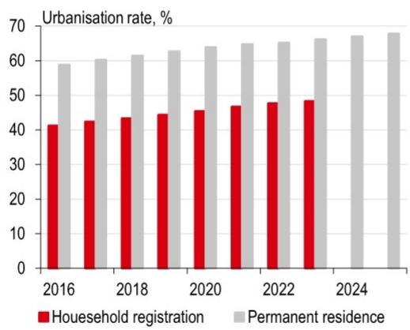

bar

Urbanisation rate, %
| Year | Household registration (%) | Permanent residence (%) |
|---|---|---|
| 2016 | 41.5 | 59.0 |
| 2017 | 42.5 | 60.5 |
| 2018 | 43.5 | 61.5 |
| 2019 | 44.5 | 62.5 |
| 2020 | 45.5 | 63.5 |
| 2021 | 46.5 | 64.5 |
| 2022 | 47.5 | 65.0 |
| 2023 | 48.5 | 66.0 |
| 2024 | - | 67.0 |
| 2025 | - | 67.5 |

Source: Wind, HSBC

2. Migrant workers' income growth lagged nominal GDP growth   
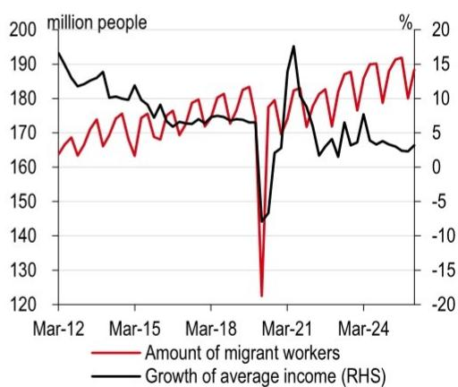

line

| Date    | Amount of migrant workers (million people) | Growth of average income (%) |
|---------|---------------------------------------------|------------------------------|
| Mar-12  | 165                                         | 190                          |
| Mar-15  | 175                                         | 180                          |
| Mar-18  | 180                                         | 170                          |
| Mar-21  | 120                                         | -15                          |
| Mar-24  | 190                                         | 5                            |

Source: Wind, HSBC

3. China's April fiscal data shows a temporary slowdown in spending   
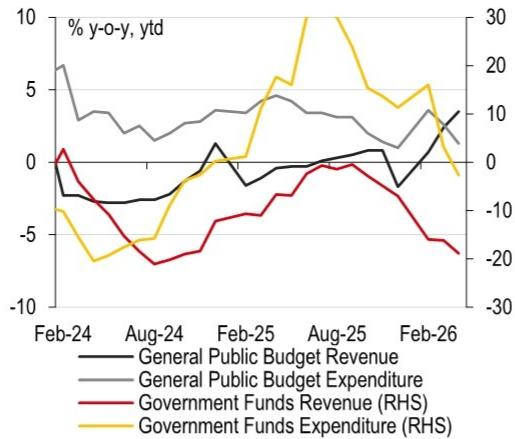

line

| Date   | General Public Budget Revenue | General Public Budget Expenditure | Government Funds Revenue (RHS) | Government Funds Expenditure (RHS) |
|--------|-------------------------------|-----------------------------------|--------------------------------|------------------------------------|
| Feb-24 | -3                            | 7                                 | 0                              | -10                                |
| Aug-24 | -2                            | 3                                 | -10                            | -20                                |
| Feb-25 | 1                             | 4                                 | -5                             | 10                                 |
| Aug-25 | 0                             | 3                                 | -10                            | 30                                 |
| Feb-26 | 3                             | 1                                 | -15                            | -5                                 |

Source: Wind, HSBC

4. More spending was allocated to livelihood-related areas   
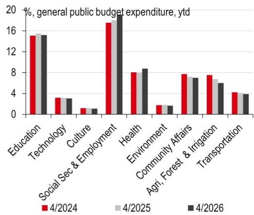

bar

| Category | 4/2024 (%) | 4/2025 (%) | 4/2026 (%) |
|---|---|---|---|
| Education | 15.5 | 15.7 | 15.6 |
| Technology | 3.5 | 3.4 | 3.4 |
| Culture | 1.0 | 1.0 | 1.0 |
| Social Sec & Employment | 17.0 | 18.0 | 19.0 |
| Health | 8.0 | 8.0 | 8.5 |
| Environment | 1.0 | 1.0 | 1.0 |
| Community Affairs | 7.8 | 7.6 | 7.5 |
| Agri. Forest & Irrigation | 7.8 | 7.4 | 6.8 |
| Transportation | 4.2 | 4.0 | 4.0 |

Source: Wind, HSBC

5. China's trade surplus with the EU rose further   
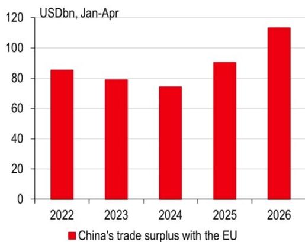

bar

USDbn, Jan-Apr
| Year | China's trade surplus with the EU (USDbn) |
| :--- | :--- |
| 2022 | 85 |
| 2023 | 79 |
| 2024 | 74 |
| 2025 | 90 |
| 2026 | 113 |

Source: Wind, HSBC

6. Higher exports share to ASEAN and the EU partly offset weaker US demand   
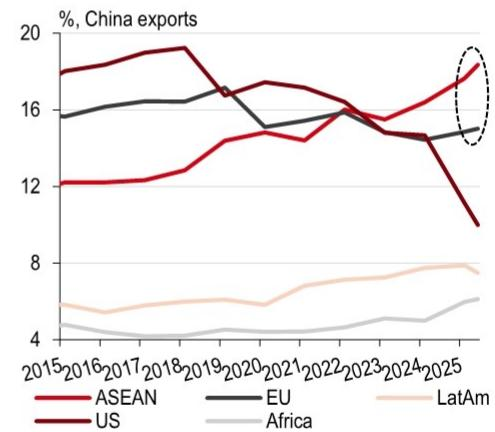

line

| Year | ASEAN | EU   | US   | LatAm | Africa |
|------|-------|------|------|-------|--------|
| 2015 | 12.0  | 16.0 | 18.0 | 6.0   | 4.0    |
| 2016 | 12.0  | 16.0 | 18.0 | 6.0   | 4.0    |
| 2017 | 12.0  | 16.0 | 18.0 | 6.0   | 4.0    |
| 2018 | 12.0  | 16.0 | 18.0 | 6.0   | 4.0    |
| 2019 | 13.0  | 16.0 | 18.0 | 6.0   | 4.0    |
| 2020 | 14.0  | 16.0 | 17.0 | 6.0   | 4.0    |
| 2021 | 15.0  | 15.0 | 17.0 | 6.0   | 4.0    |
| 2022 | 15.0  | 15.0 | 16.0 | 6.0   | 4.0    |
| 2023 | 16.0  | 15.0 | 16.0 | 6.0   | 4.0    |
| 2024 | 16.0  | 15.0 | 15.0 | 6.0   | 4.0    |
| 2025 | 17.0  | 15.0 | 10.0 | 6.0   | 4.0    |
| 2025*| 18.0  | 15.0 | 9.0  | 7.0   | 5.0    |

Source: Wind, HSBC

# Economic activity

7. LGSB issuance can support a lift in FAI, but issuance pace looks to be moderating   
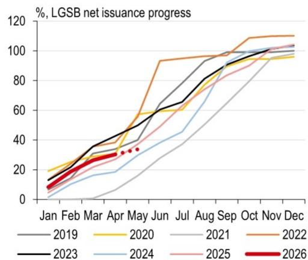

line

| Month | 2019 | 2020 | 2021 | 2022 | 2023 | 2024 | 2025 | 2026 |
|-------|------|------|------|------|------|------|------|------|
| Jan   | 10   | 15   | 10   | 15   | 10   | 5    | 5    | 5    |
| Feb   | 15   | 20   | 15   | 20   | 15   | 10   | 10   | 10   |
| Mar   | 20   | 25   | 20   | 25   | 20   | 15   | 15   | 15   |
| Apr   | 30   | 35   | 30   | 35   | 30   | 25   | 25   | 25   |
| May   | 40   | 45   | 40   | 45   | 40   | 35   | 35   | 35   |
| Jun   | 50   | 55   | 50   | 55   | 50   | 45   | 45   | 45   |
| Jul   | 60   | 65   | 60   | 65   | 60   | 55   | 55   | 55   |
| Aug   | 70   | 75   | 70   | 75   | 70   | 65   | 65   | 65   |
| Sep   | 80   | 85   | 80   | 85   | 80   | 75   | 75   | 75   |
| Oct   | 90   | 95   | 90   | 95   | 90   | 85   | 85   | 85   |
| Nov   | 100  | 100  | 100  | 105  | 100  | 95   | 95   | 95   |
| Dec   | 105  | 105  | 105  | 110  | 105  | 100  | 100  | 100  |

Source: Wind, HSBC; Note: Data as of 26 May.

8. Cross-city travel remained above historical levels   
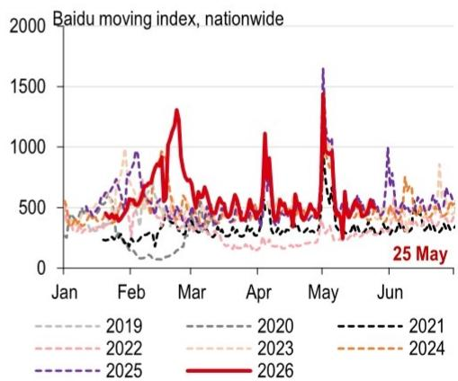

line

| Month | 2019 | 2020 | 2021 | 2022 | 2023 | 2024 | 2025 | 2026 |
|-------|------|------|------|------|------|------|------|------|
| Jan   | ~300 | ~400 | ~350 | ~450 | ~500 | ~450 | ~550 | ~400 |
| Feb   | ~400 | ~500 | ~450 | ~600 | ~700 | ~650 | ~800 | ~600 |
| Mar   | ~500 | ~600 | ~550 | ~700 | ~800 | ~750 | ~1300 | ~1300 |
| Apr   | ~400 | ~500 | ~450 | ~600 | ~700 | ~650 | ~1100 | ~1100 |
| May   | ~300 | ~400 | ~350 | ~500 | ~600 | ~550 | ~1600 | ~1600 |
| Jun   | ~400 | ~500 | ~450 | ~600 | ~700 | ~650 | ~1000 | ~1000 |
| 25 May| -    | -    | -    | -    | -    | -    | -    | -    |

Source: Baidu Index, HSBC

9. The number of domestic flights edged down   
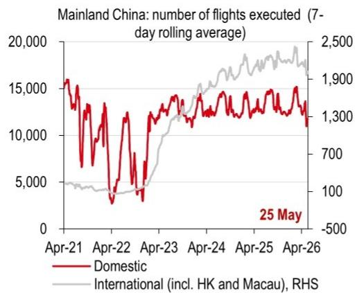

line

| Date    | Domestic | International (incl. HK and Macau), RHS |
|---------|----------|----------------------------------------|
| 25 May  |          |                                        |

Source: Wind, HSBC

10. Car sales edged down in May   
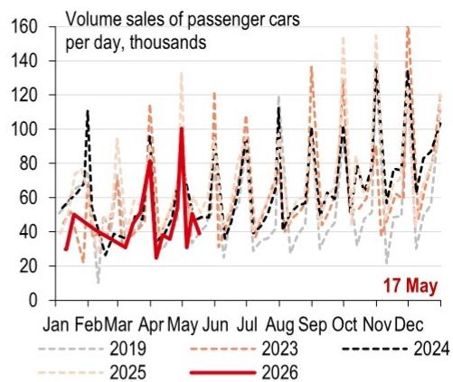

line

| Month | 2019 | 2023 | 2024 | 2025 | 2026 |
|-------|------|------|------|------|------|
| Jan   | 50   | 50   | 50   | 50   | 50   |
| Feb   | 30   | 30   | 30   | 30   | 30   |
| Mar   | 40   | 40   | 40   | 40   | 40   |
| Apr   | 80   | 80   | 80   | 80   | 80   |
| May   | 100  | 100  | 100  | 100  | 100  |
| Jun   | 40   | 40   | 40   | 40   | 40   |
| Jul   | 50   | 50   | 50   | 50   | 50   |
| Aug   | 60   | 60   | 60   | 60   | 60   |
| Sep   | 70   | 70   | 70   | 70   | 70   |
| Oct   | 80   | 80   | 80   | 80   | 80   |
| Nov   | 130  | 130  | 130  | 130  | 130  |
| Dec   | 110  | 110  | 110  | 110  | 110  |

Source: Wind, HSBC

11. National box office revenues edged up   
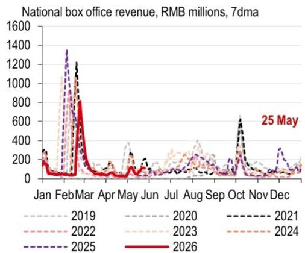

line

| Month   | 2019  | 2020  | 2021  | 2022  | 2023  | 2024  | 2025  | 2026  |
|---------|-------|-------|-------|-------|-------|-------|-------|-------|
| Jan     | ~200  | ~200  | ~200  | ~200  | ~200  | ~200  | ~200  | ~200  |
| Feb     | ~1300 | ~1300 | ~1300 | ~1300 | ~1300 | ~1300 | ~1300 | ~800  |
| Mar     | ~800  | ~800  | ~800  | ~800  | ~800  | ~800  | ~800  | ~800  |
| Apr     | ~300  | ~300  | ~300  | ~300  | ~300  | ~300  | ~300  | ~300  |
| May     | ~200  | ~200  | ~200  | ~200  | ~200  | ~200  | ~200  | ~200  |
| Jun     | ~150  | ~150  | ~150  | ~150  | ~150  | ~150  | ~150  | ~150  |
| Jul     | ~150  | ~150  | ~150  | ~150  | ~150  | ~150  | ~150  | ~150  |
| Aug     | ~250  | ~250  | ~250  | ~250  | ~250  | ~250  | ~250  | ~250  |
| Sep     | ~400  | ~400  | ~400  | ~400  | ~400  | ~400  | ~400  | ~400  |
| Oct     | ~650  | ~650  | ~650  | ~650  | ~650  | ~650  | ~650  | ~650  |
| Nov     | ~350  | ~350  | ~350  | ~350  | ~350  | ~350  | ~350  | ~350  |
| Dec     | ~150  | ~150  | ~150  | ~150  | ~150  | ~150  | ~150  | ~150  |

Source: Wind, HSBC

12. Housing prices in tier-1 cities edged up   
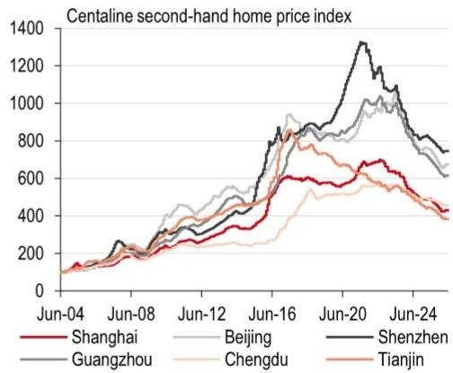

line

Centraline second-hand home price index
| Date | Shanghai | Beijing | Shenzhen | Guangzhou | Chengdu | Tianjin |
|---|---|---|---|---|---|---|
| Jun-04 | 100 | 100 | 100 | 100 | 100 | 100 |
| Jun-08 | 200 | 250 | 250 | 200 | 150 | 150 |
| Jun-12 | 300 | 400 | 400 | 350 | 250 | 300 |
| Jun-16 | 600 | 700 | 800 | 750 | 500 | 650 |
| Jun-20 | 700 | 900 | 1350 | 950 | 650 | 850 |
| Jun-24 | 450 | 650 | 750 | 650 | 450 | 550 |

Source: Bloomberg, HSBC; Note: as of 26 May

13. New home sales edged up seasonally   
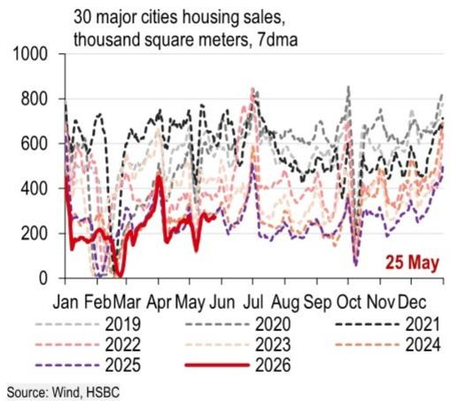

line

| Month | 2019 | 2020 | 2021 | 2022 | 2023 | 2024 | 2025 | 2026 |
|-------|------|------|------|------|------|------|------|------|
| Jan   | ~700 | ~600 | ~750 | ~650 | ~600 | ~550 | ~500 | ~450 |
| Feb   | ~600 | ~550 | ~700 | ~600 | ~550 | ~500 | ~450 | ~400 |
| Mar   | ~500 | ~450 | ~650 | ~550 | ~500 | ~450 | ~400 | ~350 |
| Apr   | ~650 | ~600 | ~750 | ~650 | ~600 | ~550 | ~500 | ~450 |
| May   | ~700 | ~650 | ~800 | ~700 | ~650 | ~600 | ~550 | ~500 |
| Jun   | ~750 | ~700 | ~850 | ~750 | ~700 | ~650 | ~600 | ~550 |
| Jul   | ~800 | ~750 | ~900 | ~800 | ~750 | ~700 | ~650 | ~600 |
| Aug   | ~750 | ~700 | ~850 | ~750 | ~700 | ~650 | ~600 | ~550 |
| Sep   | ~700 | ~650 | ~800 | ~700 | ~650 | ~600 | ~550 | ~500 |
| Oct   | ~650 | ~600 | ~750 | ~650 | ~600 | ~550 | ~500 | ~450 |
| Nov   | ~700 | ~650 | ~800 | ~700 | ~650 | ~600 | ~550 | ~500 |
| Dec   | ~750 | ~700 | ~850 | ~750 | ~700 | ~650 | ~600 | ~550 |
Source: Wind, HSBC

14. New home sales in Tier-1 cities were above last year's levels   
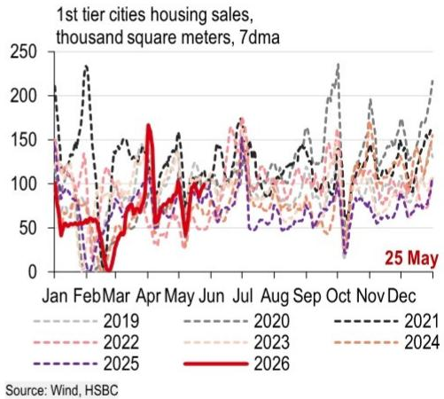

line

| Month | 2019 | 2020 | 2021 | 2022 | 2023 | 2024 | 2025 | 2026 |
|-------|------|------|------|------|------|------|------|------|
| Jan   | ~100 | ~100 | ~100 | ~100 | ~100 | ~100 | ~100 | ~100 |
| Feb   | ~150 | ~150 | ~250 | ~150 | ~150 | ~150 | ~150 | ~50  |
| Mar   | ~100 | ~100 | ~100 | ~100 | ~100 | ~100 | ~100 | ~50  |
| Apr   | ~150 | ~150 | ~150 | ~150 | ~150 | ~150 | ~150 | ~150 |
| May   | ~100 | ~100 | ~100 | ~100 | ~100 | ~100 | ~100 | ~100 |
| Jun   | ~150 | ~150 | ~150 | ~150 | ~150 | ~150 | ~150 | ~150 |
| Jul   | ~100 | ~100 | ~100 | ~100 | ~100 | ~100 | ~100 | ~150 |
| Aug   | ~150 | ~150 | ~150 | ~150 | ~150 | ~150 | ~150 | ~150 |
| Sep   | ~100 | ~100 | ~100 | ~100 | ~100 | ~100 | ~100 | ~150 |
| Oct   | ~250 | ~250 | ~250 | ~250 | ~250 | ~250 | ~250 | ~250 |
| Nov   | ~150 | ~150 | ~150 | ~150 | ~150 | ~150 | ~150 | ~150 |
| Dec   | ~250 | ~250 | ~250 | ~250 | ~250 | ~250 | ~250 | ~250 |
Source: Wind, HSBC

15. Second-hand home sales in 18 major cities remained above historical levels   
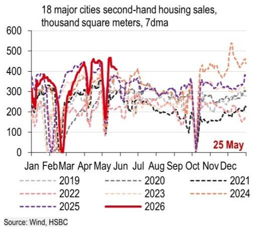

line

| Month | 2019 | 2020 | 2021 | 2022 | 2023 | 2024 | 2025 | 2026 |
|-------|------|------|------|------|------|------|------|------|
| Jan   |      |      |      |      |      |      |      |      |
| Feb   |      |      |      |      |      |      |      |      |
| Mar   |      |      |      |      |      |      |      |      |
| Apr   |      |      |      |      |      |      |      |      |
| May   |      |      |      |      |      |      |      |      |
| Jun   |      |      |      |      |      |      |      |      |
| Jul   |      |      |      |      |      |      |      |      |
| Aug   |      |      |      |      |      |      |      |      |
| Sep   |      |      |      |      |      |      |      |      |
| Oct   |      |      |      |      |      |      |      |      |
| Nov   |      |      |      |      |      |      |      | 25 May |
| Dec   |      |      |      |      |      |      |      |      |
Source: Wind, HSBC

16. Transactions in second-hand homes in Tier-1 & 2 cities remained higher y-o-y   

line

| Month | 2020-2025avg: Tier-1 | 2020-2025avg: Tier-2 | 2020-2025avg: Tier-3 | 2026: Tier-1 | 2026: Tier-2 | 2026: Tier-3 |
|-------|----------------------|----------------------|----------------------|-------------|-------------|-------------|
| Jan   | ~100                 | ~150                 | ~50                  | ~100        | ~150        | ~50         |
| Feb   | ~75                  | ~100                 | ~25                  | ~75         | ~100        | ~25         |
| Mar   | ~50                  | ~75                  | ~10                  | ~50         | ~75         | ~10         |
| Apr   | ~75                  | ~100                 | ~25                  | ~75         | ~100        | ~25         |
| May   | ~100                 | ~150                 | ~50                  | ~100        | ~150        | ~50         |
| Jun   | ~75                  | ~100                 | ~25                  | ~75         | ~100        | ~25         |
| Jul   | ~75                  | ~100                 | ~25                  | ~75         | ~100        | ~25         |
| Aug   | ~75                  | ~100                 | ~25                  | ~75         | ~100        | ~25         |
| Sep   | ~75                  | ~100                 | ~25                  | ~75         | ~100        | ~25         |
| Oct   | ~75                  | ~100                 | ~25                  | ~75         | ~100        | ~25         |
| Nov   | ~75                  | ~100                 | ~25                  | ~75         | ~100        | ~25         |
| Dec   | ~75                  | ~100                 | ~25                  | ~75         | ~100        | ~25         |
| 25 May| -                    | -                    | -                    | -           | -           | -           |

17. Land sales edged up   
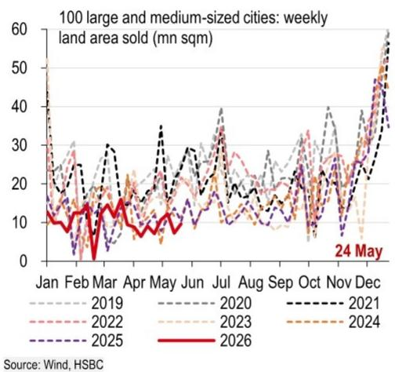

18. Planned construction area of land sold edged up   
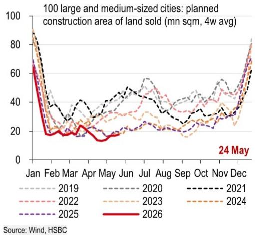

19. The semi-steel tyre operating rate edged down   
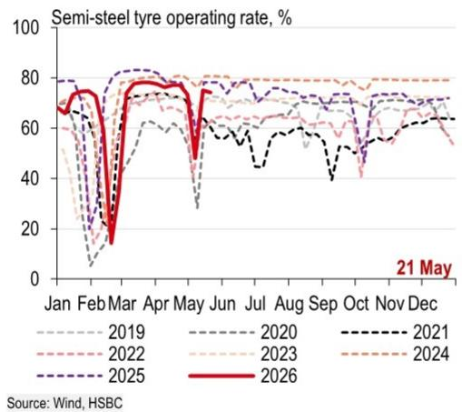

line

| Month | 2019 | 2020 | 2021 | 2022 | 2023 | 2024 | 2025 | 2026 |
|-------|------|------|------|------|------|------|------|------|
| Jan   | ~70  | ~70  | ~70  | ~70  | ~70  | ~70  | ~70  | ~70  |
| Feb   | ~10  | ~15  | ~15  | ~15  | ~15  | ~15  | ~15  | ~15  |
| Mar   | ~80  | ~80  | ~80  | ~80  | ~80  | ~80  | ~80  | ~80  |
| Apr   | ~70  | ~70  | ~70  | ~70  | ~70  | ~70  | ~70  | ~70  |
| May   | ~30  | ~30  | ~30  | ~30  | ~30  | ~30  | ~30  | ~30  |
| Jun   | ~60  | ~60  | ~60  | ~60  | ~60  | ~60  | ~60  | ~60  |
| Jul   | ~65  | ~65  | ~65  | ~65  | ~65  | ~65  | ~65  | ~65  |
| Aug   | ~65  | ~65  | ~65  | ~65  | ~65  | ~65  | ~65  | ~65  |
| Sep   | ~65  | ~65  | ~65  | ~65  | ~65  | ~65  | ~65  | ~65  |
| Oct   | ~40  | ~40  | ~40  | ~40  | ~40  | ~40  | ~40  | ~40  |
| Nov   | ~70  | ~70  | ~70  | ~70  | ~70  | ~70  | ~70  | ~70  |
| Dec   | ~70  | ~70  | ~70  | ~70  | ~70  | ~70  | ~70  | ~70  |
| Jan   | ~75  | ~75  | ~75  | ~75  | ~75  | ~75  | ~75  | ~75  |
| Feb   | ~80  | ~80  | ~80  | ~80  | ~80  | ~80  | ~80  | ~80  |
| Mar   | ~85  | ~85  | ~85  | ~85  | ~85  | ~85  | ~85  | ~85  |
| Apr   | ~85  | ~85  | ~85  | ~85  | ~85  | ~85  | ~85  | ~85  |
| May   | ~85  | ~85  | ~85  | ~85  | ~85  | ~85  | ~85  | ~85  |
| Jun   | ~85  | ~85  | ~85  | ~85  | ~85  | ~85  | ~85  | ~85  |
| Jul   | ~85  | ~85  | ~85  | ~85  | ~85  | ~85  | ~85  | ~85  |
| Aug   | ~85  | ~85  | ~85  | ~85  | ~85  | ~85  | ~85  | ~85  |
| Sep   | ~85  | ~85  | ~85  | ~85  | ~85  | ~85  | ~85  | ~85  |
| Oct   | ~70  | ~70  | ~70  | ~70  | ~70  | ~70  | ~70  | ~70  |
| Nov   | ~70  | ~70  | ~70  | ~70  | ~70  | ~70  | ~70  | ~70  |
| Dec   | ~70  | ~70  | ~70  | ~70  | ~70  | ~70  | ~70  | ~70  |
Source: Wind, HSBC

20. The production rate in the chemical sector moved lower   
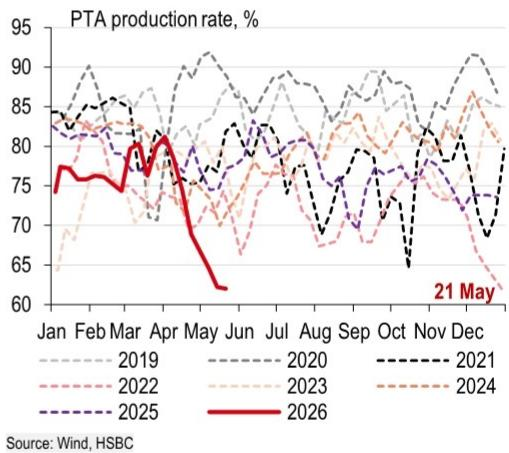

line

| Month | 2019 | 2020 | 2021 | 2022 | 2023 | 2024 | 2025 | 2026 |
|-------|------|------|------|------|------|------|------|------|
| Jan   | 83   | 83   | 83   | 83   | 83   | 83   | 83   | 76   |
| Feb   | 85   | 85   | 85   | 85   | 85   | 85   | 85   | 77   |
| Mar   | 87   | 87   | 87   | 87   | 87   | 87   | 87   | 78   |
| Apr   | 89   | 89   | 89   | 89   | 89   | 89   | 89   | 80   |
| May   | 91   | 91   | 91   | 91   | 91   | 91   | 91   | 62   |
| Jun   | 90   | 90   | 90   | 90   | 90   | 90   | 90   | —    |
| Jul   | 89   | 89   | 89   | 89   | 89   | 89   | 89   | —    |
| Aug   | 88   | 88   | 88   | 88   | 88   | 88   | 88   | —    |
| Sep   | 87   | 87   | 87   | 87   | 87   | 87   | 87   | —    |
| Oct   | 86   | 86   | 86   | 86   | 86   | 86   | 86   | —    |
| Nov   | 85   | 85   | 85   | 85   | 85   | 85   | 85   | —    |
| Dec   | 84   | 84   | 84   | 84   | 84   | 84   | 84   | —    |
| Jan* (Dec) | —      | —      | —      | —      | —      | —      | —      | —    |
Source: Wind, HSBC

21. The blast furnace operating rate remained above historical levels   
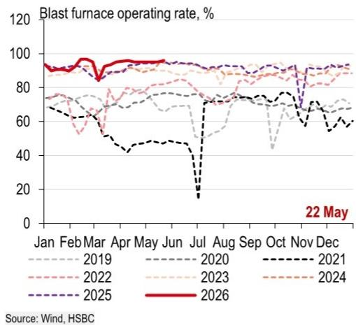

22. The petroleum asphalt operating rate picked moved lower   
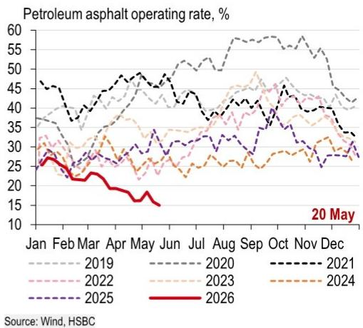

line

| Month | 2019 | 2020 | 2021 | 2022 | 2023 | 2024 | 2025 | 2026 |
|-------|------|------|------|------|------|------|------|------|
| Jan   | 38   | 45   | 47   | 30   | 30   | 30   | 25   | 25   |
| Feb   | 35   | 40   | 45   | 28   | 28   | 28   | 23   | 23   |
| Mar   | 37   | 42   | 48   | 26   | 26   | 26   | 22   | 22   |
| Apr   | 40   | 45   | 50   | 25   | 25   | 25   | 21   | 21   |
| May   | 42   | 48   | 52   | 24   | 24   | 24   | 18   | 18   |
| Jun   | 45   | 50   | 55   | 23   | 23   | 23   | 17   | 17   |
| Jul   | 48   | 52   | 58   | 25   | 25   | 25   | 20   | 20   |
| Aug   | 50   | 55   | 60   | 27   | 27   | 27   | 23   | 23   |
| Sep   | 52   | 58   | 62   | 29   | 29   | 29   | 26   | 26   |
| Oct   | 55   | 60   | 65   | 31   | 31   | 31   | 29   | 29   |
| Nov   | 58   | 62   | 68   | 33   | 33   | 33   | 31   | 31   |
| Dec   | 60   | 65   | 70   | 35   | 35   | 35   | 33   | 33   |
Source: Wind, HSBC

23. The cement shipping rate steadied   
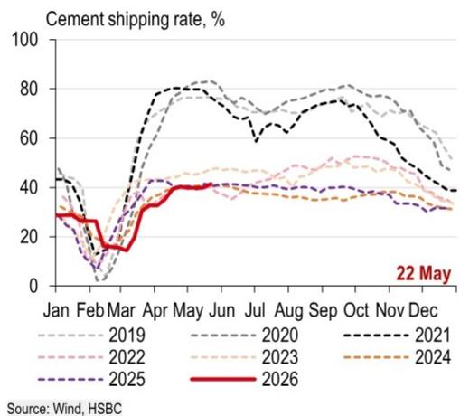

line

| Month | 2019 | 2020 | 2021 | 2022 | 2023 | 2024 | 2025 | 2026 |
|-------|------|------|------|------|------|------|------|------|
| Jan   | ~45  | ~45  | ~45  | ~35  | ~35  | ~35  | ~30  | ~30  |
| Feb   | ~10  | ~10  | ~10  | ~15  | ~15  | ~15  | ~10  | ~15  |
| Mar   | ~30  | ~30  | ~30  | ~20  | ~20  | ~20  | ~15  | ~15  |
| Apr   | ~75  | ~75  | ~80  | ~40  | ~40  | ~40  | ~40  | ~40  |
| May   | ~85  | ~85  | ~85  | ~45  | ~45  | ~45  | ~45  | ~45  |
| Jun   | ~80  | ~80  | ~80  | ~45  | ~45  | ~45  | ~45  | ~45  |
| Jul   | ~75  | ~75  | ~75  | ~45  | ~45  | ~45  | ~45  | ~45  |
| Aug   | ~70  | ~70  | ~70  | ~45  | ~45  | ~45  | ~45  | ~45  |
| Sep   | ~75  | ~75  | ~75  | ~45  | ~45  | ~45  | ~45  | ~45  |
| Oct   | ~70  | ~70  | ~70  | ~45  | ~45  | ~45  | ~45  | ~45  |
| Nov   | ~65  | ~65  | ~65  | ~45  | ~45  | ~45  | ~45  | ~45  |
| Dec   | ~60  | ~60  | ~60  | ~45  | ~45  | ~45  | ~45  | ~45  |
| Jan   | ~30  | ~30  | ~30  | ~30  | ~30  | ~30  | ~30  | ~30  |
Source: Wind, HSBC

24. Coal consumption for eight major provinces edged down   
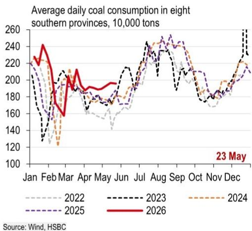

line

| Month | 2022 | 2023 | 2024 | 2025 | 2026 |
|-------|------|------|------|------|------|
| Jan   | 210  | 220  | 215  | 215  | 230  |
| Feb   | 180  | 130  | 125  | 160  | 165  |
| Mar   | 190  | 195  | 185  | 190  | 170  |
| Apr   | 185  | 180  | 180  | 185  | 195  |
| May   | 175  | 185  | 185  | 180  | 190  |
| Jun   | 180  | 200  | 190  | 185  | 195  |
| Jul   | 200  | 240  | 210  | 200  | 230  |
| Aug   | 210  | 250  | 230  | 240  | 245  |
| Sep   | 205  | 245  | 240  | 250  | 245  |
| Oct   | 195  | 230  | 235  | 240  | 235  |
| Nov   | 185  | 190  | 195  | 195  | 195  |
| Dec   | 210  | 260  | 240  | 215  | -    |
| Jan   | -    | -    | -    | -    | -    |
| Feb   | -    | -    | -    | -    | -    |
| Mar   | -    | -    | -    | -    | -    |
| Apr   | -    | -    | -    | -    | -    |
| May   | -    | -    | -    | -    | -    |
| Jun   | -    | -    | -    | -    | -    |
| Jul   | -    | -    | -    | -    | -    |
| Aug   | -    | -    | -    | -    | -    |
| Sep   | -    | -    | -    | -    | -    |
| Oct   | -    | -    | -    | -    | -    |
| Nov   | -    | -    | -    | -    | -    |
| Dec   | -    | -    | -    | -    | -    |
| Jan   | -    | -    | -    | -    | -    |
| Feb   | -    | -    | -    | -    | -    |
| Mar   | -    | -    | -    | -    | -    |
| Apr   | -    | -    | -    | -    | -    |
| May   | -    | -    | -    | -    | -    |
|
| Jun   | -    | -    | -    | -    | -    |
| Jul   | -    | -    | -    | -    | -    |
| Aug   | -    | -    | -    | -    | -    |
| Sep   | -    | -    | -    | -    | -    |
| Oct   | -    | -    | -    | -    | -    |
| Nov   | ~180                 | ~185                 | ~185                 | ~185                 | ~185                 |
| Dec   | ~210                 | ~260                 | ~240                 | ~215                 | ~230                 |
| Jan   | ~230                 | ~240                 | ~235                 | ~230                 | ~245                 |
| Feb   | ~240                 | ~230                 | ~235                 | ~235                 | ~250                 |
| Mar   | ~235                 | ~215                 | ~195                 | ~195                 | ~165                 |
| Apr   | ~230                 | ~205                 | ~195                 | ~195                 | ~185                 |
| May   | ~235                 | ~210                 | ~195                 | ~195                 | ~190                 |
| Jun   | ~240                 | ~215                 | ~195                 | ~195                 | ~195                 |
| Jul   | ~245                 | ~230                 | ~205                 | ~205                 | ~205                 |
| Aug   | ~245                 | ~240                 | ~215                 | ~215                 | ~215                 |
| Sep   | ~245                 | ~245                 | ~215                 | ~215                 | ~215                 |
| Oct   | ~245                 | ~245                 | ~215                 | ~215                 | ~215                 |
| Nov   | ~245                 | ~245                 | ~215                 | ~215                 | ~215                 |
| Dec   | ~245                 | ~245                 | ~215                 | ~215                 | ~215                 |
| Jan   | ~245                 | ~245                 | ~215                 | ~215                 | ~215                 |
| Feb   | ~245                 | ~245                 | ~215                 | ~215                 | ~215                 |
| Mar   | ~245                 | ~245                 | ~215                 | ~215                 | ~215                 |
| Apr   | ~245                 | ~245                 | ~215                 | ~215                 | ~215                 |
| May   | ~245                 | ~245                 | ~215                 | ~215                 | ~215                 |
| Jun   | ~245                 | ~245                 | ~215                 | ~215                 | ~215                 |
| Jul   | ~245                 | ~245                 | ~215                 | ~215                 | ~215                 |
| Aug   | ~245                 | ~245                 | ~215                 | ~215                 | ~215                 |
| Sep   | ~245                 | ~245                 | ~215                 | ~215                 | ~215                 |
| Oct   | ~245                 | ~245                 | ~215                 | ~215                 | ~215                 |
| Nov   | ~245                 | ~-    | ~-    | ~-    | ~-    |
| Dec   | ~-    | ~-    | ~-    | ~-    | ~-    |
Source: Wind, HSBC

25. The operating rate of polyester filaments eased further   
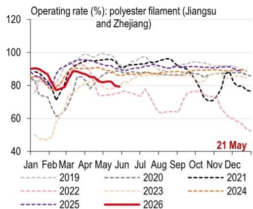

line

| Month | 2019 | 2020 | 2021 | 2022 | 2023 | 2024 | 2025 | 2026 |
|-------|------|------|------|------|------|------|------|------|
| Jan   | 85   | 85   | 85   | 85   | 85   | 85   | 85   | 85   |
| Feb   | 75   | 75   | 75   | 75   | 75   | 75   | 75   | 75   |
| Mar   | 85   | 85   | 85   | 85   | 85   | 85   | 85   | 85   |
| Apr   | 95   | 95   | 95   | 95   | 95   | 95   | 95   | 95   |
| May   | 90   | 90   | 90   | 90   | 90   | 90   | 90   | 90   |
| Jun   | 85   | 85   | 85   | 85   | 85   | 85   | 85   | 85   |
| Jul   | 90   | 90   | 90   | 90   | 90   | 90   | 90   | 90   |
| Aug   | 95   | 95   | 95   | 95   | 95   | 95   | 95   | 95   |
| Sep   | 90   | 90   | 90   | 90   | 90   | 90   | 90   | 90   |
| Oct   | 85   | 85   | 85   | 85   | 85   | 85   | 85   | 85   |
| Nov   | 80   | 80   | 80   | 80   | 80   | 80   | 80   | 80   |
| Dec   | 75   | 75   | 75   | 75   | 75   | 75   | 75   | 75   |
| Jan* (Dec) | ~80%       | ~80% | ~80% | ~80% | ~80% | ~80% | ~80% | ~80% |
| Feb* (Dec)      | ~75%       | ~75% | ~75% | ~75% | ~75% | ~75% | ~75% | ~75% |
| Mar* (Dec)      | ~80%       | ~80% | ~80% | ~80% | ~80% | ~80% | ~80% | ~80% |
| Apr* (Dec)      | ~85%       | ~85% | ~85% | ~85% | ~85% | ~85% | ~85% | ~85% |
| May* (Dec)      | ~90%       | ~90% | ~90% | ~90% | ~90% | ~90% | ~90% | ~90% |
| Jun* (Dec)      | ~85%       | ~85% | ~85% | ~85% | ~85% | ~85% | ~85% | ~85% |
| Jul* (Dec)      | ~80%       | ~80% | ~80% | ~80% | ~80% | ~80% | ~80% | ~80% |
| Aug* (Dec)      | ~75%       | ~75% | ~75% | ~75% | ~75% | ~75% | ~75% | ~75% |
| Sep* (Dec)      | ~70%       | ~70% | ~70% | ~70% | ~70% | ~70% | ~70% | ~70% |
| Oct* (Dec)      | ~65%       | ~65% | ~65% | ~65% | ~65% | ~65% | ~65% | ~65% |
| Nov* (Dec)      | ~60%       | ~60% | ~60% | ~60% | ~60% | ~60% | ~60% | ~60% |
| Dec* (Dec)      | ~55%       | ~55% | ~55% | ~55% | ~55% | ~55% | ~55% | ~55% |
| Jan* (Jan)      | ~60%       | ~60% | ~60% | ~60% | ~60% | ~60% | ~60% | ~60% |
| Feb* (Jan)      | ~65%       | ~65% | ~65% | ~65% | ~65% | ~65% | ~65% | ~65% |
| Mar* (Jan)      | ~70%       | ~70% | ~70% | ~70% | ~70% | ~70% | ~70% | ~70% |
| Apr* (Jan)      | ~75%       | ~75% | ~75% | ~75% | ~75% | ~75% | ~75% | ~75% |
| May* (Jan)      | ~80%       | ~80% | ~80% | ~80% | ~80% | ~80% | ~80% | ~80% |
| Jun* (Jan)      | ~75%       | ~75% | ~75% | ~75% | ~75% | ~75% | ~75% | ~75% |
| Jul* (Jan)      | ~70%       | ~70% | ~70% | ~70% | ~70% | ~70% | ~70% | ~70% |
| Aug* (Jan)      | ~65%       | ~65% | ~65% | ~65% | ~65% | ~65% | ~65% | ~65% |
| Sep* (Jan)      | ~60%       | ~60% | ~60% | ~60% | ~60% | ~60% | ~60% | ~60% |
| Oct* (Jan)      | ~65%       | ~65% | ~65% | ~65% | ~65% | ~65% | ~65% | ~65% |
| Nov* (Jan)      | ~70%       | ~70% | ~70% | ~70% | ~70% | ~70% | ~70% | ~70% |
| Dec* (Jan)      |
| Jan* (Dec)      |
| Feb* (Dec)      |
| Mar* (Dec)      |
| Apr* (Dec)      |
| May* (Dec)      |
| Jun* (Dec)      |
| Jul* (Dec)      |
| Aug* (Dec)      |
| Sep* (Dec)      |
| Oct* (Dec)      |
| Nov* (Dec)      |
| Dec* (Dec)      |
| Jan* (Mar)* (Jun)|    nan|    nan|    nan|    nan|    nan|    nan|    nan|    nan|
| Feb* (Mar)* (Jun)|    nan|    nan|    nan|    nan|    nan|    nan|    nan|    nan|
| Mar* (Mar)* (Jun)|    nan|    nan|    nan|    nan|    nan|    nan|    nan|    nan|
| Apr* (Mar)* (Jun)|    nan|    nan|    nan|    nan|    nan|    nan|    nan|    nan|
| May* (Mar)* (Jun)|    nan|    nan|    nan|    nan|    nan|    nan|    nan|    nan|
| Jun* (Mar)* (Jun)|    nan|    nan|    nan|    nan|    nan|    nan|    nan|    nan|
| Jul* (Mar)* (Jun)|    nan|    nan|    nan|    nan|    nan|    nan|    nan|    nan|
| Aug* (Mar)* (Jun)|    nan|    nan|    nan|    nan|    nan|    nan|    nan|    nan|
| Sep* (Mar)* (Jun)|    nan|    nan|    nan|    nan|    nan|    nan|    nan|    nan|
| Oct* (Mar)* (Jun)|    nan|    nan|    nan|    nan|    nan|    nan|    nan|    nan|
| Nov* (Mar)* (Jun)|    nan|    nan|    nan|    nan|    nan|    nan|    nan|    nan|
| Dec* (Mar)* (Jun)|    nan|    nan|    nan|    nan|    nan|    nan|    nan|    nan|

Source: Wind, HSBC

26. The Baltic Dry Index edged down   
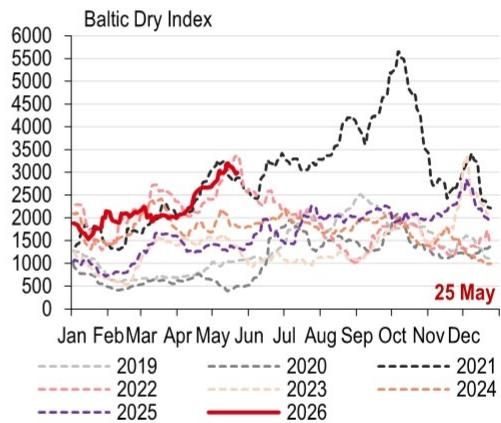  
Source: Wind, HSBC

# Travel and logistics

27. Metro volumes in large cities edged up seasonally   
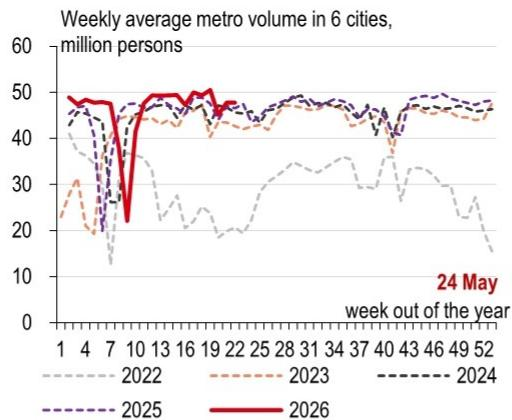

line

| Week | 2022 | 2023 | 2024 | 2025 | 2026 |
|------|------|------|------|------|------|
| 1    | 45   | 30   | 48   | 48   | 48   |
| 4    | 40   | 25   | 45   | 45   | 45   |
| 7    | 15   | 20   | 40   | 40   | 40   |
| 10   | 30   | 35   | 45   | 45   | 45   |
| 13   | 35   | 40   | 48   | 48   | 48   |
| 16   | 30   | 45   | 45   | 45   | 45   |
| 19   | 25   | 40   | 48   | 48   | 48   |
| 22   | 30   | 35   | 45   | 45   | 45   |
| 25   | 35   | 40   | 48   | 48   | 48   |
| 28   | 30   | 35   | 45   | 45   | 45   |
| 31   | 35   | 40   | 48   | 48   | 48   |
| 34   | 30   | 35   | 45   | 45   | 45   |
| 37   | 35   | 40   | 48   | 48   | 48   |
| 40   | 30   | 35   | 45   | 45   | 45   |
| 43   | 35   | 40   | 48   | 48   | 48   |
| 46   | 30   | 35   | 45   | 45   | 45   |
| 49   | 25   | 30   | 48   | 48   | 48   |
| 52   | 15   | 25   | 45   | 45   | 45   |

Source: Wind, HSBC; note: six cities include Beijing, Shanghai, Guangzhou, Shenzhen, Chengdu and Tianjin.

28. Postal delivery volumes edged up   
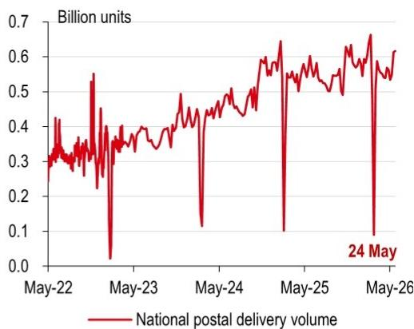

line

| Date     | National postal delivery volume (Billion units) |
| -------- | ----------------------------------------------- |
| 24 May   | 0.6                                             |

Source: Wind, HSBC

29. Container exports from China to the US edged down   
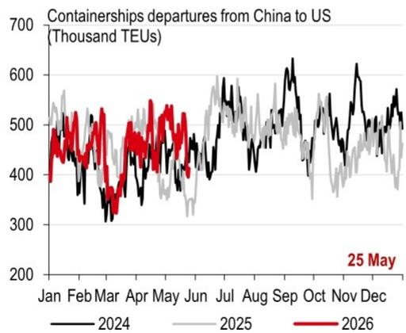

line

| Month | 2024 | 2025 | 2026 |
|-------|------|------|------|
| Jan   | ~450 | ~550 | ~480 |
| Feb   | ~350 | ~500 | ~520 |
| Mar   | ~300 | ~450 | ~480 |
| Apr   | ~350 | ~480 | ~500 |
| May   | ~400 | ~450 | ~520 |
| Jun   | ~450 | ~480 | ~500 |
| Jul   | ~500 | ~520 | ~550 |
| Aug   | ~550 | ~500 | ~580 |
| Sep   | ~600 | ~480 | ~620 |
| Oct   | ~550 | ~450 | ~580 |
| Nov   | ~600 | ~480 | ~620 |
| Dec   | ~550 | ~450 | ~580 |

Source: Bloomberg, HSBC

30. China's major ports' freight throughput edged up   
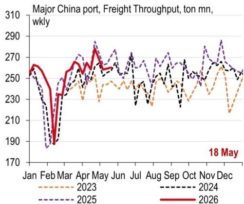

line

Major China port, Freight Throughput, ton mn, wkly
| Month | 2023 (dashed orange) | 2024 (dashed black) | 2025 (dashed purple) | 2026 (solid red) |
|---|---|---|---|---|
| Jan | 255 | 258 | 257 | 260 |
| Feb | 190 | 188 | 187 | 190 |
| Mar | 230 | 240 | 245 | 250 |
| Apr | 245 | 255 | 270 | 275 |
| May | 230 | 260 | 280 | 285 |
| Jun | 245 | 255 | 270 | 265 |
| Jul | 230 | 240 | 260 | 255 |
| Aug | 240 | 250 | 265 | 260 |
| Sep | 235 | 245 | 270 | 265 |
| Oct | 230 | 240 | 260 | 260 |
| Nov | 240 | 255 | 275 | 265 |
| Dec | 215 | 250 | 260 | 255 |
18 May

Source: CEIC, HSBC; Note: Weekly beginning at Monday

# Inflation and policies

31. Crude oil prices moved up again amid ongoing uncertainty in the Middle East   
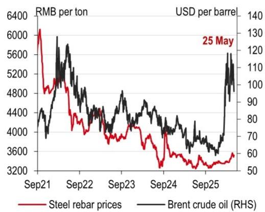

line

| Date   | Steel rebar prices (RMB per ton) | Brent crude oil (RHS) (USD per barrel) |
|--------|-----------------------------------|----------------------------------------|
| 25 May | 3600                              | 130                                    |

Source: Wind, HSBC

32. Cement prices and glass prices both edged down   
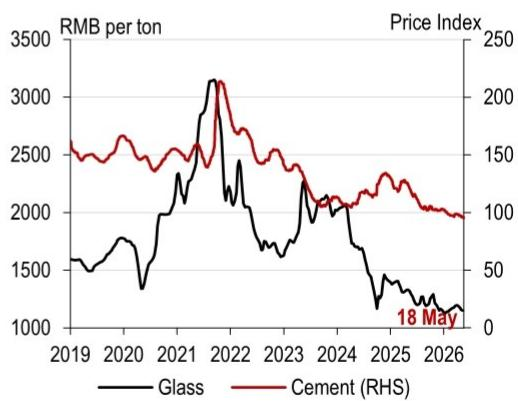

line

| Year | Glass (RMB per ton) | Cement (RHS) (Price Index) |
|------|---------------------|----------------------------|
| 2019 | ~1500               | ~150                       |
| 2020 | ~1700               | ~160                       |
| 2021 | ~2500               | ~170                       |
| 2022 | ~3200               | ~220                       |
| 2023 | ~1800               | ~140                       |
| 2024 | ~1500               | ~130                       |
| 2025 | ~1200               | ~120                       |
| 2026 | ~1000               | ~100                       |

Source: Wind, HSBC

33. Agricultural product prices eased seasonally   
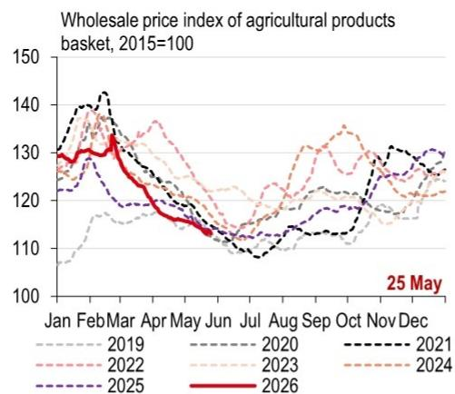  
Source: Wind, HSBC

34. Container shipping costs on China-Southeast Asia route edged down   
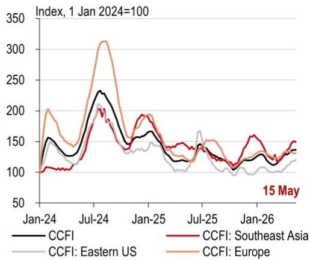

line

| Date    | CCFI | CCFI: Southeast Asia | CCFI: Eastern US | CCFI: Europe |
|---------|------|----------------------|------------------|--------------|
| Jan-24  | 100  | 100                  | 100              | 100          |
| Jul-24  | 230  | 200                  | 210              | 310          |
| Jan-25  | 150  | 180                  | 140              | 190          |
| Jul-25  | 130  | 140                  | 160              | 150          |
| Jan-26  | 120  | 150                  | 110              | 130          |

Source: Wind, HSBC

35. Interbank rates edged down   
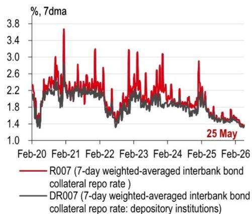

line

| Date    | R007 (7-day weighted-averaged interbank bond collateral repo rate) | DR007 (7-day weighted-averaged interbank bond collateral repo rate: depository institutions) |
|---------|------------------------------------------------------------------|------------------------------------------------------------------------------------|
| 25 May  | 1.4                                                              | 1.4                                                                                |

Source: Wind, HSBC

36. The PBoC made net injections through OMOs last week   
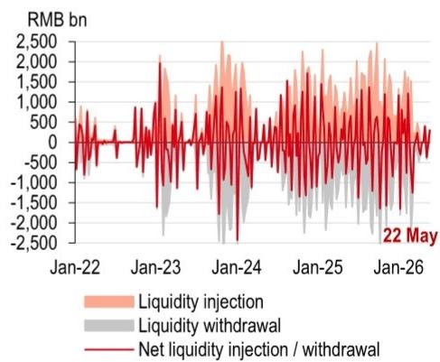

line

| Date    | Liquidity injection | Liquidity withdrawal | Net liquidity injection / withdrawal |
|---------|---------------------|----------------------|----------------------------------------|
| Jan-22  | ~0                  | ~0                   | ~0                                     |
| Jan-23  | ~1,500              | ~-1,000              | ~-500                                  |
| Jan-24  | ~2,000              | ~-1,500              | ~-1,000                                |
| Jan-25  | ~1,500              | ~-1,000              | ~-500                                  |
| Jan-26  | ~1,000              | ~-500                | ~0                                     |

Source: Wind, HSBC

# Links to recent reports in the China Macro Tracker series

Stable relations, but domestic pressures, 20 May 2026   
First Presidential summit of the year arrives, 13 May 2026   
Future focused, 6 May 2026   
Tougher investment security reviews, 29 April 2026   
More reserve policies are in the pipeline, 22 April 2026   
Focus on "doing o's own thing well", 15 April 2026   
Better coordination of development and security, 9 April 2026   
Resilience and stability could pay off, 1 April 2026   
Expanding opening-up and FDI, 25 March 2026   
A good start, more moves to follow, 18 March 2026   
NPC press conferences, global oil volatility, 11 March 2026   
China's Two Sessions in a volatile world, 4 March 2026   
US tariff changes, record breaking CNY holiday, 25 February 2026   
Boosting investment and innovation, 11 February 2026   
Chinese New Year migration begins, China-UK reset, 4 February 2026   
A more conservative approach to the GDP target, 28 January 2026   
Domestic pressures may prompt more urgency, 21 January 2026   
Domestic demand needs an investment lift, 14 January 2026   
Starting the new year with policy support, 7 January 2026   
Demand-led rebalancing, 17 December 2025   
Politburo, Pandas and Provincial Five-Year Plans, 10 December 2025   
Last policy meetings for the year approaching, 3 December 2025   
Phone a friend, 26 November 2025   
Not yet at the finishing line, 19 November 2025   
A balanced approach, 12 November 2025   
A new tenuous equilibrium, 5 November 2025   
Potential trade breakthroughs, 29 October 2025   
Deal or no deal, 22 October 2025   
On pins and needles, 15 October 2025   
New measures before the Golden Week, 1 October 2025   
Talking points, 24 September 2025   
US-China talks see progress in Madrid, 17 September 2025   
Anti-involution to help longer-term development, 10 September 2025   
Domestic reforms accelerating, 3 September 2025   
Green transition to help the anti-involution campaign, 27 August 2025   
More measures to support growth, 20 August 2025   
Another 90-day tariff truce, 13 August 2025   
A clear pro-growth tone, 6 August 2025   
Tailwinds from services subsidies, 29 July 2025

# Disclosure appendix

# Analyst Certification

The following analyst(s), economist(s), or strategist(s) who is(are) primarily responsible for this report, including any analyst(s) whose name(s) appear(s) as author of an individual section or sections of the report and any analyst(s) named as the covering analyst(s) of a subsidiary company in a sum-of-the-parts valuation certifies(y) that the opinion(s) on the subject security(ies) or issuer(s), any views or forecasts expressed in the section(s) of which such individual(s) is(are) named as author(s), and any other views or forecasts expressed herein, including any views expressed on the back page of the research report, accurately reflect their personal view(s) and that no part of their compensation was, is or will be directly or indirectly related to the specific recommendation(s) or views contained in this research report: Taylor Wang and Jing Liu

# Important disclosures

This document has been prepared and is being distributed by the Research Department of HSBC and is intended solely for the clients of HSBC and is not for publication to other persons, whether through the press or by other means.

This document is for information purposes only and it should not be regarded as an offer to sell or as a solicitation of an offer to buy the securities or other investment products mentioned in it and/or to participate in any trading strategy. Advice in this document is general and should not be construed as personal advice, given it has been prepared without taking account of the objectives, financial situation or needs of any particular investor. Accordingly, investors should, before acting on the advice, consider the appropriateness of the advice, having regard to their objectives, financial situation and needs. If necessary, seek professional investment and tax advice.

Certain investment products mentioned in this document may not be eligible for sale in some states or countries, and they may not be suitable for all types of investors. Investors should consult with their HSBC representative regarding the suitability of the investment products mentioned in this document and take into account their specific investment objectives, financial situation or particular needs before making a commitment to purchase investment products.

The value of and the income produced by the investment products mentioned in this document may fluctuate, so that an investor may get back less than originally invested. Certain high-volatility investments can be subject to sudden and large falls in value that could equal or exceed the amount invested. Value and income from investment products may be adversely affected by exchange rates, interest rates, or other factors. Past performance of a particular investment product is not indicative of future results.

HSBC and its affiliates will from time to time sell to and buy from customers the securities/instruments, both equity and debt (including derivatives) of companies covered in HSBC on a principal or agency basis or act as a market maker or liquidity provider in the securities/instruments mentioned in this report.

Analysts, economists, and strategists are paid in part by reference to the profitability of HSBC which includes investment banking, sales & trading, and principal trading revenues.

Whether, or in what time frame, an update of this analysis will be published is not determined in advance.

For disclosures in respect of any company mentioned in this report, please see the most recently published report on that company available at www.hsbcnet.com/research. HSBC Private Bank clients should contact their Relationship Manager for queries regarding other research reports. In order to find out more about the proprietary models used to produce this report, please contact the authoring analyst.

# Additional disclosures

1 This report is dated as at 27 May 2026.   
2 All market data included in this report are dated as at close 26 May 2026, unless a different date and/or a specific time of day is indicated in the report.   
3 HSBC has procedures in place to identify and manage any potential conflicts of interest that arise in connection with its Research business. HSBC's analysts and its other staff who are involved in the preparation and dissemination of Research operate and have a management reporting line independent of HSBC's Investment Banking business. Information Barrier procedures are in place between the Investment Banking, Principal Trading, and Research businesses to ensure that any confidential and/or price sensitive information is handled in an appropriate manner.   
4 You are not permitted to use, for reference, any data in this document for the purpose of (i) determining the interest payable, or other sums due, under loan agreements or under other financial contracts or instruments, (ii) determining the price at which a financial instrument may be bought or sold or traded or redeemed, or the value of a financial instrument, and/or (iii) measuring the performance of a financial instrument or of an investment fund.

# Disclaimer

Legal entities as at 13 May 2026:

HSBC Bank plc; HSBC Continental Europe; HSBC Continental Europe SA, Germany; HSBC Bank Middle East Limited, DIFC; HSBC Bank Middle East Limited, Dubai branch; HSBC Yatirim Menkul Degerler AS, Istanbul; The Hongkong and Shanghai Banking Corporation Limited, Hong Kong; The Hongkong and Shanghai Banking Corporation Limited, Singapore Branch; The Hongkong and Shanghai Banking Corporation Limited, Seoul Securities Branch; The Hongkong and Shanghai Banking Corporation Limited, Seoul Branch; HSBC Qianhai Securities Limited; HSBC Securities (Taiwan) Corporation Limited; HSBC Securities and Capital Markets (India) Private Limited, Mumbai; HSBC Bank Australia Limited; HSBC Securities (USA) Inc., New York; HSBC México, SA, Institución de Banca Múltiple, Grupo Financiero HSBC; Banco HSBC SA

Issuer of report

The Hongkong and Shanghai Banking Corporation Limited

Level 16, 1 Queen's Road Central

Hong Kong SAR

Telephone: +852 2843 9111

Fax: +852 2801 4138

Website: www.research.hsbc.com

This document has been issued by The Hongkong and Shanghai Banking Corporation Limited ("HSBC") in the conduct of its Hong Kong regulated business for the information of its institutional and professional investor (as defined by Securities and Future Ordinance (Chapter 571)) customers; it is not intended for and should not be distributed to retail customers in Hong Kong, unless permitted otherwise. The Hongkong and Shanghai Banking Corporation Limited is regulated by the Hong Kong Monetary Authority. All enquires by recipients in Hong Kong must be directed to your HSBC contact in Hong Kong. If it is received by a customer of an affiliate of HSBC, its provision to the recipient is subject to the terms of business in place between the recipient and such affiliate. Any recommendations contained in it are intended for the professional investors to whom it is distributed. This material is not and should not be construed as an offer to sell or the solicitation of an offer to purchase or subscribe for any investment. HSBC has based this document on information obtained from sources it believes to be reliable but which it has not independently verified; HSBC makes no guarantee, representation or warranty and accepts no responsibility or liability as to its accuracy or completeness. Expressions of opinion are those of HSBC only and are subject to change without notice. From time to time research analysts conduct site visits of covered issuers. HSBC policies prohibit research analysts from accepting payment or reimbursement for travel expenses from the issuer for such visits. The decision and responsibility on whether or not to invest must be taken by the reader. HSBC and its affiliates and/or their officers, directors and employees may have positions in any securities mentioned in this document (or in any related investment) and may from time to time add to or dispose of any such securities (or investment). HSBC and its affiliates may act as market maker or have assumed an underwriting commitment in the securities of any companies discussed in this document (or in related investments), may sell them to or buy them from customers on a principal basis and may also perform or seek to perform banking or underwriting services for or relating to those companies. This material may not be further distributed in whole or in part for any purpose. No consideration has been given to the particular investment objectives, financial situation or particular needs of any recipient. The document is intended to be distributed in its entirety. Unless governing law permits otherwise, you must contact a HSBC Group member in your home jurisdiction if you wish to use HSBC Group services in effecting a transaction in any investment mentioned in this document.

In the UK, this publication is distributed by HSBC Bank plc for the information of its Clients (as defined in the Rules of FCA) and those of its affiliates only. Nothing herein excludes or restricts any duty or liability to a customer which HSBC Bank plc has under the Financial Services and Markets Act 2000 or under the Rules of FCA and PRA. A recipient who chooses to deal with any person who is not a representative of HSBC Bank plc in the UK will not enjoy the protections afforded by the UK regulatory regime. HSBC Bank plc is regulated by the Financial Conduct Authority and the Prudential Regulation Authority.

In the European Economic Area, this publication has been distributed by HSBC Continental Europe or by such other HSBC affiliate from which the recipient receives relevant services. In Japan, this publication has been distributed by HSBC Securities (Japan) Co., Ltd.. It may not be further distributed in whole or in part for any purpose. In Korea, this publication is distributed by either The Hongkong and Shanghai Banking Corporation Limited, Seoul Securities Branch ("HBAP SLS") or The Hongkong and Shanghai Banking Corporation Limited, Seoul Branch ("HBAP SEL") for the general information of professional investors specified in Article 9 of the Financial Investment Services and Capital Markets Act ("FSCMA"). This publication is not a prospectus as defined in the FSCMA. It may not be further distributed in whole or in part for any purpose. Both HBAP SLS and HBAP SEL are regulated by the Financial Services Commission and the Financial Supervisory Service of Korea. In Singapore, this publication is distributed by The Hongkong and Shanghai Banking Corporation Limited, Singapore Branch for the general information of institutional investors or other persons specified in Sections 274 and 304 of the Securities and Futures Act 2001 of Singapore ("SFA") and accredited investors and other persons in accordance with the conditions specified in Sections 275 and 305 of the SFA. Only Economics or Currencies reports are intended for distribution to a person who is not an Accredited Investor, Expert Investor or Institutional Investor as defined in SFA. The Hongkong and Shanghai Banking Corporation Limited, Singapore Branch accepts legal responsibility for the contents of reports. This publication is not a prospectus as defined in the SFA. It may not be further distributed in whole or in part for any purpose. The Hongkong and Shanghai Banking Corporation Limited Singapore Branch is regulated by the Monetary Authority of Singapore. Recipients in Singapore should contact a "Hongkong and Shanghai Banking Corporation Limited, Singapore Branch" representative in respect of any matters arising from, or in connection with this report. Please refer to The Hongkong and Shanghai Banking Corporation Limited Singapore Branch's website at www.business.hsbc.com.sg for contact details. In Australia, this publication has been distributed by The Hongkong and Shanghai Banking Corporation Limited (ABN 65 117 925 970, AFSL 301737) for the general information of its "wholesale" customers (as defined in the Corporations Act 2001). Where distributed to retail customers, this research is distributed by HSBC Bank Australia Limited (ABN 48 006 434 162, AFSL No. 232595). These respective entities make no representations that the products or services mentioned in this document are available to persons in Australia or are necessarily suitable for any particular person or appropriate in accordance with local law. No consideration has been given to the particular investment objectives, financial situation or particular needs of any recipient.

HSBC Securities (USA) Inc. accepts responsibility for the content of this research report prepared by its non-US foreign affiliate. The information contained herein is under no circumstances to be construed as investment advice and is not tailored to the needs of the recipient. All US persons receiving and/or accessing this report and intending to effect transactions in any security discussed herein should do so with HSBC Securities (USA) Inc. in the United States and not with its non-US foreign affiliate, the issuer of this report. HSBC México, SA, Institución de Banca Múltiple, Grupo Financiero HSBC is authorized and regulated by Secretaría de Hacienda y Crédito Público and Comisión Nacional Bancaria y de Valores (CNBV). In Brazil, this document has been distributed by Banco HSBC SA ("HSBC Brazil"), and/or its affiliates. As required by Resolution No. 20/2021 of the Securities and Exchange Commission of Brazil (Comissão de Valores Mobiliários), potential conflicts of interest concerning (i) HSBC Brazil and/or its affiliates; and (ii) the analyst(s) responsible for authoring this report are stated on the chart above labelled "HSBC & Analyst Disclosures".

If you are a customer of HSBC International Wealth & Premier Banking ("IWPB"), including HSBC Private Bank, you are eligible to receive this publication only if: (i) you have been approved to receive relevant research publications by an applicable HSBC legal entity; (ii) you have agreed to the applicable HSBC entity's terms and conditions and/or customer declaration for accessing research; and (iii) you have agreed to the terms and conditions of any other internet banking, online banking, mobile banking and/or investment services offered by that HSBC entity, through which you will access research publications (collectively with (ii), the "Terms"). If you do not meet the above eligibility requirements, please disregard this publication and, if you are a IWPB customer, please notify your Relationship Manager or call the relevant customer hotline. Distribution of this publication is the sole responsibility of the HSBC entity with whom you have agreed the Terms. Receipt of research publications is strictly subject to the Terms and any other conditions or disclaimers applicable to the provision of the publications that may be advised by IWPB. © Copyright 2026, The Hongkong and Shanghai Banking Corporation Limited, ALL RIGHTS RESERVED. No part of this publication may be reproduced, stored in a retrieval system, or transmitted, on any form or by any means, electronic, mechanical, photocopying, recording, or otherwise, without the prior written permission of The Hongkong and Shanghai Banking Corporation Limited.

[1280094]

# Global Economics Research Team

# Global

Global Chief Economist  
Janet Henry +44 20 7991 6711  
janet.henry@hsbcib.com

Global Economist  
James Pomeroy +44 20 7991 6714  
james.pomeroy@hsbc.com

Global Economist  
Bethan Ellis +44 20 7991 6714  
bethan.ellis@hsbc.com

Trade Economist  
Shanella Rajanayagam +44 20 3268 4118  
shanella.l.ajanayagam@hsbc.com

# Europe

Chief European Economist
Simon Wells +44 20 7991 6718
simon.wells@hsbcib.com

Senior Economist
Chris Hare +44 20 7991 2995
chris.hare@hsbc.com

# United Kingdom

Senior Economist, UK
Elizabeth Martins +44 20 7991 2170
liz.martins@hsbc.com

UK Economist
Emma Wilks + 44 20 3268 5948
emma.wilks@hsbc.com

# Germany

Stefan Schilbe +49 211 910 3137
stefan.schilbe@hsbc.de

Anja Sabine Heimann +44 738 724 7457
anja.sabine.heimann@hsbc.com

# France

Chantana Sam +33 1 4070 7795
chantana.sam@hsbc.fr

# North America

# US

Ryan Wang +1 212 525 3181
ryan.wang@us.hsbc.com

# Asia Pacific

Co-Head of Global Research, Asia-Pacific and Co-Head of Asian Economics Research
Frederic Neumann +852 2822 4556
fredericneumann@hsbc.com.hk

Chief Economist, Australia, New Zealand and Global Commodities  
Paul Bloxham +612 9255 2635  
paulbloxham@hsbc.com.au

Chief Economist, India and Indonesia
Pranjul Bhandari +65 6658 4976
pranjul.bhandari@hsbc.com.sg

Jamie Culling +612 9006 5042  
jamie.culling@hsbc.com.au  
Jing Liu +852 3941 0063  
jing.econ.liu@hsbc.com.hk

Ines Lam +852 2288 7131
ines.y.k.lam@hsbc.com.hk
Yun Liu +852 2822 4297
yun.liu@hsbc.com.hk

Aayushi Chaudhary +91 22 2268 5543
aayushi.b.chaudhary@hsbc.co.in

Maitreyi Das +91 80 6737 3155
maitreyi.das@hsbc.co.in

Erin Xin +852 2996 6975
erin.y.xin@hsbc.com.hk
Aris Dacanay +852 3945 1247
aris.dacanay@hsbc.com.hk

Jin Choi +852 2996 6597
jin.h.j.choi@hsbc.com.hk

Akiko Kitamura +852 2996 6676  
akiko.kitamura@hsbc.com.hk  
Justin Feng +852 2288 7108  
justin.feng@hsbc.com.hk

Taylor Wang +852 2288 8650
taylor.t.l.wang@hsbc.com.hk

Priya Mehrishi +91 97 3916 9567
priya.mehrishi@hsbc.co.in

# CEEMEA

Chief Economist, CEEMEA Simon Williams +971 50 9143382 simon.williams@hsbc.com

Senior Economist, Central & Eastern Europe  
Agata Urbanska-Giner +44 20 7992 2774  
agata.urbanska@hsbcib.com

Senior Economist, CEEMEA  
Melis Metiner +44 20 3359 2636  
melismetiner@hsbcib.com

Senior Economist, South Africa  
Hugo Pienaar +44 20 7718 9563  
hugo.pienaar@hsbc.com

# Latin America

Chief Economist, Mexico
Jose Carlos Sanchez +52 55 5721 5623
jose.c.sanchez@hsbc.com.mx

Allison Buck +1 212 525 4119
allison.buck@us.hsbc.com

Head of Brazil Economics Research
Daniel Lavarda +55 11 2802 2640
daniel.lavarda@hsbc.com