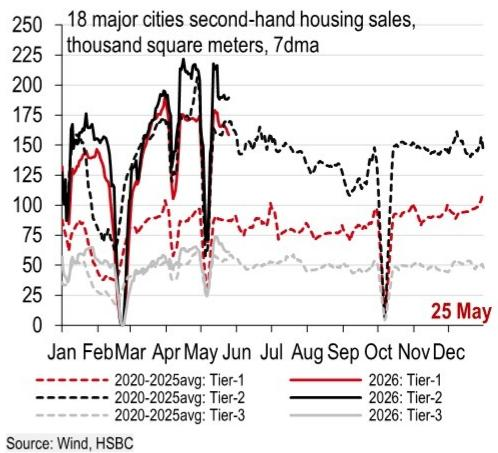

# China Is Quietly Rewriting Its Social Contract: Urbanisation 2.0 Is the Real Story, Not Fiscal Stimulus

The conventional narrative about China's economic strategy has long centred on infrastructure spending, property market interventions, and export-led growth. That narrative is becoming obsolete. A careful reading of recent policy signals reveals that Beijing is shifting its emphasis from physical capital to human capital, from building cities to servicing citizens, and from quantity of urbanisation to quality of urbanisation. This is not a minor adjustment. It is a structural pivot with profound implications for consumption, trade relations, and the long-term trajectory of the world's second-largest economy.

The most consequential development in the latest policy cycle is not the pace of bond issuance or the monthly fluctuation in fiscal data. It is the State Council's 25 May opinion on providing basic public services based on permanent residence, not household registration. This document, which has received far less attention than it deserves, represents the most concrete step yet toward what analysts are calling Urbanisation 2.0. If executed effectively, this policy could unlock the consumption potential of roughly 170 million migrant workers and their families, reduce precautionary savings, and rebalance the economy away from investment and toward domestic demand.

Yet the path forward is fraught with complexity. The same week that Beijing signalled its commitment to people-centred urbanisation, trade tensions with the European Union escalated sharply, with the European Commission preparing new restrictive measures that could affect a broader range of Chinese exports. Meanwhile, the anti-involution campaign continues to target local government behaviour, and April fiscal data showed a temporary but notable slowdown in spending. These developments are not unrelated. They form a coherent picture of a government attempting to manage multiple transitions simultaneously: from export-led to consumption-led growth, from local fragmentation to unified national markets, and from reactive trade policy to proactive structural reform.

The question for investors and strategists is not whether China is making these shifts, but whether the sequencing and institutional capacity exist to execute them successfully. The evidence so far suggests that the leadership understands the direction of travel, but the speed of implementation and the handling of external headwinds remain open variables.

## The Provision of Public Services by Permanent Residence Marks a Fundamental Break from the Old Urbanisation Model

For two decades, Chinese urbanisation was driven by a simple logic: move rural labour into cities to feed the manufacturing engine, keep the cost of labour low by limiting access to public services, and use land sales to finance infrastructure. This model worked spectacularly well for GDP growth but created a structural imbalance. Migrant workers contributed to the economy but were denied equal access to education, healthcare, and housing in the cities where they lived and worked. The result was a consumption gap. Migrant households saved excessively because they faced uncertainty about their children's schooling, their own healthcare, and their long-term residency rights.

The new action plan directly addresses this gap. By committing to provide basic public services based on permanent residence rather than hukou status, the government is effectively rewriting the terms of the social contract for 170 million people. The key tasks are specific and measurable: strengthen education rights for migrant workers' children, include non-hukou households within public rental housing coverage, improve social insurance enrolment, strengthen basic medical provision, enhance employment assistance, and improve last-resort basic services.

The strategic logic is clear. If migrant workers feel secure in their urban status, they will save less and spend more. This is not a theoretical proposition. The report's own data shows that migrant workers' income growth has lagged nominal GDP growth for years, and their precautionary savings have been correspondingly high. Reducing that precautionary motive is one of the most direct ways to boost the consumption-to-GDP ratio, which has remained stubbornly low despite decades of rapid income growth.

The fiscal data supports this interpretation. Since the start of the year, a larger share of general public budget spending has been directed to livelihood-related areas. Education, social security and employment, and healthcare have all seen their share of spending increase, while transportation and agriculture have seen relative declines. This is not a coincidence. It is a deliberate reallocation of fiscal resources toward the types of spending that support the new urbanisation model.

What makes this shift particularly significant is that it addresses one of the deepest structural weaknesses in the Chinese economy: the gap between where people live and where they have rights. The urbanisation rate by permanent residence has reached 67 percent, but the urbanisation rate by household registration lags at around 48 percent. That 19-point gap represents a reservoir of potential demand that has been artificially suppressed by institutional barriers. Closing that gap is not just a social policy. It is an economic strategy.

## The Escalation of EU-China Trade Tensions Creates a New External Constraint on China's Domestic Rebalancing

Just as China is attempting to reorient its economy toward domestic consumption, external trade tensions are intensifying in a way that complicates the transition. The European Union, long a relatively stable trading partner for China, is now moving toward a more restrictive posture that could affect a broader range of Chinese exports than previous measures.

The numbers are stark. China's trade surplus with the EU has risen sharply, from USD 74 billion in the January-April period of 2024 to USD 113 billion in the same period of 2026. This widening surplus is not going unnoticed in Brussels. The European Commission is set to discuss new trade policies concerning China, following a decision to reduce duty-free steel import quotas by 47 percent and double the out-of-quota tariff. These are not isolated actions. They reflect a broader shift in European thinking about economic security, supply chain resilience, and the risks of overdependence on Chinese manufacturing.

The most concerning development is the potential expansion of restrictive measures beyond traditional anti-subsidy and anti-dumping tools. The EU is now advancing a broader security agenda, including revisions to the Cybersecurity Act and the Industrial Accelerator Act. These actions could affect Chinese firms in energy-related sectors and beyond. The report notes that in 2025, EVs, lithium-ion batteries, and solar cells together accounted for 8.3 percent of China's exports to the EU, while the region accounted for roughly 40 percent of these products' exports. Any disruption to this trade flow would have significant consequences for China's green technology sector and its broader export strategy.

Yet the picture is not entirely negative. There are reasons to believe that negotiations can still produce a manageable outcome. The EU Chamber of Commerce in China reported that around 25 percent of European companies in China are shifting more production processes to China, which suggests that European corporate interests remain deeply embedded in the Chinese economy. Supply chain efficiency matters, and European businesses have strong incentives to avoid a full-scale trade war. Moreover, China's Commerce Minister is expected to visit Brussels for key talks, and the mid-May US-China summit signalled a constructive tone that may help ease EU-China tensions.

The strategic implication for investors is that China's domestic rebalancing cannot be analysed in isolation. The success of Urbanisation 2.0 depends partly on maintaining stable external demand during the transition period. If trade tensions escalate further, the government may be forced to accelerate domestic stimulus measures, which could have implications for fiscal sustainability and the pace of structural reform.

## The Anti-Involution Campaign Targets the Institutional Roots of Market Fragmentation, Not Just Symptomatic Overcapacity

The term "involution" has become increasingly prominent in Chinese policy discourse, and its usage signals a sophisticated understanding of the structural problems facing the economy. Involution describes a situation where excessive competition within a fragmented market leads to declining returns, inefficient resource allocation, and a race to the bottom in terms of pricing and quality. The government's response is not to impose top-down capacity controls, but to address the institutional factors that create involution in the first place.

The key insight from the latest policy statements is that local government behaviour is at the root of the problem. When local officials artificially lower entry costs, distort price signals, and protect local industries from competition, they create the conditions for involution. The Qiushi article published in the wake of President Xi's 16 May article makes this point explicitly: "resources can enter" does not mean they are "well allocated." Local protectionism and market fragmentation are identified as institutional cruxes that must be addressed through deeper reform.

The legislative agenda supports this interpretation. The government procurement law and the tendering and bidding law have been included in the first review of the National People's Congress legislative agenda for 2026. These are not minor technical adjustments. They are fundamental reforms that could reshape how local governments spend money, award contracts, and interact with markets. If implemented effectively, these reforms would reduce the ability of local governments to distort competition and would create a more level playing field for businesses across the country.

The report also notes that reform of local performance appraisal will be used to rectify local government behaviours. This is potentially the most powerful tool in the anti-involution toolkit. If local officials are evaluated based on the quality of economic development rather than the quantity of GDP growth, their incentives will shift from protecting local industries to promoting efficient resource allocation. This is a long-term project, and the report acknowledges that addressing local interference is one of the most challenging issues in the medium term.

For investors, the anti-involution campaign has direct implications for which sectors and companies are likely to benefit from the policy environment. Companies that compete on efficiency and innovation rather than on local government subsidies are likely to gain market share. Companies that have relied on local protectionism to maintain their position are likely to face increasing pressure. The direction of travel is clear, even if the speed of implementation remains uncertain.

## What the Report Does Not Fully Answer: The Sequencing Problem Between Social Spending, Fiscal Sustainability, and Trade Adjustment

For all its analytical depth, the report leaves several critical questions unanswered, and these gaps are precisely where the most important strategic uncertainties lie.

The first question concerns the fiscal sustainability of the Urbanisation 2.0 agenda. Providing basic public services to 170 million additional people is expensive. It requires investment in schools, hospitals, housing, and social insurance systems. The report shows that fiscal allocations have already shifted toward livelihood-related spending, but it does not fully address how this expansion will be financed over the medium term, particularly given the ongoing weakness in land sales. Government-managed fund expenditure fell 21 percent year-on-year in April, driven by a 35 percent decline in land sales. If land sales remain weak, where will the revenue come from to fund the new urbanisation model?

The second question concerns the interaction between trade tensions and the domestic rebalancing agenda. If EU trade restrictions reduce China's export surplus, the government may face pressure to increase domestic stimulus to maintain growth. But increased stimulus could conflict with the anti-involution agenda and with the goal of shifting from investment-led to consumption-led growth. The report notes that infrastructure investment is expected to remain a strong growth driver this year, supported by the "six networks" policy push. But infrastructure investment is not the same as investing in people. The tension between short-term growth support and long-term structural reform is not resolved.

The third question concerns the political economy of implementation. The anti-involution campaign targets local government behaviour, but local governments are also responsible for implementing the new urbanisation policies. If local officials are simultaneously being told to reduce their intervention in markets and to expand the provision of public services, there is a risk of policy incoherence at the local level. The report does not fully address how the central government plans to manage this tension.

These questions are not criticisms of the report. They are the natural result of a rigorous analysis that identifies the key strategic challenges facing the Chinese economy. For readers who want to understand the full picture, these open questions are precisely the areas where deeper analysis is most valuable.

## A Decision Framework for Navigating China's Structural Transition

For investors and strategists trying to make sense of these developments, the following framework may help organise thinking about the opportunities and risks.

First, distinguish between cyclical and structural signals. The April fiscal data showing a temporary slowdown in spending is a cyclical signal. It reflects the government's decision to pause after strong front-loading in the first quarter. It does not indicate a change in the structural direction of policy. The structural signal is the shift toward livelihood-related spending and the commitment to urbanisation based on permanent residence. Focus on the structural signals when making long-term allocation decisions.

Second, assess which sectors are aligned with the new policy direction. Companies that benefit from domestic consumption, particularly those serving the needs of migrant workers and their families, are likely to see structural tailwinds. Education, healthcare, rental housing, and consumer goods targeted at the mass market are all sectors that could benefit from Urbanisation 2.0. Conversely, sectors that have relied on local government subsidies or protectionist policies may face headwinds as the anti-involution campaign progresses.

Third, monitor the external environment for signs of escalation or de-escalation. The EU-China trade relationship is at a critical juncture. The outcome of the upcoming negotiations will have significant implications for China's export sector and for the pace of domestic rebalancing. If trade tensions ease, the government will have more room to pursue its structural agenda. If they escalate, short-term stimulus measures may take priority over long-term reform.

Fourth, pay attention to legislative and institutional changes. The revisions to the government procurement law, the tendering and bidding law, and the reform of local performance appraisal are not abstract policy debates. They are concrete changes that will reshape the competitive landscape for businesses operating in China. Companies that understand these changes and adapt their strategies accordingly will have a significant advantage over those that do not.

Finally, recognise that uncertainty is not the same as risk. The questions raised in this analysis are real, but they are questions about the speed and sequencing of reform, not about the direction. The direction of Chinese economic policy is clear: toward a more consumption-driven, service-oriented, and domestically focused economy. The path will not be linear, and there will be setbacks along the way. But the strategic direction is unmistakable.

## The Full Report Contains the Data and Charts That Make These Arguments Concrete

The analysis presented here draws on a comprehensive set of data points that are essential for understanding the scale and significance of the changes taking place. The original report includes charts showing the gap between household registration and permanent residence urbanisation rates, the evolution of fiscal spending allocations, the trajectory of trade surpluses with the EU, and the patterns of local government bond issuance. These charts are not decorative. They are the empirical foundation for the strategic arguments made in this article.

For readers who want to examine the data for themselves, who want to test the assumptions underlying this analysis, and who want to stay informed as these developments unfold, the full report is an indispensable resource. The charts provide the granularity that is lost in any summary, and they allow readers to form their own judgments about the probabilities and implications of different scenarios.

Join the community to read the full report and review the original charts.

*This article is for learning and discussion only and does not constitute investment advice.*

Personal reading notes and learning share only. Not investment advice.

