# Asia Quantitative Strategy

# Asia Quant Strategy: The rising dominance of Taiwan equities - Are we at an inflection point?

Rupal Agarwal

+65 6326 7641

rupal.agarwal@bernsteinsg.com

Cheng Zhang, CFA, CQF

+852 2123 2636

cheng.zhang@bernsteinsg.com

The strong rally since last year has resulted in Taiwan becoming the biggest exposure in MSCI EM Index (\~25%) and MSCI Asia ex Japan Index (28%). The comfort so far had come from the fact that the rally was driven more by earnings vs. multiple expansion. However, we believe we are close to an inflection point as the mounting risk from record high earnings expectations, all-time high valuations, peak concentration risk and decade high dispersion cannot be ignored. We recommend reducing exposure towards high momentum and high growth stocks in Taiwan.

# Taiwan is now the most dominant exposure in the regional benchmarks and funds:

As of April end 2026, Taiwan is the biggest exposure in MSCI EM and MSCI Asia ex Japan benchmarks, accounting for \~25%/28% of the index. GEM funds, on an average have 22.3% allocation in TW, 20% in China, 17% in KR and 10% in India. Since April, TW has seen the highest foreign flow (+16bn USD) in Asia, outside Japan, and it is already at record high monthly flow, creating strong case for near-term reversal.

Strong fundamentals but isn't it all priced-in?: Fundamentally the market looks quite strong with high ROIC (11.5%), high innovation and the strongest growth exposure in Asia (3yr earnings growth expectations of 29%CAGR). While the robust earnings upgrade cycle has supported the market rally so far, the bullish expectations are now near historical high, raising risk of upgrade cycle peaking. The valuations have already been quite stretched - market is at record high multiple of 21x fwd. PE and 4.5x PB while the equity risk premium is at record low levels.

The tech sector at record high valuations & earnings: In our earlier note, we highlighted how the strong momentum in Taiwan and Korea is facing record high concentration and correlation risk. Taiwan's top 5/10 names account for $66\% / 72\%$ of the market cap while Semis and Tech Hardware, account for $84\%$ of the market cap. Both Semis (35x fwd. PE) and Tech Hardware (26x fwd. PE) are trading at record high valuations and even upward revisions for Tech Hardware has reached record high. While for Semis, there is still some room for upgrades to continue, the bullish sentiment is not too far from record high.

The melt-up in growth and momentum stocks is at high risk of inflection: Growth and momentum stocks have ripped up YTD, generating 60% to 70% alpha (up more than 100% on an absolute basis). Taiwan high momentum portfolio is now trading at record high valuations, compared to its own history and relative to market while the earnings upgrades have also reached record high levels. Growth stocks, are also quite stretched, though still shy of 2020/2024 peak valuations; however bullish expectations are already at all-time high. While the crowding in growth stocks is already at record high, for momentum the crowding risk is lower. Even quality stocks in Taiwan (which have generated 15% alpha YTD) are trading at all-time valuations and earnings. The extreme momentum has created a 10year high dispersion between growth and value, with value dropping to record high bearish sentiment. We find these factor moves unsustainable and recommend reducing exposure towards momentum/growth stocks. We show the most vulnerable stocks in Exhibit 28 below. For TW investors, we recommend rotating into value/low vol exposure.

# DETAILS

# TAIWAN IS NOW THE MOST DOMINANT EXPOSURE IN REGIONAL BENCHMARKS/FUNDS

As of April end 2026, Taiwan is the biggest exposure in MSCI EM index, accounting for \~25% of the index (TSMC accounting for 14%) and in MSCI Asia ex Japan Index, accounting for 28.1% of the index (TSMC at 16%). In line with Taiwan's growing dominance in regional benchmarks, the allocation for Asia ex Japan Funds and Global Emerging market funds in Taiwan has seen a sharp increase over the last few years. Taiwan allocation is now at record high levels for Asian and GEM funds - Asia ex Japan funds on an average have 22.1% allocation to Taiwan vs. 21.9% for China, 19% for Korea and 9% for India. GEM funds, on an average have 22.3% allocation in TW, 20% in China, 17% in KR and 10% in India. YTD, Taiwan has seen foreign fund flow of 15.4bn USD, +26% yoy compared to the amount in same period in 2025 while domestic fund flow has been equally strong at 14.3bn USD. Overall foreign flow (institutional and retail), however is still negative at -3bn USD due to the extreme outflow seen in Mar (-29bn USD). However, since April, TW has seen the highest amount of foreign flow (16bn USD) in Asia, outside Japan (85bn USD). Given extreme inflow again, we expect foreign flow to slow down. (Exhibit 1-Exhibit 5)

EXHIBIT 1: As of April end 2026, Taiwan is the biggest exposure in MSCI EM index, accounting for \~25% of the index with TSMC accounting for 14%

Weight for MSCI EM Index

Top 10 constituents 

<table><tr><td>TAIWAN SEMICONDUCTOR MFG</td><td>14.21%</td></tr><tr><td>SAMSUNG ELECTRONICS CO</td><td>6.03%</td></tr><tr><td>SK HYNIX</td><td>4.05%</td></tr><tr><td>TENCENT HOLDINGS LI (CN)</td><td>3.26%</td></tr><tr><td>ALIBABA GRP HLDG (HK)</td><td>2.37%</td></tr><tr><td>DELTA ELECTRONICS</td><td>1.14%</td></tr><tr><td>MEDIATEK INC</td><td>1.07%</td></tr><tr><td>CHINA CONSTRUCTION BK H</td><td>0.92%</td></tr><tr><td>HDFC BANK</td><td>0.79%</td></tr><tr><td>RELIANCE INDUSTRIES</td><td>0.79%</td></tr></table>

Sector weights   
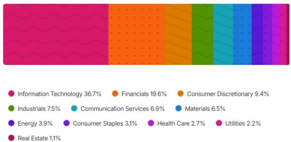

bar_stacked

| Category | Percentage (%) |
|---|---|
| Information Technology | 36.7 |
| Financials | 19.6 |
| Consumer Discretionary | 9.4 |
| Industrials | 7.5 |
| Communication Services | 6.9 |
| Materials | 6.5 |
| Energy | 3.9 |
| Consumer Staples | 3.1 |
| Health Care | 2.7 |
| Utilities | 2.2 |
| Real Estate | 1.1 |

Country weights   
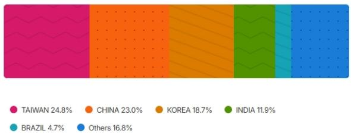

bar_stacked

| Category | Percentage (%) |
|---|---|
| TAIWAN | 24.8 |
| CHINA | 23.0 |
| KOREA | 18.7 |
| INDIA | 11.9 |
| BRAZIL | 4.7 |
| Others | 16.8 |

30 $^{th}$ April, 2026

Source: MSCI EM Index

# EXHIBIT 2: In MSCI Asia ex Japan Index, Taiwan now accounts for 28.1% of the index as of April 30th, 2026

# MSCI Asia ex Japan Index

Top 10 constituents 

<table><tr><td>TAIWAN SEMICONDUCTOR MFG</td><td>16.08%</td></tr><tr><td>SAMSUNG ELECTRONICS CO</td><td>6.82%</td></tr><tr><td>SK HYNIX</td><td>4.59%</td></tr><tr><td>TENCENT HOLDINGS LI (CN)</td><td>3.69%</td></tr><tr><td>ALIBABA GRP HLDG (HK)</td><td>2.68%</td></tr><tr><td>DELTA ELECTRONICS</td><td>1.29%</td></tr><tr><td>MEDIATEK INC</td><td>1.22%</td></tr><tr><td>AIA GROUP</td><td>1.10%</td></tr><tr><td>CHINA CONSTRUCTION BK H</td><td>1.04%</td></tr><tr><td>DBS GROUP HOLDINGS</td><td>0.95%</td></tr></table>

Sector weights   

natural_image

Abstract color block pattern with wavy pink, orange, green, blue, and purple stripes (no text or symbols)

Information Technology 41.4% Financials 17.7% Consumer Discretionary 10.2%   
- Industrials 8.5%
- Communication Services 6.9%
- Materials 3.6%   
Health Care 2.8% Energy 2.5% Consumer Staples 2.4% Utilities 1.9%   
Real Estate $1.6\%$

Country weights   

natural_image

Abstract color block pattern with wavy pink, orange, green, and blue stripes (no text or symbols)

TAIWAN 28.1% CHINA 26.1% KOREA 21.2% INDIA 13.5%   
HONG KONG $4.2\%$ Others $7.0\%$

April 30 $^{th}$ , 2026

Source: MSCI Asia ex Japan Index

EXHIBIT 3: Asia ex Japan funds' allocation towards TW equities have seen a steady increase since 2025 with average allocation now at record high of 22.1%. Asian funds, on an average have 21.9% China, 19% Korea and 9% India   
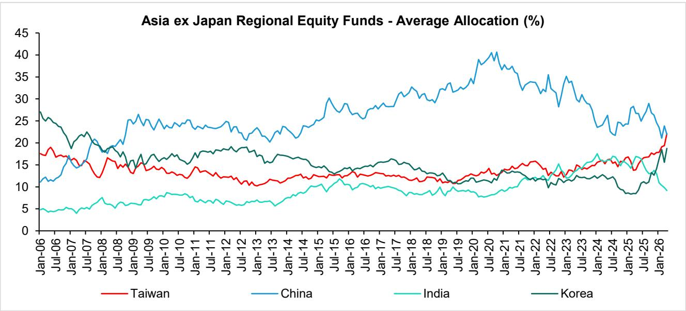  
Data till Apr 30 $^{th}$ 2026   
Source: EPFR, Bernstein Analysis

EXHIBIT 4: Global Emerging Market funds allocation to TW has seen a much sharper rise since 2019, now reaching record high of 22.3% vs. 20% in China, 17% in Korea and 10% in India   
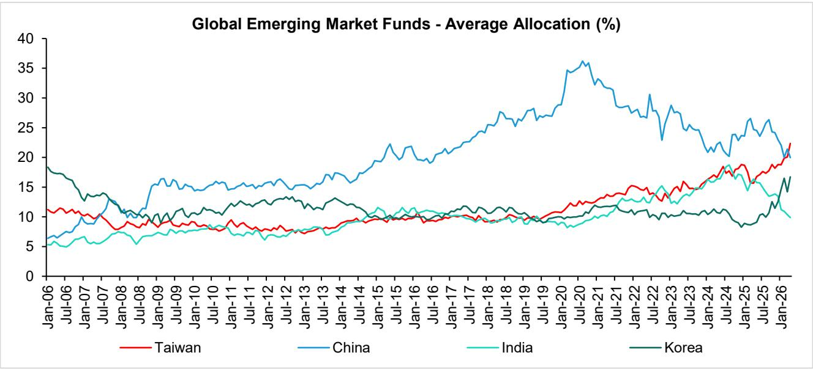

line

| Date   | Taiwan | China | India | Korea |
|--------|--------|-------|-------|-------|
| Jan-06 | 11.0   | 6.0   | 5.0   | 18.0  |
| Jul-06 | 10.5   | 7.0   | 5.5   | 17.0  |
| Jan-07 | 10.0   | 9.0   | 6.0   | 14.0  |
| Jul-07 | 9.5    | 10.0  | 6.5   | 13.0  |
| Jan-08 | 9.0    | 11.0  | 7.0   | 12.0  |
| Jul-08 | 8.5    | 12.0  | 7.5   | 11.0  |
| Jan-09 | 8.0    | 13.0  | 8.0   | 10.0  |
| Jul-09 | 7.5    | 14.0  | 8.5   | 9.0   |
| Jan-10 | 7.0    | 15.0  | 9.0   | 8.0   |
| Jul-10 | 6.5    | 16.0  | 9.5   | 7.0   |
| Jan-11 | 6.0    | 17.0  | 10.0  | 6.0   |
| Jul-11 | 5.5    | 18.0  | 10.5  | 5.0   |
| Jan-12 | 5.0    | 19.0  | 11.0  | 4.0   |
| Jul-12 | 4.5    | 20.0  | 11.5  | 3.0   |
| Jan-13 | 4.0    | 21.0  | 12.0  | 2.0   |
| Jul-13 | 3.5    | 22.0  | 12.5  | 1.0   |
| Jan-14 | 3.0    | 23.0  | 13.0  | 0.5   |
| Jul-14 | 2.5    | 24.0  | 13.5  | 0.2   |
| Jan-15 | 2.0    | 25.0  | 14.0  | -0.1  |
| Jul-15 | 1.5    | 26.0  | 14.5  | -0.4  |
| Jan-16 | 1.0    | 27.0  | 15.0  | -0.7  |
| Jul-16 | -0.2   | 28.0  | 15.5  | -1.0  |
| Jan-17 | -0.5   | 29.0  | 16.0  | -1.3  |
| Jul-17 | -0.8   | 30.0  | 16.5  | -1.6  |
| Jan-18 | -1.1   | 31.0  | 17.0  | -1.9  |
| Jul-18 | -1.4   | 32.0  | 17.5  | -2.2  |
| Jan-19 | -1.7   | 33.0  | 18.0  | -2.5  |
| Jul-19 | -2.0   | 34.0  | 18.5  | -2.8  |
| Jan-20 | -2.3   | 35.0  | 19.0  | -3.1  |
| Jul-20 | -2.6   | 36.0  | 19.5  | -3.4  |
| Jan-21 | -2.9   | 37.0  | 20.0  | -3.7  |
| Jul-21 | -3.2   | 38.0  | 20.5  | -4.0  |
| Jan-22 | -3.5   | 39.0  | 21.0  | -4.3  |
| Jul-22 | -3.8   | 40.0  | 21.5  | -4.6  |
| Jan-23 | -4.1   | 41.0  | 22.0  | -4.9  |
| Jul-23 | -4.4   | 42.0  | 22.5  | -5.2  |
| Jan-24 | -4.7   | 43.0  | 23.0  | -5.5  |
| Jul-24 | -5.0   | 44.0  | 23.5  | -5.8  |
| Jan-25 | -5.3   | 45.0  | 24.0  | -6.1  |
| Jul-25 | -5.6   | 46.0  | 24.5  | -6.4  |
| Jan-26 | -5.9   | 47.0  | 25.0  | -6.7  |
| Jul-26 (approx) ~ Jan-26 (%)<lcel><lcel><lcel><lcel><lcel><nl>

Data till Apr 30 $^{th}$ 2026   
Source: EPFR, Bernstein Analysis

EXHIBIT 5: YTD, Taiwan market has seen foreign outflow of -3bn USD due to extreme outflows seen in Mar (-29bn USD). However, since April, it is the only Asian market outside of Japan to see net inflows (Q226 inflows of 16bn USD). Given extreme inflow again, we expect foreign flow to slow down   
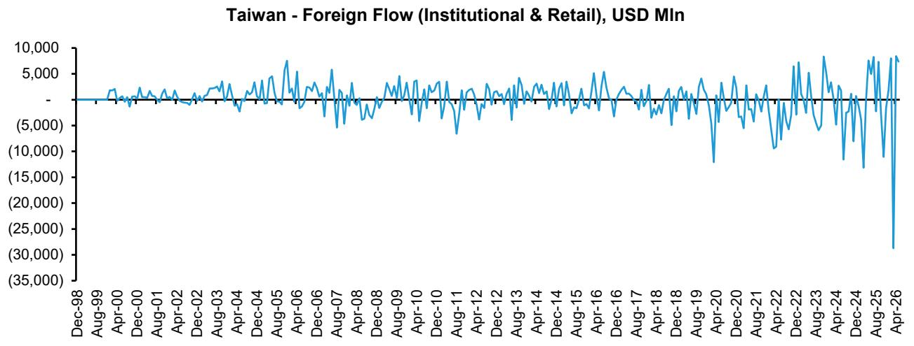

line

| Date    | Foreign Flow (USD MIn) |
|---------|------------------------|
| Apr-26  | (35,000)               |

Data as of May 27 $^{th}$ 2026   
Source: Bloomberg, IBES, MSCI, FactSet, Bernstein analysis

# TAIWAN - STRONG FUNDAMENTALS BUT ISN'T IT ALL PRICED-IN?

Taiwan has always been a high quality and high innovation market, and now it offers quite attractive growth opportunities for investors too. Taiwan has high ROIC of 11.5%, which indicate stronger return on invested capital than most of Asian peers (though still behind India/Indonesia) (Exhibit 6) ROIC of TW market has seen improvement compared to its 5yr/10yr average of 11%/10% respectively. Taiwan is also one of the leading innovation-driven economies in Asia, and along with China, it is now in the top tier of R&D intensive markets. Over the past ten year, the market has experienced a structural upgrade, and its R&D to sale ratio has grown steadily from 1.7% to 2.7% now.(Exhibit 7). One major change for Taiwan has come from the AI wave - given TW offers an extensive AI exposure for investors across Semis and Hardware, we now see Taiwan as the leading growth market in Asia with next 3yr earnings growth expectations of 29% while is the highest in the region. Interestingly, Taiwan and Korea are the only two Asian markets where future earnings expectations are higher than the average growth seen in the recent 5yrs. (Exhibit 8) Hence, fundamentally the market looks quite strong with high ROIC, high growth and high innovation exposure for investors.

EXHIBIT 6: Taiwan has better return on invested capital than most of Asian peers (except India/Indonesia) and higher that its own 5yr/10yr levels   
Taiwan ROIC vs. Other Markets   
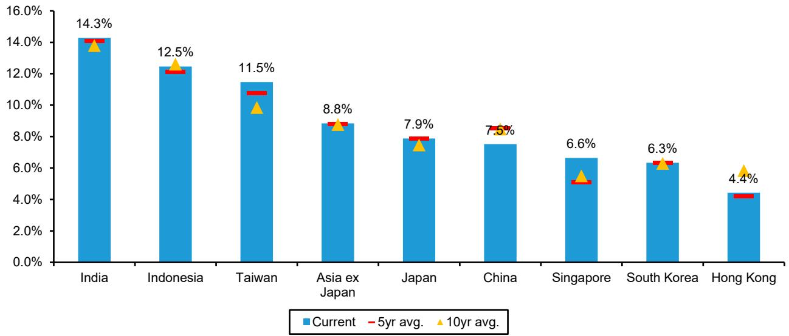

bar

| Region | Current (%) | 5yr avg. (%) | 10yr avg. (%) |
| :--- | :--- | :--- | :--- |
| India | 14.2 | 14.1 | 14.3 |
| Indonesia | 12.4 | 12.2 | 12.5 |
| Taiwan | 11.4 | 10.8 | 11.5 |
| Asia ex Japan | 8.8 | 8.7 | 8.8 |
| Japan | 7.8 | 7.6 | 7.9 |
| China | 7.5 | 7.5 | 7.5 |
| Singapore | 6.6 | 5.2 | 5.6 |
| South Korea | 6.3 | 6.2 | 6.3 |
| Hong Kong | 4.4 | 4.2 | 4.4 |

Data as of May 22 $^{th}$ 2026. The chart shows median for each category   
Source: IBES, MSCI, FactSet, Bernstein analysis

EXHIBIT 7: Taiwan ranks second in the region on innovation, behind China. Its R&D to sale ratio is above the historical averages, which reflects accelerating investment on innovation in the past few years   
Taiwan R&D % of Sales vs. Other Markets   
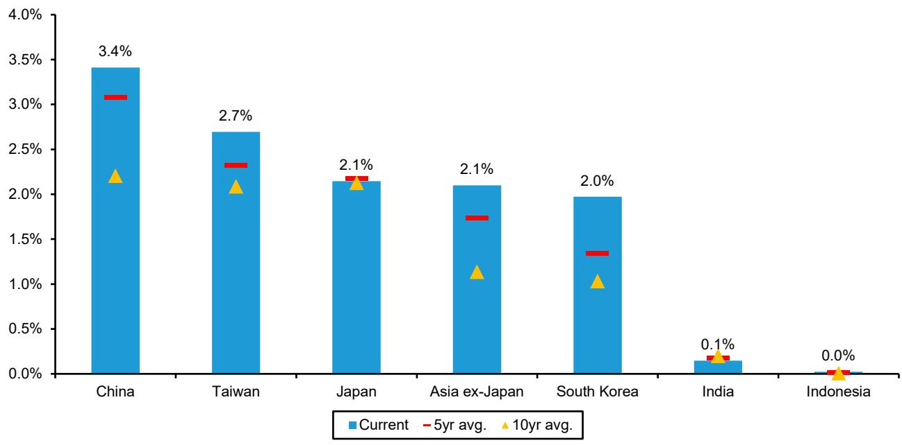

bar

| Region | Current (%) | 5yr avg. (%) | 10yr avg. (%) |
| :--- | :--- | :--- | :--- |
| China | 3.4 | 3.05 | 2.2 |
| Taiwan | 2.7 | 2.35 | 2.1 |
| Japan | 2.15 | 2.15 | 2.1 |
| Asia ex-Japan | 2.1 | 1.75 | 1.15 |
| South Korea | 2.0 | 1.35 | 1.05 |
| India | 0.15 | 0.15 | 0.05 |
| Indonesia | 0.05 | 0.05 | 0.05 |

Data as of May 22 $^{th}$ 2026. The chart shows median for each category   
Source: IBES, MSCI, FactSet, Bernstein analysis

EXHIBIT 8: Next 3yr earnings growth expectations is the highest for Taiwan markets. Interestingly, Taiwan and Korea are the only two Asian markets where future earnings expectations are higher than the average seen in the recent 5yrs   
Taiwan FY0FY3 Growth vs. Other Markets   
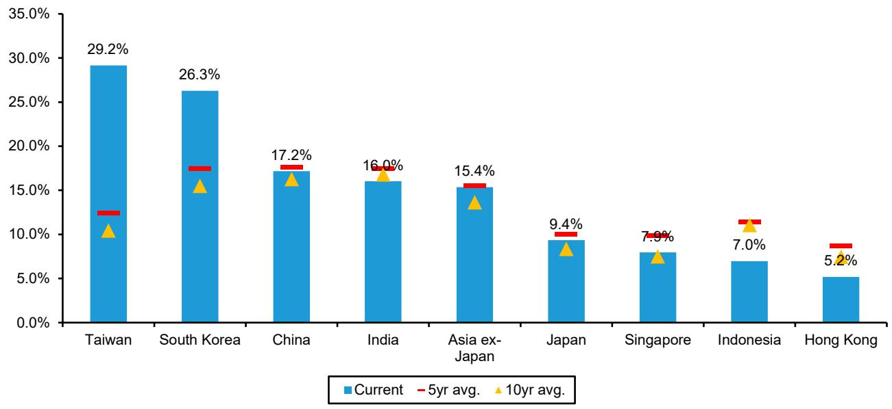

bar

| Region | Current (%) | 5yr avg. (%) | 10yr avg. (%) |
| :--- | :--- | :--- | :--- |
| Taiwan | 29.2 | 12.3 | 10.4 |
| South Korea | 26.3 | 17.3 | 15.3 |
| China | 17.2 | 17.2 | 16.3 |
| India | 16.0 | 16.0 | 16.0 |
| Asia ex-Japan | 15.4 | 15.4 | 13.6 |
| Japan | 9.4 | 9.4 | 8.3 |
| Singapore | 7.9 | 7.9 | 7.5 |
| Indonesia | 7.0 | 11.0 | 10.8 |
| Hong Kong | 5.2 | 8.7 | 5.8 |

Data as of May 22 $^{th}$ 2026. The chart show 3yr expected earnings CAGR   
Source: IBES, MSCI, FactSet, Bernstein analysis

Robust earnings upgrade cycle has supported the market rally, making it less of a bubble. We see that the market performance has been more driven by earnings than multiple expansion. Now that the earnings expectations are already near historical high, continued upward revisions look less sustainable. While upgrades have not shown clear peak yet, implying there is still some runway left; however risk of earnings expectations peaking is increasing. What further worries us is that all the fundamental strength and earnings growth seem to be priced in. In terms of PE multiples, Taiwan market is trading near record high, of 21x fwd. PE ie. +2.6SD above long-term average. On PB, we have never seen such multiples as Taiwan trades at 4.5x PB ie. +5.2SD above long-term average. Do note, Taiwan had much higher PE back in 2000 at around 25x. The equity risk premium in Taiwan has continued to decline since 2022, and it has reached record low levels. These record low risk premium levels look unsustainable, though it is difficult to foresee when the inflection might happen. (Exhibit 9-Exhibit 13)

EXHIBIT 9: Taiwan rally has been more led by earnings than multiple-expansion, making it more healthy and less of a bubble   
Taiwan - Performance vs. 12m Fwd. PE and EPS   
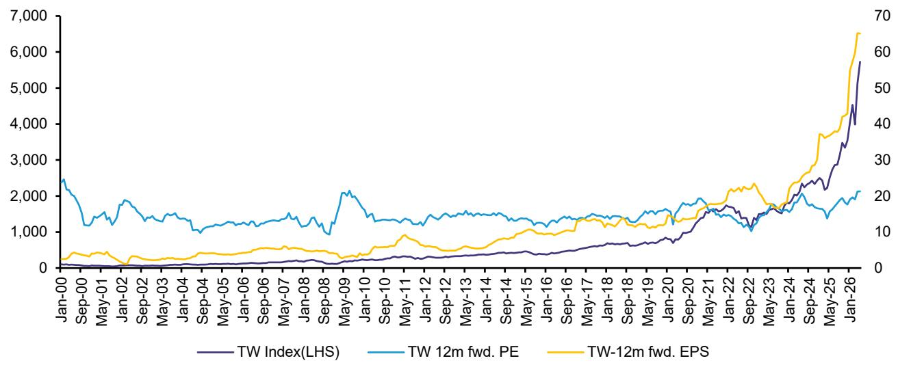

line

| Date   | TW Index(LHS) | TW 12m fwd. PE | TW-12m fwd. EPS |
|--------|---------------|----------------|-----------------|
| Jan-00 | ~0            | ~2,500         | ~3              |
| Sep-00 | ~0            | ~1,200         | ~4              |
| May-01 | ~0            | ~1,800         | ~5              |
| Jan-02 | ~0            | ~1,500         | ~4              |
| Sep-02 | ~0            | ~1,300         | ~3              |
| May-03 | ~0            | ~1,400         | ~4              |
| Jan-04 | ~0            | ~1,200         | ~5              |
| Sep-04 | ~0            | ~1,100         | ~6              |
| May-05 | ~0            | ~1,200         | ~7              |
| Jan-06 | ~0            | ~1,300         | ~8              |
| Sep-06 | ~0            | ~1,400         | ~9              |
| May-07 | ~0            | ~1,500         | ~10             |
| Jan-08 | ~0            | ~1,600         | ~11             |
| Sep-08 | ~0            | ~1,700         | ~12             |
| May-09 | ~0            | ~2,100         | ~13             |
| Jan-10 | ~0            | ~1,500         | ~14             |
| Sep-10 | ~0            | ~1,400         | ~15             |
| May-11 | ~0            | ~1,300         | ~16             |
| Jan-12 | ~0            | ~1,400         | ~17             |
| Sep-12 | ~0            | ~1,500         | ~18             |
| May-13 | ~0            | ~1,600         | ~19             |
| Jan-14 | ~0            | ~1,500         | ~20             |
| Sep-14 | ~0            | ~1,400         | ~21             |
| May-15 | ~0            | ~1,300         | ~22             |
| Jan-16 | ~0            | ~1,200         | ~23             |
| Sep-16 | ~0            | ~1,300         | ~24             |
| May-17 | ~0            | ~1,400         | ~25             |
| Jan-18 | ~0            | ~1,500         | ~26             |
| Sep-18 | ~0            | ~1,600         | ~27             |
| May-19 | ~0            | ~1,700         | ~28             |
| Jan-20 | ~0            | ~1,800         | ~29             |
| Sep-20 | ~5            | ~1,900         | ~30             |
| May-21 | ~8            | ~2,000         | ~31             |
| Jan-22 | ~15           | ~2,100         | ~32             |
| Sep-22 | ~18           | ~2,200         | ~33             |
| May-23 | ~25           | ~2,300         | ~34             |
| Jan-24 | ~35           | ~2,400         | ~35             |
| Sep-24 | ~45           | ~2,500         | ~36             |
| May-25 | ~55           | ~2,600         | ~37             |
| Jan-26 | ~65           | ~2,700         | ~38             |

Price is for Taiwan broader in USD Terms. Data as of May 22th 2026   
Source: MSCI, FactSet, Bloomberg, Bernstein Analysis

EXHIBIT 10: Taiwan has been in a strong upgrade cycle which has supported the market rally. However, now the earnings expectations are already near historical high, making continued upward revisions less sustainable   
Taiwan - Earnings Revision   
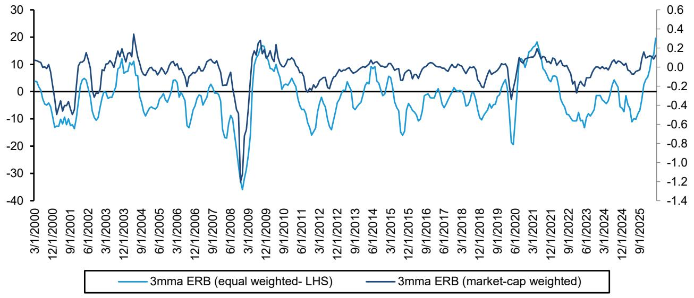

line

| Date       | 3mma ERB (equal weighted- LHS) | 3mma ERB (market-cap weighted) |
|------------|-------------------------------|--------------------------------|
| 3/1/2000   | ~0                            | ~0                             |
| 12/1/2000  | ~-10                          | ~-5                            |
| 9/1/2001   | ~-15                          | ~-10                           |
| 6/1/2002   | ~-5                           | ~5                             |
| 3/1/2003   | ~5                            | ~10                            |
| 12/1/2003  | ~10                           | ~15                            |
| 9/1/2004   | ~5                            | ~20                            |
| 6/1/2005   | ~0                            | ~5                             |
| 3/1/2006   | ~5                            | ~10                            |
| 12/1/2006  | ~0                            | ~5                             |
| 9/1/2007   | ~5                            | ~10                            |
| 6/1/2008   | ~-10                          | ~-5                            |
| 3/1/2009   | ~-35                          | ~-1.2                          |
| 12/1/2009  | ~15                           | ~18                            |
| 9/1/2010   | ~5                            | ~10                            |
| 6/1/2011   | ~-5                           | ~5                             |
| 3/1/2012   | ~-15                          | ~-5                            |
| 12/1/2012  | ~-5                           | ~5                             |
| 9/1/2013   | ~5                            | ~10                            |
| 6/1/2014   | ~10                           | ~15                            |
| 3/1/2015   | ~5                            | ~10                            |
| 12/1/2015  | ~-5                           | ~5                             |
| 9/1/2016   | ~-10                          | ~-5                            |
| 6/1/2017   | ~-5                           | ~5                             |
| 3/1/2018   | ~-5                           | ~5                             |
| 12/1/2018  | ~-5                           | ~5                             |
| 9/1/2019   | ~-5                           | ~5                             |
| 6/1/2020   | ~-20                          | ~-5                            |
| 3/1/2021   | ~15                           | ~20                            |
| 12/1/2021  | ~5                            | ~10                            |
| 9/1/2022   | ~-5                           | ~5                             |
| 6/1/2023   | ~-10                          | ~-5                            |
| 3/1/2024   | ~-5                           | ~5                             |
| 12/1/2024  | ~-5                           | ~5                             |
| 9/1/2025   | ~-5                           | ~5                             |

Data as of May 22 $^{th}$ 2026   
Source: IBES, MSCI, FactSet, Bernstein analysis

EXHIBIT 11: Taiwan is trading near record high valuations at 21x fwd. PE ie. +2.6SD above average   
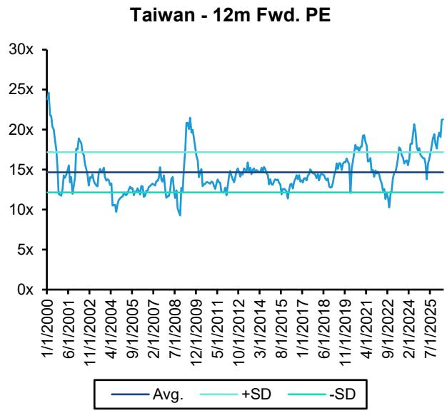

line

| Date       | Avg. | +SD  | -SD  |
| ---------- | ---- | ---- | ---- |
| 1/1/2000   | 25x  | 17x  | 12x  |
| 6/1/2001   | 15x  | 17x  | 12x  |
| 11/1/2002  | 19x  | 17x  | 12x  |
| 4/1/2004   | 14x  | 17x  | 12x  |
| 9/1/2005   | 13x  | 17x  | 12x  |
| 2/1/2007   | 14x  | 17x  | 12x  |
| 7/1/2008   | 15x  | 17x  | 12x  |
| 12/1/2009  | 21x  | 17x  | 12x  |
| 5/1/2011   | 14x  | 17x  | 12x  |
| 10/1/2012  | 15x  | 17x  | 12x  |
| 3/1/2014   | 15x  | 17x  | 12x  |
| 8/1/2015   | 13x  | 17x  | 12x  |
| 1/1/2017   | 14x  | 17x  | 12x  |
| 6/1/2018   | 15x  | 17x  | 12x  |
| 11/1/2019  | 16x  | 17x  | 12x  |
| 4/1/2021   | 19x  | 17x  | 12x  |
| 9/1/2022   | 14x  | 17x  | 12x  |
| 2/1/2024   | 20x  | 17x  | 12x  |
| 7/1/2025   | 22x  | 17x  | 12x  |

Data as of May 22 $^{th}$ 2026   
Source: IBES, MSCI, FactSet, Bernstein analysis

EXHIBIT 12: Taiwan is trading at never seen before PB multiples of 4.5x PB ie. +5.2SD above long-term average   
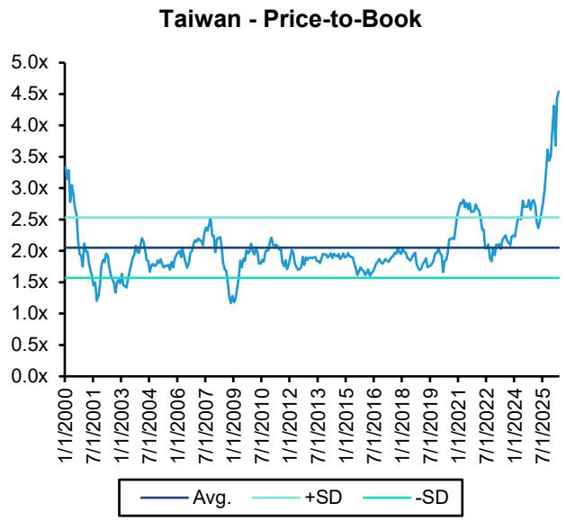

line

| Date       | Avg. | +SD  | -SD  |
| ---------- | ---- | ---- | ---- |
| 1/1/2000   | 3.5x | 2.5x | 1.5x |
| 7/1/2001   | 2.0x | 2.5x | 1.5x |
| 1/1/2003   | 1.5x | 2.5x | 1.5x |
| 7/1/2004   | 2.0x | 2.5x | 1.5x |
| 1/1/2006   | 2.0x | 2.5x | 1.5x |
| 7/1/2007   | 2.5x | 2.5x | 1.5x |
| 1/1/2009   | 1.5x | 2.5x | 1.5x |
| 7/1/2010   | 2.0x | 2.5x | 1.5x |
| 1/1/2012   | 2.0x | 2.5x | 1.5x |
| 7/1/2013   | 2.0x | 2.5x | 1.5x |
| 1/1/2015   | 2.0x | 2.5x | 1.5x |
| 7/1/2016   | 2.0x | 2.5x | 1.5x |
| 1/1/2018   | 2.0x | 2.5x | 1.5x |
| 7/1/2019   | 2.0x | 2.5x | 1.5x |
| 1/1/2021   | 2.5x | 2.5x | 1.5x |
| 7/1/2022   | 2.0x | 2.5x | 1.5x |
| 1/1/2024   | 2.5x | 2.5x | 1.5x |
| 7/1/2025   | 4.5x | 2.5x | 1.5x |

Data as of May 22 $^{th}$ 2026   
Source: IBES, MSCI, FactSet, Bernstein analysis

EXHIBIT 13: The equity risk premium in Taiwan has continued to decline since 2022 and it has reached record low levels. While these are not sustainable levels, it is difficult to pin-point what would reverse this   
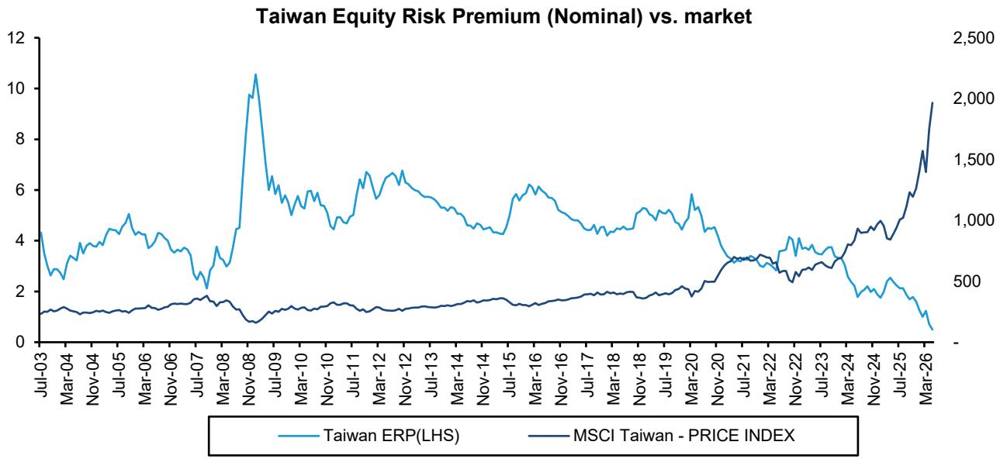

line

| Date   | Taiwan ERP(LHS) | MSCI Taiwan - PRICE INDEX |
|--------|-----------------|---------------------------|
| Jul-03 | ~4.0            | ~1.0                      |
| Mar-04 | ~3.5            | ~1.0                      |
| Nov-04 | ~4.5            | ~1.0                      |
| Jul-05 | ~5.0            | ~1.0                      |
| Mar-06 | ~4.5            | ~1.0                      |
| Nov-06 | ~4.0            | ~1.0                      |
| Jul-07 | ~3.5            | ~1.0                      |
| Mar-08 | ~3.0            | ~1.0                      |
| Nov-08 | ~10.5           | ~1.0                      |
| Jul-09 | ~6.0            | ~1.0                      |
| Mar-10 | ~5.5            | ~1.0                      |
| Nov-10 | ~5.0            | ~1.0                      |
| Jul-11 | ~6.5            | ~1.0                      |
| Mar-12 | ~6.5            | ~1.0                      |
| Nov-12 | ~6.0            | ~1.0                      |
| Jul-13 | ~5.5            | ~1.0                      |
| Mar-14 | ~5.0            | ~1.0                      |
| Nov-14 | ~4.5            | ~1.0                      |
| Jul-15 | ~4.0            | ~1.0                      |
| Mar-16 | ~6.0            | ~1.0                      |
| Nov-16 | ~5.5            | ~1.0                      |
| Jul-17 | ~5.0            | ~1.0                      |
| Mar-18 | ~4.5            | ~1.0                      |
| Nov-18 | ~5.0            | ~1.0                      |
| Jul-19 | ~5.5            | ~1.0                      |
| Mar-20 | ~6.0            | ~1.0                      |
| Nov-20 | ~4.5            | ~3.0                      |
| Jul-21 | ~3.5            | ~3.0                      |
| Mar-22 | ~3.0            | ~3.0                      |
| Nov-22 | ~4.0            | ~3.0                      |
| Jul-23 | ~3.5            | ~3.0                      |
| Mar-24 | ~2.5            | ~4.0                      |
| Nov-24 | ~2.0            | ~5.0                      |
| Jul-25 | ~2.5            | ~7.0                      |
| Mar-26 | ~1.0            | ~2,000                    |

Data as of May 28 $^{th}$ 2026   
Source: IBES, MSCI, FactSet, Bernstein analysis

# THE MARKET HAS NEVER BEEN SO CONCENTRATED

Technology Hardware & Equipment and Semiconductors & Semiconductor Equipment have always been the two dominant sectors in Taiwan and their concentration in the index has been increasing. Ten years back, the two sectors represented 42% of the market in terms of count and 50% in terms of market cap. However, now these two sectors make up 49% of the market in terms of count but 84% in terms of market-cap. Semiconductors & Semiconductor Equipment accounts for 62% of total market cap, followed by Technology Hardware & Equipment (22%). The other sectors with decent representation in the index are Banks, Materials, Transportation and Capital Goods with around 5-10 stocks. The concentration is further visible when we look at the top 5-10 names in Taiwan market - the top 10 names account for 72% of Taiwan market while the top 5 names make up 66% of the market. Both stock correlation and factor correlation in Taiwan is going up, but factor correlation is now at record high. This highlights that intra market dispersion is getting to extreme levels now. (Exhibit 14-Exhibit 17).

EXHIBIT 14: In terms of stock-count, Technology Hardware & Equipment stocks and Semiconductors & Semiconductor Equipment are the biggest sectors followed by Materials, Cap Goods and Banks   
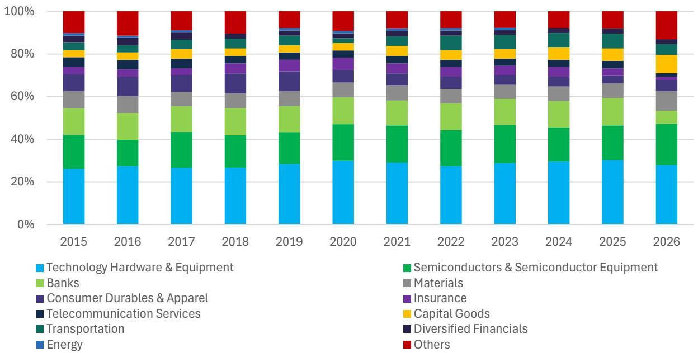

bar_stacked

| Year | Technology Hardware & Equipment | Banks | Consumer Durables & Apparel | Transportation | Energy | Semiconductors & Semiconductor Equipment | Materials | Insurance | Capital Goods | Diversified Financials | Others |
|------|----------------------------------|-------|-----------------------------|----------------|--------|------------------------------------------|-----------|-----------|---------------|------------------------|--------|
| 2015 | ~27%                             | ~13%  | ~8%                         | ~4%            | ~2%    | ~15%                                     | ~8%       | ~4%       | ~3%           | ~2%                    | ~8%    |
| 2016 | ~28%                             | ~14%  | ~9%                         | ~5%            | ~2%    | ~15%                                     | ~8%       | ~4%       | ~3%           | ~2%                    | ~8%    |
| 2017 | ~27%                             | ~14%  | ~9%                         | ~5%            | ~2%    | ~15%                                     | ~8%       | ~4%       | ~3%           | ~2%                    | ~8%    |
| 2018 | ~27%                             | ~14%  | ~9%                         | ~5%            | ~2%    | ~15%                                     | ~8%       | ~4%       | ~3%           | ~2%                    | ~8%    |
| 2019 | ~28%                             | ~14%  | ~9%                         | ~5%            | ~2%    | ~15%                                     | ~8%       | ~4%       | ~3%           | ~2%                    | ~8%    |
| 2020 | ~29%                             | ~14%  | ~9%                         | ~5%            | ~2%    | ~15%                                     | ~8%       | ~4%       | ~3%           | ~2%                    | ~8%    |
| 2021 | ~29%                             | ~14%  | ~9%                         | ~5%            | ~2%    | ~15%                                     | ~8%       | ~4%       | ~3%           | ~2%                    | ~8%    |
| 2022 | ~28%                             | ~14%  | ~9%                         | ~5%            | ~2%    | ~15%                                     | ~8%       | ~4%       | ~3%           | ~2%                    | ~8%    |
| 2023 | ~29%                             | ~14%  | ~9%                         | ~5%            | ~2%    | ~15%                                     | ~8%       | ~4%       | ~3%           | ~2%                    | ~8%    |
| 2024 | ~30%                             | ~14%  | ~9%                         | ~5%            | ~2%    | ~15%                                     | ~8%       | ~4%       | ~3%           | ~2%                    | ~8%    |
| 2025 | ~30%                             | ~14%  | ~9%                         | ~5%            | ~2%    | ~15%                                     | ~8%       | ~4%       | ~3%           | ~2%                    | ~8%    |
| 2026 | ~28%                             | ~13%  | ~9%                         | ~5%            | ~2%    | ~15%                                     | ~8%       | ~4%       | ~3%           | ~2%                    | ~8%    |

Data as of May 22 $^{th}$ 2026   
Source: IBES, MSCI, FactSet, Bernstein analysis

EXHIBIT 15: In terms of market cap, Semiconductors & Semiconductor Equipment accounts for 62% of total market cap, followed by Technology Hardware & Equipment (22%). 10yrs back, these two sectors accounted for 50% of the market. The rest of sectors only take single-digit participation in total market cap   
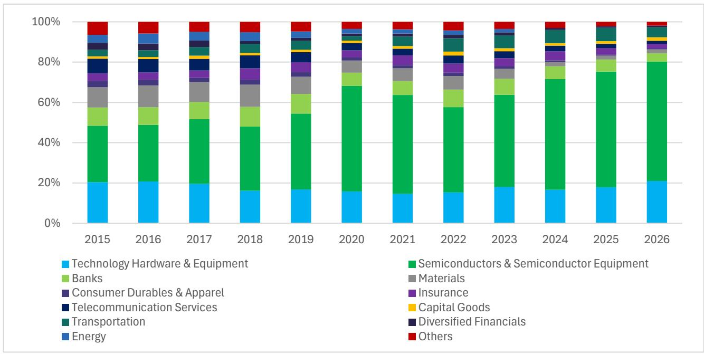

bar_stacked

| Year | Technology Hardware & Equipment | Banks | Consumer Durables & Apparel | Telecommunication Services | Transportation | Energy | Semiconductors & Semiconductor Equipment | Materials | Insurance | Capital Goods | Diversified Financials | Others |
|------|----------------------------------|-------|-----------------------------|-------------------------------|---------------|--------|------------------------------------------|-----------|-----------|---------------|------------------------|--------|
| 2015 | 20%                              | 10%   | 5%                          | 5%                            | 5%            | 5%     | 20%                                      | 10%       | 5%        | 0%            | 0%                     | 5%     |
| 2016 | 20%                              | 10%   | 5%                          | 5%                            | 5%            | 5%     | 20%                                      | 10%       | 5%        | 0%            | 0%                     | 5%     |
| 2017 | 20%                              | 10%   | 5%                          | 5%                            | 5%            | 5%     | 20%                                      | 10%       | 5%        | 0%            | 0%                     | 5%     |
| 2018 | 15%                              | 10%   | 5%                          | 5%                            | 5%            | 5%     | 25%                                      | 10%       | 5%        | 0%            | 0%                     | 5%     |
| 2019 | 15%                              | 10%   | 5%                          | 5%                            | 5%            | 5%     | 25%                                      | 10%       | 5%        | 0%            | 0%                     | 5%     |
| 2020 | 15%                              | 10%   | 5%                          | 5%                            | 5%            | 5%     | 30%                                      | 10%       | 5%        | 0%            | 0%                     | 5%     |
| 2021 | 15%                              | 10%   | 5%                          | 5%                            | 5%            | 5%     | 30%                                      | 10%       | 5%        | 0%            | 0%                     | 5%     |
| 2022 | 15%                              | 10%   | 5%                          | 5%                            | 5%            | 5%     | 30%                                      | 10%       | 5%        | 0%            | 0%                     | 5%     |
| 2023 | 15%                              | 10%   | 5%                          | 5%                            | 5%            | 5%     | 30%                                      | 10%       | 5%        | 0%            | 0%                     | 5%     |
| 2024 | 15%                              | 10%   | 5%                          | 5%                            | 5%            | 5%     | 35%                                      | 10%       | 5%        | 0%            | 0%                     | 5%     |
| 2025 | 15%                              | 10%   | 5%                          | 5%                            | 5%            | 5%     | 35%                                      | 10%       | 5%        | 0%            | 0%                     | 5%     |
| 2026 | 20%                              | 10%   | 5%                          | 5%                            | 5%            | 5%     | 40%                                      | 10%       | 5%        | 0%            | 0%                     | 5%     |

Data as of May 22 $^{th}$ 2026   
Source: IBES, MSCI, FactSet, Bernstein analysis

EXHIBIT 16: Concentration risk is the highest in Taiwan, where top 10 names account for 72% of their market's value. Similarly, Korean top 10 names accounted for 64% of the market value   
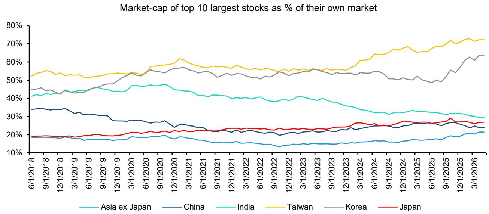

line

| Date       | Asia ex Japan | China | India | Taiwan | Korea | Japan |
|------------|---------------|-------|-------|--------|-------|-------|
| 6/1/2018   | ~18%          | ~34%  | ~41%  | ~53%   | ~45%  | ~19%  |
| 9/1/2018   | ~18%          | ~34%  | ~42%  | ~55%   | ~44%  | ~19%  |
| 12/1/2018  | ~18%          | ~33%  | ~43%  | ~54%   | ~43%  | ~19%  |
| 3/1/2019   | ~17%          | ~32%  | ~44%  | ~53%   | ~42%  | ~19%  |
| 6/1/2019   | ~17%          | ~31%  | ~45%  | ~53%   | ~43%  | ~19%  |
| 9/1/2019   | ~17%          | ~30%  | ~46%  | ~54%   | ~44%  | ~20%  |
| 12/1/2019  | ~17%          | ~29%  | ~47%  | ~55%   | ~45%  | ~20%  |
| 3/1/2020   | ~18%          | ~28%  | ~48%  | ~56%   | ~46%  | ~21%  |
| 6/1/2020   | ~18%          | ~27%  | ~49%  | ~57%   | ~47%  | ~21%  |
| 9/1/2020   | ~18%          | ~26%  | ~50%  | ~58%   | ~48%  | ~22%  |
| 12/1/2020  | ~18%          | ~25%  | ~51%  | ~59%   | ~49%  | ~22%  |
| 3/1/2021   | ~18%          | ~24%  | ~52%  | ~60%   | ~50%  | ~23%  |
| 6/1/2021   | ~17%          | ~23%  | ~53%  | ~59%   | ~51%  | ~23%  |
| 9/1/2021   | ~16%          | ~22%  | ~54%  | ~58%   | ~52%  | ~23%  |
| 12/1/2021  | ~16%          | ~21%  | ~55%  | ~57%   | ~53%  | ~23%  |
| 3/1/2022   | ~15%          | ~20%  | ~56%  | ~56%   | ~54%  | ~23%  |
| 6/1/2022   | ~15%          | ~19%  | ~57%  | ~55%   | ~55%  | ~23%  |
| 9/1/2022   | ~14%          | ~18%  | ~58%  | ~54%   | ~56%  | ~23%  |
| 12/1/2022  | ~14%          | ~17%  | ~59%  | ~53%   | ~57%  | ~23%  |
| 3/1/2023   | ~14%          | ~16%  | ~60%  | ~52%   | ~58%  | ~23%  |
| 6/1/2023   | ~14%          | ~15%  | ~61%  | ~51%   | ~59%  | ~23%  |
| 9/1/2023   | ~14%          | ~14%  | ~62%  | ~50%   | ~60%  | ~23%  |
| 12/1/2023  | ~14%          | ~13%  | ~63%  | ~49%   | ~61%  | ~23%  |
| 3/1/2024   | ~14%          | ~12%  | ~64%  | ~48%   | ~62%  | ~23%  |
| 6/1/2024   | ~14%          | ~11%  | ~65%  | ~47%   | ~63%  | ~23%  |
| 9/1/2024   | ~14%          | ~10%  | ~66%  | ~46%   | ~64%  | ~23%  |
| 12/1/2024  | ~14%          | ~9%    | ~67%  | ~45%   | ~65%  | ~23%  |
| 3/1/2025   | ~14%          | ~8%    | ~68%  | ~44%   | ~66%  | ~23%  |
| 6/1/2025   | ~14%          | ~7%    | ~69%  | ~43%   | ~67%  | ~23%  |
| 9/1/2025   | ~14%          | ~6%    | ~70%  | ~42%   | ~68%  | ~23%  |
| 12/1/2025  | ~14%          | ~5%    | ~71%  | ~41%   | ~69%  | ~23%  |
| 3/1/2026   | ~14%          | ~4%    | ~72%  | ~40%   | ~70%  | ~23%  |
| (end)      | (~18%)        | (~3%)  | (~3%)  | (~7%)   | (~6%)  | (~3%)

Data as of May 22 $^{th}$ 2026   
Source: IBES, MSCI, FactSet, Bernstein analysis

EXHIBIT 17: Both stock correlation and factor correlation in Taiwan is going up but factor correlation is now at record high. This highlights that intra market dispersion is getting to extreme levels now   
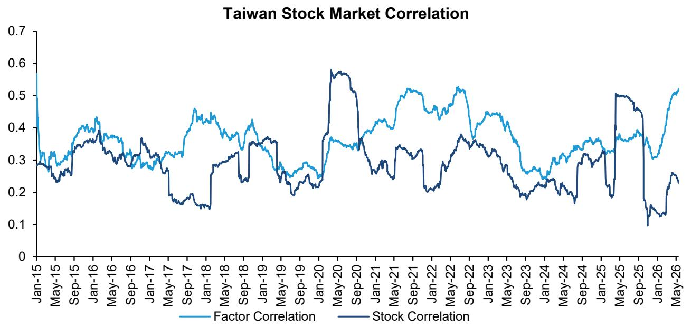

line

| Date   | Factor Correlation | Stock Correlation |
|--------|--------------------|-------------------|
| Jan-15 | 0.55               | 0.30              |
| May-15 | 0.30               | 0.25              |
| Sep-15 | 0.35               | 0.30              |
| Jan-16 | 0.40               | 0.35              |
| May-16 | 0.38               | 0.32              |
| Sep-16 | 0.35               | 0.30              |
| Jan-17 | 0.32               | 0.28              |
| May-17 | 0.30               | 0.25              |
| Sep-17 | 0.35               | 0.20              |
| Jan-18 | 0.45               | 0.15              |
| May-18 | 0.40               | 0.25              |
| Sep-18 | 0.42               | 0.30              |
| Jan-19 | 0.38               | 0.35              |
| May-19 | 0.35               | 0.32              |
| Sep-19 | 0.30               | 0.28              |
| Jan-20 | 0.35               | 0.35              |
| May-20 | 0.55               | 0.58              |
| Sep-20 | 0.40               | 0.35              |
| Jan-21 | 0.45               | 0.30              |
| May-21 | 0.50               | 0.35              |
| Sep-21 | 0.45               | 0.30              |
| Jan-22 | 0.48               | 0.25              |
| May-22 | 0.52               | 0.35              |
| Sep-22 | 0.45               | 0.30              |
| Jan-23 | 0.48               | 0.28              |
| May-23 | 0.45               | 0.25              |
| Sep-23 | 0.35               | 0.20              |
| Jan-24 | 0.30               | 0.18              |
| May-24 | 0.35               | 0.25              |
| Sep-24 | 0.38               | 0.30              |
| Jan-25 | 0.35               | 0.35              |
| May-25 | 0.38               | 0.50              |
| Sep-25 | 0.35               | 0.45              |
| Jan-26 | 0.30               | 0.10              |
| May-26 | 0.52               | 0.25              |

Data as of May 22 $^{th}$ 2026   
Source: IBES, MSCI, FactSet, Bernstein analysis

# SEMIS/TECH HARDWARE - ALREADY AT RECORD HIGH VALUATION AND EARNINGS

PE Valuation: Semiconductors & Semiconductor Equipment and Technology Hardware & Equipment are already trading at record high valuations. Semis is trading at 35x fwd. PE ie. +4.3SD above 10yr average, and Tech Hardware is priced at 26x fwd. PE ie. +4.7SD above 10yr average. Capital goods is a bit stretched too, trading at +1.3SD level, but all other sectors are still cheap. (Exhibit 18)

Earning Revision: Looking at the earning revision, the upgrade cycle for Technology Hardware & Equipment and Banks is already at record high, increasing the risk of peak earnings. Semis and Cap Goods have also been seeing rising upward revisions, though there is still more room for this to continue. Material and Transportation have already been in a moderating earnings revision cycle. Hence, further upward revisions could still support the Semis rally for some time, though the room for trends to continue looks narrower. (Exhibit 19)

EXHIBIT 18: Semiconductors & Semiconductor Equipment and Technology Hardware & Equipment are trading at record high valuations. Even Capital goods is stretched, trading above +1SD, while other sectors are cheap   
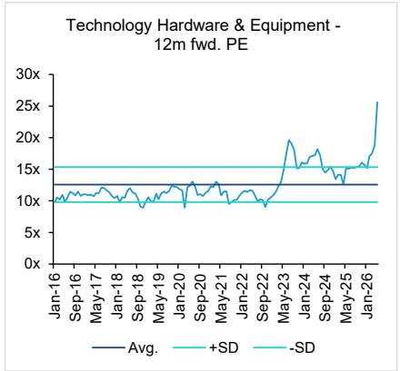

line

| Date   | Avg. | +SD  | -SD  |
|--------|------|------|------|
| Jan-16 | 12x  | 15x  | 10x  |
| Sep-16 | 12x  | 15x  | 10x  |
| May-17 | 12x  | 15x  | 10x  |
| Jan-18 | 12x  | 15x  | 10x  |
| Sep-18 | 12x  | 15x  | 10x  |
| May-19 | 12x  | 15x  | 10x  |
| Jan-20 | 12x  | 15x  | 10x  |
| Sep-20 | 12x  | 15x  | 10x  |
| May-21 | 12x  | 15x  | 10x  |
| Jan-22 | 12x  | 15x  | 10x  |
| Sep-22 | 12x  | 15x  | 10x  |
| May-23 | 12x  | 15x  | 10x  |
| Jan-24 | 12x  | 15x  | 10x  |
| Sep-24 | 12x  | 15x  | 10x  |
| May-25 | 12x  | 15x  | 10x  |
| Jan-26 | 12x  | 15x  | 10x  |

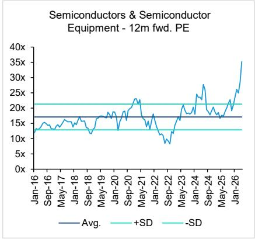

line

| Date   | Avg. | +SD  | -SD  |
|--------|------|------|------|
| Jan-16 | 15x  | 20x  | 10x  |
| Sep-16 | 15x  | 20x  | 10x  |
| May-17 | 15x  | 20x  | 10x  |
| Jan-18 | 15x  | 20x  | 10x  |
| Sep-18 | 15x  | 20x  | 10x  |
| May-19 | 15x  | 20x  | 10x  |
| Jan-20 | 15x  | 20x  | 10x  |
| Sep-20 | 15x  | 20x  | 10x  |
| May-21 | 15x  | 20x  | 10x  |
| Jan-22 | 15x  | 20x  | 10x  |
| Sep-22 | 15x  | 20x  | 10x  |
| May-23 | 15x  | 20x  | 10x  |
| Jan-24 | 15x  | 20x  | 10x  |
| Sep-24 | 15x  | 20x  | 10x  |
| May-25 | 15x  | 20x  | 10x  |
| Jan-26 | 15x  | 20x  | 10x  |

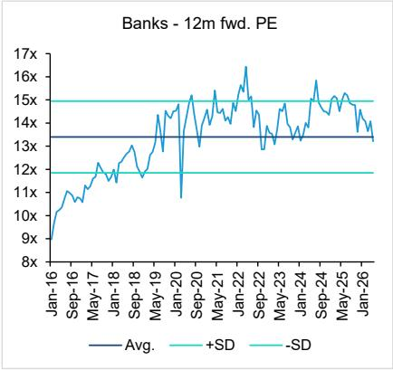

line

| Date   | Avg. | +SD  | -SD  |
|--------|------|------|------|
| Jan-16 | 9x   | 12x  | 13x  |
| Sep-16 | 11x  | 12x  | 13x  |
| May-17 | 12x  | 12x  | 13x  |
| Jan-18 | 13x  | 12x  | 13x  |
| Sep-18 | 14x  | 12x  | 13x  |
| May-19 | 15x  | 12x  | 13x  |
| Jan-20 | 16x  | 12x  | 13x  |
| Sep-20 | 15x  | 12x  | 13x  |
| May-21 | 14x  | 12x  | 13x  |
| Jan-22 | 16x  | 12x  | 13x  |
| Sep-22 | 15x  | 12x  | 13x  |
| May-23 | 14x  | 12x  | 13x  |
| Jan-24 | 15x  | 12x  | 13x  |
| Sep-24 | 16x  | 12x  | 13x  |
| May-25 | 15x  | 12x  | 13x  |
| Jan-26 | 14x  | 12x  | 13x  |

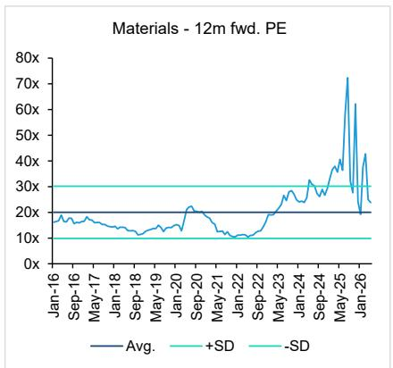

line

| Date    | Avg. | +SD  | -SD  |
|---------|------|------|------|
| Jan-16  | 18x  | 30x  | 10x  |
| Sep-16  | 18x  | 30x  | 10x  |
| May-17  | 16x  | 30x  | 10x  |
| Jan-18  | 14x  | 30x  | 10x  |
| Sep-18  | 12x  | 30x  | 10x  |
| May-19  | 14x  | 30x  | 10x  |
| Jan-20  | 16x  | 30x  | 10x  |
| Sep-20  | 22x  | 30x  | 10x  |
| May-21  | 18x  | 30x  | 10x  |
| Jan-22  | 12x  | 30x  | 10x  |
| Sep-22  | 16x  | 30x  | 10x  |
| May-23  | 24x  | 30x  | 10x  |
| Jan-24  | 30x  | 30x  | 10x  |
| Sep-24  | 36x  | 30x  | 10x  |
| May-25  | 72x  | 30x  | 10x  |
| Jan-26  | 24x  | 30x  | 10x  |

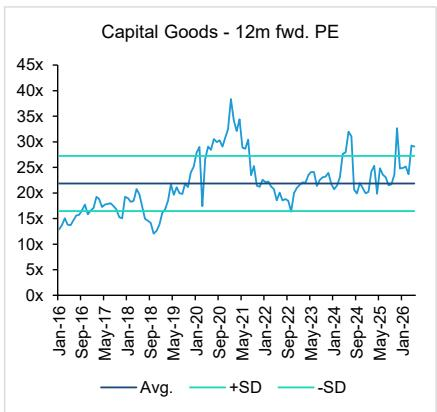

line

| Date   | Avg. | +SD  | -SD  |
|--------|------|------|------|
| Jan-16 | 20x  | 25x  | 15x  |
| Sep-16 | 20x  | 25x  | 15x  |
| May-17 | 20x  | 25x  | 15x  |
| Jan-18 | 20x  | 25x  | 15x  |
| Sep-18 | 20x  | 25x  | 15x  |
| May-19 | 20x  | 25x  | 15x  |
| Jan-20 | 20x  | 25x  | 15x  |
| Sep-20 | 20x  | 25x  | 15x  |
| May-21 | 20x  | 25x  | 15x  |
| Jan-22 | 20x  | 25x  | 15x  |
| Sep-22 | 20x  | 25x  | 15x  |
| May-23 | 20x  | 25x  | 15x  |
| Jan-24 | 20x  | 25x  | 15x  |
| Sep-24 | 20x  | 25x  | 15x  |
| May-25 | 20x  | 25x  | 15x  |
| Jan-26 | 20x  | 25x  | 15x  |

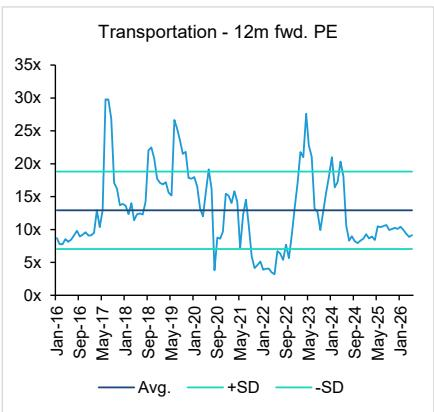

line

| Date    | Avg. | +SD | -SD |
|---------|------|-----|-----|
| Jan-16  | 13x  | 7x  | 7x  |
| Sep-16  | 13x  | 7x  | 7x  |
| May-17  | 13x  | 7x  | 7x  |
| Jan-18  | 13x  | 7x  | 7x  |
| Sep-18  | 13x  | 7x  | 7x  |
| May-19  | 13x  | 7x  | 7x  |
| Jan-20  | 13x  | 7x  | 7x  |
| Sep-20  | 13x  | 7x  | 7x  |
| May-21  | 13x  | 7x  | 7x  |
| Jan-22  | 13x  | 7x  | 7x  |
| Sep-22  | 13x  | 7x  | 7x  |
| May-23  | 13x  | 7x  | 7x  |
| Jan-24  | 13x  | 7x  | 7x  |
| Sep-24  | 13x  | 7x  | 7x  |
| May-25  | 13x  | 7x  | 7x  |
| Jan-26  | 13x  | 7x  | 7x  |

Data as of May 22 $^{th}$ 2026   
Source: IBES, MSCI, FactSet, Bernstein analysis

EXHIBIT 19: The upgrade cycle for Technology Hardware & Equipment and Banks is already at record high, increasing the risk of peak earnings. Semis and CapGoods have also been seeing rising upward revisions, though there is still more room for this to continue   
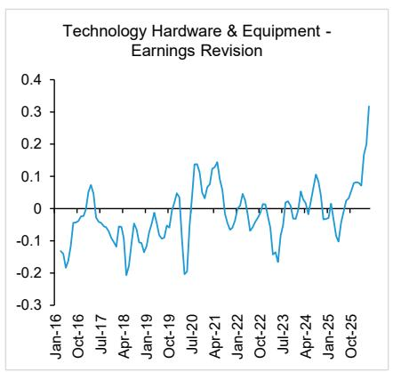

line

| Date   | Earnings Revision |
|--------|-------------------|
| Jan-16 | -0.2              |
| Oct-16 | 0.0               |
| Jul-17 | 0.1               |
| Apr-18 | -0.1              |
| Jan-19 | -0.2              |
| Oct-19 | 0.0               |
| Jul-20 | -0.2              |
| Apr-21 | 0.1               |
| Jan-22 | 0.0               |
| Oct-22 | -0.1              |
| Jul-23 | -0.2              |
| Apr-24 | 0.1               |
| Jan-25 | -0.1              |
| Oct-25 | 0.3               |

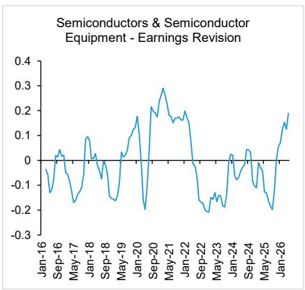

line

| Date   | Earnings Revision |
|--------|-------------------|
| Jan-16 | -0.1              |
| Sep-16 | 0.05              |
| May-17 | -0.15             |
| Jan-18 | 0.1               |
| Sep-18 | -0.1              |
| May-19 | 0.15              |
| Jan-20 | -0.2              |
| Sep-20 | 0.3               |
| May-21 | 0.2               |
| Jan-22 | 0.15              |
| Sep-22 | -0.2              |
| May-23 | -0.15             |
| Jan-24 | 0.05              |
| Sep-24 | -0.1              |
| May-25 | -0.2              |
| Jan-26 | 0.2               |

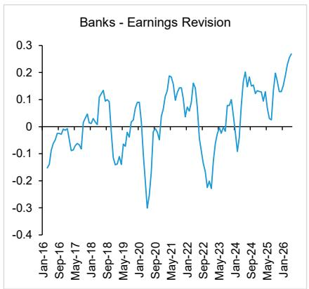

line

| Date   | Value |
|--------|-------|
| Jan-16 | -0.15 |
| Sep-16 | -0.05 |
| May-17 | -0.08 |
| Jan-18 | 0.05  |
| Sep-18 | 0.12  |
| May-19 | -0.10 |
| Jan-20 | 0.08  |
| Sep-20 | -0.30 |
| May-21 | 0.18  |
| Jan-22 | 0.15  |
| Sep-22 | -0.25 |
| May-23 | -0.05 |
| Jan-24 | 0.10  |
| Sep-24 | -0.10 |
| May-25 | 0.20  |
| Jan-26 | 0.28  |

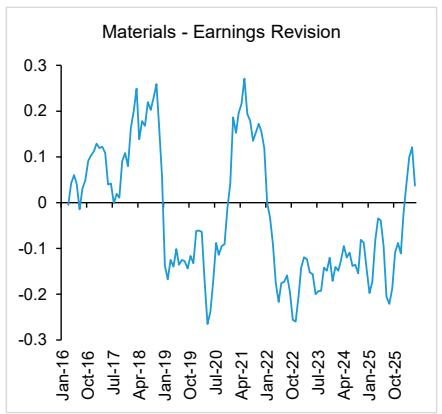

line

| Date   | Value |
|--------|-------|
| Jan-16 | 0.0   |
| Oct-16 | 0.1   |
| Jul-17 | 0.0   |
| Apr-18 | 0.25  |
| Jan-19 | -0.15 |
| Oct-19 | -0.05 |
| Jul-20 | -0.3  |
| Apr-21 | 0.25  |
| Jan-22 | -0.2  |
| Oct-22 | -0.15 |
| Jul-23 | -0.2  |
| Apr-24 | -0.1  |
| Jan-25 | -0.25 |
| Oct-25 | 0.1   |

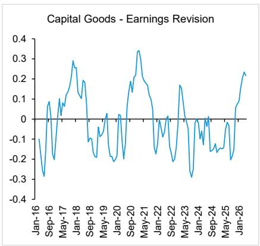

line

| Date   | Value |
|--------|-------|
| Jan-16 | -0.1  |
| Sep-16 | -0.3  |
| May-17 | 0.1   |
| Jan-18 | 0.3   |
| Sep-18 | 0.1   |
| Jan-19 | -0.2  |
| Sep-19 | -0.1  |
| Jan-20 | 0.0   |
| Sep-20 | 0.3   |
| May-21 | 0.2   |
| Jan-22 | -0.1  |
| Sep-22 | -0.2  |
| May-23 | 0.1   |
| Jan-24 | -0.3  |
| Sep-24 | -0.1  |
| May-25 | -0.2  |
| Jan-26 | 0.2   |

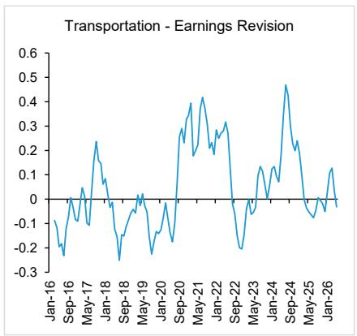

line

| Date   | Value |
|--------|-------|
| Jan-16 | -0.25 |
| Sep-16 | -0.15 |
| May-17 | 0.05  |
| Jan-18 | 0.25  |
| Sep-18 | -0.25 |
| May-19 | 0.00  |
| Jan-20 | -0.20 |
| Sep-20 | 0.30  |
| May-21 | 0.40  |
| Jan-22 | 0.30  |
| Sep-22 | -0.25 |
| May-23 | 0.15  |
| Jan-24 | 0.45  |
| Sep-24 | 0.25  |
| May-25 | -0.10 |
| Jan-26 | 0.10  |

Data as of May 22 $^{th}$ 2026   
Source: IBES, MSCI, FactSet, Bernstein analysis

# GROWTH & MOMENTUM AT EXTREME - RISK OF INFLECTION QUITE HIGH

Performance: Taiwan over the long-term has been a value/high yield play, however during tech/growth cycles, we see growth stocks outperforming sharply. Both High Yield and value were the best performing styles in Taiwan in 2023 and 2024, however growth and momentum styles saw a massive jump since Q425 and YTD, has outperformed the market by 71% to 61% respectively. Given the market itself is up more than 50%, growth and momentum investors YTD have made more than 100% returns in Taiwan. High yield/value on the other hand are down -21%/-20% relative to the market. Exhibit 20

Valuation, earning revision and crowding: Momentum and Quality are the most expensive styles in Taiwan, trading at decade high valuations. Growth portfolio is also expensive, though still below record peak seen in 2020/2024. Price momentum and earnings momentum are valued at 34x/30x fwd. PE, both around +5SD above the ten-year average, and quality is now +3SD above the ten-year average. Growth stocks have re-rated to 35x fwd. PE ie. +2SD above the ten-year average. Value/High Yield is trading near average valuations. Given there has been a broad-based re-rating cycle, we look at relative valuations - even then, momentum and quality is trading at record high levels while growth is just shy of 2020 peak. Earnings has been a strong catalyst and momentum/quality/growth are all at record high earnings expectations - this is becoming vulnerable to peak in upgrade cycle. Value/high yield have more room for upward revisions to continue. Relative to market, upward revisions for price momentum portfolio has already peaked while growth/quality/earnings momentum are at record high. Interestingly, earnings sentiment for value/high yield is now near decade high bearishness. Growth is overcrowded while crowding risk in momentum/quality is still not that extreme yet. Value/high yield have fallen to decade low crowding levels. Just to highlight - Materials, Semi, Tech Hardware are the key growth sectors while momentum is all about Semis and Tech Hardware. Value sits in Banks, Transportation and Materials(Exhibit 21-Exhibit 26). Because of the extreme momentum trends, the intra market/factor dispersion is at record high - momentum is all about growth stocks in Taiwan while value/low vol is sitting at 10 year high laggard position. However, when looking at earnings momentum correlation with other styles, the factor dispersion is still not at

decade high. (Exhibit 27)

EXHIBIT 20: High yield and value stocks the best performers in Taiwan in the past three years, while in YTD, growth and momentum have outperformed them both   
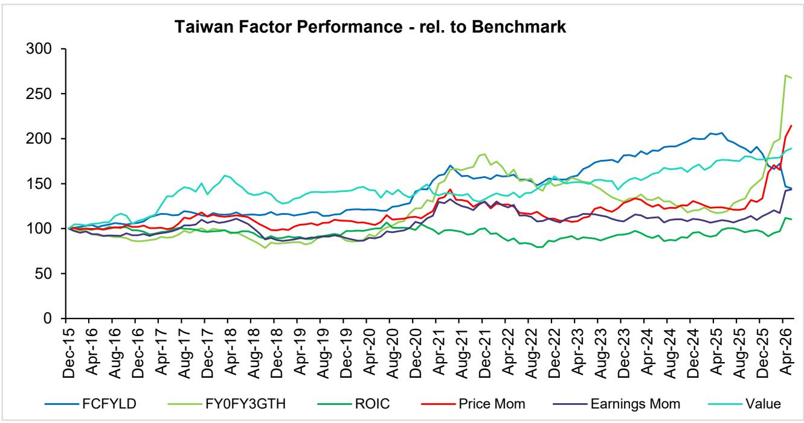  
Data as of May 22 $^{th}$ 2026   
Source: IBES, MSCI, FactSet, Bernstein analysis

EXHIBIT 21: Momentum and Quality are the most expensive styles in Taiwan, trading at decade high valuations. Growth portfolio is also expensive, though still below record peak seen in 2020/2024. Value/High Yield is trading near average valuations   
  
Data as of May 22 $^{th}$ 2026   
Source: IBES, MSCI, FactSet, Bernstein analysis

EXHIBIT 22: Given there has been a broad-based re-rating cycle, we look at relative valuations - even then, momentum and quality is trading at record high levels while growth is just shy of 2020 peak   
Value - Rel. to Market 12m fwd. PE   
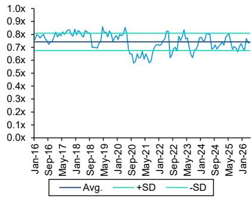

line

| Date    | Avg. | +SD  | -SD  |
|---------|------|------|------|
| Jan-16  | 0.75x| 0.7x | 0.7x |
| Sep-16  | 0.75x| 0.7x | 0.7x |
| May-17  | 0.75x| 0.7x | 0.7x |
| Jan-18  | 0.75x| 0.7x | 0.7x |
| Sep-18  | 0.75x| 0.7x | 0.7x |
| May-19  | 0.75x| 0.7x | 0.7x |
| Jan-20  | 0.75x| 0.7x | 0.7x |
| Sep-20  | 0.6x | 0.6x | 0.6x |
| May-21  | 0.65x| 0.6x | 0.6x |
| Jan-22  | 0.7x | 0.7x | 0.7x |
| Sep-22  | 0.75x| 0.7x | 0.7x |
| May-23  | 0.75x| 0.7x | 0.7x |
| Jan-24  | 0.75x| 0.7x | 0.7x |
| Sep-24  | 0.75x| 0.7x | 0.7x |
| May-25  | 0.75x| 0.7x | 0.7x |
| Jan-26  | 0.75x| 0.7x | 0.7x |

FY0FY3 Growth - Rel. to Market 12m   
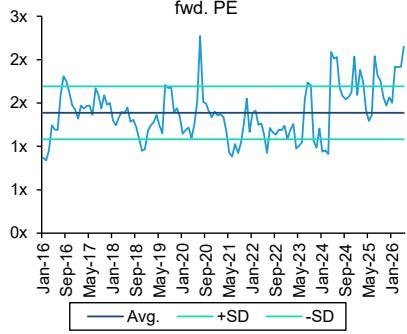

line

| Date    | Avg. | +SD  | -SD  |
|---------|------|------|------|
| Jan-16  | 1x   | 1x   | 1x   |
| Sep-16  | 2x   | 2x   | 2x   |
| May-17  | 1.5x | 1.5x | 1.5x |
| Jan-18  | 1.5x | 1.5x | 1.5x |
| Sep-18  | 1x   | 1x   | 1x   |
| May-19  | 1.5x | 1.5x | 1.5x |
| Jan-20  | 2.5x | 2.5x | 2.5x |
| Sep-20  | 1.5x | 1.5x | 1.5x |
| May-21  | 1x   | 1x   | 1x   |
| Jan-22  | 1.5x | 1.5x | 1.5x |
| Sep-22  | 1.5x | 1.5x | 1.5x |
| May-23  | 2x   | 2x   | 2x   |
| Jan-24  | 1x   | 1x   | 1x   |
| Sep-24  | 2x   | 2x   | 2x   |
| May-25  | 1.5x | 1.5x | 1.5x |
| Jan-26  | 2x   | 2x   | 2x   |

Price Momentum - Rel. to Market 12m   
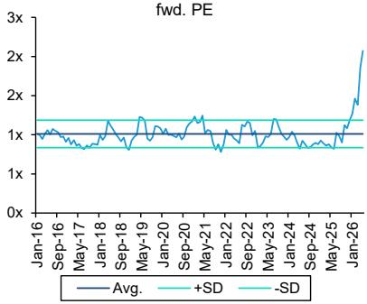

line

| Date    | Avg. | +SD  | -SD  |
|---------|------|------|------|
| Jan-16  | 1x   | 1x   | 1x   |
| Sep-16  | 1x   | 1x   | 1x   |
| May-17  | 1x   | 1x   | 1x   |
| Jan-18  | 1x   | 1x   | 1x   |
| Sep-18  | 1x   | 1x   | 1x   |
| May-19  | 1x   | 1x   | 1x   |
| Jan-20  | 1x   | 1x   | 1x   |
| Sep-20  | 1x   | 1x   | 1x   |
| May-21  | 1x   | 1x   | 1x   |
| Jan-22  | 1x   | 1x   | 1x   |
| Sep-22  | 1x   | 1x   | 1x   |
| May-23  | 1x   | 1x   | 1x   |
| Jan-24  | 1x   | 1x   | 1x   |
| Sep-24  | 1x   | 1x   | 1x   |
| May-25  | 1x   | 1x   | 1x   |
| Jan-26  | 2x   | 2x   | 2x   |

FCFYLD - Rel. to Market 12m fwd. PE   
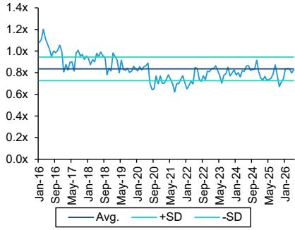

line

| Date   | Avg. | +SD  | -SD  |
|--------|------|------|------|
| Jan-16 | 1.2x | 0.8x | 0.7x |
| Sep-16 | 1.0x | 0.8x | 0.7x |
| May-17 | 0.9x | 0.8x | 0.7x |
| Jan-18 | 0.9x | 0.8x | 0.7x |
| Sep-18 | 0.9x | 0.8x | 0.7x |
| May-19 | 0.8x | 0.8x | 0.7x |
| Jan-20 | 0.8x | 0.8x | 0.7x |
| Sep-20 | 0.7x | 0.8x | 0.7x |
| May-21 | 0.7x | 0.8x | 0.7x |
| Jan-22 | 0.8x | 0.8x | 0.7x |
| Sep-22 | 0.8x | 0.8x | 0.7x |
| May-23 | 0.8x | 0.8x | 0.7x |
| Jan-24 | 0.8x | 0.8x | 0.7x |
| Sep-24 | 0.8x | 0.8x | 0.7x |
| May-25 | 0.8x | 0.8x | 0.7x |
| Jan-26 | 0.8x | 0.8x | 0.7x |

ROIC - Rel. to Market 12m fwd. PE   
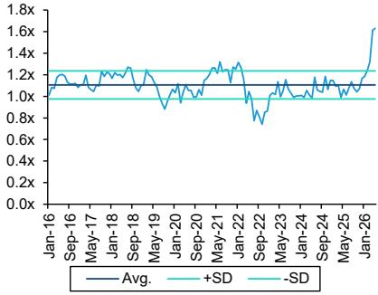

line

| Date   | Avg. | +SD  | -SD  |
|--------|------|------|------|
| Jan-16 | 1.0x | 1.0x | 1.0x |
| Sep-16 | 1.1x | 1.0x | 1.0x |
| May-17 | 1.0x | 1.0x | 1.0x |
| Jan-18 | 1.1x | 1.0x | 1.0x |
| Sep-18 | 1.2x | 1.0x | 1.0x |
| May-19 | 1.0x | 1.0x | 1.0x |
| Jan-20 | 1.0x | 1.0x | 1.0x |
| Sep-20 | 1.1x | 1.0x | 1.0x |
| May-21 | 1.2x | 1.0x | 1.0x |
| Jan-22 | 1.3x | 1.0x | 1.0x |
| Sep-22 | 0.8x | 1.0x | 1.0x |
| May-23 | 1.0x | 1.0x | 1.0x |
| Jan-24 | 1.0x | 1.0x | 1.0x |
| Sep-24 | 1.0x | 1.0x | 1.0x |
| May-25 | 1.0x | 1.0x | 1.0x |
| Jan-26 | 1.6x | 1.0x | 1.0x |

Earnings Momentum - Rel. to Market   
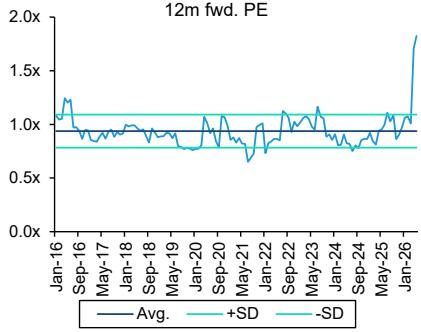

line

| Date    | Avg. | +SD  | -SD  |
|---------|------|------|------|
| Jan-16  | 1.2x | 1.0x | 0.8x |
| Sep-16  | 1.3x | 1.0x | 0.8x |
| May-17  | 1.0x | 1.0x | 0.8x |
| Jan-18  | 1.0x | 1.0x | 0.8x |
| Sep-18  | 1.0x | 1.0x | 0.8x |
| May-19  | 0.9x | 1.0x | 0.8x |
| Jan-20  | 1.0x | 1.0x | 0.8x |
| Sep-20  | 1.1x | 1.0x | 0.8x |
| May-21  | 0.7x | 1.0x | 0.8x |
| Jan-22  | 1.0x | 1.0x | 0.8x |
| Sep-22  | 1.1x | 1.0x | 0.8x |
| May-23  | 1.2x | 1.0x | 0.8x |
| Jan-24  | 0.9x | 1.0x | 0.8x |
| Sep-24  | 1.0x | 1.0x | 0.8x |
| May-25  | 1.1x | 1.0x | 0.8x |
| Jan-26  | 1.8x | 1.0x | 0.8x |

Data as of May 22 $^{th}$ 2026   
Source: IBES, MSCI, FactSet, Bernstein analysis

EXHIBIT 23: Earnings has been a strong catalyst and momentum/quality/growth are all at record high earnings expectations - this is showing vulnerability from potential peak in upgrade cycle. Value/high yield have more room for upward revisions to continue   
  
Data as of May 22 $^{th}$ 2026   
Source: IBES, MSCI, FactSet, Bernstein analysis

EXHIBIT 24: Relative to market, upward revisions for price momentum portfolio has already peaked while growth/quality/earnings momentum are at record high. Interestingly, earnings sentiment for value/high yield is now near decade high bearishness   
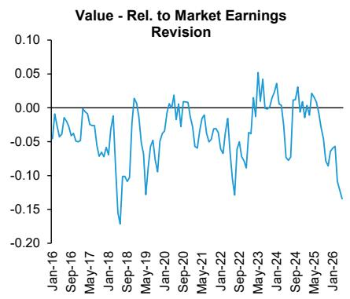

line

| Date    | Value |
|---------|-------|
| Jan-16  | -0.05 |
| Sep-16  | -0.02 |
| May-17  | -0.08 |
| Jan-18  | -0.15 |
| Sep-18  | -0.05 |
| May-19  | 0.02  |
| Jan-20  | -0.03 |
| Sep-20  | 0.01  |
| May-21  | -0.04 |
| Jan-22  | -0.06 |
| Sep-22  | -0.12 |
| May-23  | 0.05  |
| Jan-24  | -0.02 |
| Sep-24  | 0.03  |
| May-25  | -0.01 |
| Jan-26  | -0.14 |

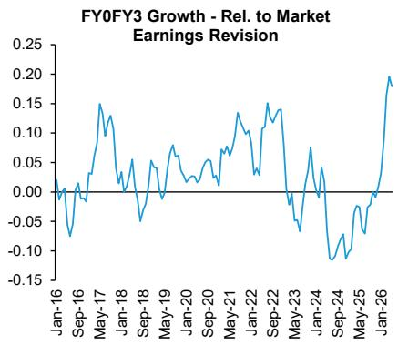

line

| Date    | Value |
|---------|-------|
| Jan-16  | 0.00  |
| Sep-16  | -0.05 |
| May-17  | 0.15  |
| Jan-18  | 0.00  |
| Sep-18  | -0.05 |
| May-19  | 0.05  |
| Jan-20  | 0.00  |
| Sep-20  | 0.05  |
| May-21  | 0.10  |
| Jan-22  | 0.15  |
| Sep-22  | 0.10  |
| May-23  | -0.05 |
| Jan-24  | -0.10 |
| Sep-24  | -0.15 |
| May-25  | -0.05 |
| Jan-26  | 0.20  |

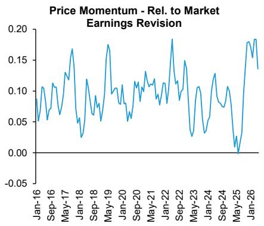

line

| Date   | Value |
|--------|-------|
| Jan-16 | 0.08  |
| Sep-16 | 0.11  |
| May-17 | 0.13  |
| Jan-18 | 0.17  |
| Sep-18 | 0.12  |
| May-19 | 0.18  |
| Jan-20 | 0.10  |
| Sep-20 | 0.12  |
| May-21 | 0.14  |
| Jan-22 | 0.19  |
| Sep-22 | 0.15  |
| May-23 | 0.11  |
| Jan-24 | 0.13  |
| Sep-24 | 0.10  |
| May-25 | 0.00  |
| Jan-26 | 0.18  |

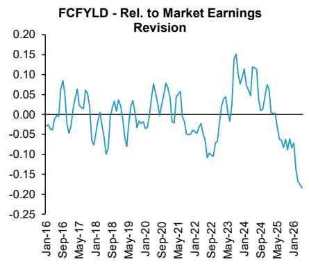

line

| Date    | Value  |
|---------|--------|
| Jan-16  | -0.05  |
| Sep-16  | 0.08   |
| May-17  | 0.06   |
| Jan-18  | -0.07  |
| Sep-18  | 0.04   |
| May-19  | -0.03  |
| Jan-20  | 0.07   |
| Sep-20  | -0.02  |
| May-21  | 0.05   |
| Jan-22  | -0.06  |
| Sep-22  | -0.12  |
| May-23  | 0.15   |
| Jan-24  | 0.12   |
| Sep-24  | -0.05  |
| May-25  | -0.18  |
| Jan-26  | -0.22  |

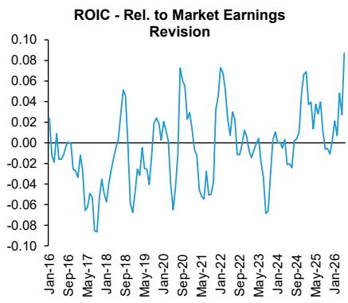

line

| Date   | ROIC |
|--------|------|
| Jan-16 | 0.02 |
| Sep-16 | -0.02 |
| May-17 | -0.08 |
| Jan-18 | -0.04 |
| Sep-18 | 0.05 |
| May-19 | -0.02 |
| Jan-20 | 0.02 |
| Sep-20 | 0.07 |
| May-21 | -0.06 |
| Jan-22 | 0.07 |
| Sep-22 | -0.02 |
| May-23 | -0.08 |
| Jan-24 | 0.01 |
| Sep-24 | 0.07 |
| May-25 | -0.02 |
| Jan-26 | 0.09 |

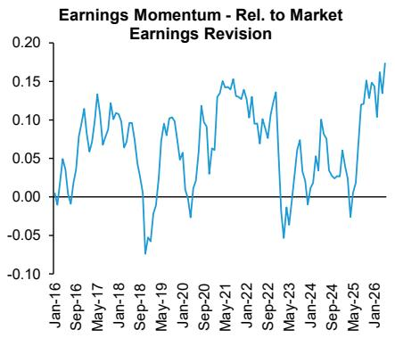

line

| Date   | Earnings Momentum |
|--------|-------------------|
| Jan-16 | 0.05              |
| Sep-16 | 0.12              |
| May-17 | 0.14              |
| Jan-18 | 0.10              |
| Sep-18 | -0.08             |
| May-19 | 0.10              |
| Jan-20 | 0.05              |
| Sep-20 | 0.12              |
| May-21 | 0.15              |
| Jan-22 | 0.14              |
| Sep-22 | 0.13              |
| May-23 | -0.05             |
| Jan-24 | 0.08              |
| Sep-24 | 0.10              |
| May-25 | -0.03             |
| Jan-26 | 0.17              |

Data as of May 22 $^{th}$ 2026   
Source: IBES, MSCI, FactSet, Bernstein analysis

EXHIBIT 25: Growth is overcrowded while crowding risk in momentum/quality is still not that extreme yet. Value/high yield have fallen to decade low crowding levels   
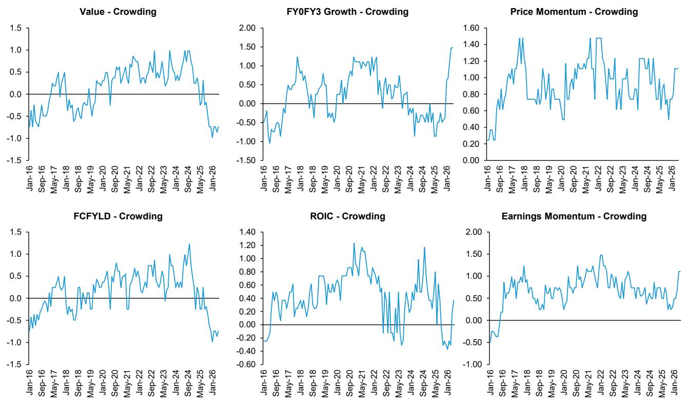  
Data as of May 22 $^{th}$ 2026   
Source: IBES, MSCI, FactSet, Bernstein analysis

EXHIBIT 26: Relative to market, however, growth and momentum have been cooling down from the record crowding level while value/high yield seem to be bottoming out from historical low crowding levels   
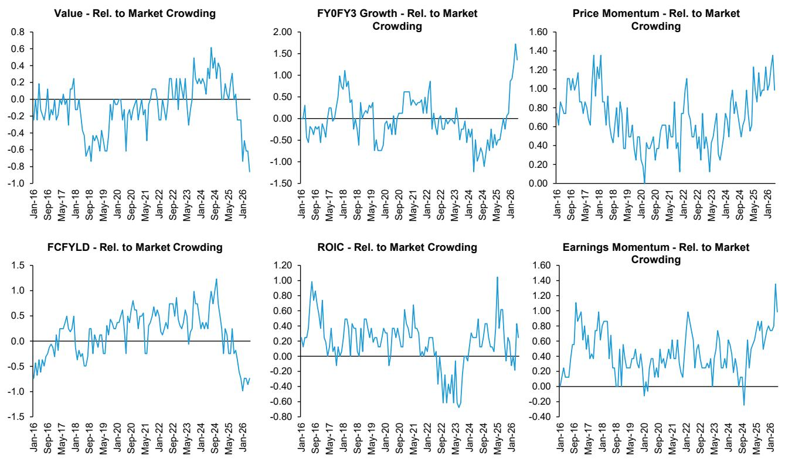  
Data as of May 22 $^{th}$ 2026   
Source: IBES, MSCI, FactSet, Bernstein analysis

EXHIBIT 27: Dispersion between growth and value/low vol is at decade high in TW, though there is more room for trends to continue led by earnings momentum   
Correlation: Taiwan Price Momentum 12m vs. Other factors   
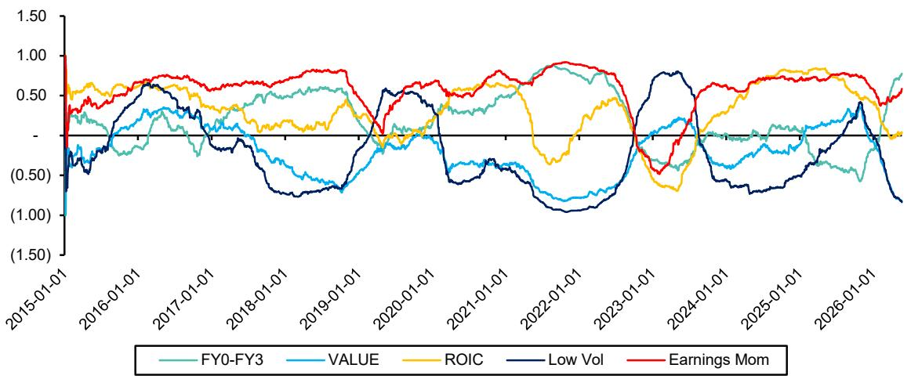

line

| Date       | FY0-FY3 | VALUE | ROIC | Low Vol | Earnings Mom |
|------------|---------|-------|------|---------|--------------|
| 2015-01-01 | 0.3     | -0.8  | 0.6  | -0.4    | 1.0          |
| 2016-01-01 | 0.4     | -0.6  | 0.7  | -0.3    | 0.8          |
| 2017-01-01 | 0.5     | -0.4  | 0.6  | -0.2    | 0.9          |
| 2018-01-01 | 0.6     | -0.2  | 0.5  | -0.1    | 0.8          |
| 2019-01-01 | 0.7     | 0.0   | 0.4  | 0.0     | 0.7          |
| 2020-01-01 | 0.8     | 0.2   | 0.3  | 0.1     | 0.6          |
| 2021-01-01 | 0.9     | 0.4   | 0.2  | 0.2     | 0.5          |
| 2022-01-01 | 1.0     | 0.6   | 0.1  | 0.3     | 0.4          |
| 2023-01-01 | 0.9     | 0.5   | 0.3  | 0.4     | 0.3          |
| 2024-01-01 | 0.8     | 0.4   | 0.5  | 0.5     | 0.2          |
| 2025-01-01 | 0.7     | 0.3   | 0.6  | 0.6     | 0.1          |
| 2026-01-01 | 0.6     | 0.2   | 0.7  | 0.7     | 0.0          |

Correlation: Taiwan Earnings Momentum 12m vs. Other factors   
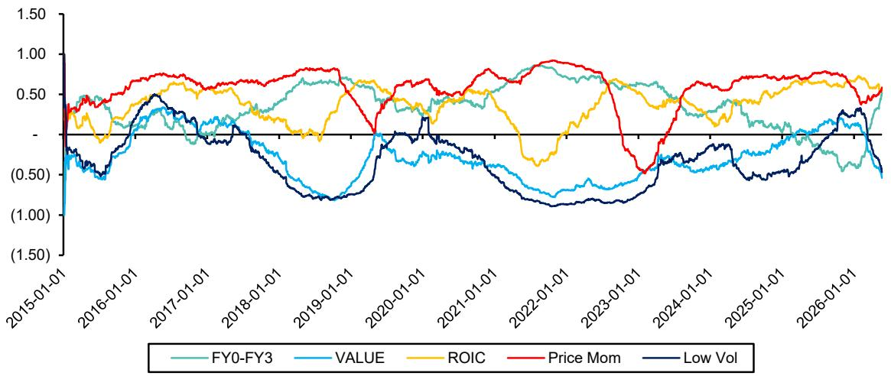

line

| Date       | FY0-FY3 | VALUE  | ROIC   | Price Mom | Low Vol |
|------------|---------|--------|--------|-----------|---------|
| 2015-01-01 |         |        |        |           |         |
| 2016-01-01 |         |        |        |           |         |
| 2017-01-01 |         |        |        |           |         |
| 2018-01-01 |         |        |        |           |         |
| 2019-01-01 |         |        |        |           |         |
| 2020-01-01 |         |        |        |           |         |
| 2021-01-01 |         |        |        |           |         |
| 2022-01-01 |         |        |        |           |         |
| 2023-01-01 |         |        |        |           |         |
| 2024-01-01 |         |        |        |           |         |
| 2025-01-01 |         |        |        |           |         |
| 2026-01-01 |         |        |        |           |         |

Data as of May 22 $^{th}$ 2026   
Source: IBES, MSCI, FactSet, Bernstein analysis

EXHIBIT 28: Taiwan high momentum and high growth stocks which are most vulnerable 

<table><tr><td>SEDOL</td><td>Sector</td><td>Company</td><td>12m Fwd. PE</td><td>10yr PE zscore</td><td>6m EPS Momentum</td><td>12m EPS Momentum</td><td>Crowding Decile (1=Most Crowded, 10=Least Crowded)</td><td>Bernstein Rating</td></tr><tr><td>637248</td><td>Semiconductors &amp; Semiconductor Equipment</td><td>MEDIATEK INC</td><td>59x</td><td>7.1</td><td>-5%</td><td>-17%</td><td>3</td><td>O</td></tr><tr><td>626073</td><td>Technology Hardware &amp; Equipment</td><td>DELTA ELECTRONICS</td><td>50x</td><td>4.8</td><td>61%</td><td>107%</td><td>2</td><td>O</td></tr><tr><td>613772</td><td>Technology Hardware &amp; Equipment</td><td>UNIMICRON TECHNOLOGY</td><td>68x</td><td>1.1</td><td>300%</td><td>113%</td><td>2</td><td>O</td></tr><tr><td>662158</td><td>Materials</td><td>NAN YA PLASTIC</td><td>16x</td><td>-0.4</td><td>1965%</td><td>462%</td><td>1</td><td></td></tr><tr><td>BFXZDY</td><td>Semiconductors &amp; Semiconductor Equipment</td><td>ASE TECHNOLOGY HOLDING</td><td>34x</td><td>4.7</td><td>90%</td><td>54%</td><td>1</td><td></td></tr><tr><td>B05638</td><td>Semiconductors &amp; Semiconductor Equipment</td><td>GLOBAL UNICHIP CORP</td><td>111x</td><td>5.6</td><td>57%</td><td>42%</td><td>2</td><td></td></tr><tr><td>B3FJBY</td><td>Semiconductors &amp; Semiconductor Equipment</td><td>JENTECH PRECISION INDL</td><td>61x</td><td>4.5</td><td>75%</td><td>0%</td><td></td><td></td></tr><tr><td>600521</td><td>Technology Hardware &amp; Equipment</td><td>ACCTON TECHNOLOGY CORP</td><td>34x</td><td>2.9</td><td>47%</td><td>82%</td><td>3</td><td></td></tr><tr><td>654489</td><td>Technology Hardware &amp; Equipment</td><td>ASIA VITAL COMPONENTS</td><td>27x</td><td>-0.9</td><td>91%</td><td>157%</td><td>2</td><td></td></tr><tr><td>631612</td><td>Technology Hardware &amp; Equipment</td><td>ELITE MATERIAL CO</td><td>57x</td><td>6.8</td><td>98%</td><td>90%</td><td></td><td></td></tr><tr><td>B734XQ</td><td>Technology Hardware &amp; Equipment</td><td>ZHEN DING TECHNOLOGY</td><td>42x</td><td>8.8</td><td>34%</td><td>17%</td><td>3</td><td></td></tr></table>

Data as of May 22 $^{th}$ 2026. Analyst Ratings: O= Outperform, M=Market-Perform (Bernstein Brand)/N=Neutral (Autonomous Brand), U = Underperform rating. Further details of the research and important disclosures on the above covered securities are available on the Bernstein website: https://bernsteinautonomous.bluematrix.com/sellside/ Disclosures.action
Source: IBES, MSCI, FactSet, Bernstein analysis

We acknowledge the contributions of Rui Shi to this report

# I. REQUIRED DISCLOSURES

References to "Bernstein" or the "Firm" in these disclosures relate to the following entities: Bernstein Institutional Services LLC (April 1, 2024 onwards), Bernstein & Co., LLC (pre April 1, 2024), Bernstein Autonomous LLP, BSG France S.A. (April 1, 2024 onwards), Bernstein (Hong Kong) Limited 盛博香港有限公司, Bernstein (Canada) Limited, Bernstein (India) Private Limited (SEBI registration no. INH000006378), Bernstein (Singapore) Private Limited, Bernstein Japan KK (サンフォード・C・バーンスタイン株式会社) and analysts employed by SG Africa Technologies & Services to produce Bernstein under a Global Services Agreement in place between Bernstein and SG.

Bernstein is part of a joint venture between SG (SG) and AllianceBernstein, L.P. (AB). Unless specifically noted otherwise, for purposes of these disclosures, references to Bernstein's “affiliates” relate to both SG and AB and their respective affiliates.

# RATINGS DEFINITIONS, BENCHMARKS AND DISTRIBUTION

# EQUITY RATINGS DEFINITIONS

# Bernstein brand

The Bernstein brand rates stocks based on forecasts of relative performance for the next 12 months versus the S&P 500 for stocks listed on the U.S. and Canadian exchanges, versus the Bloomberg Europe Developed Markets Large and Mid Cap Price Return Index EUR (EDME) for stocks listed on the European exchanges and emerging markets exchanges outside of the Asia Pacific region, versus the Bloomberg Japan Large and Mid Cap Price Return Index USD (JPL) for stocks listed on the Japanese exchanges, and versus the Bloomberg Asia ex-Japan Large and Mid Cap Price Return Index (ASIAX) for stocks listed on the Asian (ex-Japan) exchanges -unless otherwise specified.

The Bernstein brand has three categories of ratings:

- Outperform: Stock will outpace the market index by more than 15 pp   
• Market-Perform: Stock will perform in line with the market index to within +/-15 pp   
• Underperform: Stock will trail the performance of the market index by more than 15 pp

Coverage Suspended: Coverage of a company under the Bernstein brand has been suspended. Ratings and price targets are suspended temporarily, are no longer current, and should therefore not be relied upon.

Not Rated: A rating assigned when the stock cannot be accurately valued, or the performance of the company accurately predicted, at the present time. The covering analyst may continue to publish research reports on the company to update investors on events and developments.

Not Covered (NC) denotes companies that are not under coverage.

Bernstein brand stock ratings are based on a 12-month time horizon.

# Autonomous brand – common stocks

The Autonomous brand rates common stocks as indicated below. As our benchmarks we use the Bloomberg Europe 500 Banks And Financial Services Index (BEBANKS) and Bloomberg Europe Dev Mkt Financials Large and Mid Cap Price Ret Index EUR (EDMFI) index for developed European banks and Payments, the Bloomberg Europe 500 Insurance Index (BEINSUR) for European insurers, the S&P 500 and S&P Financials for US banks and Payments coverage, S5LIFE for US Insurance, the S&P Insurance Select Industry (SPSIINS) for US Non-Life Insurers coverage, and the Bloomberg Emerging Markets Financials Large, Mid and Small Cap Price Return Index (EMLSF) for emerging market banks and insurers and Payments. Ratings are stated relative to the sector (not the market).

The Autonomous brand has three categories of common stock ratings:

\- Outperform (OP): Stock will outpace the relevant index by more than 10 pp

- Neutral (N): Stock will perform in line with the market index to within +/-10 pp   
• Underperform (UP): Stock will trail the performance of the relevant index by more than 10 pp

Coverage Suspended: Coverage of a company under the Autonomous research brand has been suspended. Ratings and price targets are suspended temporarily, are no longer current, and should therefore not be relied upon.

Not Rated: A rating assigned when the stock cannot be accurately valued, or the performance of the company accurately predicted, at the present time. The covering analyst may continue to publish research reports on the company to update investors on events and developments.

Those denoted as ‘Feature’ (e.g., Feature Outperform FOP, Feature Under Outperform FUP) are our core ideas.

Not Covered (NC) denotes companies that are not under coverage.

Autonomous brand common stock ratings are based on a 12-month time horizon.

# Autonomous brand – preferred stocks

The Autonomous brand has three categories of preferred stock ratings:

- Outperform (OP): The total return of the preferred instrument is expected to outperform preferred securities of other issuers operating in similar sectors or rating categories over the next six months.   
- Neutral (N): The total return of the preferred instrument is expected to perform in line with preferred securities of other issuers operating in similar sectors or rating categories over the next six months.   
- Underperform (UP): The total return of the preferred instrument is expected to underperform preferred securities of other issuers operating in similar sectors or rating categories over the next six months.

Autonomous preferred stock ratings are based on a 6-month time horizon.

# AUTONOMOUS CREDIT RESEARCH

Where this report contains investment recommendations for credit instruments, as defined in article 3(1)(35) of the Market Abuse Regulation, the information below is presented to comply with its disclosure requirements.

The report may also include reference(s) to published opinions by other Autonomous or Bernstein analysts covering the equity securities of the issuer(s) referenced herein. Please note an investment recommendation for credit instruments published by the author(s) of this report may differ from the published view of the analyst covering equity securities for the issuer(s) contained in this report and vice versa.

# CREDIT RATINGS DEFINITIONS

The Autonomous brand has three categories of credit ratings:

- Credit Outperform (C-OP): The total return of the Reference Credit Instrument is expected to outperform the credit spread of bonds of other issuers operating in similar sectors or rating categories over the next six months.   
- Credit Neutral (C-N): The total return of the Reference Credit Instrument is expected to perform in line with the credit spread of bonds of other issuers operating in similar sectors or rating categories over the next six months.   
- Credit Underperform (C-UP): The total return of the Reference Credit Instrument is expected to underperform the credit spread of bonds of other issuers operating in similar sectors or rating categories over the next six months.

Autonomous credit ratings are based on a 6-month time horizon.

A list of all investment recommendations produced by the author(s) of this report alongside credit ratings history are available upon request.

It is at the sole discretion of the Firm as to when to initiate, update and cease research coverage. The Firm has established, maintains and relies on information barriers to control the flow of information contained in one or more areas (i.e. the private side)

within the Firm, and into other areas, units, groups or affiliates (i.e. public side) of the Firm

DISTRIBUTION OF EQUITY RATINGS/INVESTMENT BANKING SERVICES 

<table><tr><td>Equity Rating</td><td>Market Abuse Regulation (MAR) and FINRA Rating Category</td><td>Global Rating Distribution</td><td>Investment Banking Relationships*</td></tr><tr><td>Outperform</td><td>BUY</td><td>51.1%</td><td>16.5%</td></tr><tr><td>Market-Perform (Bernstein Brand) Neutral (Autonomous Brand)</td><td>HOLD</td><td>36.3%</td><td>17.8%</td></tr><tr><td>Underperform</td><td>SELL</td><td>12.6%</td><td>14.9%</td></tr></table>

\* These figures represent the percentage of companies within each equity rating category for which affiliates of Bernstein have provided investment banking services within the previous 12 months.

As of March 31, 2026. All figures are updated quarterly.

# OTHER MATTERS

The legal entity(ies) employing the analyst(s) listed in this report, and their location, can be determined by the country code of their phone number, as follows:

+1 Bernstein Institutional Services LLC; New York, New York, USA   
+44 Bernstein Autonomous LLP; London UK   
+212 SG Africa Technologies & Services; Casablanca, Morocco   
+33 BSG France S.A.; Paris, France   
+34 BSG France S.A.; Madrid, Spain   
+41 Bernstein Autonomous LLP; Geneva, Switzerland   
+49 BSG France S.A.; Frankfurt, Germany   
+91 Bernstein (India) Private Limited; Mumbai, India   
+852 Bernstein (Hong Kong) Limited 盛博香港有限公司; Hong Kong, China   
+65 Bernstein (Singapore) Private Limited; Singapore   
+81 Bernstein Japan KK; Tokyo, Japan

Where this report has been prepared by research analyst(s) employed by a non-US affiliate, such analyst(s), is/are (unless otherwise expressly noted below) not registered as associated persons of Bernstein Institutional Services LLC or any other SEC-registered broker-dealer and are not licensed or qualified as research analysts with FINRA. Accordingly, such analyst(s) may not be subject to FINRA's restrictions regarding (among other things) communications by research analysts with a subject company, interactions between research analysts and investment banking personnel, participation by research analysts in solicitation and marketing activities relating to investment banking transactions, public appearances by research analysts, and trading securities held by a research analyst account.

Where this report has been prepared by research analyst(s) employed by SG Africa Technologies & Services (part of the SG group of companies), it has been prepared on behalf of a Bernstein company under a Global Services Agreement in place between Bernstein and SG.

# CERTIFICATION

Each research analyst listed in this report, who is primarily responsible for the preparation of the content of this report, certifies that all of the views expressed in this publication accurately reflect that analyst's personal views about any and all of the subject securities or issuers and that no part of that analyst's compensation was, is, or will be, directly or indirectly, related to the specific recommendations or views in this publication.

# II. ADDITIONAL GLOBAL CONFLICT DISCLOSURES

It is at the sole discretion of the Firm as to when to initiate, update and cease research coverage. The Firm has established, maintains and relies on information barriers to control the flow of information contained in one or more areas (i.e., the private side) within the Firm, and into other areas, units, groups or affiliates (i.e., public side) of the Firm.

# III. OTHER IMPORTANT INFORMATION AND DISCLOSURES

Separate branding is maintained for “Bernstein” and “Autonomous” research products.

- Bernstein produces a number of different types of research products including, among others, fundamental analysis and quantitative analysis under both the “Autonomous” and “Bernstein” brands. Recommendations contained within one type of research product may differ from recommendations contained within other types of research products, whether as a result of differing time horizons, methodologies or otherwise. Furthermore, views or recommendations within a research product issued under one brand may differ from views or recommendations under the same type of research product issued under the other brand. The Research Ratings System for the two brands and other information related to those Rating Systems are included in the previous section.   
- Autonomous operates as a separate business unit within the following entities: Bernstein Institutional Services LLC, Bernstein Autonomous LLP, Bernstein (Hong Kong) Limited 盛博香港有限公司 and Bernstein (India) Private Limited. For information relating to “Autonomous” branded products (including certain Sales materials) please visit: www.autonomous.com. For information relating to Bernstein branded products please visit: www.bernsteinresearch.com.

Analysts are compensated based on aggregate contributions to the research franchise as measured by account penetration, productivity and proactivity of investment ideas. No analysts are compensated based on performance in, or contributions to, generating investment banking revenues.

This report has been produced by an independent analyst as defined in Article 3 (1)(34)(i) of EU 596/2014 Market Abuse Regulation (“MAR”) and the same article of MAR as it forms part of United Kingdom domestic law by virtue of the European Union (Withdrawal) Act 2018.

To our readers in the United States: Bernstein Institutional Services LLC, a broker-dealer registered with the U.S. Securities and Exchange Commission (“SEC”) and a member of the U.S. Financial Industry Regulatory Authority, Inc. (“FINRA”) is distributing this publication in the United States and accepts responsibility for its contents. Where this material contains an analysis of debt product(s), such material is intended only for institutional investors and is not subject to the US independence and disclosure standards applicable to debt research prepared for retail investors.

Bernstein Institutional Services LLC may act as principal for its own account or as agent for another person (including an affiliate) in sales or purchases of any security which is a subject of this report. This report does not purport to meet the objectives or needs of any specific individuals, entities or accounts.

To our readers in Canada: If this publication pertains to a Canadian domiciled company, it is being distributed in Canada by Bernstein (Canada) Limited, which is licensed and regulated by the Canadian Investment Regulatory Organization. If the publication pertains to a non-Canadian domiciled company, it is being distributed by Bernstein Institutional Services LLC, which is licensed and regulated by both the SEC and FINRA, into Canada under the International Dealers Exemption.

This document may not be passed onto any person in Canada unless that person qualifies as "permitted client" as defined in Section 1.1 of NI 31-103.

To our readers in Brazil: This report has been prepared by Bernstein Institutional Services LLC, and Banco BTG Pactual S.A. ("BTG") is responsible for the distribution of this report in Brazil.

To readers in the United Kingdom: This publication has been issued or approved for issue in the United Kingdom by Bernstein Autonomous LLP, authorised and regulated by the Financial Conduct Authority and located at 60 London Wall, London EC2M 5SH, +44 (0)20-7170-5000. Registered in England & Wales No OC343985.

This document is for distribution only to persons who (i) have professional experience in matters relating to investments falling within Article 19(5) of the Financial Services and Markets Act 2000 (Financial Promotion) Order 2005 (as amended, the “Financial Promotion Order”), (ii) are persons falling within Article 49(2)(a) to (d) (“high net worth companies, unincorporated associations, etc.") of the Financial Promotion Order, (iii) are outside the United Kingdom, or (iv) are persons to whom an invitation or inducement to engage in investment activity (within the meaning of section 21 of the FSMA) in connection with the issue or sale of any securities may otherwise lawfully be communicated or caused to be communicated (all such persons together being referred to as “relevant persons”). This document is directed only at relevant persons and must not be acted on or relied on by persons who are not relevant persons. Any investment or investment activity to which this document relates is available only to relevant persons and will be engaged in only with relevant persons.

To our readers in the member states of the EEA: This publication is being distributed by BSG France SA, which is authorised and regulated by the Autorité de Contrôle Prudentiel et de Résolution (ACPR) and Autorité des Marchés Financiers (AMF).

To our readers in Hong Kong: This publication is being distributed in Hong Kong by Bernstein (Hong Kong) Limited 盛博香港有限公司, which is licensed and regulated by the Hong Kong Securities and Futures Commission (Central Entity No. AXC846) to carry out Type 4 (Advising on Securities) regulated activities and subject to the licensing conditions mentioned in the SFC Public Register (https://www.sfc.hk/publicregWeb/corp/AXC846/details)). This publication is solely for professional investors, as defined in the Securities and Futures Ordinance (Cap. 571). The purpose of this report is solely to provide an analysis of the issuers referred to in this report and is not intended for any purpose contrary to the laws of Hong Kong.

To our readers in Singapore: This publication is being distributed in Singapore by Bernstein (Singapore) Private Limited, only to accredited investors or institutional investors, as defined in the Securities and Futures Act 2001 of Singapore ("SFA"). Recipients in Singapore should contact Bernstein (Singapore) Private Limited in respect of matters arising from, or in connection with, this publication. Bernstein (Singapore) Private Limited is regulated by the Monetary Authority of Singapore and licensed under the SFA as a capital markets services licence holder for dealing in capital markets products that are securities and collective investment schemes and an exempt financial adviser for advising on, issuing and promulgating analyses and reports on securities. Bernstein (Singapore) Private Limited is registered in Singapore with Company Registration No. 20213710W and located at One Raffles Quay, #27-11 South Tower, Singapore 048583, +65-6230-4612.

To our readers in the People's Republic of China: The securities referred to in this document are not being offered or sold and may not be offered or sold, directly or indirectly, in the People's Republic of China (for such purposes, not including the Hong Kong and Macau Special Administrative Regions or Taiwan, the "PRC") in contravention of any applicable laws of the PRC.

This document does not constitute an offer to sell or the solicitation of an offer to buy any securities in the PRC to any person to whom it is unlawful to make the offer or solicitation in the PRC.

We do not represent that this document may be lawfully distributed, or that any securities may be lawfully offered, in compliance with any applicable registration or other requirements in the PRC, or pursuant to an exemption available thereunder, or assume any responsibility for facilitating any such distribution or offering. In particular, no action has been taken by us which would permit a public offering of any securities or distribution of this document in the PRC. Accordingly, the securities are not being offered or sold within the PRC by means of this document or any other document. Neither this document nor any advertisement or other offering material may be distributed or published in the PRC, except under circumstances that will result in compliance with any applicable laws and regulations.

To our readers in Japan: This publication is being distributed in Japan by Bernstein Japan KK (サンフォード・C・バーンスタイン株式会社), which is registered in Japan as a Financial Instruments Business Operator with the Kanto Local Finance Bureau (registration number: The Director-General of Kanto Local Finance Bureau (FIBO) No.3387) and regulated by the Financial Services Agency. It is also a member of Japan Investment Advisers Association. This publication is solely for qualified institutional investors in Japan only, as defined in Article 2, paragraph (3), items (i) of the Financial Instruments and Exchange Act.

For the institutional client readers in Japan who have been granted access to the Bernstein website by Daiwa Group Inc. ("Daiwa"), your access to this document should not be construed as meaning that Bernstein is providing you with investment advice for any purposes. Whilst Bernstein has prepared this document, your relationship is, and will remain with, Daiwa, and Bernstein has neither any contractual relationship with you nor any obligations towards you.

To our readers in Australia: Bernstein (Hong Kong) Limited 盛博香港有限公司 is responsible for distributing research in Australia. It is regulated by the Securities and Exchange Commission under U.S. laws, by the Financial Conduct Authority under U.K. laws, which differs from Australian laws. Bernstein (Hong Kong) Limited 盛博香港有限公司 is exempt from the requirement to hold an Australian financial services license under the Corporations Act 2001 in respect of the provision of the following financial services to wholesale clients:

• providing financial product advice;   
• dealing in a financial product;

• making a market for a financial product; and   
• providing a custodial or depository service.

To our readers in India: This publication is being distributed in India by Bernstein (India) Private Limited (SCB India) which is licensed and regulated by Securities and Exchange Board of India ("SEBI") as a research analyst entity under the SEBI (Research Analyst) Regulations, 2014, having registration no. INH000006378 and as a stock broker having registration no. INZ000213537. SCB India is currently engaged in the business of providing research and stock broking services. Please refer to www.bernsteinresearch.in for more information.

- SCB India is a Private limited company incorporated under the Companies Act, 2013, on April 12, 2017 bearing corporate identification number U65999MH2017FTC293762, and registered office at Level 3A, 4th Floor, First International Financial Centre, Plot Nos C-54 and C-55, G Block, Near CBI Office, Bandra Kurla Complex, Bandra (East), Mumbai 400098, Maharashtra, India (Phone No: +91-22-68421401).   
- For details of Associates (i.e., affiliates/group companies) of SCB India, kindly email MUM-BERNSTEIN-InCompliance@bernsteinsg.com.   
• SCB India does not have any disciplinary history as on the date of this report.   
- Except as noted above, SCB India and/or its Associates (i.e., affiliates/group companies), the Research Analysts authoring this report, and their relatives

• do not have any financial interest in the subject company   
• do not have actual/beneficial ownership of one percent or more in securities of the subject company;   
- is not engaged in any investment banking activities for Indian companies, as such;   
• have not managed or co-managed a public offering in the past twelve months for any Indian companies;

\- have not received any compensation for investment banking services or merchant banking services from the subject company in the past 12 months;

• have not received compensation for brokerage services from the subject company in the past twelve months;

\- have not received any compensation or other benefits from the subject company or third party related to the specific recommendations or views in this report; and

\- do not currently, but may in the future, act as a market maker in the financial instruments of the companies covered in the report.

\- do not have any conflict of interest in the subject company as of the date of this report.

\- Except as noted above, the subject company has not been a client of SCB India during twelve months preceding the date of distribution of this research report. Neither SCB India nor its Associates (i.e., affiliates/group companies) have received compensation for products or services other than investment banking, merchant banking or brokerage services from the subject company in the past twelve months.

\- The principal research analyst(s) who prepared this report, members of the analysts' team, and members of their households are not an officer, director, employee or advisory board member of the companies covered in the report.

\- Our Compliance officer / Grievance officer is Ms. Rupal Talati, who can be reached at +91-22-68421451, or MUM-BERNSTEIN-InCompliance@bernsteinsg.com / Scbin-investorgrievance@bernsteinsg.com

\- The Research investor charter and Terms & Conditions of SCB India are available on its website and may be accessed at Bernstein (India) Private Limited (https://bernsteinresearch.in/) for your reference.

\- Disclaimer: Registration granted by SEBI, and certification from NISM, is in no way a guarantee of performance of the intermediary or provide any assurance of returns to investors. Investments in securities market are subject to market risks. Read

all the related documents carefully before investing.

To our readers in Switzerland: This document is provided in Switzerland by or through Bernstein Autonomous LLP, and is provided only to qualified investors as defined in article 10 of the Swiss Collective Investment Scheme Act (“CISA”) and related provisions of the Collective Investment Scheme Ordinance and in strict compliance with applicable Swiss law and regulations. The products mentioned in this document may not be suitable for all types of investors. This document is based on the Directives on the Independence of Financial Research issued by the Swiss Bankers Association (SBA) in January 2008.

To our readers in the Middle East: Bernstein Autonomous LLP, DIFC branch has its principal office at Gate Village 06, DIFC, Dubai, UAE. Bernstein Autonomous LLP, DIFC branch is regulated by the Dubai Financial Services Authority (DFSA) with the registration number CL10040 and is provisioned for Arranging Deals in Investments and Advising on Financial Products. All communications and services are directed at Professional Clients and Market Counterparties only (as defined in the DFSA rulebook). Persons other than Professional Clients and Market Counterparties, such as Retail Clients, are not the intended recipients of our communications or services.

# LEGAL

All research publications are disseminated to our clients through posting on the firm's password protected websites, bernsteinresearch.com and autonomous.com. Certain, but not all, research publications are also made available to clients through third-party vendors or redistributed to clients through alternate electronic means as a convenience.

This publication has been published and distributed in accordance with the Firm's policy for management of conflicts of interest in investment research, a copy of which is available from Bernstein Institutional Services LLC, Director of Compliance, 245 Park Avenue, New York, NY 10167. Additional disclosures and information regarding Bernstein's business are available on our website www.bernsteinresearch.com.

The securities described herein may not be eligible for sale in all jurisdictions or to certain categories of investors where that permission profile is not consistent with the licenses held by the entities noted herein. This document is for distribution only as may be permitted by law. This publication is not directed to, or intended for distribution to or use by, any person or entity who is a citizen or resident of, or located in any locality, state, country or other jurisdiction where such distribution, publication, availability or use would be contrary to law or regulation or which would subject any of the entities referenced herein or any of their subsidiaries or affiliates to any registration or licensing requirement within such jurisdiction. This publication is based upon public sources we believe to be reliable, but no representation is made by us that the publication is accurate or complete. We do not undertake to advise you of any change in the reported information or in the opinions herein. This publication was prepared and issued by entity referred to herein for distribution to eligible counterparties or professional clients. This publication is not an offer to buy or sell any security, and it does not constitute investment, legal or tax advice. The investments referred to herein may not be suitable for you. Investors must make their own investment decisions in consultation with their professional advisors in light of their specific circumstances. The value of investments may fluctuate, and investments that are denominated in foreign currencies may fluctuate in value as a result of exposure to exchange rate movements. Information about past performance of an investment is not necessarily a guide to, indicator of, or assurance of, future performance.

This report is directed to and intended only for our clients who are “eligible counterparties”, “professional clients”, “institutional investors” and/or “professional investors” as defined by the aforementioned regulators, and must not be redistributed to retail clients as defined by the aforementioned regulators. Retail clients who receive this report should note that the services of the entities noted herein are not available to them and should not rely on the material herein to make an investment decision. The result of such act will not hold the entities noted herein liable for any loss thus incurred as the entities noted herein are not registered/authorised/licensed to deal with retail clients and will not enter into any contractual agreement/arrangement with retail clients. This report is provided subject to the terms and conditions of any agreement that the clients may have entered into with the entities noted herein. All research reports are disseminated on a simultaneous basis to eligible clients through electronic publication to our client portal.

The information in this report was prepared by Bernstein solely for the internal business use of our clients. Clients may store, display, analyze, reformat and print the information in this report for this limited use only. Clients may not copy, alter, create derivative works, resell, reverse engineer, commercially exploit, share or distribute any part of the information contained herein for any purpose without Bernstein's express written consent. These restrictions include extracting data or using the content to develop indices or other products. Further, you may not use this report, or any portion of this report, to train or finetune any third-party machine learning or artificial intelligence system, or as a prompt or input into any such system. You also may not, without Bernstein's express written consent, do any of the foregoing in connection with your own internal machine learning or artificial intelligence system.

Bernstein may use artificial intelligence tools in the preparation of its materials. Any such materials are reviewed by Bernstein's research analysts prior to publication.

This report has been prepared for information purposes only and is based on current public information that we consider reliable, but the entities noted herein do not warrant or represent (express or implied) as to the sources of information or data contained herein are accurate, complete, not misleading or as to its fitness for the purpose intended even though the entities noted herein rely on reputable or trustworthy data providers, it should not be relied upon as such. Opinions expressed are the author(s)' current opinions as of the date appearing on the material only and we do not undertake to advise you of any change in the reported information or in the opinions herein.

This publication was prepared and issued by the entity referred to herein for distribution to eligible counterparties or professional clients. The information in this report is intended for general circulation and does not constitute an offer to buy or sell any security, investment, legal or tax advice nor a personal recommendation, as defined by any of the aforementioned regulators. It does not take into account the particular investment objectives, financial situations, or needs of individual investors. The report has not been reviewed by any of the aforementioned regulators and does not represent any official recommendation from the aforementioned regulators. The investments referred to herein may not be suitable for you. Investors must make their own investment decisions in consultation with advice sought from a financial adviser regarding the suitability of the investment product, taking into account the specific investment objectives, financial situation or particular needs of any recipient of the recommendation, before the recipient makes a commitment to purchase the investment product.

The analysis contained herein is based on numerous assumptions. Different assumptions could result in materially different results. The information in this report does not constitute, or form part of, any offer to sell or issue, or any offer to purchase or subscribe for shares, or to induce engage in any other investment activity. The value of any securities or financial instruments mentioned in this report may fluctuate subject to market conditions. Information about past performance of an investment is not necessarily a guide to, indicative of, or assurance of future performance. Estimates of future performance mentioned by the research analyst in this report are based on assumptions that may not be realized due to unforeseen factors like market volatility/fluctuation. In relation to securities or financial instruments denominated in a foreign currency other than the clients' home currency, movements in exchange rates will have an effect on the value, either favorable or unfavorable. Before acting on any recommendations in this report, recipients should consider the appropriateness of investing in the subject securities or financial instruments mentioned in this report and, if necessary, seek for independent professional advice.

The securities described herein may not be eligible for sale in all jurisdictions or to certain categories of investors where that permission profile is not consistent with the licenses held by the entities noted herein. This document is for distribution only as may be permitted by law. It is not directed to, or intended for distribution to or use by, any person or entity who is a citizen or resident of or located in any locality, state, country or other jurisdiction where such distribution, publication, availability or use would be contrary to law or regulation or would subject the entities noted herein to any regulation or licensing requirement within such jurisdiction.

Source: Bloomberg Index Services Limited. BLOOMBERG® is a trademark and service mark of Bloomberg Finance L.P. and its affiliates (collectively “Bloomberg”). Bloomberg or Bloomberg’s licensors own all proprietary rights in the Bloomberg Indices. Neither Bloomberg nor Bloomberg’s licensors approves or endorses this material, or guarantees the accuracy or completeness of any information herein, or makes any warranty, express or implied, as to the results to be obtained therefrom and, to the maximum extent allowed by law, neither shall have any liability or responsibility for injury or damages arising in connection therewith.

No part of this material may be reproduced, distributed or transmitted or otherwise made available without prior consent of the entities noted herein. Copyright Bernstein Institutional Services LLC Bernstein Autonomous LLP, BSG France S.A., Bernstein (Hong Kong) Limited 盛博香港有限公司, Bernstein (Canada) Limited, Bernstein (India) Private Limited (SEBI registration no. INH000006378), Bernstein (Singapore) Private Limited and Bernstein Japan KK (サンフォード・C・バーンスタイン株式会社). All rights reserved. The trademarks and service marks contained herein are the property of their respective owners. Any unauthorized use or disclosure is strictly prohibited. The entities noted herein may pursue legal action if the unauthorized use results in any defamation and/or reputational risk to the entities noted herein and research published under the Bernstein and Autonomous brands.