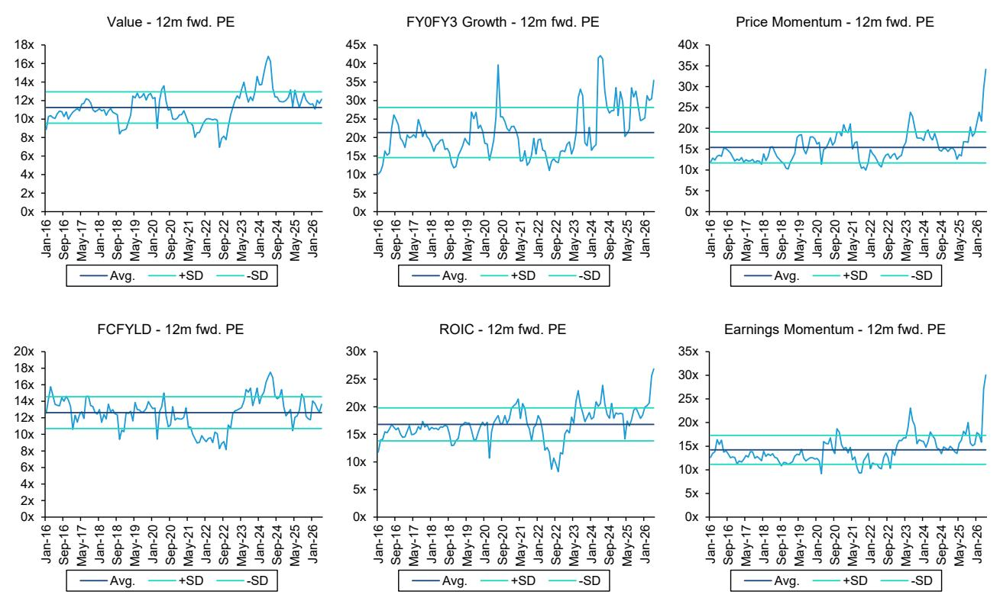
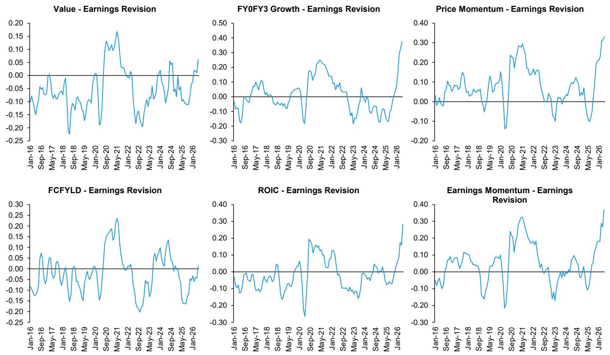

# Taiwan’s Market Dominance Has Peaked: The Inflection Point for Asia’s Largest Equity Weight Is Closer Than Most Investors Assume

The Taiwan equity market now commands a record 25 percent of the MSCI Emerging Markets Index and 28 percent of the MSCI Asia ex Japan Index. This is not a gradual trend. It is the result of an extraordinary rally that has concentrated capital, earnings expectations, and valuation expansion into a single geography at a scale Asia has never seen. The conventional narrative holds that this rally is fundamentally sound because it has been driven by earnings, not speculation. That narrative is becoming dangerous.

What the data now show is that Taiwan has reached a rare confluence of extremes: record-high earnings expectations, all-time high valuation multiples, peak concentration risk in both index weight and sector composition, and a decade-high dispersion between growth and value stocks. Each of these conditions individually would warrant caution. Taken together, they form the structural profile of an inflection point. The question is not whether Taiwan will correct, but what triggers the rotation and how severe the rebalancing will be.

The argument of this article is straightforward: Taiwan’s dominance in Asian benchmarks has moved from a reflection of genuine fundamental strength into a self-reinforcing cycle that is now pricing in perfection. Investors who continue to overweight Taiwan on the basis of past earnings momentum are extrapolating a regime that is approaching its natural limits. The strategic response is not to exit Taiwan entirely, but to recognize that the risk-reward profile has shifted decisively against momentum and growth exposures, and in favor of value and low-volatility factors that have been abandoned in the melt-up.

## The Record-High Concentration in Benchmarks and Fund Flows Is a Structural Risk, Not a Validation of Quality

Taiwan’s weight in the MSCI EM Index has doubled over the past five years. The top five stocks now account for 66 percent of the market capitalization, and the top ten account for 72 percent. Semiconductors and technology hardware together represent 84 percent of the entire market. This is not diversification. It is a single-sector bet dressed as a country allocation.

The concentration is mirrored in fund flows. Global emerging market funds now hold an average of 22.3 percent in Taiwan, surpassing China at 20 percent and Korea at 17 percent. Asia ex Japan funds show a similar pattern at 22.1 percent. Since April of this year, Taiwan has attracted 16 billion USD in foreign inflows, the highest in Asia outside Japan. That monthly inflow is already at a record level. When inflows reach extremes of this magnitude, the historical pattern is that they slow, reverse, and create a crowding exit.

The critical insight here is that benchmark weight and fund allocation have become reinforcing rather than reflective. As Taiwan’s weight in the index rises, passive flows mechanically increase allocation. Active managers, underperformance pressure, follow suit. This creates a feedback loop that inflates valuations beyond what fundamentals alone would support. The risk is that when the loop breaks, the unwind is asymmetric. There is no natural buyer of last resort for a market that has become the largest weight in the index while being the most concentrated in sector terms.

## Earnings Growth Has Supported the Rally, But the Upgrade Cycle Is Approaching Its Peak

It is true that Taiwan’s rally has been more earnings-driven than multiple-driven, which distinguishes it from purely speculative bubbles. The market’s return on invested capital stands at 11.5 percent, above its five-year and ten-year averages. Research and development spending as a percentage of sales has risen from 1.7 percent to 2.7 percent over the past decade, placing Taiwan second only to China in regional innovation intensity. The three-year forward earnings growth expectation for Taiwan is 29 percent CAGR, the highest in Asia.

These are genuine strengths. But the question is whether they are already priced in, and the evidence strongly suggests they are. Taiwan’s forward price-to-earnings ratio is 21 times, more than 2.6 standard deviations above its long-term average. Its price-to-book ratio of 4.5 times is 5.2 standard deviations above the historical mean. The equity risk premium has fallen to record lows. These are not levels from which markets generate attractive forward returns. They are levels from which markets become vulnerable to any disappointment in the earnings trajectory.

The upgrade cycle itself shows signs of maturity. While earnings revisions have not yet peaked in a definitive sense, they are near historical highs. The risk is not that earnings will collapse, but that the rate of improvement will decelerate. In a market trading at record multiples, the difference between 29 percent earnings growth and 25 percent earnings growth is not a minor variance. It is the difference between a market that holds its valuation and one that reprices sharply downward.

## The Melt-Up in Momentum and Growth Stocks Has Created Unsustainable Factor Extremes

The most striking feature of the current Taiwan market is the extreme performance of momentum and growth factors. Year to date, high-momentum stocks have generated 60 to 70 percent alpha relative to the market, and more than 100 percent on an absolute basis. Growth stocks have followed a similar trajectory. The Taiwan high-momentum portfolio is trading at record-high valuations relative to both its own history and the broader market. Earnings upgrades for these stocks have also reached record levels.

What makes this unsustainable is not just the valuation level, but the dispersion it has created. The gap between growth and value stocks in Taiwan is now at a ten-year high. Value stocks have fallen to record-low sentiment levels. This is the classic setup for a factor rotation. When growth and momentum become this crowded, the marginal buyer is exhausted, and any catalyst that shifts attention toward value or low-volatility stocks can trigger a rapid unwind.

The crowding in growth stocks is already at record highs. Momentum stocks are slightly less crowded, but that is cold comfort. The risk is not that momentum stocks are universally over-owned, but that the entire factor complex is priced for perfection. Quality stocks, which have generated 15 percent alpha year to date, are also trading at all-time valuation and earnings levels. There is no safe haven within the growth and momentum complex.

## The Report Leaves an Unresolved Question: What Catalyzes the Inflection, and How Fast Does It Unfold?

The analysis presented in the original report is rigorous in identifying the conditions for an inflection point, but it deliberately stops short of predicting the trigger. This is intellectually honest, but it leaves a critical gap for investors. We know that Taiwan is at extreme levels across multiple dimensions. We know that historical precedents suggest these extremes are not sustainable. What we do not know is what event will cause the repricing.

Possible catalysts are not hard to imagine. A slowdown in AI-related capital expenditure, a shift in US trade policy toward Taiwan, a rotation in global investor preferences toward value-oriented markets such as India or Korea, or simply a realization that earnings expectations have become too optimistic could each serve as a trigger. But the report does not assign probabilities to these scenarios, and it does not model the speed of the unwind.

This is the most important analytical question for investors who take this report seriously. If the inflection is gradual, then a measured rotation out of momentum and into value may be sufficient. If the inflection is sudden, then the liquidity dynamics of a market that has become a single-sector bet could produce a correction that overshoots fundamentals. The report’s recommendation to reduce exposure to high-momentum and high-growth stocks is prudent, but it does not address the sequencing risk. Investors need to decide not only what to sell, but when and at what pace.

## A Decision Framework for Navigating the Taiwan Inflection

For readers who accept the thesis that Taiwan is approaching an inflection point, the question becomes operational: what should a portfolio do? The original report provides directional guidance, but a framework is needed to translate that guidance into decisions.

The first dimension is factor exposure. The report is clear that momentum and growth are the most stretched factors, while value and low volatility are the most abandoned. The strategic response is to reduce momentum and growth positions in Taiwan and rotate into value and low-volatility stocks within the same market. This is not a call to exit Taiwan. It is a call to change the factor composition of the Taiwan allocation.

The second dimension is market weight. The report shows that Taiwan’s weight in benchmarks and fund allocations is at record highs. This suggests that the marginal benefit of further overweighting Taiwan is declining rapidly. For investors who are overweight Taiwan relative to the benchmark, the prudent move is to reduce that overweight toward neutral. For investors who are at benchmark weight, the question is whether to move underweight. The report does not explicitly recommend underweight, but the data support a cautious stance.

The third dimension is time horizon. The report identifies conditions that are extreme but does not predict when they will normalize. This means the decision framework must account for the possibility that the inflection takes months or quarters to materialize. Investors with short time horizons should act preemptively, because waiting for confirmation of the inflection will mean acting after the repricing has begun. Investors with long time horizons can afford to wait, but they should accept that the forward returns from current levels are likely to be below average.

The fourth dimension is stock selection within Taiwan. The report identifies the most vulnerable stocks in its exhibit 28, which is available in the full report. The framework here is simple: stocks with the highest momentum, the highest valuation multiples, and the most optimistic earnings expectations are the most exposed to a reversal. Stocks that have been left behind in the melt-up, particularly in value and low-volatility segments, offer a better risk-reward profile.

## The Full Report Contains the Charts and Data That Make This Analysis Actionable

The argument presented in this article is based on a careful reading of the original research report, but the full power of the analysis lies in the charts and exhibits that accompany it. The data on fund flows, valuation histories, earnings revision cycles, factor dispersion, and stock-level vulnerability are presented in visual form that makes the patterns unmistakable. Without those charts, the argument remains at the level of conceptual warning. With them, it becomes a practical tool for portfolio construction.

Join the community to read the full report and review the original charts.

*This article is for learning and discussion only and does not constitute investment advice.*

Personal reading notes and learning share only. Not investment advice.

