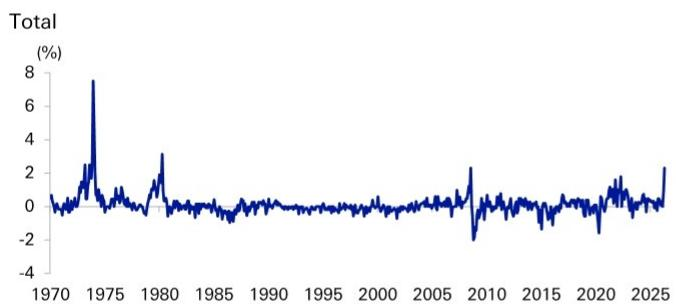
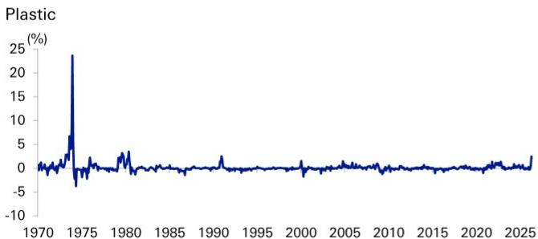
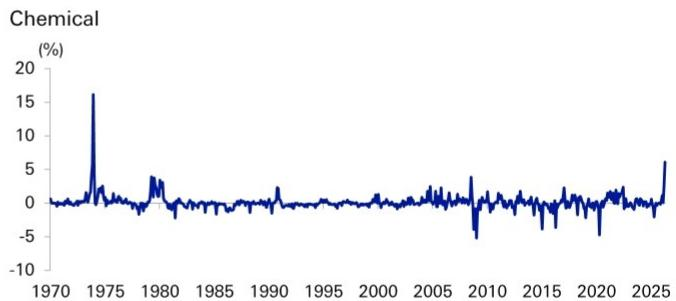
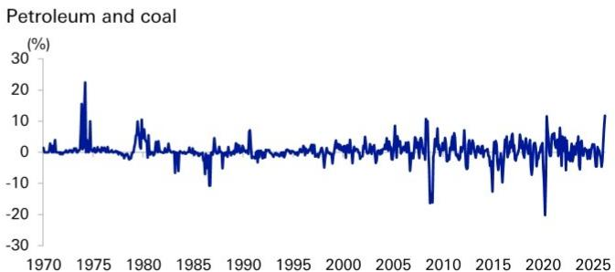
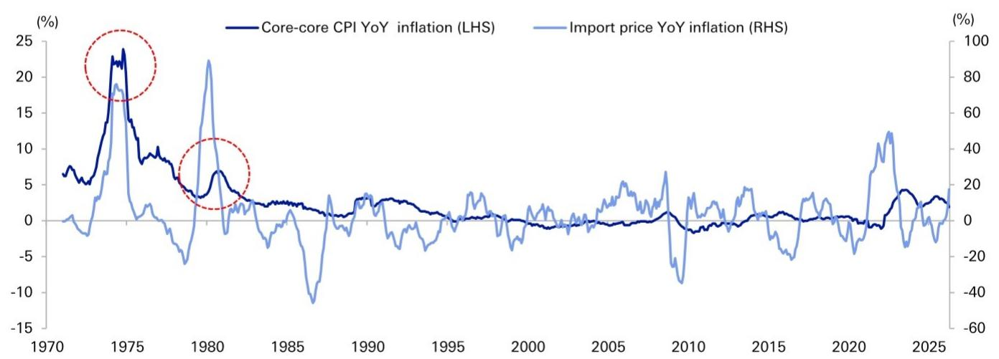
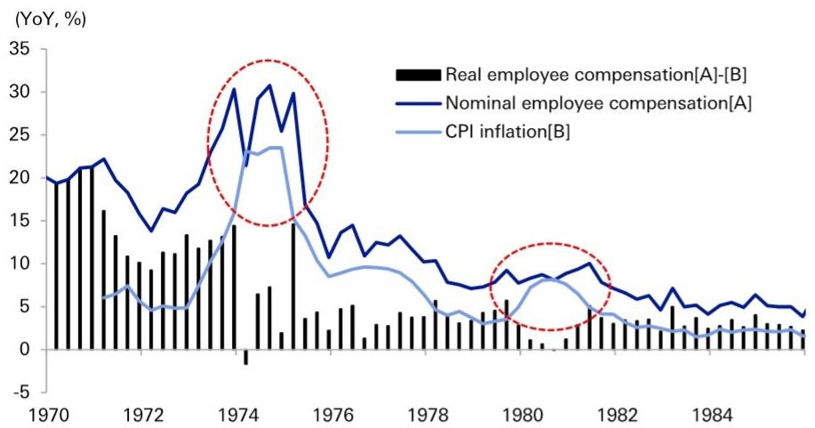
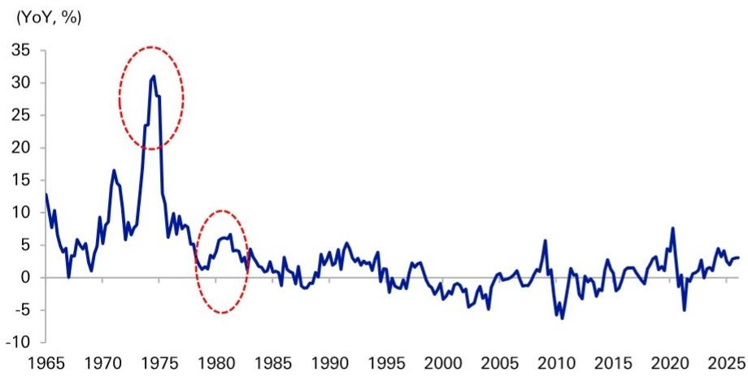
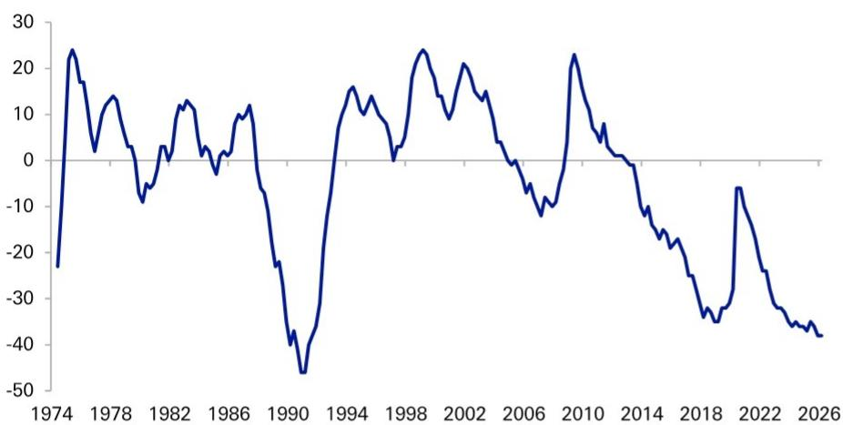
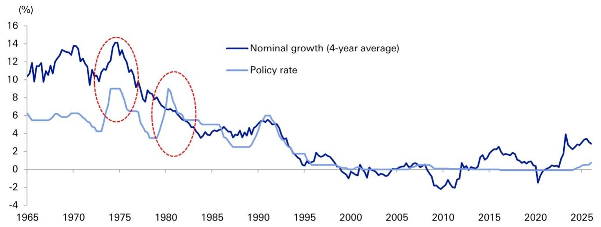
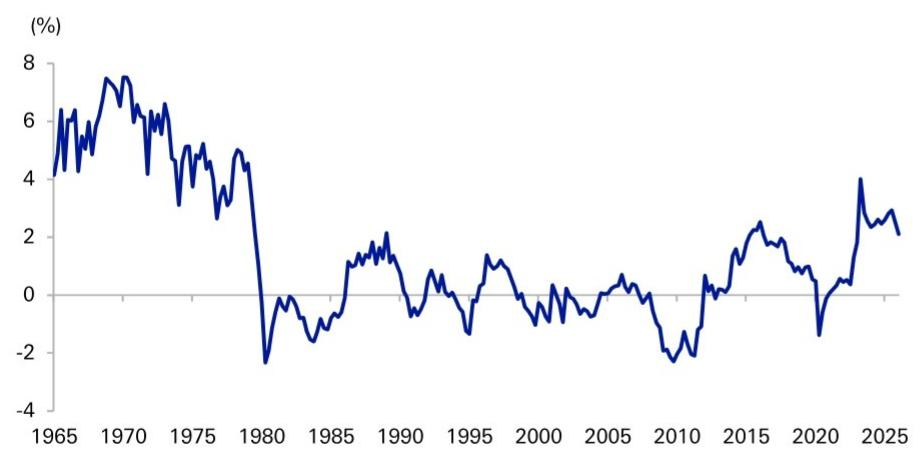

Japan Japan

# Economics Japan Monetary Policy Watch

Date 27 May 2026

# Will history repeat itself? Ueda's speech and the policy outlook

# Introduction: Upward price pressures are comparable to past oil shocks

In his opening remarks at an international conference on May 27, BoJ Governor Ueda analyzed Japan's experience with major oil price shocks over the past 50 years and the corresponding reactions of inflation and monetary policy. The Governor concluded that even for shocks of the same magnitude, the outcome can differ greatly depending on the "initial conditions" of the economy.

This speech is highly insightful for understanding the current state of Japan's economy. Tensions in the Middle East since March have caused a sharp rise in crude oil prices. In response, Japan's Corporate Goods Price Index (CGPI) for April rose by 2.3% MoM, the highest increase since 1980 during the second oil shock, excluding periods of consumption tax hikes (Figure 1). Notably, chemical product prices saw their steepest rise since the first oil shock in 1973, indicating that upstream price pressures are now at levels comparable to past oil shocks.

Kentaro Koyama, Ph.D.

Chief Economist

+81-3-6730-0683

Figure 1: MoM changes in domestic corporate goods price index   

line

| Year | Total (%) |
| ---- | --------- |
| 1970 | 0         |
| 1975 | 7         |
| 1980 | 3         |
| 1985 | 0         |
| 1990 | 0         |
| 1995 | 0         |
| 2000 | 0         |
| 2005 | 0         |
| 2010 | -2        |
| 2015 | 0         |
| 2020 | 0         |
| 2025 | 2         |

line

| Year | Plastic (%) |
| ---- | ----------- |
| 1970 | 0           |
| 1975 | 25          |
| 1980 | 0           |
| 1985 | 0           |
| 1990 | 0           |
| 1995 | 0           |
| 2000 | 0           |
| 2005 | 0           |
| 2010 | 0           |
| 2015 | 0           |
| 2020 | 0           |
| 2025 | 0           |

line

| Year | Chemical (%) |
| ---- | ------------ |
| 1970 | 0            |
| 1975 | 16           |
| 1980 | 3            |
| 1985 | 0            |
| 1990 | 0            |
| 1995 | 0            |
| 2000 | 0            |
| 2005 | 0            |
| 2010 | -5           |
| 2015 | 0            |
| 2020 | -5           |
| 2025 | 5            |

line

Petroleum and coal
| Year | Value (%) |
|---|---|
| 1970 | ~0 |
| 1971 | ~0 |
| 1972 | ~0 |
| 1973 | ~0 |
| 1974 | ~0 |
| 1975 | ~22 |
| 1976 | ~0 |
| 1977 | ~0 |
| 1978 | ~0 |
| 1979 | ~0 |
| 1980 | ~0 |
| 1981 | ~0 |
| 1982 | ~0 |
| 1983 | ~0 |
| 1984 | ~0 |
| 1985 | ~0 |
| 1986 | ~-5 |
| 1987 | ~-5 |
| 1988 | ~-5 |
| 1989 | ~-5 |
| 1990 | ~0 |
| 1991 | ~0 |
| 1992 | ~0 |
| 1993 | ~0 |
| 1994 | ~0 |
| 1995 | ~0 |
| 1996 | ~0 |
| 1997 | ~0 |
| 1998 | ~0 |
| 1999 | ~0 |
| 2000 | ~0 |
| 2001 | ~0 |
| 2002 | ~0 |
| 2003 | ~0 |
| 2004 | ~0 |
| 2005 | ~0 |
| 2006 | ~0 |
| 2007 | ~0 |
| 2008 | ~0 |
| 2009 | ~-20 |
| 2010 | ~0 |
| 2011 | ~0 |
| 2012 | ~0 |
| 2013 | ~0 |
| 2014 | ~0 |
| 2015 | ~0 |
| 2016 | ~0 |
| 2017 | ~0 |
| 2018 | ~0 |
| 2019 | ~0 |
| 2020 | ~-25 |
| 2021 | ~-5 |
| 2022 | ~-5 |
| 2023 | ~-5 |
| 2024 | ~-5 |
| 2025 | ~-5 |

Note: Excluding consumption tax. Source: BoJ, Deutsche Securities

As Governor Ueda pointed out, revisiting past experiences serves as a vital compass for forecasting the BoJ's future monetary policy. By delving deeper into the Governor's speech, we will clarify the differences in initial conditions between the two past oil shocks and the present, and consider the implications for monetary policy.

# Analytical framework: The six "initial conditions" highlighted by Governor Ueda

In his speech, the Governor identified the following six key initial conditions that influence inflation dynamics:

1. Wage dynamics and labor supply/demand   
2. Inflation expectations   
3. Price and wage-setting norms   
4. The exchange rate   
5. Economic momentum (demand-side conditions) pre-shock   
6. The monetary policy stance

In this report, we will focus on "wage dynamics" and the "monetary policy stance," which are particularly important and can be analyzed quantitatively, to conduct a comparative analysis with past episodes.

# Deep dive (1): Will a wage-price spiral occur?

Past experience: Unit labor costs made all the difference Comparing the first oil shock in 1973 and the second in 1980, the pace of import price increases was similar, yet there was a significant difference in the resulting CPI inflation rates (Figure 2).

Figure 2: Inflation rates during the previous oil shocks   

line

| Year | Core-core CPI YoY inflation (LHS) (%) | Import price YoY inflation (RHS) (%) |
|------|----------------------------------------|---------------------------------------|
| 1970 | ~6                                     | ~0                                    |
| 1975 | ~23                                    | ~18                                   |
| 1980 | ~3                                     | ~22                                   |
| 1985 | ~1                                     | ~-12                                  |
| 1990 | ~2                                     | ~3                                    |
| 1995 | ~1                                     | ~0                                    |
| 2000 | ~0                                     | ~0                                    |
| 2005 | ~0                                     | ~5                                    |
| 2010 | ~-1                                    | ~-30                                  |
| 2015 | ~0                                     | ~0                                    |
| 2020 | ~0                                     | ~-20                                  |
| 2025 | ~3                                     | ~5                                    |

Note: Core-core inflation rate excludes consumption tax effects  
Source: Haver Analytics, Deutsche Securities

During the first oil shock in 1973, which triggered a wage-price spiral, Japan's economy was already in a high-pressure state. Amid chronic labor shortages, nominal wages were growing at +15-20% YoY even before the shock (Figure 3). The surge in oil prices further accelerated wage growth to 30% at its peak, leading to a classic spiral.

Figure 3: Wage growth during the previous oil shocks   
  
Source: Haver Analytics, Deutsche Securities

In contrast, during the second oil shock in 1980, when inflation was successfully contained, wage growth was restrained through labor-management coordination, based on the painful lessons from the first shock. Real wages decelerated in response to accelerating inflation, and a spiral was averted.

This difference becomes clearer when looking at Unit Labor Costs (ULC), defined as nominal employee compensation divided by real GDP, which indicates corporate labor cost pressure (Figure 4). The sharp rise in ULC growth during the first shock, versus its limited increase during the second, contributed significantly to price stability.

Figure 4: Unit labor costs (ULC) during the previous oil shocks   

line

| Year | YoY (%) |
|------|---------|
| 1965 | ~12     |
| 1970 | ~16     |
| 1975 | ~31     |
| 1980 | ~6      |
| 1985 | ~2      |
| 1990 | ~4      |
| 1995 | ~2      |
| 2000 | ~-2     |
| 2005 | ~-4     |
| 2010 | ~-6     |
| 2015 | ~2      |
| 2020 | ~8      |
| 2025 | ~3      |

Source: Haver Analytics, Deutsche Securities

Current assessment: Low short-term risk, but next year's wage negotiations are key Current ULC growth is at a higher level than it was just before the second oil shock in 1979. Furthermore, the employment conditions DI in the BoJ Tankan survey is lower than during past oil shocks, indicating that labor shortages are more severe now (Figure 5). Whether the current inflation proves to be temporary or persistent depends on whether this ULC growth accelerates further.

Figure 5: BoJ Tankan: Employment condition DI (all industries)   

line

| Year | Value |
| ---- | ----- |
| 1974 | -25   |
| 1978 | 25    |
| 1982 | 10    |
| 1986 | 10    |
| 1990 | -45   |
| 1994 | 15    |
| 1998 | 25    |
| 2002 | 20    |
| 2006 | -10   |
| 2010 | 25    |
| 2014 | -15   |
| 2018 | -35   |
| 2022 | -5    |
| 2026 | -40   |

Source: BoJ, Deutsche Securities

In this regard, since the crude oil price surge occurred after the 2026 "Shunto" spring wage negotiations were largely concluded for major corporations, a significant reflection of the price hikes in scheduled cash earnings (base salary) will likely be deferred until next year. Moreover, surveys indicate that summer bonus growth will be lower than last year. Thus, the probability of a sharp near-term increase in ULC is low.

In conclusion, the risk of a wage-price spiral in the short term is limited. However, against a backdrop of historic labor shortages, if this year's high inflation translates into strong wage demands in the 2027 Shunto, a scenario of relatively high inflation persisting for a longer period is entirely plausible.

# Deep dive (2): Is the monetary policy stance appropriate?

Past experience: Accommodative policy that fueled inflation vs. tightening that curbed it During the first oil shock, monetary policy was accommodative both before and after the shock. A comparison of the policy rate with a proxy for the nominal neutral rate of interest (using a 4-year moving average of nominal GDP growth) shows that the policy rate was consistently below the neutral rate throughout the 1970s (Figure 6). As the Governor himself mentioned in his speech, "the degree of tightening was clearly inadequate," and monetary policy undeniably contributed to the inflation.

Figure 6: Policy rates during the oil shocks   

line

| Year | Nominal growth (4-year average) | Policy rate |
|------|----------------------------------|-------------|
| 1965 | ~10.5%                           | ~5.5%       |
| 1970 | ~13.5%                           | ~6.0%       |
| 1975 | ~14.0%                           | ~9.0%       |
| 1980 | ~7.0%                            | ~9.0%       |
| 1985 | ~4.5%                            | ~5.0%       |
| 1990 | ~5.5%                            | ~6.0%       |
| 1995 | ~1.0%                            | ~1.0%       |
| 2000 | ~-1.0%                           | ~0.0%       |
| 2005 | ~0.5%                            | ~0.0%       |
| 2010 | ~-2.5%                           | ~0.0%       |
| 2015 | ~2.5%                            | ~0.0%       |
| 2020 | ~-1.5%                           | ~0.0%       |
| 2025 | ~3.0%                            | ~1.0%       |

Source: Haver Analytics, Deutsche Securities

In contrast, after the second oil shock from 1980 onwards, the policy rate was raised above the rate of nominal growth, which is considered to have exerted downward pressure on inflation.

Current assessment: Unprecedented accommodation, risk of delay Measuring the degree of monetary accommodation by the gap between the nominal growth and policy rate, we find that even after the initiation of rate hikes since 2024, the current degree of accommodation is at its highest level since 1980 (Figure 7).

Figure 7: Degree of monetary accommodation (nominal growth rate - policy interest rate)   

line

| Year | Value (%) |
|------|-----------|
| 1965 | 4.5       |
| 1970 | 7.5       |
| 1975 | 3.0       |
| 1980 | -2.5      |
| 1985 | -1.0      |
| 1990 | 2.0       |
| 1995 | -1.5      |
| 2000 | 0.5       |
| 2005 | 0.0       |
| 2010 | -2.0      |
| 2015 | 2.5       |
| 2020 | -1.0      |
| 2025 | 2.0       |

Source: Haver Analytics, Deutsche Securities

In the near future, nominal growth may temporarily slow as deteriorating terms of trade squeeze the economy. However, if this transitions into an "homemade inflation" accompanied by wage growth, nominal growth will likely re-accelerate. In such a scenario, a delay in monetary policy normalization would significantly increase the risk of accelerating inflation.

# Conclusion: Greater vigilance is needed than during the second oil shock

A comprehensive comparison of the initial conditions, as mentioned by Governor Ueda, reveals that the current situation is vastly different from the one preceding the first oil shock (Figure 8). However, the story changes when we compare it to the second oil shock, during which inflation was (relatively) successfully contained.

Figure 8: Assessment of the initial conditions pointed out by Governor Ueda in his speech 

<table><tr><td>Initial Conditions</td><td>Pre-1st Oil Shock (around 1973)</td><td>Pre-2nd Oil Shock (around 1979)</td><td>Present</td></tr><tr><td>Wage dynamics and labor supply/demand</td><td>Wage growth had reached nearly 20% and was already accelerating.</td><td>Wage developments were subdued.</td><td>Wages have started to rise, but not with the same momentum as in the 1970s. The labor market is tighter than in the 1970s.</td></tr><tr><td>Inflation expectations</td><td>Not mentioned, but likely already high.</td><td>Subdued due to the lessons from the 1st Oil Shock.</td><td>Has shifted upward from near zero to the 1.5-2% range, but it is uncertain if this is firmly anchored.</td></tr><tr><td>Price and wage-setting norms</td><td>An inflationary norm had been established.</td><td>A cautious view on inflation was entrenched due to the experience of the 1st Oil Shock.</td><td>The long-standing deflationary norm has begun to change, but it is uncertain if a new norm is in place.</td></tr><tr><td>Exchange rate</td><td>A slightly depreciating trend.</td><td>The yen had appreciated significantly.</td><td>A slightly depreciating trend.</td></tr><tr><td>Economic momentum</td><td>The economy was overheating, with inflation already approaching 10%.</td><td>Inflation was stable at around 3%.</td><td>The output gap is positive, and the inflation rate is around 2%, excluding institutional factors.</td></tr><tr><td>Monetary policy stance</td><td>Was highly accommodative.</td><td>The degree of accommodation was being reduced, but it was still accommodative.</td><td>In the process of policy normalization, but still accommodative.</td></tr></table>

Note: Orange indicates inflationary, yellow indicates moderately inflationary, and blue indicates deflationary. Source: Deutsche Securities

While yen appreciation acted as a buffer against inflation then, a weakening yen is now a headwind. Upward pressure on ULC is also higher than at that time. Furthermore, the monetary policy stance is accommodative, similar to that period. Taking these factors into account, we can assess that Japan's current economy is in a more inflationary (pro-inflationary) environment than it was during the second oil shock.

The Governor cited "prompt monetary policy response" as a key factor in the success of the second episode. Reflecting on the current situation, we believe the BoJ is now required to act with similar timeliness, carefully assessing the data but without missing the opportune moment.

# Appendix 1

# Important Disclosures

\*Other information available upon request

\*Prices are current as of the end of the previous trading session unless otherwise indicated and are sourced from local exchanges via Reuters, Bloomberg and other vendors. Other information is sourced from DB, subject companies, and other sources. For further information regarding disclosures relevant to DB, please visit our global disclosure look-up page on our website at https://research.db.com/Research/Disclosures/FICCDisclosures. Aside from within this report, important risk and conflict disclosures can also be found at https://research.db.com/Research/Disclosures/Disclaimer. Investors are strongly encouraged to review this information before investing.

# Analyst Certification

The views expressed in this report accurately reflect the personal views of the undersigned lead analyst(s). In addition, the undersigned lead analyst(s) has not and will not receive any compensation for providing a specific recommendation or view in this report. Kentaro Koyama.

# Additional Information

The information and opinions in this report were prepared by DB AG or one of its affiliates (collectively 'DB'). Though the information herein is believed to be reliable and has been obtained from public sources believed to be reliable, DB makes no representation as to its accuracy or completeness. Hyperlinks to third-party websites in this report are provided for reader convenience only. DB neither endorses the content nor is responsible for the accuracy or security controls of those websites.

If you use the services of DB in connection with a purchase or sale of a security that is discussed in this report, or is included or discussed in another communication (oral or written) from a DB analyst, DB may act as principal for its own account or as agent for another person.

DB may consider this report in deciding to trade as principal. It may also engage in transactions, for its own account or with customers, in a manner inconsistent with the views taken in this research report. Others within DB, including strategists, sales staff and other analysts, may take views that are inconsistent with those taken in this research report. DB issues a variety of research products, including fundamental analysis, equity-linked analysis, quantitative analysis and trade ideas. Recommendations contained in one type of communication may differ from recommendations contained in others, whether as a result of differing time horizons, methodologies, perspectives or otherwise. DB and/or its affiliates may also be holding debt or equity securities of the issuers it writes on. Analysts are paid in part based on the profitability of DB AG and its affiliates, which includes investment banking, trading and principal trading revenues.

Opinions, estimates and projections constitute the current judgment of the author as of the date of this report. They do not necessarily reflect the opinions of DB and are subject to change without notice. DB provides liquidity for buyers and sellers of securities issued by the companies it covers. DB analysts sometimes have shorter-term trade ideas that may be inconsistent with DB's existing longer-term ratings. Some trade ideas for equities are listed as Catalyst Calls on the Research Website (https://research.db.com/Research/), and can be found on the general coverage list and also on the covered company's page. A Catalyst Call represents a high-conviction belief by an analyst that a stock will outperform or underperform the market and/or a specified sector over a time frame of no less than two weeks and no more than three months. In addition to Catalyst Calls, analysts may occasionally discuss with our clients, and with DB salespersons and traders, trading strategies or ideas that reference catalysts or events that may have a near-term or medium-term impact on the market price of the securities discussed in this report, which impact may be directionally counter to the analysts' current 12-month view of total return or investment return as described herein. DB has no obligation to update, modify or amend this report or to otherwise notify a recipient thereof if an opinion, forecast or estimate changes or becomes inaccurate. Coverage and the frequency of changes in market conditions and in both general and company-specific economic prospects make it difficult to update research at defined intervals. Updates are at the sole discretion of the coverage analyst or of the Research Department Management, and the majority of reports are published at irregular intervals. This report is provided for informational purposes only and does not take into account the particular investment objectives, financial situations, or needs of individual clients. It is not an offer or a solicitation of an offer to buy or sell any financial instruments or to participate in any particular trading strategy. Target prices are inherently imprecise and a product of the analyst's judgment. The financial instruments discussed in this report may not be suitable for all investors, and investors must make their own informed investment decisions. Prices and availability of financial instruments are subject to change without notice, and investment transactions can lead to losses as a result of price fluctuations and other factors. If a financial instrument is denominated in a currency other than an investor's currency, a change in exchange rates may adversely affect the investment. Past performance is not necessarily indicative of future results. Performance calculations exclude transaction costs, unless otherwise indicated. Unless otherwise indicated, prices are current as of the end of the previous trading session and are sourced from local exchanges via Reuters, Bloomberg and other vendors. Data is also sourced from DB, subject companies, and other parties. Artificial intelligence tools may be used in the preparation of this material, including but not limited to assist in fact-finding, data analysis, pattern recognition, content drafting and editorial corrections pertaining to research material.

The DB Department is independent of other business divisions of the Bank. Details regarding our organizational arrangements and information barriers we have to prevent and avoid conflicts of interest with respect to our research are available on our website (https://research.db.com/Research/) under Disclaimer.

Macroeconomic fluctuations often account for most of the risks associated with exposures to instruments that promise to pay fixed or variable interest rates. For an investor who is long fixed-rate instruments (thus receiving these cash flows), increases in interest rates naturally lift the discount factors applied to the expected cash flows and thus cause a loss. The longer the maturity of a certain cash flow and the higher the move in the discount factor, the higher will be the loss. Upside surprises in inflation, fiscal funding needs, and FX depreciation rates are among the most common adverse macroeconomic shocks to receivers. But counterparty exposure, issuer creditworthiness, client segmentation, regulation (including changes in assets holding limits for different types of investors), changes in tax policies, currency convertibility (which may constrain currency conversion, repatriation of profits and/or liquidation of positions), and settlement issues related to local clearing houses are also important risk factors. The sensitivity of fixed-income instruments to macroeconomic shocks may be mitigated by indexing the contracted cash flows to inflation, to FX depreciation, or to specified interest rates - these are common in emerging markets. The index fixings may - by construction - lag or mis-measure the actual move in the underlying variables they are intended to track. The choice of the proper fixing (or metric) is particularly important in swaps markets, where floating coupon rates (i.e., coupons indexed to a typically short-dated interest rate reference index) are exchanged for fixed coupons. Funding in a currency that differs from the currency in which coupons are denominated carries FX risk. Options on swaps (swaptions) the risks typical to options in addition to the risks related to rates movements.

Derivative transactions involve numerous risks including market, counterparty default and illiquidity risk. The appropriateness of these products for use by investors depends on the investors' own circumstances, including their tax position, their regulatory environment and the nature of their other assets and liabilities; as such, investors should take expert legal and financial advice before entering into any transaction similar to or inspired by the contents of this publication. The risk of loss in futures trading and options, foreign or domestic, can be substantial. As a result of the high degree of leverage obtainable in futures and options trading, losses may be incurred that are greater than the amount of funds initially deposited - up to theoretically unlimited losses. Trading in options involves risk and is not suitable for all investors. Prior to buying or selling an option, investors must review the 'Characteristics and Risks of Standardized Options', at https://www.theocc.com/company-information/documents-and-archives/options-disclosure-document. If you are unable to access the website, please contact your DB representative for a copy of this important document.

Participants in foreign exchange transactions may incur risks arising from several factors, including the following: (i) exchange rates can be volatile and are subject to large fluctuations; (ii) the value of currencies may be affected by numerous market factors, including world and national economic, political and regulatory events, events in equity and debt markets and changes in interest rates; and (iii) currencies may be subject to devaluation or government-imposed exchange controls, which could affect the value of the currency. Investors in securities such as ADRs, whose values are affected by the currency of an underlying security, effectively assume currency risk.

Unless governing law provides otherwise, all transactions should be executed through the DB entity in the investor's home jurisdiction. Aside from within this report, important conflict disclosures can also be found at https://research.db.com/Research/ on each company's research page or under the 'Disclosures' tab. Investors are strongly encouraged to review this information before investing.

DB (which includes DB AG, its branches and affiliated companies) is not acting as a financial adviser, consultant or fiduciary to you or any of your agents (collectively, "You" or "Your") with respect to any information provided in this report. DB does not provide investment, legal, tax or accounting advice, DB is not acting as your impartial adviser, and does not express any opinion or recommendation whatsoever as to any strategies, products or any other information presented in the materials. Information contained herein is being provided solely on the basis that the recipient will make an independent assessment of the merits of any investment decision, and it does not constitute a recommendation of, or express an opinion on, any product or service or any trading strategy.

The information presented is general in nature and is not directed to retirement accounts or any specific person or account type, and is therefore provided to You on the express basis that it is not advice, and You may not rely upon it in making Your decision. The information we provide is being directed only to persons we believe to be financially sophisticated, who are capable of evaluating investment risks independently, both in general and with regard to particular transactions and investment strategies, and who understand that DB has financial interests in the offering of its products and services. If this is not the case, or if You are an IRA or other retail investor receiving this directly from us, we ask that you inform us immediately.

In July 2018, DB revised its rating system for short term ideas whereby the branding has been changed to Catalyst Calls ("CC") from SOLAR ideas; the rating categories for Catalyst Calls originated in the Americas region have been made consistent with the categories used by Analysts globally; and the effective time period for CCs has been reduced from a maximum of 180 days to 90 days.

United States: Approved and/or distributed by DB Securities Incorporated, a member of FINRA and SIPC. Analysts located outside of the United States are employed by non-US affiliates and are not registered/qualified as research analysts with FINRA.

European Economic Area (exc. United Kingdom): Approved and/or distributed by DB AG, a joint stock corporation with limited liability incorporated in the Federal Republic of Germany with its principal office in Frankfurt am Main. DB AG is authorized under German Banking Law and is subject to supervision by the European Central Bank and by BaFin, Germany's Federal Financial Supervisory Authority.

United Kingdom: Approved and/or distributed by DB AG acting through its London Branch at 21 Moorfields, London EC2Y 9DB. DB AG in the United Kingdom is authorised by the Prudential Regulation Authority and is subject to limited regulation by the Prudential Regulation Authority and Financial Conduct Authority. Details about the extent of our authorisation and regulation are available on request.

Hong Kong SAR: Distributed by DB AG, Hong Kong Branch, except for any research content relating to futures contracts within the meaning of the Hong Kong Securities and Futures Ordinance Cap. 571. Research reports on such futures contracts are not intended for access by persons who are located, incorporated, constituted or resident in Hong Kong. The author(s) of a research report may not be licensed to carry on regulated activities in Hong Kong, and if not licensed, do not hold themselves out as being able to do so. The provisions set out above in the 'Additional Information' section shall apply to the fullest extent permissible by local laws and regulations, including without limitation the Code of Conduct for Persons Licensed or Registered with the Securities and Futures Commission. This report is intended for distribution only to 'professional investors' as defined in Part 1 of Schedule of the SFO. This document must not be acted or relied on by persons who are not professional investors. Any investment or investment activity to which this document relates is only available to professional investors and will be engaged only with professional investors.

India: Prepared by Deutsche Equities India Private Limited (DEIPL) having CIN: U65990MH2002PTC137431 and registered office at 14th Floor, The Capital, C-70, G Block, Bandra Kurla Complex, Mumbai (India) 400051. Tel: +91 22 7180 4444. It is registered by the Securities and Exchange Board of India (SEBI) as a Stock broker bearing registration no.: INZ000252437; Merchant Banker bearing SEBI Registration no.: INM000010833 and Research Analyst bearing SEBI Registration no.: INH000001741. DEIPL's Compliance / Grievance officer is Ms. Rashmi Poddar (Tel: +91 22 7180 4929 email ID: complaints.deipl@db.com). Registration granted by SEBI and certification from NISM in no way guarantee performance of DEIPL or provide any assurance of returns to investors. Investment in securities market are subject to market risks. Read all the related documents carefully before investing. DEIPL may have received administrative warnings from the SEBI for breaches of Indian regulations. DB and/or its affiliate(s) may have debt holdings or positions in the subject company. With regard to information on associates, please refer to the "Shareholdings" section in the Annual Report at: https://www.db.com/ir/en/annual-reports.htm. For latest India research audit report, refer https://country.db.com/india/deutsche-equities-india/index?language\_id=1.

Japan: Approved and/or distributed by Deutsche Securities Inc.(DSI). Registration number - Registered as a financial instruments dealer by the Head of the Kanto Local Finance Bureau (Kinsho) No. 117. Member of associations: JSDA, Type II Financial Instruments Firms Association and The Financial Futures Association of Japan. Commissions and risks involved in stock transactions - for stock transactions, we charge stock commissions and consumption tax by multiplying the transaction amount by the commission rate agreed with each customer. Stock transactions can lead to losses as a result of share price fluctuations and other factors. Transactions in foreign stocks can lead to additional losses stemming from foreign exchange fluctuations. We may also charge commissions and fees for certain categories of investment advice, products and services. Recommended investment strategies, products and services carry the risk of losses to principal and other losses as a result of changes in market and/or economic trends, and/or fluctuations in market value. Before deciding on the purchase of financial products and/or services, customers should carefully read the relevant disclosures, prospectuses and other documentation. 'Moody's', 'Standard Poor's', and 'Fitch' mentioned in this report are not registered credit rating agencies in Japan unless Japan or 'Nippon' is specifically designated in the name of the entity. Reports on Japanese listed companies not written by analysts of DSI are written by DB Group's analysts with the coverage companies specified by DSI. Some of the foreign securities stated on this report are not disclosed according to the Financial Instruments and Exchange Law of Japan. Target prices set by DB's equity analysts are based on a 12-month forecast period..

Korea: Distributed by Deutsche Securities Korea Co.

South Africa: DB AG Johannesburg is incorporated in the Federal Republic of Germany (Branch Register Number in South Africa: 1998/003298/10).

Singapore: This report is issued by DB AG, Singapore Branch (One Raffles Quay #18-00 South Tower Singapore 048583, 65 6423 8001), which may be contacted in respect of any matters arising from, or in connection with, this report. Where this report is issued or promulgated by DB in Singapore to a person who is not an accredited investor, expert investor or institutional investor (as defined in the applicable Singapore laws and regulations), they accept legal responsibility to such person for its contents.

Taiwan: Information on securities/investments that trade in Taiwan is for your reference only. Readers should independently evaluate investment risks and are solely responsible for their investment decisions. DB may not be distributed to the Taiwan public media or quoted or used by the Taiwan public media without written consent. Information on securities/instruments that do not trade in Taiwan is for informational purposes only and is not to be construed as a recommendation to trade in such securities/instruments.

Qatar: DB AG in the Qatar Financial Centre (registered no. 00032) is regulated by the Qatar Financial Centre Regulatory Authority. DB AG - QFC Branch may undertake only the financial services activities that fall within the scope of its existing QFCRA license. Its principal place of business in the QFC: Qatar Financial Centre, Tower, West Bay, Level 5, PO Box 14928, Doha, Qatar. This information has been distributed by DB AG. Related financial products or services are only available only to Business Customers, as defined by the Qatar Financial Centre Regulatory Authority.

Russia: The information, interpretation and opinions submitted herein are not in the context of, and do not constitute, any appraisal or evaluation activity requiring a license in the Russian Federation.

Kingdom of Saudi Arabia: Deutsche Securities Saudi Arabia (DSSA) is a closed joint stock company authorized by the Capital Market Authority of the Kingdom of Saudi Arabia with a license number (No. 37-07073) to conduct the following business activities: Dealing, Arranging, Advising, and Custody activities. DSSA registered office is Faisaliah Tower, 17th Floor, King Fahad Road - Al Olaya District Riyadh, Kingdom of Saudi Arabia P.O. Box 301806.

United Arab Emirates: DB AG in the Dubai International Financial Centre (registered no. 00045) is regulated by the Dubai Financial Services Authority. DB AG - DIFC Branch may only undertake the financial services activities that fall within the scope of its existing DFSA license. Principal place of business in the DIFC: Dubai International Financial Centre, The Gate Village, Building 5, PO Box 504902, Dubai, U.A.E. This information has been distributed by DB AG. Related financial products or services are available only to Professional Clients, as defined by the Dubai Financial Services Authority.

Australia and New Zealand: This research is intended only for 'wholesale clients' within the meaning of the Australian Corporations Act and New Zealand Financial Advisors Act, respectively. Please refer to Australia-specific research disclosures and related information at https://www.dbresearch.com/PROD/RPS\_EN-PROD/PROD0000000000521304.xhtml. Where research refers to any particular financial product recipients of the research should consider any product disclosure statement, prospectus or other applicable disclosure document before making any decision about whether to acquire the product. In preparing this report, the primary analyst or an individual who assisted in the preparation of this report has likely been in contact with the company that is the subject of this research for confirmation/clarification of data, facts, statements, permission to use company-sourced material in the report, and/or site-visit attendance. Without prior approval from Research Management, analysts may not accept from current or potential Banking clients the costs of travel, accommodations, or other expenses incurred by analysts attending site visits, conferences, social events, and the like. Similarly, without prior approval from Research Management and Anti-Bribery and Corruption ("ABC") team, analysts may not accept perks or other items of value for their personal use from issuers they cover.

Additional information relative to securities, other financial products or issuers discussed in this report is available upon request. This report may not be reproduced, distributed or published without DB's prior written consent.

Backtested, hypothetical or simulated performance results have inherent limitations. Unlike an actual performance record based on trading actual client portfolios, simulated results are achieved by means of the retroactive application of a backtested model itself designed with the benefit of hindsight. Taking into account historical events the backtesting of performance also differs from actual account performance because an actual investment strategy may be adjusted any time, for any reason, including a response to material, economic or market factors. The backtested performance includes hypothetical results that do not reflect the reinvestment of dividends and other earnings or the deduction of advisory fees, brokerage or other commissions, and any other expenses that a client would have paid or actually paid. No representation is made that any trading strategy or account will or is likely to achieve profits or losses similar to those shown. Alternative modeling techniques or assumptions might produce significantly different results and prove to be more appropriate. Past hypothetical backtest results are neither an indicator nor guarantee of future returns. Actual results will vary, perhaps materially, from the analysis.

The method for computing individual E,S,G and composite ESG scores set forth herein is a novel method developed by the Research department within DB AG, computed using a systematic approach without human intervention. Different data providers, market sectors and geographies approach ESG analysis and incorporate the findings in a variety of ways. As such, the ESG scores referred to herein may differ from equivalent ratings developed and implemented by other ESG data providers in the market and may also differ from equivalent ratings developed and implemented by other divisions within the DB Group. Such ESG scores also differ from other ratings and rankings that have historically been applied in research reports published by DB AG. Further, such ESG scores do not represent a formal or official view of DB AG.

It should be noted that the decision to incorporate ESG factors into any investment strategy may inhibit the ability to participate in certain investment opportunities that otherwise would be consistent with your investment objective and other principal investment strategies. The returns on a portfolio consisting primarily of sustainable investments may be lower or higher than portfolios where ESG factors, exclusions, or other sustainability issues are not considered, and the investment opportunities available to such portfolios may differ. Companies may not necessarily meet high performance standards on all aspects of ESG or sustainable investing issues; there is also no guarantee that any company will meet expectations in connection with corporate responsibility, sustainability, and/or impact performance.

Copyright © 2026 DB AG

David Folkerts-Landau   
Group Chief Economist and Global Head of Research 

<table><tr><td>Pam Finelli
Global Chief Operating Officer Research</td><td>Steve Pollard
Global Head of Company Research and Sales</td><td>Jim Reid
Global Head of Macro and Thematic Research</td><td>Tim Rokossa
Head of Germany Research</td></tr><tr><td>Gerry Gallagher
Head of European Company Research</td><td>Matthew Barnard
Head of Americas Company Research</td><td>Peter Milliken
Head of APAC Company Research</td><td>Debbie Jones
Global Head of Sustainability and Data Innovation, Research</td></tr><tr><td>Sameer Goel
Global Head of EM &amp; APAC Research</td><td>Francis Yared
Global Head of Rates Research</td><td>George Saravelos
Global Head of FX Research</td><td>Peter Hooper
Vice-Chair of Research</td></tr></table>

International Production Locations 

<table><tr><td>DB AG</td><td>DB AG</td><td>DB AG</td><td>Deutsche Securities Inc.</td></tr><tr><td>DB Place</td><td>Equity Research</td><td>Filiale Hongkong</td><td>1-3-1 Azabudai</td></tr><tr><td>Level 16</td><td>Mainzer Landstrasse 11-17</td><td>International Commerce</td><td>Azabudai Hills Mori JP Tower</td></tr><tr><td>Corner of Hunter &amp; Phillip</td><td>60329 Frankfurt am Main</td><td>Centre,</td><td>Minato-ku, Tokyo 106-0041</td></tr><tr><td>Streets</td><td>Germany</td><td>1 Austin Road West,Kowloon,</td><td>Japan</td></tr><tr><td>Sydney, NSW 2000</td><td>Tel: (49) 69 910 00</td><td>Hong Kong</td><td>Tel: (81) 3 6730 1000</td></tr><tr><td>Australia</td><td></td><td>Tel: (852) 2203 8888</td><td></td></tr><tr><td>Tel: (61) 2 8258 1234</td><td></td><td></td><td></td></tr><tr><td>DB AG</td><td>DB Securities Inc.</td><td>DB AG</td><td></td></tr><tr><td>21 Moorfields</td><td>The DB Center</td><td>Filiale Singapur</td><td></td></tr><tr><td>London EC2Y 9DB</td><td>1 Columbus Circle</td><td>One Raffles Quay, South</td><td></td></tr><tr><td>United Kingdom</td><td>New York, NY 10019</td><td>Tower,</td><td></td></tr><tr><td>Tel: (44) 20 7545 8000</td><td>Tel: (1) 212 250 2500</td><td>Singapore 048583</td><td></td></tr><tr><td></td><td></td><td>TeL: +65 6423 8001</td><td></td></tr></table>