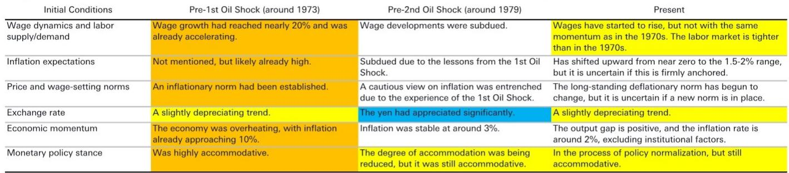

# 日本央行真正担心的不是油价，而是“工资-物价螺旋”的迟到风险

2026年5月27日，日本央行行长植田和男在一次国际会议上的发言，表面是在回顾历史，实则是在为当下货币政策定调。他选择了一个极其独特的分析框架：将本轮油价冲击与1973年第一次石油危机、1979年第二次石油危机进行系统性对比，并重点考察“初始条件”的差异。

这份来自某外资投行的研报，抓住了植田发言中最核心的量化线索：**日本当前的宏观经济环境，比第二次石油危机时更具通胀倾向，而市场对这一点严重定价不足。**

这不是一个关于油价涨跌的短期判断，而是一个关于日本央行政策路径、工资谈判机制与通胀粘性之间结构性关系的深层分析。报告的核心结论是：日本经济正站在一个“类1973年”的岔路口——历史不会简单重复，但押注“通胀很快回落”的风险，可能远高于押注“通胀持续”的风险。

## 1. 上游价格压力已回到石油危机水平，但真正的变量在工资端

研报给出的第一个硬数据就足够警醒：2026年4月，日本国内企业商品价格指数（CGPI）环比上涨2.3%，这是自1980年第二次石油危机以来最大的单月涨幅，且排除了消费税上调的影响。更值得注意的是，化工产品价格创下了1973年第一次石油危机以来的最大涨幅。

但植田和男的分析框架提示我们，只看上游价格是不够的。同样的外部冲击，在不同的“初始条件”下，会导致截然不同的通胀结果。1973年的第一次石油危机之所以引发了工资-物价螺旋，是因为日本经济当时已经处于过热状态，名义工资在冲击前就以15%-20%的速度增长。油价冲击只是火上浇油，将工资增速推至30%的峰值。

而1979年的第二次石油危机之所以相对成功遏制了通胀，是因为日本企业和工会从第一次危机中吸取了教训，通过劳资协调机制抑制了工资增长。关键指标——单位劳动成本（ULC）——在第二次危机中仅温和上升，成为价格稳定的核心缓冲。

**这意味着：当前市场的核心问题不是油价会涨多久，而是日本的工资增长会不会从“补偿性上涨”转变为“自我强化的螺旋”。**

研报给出了一个令人不安的对比：当前日本的ULC增速已经高于1979年第二次石油危机前夕的水平。同时，日银短观调查显示，当前的劳动力短缺程度比两次石油危机时都更为严重。这两个条件叠加，意味着如果工资谈判机制失效，通胀粘性将远超市场预期。

## 2. 2027年春季劳资谈判才是真正的“通胀测验”

研报对短期风险的判断是相对克制的：由于2026年的油价冲击发生在春季劳资谈判（春斗）基本结束之后，主要企业的定期加薪（基本工资）要到明年才能充分反映。同时，夏季奖金调查显示增速将低于去年。因此，短期内ULC急剧上升的概率较低。

但报告紧接着提出了一个关键问题：在历史性的劳动力短缺背景下，如果今年的高通胀转化为2027年春斗中更强的工资诉求，那么“相对较高的通胀持续更长时间”的场景就完全合理。

这本质上是将日本央行的政策考验从“应对输入性通胀”转向“管理预期形成的通胀”。2026年的春斗已经出现了30年未见的加薪幅度，但那是在通胀预期尚未完全形成时的“补偿性”调整。如果2027年春斗出现“前瞻性”的加薪要求——即工人要求提前对冲未来通胀——那么工资-物价螺旋的雏形就会出现。

**研报没有明确说，但逻辑推导出的判断是：2027年春斗的结果，可能比任何一次日银议息会议都更能决定日本未来3-5年的通胀路径。**

## 3. 当前货币宽松程度是1980年以来最高，政策滞后的风险被低估

这是研报最具冲击力的部分。通过比较政策利率与名义GDP增速的4年移动均值（作为名义中性利率的代理变量），报告发现：即使经历了2024年以来的加息，当前日本的货币政策宽松度仍处于1980年以来的最高水平。

具体来看，1973年第一次石油危机时，政策利率持续低于名义增长率，货币宽松直接助推了通胀。而1980年第二次危机后，政策利率被上调至名义增长率之上，成功压制了通胀。当前的情况是：名义增长率约为3%，政策利率仅为1%左右，两者之间的缺口与1973年危机前相当。

**植田和男本人也在演讲中承认，第一次危机时“紧缩程度明显不足”。而当前日本央行面临的挑战是：如何在“过早收紧”和“过度滞后”之间找到平衡。**

研报的立场明确：在名义增长可能因贸易条件恶化而暂时放缓，但随后可能因工资增长驱动的“内生通胀”而重新加速的情况下，政策正常化的延迟将显著增加通胀加速的风险。换句话说，日本央行现在面临的风险不对称——滞后紧缩的代价，可能远大于提前紧缩。

## 4. 报告尚未完全回答的关键问题：日元贬值与通胀的反馈循环

植田和男在演讲中列出了六项“初始条件”，其中“汇率”是一个关键变量。研报指出，1979年第二次石油危机时，日元大幅升值起到了通胀缓冲器的作用；而当前日元处于贬值趋势，成为通胀的额外推手。

但报告没有深入展开的一个问题是：**日元贬值与工资上涨之间是否存在自我强化的反馈循环？** 如果日元继续贬值，进口成本上升推高CPI，进而强化工资诉求，而工资上涨又通过服务业价格传导至核心通胀，那么日本央行可能面临“既要稳汇率、又要控通胀、还要保增长”的三重困境。

此外，报告对“通胀预期是否已牢固锚定”持谨慎态度。植田和男承认，通胀预期已从接近零上升到1.5%-2%的区间，但不确定是否已稳固。这是一个关键的假设性缺口：如果通胀预期只是“暂时上移”而非“结构性改变”，那么日本央行的政策空间将比历史类比所暗示的更大；但如果预期已经开始“自我实现”，那么政策滞后的风险将急剧上升。

## 5. 市场参与者应该关注的三个观察指标

基于研报的分析框架，有三组指标值得持续跟踪：

第一，**单位劳动成本的季度变化**。这是判断工资-物价螺旋是否启动的最直接信号。如果ULC增速在2026年下半年仍然维持高位，甚至加速，那么2027年春斗前的政策窗口将大幅收窄。

第二，**日银短观中的雇佣状况DI与中小企业定价意愿**。劳动力短缺程度的变化，以及中小企业是否能够将成本转嫁给下游，是判断通胀传导机制是否畅通的先行指标。

第三，**日本国债收益率曲线与日元实际有效汇率**。如果市场开始定价日本央行更激进的加息路径，长端利率的上行速度和日元升值幅度，将反过来影响日本央行的决策节奏。这是一个动态博弈的过程。

**这份研报最大的价值，不在于给出了一个确定的预测，而在于提供了一个历史比较框架，帮助读者理解当前日本经济所处的“初始条件”组合是历史上从未出现过的——劳动力市场比1973年更紧，货币政策比1979年更松，而汇率环境比两次危机都更不利。**

日本央行能否在“不引发市场动荡”的前提下，走出一条不同于两次石油危机的第三条路？答案或许要在2027年春天才能揭晓。

---

**欢迎来星球微信群里继续讨论。** 上述分析中，关于“日元贬值与工资上涨的反馈循环”以及“通胀预期锚定性的实证检验”，在完整报告中还有更详细的图表数据和量化模型支撑。如果你对日本央行政策路径的极端情景推演、或者对亚洲其他经济体通胀传导机制的横向比较感兴趣，群里已经有超过200位产业决策者和宏观投资者在持续讨论。我们会在群内分享完整研报原文、核心图表包，以及每周一次的多资产策略讨论纪要。

Personal reading notes and learning share only. Not investment advice.

