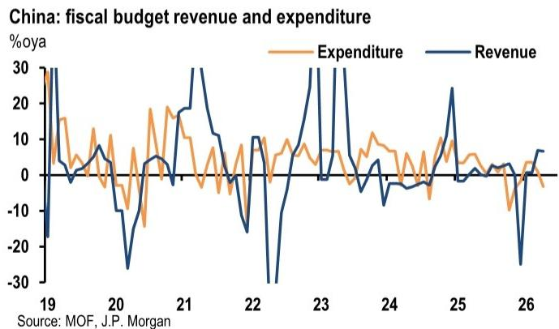
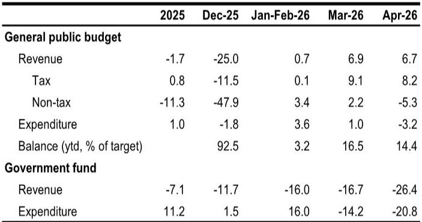
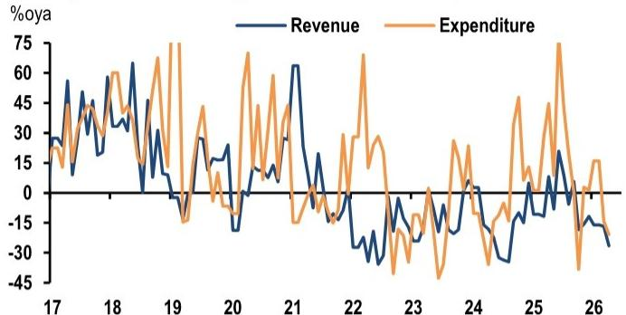

# China’s Fiscal Pullback Is Not A Policy Retreat — It Is A Deliberate Pacing Decision With Second-Half Implications

The April fiscal data from China reveals a pattern that initially appears contradictory: revenue growth remains respectable, yet expenditure has slipped into contraction, and fiscal deposits have surged to multi-year highs. This is not a signal of fiscal paralysis or a loss of policy will. It is a deliberate pacing decision, one that suggests policymakers are comfortable allowing near-term growth to soften in exchange for preserving fiscal ammunition for the second half of the year. The market narrative that fiscal support is fading may be premature—what we are witnessing is a re-timing, not a retreat.

The investment community has been conditioned to read month-to-month fiscal data as a direct read on policy stance. But the April numbers tell a more nuanced story. General budget expenditure fell 3.2% year-on-year, reversing the modest growth seen in the first quarter. Infrastructure outlays collapsed by 18.6% year-on-year. Government-managed fund expenditure declined 20.8%. At the same time, fiscal deposits rose by 739 billion yuan in April alone—two to three times the typical seasonal increase—pushing the stock to 1.2 trillion yuan, the highest in recent years. This is not a government that has run out of money. It is a government that has chosen not to spend it yet.

Why now matters: the first quarter GDP print was stronger than expected, even after accounting for the energy shock. That strength gave policymakers room to pause. But the April pullback in industrial production and domestic demand shifts second-quarter GDP risks to the downside. If the current trajectory holds, the case for additional fiscal support in the second half of the year strengthens materially. The key question for investors is not whether fiscal support will return, but what form it will take and whether it will arrive in time to prevent a sharper-than-expected slowdown.

## The April Fiscal Contraction Is Concentrated in Infrastructure and Land-Dependent Funds, Not a Generalized Austerity

The headline contraction in fiscal expenditure masks a highly uneven distribution. General budget revenue grew 6.7% year-on-year in April, with tax revenue up 8.2%. This is not a revenue crisis. The pullback is almost entirely on the spending side, and within spending, it is concentrated in two areas: infrastructure outlays and government-managed fund expenditure.

Infrastructure outlays within the general budget fell 18.6% year-on-year, reversing the brief improvement to 2.4% in January-February. This mirrors the sharp pullback in fixed asset investment, where infrastructure FAI contracted 4.5% year-on-year in April and public FAI fell 6.3%. The correlation between fiscal spending and FAI is well-established, but the April data shows the relationship tightening: fiscal infrastructure spending and infrastructure FAI are moving in near lockstep, both declining sharply after a brief recovery.

Outside the general budget, the government-managed funds—now the largest financing source among fund accounts—remain heavily dependent on land sales. Fund revenue fell 26.4% year-on-year in April, driven by a 34.8% drop in land sales. Fund expenditure declined 20.8%. This is the structural vulnerability that continues to constrain local government finances. The renewed acceleration in land-sales contraction, from a full-year decline of 14.7% in 2025 to 34.8% in April, underscores that the housing and land downturn is not stabilizing—it is deepening.

The implication is clear: the fiscal contraction is not a policy choice to slow the economy. It is a reflection of the fact that the two main engines of local government spending—infrastructure outlays and land-sale-dependent funds—are both under severe pressure. The central government is choosing to hold back its own spending not because it cannot spend, but because the local government machinery is stuck, and throwing more central money at the problem may not be effective until the local project pipeline and financing channels are repaired.

## The Surge in Fiscal Deposits Reveals a Deliberate Strategy of Policy Patience, Not Complacency

The most telling data point in the April fiscal release is the 739 billion yuan increase in fiscal deposits, pushing the stock to 1.2 trillion yuan. This is two to three times the normal seasonal increase for April. In a typical year, fiscal deposits decline in April as the government accelerates spending after the National People's Congress budget approval. This year, the opposite happened.

This is not an accident. It is a deliberate decision to accumulate fiscal resources rather than deploy them immediately. The report suggests this reflects a degree of policy patience after strong first-quarter GDP growth. But there is a more strategic interpretation: policymakers are choosing to build a fiscal buffer now so that they have the firepower to respond if growth deteriorates in the second half.

The implication for investors is that the feared fade in fiscal impulse in the second half of the year may be less pronounced than initially expected. If fiscal delivery had been front-loaded, the second-half fade would have been sharp. Instead, the first half has been relatively restrained, which means the second half could see a meaningful acceleration. The question is whether that acceleration will come soon enough to offset the April weakness in activity data.

The report notes that central government bond issuance has picked up, particularly special central government bonds for the "two upgrades" and "two majors" programs. But local government bond issuance, especially special local government bonds, slowed sharply in April and May. This is consistent with the idea that the central government is preparing to deploy its own balance sheet while local governments remain constrained. The shift from local to central financing is itself a structural change that investors should watch closely.

## The Investment Pullback Reflects Structural Constraints Beyond Fiscal Policy: Project Pipeline, Debt Repayment, and Policy Bank Rollout

It would be a mistake to attribute the entire April FAI contraction to fiscal policy stance. The report identifies three additional factors that are constraining investment, and these are likely to persist even if fiscal spending accelerates.

First, the pipeline of eligible projects is limited. After years of infrastructure investment, the pool of high-quality, bankable projects has diminished. This is not a new problem, but it has become more acute as the 15th Five-Year Plan begins. While projects are typically front-loaded at the start of a new five-year plan, the April data suggests that many projects are still in the approval and preparation phase rather than the construction phase.

Second, debt repayment has become a higher priority for local governments. The report notes that local governments are prioritizing debt repayment over new spending. This is a rational response to the ongoing pressure on local government financing vehicles and the broader deleveraging campaign. Until local governments have more clarity on debt restructuring and refinancing, they will be reluctant to take on new investment commitments.

Third, the rollout of policy bank tools as seed capital for new projects has been slow. Policy banks are supposed to provide the initial funding for infrastructure projects, but the disbursement has been slower than expected. This is partly because the projects themselves are not ready, and partly because policy banks are being more cautious about credit quality.

The implication is that even if fiscal spending accelerates in the second half, the transmission to real investment may be slower than in previous cycles. The bottlenecks are not just fiscal but also administrative and financial. Investors should not assume that a pickup in bond issuance will automatically translate into a pickup in construction activity. The lag may be longer than historical norms.

## What the Report Does Not Fully Answer: The Interaction Between Fiscal Stimulus and Export Resilience

The report notes that the stronger-than-expected export rebound provides some offset to the domestic demand weakness, but it also warns that the tailwinds appear concentrated. This raises a critical question that the report does not fully answer: how will the export performance affect the timing and composition of fiscal stimulus?

If exports remain strong, the case for aggressive fiscal stimulus weakens. The government may be willing to tolerate slower domestic growth if the external sector is providing a buffer. But if exports weaken—due to trade tensions, global demand slowdown, or supply chain disruptions—then the pressure for fiscal action will increase sharply.

The report also does not address the political economy of fiscal stimulus in an election year. The target range of 4.5-5% GDP growth gives policymakers more flexibility than a single-point target, but it also creates uncertainty about the threshold that would trigger additional support. The report says that if second-quarter growth materially undershoots the target, the case for additional fiscal support strengthens. But what constitutes "materially undershoot"? Is it 4.5%? 4.0%? The ambiguity is itself a policy tool, but it makes it difficult for investors to calibrate their expectations.

Another unresolved question is the role of urban renewal. The report mentions that the commitment to steadily advance urban renewal may provide a mild tailwind to infrastructure and real estate investment. But urban renewal is a multi-year program, and its near-term impact depends on how quickly projects are approved and funded. The report does not provide a timeline or a quantification of the potential boost.

## A Decision Framework for Investors: How to Monitor the Fiscal Pulse in the Coming Months

Given the complexity of the fiscal picture, investors need a clear framework for monitoring whether the second-half acceleration is materializing. The report provides several indicators that can serve as leading signals.

First, watch local government bond issuance, especially special local government bonds. The sharp slowdown in April and May is the most immediate sign that fiscal delivery is not yet accelerating. A sustained pickup in issuance would be the first concrete signal that the policy patience is ending. The report notes that project approvals are accelerating, which should eventually lead to faster bond issuance and deployment of proceeds.

Second, monitor infrastructure FAI for the first signs of recovery. The April contraction was sharp, but the report suggests that infrastructure and public investment could rebound if project approvals accelerate and bond proceeds are deployed more quickly. A stabilization or improvement in infrastructure FAI in May and June would be a positive signal.

Third, track the fiscal deposit stock. If the government is serious about accelerating spending, fiscal deposits should decline from the elevated April level. A continued buildup would suggest that the policy patience is persisting, which would be a negative signal for near-term growth.

Fourth, watch the land sales data. The 34.8% decline in April is severe, but if it stabilizes or improves, it would relieve some of the pressure on local government finances. If it continues to deteriorate, the structural constraint on local spending will persist regardless of central government intentions.

Finally, pay attention to the policy bank rollout. The slow disbursement of policy bank tools is a bottleneck that needs to be resolved for the fiscal stimulus to translate into real investment. Any announcements about accelerated policy bank lending or new seed capital programs would be a positive signal.

The key insight from this framework is that the fiscal impulse is not binary—it is not simply on or off. It is a question of timing, composition, and transmission. The April data suggests that the impulse is currently off, but the conditions for turning it on are being put in place. The question is whether the acceleration will come in time to prevent a sharper slowdown in the second quarter.

## Join the Community to Read the Full Report and Review the Original Charts

The analysis above draws on detailed fiscal data and proprietary research that cannot be fully captured in a single article. The original report includes charts on fiscal expenditure breakdown, government-managed fund revenue and expenditure, fiscal deposit trends, and government bond issuance that provide essential context for understanding the current cycle. To access the full report and the original data visualizations, join the community. The discussion there will continue to track these indicators in real time and explore the second-order implications for asset allocation, sector positioning, and macro strategy.

*This article is for learning and discussion only and does not constitute investment advice.*

Personal reading notes and learning share only. Not investment advice.

