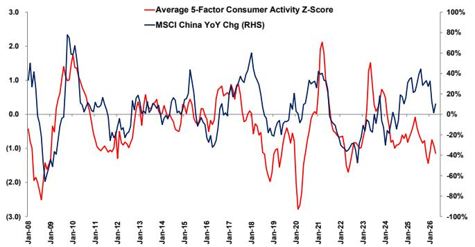

# China's Consumer Slowdown Is Not a Dip—It Is a Structural Repricing of Risk

The narrative that China's consumer weakness is a temporary soft patch, soon to be reversed by policy stimulus or a cyclical recovery, is becoming increasingly difficult to sustain. A global investment bank's latest five-factor consumer activity z-score, which fell further in April, now registers a decline that is historically associated with periods of significant economic stress, not garden-variety moderation. The composite index, which had already been flashing warning signals, deteriorated as catering and commodity retail sales softened, even as air passenger traffic showed marginal improvement and passenger car sales held stable. This divergence between resilient mobility data and weakening consumption of goods and services is the critical signal investors are underestimating.

The headline message from the April data is stark: retail sales year-on-year growth dipped to 0.2 percent, a record low outside of the Covid lockdown periods. This is not a statistical blip. It reflects the compounding effect of a weakening job market, the fading effectiveness of the trade-in subsidy program, and a cooling of the gold rush that had temporarily buoyed discretionary spending. Investors who treat this as a buying opportunity on the assumption that consumption will rebound naturally are likely misreading the nature of the slowdown. The evidence suggests that the consumer sector is undergoing a structural repricing of risk, not a cyclical adjustment.

Why now matters is precisely because the market has not yet fully priced in the implications of this shift. The MSCI China index has shown some resilience, but the correlation between consumer activity and equity performance is breaking down. When the z-score and the index diverge, it is usually the real economy that eventually pulls financial markets toward it. The question is not whether consumption will recover in the third quarter, but whether the current level of consumer activity represents a new equilibrium or a further descent. The evidence points toward the latter.

This article argues that investors must shift from a "buy the dip" mindset to a "price the risk" framework. The consumer slowdown is not a function of temporary sentiment but of structural headwinds—labor market deterioration, subsidy exhaustion, and a shift in household savings behavior—that will require more than a marginal policy tweak to reverse. The sections that follow unpack the five-factor data, identify the hidden fragility beneath the surface, and offer a decision framework for navigating the second half of the year.

## The Five-Factor Composite Is Telling a Story That Individual Data Points Obscure

The five-factor consumer activity z-score is not merely an average of five unrelated metrics. It is a synthetic signal that captures the breadth of consumer behavior across credit, dining, retail, autos, and travel. When the composite drops, it means weakness is broad-based, not concentrated in one sector that could be dismissed as idiosyncratic. In April, four of the five factors either deteriorated or remained stagnant. The only factor showing marginal improvement was air passenger traffic, which is still recovering from a low base and is more reflective of pent-up travel demand than of healthy discretionary spending.

The value of the composite lies in its ability to filter out noise. Individual monthly data points can be volatile due to weather, holidays, or base effects. But the z-score, which standardizes each factor relative to its own history, reveals the underlying trend. That trend has been declining since late 2024, and April accelerated the descent. Investors who focus only on passenger car sales, which held steady, risk missing the broader picture. The automotive sector is being supported by aggressive discounting and trade-in incentives that are not sustainable. Once those incentives fade, the sector will likely converge with the rest of the consumer economy.

The implication is clear: the composite is not a lagging indicator that will catch up to a recovery. It is a leading indicator of corporate earnings pressure. Companies exposed to Chinese consumer discretionary spending will face revenue headwinds that are not yet fully reflected in consensus estimates. The gap between the z-score trajectory and equity valuations is a risk that demands active management.

## The Trade-In Subsidy Program Worked, but Its Expiration Creates a Demand Void

One of the most important insights from the April data is the fading effectiveness of the trade-in subsidy program. This policy, which encouraged consumers to replace older appliances, electronics, and vehicles with new purchases, provided a significant boost to retail sales in late 2024 and early 2025. The program was well-designed and executed, and it succeeded in pulling forward demand. But that is precisely the problem. Pulling forward demand creates a void in the subsequent period, and that void is now becoming visible in the data.

Commodity retail sales, excluding autos, softened notably in April. This is not a coincidence. The trade-in program had been a primary driver of durable goods purchases, and its peak impact has passed. The remaining beneficiaries are concentrated in categories that are less sensitive to subsidy expiration, such as daily necessities and food. But the high-ticket, discretionary items that drive retail sales growth are now facing a demand gap that will not be filled by organic consumption.

The policy implication is uncomfortable. To sustain consumption growth at current levels, the government would need to introduce a new round of subsidies or expand the existing program. But there are limits to how much fiscal space can be allocated to consumption stimulus without crowding out other priorities. Moreover, the effectiveness of a second round would likely be lower, as households have already replaced many of the goods they were willing to upgrade. The marginal propensity to consume from additional subsidies diminishes with each iteration.

For investors, the fading of the trade-in effect means that the second half of 2025 will see a sharper deceleration in retail sales than current consensus expects. Companies that benefited disproportionately from the program will need to adjust their guidance downward. The risk is not limited to consumer-facing firms; it extends to suppliers, logistics providers, and even real estate, as a weaker consumer environment reduces confidence in property purchases.

## The Labor Market Is the Root Cause, and It Is Not Improving

Beneath the surface of the retail sales data lies a more fundamental problem: the labor market. April's retail sales weakness is not a demand problem in isolation; it is a reflection of deteriorating household income expectations. The job market in China has been under pressure for over a year, with youth unemployment remaining elevated and white-collar layoffs spreading beyond the technology sector to financial services, real estate, and manufacturing.

The connection between labor market conditions and consumption is well understood, but the current cycle has a distinctive feature. In previous downturns, consumption was supported by a large pool of household savings accumulated during periods of rapid growth. Those savings buffers are now depleted for a significant portion of the population, particularly younger households who entered the workforce during a period of slower wage growth. The result is that any further deterioration in the labor market will translate more quickly into lower consumption than in past cycles.

The data on household loans provides a useful cross-check. The five-factor composite includes household loan year-on-year change, which remained stable in April. But stability here is not a positive signal. It reflects the fact that households are not taking on new debt, even as existing loans are being repaid. The lack of credit expansion is consistent with a cautious consumer who is deleveraging rather than spending. This is the opposite of what would be expected in a recovery.

Investors should watch the labor market data more closely than retail sales in the coming months. If employment conditions continue to weaken, the consumption slowdown will deepen regardless of what policy measures are introduced. The trade-in program was a Band-Aid, not a cure. The structural issue is income, and income is not recovering.

## What the Report Does Not Fully Answer: The Export Spillover Mechanism

The report notes that limited export spillover is one of the factors constraining consumption. But it does not fully explore the mechanism by which export weakness transmits to domestic consumption. This is a critical analytical gap that investors need to fill on their own.

The conventional view is that exports matter for consumption only to the extent that they drive employment and wages in export-oriented industries. That is true, but it is incomplete. In China, export strength also supports consumption through a second channel: business confidence and capital expenditure. When exporters are doing well, they invest in capacity, hire workers, and generate positive spillovers for service providers, logistics firms, and local governments. When exports slow, the entire ecosystem contracts.

The report's data suggests that export spillover is limited, but it does not quantify how much of the consumption slowdown can be attributed to this channel. This leaves an open question: if the export sector stabilizes or improves, would consumption recover meaningfully, or are the domestic headwinds strong enough to keep it suppressed regardless?

The answer likely depends on the composition of exports. If export growth is driven by high-value-added sectors like electric vehicles and industrial machinery, the spillover to domestic consumption may be weaker than in the past, because these sectors employ fewer workers per unit of output than traditional labor-intensive industries. The structural shift in China's export mix means that even a recovery in export volumes may not translate into a proportional recovery in household income and consumption. This is a nuance that the report hints at but does not resolve, and it is one of the most important uncertainties for the second half of 2025.

## A Decision Framework for the Second Half: Three Scenarios and Their Portfolio Implications

Investors need a framework to translate the consumer data into actionable portfolio decisions. Based on the evidence in the report and the structural dynamics identified above, three scenarios are plausible for the remainder of 2025.

Scenario one is the base case: consumption continues to decelerate gradually, with retail sales growth settling in a range of 0 to 2 percent year-on-year for the next two to three quarters. In this scenario, the trade-in effect fades completely, the labor market does not improve materially, and no major new stimulus is introduced. The portfolio implication is to underweight consumer discretionary sectors and focus on defensives, particularly companies with pricing power or exposure to non-discretionary spending. This scenario has the highest probability based on current data.

Scenario two is the downside case: consumption decelerates sharply, with retail sales turning negative in some months. This would require a negative shock, such as a further deterioration in the labor market, a property market relapse, or a geopolitical event that disrupts trade. In this scenario, the MSCI China index would likely correct significantly, and the only safe havens would be cash and government bonds. This scenario has a lower probability but a high impact, and it should not be ignored.

Scenario three is the upside case: consumption stabilizes and begins to recover, driven by a new round of fiscal stimulus, an improvement in the labor market, or an export rebound. In this scenario, the current weakness would prove to be a buying opportunity, and consumer discretionary stocks would outperform. However, the probability of this scenario is low given the structural headwinds identified in the report. The fading of the trade-in effect and the limited export spillover suggest that a self-sustaining recovery is unlikely without significant policy intervention.

The framework is not meant to predict which scenario will materialize, but to force investors to assign probabilities and position accordingly. The key insight from the report is that the base case is already bearish, and the risks are tilted to the downside. The prudent strategy is to reduce exposure to consumer-sensitive sectors and wait for clearer evidence of a policy response or a change in the underlying data.

## The Analytical Questions That Remain Open Demand a Deeper Dive

The report provides a rigorous data-driven assessment of where Chinese consumption stands today. But it leaves several questions unanswered that are essential for investment decision-making. How much of the consumption weakness is cyclical versus structural? What would it take for the five-factor z-score to stabilize and reverse? And which sectors within the consumer economy are most vulnerable to the fading of the trade-in program?

These are not questions that can be answered by a single data release. They require a framework that integrates macro data, micro evidence from company earnings calls, and an understanding of policy dynamics. The report provides the macro foundation, but the full picture requires a synthesis of multiple sources of information.

For serious investors who want to go beyond the headlines and build a robust position for the second half of 2025, the original charts and detailed breakdowns in the full report are indispensable. They reveal the month-by-month trajectory of each factor, the correlation with equity performance, and the historical context that makes the current slowdown stand out.

Join the community to read the full report and review the original charts. The data is clear, but the interpretation requires discussion. The most important insights will emerge not from reading the report alone, but from debating its implications with a network of informed peers.

*This article is for learning and discussion only and does not constitute investment advice.*

Personal reading notes and learning share only. Not investment advice.

