# Economic Insights

Global Markets Research

29 May 2026

Economics - North America

# US: Skewed vision – evaluating trimmed-mean inflation

- Fed Chair Kevin Warsh described core PCE inflation, the Fed's long-time preferred inflation metric, as a "rough swag" and proposed alternative inflation measures including trimmed-mean inflation.   
- PCE trimmed-mean inflation tends to be slow in detecting a change in the inflation trend, while underlying inflation trend measures indicate the risk of a new upward trend emerging recently.   
- We remain skeptical about the usefulness of PCE trimmed-mean inflation, whose method of removing outliers might not be optimal due to the recent shift in skewness of the cross-sectional inflation distribution. Trimmed-mean inflation might underestimate underlying inflation by about 48bp on a y-o-y basis.   
- A primary factor making PCE trimmed-mean inflation negatively biased is its failure to capture changes in goods price inflation dynamics in the post-pandemic era.

# What is PCE trimmed-mean inflation?

Monthly inflation data are noisy, and idiosyncratic moves by a few components can have an outsized effect. Policymakers aim to look through temporary noise and gauge the underlying trend of inflation. One of the simplest metrics that diminishes such noise is core PCE inflation, which excludes volatile energy and food prices. Most FOMC participants put a heavy weight on PCE core inflation as a gauge of the underlying trend.

Fed Chair Kevin Warsh has criticized PCE core inflation, describing it as a “rough swag” at his confirmation hearing. Instead, he proposed alternative inflation measures, including PCE trimmed-mean inflation and private sector price measures.

Fig. 1: The 12-month change in PCE trimmed-mean stands at $2.35\%$ in April, 94bp lower than $3.29\%$ for core PCE inflation   
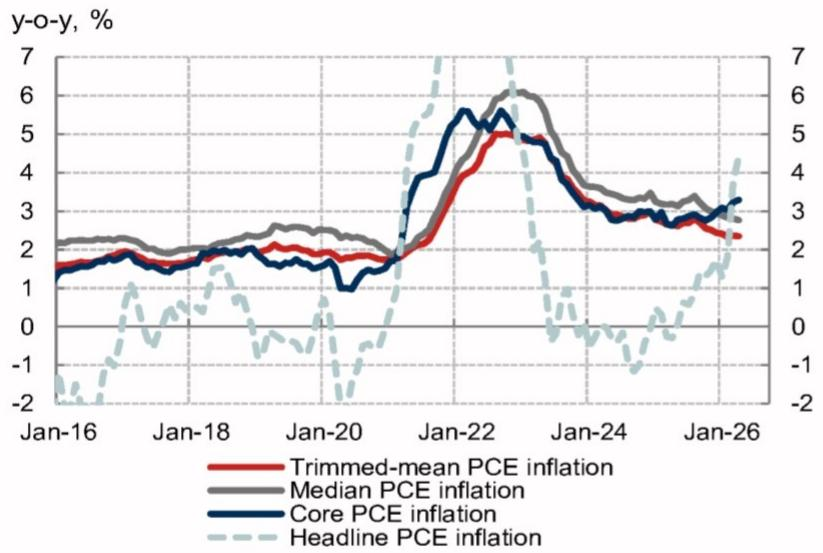

line

| Date    | Trimmed-mean PCE inflation | Median PCE inflation | Core PCE inflation | Headline PCE inflation |
|---------|----------------------------|----------------------|--------------------|------------------------|
| Jan-16  | ~1.5                       | ~2.0                 | ~1.5               | ~-2.0                  |
| Jan-18  | ~1.8                       | ~2.2                 | ~1.8               | ~-1.0                  |
| Jan-20  | ~1.7                       | ~2.3                 | ~1.7               | ~-0.5                  |
| Jan-22  | ~4.5                       | ~6.0                 | ~5.5               | ~6.5                   |
| Jan-24  | ~3.0                       | ~4.0                 | ~3.5               | ~-1.0                  |
| Jan-26  | ~2.5                       | ~3.0                 | ~3.0               | ~-0.5                  |

Source: BEA, Dallas Fed, Cleveland Fed, Haver, NOM

PCE trimmed-mean inflation is constructed from the cross-sectional distribution of monthly price changes and is designed to remove components with large monthly swings in either direction. Currently, the metric – published by the Dallas Fed – trims 24% from the lower tail and 31% from the upper tail of the distribution. The 12-month change in PCE trimmed-mean stood at 2.35% in April, 94bp lower than 3.29% for core PCE inflation (Fig. 1).

# Research Analysts

# North America Economics

Aichi Amemiya - NSI

aichi.amemiya@NOM.com

+1 212 667 9347

Ruchir Sharma - NSI

ruchir.sharma@NOM.com

+1 212 667 9186

Jeremy Schwartz - NSI

jeremy.schwartz@NOM.com

+1 212 667 9637

Jacklyn Goloborodsky - NSI

jacklyn.goloborodsky@NOM.com

+1 212 298 4739

# Global Economics

David Seif - NSI

david.seif@NOM.com

+1 212 667 9180

# Tracking "true inflation"

A key factor in evaluating the value of trimmed-mean inflation is whether it accurately captures “true inflation,” or underlying inflation. In order to assess whether PCE trimmed-mean inflation captures changes in the inflation trend in a timely manner, we calculate four “true” inflation trend series using ex-post data;

• A centered 36-month moving average of annualized monthly headline PCE inflation   
• A band-pass filtered annualized monthly headline PCE inflation   
- The average of annualized monthly PCE inflation for the contemporaneous and following 24 months   
- A centered 12-month moving average of a centered 24-month moving average of annualized headline PCE inflation

Among these four “true” inflation measures, a Dallas Fed economist used the first three to choose the optimal cutoffs when formulating PCE trimmed-mean inflation. Note that the optimal trimming proportions (24% of the lower tail and 31% of the upper tail) were determined to minimize the gap between PCE trimmed-mean inflation and the average of those true inflation measures over the period of January 1977 to June 2009. The last “true” inflation measure was a benchmark Cleveland Fed economists used to assess the usefulness of not-seasonally adjusted Median CPI inflation.

# Evaluating trimmed-mean's performance

# PCE trimmed-mean failed to detect the post-pandemic inflation surge

PCE trimmed-mean inflation is designed to look through idiosyncratic noise and avoid sending false positive signals about the underlying inflation trend. Thus, PCE trimmed-mean inflation is often better than core PCE inflation in the sense of fewer false signals of new inflation trends. However, that same feature can make it less responsive when a new inflation regime is emerging, especially if the initial shock is concentrated in a narrow set of components, leading to a change in skewness of the inflation distribution.

This limitation was evident during the post-pandemic inflation surge. At the onset of post-pandemic inflation acceleration, annualized monthly PCE trimmed-mean inflation lagged these four true inflation measures (Fig. 2). On the other hand, annualized monthly core PCE inflation started accelerating at almost the same time as the true measures, except for the average of future 24-month inflation (Fig. 3).

Fig. 2: PCE trimmed-mean inflation lagged four "true" inflation measures in 2021-2022   

line

| Year | Band-pass filtered headline PCE inflation | Centered 36-month moving average of headline PCE inflation | Forward 24-month moving average of headline PCE inflation | Centered 12-month moving average of centered 24-month moving average of headline PCE inflation | PCE trimmed-mean inflation, m-o-m, annualized |
|------|------------------------------------------|---------------------------------------------------------------|---------------------------------------------------------------| ----------------------------------------------------------------------------------|---------------------------------------------|
| 2000 | ~2.8%                                    | ~2.0%                                                         | ~1.8%                                                         | ~2.0%                                                                            | ~3.0                                        |
| 2002 | ~1.5%                                    | ~1.8%                                                         | ~1.7%                                                         | ~1.9%                                                                            | ~2.5                                        |
| 2004 | ~2.8%                                    | ~2.5%                                                         | ~3.0%                                                         | ~2.8%                                                                            | ~3.5                                        |
| 2006 | ~3.0%                                    | ~2.8%                                                         | ~2.5%                                                         | ~2.7%                                                                            | ~3.0                                        |
| 2008 | ~1.0%                                    | ~1.5%                                                         | ~0.5%                                                         | ~1.5%                                                                            | ~1.0                                        |
| 2010 | ~1.5%                                    | ~1.8%                                                         | ~1.5%                                                         | ~1.8%                                                                            | ~1.5                                        |
| 2012 | ~2.5%                                    | ~2.0%                                                         | ~1.8%                                                         | ~2.0%                                                                            | ~2.5                                        |
| 2014 | ~1.0%                                    | ~1.2%                                                         | ~0.8%                                                         | ~1.0%                                                                            | ~1.5                                        |
| 2016 | ~0.5%                                    | ~0.8%                                                         | ~0.5%                                                         | ~0.8%                                                                            | ~1.0                                        |
| 2018 | ~2.0%                                    | ~1.8%                                                         | ~1.5%                                                         | ~1.8%                                                                            | ~2.5                                        |
| 2020 | ~1.5%                                    | ~1.8%                                                         | ~3.0%                                                         | ~2.5%                                                                            | ~3.5                                        |
| 2022 | ~6.5%                                    | ~5.0%                                                         | ~6.0%                                                         | ~5.5%                                                                            | ~7.0                                        |
| 2024 | ~2.0%                                    | ~3.0%                                                         | ~3.5%                                                         | ~3.0%                                                                            | ~5.5                                        |
| 2026 | ~4.5%                                    | ~4.0%                                                         | ~3.0%                                                         | ~3.5%                                                                            | ~3.0                                        |

Source: BEA, Haver, NOM

Fig. 3: Core PCE inflation has tracked four "true" inflation measures better than PCE trimmed-mean inflation in recent years   
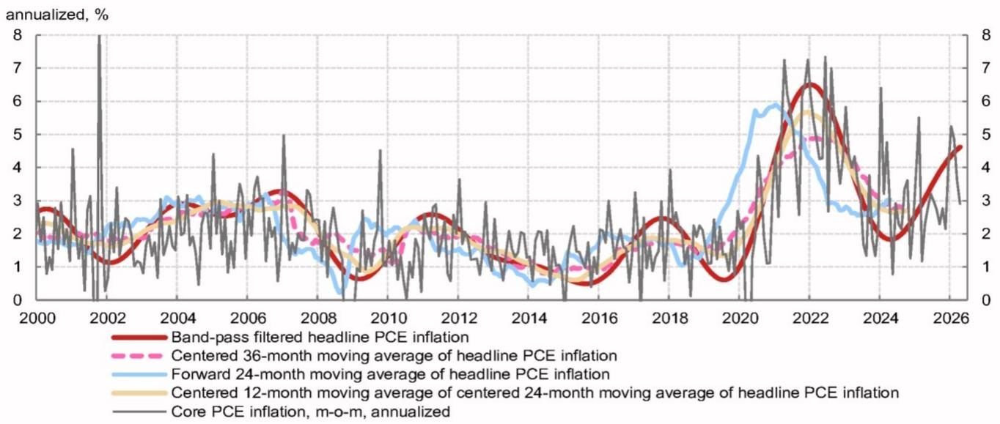

line

| Year | Band-pass filtered headline PCE inflation | Centered 36-month moving average of headline PCE inflation | Forward 24-month moving average of headline PCE inflation | Centered 12-month moving average of centered 24-month moving average of headline PCE inflation | Core PCE inflation, m-o-m, annualized |
|------|------------------------------------------|---------------------------------------------------------------|---------------------------------------------------------------| ---------------------------------------------------------------------------------------------|-------------------------------------|
| 2000 | ~2.8%                                    | ~2.0                                                          | ~1.8                                                          | ~2.2                                                                                         | ~1.0                                |
| 2002 | ~1.5%                                    | ~2.5                                                          | ~2.0                                                          | ~2.5                                                                                         | ~8.0                                |
| 2004 | ~2.8%                                    | ~2.5                                                          | ~3.0                                                          | ~2.8                                                                                         | ~3.0                                |
| 2006 | ~3.0%                                    | ~2.8                                                          | ~3.0                                                          | ~3.0                                                                                         | ~3.5                                |
| 2008 | ~1.5%                                    | ~1.8                                                          | ~1.5                                                          | ~1.5                                                                                         | ~4.5                                |
| 2010 | ~2.5%                                    | ~2.0                                                          | ~2.0                                                          | ~2.0                                                                                         | ~3.5                                |
| 2012 | ~2.8%                                    | ~2.0                                                          | ~1.5                                                          | ~1.5                                                                                         | ~3.0                                |
| 2014 | ~1.5%                                    | ~1.0                                                          | ~0.5                                                          | ~1.0                                                                                         | ~2.0                                |
| 2016 | ~1.0%                                    | ~1.5                                                          | ~1.0                                                          | ~1.5                                                                                         | ~3.0                                |
| 2018 | ~2.5%                                    | ~1.5                                                          | ~1.5                                                          | ~1.5                                                                                         | ~4.0                                |
| 2020 | ~1.5%                                    | ~2.5                                                          | ~4.0                                                          | ~3.0                                                                                         | ~7.0                                |
| 2022 | ~6.5%                                    | ~5.0                                                          | ~6.0                                                          | ~5.5                                                                                         | ~7.5                                |
| 2024 | ~2.0%                                    | ~3.0                                                          | ~3.0                                                          | ~3.0                                                                                         | ~6.5                                |
| 2026 | ~4.5%                                    | ~4.5                                                          | ~3.0                                                          | ~3.0                                                                                         | ~5.0                                |

Source: BEA, Haver, NOM

A similar dynamic appears to have played out in the opposite direction during the post-GFC disinflation. PCE trimmed-mean inflation was slow to respond to the emerging downshift in underlying inflation, while core PCE inflation began to decelerate earlier.

The components excluded from PCE trimmed-mean may offer a better early signal around inflation turning points. A closer look at the distribution of cross-sectional monthly price changes suggests the weighted average of components trimmed from both tails began to react to the pandemic-induced inflation wave as early as Q1 2021, much earlier than PCE trimmed-mean inflation did (Fig. 4). The same dynamic was visible in the opposite direction during the post-GFC disinflation, when components removed from the lower tail dropped sharply, while PCE trimmed-mean inflation remained steady for some time.

Fig. 4: Components removed from PCE trimmed-mean inflation reacted quickly to the post-pandemic acceleration

Weighted average of the upper and lower tails removed from PCE trimmed-mean inflation vs. PCE trimmed-mean inflation

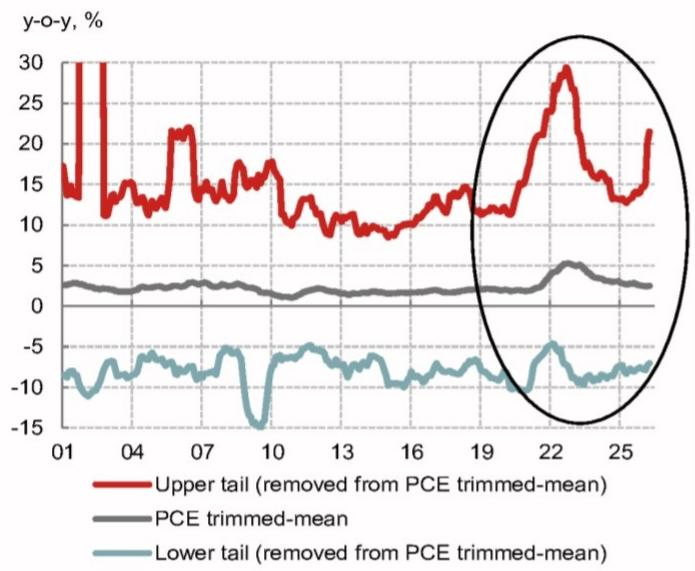

line

| Year | Upper tail (removed from PCE trimmed-mean) | PCE trimmed-mean | Lower tail (removed from PCE trimmed-mean) |
|------|---------------------------------------------|------------------|---------------------------------------------|
| 01   | ~15                                         | ~3               | ~-10                                        |
| 04   | ~12                                         | ~3               | ~-8                                         |
| 07   | ~22                                         | ~3               | ~-6                                         |
| 10   | ~10                                         | ~2               | ~-15                                        |
| 13   | ~10                                         | ~2               | ~-6                                         |
| 16   | ~12                                         | ~2               | ~-8                                         |
| 19   | ~12                                         | ~2               | ~-8                                         |
| 22   | ~30                                         | ~5               | ~-5                                         |
| 25   | ~22                                         | ~3               | ~-8                                         |

Source: BEA, Haver, NOM

Fig. 5: Manufacturers seem to be passing higher costs on to their customers

Business surveys' prices received indices and core goods inflation

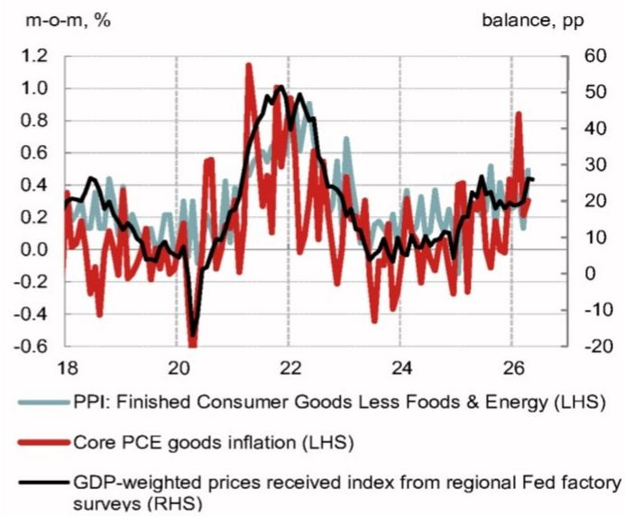

line

| Year | PPI: Finished Consumer Goods Less Foods & Energy (LHS) | Core PCE goods inflation (LHS) | GDP-weighted prices received index from regional Fed factory surveys (RHS) |
|------|--------------------------------------------------------|-------------------------------|------------------------------------------------------------------|
| 18   | ~0.3                                                   | ~0.3                          | ~20                                                              |
| 19   | ~0.4                                                   | ~0.4                          | ~15                                                              |
| 20   | ~0.2                                                   | ~-0.6                         | ~-15                                                             |
| 21   | ~0.6                                                   | ~1.2                          | ~50                                                              |
| 22   | ~0.9                                                   | ~1.0                          | ~45                                                              |
| 23   | ~0.7                                                   | ~0.3                          | ~10                                                              |
| 24   | ~0.4                                                   | ~-0.4                         | ~5                                                               |
| 25   | ~0.5                                                   | ~0.4                          | ~15                                                              |
| 26   | ~0.3                                                   | ~0.8                          | ~25                                                              |

Source: BLS, BEA, NY Fed, Philly Fed, Dallas Fed, KC Fed, Haver, NOM

Recent data show a similar reason for caution. The upper tail of the distribution has picked up, driven by higher tariffs and energy prices, and remains significantly above the pre-pandemic average (2000-2019). In addition, the lower tail also appears to be rising slightly. Given the post-pandemic experience, as well as recent signs of pass-through of higher costs into consumer goods prices (which is evident in the recent firming of business surveys' prices received indices) (Fig. 5), the recent deceleration in PCE trimmed-mean inflation is unlikely to make policymakers comfortable.

# A shift in skewness caused trimmed mean to understate underlying inflation

Another issue with PCE trimmed-mean inflation is that it appears to underestimate underlying inflation. Since the last update of trimming specifications by the Dallas Fed in 2009, the distribution of the cross-sectional monthly price changes has shifted, which has likely made the current trimming proportions suboptimal. The distribution of cross-sectional price changes over the past ten years looks to have shifted up (Fig. 6).

Fig. 6: The distribution of cross-sectional price changes appears to have shifted up in recent years   
Distribution of cross-sectional annualized price changes   
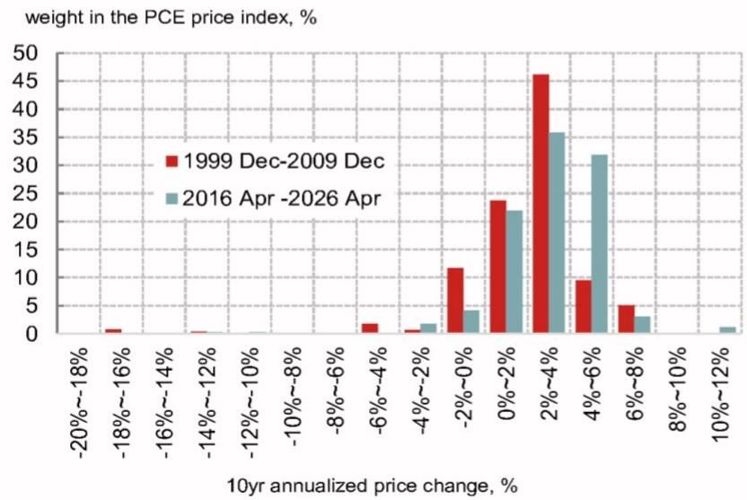

bar

weight in the PCE price index, % 
| 10yr annualized price change, % | 1999 Dec-2009 Dec | 2016 Apr -2026 Apr |
|---|---|---|
| -20%~-18% | 0 | 0 |
| -18%~-16% | 1 | 0 |
| -16%~-14% | 0 | 0 |
| -14%~-12% | 0 | 0 |
| -12%~-10% | 0 | 0 |
| -10%~-8% | 0 | 0 |
| -8%~-6% | 0 | 0 |
| -6%~-4% | 2 | 0 |
| -4%~-2% | 1 | 2 |
| -2%~0% | 12 | 4 |
| 0%~2% | 23 | 22 |
| 2%~4% | 46 | 36 |
| 4%~6% | 9 | 32 |
| 6%~8% | 5 | 3 |
| 8%~10% | 0 | 0 |
| 10%~12% | 0 | 1 |

Source: BEA, Haver, NOM

Using monthly price changes of 178 subcomponents of the PCE price index with their corresponding weights, we calculate two typical skewness measures: the Bowley and Kelly coefficients, which focus on middle $50\%$ and middle $80\%$ of the data, respectively. We take the one-sided 12-month moving average of skewness scores for the monthly price change distribution (Fig. 7). Both measures should fall between -1.0 and +1.0 with a negative (positive) reading, indicating a negatively (positively) skewed distribution.

Fig. 7: Since the last methodological update in 2009, the distribution of cross-sectional price changes has become positively skewed more often   
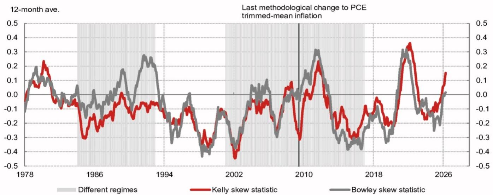

line

| Year | Different regimes | Kelly skew statistic | Bowley skew statistic |
|------|-------------------|----------------------|-----------------------|
| 1978 | ~0.0              | ~0.0                 | ~0.0                  |
| 1986 | ~-0.1             | ~-0.3                | ~-0.1                 |
| 1994 | ~0.0              | ~-0.2                | ~-0.3                 |
| 2002 | ~-0.4             | ~-0.4                | ~-0.4                 |
| 2010 | ~0.1              | ~0.1                 | ~0.1                  |
| 2018 | ~-0.3             | ~-0.2                | ~-0.3                 |
| 2026 | ~0.0              | ~0.1                 | ~0.0                  |

Note: \*Regimes refer to the period between structural breaks that we have identified.   
Source: BEA, Haver, NOM

If the distribution became more positively skewed, PCE trimmed-mean inflation would ignore the upper tail of the distribution excessively and understate the underlying inflaton. Conversely, in the case of a more negatively skewed distribution, PCE trimmed-mean inflation would overstate the inflation trend.

Since the last methodological update to PCE trimmed-mean inflation in 2009, the price change distribution has become positively skewed more often (Fig. 7).

We found four statistically significant structural breaks in distribution skewness (Bowley and Kelly indices) since 1977 (based on the Bai-Perron test) clustering around 1984, 1993, 2001-02, and 2017-19. Notably, these breaks closely coincide with structural breaks in goods inflation, suggesting that shifts in goods price dynamics are likely the primary driver of changes in distribution symmetry (Fig. 8).

Fig. 8: We identified four structural breaks in distribution skewness, which closely coincide with structural breaks in goods inflation, suggesting that shifts in goods price dynamics are likely the primary driver of changes in distribution symmetry   
Skewness of the cross-sectional price change distribution vs. PCE goods price inflation   

line

| Year | Average of Bowley and Kelly skew statistics (LHS) | PCE goods inflation (RHS) |
|------|--------------------------------------------------|---------------------------|
| 1978 | -0.1                                             | 1.0                       |
| 1986 | -0.2                                             | -0.1                      |
| 1994 | -0.3                                             | -0.2                      |
| 2002 | -0.4                                             | -0.3                      |
| 2010 | -0.5                                             | -4.0                      |
| 2018 | -0.3                                             | -2.0                      |
| 2026 | 0.1                                              | 1.0                       |

Note: \*Regimes refer to the period between structural breaks that we have identified. Source: BEA, Haver, NOM

The trimmed-mean measure understates (overstates) the true inflation when the price distribution is positively (negatively) skewed, which means that the negative bias narrowed during the goods deflation period (following China's entry in WTO) and widened when goods inflation is elevated (post-the trade war/pandemic). Overall, the distribution has exhibited positive skewness more frequently since 2010 (especially post-pandemic). This means the upper-tail trim, which was calibrated on 1977-2009 data, is too large, causing PCE trimmed-mean inflation understate the underlying inflation trend.

# PCE trimmed-mean inflation appears to understate underlying inflation by 48bp

We attempt to quantify how much PCE trimmed-mean inflation is downwardly biased. We first calculate the monthly gap between annualized PCE trimmed-mean inflation and headline PCE inflation. We then take a 36-month centered moving average of the gap to estimate a "bias" after adjusting for outliers (Fig. 9). Following the approach laid out in Cleveland Fed note, we estimate how much the bias was caused by the skewness (measured by the average of Bowley and Kelly coefficients of skewness).

Fig. 9: Gaps between headline PCE inflation and alternative inflation measures   
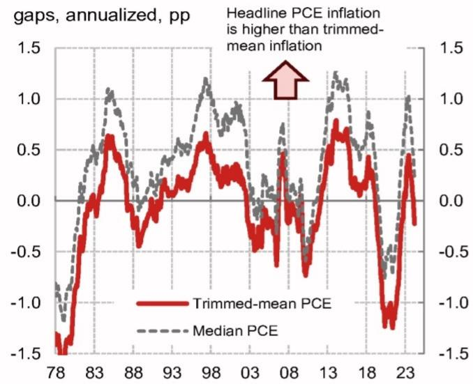

line

| Year | Trimmed-mean PCE | Median PCE |
|------|------------------|------------|
| 78   | -1.5             | -1.0       |
| 83   | 0.6              | 1.0        |
| 88   | -0.4             | 0.0        |
| 93   | 0.2              | 0.5        |
| 98   | 0.7              | 1.2        |
| 03   | -0.3             | 0.0        |
| 08   | -0.8             | -0.5       |
| 13   | 0.8              | 1.2        |
| 18   | -1.2             | -0.5       |
| 23   | -0.5             | 1.0        |

Note: 36-month centered moving averages of the monthly annualized inflation gap from actual headline PCE inflation to estimate an “bias” after adjusting for outliers.
Source: BEA, Haver, NOM   
PCE trimmed-mean inflation: official vs. bias-adjusted

Fig. 10: PCE trimmed-mean inflation appears to understate the underlying inflation trend

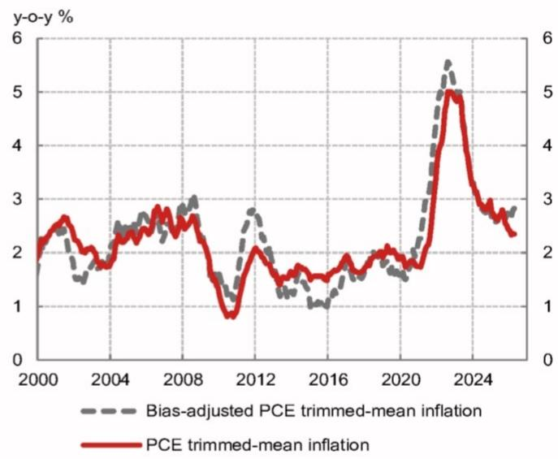

line

| Year | Bias-adjusted PCE trimmed-mean inflation | PCE trimmed-mean inflation |
|------|------------------------------------------|-----------------------------|
| 2000 | ~1.8                                     | ~2.2                        |
| 2004 | ~2.5                                     | ~2.7                        |
| 2008 | ~3.0                                     | ~2.8                        |
| 2012 | ~1.5                                     | ~1.8                        |
| 2016 | ~1.0                                     | ~1.5                        |
| 2020 | ~1.8                                     | ~2.0                        |
| 2024 | ~5.5                                     | ~5.0                        |

Source: BEA, Dallas Fed, Haver, NOM

We find that PCE trimmed-mean inflation is currently lower than the bias-adjusted trimmed-mean inflation by about 48bp on a y-o-y basis (Fig. 10). This result indicates that the bias-adjusted trimmed-mean rate of inflation stands at $2.8\%$ , narrowing the gap with core PCE inflation of $3.3\%$ as of April 2026. Note that PCE trimmed-mean inflation and its bias-adjusted version moved in the different directions in recent months.

# Changing goods price dynamics could complicate the picture

Goods prices are a key driver of the recent shift in the skewness of the inflation distribution. The two measures of skewness are correlated with core goods price inflation, which suggests that more frequent positive goods prices inflation prints appear to have played a key role behind the rightward shift in the cross-sectional distribution of monthly price changes. Core goods price inflation, which used to be a persistent deflationary force, has consistently pushed inflation higher in the post-COVID era (Fig. 11).

Fig. 11: Core goods price inflation might no longer be a reliable source of disinflation

Decomposition of core PCE inflation

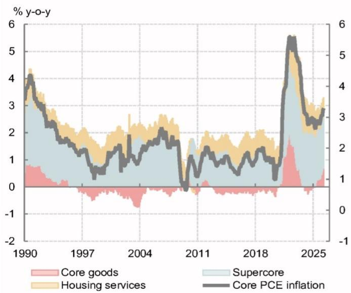

line

| Year | Core goods | Housing services | Supercore | Core PCE inflation |
|------|------------|------------------|-----------|--------------------|
| 1990 | 0.8        | 3.5              | 2.5       | 4.0                |
| 1997 | -0.5       | 1.5              | 1.0       | 1.5                |
| 2004 | -0.8       | 2.0              | 1.5       | 2.0                |
| 2011 | -0.2       | 1.0              | 0.5       | 1.0                |
| 2018 | -0.3       | 1.5              | 1.0       | 1.5                |
| 2024 | 1.5        | 5.0              | 4.0       | 6.0                |
| 2025 | 0.5        | 3.0              | 2.5       | 3.0                |

Source: BEA, Haver, NOM

# AI investment boom likely to keep core goods price inflation positive

Core goods inflation will probably remain positive in the coming years, which warrants a revamp of PCE trimmed-mean inflation. In particular, the ongoing AI investment boom and resulting upward pressures on key electronic components such as semiconductors could keep boosting core goods prices.

In the 2010s, PCE core goods price inflation was almost persistently negative, led by lower prices of consumer electronics, such as computers, televisions, vehicles, and household appliances. These components are subject to quality adjustments by the BLS/BEA, which means that adding more advanced functions to those products are treated as price declines, all else equal. A large part of core goods deflation in the 2010s came from commodities which are adjusted for quality changes (Fig. 12).

Note that goods excluding clothing and footwear which are subject to quality adjustments account for less than $20\%$ of total PCE core goods components. However, many of these tech-heavy products now face upward price pressures due to global shortages of semiconductors, as well as supply-chain disruptions induced by the Iran war (Fig. 13). The emerging upward pressures seem to outweigh the persistent negative impact from quality adjustment. If the AI investment boom continues and keeps certain key components for electronics in short supply, core goods price inflation would remain positive for an extended period.

Fig. 12: PCE core goods price inflation was historically weighed down by components subject to quality adjustment   
Decomposition of PCE core goods price inflation   
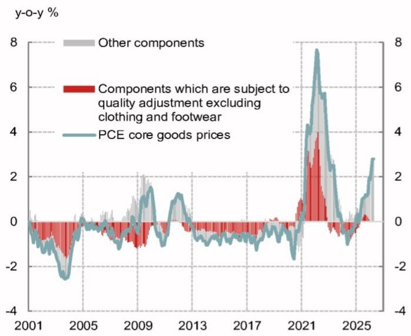

line

| Year | Other components | Components which are subject to quality adjustment excluding clothing and footwear | PCE core goods prices |
|------|------------------|----------------------------------------------------------------------------------|------------------------|
| 2001 | ~0.5%            | ~0.0%                                                                            | ~-1.0%                 |
| 2005 | ~0.0%            | ~-1.0%                                                                           | ~-3.0%                 |
| 2009 | ~1.5%            | ~-1.5%                                                                           | ~1.0%                  |
| 2013 | ~0.5%            | ~-0.5%                                                                           | ~-1.0%                 |
| 2017 | ~0.0%            | ~-0.5%                                                                           | ~-1.5%                 |
| 2021 | ~4.0%            | ~4.0%                                                                            | ~8.0%                  |
| 2025 | ~2.5%            | ~2.5%                                                                            | ~3.0%                  |

Source: BEA, Haver, NOM

Fig. 13: Higher semiconductor prices pose an upside risk to PCE core goods prices   
Contribution of electronics and related goods to core PCE inflation vs. PPI's semiconductor prices   
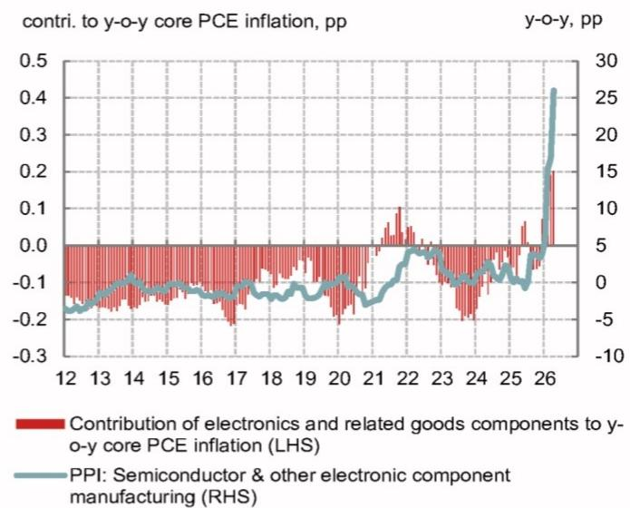

line

| Year | Contribution of electronics and related goods components to y-o-y core PCE inflation (LHS) | PPI: Semiconductor & other electronic component manufacturing (RHS) |
|------|----------------------------------------------------------------------------------|-----------------------------------------------------------------|
| 12   | -0.2                                                                             | -5                                                              |
| 13   | -0.1                                                                             | -4                                                              |
| 14   | 0.0                                                                              | -3                                                              |
| 15   | 0.0                                                                              | -2                                                              |
| 16   | 0.0                                                                              | -1                                                              |
| 17   | 0.0                                                                              | 0                                                               |
| 18   | 0.0                                                                              | 1                                                               |
| 19   | 0.0                                                                              | 2                                                               |
| 20   | 0.0                                                                              | 3                                                               |
| 21   | 0.0                                                                              | 4                                                               |
| 22   | 0.1                                                                              | 5                                                               |
| 23   | 0.0                                                                              | 6                                                               |
| 24   | -0.1                                                                             | 7                                                               |
| 25   | 0.0                                                                              | 8                                                               |
| 26   | 0.4                                                                              | 25                                                              |

Source: BEA, BLS, NOM

# Changes in businesses' pricing strategy also indicate structural changes in goods price dynamics

Since the pandemic, business practices on pricing appear to have changed. According to a Richmond Fed survey, the share of manufacturers changing prices at least once per year is higher than in the pre-pandemic era while the share of firms changing their prices less frequently decreased (Fig. 14). In addition, goods prices might have become more susceptible to changes in inventories. Even after the post-pandemic inflation acceleration subsided, the inventory-to-sales ratio and PCE core goods price inflation showed a negative correlation between 2024-2025 (lower inventory-to-sales leads to more frequent price increases) (Fig. 15). Conventional wisdom is that core goods prices are determined by global prices and are less responsive to changes in domestic demand-supply balance. However, this might be changing and goods price inflation has become more cyclical.

Fig. 14: Manufacturers change prices more frequently now than in the pre-pandemic era   
Share of manufacturers by frequency of price changes   
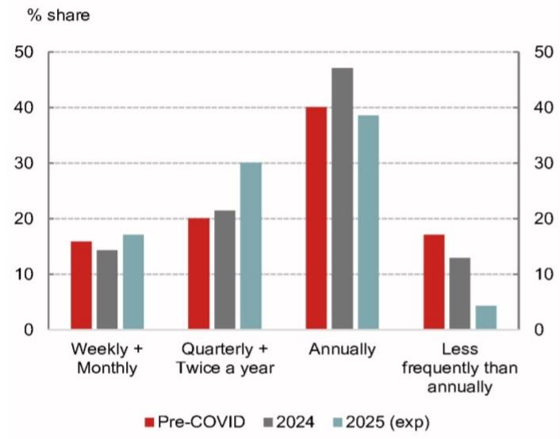

bar

| Frequency | Pre-COVID (%) | 2024 (%) | 2025 (exp) (%) |
|---|---|---|---|
| Weekly + Monthly | 16 | 14.5 | 17.5 |
| Quarterly + Twice a year | 20.5 | 21.5 | 30.5 |
| Annually | 40.5 | 47.5 | 38.5 |
| Less frequently than annually | 17.5 | 13.0 | 4.5 |

Source: Richmond Fed, NOM

Fig. 15: PCE core goods prices and inventory-sales ratio are more negatively correlated   
PCE core goods inflation vs US business inventory-to-sales ratio   
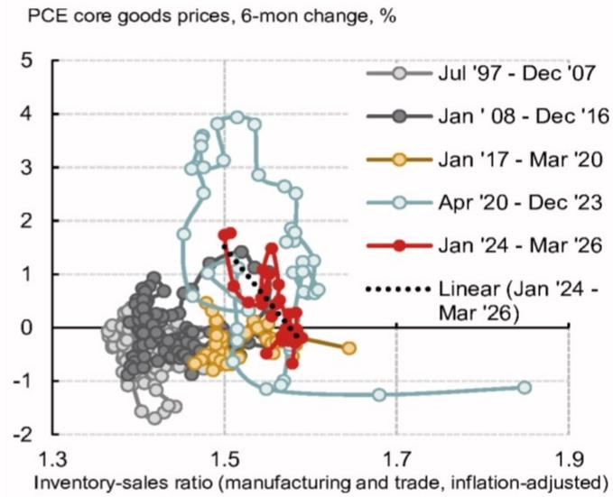

scatter

| Inventory-sales ratio | PCE core goods prices, 6-mon change, % |
| --------------------- | -------------------------------------- |
| 1.3                   | -2                                     |
| 1.5                   | 4                                      |
| 1.7                   | -1                                     |
| 1.9                   | -1                                     |

Source: BEA, Census Bureau, Haver, NOM

# Policy implications

Dovish policymakers including former Fed Chair Powell tend to see recent inflation acceleration led by higher goods prices as temporary and maintain their sanguine inflation outlook in the medium term. However, persistently positive inflation of core goods prices and a resulting shift in the skewness of cross-sectional inflation distribution undermine the usefulness of certain alternative inflation measures such as PCE trimmed-mean inflation. Monetary policy driven by suboptimal inflation metrics might increase the risk of falling “behind the curve,” leading to more aggressive rage hikes later.

# Appendix A-1

This report has been produced by NOM Securities International, Inc.(NSI), US.

See Disclaimers for NOM Group entity details.

# Analyst Certification

We, Aichi Amemiya, Ruchir Sharma, Jeremy Schwartz, Jacklyn Goloborodsky and David Seif, hereby certify (1) that the views expressed in this Research report accurately reflect our personal views about any or all of the subject securities or issuers referred to in this Research report, (2) no part of our compensation was, is or will be directly or indirectly related to the specific recommendations or views expressed in this Research report and (3) no part of our compensation is tied to any specific investment banking transactions performed by NOM Securities International, Inc., NOM International plc or any other NOM Group company.

# Important Disclosures

# Online availability of research and conflict-of-interest disclosures

NOM Group research is available on www.NOMnow.com/research, Bloomberg, Capital IQ, Factset, LSEG.

Important disclosures may be read at http://go.NOMnow.com/research/m/Disclosures or requested from NOM Securities International, Inc. If you have any difficulties with the website, please email grpsupport@NOM.com for help.

The analysts responsible for preparing this report have received compensation based upon various factors including the firm's total revenues, a portion of which is generated by Investment Banking activities. Unless otherwise noted, the non-US analysts listed at the front of this report are not registered/qualified as research analysts under FINRA rules, may not be associated persons of NSI, and may not be subject to FINRA Rule 2241 restrictions on communications with covered companies, public appearances, and trading securities held by a research analyst account.

NOM Global Financial Products Inc. (NGFP) NOM Derivative Products Inc. (NDP) and NOM International plc. (NIplc) are registered with the Commodities Futures Trading Commission and the National Futures Association (NFA) as swap dealers. NGFP, NDPI, and NIplc are generally engaged in the trading of swaps and other derivative products, any of which may be the subject of this report.

# Disclaimers

This publication contains material that has been prepared by the NOM Group entity identified on page 1 and, if applicable, with the contributions of one or more NOM Group entities whose employees and their respective affiliations are specified on page 1 or identified elsewhere in this publication. The term "NOM Group" used herein refers to NOM Holdings, Inc. and its affiliates and subsidiaries including: (a) NOM Securities Co., Ltd. ('NSC') Tokyo, Japan, (b) NOM Financial Products Europe GmbH ('NFPE'), Germany, (c) NOM International plc ('NIplc'), UK, (d) NOM Securities International, Inc. ('NSI'), New York, US, (e) NOM International (Hong Kong) Ltd. ('NIHK'), Hong Kong, (f) NOM Financial Investment (Korea) Co., Ltd. ('NFIK'), Korea (Information on NOM analysts registered with the Korea Financial Investment Association ('KOFIA') can be found on the KOFIA Intranet at http://dis.kofia.or.kr, (g) NOM Singapore Ltd. ('NSL'), Singapore (Registration number 197201440E, regulated by the Monetary Authority of Singapore) (h) NOM Australia Ltd. ('NAL'), Australia (ABN 48 003 032 513), regulated by the Australian Securities and Investment Commission ('ASIC') and holder of an Australian financial services licence number 246412, (i) NOM Securities Malaysia Sdn. Bhd. ('NSM'), Malaysia, (j) NIHK, Taipei Branch ('NITB'), Taiwan, (k) NOM Financial Advisory and Securities (India) Private Limited ('NFASL'), Mumbai, India (Registered Address: Ceejay House, Level 11, Plot F, Shivsagar Estate, Dr. Annie Besant Road, Worli, Mumbai- 400 018, India; Tel: 91 22 4037 4037, Fax: 91 22 4037 4111; CIN No: U74140MH2007PTC169116, SEBI Registration No. for Stock Broking activities : INZ000255633; SEBI Registration No. for Merchant Banking : INM000011419; SEBI Registration No. for Research: INH000001014 - Compliance Officer: Ms. Pratiksha Tondwalkar, 91 22 40374904, grievance email: investorgrievancesra@NOM.com Webpage: LINK

For reports with respect to Indian public companies or authored by India-based NFASL research analysts: (i) Investment in securities markets is subject to market risks. Read all the related documents carefully before investing. (ii) Registration granted by SEBI, and certification from NISM in no way guarantee performance of the intermediary or provide any assurance of returns to investors. (iii) NFASL terms and conditions for availing research services is disclosed on NFASL webpage.

(I) NOM Fiduciary Research & Consulting Co., Ltd. ('NFRC') Tokyo, Japan. (m) NOM Orient International Securities Co., Ltd ("NOI"), is a majority owned joint venture amongst NOM Group, Orient International (Holding) Co., Ltd, and Shanghai Huangpu Investment Holding (Group) Co., Ltd. In accordance with the laws of the People's Republic of China ("PRC", excluding Hong Kong, Macau and Taiwan, for the purpose of this document), NOI is licensed in the PRC to provide securities research and investment recommendations and it operates independently from the other members of the NOM Group; in particular, NOI's interests in PRC securities are not disclosed to, or aggregated with the holdings of, any other NOM Group entities and the interests in PRC securities of other NOM Group entities are not disclosed to, or aggregated with the holdings of, NOI. An individual name printed next to NOI on the front page of a research report indicates that individual is employed by NOI to provide research assistance to NIHK under a research partnership agreement. 'NSFSPL' next to an employee's name on the front page of a research report indicates that the individual is employed by NOM Structured Finance Services Private Limited to provide assistance to certain NOM entities under inter-company agreements. 'Verdhana' next to an individual's name on the front page of a research report indicates that the individual is employed by PT Verdhana Sekuritas Indonesia ('Verdhana') to provide research assistance to NIHK under a research partnership agreement and neither Verdhana nor such individual is licensed outside of Indonesia.

THIS MATERIAL IS: (I) FOR YOUR PRIVATE INFORMATION, AND WE ARE NOT SOLICITING ANY ACTION BASED UPON IT; (II) NOT TO BE CONSTRUED AS AN OFFER TO SELL OR A SOLICITATION OF AN OFFER TO BUY ANY SECURITIES IN ANY JURISDICTION WHERE SUCH OFFER OR SOLICITATION WOULD BE ILLEGAL; AND (III) OTHER THAN DISCLOSURES RELATING TO THE NOM GROUP, BASED UPON INFORMATION FROM SOURCES THAT WE CONSIDER RELIABLE, BUT HAS NOT BEEN INDEPENDENTLY VERIFIED BY NOM GROUP.

Other than disclosures relating to the NOM Group, the NOM Group does not warrant, represent or undertake, express or implied, that the document is fair, accurate, complete, correct, reliable or fit for any particular purpose or merchantable, and to the maximum extent permissible by law and/or regulation, does not accept liability (in negligence or otherwise, and in whole or in part) for any act (or decision not to act) resulting from use of this document and related data. To the maximum extent permissible by law and/or regulation, all warranties and other assurances by the NOM Group are hereby excluded and the NOM Group shall have no liability (in negligence or otherwise, and in whole or in part) for any loss howsoever arising from the use, misuse, or distribution of this material or the information contained in this material or otherwise arising in connection therewith.

Opinions or estimates expressed are current opinions as of the original publication date appearing on this material and the information, including the opinions and estimates contained herein, are subject to change without notice. The NOM Group, however, expressly disclaims any obligation, and therefore is under no duty, to update or revise this document. Any comments or statements made herein are those of the author(s) and may differ from views held by other parties within NOM Group. Clients should consider whether any advice or recommendation in this report is suitable for their particular circumstances and, if appropriate, seek professional advice, including tax advice. The NOM Group does not provide tax advice.

The NOM Group, and/or its officers, directors, employees and affiliates, may, to the extent permitted by applicable law and/or regulation, deal as principal, agent, or otherwise, or have long or short positions in, or buy or sell, the securities, commodities or instruments, or options or other derivative instruments based thereon, of issuers or securities mentioned herein. The NOM Group companies may also act as market maker or liquidity provider (within the meaning of applicable regulations in the UK) in the financial instruments of the issuer. Where the activity of market maker is carried out in accordance with the definition given to it by specific laws and regulations of the US or other jurisdictions, this will be separately disclosed within the specific issuer disclosures.

This document may contain information obtained from third parties, including, but not limited to, ratings from credit ratings agencies such as Standard & Poor's. The NOM Group hereby expressly disclaims all representations, warranties or undertakings of originality, fairness, accuracy, completeness, correctness, merchantability or fitness for a particular purpose with respect to any of the information obtained from third parties contained in this material or otherwise arising in connection therewith, and shall not be liable (in negligence or otherwise, and in whole or in part) for any direct, indirect, incidental, exemplary, compensatory, punitive, special or consequential damages, costs, expenses, legal fees, or losses (including lost income or profits and opportunity costs) in connection with any use or misuse of any of the information obtained from third parties contained in this material or otherwise arising in connection therewith. Reproduction and distribution of third-party content in any form is prohibited except with the prior written permission of the related third-party. Third-party content providers do not, express or implied, guarantee the fairness, accuracy, completeness, correctness, timeliness or availability of any information, including ratings, and are not in any way responsible for any errors or omissions (negligent or otherwise), regardless of the cause, or for the results obtained from the use or misuse of such content. Third-party content providers give no express or implied warranties, including, but not limited to, any warranties of merchantability or fitness for a particular purpose or use. Third-party content providers shall not be liable (in negligence or otherwise, and in whole or in part) for any direct, indirect, incidental, exemplary, compensatory, punitive, special or consequential damages, costs, expenses, legal fees, or losses (including lost income or profits and opportunity costs) in connection with any use or misuse of their content, including ratings. Credit ratings are statements of opinions and are not statements of fact or recommendations to purchase hold or sell securities. They do not address the suitability of securities or the suitability of securities for investment purposes, and should not be relied on as investment advice. Any MSCI sourced information in this document is the exclusive property of MSCI Inc. ('MSCI'). Without prior written permission of MSCI, this information and any other MSCI intellectual property may not be duplicated, reproduced, re-disseminated, redistributed or used, in whole or in part, for any purpose whatsoever, including creating any financial products and any indices. This information is provided on an "as is" basis. The user assumes the entire risk of any use made of this information. MSCI, its affiliates and any third party involved in, or related to, computing or compiling the information hereby expressly disclaim all representations, warranties or undertakings of originality, fairness, accuracy,

completeness, correctness, merchantability or fitness for a particular purpose with respect to any of this material or the information contained in this material or otherwise arising in connection therewith. Without limiting any of the foregoing, in no event shall MSCI, any of its affiliates or any third party involved in, or related to, computing or compiling the information have any liability (in negligence or otherwise, and in whole or in part) for any damages of any kind. MSCI and the MSCI indexes are services marks of MSCI and its affiliates.

The intellectual property rights and any other rights, in Russell/NOM Japan Equity Index belong to NOM Fiduciary Research & Consulting Co., Ltd. ("NFRC") and FTSE Russell ("Russell"). NFRC and Russell do not guarantee fairness, accuracy, completeness, correctness, reliability, usefulness, marketability, merchantability or fitness of the Index, and do not account for business activities or services that any index user and/or its affiliates undertakes with the use of the Index.

Investors should consider this document as only a single factor in making their investment decision and, as such, the report should not be viewed as identifying or suggesting all risks, direct or indirect, that may be associated with any investment decision. NOM Group produces a number of different types of research product including, among others, fundamental analysis and quantitative analysis; recommendations contained in one type of research product may differ from recommendations contained in other types of research product, whether as a result of differing time horizons, methodologies or otherwise. The NOM Group publishes research product in a number of different ways including the posting of product on the NOM Group portals and/or distribution directly to clients. Different groups of clients may receive different products and services from the research department depending on their individual requirements.

Figures presented herein may refer to past performance or simulations based on past performance which are not reliable indicators of future or likely performance. Where the information contains an expectation, projection or indication of future performance and business prospects, such forecasts may not be a reliable indicator of future or likely performance. Moreover, simulations are based on models and simplifying assumptions which may oversimplify and not reflect the future distribution of returns. Any figure, strategy or index created and published for illustrative purposes within this document is not intended for “use” as a “benchmark” as defined by the European Benchmark Regulation.

Certain securities are subject to fluctuations in exchange rates that could have an adverse effect on the value or price of, or income derived from, the investment.

With respect to Fixed Income Research: Recommendations fall into two categories: tactical, which typically last up to three months; or strategic, which typically last from 6-12 months. However, trade recommendations may be reviewed at any time as circumstances change. 'Stop loss' levels for trades are also provided; which, if hit, closes the trade recommendation automatically. Prices and yields shown in recommendations are taken at the time of submission for publication and are based on either indicative Bloomberg, LSEG or NOM prices and yields at that time. The prices and yields shown are not necessarily those at which the trade recommendation can be implemented.

The securities described herein may not have been registered under the US Securities Act of 1933 (the '1933 Act'), and, in such case, may not be offered or sold in the US or to US persons unless they have been registered under the 1933 Act, or except in compliance with an exemption from the registration requirements of the 1933 Act. Unless governing law permits otherwise, any transaction should be executed via a NOM entity in your home jurisdiction.

This document has been approved for distribution in the UK as investment research by NIplc. NIplc is authorised by the Prudential Regulation Authority and regulated by the Financial Conduct Authority and the Prudential Regulation Authority. NIplc is a member of the London Stock Exchange. This document does not constitute a personal recommendation within the meaning of applicable regulations in the UK, or take into account the particular investment objectives, financial situations, or needs of individual investors. This document is intended only for investors who are 'eligible counterparties' or 'professional clients' for the purposes of applicable regulations in the UK, and may not, therefore, be redistributed to persons who are 'retail clients' for such purposes.

This document has been approved for distribution in the European Economic Area as investment research by NOM Financial Products Europe GmbH ("NFPE"). NFPE is a company organized as a limited liability company under German law registered in the Commercial Register of the Court of Frankfurt/Main under HRB 110223. NFPE is authorized and regulated by the German Federal Financial Supervisory Authority (BaFin).

This document has been approved by NIHK, which is regulated by the Hong Kong Securities and Futures Commission, for distribution in Hong Kong by NIHK. This document is intended only for investors who are 'professional investors' for the purposes of applicable regulations in Hong Kong and may not, therefore, be redistributed to persons who are not 'professional investors' for such purposes.

This document has been approved for distribution in Australia by NAL, which is authorized and regulated in Australia by the ASIC. This document has also been approved for distribution in Malaysia by NSM.

In Singapore, this document has been distributed by NSL, an exempt financial adviser as defined under the Financial Advisers Act (Chapter 110), among other things, and regulated by the Monetary Authority of Singapore. NSL may distribute this document produced by its foreign affiliates pursuant to an arrangement under Regulation 32C of the Financial Advisers Regulations. This document is intended for accredited, expert or institutional investors as defined by the Securities and Futures Act (Chapter 289). Where the recipient of this document is not an accredited, expert or institutional investor, NSL accepts legal responsibility for the contents of this document in respect of such recipient only to the extent required by law. Recipients of this document in Singapore should contact NSL in respect of matters arising from, or in connection with, this document. THIS DOCUMENT IS INTENDED FOR GENERAL CIRCULATION. IT DOES NOT TAKE INTO ACCOUNT THE SPECIFIC INVESTMENT OBJECTIVES, FINANCIAL SITUATION OR PARTICULAR NEEDS OF ANY PARTICULAR PERSON. RECIPIENTS SHOULD TAKE INTO ACCOUNT THEIR SPECIFIC INVESTMENT OBJECTIVES, FINANCIAL SITUATION OR PARTICULAR NEEDS BEFORE MAKING A COMMITMENT TO PURCHASE ANY SECURITIES, INCLUDING SEEKING ADVICE FROM AN INDEPENDENT FINANCIAL ADVISER REGARDING THE SUITABILITY OF THE INVESTMENT, UNDER A SEPARATE ENGAGEMENT, AS THE RECIPIENT DEEMS FIT. Unless prohibited by the provisions of Regulation S of the 1933 Act, this material is distributed in the US, by NSI, a US-registered broker-dealer, which accepts responsibility for its contents in accordance with the provisions of Rule 15a-6, under the US Securities Exchange Act of 1934. The entity that prepared this document permits its separately operated affiliates within the NOM Group to make copies of such documents available to their clients.

This document has not been approved for distribution to persons other than ‘Authorised Persons’, ‘Exempt Persons’ or ‘Institutions’ (as defined by the Capital Markets Authority) in the Kingdom of Saudi Arabia (‘Saudi Arabia’) or a ‘Market Counterparty’ or a ‘Professional Client’ (as defined by the Dubai Financial Services Authority) in the United Arab Emirates (‘UAE’) or a ‘Market Counterparty’ or a ‘Business Customer’ (as defined by the Qatar Financial Centre Regulatory Authority) in the State of Qatar (‘Qatar’) by NOM Saudi Arabia, NIplc or any other member of the NOM Group, as the case may be. Neither this document nor any copy thereof may be taken or transmitted or distributed, directly or indirectly, by any person other than those authorised to do so into Saudi Arabia or in the UAE or in Qatar or to any person other than ‘Authorised Persons’, ‘Exempt Persons’ or ‘Institutions’ located in Saudi Arabia or a ‘Market Counterparty’ or a ‘Professional Client’ in the UAE or a ‘Market Counterparty’ or a ‘Business Customer’ in Qatar. Any failure to comply with these restrictions may constitute a violation of the laws of the UAE or Saudi Arabia or Qatar.

For report with reference of TAIWAN public companies or authored by Taiwan based research analyst:

THIS DOCUMENT IS SOLELY FOR REFERENCE ONLY. You should independently evaluate the investment risks and are solely responsible for your investment decisions. NO PORTION OF THE REPORT MAY BE REPRODUCED OR QUOTED BY THE PRESS OR ANY OTHER PERSON WITHOUT WRITTEN AUTHORIZATION FROM NOM GROUP. Pursuant to Operational Regulations Governing Securities Firms Recommending Trades in Securities to Customers and/or other applicable laws or regulations in Taiwan, you are prohibited to provide the reports to others (including but not limited to related parties, affiliated companies and any other third parties) or engage in any activities in connection with the reports which may involve conflicts of interests. INFORMATION ON SECURITIES / INSTRUMENTS NOT EXECUTABLE BY NOM INTERNATIONAL (HONG KONG) LTD., TAIPEI BRANCH IS FOR INFORMATIONAL PURPOSES ONLY AND IS NOT BE CONSTRUED AS A RECOMMENDATION OR A SOLICITATION TO TRADE IN SUCH SECURITIES / INSTRUMENTS.

This material may not be distributed in Indonesia or passed on within the territory of the Republic of Indonesia or to persons who are Indonesian citizens (wherever they are domiciled or located) or entities of or residents in Indonesia in a manner which constitutes a public offering under the laws of the Republic of Indonesia. The securities mentioned in this document may not be offered or sold in Indonesia or to persons who are citizens of Indonesia (wherever they are domiciled or located) or entities of or residents in Indonesia in a manner which constitutes a public offering under the laws of the Republic of Indonesia.

An individual name printed next to NOI on the front page of a research report indicates that this document is a translation of a research report issued by NOI in the PRC. In all other cases, this document is prepared by NOM Group or its subsidiary or affiliate (collectively, “Offshore Issuers”) that is not licensed in the PRC to provide securities research. This research report is not approved or intended to be circulated in the PRC. The A-share related analysis (if any) is not produced for any persons located or incorporated in the PRC. The recipients should not rely on any information contained in this research report in making investment decisions and Offshore Issuers take no responsibility in this regard. NO PART OF THIS MATERIAL MAY BE (I) COPIED, PHOTOCOPIED, REPRODUCED OR DUPLICATED IN ANY FORM, BY ANY MEANS; OR (II) REDISSEMINATED, REPUBLISHED OR REDISTRIBUTED WITHOUT THE PRIOR WRITTEN CONSENT OF A MEMBER OF THE NOM GROUP. If this document has been distributed by electronic transmission, such as e-mail, then such transmission cannot be guaranteed to be secure or error-free as information could be intercepted, corrupted, lost, destroyed, arrive late or incomplete, or contain viruses. The sender therefore does not accept liability (in negligence or otherwise, and in whole or in part) for any errors or omissions in the contents of this document, which may arise as a result of electronic transmission. If verification is required, please request a hard-copy version.

# NOM Securities Co., Ltd.

Financial instruments firm registered with the Kanto Local Finance Bureau (registration No. 142)

Member associations: Japan Securities Dealers Association; Investment Management Association of Japan; The Financial Futures Association of Japan; Type II Financial Instruments Firms Association; and Japan Security Token Offering Association.

The NOM Group manages conflicts with respect to the production of research through its compliance policies and procedures (including, but not limited to, Conflicts of Interest, Chinese Wall and Confidentiality policies) as well as through the maintenance of Chinese Walls and employee training.

Additional information regarding the methodologies or models used in the production of any investment recommendations contained within this document is available upon request by contacting the Research Analysts of NOM listed on the front page. Disclosures information is available upon request and disclosure information is available at the NOM Disclosure web page:

http://go.NOMnow.com/research/m/Disclosures

Copyright © 2026 NOM Securities International, Inc., US. All rights reserved.