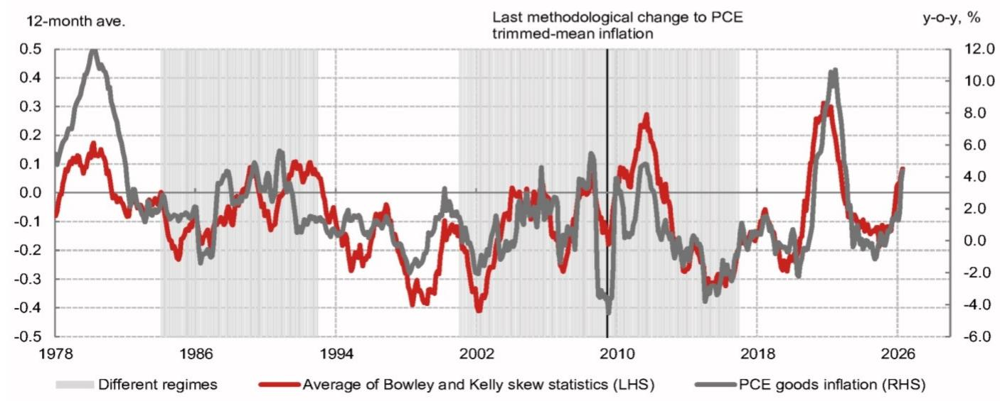
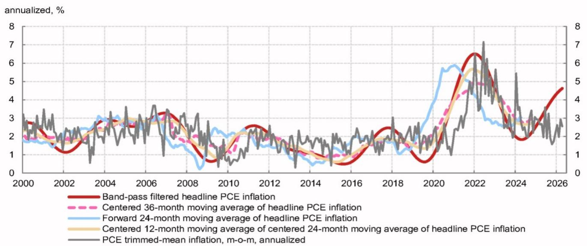

# Trimmed-Mean Inflation Is Not a Reliable Compass: Why Policymakers Should Think Twice Before Relying on It

The debate over how to measure "true" inflation has entered a new phase, and the stakes are higher than they appear. When the Federal Reserve Chair publicly dismisses core PCE inflation as a "rough swag" and instead champions trimmed-mean inflation, the market should pay close attention — but not necessarily agree. A rigorous evaluation of PCE trimmed-mean inflation reveals a troubling pattern: this metric is structurally slow to detect inflation turning points, systematically underestimates underlying price pressures in the current environment, and was designed using historical data that no longer reflects the dynamics of the post-pandemic economy. The gap between trimmed-mean and core PCE inflation currently stands at nearly 100 basis points. That is not a rounding error. That is a policy signal that could lead to a significant misreading of economic conditions.

The timing of this debate is critical. Inflation has proven stickier than many anticipated, and the Fed is navigating an environment where the margin for error is razor-thin. If the central bank shifts its preferred metric to one that consistently understates inflation, the risk of premature easing or insufficient tightening becomes material. The question is not merely academic. It is a question about whether the Federal Reserve will have the right tools to fulfill its dual mandate.

This article examines the structural limitations of trimmed-mean inflation, explains why its recent divergence from core PCE inflation should concern policymakers, and offers a decision framework for investors who need to interpret conflicting inflation signals. The goal is not to dismiss alternative metrics entirely, but to argue that trimmed-mean inflation, in its current form, is a flawed compass for monetary policy.

## The Statistical Architecture of Trimmed-Mean Inflation Creates a Built-In Tendency to Miss Regime Shifts

PCE trimmed-mean inflation is constructed by removing a fixed percentage of the highest and lowest monthly price changes from the cross-sectional distribution of inflation components. The Dallas Fed version currently trims 24% from the lower tail and 31% from the upper tail. The rationale is straightforward: by eliminating extreme movers, the metric should filter out transient noise and reveal the underlying trend.

This logic works well in stable environments where price changes follow a relatively symmetric distribution. But the design has an inherent weakness. The optimal trimming proportions were calibrated using data from January 1977 to June 2009. That calibration period ended before the most transformative economic shock in decades. The post-pandemic economy has produced a fundamentally different pattern of price changes, characterized by a pronounced skew in the distribution of inflation components.

When a new inflation regime emerges from a concentrated shock — such as the pandemic-driven surge in goods prices — the initial price increases are often clustered in a narrow set of categories. A trimmed-mean metric that removes the upper tail will systematically discard the very components that contain the earliest signal of a regime change. This is not a bug; it is a feature of the design. But it is a feature that makes the metric dangerously slow when speed of detection matters most.

The data confirms this vulnerability. During the post-pandemic inflation acceleration, annualized monthly PCE trimmed-mean inflation lagged all four "true" inflation measures calculated by the report's authors. Core PCE inflation, by contrast, began accelerating at nearly the same time as the true measures. The trimmed-mean metric did not just miss the turning point; it missed it by a meaningful margin, and that delay could have significant implications for policy timing.

## The Components Excluded by Trimming Contain the Most Informative Signals at Inflation Turning Points

A deeper examination of the inflation distribution reveals a striking pattern. The weighted average of the components that are trimmed from both tails — the very data points that trimmed-mean inflation discards — began reacting to the pandemic-induced inflation wave as early as the first quarter of 2021. This was much earlier than the trimmed-mean metric itself showed any meaningful movement.

This is not a coincidence. At inflection points, the most informative price changes are often the most extreme ones. A sudden surge in used car prices or a sharp increase in airfares may be idiosyncratic in normal times, but when such movements become synchronized across multiple categories, they signal a broader shift. The trimmed-mean methodology, by design, treats these signals as noise to be removed.

The same dynamic played out in reverse during the post-GFC disinflation. Components removed from the lower tail dropped sharply, while trimmed-mean inflation remained steady for an extended period. The metric was equally slow to detect disinflation as it was to detect reflation.

This pattern suggests a fundamental asymmetry. Trimmed-mean inflation is excellent at avoiding false positives — it will rarely signal a new inflation trend that does not materialize. But it achieves this reliability at the cost of missing genuine turning points. For a central bank focused on preemptive action, this trade-off is problematic. A metric that only confirms an inflation trend after it is well-established is of limited use for forward-looking policy decisions.

## The Post-Pandemic Shift in Goods Price Dynamics Introduces a Systematic Downward Bias

The report identifies a specific structural change that makes trimmed-mean inflation particularly unreliable in the current environment. Goods price inflation dynamics have fundamentally shifted in the post-pandemic era. The volatility and persistence of goods price changes have increased, and the distribution of price changes has become more skewed.

Trimmed-mean inflation, with its fixed trimming proportions and historical calibration, does not account for this shift. The result is a systematic downward bias. The report estimates that trimmed-mean inflation may underestimate underlying inflation by approximately 48 basis points on a year-over-year basis. That is a substantial gap. If the Fed were to adopt trimmed-mean inflation as a primary guide, it would be operating with a consistent underestimate of price pressures.

The source of this bias is instructive. The trimmed-mean methodology removes a fixed percentage of the upper tail regardless of the economic context. In a period where goods price increases are both more frequent and more extreme, this fixed trim removes a larger share of genuine inflation signal. The metric effectively assumes that the historical distribution of price changes is stationary. The post-pandemic data suggests it is not.

This is not an argument against all forms of trimmed-mean inflation. It is an argument that the current version, with its fixed calibration, is no longer fit for purpose. An adaptive trimming methodology that adjusts to changes in the underlying distribution could potentially address this limitation. But that is not the metric currently being discussed by policymakers.

## What the Report Does Not Fully Answer: The Political Economy of Inflation Measurement Choices

The report provides a rigorous technical critique of trimmed-mean inflation, but it leaves several important questions unexplored. Why would a Fed Chair advocate for a metric that systematically understates inflation? What are the strategic implications of shifting the policy framework toward a measure that is slower to detect changes?

One plausible interpretation is that the choice of inflation metric is never purely technical. It is also political. A metric that shows lower inflation can support a narrative that current policy is working, that inflation is under control, and that the central bank can afford to be patient. This narrative has real consequences for market expectations, wage negotiations, and fiscal policy.

The report does not address whether the Fed Chair's advocacy for trimmed-mean inflation reflects a genuine analytical conviction or a strategic framing choice. It also does not explore how the choice of metric interacts with the Fed's forward guidance and communication strategy. If the central bank signals that it is watching a metric that shows 2.35% inflation while core PCE shows 3.29%, the market receives a fundamentally different signal about the tightness of policy.

These are not questions the report needs to answer, but they are the questions that investors and policymakers should be asking. The technical critique of trimmed-mean inflation is compelling, but the broader context of how and why inflation metrics are chosen may be equally important for understanding the trajectory of monetary policy.

## A Decision Framework for Investors Navigating Conflicting Inflation Signals

For investors, the existence of multiple inflation metrics creates both confusion and opportunity. The key is to understand what each metric is designed to capture and where its blind spots lie. The following framework can help.

First, recognize that no single metric is sufficient. Core PCE inflation has its own limitations — it excludes food and energy but can still be influenced by volatile components. Trimmed-mean inflation is slow to detect turning points. Median CPI inflation, another alternative, has different properties. The prudent approach is to monitor a basket of metrics and understand where they diverge.

Second, pay attention to the tails. The most informative data at turning points often comes from the extremes of the distribution. When trimmed components begin to move sharply, it may signal a regime change that the trimmed-mean metric has not yet captured. The report shows that the tails reacted to the post-pandemic surge well before the trimmed-mean metric did. Investors who only watch the trimmed-mean measure would have missed the early signal.

Third, adjust for known biases. The report identifies a roughly 48 basis point downward bias in trimmed-mean inflation relative to underlying inflation in the current environment. Investors can apply this adjustment as a rough heuristic. If trimmed-mean inflation reads 2.35%, the true underlying pressure may be closer to 2.8% to 3.0%.

Fourth, focus on the direction of change rather than the level. Trimmed-mean inflation may be biased, but changes in the metric can still be informative. If trimmed-mean inflation begins to accelerate, it likely confirms that broader inflation pressures are building. The metric is more useful as a lagging confirmation than as a leading indicator.

Finally, watch the policy response. The Fed's choice of metric matters for the path of interest rates. If the central bank increasingly references trimmed-mean inflation in its communications, the market should adjust its expectations for the pace of tightening or easing. A Fed that believes inflation is at 2.35% will behave differently from a Fed that believes it is at 3.29%.

## Why This Debate Matters Now: The Full Report Contains the Charts That Tell the Story

The divergence between trimmed-mean inflation and core PCE inflation is not a statistical curiosity. It is a window into a broader debate about how the Federal Reserve should interpret the current economic environment. The report from which this analysis is drawn provides the original charts and detailed data that illustrate the timing of the divergence, the behavior of the tails, and the performance of alternative inflation measures across multiple historical episodes.

The charts reveal patterns that are difficult to capture in text alone. The lag in trimmed-mean inflation during the 2021-2022 surge is visually striking. The behavior of the excluded components as early warning signals is equally clear. For investors and policymakers who need to form their own judgment, the original data is essential.

The report also raises questions that deserve further exploration. How should the Fed adapt its inflation measurement framework to a world where the distribution of price changes is no longer stable? What role should alternative measures like median CPI or sticky-price CPI play in the policy framework? And most importantly, how can investors position themselves for a policy environment where the central bank's preferred metric may be giving a systematically distorted signal?

These are not questions with easy answers. But they are questions that every serious investor should be asking. The full report provides the analytical foundation for that inquiry.

Join the community to read the full report and review the original charts.

*This article is for learning and discussion only and does not constitute investment advice.*

Personal reading notes and learning share only. Not investment advice.

