# Japan Semiconductors, Asia Hardware and APAC Food & Beverages

# ABF Substrate: Renaissance of CPU drives ABF shortage; Lifting Ibiden PT to ¥23,900

David Dai, CFA

+852 2918 5704

david.dai@bernsteinsg.com

Alex Wang, CFA

+852 2123 2613

alex.wang@bernsteinsg.com

Euan McLeish

+81 3 5962 9611

euan.mcleish@bernsteinsg.com

Jack Lin

+852 2123 2683

jack.lin@bernsteinsg.com

Juho Hwang

+852 2123 2632

juho.hwang@bernsteinsg.com

Carmine Milano, CFA

+44 20 7762 1857

carmine.milano@bernsteinsg.com

Shirley Yang, CFA

+852 2123 2660

shirley.yang@bernsteinsg.com

Ethan Xu

+852 2123 2634

ethan.xu@bernsteinsg.com

Hao Wang, CFA

+852 2123 2627

hao.wang@bernsteinsg.com

Mufei Gao

+81 3 6777 6995

mufei.gao@bernsteinsg.com

ABF demand surges due to Renaissance of CPU. As outlined in SoftBank & Arm Initiation, server CPU volumes should expand 4x over 2026-2030, driven by the rise of agentic AI. This is great for ABF substrates where server CPUs contribute \~40% of the demand. Beyond unit growth, content growth also remains supportive, as newer-gen CPUs require larger substrates and increasing core counts (Intel Diamond Rapids area is \~36% larger vs. Granite Rapids). Driven by volume growth and larger chip sizes of server CPUs (37% CAGR), we revise up our demand forecast by 4%/24% in 2026/2027 and expect the demand to grow 22% CAGR over 2025-2028. Our current estimate likely remains conservative, as it does not yet incorporate lower yields associated with larger and more complex substrates. Our ABF supply-demand model can be downloaded here.

ABF supply is far from catching up with demand growth. Suppliers have stepped up capacity investment, but supply growth remains well short of demand growth. We forecast industry supply to grow at a 12% CAGR over 2025-2028. Among the major ABF suppliers, Ibiden and Unimicron appear to be the most aggressive in expanding capacity as they have the best customer exposure, supported in part by customer prepayments.

ABF shortage at full swing from 2027. Based on the above, we forecast the ABF market to enter an industry-wide shortage from 2027, with demand officially surpassing supply, and the imbalance worsening further in 2028. The industry utilization is rapidly surpassing 100% in 2027, from 80-85% in 2025. Demand is growing at 22% CAGR over 2025-28, while supply is only growing at 12% CAGR, so supply shortage is just a matter of time.

Ajinomoto's ABF film production unlikely to be a bottleneck, and we see the company starting to leverage their pricing power on the back of downstream price increases. Ajinomoto has been investing ahead of the curve, increasing capacity by c. $25\%$ in mid 2025 with the Gunma expansion, and further scope to double output by extending the operating week to 7 days and running a second shift daily. Ajinomoto's third production site in Gifu is scheduled to come online in 2032, or 2030 as required.

Raise PT for Ibiden. In light of the anticipated shortage, we revise up Ibiden's revenue by 3-13% for FY27/3E-FY28/3E. Given the tightening supply backdrop alongside rising input costs, we expect Ibiden to implement price hikes. Our current estimates are baked in a 4%/6%/12% price increase across FY27/28/29/3E, though this largely reflects product mix shift rather than outright pricing hike. Any shortage is likely to result in further upside to ASP. We raise our price target to ¥23,900, based on 35x FY29/3E EPS. We believe the improved demand visibility and stronger earnings growth justify the higher target multiple (35x vs. 30x previously). While we understand Ibiden is trading at a high multiple, we would look for more upside in pricing before taking profit on the name. Reiterate Outperform.

For Unimicron (Outperform), We estimate ABF substrate ASP hike will accelerate from 5% QoQ in 1Q26 to 7-10% QoQ through 2026 driven by a \~30% raw material cost hike from 2Q and a richer high-end ABF mix. We assume a more gradual margin recovery vs. consensus, with corporate GM reaching \~35% by end-2028.

BERNSTEIN TICKER TABLE 

<table><tr><td rowspan="3" colspan="3"></td><td colspan="2">28 May</td><td rowspan="2" colspan="2">TTM</td><td rowspan="2" colspan="4">Reported EPS</td><td rowspan="2" colspan="3">Reported P/E (x)</td></tr><tr><td colspan="2">2026</td></tr><tr><td rowspan="2">Closing Price</td><td rowspan="2">Price Target</td><td rowspan="2">Rel. Perf.</td><td rowspan="2">Cur</td><td rowspan="2">2025A</td><td rowspan="2">2026E</td><td rowspan="2">2027E</td><td rowspan="2">2025A</td><td rowspan="2">2026E</td><td rowspan="2">2027E</td><td></td></tr><tr><td>Ticker</td><td>Rating</td><td>Cur</td><td></td></tr><tr><td>4062.JP (Ibiden)</td><td>O</td><td>JPY</td><td>19,740</td><td>23,900</td><td>540.4%</td><td>JPY</td><td>214.91</td><td>259.64</td><td>411.19</td><td>91.9</td><td>76.0</td><td>48.0</td><td></td></tr><tr><td>OLD</td><td></td><td></td><td></td><td>9,200.00</td><td></td><td></td><td></td><td>238.90</td><td>330.73</td><td></td><td></td><td></td><td></td></tr><tr><td>2802.JP (Ajinomoto)</td><td>O</td><td>JPY</td><td>5,142.00</td><td>6,700.00</td><td>1.6%</td><td>JPY</td><td>138.36</td><td>151.45</td><td>190.45</td><td>20.1</td><td>16.6</td><td>14.0</td><td></td></tr><tr><td>3037.TT (Unimicron)</td><td>O</td><td>TWD</td><td>1,025.00</td><td>990.00</td><td>797.2%</td><td>TWD</td><td>4.36</td><td>14.06</td><td>25.10</td><td>235.0</td><td>72.9</td><td>40.8</td><td></td></tr><tr><td>JPL</td><td></td><td></td><td>2,551.66</td><td></td><td></td><td></td><td></td><td></td><td></td><td></td><td></td><td></td><td></td></tr><tr><td>ASIAX</td><td></td><td></td><td>1,997.51</td><td></td><td></td><td></td><td></td><td></td><td></td><td></td><td></td><td></td><td></td></tr></table>

# PRICE TARGET CHANGE / ESTIMATE CHANGE IN BOLD

O - Outperform, M - Market-Perform, U - Underperform, NR - Not Rated, CS - Coverage Suspended

2802.JP estimate is Adjusted EPS; 2802.JP valuation is EV/EBITDA (x); 2802.JP base year is 2026;

Source: Bloomberg, Bernstein estimates and analysis.

# INVESTMENT IMPLICATIONS

Ibiden: We rate Ibiden Outperform, with PT = ¥23,900.

Unmicron: We rate Unimicron Outperform, with PT = NT\$990.00.

Ajinomoto: We rate Ajinomoto Outperform with a ¥6,700 price target.

# DETAILS

# ABF DEMAND SURGES DUE TO RENAISSANCE OF CPU

We revise up our demand forecast for Ajinomoto Build-up Film (ABF) substrates by 4%/24% in 2026/2027. We now expect the demand to grow 22% CAGR over 2025-2028, mostly driven the increased demand outlook of server CPUs (Exhibit 1-Exhibit 2). This is great for ABF substrates where server CPUs contribute \~40% of the demand.

Driven by the rise of agentic AI, as outlined in SoftBank, Arm: From GenAI to Agentic AI; Initiating with Outperform Ratings, server CPU demand should increase materially through 2030. We forecast server CPU volumes reaching 30mn units by 2030, implying a roughly 4x expansion in server CPU TAM over 2026-2030. This translates into a server CPU TAM of \$137bn in 2030 (Exhibit 3), vs. Nvidia (NVDA, covered by Stacy A. Rasgon)'s estimate of a \$200bn TAM.

At the same time, server CPU shipments have been weak over the past 2 years, likely resulting in pent-up demand and providing a further near-term demand tailwind. Beyond unit growth, content growth also remains supportive, as newer-generation CPUs require meaningfully larger substrates vs. prior generations (Exhibit 4-Exhibit 5). For Intel (INTC, covered by Stacy A. Rasgon), substrate size has increased by 24-36% with each generation (Exhibit 6), vs. 12-23% substrate size increase for AMD (AMD, covered by Stacy A. Rasgon) (Exhibit 7).

For Arm-based CPUs, increasing core count is an additional driver of content growth. Graviton, CPU series of Amazon Web Services (AWS, owned by Amazon; AMZN, covered by Mark Shmulik), illustrates this clearly: across 5 generations, core count has risen 12x, from 16 cores in Graviton 1 to 192 cores in Graviton 5 (Exhibit 8).

Our ABF supply-demand model can be downloaded here.

EXHIBIT 1: 2020-2028E: Total ABF Substrate Demand   
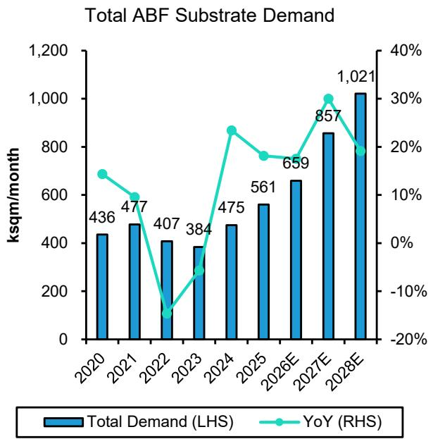

bar_line

Total ABF Substrate Demand
| Year | Total Demand (LHS) (ksqm/month) | YoY (%) |
| :--- | :--- | :--- |
| 2020 | 436 | 15 |
| 2021 | 477 | 8 |
| 2022 | 407 | -15 |
| 2023 | 384 | -5 |
| 2024 | 475 | 25 |
| 2025 | 561 | 18 |
| 2026E | 659 | 18 |
| 2027E | 857 | 30 |
| 2028E | 1,021 | 20 |

Source: Company disclosures, Mercury, Bernstein estimates and analysis.

EXHIBIT 2: Total ABF Substrate Demand: New vs. Old   
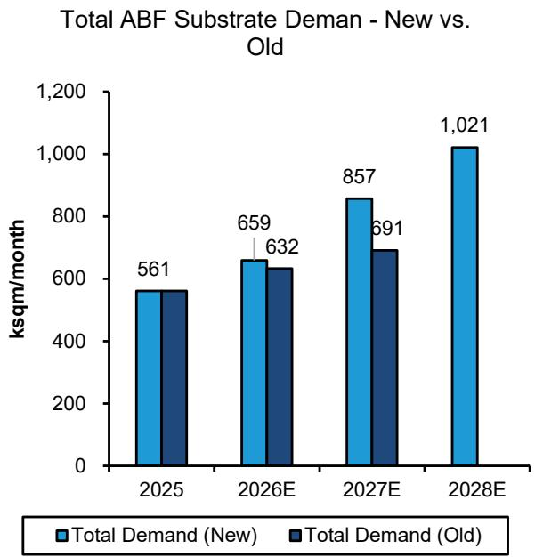

bar

Total ABF Substrate Deman - New vs. Old
| Year | Total Demand (New) (ksqm/month) | Total Demand (Old) (ksqm/month) |
| :--- | :--- | :--- |
| 2025 | 561 | 561 |
| 2026E | 659 | 632 |
| 2027E | 857 | 691 |
| 2028E | 1,021 | |

Source: Company disclosures, Mercury, Bernstein estimates and analysis.

EXHIBIT 3: We expect the server CPU market to increase from US\$33bn in 2025 to US\$137bn in 2030, accelerating at a 34% CAGR, driven by Agentic AI adoption.   
2020-2030E: Server CPU Market Size   
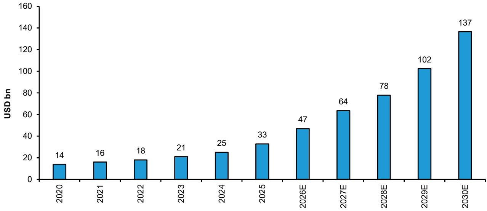

bar

| Year | Value (USD bn) |
| :--- | :--- |
| 2020 | 14 |
| 2021 | 16 |
| 2022 | 18 |
| 2023 | 21 |
| 2024 | 25 |
| 2025 | 33 |
| 2026E | 47 |
| 2027E | 64 |
| 2028E | 78 |
| 2029E | 102 |
| 2030E | 137 |

Source: Mercury, Company reports, Bernstein analysis and estimates.

EXHIBIT 4: Intel Server CPU: Substrate Size 

<table><tr><td></td><td>Socket</td><td>Launch Time</td><td>Pin Count</td><td>Width (mm)</td><td>Height (mm)</td><td>Size (sqcm)</td></tr><tr><td>Diamond Rapids</td><td>LGA 9324</td><td>Mid-2027</td><td>9,324</td><td>107.5</td><td>77</td><td>82.8</td></tr><tr><td>Clearwater Forest</td><td>LGA 7529</td><td>Mid-2026</td><td>7,529</td><td>92.5</td><td>66</td><td>61.1</td></tr><tr><td>Granite Rapids</td><td>LGA 7529</td><td>Sep-24</td><td>7,529</td><td>92.5</td><td>66</td><td>61.1</td></tr><tr><td>Sierra Forest</td><td>LGA 7529</td><td>Jun-24</td><td>7,529</td><td>92.5</td><td>66</td><td>61.1</td></tr><tr><td>Emerald Rapids</td><td>LGA 4677</td><td>Dec-23</td><td>4,677</td><td>81</td><td>61</td><td>49.4</td></tr><tr><td>Sapphire Rapids</td><td>LGA 4677</td><td>Jan-23</td><td>4,677</td><td>81</td><td>61</td><td>49.4</td></tr><tr><td>Ice Lake</td><td>LGA 4189</td><td>Apr-21</td><td>4,189</td><td>77.5</td><td>56.5</td><td>43.8</td></tr><tr><td>Cooper Lake</td><td>LGA 4189</td><td>Jun-20</td><td>4,189</td><td>77.5</td><td>56.5</td><td>43.8</td></tr><tr><td>Skylake</td><td>LGA 3647</td><td>Jul-17</td><td>3,647</td><td>76</td><td>56.5</td><td>42.9</td></tr></table>

Data of Clearwaer Forest and Diamond Rapids are estimated by Bernstein.   
Source: Company disclosures, Bernstein estimates and analysis.

EXHIBIT 5: AMD Server CPU: Substrate Size 

<table><tr><td></td><td>Socket</td><td>Debut Time</td><td>Pin Count</td><td>Width (mm)</td><td>Height (mm)</td><td>Size (sqcm)</td></tr><tr><td>Venice</td><td>SP7</td><td>Late 2026</td><td>9,324</td><td>78</td><td>78.1</td><td>60.9</td></tr><tr><td>Turin</td><td>SP5</td><td>Oct-24</td><td>6,096</td><td>72</td><td>75.4</td><td>54.3</td></tr><tr><td>Siena</td><td>SP6</td><td>Sep-23</td><td>4,844</td><td>58.5</td><td>75.4</td><td>44.1</td></tr><tr><td>Bergamo</td><td>SP5</td><td>Jun-23</td><td>6,096</td><td>72</td><td>75.4</td><td>54.3</td></tr><tr><td>Genoa</td><td>SP5</td><td>Nov-22</td><td>6,096</td><td>72</td><td>75.4</td><td>54.3</td></tr><tr><td>Milan</td><td>SP3</td><td>Mar-21</td><td>4,094</td><td>58.5</td><td>75.4</td><td>44.1</td></tr><tr><td>Rome</td><td>SP3</td><td>Aug-19</td><td>4,094</td><td>58.5</td><td>75.4</td><td>44.1</td></tr><tr><td>Naples</td><td>SP3</td><td>Jun-17</td><td>4,094</td><td>58.5</td><td>75.4</td><td>44.1</td></tr></table>

Data of Venice are estimated by Bernstein.   
Source: Company disclosures, Bernstein estimates and analysis.

EXHIBIT 6: Intel Server CPUs - Substrate Size Growth   
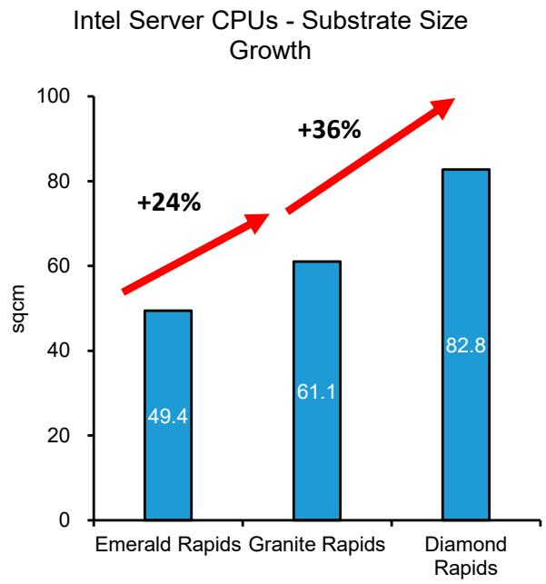

bar

| Processor          | Substrate Size (sqcm) |
| ------------------ | --------------------- |
| Emerald Rapids    | 49.4                  |
| Granite Rapids    | 61.1                  |
| Diamond Rapids    | 82.8                  |

Data of Diamond Rapids are estimated by Bernstein.   
Source: Company disclosures, Bernstein estimates and analysis.

EXHIBIT 7: AMD Server CPUs - Substrate Size Growth   
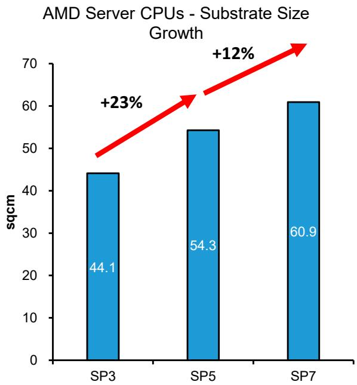

bar

| Category | Value  |
| -------- | ------ |
| SP3      | 44.1   |
| SP5      | 54.3   |
| SP7      | 60.9   |

Data of SP7 are estimated by Bernstein.   
Source: Company disclosures, Bernstein estimates and analysis.

EXHIBIT 8: AWS Graviton CPUs: Core Count by Generator   
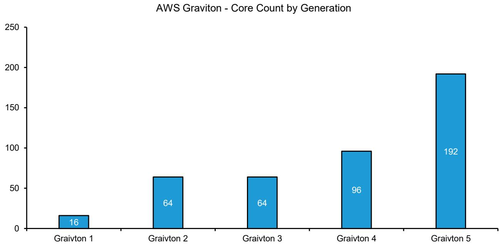

bar

AWS Graviton - Core Count by Generation
| Generation | Core Count |
| :--- | :--- |
| Graivton 1 | 16 |
| Graivton 2 | 64 |
| Graivton 3 | 64 |
| Graivton 4 | 96 |
| Graivton 5 | 192 |

Source: Company disclosures, Bernstein analysis.

Driven by volume growth and larger chip sizes of server CPUs (37% CAGR) (Exhibit 9-Exhibit 10), we forecast total CPU substrate area demand to increase by 19% CAGR over 2025-2028 (Exhibit 11-Exhibit 12), although we do not expect any growth in PC CPUs. Meanwhile, demand for GPU and ASIC accelerators remains robust. Our view that ABF content value per chip doubles with each generation remains unchanged (Exhibit 13-Exhibit 15). We expect GPU/ASIC substrate area demand increasing by 33% CAGR over 2025-2028.

Based on our CPU and GPU/ASIC assumptions, we now forecast total ABF substrate area demand to grow by 22% CAGR over 2025-2028 (Exhibit 16). This outlook is driven by continued demand growth across both CPUs and GPUs/ASICs. In addition, our current estimate likely remains conservative, as it does not yet incorporate lower yields associated with larger and more complex substrates.

EXHIBIT 9: 2020-2028E: Substrate Demand driven by Server CPUs   
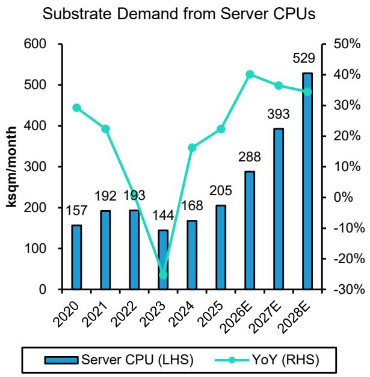

bar_line

Substrate Demand from Server CPUs
| Year | Server CPU (LHS) (ksqm/month) | YoY (%) |
| :--- | :--- | :--- |
| 2020 | 157 | 30 |
| 2021 | 192 | 22 |
| 2022 | 193 | -5 |
| 2023 | 144 | -28 |
| 2024 | 168 | 16 |
| 2025 | 205 | 21 |
| 2026E | 288 | 41 |
| 2027E | 393 | 37 |
| 2028E | 529 | 35 |

Source: Company disclosures, Mercury, Bernstein estimates and analysis.

EXHIBIT 11: 2020-2028E: Substrate Demand driven by Total CPUs   
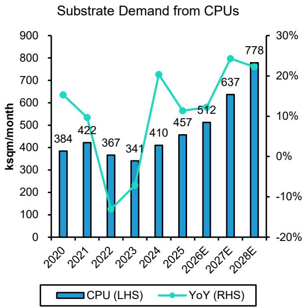

bar_line

Substrate Demand from CPUs
| Year | CPU (ksqm/month) | YoY (%) |
| :--- | :--- | :--- |
| 2020 | 384 | 15 |
| 2021 | 422 | 10 |
| 2022 | 367 | -15 |
| 2023 | 341 | -5 |
| 2024 | 410 | 20 |
| 2025 | 457 | 10 |
| 2026E | 512 | 10 |
| 2027E | 637 | 25 |
| 2028E | 778 | 23 |

Source: Company disclosures, Mercury, Bernstein estimates and analysis.

EXHIBIT 10: Substrate Demand driven by Server CPUs: New vs. Old   
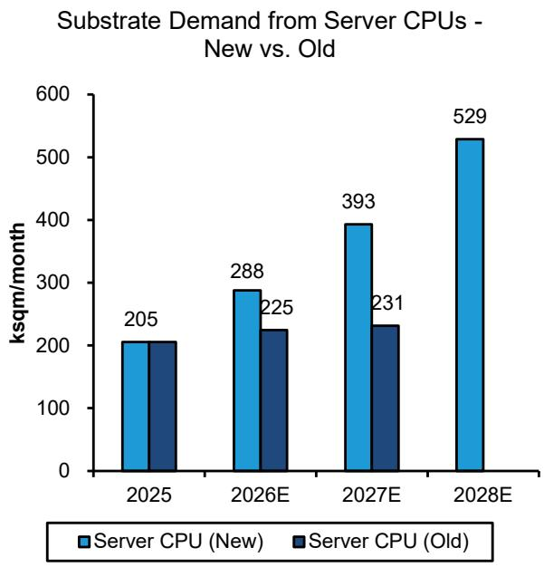

bar

Substrate Demand from Server CPUs - New vs. Old
| Year | Server CPU (New) (ksqm/month) | Server CPU (Old) (ksqm/month) |
| :--- | :--- | :--- |
| 2025 | 205 | 205 |
| 2026E | 288 | 225 |
| 2027E | 393 | 231 |
| 2028E | 529 | |

Source: Company disclosures, Mercury, Bernstein estimates and analysis.

EXHIBIT 12: Substrate Demand driven by Total CPUs: New vs. Old   
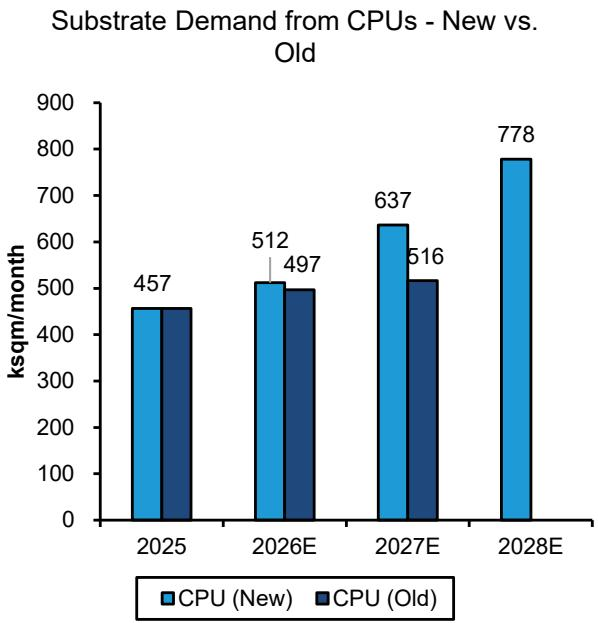

bar

Substrate Demand from CPUs - New vs. Old
| Year | CPU (New) (ksqm/month) | CPU (Old) (ksqm/month) |
| :--- | :--- | :--- |
| 2025 | 457 | 457 |
| 2026E | 512 | 497 |
| 2027E | 637 | 516 |
| 2028E | 778 | |

Source: Company disclosures, Mercury, Bernstein estimates and analysis.

EXHIBIT 13: We estimate total substrate area to grow 80-100% by generation for Nvidia AI GPUs.   
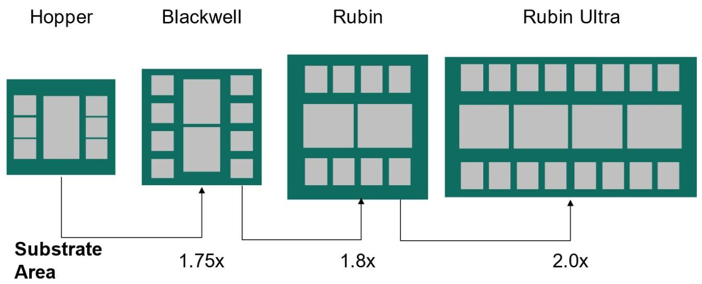

other

| Application     | Substrate Area |
| --------------- | -------------- |
| Hopper          | 1.75x          |
| Blackwell       | 1.8x           |
| Rubin           | 2.0x           |
Rubin Ultra    | (no label)     |

Source: Nvidia, Bernstein estimates and analysis.

EXHIBIT 14: We expect significant ASP increase for substrates as generation migrates.   
Substrate ASP by Nvidia product generation (indexed to Hopper)   
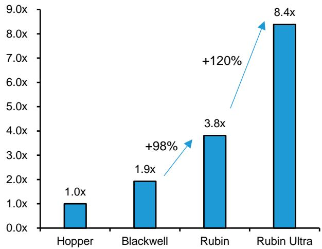

bar

| Company | Value (x) |
| :--- | :--- |
| Hopper | 1.0 |
| Blackwell | 1.9 |
| Rubin | 3.8 |
| Rubin Ultra | 8.4 |

Source: Bernstein estimates and analysis.

EXHIBIT 15: We expect ABF substrate TAM for Nvidia AI GPUs to continue strong growth of \~40% over the next 2 years.   
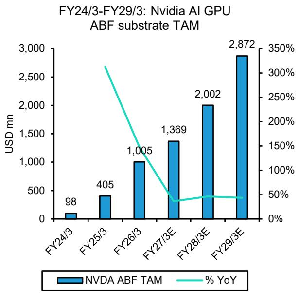

bar_line

FY24/3-FY29/3: Nvidia AI GPU
| Fiscal Year | NVDA ABF TAM (USD mn) | % YoY (%) |
| :--- | :--- | :--- |
| FY24/3 | 98 | |
| FY25/3 | 405 | 316.7 |
| FY26/3 | 1,005 | 151.6 |
| FY27/3E | 1,369 | 38.0 |
| FY28/3E | 2,002 | 44.5 |
| FY29/3E | 2,872 | 43.5 |

Source: Bernstein estimates and analysis.

EXHIBIT 16: 2019-2028E: ABF substrate demand share by end usage   
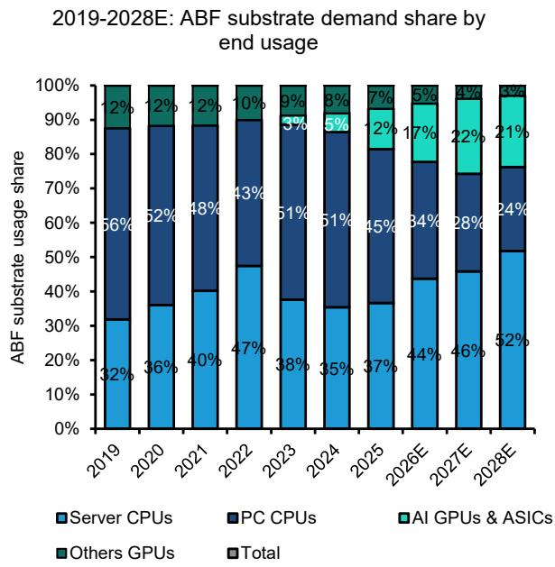

bar_stacked

2019-2028E: ABF substrate demand share by end usage
| Year | Server CPUs (%) | PC CPUs (%) | AI GPUs & ASICs (%) | Others GPUs (%) | Total (%) |
| :--- | :--- | :--- | :--- | :--- | :--- |
| 2019 | 32 | 56 | 12 | 0 | 0 |
| 2020 | 36 | 52 | 12 | 0 | 0 |
| 2021 | 40 | 48 | 12 | 0 | 0 |
| 2022 | 47 | 43 | 10 | 0 | 0 |
| 2023 | 38 | 51 | 9 | 3 | 0 |
| 2024 | 35 | 51 | 8 | 5 | 0 |
| 2025 | 37 | 45 | 7 | 12 | 0 |
| 2026E | 44 | 34 | 5 | 17 | 0 |
| 2027E | 46 | 28 | 4 | 22 | 0 |
| 2028E | 52 | 24 | 3 | 21 | 0 |

Source: Company disclosures, Mercury, Bernstein estimates and analysis.

# ABF SUPPLY IS FAR FROM CATCHING UP WITH DEMAND GROWTH

At the same time, suppliers have stepped up capacity investment, but supply growth remains well short of demand growth. We forecast industry supply to grow at a 12% CAGR over 2025-2028 (Exhibit 17-Exhibit 18). Among the major ABF suppliers, Ibiden and Unimicron appear to be the most aggressive in expanding capacity as they have the best customer exposure, supported in part by customer prepayments (or customers' end-customers such as hyperscalers).

Ibiden announced its ¥500bn capex over FY27/3E-29/3E in February 2026 (Exhibit 19). The capex is spent on two major projects: (1) ¥280bn on Ono fab, which we believe is for major GPU customer; (2) ¥220bn on Gama fab, which we believe is dedicated to EMIB-T. Based on our understanding, both fabs will have the most advanced technology and high ASP, and hence high return of investment. In May 2026, Ibiden also guided FY27/3E capex of ¥210bn, representing 40%+ of its ¥500bn three-year capex plan for the substrates business over FY27/3E-FY29/3E. The higher-than-expected capex commitment suggests management has growing conviction in the demand outlook vs. 3 months ago, in our view.

Unimicron guided NT\$34bn capex for 2026, with long-term equipment purchase order of NT\$14.1bn. Management has guided to increase ABF substrate capacity by 40% Yoy in end-2026 though across different sites, and ramp up $2^{nd}$ site in KF and $2^{nd}$ site in Yangmei in 2H27 and 2028 respectively.

EXHIBIT 17: ABF Substrate Supply - Total Capacity   
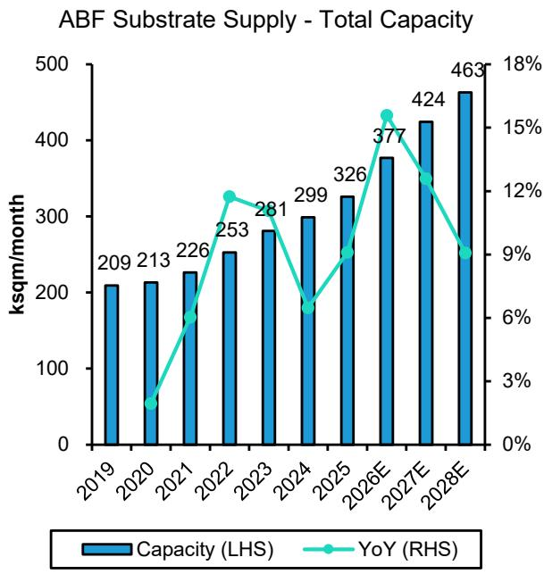

bar_line

ABF Substrate Supply - Total Capacity
| Year | Capacity (LHS) (ksqm/month) | YoY (%) |
| :--- | :--- | :--- |
| 2019 | 209 | |
| 2020 | 213 | 2.5 |
| 2021 | 226 | 7.5 |
| 2022 | 253 | 11.5 |
| 2023 | 281 | 9.5 |
| 2024 | 299 | 6.5 |
| 2025 | 326 | 9.5 |
| 2026E | 377 | 15.5 |
| 2027E | 424 | 12.5 |
| 2028E | 463 | 9.0 |

Source: Company disclosures, Prismark, Bernstein estimates and analysis.

EXHIBIT 18: ABF Substrate Supply - New vs. Old   
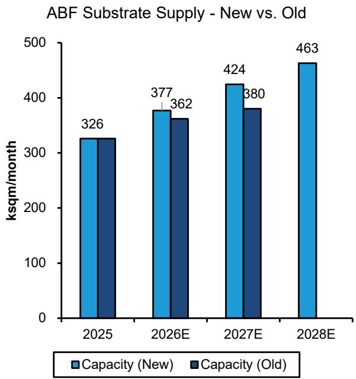

bar

ABF Substrate Supply - New vs. Old
| Year | Capacity (New) (ksqm/month) | Capacity (Old) (ksqm/month) |
| :--- | :--- | :--- |
| 2025 | 326 | 326 |
| 2026E | 377 | 362 |
| 2027E | 424 | 380 |
| 2028E | 463 | |

Source: Company disclosures, Prismark, Bernstein estimates and analysis.

EXHIBIT 19: Ibiden's Capex Plan vs. Bernstein and Consensus Estimates   
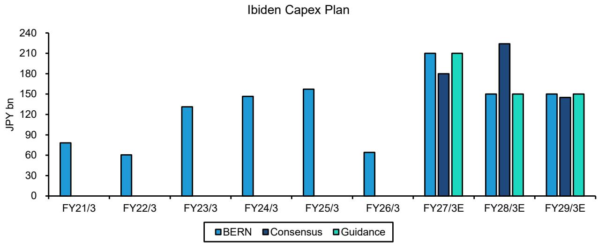

bar

Ibiden Capex Plan
| Period | BERN (JPY bn) | Consensus (JPY bn) | Guidance (JPY bn) |
| :--- | :--- | :--- | :--- |
| FY21/3 | 75 | - | - |
| FY22/3 | 60 | - | - |
| FY23/3 | 125 | - | - |
| FY24/3 | 148 | - | - |
| FY25/3 | 158 | - | - |
| FY26/3 | 62 | - | - |
| FY27/3E | 210 | 180 | 210 |
| FY28/3E | 150 | 230 | 150 |
| FY29/3E | 150 | 145 | 150 |

1. Ibiden announced JPY500bn capex over FY27/3E-FY29/3E, assuming FY28/3E-FY29/3E capex spent evenly.   
2. BERN FY21/3-FY26/3 represent historical data.   
Source: Company disclosures, Bloomberg, Bernstein estimates and analysis.

# ABF SHORTAGE AT FULL SWING FROM 2027

Based on the above supply and demand analysis, we forecast the ABF market to enter an industry-wide shortage from 2027, with demand officially surpassing supply, and the imbalance worsening further in 2028 (Exhibit 20). The industry utilization is rapidly surpassing 100% in 2027, from 80-85% in 2025. Fundamentally, demand is growing at 22% CAGR over 2025-28, while supply is only growing at 12% CAGR, so supply shortage is just a matter of time.

We see this shortage to play out in three steps:

1. Upstream material bottleneck is happening now: While ABF supply has been tight, the key bottleneck to date has largely been upstream materials, particularly T-glass. Major suppliers such as Ibiden are still operating at relatively healthy utilization levels of above 90% (excluding Intel which is at lower utilization). That said, the shortage is set to broaden from 2027 as demand begins to exceed effective industry supply.   
2. High-end shortage: Pockets of tightness are already emerging in the high-end segment and will get worse through 2026, and we are seeing some price hikes from certain suppliers in selected products.   
3. Broad-based shortage: the supply tightness in the high end is likely to broaden into the overall ABF industry in 2027, before becoming more severe in 2028. As a result, we would expect further price hikes from suppliers.

At the end of the day, the ABF substrate industry remains relatively small at around \$10bn, which leaves room for additional pricing upside. Relative to the combined CPU and GPU market, ABF represents \~1% of total AI server cost, suggesting that there is still room for further price hike.

EXHIBIT 20: 2019-2028E: ABF substrate indexed supply demand analysis   
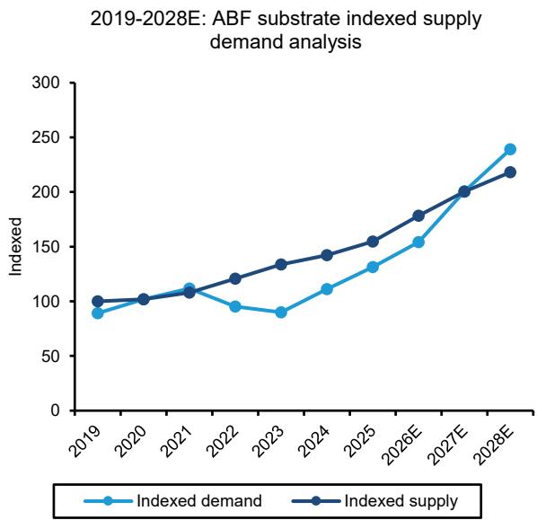

line

| Year   | Indexed demand | Indexed supply |
| ------ | -------------- | -------------- |
| 2019   | 90             | 100            |
| 2020   | 105            | 105            |
| 2021   | 110            | 110            |
| 2022   | 95             | 120            |
| 2023   | 90             | 135            |
| 2024   | 110            | 145            |
| 2025   | 130            | 155            |
| 2026E  | 155            | 180            |
| 2027E  | 200            | 200            |
| 2028E  | 240            | 220            |

Source: Company disclosures, Mercury, Prismark, Bernstein estimates and analysis.

# AJINOMOTO'S ABF FILM PRODUCTION CAPACITY IS UNLIKELY TO BE A BOTTLENECK

Ajinomoto has sufficient ABF Film production capacity to meet demand over the medium term.

The company commissioned a c. 50% expansion of their Gunma site in mid 2025 (Exhibit 21), raising overall installed capacity by c. 25%, by our estimates. In addition to filling this installed capacity, management have flagged scope to double the current shift pattern from 1x 8hs shift, 5 days a week to 2 shifts daily and also to additional weekend shifts as required.

The company has guided to ¥25b of annual ABF related capex, covering both maintenance and incremental initiatives to increase yields.

EXHIBIT 21: Ajinomoto's 2025 Gunma site expansion increased ABF production capacity by c. 25% by our estimates   
June 2023   
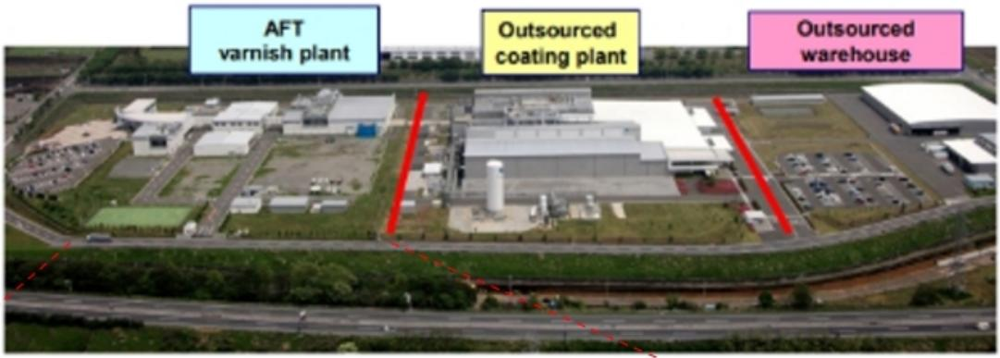

text_image

AFT
varnish plant
Outsourced
coating plant
Outsourced
warehouse

Opened in March 2025   
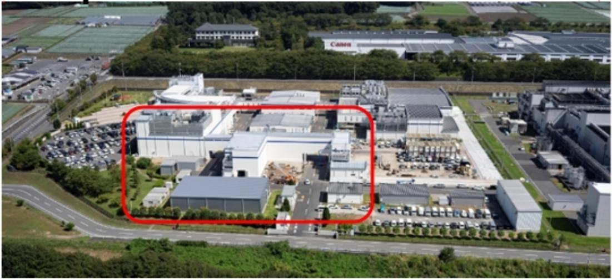

natural_image

Aerial view of a large industrial complex with multiple buildings, parking lots, and surrounding greenery; no visible text or symbols.

Source: Company presentation, Bernstein photo and analysis.

In order to secure medium term supply, the company recently acquired land in Gifu Prefecture where they plan to build a third AFB production site (Exhibit 22). Commissioning is currently planned for 2032, but management see scope to bring this forward to 2030, if required.

EXHIBIT 22: Ajinomoto's Gifu ABF produciton capacity is scheduled to come online in 2032, with scope to bring this forward to 2030 as required   
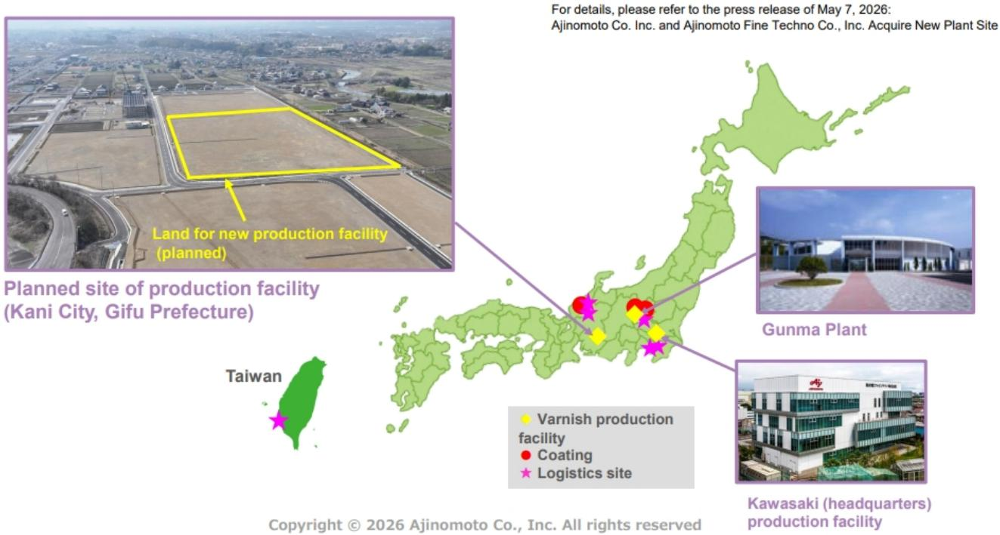

text_image

For details, please refer to the press release of May 7, 2026:
Ajinomoto Co. Inc. and Ajinomoto Fine Techno Co., Inc. Acquire New Plant Site
Land for new production facility (planned)
Planned site of production facility (Kani City, Gifu Prefecture)
Gunma Plant
Taiwan
● Varnish production facility
● Coating
★ Logistics site
Copyright © 2026 Ajinomoto Co., Inc. All rights reserved
Kawasaki (headquarters) production facility

Source: Company presentation.

# WE RAISE IBIDEN FORECASTS AND PT TO ¥23,900 AND MAINTAIN OP

In light of the anticipated ABF substrate supply shortage in 2027-28, driven by robust server CPU demand and the company's updated mid-term guidance, we revise up Ibiden's revenue by 3-13% for FY27/3E and FY28/3E (Exhibit 23).

Given the tightening supply backdrop alongside rising input costs, coupled with product spec upgrades, we expect Ibiden to implement price hikes over this period. Our current estimates are baked in a 4-6% price increase across FY27/3E and FY28/3E, though this largely reflects product mix shift rather than outright pricing hike (Exhibit 24). FY29/3 price is forecasted to rise more sharply by 12%, as shortage likely exacerbates and product upgrades (especially EMIB-T) accelerates. Any shortage is likely to result in further upside to Ibiden's ASP, in our view.

Our sensitivity analysis suggests that every 5% price hike would translate into a 10-13% increase in operating profit for FY28/3E and FY29/3E, respectively (Exhibit 25-Exhibit 26).

Our operating profit forecast in FY29/3 is ¥289bn, as we consider the company guidance of ¥300bn yen OP in FY31/3 as being too conservative.

We raise our price target to ¥23,900, based on 35x FY29/3E EPS. We believe the improved demand visibility and stronger earnings growth trajectory justify the higher target multiple (35x vs. 30x previously). We also believe investors are increasingly looking through to FY29/3E, as EMIB-T revenue is expected to ramp meaningfully during the period, consistent with Ibiden's capex plan (as highlighted in Ibiden: Big investment shows customer commitment. Outperform and Global Semis: Can Intel challenge TSMC with EMIB-T? And who benefits in the supply chain?). While we understand that the stock is trading at a high multiple, we would look for more upside in pricing before taking profit on the name. We reiterate our Outperform rating on Ibiden.

Our updated Ibiden model can be downloaded here.

EXHIBIT 23: Ibiden: Summary of Estimate Changes 

<table><tr><td>Ibiden: summary of estimate changes</td><td>FY26/3</td><td>1Q27/3E</td><td>2Q27/3E</td><td>3Q27/3E</td><td>4Q27/3E</td><td>FY27/3E</td><td>FY28/3E</td><td>FY29/3E</td></tr><tr><td colspan="9">Revenue (JPY bn)</td></tr><tr><td>Bernstein - Old</td><td>422.0</td><td>118.8</td><td>122.9</td><td>131.9</td><td>135.9</td><td>509.5</td><td>595.7</td><td></td></tr><tr><td>Growth YoY</td><td>14.2%</td><td>21.9%</td><td>25.4%</td><td>27.9%</td><td>15.6%</td><td>20.7%</td><td>16.9%</td><td></td></tr><tr><td>Bernstein - New</td><td>416.2</td><td>115.5</td><td>123.2</td><td>131.0</td><td>157.0</td><td>526.7</td><td>674.2</td><td>863.2</td></tr><tr><td>Growth YoY</td><td>12.7%</td><td>18.6%</td><td>25.6%</td><td>27.0%</td><td>33.5%</td><td>26.5%</td><td>28.0%</td><td>28.0%</td></tr><tr><td>Consensus</td><td>416.7</td><td>117.2</td><td>121.0</td><td>128.4</td><td>134.6</td><td>503.4</td><td>597.2</td><td>752.2</td></tr><tr><td>Growth YoY</td><td>12.8%</td><td>20.3%</td><td>23.4%</td><td>24.5%</td><td>14.5%</td><td>20.8%</td><td>18.6%</td><td>26.0%</td></tr><tr><td>New vs. old</td><td>-1.4%</td><td>-2.7%</td><td>0.2%</td><td>-0.7%</td><td>15.5%</td><td>3.4%</td><td>13.2%</td><td></td></tr><tr><td>Bernstein vs. consensus</td><td>-0.1%</td><td>-1.4%</td><td>1.8%</td><td>2.0%</td><td>16.6%</td><td>4.6%</td><td>12.9%</td><td>14.8%</td></tr><tr><td colspan="9">Operating profit (JPY bn)</td></tr><tr><td>Bernstein - Old</td><td>61.9</td><td>19.1</td><td>21.4</td><td>25.3</td><td>27.6</td><td>93.4</td><td>129.0</td><td></td></tr><tr><td>Growth YoY</td><td>30.0%</td><td>8.1%</td><td>43.3%</td><td>111.9%</td><td>57.8%</td><td>50.8%</td><td>38.1%</td><td></td></tr><tr><td>Margin</td><td>14.7%</td><td>16.1%</td><td>17.4%</td><td>19.2%</td><td>20.3%</td><td>18.3%</td><td>21.7%</td><td></td></tr><tr><td>Bernstein - New</td><td>62.0</td><td>20.8</td><td>24.1</td><td>24.2</td><td>34.8</td><td>103.9</td><td>174.1</td><td>289.4</td></tr><tr><td>Growth YoY</td><td>164.6%</td><td>17.7%</td><td>61.3%</td><td>102.2%</td><td>99.0%</td><td>67.4%</td><td>67.7%</td><td>66.2%</td></tr><tr><td>Margin</td><td>14.9%</td><td>18.0%</td><td>19.6%</td><td>18.5%</td><td>22.2%</td><td>19.7%</td><td>25.8%</td><td>33.5%</td></tr><tr><td>Consensus</td><td>62.0</td><td>19.4</td><td>21.6</td><td>23.5</td><td>25.6</td><td>89.7</td><td>122.1</td><td>199.6</td></tr><tr><td>Growth YoY</td><td>41.1%</td><td>10.2%</td><td>44.8%</td><td>96.3%</td><td>46.3%</td><td>44.8%</td><td>36.1%</td><td>63.5%</td></tr><tr><td>Margin</td><td>14.9%</td><td>16.6%</td><td>17.9%</td><td>18.3%</td><td>19.0%</td><td>17.8%</td><td>20.4%</td><td>26.5%</td></tr><tr><td>New vs. old</td><td>0.2%</td><td>8.9%</td><td>12.6%</td><td>-4.6%</td><td>26.1%</td><td>11.2%</td><td>35.0%</td><td></td></tr><tr><td>Bernstein vs. consensus</td><td>0.1%</td><td>6.8%</td><td>11.4%</td><td>3.0%</td><td>36.0%</td><td>15.8%</td><td>42.6%</td><td>44.9%</td></tr><tr><td colspan="9">EPS (JPY)</td></tr><tr><td>Bernstein - Old</td><td>151.5</td><td>48.7</td><td>54.7</td><td>64.8</td><td>70.7</td><td>238.9</td><td>330.7</td><td></td></tr><tr><td>Growth YoY</td><td>34.0%</td><td>13.5%</td><td>74.4%</td><td>97.4%</td><td>-34.4%</td><td>57.7%</td><td>38.4%</td><td></td></tr><tr><td>Bernstein - New</td><td>214.9</td><td>52.2</td><td>59.9</td><td>60.0</td><td>87.5</td><td>259.6</td><td>411.2</td><td>682.3</td></tr><tr><td>Growth YoY</td><td>240.7%</td><td>21.7%</td><td>90.8%</td><td>82.9%</td><td>-18.8%</td><td>20.8%</td><td>58.4%</td><td>65.9%</td></tr><tr><td>Consensus</td><td>192.6</td><td>48.0</td><td>53.1</td><td>57.4</td><td>64.0</td><td>223.9</td><td>302.8</td><td>490.6</td></tr><tr><td>Growth YoY</td><td>78.6%</td><td>11.9%</td><td>69.1%</td><td>74.7%</td><td>-40.6%</td><td>16.2%</td><td>35.3%</td><td>62.0%</td></tr><tr><td>New vs. old</td><td>41.8%</td><td>7.2%</td><td>9.4%</td><td>-7.3%</td><td>23.8%</td><td>8.7%</td><td>24.3%</td><td></td></tr><tr><td>Bernstein vs. consensus</td><td>11.6%</td><td>8.7%</td><td>12.9%</td><td>4.7%</td><td>36.7%</td><td>16.0%</td><td>35.8%</td><td>39.1%</td></tr></table>

Source: Company disclosures, Bloomberg, Bernstein estimates and analysis.

EXHIBIT 24: Ibiden - ASP for FC Packages   
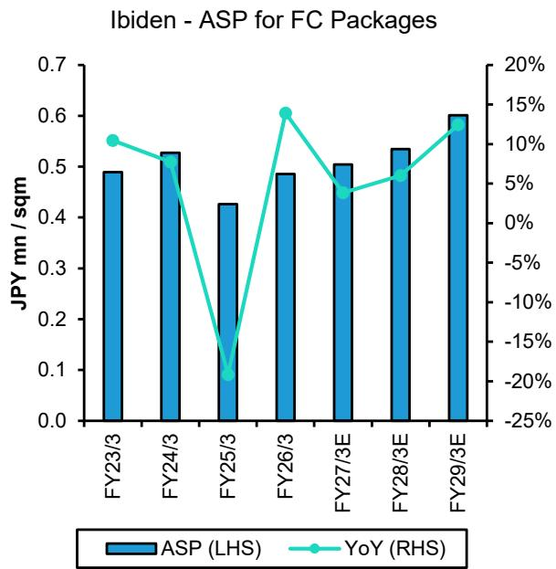

bar

| Fiscal Year | ASP (LHS) | YoY (RHS) |
| ----------- | --------- | --------- |
| FY23/3      | 0.49      | 10%       |
| FY24/3      | 0.53      | 8%        |
| FY25/3      | 0.43      | -20%      |
| FY26/3      | 0.49      | 15%       |
| FY27/3E     | 0.51      | 5%        |
| FY28/3E     | 0.54      | 7%        |
| FY29/3E     | 0.61      | 12%       |

Ibiden's FC Package segment is predominantly ABF substrates.   
Source: Company disclosures, Mercury, Bernstein estimates and analysis.

EXHIBIT 25: Ibiden: ABF Substrate Price Hike Sensitivity (FY28/3E) 

<table><tr><td colspan="6">Sensitivity Analysis on FY28/3E Financials</td></tr><tr><td colspan="6">Base Case</td></tr><tr><td>Price Hike</td><td>16.0%</td><td>11.0%</td><td>6.0%</td><td>1.0%</td><td>-4.0%</td></tr><tr><td>Revenue (JPYbn)</td><td>719</td><td>697</td><td>674</td><td>652</td><td>630</td></tr><tr><td>Vs. Base</td><td>6.6%</td><td>3.3%</td><td>0.0%</td><td>-3.3%</td><td>-6.6%</td></tr><tr><td>Operating Profits (JPY bn)</td><td>219</td><td>196</td><td>174</td><td>152</td><td>130</td></tr><tr><td>Vs. Base</td><td>25.6%</td><td>12.8%</td><td>0.0%</td><td>-12.8%</td><td>-25.6%</td></tr><tr><td>Operating Margin</td><td>30.4%</td><td>28.2%</td><td>25.8%</td><td>23.3%</td><td>20.6%</td></tr><tr><td>Vs. Base</td><td>4.6%</td><td>2.4%</td><td>0.0%</td><td>-2.5%</td><td>-5.2%</td></tr></table>

Source: Company disclosures, Bernstein estimates and analysis.

EXHIBIT 26: Ibiden: ABF Substrate Price Hike Sensitivity (FY29/3E) 

<table><tr><td colspan="6">Sensitivity Analysis on FY29/3E Financials</td></tr><tr><td colspan="6">Base Case</td></tr><tr><td>Price Hike</td><td>22.4%</td><td>17.4%</td><td>12.4%</td><td>7.4%</td><td>2.4%</td></tr><tr><td>Revenue (JPYbn)</td><td>921</td><td>892</td><td>863</td><td>834</td><td>805</td></tr><tr><td>Vs. Base</td><td>6.7%</td><td>3.4%</td><td>0.0%</td><td>-3.4%</td><td>-6.7%</td></tr><tr><td>Operating Profits (JPY bn)</td><td>347</td><td>318</td><td>289</td><td>260</td><td>231</td></tr><tr><td>Vs. Base</td><td>20.0%</td><td>10.0%</td><td>0.0%</td><td>-10.0%</td><td>-20.0%</td></tr><tr><td>Operating Margin</td><td>37.7%</td><td>35.7%</td><td>33.5%</td><td>31.2%</td><td>28.7%</td></tr><tr><td>Vs. Base</td><td>4.2%</td><td>2.2%</td><td>0.0%</td><td>-2.3%</td><td>-4.8%</td></tr></table>

Source: Company disclosures, Bernstein estimates and analysis.

EXHIBIT 27: FY21/3-FY28/3E: Ibiden Revenue   
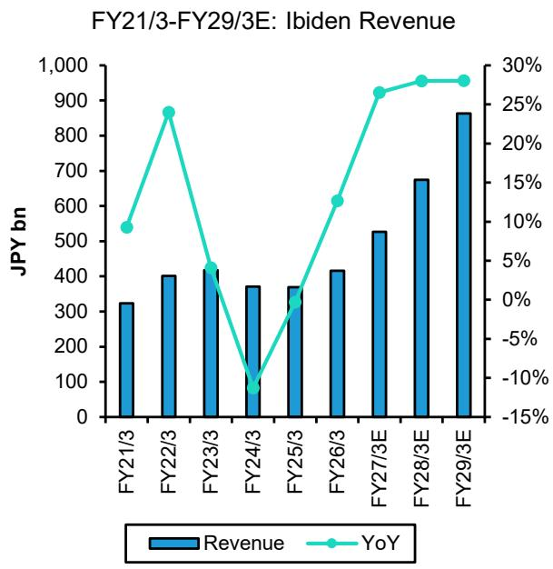

bar_line

FY21/3-FY29/3E: Ibiden Revenue
| Fiscal Year | Revenue (JPY bn) | YoY (%) |
| :--- | :--- | :--- |
| FY21/3 | 325 | 8.5 |
| FY22/3 | 400 | 25.0 |
| FY23/3 | 415 | 4.0 |
| FY24/3 | 370 | -11.0 |
| FY25/3 | 370 | 1.0 |
| FY26/3 | 410 | 12.0 |
| FY27/3E | 525 | 27.0 |
| FY28/3E | 675 | 28.0 |
| FY29/3E | 860 | 28.0 |

Source: Company disclosures, Bernstein estimates and analysis.

EXHIBIT 28: FY21/3-FY28/3E: Ibiden Gross Profit  
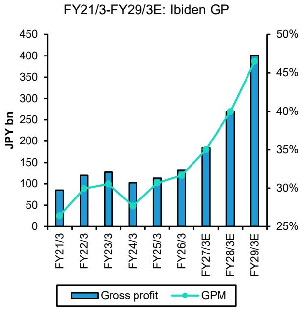

bar_line

FY21/3-FY29/3E: Ibiden GP
| Fiscal Year | Gross profit (JPY bn) | GPM (%) |
| :--- | :--- | :--- |
| FY21/3 | 85 | 26 |
| FY22/3 | 120 | 30 |
| FY23/3 | 128 | 31 |
| FY24/3 | 102 | 27 |
| FY25/3 | 113 | 31 |
| FY26/3 | 130 | 32 |
| FY27/3E | 182 | 36 |
| FY28/3E | 268 | 40 |
| FY29/3E | 400 | 47 |

Source: Company disclosures, Bernstein estimates and analysis.

EXHIBIT 29: FY21/3-FY28/3E: Ibiden Operating Profit   
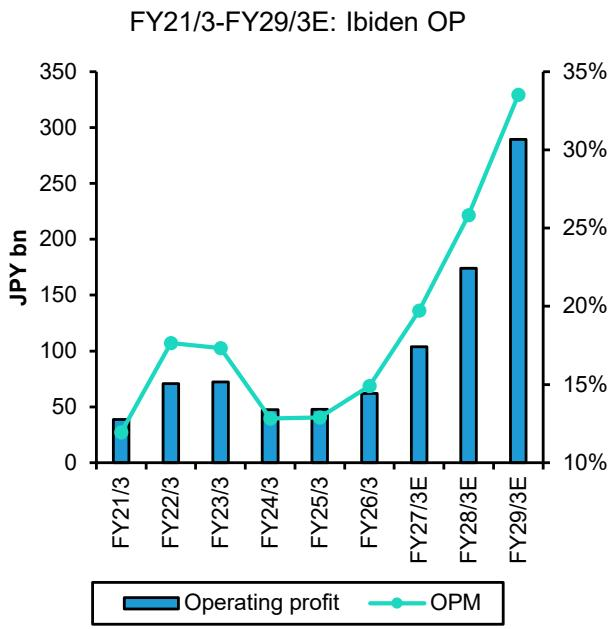

bar_line

FY21/3-FY29/3E: Ibiden OP
| Fiscal Year | Operating profit (JPY bn) | OPM (%) |
| :--- | :--- | :--- |
| FY21/3 | 38 | 12 |
| FY22/3 | 70 | 18 |
| FY23/3 | 72 | 17 |
| FY24/3 | 46 | 13 |
| FY25/3 | 47 | 13 |
| FY26/3 | 60 | 15 |
| FY27/3E | 103 | 20 |
| FY28/3E | 174 | 26 |
| FY29/3E | 290 | 34 |

Source: Company disclosures, Bernstein estimates and analysis.

EXHIBIT 30: Ibiden: Forward P/E Band   
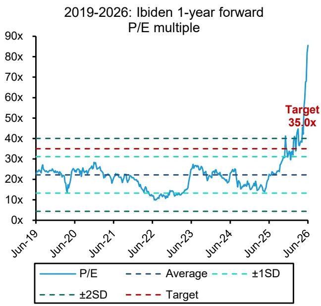

line

| Date   | P/E  |
|--------|------|
| Jun-26 | 35.0x |

Source: Bloomberg, Bernstein estimates and analysis.

# APPENDIX - FINANCIAL FORECASTS

EXHIBIT 31: Ibiden: Income Statement 

<table><tr><td>JPY bn</td><td>FY26/3</td><td>1Q27E</td><td>2Q27E</td><td>3Q27E</td><td>4Q27E</td><td>FY27/3E</td><td>FY28/3E</td><td>FY29/3E</td></tr><tr><td colspan="9">Revenue contribution</td></tr><tr><td>Electronics</td><td>243.3</td><td>73.9</td><td>81.9</td><td>85.6</td><td>110.3</td><td>351.7</td><td>483.2</td><td>663.0</td></tr><tr><td>Ceramics</td><td>82.6</td><td>19.3</td><td>19.8</td><td>20.6</td><td>21.6</td><td>81.2</td><td>91.0</td><td>96.5</td></tr><tr><td>Others</td><td>90.3</td><td>22.4</td><td>21.5</td><td>24.8</td><td>25.1</td><td>93.7</td><td>100.1</td><td>103.8</td></tr><tr><td>Revenue</td><td>416.2</td><td>115.5</td><td>123.2</td><td>131.0</td><td>157.0</td><td>526.7</td><td>674.2</td><td>863.2</td></tr><tr><td colspan="9">OP contribution</td></tr><tr><td>Electronics</td><td>45.2</td><td>17.0</td><td>20.2</td><td>19.7</td><td>30.0</td><td>86.8</td><td>155.0</td><td>269.3</td></tr><tr><td>Ceramics</td><td>7.6</td><td>1.6</td><td>1.9</td><td>2.2</td><td>2.5</td><td>8.2</td><td>9.1</td><td>9.6</td></tr><tr><td>Others</td><td>9.0</td><td>2.1</td><td>2.0</td><td>2.4</td><td>2.4</td><td>8.9</td><td>10.0</td><td>10.4</td></tr><tr><td>Operating profit</td><td>62.0</td><td>20.8</td><td>24.1</td><td>24.2</td><td>34.8</td><td>103.9</td><td>174.1</td><td>289.4</td></tr><tr><td>Revenue</td><td>416.2</td><td>115.5</td><td>123.2</td><td>131.0</td><td>157.0</td><td>526.7</td><td>674.2</td><td>863.2</td></tr><tr><td>Gross profit</td><td>131.7</td><td>39.0</td><td>43.2</td><td>44.0</td><td>58.2</td><td>184.4</td><td>269.4</td><td>401.2</td></tr><tr><td>Research and development</td><td>20.0</td><td>4.9</td><td>5.2</td><td>5.5</td><td>6.3</td><td>21.8</td><td>24.9</td><td>28.9</td></tr><tr><td>Sales &amp; marketing expenses</td><td>49.6</td><td>13.4</td><td>14.0</td><td>14.3</td><td>17.1</td><td>58.7</td><td>70.3</td><td>82.9</td></tr><tr><td>Operating profit</td><td>62.0</td><td>20.8</td><td>24.1</td><td>24.2</td><td>34.8</td><td>103.9</td><td>174.1</td><td>289.4</td></tr><tr><td>EBITDA</td><td>128.3</td><td>38.6</td><td>42.9</td><td>46.2</td><td>58.3</td><td>186.0</td><td>265.1</td><td>380.4</td></tr><tr><td>Non-operating income</td><td>-1.2</td><td>2.0</td><td>2.0</td><td>2.0</td><td>2.0</td><td>8.0</td><td>3.4</td><td>5.7</td></tr><tr><td>Ordinary profit</td><td>60.8</td><td>22.8</td><td>26.1</td><td>26.2</td><td>36.8</td><td>111.9</td><td>177.5</td><td>295.1</td></tr><tr><td>Profit before tax</td><td>24.3</td><td>22.8</td><td>26.1</td><td>26.2</td><td>36.8</td><td>111.9</td><td>177.5</td><td>295.1</td></tr><tr><td>Income tax expense</td><td>26.9</td><td>6.8</td><td>7.8</td><td>7.9</td><td>11.0</td><td>33.6</td><td>53.3</td><td>88.5</td></tr><tr><td>Net income</td><td>-2.7</td><td>15.9</td><td>18.3</td><td>18.3</td><td>25.8</td><td>78.3</td><td>124.3</td><td>206.5</td></tr><tr><td>Net profit attributable to SHs</td><td>63.7</td><td>15.8</td><td>18.2</td><td>18.2</td><td>26.6</td><td>78.8</td><td>124.8</td><td>207.0</td></tr><tr><td>Diluted EPS (JPY)</td><td>214.9</td><td>52.2</td><td>59.9</td><td>60.0</td><td>87.5</td><td>259.6</td><td>411.2</td><td>682.3</td></tr><tr><td colspan="9">Margins</td></tr><tr><td>Gross profit</td><td>31.6%</td><td>33.7%</td><td>35.1%</td><td>33.6%</td><td>37.1%</td><td>35.0%</td><td>39.9%</td><td>46.5%</td></tr><tr><td>Operating profit</td><td>14.9%</td><td>18.0%</td><td>19.6%</td><td>18.5%</td><td>22.2%</td><td>19.7%</td><td>25.8%</td><td>33.5%</td></tr><tr><td>EBITDA</td><td>30.8%</td><td>33.4%</td><td>34.9%</td><td>35.3%</td><td>37.2%</td><td>35.3%</td><td>39.3%</td><td>44.1%</td></tr><tr><td>Profit before tax</td><td>5.8%</td><td>19.7%</td><td>21.2%</td><td>20.0%</td><td>23.5%</td><td>21.2%</td><td>26.3%</td><td>34.2%</td></tr><tr><td>Net income</td><td>15.3%</td><td>13.7%</td><td>14.8%</td><td>13.9%</td><td>16.9%</td><td>15.0%</td><td>18.5%</td><td>24.0%</td></tr><tr><td colspan="9">Growth YoY</td></tr><tr><td>Revenue</td><td>12.7%</td><td>18.6%</td><td>25.6%</td><td>27.0%</td><td>33.5%</td><td>26.5%</td><td>28.0%</td><td>28.0%</td></tr><tr><td>Gross profit</td><td>16.2%</td><td>11.2%</td><td>31.6%</td><td>56.6%</td><td>63.1%</td><td>40.0%</td><td>46.1%</td><td>48.9%</td></tr><tr><td>Operating profit</td><td>30.3%</td><td>17.7%</td><td>61.3%</td><td>102.2%</td><td>99.0%</td><td>67.4%</td><td>67.7%</td><td>66.2%</td></tr><tr><td>EBITDA</td><td>26.0%</td><td>31.7%</td><td>49.6%</td><td>48.8%</td><td>48.6%</td><td>45.0%</td><td>42.5%</td><td>43.5%</td></tr><tr><td>Profit before tax</td><td>-38.3%</td><td>275.3%</td><td>330.4%</td><td>331.6%</td><td>507.4%</td><td>361.2%</td><td>58.7%</td><td>66.2%</td></tr><tr><td>Net income</td><td>89.0%</td><td>24.4%</td><td>94.5%</td><td>104.0%</td><td>-18.8%</td><td>23.6%</td><td>58.4%</td><td>65.9%</td></tr></table>

Source: Company disclosures, Bernstein estimates and analysis.

EXHIBIT 32: Ibiden: Balance Sheet 

<table><tr><td>JPY bn</td><td>FY24/3</td><td>FY25/3</td><td>FY26/3</td><td>FY27/3E</td><td>FY28/3E</td><td>FY29/3E</td></tr><tr><td>Cash and cash equivalents</td><td>443.6</td><td>390.7</td><td>295.7</td><td>360.3</td><td>551.4</td><td>816.4</td></tr><tr><td>Inventories</td><td>65.3</td><td>67.2</td><td>71.0</td><td>85.4</td><td>101.0</td><td>115.2</td></tr><tr><td>Prepayments, receivables and other assets</td><td>91.9</td><td>91.7</td><td>98.9</td><td>120.7</td><td>149.8</td><td>187.1</td></tr><tr><td>Total current assets</td><td>600.8</td><td>549.6</td><td>465.5</td><td>566.3</td><td>802.2</td><td>1,118.7</td></tr><tr><td>Property, plant and equipment, net</td><td>408.8</td><td>460.1</td><td>437.7</td><td>585.9</td><td>644.9</td><td>703.9</td></tr><tr><td>Intangible assets</td><td>4.6</td><td>4.3</td><td>4.4</td><td>4.4</td><td>4.4</td><td>4.4</td></tr><tr><td>Investments and other assets</td><td>115.8</td><td>67.7</td><td>52.8</td><td>37.8</td><td>22.9</td><td>7.9</td></tr><tr><td>Total assets</td><td>1,130.0</td><td>1,081.7</td><td>960.4</td><td>1,194.5</td><td>1,474.4</td><td>1,835.0</td></tr><tr><td>Trade and other payables</td><td>107.1</td><td>112.3</td><td>80.7</td><td>97.1</td><td>114.8</td><td>131.0</td></tr><tr><td>Short term borrowing</td><td>90.0</td><td>90.0</td><td>15.0</td><td>15.0</td><td>15.0</td><td>15.0</td></tr><tr><td>Other current liabilities</td><td>161.3</td><td>125.4</td><td>126.0</td><td>276.0</td><td>426.0</td><td>576.0</td></tr><tr><td>Total current liabilities</td><td>358.4</td><td>327.7</td><td>221.6</td><td>388.0</td><td>555.8</td><td>722.0</td></tr><tr><td>Long-term debt</td><td>253.5</td><td>253.0</td><td>177.5</td><td>177.5</td><td>177.5</td><td>177.5</td></tr><tr><td>Other long-term liabilities</td><td>16.4</td><td>3.7</td><td>3.9</td><td>3.9</td><td>3.9</td><td>3.9</td></tr><tr><td>Total liabilities</td><td>628.2</td><td>584.4</td><td>403.0</td><td>569.4</td><td>737.1</td><td>903.3</td></tr><tr><td>Shareholders&#x27; equity</td><td>501.8</td><td>497.3</td><td>557.4</td><td>625.1</td><td>737.2</td><td>931.6</td></tr><tr><td>Total liabilities &amp; shareholders&#x27; equity</td><td>1,130.0</td><td>1,081.7</td><td>960.4</td><td>1,194.5</td><td>1,474.4</td><td>1,835.0</td></tr></table>

Source: Company disclosures, Bernstein estimates and analysis.

EXHIBIT 33: Ibiden: Cash Flow Statement 

<table><tr><td>JPY bn</td><td>FY24/3</td><td>FY25/3</td><td>FY26/3</td><td>FY27/3E</td><td>FY28/3E</td><td>FY29/3E</td></tr><tr><td>Profit before tax</td><td>47.4</td><td>51.5</td><td>91.1</td><td>111.9</td><td>177.5</td><td>295.1</td></tr><tr><td>Depreciation &amp; amortization and others</td><td>43.5</td><td>44.4</td><td>131.6</td><td>82.2</td><td>91.0</td><td>91.0</td></tr><tr><td>Changes in working capital</td><td>75.9</td><td>0.6</td><td>-15.7</td><td>130.2</td><td>123.0</td><td>114.7</td></tr><tr><td>Taxes, other adjustments</td><td>-21.6</td><td>20.3</td><td>-13.0</td><td>-33.6</td><td>-53.3</td><td>-88.5</td></tr><tr><td>Cash flow from operations</td><td>145.2</td><td>116.8</td><td>194.0</td><td>290.7</td><td>338.3</td><td>412.2</td></tr><tr><td>Capex</td><td>-85.5</td><td>-197.5</td><td>-106.1</td><td>-210.0</td><td>-150.0</td><td>-150.0</td></tr><tr><td>Other</td><td>8.2</td><td>33.3</td><td>53.7</td><td>14.9</td><td>14.9</td><td>14.9</td></tr><tr><td>Cash flow from investments</td><td>-77.3</td><td>-164.2</td><td>-52.4</td><td>-195.1</td><td>-135.1</td><td>-135.1</td></tr><tr><td>Cash flow from financing</td><td>67.5</td><td>-7.1</td><td>-157.5</td><td>-31.0</td><td>-12.1</td><td>-12.1</td></tr><tr><td>Net effect of exchange rate changes</td><td>5.7</td><td>-0.5</td><td>5.8</td><td>0.0</td><td>0.0</td><td>0.0</td></tr><tr><td>Net change in cash</td><td>141.2</td><td>-55.0</td><td>-10.1</td><td>64.6</td><td>191.1</td><td>265.0</td></tr></table>

Source: Company disclosures, Bernstein estimates and analysis.

# I. REQUIRED DISCLOSURES

References to "Bernstein" or the "Firm" in these disclosures relate to the following entities: Bernstein Institutional Services LLC (April 1, 2024 onwards), Bernstein & Co., LLC (pre April 1, 2024), Bernstein Autonomous LLP, BSG France S.A. (April 1, 2024 onwards), Bernstein (Hong Kong) Limited 盛博香港有限公司, Bernstein (Canada) Limited, Bernstein (India) Private Limited (SEBI registration no. INH000006378), Bernstein (Singapore) Private Limited, Bernstein Japan KK (サンフォード・C・バーンスタイン株式会社) and analysts employed by SG Africa Technologies & Services to produce Bernstein under a Global Services Agreement in place between Bernstein and SG.

Bernstein is part of a joint venture between SG (SG) and AllianceBernstein, L.P. (AB). Unless specifically noted otherwise, for purposes of these disclosures, references to Bernstein's “affiliates” relate to both SG and AB and their respective affiliates.

# VALUATION METHODOLOGY

# Ibiden Co Ltd

We set a ¥23,900 target price using a P/E multiple of 35x against our FY29/3 EPS estimate of ¥682.

# Ajinomoto Co Inc

We set a JPY6,700 price target for Ajinomoto using an NTM P/E multiple of 35.0x against our forward NTM+1 EPS estimate of JPY190. This compares to an implied 34.8x FY3/28E P/E based on our DCF (8.5% WACC, 3.5% TVGR) and 35.2x P/E based on our SOTP analysis.

# Unimicron Technology Corp

We set a NT\$990 target price using a P/E multiple of 32X against our 2027-28 avg. EPS of NT\$30.8.

# RISKS

# Ibiden Co Ltd

There are a number of downside risks to our Ibiden target price. (1) Potential continuation of overall pricing pressure with industry level oversupply, (2) Potential expedited share loss in Nvidia's products, (3) More than expected capex burden and hence higher depreciation drag.

# Ajinomoto Co Inc

Potential downside risks to our Price Target for Ajinomoto:

• Natural disaster results in supply chain disruption at single Functional Materials production site   
- Entry of a new Build Up Film competitor / near term significant capacity expansion by existing competitor Sekisui   
• IC packaging substrate technology advances reduce requirement for thermal barriers like ABF   
- Competition from Chinese MSG producers spreads from B2B to branded products   
• Value destructive M&A in Healthcare

# Unimicron Technology Corp

Downside risks to our price target for Unimicron include:

\- Aggressive ABF capacity expansion among competitors that slow down the ABF market recovery

- Slower-than-expected recovery of HDI yield and gross margin

\- Macroeconomic pressure and tariff issue could delay the recovery of smartphones and PCs, impacting the utilization of multiple products at Unimicron

# RATINGS DEFINITIONS, BENCHMARKS AND DISTRIBUTION

# EQUITY RATINGS DEFINITIONS

# Bernstein brand

The Bernstein brand rates stocks based on forecasts of relative performance for the next 12 months versus the S&P 500 for stocks listed on the U.S. and Canadian exchanges, versus the Bloomberg Europe Developed Markets Large and Mid Cap Price Return Index EUR (EDME) for stocks listed on the European exchanges and emerging markets exchanges outside of the Asia Pacific region, versus the Bloomberg Japan Large and Mid Cap Price Return Index USD (JPL) for stocks listed on the Japanese exchanges, and versus the Bloomberg Asia ex-Japan Large and Mid Cap Price Return Index (ASIAX) for stocks listed on the Asian (ex-Japan) exchanges -unless otherwise specified.

The Bernstein brand has three categories of ratings:

- Outperform: Stock will outpace the market index by more than 15 pp   
• Market-Perform: Stock will perform in line with the market index to within +/-15 pp   
• Underperform: Stock will trail the performance of the market index by more than 15 pp

Coverage Suspended: Coverage of a company under the Bernstein brand has been suspended. Ratings and price targets are suspended temporarily, are no longer current, and should therefore not be relied upon.

Not Rated: A rating assigned when the stock cannot be accurately valued, or the performance of the company accurately predicted, at the present time. The covering analyst may continue to publish research reports on the company to update investors on events and developments.

Not Covered (NC) denotes companies that are not under coverage.

Bernstein brand stock ratings are based on a 12-month time horizon.

# Autonomous brand – common stocks

The Autonomous brand rates common stocks as indicated below. As our benchmarks we use the Bloomberg Europe 500 Banks And Financial Services Index (BEBANKS) and Bloomberg Europe Dev Mkt Financials Large and Mid Cap Price Ret Index EUR (EDMFI) index for developed European banks and Payments, the Bloomberg Europe 500 Insurance Index (BEINSUR) for European insurers, the S&P 500 and S&P Financials for US banks and Payments coverage, S5LIFE for US Insurance, the S&P Insurance Select Industry (SPSIINS) for US Non-Life Insurers coverage, and the Bloomberg Emerging Markets Financials Large, Mid and Small Cap Price Return Index (EMLSF) for emerging market banks and insurers and Payments. Ratings are stated relative to the sector (not the market).

The Autonomous brand has three categories of common stock ratings:

- Outperform (OP): Stock will outpace the relevant index by more than 10 pp   
- Neutral (N): Stock will perform in line with the market index to within +/-10 pp   
• Underperform (UP): Stock will trail the performance of the relevant index by more than 10 pp

Coverage Suspended: Coverage of a company under the Autonomous research brand has been suspended. Ratings and price targets are suspended temporarily, are no longer current, and should therefore not be relied upon.

Not Rated: A rating assigned when the stock cannot be accurately valued, or the performance of the company accurately predicted, at the present time. The covering analyst may continue to publish research reports on the company to update investors on events and developments.

Those denoted as ‘Feature’ (e.g., Feature Outperform FOP, Feature Under Outperform FUP) are our core ideas.

Not Covered (NC) denotes companies that are not under coverage.

Autonomous brand common stock ratings are based on a 12-month time horizon.

# Autonomous brand – preferred stocks

The Autonomous brand has three categories of preferred stock ratings:

- Outperform (OP): The total return of the preferred instrument is expected to outperform preferred securities of other issuers operating in similar sectors or rating categories over the next six months.   
- Neutral (N): The total return of the preferred instrument is expected to perform in line with preferred securities of other issuers operating in similar sectors or rating categories over the next six months.   
- Underperform (UP): The total return of the preferred instrument is expected to underperform preferred securities of other issuers operating in similar sectors or rating categories over the next six months.

Autonomous preferred stock ratings are based on a 6-month time horizon.

# AUTONOMOUS CREDIT RESEARCH

Where this report contains investment recommendations for credit instruments, as defined in article 3(1)(35) of the Market Abuse Regulation, the information below is presented to comply with its disclosure requirements.

The report may also include reference(s) to published opinions by other Autonomous or Bernstein analysts covering the equity securities of the issuer(s) referenced herein. Please note an investment recommendation for credit instruments published by the author(s) of this report may differ from the published view of the analyst covering equity securities for the issuer(s) contained in this report and vice versa.

# CREDIT RATINGS DEFINITIONS

The Autonomous brand has three categories of credit ratings:

- Credit Outperform (C-OP): The total return of the Reference Credit Instrument is expected to outperform the credit spread of bonds of other issuers operating in similar sectors or rating categories over the next six months.   
- Credit Neutral (C-N): The total return of the Reference Credit Instrument is expected to perform in line with the credit spread of bonds of other issuers operating in similar sectors or rating categories over the next six months.   
- Credit Underperform (C-UP): The total return of the Reference Credit Instrument is expected to underperform the credit spread of bonds of other issuers operating in similar sectors or rating categories over the next six months.

Autonomous credit ratings are based on a 6-month time horizon.

A list of all investment recommendations produced by the author(s) of this report alongside credit ratings history are available upon request.

It is at the sole discretion of the Firm as to when to initiate, update and cease research coverage. The Firm has established, maintains and relies on information barriers to control the flow of information contained in one or more areas (i.e. the private side) within the Firm, and into other areas, units, groups or affiliates (i.e. public side) of the Firm

DISTRIBUTION OF EQUITY RATINGS/INVESTMENT BANKING SERVICES 

<table><tr><td>Equity Rating</td><td>Market Abuse Regulation (MAR) and FINRA Rating Category</td><td>Global Rating Distribution</td><td>Investment Banking Relationships*</td></tr><tr><td>Outperform</td><td>BUY</td><td>51.1%</td><td>16.5%</td></tr><tr><td>Market-Perform (Bernstein Brand) Neutral (Autonomous Brand)</td><td>HOLD</td><td>36.3%</td><td>17.8%</td></tr><tr><td>Underperform</td><td>SELL</td><td>12.6%</td><td>14.9%</td></tr></table>

\* These figures represent the percentage of companies within each equity rating category for which affiliates of Bernstein have provided investment banking services within the previous 12 months.   
As of March 31, 2026. All figures are updated quarterly.

# PRICE CHARTS / RATINGS AND PRICE TARGET HISTORY

Ibiden Co Ltd (4062.JP) Rating History for Bernstein as of 05/27/2026   
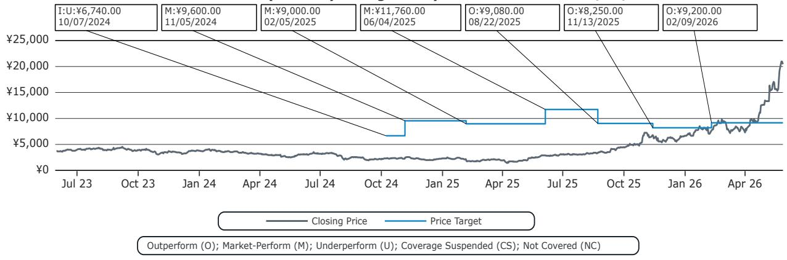

line

| Date       | Closing Price | Price Target |
| ---------- | ------------- | ------------ |
| 10/07/2024 | ¥6,740.00     | -            |
| 11/05/2024 | -             | ¥9,600.00    |
| 02/05/2025 | -             | ¥9,000.00    |
| 06/04/2025 | -             | ¥11,760.00   |
| 08/22/2025 | -             | ¥9,080.00    |
| 11/13/2025 | -             | ¥8,250.00    |
| 02/09/2026 | -             | ¥9,200.00    |

Ajinomoto Co Inc (2802.JP) Rating History for Bernstein as of 05/27/2026   
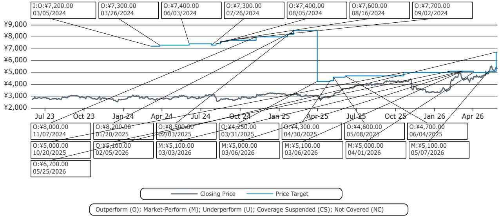

line

| Date       | Closing Price | Price Target |
|------------|---------------|--------------|
| 03/05/2024 | $7,200.00     | -            |
| 03/26/2024 | $7,300.00     | -            |
| 06/03/2024 | $7,400.00     | -            |
| 07/26/2024 | $7,300.00     | -            |
| 08/05/2024 | $7,400.00     | -            |
| 08/16/2024 | $7,600.00     | -            |
| 09/02/2024 | $7,700.00     | -            |
| 11/07/2024 | $8,000.00     | -            |
| 01/20/2025 | $8,200.00     | -            |
| 02/03/2025 | $8,500.00     | -            |
| 03/31/2025 | $4,250.00     | -            |
| 04/30/2025 | $4,300.00     | -            |
| 05/08/2025 | $4,600.00     | -            |
| 06/04/2025 | $4,700.00     | -            |
| 10/20/2025 | $5,000.00     | -            |
| 02/05/2026 | $5,100.00     | -            |
| 03/03/2026 | $5,100.00     | -            |
| 03/06/2026 | $5,000.00     | -            |
| 03/06/2026 | $5,100.00     | -            |
| 04/01/2026 | $5,000.00     | -            |
| 05/07/2026 | $5,100.00     | -            |
| 05/25/2026 | $6,700.00     | -            |

Unimicron Technology Corp (3037.TT) Rating History for Bernstein as of 05/27/2026   
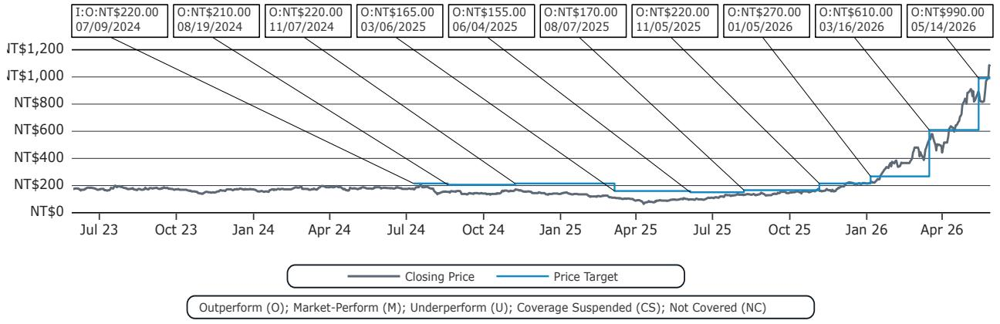

line

| Date       | Closing Price | Price Target |
| ---------- | ------------- | ------------ |
| 07/09/2024 | NT$220.00     | NT$220.00    |
| 08/19/2024 | NT$210.00     | NT$210.00    |
| 11/07/2024 | NT$220.00     | NT$220.00    |
| 03/06/2025 | NT$165.00     | NT$165.00    |
| 06/04/2025 | NT$155.00     | NT$155.00    |
| 08/07/2025 | NT$170.00     | NT$170.00    |
| 11/05/2025 | NT$220.00     | NT$220.00    |
| 01/05/2026 | NT$270.00     | NT$270.00    |
| 03/16/2026 | NT$610.00     | NT$610.00    |
| 05/14/2026 | NT$990.00     | NT$990.00    |

All price target and closing price data in the chart(s) above are denominated in the currency noted in the Ticker Table of this report.

# CONFLICTS OF INTEREST

SG and/or its affiliates beneficially own 1% or more of a class of common equity securities of the following company: Ibiden Co Ltd.

Bernstein and/or affiliates have received compensation for non-investment banking securities-related products or services in the previous twelve months from the following clients: Ajinomoto Co Inc.

# OTHER MATTERS

The legal entity(ies) employing the analyst(s) listed in this report, and their location, can be determined by the country code of their phone number, as follows:

+1 Bernstein Institutional Services LLC; New York, New York, USA   
+44 Bernstein Autonomous LLP; London UK   
+212 SG Africa Technologies & Services; Casablanca, Morocco   
+33 BSG France S.A.; Paris, France   
+34 BSG France S.A.; Madrid, Spain   
+41 Bernstein Autonomous LLP; Geneva, Switzerland   
+49 BSG France S.A.; Frankfurt, Germany   
+91 Bernstein (India) Private Limited; Mumbai, India   
+852 Bernstein (Hong Kong) Limited 盛博香港有限公司; Hong Kong, China   
+65 Bernstein (Singapore) Private Limited; Singapore   
+81 Bernstein Japan KK; Tokyo, Japan

Where this report has been prepared by research analyst(s) employed by a non-US affiliate, such analyst(s), is/are (unless otherwise expressly noted below) not registered as associated persons of Bernstein Institutional Services LLC or any other SEC-registered broker-dealer and are not licensed or qualified as research analysts with FINRA. Accordingly, such analyst(s) may not be subject to FINRA's restrictions regarding (among other things) communications by research analysts with a subject company, interactions between research analysts and investment banking personnel, participation by research analysts in solicitation and marketing activities relating to investment banking transactions, public appearances by research analysts, and trading securities held by a research analyst account.

Where this report has been prepared by research analyst(s) employed by SG Africa Technologies & Services (part of the SG group of companies), it has been prepared on behalf of a Bernstein company under a Global Services

Agreement in place between Bernstein and SG.

# CERTIFICATION

Each research analyst listed in this report, who is primarily responsible for the preparation of the content of this report, certifies that all of the views expressed in this publication accurately reflect that analyst's personal views about any and all of the subject securities or issuers and that no part of that analyst's compensation was, is, or will be, directly or indirectly, related to the specific recommendations or views in this publication.

# II. ADDITIONAL GLOBAL CONFLICT DISCLOSURES

It is at the sole discretion of the Firm as to when to initiate, update and cease research coverage. The Firm has established, maintains and relies on information barriers to control the flow of information contained in one or more areas (i.e., the private side) within the Firm, and into other areas, units, groups or affiliates (i.e., public side) of the Firm.

# III. OTHER IMPORTANT INFORMATION AND DISCLOSURES

Separate branding is maintained for “Bernstein” and “Autonomous” research products.

- Bernstein produces a number of different types of research products including, among others, fundamental analysis and quantitative analysis under both the “Autonomous” and “Bernstein” brands. Recommendations contained within one type of research product may differ from recommendations contained within other types of research products, whether as a result of differing time horizons, methodologies or otherwise. Furthermore, views or recommendations within a research product issued under one brand may differ from views or recommendations under the same type of research product issued under the other brand. The Research Ratings System for the two brands and other information related to those Rating Systems are included in the previous section.   
- Autonomous operates as a separate business unit within the following entities: Bernstein Institutional Services LLC, Bernstein Autonomous LLP, Bernstein (Hong Kong) Limited 盛博香港有限公司 and Bernstein (India) Private Limited. For information relating to “Autonomous” branded products (including certain Sales materials) please visit: www.autonomous.com. For information relating to Bernstein branded products please visit: www.bernsteinresearch.com.

Analysts are compensated based on aggregate contributions to the research franchise as measured by account penetration, productivity and proactivity of investment ideas. No analysts are compensated based on performance in, or contributions to, generating investment banking revenues.

This report has been produced by an independent analyst as defined in Article 3 (1)(34)(i) of EU 596/2014 Market Abuse Regulation (“MAR”) and the same article of MAR as it forms part of United Kingdom domestic law by virtue of the European Union (Withdrawal) Act 2018.

To our readers in the United States: Bernstein Institutional Services LLC, a broker-dealer registered with the U.S. Securities and Exchange Commission (“SEC”) and a member of the U.S. Financial Industry Regulatory Authority, Inc. (“FINRA”) is distributing this publication in the United States and accepts responsibility for its contents. Where this material contains an analysis of debt product(s), such material is intended only for institutional investors and is not subject to the US independence and disclosure standards applicable to debt research prepared for retail investors.

Bernstein Institutional Services LLC may act as principal for its own account or as agent for another person (including an affiliate) in sales or purchases of any security which is a subject of this report. This report does not purport to meet the objectives or needs of any specific individuals, entities or accounts.

To our readers in Canada: If this publication pertains to a Canadian domiciled company, it is being distributed in Canada by Bernstein (Canada) Limited, which is licensed and regulated by the Canadian Investment Regulatory Organization. If the publication pertains to a non-Canadian domiciled company, it is being distributed by Bernstein Institutional Services LLC, which is licensed and regulated by both the SEC and FINRA, into Canada under the International Dealers Exemption.

This document may not be passed onto any person in Canada unless that person qualifies as "permitted client" as defined in Section 1.1 of NI 31-103.

To our readers in Brazil: This report has been prepared by Bernstein Institutional Services LLC, and Banco BTG Pactual S.A. ("BTG") is responsible for the distribution of this report in Brazil.

To readers in the United Kingdom: This publication has been issued or approved for issue in the United Kingdom by Bernstein Autonomous LLP, authorised and regulated by the Financial Conduct Authority and located at 60 London Wall, London EC2M 5SH, +44 (0)20-7170-5000. Registered in England & Wales No OC343985.

This document is for distribution only to persons who (i) have professional experience in matters relating to investments falling within Article 19(5) of the Financial Services and Markets Act 2000 (Financial Promotion) Order 2005 (as amended, the “Financial Promotion Order”), (ii) are persons falling within Article 49(2)(a) to (d) (“high net worth companies, unincorporated associations, etc.”) of the Financial Promotion Order, (iii) are outside the United Kingdom, or (iv) are persons to whom an invitation or inducement to engage in investment activity (within the meaning of section 21 of the FSMA) in connection with the issue or sale of any securities may otherwise lawfully be communicated or caused to be communicated (all such persons together being referred to as “relevant persons”). This document is directed only at relevant persons and must not be acted on or relied on by persons who are not relevant persons. Any investment or investment activity to which this document relates is available only to relevant persons and will be engaged in only with relevant persons.

To our readers in the member states of the EEA: This publication is being distributed by BSG France SA, which is authorised and regulated by the Autorité de Contrôle Prudentiel et de Résolution (ACPR) and Autorité des Marchés Financiers (AMF).

To our readers in Hong Kong: This publication is being distributed in Hong Kong by Bernstein (Hong Kong) Limited 盛博香港有限公司, which is licensed and regulated by the Hong Kong Securities and Futures Commission (Central Entity No. AXC846) to carry out Type 4 (Advising on Securities) regulated activities and subject to the licensing conditions mentioned in the SFC Public Register (https://www.sfc.hk/publicregWeb/corp/AXC846/details)). This publication is solely for professional investors, as defined in the Securities and Futures Ordinance (Cap. 571). The purpose of this report is solely to provide an analysis of the issuers referred to in this report and is not intended for any purpose contrary to the laws of Hong Kong.

To our readers in Singapore: This publication is being distributed in Singapore by Bernstein (Singapore) Private Limited, only to accredited investors or institutional investors, as defined in the Securities and Futures Act 2001 of Singapore ("SFA"). Recipients in Singapore should contact Bernstein (Singapore) Private Limited in respect of matters arising from, or in connection with, this publication. Bernstein (Singapore) Private Limited is regulated by the Monetary Authority of Singapore and licensed under the SFA as a capital markets services licence holder for dealing in capital markets products that are securities and collective investment schemes and an exempt financial adviser for advising on, issuing and promulgating analyses and reports on securities. Bernstein (Singapore) Private Limited is registered in Singapore with Company Registration No. 20213710W and located at One Raffles Quay, #27-11 South Tower, Singapore 048583, +65-6230-4612.

To our readers in the People's Republic of China: The securities referred to in this document are not being offered or sold and may not be offered or sold, directly or indirectly, in the People's Republic of China (for such purposes, not including the Hong Kong and Macau Special Administrative Regions or Taiwan, the “PRC”) in contravention of any applicable laws of the PRC.

This document does not constitute an offer to sell or the solicitation of an offer to buy any securities in the PRC to any person to whom it is unlawful to make the offer or solicitation in the PRC.

We do not represent that this document may be lawfully distributed, or that any securities may be lawfully offered, in compliance with any applicable registration or other requirements in the PRC, or pursuant to an exemption available thereunder, or assume any responsibility for facilitating any such distribution or offering. In particular, no action has been taken by us which would permit a public offering of any securities or distribution of this document in the PRC. Accordingly, the securities are not being offered or sold within the PRC by means of this document or any other document. Neither this document nor any advertisement or other offering material may be distributed or published in the PRC, except under circumstances that will result in compliance with any applicable laws and regulations.

To our readers in Japan: This publication is being distributed in Japan by Bernstein Japan KK (サンフォード・C・バーンスタイン株式会社), which is registered in Japan as a Financial Instruments Business Operator with the Kanto Local Finance Bureau (registration number: The Director-General of Kanto Local Finance Bureau (FIBO) No.3387) and regulated by the Financial Services Agency. It is also a member of Japan Investment Advisers Association. This publication is solely for qualified institutional investors in Japan only, as defined in Article 2, paragraph (3), items (i) of the Financial Instruments and Exchange Act.

For the institutional client readers in Japan who have been granted access to the Bernstein website by Daiwa Group Inc. ("Daiwa"), your access to this document should not be construed as meaning that Bernstein is providing you with investment advice for any purposes. Whilst Bernstein has prepared this document, your relationship is, and will remain with, Daiwa, and Bernstein has neither any contractual relationship with you nor any obligations towards you.

To our readers in Australia: Bernstein (Hong Kong) Limited 盛博香港有限公司 is responsible for distributing research in Australia. It is regulated by the Securities and Exchange Commission under U.S. laws, by the Financial Conduct Authority under U.K. laws, which differs from Australian laws. Bernstein (Hong Kong) Limited 盛博香港有限公司 is exempt from the requirement to hold an Australian financial services license under the Corporations Act 2001 in respect of the provision of the

following financial services to wholesale clients:

• providing financial product advice;   
• dealing in a financial product;   
• making a market for a financial product; and   
• providing a custodial or depository service.

To our readers in India: This publication is being distributed in India by Bernstein (India) Private Limited (SCB India) which is licensed and regulated by Securities and Exchange Board of India ("SEBI") as a research analyst entity under the SEBI (Research Analyst) Regulations, 2014, having registration no. INH000006378 and as a stock broker having registration no. INZ000213537. SCB India is currently engaged in the business of providing research and stock broking services. Please refer to www.bernsteinresearch.in for more information.

\- SCB India is a Private limited company incorporated under the Companies Act, 2013, on April 12, 2017 bearing corporate identification number U65999MH2017FTC293762, and registered office at Level 3A, 4th Floor, First International Financial Centre, Plot Nos C-54 and C-55, G Block, Near CBI Office, Bandra Kurla Complex, Bandra (East), Mumbai 400098, Maharashtra, India (Phone No: +91-22-68421401).

\- For details of Associates (i.e., affiliates/group companies) of SCB India, kindly email MUM-BERNSTEIN-InCompliance@bernsteinsg.com.

• SCB India does not have any disciplinary history as on the date of this report.

\- Except as noted above, SCB India and/or its Associates (i.e., affiliates/group companies), the Research Analysts authoring this report, and their relatives

• do not have any financial interest in the subject company   
• do not have actual/beneficial ownership of one percent or more in securities of the subject company;   
• is not engaged in any investment banking activities for Indian companies, as such;   
• have not managed or co-managed a public offering in the past twelve months for any Indian companies;   
- have not received any compensation for investment banking services or merchant banking services from the subject company in the past 12 months;   
• have not received compensation for brokerage services from the subject company in the past twelve months;   
- have not received any compensation or other benefits from the subject company or third party related to the specific recommendations or views in this report; and   
- do not currently, but may in the future, act as a market maker in the financial instruments of the companies covered in the report.   
- do not have any conflict of interest in the subject company as of the date of this report.

\- Except as noted above, the subject company has not been a client of SCB India during twelve months preceding the date of distribution of this research report. Neither SCB India nor its Associates (i.e., affiliates/group companies) have received compensation for products or services other than investment banking, merchant banking or brokerage services from the subject company in the past twelve months.

\- The principal research analyst(s) who prepared this report, members of the analysts' team, and members of their households are not an officer, director, employee or advisory board member of the companies covered in the report.

- Our Compliance officer / Grievance officer is Ms. Rupal Talati, who can be reached at +91-22-68421451, or MUM-BERNSTEIN-InCompliance@bernsteinsg.com / Scbin-investorgrievance@bernsteinsg.com   
- The Research investor charter and Terms & Conditions of SCB India are available on its website and may be accessed at Bernstein (India) Private Limited (https://bernsteinresearch.in/) for your reference.   
- Disclaimer: Registration granted by SEBI, and certification from NISM, is in no way a guarantee of performance of the intermediary or provide any assurance of returns to investors. Investments in securities market are subject to market risks. Read all the related documents carefully before investing.

To our readers in Switzerland: This document is provided in Switzerland by or through Bernstein Autonomous LLP, and is provided only to qualified investors as defined in article 10 of the Swiss Collective Investment Scheme Act (“CISA”) and related provisions of the Collective Investment Scheme Ordinance and in strict compliance with applicable Swiss law and regulations. The products mentioned in this document may not be suitable for all types of investors. This document is based on the Directives on the Independence of Financial Research issued by the Swiss Bankers Association (SBA) in January 2008.

To our readers in the Middle East: Bernstein Autonomous LLP, DIFC branch has its principal office at Gate Village 06, DIFC, Dubai, UAE. Bernstein Autonomous LLP, DIFC branch is regulated by the Dubai Financial Services Authority (DFSA) with the registration number CL10040 and is provisioned for Arranging Deals in Investments and Advising on Financial Products. All communications and services are directed at Professional Clients and Market Counterparties only (as defined in the DFSA rulebook). Persons other than Professional Clients and Market Counterparties, such as Retail Clients, are not the intended recipients of our communications or services.

# LEGAL

All research publications are disseminated to our clients through posting on the firm's password protected websites, bernsteinresearch.com and autonomous.com. Certain, but not all, research publications are also made available to clients through third-party vendors or redistributed to clients through alternate electronic means as a convenience.

This publication has been published and distributed in accordance with the Firm's policy for management of conflicts of interest in investment research, a copy of which is available from Bernstein Institutional Services LLC, Director of Compliance, 245 Park Avenue, New York, NY 10167. Additional disclosures and information regarding Bernstein's business are available on our website www.bernsteinresearch.com.

The securities described herein may not be eligible for sale in all jurisdictions or to certain categories of investors where that permission profile is not consistent with the licenses held by the entities noted herein. This document is for distribution only as may be permitted by law. This publication is not directed to, or intended for distribution to or use by, any person or entity who is a citizen or resident of, or located in any locality, state, country or other jurisdiction where such distribution, publication, availability or use would be contrary to law or regulation or which would subject any of the entities referenced herein or any of their subsidiaries or affiliates to any registration or licensing requirement within such jurisdiction. This publication is based upon public sources we believe to be reliable, but no representation is made by us that the publication is accurate or complete. We do not undertake to advise you of any change in the reported information or in the opinions herein. This publication was prepared and issued by entity referred to herein for distribution to eligible counterparties or professional clients. This publication is not an offer to buy or sell any security, and it does not constitute investment, legal or tax advice. The investments referred to herein may not be suitable for you. Investors must make their own investment decisions in consultation with their professional advisors in light of their specific circumstances. The value of investments may fluctuate, and investments that are denominated in foreign currencies may fluctuate in value as a result of exposure to exchange rate movements. Information about past performance of an investment is not necessarily a guide to, indicator of, or assurance of, future performance.

This report is directed to and intended only for our clients who are “eligible counterparties”, “professional clients”, “institutional investors” and/or “professional investors” as defined by the aforementioned regulators, and must not be redistributed to retail clients as defined by the aforementioned regulators. Retail clients who receive this report should note that the services of the entities noted herein are not available to them and should not rely on the material herein to make an investment decision. The result of such act will not hold the entities noted herein liable for any loss thus incurred as the entities noted herein are not registered/authorised/licensed to deal with retail clients and will not enter into any contractual agreement/arrangement with retail clients. This report is provided subject to the terms and conditions of any agreement that the clients may have entered into with the entities noted herein. All research reports are disseminated on a simultaneous basis to eligible clients through electronic publication to our client portal.

The information in this report was prepared by Bernstein solely for the internal business use of our clients. Clients may store, display, analyze, reformat and print the information in this report for this limited use only. Clients may not copy, alter, create derivative works, resell, reverse engineer, commercially exploit, share or distribute any part of the information contained herein for any purpose without Bernstein's express written consent. These restrictions include extracting data or using the content to develop indices or other products. Further, you may not use this report, or any portion of this report, to train or finetune any third-party machine learning or artificial intelligence system, or as a prompt or input into any such system. You also may not, without Bernstein's express written consent, do any of the foregoing in connection with your own internal machine learning or artificial intelligence system.

Bernstein may use artificial intelligence tools in the preparation of its materials. Any such materials are reviewed by Bernstein's research analysts prior to publication.

This report has been prepared for information purposes only and is based on current public information that we consider reliable, but the entities noted herein do not warrant or represent (express or implied) as to the sources of information or data contained herein are accurate, complete, not misleading or as to its fitness for the purpose intended even though the entities noted herein rely on reputable or trustworthy data providers, it should not be relied upon as such. Opinions expressed are the author(s)' current opinions as of the date appearing on the material only and we do not undertake to advise you of any change in the reported information or in the opinions herein.

This publication was prepared and issued by the entity referred to herein for distribution to eligible counterparties or professional clients. The information in this report is intended for general circulation and does not constitute an offer to buy or sell any security, investment, legal or tax advice nor a personal recommendation, as defined by any of the aforementioned regulators. It does not take into account the particular investment objectives, financial situations, or needs of individual investors. The report has not been reviewed by any of the aforementioned regulators and does not represent any official recommendation from the aforementioned regulators. The investments referred to herein may not be suitable for you. Investors must make their own investment decisions in consultation with advice sought from a financial adviser regarding the suitability of the investment product, taking into account the specific investment objectives, financial situation or particular needs of any recipient of the recommendation, before the recipient makes a commitment to purchase the investment product.

The analysis contained herein is based on numerous assumptions. Different assumptions could result in materially different results. The information in this report does not constitute, or form part of, any offer to sell or issue, or any offer to purchase or subscribe for shares, or to induce engage in any other investment activity. The value of any securities or financial instruments mentioned in this report may fluctuate subject to market conditions. Information about past performance of an investment is not necessarily a guide to, indicative of, or assurance of future performance. Estimates of future performance mentioned by the research analyst in this report are based on assumptions that may not be realized due to unforeseen factors like market volatility/fluctuation. In relation to securities or financial instruments denominated in a foreign currency other than the clients' home currency, movements in exchange rates will have an effect on the value, either favorable or unfavorable. Before acting on any recommendations in this report, recipients should consider the appropriateness of investing in the subject securities or financial instruments mentioned in this report and, if necessary, seek for independent professional advice.

The securities described herein may not be eligible for sale in all jurisdictions or to certain categories of investors where that permission profile is not consistent with the licenses held by the entities noted herein. This document is for distribution only as may be permitted by law. It is not directed to, or intended for distribution to or use by, any person or entity who is a citizen or resident of or located in any locality, state, country or other jurisdiction where such distribution, publication, availability or use would be contrary to law or regulation or would subject the entities noted herein to any regulation or licensing requirement within such jurisdiction.

Source: Bloomberg Index Services Limited. BLOOMBERG® is a trademark and service mark of Bloomberg Finance L.P. and its affiliates (collectively “Bloomberg”). Bloomberg or Bloomberg’s licensors own all proprietary rights in the Bloomberg Indices. Neither Bloomberg nor Bloomberg’s licensors approves or endorses this material, or guarantees the accuracy or completeness of any information herein, or makes any warranty, express or implied, as to the results to be obtained therefrom and, to the maximum extent allowed by law, neither shall have any liability or responsibility for injury or damages arising in connection therewith.

No part of this material may be reproduced, distributed or transmitted or otherwise made available without prior consent of the entities noted herein. Copyright Bernstein Institutional Services LLC Bernstein Autonomous LLP, BSG France S.A., Bernstein (Hong Kong) Limited 盛博香港有限公司, Bernstein (Canada) Limited, Bernstein (India) Private Limited (SEBI registration no. INH000006378), Bernstein (Singapore) Private Limited and Bernstein Japan KK (サンフォード・C・バーンスタイン株式会社). All rights reserved. The trademarks and service marks contained herein are the property of their respective owners. Any unauthorized use or disclosure is strictly prohibited. The entities noted herein may pursue legal action if the unauthorized use results in any defamation and/or reputational risk to the entities noted herein and research published under the Bernstein and Autonomous brands.