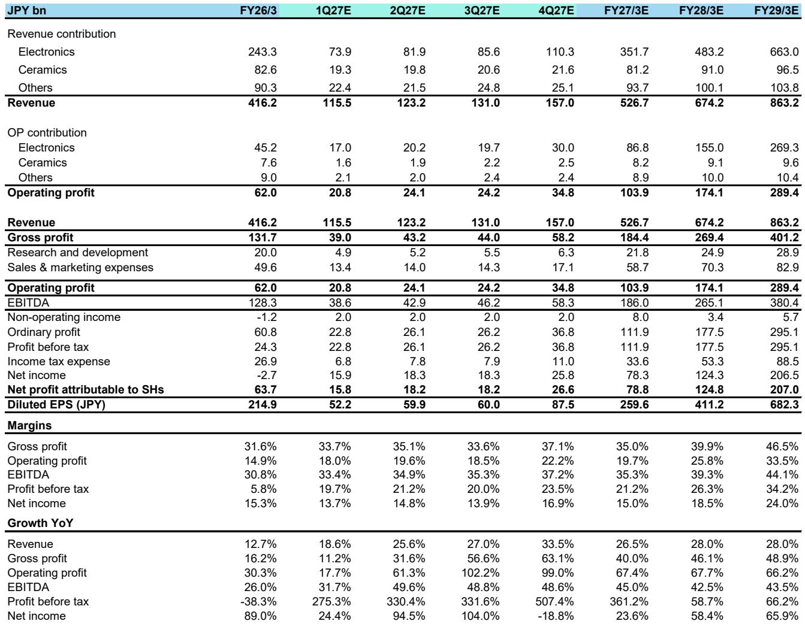
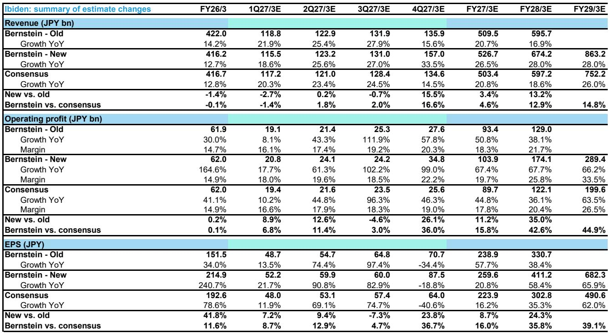

# ABF 基板短缺不是周期故事，而是AI算力架构重构的结构性拐点

市场对ABF基板的认知仍停留在“周期品”框架里——2023年需求下滑15%，2024年回暖25%，2025年增长18%，看起来像是半导体库存周期的又一次波动。但这份投行研报揭示了一个根本不同的图景：ABF基板正在从CPU的“封装耗材”变成AI算力扩张的“刚性约束”。真正重要的不是2025年供需缺口有多大，而是2027年之后供给将系统性落后于需求，且这一缺口无法通过简单的产能扩张来弥补。

报告的核心判断是：ABF市场将在2027年进入全面短缺状态，行业利用率从2025年的80-85%快速攀升至100%以上，且短缺在2028年将进一步加剧。这不是一个“如果”的问题，而是一个“何时”的问题。需求端以22%的CAGR增长，供给端只有12%——这个差距本身就是结论。

对于持有Ibiden、Unimicron或Ajinomoto的投资者，或者正在评估AI基础设施供应链风险的产业决策者，这份报告提供了一个关键的分析框架：短缺不是风险，而是定价权的再分配。

## 1. CPU的“文艺复兴”才是ABF需求爆发的真正推手，GPU只是锦上添花

市场习惯把ABF需求增长归因于AI GPU的爆发，但报告揭示了一个更底层的结构性变化：服务器CPU正在经历一场“文艺复兴”，而这才是ABF需求的核心驱动力。

报告预计，到2030年服务器CPU市场规模将从2025年的330亿美元增长至1370亿美元，对应34%的年复合增长率。驱动因素不是传统的服务器换机周期，而是agentic AI的崛起——AI不再只是GPU加速的计算任务，而是需要CPU处理海量推理调度和智能体协作的复杂系统。报告引用了对SoftBank和Arm的独立分析，认为服务器CPU出货量将在2026-2030年间扩张约4倍。

这对ABF基板的意义在于：服务器CPU贡献了约40%的ABF需求，是最大的单一终端市场。而且，CPU对ABF的需求不仅来自数量增长，更来自单颗芯片面积的持续扩大。以Intel为例，从Granite Rapids到Diamond Rapids，基板面积扩大了36%；AMD从SP5到SP7也增长了12%。Arm架构的AWS Graviton系列更极端：5代产品核心数从16个增加到192个，增长了12倍。

这意味着，即使GPU/ASIC的ABF需求增速放缓（报告预计33%的CAGR），仅CPU端就能支撑ABF市场22%的整体增长。而GPU/ASIC的贡献是额外的增量——报告预计Nvidia AI GPU的ABF TAM在FY29/3E将达到28.72亿美元，是FY26/3E的2.9倍。

So what：市场对ABF的叙事过度集中在“GPU封装”上，低估了CPU架构升级带来的结构性需求。当CPU和GPU同时进入扩产周期，ABF的供需失衡将比任何单一终端市场预测的都要严重。

## 2. 供给端产能扩张远远不够，12%的供给CAGR无法追上22%的需求CAGR

供给端的故事并不复杂，但结论令人不安。报告预测2025-2028年ABF行业供给的年复合增长率仅为12%，而需求是22%。这个差距意味着，即使所有主要供应商都在积极扩产，供给缺口也只会越来越大。

具体来看，Ibiden和Unimicron是扩产最积极的厂商，背后有客户预付款的支持。但即便它们把产能拉到极限，行业利用率仍将在2027年突破100%。报告没有详细披露每个厂商的产能规划数字，但供需模型显示：2025年行业利用率在80-85%的合理区间，2026年将接近满产，2027年正式进入短缺。

这里有一个值得深挖的细节：报告认为当前的供给预测可能仍然偏保守，因为它没有完全计入更大、更复杂基板带来的良率损失。随着CPU和GPU基板面积持续扩大，良率下降是必然的——这意味着有效供给的增长可能低于名义产能增长。换句话说，12%的供给CAGR可能已经是乐观情形。

So what：投资者需要重新审视ABF基板厂商的产能扩张计划。如果2027年短缺是确定性的，那么现在市场对供给端的定价可能过于乐观——扩产速度越快、客户绑定越深的厂商，反而可能因为供给缺口而获得更大的定价权。

## 3. 2027年短缺是确定的，但市场对“短缺定价”的幅度和持续性仍然低估

报告的核心预测是：ABF市场将在2027年进入行业性短缺，且短缺在2028年进一步恶化。这不是一个模糊的方向性判断，而是一个有时间表、有量化支撑的结论。

但真正有趣的问题不是“会不会短缺”，而是“短缺会带来什么”。报告对Ibiden的盈利预测已经体现了价格上调的假设：在FY27/3E-FY29/3E期间，分别假设了4%、6%、12%的价格提升。但报告也明确指出，这些假设“很大程度上反映了产品组合的改善，而非直接的价格上涨”。换言之，如果短缺真的发生，ASP的上行空间可能远超当前预测。

对于Unimicron，报告估计ABF基板ASP将从2026年一季度的环比增长5%，加速至2026年全年的7-10%环比增长，驱动因素包括约30%的原材料成本上涨和高阶ABF产品占比提升。但报告也承认，利润率恢复将比市场预期更温和——Unimicron的公司毛利率要到2028年底才能达到约35%。

这里有一个关键的矛盾：市场可能已经在定价“短缺”，但尚未定价“短缺的持续性”。如果2027-2028年短缺持续，且供给端无法快速响应，那么价格上行可能不是一次性的，而是持续多个季度的趋势。报告对Ibiden的目标价从之前的9200日元大幅上调至23900日元，估值倍数从30倍提升至35倍，正是基于这种持续性的判断。

So what：对投资者而言，关键问题不是“短缺是否会发生”，而是“当前股价已经反映了多少短缺溢价”。报告认为Ibiden仍有上行空间，但也承认当前估值较高——这暗示市场可能已经部分定价了短缺，但尚未充分定价短缺的持续性和幅度。

## 4. 报告尚未完全回答的关键问题：短缺的“二阶效应”可能比短缺本身更重要

这份报告在供需模型上做得非常扎实，但有几个关键问题尚未完全展开，而这恰恰是投资者最需要关注的风险和机会。

第一个未解问题是：短缺是否会倒逼技术路线切换？如果ABF基板供给不足，芯片设计公司是否会转向其他封装方案？报告没有讨论这个可能性，但历史上任何关键材料的短缺都会催生替代方案。例如，玻璃基板、嵌入式桥接等新技术是否会加速落地？如果替代方案出现，ABF基板的长期需求曲线可能会被重塑。

第二个未解问题是：客户预付款是否真的能锁定产能？报告提到Ibiden和Unimicron有客户预付款支持，但预付款的规模和条款并未披露。如果短缺加剧，客户之间的“抢产能”竞争是否会推高预付款门槛，进而改变行业竞争格局？这可能导致小型或无预付款客户的产能被挤压，形成“赢家通吃”的局面。

第三个未解问题是：Ajinomoto的ABF薄膜产能是否真的不是瓶颈？报告认为Ajinomoto通过岐阜工厂扩张和延长运营时间可以满足需求，但2032年的新工厂投产时间表与2027-2028年的短缺窗口之间存在明显的时间错配。如果Ajinomoto无法在2027年前大幅提升薄膜产能，ABF基板厂商可能面临“有产能、无材料”的尴尬局面。

So what：投资者需要关注的不仅是供需缺口本身，更是缺口可能引发的产业连锁反应。技术替代、客户锁定、材料瓶颈——这些二阶效应可能比短缺本身更能决定长期赢家。

## 5. 一个观察框架：从“产能利用率”到“定价权结构”的视角转换

基于这份报告，我们可以搭建一个更系统的观察框架，帮助读者在后续跟踪中抓住关键信号。

第一层：产能利用率是先行指标。报告给出了明确的阈值：80-85%是正常区间，超过100%意味着短缺。投资者应密切关注每个季度的行业产能利用率数据，尤其是Ibiden和Unimicron的工厂利用率报告。如果利用率提前突破100%，短缺时间表将比预期更早。

第二层：ASP是核心验证变量。报告对Ibiden的假设是4-12%的价格提升，但这是否足够？如果短缺兑现，ASP的涨幅可能会远超预期。关键信号是：客户是否接受长期涨价合同？预付款条款是否变得更加苛刻？如果客户愿意接受更高的价格和更长的锁定期，说明短缺的严重程度超出了市场预期。

第三层：材料瓶颈是潜在风险。Ajinomoto的薄膜产能扩张计划是2027年短缺能否缓解的关键变量。如果Ajinomoto的产能扩张延迟，或者良率出现问题，ABF基板厂商将面临“无米下锅”的局面。投资者需要跟踪Ajinomoto的产能建设进度和薄膜价格走势。

第四层：技术替代是长期风险。虽然短期内ABF基板没有成熟的替代方案，但短缺持续的时间越长，替代技术获得投资和关注的机会就越大。投资者应关注玻璃基板、有机基板等替代路线的技术进展和客户导入情况。

这些信号构成了一个完整的观察框架：产能利用率告诉你“何时短缺”，ASP告诉你“短缺有多严重”，材料瓶颈告诉你“短缺能否持续”，技术替代告诉你“短缺是否会被终结”。四个维度缺一不可。

---

这份报告揭示了一个清晰的逻辑链条：AI从生成式向代理式的演进，正在重构整个计算架构的需求结构。CPU不再是配角，GPU也不再是唯一的主角。ABF基板作为两者的共同“基础设施”，正在从一个周期性耗材变成一个结构性稀缺资源。

但报告也留下了几个关键的未解追问：短缺是否会催生替代技术？客户预付款能否真正锁定产能？Ajinomoto的薄膜供给是否真的可靠？这些问题无法在一份报告中得到完全回答，它们需要持续跟踪和深入讨论。

欢迎来星球微信群里继续讨论这些未解问题。我们会在群内分享更多关于ABF供需模型的细节数据、主要厂商的产能规划对比，以及对短缺时间表的实时跟踪。如果你对这份报告的完整版感兴趣，或者想进一步探讨Ibiden、Unimicron和Ajinomoto的投资逻辑，群里会有更深入的交流。

Personal reading notes and learning share only. Not investment advice.

