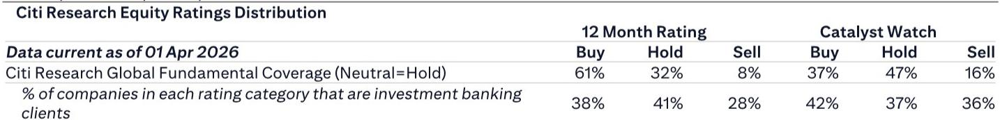

# 软件投资的下一个分水岭：不是AI能否落地，而是谁在真正提升AI的ROI

5月28日凌晨，Salesforce和Snowflake几乎同时发布了最新季度财报。市场的反应截然相反：Salesforce盘后下跌近1%，而Snowflake飙升36%。同一时间，Uber的CTO公开表示，公司已暂停部分AI工具的内部使用，理由是“当前的效率提升无法证明成本投入是合理的”。

这三个信号放在一起，指向同一个判断：AI软件投资已经走过了“讲故事”的阶段，进入了“算ROI”的阶段。而真正决定哪些公司能够胜出的，不是它们是否拥抱AI，而是它们能否让自己的产品成为提升AI ROI的关键基础设施。

这份来自某外资投行的研报，核心价值不在于复述Salesforce和Snowflake的财务数据，而在于它提供了一个分析框架：AI对软件行业的替代效应是有选择性的，被替代的将主要是可视化工具等浅层应用，而数据库和记录系统（SoR）这类为AI提供上下文的基础设施，不仅不会被替代，反而会因为AI的普及而变得更加重要。

这个框架的意义不仅在于理解当前的市场波动，更在于重新定义投资者评估软件公司的核心维度。

## 1. 市场反应的巨大反差，揭示的是“预期管理”而非“基本面分化”

Salesforce第一季度营收和每股收益均超出市场共识，但其第二季度指引中，营收预期仅与市场预期持平，每股收益略高于共识。市场给出的反应是股价基本持平。Snowflake则不同，第一季度业绩和第二季度营收指引双双超出预期，盘后股价飙升36%。

表面上，这是业绩兑现程度的差异。但更深层的含义在于：市场对这两家公司的定价逻辑已经发生了根本性变化。

Salesforce作为传统SaaS的代表，其增长故事已经被市场充分定价。即便业绩略超预期，只要没有出现“超预期加速”的信号，股价就难以获得正向催化。而Snowflake之所以能获得如此剧烈的正向反应，是因为市场正在重新评估它的角色——它不再仅仅是一个云数据仓库，而是一个AI数据基础设施提供商。Snowflake在财报电话会上宣布与OpenAI达成2亿美元的合作协议，这个信息比财务数字本身更能驱动估值重估。

这意味着，对于软件类资产，投资者需要区分两类公司：一类是被市场视为“AI的受益者”，另一类是被视为“AI的替代对象”。前者即使业绩稍好，市场也可能无动于衷；后者只要给出一个“AI战略正在奏效”的信号，估值就能获得显著提升。

## 2. 数据库和记录系统正在成为AI ROI的“放大器”，而非“被替代者”

Uber暂停部分AI工具使用的案例，提供了一个重要的反面教材。Uber的CTO指出，当前基于token消耗的AI按使用量付费模式，成本容易失控，而生产力提升尚未达到可以覆盖成本的水平。

Snowflake在财报电话会上恰恰回应了这个问题。它提出的解决方案是：不同的AI任务应该使用不同规模的模型。例如，会议纪要摘要使用法国Mistral的小模型就足够了，完全不需要动用Claude的Opus。Snowflake已经将这种“任务-模型匹配”的能力内置到其工具中。

这个案例揭示了一个关键洞察：AI ROI的提升，核心不在于模型本身有多强大，而在于能否为模型提供清晰的背景和指令。而数据库恰恰承担的就是这个角色——它为AI提供结构化的数据上下文，让模型能够更精准地理解问题、更高效地输出结果。

从这个角度看，数据库和记录系统不仅不会被AI替代，反而会成为AI应用落地过程中不可或缺的基础设施。研报的判断是：AI对软件的替代是选择性的，KPI可视化工具这类浅层应用确实面临被替代的风险，但提供核心数据库的SoR和DB工具不会。

这意味着，投资者在筛选软件标的时，需要重点判断一家公司的产品在AI工作流中处于什么位置。如果它只是提供UI层面的功能，被替代的风险较高；如果它提供的是数据层的能力，那么它反而可能因为AI的普及而获得更强的需求。

## 3. 软件投资的核心问题正在从“是否采用AI”转向“AI的ROI如何衡量”

研报中有一个重要的表述：目前实际上无法衡量AI带来的ROI，因为部署仍处于早期阶段。但正是这种“无法衡量”的状态，反而让市场对那些能够帮助客户衡量和提升AI ROI的公司给予了更高的溢价。

Salesforce提到，Anthropic对其产品的使用量增长了5倍。这个数据本身的意义不在于收入贡献，而在于它证明了一个趋势：即便是最前沿的AI公司，也需要借助现有的软件基础设施来构建自己的应用。Salesforce的CRM系统为AI提供了客户交互的历史数据，这些数据是训练和优化AI模型的重要输入。

Snowflake的逻辑更为直接：它的数据库产品本身就是AI工作流中的核心环节。AI需要数据来训练，需要数据来生成上下文，需要数据来验证输出结果。没有数据库，AI的价值链条就断裂了。

因此，市场对Snowflake的积极反应，本质上是对“AI基础设施”类资产的重新定价。而Salesforce虽然也有AI故事，但其核心产品CRM系统的不可替代性相对较弱，市场对其AI赋能的预期已经部分体现在估值中，缺少新的催化。

## 4. 报告尚未完全回答的关键问题：AI ROI的“可测量性”何时能够建立

研报提供了一个清晰的分析框架，但有一个关键问题尚未完全展开：AI ROI的衡量标准本身，目前仍然是一个黑箱。

Uber暂停AI工具，是因为它认为ROI不成立。Snowflake认为自己的工具能够提升ROI。但这两家公司衡量ROI的方法论可能完全不同。Uber可能更关注直接的工时节省，而Snowflake可能关注的是模型输出质量的提升。

这种衡量标准的不统一，意味着当前市场对AI软件公司的定价带有较大的主观性。如果市场暂时无法区分“真正提升ROI”和“声称能提升ROI”，那么估值分化可能更多反映的是市场情绪和预期管理能力，而非基本面的真实差异。

这恰恰是投资者需要持续跟踪的核心变量。未来6到12个月，如果出现更多类似Uber这样“暂停AI投入”的案例，市场对AI软件板块的定价逻辑可能会发生逆转。反之，如果Snowflake这类公司能够持续证明其产品对客户AI ROI的正面影响，那么数据基础设施类资产的估值中枢可能会系统性上移。

## 5. 投资者的观察框架：从“谁在说AI”转向“谁在帮客户算AI的账”

基于上述分析，评估软件公司时，传统的收入增速、客户增长等指标可能已经不够。需要引入一个新的维度：这家公司是否在帮助客户解决AI ROI的可测量性问题？

具体来说，可以关注三个信号：

第一，公司的产品是否直接参与AI工作流中的数据层。如果一家公司的产品只是提供前端展示或简单分析功能，它被替代的风险较高。如果它提供的是数据存储、数据治理或数据上下文生成能力，它的护城河可能反而因AI而加深。

第二，公司是否在财报电话会或投资者交流中，主动讨论客户如何衡量AI的投入产出。目前大多数公司还在讲“我们有多少AI客户”的故事，但真正值得关注的，是那些开始讨论“客户如何计算AI成本与收益”的公司。后者往往意味着它们已经进入了客户的决策核心。

第三，公司与AI模型提供商的关系是“被集成”还是“被替代”。Snowflake与OpenAI的2亿美元合作，Salesforce与Anthropic的5倍使用增长，都是正向信号。而那些被AI模型直接替代功能的产品，则需要高度警惕。

## 顺着这些未解问题继续思考

这篇研报最有价值的贡献，不是给出了Salesforce和Snowflake的财务对比，而是提出了一个判断框架：AI对软件的替代是选择性的，数据基础设施类资产将受益而非受损。但这个框架的成立，依赖于一个尚未被充分验证的前提——AI ROI的可测量性正在被建立，且数据库产品能够被客户认可为提升ROI的关键工具。

这个前提是否成立，将直接影响未来12个月日本IT服务板块乃至全球软件板块的资产定价逻辑。研报中提到的“AI和ROI”部分，其实已经触及了这个问题，但受限于篇幅，没有进一步展开不同行业、不同规模客户在衡量AI ROI时的差异。这些差异可能恰恰是决定哪些公司能够真正受益的关键变量。

欢迎来星球微信群里继续讨论。我们会在群里分享这份研报的完整原文，以及围绕AI ROI衡量标准展开的进一步分析——包括Uber暂停AI工具的完整背景、Snowflake与OpenAI合作的具体条款细节，以及日本IT服务板块中哪些公司最有可能在这一轮分化中受益。

Personal reading notes and learning share only. Not investment advice.

