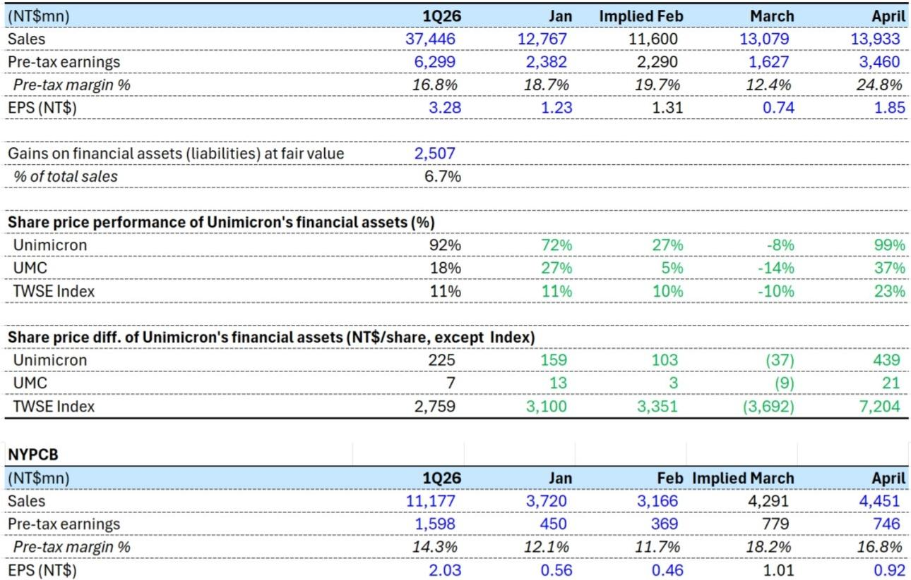
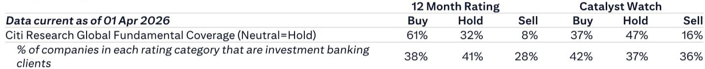
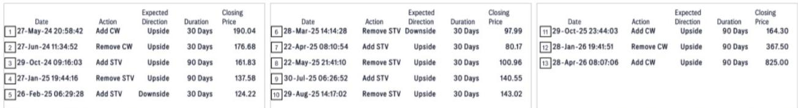

# The ABF Upcycle Has Not Priced In What April's Audited Earnings Actually Reveal

The April earnings data from Taiwan's two dominant ABF substrate manufacturers appear to confirm the bull case at first glance. Unimicron posted an audited April EPS of NT$1.85, easily beating consensus. NYPCB delivered NT$0.92, roughly in line with expectations. For investors tracking the ABF upcycle narrative, these numbers look like confirmation that pricing power is returning and that the structural demand story remains intact. But a careful reading of the monthly data reveals a more complicated picture, one that challenges the straightforward bullish interpretation and raises questions about timing, earnings quality, and the real drivers of margin improvement.

The critical insight from the April data is that the headline EPS numbers obscure two very different profit stories. Unimicron's apparent earnings beat was heavily influenced by non-operating gains from financial asset holdings, not from core substrate operations. NYPCB's stable pre-tax margin, meanwhile, suggests that the much-anticipated price hike benefits have not yet fully materialized in the income statement. The market is right to be optimistic about the ABF cycle, but it may be wrong about when and how that optimism should translate into earnings expectations.

This distinction matters because the ABF substrate cycle is not a simple demand-driven recovery. It is a complex interplay of capacity additions, pricing negotiations, customer mix shifts, and financial engineering. Investors who treat the April EPS beat as a clean signal of operational momentum risk misallocating capital at a critical inflection point. The real question is not whether the upcycle is happening, but whether current valuations already discount the full cycle benefit, and whether the earnings path to those benefits is more nonlinear than consensus expects.

## Unimicron's April Earnings Beat Is Largely a Financial Artifact, Not an Operational Signal

Unimicron's April pre-tax margin of 24.8% looks extraordinary compared to the 12.4% recorded in March and the 16.8% average for the first quarter. A superficial reading would suggest a dramatic operational inflection. But the data tells a different story. The company's gains on financial assets at fair value in the first quarter alone amounted to NT$2.5 billion, representing 6.7% of total sales. Given the extraordinary performance of the TWSE Index in April, and Unimicron's significant indirect holdings in its own stock, UMC, and other technology names, the April non-operating gains were almost certainly substantial.

The share price data in the report is revealing. Unimicron's own stock rose 99% in April, UMC gained 37%, and the TWSE Index surged 23%. For a company that holds meaningful positions in these assets, the April pre-tax margin of 24.8% is likely inflated by mark-to-market gains that have nothing to do with substrate production or pricing. The implied March margin of 12.4%, by contrast, occurred during a month when the TWSE Index fell 10% and Unimicron's stock dropped 8%. That volatility in financial assets creates a misleading earnings trajectory.

The so-what for investors is straightforward: the operational trajectory for Unimicron is far less clear than the EPS number suggests. The sequential improvement from March to April in core operations may be real, but it is much smaller than the headline implies. Investors need to strip out the financial asset gains to understand the true substrate margin trend. The report itself acknowledges that monthly numbers can be misleading due to the timing of new capacity ramp, price hike benefits, and accounting recognition of financial gains. This is not a minor caveat, it is the central analytical challenge of interpreting these earnings.

## NYPCB's Stable Margins Suggest Price Hikes Are Delayed, Not Absent

NYPCB's April pre-tax margin of 16.8% represents a slight decline from March's 18.2%, though still above the first quarter average of 14.3%. The analyst commentary notes that this stability is "likely impacted by FX volatility in non-op and seemingly suggests late price hike contribution." This is a critical admission. If price hikes were already flowing through in April, one would expect a more pronounced margin expansion given the tightness in ABF supply and the narrative of accelerating demand.

The pattern in NYPCB's margins over the past four months is instructive. January came in at 12.1%, February at 11.7%, then a sharp jump to 18.2% in March, followed by a slight pullback to 16.8% in April. This is not the smooth upward trajectory that a pricing cycle typically produces. It suggests lumpiness in product mix, potential one-time items in March, and the possibility that the price increase benefits are being phased in more gradually than the market expects.

The implication is that the ABF upcycle's earnings impact may be back-end loaded. If price hikes are only beginning to take effect in the second quarter, the full margin benefit may not be visible until the third or fourth quarter. This creates a timing mismatch between the market's forward-looking valuation and the actual earnings delivery. NYPCB's target price of NT$1,100 implies a P/E multiple of 78x on 2026 earnings, a valuation that historically has only been sustained during the most intense phases of ABF shortages. If the price hike contribution is delayed, the earnings base for that multiple may need to be pushed out to 2027, which changes the risk-reward calculation.

## The Valuation Framework Relies on Upcycle Comparisons That May Not Hold

The report provides explicit valuation context that is worth examining critically. NYPCB's target price of NT$1,100 is based on a DCF model with a WACC of 12.8%, but the report also notes that this target is equivalent to 78x 2026E EPS. To justify this multiple, the report draws comparisons to historical upcycles: 15-20x during the 2003-2008 PC/NB-driven cycle, 25-35x during the 2010-11 recovery, and 30-40x during the 2019-22 ABF shortage cycle.

The problem with these comparisons is that each upcycle had different characteristics. The 2019-22 cycle was driven by a sudden and severe supply-demand mismatch as AI and high-performance computing demand exploded while substrate capacity was constrained. The current cycle may be more gradual, with capacity additions from multiple players coming online simultaneously. The report acknowledges this risk explicitly, citing "significant increase in ABF supply in the industry" as a downside risk for Unimicron.

For Unimicron, the target price of NT$1,080 implies 61x 2026E EPS or 30x 2027E EPS. The report argues that valuation on 2027 earnings is still in line with historical peak multiples of 25-30x. This is a defensible argument, but it relies on the assumption that 2027 will represent the peak of the current upcycle. If the cycle peaks earlier or later, or if the magnitude of earnings expansion is lower than historical analogs, the valuation support weakens considerably.

The strategic question for investors is whether the current cycle justifies peak multiples from the prior cycle. The answer depends on the durability of AI-driven demand, the pace of capacity additions, and the pricing power of substrate manufacturers relative to their customers. These are not questions that monthly earnings data can answer, but they are the questions that determine whether current prices offer adequate returns.

## What the Report Does Not Fully Answer: The Nonlinearity of Earnings Delivery

The report leaves several meaningful analytical gaps that investors must address themselves. First, the timing of price hike benefits remains unclear. The April data suggests that NYPCB's price increases have not yet fully flowed through, but the report does not provide a clear timeline for when they will. Is the delay a matter of weeks or quarters? The answer has significant implications for near-term earnings momentum.

Second, the impact of new capacity ramp on margins is not quantified. For Unimicron, the report mentions "ramp-up of new HDI capacity" as a short-term headwind, but does not specify the magnitude of the margin drag or the expected duration. New capacity typically operates at low initial utilization rates, depressing margins before contributing to growth. Investors need to understand whether the margin trajectory in the coming quarters will be V-shaped or U-shaped.

Third, the foreign exchange impact on NYPCB's non-operating items is mentioned but not analyzed. Given the volatility in Asian currencies and the global rate environment, FX effects could create meaningful noise in reported earnings for several quarters. The report's valuation models assume a stable operating environment, but the April data suggests that non-operating items are already creating distortions.

Fourth, and most importantly, the report does not address the sustainability of the financial asset gains that boosted Unimicron's April earnings. If the TWSE Index corrects, these gains will reverse, creating a headwind for reported EPS even if core operations improve. Investors who are buying Unimicron based on the April EPS beat may be surprised by future quarters where financial asset losses offset operational gains.

## A Decision Framework for ABF Substrate Investors

Given the complexity of the earnings signals, investors need a structured approach to evaluating the opportunity. The following framework translates the report's insights into actionable questions.

First, separate operational earnings from total earnings. For any ABF substrate company, calculate core pre-tax margin by stripping out gains and losses on financial assets. If the core margin is improving sequentially, the upcycle thesis is intact. If the headline margin improvement is entirely driven by non-operating items, the investment case depends on valuation support, not earnings momentum.

Second, track price hike realization through customer disclosures and channel checks. The April data suggests that price increases are taking longer to flow through than anticipated. Monitor quarterly reports for evidence that pricing power is translating into margin expansion. If margins remain stable rather than expanding through the second half of the year, the cycle may be less powerful than expected.

Third, compare capacity addition timelines across the industry. The biggest risk to ABF margins is not demand destruction but supply growth. Track the capacity expansion plans of all major substrate manufacturers, not just the two covered in this report. If industry-wide capacity grows faster than AI-driven demand, pricing power will erode regardless of individual company execution.

Fourth, stress-test valuation assumptions. The current target prices assume peak-cycle multiples applied to peak-cycle earnings. Calculate what the stocks would be worth if the cycle delivers only 70% of the expected earnings improvement, or if multiples compress to historical averages. If the downside scenarios still offer acceptable returns, the risk-reward is attractive. If not, the market may be pricing in perfection.

Finally, monitor the relationship between monthly and quarterly data. The report explicitly warns that monthly numbers can be misleading. Do not make investment decisions based on a single month's data, especially when that data is distorted by financial asset gains or FX volatility. Wait for quarterly results that provide a clearer picture of operational trends.

## The Full Picture Requires Deeper Analysis

The April earnings data for Unimicron and NYPCB confirms that the ABF substrate market is in an upcycle, but it also reveals that the earnings path is more complex and nonlinear than the headline numbers suggest. The market's enthusiasm is understandable given the structural demand drivers from AI and high-performance computing, but the timing and magnitude of earnings delivery remain uncertain. Investors who rely solely on monthly EPS beats risk being misled by financial artifacts and delayed price hike recognition.

The original report contains detailed charts on monthly profitability trends, share price performance of financial assets, and historical valuation comparisons that are essential for building a complete analytical picture. These charts reveal patterns that the text alone cannot capture, particularly the relationship between equity market returns and reported earnings, and the historical context for current valuation multiples.

Join the community to read the full report and review the original charts.

*This article is for learning and discussion only and does not constitute investment advice.*

Personal reading notes and learning share only. Not investment advice.

