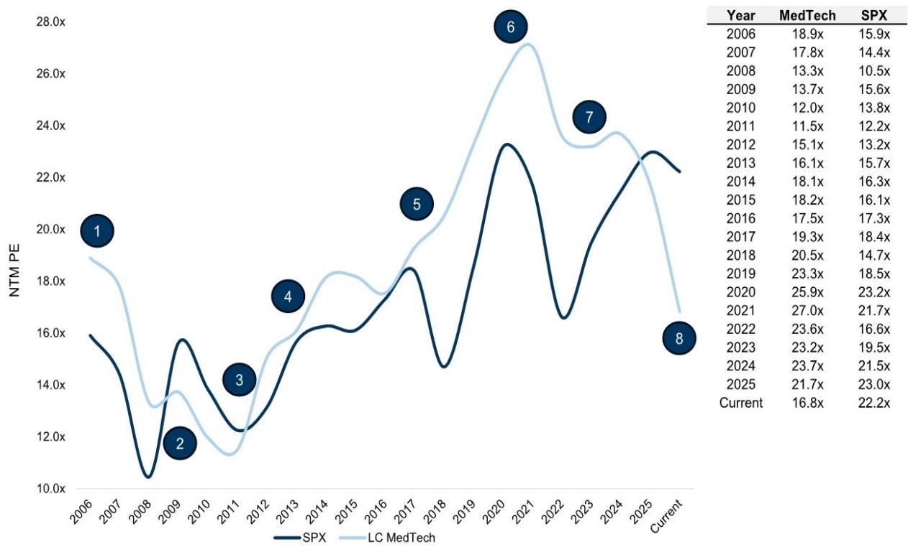
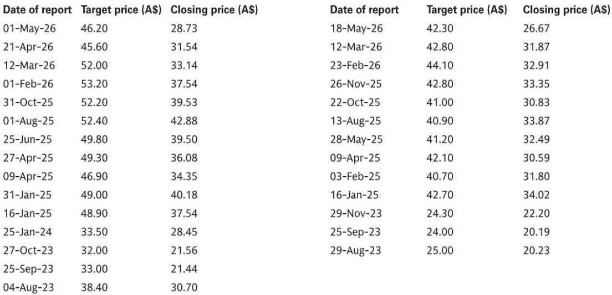
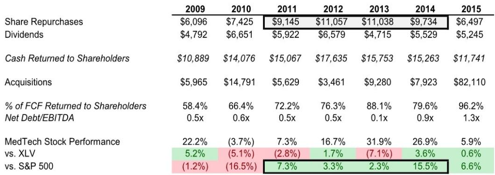

# 医疗科技板块的真正拐点，可能不是产品周期，而是资本回报周期的重启

过去六个月，澳大利亚交易所医疗科技板块的四只核心标的——ResMed、Fisher & Paykel Healthcare、Nanosonics 和 Cochlear——股价表现分化显著：Cochlear 下跌超过 60%，ResMed 和 Nanosonics 跌幅约 18%-19%，Fisher & Paykel 相对坚挺，仅下跌 3%。市场习惯把这种分化归因于公司层面的独特故事：Philips 重新进入睡眠呼吸市场、GLP-1 类药物对睡眠呼吸暂停需求的影响、Cochlear 的 Nexa 市场份额变化、以及 CI 市场增速放缓。这些解释不能说错，但它们掩盖了一个更重要的结构性事实——这轮下跌并非澳大利亚公司特有的问题。

某外资投行最新发布的澳大利亚医疗科技行业研报提供了一个更宏观的视角：美国大型医疗科技公司年初至今同样下跌约 20%，背后的驱动力是有机收入增长放缓叠加估值倍数急剧收缩。换句话说，澳大利亚医疗科技公司正在经历的，是一场全球性的板块重定价，而非仅仅是各自基本面的个案。

这份报告最值得关注的判断，不是某只股票的买入或卖出评级，而是一个历史类比：当前板块面临的增长放缓与估值压缩，与 2010-2013 年的周期高度相似。而那一轮周期的底部，最终是由资本回报的大幅提升、盈利预期的彻底重置、以及新产品获批这三重力量共同推动反转的。如果历史可以提供某种参考，那么当前市场最应该关注的，不是需求何时复苏，而是企业是否有意愿和能力启动大规模的资本回报计划。

以下是对这份研报核心逻辑的拆解，以及那些报告没有完全展开、但值得每位产业决策者和投资者深入思考的关键问题。

## 1. 收入增速放缓不是澳大利亚独有的问题，但下行斜率比看起来更陡

报告的起点是一个容易被忽视的事实：全球医疗科技板块的收入增速正在系统性放缓。Exhibit 2 的数据显示，大型医疗科技公司的有机收入增速从 2023 年的 8.0% 下降至 2025 年的 7.0%，2026 年预计进一步降至 6.0%。这个数字本身看起来并不差——6% 的增长在任何行业中都不算低。但问题在于，增速放缓的斜率正在变陡，而且市场此前并未充分定价。

报告明确指出，美国医疗科技收入减速的主要原因是医保支付方和资金政策变化导致的医疗利用率下降，同时中国市场的销售也在拖累整体表现。更重要的是，研究团队认为，美国管理式医疗（Managed Care）变化和 Medicaid 削减带来的逆风，在 2026 年的盈利指引中尚未被充分反映。这意味着，当前市场对 2026 年收入的预期可能仍然偏高，后续存在进一步下修的风险。

对于澳大利亚公司而言，这个宏观背景的意义在于：即使公司层面的执行没有问题，行业性的需求放缓也会压缩估值空间。ResMed、Fisher & Paykel 和 Nanosonics 都高度依赖美国市场，Cochlear 虽然国际化程度更高，但同样面临全球医保支付环境的不确定性。当整个板块的收入增速从 8% 向 6% 甚至更低收敛时，任何单一公司的超额增长都难以完全对冲估值倍数的收缩。

## 2. 估值倍数已经跌至历史低位，但“便宜”本身不是买入理由

报告的第二个核心数据点来自估值维度。当前美国大型医疗科技公司的 NTM PE 约为 16.8 倍，不仅比 2025 年的 21.7 倍大幅收缩了约 500 个基点，更比 20 年均值低了约 700 个基点。Exhibit 3 的长期估值图表显示，历史上医疗科技板块估值低于当前水平的时期，只有 2010-2011 年的周期底部（约 11 倍）和 2008 年金融危机期间（约 13 倍）。

但这里有一个容易被误读的细节：当前 16.8 倍的估值，与 2011 年 11.5 倍的底部相比，仍然高出约 46%。换句话说，即使经历了大幅下跌，板块估值仍然没有达到历史极端低点。报告对此的解读是，估值修复需要三个条件同时满足：大规模股票回购、盈利预期的彻底重置、以及新的增长催化剂（新产品获批或并购）。

这正是当前市场最不确定的地方。估值倍数能否进一步压缩，取决于盈利预期的下修幅度有多大。如果 2026 年盈利指引的向下修正超出预期，那么即使 PE 倍数不再收缩，股价也仍然有下行风险。反之，如果企业能够通过资本回报计划主动压缩估值分母，则可能提前触底。

## 3. 上一轮周期反转的真正推手，是资本回报而非需求复苏

报告最重要的历史参照是 2010-2013 年的周期。Exhibit 4 的数据揭示了一个清晰的模式：在 2009-2012 年期间，美国大型医疗科技公司大幅提升了资本回报力度。股票回购金额从 2009 年的 61 亿美元增长至 2012 年的 111 亿美元，分红也从 48 亿美元增至 66 亿美元。自由现金流回馈股东的比例从 58.4% 一路上升至 76.3%，2013 年更是达到了 88.1% 的峰值。

这一轮资本回报的爆发，与板块估值的触底回升高度吻合。2011 年估值见底后，2012 年板块即开始反弹，2013 年涨幅达到 31.9%，显著跑赢标普 500 指数。值得注意的是，这一轮反弹并非建立在需求强劲复苏的基础上——有机收入增速在 2013 年仅为 4.5%，远低于 2006-2007 年 13%-15% 的高峰。真正驱动估值修复的，是企业通过大规模回购向市场传递的“价值被低估”信号，以及对未来盈利预期的彻底重置。

报告对当前周期的判断是：ResMed 和 Fisher & Paykel 已经在资本回报方面展现出积极信号。ResMed 在完成 Noctrix 收购的同时，仍保留了约 7 亿美元的股票回购计划；Fisher & Paykel 则在近期提高了股息，显示出进一步资本管理的意愿。但这里有一个关键问题尚未回答：其他公司是否也会跟进？Cochlear 在经历 62% 的下跌后，是否有能力和意愿启动回购？Nanosonics 的 CORIS 产品 rollout 需要大量资本开支，这会否限制其资本回报空间？

## 4. 报告尚未完全回答的关键问题：GLP-1 的结构性影响究竟被定价了多少

在整份报告中，GLP-1 类药物对睡眠呼吸暂停市场的影响被提及，但并未展开分析。这是一个值得单独讨论的关键变量。GLP-1 受体激动剂（如诺和诺德的 Wegovy 和礼来的 Zepbound）在临床试验中显示出对肥胖相关睡眠呼吸暂停的改善效果，这直接威胁到 ResMed 核心产品 CPAP 设备的长期需求逻辑。

市场对这个问题的主流叙事是：GLP-1 类药物短期内不会取代 CPAP，因为药物依从性、副作用和长期效果仍有不确定性。但这个叙事忽略了两个更微妙的影响。第一，即使 GLP-1 类药物最终只减少了 10%-20% 的 CPAP 需求，对于已经处于估值压缩阶段的 ResMed 而言，这足以让市场重新评估其长期增长假设。第二，GLP-1 的威胁不仅在于需求替代，更在于它改变了投资者对“睡眠呼吸暂停是一个结构性增长市场”这一核心信念的确定性。

报告没有给出明确的判断，但历史经验表明，当一种新的治疗范式出现时，市场往往会先过度反应，再逐步修正。当前 ResMed 的股价已经反映了部分 GLP-1 风险，但究竟反映了多少，仍然是一个悬而未决的问题。这可能是完整报告中最值得深挖的议题之一。

## 5. 一个被低估的观察框架：从“产品周期”转向“资本回报周期”

综合以上分析，当前医疗科技板块投资的核心观察框架，可能需要从传统的“产品周期”转向“资本回报周期”。过去几年，市场对医疗科技公司的定价逻辑高度依赖新产品获批和市场份额变化——Cochlear 的 Nexa、Nanosonics 的 CORIS、Fisher & Paykel 的麻醉产品线，都是典型的“产品周期”叙事。但在这个估值压缩、需求放缓的阶段，产品周期能够提供的上行空间可能有限，因为即使新产品成功获批，也需要时间转化为收入增长，而市场当前最缺乏的就是耐心。

相比之下，资本回报周期的影响更为直接和可测量。企业是否愿意在当前估值水平下大规模回购股票，是否愿意提高分红比例，是否愿意通过并购而非内生增长来创造价值——这些信号对股价的短期影响可能远大于产品获批本身。报告对 ResMed 和 Fisher & Paykel 的积极评价，很大程度上正是基于它们在资本回报方面的主动性。

对于投资者而言，一个实用的观察框架是：跟踪每家公司自由现金流的使用优先级。如果一家公司在估值处于历史低位时仍然优先进行大规模收购或资本开支，而不是回购股票，这可能意味着管理层对自身估值水平的判断与市场存在分歧。反之，如果公司主动加大回购力度，则可能预示着管理层认为当前股价被显著低估。

## 6. 未解的问题与值得继续讨论的方向

这份报告提供了清晰的历史框架和宏观视角，但有几个关键问题仍然没有完全回答，也是我们认为最值得深入讨论的方向。

第一个问题：GLP-1 对 ResMed 的长期需求影响，是否真的可以通过新市场（如高流量氧疗）来对冲？报告提到了 HFOT 作为 ResMed 的新增长机会，但这一市场的大小、竞争格局和盈利模式，与核心的 CPAP 业务存在显著差异。对冲逻辑成立的前提是新市场能够提供足够的增量，但这个假设目前缺乏充分的证据支撑。

第二个问题：Cochlear 的下跌是否过度？62% 的跌幅显然包含了市场对竞争加剧和 CI 市场增速放缓的担忧，但 Cochlear 的护城河——可靠性记录、研发投入、制造规模——真的被侵蚀了吗？报告给出了“中性”评级，但并未详细展开“下跌是否过度”这一核心问题。这可能取决于对 Cochlear 创新基金投资组合的进一步评估，以及美国 Medicare 对单侧耳聋（SSD）覆盖政策的进展。

第三个问题：Nanosonics 的 CORIS 产品 rollout 节奏与 Trophon 升级放缓之间的平衡。报告明确指出，CORIS 的推广需要时间才能抵消 Trophon 升级放缓的风险。但市场对于“需要时间”的理解可能过于乐观或悲观。CORIS 的商业化路径、医院采纳周期、以及定价策略，都是影响 Nanosonics 估值的关键变量，报告对此着墨有限。

这些未解的问题，恰恰是完整报告阅读中最有价值的部分。每一只股票的投资逻辑，都建立在一系列尚未验证的关键假设之上。对这些假设的深入拆解和验证，才是做出投资决策的真正基础。

---

欢迎来星球微信群里继续讨论。我们会在群里分享这份研报的完整解读和原始图表，并围绕上述未解问题展开更深入的讨论——包括 GLP-1 对睡眠呼吸暂停市场的二阶影响、Cochlear 下跌的合理区间、以及资本回报周期在澳大利亚市场的具体应用框架。这些内容无法在一篇公开文章中完全展开，但对真正关注医疗科技板块的读者而言，它们可能比任何评级本身都更重要。

Personal reading notes and learning share only. Not investment advice.

