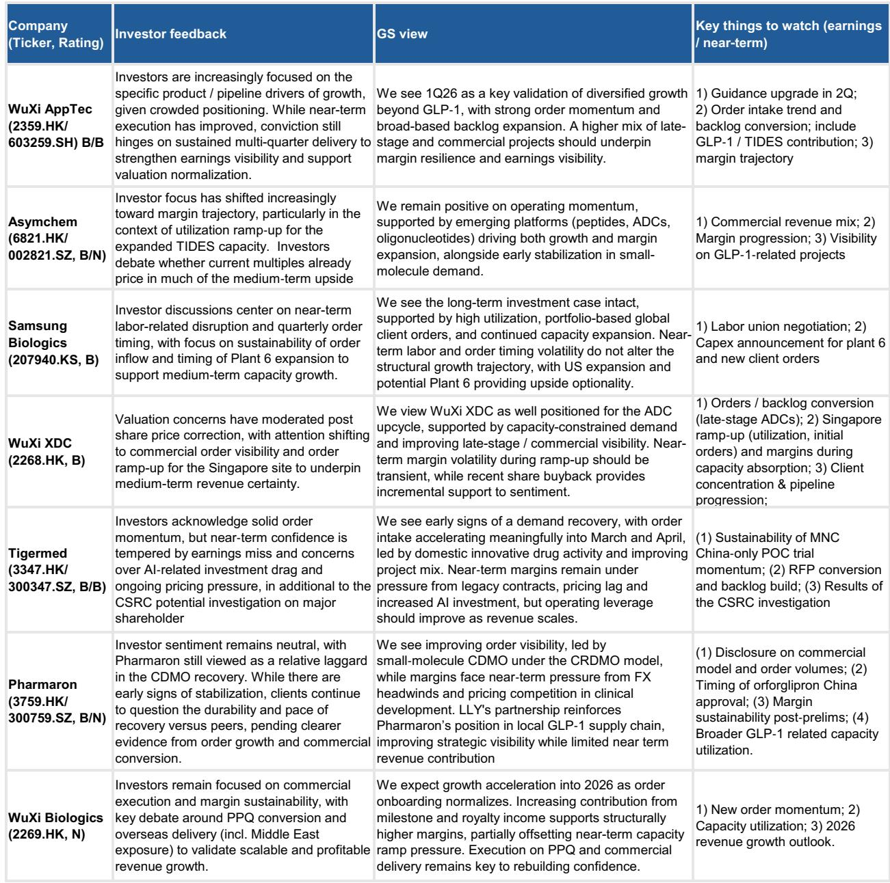
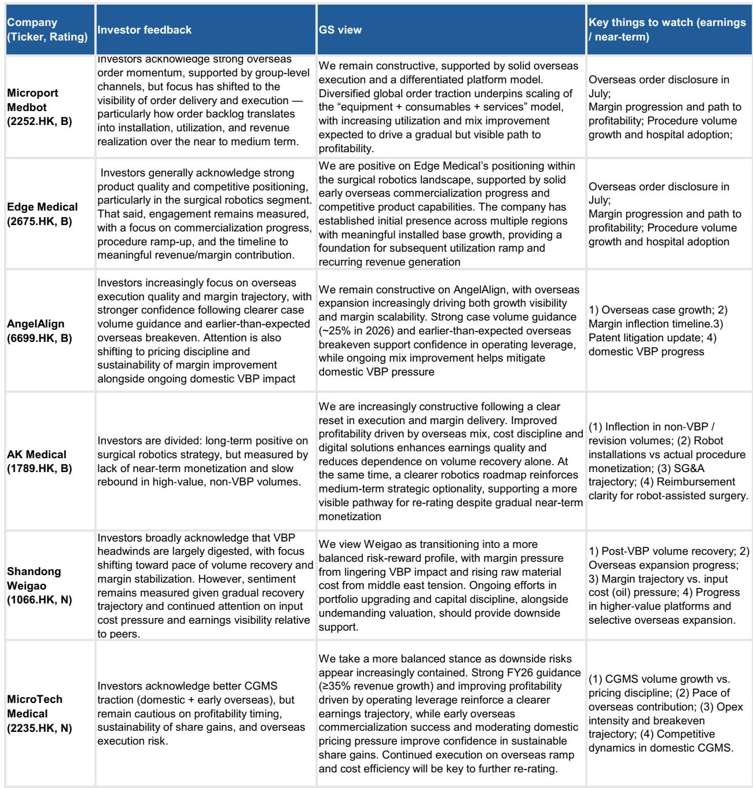
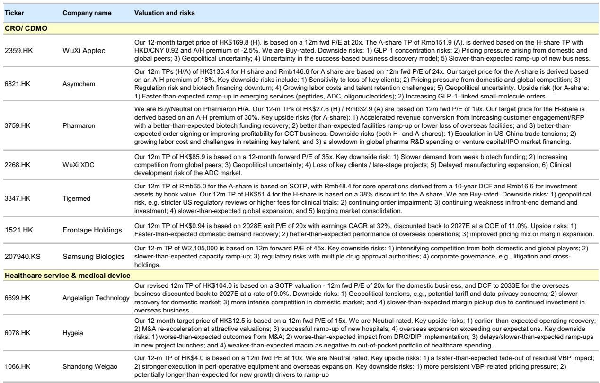

# China Healthcare Investors Are Picking Sides: The 1Q Rally Created a Divide That Only 2Q Results Can Resolve

The first quarter of 2026 delivered a strong performance for China's CDMO sector, but instead of building conviction, it has made investors more selective and more cautious. After rotating into technology and semiconductor names, the investor base for Chinese healthcare has stepped back to the sidelines, waiting for second-quarter results to confirm whether demand recovery is real, margins are sustainable, and execution can be trusted again. This is not a sector-wide pause. It is a differentiation event that will separate companies with genuine operating leverage from those riding a temporary tailwind.

The core tension is straightforward. The 1Q26 results validated a recovery narrative, but they did not prove its durability. Investors now face a binary choice: either the recovery accelerates into 2H26, driven by backlog conversion, commercial-stage project mix, and overseas expansion, or it stalls under the weight of lingering policy overhangs, margin pressure from capacity ramp-up, and a soft domestic in-hospital environment. The market is not betting on either outcome yet. It is waiting for data.

What makes this moment strategically important is the convergence of several forces that rarely align. Proposed US restrictions on China clinical data, renewed discussions around the COINS Act for Chinese biotech companies, and the implementation of new anti-corruption measures in May all create a sentiment overhang that is disproportionate to near-term fundamental impact. Investors understand this. But they also understand that in a sector already pricing in recovery, any disappointment in 2Q will be punished severely. The asymmetry of outcomes favors those who can show tangible evidence of order momentum, margin resilience, and management guidance upgrades.

The report we are analyzing captures this inflection point with unusual clarity. It is not a broad sector call. It is a stock-picker's framework built on the recognition that the next three months will separate the companies that can deliver from those that cannot. The question for any serious investor is not whether to be in Chinese healthcare, but which names to hold through the verification period and which to avoid.

## The 1Q Rally Created a Conviction Gap That Only Operating Evidence Can Close

The first quarter of 2026 was a period of strong absolute performance for CDMO names, but it did not translate into broad-based investor conviction. Instead, it triggered a rotation out of healthcare and into technology and semiconductor stocks, leaving CDMO investors in a holding pattern. This is not a sign of sector fatigue. It is a sign that the market has priced in the recovery narrative and now demands proof of execution.

The report's investor feedback is remarkably consistent across CDMO names: investors stepped back to the sidelines, citing a lack of near-term catalysts and a preference for waiting until 2Q results provide clearer evidence of demand recovery and order visibility. This is a rational response to a market that has already re-rated the sector. The easy money has been made. What remains is the harder work of validating whether the recovery is sustainable and whether margins can expand as revenue scales.

What is striking is that even announced share buybacks from WuXi Biologics and WuXi XDC have not shifted sentiment. Buybacks signal management confidence, but they do not answer the fundamental questions investors are asking: Are orders converting into revenue? Are margins improving? Is the backlog growing? Until those questions are answered with hard data, buybacks are a supporting factor, not a catalyst.

The implication is clear. The 1Q results served as a necessary but insufficient condition for a sustained re-rating. Investors need to see at least two consecutive quarters of strong execution before they are willing to increase exposure. This means 2Q results are not just another earnings season. They are the verification point that will determine positioning for the second half of the year and into 2027.

## The Policy Overhang Is Real but Manageable, and the Market Is Overreacting to Headlines

Recent headlines around proposed US restrictions on China clinical data and the potential addition of Chinese biotech companies to the COINS Act have added to the sentiment overhang. The report acknowledges these concerns but notes that near-term fundamental impact is generally seen as manageable. This is a critical distinction that many investors are failing to make.

The policy risk is real, but it is not new. The trajectory of US-China tensions in biotechnology has been clear for years, and the companies covered in this report have been adapting their business models accordingly. The shift toward overseas manufacturing capacity, the diversification of client bases beyond US-centric pipelines, and the increasing focus on domestic and ex-US markets are all strategic responses that predate the current headlines. The question is not whether these policies will have an impact. It is whether the impact is already priced in and whether the companies have sufficient flexibility to adapt.

For CDMOs, the risk is most acute for those with high exposure to US-based biotech clients. But the report's analysis suggests that the impact is manageable for several reasons. First, the proposed restrictions focus on clinical data, not on manufacturing or research services. Second, the timelines for implementation are uncertain, and any actual impact would be gradual. Third, the companies most exposed have already started building capacity outside of China, including in Singapore, the Middle East, and the United States.

For MedTech and Healthcare Services, the policy overhang is different. The domestic in-hospital environment remains soft, with reimbursement controls still tightening and the implementation of new anti-corruption measures in May potentially weighing on near-term activity. This is a more immediate concern because it directly affects revenue and utilization. Investors are right to be cautious on these subsectors until there is clear evidence of a volume recovery.

The strategic takeaway is that policy risk should be a factor in stock selection, not a reason to avoid the sector entirely. The companies that have already diversified their geographic exposure and built flexible business models are better positioned to navigate the uncertainty. The companies that remain heavily dependent on US clients or domestic hospital volumes face more headwinds.

## The Going-Global Thesis Needs More Than Aspiration; It Needs Tangible Execution and Profitability

One of the most debated themes in the report is the "going-global" thesis for Chinese MedTech and Healthcare Services companies. Investors are interested in the narrative but are seeking more tangible evidence on execution, profitability, and disclosure before increasing exposure. This is a healthy skepticism that reflects the lessons of previous cycles.

The going-global thesis is compelling in theory. Chinese companies have cost advantages, manufacturing capabilities, and increasingly competitive product quality. The surgical robotics names, clear aligner companies, and TCM services firms all have plausible stories about expanding into Southeast Asia, the Middle East, Europe, and even the United States. But the gap between a plausible story and a profitable reality is wide, and investors have been burned before by companies that announced ambitious overseas plans without delivering results.

The report highlights several names where the going-global thesis is most advanced. For surgical robotics, the focus is on order momentum and the translation of backlog into installation, utilization, and revenue. For clear aligners, the key metric is overseas case growth and the timeline to breakeven. For TCM services, the focus is on store rollout in Singapore and the contribution of overseas revenue to overall growth.

What unites these names is that they all have some evidence of execution. Overseas orders are growing. Installed bases are expanding. Revenue from outside China is becoming material. But the evidence is still early, and the path to profitability is not yet clear. Investors are right to demand more disclosure and more consistent delivery before assigning a premium to the going-global thesis.

The implication for portfolio construction is that the going-global theme should be treated as an option, not a certainty. Companies that are already showing improving margins and clear paths to profitability in their overseas operations deserve a higher weighting. Companies that are still in the investment phase, with negative margins and uncertain timelines, should be sized accordingly.

## The 2Q Results Will Be a Decision Point, and the Report Provides a Clear Framework for What to Watch

The report's most valuable contribution is not its stock picks but its framework for what to watch in 2Q results. Across CDMOs, MedTech, and Healthcare Services, the key variables are consistent: order momentum, margin trajectory, and management guidance. But the specific metrics vary by company, and the report provides a detailed checklist for each name.

For CDMOs, the critical questions are whether order intake is accelerating, whether backlog conversion is improving, and whether margins are expanding as capacity utilization increases. The report highlights WuXi AppTec as a potential upside surprise on guidance, Asymchem for GLP-1-related order momentum, and Samsung Biologics for clarity on labor disruption and capacity expansion. For each company, the key things to watch are specific and measurable.

For MedTech, the focus is on overseas execution and the path to profitability. The report highlights Microport MedBot and Edge Medical for their overseas order momentum, AngelAlign for its case volume guidance and earlier-than-expected overseas breakeven, and AK Medical for its robotics strategy. The key variables are overseas order disclosure, procedure volume growth, and margin progression.

For Healthcare Services, the focus is on utilization recovery under DRG/DIP pressure and the sustainability of discretionary consumption. The report highlights Gushengtang for its resilient demand profile and overseas expansion, Hygeia for its stabilized operations but limited recovery visibility, and Jinxin Fertility for early signs of demand recovery but margin concerns.

The framework is clear. Investors should not treat 2Q results as a single data point. They should use them to validate or invalidate specific hypotheses about each company's business model. If order momentum is strong and margins are improving, the recovery narrative is confirmed. If order momentum is weak or margins are under pressure, the recovery narrative is called into question.

## What the Report Does Not Fully Answer: The Sustainability of the Recovery and the Timing of Margin Inflection

For all its analytical rigor, the report leaves several important questions unanswered. The first is the sustainability of the demand recovery. The 1Q results showed strong order momentum, but it is not clear whether this reflects a genuine structural recovery or a one-time catch-up effect. The report acknowledges this uncertainty by emphasizing the need for multi-quarter delivery, but it does not provide a framework for distinguishing between the two scenarios.

The second unanswered question is the timing of margin inflection. For many CDMOs, margins are currently under pressure from capacity ramp-up, pricing competition, and FX headwinds. The report expects margins to improve as revenue scales, but it does not specify when this inflection will occur or what the magnitude of improvement will be. This is a critical variable for valuation, and the lack of clarity is a source of investor uncertainty.

The third unanswered question is the impact of the anti-corruption measures implemented in May. The report notes that these measures could weigh on near-term activity, but it does not provide a detailed analysis of the potential impact on hospital volumes, procedure growth, or revenue. This is a significant gap because the anti-corruption measures are a new variable that was not present in 1Q results.

These unanswered questions are not weaknesses of the report. They are honest acknowledgments of the uncertainty that exists at this point in the cycle. The report's value is that it identifies the right questions and provides a framework for answering them as new data becomes available.

## A Decision Framework for Positioning into 2H26

For investors seeking to position into 2H26, the report provides a clear decision framework based on three variables: order momentum, margin trajectory, and management guidance. The optimal positioning depends on how these variables evolve in 2Q results.

If order momentum accelerates and margins improve, the recovery narrative is confirmed, and investors should increase exposure to CDMO names with the highest operating leverage. The report's preferred names in this scenario include WuXi AppTec, Asymchem, and Samsung Biologics.

If order momentum is stable but margins remain under pressure, the recovery is real but slower than expected. In this scenario, investors should favor CDMO names with strong backlog visibility and diversified client bases, while avoiding names with high fixed costs and low capacity utilization.

If order momentum weakens and margins deteriorate, the recovery narrative is called into question. In this scenario, investors should reduce exposure to CDMO names and focus on MedTech and Healthcare Services names with idiosyncratic catalysts that are less dependent on the macro recovery.

For MedTech and Healthcare Services, the decision framework is different. The key variable is overseas execution. If overseas orders are growing and margins are improving, the going-global thesis is validated, and investors should increase exposure to names like Microport MedBot, Edge Medical, and AngelAlign. If overseas execution is slow or margins are deteriorating, the thesis is called into question, and investors should wait for more evidence.

The report's preferred names for 2H26 reflect this framework. In CDMOs and CROs, the focus is on names with potential guidance upside, GLP-1-related order momentum, and clarity on regulatory investigations. In MedTech and Services, the focus is on names with clear overseas execution and resilient demand profiles.

## Join the Community to Read the Full Report and Review the Original Charts

The analysis above captures the core strategic argument of the report, but it cannot do justice to the depth of company-specific analysis, the detailed financial projections, and the original charts that support the investment framework. The full report includes a comprehensive review of earnings estimate revisions, a detailed breakdown of margin drivers for each company, and a comparison of valuation across the coverage universe.

For serious investors who want to build conviction on individual names, the full report is essential reading. It provides the granularity that is necessary to make informed decisions in a sector where the difference between a successful and unsuccessful investment often comes down to a few key variables.

Join the community to read the full report and review the original charts.

*This article is for learning and discussion only and does not constitute investment advice.*

Personal reading notes and learning share only. Not investment advice.

