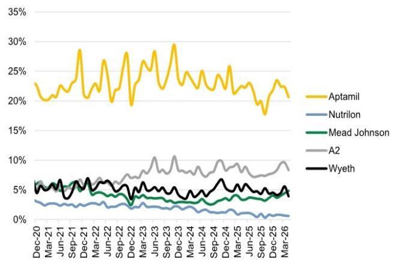
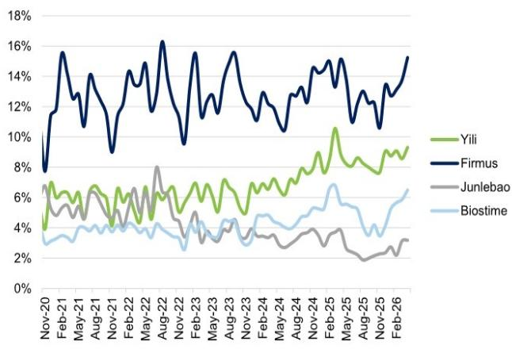
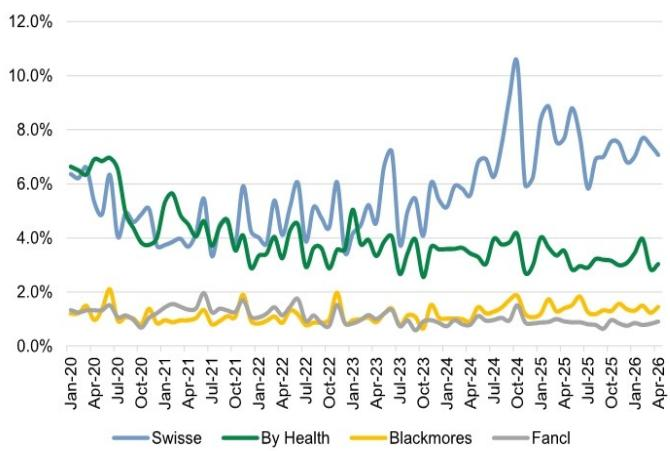

# China Consumer Connection: Online Brand Tracker: Apr-26: Diverged performance before 618; Pet foods led; Beauty/IMF/White Goods lag

We summarize the Apr updates of our Online Brand Tracker. Note that we also updated the data for Tmall/Taobao in 1Q26 and 1Q25 following the rebase of data in 2025 Jan - Apr from our data vendor. Key highlights:

# 1. Category performance: In Apr-26, we observe diverged performance for consumer categories - With Tmall/Taobao/JD combined, Supplements/Pet foods/Women's clothing/Sportswear/Dairy registered $11\% / 10\% / 9\% / 6\% / 6\%$ yoy growth, while Sports shoes/Small kitchen appliances/Beer/White

goods/IMF/Beauty lagged at -5%/-4%/-13%/-22%/-14%/-23% yoy decline. Noted we saw meaningful re-base for pet foods, white goods and Dairy for Tmall/Taobao numbers in 2025 Jan - Apr.

# 2. Domestic vs. MNC brands:

In cosmetics, We saw continued divergence across channels and brands in Apr, with Douyin remaining the key growth engine while Tmall/Taobao stayed under pressure and JD was mixed. Among local brands, Shanghai Jahwa/MGP/Forest Cabin delivered the strongest momentum in Apr, at 53%/36%/23% yoy respectively, mainly driven by Douyin or JD. Other domestic brands remained soft, with

# Proya/Giant Biogene/Shanghai Chicmax/Yatsen/Bloomage down

18%/16%/21%/29%/13% yoy respectively in Apr. For MNCs, L'Oreal/Estee Lauder finished Apr at 3%/4% yoy respectively, supported by Douyin, while Shiseido/LG H&H/Amore/Kose was under pressure, down 8%/50%/29%/27% yoy respectively in Apr.

# In sportswear, we see broad-based moderation versus 1Q26, mainly reflecting unfavorable weather and demand pull-forward during the CNY spending season.

Among the brands, several outdoor names such as Arc'teryx and Salomon, as well as niche premium brand Lululemon, saw more meaningful deceleration in April, likely due in part to a higher base. While most sports brands moderated, adidas, Fila, Puma, Xtep, Asics, and ON appeared relatively more resilient. We also note that brands have been executing omni-channel strategies in both online (e.g., emerging channels like Dewu) and offline, suggesting that sales here may not reflect the full picture.

Outperforming brands (Apr): Fila, Pop Mart, Forest Cabin, MGP, Wanpy, Zeal

Underperforming brands (Apr): Whoo, Midea, Nutrilon, Firmus

# Valerie Zhou

+852-2978-0820 | valerie.zhou@gs.com
GS (Asia) L.L.C.

# Michelle Cheng

+852-2978-6631 | michelle.cheng@gs.com GS (Asia) L.L.C.

# Sho Kawano

+81(3)4587-9905 |
sho.kawano@gs.com
GS Japan Co., Ltd.

# Leaf Liu

+852-3966-4169 | leaf.liu@gs.com
GS (Asia) L.L.C.

# Nicolas Yi

+86(21)2401-8922 |
nicolas.yi@goldmansachs.cn
GS (China) Securities Company Limited

# Relevant reads:

China Cosmetics: Monthly tracker: Apr-26: Growth slowdown before 618 though lapping on an easy base; MGP and Shanghai Jahwa led

Asia Pacific Textile, Apparel & Footwear: Monthly Tracker: OEM a mixed bag; Pou Sheng accelerated on an easy base

China Consumer Durables: Appliance Tracker: Mar 2026: Mixed domestic growth and exports pull-back on a high base; incorporate robotic lawn mowers data starting March

China IP Retailer and Toy Tracker: Apr update: Pop Mart US credit card sales under pressure with meaningfully higher base; Miniso accelerated IP launch around holiday

China Restaurants: Monthly Tracker: Apr update: sequentially better performance supported by spring break, yet decelerated into Labor Day

China Staples: Pet Food Monthly: Apr 2026: April accelerated vs Q1; China Pet Foods led; Gambol back for growth

China Consumer Staples Cost Index Tracker: Apr 2026: Packaging material cost trended high: PET up $54\% / 59\%$ YTD/yoy; Aluminum up $24\%$ yoy

We would like to thank Molly Dai, Christina Liu, Cecilia Tang, Lily Qi, Keira Liu, Xinyu Ruan, and Carol Chen for their contributions to this report.

# Category performance

# Category trends (JD/Tmall/Taobao)

Baby and supplements: Online sales growth of IMF category declined by 22% yoy in Apr on Tmall/Taobao/JD combined, worsened vs 1Q26 at 11% yoy decline. Online sales of supplements category declined by 14% yoy in Apr vs -17% yoy in 1Q26.

Cosmetics: With Tmall/Taobao/JD combined, beauty online GMV declined $23\%$ yoy in Apr, weakening from $-6\%$ yoy decline in 1Q26.

Consumer durables: Sales growth remained under pressure yoy in Apr. Compared to Mar, major (kitchen) appliances, projectors and furniture showed similar yoy declines. Small kitchen appliances showed narrower yoy decline compared to Mar, while cleaning appliances recorded widened yoy decrease in Apr.

Exhibit 1: In Apr-26, we observe diverged performance for consumer categories - With Tmall/Taobao/JD combined, Supplements/Pet foods/Women's clothing/Sportswear/Dairy registered $11\% / 10\% / 9\% / 6\% / 6\%$ yoy growth, while Sports shoes/Small kitchen appliances/Beer/White goods/IMF/Beauty lagged at $-5\% / -4\% / -13\% / -22\% / -14\% / -23\%$ yoy decline.   
Snapshot of category sales growth (% yoy) 

<table><tr><td rowspan="2">Category</td><td colspan="3">Apr-26</td><td colspan="3">1Q26</td><td colspan="3">4Q25</td><td>3Q25</td><td>2Q25</td><td>1Q25</td><td>4Q24</td><td>3Q24</td><td>2Q24</td><td>1Q24</td></tr><tr><td>Tmall/Tmall+ Taobao</td><td>JD</td><td>Total (Tmall+ Taobao+JD)</td><td>Tmall/Tmall+ Taobao</td><td>JD</td><td>Total (Tmall+ Taobao+JD)</td><td>Tmall/Tmall+ Taobao</td><td>JD</td><td>Total (Tmall+ Taobao+JD)</td><td>Total (Tmall+ Taobao+JD)</td><td>Total (Tmall+ Taobao+JD)</td><td>Total (Tmall+ Taobao+JD)</td><td>Total (Tmall+ Taobao+JD)</td><td>Total (Tmall+ Taobao+JD)</td><td>Total (Tmall+ Taobao+JD)</td><td>Total (Tmall+ Taobao+JD)</td></tr><tr><td>Beer</td><td>-9%</td><td>-16%</td><td>-13%</td><td>-1%</td><td>-17%</td><td>-9%</td><td>-23%</td><td>5%</td><td>-10%</td><td>-7%</td><td>-4%</td><td>-1%</td><td>6%</td><td>12%</td><td>1%</td><td>6%</td></tr><tr><td>Dairy</td><td>-2%</td><td>18%</td><td>6%</td><td>-38%</td><td>-24%</td><td>-33%</td><td>-38%</td><td>16%</td><td>-17%</td><td>n.a.</td><td>n.a.</td><td>-1%</td><td>5%</td><td>-12%</td><td>-11%</td><td>15%</td></tr><tr><td>IMF</td><td>14%</td><td>-24%</td><td>-14%</td><td>2%</td><td>-19%</td><td>-11%</td><td>-3%</td><td>7%</td><td>4%</td><td>4%</td><td>19%</td><td>5%</td><td>3%</td><td>10%</td><td>9%</td><td>5%</td></tr><tr><td>Skincare</td><td>-28%</td><td>-7%</td><td>-23%</td><td>-6%</td><td>-8%</td><td>-6%</td><td>-14%</td><td>12%</td><td>-7%</td><td>-4%</td><td>-1%</td><td>1%</td><td>1%</td><td>-9%</td><td>-3%</td><td>-18%</td></tr><tr><td>Cosmetics</td><td>-23%</td><td></td><td></td><td>-4%</td><td></td><td></td><td>-8%</td><td></td><td></td><td></td><td></td><td></td><td></td><td></td><td></td><td></td></tr><tr><td>Sportswear</td><td>2%</td><td>32%</td><td>6%</td><td>29%</td><td>-5%</td><td>26%</td><td>-7%</td><td>7%</td><td>-5%</td><td>6%</td><td>-3%</td><td>6%</td><td>-3%</td><td>-3%</td><td>-12%</td><td>-6%</td></tr><tr><td>Sports shoes</td><td>-6%</td><td>-3%</td><td>-5%</td><td>7%</td><td>-15%</td><td>4%</td><td>-9%</td><td>11%</td><td>-4%</td><td>10%</td><td>2%</td><td>12%</td><td>-12%</td><td>-8%</td><td>2%</td><td>-1%</td></tr><tr><td>Women&#x27;s clothing</td><td>4%</td><td>17%</td><td>9%</td><td>32%</td><td>-58%</td><td>25%</td><td>30%</td><td>108%</td><td>17%</td><td>4%</td><td>7%</td><td>-6%</td><td>-5%</td><td>-6%</td><td>-5%</td><td>0%</td></tr><tr><td>White goods</td><td>-25%</td><td>-19%</td><td>-22%</td><td>-8%</td><td>-51%</td><td>-15%</td><td>-18%</td><td>5%</td><td>-3%</td><td>4%</td><td>6%</td><td>5%</td><td>10%</td><td>14%</td><td>-4%</td><td>-4%</td></tr><tr><td>Small kitchen appliances</td><td>-2%</td><td>-8%</td><td>-4%</td><td>-2%</td><td>-27%</td><td>-1%</td><td>-19%</td><td>68%</td><td>-12%</td><td>8%</td><td>-9%</td><td>1%</td><td>2%</td><td>-17%</td><td>-6%</td><td>-20%</td></tr><tr><td>Condiments</td><td>-19%</td><td>n.a.</td><td>n.a.</td><td>-16%</td><td>n.a.</td><td>n.a.</td><td>-20%</td><td>n.a.</td><td>n.a.</td><td>n.a.</td><td>n.a.</td><td>-3%</td><td>-8%</td><td>-17%</td><td>9%</td><td>9%</td></tr><tr><td>Pet foods</td><td>14%</td><td>-3%</td><td>10%</td><td>0%</td><td>-60%</td><td>-5%</td><td>-11%</td><td>82%</td><td>-6%</td><td>-4%</td><td>4%</td><td>-3%</td><td>-6%</td><td>-13%</td><td>-9%</td><td>2%</td></tr><tr><td>Supplements</td><td>6%</td><td>21%</td><td>11%</td><td>-9%</td><td>-8%</td><td>-8%</td><td>-21%</td><td>14%</td><td>-11%</td><td>5%</td><td>-10%</td><td>-7%</td><td>-1%</td><td>-29%</td><td>-12%</td><td>-11%</td></tr></table>

Sportswear, sports shoes, women's clothing are from Tmall only. For condiments, we use Tmall+Taobao only as JD data is not meaningful on a yoy basis after the platform's category reclassification.   
Source: Moojing

# Category performance (Tmall/Taobao)

Exhibit 2: YoY monthly/quarterly trends at Tmall/Taobao in Apr 

<table><tr><td>Category</td><td>Value</td><td>Volume</td><td>ASP</td><td>Value</td><td>Volume</td><td>ASP</td></tr><tr><td colspan="7">IMF, Pet Foods, Supplements, Beauty and Jewelry</td></tr><tr><td>IMF</td><td></td><td></td><td></td><td>Pet foods</td><td></td><td></td></tr><tr><td>Jul-25</td><td>11%</td><td>-2%</td><td>13%</td><td>Jul-25</td><td>-9%</td><td>-10%</td></tr><tr><td>Aug-25</td><td>-3%</td><td>-8%</td><td>6%</td><td>Aug-25</td><td>-1%</td><td>-5%</td></tr><tr><td>Sep-25</td><td>1%</td><td>-4%</td><td>6%</td><td>Sep-25</td><td>-13%</td><td>-1%</td></tr><tr><td>Oct-25</td><td>-13%</td><td>-21%</td><td>10%</td><td>Oct-25</td><td>-9%</td><td>-12%</td></tr><tr><td>Nov-25</td><td>-1%</td><td>1%</td><td>-2%</td><td>Nov-25</td><td>-14%</td><td>-8%</td></tr><tr><td>Oct-Nov-25</td><td>-6%</td><td>-10%</td><td>4%</td><td>Oct-Nov-25</td><td>-11%</td><td>-10%</td></tr><tr><td>Dec-25</td><td>7%</td><td>3%</td><td>4%</td><td>Dec-25</td><td>-11%</td><td>6%</td></tr><tr><td>Jan-26</td><td>12%</td><td>19%</td><td>-6%</td><td>Jan-26</td><td>4%</td><td>-23%</td></tr><tr><td>Feb-26</td><td>-7%</td><td>-15%</td><td>9%</td><td>Feb-26</td><td>-10%</td><td>-4%</td></tr><tr><td>Jan-Feb-26</td><td>3%</td><td>3%</td><td>1%</td><td>Jan-Feb-26</td><td>-3%</td><td>10%</td></tr><tr><td>Mar-26</td><td>-1%</td><td>4%</td><td>-5%</td><td>Mar-26</td><td>5%</td><td>4%</td></tr><tr><td>Apr-26</td><td>14%</td><td>14%</td><td>33%</td><td>Apr-26</td><td>14%</td><td>0%</td></tr><tr><td>1Q25</td><td>11%</td><td>-13%</td><td>28%</td><td>1Q25</td><td>-19%</td><td>-19%</td></tr><tr><td>2Q25</td><td>-7%</td><td>-14%</td><td>7%</td><td>2Q25</td><td>-7%</td><td>-14%</td></tr><tr><td>3Q25</td><td>2%</td><td>-5%</td><td>8%</td><td>3Q25</td><td>-7%</td><td>-5%</td></tr><tr><td>4Q25</td><td>-3%</td><td>-6%</td><td>4%</td><td>4Q25</td><td>-11%</td><td>-6%</td></tr><tr><td>1Q26</td><td>2%</td><td>3%</td><td>-1%</td><td>1Q26</td><td>0%</td><td>8%</td></tr><tr><td>Supplements</td><td></td><td></td><td></td><td>Shiclare</td><td></td><td></td></tr><tr><td>Jul-25</td><td>4%</td><td>-13%</td><td>18%</td><td>Jul-25</td><td>-10%</td><td>-23%</td></tr><tr><td>Aug-25</td><td>0%</td><td>34%</td><td>-25%</td><td>Aug-25</td><td>-2%</td><td>-16%</td></tr><tr><td>Sep-25</td><td>-3%</td><td>27%</td><td>-24%</td><td>Sep-25</td><td>-11%</td><td>-16%</td></tr><tr><td>Oct-25</td><td>2%</td><td>-12%</td><td>16%</td><td>Oct-25</td><td>-16%</td><td>-35%</td></tr><tr><td>Nov-25</td><td>-35%</td><td>-29%</td><td>-9%</td><td>Nov-25</td><td>-14%</td><td>-14%</td></tr><tr><td>Oct-Nov-25</td><td>-21%</td><td>-21%</td><td>2%</td><td>Oct-Nov-25</td><td>-15%</td><td>-20%</td></tr><tr><td>Dec-25</td><td>-19%</td><td>-21%</td><td>2%</td><td>Dec-25</td><td>-7%</td><td>-15%</td></tr><tr><td>Jan-Feb-26</td><td>-17%</td><td>-18%</td><td>2%</td><td>Jan-Feb-26</td><td>-4%</td><td>-3%</td></tr><tr><td>Mar-26</td><td>8%</td><td>2%</td><td>6%</td><td>Mar-26</td><td>-9%</td><td>-7%</td></tr><tr><td>Apr-26</td><td>6%</td><td>-14%</td><td>24%</td><td>Apr-26</td><td>-28%</td><td>-29%</td></tr><tr><td>1Q25</td><td>-20%</td><td>-20%</td><td>0%</td><td>1Q25</td><td>1%</td><td>-13%</td></tr><tr><td>2Q25</td><td>-20%</td><td>-19%</td><td>-1%</td><td>2Q25</td><td>-3%</td><td>-16%</td></tr><tr><td>3Q25</td><td>0%</td><td>17%</td><td>-12%</td><td>3Q25</td><td>-8%</td><td>-18%</td></tr><tr><td>4Q25</td><td>-21%</td><td>-21%</td><td>2%</td><td>4Q25</td><td>-14%</td><td>-19%</td></tr><tr><td>1Q26</td><td>-9%</td><td>-11%</td><td>3%</td><td>1Q26</td><td>-4%</td><td>-4%</td></tr><tr><td>Color makeup</td><td></td><td></td><td></td><td></td><td></td><td></td></tr><tr><td>Jul-25</td><td>-6%</td><td>-29%</td><td>31%</td><td></td><td></td><td></td></tr><tr><td>Aug-25</td><td>3%</td><td>-24%</td><td>35%</td><td></td><td></td><td></td></tr><tr><td>Sep-25</td><td>-8%</td><td>-20%</td><td>15%</td><td></td><td></td><td></td></tr><tr><td>Oct-25</td><td>-7%</td><td>-19%</td><td>15%</td><td></td><td></td><td></td></tr><tr><td>Nov-25</td><td>-13%</td><td>-19%</td><td>7%</td><td></td><td></td><td></td></tr><tr><td>Sep-25</td><td>-10%</td><td>-19%</td><td>11%</td><td></td><td></td><td></td></tr><tr><td>Oct-Nov-25</td><td>-10%</td><td>-19%</td><td>11%</td><td></td><td></td><td></td></tr><tr><td>Dec-25</td><td>-2%</td><td>-6%</td><td>5%</td><td></td><td></td><td></td></tr><tr><td>Oct-Nov-25</td><td>-41%</td><td>-36%</td><td>6%</td><td>Oct-Nov-25</td><td>-19%</td><td>-25%</td></tr><tr><td>Mar-26</td><td>-12%</td><td>-16%</td><td>5%</td><td></td><td></td><td></td></tr><tr><td>Apr-26</td><td>-23%</td><td>-26%</td><td>5%</td><td></td><td></td><td></td></tr><tr><td>1Q25</td><td>-3%</td><td>-21%</td><td>23%</td><td></td><td></td><td></td></tr><tr><td>2Q25</td><td>-7%</td><td>-30%</td><td>32%</td><td></td><td></td><td></td></tr><tr><td>3Q25</td><td>-4%</td><td>-24%</td><td>26%</td><td></td><td></td><td></td></tr><tr><td>4Q25</td><td>-8%</td><td>-16%</td><td>9%</td><td></td><td></td><td></td></tr><tr><td>1Q26</td><td>-4%</td><td>-6%</td><td>2%</td><td></td><td></td><td></td></tr><tr><td colspan="7">Packaged F&amp;B and Alcohol</td></tr><tr><td>Dairy</td><td></td><td></td><td></td><td>Condiments</td><td></td><td></td></tr><tr><td>Jul-25</td><td>-24%</td><td>-27%</td><td>4%</td><td>Jul-25</td><td>-17%</td><td>-22%</td></tr><tr><td>Aug-25</td><td>-15%</td><td>-22%</td><td>9%</td><td>Aug-25</td><td>-17%</td><td>-24%</td></tr><tr><td>Sep-25</td><td>-15%</td><td>-15%</td><td>0%</td><td>Sep-25</td><td>-13%</td><td>-16%</td></tr><tr><td>Oct-25</td><td>-25%</td><td>-26%</td><td>2%</td><td>Oct-25</td><td>-7%</td><td>-25%</td></tr><tr><td>Nov-25</td><td>-51%</td><td>-43%</td><td>-14%</td><td>Nov-25</td><td>-27%</td><td>-26%</td></tr><tr><td>Oct-Nov-25</td><td>-41%</td><td>-36%</td><td>6%</td><td>Oct-Nov-25</td><td>-19%</td><td>-25%</td></tr><tr><td>Dec-25</td><td>-31%</td><td>-23%</td><td>-11%</td><td>Dec-25</td><td>-21%</td><td>-14%</td></tr><tr><td>Jan-Feb-26</td><td>-40%</td><td>-32%</td><td>-12%</td><td>Jan-Feb-26</td><td>-14%</td><td>1%</td></tr><tr><td>Mar-26</td><td>-33%</td><td>-29%</td><td>-6%</td><td>Mar-26</td><td>-19%</td><td>-4%</td></tr><tr><td>Apr-26</td><td>-2%</td><td>-12%</td><td>11%</td><td>Apr-26</td><td>-19%</td><td>-12%</td></tr><tr><td>1Q25</td><td>-1%</td><td>-3%</td><td>2%</td><td>1Q25</td><td>-3%</td><td>9%</td></tr><tr><td>2Q25</td><td>-24%</td><td>-31%</td><td>10%</td><td>2Q25</td><td>-14%</td><td>-27%</td></tr><tr><td>3Q25</td><td>-18%</td><td>-21%</td><td>4%</td><td>3Q25</td><td>-15%</td><td>-21%</td></tr><tr><td>4Q25</td><td>-38%</td><td>-32%</td><td>-8%</td><td>4Q25</td><td>-20%</td><td>-22%</td></tr><tr><td>1Q26</td><td>-38%</td><td>-31%</td><td>-10%</td><td>1Q26</td><td>-16%</td><td>0%</td></tr><tr><td>Snacks (seeds/notes)</td><td></td><td></td><td></td><td>Water</td><td></td><td></td></tr><tr><td>Jul-25</td><td>10%</td><td>-29%</td><td>26%</td><td>Jul-25</td><td>-27%</td><td>-58%</td></tr><tr><td>Aug-25</td><td>-11%</td><td>-36%</td><td>40%</td><td>Aug-25</td><td>-21%</td><td>-53%</td></tr><tr><td>Sep-25</td><td>-15%</td><td>-27%</td><td>15%</td><td>Sep-25</td><td>-17%</td><td>-40%</td></tr><tr><td>Oct-25</td><td>-16%</td><td>-35%</td><td>28%</td><td>Oct-25</td><td>-34%</td><td>-41%</td></tr><tr><td>Nov-25</td><td>-38%</td><td>-31%</td><td>-10%</td><td>Nov-25</td><td>-36%</td><td>-50%</td></tr><tr><td>Oct-Nov-25</td><td>-30%</td><td>-33%</td><td>7%</td><td>Oct-Nov-25</td><td>-35%</td><td>-46%</td></tr><tr><td>Dec-25</td><td>-34%</td><td>-25%</td><td>-13%</td><td>Dec-25</td><td>-23%</td><td>-37%</td></tr><tr><td>Jan-Feb-26</td><td>-25%</td><td>6%</td><td>-28%</td><td>Jan-Feb-26</td><td>-24%</td><td>-42%</td></tr><tr><td>Mar-26</td><td>-29%</td><td>-40%</td><td>19%</td><td>Mar-26</td><td>6%</td><td>21%</td></tr><tr><td>Apr-26</td><td>-7%</td><td>-18%</td><td>13%</td><td>Apr-26</td><td>-7%</td><td>-12%</td></tr><tr><td>1Q25</td><td>-10%</td><td>-10%</td><td>-1%</td><td>1Q25</td><td>12%</td><td>-18%</td></tr><tr><td>2Q25</td><td>-15%</td><td>-22%</td><td>10%</td><td>2Q25</td><td>19%</td><td>-53%</td></tr><tr><td>3Q25</td><td>-13%</td><td>-30%</td><td>26%</td><td>3Q25</td><td>-22%</td><td>-51%</td></tr><tr><td>4Q25</td><td>-32%</td><td>-30%</td><td>0%</td><td>4Q25</td><td>-32%</td><td>-44%</td></tr><tr><td>1Q26</td><td>-26%</td><td>-8%</td><td>-18%</td><td>1Q26</td><td>-15%</td><td>-25%</td></tr><tr><td>Wine</td><td></td><td></td><td></td><td></td><td></td><td></td></tr><tr><td>Jul-25</td><td>-8%</td><td>-17%</td><td>7%</td><td>Jul-25</td><td>-28%</td><td>-36%</td></tr><tr><td>Aug-25</td><td>10%</td><td>-4%</td><td>9%</td><td>Aug-25</td><td>-25%</td><td>-31%</td></tr><tr><td>Sep-25</td><td>4%</td><td>-6%</td><td>9%</td><td>Sep-25</td><td>-10%</td><td>-27%</td></tr><tr><td>Oct-25</td><td>-39%</td><td>-31%</td><td>9%</td><td>Oct-25</td><td>-36%</td><td>-32%</td></tr><tr><td>Nov-25</td><td>-23%</td><td>-21%</td><td>9%</td><td>Nov-25</td><td>-23%</td><td>-25%</td></tr><tr><td>Oct-Nov-25</td><td>-30%</td><td>-26%</td><td>9%</td><td>Oct-Nov-25</td><td>-29%</td><td>-29%</td></tr><tr><td>Dec-25</td><td>-20%</td><td>4%</td><td>9%</td><td>Dec-25</td><td>-4%</td><td>1%</td></tr><tr><td>Jan-Feb-26</td><td>-27%</td><td>-13%</td><td>8%</td><td>Jan-Feb-26</td><td>-10%</td><td>7%</td></tr><tr><td>Mar-26</td><td>25%</td><td>60%</td><td>9%</td><td>Mar-26</td><td>32%</td><td>33%</td></tr><tr><td>Apr-26</td><td>0%</td><td>0%</td><td>11%</td><td>Apr-26</td><td>-9%</td><td>-10%</td></tr><tr><td>1Q24</td><td>-16%</td><td>19%</td><td>-30%</td><td>1Q24</td><td>16%</td><td>97%</td></tr><tr><td>2Q24</td><td>-12%</td><td>23%</td><td>-28%</td><td>2Q24</td><td>6%</td><td>55%</td></tr><tr><td>3Q24</td><td>-25%</td><td>13%</td><td>-34%</td><td>3Q24</td><td>15%</td><td>53%</td></tr><tr><td>4Q24</td><td>-12%</td><td>7%</td><td>-18%</td><td>4Q24</td><td>12%</td><td>5%</td></tr><tr><td>1Q25</td><td>24%</td><td>12%</td><td>11%</td><td>1Q25</td><td>-2%</td><td>-30%</td></tr><tr><td>2Q25</td><td>-14%</td><td>-12%</td><td>-3%</td><td>2Q25</td><td>-22%</td><td>-32%</td></tr><tr><td>3Q25</td><td>2%</td><td>-9%</td><td>8%</td><td>3Q25</td><td>-22%</td><td>-32%</td></tr><tr><td>4Q25</td><td>-27%</td><td>-19%</td><td>9%</td><td>4Q25</td><td>-23%</td><td>-21%</td></tr><tr><td>1Q26</td><td>-17%</td><td>0%</td><td>8%</td><td>1Q26</td><td>-1%</td><td>14%</td></tr></table>

Categories with decelerating and resilient growth in the latest month are highlighted in red and green respectively.

# Brand performance (Tmall, Taobao, JD)

# Baby, Health and Beauty products

Domestic brands remained soft, some top MNC brands continued to grow: On Tmall/Taobao/JD combined, infant milk formula sales declined by 14% yoy in Apr (vs. -20% yoy in Mar), with +14% yoy growth on Tmall/Taobao and -24% on JD on a tough base. Feihe declined by -47% yoy in Apr on a high base, vs. -47% yoy in Mar. Yili declined at -21% yoy in Apr vs. -23% yoy in Mar, and Yili + Pro-kido combined declined -10% in Apr vs. -20% in Mar. Among MNCs, Aptamil/A2/Biostime grew +2%/+27%/+68% yoy in Apr, vs.-9%/+17%/+24% yoy in Mar, and Mead Johnson/Wyeth/Nutrilon declined significantly at -31%/-32%/-45% vs. -37%/-27%/-44% in Mar. Bellamy's continued strong growth at +77% in Apr vs. +68% in Mar.

Exhibit 3: Aptamil maintained its No.1 position with market share loss 1.7ppt mom to 21%; A2 lost 0.7ppt market share respectively in Apr   
International IMF value Market share (Tmall+Taobao)   

line

| Date    | Aptamil | Nutrilon | Mead Johnson | A2  | Wyeth |
|---------|---------|----------|--------------|-----|-------|
| Dec-20  | 22%     | 3%       | 6%           | 6%  | 5%    |
| Mar-21  | 23%     | 3%       | 6%           | 6%  | 5%    |
| Jun-21  | 24%     | 3%       | 6%           | 6%  | 5%    |
| Sep-21  | 29%     | 3%       | 6%           | 6%  | 5%    |
| Dec-21  | 28%     | 3%       | 6%           | 6%  | 5%    |
| Mar-22  | 27%     | 3%       | 6%           | 6%  | 5%    |
| Jun-22  | 28%     | 3%       | 6%           | 6%  | 5%    |
| Sep-22  | 29%     | 3%       | 6%           | 6%  | 5%    |
| Dec-22  | 20%     | 3%       | 6%           | 6%  | 5%    |
| Mar-23  | 27%     | 3%       | 6%           | 10% | 5%    |
| Jun-23  | 28%     | 3%       | 6%           | 10% | 5%    |
| Sep-23  | 30%     | 3%       | 6%           | 10% | 5%    |
| Dec-23  | 29%     | 3%       | 6%           | 10% | 5%    |
| Mar-24  | 28%     | 3%       | 6%           | 10% | 5%    |
| Jun-24  | 27%     | 3%       | 6%           | 10% | 5%    |
| Sep-24  | 26%     | 3%       | 6%           | 10% | 5%    |
| Dec-24  | 25%     | 3%       | 6%           | 10% | 5%    |
| Mar-25  | 24%     | 3%       | 6%           | 10% | 5%    |
| Jun-25  | 23%     | 3%       | 6%           | 10% | 5%    |
| Sep-25  | 18%     | 3%       | 6%           | 10% | 5%    |
| Dec-25  | 24%     | 3%       | 6%           | 10% | 5%    |
| Mar-26  | 21%     | 3%       | 6%           | 10% | 5%    |

Source: Moojing

Exhibit 4: Feihe/Yili's Market share on Tmall/Taobao was $15\% / 9\%$ in Apr   
Domestic IMF value Market share (Tmall+Taobao)   

line

| Date   | Yili  | Firmus | Junlebao | Biostime |
|--------|-------|--------|----------|----------|
| Nov-20 | 4%    | 8%     | 6%       | 3%       |
| Feb-21 | 6%    | 16%    | 5%       | 4%       |
| May-21 | 6%    | 14%    | 5%       | 4%       |
| Aug-21 | 6%    | 12%    | 6%       | 4%       |
| Nov-21 | 6%    | 9%     | 5%       | 4%       |
| Feb-22 | 6%    | 14%    | 6%       | 4%       |
| May-22 | 6%    | 16%    | 8%       | 4%       |
| Aug-22 | 6%    | 12%    | 6%       | 4%       |
| Nov-22 | 6%    | 9%     | 5%       | 3%       |
| Feb-23 | 6%    | 16%    | 5%       | 4%       |
| May-23 | 6%    | 14%    | 5%       | 4%       |
| Aug-23 | 6%    | 12%    | 5%       | 4%       |
| Nov-23 | 6%    | 10%    | 5%       | 4%       |
| Feb-24 | 6%    | 12%    | 5%       | 4%       |
| May-24 | 6%    | 14%    | 5%       | 4%       |
| Aug-24 | 6%    | 16%    | 5%       | 4%       |
| Nov-24 | 6%    | 14%    | 5%       | 4%       |
| Feb-25 | 10%   | 16%    | 5%       | 7%       |
| May-25 | 8%    | 14%    | 4%       | 5%       |
| Aug-25 | 8%    | 12%    | 3%       | 4%       |
| Nov-25 | 8%    | 10%    | 3%       | 4%       |
| Feb-26 | 9%    | 15%    | 3%       | 6%       |

Source: Moojing

Exhibit 5: ByHealth's Market share recorded $3.0\%$ in Apr (0.2ppt gain vs. Mar)   
Supplements value Market share (Tmall+Taobao)   

line

| Date    | Swissse | By Health | Blackmores | Fancl |
|---------|---------|-----------|------------|-------|
| Jan-20  | 6.5%    | 6.8%      | 1.2%       | 1.3%  |
| Apr-20  | 6.0%    | 7.0%      | 1.5%       | 1.4%  |
| Jul-20  | 5.5%    | 6.5%      | 1.8%       | 1.2%  |
| Oct-20  | 5.0%    | 5.5%      | 1.5%       | 1.0%  |
| Jan-21  | 4.5%    | 5.0%      | 1.2%       | 0.9%  |
| Apr-21  | 4.0%    | 4.5%      | 1.0%       | 0.8%  |
| Jul-21  | 3.5%    | 4.0%      | 0.9%       | 0.7%  |
| Oct-21  | 3.0%    | 3.5%      | 0.8%       | 0.6%  |
| Jan-22  | 2.5%    | 3.0%      | 0.7%       | 0.5%  |
| Apr-22  | 2.0%    | 2.5%      | 0.6%       | 0.4%  |
| Jul-22  | 1.5%    | 2.0%      | 0.5%       | 0.3%  |
| Oct-22  | 1.0%    | 1.5%      | 0.4%       | 0.2%  |
| Jan-23  | 0.5%    | 1.0%      | 0.3%       | 0.1%  |
| Apr-23  | 0.0%    | 0.5%      | 0.2%       | 0.0%  |
| Jul-23  | 0.5%    | 1.0%      | 0.3%       | 0.1%  |
| Oct-23  | 1.0%    | 1.5%      | 0.4%       | 0.2%  |
| Jan-24  | 1.5%    | 2.0%      | 0.5%       | 0.3%  |
| Apr-24  | 2.0%    | 2.5%      | 0.6%       | 0.4%  |
| Jul-24  | 2.5%    | 3.0%      | 0.7%       | 0.5%  |
| Oct-24  | 3.0%    | 3.5%      | 0.8%       | 0.6%  |
| Jan-25  | 3.5%    | 4.0%      | 0.9%       | 0.7%  |
| Apr-25  | 4.0%    | 4.5%      | 1.0%       | 0.8%  |
| Jul-25  | 4.5%    | 5.0%      | 1.1%       | 0.9%  |
| Oct-25  | 5.0%    | 5.5%      | 1.2%       | 1.0%  |
| Jan-26  | 5.5%    | 6.0%      | 1.3%       | 1.1%  |
| Apr-26  | 6.0%    | 6.5%      | 1.4%       | 1.2%  |

Source: Moojing

# Cosmetics

GMV performance on Tmall/Taobao/JD: In Apr, total cosmetics GMV online grew 2%, decelerating from 6% in 1Q26 at 6% even though lapping on an easy base (Last Year Apr-25 decelerated vs Mar/1Q25 due to earlier start in 618). By Platform, Douyin grew 21% in Apr (vs. 16% in 1Q26), while Tmall/Taobao declined by 27% (vs. -5% in 1Q26), JD declined by 7% (slightly improved vs 8% decline in 1Q26). As Apr is a relatively small month, contributing less than 25% of 2Q GMV, we think the key focus will be on the upcoming 618 shopping festival - 618 is expected to start later this year in general, where Douyin is expected to start on 15 May (later vs 13 May in 2025) and Tmall to start later on May 21 (vs May 13 in 2025) while JD started earlier on 6 May (vs 13 May last year).

# Apr performance by brand:

Local brands: Shanghai Jahwa led with $53 \%$ yoy growth in Apr, followed by MGP at $36 \%$ yoy and Forest Cabin at $23 \%$ yoy. Botanee also grew $4 \%$ yoy with $2 \%$ growth from its core brand Winona. Other brands recorded decline. Shanghai Chicmax recorded $21 \%$ yoy decline. Proya experienced an $18 \%$ yoy decline with $30 \% / 25 \%$ yoy decrease of TIMAGE/core brand. Giant Biogene was down $16 \%$ yoy, due to a $21 \%$ yoy decline in Comfy, partly offset by $13 \%$ yoy growth in Collgene. Perfect Diary had $29 \%$ decline yoy. Bloomage underperformed with $13 \%$ yoy decline, dragged by Biohyalux/Medrepair/Biomeso at $22 \% / 15 \% / 6 \%$ decline yoy, partly offset by QuadHA at $5 \%$ growth yoy.

MNC brands: Estee Lauder led GMV growth at 4% yoy driven by growth in its core brand at 25% yoy, while La Mer/Bobbi Brown/M.A.C. declined by 14%/5%/17% yoy. L'Oreal had 3% growth supported by its core brand/Skinceuticals/YSL at 9%/11%/10% yoy, with Lancome flat and HR down 10% yoy. Shiseido recorded an 8% yoy GMV decline with Nars/Elixir/IPSA at 2%/8%/26% yoy, while Shiseido/CPB were down 19%/5% yoy. Kose recorded a 27% decline in Apr. Amore lagged at 29% decline, with Sulwhasoo/Laneige/Innisfree down 25%/30%/40% yoy. LG H&H recorded a 50% yoy decline driven by weak performance of Whoo at 50% decline yoy.

# More deep dives:

China Cosmetics: 2025/1Q26 wrap: Branded leaders with omni-channel strategies to outperform amid industry ROI headwinds; an accelerating outlook for domestic leaders

Mao Geping earnings review/Briefing/NDR highlights; Giant Biogene earnings review/Briefing/NDR highlights; Shanghai Jahwa 4Q25 first take/4Q25 earnings review/1Q26 earnings review; Proya earnings review; Botanee first take; Forest Cabin first take/earnings review/Chairman NDR highlights

Exhibit 6: Trends in Apr - Local brands recorded diverged performance. Among local brands, Shanghai Jahwa/MGP/Forest Cabin/Botanee recorded $53\% / 36\% / 23\% / 4\%$ yoy GMV growth, while Proya/Yatsen/Shanghai Chicmax/Giant Biogene/Bloomage saw yoy decline by $18\% / 29\% / 21\% / 16\% / 13\%$ yoy. For MNCs, Estee Lauder/L'Oreal delivered $4\% / 3\%$ yoy GMV growth, while Shiseido/LG H&H/Kose/Amore was under pressure at $-8\% / -50\% / -27\% / -29\%$ yoy.

Brand performance snapshot

<table><tr><td rowspan="2">Company (Brand)</td><td colspan="4">Apr-26</td><td colspan="4">1Q26</td><td colspan="4">4Q25</td><td colspan="4">3Q25</td><td>2Q25</td><td>1Q25</td><td>4Q24</td><td>3Q24</td><td>2Q24</td><td>1Q24</td><td colspan="4">2025</td></tr><tr><td>Tmall/Taobao</td><td>JD</td><td>Douyin</td><td>Total</td><td>Tmall/Taobao</td><td>JD</td><td>Douyin</td><td>Total</td><td>Tmall/Taobao</td><td>JD</td><td>Douyin</td><td>Total</td><td>Tmall/Taobao</td><td>JD</td><td>Douyin</td><td>Total</td><td></td><td></td><td></td><td>Total</td><td></td><td></td><td>Tmall/Taobao</td><td>JD</td><td>Douyin</td><td>Total</td></tr><tr><td>Beauty Industry growth Local brands</td><td>-27%</td><td>-7%</td><td>21%</td><td>2%</td><td>-5%</td><td>-8%</td><td>16%</td><td>6%</td><td>-12%</td><td>12%</td><td>1%</td><td>-4%</td><td>-7%</td><td>6%</td><td>23%</td><td>10%</td><td>11%</td><td>12%</td><td>16%</td><td>6%</td><td>7%</td><td>2%</td><td>-6%</td><td>9%</td><td>17%</td><td>6%</td></tr><tr><td>Proya</td><td>-38%</td><td>-35%</td><td>11%</td><td>-18%</td><td>-24%</td><td>-31%</td><td>13%</td><td>-11%</td><td>-4%</td><td>-20%</td><td>-15%</td><td>-10%</td><td>-10%</td><td>115%</td><td>18%</td><td>-1%</td><td>7%</td><td>7%</td><td>24%</td><td>38%</td><td>61%</td><td>58%</td><td>0%</td><td>-18%</td><td>5%</td><td>-1%</td></tr><tr><td>Proya</td><td>-41%</td><td>-41%</td><td>0%</td><td>-25%</td><td>-26%</td><td>-34%</td><td>17%</td><td>-12%</td><td>-14%</td><td>-18%</td><td>-21%</td><td>-18%</td><td>-11%</td><td>110%</td><td>23%</td><td>0%</td><td>-4%</td><td>3%</td><td>23%</td><td>33%</td><td>68%</td><td>61%</td><td>-7%</td><td>-19%</td><td>-2%</td><td>-7%</td></tr><tr><td>TIMAGE</td><td>-55%</td><td>-32%</td><td>16%</td><td>-30%</td><td>-46%</td><td>-50%</td><td>-32%</td><td>-41%</td><td>12%</td><td>-49%</td><td>12%</td><td>5%</td><td>-28%</td><td>191%</td><td>-29%</td><td>-29%</td><td>50%</td><td>n.a.</td><td>n.a.</td><td>n.a.</td><td>n.a.</td><td>n.a.</td><td>19%</td><td>-19%</td><td>9%</td><td>13%</td></tr><tr><td>Off &amp; Relax</td><td>54%</td><td>143%</td><td>98%</td><td>82%</td><td>137%</td><td>95%</td><td>164%</td><td>145%</td><td>116%</td><td>25%</td><td>62%</td><td>86%</td><td>35%</td><td>172%</td><td>136%</td><td>74%</td><td>118%</td><td>108%</td><td>214%</td><td>242%</td><td>29%</td><td>58%</td><td>62%</td><td>65%</td><td>173%</td><td>0%</td></tr><tr><td>Giant Biogene</td><td>-14%</td><td>-32%</td><td>-15%</td><td>-16%</td><td>-1%</td><td>-31%</td><td>-22%</td><td>-13%</td><td>-20%</td><td>33%</td><td>-44%</td><td>-26%</td><td>-10%</td><td>1121%</td><td>11%</td><td>5%</td><td>19%</td><td>81%</td><td>75%</td><td>39%</td><td>80%</td><td>90%</td><td>-1%</td><td>65%</td><td>2%</td><td>5%</td></tr><tr><td>Comfy</td><td>-14%</td><td>-26%</td><td>-25%</td><td>-21%</td><td>0%</td><td>-31%</td><td>-27%</td><td>-14%</td><td>-20%</td><td>30%</td><td>-55%</td><td>-31%</td><td>-7%</td><td>14382%</td><td>1%</td><td>2%</td><td>16%</td><td>73%</td><td>66%</td><td>35%</td><td>77%</td><td>88%</td><td>0%</td><td>72%</td><td>-11%</td><td>0%</td></tr><tr><td>Collgene</td><td>-7%</td><td>-63%</td><td>28%</td><td>13%</td><td>-10%</td><td>-28%</td><td>-6%</td><td>-9%</td><td>-19%</td><td>46%</td><td>31%</td><td>10%</td><td>-27%</td><td>165%</td><td>75%</td><td>24%</td><td>41%</td><td>141%</td><td>182%</td><td>78%</td><td>107%</td><td>110%</td><td>-6%</td><td>41%</td><td>89%</td><td>38%</td></tr><tr><td>Botanee</td><td>-26%</td><td>27%</td><td>59%</td><td>4%</td><td>-8%</td><td>16%</td><td>59%</td><td>12%</td><td>12%</td><td>-9%</td><td>10%</td><td>9%</td><td>-27%</td><td>79%</td><td>3%</td><td>-15%</td><td>-8%</td><td>6%</td><td>1%</td><td>29%</td><td>13%</td><td>21%</td><td>-2%</td><td>-27%</td><td>19%</td><td>0%</td></tr><tr><td>Winona</td><td>-29%</td><td>31%</td><td>57%</td><td>2%</td><td>-10%</td><td>22%</td><td>60%</td><td>11%</td><td>10%</td><td>-9%</td><td>6%</td><td>7%</td><td>-28%</td><td>80%</td><td>-1%</td><td>-17%</td><td>-9%</td><td>4%</td><td>3%</td><td>28%</td><td>13%</td><td>21%</td><td>-3%</td><td>-29%</td><td>15%</td><td>-2%</td></tr><tr><td>Bloomage</td><td>-28%</td><td>-72%</td><td>43%</td><td>-13%</td><td>-41%</td><td>-41%</td><td>-61%</td><td>-49%</td><td>-56%</td><td>-21%</td><td>-83%</td><td>-65%</td><td>-55%</td><td>14%</td><td>-69%</td><td>-59%</td><td>-51%</td><td>-39%</td><td>-13%</td><td>-14%</td><td>-8%</td><td>-7%</td><td>-53%</td><td>-24%</td><td>-64%</td><td>-55%</td></tr><tr><td>QuodHA</td><td>-23%</td><td>-63%</td><td>46%</td><td>5%</td><td>-49%</td><td>-2%</td><td>-60%</td><td>-51%</td><td>-54%</td><td>59%</td><td>-88%</td><td>-69%</td><td>-53%</td><td>-10%</td><td>-83%</td><td>-71%</td><td>-18%</td><td>-46%</td><td>-27%</td><td>-8%</td><td>-30%</td><td>-1%</td><td>-46%</td><td>-2%</td><td>-69%</td><td>-55%</td></tr><tr><td>Biohyalux</td><td>-35%</td><td>-72%</td><td>47%</td><td>-22%</td><td>-34%</td><td>-41%</td><td>-43%</td><td>-38%</td><td>-48%</td><td>-18%</td><td>-80%</td><td>-55%</td><td>-45%</td><td>50%</td><td>-8%</td><td>-30%</td><td>-51%</td><td>-32%</td><td>22%</td><td>-2%</td><td>55%</td><td>18%</td><td>-49%</td><td>-19%</td><td>-55%</td><td>-47%</td></tr><tr><td>Medirapair</td><td>-53%</td><td>-78%</td><td>82%</td><td>-15%</td><td>-53%</td><td>-81%</td><td>-70%</td><td>-65%</td><td>-81%</td><td>-90%</td><td>-65%</td><td>-75%</td><td>-68%</td><td>16%</td><td>-75%</td><td>-72%</td><td>-76%</td><td>-44%</td><td>-43%</td><td>-41%</td><td>-34%</td><td>-2%</td><td>-70%</td><td>-49%</td><td>-68%</td><td>-68%</td></tr><tr><td>Biomeso</td><td>29%</td><td>-79%</td><td>-22%</td><td>-6%</td><td>-42%</td><td>-71%</td><td>-89%</td><td>-73%</td><td>-80%</td><td>-77%</td><td>-89%</td><td>-83%</td><td>-77%</td><td>-29%</td><td>-91%</td><td>-84%</td><td>-78%</td><td>-41%</td><td>-30%</td><td>-17%</td><td>-39%</td><td>-49%</td><td>-76%</td><td>-64%</td><td>-71%</td><td>-73%</td></tr><tr><td>Shanghai Jahwa</td><td>-11%</td><td>-12%</td><td>174%</td><td>53%</td><td>-2%</td><td>-23%</td><td>88%</td><td>27%</td><td>-8%</td><td>19%</td><td>42%</td><td>12%</td><td>5%</td><td>-14%</td><td>221%</td><td>59%</td><td>38%</td><td>45%</td><td>26%</td><td>-15%</td><td>-3%</td><td>12%</td><td>6%</td><td>23%</td><td>102%</td><td>33%</td></tr><tr><td>Dr. Yu</td><td>-7%</td><td>-3%</td><td>-4%</td><td>-6%</td><td>0%</td><td>18%</td><td>28%</td><td>11%</td><td>-26%</td><td>25%</td><td>60%</td><td>1%</td><td>0%</td><td>17%</td><td>130%</td><td>42%</td><td>27%</td><td>52%</td><td>21%</td><td>-25%</td><td>-14%</td><td>17%</td><td>-3%</td><td>21%</td><td>95%</td><td>22%</td></tr><tr><td>Herborist</td><td>4%</td><td>-44%</td><td>794%</td><td>229%</td><td>21%</td><td>-49%</td><td>215%</td><td>75%</td><td>12%</td><td>35%</td><td>55%</td><td>31%</td><td>-4%</td><td>25%</td><td>696%</td><td>119%</td><td>50%</td><td>44%</td><td>31%</td><td>21%</td><td>15%</td><td>18%</td><td>4%</td><td>36%</td><td>181%</td><td>52%</td></tr><tr><td>Liushen</td><td>-22%</td><td>19%</td><td>146%</td><td>19%</td><td>-28%</td><td>28%</td><td>85%</td><td>-11%</td><td>-46%</td><td>-24%</td><td>66%</td><td>-30%</td><td>14%</td><td>-34%</td><td>128%</td><td>31%</td><td>33%</td><td>14%</td><td>4%</td><td>-21%</td><td>-3%</td><td>-8%</td><td>4%</td><td>8%</td><td>102%</td><td>18%</td></tr><tr><td>VIVE</td><td>85%</td><td>-27%</td><td>n.a.</td><td>154%</td><td>-18%</td><td>28%</td><td>n.a.</td><td>-6%</td><td>85%</td><td>-47%</td><td>n.a.</td><td>85%</td><td>27%</td><td>-34%</td><td>n.a.</td><td>31%</td><td>181%</td><td>157%</td><td>210%</td><td>-62%</td><td>11%</td><td>59%</td><td>104%</td><td>89%</td><td>n.a.</td><td>105%</td></tr><tr><td>Shanghai Chimax</td><td>-25%</td><td>-26%</td><td>-20%</td><td>-21%</td><td>-5%</td><td>-42%</td><td>1%</td><td>-3%</td><td>17%</td><td>-3%</td><td>12%</td><td>11%</td><td>16%</td><td>167%</td><td>44%</td><td>39%</td><td>34%</td><td>9%</td><td>60%</td><td>59%</td><td>148%</td><td>418%</td><td>34%</td><td>4%</td><td>20%</td><td>21%</td></tr><tr><td>KANS</td><td>-43%</td><td>-45%</td><td>-29%</td><td>-31%</td><td>-19%</td><td>-54%</td><td>-5%</td><td>-10%</td><td>-9%</td><td>-14%</td><td>3%</td><td>0%</td><td>-2%</td><td>160%</td><td>41%</td><td>35%</td><td>28%</td><td>1%</td><td>54%</td><td>59%</td><td>143%</td><td>418%</td><td>20%</td><td>-3%</td><td>13%</td><td>13%</td></tr><tr><td>New Page</td><td>23%</td><td>48%</td><td>99%</td><td>68%</td><td>33%</td><td>41%</td><td>56%</td><td>45%</td><td>136%</td><td>74%</td><td>153%</td><td>137%</td><td>101%</td><td>248%</td><td>110%</td><td>97%</td><td>122%</td><td>n.a.</td><td>n.a.</td><td>n.a.</td><td>n.a.</td><td>n.a.</td><td>95%</td><td>70%</td><td>278%</td><td>153%</td></tr><tr><td>Armiyo</td><td>30%</td><td>44%</td><td>79%</td><td>69%</td><td>92%</td><td>281%</td><td>127%</td><td>122%</td><td>88%</td><td>295%</td><td>285%</td><td>239%</td><td>43%</td><td>3207%</td><td>85%</td><td>77%</td><td>209%</td><td>n.a.</td><td>n.a.</td><td>n.a.</td><td>n.a.</td><td>n.a.</td><td>55%</td><td>218%</td><td>262%</td><td>195%</td></tr><tr><td>MGP</td><td>24%</td><td>81%</td><td>36%</td><td>36%</td><td>44%</td><td>36%</td><td>43%</td><td>43%</td><td>28%</td><td>63%</td><td>53%</td><td>42%</td><td>14%</td><td>107%</td><td>40%</td><td>31%</td><td>45%</td><td>32%</td><td>48%</td><td>27%</td><td>47%</td><td>92%</td><td>18%</td><td>72%</td><td>51%</td><td>38%</td></tr><tr><td>Maogeping</td><td>24%</td><td>81%</td><td>36%</td><td>36%</td><td>44%</td><td>36%</td><td>43%</td><td>43%</td><td>28%</td><td>63%</td><td>53%</td><td>42%</td><td>14%</td><td>107%</td><td>40%</td><td>31%</td><td>45%</td><td>32%</td><td>48%</td><td>27%</td><td>47%</td><td>92%</td><td>18%</td><td>72%</td><td>50%</td><td>38%</td></tr><tr><td>Yatsen</td><td>-31%</td><td>-38%</td><td>-27%</td><td>-29%</td><td>-18%</td><td>-37%</td><td>-17%</td><td>-19%</td><td>-25%</td><td>-10%</td><td>-35%</td><td>-30%</td><td>-38%</td><td>-2%</td><td>11%</td><td>-11%</td><td>12%</td><td>-2%</td><td>11%</td><td>-12%</td><td>-19%</td><td>-14%</td><td>-31%</td><td>-20%</td><td>8%</td><td>-10%</td></tr><tr><td>Perfect Diary</td><td>-31%</td><td>-38%</td><td>-27%</td><td>-29%</td><td>-18%</td><td>-37%</td><td>-17%</td><td>-19%</td><td>-25%</td><td>-10%</td><td>-35%</td><td>-30%</td><td>-38%</td><td>-2%</td><td>11%</td><td>-11%</td><td>12%</td><td>-2%</td><td>11%</td><td>-12%</td><td>-19%-14%</td><td>-31%-14%</td><td>-31%-14%</td><td>-20%-8%</td><td>8%-10%</td><td></td></tr><tr><td>Forest Cabin</td><td>-5%</td><td>56%</td><td>25%</td><td>23%</td><td>43%</td><td>20%</td><td>54%</td><td>49%</td><td>-29%</td><td>-14%</td><td>262%</td><td>86%</td><td>20%</td><td>222%</td><td>436%</td><td>182%</td><td>136%</td><td>212%</td><td>n.a.</td><td>n.a.</td><td>n.a.</td><td>n.a.</td><td>1%</td><td>0%</td><td>348%</td><td>127%</td></tr><tr><td>MNC</td><td></td><td></td><td></td><td></td><td></td><td></td><td></td><td></td><td></td><td></td><td></td><td></td><td></td><td></td><td></td><td></td><td></td><td></td><td></td><td></td><td></td><td></td><td></td><td></td><td></td><td></td></tr><tr><td>L&#x27;Oreal</td><td>-12%</td><td>-7%</td><td>45%</td><td>3%</td><td>19%</td><td>-8%</td><td>16%</td><td>12%</td><td>12%</td><td>19%</td><td>13%</td><td>13%</td><td>-8%</td><td>36%</td><td>7%</td><td>0%</td><td>-8%</td><td>1%</td><td>1%</td><td>10%</td><td>21%</td><td>9%</td><td>-3%</td><td>3%</td><td>15%</td><td>2%</td></tr><tr><td>L&#x27;Oreal</td><td>-24%</td><td>-8%</td><td>87%</td><td>9%</td><td>3%</td><td>-7%</td><td>8%</td><td>3%</td><td>-5%</td><td>3%</td><td>-13%</td><td>-6%</td><td>-6%</td><td>59%</td><td>-17%</td><td>-10%</td><td>-19%</td><td>5%</td><td>0%</td><td>13%</td><td>16%</td><td>17%</td><td>-13%</td><td>-7%</td><td>0%-8%</td><td></td></tr><tr><td>Lancome</td><td>-9%</td><td>-15%</td><td>36%</td><td>0%</td><td>34%</td><td>-23%</td><td>17%</td><td>15%</td><td>38%</td><td>46%</td><td>28%</td><td>38%</td><td>-11%</td><td>12%</td><td>12%</td><td>6%</td><td>-11%</td><td>-9%</td><td>-13%</td><td>8%</td><td>31%</td><td>11%</td><td>0%</td><td>4%</td><td>24%</td><td></td></tr><tr><td>Maybelline</td><td>-20%</td><td>-12%</td><td>98%</td><td>16%</td><td>-16%</td><td>-9%</td><td>-9%</td><td>-12%</td><td>-33%</td><td>-14%</td><td>-2%</td><td>-23%</td><td>-34%</td><td>20%</td><td>1%</td><td>-21%</td><td>-24%</td><td>-7%</td><td>8%</td><td>-18%</td><td>12%</td><td>24%</td><td>-30%</td><td>-19%</td><td>0%-19%</td><td></td></tr><tr><td>HR</td><td>8%</td><td>-13%</td><td>-18%</td><td>-10%</td><td>48%</td><td>-9%</td><td>27%</td><td>27%</td><td>54%</td><td>-4%</td><td>41%</td><td>35%</td><td>39%</td><td>17%</td><td>53%</td><td>58%</td><td>14%</td><td>23%</td><td>11%</td><td>7%</td><td>25%</td><td>18%</td><td>30%</td><td>21%</td><td>33%</td><td></td></tr><tr><td>Skinecuticals</td><td>18%</td><td>-22%</td><td>51%</td><td>11%</td><td>97%</td><td>15%</td><td>4%</td><td>51%</td><td>49%</td><td>30%</td><td>8%</td><td>38%</td><td>12%</td><td>373%</td><td>0%</td><td>-4%</td><td>12%</td><td>14%</td><td>3%</td><td>34%</td><td>51%</td><td>28%</td><td>20%</td><td>29%</td><td>15%</td><td></td></tr><tr><td>La Roche Posay</td><td>-11%</td><td>15%</td><td>14%</td><td>-2%</td><td>-7%</td><td>19%</td><td>-1%</td><td>-4%</td><td>-9%</td><td>12%</td><td>-3%</td><td>-5%</td><td>-15%</td><td>116%</td><td>24%</td><td>-10%</td><td>10%</td><td>53%</td><td>0%</td><td>36%</td><td>9%-3%</td><td></td><td></td><td></td><td></td><td></td></tr></table>

Source: Moojing, Chanmama, Data compiled by GS Global Investment Research

# Jewelry

In Apr, Major local jewelry brands saw broad-based deceleration while international brands accelerated. Laopu/Cow Tai Seng/ Luk Fook/Cow Sang Sang/Chow Tai Fook came in at $-64\% / -53\% / -34\% / -16\% / +10\%$ yoy growth on Tmall flagship store; Pandora/Swarovski/APM accelerated to $+53\% / +50\% / +9\%$ yoy.

Exhibit 7: Jewlery brands' Tmall flagship store performance monthly tracker 

<table><tr><td rowspan="2">Tmall Flagship store</td><td colspan="9"></td><td colspan="3"></td></tr><tr><td>1Q24</td><td>2Q24</td><td>3Q24</td><td>4Q24</td><td>1Q25</td><td>2Q25</td><td>3Q25</td><td>4Q25</td><td>1Q26</td><td>Jan+Feb 26</td><td>Mar-26</td><td>Apr-26</td></tr><tr><td colspan="13">Local brands</td></tr><tr><td>Laopu Gold</td><td>185%</td><td>137%</td><td>176%</td><td>248%</td><td>545%</td><td>288%</td><td>784%</td><td>232%</td><td>155%</td><td>297%</td><td>-31%</td><td>-64%</td></tr><tr><td>Chow Tai Fook</td><td>10%</td><td>6%</td><td>10%</td><td>187%</td><td>127%</td><td>38%</td><td>60%</td><td>-23%</td><td>-18%</td><td>-34%</td><td>38%</td><td>10%</td></tr><tr><td>Luk Fook</td><td>16%</td><td>-23%</td><td>-16%</td><td>21%</td><td>54%</td><td>67%</td><td>127%</td><td>15%</td><td>12%</td><td>-2%</td><td>44%</td><td>-34%</td></tr><tr><td>Chow Tai Seng</td><td>90%</td><td>18%</td><td>28%</td><td>-13%</td><td>3%</td><td>-6%</td><td>17%</td><td>31%</td><td>-30%</td><td>-38%</td><td>-10%</td><td>-53%</td></tr><tr><td>Chow Sang Sang</td><td>12%</td><td>14%</td><td>26%</td><td>48%</td><td>139%</td><td>58%</td><td>-32%</td><td>-9%</td><td>-35%</td><td>-41%</td><td>-23%</td><td>-16%</td></tr><tr><td colspan="13">International brands</td></tr><tr><td>Swarovski</td><td>-8%</td><td>n.a.</td><td>-18%</td><td>-16%</td><td>17%</td><td>n.a.</td><td>27%</td><td>-8%</td><td>-19%</td><td>-18%</td><td>-21%</td><td>50%</td></tr><tr><td>APM</td><td>-26%</td><td>n.a.</td><td>20%</td><td>108%</td><td>97%</td><td>n.a.</td><td>13%</td><td>50%</td><td>23%</td><td>32%</td><td>6%</td><td>9%</td></tr><tr><td>Pandora</td><td>-38%</td><td>n.a.</td><td>-48%</td><td>20%</td><td>16%</td><td>n.a.</td><td>18%</td><td>-31%</td><td>-4%</td><td>-6%</td><td>2%</td><td>53%</td></tr></table>

Source: Moojing

# Pet food

In Apr, our covered domestic brands accelerated to $+36\%$ yoy vs $+22\%$ yoy in 1Q26. Global brands returned to growth with $20\%$ yoy vs $4\%$ decline in 1Q26 where Royal

Canin outperformed on both Tmall/Douyin channel at 78% overall yoy. China Pet Foods led local brands at +64% yoy, thanks to Wanpy/Toptrees/Zeal at 67%/68%/38%. Gambol returned to growth at 12% yoy, with Myfoodie at 8% albeit Fregate came in negative at 1%. For Petpal, Meatyway grew 33% in Apr, accelerated vs 13% growth in 1Q26.

More details within our pet food monthly online tracker.

Exhibit 8: China Pet Foods led in yoy growth in Apr-26; Gambol returned to growth and Petpal strengthened in April vs 1Q26 

<table><tr><td rowspan="2">Company brand GMV yoy growth</td><td colspan="4">Apr-26</td><td colspan="4">1Q26</td><td colspan="4">4Q25</td><td colspan="4">3Q25</td><td colspan="4">2Q25</td><td colspan="4">1Q25</td><td colspan="4">2025</td></tr><tr><td>Tmall/Taobao</td><td>JD</td><td>Douyin</td><td>Total</td><td>Tmall/Taobao</td><td>JD</td><td>Douyin</td><td>Total</td><td>Tmall/Taobao</td><td>JD</td><td>Douyin</td><td>Total</td><td>Tmall/Taobao</td><td>JD</td><td>Douyin</td><td>Total</td><td>Tmall/Taobao</td><td>JD</td><td>Douyin</td><td>Total</td><td>Tmall/Taobao</td><td>JD</td><td>Douyin</td><td>Total</td><td>Tmall/Taobao</td><td>JD</td><td>Douyin</td><td>Total</td></tr><tr><td>Total Pet Foods</td><td>14%</td><td>-3%</td><td>33%</td><td>18%</td><td>0%</td><td>-27%</td><td>45%</td><td>9%</td><td>-11%</td><td>9%</td><td>53%</td><td>8%</td><td>-7%</td><td>6%</td><td>n.a.</td><td>n.a.</td><td>-7%</td><td>32%</td><td>n.a.</td><td>n.a.</td><td>-5%</td><td>-35%</td><td>n.a.</td><td>n.a.</td><td>7%</td><td>14%</td><td>n.a.</td><td>n.a.</td></tr><tr><td>Local brands - covered</td><td></td><td></td><td></td><td></td><td></td><td></td><td></td><td></td><td></td><td></td><td></td><td></td><td></td><td></td><td></td><td></td><td></td><td></td><td></td><td></td><td></td><td></td><td></td><td></td><td></td><td></td><td></td><td></td></tr><tr><td>Gambol</td><td>4%</td><td>48%</td><td>6%</td><td>12%</td><td>10%</td><td>-41%</td><td>3%</td><td>-1%</td><td>18%</td><td>16%</td><td>16%</td><td>17%</td><td>17%</td><td>16%</td><td>48%</td><td>27%</td><td>24%</td><td>-25%</td><td>73%</td><td>22%</td><td>19%</td><td>-26%</td><td>95%</td><td>23%</td><td>20%</td><td>-6%</td><td>49%</td><td>21%</td></tr><tr><td>Myfoodie</td><td>7%</td><td>35%</td><td>-5%</td><td>8%</td><td>3%</td><td>-60%</td><td>-10%</td><td>-14%</td><td>10%</td><td>5%</td><td>-2%</td><td>5%</td><td>-4%</td><td>1%</td><td>16%</td><td>3%</td><td>11%</td><td>-36%</td><td>44%</td><td>4%</td><td>1%</td><td>-30%</td><td>60%</td><td>5%</td><td>5%</td><td>-16%</td><td>24%</td><td>4%</td></tr><tr><td>Balance Nutrition</td><td>217%</td><td>-87%</td><td>174%</td><td>173%</td><td>132%</td><td>-57%</td><td>286%</td><td>187%</td><td>134%</td><td>-36%</td><td>564%</td><td>226%</td><td>125%</td><td>-17%</td><td>n.a.</td><td>n.a.</td><td>82%</td><td>-4%</td><td>n.a.</td><td>n.a.</td><td>67%</td><td>-44%</td><td>n.a.</td><td>n.a.</td><td>109%</td><td>-26%</td><td>n.a.</td><td>n.a.</td></tr><tr><td>Fregate</td><td>-21%</td><td>121%</td><td>-7%</td><td>-1%</td><td>10%</td><td>51%</td><td>-12%</td><td>6%</td><td>22%</td><td>73%</td><td>16%</td><td>26%</td><td>94%</td><td>116%</td><td>87%</td><td>94%</td><td>65%</td><td>56%</td><td>108%</td><td>75%</td><td>90%</td><td>10%</td><td>218%</td><td>103%</td><td>51%</td><td>64%</td><td>74%</td><td>59%</td></tr><tr><td>China Pet Food</td><td>69%</td><td>150%</td><td>19%</td><td>64%</td><td>36%</td><td>67%</td><td>86%</td><td>54%</td><td>17%</td><td>72%</td><td>99%</td><td>45%</td><td>7%</td><td>19%</td><td>77%</td><td>25%</td><td>0%</td><td>27%</td><td>81%</td><td>21%</td><td>-7%</td><td>-35%</td><td>58%</td><td>-4%</td><td>5%</td><td>23%</td><td>82%</td><td>24%</td></tr><tr><td>Wangy</td><td>55%</td><td>92%</td><td>71%</td><td>67%</td><td>24%</td><td>5%</td><td>163%</td><td>44%</td><td>0%</td><td>11%</td><td>167%</td><td>28%</td><td>-7%</td><td>3%</td><td>148%</td><td>14%</td><td>-6%</td><td>11%</td><td>127%</td><td>13%</td><td>-14%</td><td>-44%</td><td>88%</td><td>-15%</td><td>-7%</td><td>-5%</td><td>140%</td><td>11%</td></tr><tr><td>Zizal</td><td>58%</td><td>15%</td><td>26%</td><td>38%</td><td>-13%</td><td>60%</td><td>35%</td><td>8%</td><td>-31%</td><td>58%</td><td>61%</td><td>0%</td><td>28%</td><td>20%</td><td>43%</td><td>0%</td><td>-37%</td><td>138%</td><td>52%</td><td>4%</td><td>-8%</td><td>-62%</td><td>95%</td><td>1%</td><td>-27%</td><td>34%</td><td>59%</td><td>1%</td></tr><tr><td>Toptrees</td><td>94%</td><td>340%</td><td>-19%</td><td>68%</td><td>93%</td><td>168%</td><td>48%</td><td>93%</td><td>59%</td><td>191%</td><td>69%</td><td>82%</td><td>53%</td><td>46%</td><td>50%</td><td>50%</td><td>24%</td><td>38%</td><td>66%</td><td>38%</td><td>11%</td><td>7%</td><td>28%</td><td>15%</td><td>40%</td><td>80%</td><td>57%</td><td>52%</td></tr><tr><td>Pelpal</td><td></td><td></td><td></td><td></td><td></td><td></td><td></td><td></td><td></td><td></td><td></td><td></td><td></td><td></td><td></td><td></td><td></td><td></td><td></td><td></td><td></td><td></td><td></td><td></td><td></td><td></td><td></td><td></td></tr><tr><td>Meatway</td><td>23%</td><td>93%</td><td>17%</td><td>33%</td><td>15%</td><td>15%</td><td>5%</td><td>13%</td><td>-6%</td><td>32%</td><td>10%</td><td>2%</td><td>7%</td><td>16%</td><td>58%</td><td>21%</td><td>32%</td><td>-40%</td><td>19%</td><td>11%</td><td>54%</td><td>-48%</td><td>61%</td><td>20%</td><td>15%</td><td>-17%</td><td>34%</td><td>11%</td></tr><tr><td>Covered - simple avg.</td><td>32%</td><td>97%</td><td>14%</td><td>36%</td><td>20%</td><td>14%</td><td>31%</td><td>22%</td><td>10%</td><td>40%</td><td>42%</td><td>21%</td><td>10%</td><td>17%</td><td>61%</td><td>24%</td><td>19%</td><td>-13%</td><td>57%</td><td>18%</td><td>22%</td><td>-36%</td><td>72%</td><td>13%</td><td>13%</td><td>0%</td><td>55%</td><td>19%</td></tr><tr><td>Nourse</td><td>64%</td><td>143%</td><td>356%</td><td>207%</td><td>9%</td><td>-3%</td><td>300%</td><td>112%</td><td>-23%</td><td>-11%</td><td>300%</td><td>65%</td><td>-11%</td><td>-18%</td><td>160%</td><td>39%</td><td>-30%</td><td>-32%</td><td>116%</td><td>0%</td><td>-5%</td><td>-43%</td><td>5%</td><td>-8%</td><td>-19%</td><td>-27%</td><td>143%</td><td>23%</td></tr><tr><td>Yanxuan</td><td>8%</td><td>7%</td><td></td><td>-13%</td><td>-11%</td><td>-40%</td><td></td><td>-32%</td><td>-14%</td><td>51%</td><td></td><td>-7%</td><td>-28%</td><td>4%</td><td></td><td>-28%</td><td>-22%</td><td>-31%</td><td></td><td>-30%</td><td>-6%</td><td>-39%</td><td></td><td>-17%</td><td>-17%</td><td>-8%</td><td></td><td>-20%</td></tr><tr><td>Keresi</td><td>-9%</td><td>-42%</td><td>13%</td><td>-15%</td><td>-14%</td><td>-53%</td><td>13%</td><td>-21%</td><td>-29%</td><td>24%</td><td>28%</td><td>-12%</td><td>-21%</td><td>2%</td><td>-32%</td><td>-17%</td><td>-10%</td><td>-46%</td><td>-19%</td><td>-23%</td><td>-20%</td><td>-37%</td><td>1%</td><td>-24%</td><td>-20%</td><td>-18%</td><td>-7%</td><td>-19%</td></tr><tr><td>Pure &amp; natural</td><td>32%</td><td>-89%</td><td>55%</td><td>0%</td><td>1%</td><td>-88%</td><td>47%</td><td>-10%</td><td>-19%</td><td>-11%</td><td>51%</td><td>-5%</td><td>-18%</td><td>-15%</td><td>95%</td><td>1%</td><td>-27%</td><td>-18%</td><td>36%</td><td>-16%</td><td>-3%</td><td>-48%</td><td>27%</td><td>-15%</td><td>-18%</td><td>-22%</td><td>51%</td><td>-10%</td></tr><tr><td>Honest bite</td><td>19%</td><td>-8%</td><td>-33%</td><td>-5%</td><td>0%</td><td>-38%</td><td>9%</td><td>-3%</td><td>8%</td><td>59%</td><td>16%</td><td>18%</td><td>32%</td><td>80%</td><td>45%</td><td>42%</td><td>24%</td><td>86%</td><td>103%</td><td>50%</td><td>76%</td><td>125%</td><td>62%</td><td>78%</td><td>30%</td><td>81%</td><td>52%</td><td>42%</td></tr><tr><td>Rosy Fresh</td><td>66%</td><td>141%</td><td>46%</td><td>72%</td><td>18%</td><td>276%</td><td>38%</td><td>53%</td><td>77%</td><td>82%</td><td>39%</td><td>69%</td><td>15%</td><td>83%</td><td>55%</td><td>31%</td><td>9%</td><td>22%</td><td>116%</td><td>25%</td><td>23%</td><td>-2%</td><td>167%</td><td>33%</td><td>31%</td><td>47%</td><td>75%</td><td>41%</td></tr><tr><td>Other local - simple avg.</td><td>30%</td><td>25%</td><td>87%</td><td>41%</td><td>0%</td><td>9%</td><td>81%</td><td>16%</td><td>0%</td><td>32%</td><td>87%</td><td>21%</td><td>-5%</td><td>23%</td><td>65%</td><td>12%</td><td>-9%</td><td>-3%</td><td>70%</td><td>1%</td><td>11%</td><td>-7%</td><td>52%</td><td>8%</td><td>-2%</td><td>9%</td><td>63%</td><td>10%</td></tr><tr><td>Global brands</td><td></td><td></td><td></td><td></td><td></td><td></td><td></td><td></td><td></td><td></td><td></td><td></td><td></td><td></td><td></td><td></td><td></td><td></td><td></td><td></td><td></td><td></td><td></td><td></td><td></td><td></td><td></td><td></td></tr><tr><td>Royal Canin</td><td>75%</td><td>85%</td><td>81%</td><td>78%</td><td>34%</td><td>-18%</td><td>68%</td><td>22%</td><td>4%</td><td>36%</td><td>38%</td><td>17%</td><td>8%</td><td>9%</td><td>89%</td><td>11%</td><td>7%</td><td>-17%</td><td>186%</td><td>3%</td><td>21%</td><td>-18%</td><td>315%</td><td>11%</td><td>9%</td><td>3%</td><td>113%</td><td>11%</td></tr><tr><td>Indinct</td><td>1%</td><td>-99%</td><td>-27%</td><td>-40%</td><td>-6%</td><td>-82%</td><td>-97%</td><td>-32%</td><td>-37%</td><td>-29%</td><td>-92%</td><td>-38%</td><td>-28%</td><td>-14%</td><td>-24%</td><td>-24%</td><td>9%</td><td>-26%</td><td>86%</td><td>-2%</td><td>-1%</td><td>-7%</td><td>271%</td><td>2%</td><td>-16%</td><td>-21%</td><td>-8%</td><td>-17%</td></tr><tr><td>Orjien</td><td>35%</td><td>21%</td><td>79%</td><td>35%</td><td>6%</td><td>-60%</td><td>175%</td><td>-2%</td><td>-5%</td><td>51%</td><td>61%</td><td>18%</td><td>-7%</td><td>-11%</td><td>-20%</td><td>-9%</td><td>-5%</td><td>-25%</td><td>82%</td><td>-6%</td><td>21%</td><td>-15%</td><td>-5%</td><td>8%</td><td>0%</td><td>1%</td><td>33%</td><td>4%</td></tr><tr><td>Acania</td><td>37%</td><td>-98%</td><td>123%</td><td>7%</td><td>-1%</td><td>-60%</td><td>152%</td><td>-5%</td><td>-11%</td><td>65%</td><td>35%</td><td>11%</td><td>-12%</td><td>32%</td><td>-39%</td><td>-8%</td><td>5%</td><td>49%</td><td>37%</td><td>17%</td><td>36%</td><td>20%</td><td>4%</td><td>30%</td><td>2%</td><td>46%</td><td>10%</td><td>12%</td></tr><tr><td>Global brands - simple avg.</td><td>37%</td><td>-23%</td><td>64%</td><td>20%</td><td>8%</td><td>-55%</td><td>75%</td><td>-4%</td><td>-12%</td><td>31%</td><td>10%</td><td>2%</td><td>-10%</td><td>4%</td><td>2%</td><td>-8%</td><td>4%</td><td>-5%</td><td>98%</td><td>3%</td><td>19%</td><td>-5%</td><td>146%</td><td>13%</td><td>-1%</td><td>7%</td><td>37%</td><td>2%</td></tr></table>

Source: Moojing Market Intelligence, Chanmama, Data compiled by GS Global Investment Research

# Sporting Goods

Looking at April data across Tmall, JD, and Douyin, we see broad-based moderation versus 1Q26, mainly reflecting unfavorable weather and demand pull-forward during the CNY spending season. Among the brands, several outdoor names such as Arc'teryx and Salomon, as well as niche premium brand Lulu saw more meaningful deceleration in April, likely due in part to a higher base. While most sports brands moderated, adidas, Fila, Puma, Xtep, Asics, and ON appeared relatively more resilient. We also flag that brands have been executing omni-channel strategies in both online (e.g.; emerging channels like Dewu) and offline, suggesting the sales data collected by data vendors may not reconcile with actual growth.

Exhibit 9: Sportswear online data tracker 

<table><tr><td rowspan="3">Brands</td><td rowspan="3">Company</td><td rowspan="3">Ticker</td><td colspan="5"></td></tr><tr><td colspan="5">Tmall only</td></tr><tr><td>Jan-26</td><td>Feb-26</td><td>Mar-26</td><td>Apr-26</td><td>1Q26</td></tr><tr><td colspan="8">Sporting goods/apparel</td></tr><tr><td>Adidas</td><td>Adidas</td><td>ADSGn.DE</td><td>8%</td><td>94%</td><td>31%</td><td>7%</td><td>38%</td></tr><tr><td>Nike</td><td>Nike</td><td>NKE</td><td>-24%</td><td>9%</td><td>-9%</td><td>10%</td><td>-10%</td></tr><tr><td>Lining</td><td>Li Ning</td><td>2331.HK</td><td>23%</td><td>26%</td><td>16%</td><td>-19%</td><td>21%</td></tr><tr><td>Anta</td><td>Anta</td><td>2020.HK</td><td>11%</td><td>33%</td><td>3%</td><td>-5%</td><td>14%</td></tr><tr><td>Fila</td><td>Anta</td><td>2020.HK</td><td>9%</td><td>55%</td><td>45%</td><td>21%</td><td>32%</td></tr><tr><td>Puma</td><td>Puma</td><td>PUMG.DE</td><td>-11%</td><td>51%</td><td>20%</td><td>-9%</td><td>14%</td></tr><tr><td>Xtep</td><td>Xtep</td><td>1368.HK</td><td>-8%</td><td>10%</td><td>-20%</td><td>-19%</td><td>-9%</td></tr><tr><td>Bosideng</td><td>Bosideng</td><td>3998.HK</td><td>-8%</td><td>38%</td><td>76%</td><td>94%</td><td>11%</td></tr><tr><td>Arc&#x27;teryx</td><td>Amer Sports</td><td>AS</td><td>193%</td><td>115%</td><td>173%</td><td>-17%</td><td>160%</td></tr><tr><td>Salomon</td><td>Amer Sports</td><td>AS</td><td>55%</td><td>43%</td><td>92%</td><td>-7%</td><td>63%</td></tr><tr><td>Descente</td><td>Anta</td><td>2020.HK</td><td>28%</td><td>50%</td><td>28%</td><td>-7%</td><td>33%</td></tr><tr><td>Kolon</td><td>Anta</td><td>2020.HK</td><td>53%</td><td>89%</td><td>122%</td><td>11%</td><td>87%</td></tr><tr><td>MAIA active</td><td>Anta</td><td>2020.HK</td><td>20%</td><td>5%</td><td>12%</td><td>-18%</td><td>12%</td></tr><tr><td>Saucony</td><td>Xtep</td><td>1368.HK</td><td>3%</td><td>-17%</td><td>-5%</td><td>-48%</td><td>-5%</td></tr><tr><td>Lululemon</td><td>Lululemon</td><td>LULU</td><td>147%</td><td>45%</td><td>16%</td><td>-19%</td><td>51%</td></tr><tr><td>ON</td><td>ON</td><td>ONON</td><td>44%</td><td>81%</td><td>53%</td><td>68%</td><td>58%</td></tr><tr><td>Uniqlo</td><td>Fast Retailing</td><td>9983.T</td><td>13%</td><td>30%</td><td>63%</td><td>4%</td><td>32%</td></tr><tr><td>Asics</td><td>Asics</td><td>7936.T</td><td>19%</td><td>45%</td><td>23%</td><td>82%</td><td>27%</td></tr><tr><td>Onitsuka tiger</td><td>Asics</td><td>7936.T</td><td>4%</td><td>45%</td><td>-21%</td><td>74%</td><td>0%</td></tr></table>

<table><tr><td colspan="7">China sales</td></tr><tr><td rowspan="2"></td><td colspan="5">Tmall+JD+Douyin</td><td>Company-level</td></tr><tr><td>Jan-26</td><td>Feb-26</td><td>Jan+Feb</td><td>Mar-26</td><td>Apr-26</td><td>1Q26</td></tr><tr><td>35%</td><td>87%</td><td>56%</td><td>43%</td><td>23%</td><td>51%</td><td>14%</td></tr><tr><td>-12%</td><td>22%</td><td>0%</td><td>-10%</td><td>-2%</td><td>-3%</td><td>14%</td></tr><tr><td>34%</td><td>35%</td><td>35%</td><td>17%</td><td>-2%</td><td>27%</td><td>100%</td></tr><tr><td>16%</td><td>38%</td><td>24%</td><td>6%</td><td>4%</td><td>17%</td><td>100%</td></tr><tr><td>22%</td><td>68%</td><td>38%</td><td>16%</td><td>25%</td><td>30%</td><td>100%</td></tr><tr><td>2%</td><td>61%</td><td>23%</td><td>30%</td><td>21%</td><td>26%</td><td>6%</td></tr><tr><td>10%</td><td>28%</td><td>17%</td><td>-6%</td><td>9%</td><td>5%</td><td>100%</td></tr><tr><td>37%</td><td>50%</td><td>40%</td><td>30%</td><td>-3%</td><td>39%</td><td>100%</td></tr><tr><td>156%</td><td>55%</td><td>104%</td><td>84%</td><td>-18%</td><td>97%</td><td>25%</td></tr><tr><td>87%</td><td>81%</td><td>84%</td><td>110%</td><td>27%</td><td>93%</td><td>25%</td></tr><tr><td>45%</td><td>23%</td><td>36%</td><td>17%</td><td>22%</td><td>29%</td><td>100%</td></tr><tr><td>81%</td><td>85%</td><td>83%</td><td>80%</td><td>57%</td><td>82%</td><td>100%</td></tr><tr><td>36%</td><td>-4%</td><td>16%</td><td>29%</td><td>22%</td><td>22%</td><td>100%</td></tr><tr><td>-3%</td><td>-41%</td><td>-22%</td><td>-9%</td><td>-25%</td><td>-16%</td><td>100%</td></tr><tr><td>154%</td><td>49%</td><td>97%</td><td>29%</td><td>0%</td><td>64%</td><td>13%</td></tr><tr><td>88%</td><td>90%</td><td>89%</td><td>57%</td><td>70%</td><td>74%</td><td>n.a.</td></tr><tr><td>16%</td><td>39%</td><td>23%</td><td>66%</td><td>13%</td><td>36%</td><td>22-23%</td></tr><tr><td>28%</td><td>23%</td><td>25%</td><td>11%</td><td>53%</td><td>19%</td><td>15%</td></tr><tr><td>17%</td><td>43%</td><td>32%</td><td>1%</td><td>38%</td><td>16%</td><td>15%</td></tr></table>

Source: Moojing, Chanmama, Data compiled by GS Global Investment Research

# Consumer Durables

Leading white goods companies generally showed weaker sales growth compared to the industry with 30%+ yoy decline on Tmall+Taobao in Apr (vs -25% of the industry), except for Little Swan and Hisense with SD% yoy decline. In cleaning appliances, Roborock/Ecovacs continued to outperform with flattish/smaller decline vs the industry, while Tineco showed a similar \~40% yoy decline on Tmall+Taobao in Apr. In small kitchen appliances, leading companies continued to show above-industry growth with Morphy Richards leading with growth on Tmall+Taobao in Apr.

Below are the detailed brand performances.

# Apr trending brands (yoy, incl. Taobao, Tmall, JD and Douyin)

Exhibit 10: Summary of trending brands 

<table><tr><td rowspan="3">Brands</td><td rowspan="3">Company</td><td colspan="7">Market share</td><td colspan="10">Sales yoy</td></tr><tr><td colspan="2">Tmall/Taobao</td><td colspan="5">Tmall/Taobao</td><td colspan="5">Tmall/Taobao+JD</td><td colspan="5">Tmall/Taobao+JD+Douyin</td></tr><tr><td>Trend</td><td>Apr-26</td><td>Apr-26</td><td>1Q26</td><td>4Q25</td><td>3Q25</td><td>2Q25</td><td>Apr-26</td><td>1Q26</td><td>4Q25</td><td>3Q25</td><td>2Q25</td><td>Apr-26</td><td>1Q26</td><td>4Q25</td><td>3Q25</td><td>2Q25</td></tr><tr><td colspan="19">Baby products</td></tr><tr><td colspan="19">Infant Formula</td></tr><tr><td>Aptamil</td><td>Danone</td><td>↓</td><td>21%</td><td>-3%</td><td>1%</td><td>-16%</td><td>-6%</td><td>-9%</td><td>2%</td><td>9%</td><td>34%</td><td>18%</td><td>22%</td><td>-6%</td><td>3%</td><td>25%</td><td>15%</td><td>28%</td></tr><tr><td>Firmus</td><td>Feihe</td><td>↑</td><td>15%</td><td>26%</td><td>-5%</td><td>-15%</td><td>-1%</td><td>7%</td><td>-47%</td><td>-37%</td><td>-16%</td><td>-16%</td><td>21%</td><td>-45%</td><td>-37%</td><td>-18%</td><td>-18%</td><td>17%</td></tr><tr><td>A2</td><td>A2 Milk</td><td>↓</td><td>8%</td><td>25%</td><td>2%</td><td>-21%</td><td>-4%</td><td>-7%</td><td>27%</td><td>20%</td><td>25%</td><td>17%</td><td>16%</td><td>23%</td><td>21%</td><td>28%</td><td>21%</td><td>20%</td></tr><tr><td>Mead Johnson</td><td>RB</td><td>↑</td><td>5%</td><td>70%</td><td>10%</td><td>7%</td><td>36%</td><td>4%</td><td>-31%</td><td>-26%</td><td>-35%</td><td>-11%</td><td>27%</td><td>-32%</td><td>-23%</td><td>-34%</td><td>-10%</td><td>29%</td></tr><tr><td>Wyeth</td><td>Nestle</td><td>↓</td><td>4%</td><td>-6%</td><td>-8%</td><td>-26%</td><td>2%</td><td>16%</td><td>-32%</td><td>-34%</td><td>-26%</td><td>-10%</td><td>9%</td><td>-32%</td><td>-33%</td><td>-26%</td><td>-11%</td><td>9%</td></tr><tr><td>Nutrition</td><td>Danone</td><td>↓</td><td>1%</td><td>-42%</td><td>-43%</td><td>-50%</td><td>-44%</td><td>-32%</td><td>-45%</td><td>-45%</td><td>-54%</td><td>-19%</td><td>-3%</td><td>-44%</td><td>-43%</td><td>-52%</td><td>-15%</td><td>-1%</td></tr><tr><td colspan="19"></td></tr><tr><td colspan="19">Beauty and apparel</td></tr><tr><td colspan="19">Cosmetics</td></tr><tr><td>L&#x27;Oreal</td><td>L&#x27;Oreal</td><td>↓</td><td>3%</td><td>-24%</td><td>3%</td><td>-5%</td><td>-6%</td><td>-23%</td><td>-20%</td><td>1%</td><td>-3%</td><td>-6%</td><td>-23%</td><td>9%</td><td>3%</td><td>-6%</td><td>-10%</td><td>-19%</td></tr><tr><td>Estee Lauder</td><td>Estee Lauder</td><td>↓</td><td>2%</td><td>12%</td><td>67%</td><td>52%</td><td>10%</td><td>9%</td><td>18%</td><td>40%</td><td>45%</td><td>7%</td><td>-4%</td><td>25%</td><td>29%</td><td>30%</td><td>3%</td><td>4%</td></tr><tr><td>Whoo</td><td>LG H&amp;H</td><td>↓</td><td>1%</td><td>-28%</td><td>-12%</td><td>-33%</td><td>-40%</td><td>-27%</td><td>-18%</td><td>-4%</td><td>-30%</td><td>-31%</td><td>-29%</td><td>-50%</td><td>28%</td><td>-16%</td><td>-4%</td><td>-12%</td></tr><tr><td>Sulwhasoo</td><td>Amore Corp</td><td>↓</td><td>0%</td><td>-38%</td><td>-16%</td><td>-30%</td><td>-19%</td><td>-14%</td><td>-29%</td><td>-16%</td><td>-37%</td><td>-14%</td><td>-23%</td><td>-25%</td><td>-27%</td><td>-36%</td><td>-31%</td><td>-35%</td></tr><tr><td>Proya</td><td>Proya</td><td>↓</td><td>2%</td><td>-41%</td><td>-26%</td><td>-14%</td><td>-11%</td><td>-4%</td><td>-41%</td><td>-27%</td><td>-15%</td><td>-15%</td><td>-8%</td><td>-25%</td><td>-12%</td><td>-18%</td><td>0%</td><td>-4%</td></tr><tr><td>TIMAGE</td><td>Proya</td><td>↑</td><td>0%</td><td>-55%</td><td>-46%</td><td>12%</td><td>-28%</td><td>50%</td><td>-54%</td><td>-46%</td><td>3%</td><td>-28%</td><td>51%</td><td>-30%</td><td>-41%</td><td>5%</td><td>-29%</td><td>50%</td></tr><tr><td>Winona</td><td>Botanee</td><td>↓</td><td>1%</td><td>-29%</td><td>-10%</td><td>10%</td><td>-28%</td><td>-11%</td><td>-19%</td><td>-6%</td><td>7%</td><td>-25%</td><td>-20%</td><td>2%</td><td>11%</td><td>7%</td><td>-17%</td><td>-9%</td></tr><tr><td>Dr. Yu</td><td>Shanghai Jahwa</td><td>↑</td><td>0%</td><td>-7%</td><td>0%</td><td>-26%</td><td>0%</td><td>10%</td><td>-7%</td><td>3%</td><td>-17%</td><td>10%</td><td>11%</td><td>-6%</td><td>11%</td><td>1%</td><td>42%</td><td>27%</td></tr><tr><td>QuaHA</td><td>Bloomage</td><td>↓</td><td>0%</td><td>-23%</td><td>-49%</td><td>-54%</td><td>-53%</td><td>-40%</td><td>-30%</td><td>-46%</td><td>-46%</td><td>-48%</td><td>-36%</td><td>5%</td><td>-51%</td><td>-69%</td><td>-71%</td><td>-18%</td></tr><tr><td>Perfect Diary</td><td>Yatsen</td><td>↑</td><td>0%</td><td>-31%</td><td>-18%</td><td>-25%</td><td>-38%</td><td>-35%</td><td>-32%</td><td>-22%</td><td>-23%</td><td>-34%</td><td>-30%</td><td>-29%</td><td>-19%</td><td>-30%</td><td>-11%</td><td>12%</td></tr><tr><td>Comfy</td><td>Giant Biogene</td><td>↓</td><td>1%</td><td>-14%</td><td>0%</td><td>-3%</td><td>-7%</td><td>7%</td><td>-16%</td><td>-3%</td><td>1%</td><td>3%</td><td>13%</td><td>-20%</td><td>-14%</td><td>-23%</td><td>2%</td><td>15%</td></tr><tr><td>Shiseido</td><td>Shiseido</td><td>↓</td><td>1%</td><td>-22%</td><td>4%</td><td>18%</td><td>-28%</td><td>-23%</td><td>-15%</td><td>3%</td><td>3%</td><td>-15%</td><td>-22%</td><td>-19%</td><td>-4%</td><td>2%</td><td>-2%</td><td>-5%</td></tr><tr><td>Maogeping</td><td>MGP</td><td>↓</td><td>1%</td><td>24%</td><td>44%</td><td>7%</td><td>14%</td><td>22%</td><td>35%</td><td>43%</td><td>15%</td><td>19%</td><td>35%</td><td>36%</td><td>43%</td><td>29%</td><td>31%</td><td>45%</td></tr><tr><td colspan="19"></td></tr><tr><td colspan="19">Clothing</td></tr><tr><td>Uniqlo</td><td>Fast Retailing</td><td></td><td></td><td>4%</td><td>32%</td><td>30%</td><td>43%</td><td>25%</td><td>4%</td><td>32%</td><td>30%</td><td>43%</td><td>25%</td><td>2%</td><td>27%</td><td>28%</td><td>36%</td><td>27%</td></tr><tr><td>Bosideng</td><td>Bosideng</td><td></td><td></td><td>94%</td><td>11%</td><td>14%</td><td>3%</td><td>3%</td><td>83%</td><td>20%</td><td>14%</td><td>-10%</td><td>5%</td><td>-3%</td><td>39%</td><td>31%</td><td>6%</td><td>15%</td></tr><tr><td colspan="19"></td></tr><tr><td colspan="19">Home products</td></tr><tr><td colspan="19">White goods</td></tr><tr><td>Midea</td><td>Midea</td><td></td><td>14%</td><td>-35%</td><td>-2%</td><td>-9%</td><td>-9%</td><td>37%</td><td>-30%</td><td>-14%</td><td>1%</td><td>8%</td><td>-6%</td><td>-43%</td><td>-8%</td><td>0%</td><td>10%</td><td>3%</td></tr><tr><td>Gree</td><td>Gree</td><td></td><td>4%</td><td>-33%</td><td>2%</td><td>-8%</td><td>4%</td><td>16%</td><td>10%</td><td>12%</td><td>43%</td><td>-16%</td><td>-24%</td><td>-13%</td><td>6%</td><td>28%</td><td>-14%</td><td>-11%</td></tr><tr><td colspan="19"></td></tr><tr><td colspan="19">RVC</td></tr><tr><td>Ecovacs</td><td>Ecovacs</td><td></td><td>30%</td><td>-28%</td><td>22%</td><td>-27%</td><td>88%</td><td>49%</td><td>-16%</td><td>8%</td><td>-29%</td><td>104%</td><td>88%</td><td>-36%</td><td>14%</td><td>-9%</td><td>124%</td><td>113%</td></tr><tr><td>Roborock</td><td>Roborock</td><td></td><td>52%</td><td>1%</td><td>59%</td><td>53%</td><td>161%</td><td>100%</td><td>-21%</td><td>13%</td><td>29%</td><td>91%</td><td>54%</td><td>-37%</td><td>15%</td><td>42%</td><td>131%</td><td>110%</td></tr><tr><td colspan="19"></td></tr><tr><td colspan="19">Pet care</td></tr><tr><td colspan="19">Pet food</td></tr><tr><td>Myfoodie + Fregate + Natural Nutrition</td><td>Gambol</td><td></td><td>8%</td><td>4%</td><td>1%</td><td>18%</td><td>17%</td><td>35%</td><td>8%</td><td>-2%</td><td>18%</td><td>22%</td><td>31%</td><td>12%</td><td>-5%</td><td>17%</td><td>27%</td><td>27%</td></tr><tr><td>Wanpy + Zeal</td><td>China Pet Foods</td><td></td><td>3%</td><td>69%</td><td>26%</td><td>17%</td><td>7%</td><td>9%</td><td>66%</td><td>35%</td><td>31%</td><td>16%</td><td>18%</td><td>64%</td><td>45%</td><td>45%</td><td>25%</td><td>27%</td></tr></table>

Red and green arrows refer to whether the brand is gaining share to some extent relative to last month. Sales growth faster than $30\%$ and sales growth slower than $-10\%$ are highlighted in green and red, respectively.   
Source: Moojing, Data compiled by GS Global Investment Research

Exhibit 11: Summary of trending brands (continued) 

<table><tr><td rowspan="3">Brands</td><td rowspan="3">Company</td><td colspan="2">Market share</td><td colspan="15">Sales yoy</td></tr><tr><td colspan="2">Tmall/Taobao</td><td colspan="5">Tmall/Taobao</td><td colspan="5">Tmall/Taobao+JD</td><td colspan="5">Tmall/Taobao+JD+Douyin</td></tr><tr><td>Trend</td><td>Apr-26</td><td>Apr-26</td><td>1Q26</td><td>4Q25</td><td>3Q25</td><td>2Q25</td><td>Apr-26</td><td>1Q26</td><td>4Q25</td><td>3Q25</td><td>2Q25</td><td>Apr-26</td><td>1Q26</td><td>4Q25</td><td>3Q25</td><td>2Q25</td></tr><tr><td colspan="19">Health and sports</td></tr><tr><td>Supplements</td><td></td><td></td><td></td><td></td><td></td><td></td><td></td><td></td><td></td><td></td><td></td><td></td><td></td><td></td><td></td><td></td><td></td><td></td></tr><tr><td>Swisse</td><td>H&amp;H</td><td></td><td>7%</td><td>25%</td><td>-23%</td><td>-20%</td><td>-15%</td><td>-4%</td><td>42%</td><td>-18%</td><td>-9%</td><td>-4%</td><td>-7%</td><td>29%</td><td>2%</td><td>-8%</td><td>18%</td><td>1%</td></tr><tr><td>By Health</td><td>By-health</td><td>↑</td><td>3%</td><td>10%</td><td>-20%</td><td>-23%</td><td>-19%</td><td>-29%</td><td>17%</td><td>-15%</td><td>-13%</td><td>-13%</td><td>-34%</td><td>11%</td><td>-14%</td><td>-13%</td><td>-12%</td><td>-31%</td></tr><tr><td>Blackmores</td><td>Kirin Holdings</td><td></td><td>1%</td><td>27%</td><td>-20%</td><td>-16%</td><td>-15%</td><td>5%</td><td>20%</td><td>-20%</td><td>-12%</td><td>-9%</td><td>6%</td><td>29%</td><td>-25%</td><td>-23%</td><td>-18%</td><td>-8%</td></tr><tr><td>Fancl</td><td>Fancl</td><td>↑</td><td>1%</td><td>12%</td><td>-25%</td><td>-35%</td><td>-25%</td><td>-26%</td><td>6%</td><td>-26%</td><td>-32%</td><td>-23%</td><td>-24%</td><td>26%</td><td>-12%</td><td>-23%</td><td>-25%</td><td>-24%</td></tr><tr><td colspan="19">Sportswear (incl. shoes)</td></tr><tr><td>Adidas</td><td>Adidas</td><td>↓</td><td>10%</td><td>7%</td><td>38%</td><td>39%</td><td>13%</td><td>0%</td><td>12%</td><td>42%</td><td>45%</td><td>20%</td><td>6%</td><td>23%</td><td>51%</td><td>30%</td><td>34%</td><td>22%</td></tr><tr><td>Nike</td><td>Nike</td><td>↓</td><td>11%</td><td>10%</td><td>-10%</td><td>-21%</td><td>47%</td><td>-31%</td><td>4%</td><td>-10%</td><td>-15%</td><td>23%</td><td>-28%</td><td>-2%</td><td>-3%</td><td>-15%</td><td>22%</td><td>-9%</td></tr><tr><td>Lining</td><td>Li Ning</td><td></td><td>12%</td><td>-19%</td><td>21%</td><td>13%</td><td>21%</td><td>-9%</td><td>-14%</td><td>21%</td><td>6%</td><td>10%</td><td>-7%</td><td>-2%</td><td>27%</td><td>10%</td><td>14%</td><td>1%</td></tr><tr><td>Anta</td><td>Anta</td><td>↑</td><td>11%</td><td>-5%</td><td>14%</td><td>-7%</td><td>16%</td><td>0%</td><td>2%</td><td>12%</td><td>-9%</td><td>7%</td><td>-9%</td><td>4%</td><td>17%</td><td>-8%</td><td>12%</td><td>-1%</td></tr><tr><td>Fila</td><td>Anta</td><td>↓</td><td>12%</td><td>21%</td><td>32%</td><td>12%</td><td>35%</td><td>11%</td><td>31%</td><td>30%</td><td>17%</td><td>22%</td><td>8%</td><td>25%</td><td>30%</td><td>19%</td><td>19%</td><td>11%</td></tr><tr><td>Puma</td><td>Puma</td><td>↓</td><td>2%</td><td>-9%</td><td>14%</td><td>35%</td><td>5%</td><td>1%</td><td>-4%</td><td>9%</td><td>24%</td><td>-4%</td><td>1%</td><td>21%</td><td>26%</td><td>17%</td><td>3%</td><td>15%</td></tr><tr><td>Xtep</td><td>Xtep</td><td>↑</td><td>6%</td><td>-19%</td><td>-9%</td><td>0%</td><td>18%</td><td>10%</td><td>-13%</td><td>-10%</td><td>-11%</td><td>5%</td><td>3%</td><td>9%</td><td>5%</td><td>-3%</td><td>17%</td><td>13%</td></tr><tr><td>Lululemon</td><td>Lululemon</td><td>↓</td><td>7%</td><td>-19%</td><td>51%</td><td>69%</td><td>123%</td><td>81%</td><td>-17%</td><td>47%</td><td>69%</td><td>110%</td><td>71%</td><td>0%</td><td>64%</td><td>81%</td><td>124%</td><td>84%</td></tr><tr><td colspan="19">Food and beverages</td></tr><tr><td>Dairy</td><td></td><td></td><td></td><td></td><td></td><td></td><td></td><td></td><td></td><td></td><td></td><td></td><td></td><td></td><td></td><td></td><td></td><td></td></tr><tr><td>Mengniu</td><td>Mengniu</td><td>↑</td><td>23%</td><td>-4%</td><td>-49%</td><td>-49%</td><td>-27%</td><td>-32%</td><td>15%</td><td>-28%</td><td>-13%</td><td>6%</td><td>-3%</td><td>20%</td><td>-4%</td><td>12%</td><td>21%</td><td>7%</td></tr><tr><td>Yili</td><td>Yili</td><td></td><td>23%</td><td>1%</td><td>-51%</td><td>-38%</td><td>-29%</td><td>-24%</td><td>20%</td><td>-46%</td><td>-10%</td><td>9%</td><td>16%</td><td>1%</td><td>-37%</td><td>-33%</td><td>-20%</td><td>-17%</td></tr><tr><td>Water</td><td></td><td></td><td></td><td></td><td></td><td></td><td></td><td></td><td></td><td></td><td></td><td></td><td></td><td></td><td></td><td></td><td></td><td></td></tr><tr><td>Nongfu</td><td>Nongfu Spring</td><td>↑</td><td>27%</td><td>8%</td><td>14%</td><td>-9%</td><td>14%</td><td>22%</td><td>5%</td><td>14%</td><td>6%</td><td>43%</td><td>136%</td><td>23%</td><td>19%</td><td>-4%</td><td>3%</td><td>37%</td></tr><tr><td>Evian</td><td>Danone</td><td>↓</td><td>3%</td><td>-42%</td><td>23%</td><td>-24%</td><td>1%</td><td>61%</td><td>-28%</td><td>8%</td><td>-13%</td><td>29%</td><td>204%</td><td>-22%</td><td>59%</td><td>9%</td><td>18%</td><td>77%</td></tr><tr><td>Beer</td><td></td><td></td><td></td><td></td><td></td><td></td><td></td><td></td><td></td><td></td><td></td><td></td><td></td><td></td><td></td><td></td><td></td><td></td></tr><tr><td>Budweiser</td><td>BUD APAC</td><td>↑</td><td>7%</td><td>-11%</td><td>-9%</td><td>-6%</td><td>-26%</td><td>-24%</td><td>-1%</td><td>-13%</td><td>12%</td><td>-13%</td><td>-29%</td><td>-8%</td><td>12%</td><td>18%</td><td>4%</td><td>-8%</td></tr><tr><td>Corona</td><td>BUD APAC</td><td>↓</td><td>2%</td><td>4%</td><td>49%</td><td>30%</td><td>-21%</td><td>-12%</td><td>27%</td><td>18%</td><td>63%</td><td>-1%</td><td>-29%</td><td>89%</td><td>59%</td><td>73%</td><td>8%</td><td>-19%</td></tr><tr><td>Carlsberg</td><td>Carlsberg</td><td>↓</td><td>0%</td><td>-25%</td><td>-41%</td><td>-41%</td><td>-39%</td><td>-40%</td><td>11%</td><td>-30%</td><td>-23%</td><td>-26%</td><td>-41%</td><td>6%</td><td>-18%</td><td>-17%</td><td>-15%</td><td>-3%</td></tr><tr><td>1664</td><td>Carlsberg</td><td>↑</td><td>2%</td><td></td><td>10%</td><td>-48%</td><td>-20%</td><td>-31%</td><td>-31%</td><td>5%</td><td>-23%</td><td>-8%</td><td>-11%</td><td>-16%</td><td>48%</td><td>-2%</td><td>7%</td><td>2%</td></tr><tr><td>Snacks (seeds/nuts)</td><td></td><td></td><td></td><td></td><td></td><td></td><td></td><td></td><td></td><td></td><td></td><td></td><td></td><td></td><td></td><td></td><td></td><td></td></tr><tr><td>Cha Cha</td><td>Chacha Foods</td><td>↓</td><td>11%</td><td>-4%</td><td>-20%</td><td>-30%</td><td>-32%</td><td>-30%</td><td>-11%</td><td>-21%</td><td>-21%</td><td>-24%</td><td>23%</td><td>0%</td><td>18%</td><td>-14%</td><td>-23%</td><td>29%</td></tr><tr><td>Condiments</td><td></td><td></td><td></td><td></td><td></td><td></td><td></td><td></td><td></td><td></td><td></td><td></td><td></td><td></td><td></td><td></td><td></td><td></td></tr><tr><td>Haillao</td><td>Yihai</td><td></td><td>1%</td><td>-30%</td><td>-16%</td><td>-18%</td><td>-23%</td><td>-16%</td><td>-30%</td><td>-16%</td><td>-18%</td><td>-23%</td><td>-16%</td><td>21%</td><td>19%</td><td>-3%</td><td>-7%</td><td>-50%</td></tr><tr><td>Haday</td><td>Haitian</td><td>↓</td><td>6%</td><td>26%</td><td>-14%</td><td>-37%</td><td>-23%</td><td>-20%</td><td>26%</td><td>-14%</td><td>-37%</td><td>-23%</td><td>-20%</td><td>37%</td><td>1%</td><td>-19%</td><td>-9%</td><td>-37%</td></tr><tr><td>Toys</td><td></td><td></td><td></td><td></td><td></td><td></td><td></td><td></td><td></td><td></td><td></td><td></td><td></td><td></td><td></td><td></td><td></td><td></td></tr><tr><td>Pop toy</td><td></td><td></td><td></td><td></td><td></td><td></td><td></td><td></td><td></td><td></td><td></td><td></td><td></td><td></td><td></td><td></td><td></td><td></td></tr><tr><td>Pop Mart</td><td>Pop Mart</td><td></td><td>70%</td><td>166%</td><td>232%</td><td>174%</td><td>122%</td><td>162%</td><td>156%</td><td>201%</td><td>158%</td><td>110%</td><td>149%</td><td>95%</td><td>111%</td><td>82%</td><td>149%</td><td>179%</td></tr></table>

Red and green arrows refer to whether the brand is gaining share to some extent relative to last month. Sales growth faster than 30% and sales growth slower than -10% are highlighted in green and red, respectively. For condiments, we use Tmall+Taobao only as JD data in Aug 2024\~Aug 2025 is not meaningful on a yoy basis after the platform's category reclassification.   
Source: Moojing, Data compiled by GS Global Investment Research

# Apr online sales breakdown by platform

Exhibit 12: GMV breakdown 

<table><tr><td rowspan="2">Brands</td><td rowspan="2">Company</td><td colspan="3">GMV contribution (Apr-26)</td><td colspan="3">GMV contribution (1Q26)</td><td colspan="3">GMV contribution (4Q25)</td><td colspan="3">GMV contribution (3Q25)</td><td colspan="3">GMV contribution (2Q25)</td></tr><tr><td>Tmall/Taobao</td><td>JD</td><td>Douyin</td><td>Tmall/Taobao</td><td>JD</td><td>Douyin</td><td>Tmall/Taobao</td><td>JD</td><td>Douyin</td><td>Tmall/Taobao</td><td>JD</td><td>Douyin</td><td>Tmall/Taobao</td><td>JD</td><td>Douyin</td></tr><tr><td colspan="17">Infant Formula</td></tr><tr><td>Aptamil</td><td>Danone</td><td>32%</td><td>64%</td><td>4%</td><td>37%</td><td>58%</td><td>5%</td><td>25%</td><td>69%</td><td>6%</td><td>30%</td><td>64%</td><td>7%</td><td>28%</td><td>61%</td><td>11%</td></tr><tr><td>A2</td><td>A2 Milk</td><td>34%</td><td>59%</td><td>7%</td><td>34%</td><td>58%</td><td>9%</td><td>24%</td><td>69%</td><td>7%</td><td>28%</td><td>65%</td><td>8%</td><td>29%</td><td>64%</td><td>7%</td></tr><tr><td colspan="17">Cosmetics</td></tr><tr><td>L&#x27;Oreal</td><td>L&#x27;Oreal</td><td>37%</td><td>16%</td><td>46%</td><td>50%</td><td>14%</td><td>37%</td><td>57%</td><td>19%</td><td>25%</td><td>47%</td><td>20%</td><td>32%</td><td>59%</td><td>16%</td><td>25%</td></tr><tr><td>Estee Lauder</td><td>Estee Lauder</td><td>45%</td><td>23%</td><td>33%</td><td>56%</td><td>15%</td><td>29%</td><td>52%</td><td>22%</td><td>25%</td><td>42%</td><td>22%</td><td>36%</td><td>53%</td><td>17%</td><td>30%</td></tr><tr><td>Whoo</td><td>LG H&amp;H</td><td>35%</td><td>23%</td><td>42%</td><td>32%</td><td>13%</td><td>55%</td><td>33%</td><td>13%</td><td>54%</td><td>26%</td><td>17%</td><td>57%</td><td>25%</td><td>13%</td><td>61%</td></tr><tr><td>Sulwhasoo</td><td>Amore Corp</td><td>57%</td><td>25%</td><td>18%</td><td>64%</td><td>17%</td><td>18%</td><td>58%</td><td>25%</td><td>17%</td><td>41%</td><td>22%</td><td>38%</td><td>57%</td><td>19%</td><td>24%</td></tr><tr><td>Proya</td><td>Proya</td><td>35%</td><td>12%</td><td>53%</td><td>44%</td><td>9%</td><td>47%</td><td>50%</td><td>12%</td><td>39%</td><td>40%</td><td>14%</td><td>47%</td><td>56%</td><td>12%</td><td>32%</td></tr><tr><td>TIMAGE</td><td>Proya</td><td>39%</td><td>4%</td><td>57%</td><td>53%</td><td>2%</td><td>44%</td><td>64%</td><td>5%</td><td>31%</td><td>46%</td><td>6%</td><td>47%</td><td>68%</td><td>5%</td><td>26%</td></tr><tr><td>Winona</td><td>Botanee</td><td>43%</td><td>15%</td><td>42%</td><td>53%</td><td>9%</td><td>38%</td><td>62%</td><td>11%</td><td>26%</td><td>41%</td><td>15%</td><td>43%</td><td>62%</td><td>9%</td><td>29%</td></tr><tr><td>Dr. Yu</td><td>Shanghai Jahwa</td><td>49%</td><td>10%</td><td>40%</td><td>50%</td><td>11%</td><td>39%</td><td>45%</td><td>18%</td><td>37%</td><td>42%</td><td>15%</td><td>43%</td><td>59%</td><td>13%</td><td>28%</td></tr><tr><td>QuadHA</td><td>Bloomage</td><td>32%</td><td>4%</td><td>64%</td><td>62%</td><td>9%</td><td>29%</td><td>62%</td><td>16%</td><td>22%</td><td>52%</td><td>8%</td><td>39%</td><td>62%</td><td>7%</td><td>31%</td></tr><tr><td>Perfect Diary</td><td>Yatsen</td><td>30%</td><td>7%</td><td>62%</td><td>31%</td><td>6%</td><td>64%</td><td>35%</td><td>8%</td><td>56%</td><td>28%</td><td>8%</td><td>64%</td><td>26%</td><td>9%</td><td>66%</td></tr><tr><td>Comfy</td><td>Giant Biogene</td><td>44%</td><td>7%</td><td>49%</td><td>58%</td><td>5%</td><td>37%</td><td>63%</td><td>11%</td><td>25%</td><td>44%</td><td>13%</td><td>43%</td><td>55%</td><td>8%</td><td>37%</td></tr><tr><td>Shiseido</td><td>Shiseido</td><td>59%</td><td>27%</td><td>14%</td><td>69%</td><td>14%</td><td>17%</td><td>54%</td><td>19%</td><td>27%</td><td>42%</td><td>21%</td><td>37%</td><td>51%</td><td>18%</td><td>31%</td></tr><tr><td>Maogeping</td><td>MGP</td><td>28%</td><td>9%</td><td>63%</td><td>36%</td><td>6%</td><td>58%</td><td>44%</td><td>11%</td><td>45%</td><td>33%</td><td>8%</td><td>59%</td><td>37%</td><td>9%</td><td>53%</td></tr><tr><td colspan="17">Apparel</td></tr><tr><td>Adidas</td><td>Adidas</td><td>30%</td><td>9%</td><td>61%</td><td>33%</td><td>7%</td><td>60%</td><td>49%</td><td>12%</td><td>39%</td><td>31%</td><td>12%</td><td>57%</td><td>40%</td><td>13%</td><td>47%</td></tr><tr><td>Nike</td><td>Nike</td><td>34%</td><td>7%</td><td>59%</td><td>36%</td><td>6%</td><td>59%</td><td>42%</td><td>12%</td><td>46%</td><td>44%</td><td>7%</td><td>48%</td><td>41%</td><td>11%</td><td>47%</td></tr><tr><td>Lining</td><td>Li Ning</td><td>42%</td><td>14%</td><td>43%</td><td>44%</td><td>11%</td><td>46%</td><td>44%</td><td>14%</td><td>43%</td><td>47%</td><td>16%</td><td>37%</td><td>49%</td><td>19%</td><td>32%</td></tr><tr><td>Anta</td><td>Anta</td><td>39%</td><td>9%</td><td>52%</td><td>46%</td><td>5%</td><td>48%</td><td>44%</td><td>10%</td><td>46%</td><td>41%</td><td>9%</td><td>50%</td><td>48%</td><td>8%</td><td>44%</td></tr><tr><td>Fila</td><td>Anta</td><td>33%</td><td>6%</td><td>61%</td><td>37%</td><td>3%</td><td>59%</td><td>40%</td><td>9%</td><td>50%</td><td>40%</td><td>5%</td><td>55%</td><td>44%</td><td>8%</td><td>48%</td></tr><tr><td>Puma</td><td>Puma</td><td>41%</td><td>7%</td><td>51%</td><td>53%</td><td>4%</td><td>43%</td><td>66%</td><td>7%</td><td>28%</td><td>55%</td><td>5%</td><td>40%</td><td>59%</td><td>11%</td><td>30%</td></tr><tr><td>Xtep</td><td>Xtep</td><td>34%</td><td>8%</td><td>58%</td><td>42%</td><td>7%</td><td>52%</td><td>46%</td><td>8%</td><td>47%</td><td>46%</td><td>8%</td><td>46%</td><td>47%</td><td>10%</td><td>43%</td></tr><tr><td>Lululemon</td><td>Lululemon</td><td>63%</td><td>4%</td><td>33%</td><td>66%</td><td>2%</td><td>32%</td><td>65%</td><td>7%</td><td>28%</td><td>73%</td><td>4%</td><td>23%</td><td>81%</td><td>5%</td><td>14%</td></tr></table>

Total brand GMV is calculated by sum of Tmall/Taobao, JD and Douyin.   
Source: Moojing, Chanmama, Data compiled by GS Global Investment Research

Exhibit 13: GMV breakdown (continued) 

<table><tr><td rowspan="2">Brands</td><td rowspan="2">Company</td><td colspan="3">GMV contribution (Apr-26)</td><td colspan="3">GMV contribution (1Q26)</td><td colspan="3">GMV contribution (4Q25)</td><td colspan="3">GMV contribution (3Q25)</td><td colspan="3">GMV contribution (2Q25)</td></tr><tr><td>Tmall/Taobao</td><td>JD</td><td>Douyin</td><td>Tmall/Taobao</td><td>JD</td><td>Douyin</td><td>Tmall/Taobao</td><td>JD</td><td>Douyin</td><td>Tmall/Taobao</td><td>JD</td><td>Douyin</td><td>Tmall/Taobao</td><td>JD</td><td>Douyin</td></tr><tr><td colspan="17">Home products</td></tr><tr><td>Haier</td><td>Haier</td><td>40%</td><td>47%</td><td>12%</td><td>39%</td><td>40%</td><td>20%</td><td>35%</td><td>47%</td><td>19%</td><td>35%</td><td>50%</td><td>15%</td><td>48%</td><td>30%</td><td>22%</td></tr><tr><td>Midea</td><td>Midea</td><td>44%</td><td>51%</td><td>6%</td><td>38%</td><td>40%</td><td>22%</td><td>32%</td><td>44%</td><td>23%</td><td>28%</td><td>59%</td><td>13%</td><td>48%</td><td>28%</td><td>24%</td></tr><tr><td>Gree</td><td>Gree</td><td>22%</td><td>77%</td><td>1%</td><td>24%</td><td>70%</td><td>5%</td><td>20%</td><td>69%</td><td>11%</td><td>19%</td><td>75%</td><td>6%</td><td>44%</td><td>33%</td><td>23%</td></tr><tr><td>Ecovacs</td><td>Ecovacs</td><td>28%</td><td>54%</td><td>18%</td><td>28%</td><td>39%</td><td>33%</td><td>26%</td><td>38%</td><td>36%</td><td>28%</td><td>35%</td><td>36%</td><td>25%</td><td>43%</td><td>32%</td></tr><tr><td>Roborock</td><td>Roborock</td><td>35%</td><td>58%</td><td>7%</td><td>31%</td><td>40%</td><td>29%</td><td>33%</td><td>40%</td><td>27%</td><td>31%</td><td>40%</td><td>30%</td><td>28%</td><td>41%</td><td>31%</td></tr><tr><td colspan="17">F&amp;B</td></tr><tr><td>Mengniu</td><td>Mengniu</td><td>31%</td><td>26%</td><td>43%</td><td>35%</td><td>34%</td><td>65%</td><td>33%</td><td>50%</td><td>67%</td><td>42%</td><td>48%</td><td>58%</td><td>51%</td><td>22%</td><td>49%</td></tr><tr><td>Yili</td><td>Yili</td><td>33%</td><td>35%</td><td>32%</td><td>52%</td><td>26%</td><td>48%</td><td>64%</td><td>81%</td><td>36%</td><td>59%</td><td>65%</td><td>41%</td><td>57%</td><td>29%</td><td>43%</td></tr><tr><td>Nongfu</td><td>Nongfu Spring</td><td>44%</td><td>35%</td><td>20%</td><td>75%</td><td>91%</td><td>25%</td><td>75%</td><td>101%</td><td>25%</td><td>69%</td><td>77%</td><td>31%</td><td>72%</td><td>68%</td><td>28%</td></tr><tr><td>Cha Cha</td><td>Chacha Foods</td><td>45%</td><td>34%</td><td>21%</td><td>29%</td><td>15%</td><td>56%</td><td>44%</td><td>31%</td><td>25%</td><td>51%</td><td>32%</td><td>17%</td><td>32%</td><td>61%</td><td>7%</td></tr><tr><td>Budweiser</td><td>BUD APAC</td><td>32%</td><td>27%</td><td>41%</td><td>34%</td><td>21%</td><td>46%</td><td>41%</td><td>37%</td><td>23%</td><td>26%</td><td>29%</td><td>45%</td><td>32%</td><td>17%</td><td>50%</td></tr><tr><td>Corona</td><td>BUD APAC</td><td>26%</td><td>27%</td><td>47%</td><td>35%</td><td>26%</td><td>39%</td><td>30%</td><td>53%</td><td>17%</td><td>25%</td><td>55%</td><td>20%</td><td>41%</td><td>31%</td><td>28%</td></tr><tr><td>Carlsberg</td><td>Carlsberg</td><td>25%</td><td>33%</td><td>42%</td><td>44%</td><td>23%</td><td>33%</td><td>36%</td><td>38%</td><td>26%</td><td>43%</td><td>31%</td><td>26%</td><td>38%</td><td>20%</td><td>43%</td></tr><tr><td>1664</td><td>Carlsberg</td><td>32%</td><td>35%</td><td>33%</td><td>29%</td><td>29%</td><td>42%</td><td>27%</td><td>43%</td><td>30%</td><td>29%</td><td>44%</td><td>27%</td><td>27%</td><td>49%</td><td>24%</td></tr><tr><td>Haday</td><td>Haitian</td><td>58%</td><td>n.a.</td><td>42%</td><td>54%</td><td>n.a.</td><td>46%</td><td>61%</td><td>n.a.</td><td>39%</td><td>64%</td><td>n.a.</td><td>36%</td><td>68%</td><td>n.a.</td><td>32%</td></tr><tr><td colspan="17">Supplements</td></tr><tr><td>Swisse</td><td>H&amp;H</td><td>50%</td><td>28%</td><td>22%</td><td>49%</td><td>18%</td><td>33%</td><td>49%</td><td>30%</td><td>21%</td><td>44%</td><td>24%</td><td>31%</td><td>57%</td><td>22%</td><td>21%</td></tr><tr><td>By Health</td><td>By-health</td><td>54%</td><td>38%</td><td>8%</td><td>62%</td><td>27%</td><td>10%</td><td>53%</td><td>39%</td><td>8%</td><td>56%</td><td>36%</td><td>8%</td><td>57%</td><td>34%</td><td>10%</td></tr><tr><td>Blackmores</td><td>Kirin Holdings</td><td>72%</td><td>16%</td><td>12%</td><td>79%</td><td>15%</td><td>5%</td><td>73%</td><td>24%</td><td>2%</td><td>76%</td><td>22%</td><td>2%</td><td>78%</td><td>20%</td><td>2%</td></tr><tr><td>Fancl</td><td>Fancl</td><td>79%</td><td>3%</td><td>19%</td><td>80%</td><td>3%</td><td>17%</td><td>80%</td><td>8%</td><td>11%</td><td>87%</td><td>8%</td><td>5%</td><td>87%</td><td>9%</td><td>4%</td></tr><tr><td colspan="17">Other consumer products</td></tr><tr><td>Myfoodie + Fregate + Natural Nutrition</td><td>Gambol</td><td>49%</td><td>21%</td><td>29%</td><td>54%</td><td>13%</td><td>33%</td><td>47%</td><td>20%</td><td>33%</td><td>51%</td><td>18%</td><td>31%</td><td>46%</td><td>31%</td><td>23%</td></tr><tr><td>Pop Mart</td><td>Pop Mart</td><td>25%</td><td>2%</td><td>73%</td><td>35%</td><td>1%</td><td>65%</td><td>34%</td><td>3%</td><td>64%</td><td>21%</td><td>2%</td><td>77%</td><td>24%</td><td>2%</td><td>74%</td></tr></table>

Total brand GMV is calculated by sum of Tmall/Taobao, JD and Douyin.   
Source: Moojing, Chanmama, Data compiled by GS Global Investment Research

# Appendix: Tracker details and data source

Online sales data is from Moojing, a source that tracks data through web crawler technology on the Alibaba/JD platforms. It includes the Tmall, Taobao and JD platforms through its industry data function, and provides store sales data for selective brands that we closely monitor through its store monitor function. This data set includes a wide range of consumer product categories such as baby products, supplements, cosmetics, sportswear/shoes, luxury items, home appliances, alcohol, and F&B.

The brand/store/industry monitor captures all the relevant SKUs sold on the Alibaba/JD platforms, and the sales value data is calculated with sales volume and price shown on the platforms. However, there could be differences between actual numbers and estimations from Moojing.

We also note that online penetration has been increasing over the past several years, and could account for up to $30\% - 35\%$ of overall sales (diapers, infant formula, etc.) and an average of $10\% - 15\%$ for most categories based on Euromonitor data. Hence, we believe online sales trends will be an increasingly important indicator for overall sales trends in the Consumer industry. In addition, the online market share gain/loss for each brand is also a reflection of the company's specific strategy and key SKU performance. In our brand tracker, we highlight overall category growth as well as the performance of top players/brands and market share trends.

# Disclosure Appendix

# Reg AC

We, Valerie Zhou, Michelle Cheng, Sho Kawano, Leaf Liu and Nicolas Yi, hereby certify that all of the views expressed in this report accurately reflect our personal views about the subject company or companies and its or their securities. We also certify that no part of our compensation was, is or will be, directly or indirectly, related to the specific recommendations or views expressed in this report.

Unless otherwise stated, the individuals listed on the cover page of this report are analysts in GS' Global Investment Research division.

Contributing Authors: Valerie Zhou GS (Asia) L.L.C., Michelle Cheng GS (Asia) L.L.C., Sho Kawano GS Japan Co., Ltd., Leaf Liu GS (Asia) L.L.C., Nicolas Yi GS (China) Securities Company Limited.

Unless otherwise stated, the individuals listed in the Contributing Authors disclosure of this report are analysts in GS' Global Investment Research division.

# GS Factor Profile

The GS Factor Profile provides investment context for a stock by comparing key attributes to the market (i.e. our universe of rated stocks) and its sector peers. The four key attributes depicted are: Growth, Financial Returns, Multiple (e.g. valuation) and Integrated (a composite of Growth, Financial Returns and Multiple). Growth, Financial Returns and Multiple are calculated by using normalized ranks for specific metrics for each stock. The normalized ranks for the metrics are then averaged and converted into percentiles for the relevant attribute. The precise calculation of each metric may vary depending on the fiscal year, industry and region, but the standard approach is as follows:

Growth is based on a stock's forward-looking sales growth, EBITDA growth and EPS growth (for financial stocks, only EPS and sales growth), with a higher percentile indicating a higher growth company. Financial Returns is based on a stock's forward-looking ROE, ROCE and CROCI (for financial stocks, only ROE), with a higher percentile indicating a company with higher financial returns. Multiple is based on a stock's forward-looking P/E, P/B, price/dividend (P/D), EV/EBITDA, EV/FCF and EV/Debt Adjusted Cash Flow (DACF) (for financial stocks, only P/E, P/B and P/D), with a higher percentile indicating a stock trading at a higher multiple. The Integrated percentile is calculated as the average of the Growth percentile, Financial Returns percentile and (100% - Multiple percentile).

Financial Returns and Multiple use the GS analyst forecasts at the fiscal year-end at least three quarters in the future. Growth uses inputs for the fiscal year at least seven quarters in the future compared with the year at least three quarters in the future (on a per-share basis for all metrics).

For a more detailed description of how we calculate the GS Factor Profile, please contact your GS representative.

# M&A Rank

Across our global coverage, we examine stocks using an M&A framework, considering both qualitative factors and quantitative factors (which may vary across sectors and regions) to incorporate the potential that certain companies could be acquired. We then assign a M&A rank as a means of scoring companies under our rated coverage from 1 to 3, with 1 representing high (30%-50%) probability of the company becoming an acquisition target, 2 representing medium (15%-30%) probability and 3 representing low (0%-15%) probability. For companies ranked 1 or 2, in line with our standard departmental guidelines we incorporate an M&A component into our target price. M&A rank of 3 is considered immaterial and therefore does not factor into our price target, and may or may not be discussed in research.

# Quantum

Quantum is GS' proprietary database providing access to detailed financial statement histories, forecasts and ratios. It can be used for in-depth analysis of a single company, or to make comparisons between companies in different sectors and markets.

# Disclosures

# Distribution of ratings/investment banking relationships

GS Investment Research global Equity coverage universe

<table><tr><td rowspan="2"></td><td colspan="3">Rating Distribution</td><td colspan="3">Investment Banking Relationships</td></tr><tr><td>Buy</td><td>Hold</td><td>Sell</td><td>Buy</td><td>Hold</td><td>Sell</td></tr><tr><td>Global</td><td>50%</td><td>34%</td><td>16%</td><td>65%</td><td>60%</td><td>45%</td></tr></table>

As of April 1, 2026, GS Global Investment Research had investment ratings on 3,074 equity securities. GS assigns stocks as Buys and Sells on various regional Investment Lists; stocks not so assigned are deemed Neutral. Such assignments equate to Buy, Hold and Sell for the purposes of the above disclosure required by the FINRA Rules. See ‘Ratings, Coverage universe and related definitions’ below. The Investment Banking Relationships chart reflects the percentage of subject companies within each rating category for whom GS has provided investment banking services within the previous twelve months.

# Regulatory disclosures

# Disclosures required by United States laws and regulations

See company-specific regulatory disclosures above for any of the following disclosures required as to companies referred to in this report: manager or co-manager in a pending transaction; $1\%$ or other ownership; compensation for certain services; types of client relationships; managed/co-managed public offerings in prior periods; directorships; for equity securities, market making and/or specialist role. GS trades or may trade as a principal in debt securities (or in related derivatives) of issuers discussed in this report.

The following are additional required disclosures: Ownership and material conflicts of interest: GS policy prohibits its analysts, professionals reporting to analysts and members of their households from owning securities of any company in the analyst's area of coverage. Analyst compensation: Analysts are paid in part based on the profitability of GS, which includes investment banking revenues. Analyst as officer or director: GS policy generally prohibits its analysts, persons reporting to analysts or members of their households from serving as an officer, director or advisor of any company in the analyst's area of coverage. Non-U.S. Analysts: Non-U.S. analysts may not be associated persons of GS & Co. LLC and therefore may not be subject to FINRA Rule 2241 or FINRA Rule 2242 restrictions on communications with a subject company, public appearances and trading in securities covered by the analysts.

Distribution of ratings: See the distribution of ratings disclosure above. Price chart: See the price chart, with changes of ratings and price targets in prior periods, above, or, if electronic format or if with respect to multiple companies which are the subject of this report, on the GS website at https://www.gs.com/research/hedge.html.

# Additional disclosures required under the laws and regulations of jurisdictions other than the United States

The following disclosures are those required by the jurisdiction indicated, except to the extent already made above pursuant to United States laws and regulations. Australia: GS Australia Pty Ltd and its affiliates are not authorised deposit-taking institutions (as that term is defined in the Banking Act 1959 (Cth)) in Australia and do not provide banking services, nor carry on a banking business, in Australia. This research, and any access to it, is intended only for “wholesale clients” within the meaning of the Australian Corporations Act, unless otherwise agreed by GS. In producing research reports, members of Global Investment Research of GS Australia may attend site visits and other meetings hosted by the companies and other entities which are the subject of its research reports. In some instances the costs of such site visits or meetings may be met in part or in whole by the issuers concerned if GS Australia considers it is appropriate and reasonable in the specific circumstances relating to the site visit or meeting. To the extent that the contents of this document contains any financial product advice, it is general advice only and has been prepared by GS without taking into account a client’s objectives, financial situation or needs. A client should, before acting on any such advice, consider the appropriateness of the advice having regard to the client’s own objectives, financial situation and needs. A copy of certain GS Australia and New Zealand disclosure of interests and a copy of GS’ Australian Sell-Side Research Independence Policy Statement are available at: https://www.goldmansachs.com/disclosures/australia-new-zealand/index.html. Brazil: Disclosure information in relation to CVM Resolution n. 20 is available at https://www.gs.com/worldwide/brazil/area/gir/index.html. Where applicable, the Brazil-registered analyst primarily responsible for the content of this research report, as defined in Article 20 of CVM Resolution n. 20, is the first author named at the beginning of this report, unless indicated otherwise at the end of the text. Canada: This information is being provided to you for information purposes only and is not, and under no circumstances should be construed as, an advertisement, offering or solicitation by GS & Co. LLC for purchasers of securities in Canada to trade in any Canadian security. GS & Co. LLC is not registered as a dealer in any jurisdiction in Canada under applicable Canadian securities laws and generally is not permitted to trade in Canadian securities and may be prohibited from selling certain securities and products in certain jurisdictions in Canada. If you wish to trade in any Canadian securities or other products in Canada please contact GS Canada Inc., an affiliate of The GS Group Inc., or another registered Canadian dealer. Hong Kong: Further information on the securities of covered companies referred to in this research may be obtained on request from GS (Asia) L.L.C. India: Further information on the subject company or companies referred to in this research may be obtained from GS (India) Securities Private Limited, Research Analyst - SEBI Registration Number INH000001493, 10th Floor, Ascent-Worli, Sudam Kalu Ahire Marg, Worli, Mumbai-400 025, India, Corporate Identity Number U74140MH2006FTC160634, Phone +91 22 6616 9000, Fax +91 22 6616 9001. GS may beneficially own 1% or more of the securities (as such term is defined in clause 2 (h) the Indian Securities Contracts (Regulation) Act, 1956) of the subject company or companies referred to in this research report. Investment in securities market are subject to market risks. Read all the related documents carefully before investing. Registration granted by SEBI and certification from NISM in no way guarantee performance of the intermediary or provide any assurance of returns to investors. GS (India) Securities Private Limited compliance officer and investor grievance contact details can be found at: https://www.goldmansachs.com/worldwide/india/documents/Grievance-Redressal-and-Escalation-Matrix.pdf, and a copy of the annual audit compliance report can be found at this link: https://publishing.gs.com/content/site/india-annual-compliance-report.html. Japan: See below. Korea: This research, and any access to it, is intended only for “professional investors” within the meaning of the Financial Services and Capital Markets Act, unless otherwise agreed by GS. Further information on the subject company or companies referred to in this research may be obtained from GS (Asia) L.L.C., Seoul Branch. New Zealand: GS New Zealand Limited and its affiliates are neither “registered banks” nor “deposit takers” (as defined in the Reserve Bank of New Zealand Act 1989) in New Zealand. This research, and any access to it, is intended for “wholesale clients” (as defined in the Financial Advisers Act 2008) unless otherwise agreed by GS. A copy of certain GS Australia and New Zealand disclosure of interests is available at: https://www.goldmansachs.com/disclosures/australia-new-zealand/index.html. Russia: Research reports distributed in the Russian Federation are not advertising as defined in the Russian legislation, but are information and analysis not having product promotion as their main purpose and do not provide appraisal within the meaning of the Russian legislation on appraisal activity. Research reports do not constitute a personalized investment recommendation as defined in Russian laws and regulations, are not addressed to a specific client, and are prepared without analyzing the financial circumstances, investment profiles or risk profiles of clients. GS assumes no responsibility for any investment decisions that may be taken by a client or any other person based on this research report. Singapore: GS (Singapore) Pte. (Company Number: 198602165W), which is regulated by the Monetary Authority of Singapore, accepts legal responsibility for this research, and should be contacted with respect to any matters arising from, or in connection with, this research. Taiwan: This material is for reference only and must not be reprinted without permission. Investors should carefully consider their own investment risk. Investment results are the responsibility of the individual investor. United Kingdom: Persons who would be categorized as retail clients in the United Kingdom, as such term is defined in the rules of the Financial Conduct Authority, should read this research in conjunction with prior GS on the covered companies referred to herein and should refer to the risk warnings that have been sent to them by GS International. A copy of these risks warnings, and a glossary of certain financial terms used in this report, are available from GS International on request.

European Union and United Kingdom: Disclosure information in relation to Article 6 (2) of the European Commission Delegated Regulation (EU) (2016/958) supplementing Regulation (EU) No 596/2014 of the European Parliament and of the Council (including as that Delegated Regulation is implemented into United Kingdom domestic law and regulation following the United Kingdom's departure from the European Union and the European Economic Area) with regard to regulatory technical standards for the technical arrangements for objective presentation of investment recommendations or other information recommending or suggesting an investment strategy and for disclosure of particular interests or indications of conflicts of interest is available at https://www.gs.com/disclosures/europeanpolicy.html which states the European Policy for Managing Conflicts of Interest in Connection with Investment Research.

Japan: GS Japan Co., Ltd. is a Financial Instrument Dealer registered with the Kanto Financial Bureau under registration number Kinsho 69, and a member of Japan Securities Dealers Association, Financial Futures Association of Japan Type II Financial Instruments Firms Association, and Investment Management Association of Japan. Sales and purchase of equities are subject to commission pre-determined with clients plus consumption tax. See company-specific disclosures as to any applicable disclosures required by Japanese stock exchanges, the Japanese Securities Dealers Association or the Japanese Securities Finance Company.

# Ratings, coverage universe and related definitions

Buy (B), Neutral (N), Sell (S) Analysts recommend stocks as Buys or Sells for inclusion on various regional Investment Lists. Being assigned a Buy or Sell on an Investment List is determined by a stock's total return potential relative to its coverage universe. Any stock not assigned as a Buy or a Sell on an Investment List with an active rating (i.e., a stock that is not Rating Suspended, Not Rated, Early-Stage Biotech, Coverage Suspended or Not Covered), is deemed Neutral. Each region manages Regional Conviction Lists, which are selected from Buy rated stocks on the respective region's Investment Lists and represent investment recommendations focused on the size of the total return potential and/or the likelihood of the realization of the return across their respective areas of coverage. The addition or removal of stocks from such Conviction Lists are managed by the Investment Review Committee or other designated committee in each respective region and do not represent a change in the analysts' investment rating for such stocks.

Total return potential represents the upside or downside differential between the current share price and the price target, including all paid or anticipated dividends, expected during the time horizon associated with the price target. Price targets are required for all covered stocks. The total return potential, price target and associated time horizon are stated in each report adding or reiterating an Investment List membership.

Coverage Universe: A list of all stocks in each coverage universe is available by primary analyst, stock and coverage universe at https://www.gs.com/research/hedge.html.

Not Rated (NR). The investment rating, target price and earnings estimates (where relevant) are removed pursuant to GS policy when GS is acting in an advisory capacity in a merger or in a strategic transaction involving this company, when there are legal, regulatory or policy constraints due to GS' involvement in a transaction, and in certain other circumstances. Early-Stage Biotech (ES). An investment rating and a target price are not assigned pursuant to GS policy when this company has neither a drug, treatment or medical device that has passed a Phase II clinical trial nor a license to distribute a post-Phase II drug, treatment or medical device. Rating Suspended (RS). GS has suspended the investment rating and price target for this stock, because there is not a sufficient fundamental basis for determining an investment rating or target price. The previous investment rating and target price, if any, are no longer in effect for this stock and should not be relied upon. Coverage Suspended (CS). GS has suspended coverage of this company. Not Covered (NC). GS does not cover this company.

# Global product; distributing entities

GS Global Investment Research produces and distributes research products for clients of GS on a global basis. Analysts based in GS offices around the world produce research on industries and companies, and research on macroeconomics, currencies, commodities and portfolio strategy. This research is disseminated in Australia by GS Australia Pty Ltd (ABN 21 006 797 897); in Brazil by GS do Brasil Corretora de Títulos e Valores Mobiliários S.A.; Public Communication Channel GS Brazil: 0800 727 5764 and / or contatogoldmanbrasil@gs.com. Available Weekdays (except holidays), from 9am to 6pm. Canal de Comunicação com o Público GS Brasil: 0800 727 5764 e/ou contatogoldmanbrasil@gs.com. Horário de funcionamento: segunda-feira à sexta-feira (exceto feriados), das 9h às 18h; in Canada by GS & Co. LLC; in Hong Kong by GS (Asia) L.L.C.; in India by GS (India) Securities Private Ltd.; in Japan by GS Japan Co., Ltd.; in the Republic of Korea by GS (Asia) L.L.C., Seoul Branch; in New Zealand by GS New Zealand Limited; in Russia by OOO GS; in Singapore by GS (Singapore) Pte. (Company Number: 198602165W); and in the United States of America by GS & Co. LLC. GS International has approved this research in connection with its distribution in the United Kingdom.

GS International (“GSI”), authorised by the Prudential Regulation Authority (“PRA”) and regulated by the Financial Conduct Authority (“FCA”) and the PRA, has approved this research in connection with its distribution in the United Kingdom.

European Economic Area: GS Bank Europe SE ("GSBE") is a credit institution incorporated in Germany and, within the Single Supervisory Mechanism, subject to direct prudential supervision by the European Central Bank and in other respects supervised by German Federal Financial Supervisory Authority (Bundesanstalt für Finanzdienstleistungsaufsicht, BaFin) and Deutsche Bundesbank and disseminates research within the European Economic Area.

# General disclosures

This research is for our clients only. Other than disclosures relating to GS, this research is based on current public information that we consider reliable, but we do not represent it is accurate or complete, and it should not be relied on as such. The information, opinions, estimates and forecasts contained herein are as of the date hereof and are subject to change without prior notification. We seek to update our research as appropriate, but various regulations may prevent us from doing so. Other than certain industry reports published on a periodic basis, the large majority of reports are published at irregular intervals as appropriate in the analyst's judgment.

GS conducts a global full-service, integrated investment banking, investment management, and brokerage business. We have investment banking and other business relationships with a substantial percentage of the companies covered by Global Investment Research. GS & Co. LLC, the United States broker dealer, is a member of SIPC (https://www.sipc.org).

Our salespeople, traders, and other professionals may provide oral or written market commentary or trading strategies to our clients and principal trading desks that reflect opinions that are contrary to the opinions expressed in this research. Our asset management area, principal trading desks and investing businesses may make investment decisions that are inconsistent with the recommendations or views expressed in this research.

The analysts named in this report may have from time to time discussed with our clients, including GS salespersons and traders, or may discuss in this report, trading strategies that reference catalysts or events that may have a near-term impact on the market price of the equity securities discussed in this report, which impact may be directionally counter to the analyst's published price target expectations for such stocks. Any such trading strategies are distinct from and do not affect the analyst's fundamental equity rating for such stocks, which rating reflects a stock's return potential relative to its coverage universe as described herein.

We and our affiliates, officers, directors, and employees will from time to time have long or short positions in, act as principal in, and buy or sell, the securities or derivatives, if any, referred to in this research, unless otherwise prohibited by regulation or GS policy.

The views attributed to third party presenters at GS arranged conferences, including individuals from other parts of GS, do not necessarily reflect those of Global Investment Research and are not an official view of GS.

Any third party referenced herein, including any salespeople, traders and other professionals or members of their household, may have positions in the products mentioned that are inconsistent with the views expressed by analysts named in this report.

This research is not an offer to sell or the solicitation of an offer to buy any security in any jurisdiction where such an offer or solicitation would be illegal. It does not constitute a personal recommendation or take into account the particular investment objectives, financial situations, or needs of individual clients. Clients should consider whether any advice or recommendation in this research is suitable for their particular circumstances and, if appropriate, seek professional advice, including tax advice. The price and value of investments referred to in this research and the income from them may fluctuate. Past performance is not a guide to future performance, future returns are not guaranteed, and a loss of original capital may occur. Fluctuations in exchange rates could have adverse effects on the value or price of, or income derived from, certain investments.

Certain transactions, including those involving futures, options, and other derivatives, give rise to substantial risk and are not suitable for all investors. Investors should review current options and futures disclosure documents which are available from GS sales representatives or at https://www.theocc.com/about/publications/character-risks.jsp and https://www.goldmansachs.com/disclosures/cftc\_fcm\_disclosures. Transaction costs may be significant in option strategies calling for multiple purchase and sales of options such as spreads. Supporting documentation will be supplied upon request.

Differing Levels of Service provided by Global Investment Research: The level and types of services provided to you by GS Global Investment Research may vary as compared to that provided to internal and other external clients of GS, depending on various factors including your individual preferences as to the frequency and manner of receiving communication, your risk profile and investment focus and perspective (e.g., marketwide, sector specific, long term, short term), the size and scope of your overall client relationship with GS, and legal and regulatory constraints. As an example, certain clients may request to receive notifications when research on specific securities is published, and certain clients may request that specific data underlying analysts' fundamental analysis available on our internal client websites be delivered to them electronically through data feeds or otherwise. No change to an analyst's fundamental research views (e.g., ratings, price targets, or material changes to earnings estimates for equity securities), will be communicated to any client prior to inclusion of such information in a research report broadly disseminated through electronic publication to our internal client websites or through other means, as necessary, to all clients who are entitled to receive such reports.

All research reports are disseminated and available to all clients simultaneously through electronic publication to our internal client websites. Not all research content is redistributed to our clients or available to third-party aggregators, nor is GS responsible for the redistribution of our research by third party aggregators. For research, models or other data related to one or more securities, markets or asset classes (including related services) that may be available to you, please contact your GS representative or go to https://research.gs.com.

Disclosure information is also available at https://www.gs.com/research/hedge.html or from Research Compliance, 200 West Street, New York, NY 10282.

# © 2026 GS.

You are permitted to store, display, analyze, modify, reformat, and print the information made available to you via this service only for your own use. You may not resell or reverse engineer this information to calculate or develop any index for disclosure and/or marketing or create any other derivative works or commercial product(s), data or offering(s) without the express written consent of GS. You are not permitted to publish, transmit, or otherwise reproduce this information, in whole or in part, in any format to any third party without the express written consent of GS. This foregoing restriction includes, without limitation, using, extracting, downloading or retrieving this information, in whole or in part, to train or finetune a machine learning or artificial intelligence system, or to provide or reproduce this information, in whole or in part, as a prompt or input to any such system.