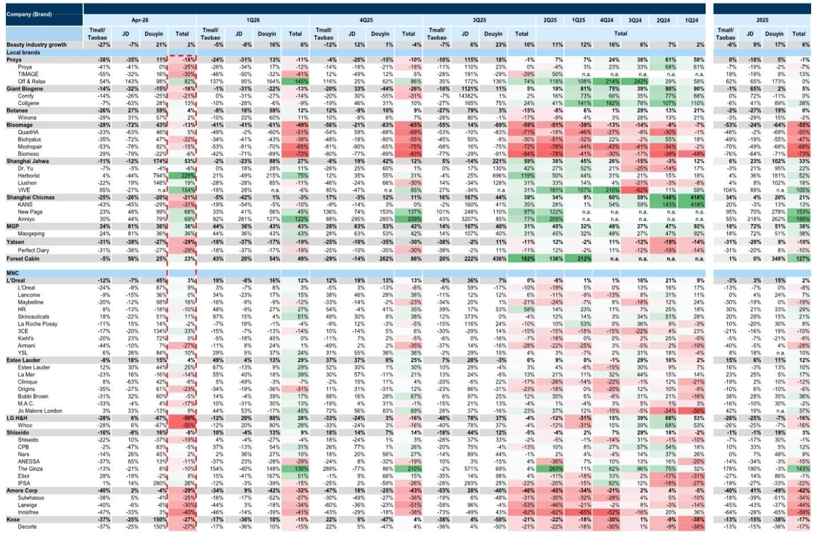
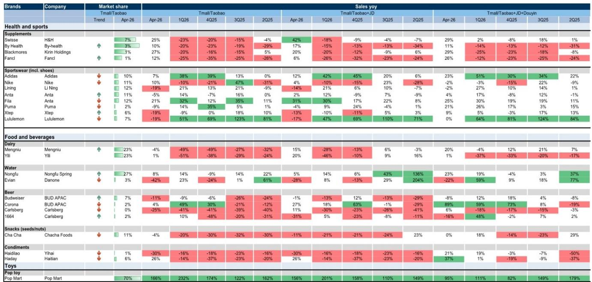
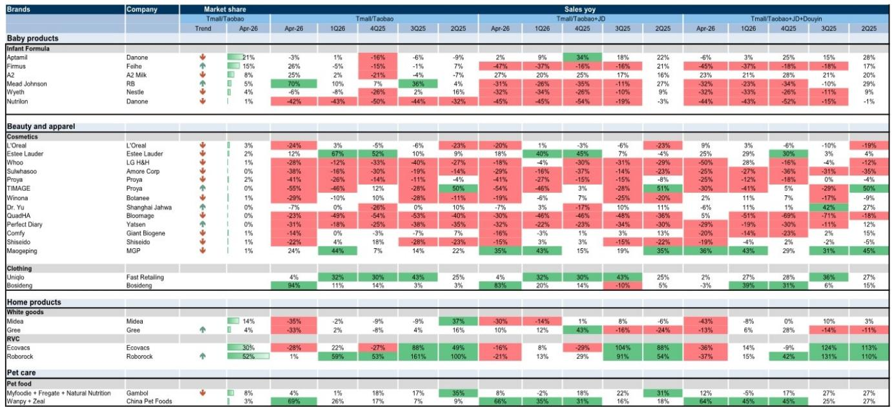

# 消费赛道正在经历“618前的分化”：真正有价值的不是大盘，是结构性赢家

四月的线上消费数据，像一面棱镜，折射出中国消费市场正在发生的深层分化。某外资投行最新发布的Online Brand Tracker显示，在Tmall/Taobao/JD三大平台合计口径下，宠物食品和保健品录得10%和11%的同比增长，而美容护肤和白色家电分别下滑23%和22%。这种分化并非简单的“消费降级”或“消费升级”所能概括。

这份报告的价值，不在于它告诉我们哪些品类涨了、哪些跌了——这些数字本身只是结果。真正值得关注的，是数据背后暴露出的三个结构性信号：第一，618大促前的品牌策略分化已经提前显现，头部品牌正在用不同的渠道组合和定价策略重新划分地盘；第二，抖音作为增量引擎的角色进一步强化，但部分品牌对单一平台的依赖风险也在上升；第三，户外和运动服饰的增速放缓并非需求问题，而是基数效应和季节性扰动叠加后的短暂调整。

以下是我们从这份报告中提炼出的四个关键洞察，以及一个尚未被充分回答的问题。

## 1. 宠物食品和保健品是当前最具韧性的结构性赛道，但驱动逻辑截然不同

四月数据中，宠物食品在Tmall/Taobao/JD合计增长10%，保健品增长11%。更值得注意的是，这两个品类并非只是短期脉冲——从季度趋势看，宠物食品从1Q26的-5%跃升至4月的+10%，保健品从1Q26的-8%改善至+11%。这意味着它们的增长具备连续性，而非单月偶发。

但两者的增长驱动力完全不同。宠物食品的增长更多来自量价齐升：Tmall/Taobao口径下，宠物食品四月销售额增长14%，其中销量持平，ASP同比上升约14个百分点。这暗示着消费者在宠物消费上愿意支付更高单价，而非单纯增加购买频次。保健品则更多是价格驱动：Tmall/Taobao销量同比下降14%，但ASP同比上升24%，导致销售额仍录得6%的正增长。这说明保健品品类的消费者正在“消费升级”——买得更少，但买得更贵。

对投资者而言，这两个品类的差异化增长逻辑意味着不同的竞争焦点。宠物食品的竞争正从“抢份额”转向“抢心智”，品牌能否建立溢价能力将成为下一阶段的关键。保健品则面临一个更微妙的问题：ASP的提升能否持续，还是只是短期促销策略调整带来的表象？报告未对此展开详细拆解，这需要更细分的价格带数据来验证。

## 2. 美容护肤的深度下滑暴露了国货品牌的渠道依赖风险，而非简单的外资回流

四月美容护肤品类在Tmall/Taobao/JD合计同比下降23%，较1Q26的-6%大幅恶化。但更值得细看的，是品牌层面的分化。

国货品牌中，上海家化、MGP和Forest Cabin分别录得53%、36%和23%的同比增长，主要驱动力分别是抖音和京东。而珀莱雅、巨子生物、上美、逸仙电商和华熙生物则分别下滑18%、16%、21%、29%和13%。外资品牌同样分化：欧莱雅和雅诗兰黛在抖音支持下分别实现3%和4%的正增长，而资生堂、LG H&H、爱茉莉和Kose分别下滑8%、50%、29%和27%。

这些数字共同指向一个结论：美容护肤的疲软并非“国货退潮、外资回归”的简单叙事，而是渠道红利的结构性再分配。那些在抖音上建立了强势运营能力的品牌，无论国货还是外资，都获得了相对更好的表现。而那些过度依赖Tmall/Taobao的品牌，即使产品力不弱，也承受了平台流量下滑的冲击。

这里有一个报告尚未完全回答的关键问题：抖音的增量还能持续多久？随着抖音电商体量扩大，获客成本必然上升，品牌在抖音上的ROI拐点何时到来，将直接影响当前领先品牌的可持续性。对此，报告没有给出明确判断，但这恰恰是决策者需要持续追踪的核心变量。

## 3. 运动服饰的四月放缓是季节性扰动，但户外品牌的基数效应值得警惕

运动服饰品类四月合计增长6%，较1Q26的26%明显放缓。运动鞋更是从1Q26的+4%降至-5%。报告明确指出，这主要反映不利天气和春节消费季需求前置的影响。

但品牌层面的分化更具启示意义。户外品牌如始祖鸟、萨洛蒙以及Lululemon出现更明显的放缓，报告将其归因于较高的基数。阿迪达斯、Fila、Puma、特步、亚瑟士和ON则展现出更强的韧性。

这意味着，运动服饰赛道的竞争正在从“品类红利”转向“品牌运营红利”。当整体增速回归常态，那些具备多品牌矩阵、全渠道运营能力和强供应链效率的企业，将比单纯依赖单一户外趋势的品牌更具抗风险能力。特别是，报告提到品牌正在执行全渠道策略，包括得物等新兴渠道和线下渠道，这意味着单一平台的数据可能无法反映品牌的全貌——这对依赖线上数据做投资判断的投资者来说，是一个重要的警示。

## 4. 白色家电和婴儿奶粉的持续低迷，暗示地产后周期和人口结构的影响仍未出清

白色家电四月同比下降22%，较1Q26的-15%进一步恶化。婴儿奶粉下降14%，同样弱于1Q26的-11%。这两个品类的共同特征是：都与地产周期和人口结构高度相关。

白色家电的疲软并非短期现象。从季度趋势看，该品类自4Q24以来一直处于负增长区间，且降幅在扩大。这可能意味着，地产竣工面积的下滑仍在传导至家电需求端，而补贴政策的边际效应正在递减。婴儿奶粉的下滑则更为结构性——出生人口的长期下降趋势决定了这个品类的基本面压力，促销和渠道创新只能延缓、无法逆转。

对于这两个品类，报告的数据本身已经给出了清晰的判断：它们不太可能通过618大促实现趋势反转。投资者需要关注的，不是它们何时反弹，而是哪些企业能在存量市场中通过份额提升来对冲行业下行——这需要更细分的品牌和价格带数据，报告并未完全展开。

## 5. 一个尚未被充分回答的问题：618大促能否成为分化的分水岭？

报告在多个地方提到了618大促的前瞻影响，但没有给出明确的预测。从历史规律看，大促前的四月数据往往具有“蓄力”特征——品牌会调整投放节奏、控制折扣深度、优化库存结构，以便在618期间集中释放。

但今年的情况可能更为复杂。一方面，抖音和传统电商平台的竞争加剧，品牌面临渠道选择的“囚徒困境”；另一方面，消费者对价格促销的疲劳感在上升，单纯的价格战可能难以换来增量。更重要的是，报告显示部分品类的ASP在四月出现异常波动——如保健品ASP同比上升24%，而销量下降14%——这可能是品牌主动提价以改善利润结构，也可能只是促销节奏调整的副产品。

这些不确定性意味着，618之后的数据将比四月数据更具判断价值。如果那些在四月表现强劲的品牌（如宠物食品、保健品）能在618期间延续增长，说明其增长具备内生动力；如果只是大促前的“压货式”增长，则后续可能面临回调。同样，那些四月表现疲弱的品牌（如美容护肤、白色家电），如果能在618期间实现边际改善，其估值修复的逻辑才可能成立。

这些问题的答案，需要更长时间维度的数据来验证。我们的社群正在持续追踪这些品类的周度销售数据，并在微信群中与会员讨论品牌层面的边际变化。如果你对这些未解问题感兴趣，欢迎加入我们的讨论。

---

Personal reading notes and learning share only. Not investment advice.

