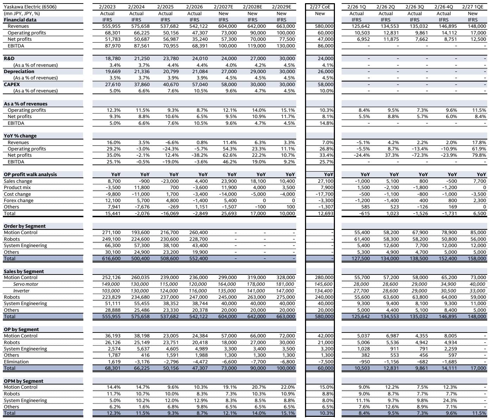
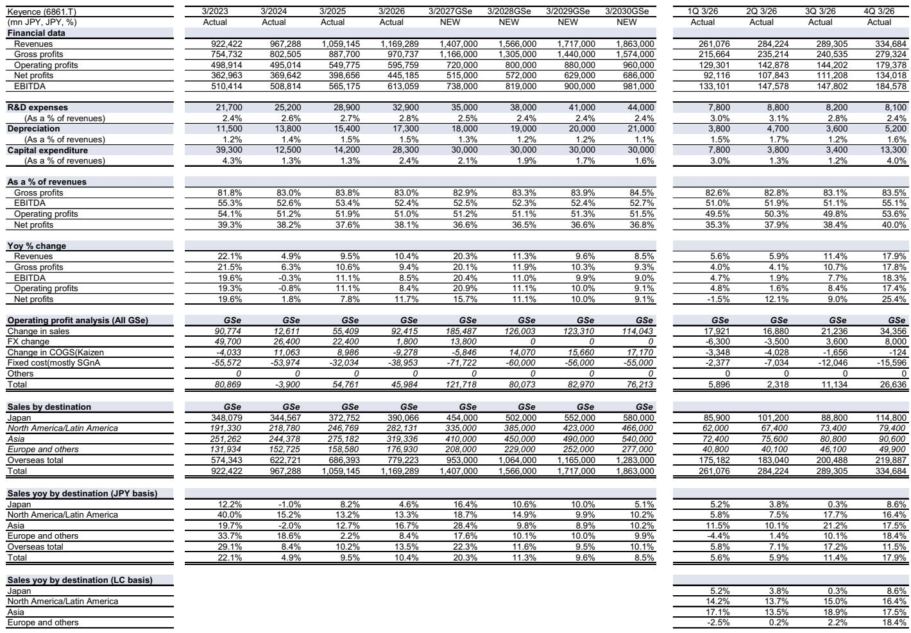
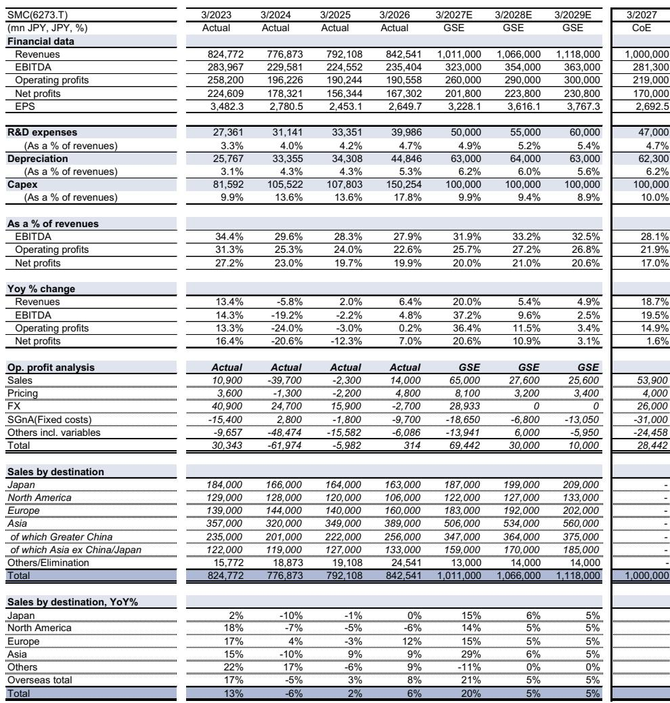

# The AI Capex Cycle Is Shifting From Demand Exuberance to Supply Discipline: Why the Next Winners in Japanese Machinery Will Be Defined by Production Capacity, Not Order Momentum

The conventional narrative surrounding Japanese factory automation stocks has long been a simple one: ride the wave of AI-driven semiconductor capital expenditure, and the rising tide will lift all boats. That narrative is now dangerously outdated. The January-to-March earnings season in Japan has made one thing unmistakably clear: the peak of the demand cycle is not a distant event to be feared in two years; it has already begun. Multiple companies reported that order inquiries hit record highs in April, with activity levels comparable to the previous peak cycles of 2021-2022 and 2017-2018. The Japan Machine Tool Builders' Association data for March-April set new all-time monthly highs, driven by Asia and the Americas. This is not a forecast; this is the present.

Yet the critical insight that separates strategic investors from momentum chasers is not the recognition that a peak cycle is underway. It is the understanding that the nature of this peak is fundamentally different from its predecessors. In past cycles, the primary analytical question was about demand duration: how long would the order boom last? In this cycle, the decisive factor has already shifted from the demand side to the supply side. The key question is no longer "Will orders keep growing?" but rather "Which companies have the production capacity to actually fulfill them without destroying their own margins?"

The report we are analyzing provides a comprehensive re-rating of Japanese FA stocks, upgrading Keyence from Neutral to Buy and THK from Sell to Neutral, while downgrading SMC from Buy to Neutral. These are not arbitrary adjustments. They reflect a structural conclusion: in a supply-constrained environment where demand is already surging beyond expectations, the premium will accrue to companies with unassailable competitive moats and scalable production capacity, not to those with the most aggressive sales growth assumptions. The market is about to learn a painful lesson about the difference between order growth and profit growth.

## The Demand Side Is Already Priced In: The Real Risk Is Not a Slowdown but a Supply-Demand Imbalance That Favors Incumbents

The report's data on semiconductor capital expenditure is striking. The global tech team forecasts semiconductor capex growth of 29 percent in calendar 2026, 17 percent in 2027, and a deceleration to 3 percent in 2028. Wafer fabrication equipment growth is even more aggressive: 28 percent in 2026, 32 percent in 2027, and 12 percent in 2028. This trajectory implies a high-growth environment through at least calendar 2027. For Japanese machinery companies, the translation is direct: machine tool orders are projected to reach 1.9 trillion yen in fiscal 2027, representing 11.5 percent year-on-year growth, before a modest 5.3 percent decline in fiscal 2028.

These numbers are already well understood by the market. The stock reactions to earnings announcements have been volatile, but the underlying direction is clear. What is less appreciated is the structural implication of this demand surge for the supply chain. The report notes that while demand is rising sharply and signs of advance ordering are emerging, the situation remains "within a controllable range." That phrase deserves careful scrutiny. It suggests that the current capacity constraints are not yet catastrophic, but they are approaching a threshold where the dynamics shift.

When supply is tight and demand is accelerating, the natural market response is price increases. The companies that can raise prices without losing customers are those with proprietary technology, deep customer relationships, or irreplaceable components. This is where the concept of a "competitive moat" becomes operational, not just theoretical. Keyence, which the report upgrades to Buy, exemplifies this. The company's ability to maintain premium pricing in a tight supply environment is not a coincidence; it is a function of its direct sales model, its application engineering capabilities, and its reputation for reliability. In a seller's market, the strongest sellers win disproportionately.

The corollary is equally important. Companies that lack pricing power or that compete primarily on cost will see their margin expansion capped, even as order books swell. The report's downgrade of SMC to Neutral is instructive here. SMC's fundamentals remain strong, but the report identifies "uncertainty over margins, ROC, and capital allocation policies" as factors that will weigh on valuations. This is a subtle but powerful point: in a peak cycle, the market will begin to discount not just current earnings but the sustainability of those earnings and the quality of capital deployment. SMC may deliver strong numbers, but if investors cannot see a clear path to improving returns on capital or a coherent capital allocation strategy, the multiple will compress.

## The Supply Capacity Constraint Will Create a New Hierarchy of Winners and Losers That the Market Has Not Yet Discounted

The report makes a forward-looking observation that deserves to be elevated to a central thesis: "we expect to see typical upcycle earnings trends, including price increase penetration and the accompanying margin expansion, as well as the benefits of strong volume trends supported by robust demand. As a result, we believe sufficient supply capacity will increasingly become an important factor for companies."

This is the single most important sentence in the entire analysis. It reframes the investment question from "Which companies have the best demand exposure?" to "Which companies have the operational capacity to monetize that demand?" The difference is not semantic; it is the difference between buying a stock that looks cheap on trailing earnings and buying a stock that is structurally positioned to compound value through the cycle.

Consider the implications for THK, which the report upgrades from Sell to Neutral. THK is a leading manufacturer of linear motion systems, a critical component in semiconductor manufacturing equipment and factory automation. The report explicitly states that THK's benefits from tight supply and demand "are likely to more than offset challenges from intensifying competition." This is a bet on capacity constraints, not on secular demand growth. The logic is that even if competition increases, the physical inability of the market to produce enough linear guides and ball screws means that THK will have pricing power and volume visibility that its competitors cannot match.

The same logic applies, in reverse, to companies that the report maintains as Sells. Fanuc, for example, remains a Sell with a target price of 5,600 yen and a return potential of negative 34 percent. Fanuc is a dominant player in CNC systems and robots, but its size and market position may actually work against it in a supply-constrained environment. Large incumbents often have rigid production schedules, long lead times, and complex supply chains that are difficult to flex. A smaller, more agile competitor might be able to capture incremental demand more efficiently. The report's valuation framework, which applies a 70 percent premium for Fanuc, suggests that the market is already paying for its brand and installed base, but the question is whether that premium is justified by the company's ability to execute in the current environment.

The report's target price changes are revealing. The largest upward revision is for THK, with a 44 percent increase from 5,200 yen to 7,500 yen. The largest downward revision is for SMC, with an 11 percent decrease from 90,000 yen to 80,000 yen. These are not marginal adjustments; they represent a fundamental re-assessment of which companies are positioned to benefit from the cycle's inflection point. The spread between the best and worst performers is likely to widen from here.

## The Capital Allocation Factor: Why the Market Is Now Demanding More Than Just Earnings Growth

One of the most underappreciated dimensions of the report is its emphasis on capital allocation policies. The report notes that "the direction of capital allocation policies — a major focus area for investors — has become clearer for companies post recent results." This is not a throwaway line. It reflects a structural shift in how Japanese equities are being valued, particularly in the machinery sector.

For decades, Japanese companies were notorious for hoarding cash, maintaining low dividend payout ratios, and investing in low-return projects. The Tokyo Stock Exchange's market restructuring initiatives, combined with pressure from activist investors and a generational shift in management, have changed this dynamic. Investors are now demanding that companies not only grow earnings but also demonstrate a coherent plan for deploying capital in ways that enhance shareholder value.

The report's upgrade of Keyence to Buy explicitly cites "expansion of capital allocation policies" as a reason. Keyence has historically been a cash-rich company with a conservative approach to capital returns. If management is signaling a more proactive stance, the re-rating potential is significant. Conversely, SMC's downgrade is partly attributed to "uncertainty over margins, ROC, and capital allocation policies." The market is effectively saying: we need more than a good order book; we need a credible plan for turning those orders into sustainable returns.

This has profound implications for stock selection. In the previous cycle, investors could buy any Japanese FA stock and expect to make money if the macro environment was favorable. That era is over. The market is now discriminating between companies that generate high-quality earnings and those that generate high-volume earnings. The report's valuation methodology, which applies different EV/EBITDA premiums to different companies, reflects this discrimination. Keyence receives a 170 percent premium, while Fanuc receives a 70 percent premium. The difference is not arbitrary; it reflects the market's assessment of earnings quality, competitive durability, and capital allocation discipline.

## What the Report Does Not Fully Answer: The China Conundrum and the Risk of Premature Cycle Compression

No analysis is complete, and the report leaves several critical questions unresolved. The most important is the role of China. The report notes that machine tool orders from China are projected to grow 20 percent in fiscal 2027 to 518 billion yen, before declining 10 percent in fiscal 2028. This is a significant assumption, and it is far from certain.

China's industrial policy has been unpredictable. The government's push for semiconductor self-sufficiency has driven massive investment in domestic fab capacity, but the sustainability of that investment is questionable. If Chinese demand decelerates faster than expected, the peak cycle could be compressed, and companies with high China exposure could face a sharp earnings reversal. The report does not adequately stress-test this scenario. It assumes a relatively orderly deceleration, but the history of Chinese industrial cycles suggests that the downside can be abrupt and severe.

Furthermore, the report does not fully address the geopolitical dimension. Export controls on advanced semiconductor equipment and components have created an artificial bifurcation in the market. Japanese machinery companies that supply to Chinese customers may face regulatory headwinds that are not captured in traditional demand forecasts. The report's projections are based on a "business as usual" assumption, but the regulatory environment is anything but stable.

Another unresolved question is the impact of advance ordering on cycle duration. The report acknowledges that "signs of advance ordering are starting to emerge" and that this could "prematurely shorten the cycle." If customers are double-ordering or pulling forward demand to secure supply, the reported order numbers may overstate true end-market demand. When the cycle turns, the inventory correction could be painful. The report does not provide a framework for estimating how much of the current order surge is genuine demand versus precautionary ordering.

## A Decision Framework for Investors: Three Questions to Ask Before Reallocating Capital in Japanese FA Stocks

Given the complexity of the current environment, investors need a structured approach to decision-making. The report's analysis can be distilled into three questions that should guide capital allocation in this sector.

First, can the company raise prices without losing market share? This is the single most important test. In a supply-constrained peak cycle, pricing power is the difference between margin expansion and margin compression. Companies like Keyence, with deep customer relationships and proprietary technology, pass this test. Companies that compete primarily on cost or that face commoditized end markets do not. Investors should examine each company's gross margin trajectory, its customer concentration, and its history of passing through cost increases.

Second, does the company have the production capacity to capture incremental demand without significant capital expenditure? The report emphasizes that "sufficient supply capacity will increasingly become an important factor." Companies that can flex their production lines quickly, that have diversified supply chains, and that have invested in automation will outperform those that are capacity-constrained. This is not just about having factories; it is about having the right kind of factories. Companies that have already invested in capacity during the downturn will be rewarded now, while those that cut capacity may miss the opportunity.

Third, does the company have a credible capital allocation policy? The market is now pricing in expectations for dividend growth, share buybacks, and investment in high-return projects. Companies that can articulate a clear strategy for deploying their cash flow will receive a valuation premium. Companies that are vague or that continue to hoard cash will be penalized. This is a structural shift, not a cyclical one. Investors should look for explicit targets for payout ratios, return on invested capital, and capital expenditure plans.

## The Unresolved Analytical Frontier: How to Value a Peak Cycle When the Peak Is Already Here

The most intellectually honest part of the report is what it does not claim to know. It provides a framework for the cycle, but it does not pretend to have perfect visibility. The report projects that machine tool orders will peak in fiscal 2027 and then decline modestly. But the history of industrial cycles is that they overshoot on both the upside and the downside. The peak could be higher and the trough could be deeper than the report's base case.

The question that the report implicitly raises but does not fully answer is this: how should investors position for a peak cycle when the peak is already in sight? The traditional approach is to rotate from cyclical to defensive names. But in this cycle, the "defensive" names are also cyclical, because they are all exposed to the same AI capex tailwind. The differentiation must come from stock-specific factors: pricing power, capacity, and capital allocation.

The report's rating changes provide a starting point, but they are not a complete solution. Investors who want to go deeper need to understand the nuances of each company's product mix, customer base, and competitive position. The report's charts on wafer fabrication equipment and semiconductor capital expenditure are essential reading, but they are the beginning of the analysis, not the end.

Join the community to read the full report and review the original charts.

*This article is for learning and discussion only and does not constitute investment advice.*

Personal reading notes and learning share only. Not investment advice.

