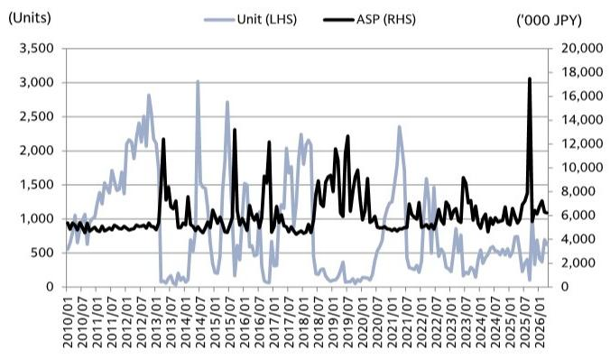
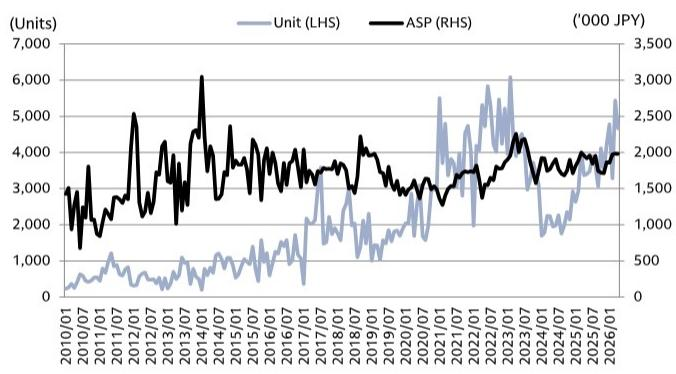
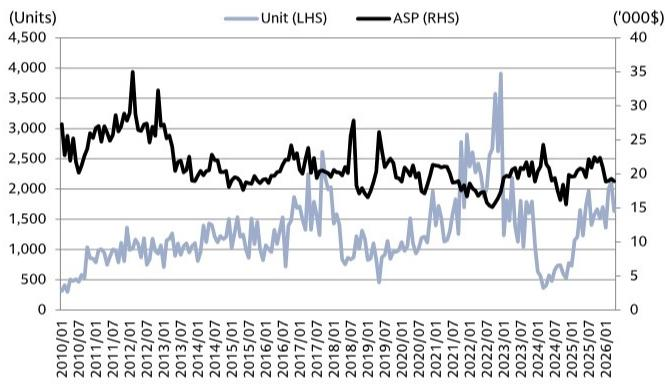

# Japan's Robot Export Data Reveals a Diverging Global Automation Cycle: AI Demand is Not a Rising Tide for All Players

The April 2026 trade statistics from Japan's Ministry of Finance are not just another monthly data dump. They represent the most granular, real-time signal available for global capital expenditure in automation, given that Japanese manufacturers account for the majority of the world's robot production. For investors tracking the industrial cycle, this data matters because it captures the actual movement of hardware, stripping away the noise of order backlogs and currency fluctuations. The headline figures tell a story of robust year-on-year growth, but the underlying patterns reveal a market that is far more fragmented, and far more strategic, than a simple recovery narrative suggests. The core insight is this: the global automation cycle is not uniform; it is being reshaped by AI-driven demand in specific Chinese applications, a structural slowdown in North American general manufacturing, and a dramatic, project-based surge in India that may not be sustainable. This divergence demands a more nuanced investment framework than simple regional exposure.

Why now? Because the April data marks a critical juncture. The unwinding of the fiscal year-end effect in Japan, which typically inflates March shipments, has exposed the true underlying momentum. The month-on-month declines in several key categories, particularly for Fanuc's robots and Robodrills, suggest that the post-pandemic catch-up cycle is giving way to a more selective, application-specific investment environment. The market is no longer buying automation broadly; it is buying it for very specific, high-return use cases. For investors, the question is no longer "is automation growing?" but rather "which automation, where, and why?" The April customs data provides the first clear answer to that question in 2026.

## The AI Theme in China is Boosting Robot Volumes, but the Benefits are Concentrated in Smaller, More Agile Platforms

The most striking data point in the April release is the 33% year-on-year increase in robot export volumes from Japan to China, with Fanuc's own China exports up 38% year-on-year. At first glance, this appears to validate the thesis that Chinese manufacturing is on a relentless automation drive, powered by AI and semiconductor-related investment. However, the month-on-month decline of 18% in Fanuc's China robot exports tells a different story. This is not a steady, compounding trend; it is a volatile, project-driven surge that appears to have peaked post-Lunar New Year. The report's authors correctly identify that the momentum is not being felt equally across all robot types. They posit that companies with a strong presence in smaller 6-axis or SCARA robots are better positioned to capture AI-related demand in China. This is a critical strategic distinction. The AI-driven factory of the future, particularly in electronics assembly and semiconductor handling, requires precision, speed, and a small footprint. These are not the domain of heavy-duty, large-payload robots used in automotive stamping lines. The implication is clear: the AI tailwind is a structural positive for the automation industry, but it is not a tide that lifts all boats. It favors suppliers of specific form factors and applications, and it may be creating a two-tier market where growth is concentrated in a narrow set of high-value, high-tech applications while traditional factory automation remains sluggish.

## North American Robot Demand is Turning Negative, Signaling a Broader Slowdown in General Industrial Capex

While China offers a mixed but positive picture, the North American data is unequivocally concerning. Fanuc's robot export volume to North America fell 1% year-on-year and 23% month-on-month. The report notes that year-on-year momentum has turned negative, and the authors warn that the environment in North America may be changing. This is not a blip. It is a confirmation that the reshoring and industrial policy-driven investment boom in the United States is losing steam, at least in the discrete manufacturing sectors that buy robots. The data suggests that general industrial capex in North America, outside of specific mega-projects, is cooling. For investors, this is the most important bearish signal in the report. It implies that the consensus view of a durable, multi-year US industrial renaissance may be overstated. The robot data is a leading indicator. If robot shipments are declining, it means that factory managers are not confident enough in future demand to invest in automation. This could be a function of high interest rates, a slowing economy, or simply a digestion period after a massive post-pandemic investment wave. Regardless of the cause, the trend is clear and negative. The strategic implication is that companies with heavy exposure to the North American general industrial market are facing headwinds that are not yet fully priced into their valuations.

## The Robodrill Data Exposes a Structural Shift in Smartphone Supply Chains, with India Emerging as a Key but Immature Alternative

The Robodrill data, which tracks Fanuc's vertical machining centers used extensively in the production of metal casings for smartphones and electronics, is perhaps the most revealing of the entire report. Global Robodrill export volume was down 24% year-on-year. The decline in China was 27% year-on-year. The report attributes this to a rollover from peak post-Lunar New Year demand from major US smartphone makers and notes that the peak season ended early. This is not simply a cyclical issue. The authors suggest that persistently high labor costs may be limiting the momentum of the current cycle. This is a euphemism for a more profound structural shift. The smartphone industry, particularly for high-end devices, is facing demand saturation. The need for new, highly automated production lines is diminishing. The massive capital expenditure cycles that defined the smartphone boom are giving way to a more incremental, maintenance-oriented investment pattern. The one bright spot is India, where Robodrill export volume grew 328% month-on-month. However, the report is careful to note that the volume figure is low compared with past levels and that it is too early to suggest that demand from US smartphone makers has completely shifted to India. This is a classic "watch and wait" signal. The data suggests that India is being used as a secondary, incremental production base, not a primary replacement for China. The strategic takeaway is that the smartphone capex cycle is in a structural decline, and the shift to India, while real, is not yet large enough to offset the weakness in China.

## The Report Leaves a Critical Question Unanswered: Is the India Surge a Sustainable Trend or a One-Off Project Blip?

The most analytically unsatisfying aspect of the April data is the apparent surge in robot and Robodrill exports to India. Fanuc's Robodrill exports to India jumped 328% month-on-month, and Yaskawa Electric's robot exports to India rose 140% month-on-month. The report attributes the Yaskawa increase to automotive-related projects and describes it as reflecting "project circumstances specific to India rather than a global trend." This is a crucial caveat. The data is consistent with a large, one-time automotive plant build-out, not a broad-based, sustainable increase in Indian manufacturing competitiveness. The question that the report cannot yet answer is whether this is the beginning of a multi-year structural shift of global manufacturing to India, or simply the peak of a single project cycle. The volume figures, while impressive on a percentage basis, are still low in absolute terms. The report's authors are wisely cautious. They do not extrapolate the trend. For investors, this is the most important unresolved analytical question. If the India trend is sustainable, it represents a massive opportunity for automation suppliers. If it is a one-off, then the global automation market is facing a much bleaker outlook, with weakness in China and North America and no clear, large-scale replacement market. The data is simply not conclusive enough to make a call. This is where strategic patience is required, and where further data from subsequent months will be decisive.

## A Decision Framework for Investors: How to Read the Automation Cycle Through Trade Data

The April trade statistics provide a powerful, real-time framework for making investment decisions in the automation space. Instead of relying on company guidance or macroeconomic forecasts, investors can use this data to build a leading indicator dashboard. The framework has three pillars. First, monitor the China robot volume trend for small, 6-axis and SCARA robots versus larger industrial robots. A sustained divergence in favor of smaller robots would confirm the AI-driven demand thesis and favor suppliers with that specific product mix. Second, track the North America robot volume trend on a three-month moving average. If the year-on-year decline deepens, it signals a broader industrial recession in the US and suggests avoiding companies with high North American exposure. Third, watch the India Robodrill volume trend for at least two more months. If the volume holds above 700 units per month (Fanuc's estimate for April), it would suggest the beginning of a structural shift. If it reverts to below 500 units, it confirms the one-off project thesis. This framework allows investors to move beyond simple "buy Japan automation" or "sell Japan automation" narratives and make stock-specific decisions based on the actual, granular flow of hardware around the world. The April data is a warning shot: the automation cycle is becoming more complex, and the winners will be determined by product mix and geographic exposure, not by sector beta.

## Join the community to read the full report and review the original charts.

The analysis above is based on a single month of customs data, but the full report contains multi-year trend charts, detailed breakdowns by port and product type, and the analysts' proprietary estimates for Fanuc and Yaskawa Electric. Understanding the nuances of these charts, particularly the relationship between volume and average selling price, is essential for building conviction around the investment thesis. The original report also includes the price targets and risk assessments for the covered companies, which are critical for any investment decision. The data is complex, but the opportunity to gain a true informational edge over the market is significant. The full report provides the context and the detail that this article cannot fully capture.

*This article is for learning and discussion only and does not constitute investment advice.*

Personal reading notes and learning share only. Not investment advice.

