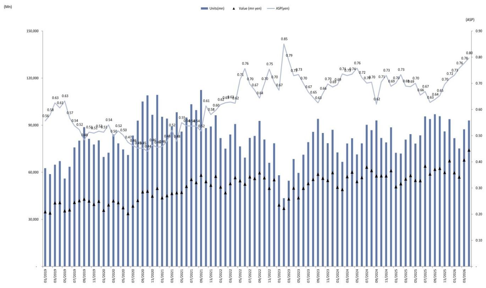
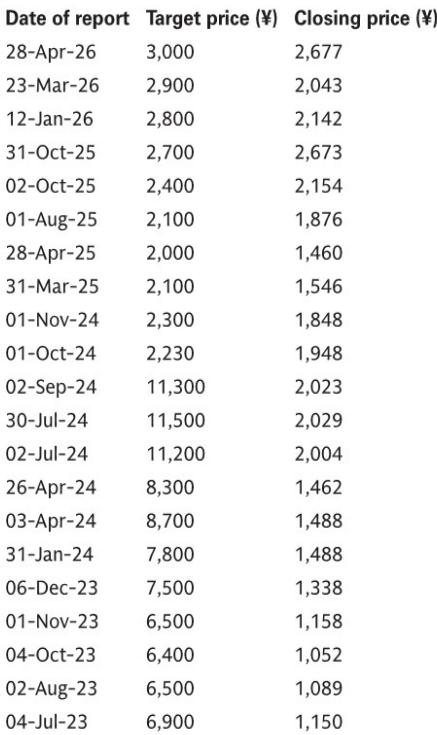
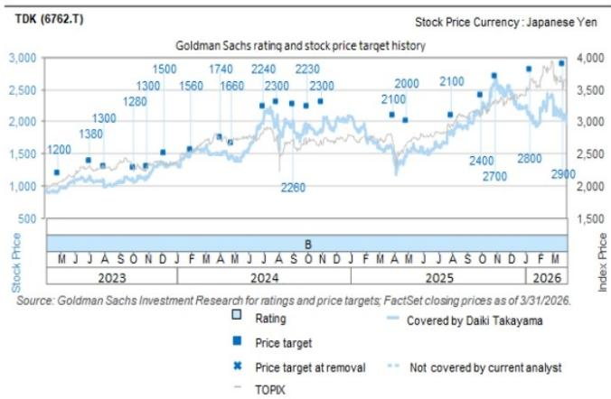

# AI驱动的MLCC周期可能比任何人预期的都要长——4月贸易数据确认量价齐升仍在加速

市场对MLCC（多层陶瓷电容）的讨论，过去半年里大多集中在“周期会不会见顶”这个问题上。4月日本财务省贸易统计数据的出炉，给出了一个值得认真对待的答案：出口量环比增长7%，平均出口价格环比上涨3%，出口金额同比大增28%。这不是周期末端的信号，而是周期中段的加速。

某外资投行在最新研报中明确表示，当前由AI驱动的MLCC周期，可能是历史上规模最大、持续时间最长的一次，而我们现在仍处于早期阶段。这个判断与市场主流叙事存在显著偏差——多数投资者仍倾向于用消费电子周期的旧框架来理解MLCC，而忽略了AI服务器带来的结构性需求重塑。

我们仔细拆解了这份研报的核心逻辑，发现真正重要的不是短期数据有多好，而是三个正在改变行业竞争格局的结构性力量：技术门槛的不可逆提升、定价权的转移，以及供应商格局的固化。这些力量叠加在一起，意味着本轮周期的利润分配方式将与过去截然不同。

## 1. 4月贸易数据确认的不是“好”，而是“加速”——量价齐升的斜率在变陡

先看一组关键数字。4月MLCC出口量环比增长7%，出口额环比增长9%，平均出口价格环比增长3%。同比来看，这三个数字分别是10%、28%和16%。研报特别强调，这些数据与日本MLCC制造商近期公布的财报高度吻合——订单依然非常强劲。

但更值得关注的是趋势的斜率变化。环比3%的ASP上涨，在MLCC这样一个通常价格缓慢下降的行业里，本身就是一个强烈信号。过去十年中，MLCC的平均价格大多呈现温和下行趋势，只有2017-2018年的超级周期曾出现过价格持续上涨。当前的价格走势，正在重现甚至超越那个时期的特征。

这意味着什么？市场对MLCC的定价逻辑正在发生根本性转变。过去，MLCC被视为大宗商品化的电子元件，价格随供需波动，长期趋势向下。但现在，AI服务器对低电压、大容量MLCC的需求，正在将这一品类从“大宗商品”推向“定制化技术产品”。价格不再仅仅由供需决定，而是越来越多地由技术复杂度决定。

## 2. AI服务器对MLCC的需求不是“量增”，而是“质变”——技术门槛正在重塑竞争格局

研报中一个容易被忽略但极为关键的判断是：围绕GPU/ASIC的低电压、大容量MLCC，正在同时推进小型化和容量提升，技术要求在变得前所未有的苛刻。这不是简单的“多装几个电容”的问题，而是在有限的板级空间内，实现更高的电容密度和更低的等效串联电阻。

目前，能够进入这一市场的供应商只有三家：村田制作所、三星电机和太阳诱电。TDK目前尚未掌握进入低电压、大容量MLCC市场的技术，正在等待与日本化学工业株式会社的材料开发成果。

这个供应商格局本身就说明了问题。AI服务器对MLCC的技术要求，已经将大多数中低端供应商挡在门外。能够参与这场游戏的玩家，将享受到需求扩张带来的全部红利。而无法参与的玩家，即使整体市场需求增长，也只能在利润较薄的传统应用中竞争。

这不再是一个“所有MLCC厂商都受益”的周期。这是一个赢家通吃的周期。技术能力决定了企业能否站上本轮周期的核心赛道。

## 3. 定价权正在从“市场”转移到“供应商”——每次技术迭代都等于一次实质性的涨价

研报中有一个表述值得反复品味：“我们预计适当的定价（每次技术变更时重新设定产品价格，这实际上等同于涨价）。”这句话揭示了本轮周期与以往最大的不同。

在传统MLCC周期中，价格主要由市场供需决定，供应商是价格接受者。但AI服务器MLCC的技术迭代速度极快，每一代新产品在性能上都有显著提升。供应商可以在推出新产品时重新定价，这个价格往往远高于旧产品。由于客户对性能的追求优先于对成本的敏感，这种定价策略是可持续的。

这意味着，即使整体MLCC市场没有出现供应短缺，头部供应商也能通过产品结构升级实现ASP的持续提升。4月数据中ASP环比上涨3%，很可能就是这种结构性定价权的体现，而非短期的供需失衡。

这对投资者的启示是：传统的“周期股”估值框架可能不再适用。如果定价权能够持续，MLCC头部企业的利润波动性将显著降低，估值中枢有望上移。

## 4. 报告尚未完全回答的关键问题：TDK的追赶路径与材料突破的时间窗口

研报在肯定村田和太阳诱电的同时，对TDK的描述留下了一个明显的悬念。TDK目前无法进入低电压、大容量MLCC市场，但它正在通过材料开发寻求突破。如果TDK成功，它将从一个“旁观者”转变为“参与者”，这将对现有供应商格局产生重大影响。

但这里有几个关键变量尚未明确：

第一，材料开发的时间表。与日本化学工业株式会社的合作何时能产生可商业化的成果？这个时间窗口决定了TDK能抓住多少本轮周期的红利。如果突破来得太晚，村田和太阳诱电可能已经建立了难以撼动的客户关系和产能优势。

第二，TDK在高压、大容量MLCC领域的优势是否可持续。研报指出，TDK正在接收用于电源电路的高压、大容量MLCC的旺盛订单，这些产品与电动汽车等汽车应用几乎可以使用相同的技术。这为TDK提供了稳定的产能利用率和现金流，但也意味着它的资源可能被分散在两个不同的技术方向。

第三，技术突破后的定价能力。即使TDK成功进入市场，它能否获得与现有供应商同等的定价权？技术后来者通常需要以更低的价格争取客户，这可能会压缩整个行业的利润空间。

这些问题没有在研报中得到充分回答，但它们将是决定本轮周期最终利润分配的关键变量。

## 5. 如何用这份报告更新你的观察框架

基于以上分析，我们认为投资者需要重新调整观察MLCC行业的框架。传统的“出货量增速+库存周期”二维框架已经不够用了。以下三个维度值得纳入日常跟踪：

第一，技术迭代速度。关注头部供应商每代新产品的电容密度提升幅度和体积缩小幅度。迭代速度越快，定价权越强，护城河越深。

第二，客户集中度与客户结构。AI服务器MLCC的客户高度集中在少数几家GPU/ASIC厂商手中。这些客户的议价能力极强，但它们对技术稳定性和供应可靠性的要求也极高。一旦供应商通过认证，被替换的难度很大。因此，供应商的认证进展和客户粘性比短期订单更重要。

第三，材料路线的分化。不同供应商在材料科学上的路线选择，将决定它们在未来3-5年的竞争位置。TDK与日本化学工业的合作、村田的内部材料研发、三星电机的垂直整合优势，这些差异将逐步体现在产品性能和成本结构上。

目前来看，村田和太阳诱电在低电压、大容量MLCC领域的领先地位相对稳固，但这并不意味着没有变数。材料科学的突破往往具有非线性特征，一个关键专利或一种新材料的商业化，可能会在短时间内改变竞争格局。

## 6. 一个尚未被充分定价的变量：AI服务器MLCC的“双轨”需求结构

最后，我们想提出一个从研报逻辑推导出的判断，这个判断在报告中并未被明确阐述，但对理解本轮周期的长度和深度至关重要。

AI服务器对MLCC的需求实际上存在“双轨”结构。一轨是围绕GPU/ASIC的低电压、大容量MLCC，技术门槛最高，竞争格局最清晰。另一轨是围绕电源电路、存储接口等周边电路的高压、大容量MLCC，技术门槛相对较低，但需求规模更大。

这两条轨道的需求驱动因素不同。低电压轨道的需求增长取决于AI芯片的出货量和每颗芯片的MLCC用量，这是当前市场关注的焦点。但高压轨道的需求增长取决于AI服务器的整机出货量和电源架构的复杂度，这个变量与数据中心基础设施建设的节奏高度相关。

目前，市场对低电压轨道的定价已经较为充分，但对高压轨道的需求弹性和利润贡献可能仍然低估。TDK之所以能在高压领域获得旺盛订单，恰恰说明这条轨道的需求正在加速释放。如果高压轨道的增长能够持续，TDK的估值逻辑将得到有力支撑，而不仅仅是“等待材料突破”的期权价值。

---

以上是我们基于这份研报的核心判断和深层推理。但必须承认，本文只能覆盖这份研报的一部分内容。研报中还有大量关于估值方法、风险因素、不同情景下的利润敏感性分析等细节，无法在一篇文章中完整呈现。例如，研报对村田、太阳诱电、TDK三家公司的目标价设定逻辑——分别给予50%、30%、10%的行业估值溢价——背后隐含了对它们竞争地位和增长前景的差异化判断，这些判断的推导过程本身就值得仔细推敲。

如果你希望深入理解这些估值溢价背后的假设，或者想看到完整的财务模型和情景分析，欢迎来我们的知识星球微信群里继续讨论。在那里，我们会分享完整的中文研报解读、原始数据图表，以及我们自己对关键未解问题的持续跟踪。

Personal reading notes and learning share only. Not investment advice.

