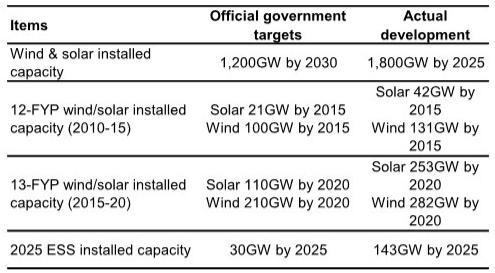
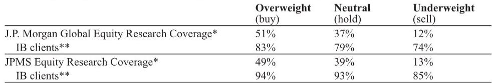
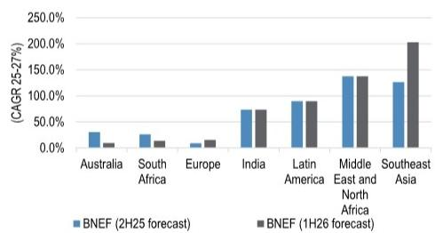

# China Renewables Are No Longer Just a Supply-Chain Story: The New Demand Drivers Are Reshaping the Investment Landscape

The narrative around Chinese renewable energy has shifted decisively. For years, the dominant thesis was about manufacturing dominance, cost deflation, and oversupply. That story is becoming secondary. What is emerging in its place is a demand-driven re-rating, powered by two structural forces that are largely independent of China's domestic solar glut: global energy security fears triggered by the Middle East conflict, and the insatiable power infrastructure needs of developed-market data centers. This is not a cyclical bounce. It is a fundamental reordering of where value accumulates in the renewables value chain.

Investor sentiment has already moved. Since mid-May, select Chinese renewable stocks have rallied sharply against a flat Shanghai Composite Index. But this is not a broad-based recovery. The market is making fine distinctions. It is rewarding companies with exposure to energy storage systems tied to artificial intelligence data centers, distributed generation in emerging markets, and offshore wind infrastructure. It is punishing or ignoring companies that remain dependent on the domestic solar module or wind farm tariff cycle. The key insight from a recent global investment bank report, based on direct engagement with company managements at a major summit, is that the winners are those positioned at the intersection of new demand vectors, not those simply waiting for domestic consolidation.

This article unpacks the strategic logic behind these shifts. It argues that investors must now think in terms of three distinct, non-overlapping demand pools: AI-driven energy storage, emerging-market distributed generation, and policy-backed offshore wind. Each has a different risk profile, time horizon, and set of beneficiaries. Understanding which companies are exposed to which pool is the central analytical task. The report also raises unresolved questions about the pace of solar industry consolidation and the implications of power market liberalization for renewable asset owners. These open issues are precisely why the full report and its supporting data are worth reviewing in detail.

## The AI Data Center Boom Has Created a New, High-Value Use Case for Energy Storage That Is Already Producing Orders

The most consequential development for China's renewable energy storage sector is not a policy change or a new battery chemistry. It is the emergence of artificial intelligence data centers as a distinct and high-value customer class for energy storage systems. This is a genuinely new demand pool, and it is already generating orders. One leading inverter and storage company has confirmed that it has received AI data center-related ESS orders from power developers. This is not a theoretical opportunity. It is commercial reality.

The logic is compelling. Aging grid infrastructure in developed markets cannot reliably support the rapid power draw and extreme uptime requirements of AI data centers. Energy storage systems are not just backup power. They are becoming integral to grid interconnection, enabling "grid-friendly" data centers that can smooth load spikes, support rapid startup, and potentially secure priority grid access. This creates a value proposition that is distinct from utility-scale storage, which competes primarily on cost and duration. AI data center storage competes on reliability, speed, and grid integration. That is a higher-margin, faster-cycle business.

The strategic implication is clear. Companies that can demonstrate early traction in this segment are building a moat. They are gaining experience with a demanding customer base, establishing relationships with data center developers, and proving their technology in a mission-critical environment. The report notes that the lead time for utility-scale storage projects is long, implying that cost pressure will persist in that segment. But AI data center storage, by contrast, may have different contract structures and pricing dynamics. The question that remains unanswered, and which the full report likely explores in more detail, is how large this addressable market can become. If data center power demand grows at the rates many are forecasting, this could become a multi-gigawatt annual market for ESS within three to five years. Investors should be tracking every data point on AI data center capex plans and grid interconnection timelines.

## Surging Distributed Generation Storage Demand in Emerging Markets Creates a Second, Independent Growth Vector

While AI data centers capture the headlines, a quieter but equally powerful demand surge is underway in emerging markets. The Middle East conflict has disrupted energy supplies and heightened awareness of energy security across Southeast Asia, South Africa, Latin America, and the Middle East and North Africa region. The response has been a sharp increase in demand for distributed generation energy storage systems. This is not utility-scale. It is rooftop solar paired with batteries, commercial and industrial installations, and small-scale microgrids.

The growth rates are striking. BloombergNEF data, cited in the report, shows projected compound annual growth rates for distributed ESS from 2025 to 2027 that exceed 100% in Southeast Asia and the Middle East and North Africa, and approach 90% in Latin America. India is projected at 70%. These are not marginal markets. They are becoming the primary growth engine for certain Chinese manufacturers.

The structural advantage for Chinese companies in this segment is clear. They have the manufacturing scale, the cost structure, and the product portfolio to serve these markets profitably. The report highlights that distributed generation ESS has a shorter order-to-delivery cycle than utility-scale projects, meaning that cost pass-through is already happening in some orders. This is a positive for companies with strong distribution networks in emerging markets and a product mix suited for smaller-scale, faster-turnaround installations.

The strategic question for investors is which companies are best positioned to capture this demand. The report points to one inverter manufacturer as a key beneficiary, and also suggests that wind turbine makers could benefit if utility-scale renewable deployment accelerates in emerging markets. But the distribution of this demand is not uniform. It depends on local partnerships, regulatory frameworks, and product specifications. The full report likely provides a more granular breakdown of which geographies and which product segments are growing fastest. For now, the takeaway is that emerging-market distributed storage is a large, fast-growing, and relatively underappreciated demand pool that is independent of both Chinese domestic policy and developed-market data center trends.

## Offshore Wind Policy Clarity Has Created a Visible Growth Trajectory for High-Barrier Supply Chain Companies

For the first time, China's State Council has issued a national offshore wind capacity target for 2030: 100 gigawatts. This is a significant policy signal. It provides multi-year visibility for the entire offshore wind supply chain. And within that chain, one segment stands out as having the most attractive structural characteristics: submarine cables.

The report makes a clear argument for why submarine cables are the preferred exposure within offshore wind. The market is concentrated, with high entry barriers due to manufacturing complexity, certification requirements, and the need for specialized installation vessels. This means that the companies already in the market have pricing power and visible order books. The report affirms an Overweight rating on one leading cable manufacturer, citing improved growth visibility from the new national target.

The historical precedent supports this optimism. The report notes that China has consistently exceeded its national renewable capacity targets by a wide margin. Since 2020, actual installations have surpassed targets by approximately 90% on average. This suggests that the 100-gigawatt offshore wind target for 2030 may be a floor, not a ceiling. If history is any guide, actual installations could be significantly higher.

The strategic implication for investors is that offshore wind is not a speculative bet. It is a policy-backed, multi-year growth story with identifiable beneficiaries. The key risk is execution. Offshore wind projects are complex, with long development timelines and significant capital requirements. But for the supply chain companies that have already secured their positions, the trajectory is becoming clearer. The unresolved question, which the full report may address, is how quickly the installation pace will ramp. The report provides estimates for grid connections through 2027, showing a sharp acceleration from 2026 onward. Investors should focus on whether those estimates are conservative or aggressive relative to the new policy target.

## The Solar Industry's Anti-Involution Efforts Remain Stalled, Creating a Divergence Between Cost Leaders and the Rest

Not every part of the Chinese renewables ecosystem is benefiting from the new demand dynamics. The solar manufacturing sector, particularly polysilicon and module production, remains mired in overcapacity and price compression. The industry has been discussing "anti-involution" measures, meaning coordinated efforts to reduce capacity and stabilize prices. But the report states clearly that progress has been slow. There is no clear executable strategy yet.

This creates a classic value chain divergence. The companies that can survive and even thrive in a low-price environment are those with the lowest costs and the strongest balance sheets. The report identifies one polysilicon producer with the lowest cash costs in the industry, and another trading at a negative enterprise value, meaning its market capitalization is less than its net cash. These are the two names the report favors for patient investors. The rest of the sector, with higher costs and weaker balance sheets, faces a more uncertain future.

The strategic lesson here is a familiar one in commodity industries: when overcapacity persists, the only safe investments are the low-cost producers. But the report also raises a deeper question. Will the anti-involution initiative eventually succeed, or will the industry consolidate through bankruptcy and asset write-downs? The answer has significant implications for the timing of a sector recovery. If policy-driven consolidation accelerates, even high-cost producers could see a reprieve. If the market is left to clear on its own, the pain could be prolonged. The full report likely provides more detail on the policy timeline and the financial positions of the major players. For now, investors should treat solar manufacturing as a selective, value-oriented play, not a sector-wide bet.

## Power Market Liberalization Is Creating a Structural Headwind for Wind and Solar Farm Owners, Favoring Nuclear and Hydro

One of the most underappreciated themes in the report is the asymmetric impact of China's power market liberalization. The government is moving toward a market-based pricing system for electricity, introducing spot market prices as a portion of power transactions. For wind and solar farms, this is a headwind. Their power prices are being pushed down as they compete with coal, nuclear, and hydro in the spot market.

But the impact is not uniform. The report notes that several provinces have rolled out policies to stabilize nuclear power prices. Hydropower tariffs remain stable due to their cost advantage. This creates a clear bifurcation. Renewable power operators with wind and solar exposure face tariff pressure. Nuclear and hydro operators enjoy price stability or even support.

This has direct implications for portfolio construction within the Chinese power sector. The report states Overweight ratings on a nuclear operator and a hydropower company, while maintaining Neutral ratings on two large wind farm operators. The strategic logic is that in a liberalizing market, assets with stable or protected pricing are more valuable than assets exposed to spot price volatility, even if the latter have higher growth potential.

The unresolved question is how far liberalization will go. If spot market pricing becomes the norm for all renewable power, the headwind for wind and solar farms could intensify. But if the government intervenes to support renewable power prices, perhaps through green certificate mandates or carbon pricing, the outlook could improve. The report does not provide a definitive answer, but it frames the issue clearly. Investors in Chinese renewable power operators must now think like utility regulators, not just energy analysts.

## A Decision Framework for Investors: Three Demand Pools, Three Risk Profiles

The report's insights can be synthesized into a practical decision framework. Investors should evaluate Chinese renewable energy companies based on their exposure to three distinct demand pools, each with its own growth driver, risk profile, and time horizon.

First, the AI data center storage pool. This is high-growth, high-margin, and early-stage. The key risk is that the opportunity is overstated or that competition erodes margins quickly. The key question is which companies have the technology, relationships, and manufacturing capacity to win. This pool favors inverter and battery system integrators.

Second, the emerging-market distributed generation pool. This is high-growth, medium-margin, and more mature. The key risk is geopolitical or regulatory disruption in specific countries. The key question is which companies have the distribution networks and product portfolios to capture demand across multiple geographies. This pool favors inverter manufacturers and potentially wind turbine exporters.

Third, the offshore wind infrastructure pool. This is medium-growth, high-barrier, and policy-backed. The key risk is project execution delays or cost overruns. The key question is which supply chain segments have the highest entry barriers and pricing power. This pool favors submarine cable manufacturers and other specialized component suppliers.

For investors with a longer time horizon and a tolerance for cyclical pain, the solar manufacturing pool offers deep value opportunities in low-cost producers. But this is a trade, not a structural position. The decision framework should help investors allocate capital based on their risk appetite and investment horizon, rather than treating "China renewables" as a single asset class.

## The Full Report Contains the Charts and Data That Make These Arguments Actionable

This article has synthesized the strategic logic of a recent global investment bank report on China renewables. But a synthesis is not a substitute for the original. The full report contains the charts, data tables, and company-specific analysis that turn these arguments into actionable investment decisions. The offshore wind grid connection projections, the distributed ESS growth rates by region, the polysilicon cost curves, and the net cash positions of solar manufacturers are all essential inputs for any serious investor.

The report also leaves several meaningful questions open. How large is the AI data center storage opportunity in dollar terms? Which emerging markets are likely to sustain their growth trajectory? Will the anti-involution initiative in solar succeed or fail? How far will power market liberalization go? These are not weaknesses in the report. They are invitations to deeper analysis. The full report provides the foundation for that analysis.

Join the community to read the full report and review the original charts.

*This article is for learning and discussion only and does not constitute investment advice.*

Personal reading notes and learning share only. Not investment advice.

