# Retail Radar

May 27 - Theme Stack: AI, Memory, Space, Quantum

2026 Extel

All-America Equity Research Survey

VOTE

Voting Open May 26 $^{th}$ - June 12 $^{th}$

Please vote for JPM (5 stars)

# Retail Trading Activity Overview

- Although their overall buying remained moderate (\~54%ile) amid conflicting US-Iran signals, Tech remained front of retail investors' minds and portfolios: headline ETF buying appeared soft (23.4%ile), but flows were concentrated in Tech sector ETFs, including SOXX (5.0z), QQQM (3.4z) and SMH (2.1z); this preference was reinforced by strong single stock purchases (71.4%ile) that were overwhelmingly driven by AI / Memory stocks.   
- Trillion Dollar Club. We highlighted Memory as one of the major themes seeing increased retail allocation in recent months (e.g. report). Despite strong performance—including Micron and SK Hynix crossing the \$1T market-cap milestone on Tuesday—there is little evidence of broad-based profit-taking by retail investors across the group, Figure 10. Instead, buying has remained persistent and elevated, with flows running at high sigmas in MU (+3.4z this week; Figure 14) and SNDK (+0.8z; Figure 18). In options, after briefly turning short delta in MU, retail traders have returned to a neutral stance, Figure 11. In DRAM, buying has plateaued, alternating between episodes of buying and profit-taking (0.0z; Figure 13). Looking ahead, our analysts remain constructive, as the ‘financial outlook has strengthened since the March earnings call, with HBM, DRAM, and NAND tightness expected to continue “well beyond CY26”’, see TMC Conference Takeaways.   
- Our Software vs Semis Crowding analysis piqued the curiosity of our clients, see report and Figure 8 to Figure 11. Since then, there has been some reversal amid interesting developments within Software: this includes SNOW jumping 25-30% after markets on Wednesday, as the company announced a \$6B deal with AMZN and raised its sales outlook; but also CRM, which gave a revenue outlook for 2Q26 which just fell short of analysts' estimates. Overall, retail has continued to sell PLTR (-1.2z) and PANW (-3.3z) but was positive on NOW (2.6z) and ZS (5.5z, Figure 13, driven by an outsized 12.0z "buy-the-dip" day on Wednesday as the stock declined -31.5%).   
- Space stocks and ETFs have become increasingly in focus over the past few weeks. Within the theme, retail investors recorded their largest purchases in the NASA ETF (Figure 20), coinciding with the ETF receiving its strongest inflows since launch according to our Derivatives analysts, report. By contrast, retail investors generally took profits in the space as stock prices soared: this has been the case for RKLB (-1.5z, Figure 23), FLY (-0.4z, Figure 27) and ASTS (-2.7z, Figure 29), with moderate net buying in PL (0.8z, Figure 24). In options, call volumes in ASTS soared in May, Figure 30, as delta and gamma shifted from a negative to a positive stance, Figure 31.   
- Quantum Computing stocks surged at the end of last week, following reports that the U.S. Department of Commerce would deploy \$2B across nine

# Equity Strategy and Quantitative Research

Arun Jain AC

(1-212) 622-9454

arun.p.jain@JPM.com

JPM Securities LLC

Shizuka Suga, CFA AC

(1-212) 622-2134

shizuka.suga@JPM.com

JPM Securities LLC

Ana Pous Avila

(1-212) 622-0496

ana.pousavila@JPM.com

JPM Securities LLC

William Matheson

(1-212) 622-9538

william.matheson@jpmchase.com

JPM Securities LLC

Khuram Chaudhry

(44-20) 7134-6297

khuram.chaudhry@JPM.com

JPM Securities plc

Bhupinder Singh AC

(1-212) 622-9812

bhupinder.singh@JPM.com

JPM Securities LLC

Dubravko Lakos-Bujas AC

(1-212) 622-3601

dubravko.lakos-bujas@JPM.com

JPM Securities LLC

All-America Equity Research Extel (I.I.) Survey is open. You can access/ask for the ballot at https://www.extelinsights.com/voting.

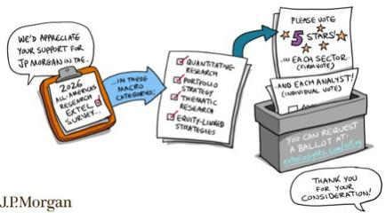

flowchart

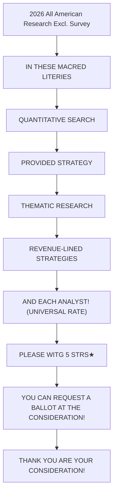
```mermaid
graph TD
    A["2026 All American Research Excl. Survey"] --> B["IN THESE MACRED LITERIES"]
    B --> C["QUANTITATIVE SEARCH"]
    C --> D["PROVIDED STRATEGY"]
    D --> E["THEMATIC RESEARCH"]
    E --> F["REVENUE-LINED STRATEGIES"]
    F --> G["AND EACH ANALYST! (UNIVERSAL RATE)"]
    G --> H["PLEASE WITG 5 STRS★"]
    H --> I["YOU CAN REQUEST A BALLOT AT THE CONSIDERATION!"]
    I --> J["THANK YOU ARE YOUR CONSIDERATION!"]
```

We thank G. K. Kiruthik Srinivaas and Aditya Mulye of JPM India Private Limited for their significant contributions to this report.

quantum-related companies and take minority, non-controlling equity stakes as part of the awards. This includes IBM Quantum (who presented at our NY Quantitative and AI Conference, see Summary Through Illustrations), which is set to receive \$1B (with the company also committing a matching \$1B) — see Single Stock Stories with Elevated Retail Activity. Retail participation was sustained across the broader quantum complex, Figure 11.

- Is Retail P&L still holding strong? We set out to test our intuition that retail investors' performance has remained resilient, supported by effective positioning in Memory and AI stocks along with timely profit-taking in Space and Energy, report. Our refreshed P&L analysis indeed demonstrates a strong performance, especially in Single Stocks, Figure 2 and Figure 3. Within ETFs, retail's portfolio returns outpaced that of a Dollar Cost Averaging benchmark (DCA) in QQQ through late April; performance then softened as losses in Gold Miners exposure (JNUG, NUGT) and Mid-Caps (VO) weighed on results. Since then, the shortfall has narrowed, supported by increased leveraged positioning in semiconductors via SOXL. In single stocks, retail has unsurprisingly outperformed benchmarks over the past month or so, consistent with a concentrated tilt toward MU, AMD, and NVDA.   
- The largest MSCI rebalance on record will be taking place this Friday, and has the potential to impact Mag-7 flows, report. MSCI announced the May 2026 QCIR results, including 18 additions and 46 deletions in DM and 30 additions and 56 deletions in EM. Estimated rebalance activity is \$118.4B two-way (2.69%) in DM and \$45.8B two-way (4.27%) in EM, with the largest DM weight increases in 285AJT, AMZN, AAPL, 4004 JT and the largest decreases in NVDA, GOOG, RYA, CRM, RMS.   
- Quantitative Conference Highlights: “How will AI impact Institutional Investors’ edge over Retail Investors?” “Which company is most likely to first surpass NVDA in market cap (whenever that happens)?” We asked these questions (and many more!) to our audience at the JPM NY Quantitative and AI Conference last week. Answers are shown below in Figure 4 and Figure 5. Please reach out to us if you would like to receive survey results and/or session summaries — in the meantime, here is a preview: Summary Through Illustrations.

# Past Issues:

5/13 - Software vs Semis Positioning   
5/6 - Memory and AI, the Catch-Up Trade   
4/29 - Peak Earnings, Peak Mag-7   
4/22 - Towards a MEME Revival?   
4/15 - Back to Average   
4/8 - Not Buying Despite the Ceasefire   
4/1 - In Defensive Mode   
3/25 - Selling Rips   
3/18 - From FOMO to FOHO: Fear Of Higher Oil   
3/11 - Buying Oil, Selling Energy   
3/4 - Cautiously Optimistic   
2/25 - Balanced Optimism   
2/18 - AI Software Averaging Down   
2/11 - Positioning around Dislocations   
2/4 - Softening Sentiment, Software vs Semis   
1/28 - Earnings, Intl Equities, Precious Metals   
1/21 - Unfazed through Vol Shock   
1/14 - The January Effect?   
1/7 - December Spree and a good start to January   
12/10 - 2025 Retail Mania   
12/3 - The Retail AI Trade   
11/26 - Weekly Highlights   
11/19 - 2025 Retail Mania: Dip-buying in AI   
11/12 - Bullion to Silicon: Al Gold Rush Resumes   
11/5 - Skipping the Dip, Earnings Stock Picking   
10/29 - Reaching Peak-Earnings, AI, FOMC   
10/22 - Sold GLD, onto New Memes and Earnings   
10/15 - Trading around Tariffs, AI and Earnings   
10/8 - Back after Summer Break   
10/1 - Back to Stocks, Thematic ETFs, GLD Rush   
9/24 - Precious Metals, Cyclicals and Domestic   
9/17 - FOMC, Herding in OPEN and GRAB

# Retail Trading Activity in Numbers for the Week: May 20 to May 27

- Retail flows were at \$6.3B this week, just below the 12-month avg of \$6.7B/week. Retail investors continued to favor ETFs (+\$4.6B) over Single Stocks (+\$1.6B).   
- Outside of Broad Based Equity ETFs (+\$1.5B), retail ETF buying was influenced by Equity Sector Technology (+\$254M), Equity Style Call/Put Writing (+\$183M), Fixed Income — Multi Sector (+\$170M) and Investment Grade (\$147M).   
- This week, and in line with prior weeks, retail investors continued to buy Growth, AI datacenters and electrification (JPAMAIDE), Top 30 AI/Datacenter Beneficiaries and Mag 7, along with US Companies with High Direct China Revenue Exposure and AI Software/Product/Monetization, see Figure 12.   
- Activity in Mag7 this week: Retail investors bought: NVDA (+\$756M), TSLA (+\$243M), GOOGL/GOOG (+\$113M), MSFT (+\$48M) and sold META (-\$8M), AAPL (-\$24M) and AMZN (-\$88M).   
- Outside of Mag7, retail investors favored Tech (+\$1.35B) and Industrials (+\$119M) and were net sellers of Energy (-\$240M), Financials (-\$197M) and Health Care (-\$192M).   
- Top 5 retail stocks last week: NVDA (+\$756M), MU (+\$521M), TSLA (+\$243M), AMD (+\$201M) and NOK (+\$125M). Bottom 5 retail stocks: PLTR (-\$113M), AMZN (-\$88M), PANW (-\$69M), AVGO (-\$67M) and PDD (-\$66M).   
- In options, retail share is slightly off its highs, Figure 67. The most traded options were in the following names, echoing previous weeks: TSLA, MU, NVDA, AMD, AAPL, META, SNDK, INTC, GOOGL/GOOG and MSFT. For the most bought/sold delta and gamma names, see Retail Activity in Options. Also see Retail Investors Options Activity by Sectors.   
- Futures Activity (Non Retail): Over the past week, Futures traders net bought \~\$8.1B, primarily driven by net buys in ES (\~\$0.9B) and NQ (\~\$1.6B) and partially offset by net sales in RTY (\~\$5.6B).

Figure 1: Retail Investor Daily Purchases by Stocks and ETFs   
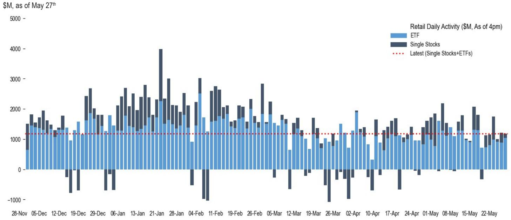

bar

| Date       | ETF   | Single Stocks | Latest (Single Stocks+ETFs) |
|------------|-------|---------------|------------------------------|
| 28-Nov     | 1500  | 1000          | 1200                         |
| 05-Dec     | 1600  | 1200          | 1200                         |
| 12-Dec     | 1300  | 800           | 1200                         |
| 19-Dec     | 1700  | 1500          | 1200                         |
| 29-Dec     | 1400  | 1300          | 1200                         |
| 06-Jan     | 1800  | 1600          | 1200                         |
| 13-Jan     | 1500  | 1400          | 1200                         |
| 21-Jan     | 2300  | 2500          | 1200                         |
| 28-Jan     | 1600  | 1300          | 1200                         |
| 04-Feb     | 1400  | 1200          | 1200                         |
| 11-Feb     | 1700  | 1500          | 1200                         |
| 19-Feb     | 1800  | 1400          | 1200                         |
| 26-Feb     | 2500  | 1600          | 1200                         |
| 05-Mar     | 1600  | 1300          | 1200                         |
| 12-Mar     | 1400  | 1200          | 1200                         |
| 19-Mar     | 1700  | 1400          | 1200                         |
| 26-Mar     | 900   | -500          | 1200                         |
| 02-Apr     | 1900  | -300          | 1200                         |
| 10-Apr     | 800   | -400          | 1200                         |
| 17-Apr     | 1600  | -200          | 1200                         |
| 24-Apr     | 1300  | -300          | 1200                         |
| 01-May     | 1700  | -100          | 1200                         |
| 08-May     | 1500  | -50           | 1200                         |
| 15-May     | 1800  | -20           | 1200                         |
| 22-May     | 1600  | -30           | 1200                         |

Source: JPM Equity Strategy & Quantitative Research

Figure 2: Retail Investors' P&L in ETF   
As of May 26 $^{th}$   
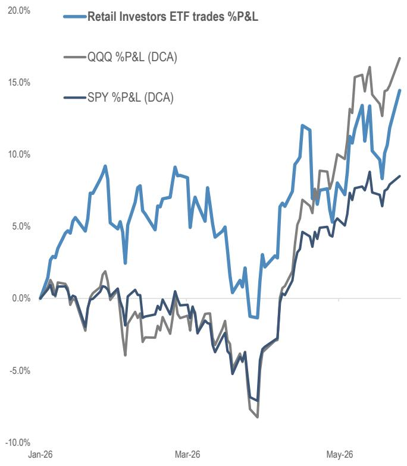

line

| Date   | Retail Investors ETF trades %P&L | QQQ %P&L (DCA) | SPY %P&L (DCA) |
|--------|----------------------------------|----------------|----------------|
| Jan-26 | ~0.5%                            | ~0.3%          | ~0.2%          |
| Mar-26 | ~9.0%                            | ~8.0%          | ~7.0%          |
| May-26 | ~14.5%                           | ~16.0%         | ~8.5%          |

Source: JPM Equity Strategy & Quantitative Research

Figure 3: Retail Investors' P&L in Single Stocks   
As of May 26 $^{th}$   
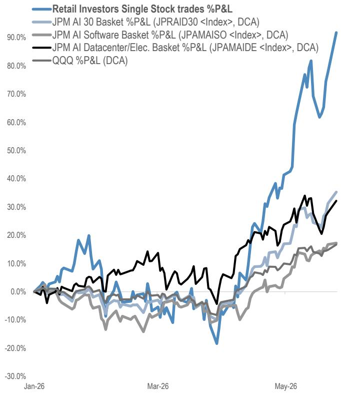

line

| Date   | Retail Investors Single Stock trades %P&L | JPM AI 30 Basket %P&L (JPRAID30 <Index>, DCA) | JPM AI Software Basket %P&L (JPAMAISO <Index>, DCA) | JPM AI Datacenter/Elec. Basket %P&L (JPAMAIDE <Index>, DCA) | QQQ %P&L (DCA) |
|--------|---------------------------------------------|--------------------------------------------------|--------------------------------------------------|-----------------------------------------------------|----------------|
| Jan-26 | ~0.0%                                       | ~0.0%                                            | ~0.0%                                            | ~0.0%                                               | ~0.0%          |
| Mar-26 | ~15.0%                                      | ~5.0%                                            | ~-5.0%                                           | ~5.0%                                               | ~-5.0%         |
| May-26 | ~90.0%                                      | ~35.0%                                           | ~15.0%                                           | ~30.0%                                              | ~15.0%         |

Source: JPM Equity Strategy & Quantitative Research

Figure 4: Impact of AI - Retail vs Institutional Investors   
Investor Poll Results from JPM NY Quantitative and AI Conference, May 19-20   
How will AI impact institutional investors' edge over Retail Investors?   
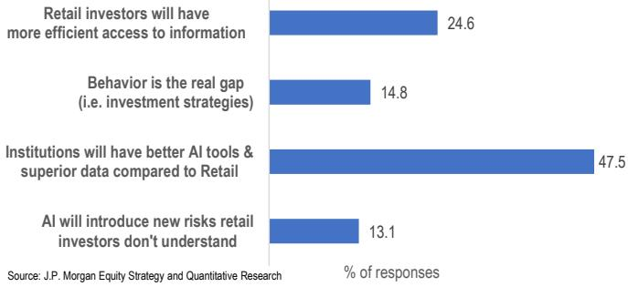

bar

| Statement | % of responses |
| --- | --- |
| Retail investors will have more efficient access to information | 24.6 |
| Behavior is the real gap (i.e. investment strategies) | 14.8 |
| Institutions will have better AI tools & superior data compared to Retail | 47.5 |
| AI will introduce new risks retail investors don't understand | 13.1 |

Source: JPM Equity Strategy & Quantitative Research

Figure 5: Emerging Tech to Surpass NVDA in Market Cap?   
Investor Poll Results from JPM NY Quantitative and AI Conference, May 19-20   
Which company is most likely to first surpass NVIDIA in market cap (whenever that happens...) ?   
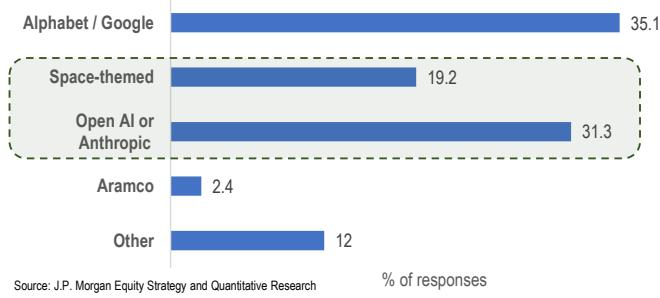

bar

| Category | Value (%) |
|---|---|
| Alphabet / Google | 35.1 |
| Space-themed | 19.2 |
| Open AI or Anthropic | 31.3 |
| Aramco | 2.4 |
| Other | 12 |
Source: JPM Equity Strategy and Quantitative Research
% of responses

Source: JPM Equity Strategy & Quantitative Research

Figure 6: Cumulative Retail Imbalance in Memory Stocks   
As of May 27 $^{th}$ , in B   
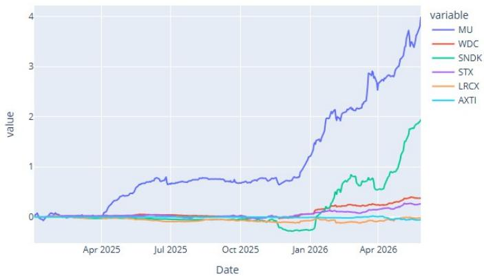

line

| Date       | MU    | WDC   | SNDK  | STX   | LRCX  | AXTI  |
| ---------- | ----- | ----- | ----- | ----- | ----- | ----- |
| Apr 2025   | 0.0   | 0.0   | 0.0   | 0.0   | 0.0   | 0.0   |
| Jul 2025   | 0.7   | 0.1   | 0.0   | 0.1   | 0.0   | 0.0   |
| Oct 2025   | 0.7   | 0.1   | 0.0   | 0.1   | 0.0   | 0.0   |
| Jan 2026   | 1.5   | 0.3   | -0.5  | 0.2   | 0.1   | 0.1   |
| Apr 2026   | 3.5   | 0.4   | 1.8   | 0.3   | 0.2   | 0.1   |
| Jun 2026   | 4.0   | 0.5   | 2.0   | 0.4   | 0.3   | 0.1   |

Source: JPM Equity Strategy & Quantitative Research

Figure 7: Cumulative Retail Imbalance in Quantum Stocks   
As of May 27 $^{th}$ , in B   
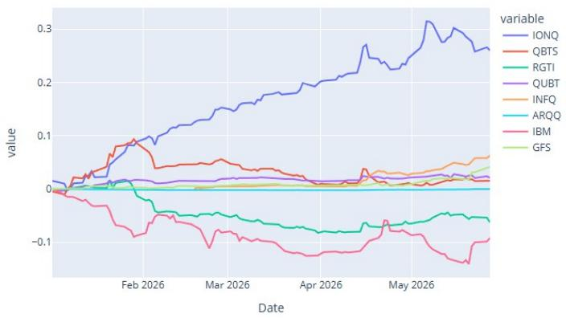

line

| Date       | IONQ   | QBTS   | RGTI   | QUBT   | INFQ   | ARQQ   | IBM    | GFS    |
| ---------- | ------ | ------ | ------ | ------ | ------ | ------ | ------ | ------ |
| Feb 2026   | 0.08   | 0.05   | -0.02  | 0.01   | 0.01   | 0.01   | -0.08  | 0.01   |
| Mar 2026   | 0.15   | 0.04   | -0.03  | 0.01   | 0.01   | 0.01   | -0.09  | 0.01   |
| Apr 2026   | 0.20   | 0.03   | -0.04  | 0.01   | 0.01   | 0.01   | -0.10  | 0.01   |
| May 2026   | 0.30   | 0.02   | -0.05  | 0.01   | 0.02   | 0.01   | -0.11  | 0.03   |

Source: JPM Equity Strategy & Quantitative Research

Figure 8: Overall Crowding in Software and Semis - Some Reversal Recently   
As of May 26 $^{th}$   
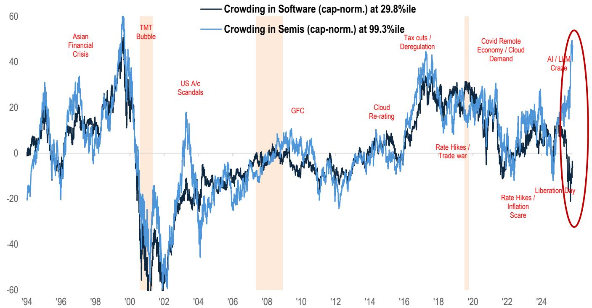

line

| Year | Crowding in Software (cap-norm.) | Crowding in Semis (cap-norm.) |
|------|----------------------------------|-------------------------------|
| '94  | ~0                               | ~-20                          |
| '96  | ~10                              | ~30                           |
| '98  | ~20                              | ~40                           |
| '00  | ~50                              | ~60                           |
| '02  | ~-60                             | ~-50                          |
| '04  | ~-20                             | ~-30                          |
| '06  | ~-10                             | ~-15                          |
| '08  | ~0                               | ~0                            |
| '10  | ~5                               | ~10                           |
| '12  | ~-5                              | ~-10                          |
| '14  | ~5                               | ~10                           |
| '16  | ~20                              | ~30                           |
| '18  | ~30                              | ~40                           |
| '20  | ~25                              | ~35                           |
| '22  | ~10                              | ~20                           |
| '24  | ~5                               | ~15                           |

Source: JPM Equity Strategy & Quantitative Research

Figure 9: Overall Crowding in Software and Semis   
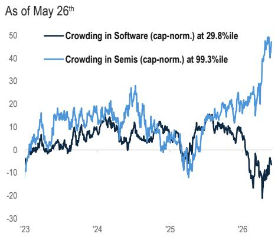

line

| Year | Crowding in Software (cap-norm.) | Crowding in Semis (cap-norm.) |
|------|----------------------------------|-------------------------------|
| '23  | ~0                               | ~0                            |
| '24  | ~10                              | ~20                           |
| '25  | ~5                               | ~10                           |
| '26  | ~-20                             | ~40                           |

Source: JPM Equity Strategy & Quantitative Research, S3 Partners

Figure 10: Retail Crowding in Software and Semis   
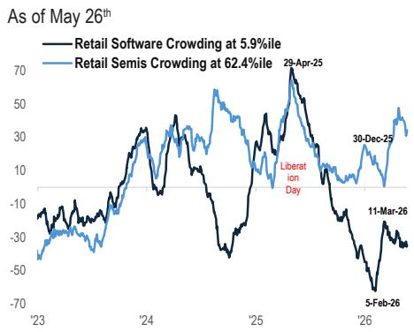

line

| Date       | Retail Software Crowding | Retail Semis Crowding |
| ---------- | ------------------------ | ---------------------- |
| 29-Apr-25  | 70                       | 60                     |
| 11-Mar-26  | -30                      | -20                    |
| 30-Dec-25  | -10                      | 5                      |

Figure 11: Shorts Herding in Software and Semis   
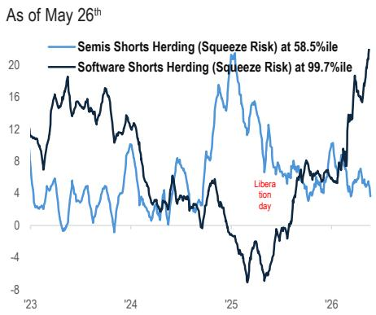

line

| Year | Semis Shorts Herding (Squeeze Risk) | Software Shorts Herding (Squeeze Risk) |
|------|----------------------------------------|------------------------------------------|
| '23  | ~12                                    | ~8                                       |
| '24  | ~10                                    | ~16                                      |
| '25  | ~18                                    | ~-8                                      |
| '26  | ~4                                     | ~10                                      |

Figure 12: Daily Retail Imbalance in DRAM   
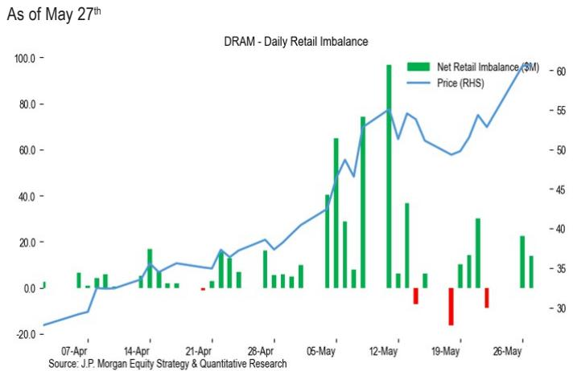

bar_line

| Date     | Net Retail Imbalance ($M) | Price (RHS) |
|----------|---------------------------|-------------|
| 07-Apr   | 0.0                       | -30         |
| 14-Apr   | 15.0                      | -35         |
| 21-Apr   | 5.0                       | -40         |
| 28-Apr   | 15.0                      | -45         |
| 05-May   | 40.0                      | -50         |
| 12-May   | 100.0                     | -55         |
| 19-May   | 15.0                      | -50         |
| 26-May   | 25.0                      | -45         |

Source: JPM Equity Strategy & Quantitative Research

Figure 14: Daily Retail Imbalance in MU   
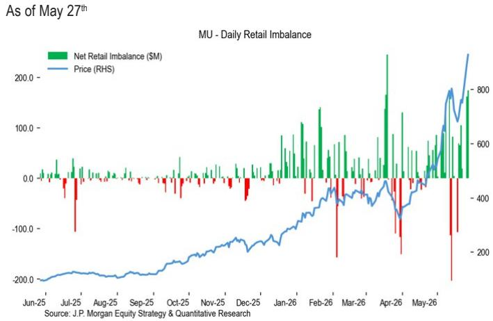

line

| Date   | Net Retail Imbalance ($M) | Price (RHS) |
|--------|---------------------------|-------------|
| Jun-25 | ~0                        | ~-200       |
| Jul-25 | ~0                        | ~-180       |
| Aug-25 | ~0                        | ~-160       |
| Sep-25 | ~0                        | ~-140       |
| Oct-25 | ~0                        | ~-120       |
| Nov-25 | ~0                        | ~-100       |
| Dec-25 | ~0                        | ~-80        |
| Jan-26 | ~0                        | ~-60        |
| Feb-26 | ~0                        | ~-40        |
| Mar-26 | ~0                        | ~-20        |
| Apr-26 | ~0                        | ~0          |
| May-26 | ~0                        | ~200        |

Source: JPM Equity Strategy & Quantitative Research

Figure 13: Cumulative Retail Imbalance in ZS   
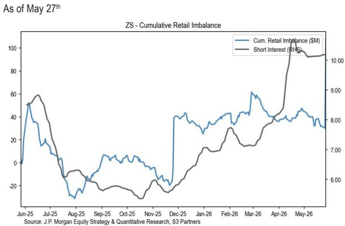

line

| Date   | Cum. Retail Imbalance ($M) | Short Interest (RHS) |
|--------|-----------------------------|----------------------|
| Jun-25 | ~50                         | ~9.00                |
| Jul-25 | ~40                         | ~7.00                |
| Aug-25 | ~-20                        | ~6.00                |
| Sep-25 | ~10                         | ~6.50                |
| Oct-25 | ~-10                        | ~6.00                |
| Nov-25 | ~-15                        | ~5.50                |
| Dec-25 | ~40                         | ~7.00                |
| Jan-26 | ~30                         | ~7.50                |
| Feb-26 | ~40                         | ~8.00                |
| Mar-26 | ~60                         | ~8.50                |
| Apr-26 | ~40                         | ~9.00                |
| May-26 | ~30                         | ~10.00               |

Source: JPM Equity Strategy & Quantitative Research

Figure 15: Cumulative Retail Imbalance in MU   
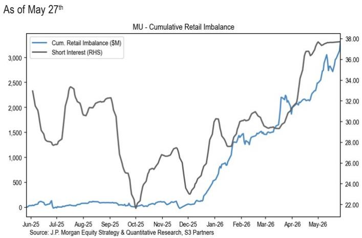

line

| Date   | Cum. Retail Imbalance ($M) | Short Interest (RHS) |
|--------|-----------------------------|----------------------|
| Jun-25 | ~100                        | ~34.00               |
| Jul-25 | ~100                        | ~32.00               |
| Aug-25 | ~100                        | ~34.00               |
| Sep-25 | ~100                        | ~32.00               |
| Oct-25 | ~100                        | ~22.00               |
| Nov-25 | ~100                        | ~28.00               |
| Dec-25 | ~100                        | ~24.00               |
| Jan-26 | ~150                        | ~30.00               |
| Feb-26 | ~200                        | ~32.00               |
| Mar-26 | ~250                        | ~34.00               |
| Apr-26 | ~300                        | ~36.00               |
| May-26 | ~350                        | ~38.00               |

Source: JPM Equity Strategy & Quantitative Research

Figure 16: Retail Options Volume in MU   
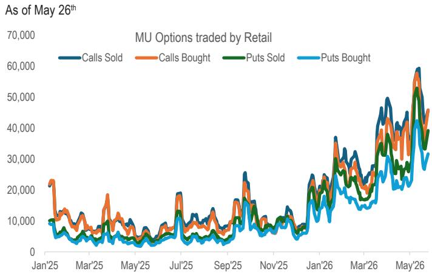

line

| Date   | Calls Sold | Calls Bought | Puts Sold | Puts Bought |
|--------|------------|--------------|-----------|-------------|
| Jan'25 | ~10,000    | ~23,000      | ~8,000    | ~6,000      |
| Mar'25 | ~8,000     | ~18,000      | ~6,000    | ~4,000      |
| May'25 | ~6,000     | ~12,000      | ~4,000    | ~3,000      |
| Jul'25 | ~18,000    | ~19,000      | ~12,000   | ~8,000      |
| Sep'25 | ~15,000    | ~17,000      | ~10,000   | ~7,000      |
| Nov'25 | ~12,000    | ~14,000      | ~8,000    | ~6,000      |
| Jan'26 | ~25,000    | ~38,000      | ~28,000   | ~22,000     |
| Mar'26 | ~35,000    | ~45,000      | ~38,000   | ~32,000     |
| May'26 | ~60,000    | ~58,000      | ~55,000   | ~45,000     |

Source: JPM Equity Strategy & Quantitative Research

Figure 18: Daily Retail Imbalance in SNDK   
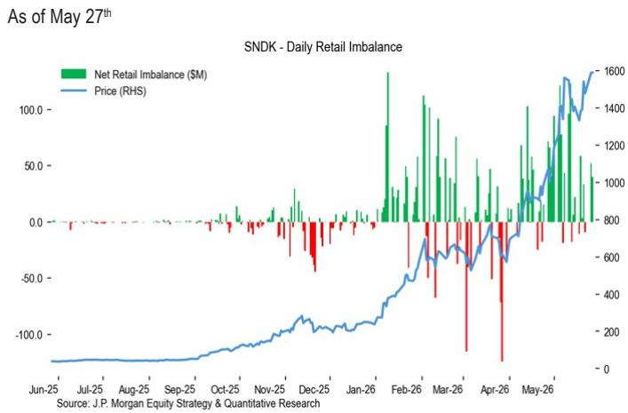

line

| Date    | Net Retail Imbalance ($M) | Price ($) |
|---------|---------------------------|-----------|
| Jun-25  | ~0                        | ~0        |
| Jul-25  | ~0                        | ~0        |
| Aug-25  | ~0                        | ~0        |
| Sep-25  | ~0                        | ~0        |
| Oct-25  | ~0                        | ~0        |
| Nov-25  | ~0                        | ~0        |
| Dec-25  | ~0                        | ~0        |
| Jan-26  | ~0                        | ~0        |
| Feb-26  | ~100                      | ~400      |
| Mar-26  | ~50                       | ~600      |
| Apr-26  | ~100                      | ~800      |
| May-26  | ~160                      | ~1600     |

Source: JPM Equity Strategy & Quantitative Research

Figure 20: Daily Retail Imbalance in NASA   
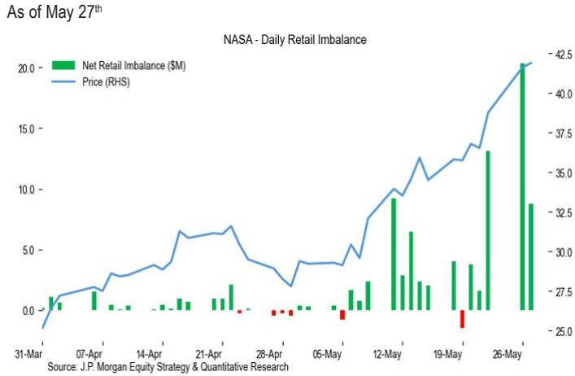

line

| Date     | Net Retail Imbalance ($M) | Price (RHS) |
|----------|---------------------------|-------------|
| 31-Mar   | 0.0                       | 0.0         |
| 07-Apr   | 0.0                       | 0.0         |
| 14-Apr   | 0.0                       | 0.0         |
| 21-Apr   | 0.0                       | 0.0         |
| 28-Apr   | 0.0                       | 0.0         |
| 05-May   | 0.0                       | 0.0         |
| 12-May   | 0.0                       | 0.0         |
| 19-May   | 0.0                       | 0.0         |
| 26-May   | 0.0                       | 0.0         |

Source: JPM Equity Strategy & Quantitative Research

Figure 17: Retail Delta and Gamma in MU   
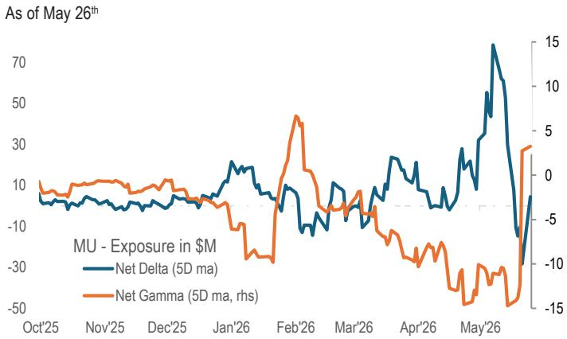

line

| Date   | Net Delta (5D ma) | Net Gamma (5D ma, rhs) |
|--------|-------------------|------------------------|
| Oct'25 | ~5                | ~10                    |
| Nov'25 | ~5                | ~10                    |
| Dec'25 | ~5                | ~10                    |
| Jan'26 | ~10               | ~-10                   |
| Feb'26 | ~-10              | ~5                     |
| Mar'26 | ~-5               | ~-10                   |
| Apr'26 | ~-10              | ~-15                   |
| May'26 | ~70               | ~-15                   |

Source: JPM Equity Strategy & Quantitative Research

Figure 19: Cumulative Retail Imbalance in SNDK   
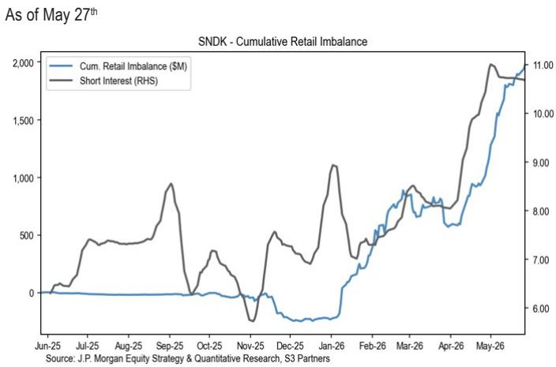

line

| Date   | Cum. Retail Imbalance ($M) | Short Interest (RHS) |
|--------|-----------------------------|----------------------|
| Jun-25 | 0                           | 6.00                 |
| Jul-25 | 0                           | 7.00                 |
| Aug-25 | 0                           | 8.00                 |
| Sep-25 | 0                           | 9.00                 |
| Oct-25 | 0                           | 7.00                 |
| Nov-25 | 0                           | 6.00                 |
| Dec-25 | 0                           | 7.00                 |
| Jan-26 | 0                           | 9.00                 |
| Feb-26 | 500                         | 8.00                 |
| Mar-26 | 800                         | 9.00                 |
| Apr-26 | 700                         | 8.00                 |
| May-26 | 1,900                       | 11.00                |

Source: JPM Equity Strategy & Quantitative Research

Figure 21: Cumulative Retail Imbalance in NASA   
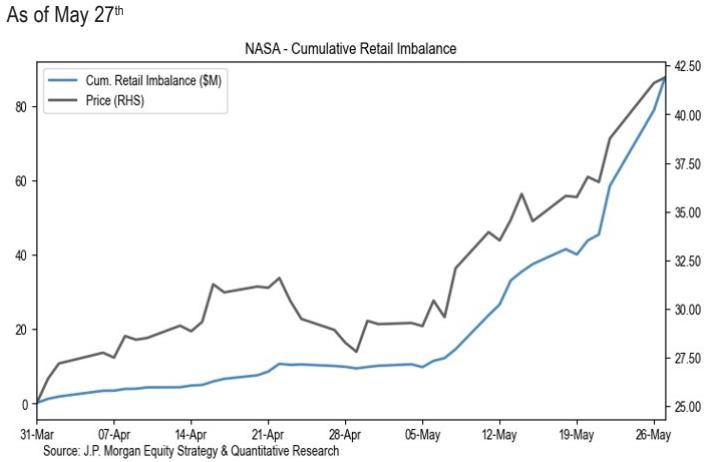

line

| Date     | Cum. Retail Imbalance ($M) | Price ($RHS) |
|----------|-----------------------------|--------------|
| 31-Mar   | 0                           | 25.00        |
| 07-Apr   | 5                           | 27.50        |
| 14-Apr   | 10                          | 30.00        |
| 21-Apr   | 15                          | 32.50        |
| 28-Apr   | 20                          | 35.00        |
| 05-May   | 25                          | 37.50        |
| 12-May   | 35                          | 40.00        |
| 19-May   | 45                          | 42.50        |
| 26-May   | 80                          | 42.50        |

Source: JPM Equity Strategy & Quantitative Research

Figure 22: Daily Retail Imbalance in RKLB   
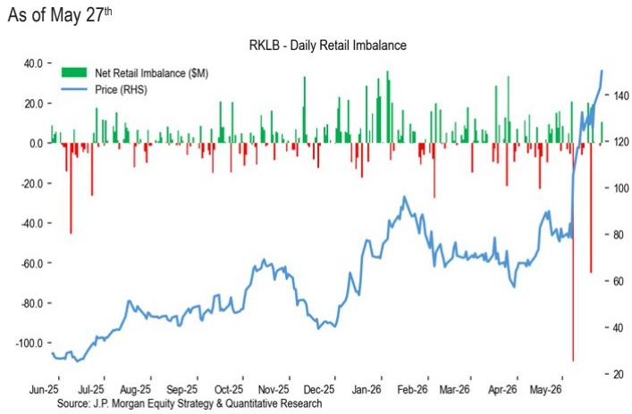

line

| Date   | Net Retail Imbalance ($M) | Price (RHS) |
|--------|---------------------------|-------------|
| Jun-25 | ~0                        | ~-100       |
| Jul-25 | ~10                       | ~-80        |
| Aug-25 | ~5                        | ~-60        |
| Sep-25 | ~10                       | ~-40        |
| Oct-25 | ~15                       | ~-20        |
| Nov-25 | ~20                       | ~0          |
| Dec-25 | ~30                       | ~20         |
| Jan-26 | ~40                       | ~40         |
| Feb-26 | ~30                       | ~60         |
| Mar-26 | ~20                       | ~80         |
| Apr-26 | ~30                       | ~100        |
| May-26 | ~40                       | ~140        |

Source: JPM Equity Strategy & Quantitative Research

Figure 24: Daily Retail Imbalance in PL   
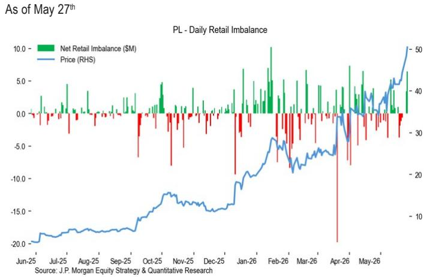

line

| Date   | Net Retail Imbalance ($M) | Price (RHS) |
|--------|---------------------------|-------------|
| Jun-25 | ~0.0                      | ~-18.0      |
| Jul-25 | ~0.0                      | ~-17.5      |
| Aug-25 | ~0.0                      | ~-17.0      |
| Sep-25 | ~0.0                      | ~-16.5      |
| Oct-25 | ~0.0                      | ~-15.0      |
| Nov-25 | ~0.0                      | ~-14.5      |
| Dec-25 | ~0.0                      | ~-14.0      |
| Jan-26 | ~0.0                      | ~-13.5      |
| Feb-26 | ~0.0                      | ~-13.0      |
| Mar-26 | ~0.0                      | ~-12.5      |
| Apr-26 | ~0.0                      | ~-12.0      |
| May-26 | ~0.0                      | ~-11.5      |

Source: JPM Equity Strategy & Quantitative Research

Figure 26: Daily Retail Imbalance in FLY   
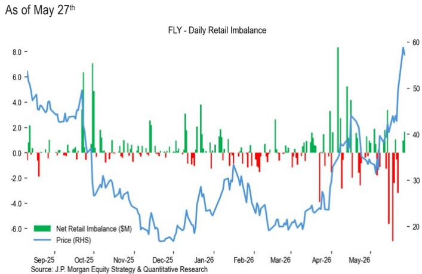

line

| Date   | Net Retail Imbalance ($M) | Price (RHS) |
|--------|---------------------------|-------------|
| Sep-25 | 0.0                       | 6.0         |
| Oct-25 | 7.0                       | 4.0         |
| Nov-25 | 0.0                       | 2.0         |
| Dec-25 | 3.0                       | -4.0        |
| Jan-26 | 4.0                       | -2.0        |
| Feb-26 | 0.0                       | -6.0        |
| Mar-26 | 3.0                       | -4.0        |
| Apr-26 | 8.0                       | -2.0        |
| May-26 | 1.0                       | 6.0         |

Source: JPM Equity Strategy & Quantitative Research

Figure 23: Cumulative Retail Imbalance in RKLB   
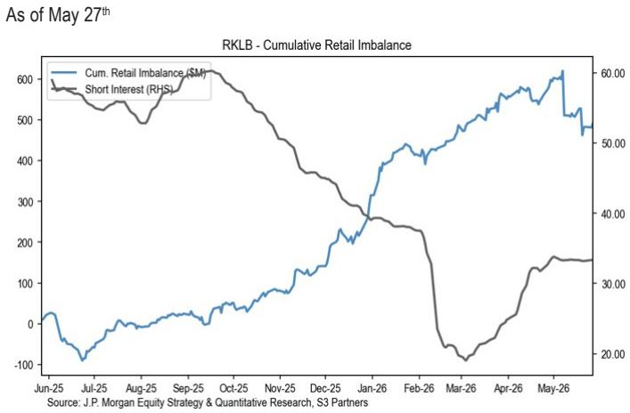

line

| Date   | Cum. Retail Imbalance ($M) | Short Interest (RHS) |
|--------|-----------------------------|----------------------|
| Jun-25 | ~10                         | ~55                  |
| Jul-25 | ~-100                       | ~50                  |
| Aug-25 | ~-50                        | ~45                  |
| Sep-25 | ~50                         | ~50                  |
| Oct-25 | ~100                        | ~45                  |
| Nov-25 | ~150                        | ~40                  |
| Dec-25 | ~200                        | ~35                  |
| Jan-26 | ~300                        | ~30                  |
| Feb-26 | ~400                        | ~25                  |
| Mar-26 | ~500                        | ~15                  |
| Apr-26 | ~550                        | ~20                  |
| May-26 | ~600                        | ~30                  |

Source: JPM Equity Strategy & Quantitative Research

Figure 25: Cumulative Retail Imbalance in PL   
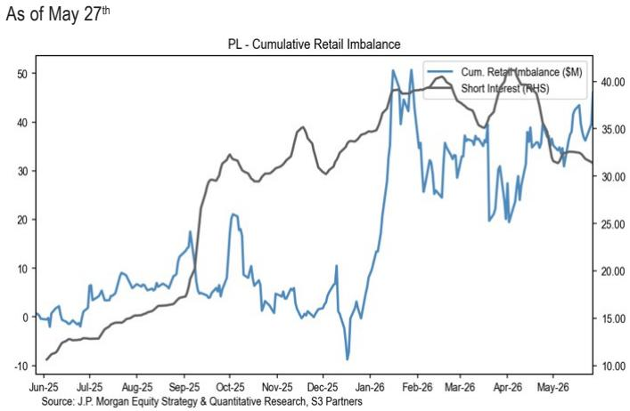

line

| Date   | Cum. Retail Imbalance ($M) | Short Interest (RHS) |
|--------|-----------------------------|----------------------|
| Jun-25 | -10.00                      | 10.00                |
| Jul-25 | 0.00                        | 15.00                |
| Aug-25 | 5.00                        | 20.00                |
| Sep-25 | 10.00                       | 25.00                |
| Oct-25 | 20.00                       | 30.00                |
| Nov-25 | 30.00                       | 35.00                |
| Dec-25 | 40.00                       | 40.00                |
| Jan-26 | 50.00                       | 45.00                |
| Feb-26 | 45.00                       | 40.00                |
| Mar-26 | 40.00                       | 35.00                |
| Apr-26 | 35.00                       | 30.00                |
| May-26 | 30.00                       | 25.00                |

Source: JPM Equity Strategy & Quantitative Research

Figure 27: Cumulative Retail Imbalance in FLY   
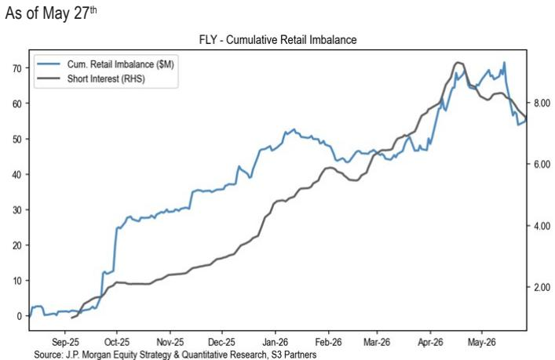

line

| Date    | Cum. Retail Imbalance ($M) | Short Interest (RHS) |
|---------|-----------------------------|----------------------|
| Sep-25  | ~1                          | ~1                   |
| Oct-25  | ~30                         | ~10                  |
| Nov-25  | ~35                         | ~15                  |
| Dec-25  | ~40                         | ~20                  |
| Jan-26  | ~50                         | ~30                  |
| Feb-26  | ~45                         | ~40                  |
| Mar-26  | ~45                         | ~50                  |
| Apr-26  | ~60                         | ~60                  |
| May-26  | ~70                         | ~8.0                 |

Source: JPM Equity Strategy & Quantitative Research

Figure 28: Daily Retail Imbalance in ASTS   
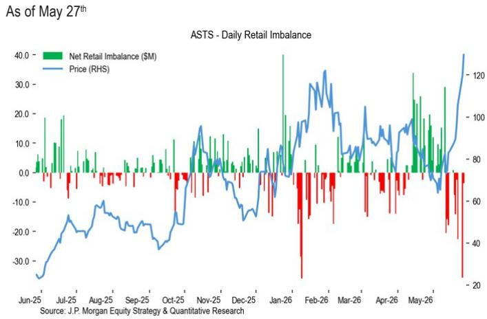

line

| Date   | Net Retail Imbalance ($M) | Price (RHS) |
|--------|---------------------------|-------------|
| Jun-25 | ~0                        | ~-30        |
| Jul-25 | ~15                       | ~-10        |
| Aug-25 | ~0                        | ~-5         |
| Sep-25 | ~0                        | ~-10        |
| Oct-25 | ~10                       | ~-20        |
| Nov-25 | ~15                       | ~-10        |
| Dec-25 | ~0                        | ~-5         |
| Jan-26 | ~40                       | ~10         |
| Feb-26 | ~30                       | ~80         |
| Mar-26 | ~20                       | ~60         |
| Apr-26 | ~30                       | ~80         |
| May-26 | ~35                       | ~100        |
| Jun-26 | ~40                       | ~120        |

Source: JPM Equity Strategy & Quantitative Research

Figure 30: Retail Options Volume in ASTS   
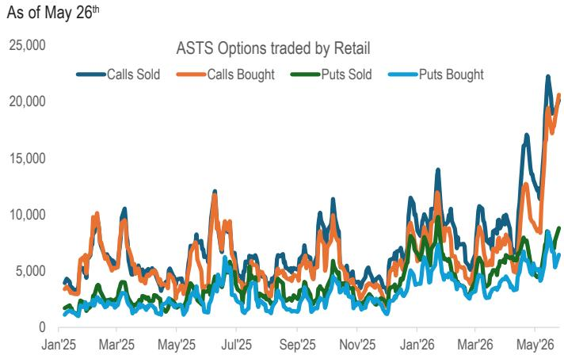

line

| Date   | Calls Sold | Calls Bought | Puts Sold | Puts Bought |
|--------|------------|--------------|-----------|-------------|
| Jan'25 | ~3,000     | ~4,000       | ~1,500    | ~1,000      |
| Mar'25 | ~8,000     | ~10,000      | ~3,000    | ~2,000      |
| May'25 | ~7,000     | ~8,000       | ~4,000    | ~3,000      |
| Jul'25 | ~6,000     | ~9,000       | ~5,000    | ~4,000      |
| Sep'25 | ~7,000     | ~8,000       | ~6,000    | ~5,000      |
| Nov'25 | ~5,000     | ~6,000       | ~4,000    | ~3,000      |
| Jan'26 | ~12,000    | ~13,000      | ~8,000    | ~7,000      |
| Mar'26 | ~11,000    | ~12,000      | ~7,500    | ~6,500      |
| May'26 | ~22,000    | ~21,000      | ~9,500    | ~8,500      |

Source: JPM Equity Strategy & Quantitative Research

Figure 29: Cumulative Retail Imbalance in ASTS   
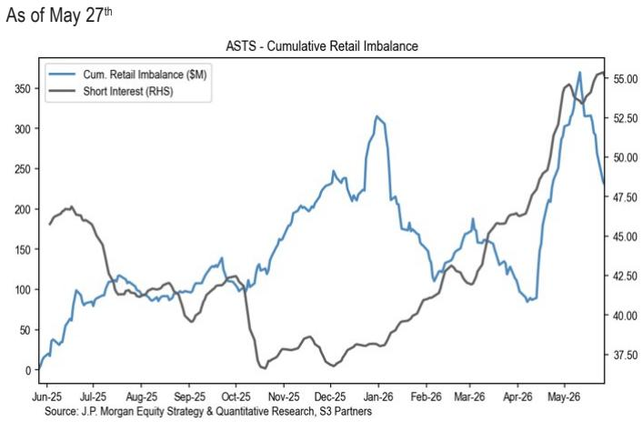

line

| Date   | Cum. Retail Imbalance ($M) | Short Interest (RHS) |
|--------|-----------------------------|----------------------|
| Jun-25 | ~180                        | ~47.50               |
| Jul-25 | ~100                        | ~45.00               |
| Aug-25 | ~120                        | ~42.50               |
| Sep-25 | ~110                        | ~40.00               |
| Oct-25 | ~130                        | ~37.50               |
| Nov-25 | ~180                        | ~40.00               |
| Dec-25 | ~240                        | ~42.50               |
| Jan-26 | ~320                        | ~45.00               |
| Feb-26 | ~180                        | ~47.50               |
| Mar-26 | ~190                        | ~50.00               |
| Apr-26 | ~90                         | ~52.50               |
| May-26 | ~360                        | ~55.00               |

Source: JPM Equity Strategy & Quantitative Research

Figure 31: Retail Delta and Gamma in ASTS   
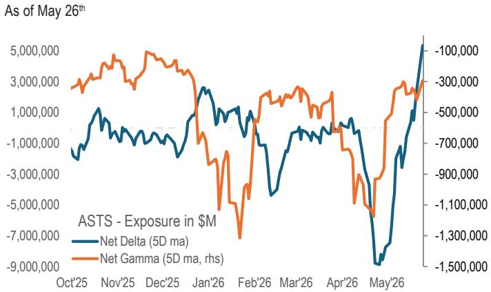

line

| Date   | Net Delta (5D ma) | Net Gamma (5D ma, rhs) |
|--------|-------------------|------------------------|
| Oct'25 | ~-1,000,000       | ~3,000,000             |
| Nov'25 | ~-800,000         | ~4,500,000             |
| Dec'25 | ~-600,000         | ~4,800,000             |
| Jan'26 | ~-4,000,000       | ~-7,000,000            |
| Feb'26 | ~-8,000,000       | ~-1,300,000            |
| Mar'26 | ~-6,000,000       | ~-7,500,000            |
| Apr'26 | ~-4,500,000       | ~-1,100,000            |
| May'26 | ~-9,500,000       | ~-1,500,000            |

Source: JPM Equity Strategy & Quantitative Research

# Single Stock Stories with Elevated Retail Activity

# Hedge Funds vs. Retail: High Short Interest Meme Stocks

- FLO (\$2.3M sold last week, -2.7z, Figure 38): The stock rose by 13% on May 22 after exceeding analyst expectations for Q1 2026 (link). Retail investor activity has increased since January 2026, with net purchases about \$23 million, while short interest has climbed to 14%, up 4% since the start of the year.   
- PATH (\$21M bought last week, 1.9z, Figure 39): The company announced the launch of its Automation Cloud on Microsoft Azure in South Korea, enabling local data residency and enterprise automation (link). Since January 2026, the stock has drawn retail investor attention, with net purchases reaching \$230 million while short interest more than doubled to nearly 30% of the float.   
- SLG (\$1M sold last week, -0.7z, Figure 40): The stock rose 10% over the past week amid growing reader interest. Since December 2025, retail interest has also increased, with net purchases totaling \$22 million, while short interest climbed 5% to 15% of the float.

# Macro & Fundamental Stories:

\- Quantum computing stocks surged +15–65% from May 20 to May 22 following reports that the U.S. Department of Commerce would deploy \$2B across nine quantum-related companies and take minority, non-controlling equity stakes as part of the awards. IBM is set to receive \$1B (with the company also committing a matching \$1B) for Anderson, what is expected to be the first pure-play quantum foundry in the US, followed by GlobalFoundries at \$375M. The remaining awards were reported at \$100M each for several quantum players (including D-Wave, Rigetti, and Infleqtion, alongside private companies such as Atom Computing, PsiQuantum, and Quantinuum), with Diraq reported at \$38M. Retail participation was elevated across the broader “quantum” complex: IBM (\$33M bought on 5/21, 4.5z, Figure 51), GFS (\$13M bought on 5/21, 10.6z, Figure 53), IONQ (\$4M sold on 5/21, -0.9z, Figure 55), QUBT (\$1M bought on 5/21, -0.1z, Figure 57), ARQQ (\$0.4M bought on 5/21, 1.1z, Figure 59), QBTS (\$0.5M bought on 5/21, -0.1z, Figure 61), RGTI (\$4M bought on 5/21, 0.3z, Figure 63), and INFQ (\$6M bought on 5/21, 2.3z, Figure 65). Of note, JPM recently hosted its TMC Conference a few days before the announcement, at which IBM, GlobalFoundries and IonQ presented. For key takeaways, please see here, here, and here.

# Retail Cash Activity – Overview

Figure 32: Retail Single Stock Activity by Themes 

<table><tr><td colspan="2">Thematic Baskets</td><td colspan="3">Δ in Retail Turnover ($Bn)</td></tr><tr><td>Basket</td><td>Index</td><td>Week Ago</td><td>Month Ago</td><td>YTD</td></tr><tr><td>Growth</td><td>JPAMGROW</td><td>1.18</td><td>6.41</td><td>30.51</td></tr><tr><td>AI/Datacenter/Electrification</td><td>JPAMAIDE</td><td>1.16</td><td>7.18</td><td>32.21</td></tr><tr><td>S&amp;P 500 Top 30 AI/Datacenter Beneficiaries</td><td>JPRAID30</td><td>1.10</td><td>6.99</td><td>31.53</td></tr><tr><td>US Companies with High Direct China Revenue Exposure</td><td>JPAMCREV</td><td>0.71</td><td>4.32</td><td>15.72</td></tr><tr><td>Magnificent 7</td><td>Mag7</td><td>0.68</td><td>5.49</td><td>25.82</td></tr><tr><td>AI Software/Product/Monetization</td><td>JPAMAISO</td><td>0.67</td><td>4.14</td><td>20.41</td></tr><tr><td>Cheap Low Vol</td><td>JPAMLVOL</td><td>-0.06</td><td>-0.13</td><td>-0.86</td></tr><tr><td>US Tariff Sensitive</td><td>JPGTTRUS</td><td>-0.07</td><td>1.02</td><td>7.12</td></tr><tr><td>US Importers</td><td>JPAMUSIM</td><td>-0.07</td><td>0.08</td><td>1.64</td></tr><tr><td>Inflation Outperformers</td><td>JPAMINOP</td><td>-0.10</td><td>-0.48</td><td>-2.23</td></tr><tr><td>Trump Deregulation Agenda</td><td>JPRGDREG</td><td>-0.13</td><td>-0.30</td><td>-2.86</td></tr><tr><td>Domestic</td><td>JPAMDOME</td><td>-0.15</td><td>-0.38</td><td>0.55</td></tr></table>

Source: JPM Equity Strategy & Quantitative Research. See report, report, and report for details on above baskets. Note: JPM does not provide research coverage of the baskets mentioned here, and investors should not expect continuous analysis or additional reports relating to them.

Figure 34: Retail Single Stock Activity by Sector (\$B)

Activity is dominated by Tech and Cons. Disc. Note: The last weekly data point includes a holiday, May 25 $^{th}$ .

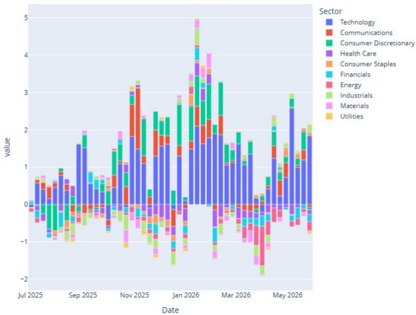

bar_stacked

| Date | Technology | Communications | Consumer Discretionary | Health Care | Consumer Staples | Financials | Energy | Industrials | Materials | Utilities |
|---|---|---|---|---|---|---|---|---|---|---|
| Jul 2025 | 0.3 | 0.1 | 0.1 | 0.1 | 0.1 | 0.1 | -0.2 | 0.1 | 0.1 | 0.1 |
| Aug 2025 | 0.4 | 0.1 | 0.1 | 0.1 | 0.1 | 0.1 | -0.2 | 0.1 | 0.1 | 0.1 |
| Sep 2025 | 0.5 | 0.1 | 0.1 | 0.1 | 0.1 | 0.1 | -0.2 | 0.1 | 0.1 | 0.1 |
| Oct 2025 | 0.6 | 0.1 | 0.1 | 0.1 | 0.1 | 0.1 | -0.2 | 0.1 | 0.1 | 0.1 |
| Nov 2025 | 0.7 | 0.2 | 0.2 | 0.2 | 0.2 | 0.2 | -0.2 | 0.1 | 0.1 | 0.1 |
| Dec 2025 | 0.8 | 0.2 | 0.2 | 0.2 | 0.2 | 0.2 | -0.2 | 0.1 | 0.1 | 0.1 |
| Jan 2026 | 0.9 | 0.3 | 0.3 | 0.3 | 0.3 | 0.3 | -0.2 | 0.1 | 0.1 | 0.1 |
| Feb 2026 | 1.0 | 0.3 | 0.3 | 0.3 | 0.3 | 0.3 | -0.2 | 0.1 | 0.1 | 0.1 |
| Mar 2026 | 1.1 | 0.3 | 0.3 | 0.3 | 0.3 | 0.3 | -0.2 | 0.1 | 0.1 | 0.1 |
| Apr 2026 | 1.2 | 0.3 | 0.3 | 0.3 | 0.3 | 0.3 | -0.2 | 0.1 | 0.1 | 0.1 |
| May 2026 | 1.3 | 0.3 | 0.3 | 0.3 | 0.3 | 0.3 | -0.2 | 0.1 | 0.1 | 0.1 |
The chart displays a stacked bar chart with each bar representing the total value for that sector across the time period from July to May in the following year.

Source: JPM Equity Strategy & Quantitative Research

Figure 33: Retail Cumulative Purchases in Mag 7 + PLTR (\$B)   
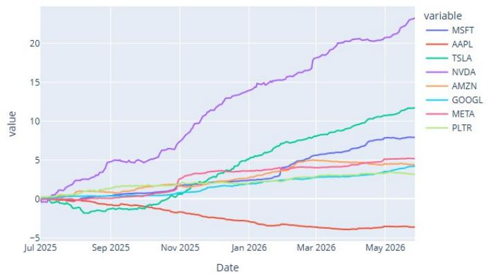

line

| Date     | MSFT  | AAPL  | TSLA  | NVDA  | AMZN  | GOOGL | META  | PLTR  |
| -------- | ----- | ----- | ----- | ----- | ----- | ----- | ----- | ----- |
| Jul 2025 | 0.0   | 0.0   | 0.0   | 0.0   | 0.0   | 0.0   | 0.0   | 0.0   |
| Sep 2025 | 1.0   | -1.0  | -2.0  | 4.0   | 1.0   | 1.0   | 1.0   | 1.0   |
| Nov 2025 | 2.0   | -2.0  | 1.0   | 7.0   | 2.0   | 2.0   | 3.0   | 2.0   |
| Jan 2026 | 4.0   | -3.0  | 5.0   | 14.0  | 3.0   | 3.0   | 4.0   | 3.0   |
| Mar 2026 | 6.0   | -4.0  | 8.0   | 18.0  | 4.0   | 4.0   | 5.0   | 4.0   |
| May 2026 | 8.0   | -4.0  | 11.0  | 22.0  | 5.0   | 5.0   | 5.0   | 4.0   |

Source: JPM Equity Strategy & Quantitative Research

Figure 35: Retail ETF Activity by Themes

Buying / Selling of ETFs aggregated by themes, in \$B. Note: The last weekly data point includes a holiday, May 25 $^{th}$ .

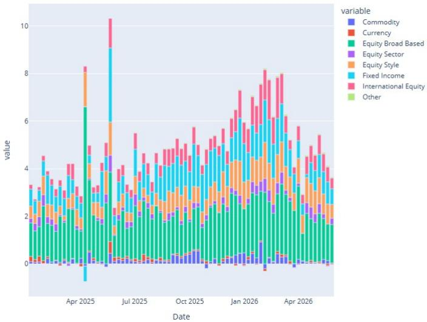

bar_stacked

| Date | Commodity | Currency | Equity Broad Based | Equity Sector | Equity Style | Fixed Income | International Equity | Other |
|---|---|---|---|---|---|---|---|---|
| Apr 2025 | 0.1 | 0.1 | 0.3 | 0.1 | 0.1 | 0.1 | 0.1 | 0.1 |
| Jul 2025 | 0.1 | 0.1 | 0.3 | 0.1 | 0.1 | 0.1 | 0.1 | 0.1 |
| Oct 2025 | 0.1 | 0.1 | 0.3 | 0.1 | 0.1 | 0.1 | 0.1 | 0.1 |
| Jan 2026 | 0.1 | 0.1 | 0.3 | 0.1 | 0.1 | 0.1 | 0.1 | 0.1 |
| Apr 2026 | 0.1 | 0.1 | 0.3 | 0.1 | 0.1 | 0.1 | 0.1 | 0.1 |

Source: JPM Equity Strategy & Quantitative Research

# Meme Battlegrounds: Retail Buying vs. Hedge Fund Shorting

In this section, we are flagging a few stocks that are heavily mentioned on Social Media and have high Retail buying as well as high Hedge fund Shorting. These stocks may experience unexpected flows in case of increased activity.

# Social Media Screen and Retail Activity

Figure 36: Most Hyped Stocks on Social Media   
Top 20 names based on social media traction over the week (Social Interest), Scaled by market cap 

<table><tr><td>Ticker</td><td>Name</td><td>Mkt Cap ($B)</td><td>Social Interest Score</td><td>Median Short Interest (% float)</td><td>Extreme Imbalance 1D Z</td><td>Date of Imbalance</td></tr><tr><td>IMSR</td><td>Terrestrial Energy Inc</td><td>0.9</td><td>40.3</td><td>5.4%</td><td>1.7</td><td>19-May</td></tr><tr><td>USO</td><td>United States Oil Fund LP</td><td>1.9</td><td>37.5</td><td>106.0%</td><td>0.8</td><td>19-May</td></tr><tr><td>SOXL</td><td>Direxion Daily Semiconductor Bull 3X ETF</td><td>25.8</td><td>37.1</td><td>9.3%</td><td>-0.5</td><td>26-May</td></tr><tr><td>BNO</td><td>United States Brent Oil Fund LP</td><td>0.8</td><td>36.6</td><td>3.1%</td><td>3.8</td><td>26-May</td></tr><tr><td>NVDA</td><td>NVIDIA Corp</td><td>5199.6</td><td>36.1</td><td>1.2%</td><td>-1.6</td><td>22-May</td></tr><tr><td>ASTS</td><td>AST SpaceMobile Inc</td><td>46.5</td><td>36.1</td><td>31.1%</td><td>1.0</td><td>26-May</td></tr><tr><td>PLTR</td><td>Palantir Technologies Inc</td><td>327.5</td><td>35.5</td><td>2.7%</td><td>2.0</td><td>20-May</td></tr><tr><td>RKLB</td><td>Rocket Lab Corp</td><td>89.5</td><td>35.4</td><td>5.8%</td><td>3.2</td><td>19-May</td></tr><tr><td>SLS</td><td>SELLAS Life Sciences Group Inc</td><td>1.5</td><td>35.0</td><td>30.1%</td><td>-0.6</td><td>20-May</td></tr><tr><td>MU</td><td>Micron Technology Inc</td><td>1010.3</td><td>31.1</td><td>3.4%</td><td>-0.5</td><td>20-May</td></tr><tr><td>ASIC</td><td>Ategrity Specialty Holdings LLC</td><td>1.0</td><td>30.8</td><td>4.9%</td><td>0.8</td><td>21-May</td></tr><tr><td>AMD</td><td>Advanced Micro Devices Inc</td><td>821.6</td><td>30.8</td><td>2.2%</td><td>-1.0</td><td>21-May</td></tr><tr><td>SNDK</td><td>Sandisk Corp/DE</td><td>235.4</td><td>30.6</td><td>7.3%</td><td>0.6</td><td>20-May</td></tr><tr><td>RDDT</td><td>Reddit Inc</td><td>27.8</td><td>30.5</td><td>12.0%</td><td>-0.8</td><td>21-May</td></tr><tr><td>LUNR</td><td>Intuitive Machines Inc</td><td>7.6</td><td>30.1</td><td>20.7%</td><td>0.9</td><td>22-May</td></tr><tr><td>RGTI</td><td>Rigetti Computing Inc</td><td>8.3</td><td>29.6</td><td>15.7%</td><td>1.9</td><td>26-May</td></tr><tr><td>NBIS</td><td>Nebius Group NV</td><td>52.8</td><td>29.2</td><td>20.2%</td><td>2.8</td><td>20-May</td></tr><tr><td>AMZN</td><td>Amazon.com Inc</td><td>2853.8</td><td>28.0</td><td>0.9%</td><td>-1.1</td><td>21-May</td></tr><tr><td>MSFT</td><td>Microsoft Corp</td><td>3090.5</td><td>26.8</td><td>1.1%</td><td>-2.1</td><td>26-May</td></tr><tr><td>TSLA</td><td>Tesla Inc</td><td>1628.4</td><td>26.7</td><td>2.6%</td><td>-2.4</td><td>19-May</td></tr></table>

Source: JPM Equity Strategy & Quantitative Research, S3 Partners

Figure 37: Increasing Squeeze Risk in Meme Stocks: Retail Selling in High Short Interest Names   
Positive Slope = Opposite Positioning (Heightened Risk of Short Squeeze or Retail Losses); Negative Slope = Similar Positioning (Diffusing Squeeze Risk)   
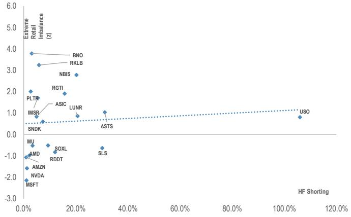

scatter

| Company | HF Shorting (%) | Extreme Retail Imbalance (Z) |
| :--- | :--- | :--- |
| BNO | 5.0 | 3.8 |
| RKLB | 10.0 | 3.2 |
| NBIS | 20.0 | 2.8 |
| RGTI | 15.0 | 1.9 |
| LUNR | 20.0 | 0.9 |
| PLTR | 5.0 | 1.9 |
| IMSR | 5.0 | 0.6 |
| SNDK | 5.0 | 0.6 |
| ASIC | 15.0 | 1.8 |
| ASTS | 30.0 | 1.0 |
| MU | 5.0 | -0.7 |
| AMD | 5.0 | -1.0 |
| AMZN | 5.0 | -1.4 |
| SOXL | 10.0 | -0.6 |
| RDDT | 10.0 | -1.2 |
| AMDA | 5.0 | -1.2 |
| NVDA | 5.0 | -2.1 |
| MSFT | 5.0 | -2.2 |
| SLS | 30.0 | -0.6 |
| USO | 105.0 | 0.8 |

Source: JPM Equity Strategy & Quantitative Research, S3 Partners

Figure 38: Retail Activity in FLO   
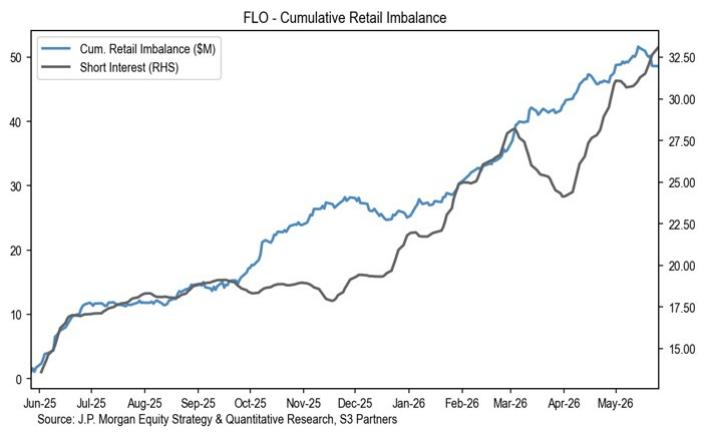

line

| Date   | Cum. Retail Imbalance ($M) | Short Interest (RHS) |
|--------|----------------------------|----------------------|
| Jun-25 | 0                          | 0                    |
| Jul-25 | 10                         | 10                   |
| Aug-25 | 15                         | 15                   |
| Sep-25 | 20                         | 18                   |
| Oct-25 | 25                         | 17                   |
| Nov-25 | 30                         | 19                   |
| Dec-25 | 28                         | 18                   |
| Jan-26 | 30                         | 20                   |
| Feb-26 | 35                         | 25                   |
| Mar-26 | 40                         | 30                   |
| Apr-26 | 45                         | 28                   |
| May-26 | 50                         | 32                   |

Source: JPM Equity Strategy & Quantitative Research, S3 Partners

Figure 39: Retail Activity in PATH   
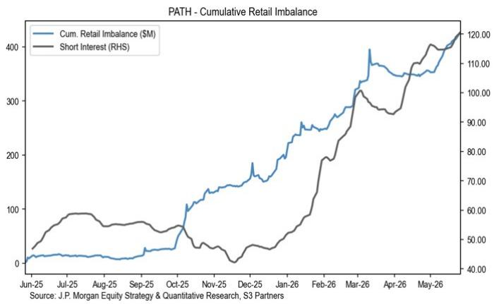

line

| Date   | Cum. Retail Imbalance ($M) | Short Interest (RHS) |
|--------|----------------------------|----------------------|
| Jun-25 | ~10                        | ~40                  |
| Jul-25 | ~15                        | ~50                  |
| Aug-25 | ~20                        | ~55                  |
| Sep-25 | ~30                        | ~50                  |
| Oct-25 | ~70                        | ~45                  |
| Nov-25 | ~100                       | ~40                  |
| Dec-25 | ~150                       | ~35                  |
| Jan-26 | ~200                       | ~50                  |
| Feb-26 | ~250                       | ~80                  |
| Mar-26 | ~300                       | ~100                 |
| Apr-26 | ~350                       | ~90                  |
| May-26 | ~400                       | ~110                 |

Source: JPM Equity Strategy & Quantitative Research, S3 Partners

Figure 40: Retail Activity in SLG   
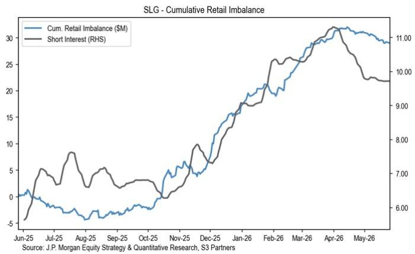

line

| Date   | Cum. Retail Imbalance ($M) | Short Interest (RHS) |
|--------|----------------------------|----------------------|
| Jun-25 | 0                          | 6.0                  |
| Jul-25 | -2                         | 7.0                  |
| Aug-25 | -3                         | 8.0                  |
| Sep-25 | -4                         | 6.5                  |
| Oct-25 | -3                         | 6.0                  |
| Nov-25 | 0                          | 7.0                  |
| Dec-25 | 5                          | 8.0                  |
| Jan-26 | 10                         | 9.0                  |
| Feb-26 | 15                         | 10.0                 |
| Mar-26 | 20                         | 11.0                 |
| Apr-26 | 25                         | 11.0                 |
| May-26 | 30                         | 10.0                 |

Source: JPM Equity Strategy & Quantitative Research, S3 Partners

# Retail Trading Share

Figure 41: Retail Trading Volume Share for Single Stocks   
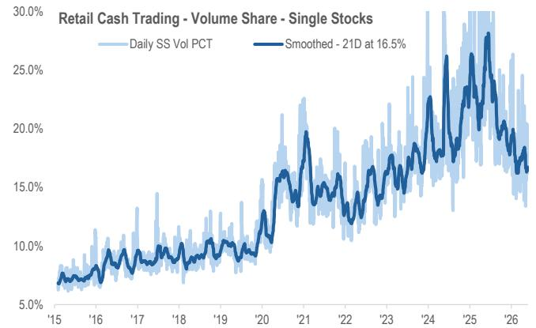

line

| Year | Daily SS Vol PCT | Smoothed - 21D at 16.5% |
|------|------------------|--------------------------|
| '15  | ~7.0%            | ~7.0%                    |
| '16  | ~8.0%            | ~8.0%                    |
| '17  | ~9.0%            | ~9.0%                    |
| '18  | ~10.0%           | ~10.0%                   |
| '19  | ~11.0%           | ~11.0%                   |
| '20  | ~13.0%           | ~13.0%                   |
| '21  | ~16.0%           | ~16.5%                   |
| '22  | ~18.0%           | ~18.0%                   |
| '23  | ~20.0%           | ~20.0%                   |
| '24  | ~22.0%           | ~22.0%                   |
| '25  | ~24.0%           | ~24.0%                   |
| '26  | ~26.0%           | ~26.0%                   |

Source: JPM Equity Strategy & Quantitative Research

Figure 43: Retail Trading Dollar Share for Single Stocks   
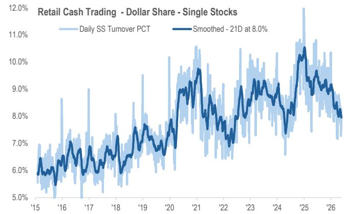

line

| Year | Daily SS Turnover PCT | Smoothed - 21D at 8.0% |
|------|------------------------|--------------------------|
| '15  | ~6.5%                  | ~6.0%                    |
| '16  | ~7.0%                  | ~6.5%                    |
| '17  | ~7.5%                  | ~7.0%                    |
| '18  | ~8.0%                  | ~7.5%                    |
| '19  | ~8.5%                  | ~8.0%                    |
| '20  | ~9.0%                  | ~8.5%                    |
| '21  | ~9.5%                  | ~9.0%                    |
| '22  | ~9.0%                  | ~8.5%                    |
| '23  | ~9.5%                  | ~9.0%                    |
| '24  | ~10.0%                 | ~9.5%                    |
| '25  | ~10.5%                 | ~10.0%                   |
| '26  | ~9.0%                  | ~8.5%                    |

Source: JPM Equity Strategy & Quantitative Research

Figure 45: Median Retail Trading Share for Single Stocks   
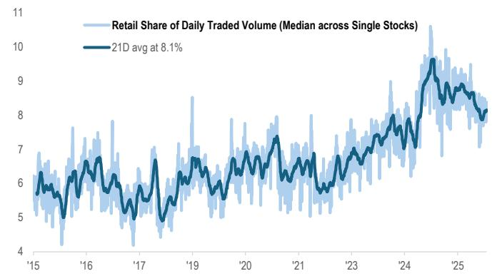

line

| Year | Retail Share of Daily Traded Volume (Median across Single Stocks) | 21D avg at 8.1% |
|------|------------------------------------------------------------------------|-----------------|
| '15  | ~6.0                                                                   | ~5.8            |
| '16  | ~7.0                                                                   | ~6.5            |
| '17  | ~5.5                                                                   | ~5.0            |
| '19  | ~8.5                                                                   | ~6.8            |
| '20  | ~7.5                                                                   | ~7.0            |
| '21  | ~7.0                                                                   | ~6.5            |
| '23  | ~7.5                                                                   | ~7.0            |
| '24  | ~9.0                                                                   | ~8.0            |
| '25  | ~8.0                                                                   | ~7.5            |

Source: JPM Equity Strategy & Quantitative Research

Figure 42: Retail Trading Volume Share for ETFs   
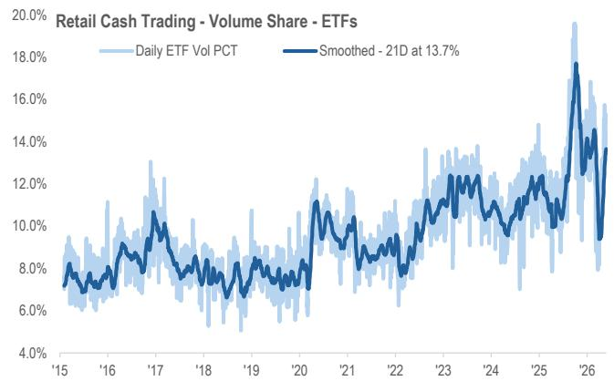

line

| Year | Daily ETF Vol PCT | Smoothed - 21D at 13.7% |
|------|-------------------|--------------------------|
| '15  | ~8.0%             | ~7.5%                    |
| '16  | ~9.0%             | ~8.5%                    |
| '17  | ~10.0%            | ~9.5%                    |
| '18  | ~8.5%             | ~8.0%                    |
| '19  | ~9.0%             | ~8.5%                    |
| '20  | ~10.0%            | ~9.5%                    |
| '21  | ~11.0%            | ~10.5%                   |
| '22  | ~10.5%            | ~10.0%                   |
| '23  | ~12.0%            | ~11.5%                   |
| '24  | ~11.5%            | ~11.0%                   |
| '25  | ~13.0%            | ~12.5%                   |
| '26  | ~18.0%            | ~17.5%                   |

Source: JPM Equity Strategy & Quantitative Research

Figure 44: Retail Trading Dollar Share for ETFs   
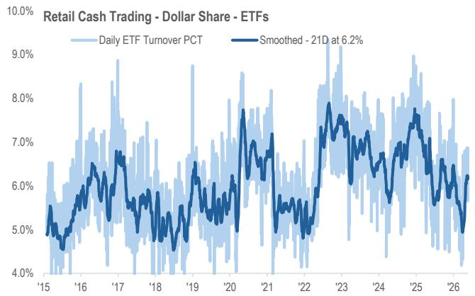

line

| Year | Daily ETF Turnover PCT | Smoothed - 21D at 6.2% |
|------|------------------------|------------------------|
| '15  | ~5.5%                  | ~5.0%                  |
| '16  | ~7.0%                  | ~6.0%                  |
| '17  | ~8.5%                  | ~6.5%                  |
| '18  | ~6.5%                  | ~5.5%                  |
| '19  | ~8.0%                  | ~6.0%                  |
| '20  | ~7.5%                  | ~7.0%                  |
| '21  | ~7.0%                  | ~6.5%                  |
| '22  | ~7.5%                  | ~7.0%                  |
| '23  | ~8.5%                  | ~7.5%                  |
| '24  | ~7.0%                  | ~6.5%                  |
| '25  | ~8.0%                  | ~7.0%                  |
| '26  | ~6.5%                  | ~6.0%                  |

Source: JPM Equity Strategy & Quantitative Research

Figure 46: Median Retail Trading Share for ETFs   
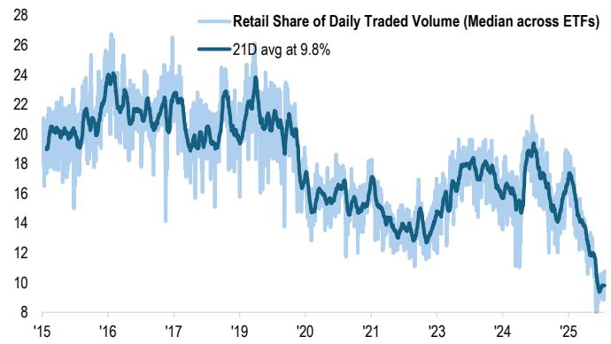

line

| Year | Retail Share of Daily Traded Volume (Median across ETFs) |
|------|---------------------------------------------------------------|
| '15  | ~20%                                                          |
| '16  | ~24%                                                          |
| '17  | ~22%                                                          |
| '19  | ~24%                                                          |
| '20  | ~16%                                                          |
| '21  | ~14%                                                          |
| '23  | ~18%                                                          |
| '24  | ~20%                                                          |
| '25  | ~10%                                                          |

Source: JPM Equity Strategy & Quantitative Research

# Retail Activity in Options

Figure 47: Top 40 Equities with Most Delta Bought (in \$Mn)   
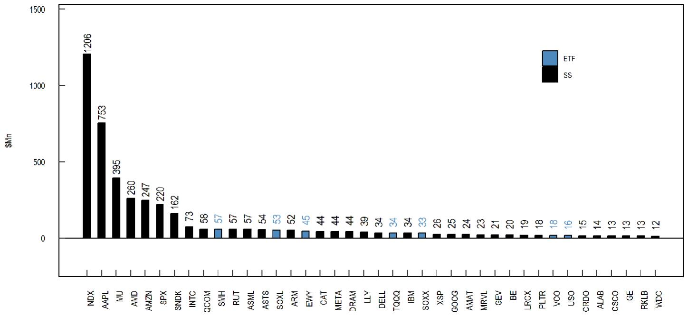

bar

| Company | Value ($Mn) |
| :--- | :--- |
| NDX | 1206 |
| AAPL | 753 |
| MU | 395 |
| AMD | 260 |
| AMZN | 247 |
| SPX | 220 |
| SNDK | 162 |
| INTC | 73 |
| QCOM | 58 |
| SMH | 57 |
| RUT | 57 |
| ASML | 57 |
| ASTS | 54 |
| SOXL | 53 |
| ARM | 52 |
| EWY | 45 |
| CAT | 44 |
| META | 44 |
| DRAM | 44 |
| LLY | 39 |
| DELL | 34 |
| TQQQ | 34 |
| IBM | 34 |
| SOXX | 33 |
| XSP | 26 |
| GOOG | 25 |
| AMAT | 24 |
| MRVL | 23 |
| GEV | 21 |
| BE | 20 |
| LRCX | 19 |
| PLTR | 18 |
| VOO | 18 |
| USO | 16 |
| CRDO | 15 |
| ALAB | 14 |
| CSCO | 13 |
| GE | 13 |
| RKLB | 13 |
| WDC | 12 |

Source: JPM Equity Strategy & Quantitative Research

Figure 48: Top 40 Equities with Most Delta Sold (in \$Mn)   
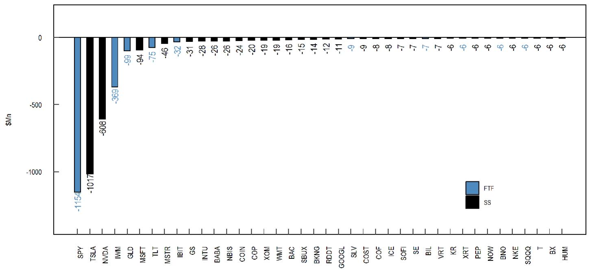

bar

| Ticker | FTF ($Mn) | SS ($Mn) |
| :--- | :--- | :--- |
| SPY | -1154 | -1017 |
| TSLA | 0 | -608 |
| NVDA | 0 | 0 |
| IWM | -369 | 0 |
| GLD | -99 | -94 |
| MSFT | -75 | -46 |
| TLT | -32 | -31 |
| MSTR | -32 | -28 |
| IBIT | -32 | -26 |
| GS | -32 | -26 |
| INTU | -32 | -24 |
| BABA | -32 | -20 |
| NBIS | -32 | -19 |
| COIN | -32 | -19 |
| COP | -32 | -16 |
| XOM | -32 | -15 |
| WMT | -32 | -14 |
| BAC | -32 | -12 |
| SBUX | -32 | -11 |
| BKNG | -32 | -9 |
| RDDT | -32 | -9 |
| GOOGL | -32 | -8 |
| SLV | -32 | -8 |
| COST | -32 | -7 |
| COF | -32 | -7 |
| ICE | -32 | -7 |
| SOFI | -32 | -7 |
| SE | -32 | -7 |
| BIL | -32 | -7 |
| VRT | -32 | -6 |
| KR | -32 | -6 |
| XRT | -32 | -6 |
| PEP | -32 | -6 |
| NOW | -32 | -6 |
| BNO | -32 | -6 |
| NKE | -32 | -6 |
| SQQQ | -32 | -6 |
| T | -32 | -6 |
| BX | -32 | -6 |
| HUM | -32 | -6 |

Source: JPM Equity Strategy & Quantitative Research

Figure 49: Top 40 Equities with Most Gamma Bought (in \$Mn)   
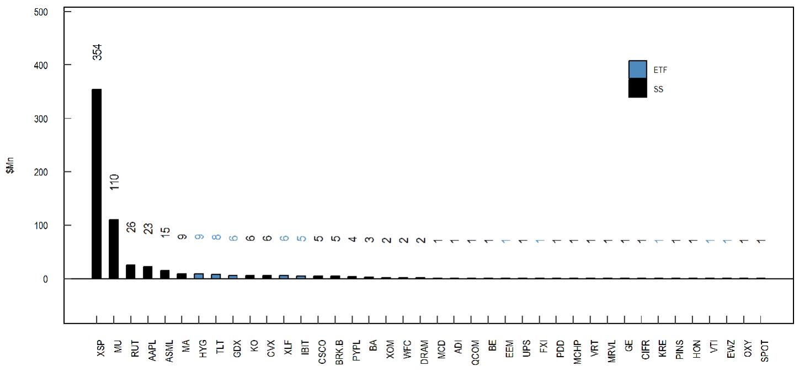

bar

| Company | Value ($Mn) |
| :--- | :--- |
| XSP | 354 |
| MU | 110 |
| RUT | 26 |
| AAPL | 23 |
| ASML | 15 |
| MA | 9 |
| HYG | 9 |
| TLT | 8 |
| GDX | 6 |
| KO | 6 |
| CVX | 6 |
| XLF | 6 |
| IBIT | 5 |
| CSCO | 5 |
| BRK.B | 5 |
| PYPL | 4 |
| BA | 3 |
| XOM | 2 |
| WFC | 2 |
| DRAM | 2 |
| MCD | 1 |
| ADI | 1 |
| QCOM | 1 |
| BE | 1 |
| EEM | 1 |
| UPS | 1 |
| FXI | 1 |
| PDD | 1 |
| MCHP | 1 |
| VRT | 1 |
| MRVL | 1 |
| GE | 1 |
| CIFR | 1 |
| KRE | 1 |
| PINS | 1 |
| HON | 1 |
| VTI | 1 |
| EWZ | 1 |
| OXY | 1 |
| SPOT | 1 |

Source: JPM Equity Strategy & Quantitative Research

Figure 50: Top 40 Equities with Most Gamma Sold (in \$Mn)   
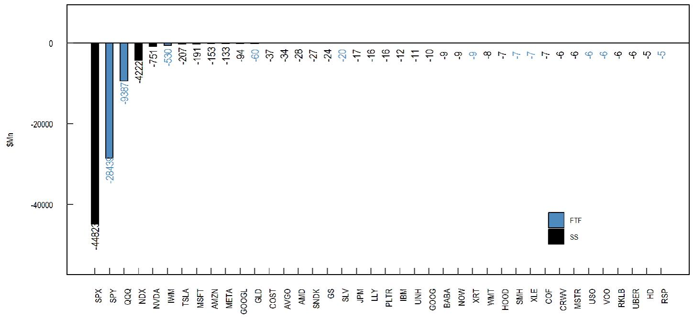

bar

| Ticker | FTF ($Mn) | SS ($Mn) |
| :--- | :--- | :--- |
| SPX | -44823 | -44823 |
| SPY | -28433 | -9387 |
| QQQ | -4222 | -153 |
| NDX | -751 | -133 |
| NVDA | -530 | -94 |
| IWM | -207 | -60 |
| TSLA | -191 | -37 |
| MSFT | -191 | -34 |
| AMZN | -153 | -28 |
| META | -27 | -24 |
| GOOGL | -20 | -17 |
| GLD | -16 | -16 |
| COST | -12 | -12 |
| AVGO | -11 | -11 |
| AMD | -10 | -9 |
| SNDK | -9 | -9 |
| GS | -9 | -9 |
| SLV | -8 | -8 |
| JPM | -7 | -7 |
| LLY | -7 | -7 |
| PLTR | -7 | -7 |
| IBM | -6 | -6 |
| UNH | -6 | -6 |
| GOOG | -6 | -6 |
| BABA | -6 | -6 |
| NOW | -6 | -6 |
| XRT | -6 | -6 |
| WMT | -6 | -6 |
| HOOD | -6 | -6 |
| SMH | -6 | -6 |
| XLE | -6 | -6 |
| COF | -6 | -6 |
| CRWV | -6 | -6 |
| MSTR | -6 | -6 |
| USO | -6 | -6 |
| VOO | -6 | -6 |
| RKLB | -6 | -6 |
| UBER | -6 | -5 |
| HD | -5 | -5 |
| RSP | -5 | -5 |

Source: JPM Equity Strategy & Quantitative Research

# Company-Specific Retail Activity

# Earnings Stories/Macro and Fundamental Stories

Figure 51: Daily Retail Imbalance in IBM   
As of May 26 $^{th}$   
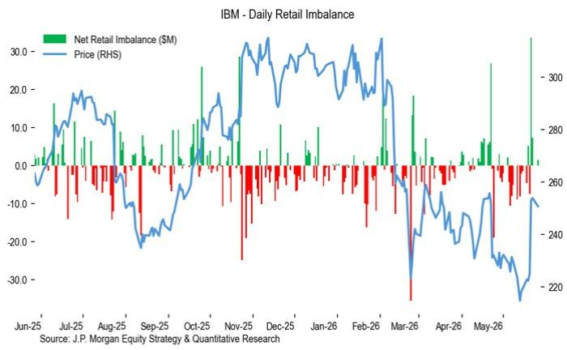

line

| Date   | Net Retail Imbalance ($M) | Price (RHS) |
|--------|---------------------------|-------------|
| Jun-25 | ~0                        | ~-280       |
| Jul-25 | ~10                       | ~-260       |
| Aug-25 | ~5                        | ~-240       |
| Sep-25 | ~0                        | ~-220       |
| Oct-25 | ~10                       | ~-200       |
| Nov-25 | ~30                       | ~-180       |
| Dec-25 | ~10                       | ~-160       |
| Jan-26 | ~5                        | ~-140       |
| Feb-26 | ~10                       | ~-120       |
| Mar-26 | ~-30                      | ~-100       |
| Apr-26 | ~0                        | ~-120       |
| May-26 | ~10                       | ~-140       |

Source: JPM Equity Strategy & Quantitative Research

Figure 52: Cumulative Retail Imbalance in IBM   
As of May 26 $^{th}$   
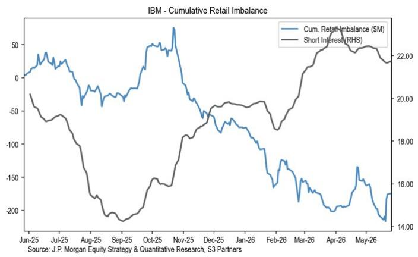

line

| Date   | Cum. Retail Imbalance ($M) | Short Interest (RHS) |
|--------|-----------------------------|----------------------|
| Jun-25 | ~0                          | ~20.00               |
| Jul-25 | ~30                         | ~18.00               |
| Aug-25 | ~-50                        | ~16.00               |
| Sep-25 | ~-100                       | ~14.00               |
| Oct-25 | ~50                         | ~16.00               |
| Nov-25 | ~70                         | ~18.00               |
| Dec-25 | ~-50                        | ~19.00               |
| Jan-26 | ~-100                       | ~18.00               |
| Feb-26 | ~-150                       | ~16.00               |
| Mar-26 | ~-180                       | ~18.00               |
| Apr-26 | ~-160                       | ~20.00               |
| May-26 | ~-200                       | ~22.00               |

Source: JPM Equity Strategy & Quantitative Research

Figure 53: Daily Retail Imbalance in GFS   
As of May 26 $^{th}$   
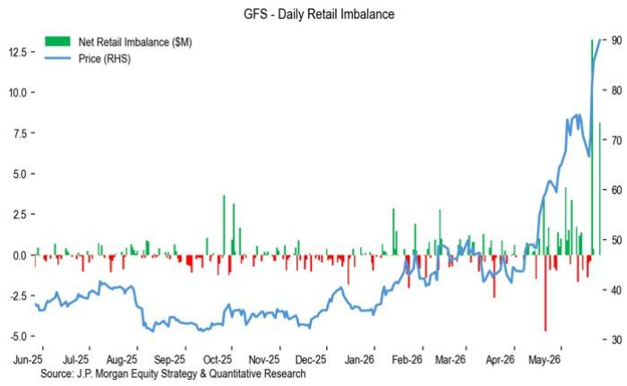

line

| Date   | Net Retail Imbalance ($M) | Price (RHS) |
|--------|---------------------------|-------------|
| Jun-25 | ~0.0                      | ~-30        |
| Jul-25 | ~0.0                      | ~-30        |
| Aug-25 | ~0.0                      | ~-30        |
| Sep-25 | ~0.0                      | ~-40        |
| Oct-25 | ~3.0                      | ~-40        |
| Nov-25 | ~0.0                      | ~-40        |
| Dec-25 | ~0.0                      | ~-40        |
| Jan-26 | ~0.0                      | ~-30        |
| Feb-26 | ~3.0                      | ~-30        |
| Mar-26 | ~0.0                      | ~-30        |
| Apr-26 | ~0.0                      | ~-30        |
| May-26 | ~8.0                      | ~90         |

Source: JPM Equity Strategy & Quantitative Research

Figure 54: Cumulative Retail Imbalance in GFS   
As of May 26 $^{th}$   
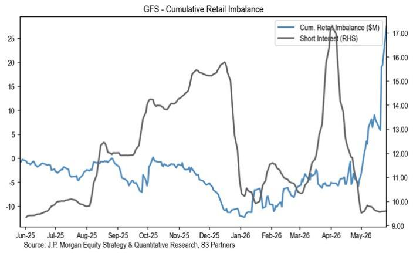

line

| Date   | Cum. Retail Imbalance ($M) | Short Interest (RHS) |
|--------|-----------------------------|----------------------|
| Jun-25 | -1.0                        | 9.0                  |
| Jul-25 | -0.5                        | 10.0                 |
| Aug-25 | -1.5                        | 11.0                 |
| Sep-25 | -0.8                        | 12.0                 |
| Oct-25 | -0.3                        | 13.0                 |
| Nov-25 | 0.0                         | 14.0                 |
| Dec-25 | 0.5                         | 15.0                 |
| Jan-26 | -1.0                        | 16.0                 |
| Feb-26 | -0.5                        | 14.0                 |
| Mar-26 | 0.0                         | 13.0                 |
| Apr-26 | 0.5                         | 17.0                 |
| May-26 | 1.0                         | 14.0                 |

Source: JPM Equity Strategy & Quantitative Research

Figure 55: Daily Retail Imbalance in IONQ   
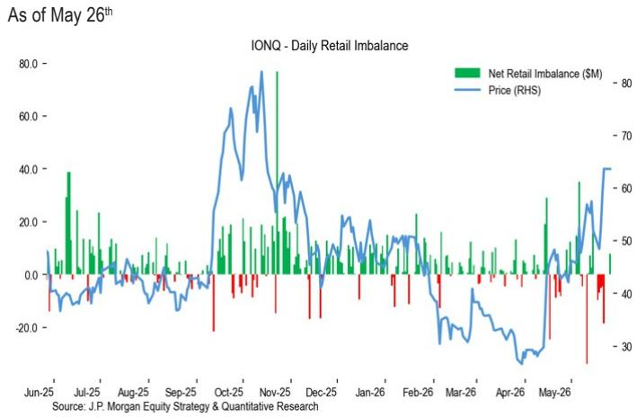

line

| Date   | Net Retail Imbalance ($M) | Price (RHS) |
|--------|---------------------------|-------------|
| Jun-25 | ~10                       | ~40         |
| Jul-25 | ~40                       | ~30         |
| Aug-25 | ~10                       | ~30         |
| Sep-25 | ~10                       | ~30         |
| Oct-25 | ~20                       | ~70         |
| Nov-25 | ~80                       | ~60         |
| Dec-25 | ~10                       | ~50         |
| Jan-26 | ~10                       | ~50         |
| Feb-26 | ~10                       | ~50         |
| Mar-26 | ~10                       | ~30         |
| Apr-26 | ~10                       | ~30         |
| May-26 | ~10                       | ~60         |

Source: JPM Equity Strategy & Quantitative Research

Figure 56: Cumulative Retail Imbalance in IONQ   
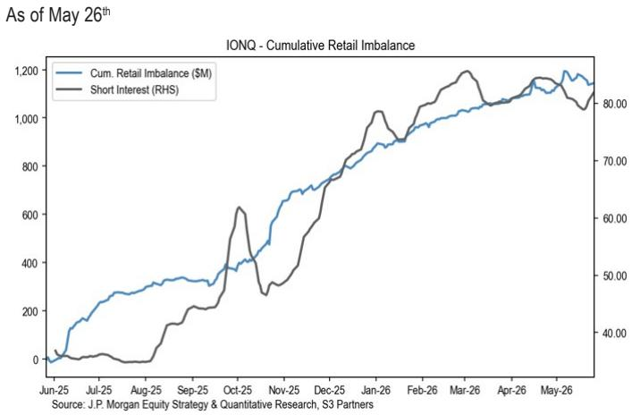

line

| Date   | Cum. Retail Imbalance ($M) | Short Interest (RHS) |
|--------|----------------------------|----------------------|
| Jun-25 | ~100                       | ~40.00               |
| Jul-25 | ~250                       | ~45.00               |
| Aug-25 | ~300                       | ~50.00               |
| Sep-25 | ~350                       | ~55.00               |
| Oct-25 | ~400                       | ~60.00               |
| Nov-25 | ~600                       | ~50.00               |
| Dec-25 | ~700                       | ~65.00               |
| Jan-26 | ~800                       | ~75.00               |
| Feb-26 | ~900                       | ~80.00               |
| Mar-26 | ~1000                      | ~85.00               |
| Apr-26 | ~1100                      | ~80.00               |
| May-26 | ~1200                      | ~75.00               |

Source: JPM Equity Strategy & Quantitative Research

Figure 57: Daily Retail Imbalance in QUBT   
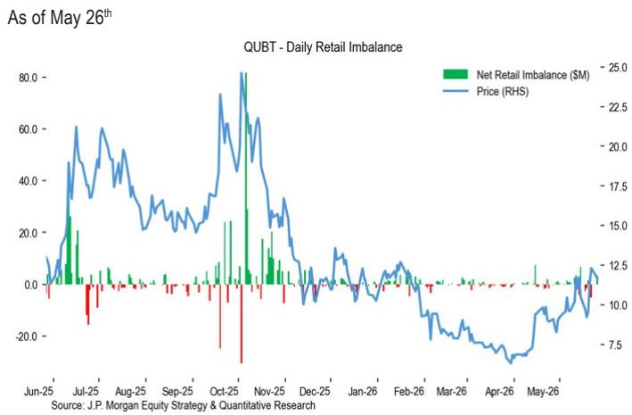

line

| Date   | Net Retail Imbalance ($M) | Price (RHS) |
|--------|---------------------------|-------------|
| Jun-25 | 0.0                       | 10.0        |
| Jul-25 | 20.0                      | 60.0        |
| Aug-25 | 0.0                       | 40.0        |
| Sep-25 | 0.0                       | 30.0        |
| Oct-25 | 20.0                      | 80.0        |
| Nov-25 | 0.0                       | 60.0        |
| Dec-25 | 0.0                       | 30.0        |
| Jan-26 | 0.0                       | 15.0        |
| Feb-26 | 0.0                       | 10.0        |
| Mar-26 | 0.0                       | 5.0         |
| Apr-26 | 0.0                       | 0.0         |
| May-26 | 0.0                       | 10.0        |

Source: JPM Equity Strategy & Quantitative Research

Figure 58: Cumulative Retail Imbalance in QUBT   
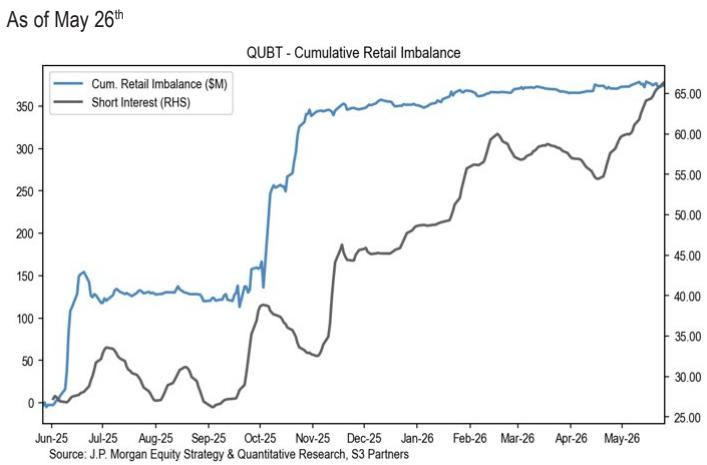

line

| Date   | Cum. Retail Imbalance ($M) | Short Interest (RHS) |
|--------|----------------------------|----------------------|
| Jun-25 | ~150                       | ~25.00               |
| Jul-25 | ~130                       | ~30.00               |
| Aug-25 | ~130                       | ~25.00               |
| Sep-25 | ~130                       | ~25.00               |
| Oct-25 | ~150                       | ~40.00               |
| Nov-25 | ~350                       | ~45.00               |
| Dec-25 | ~350                       | ~45.00               |
| Jan-26 | ~350                       | ~45.00               |
| Feb-26 | ~350                       | ~50.00               |
| Mar-26 | ~350                       | ~55.00               |
| Apr-26 | ~350                       | ~55.00               |
| May-26 | ~375                       | ~60.00               |

Source: JPM Equity Strategy & Quantitative Research

Figure 59: Daily Retail Imbalance in ARQQ   
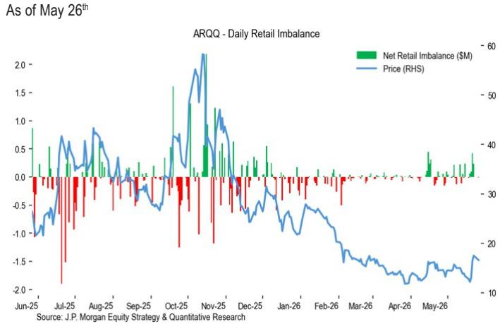

line

| Date   | Net Retail Imbalance ($M) | Price (RHS) |
|--------|---------------------------|-------------|
| Jun-25 | 0.0                       | 30          |
| Jul-25 | 0.5                       | 40          |
| Aug-25 | 0.0                       | 35          |
| Sep-25 | 0.0                       | 30          |
| Oct-25 | 1.5                       | 45          |
| Nov-25 | 2.0                       | 60          |
| Dec-25 | 0.0                       | 35          |
| Jan-26 | 0.0                       | 30          |
| Feb-26 | 0.0                       | 25          |
| Mar-26 | 0.0                       | 20          |
| Apr-26 | 0.0                       | 15          |
| May-26 | 0.0                       | 10          |

Source: JPM Equity Strategy & Quantitative Research

Figure 60: Cumulative Retail Imbalance in ARQQ   
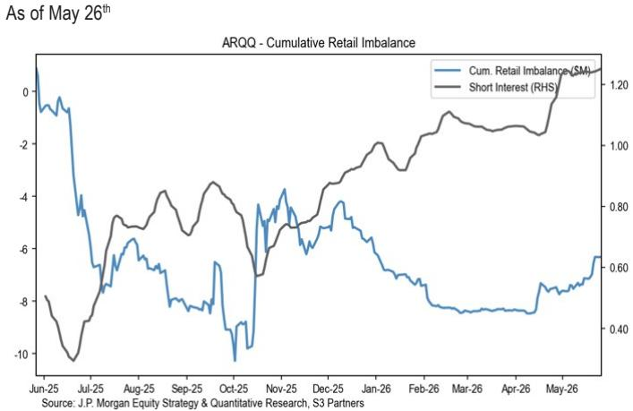

line

| Date   | Cum. Retail Imbalance ($M) | Short Interest (RHS) |
|--------|-----------------------------|----------------------|
| Jun-25 | ~0.0                        | ~0.40                |
| Jul-25 | ~-8.0                       | ~0.60                |
| Aug-25 | ~-6.0                       | ~0.70                |
| Sep-25 | ~-7.0                       | ~0.80                |
| Oct-25 | ~-10.0                      | ~0.90                |
| Nov-25 | ~-4.0                       | ~1.00                |
| Dec-25 | ~-5.0                       | ~1.10                |
| Jan-26 | ~-6.0                       | ~1.20                |
| Feb-26 | ~-7.0                       | ~1.10                |
| Mar-26 | ~-8.0                       | ~1.00                |
| Apr-26 | ~-8.0                       | ~0.90                |
| May-26 | ~-6.0                       | ~1.20                |

Source: JPM Equity Strategy & Quantitative Research

Figure 61: Daily Retail Imbalance in QBTS   
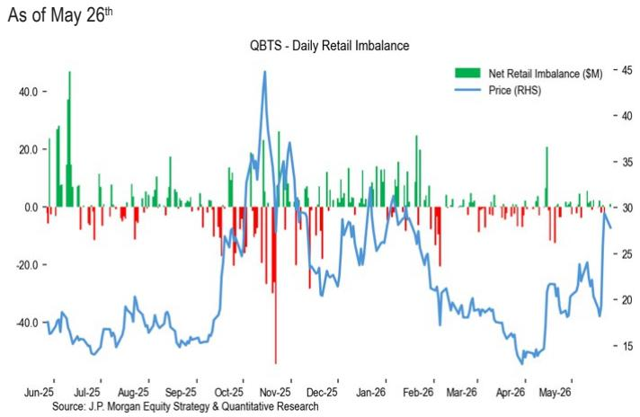

line

| Date   | Net Retail Imbalance ($M) | Price ($) |
|--------|---------------------------|---------|
| Jun-25 | ~30                       | ~-40    |
| Jul-25 | ~45                       | ~-35    |
| Aug-25 | ~10                       | ~-30    |
| Sep-25 | ~15                       | ~-25    |
| Oct-25 | ~20                       | ~-20    |
| Nov-25 | ~45                       | ~-15    |
| Dec-25 | ~10                       | ~-25    |
| Jan-26 | ~15                       | ~-30    |
| Feb-26 | ~20                       | ~-35    |
| Mar-26 | ~10                       | ~-40    |
| Apr-26 | ~15                       | ~-45    |
| May-26 | ~20                       | ~-35    |

Source: JPM Equity Strategy & Quantitative Research

Figure 62: Cumulative Retail Imbalance in QBTS   
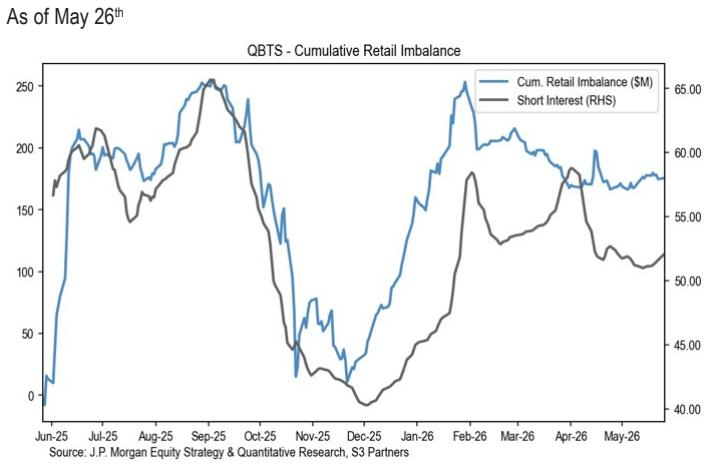

line

| Date   | Cum. Retail Imbalance ($M) | Short Interest (RHS) |
|--------|----------------------------|----------------------|
| Jun-25 | ~100                       | ~40.00               |
| Jul-25 | ~200                       | ~55.00               |
| Aug-25 | ~180                       | ~50.00               |
| Sep-25 | ~250                       | ~60.00               |
| Oct-25 | ~150                       | ~45.00               |
| Nov-25 | ~50                        | ~40.00               |
| Dec-25 | ~10                        | ~40.00               |
| Jan-26 | ~150                       | ~50.00               |
| Feb-26 | ~250                       | ~60.00               |
| Mar-26 | ~200                       | ~55.00               |
| Apr-26 | ~180                       | ~50.00               |
| May-26 | ~170                       | ~45.00               |

Source: JPM Equity Strategy & Quantitative Research

Figure 63: Daily Retail Imbalance in RGTI   
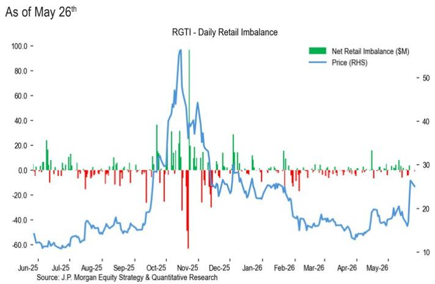

line

| Date   | Net Retail Imbalance ($M) | Price (RHS) |
|--------|---------------------------|-------------|
| Jun-25 | ~0                        | ~-10        |
| Jul-25 | ~20                       | ~-15        |
| Aug-25 | ~0                        | ~-20        |
| Sep-25 | ~0                        | ~-25        |
| Oct-25 | ~30                       | ~-30        |
| Nov-25 | ~100                      | ~-40        |
| Dec-25 | ~0                        | ~-30        |
| Jan-26 | ~0                        | ~-25        |
| Feb-26 | ~0                        | ~-30        |
| Mar-26 | ~0                        | ~-35        |
| Apr-26 | ~0                        | ~-40        |
| May-26 | ~0                        | ~-35        |

Source: JPM Equity Strategy & Quantitative Research

Figure 64: Cumulative Retail Imbalance in RGTI   
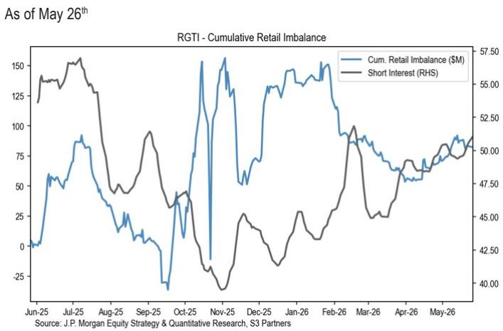

line

| Date   | Cum. Retail Imbalance ($M) | Short Interest (RHS) |
|--------|----------------------------|----------------------|
| Jun-25 | 0                          | 57.50                |
| Jul-25 | 150                        | 55.00                |
| Aug-25 | 75                         | 47.50                |
| Sep-25 | 0                          | 45.00                |
| Oct-25 | -25                        | 42.50                |
| Nov-25 | 150                        | 40.00                |
| Dec-25 | 75                         | 42.50                |
| Jan-26 | 150                        | 45.00                |
| Feb-26 | 100                        | 47.50                |
| Mar-26 | 75                         | 45.00                |
| Apr-26 | 50                         | 47.50                |
| May-26 | 75                         | 50.00                |

Source: JPM Equity Strategy & Quantitative Research

Figure 65: Daily Retail Imbalance in INFQ   
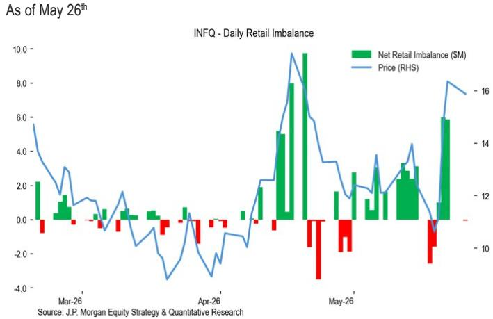

line

| Date   | Net Retail Imbalance ($M) | Price (RHS) |
|--------|---------------------------|-------------|
| Mar-26 | 2.0                       | 5.0         |
| Apr-26 | 0.0                       | -3.0        |
| May-26 | 6.0                       | 8.0         |

Source: JPM Equity Strategy & Quantitative Research

Figure 66: Cumulative Retail Imbalance in INFQ   
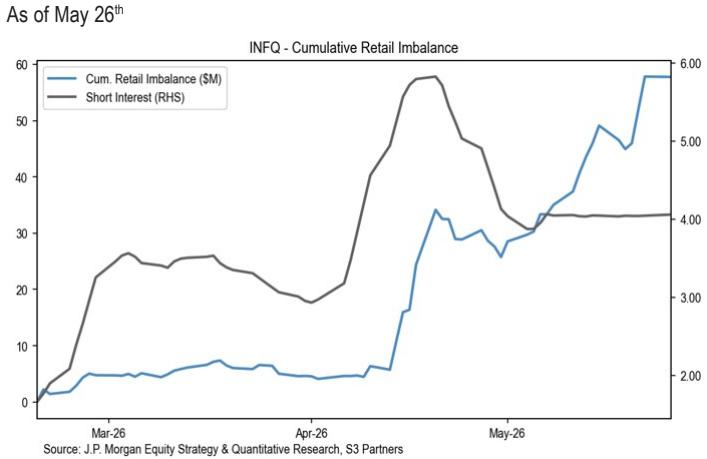

line

| Date   | Cum. Retail Imbalance ($M) | Short Interest (RHS) |
|--------|-----------------------------|----------------------|
| Mar-26 | ~5                          | ~3.0                 |
| Apr-26 | ~5                          | ~18                  |
| May-26 | ~35                         | ~4.0                 |

Source: JPM Equity Strategy & Quantitative Research

# Retail Investors Options Activity by Sectors

Figure 67: Retail Options Trading Share   
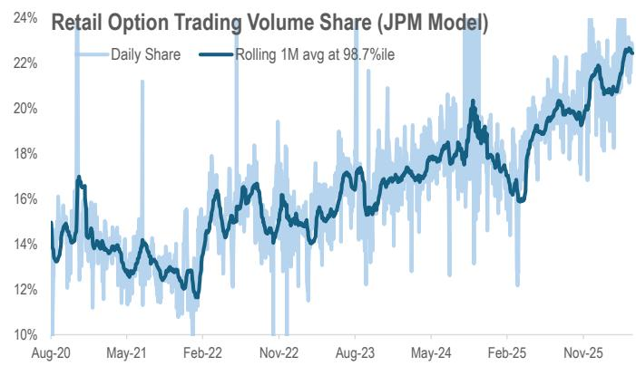

line

| Date    | Daily Share | Rolling 1M avg at 98.7%ile |
|---------|-------------|-----------------------------|
| Aug-20  | ~16%        | ~14%                        |
| May-21  | ~14%        | ~13%                        |
| Feb-22  | ~12%        | ~12%                        |
| Nov-22  | ~16%        | ~15%                        |
| Aug-23  | ~18%        | ~17%                        |
| May-24  | ~20%        | ~19%                        |
| Feb-25  | ~16%        | ~16%                        |
| Nov-25  | ~22%        | ~21%                        |

Source: JPM Equity Strategy & Quantitative Research

Figure 69: Retail Options Volume (Calls and Puts), Information Technology   
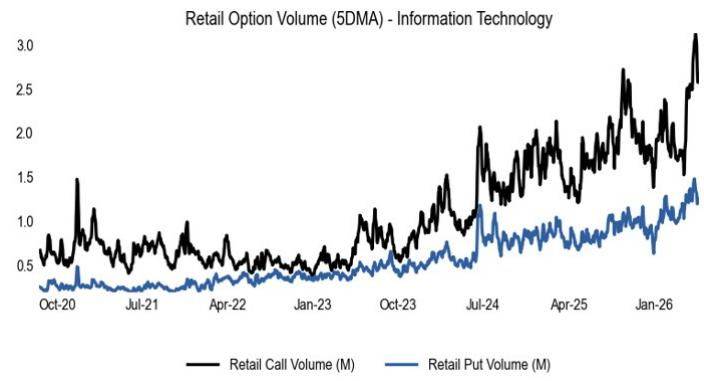

line

| Date   | Retail Call Volume (M) | Retail Put Volume (M) |
|--------|------------------------|-----------------------|
| Oct-20 | 0.7                    | 0.3                   |
| Jul-21 | 0.8                    | 0.4                   |
| Apr-22 | 0.9                    | 0.5                   |
| Jan-23 | 1.0                    | 0.6                   |
| Oct-23 | 1.2                    | 0.8                   |
| Jul-24 | 2.0                    | 1.0                   |
| Apr-25 | 2.5                    | 1.2                   |
| Jan-26 | 3.0                    | 1.4                   |

Source: JPM Equity Strategy & Quantitative Research

Figure 71: Retail Options Volume (Calls and Puts), Health Care   
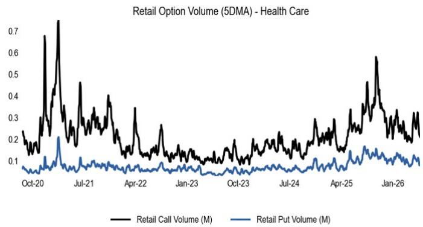

line

| Date   | Retail Call Volume (M) | Retail Put Volume (M) |
|--------|------------------------|-----------------------|
| Oct-20 | 0.2                    | 0.1                   |
| Jul-21 | 0.7                    | 0.2                   |
| Apr-22 | 0.3                    | 0.1                   |
| Jan-23 | 0.1                    | 0.1                   |
| Oct-23 | 0.2                    | 0.1                   |
| Jul-24 | 0.3                    | 0.1                   |
| Apr-25 | 0.6                    | 0.1                   |
| Jan-26 | 0.3                    | 0.1                   |

Source: JPM Equity Strategy & Quantitative Research

Figure 68: Retail Options Volume (Calls and Puts)   
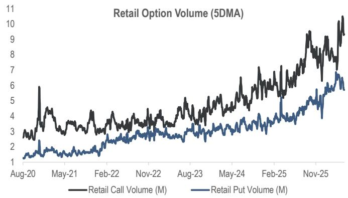

line

| Date   | Retail Call Volume (M) | Retail Put Volume (M) |
|--------|------------------------|-----------------------|
| Aug-20 | ~3                     | ~1                    |
| May-21 | ~4                     | ~1.5                  |
| Feb-22 | ~3.5                   | ~2                    |
| Nov-22 | ~4                     | ~2.5                  |
| Aug-23 | ~5                     | ~3                    |
| May-24 | ~6                     | ~3.5                  |
| Feb-25 | ~7                     | ~4.5                  |
| Nov-25 | ~9                     | ~6                    |

Source: JPM Equity Strategy & Quantitative Research

Figure 70: Retail Options Volume (Calls and Puts), Communication Services   
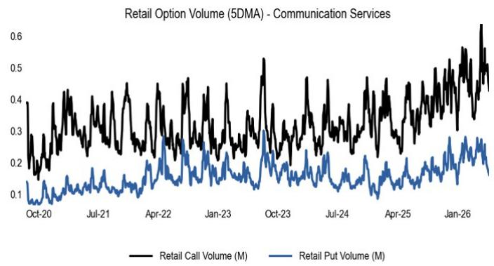

line

| Date   | Retail Call Volume (M) | Retail Put Volume (M) |
|--------|------------------------|-----------------------|
| Oct-20 | 0.1                    | 0.1                   |
| Jul-21 | 0.2                    | 0.15                  |
| Apr-22 | 0.3                    | 0.2                   |
| Jan-23 | 0.4                    | 0.25                  |
| Oct-23 | 0.5                    | 0.3                   |
| Jul-24 | 0.4                    | 0.25                  |
| Apr-25 | 0.5                    | 0.3                   |
| Jan-26 | 0.6                    | 0.35                  |

Source: JPM Equity Strategy & Quantitative Research

Figure 72: Retail Options Volume (Calls and Puts), Financials   
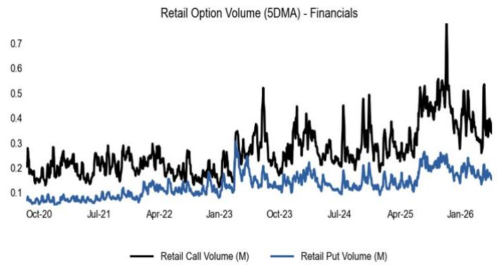

line

| Date   | Retail Call Volume (M) | Retail Put Volume (M) |
|--------|------------------------|-----------------------|
| Oct-20 | 0.1                    | 0.05                  |
| Jul-21 | 0.15                   | 0.07                  |
| Apr-22 | 0.2                    | 0.1                   |
| Jan-23 | 0.25                   | 0.15                  |
| Oct-23 | 0.3                    | 0.2                   |
| Jul-24 | 0.35                   | 0.25                  |
| Apr-25 | 0.4                    | 0.3                   |
| Jan-26 | 0.7                    | 0.25                  |

Source: JPM Equity Strategy & Quantitative Research

Figure 73: Retail Options Volume (Calls and Puts), Discretionary   
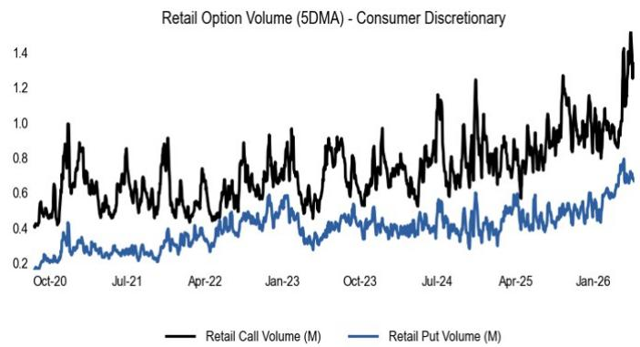

line

| Date   | Retail Call Volume (M) | Retail Put Volume (M) |
|--------|------------------------|-----------------------|
| Oct-20 | 0.4                    | 0.2                   |
| Jul-21 | 0.6                    | 0.3                   |
| Apr-22 | 0.7                    | 0.4                   |
| Jan-23 | 0.8                    | 0.5                   |
| Oct-23 | 0.9                    | 0.6                   |
| Jul-24 | 1.0                    | 0.7                   |
| Apr-25 | 1.1                    | 0.8                   |
| Jan-26 | 1.4                    | 0.8                   |

Source: JPM Equity Strategy & Quantitative Research

Figure 74: Retail Options Volume (Calls and Puts), Staples   
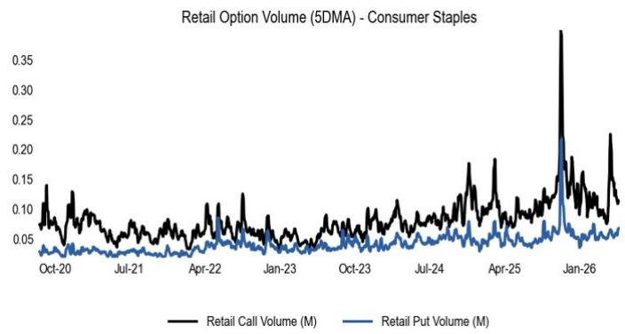

line

| Date   | Retail Call Volume (M) | Retail Put Volume (M) |
|--------|------------------------|-----------------------|
| Oct-20 | 0.15                   | 0.04                  |
| Jul-21 | 0.08                   | 0.03                  |
| Apr-22 | 0.12                   | 0.04                  |
| Jan-23 | 0.07                   | 0.03                  |
| Oct-23 | 0.09                   | 0.04                  |
| Jul-24 | 0.11                   | 0.05                  |
| Apr-25 | 0.18                   | 0.06                  |
| Jan-26 | 0.38                   | 0.22                  |

Source: JPM Equity Strategy & Quantitative Research

Figure 75: Retail Options Volume (Calls and Puts), Energy   
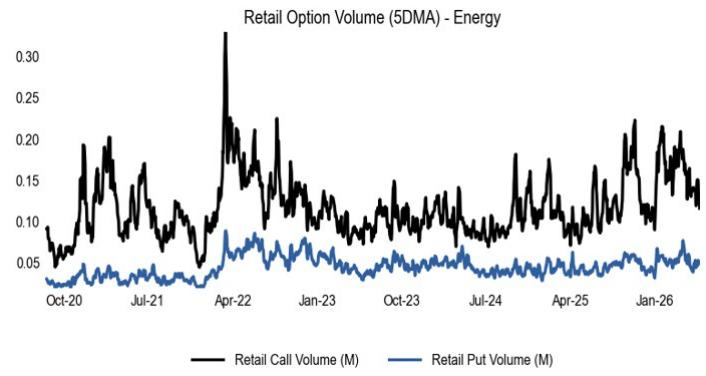

line

| Date   | Retail Call Volume (M) | Retail Put Volume (M) |
|--------|------------------------|-----------------------|
| Oct-20 | 0.08                   | 0.04                  |
| Jul-21 | 0.15                   | 0.05                  |
| Apr-22 | 0.30                   | 0.08                  |
| Jan-23 | 0.15                   | 0.06                  |
| Oct-23 | 0.10                   | 0.05                  |
| Jul-24 | 0.18                   | 0.06                  |
| Apr-25 | 0.22                   | 0.07                  |
| Jan-26 | 0.14                   | 0.05                  |

Source: JPM Equity Strategy & Quantitative Research

Figure 76: Retail Options Volume (Calls and Puts), Materials   
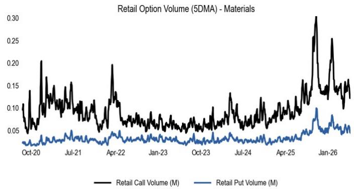

line

| Date   | Retail Call Volume (M) | Retail Put Volume (M) |
|--------|------------------------|-----------------------|
| Oct-20 | 0.10                   | 0.03                  |
| Jul-21 | 0.15                   | 0.04                  |
| Apr-22 | 0.20                   | 0.05                  |
| Jan-23 | 0.08                   | 0.04                  |
| Oct-23 | 0.09                   | 0.05                  |
| Jul-24 | 0.12                   | 0.06                  |
| Apr-25 | 0.15                   | 0.07                  |
| Jan-26 | 0.30                   | 0.10                  |

Source: JPM Equity Strategy & Quantitative Research

# Appendix: Alternative Data Points on Retail Activity

Figure 77: Retail Brokerage Volume Hit Record \~37% in January 2021   
Source Flow by Retail Brokerage, % of Overall US Equity Mkt Volume (Stock + ETF)   
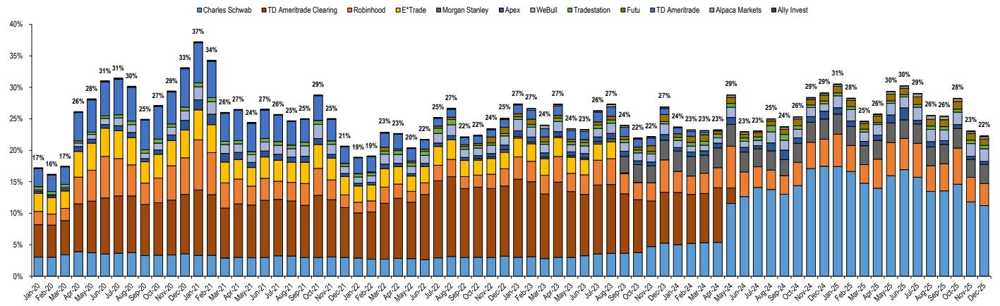  
Figure 78: NYSE Margin Account – Monthly Net Debit Balance Change

\$ in Billions, Net Debit balance equals margin debit balance less total credit balances   

bar_line

| Date     | NYSE Margin Account Balance Change ($ Amount in Billions, LHS) | S&P 500 Return (Monthly, RHS) |
|----------|---------------------------------------------------------------|-------------------------------|
| Dec'15   | -13 (7)                                                       | -1 (1)                        |
| Jun'16   | -7 (13)                                                       | 2 (3)                         |
| Dec'16   | -14 (14)                                                      | 30 (5)                        |
| Jun'17   | -22 (22)                                                      | 26 (15)                       |
| Dec'17   | -5 (5)                                                        | 30 (17)                       |
| Jun'18   | -1 (1)                                                        | 19 (18)                       |
| Dec'18   | -21 (21)                                                      | 17 (8)                        |
| Jun'19   | -16 (16)                                                      | 5 (5)                         |
| Dec'19   | -32 (32)                                                      | 8 (5)                         |
| Jun'20   | -63 (63)                                                      | 27 (19)                       |
| Dec'20   | -14 (4)                                                       | 3 (4)                         |
| Jun'21   | -36 (31)                                                      | 25 (4)                        |
| Dec'21   | -19 (38)                                                      | 8 (5)                         |
| Jun'22   | -38 (38)                                                      | 65 (65)                       |
| Dec'22   | -4 (4)                                                        | 39 (39)                       |
| Jun'23   | -38 (38)                                                      | 39 (37)                       |
| Dec'23   | -57 (57)                                                      | 8 (8)                         |
| Jun'24   | -42 (42)                                                      | 52 (52)                       |
| Dec'24   | -77 (77)                                                      | 19 (17)                       |
| Jun'25   | -36 (36)                                                      | 30 (30)                       |
| Dec'25   | -45 (45)                                                      | 60 (60)                       |
| Dec'26   | -28 (28)                                                      | 41 (41)                       |
| Dec'27   | -38 (38)                                                      | 2 (2)                         |
| Dec'28   | -57 (57)                                                      | 40 (40)                       |
| Dec'29   | -42 (42)                                                      | 19 (18)                       |
| Dec'30   | -77 (77)                                                      | 35 (35)                       |
| Dec'31   | -36 (36)                                                      | 9 (9)                         |
| Dec'32   | -5 (5)                                                        | 36 (36)                       |
| Dec'33   | -22 (22)                                                      | 3 (3)                         |
| Dec'34   | -55 (55)                                                      | 20 (20)                       |
| Dec'35   | -49 (49)                                                      | 13 (13)                       |
| Dec'36   | -0 (0)                                                        | 49 (49)                       |
| Dec'37   | -7 (7)                                                        | 40 (40)                       |
| Dec'38   | -9 (9)                                                        | 45 (45)                       |
| Dec'39   | -10 (10)                                                      | 77 (77)                       |
| Dec'40   | -11 (11)                                                      | 51 (51)                       |
| Dec'41   | -34 (34)                                                      | 70 (70)                       |
| Dec'42   | -28 (28)                                                      | -                            |
| Dec'43   | -                             | -                            |
| Dec'44   | -                             | -                            |
| Dec'45   | -                             | -                            |
| Dec'46   | -                             | -                            |
| Dec'47   | -                             | -                            |
| Dec'48   | -                             | -                            |
| Dec'49   | -                             | -                            |
| Dec'50   | -                             | -                            |
| Dec'51   | -                             | -                            |
| Dec'52   | -                             | -                            |
| Dec'53   | -                             | -                            |
| Dec'54   | -                             | -                            |
| Dec'55   | -                             | -                            |
| Dec'56   | -                             | -                            |
| Dec'57   | -                             | -                            |
| Dec'58   | -                             | -                            |
| Dec'59   | -                             | -                            |
| Dec'60   | -                             | -                            |
| Dec'61   | -                             | -                            |
| Dec'62   | -                             | -                            |
| Dec'63   | -                             | -                            |
| Dec'64   | -                             | -                            |
| Dec'65   | -                             | -                            |
| Dec'66   | -                             | -                            |
| Dec'67   | -                             | -                            |
| Dec'68   | -                             | -                            |
| Dec'69   | -                             | -                            |
| Dec'70   | -                             | -                            |
| Dec'71   | -                             | -                            |
| Dec'72   | -                             | -                            |
| Dec'73   | -                             | -                            |
| Dec'74   | -                             | -                            |
| Dec'75   | -                             | -                            |
| Dec'76   | -                             | -                            |
| Dec'77   | -                             | -                            |
| Dec'78   | -                             | -                            |
| Dec'79   | -                             | -                            |
| Dec'80   | -                             | -                            |
| Dec'81   | -                             | -                            |
| Dec'82   | -                             | -                            |
| Dec'83   | -                             | -                            |
| Dec'84   | -                             | -                            |
| Dec'85   | -                             | -                            |
| Dec'86   | -                             | -                            |
| Dec'87   | -                             | -                            |
| Dec'88   | -                             | -                            |
| Dec'89   | -                             | -                            |
| Dec'90   | -                             | -                            |
| Dec'91   | -                             | -                            |
| Dec'92   | -                             | -                            |
| Dec'93   | -                             | -                            |
| Dec'94   | -                             | -                            |
| Dec'95   | -                             | -                            |
| Dec'96   | -                             | -                            |
| Dec'97   | -                             | -                            |
| Dec'98   | -                             | -                            |
| Dec'99   | -                             | -                            |
| Dec'00   | -                             | -                            |
| Dec'01   | -                             | -                            |
| Dec'02   | -                             | -                            |
| Dec'03   | -                             | -                            |
| Dec'04   | -                             | -                            |
| Dec'05   | -                             | -                            |
| Dec'06   | -                             | -                            |
| Dec'07   | -                             | -                            |
| Dec'08   | -                             | -                            |
| Dec'09   | -                             | -                            |
| Dec'10   | -                             | -                            |
| Dec'11   | -                             | -                            |
| Dec'12   | -                             | -                            |
| Dec'13   | -                             | -                            |
| Dec'14   | -                             | -                            |
| Dec'15   | -                             | -                            |
| Dec'16   | -                             | 0 (-                            |
| Dec'17   | 0 (-                            | 0 (-                            |
| Dec'18   | 0 (-                            | 0 (-                            |
| Dec'19   | 0 (-                            | 0 (-                            |
| Dec'20   | 0 (-                            | 0 (-                            |
| Dec'21   | 0 (-                            | 0 (-                            |
| Dec'22   | 0 (-                            | 0 (-                            |
| Dec'23   | 0 (-                            | 0 (-                            |
| Dec'24   | 0 (-                            | 0 (-                            |
| Dec'25   | 0 (-                            | 0 (-                            |
)|

Source: JPM Equity Strategy & Quantitative Research, Bloomberg Finance L.P., FINRA, Quarterly 606 Reports (for two figures above).

Analyst Certification: The Research Analyst(s) denoted by an “AC” on the cover of this report certifies (or, where multiple Research Analysts are primarily responsible for this report, the Research Analyst denoted by an “AC” on the cover or within the document individually certifies, with respect to each security or issuer that the Research Analyst covers in this research) that: (1) all of the views expressed in this report accurately reflect the Research Analyst’s personal views about any and all of the subject securities or issuers; and (2) no part of any of the Research Analyst's compensation was, is, or will be directly or indirectly related to the specific recommendations or views expressed by the Research Analyst(s) in this report. For all Korea-based Research Analysts listed on the front cover, if applicable, they also certify, as per KOFIA requirements, that the Research Analyst’s analysis was made in good faith and that the views reflect the Research Analyst’s own opinion, without undue influence or intervention.

All authors named within this report are Research Analysts who produce independent research unless otherwise specified. In Europe, Sector Specialists (Sales and Trading) may be shown on this report as contacts but are not authors of the report or part of the Research Department.

# Important Disclosures

Company-Specific Disclosures: JPM does and seeks to do business with companies covered in its research reports. As a result, investors should be aware that the firm may have a conflict of interest that could affect the objectivity of this report. Investors should consider this report as only a single factor in making their investment decision. Important disclosures, including price charts and credit opinion history tables (if applicable), are available for compendium reports and all JPM-covered companies, and certain non-covered companies, by visiting https://www.jpmm.com/research/disclosures, calling 1-800-477-0406, or e-mailing research.disclosure.inquiries@JPM.com with your request.

# Explanation of Equity Research Ratings, Designations and Analyst(s) Coverage Universe:

JPM uses the following rating system: Overweight (over the duration of the price target indicated in this report, we expect this stock will outperform the average total return of the stocks in the Research Analyst's, or the Research Analyst's team's, coverage universe); Neutral (over the duration of the price target indicated in this report, we expect this stock will perform in line with the average total return of the stocks in the Research Analyst's, or the Research Analyst's team's, coverage universe); and Underweight (over the duration of the price target indicated in this report, we expect this stock will underperform the average total return of the stocks in the Research Analyst's, or the Research Analyst's team's, coverage universe. NR is Not Rated. In this case, JPM has removed the rating and, if applicable, the price target, for this stock because of either a lack of a sufficient fundamental basis or for legal, regulatory or policy reasons. The previous rating and, if applicable, the price target, no longer should be relied upon. An NR designation is not a recommendation or a rating. Some stocks under coverage have a rating but no price target; in these cases, we expect the stock will outperform/perform in line/underperform the average total return of the stocks in the Research Analyst's, or the Research Analyst's team's, coverage universe of the relevant duration of the region. In our Asia (ex-Australia and ex-India) and U.K. small- and mid-cap Equity Research, each stock's expected total return is compared to the expected total return of a benchmark country market index, not to those Research Analysts' coverage universe. If it does not appear in the Important Disclosures section of this report, the certifying Research Analyst's coverage universe can be found on JPM's Research website, https://.

JPM Equity Research Ratings Distribution, as of April 04, 2026 

<table><tr><td></td><td>Overweight (buy)</td><td>Neutral (hold)</td><td>Underweight (sell)</td></tr><tr><td>JPM Global Equity Research Coverage*</td><td>51%</td><td>37%</td><td>12%</td></tr><tr><td>IB clients**</td><td>83%</td><td>79%</td><td>74%</td></tr><tr><td>JPMS Equity Research Coverage*</td><td>49%</td><td>39%</td><td>13%</td></tr><tr><td>IB clients**</td><td>94%</td><td>93%</td><td>85%</td></tr></table>

\*Please note that the percentages may not add to 100% because of rounding.   
\*\*Percentage of subject companies within each of the "buy," "hold" and "sell" categories for which JPM has provided investment banking services within the previous 12 months.   
For purposes of FINRA ratings distribution rules only, our Overweight rating falls into a buy rating category; our Neutral rating falls into a hold rating category; and our Underweight rating falls into a sell rating category. Please note that stocks with an NR designation are not included in the table above. This information is current as of the end of the most recent calendar quarter.

Equity Valuation and Risks: For valuation methodology and risks associated with covered companies or price targets for covered companies, please see the most recent company-specific research report at http://, contact the primary analyst or your JPM representative, or email research.disclosure.inquiries@JPM.com. For material information about the proprietary models used, please see the Summary of Financials in company-specific research reports and the Company Tearsheets, which are available to download on the company pages of our client website, http://. This report also sets out within it the material underlying assumptions used.

# History of Investment Recommendations:

A history of JPM investment recommendations disseminated during the preceding 12 months can be accessed on the Research & Commentary page of http:// where you can also search by analyst name, sector or financial instrument.

Analysts' Compensation: The research analysts responsible for the preparation of this report receive compensation based upon various factors, including the quality and accuracy of research, client feedback, competitive factors, and overall firm revenues.

Registration of non-US Analysts: Unless otherwise noted, the non-US analysts listed on the front of this report are employees of non-US affiliates of JPM Securities LLC, may not be registered as research analysts under FINRA rules, may not be associated persons of JPM Securities LLC, and may not be subject to FINRA Rule 2241 or 2242 restrictions on communications with covered companies, public appearances, and trading securities held by a research analyst account.

# Other Disclosures

JPM is a marketing name for investment banking businesses of JPM Chase & Co. and its subsidiaries and affiliates worldwide.

UK MIFID FICC research unbundling exemption: UK clients should refer to UK MIFID Research Unbundling exemption for details of JPM's implementation of the FICC research exemption and guidance on relevant FICC research categorisation.

All research material made available to clients are simultaneously available on our client website, JPM Markets, unless specifically permitted by relevant laws. Not all research content is redistributed, e-mailed or made available to third-party aggregators. For all research material available on a particular stock, please contact your sales representative.

Any long form nomenclature for references to China; Hong Kong; Taiwan; and Macau within this research material are Mainland China; Hong Kong SAR (China); Taiwan (China); and Macau SAR (China).

JPM may, from time to time, write on issuers or securities targeted by economic or financial sanctions imposed or administered by the governmental authorities of the U.S., EU, UK or other relevant jurisdictions (Sanctioned Securities). Nothing in this report is intended to be read or construed as encouraging, facilitating, promoting or otherwise approving investment or dealing in such Sanctioned Securities. Clients should be aware of their own legal and compliance obligations when making investment decisions.

Any digital or crypto assets discussed in this research report are subject to a rapidly changing regulatory landscape. For relevant regulatory advisories on crypto assets, including bitcoin and ether, please see https://www.JPM.com/disclosures/cryptoasset-disclosure.

The author(s) of this research report may not be licensed to carry on regulated activities in your jurisdiction and, if not licensed, do not hold themselves out as being able to do so.

Exchange-Traded Funds (ETFs): JPM Securities LLC (“JPMS”) acts as authorized participant for substantially all U.S.-listed ETFs. To the extent that any ETFs are mentioned in this report, JPMS may earn commissions and transaction-based compensation in connection with the distribution of those ETF shares and may earn fees for performing other trade-related services, such as securities lending to short sellers of the ETF shares. JPMS may also perform services for the ETFs themselves, including acting as a broker or dealer to the ETFs. In addition, affiliates of JPMS may perform services for the ETFs, including trust, custodial, administration, lending, index calculation and/or maintenance and other services.

Options and Futures related research: If the information contained herein regards options- or futures-related research, such information is available only to persons who have received the proper options or futures risk disclosure documents. Please contact your JPM Representative or visit https://www.theocc.com/components/docs/riskstoc.pdf for a copy of the Option Clearing Corporation's Characteristics and Risks of Standardized Options or https://www.finra.org/sites/default/files/2020-08/Security\_Futures\_Risk\_Disclosure\_Statement\_2020.pdf for a copy of the Security Futures Risk Disclosure Statement.

Changes to Interbank Offered Rates (IBORs) and other benchmark rates: Certain interest rate benchmarks are, or may in the future become, subject to ongoing international, national and other regulatory guidance, reform and proposals for reform. For more information, please consult: https://www.JPM.com/global/disclosures/interbank\_offered\_rates

Private Bank Clients: Where you are receiving research as a client of the private banking businesses offered by JPM Chase & Co. and its subsidiaries (“JPM Private Bank”), research is provided to you by JPM Private Bank and not by any other division of JPM, including, but not limited to, the JPM Corporate and Investment Bank and its Global Research division.

Legal entity responsible for the production and distribution of research: The legal entity identified below the name of the Reg AC Research Analyst who authored this material is the legal entity responsible for the production of this research. Where multiple Reg AC Research Analysts authored this material with different legal entities identified below their names, these legal entities are jointly responsible for the production of this research. Where more than one legal entity is listed under an analyst's name, the first legal entity is responsible for the production unless stated otherwise. Research Analysts from various JPM affiliates may have contributed to the production of this material but may not be licensed to carry out regulated activities in your jurisdiction (and do not hold themselves out as being able to do so). Unless otherwise stated below in the legal entity disclosures, this material has been distributed by the legal entity responsible for production, or where more than one legal entity is listed under the analyst's name, the first legal entity will be responsible for distribution. If you have any queries, please contact the relevant Research Analyst in your jurisdiction or the entity in your jurisdiction that has distributed this research material.

Legal Entities Disclosures and Country-/Region-Specific Disclosures:

Argentina: JPM Chase Bank N.A Sucursal Buenos Aires is regulated by Banco Central de la República Argentina (“BCRA”- Central Bank of Argentina) and Comisión Nacional de Valores (“CNV”- Argentinian Securities Commission - ALYC y AN Integral N°51).

Australia: JPM Securities Australia Limited (“JPMSAL”) (ABN 61 003 245 234/AFS Licence No: 238066) is regulated by the Australian Securities and Investments Commission and is a Market Participant of ASX Limited, a Clearing and Settlement Participant of ASX Clear Pty Limited and a Clearing Participant of ASX Clear (Futures) Pty Limited. This material is issued and distributed in Australia by or on behalf of JPMSAL only to "wholesale clients" (as defined in section 761G of the Corporations Act 2001). A list of all financial products covered can be found by visiting https://www.jpmm.com/research/disclosures. JPM seeks to cover companies of relevance to the domestic and international investor base across all Global Industry Classification Standard (GICS) sectors, as well as across a range of market capitalisation sizes. If applicable, in the course of conducting public side due diligence on the subject company(ies), the Research Analyst team may at times perform such diligence through corporate engagements such as site visits, discussions with company representatives, management presentations, etc. Research issued by JPMSAL has been prepared in accordance with JPM Australia’s Research Independence Policy which can be found at the following link: JPM Australia - Research Independence Policy.

Brazil: Banco JPM S.A. is regulated by the Comissao de Valores Mobiliarios (CVM) and by the Central Bank of Brazil. Ombudsman JPM: 0800-7700847 / 0800-7700810 (For Hearing Impaired) / ouvidoria.jp.morgan@jpmchase.com.

Canada: JPM Securities Canada Inc. is a registered investment dealer, regulated by the Canadian Investment Regulatory Organization and the Ontario Securities Commission and is the participating member on Canadian exchanges. This material is distributed in Canada by or on behalf of JPM Securities Canada Inc.

Chile: Inversiones JPM Limitada is an unregulated entity incorporated in Chile.

China: JPM Securities (China) Company Limited has been approved by CSRC to conduct the securities investment consultancy business.

Colombia: Banco JPM Colombia S.A. is supervised by the Superintendencia Financiera de Colombia (SFC). Any reference in this material to products or services offered abroad by entities other than the Bank in Colombia is included exclusively for descriptive purposes. Such references do not constitute, and should not be construed as, promotional activity or the provision of financial products or services within Colombian territory, as defined under applicable Colombian regulation.

Dubai International Financial Centre (DIFC): JPM Chase Bank, N.A., Dubai Branch is regulated by the Dubai Financial Services Authority (DFSA) and its registered address is Dubai International Financial Centre - The Gate, West Wing, Level 3 and 9 PO Box 506551, Dubai, UAE. This material has been distributed by JPM Chase Bank, N.A., Dubai Branch to persons regarded as professional clients or market counterparties as defined under the DFSA rules.

European Economic Area (EEA): Unless specified to the contrary, research is distributed in the EEA by JPM SE (“JPM SE”), which is authorised as a credit institution by the Federal Financial Supervisory Authority (Bundesanstalt für Finanzdienstleistungsaufsicht, BaFin) and jointly supervised by the BaFin, the German Central Bank (Deutsche Bundesbank) and the European Central Bank (ECB). JPM SE is a company headquartered in Frankfurt with registered address at TaunusTurm, Taunustor 1, Frankfurt am Main, 60310, Germany. The material has been distributed in the EEA to persons regarded as professional investors (or equivalent) pursuant to Art. 4 para. 1 no. 10 and Annex II of MiFID II and its respective implementation in their home jurisdictions (“EEA professional investors”). This material must not be acted on or relied on by persons who are not EEA professional investors. Any investment or investment activity to which this material relates is only available to EEA relevant persons and will be engaged in only with EEA relevant persons.

Hong Kong: JPM Securities (Asia Pacific) Limited (CE number AAJ321) is regulated by the Hong Kong Monetary Authority and the Securities and Futures Commission in Hong Kong, and JPM Broking (Hong Kong) Limited (CE number AAB027) is regulated by the Securities and Futures Commission in Hong Kong. JPM Chase Bank, N.A., Hong Kong Branch (CE Number AAL996) is regulated by the Hong Kong Monetary Authority and the Securities and Futures Commission, is organized under the laws of the United States with limited liability. Where the distribution of this material is a regulated activity in Hong Kong, the material is distributed in Hong Kong by or through JPM Securities (Asia Pacific) Limited and/or JPM Broking (Hong Kong) Limited.

India: JPM India Private Limited (Corporate Identity Number - U67120MH1992FTC068724), having its registered office at JPM Tower, Off. C.S.T. Road, Kalina, Santacruz - East, Mumbai – 400098, is registered with the Securities and Exchange Board of India (SEBI) as a 'Research Analyst' having registration number INH000001873. JPM India Private Limited is also registered with SEBI as a member of the National Stock Exchange of India Limited and the Bombay Stock Exchange Limited (SEBI Registration Number – INZ000239730) and as a Merchant Banker (SEBI Registration Number - MB/INM000002970). Telephone: 91-22-6157 3000, Facsimile: 91-22-6157 3990 and Website: http://www.jpmipl.com. JPM Chase Bank, N.A. - Mumbai Branch is licensed by the Reserve Bank of India (RBI) (Licence No. 53/Licence No. BY.4/94; SEBI - IN/CUS/014/ CDSL : IN-DP-CDSL-444-2008/ IN-DP-NSDL-285-2008/ INBI00000984/ INE231311239) as a Scheduled Commercial Bank in India, which is its primary license allowing it to carry on Banking business in India and other activities, which a Bank branch in India are permitted to undertake. For non-local research material, this material is not distributed in India by JPM India Private Limited. Compliance Officer: Ashutosh Sharma; ashutosh.j.sharma@jpmchase.com; +912261575002. Grievance Officer: Ramprasadh K, jpmipl.research.feedback@JPM.com; +912261573000. Registration granted by SEBI and certification from NISM in no way guarantee performance of the intermediary or provide any assurance of returns to investors. Please visit Terms and Conditions and Most Important Terms and Conditions (MITC). The annual Compliance audit report is available at http://www.jpmipl.com/#research.

Indonesia: PT JPM Sekuritas Indonesia is a member of the Indonesia Stock Exchange and is registered and supervised by the Otoritas Jasa Keuangan (OJK).

Korea: JPM Securities (Far East) Limited, Seoul Branch, is a member of the Korea Exchange (KRX). JPM Chase Bank, N.A., Seoul Branch, is licensed as a branch office of foreign bank (JPM Chase Bank, N.A.) in Korea. Both entities are regulated by the Financial Services Commission (FSC) and the Financial Supervisory Service (FSS). For non-macro research material, the material is distributed in Korea by or through JPM Securities (Far East) Limited, Seoul Branch.

Japan: JPM Securities Japan Co., Ltd. and JPM Chase Bank, N.A., Tokyo Branch are regulated by the Financial Services Agency in Japan.

Malaysia: This material is issued and distributed in Malaysia by JPM Securities (Malaysia) Sdn Bhd (18146-X), which is a Participating Organization of Bursa Malaysia Berhad and holds a Capital Markets Services License issued by the Securities Commission in Malaysia.

Mexico: JPM Casa de Bolsa, S.A. de C.V., JPM Grupo Financiero is member of the Mexican Stock Exchange (“Bolsa Mexicana de Valores”) and the Institutional Stock Exchange (“Bolsa Institucional de Valores”), and it is authorized to act as a broker dealer by the National Banking and Securities Exchange Commission (“Comisión Nacional Bancaria y de Valores”).

New Zealand: This material is issued and distributed by JPMSAL in New Zealand only to "wholesale clients" (as defined in the Financial Markets Conduct Act 2013). JPMSAL is registered as a Financial Service Provider under the Financial Service providers (Registration and Dispute Resolution) Act of 2008.

Philippines: JPM Securities Philippines Inc. is a Trading Participant of the Philippine Stock Exchange and a member of the Securities Clearing Corporation of the Philippines and the Securities Investor Protection Fund. It is regulated by the Securities and Exchange Commission.

Singapore: This material is issued and distributed in Singapore by or through JPM Securities Singapore Private Limited (JPMSS) [MDDI (P) 057/08/2025 and Co. Reg. No.: 199405335R], which is a member of the Singapore Exchange Securities Trading Limited, and/or JPM Chase Bank, N.A., Singapore branch (JPMCB Singapore), both of which are regulated by the Monetary Authority of Singapore. This material is issued and distributed in Singapore only to accredited investors, expert investors and institutional investors, as defined in Section 4A of the Securities and Futures Act, Cap. 289 (SFA). This material is not intended to be issued or distributed to any retail investors or any other investors that do not fall into the classes of “accredited investors,” “expert investors” or “institutional investors,” as defined under Section 4A of the SFA. Recipients of this material in Singapore are to contact JPMSS or JPMCB Singapore in respect of any matters arising from, or in connection with, the material.

South Africa: JPM Equities South Africa Proprietary Limited and JPM Chase Bank, N.A., Johannesburg Branch are members of the Johannesburg Securities Exchange and are regulated by the Financial Services Conduct Authority (FSCA).

Taiwan: JPM Securities (Taiwan) Limited is a participant of the Taiwan Stock Exchange (company-type) and regulated by the Taiwan Securities and Futures Bureau. Material relating to equity securities is issued and distributed in Taiwan by JPM Securities (Taiwan) Limited, subject to the license scope and the applicable laws and the regulations in Taiwan. To the extent that JPM Securities (Taiwan) Limited produces research materials on securities not listed on the Taiwan Stock Exchange or Taipei Exchange (“Non-Taiwan Listed Securities”), these materials shall not constitute securities recommendations for the purpose of applicable Taiwan regulations, and, for the avoidance of doubt, JPM Securities (Taiwan) Limited does not act as broker for Non-Taiwan Listed Securities. According to Paragraph 2, Article 7-1 of Operational Regulations Governing Securities Firms Recommending Trades in Securities to Customers (as amended or supplemented) and/or other applicable laws or regulations, please note that the recipient of this material is not permitted to engage in any activities in connection with the material that may give rise to conflicts of interests, unless otherwise disclosed in the “Important Disclosures” in this material.

Thailand: This material is issued and distributed in Thailand by JPM Securities (Thailand) Ltd., which is a member of the Stock Exchange of Thailand and is regulated by the Ministry of Finance and the Securities and Exchange Commission. The registered address is 548 One City Center Building, 50th Floor, Ploenchit Road, Lymphini, Pathum Wan, Bangkok 10330.

UK: Research is produced in the UK by JPM Securities plc (“JPMS plc”) which is a member of the London Stock Exchange and is authorised by the Prudential Regulation Authority and regulated by the Financial Conduct Authority and the Prudential Regulation Authority or JPM Markets Limited (“JPMML Ltd”) which is authorised and regulated by the Financial Conduct Authority. Unless specified to the contrary, this material is distributed in the UK by JPMS plc and is directed in the UK only to: (a) persons having professional experience in matters relating to investments falling within article 19(5) of the Financial Services and Markets Act 2000 (Financial Promotion) (Order) 2005 (“the FPO”); (b) persons outlined in article 49 of the FPO (high net worth companies, unincorporated associations or partnerships, the trustees of high value trusts, etc.); or (c) any persons to whom this communication may otherwise lawfully be made; all such persons being referred to as "UK relevant persons". This material must not be acted on or relied on by persons who are not UK relevant persons. Any investment or investment activity to which this material relates is only available to UK relevant persons and will be engaged in only with UK relevant persons. A description of JPM EMEA’s policy for prevention and avoidance of conflicts of interest related to the production of Research can be found at the following link: JPM EMEA - Research Independence Policy.

U.S.: JPM Securities LLC (“JPMS”) is a member of the NYSE, FINRA, SIPC, and the NFA. JPM Chase Bank, N.A. is a member of the FDIC. Material published by non-U.S. affiliates is distributed in the U.S. by JPMS who accepts responsibility for its content.

General: Additional information is available upon request. The information in this material has been obtained from sources believed to be reliable. While all reasonable care has been taken to ensure that the facts stated in this material are accurate and that the forecasts, opinions and expectations contained herein are fair and reasonable, JPM Chase & Co. or its affiliates and/or subsidiaries (collectively JPM) make no representations or warranties whatsoever to the completeness or accuracy of the material provided, except with respect to any disclosures relative to JPM and the Research Analyst's involvement with the issuer that is the subject of the material. Accordingly, no reliance should be placed on the accuracy, fairness or completeness of the information contained in this material. There may be certain discrepancies with data and/or limited content in this material as a result of calculations, adjustments, translations to different languages, and/or local regulatory restrictions, as applicable. These discrepancies should not impact the overall investment analysis, views and/or recommendations of the subject company(ies) that may be discussed in the material. Artificial intelligence tools may have been used in the preparation of this material, including assisting in data analysis, pattern recognition, and content drafting for research material. JPM accepts no liability whatsoever for any loss arising from any use of this material or its contents, and neither JPM nor any of its respective directors, officers or employees, shall be in any way responsible for the contents hereof, apart from the liabilities and responsibilities that may be imposed on them by the relevant regulatory authority in the jurisdiction in question, or the regulatory regime thereunder. Opinions, forecasts or projections contained in this material represent JPM's current opinions or judgment as of the date of the material only and are therefore subject to change without notice. Periodic updates may be provided on companies/industries based on company-specific developments or announcements, market conditions or any other publicly available information. There can be no assurance that future results or events will be consistent with any such opinions, forecasts or projections, which represent only one possible outcome. Furthermore, such opinions, forecasts or projections are subject to certain risks, uncertainties and assumptions that have not been verified, and future actual results or events could differ materially. The value of, or income from, any investments referred to in this material may fluctuate and/or be affected by changes in exchange rates. All pricing is indicative as of the close of market for the securities discussed, unless otherwise stated. Past performance is not indicative of future results. Accordingly, investors may receive back less than originally invested. This material is not intended as an offer or solicitation for the purchase or sale of any financial instrument. The opinions and recommendations herein do not take into account individual client circumstances, objectives, or needs and are not intended as recommendations of particular securities, financial instruments or strategies to particular clients. This material may include views on structured securities, options, futures and other derivatives. These are complex instruments, may involve a high degree of risk and may be appropriate investments only for sophisticated investors who are capable of understanding and assuming the risks involved. The recipients of this material must make their own independent decisions regarding any securities or financial instruments mentioned herein and should seek advice from such independent financial, legal, tax or other adviser as they deem necessary. JPM may trade as a principal on the basis of the Research Analysts' views and research, and it may also engage in transactions for its own account or for its clients' accounts in a manner inconsistent with the views taken in this material, and JPM is under no obligation to ensure that such other communication is brought to the attention of any recipient of this material. Others within JPM, including Strategists, Sales staff and other Research Analysts, may take views that are inconsistent with those taken in this material. Employees of JPM not involved in the preparation of this material may have investments in the securities (or derivatives of such securities) mentioned in this material and may trade them in ways different from those discussed in this material. This material is not an advertisement for or marketing of any issuer, its products or services, or its securities in any jurisdiction.

Confidentiality and Security Notice: This transmission may contain information that is privileged, confidential, legally privileged, and/or exempt from disclosure under applicable law. If you are not the intended recipient, you are hereby notified that any disclosure, copying, distribution, or use of the information contained herein (including any reliance thereon) is STRICTLY PROHIBITED. Although this transmission and any attachments are believed to be free of any virus or other defect that might affect any computer system into which it is received and opened, it is the responsibility of the recipient to ensure that it is virus free and no responsibility is accepted by JPM Chase & Co., its subsidiaries and affiliates, as applicable, for any loss or damage arising in any way from its use. If you received this transmission in error, please immediately contact the sender and destroy the material in its entirety, whether in electronic or hard copy format. This message is subject to electronic monitoring: https://www.JPM.com/disclosures/email

MSCI: Certain information herein (“Information”) is reproduced by permission of MSCI Inc., its affiliates and information providers (“MSCI”) ©2026. No reproduction or dissemination of the Information is permitted without an appropriate license. MSCI MAKES NO EXPRESS OR IMPLIED WARRANTIES (INCLUDING MERCHANTABILITY OR FITNESS) AS TO THE INFORMATION AND DISCLAIMS ALL LIABILITY TO THE EXTENT PERMITTED BY LAW. No Information constitutes investment advice, except for any applicable Information from MSCI ESG Research. Subject also to msci.com/disclaimer

Sustainalytics: Certain information, data, analyses and opinions contained herein are reproduced by permission of Sustainalytics and: (1) includes the proprietary information of Sustainalytics; (2) may not be copied or redistributed except as specifically authorized; (3) do not constitute investment advice nor an endorsement of any product or project; (4) are provided solely for informational purposes; and (5) are not warranted to be complete, accurate or timely. Sustainalytics is not responsible for any trading decisions, damages or other losses related to it or its use. The use of the data is subject to conditions available at https://www.sustainalytics.com/legal-disclaimers. ©2026 Sustainalytics. All Rights Reserved.

"Other Disclosures" last revised May 16, 2026.

Copyright 2026 JPM Chase & Co. All rights reserved. This material or any portion hereof may not be reprinted, sold or redistributed without the written consent of JPM. It is strictly prohibited to use or share without prior written consent from JPM any research material received from JPM or an authorized third-party (“JPM Data”) in any third-party artificial intelligence (“AI”) systems or models when such JPM Data is accessible by a third-party.

Completed 27 May 2026 11:22 PM EDT

Disseminated 27 May 2026 11:22 PM EDT