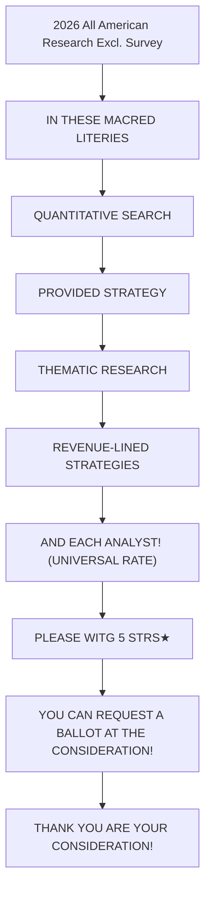

你是闲鱼资料类商品文案编辑，擅长把一份投研/行业/公司研报改写成适合闲鱼发布的商品说明。

【目标】
- 基于下面研报解析内容，生成一份可以复制到闲鱼商品详情里的中文文案。
- 风格参考用户提供的闲鱼对标笔记：标题直给、信息密度高、用途明确、适合人群明确、交付方式清楚。
- 语言要自然，像真实卖家发布，不要像公众号文章、小红书笔记或 AI 摘要。
- 不要使用太夸张的营销词，不要承诺收益，不要说“稳赚”“内幕”“必涨”。
- 可以适度口语化，但不要低俗。

【必须输出结构】
1. `闲鱼标题：` 一行，控制在 30 字以内，适合商品标题。
2. `商品描述：` 正文，适合直接粘贴到闲鱼详情页。
3. `Hashtag：` 一行，给 6-10 个平台可用标签，用 `#` 开头，空格分隔。

【严禁输出】
- 不要输出 `建议价格：`。
- 不要输出 `搜索关键词：`。
- 不要输出“搜索词”“关键词”“搜索关键词”等栏目。
- 不要给具体价格区间、成交承诺或价格建议。

【商品描述写法】
- 第一段：直接说明这是什么报告，页数/语言/主题/公司或行业。如果页数、日期、语言不确定，就不要编。
- 第二段：说明适合谁，比如投研、券商面试、PE/VC、行业研究、学习参考、写报告等。
- 第三段：用 3-5 个亮点 bullet，风格参考：
  ✅ 三大情景框架：DCF、P/ARR、EV/Sales
  ✅ 关键变量分析
  ✅ 估值逻辑、假设、终值占比等核心内容覆盖
  ✅ 适合准备 AI 相关面试、研究 AI 估值的同学
- 第四段：交付说明，参考：`资料为电子版 PDF，拍下后 24 小时内发网盘链接或邮箱。`
- 第五段：虚拟商品说明，参考：`电子类资料一经发货不退不换，有问题可以提前咨询。`
- 可以补一句：`需要其他报告也可以私聊，支持一站式咨询。`

【Hashtag 写法】
- 只输出平台相对安全、偏学习和资料属性的标签。
- 推荐从这些里选择：`#学习资料` `#研究笔记` `#学习笔记` `#行业研究` `#研报资料` `#资料整理` `#报告学习` `#案例研究`。
- 不要输出 `#财经` `#投资` `#股票` `#基金` `#理财` `#暴富` `#内幕` 等敏感标签。

【平台发布合规要求】
- 不要出现“投资建议”“买入”“卖出”“强烈推荐”“稳赚”“保本”“必涨”“抄底”“上车”“内幕”“翻倍”等金融操作或收益承诺表达。
- “投资”相关词尽量改成“投研”“研究”“观察”“学习参考”；如果必须保留，也要保持中性。
- 不要出现“独家”“原版”“内部”“无水印”“全网最低”“最全”“最强”“必看”等高风险或极限词。
- 不要写“关注”“点赞”“求关注”“评论区留言”等直接互动诱导。
- 不要承诺资料一定可用于获利、就业、通过面试或获得收益。

【合规与避坑】
- 默认避免出现具体投行品牌名，比如“GS”“GS”“MS”，统一写作“投行研报”或“投行研报”。
- 不要承诺研究或交易结果。
- 不要伪造页数、日期、作者、公司覆盖范围。研报未给出时就不写。
- 不要输出解释说明，只输出闲鱼文案本身。

【研报解析内容】
"""
# Retail Radar

May 27 - Theme Stack: AI, Memory, Space, Quantum

2026 Extel

All-America Equity Research Survey

VOTE

Voting Open May 26 $^{th}$ - June 12 $^{th}$

Please vote for JPM (5 stars)

# Retail Trading Activity Overview

- Although their overall buying remained moderate (\~54%ile) amid conflicting US-Iran signals, Tech remained front of retail investors' minds and portfolios: headline ETF buying appeared soft (23.4%ile), but flows were concentrated in Tech sector ETFs, including SOXX (5.0z), QQQM (3.4z) and SMH (2.1z); this preference was reinforced by strong single stock purchases (71.4%ile) that were overwhelmingly driven by AI / Memory stocks.   
- Trillion Dollar Club. We highlighted Memory as one of the major themes seeing increased retail allocation in recent months (e.g. report). Despite strong performance—including Micron and SK Hynix crossing the \$1T market-cap milestone on Tuesday—there is little evidence of broad-based profit-taking by retail investors across the group, Figure 10. Instead, buying has remained persistent and elevated, with flows running at high sigmas in MU (+3.4z this week; Figure 14) and SNDK (+0.8z; Figure 18). In options, after briefly turning short delta in MU, retail traders have returned to a neutral stance, Figure 11. In DRAM, buying has plateaued, alternating between episodes of buying and profit-taking (0.0z; Figure 13). Looking ahead, our analysts remain constructive, as the ‘financial outlook has strengthened since the March earnings call, with HBM, DRAM, and NAND tightness expected to continue “well beyond CY26”’, see TMC Conference Takeaways.   
- Our Software vs Semis Crowding analysis piqued the curiosity of our clients, see report and Figure 8 to Figure 11. Since then, there has been some reversal amid interesting developments within Software: this includes SNOW jumping 25-30% after markets on Wednesday, as the company announced a \$6B deal with AMZN and raised its sales outlook; but also CRM, which gave a revenue outlook for 2Q26 which just fell short of analysts' estimates. Overall, retail has continued to sell PLTR (-1.2z) and PANW (-3.3z) but was positive on NOW (2.6z) and ZS (5.5z, Figure 13, driven by an outsized 12.0z "buy-the-dip" day on Wednesday as the stock declined -31.5%).   
- Space stocks and ETFs have become increasingly in focus over the past few weeks. Within the theme, retail investors recorded their largest purchases in the NASA ETF (Figure 20), coinciding with the ETF receiving its strongest inflows since launch according to our Derivatives analysts, report. By contrast, retail investors generally took profits in the space as stock prices soared: this has been the case for RKLB (-1.5z, Figure 23), FLY (-0.4z, Figure 27) and ASTS (-2.7z, Figure 29), with moderate net buying in PL (0.8z, Figure 24). In options, call volumes in ASTS soared in May, Figure 30, as delta and gamma shifted from a negative to a positive stance, Figure 31.   
- Quantum Computing stocks surged at the end of last week, following reports that the U.S. Department of Commerce would deploy \$2B across nine

# Equity Strategy and Quantitative Research

Arun Jain AC

(1-212) 622-9454

arun.p.jain@JPM.com

JPM Securities LLC

Shizuka Suga, CFA AC

(1-212) 622-2134

shizuka.suga@JPM.com

JPM Securities LLC

Ana Pous Avila

(1-212) 622-0496

ana.pousavila@JPM.com

JPM Securities LLC

William Matheson

(1-212) 622-9538

william.matheson@jpmchase.com

JPM Securities LLC

Khuram Chaudhry

(44-20) 7134-6297

khuram.chaudhry@JPM.com

JPM Securities plc

Bhupinder Singh AC

(1-212) 622-9812

bhupinder.singh@JPM.com

JPM Securities LLC

Dubravko Lakos-Bujas AC

(1-212) 622-3601

dubravko.lakos-bujas@JPM.com

JPM Securities LLC

All-America Equity Research Extel (I.I.) Survey is open. You can access/ask for the ballot at https://www.extelinsights.com/voting.

flowchart

We thank G. K. Kiruthik Srinivaas and Aditya Mulye of JPM India Private Limited for their significant contributions to this report.

quantum-related companies and take minority, non-controlling equity stakes as part of the awards. This includes IBM Quantum (who presented at our NY Quantitative and AI Conference, see Summary Through Illustrations), which is set to receive \$1B (with the company also committing a matching \$1B) — see Single Stock Stories with Elevated Retail Activity. Retail participation was sustained across the broader quantum complex, Figure 11.

- Is Retail P&L still holding strong? We set out to test our intuition that retail investors' performance has remained resilient, supported by effective positioning in Memory and AI stocks along with timely profit-taking in Space and Energy, report. Our refreshed P&L analysis indeed demonstrates a strong performance, especially in Single Stocks, Figure 2 and Figure 3. Within ETFs, retail's portfolio returns outpaced that of a Dollar Cost Averaging benchmark (DCA) in QQQ through late April; performance then softened as losses in Gold Miners exposure (JNUG, NUGT) and Mid-Caps (VO) weighed on results. Since then, the shortfall has narrowed, supported by increased leveraged positioning in semiconductors via SOXL. In single stocks, retail has unsurprisingly outperformed benchmarks over the past month or so, consistent with a concentrated tilt toward MU, AMD, and NVDA.   
- The largest MSCI rebalance on record will be taking place this Friday, and has the potential to impact Mag-7 flows, report. MSCI announced the May 2026 QCIR results, including 18 additions and 46 deletions in DM and 30 additions and 56 deletions in EM. Estimated rebalance activity is \$118.4B two-way (2.69%) in DM and \$45.8B two-way (4.27%) in EM, with the largest DM weight increases in 285AJT, AMZN, AAPL, 4004 JT and the largest decreases in NVDA, GOOG, RYA, CRM, RMS.   
- Quantitative Conference Highlights: “How will AI impact Institutional Investors’ edge over Retail Investors?” “Which company is most likely to first surpass NVDA in market cap (whenever that happens)?” We asked these questions (and many more!) to our audience at the JPM NY Quantitative and AI Conference last week. Answers are shown below in Figure 4 and Figure 5. Please reach out to us if you would like to receive survey results and/or session summaries — in the meantime, here is a preview: Summary Through Illustrations.

# Past Issues:

5/13 - Software vs Semis Positioning   
5/6 - Memory and AI, the Catch-Up Trade   
4/29 - Peak Earnings, Peak Mag-7   
4/22 - Towards a MEME Revival?   
4/15 - Back to Average   
4/8 - Not Buying Despite the Ceasefire   
4/1 - In Defensive Mode   
3/25 - Selling Rips   
3/18 - From FOMO to FOHO: Fear Of Higher Oil   
3/11 - Buying Oil, Selling Energy   
3/4 - Cautiously Optimistic   
2/25 - Balanced Optimism   
2/18 - AI Software Averaging Down   
2/11 - Positioning around Dislocations   
2/4 - Softening Sentiment, Software vs Semis   
1/28 - Earnings, Intl Equities, Precious Metals   
1/21 - Unfazed through Vol Shock   
1/14 - The January Effect?   
1/7 - December Spree and a good start to January   
12/10 - 2025 Retail Mania   
12/3 - The Retail AI Trade   
11/26 - Weekly Highlights   
11/19 - 2025 Retail Mania: Dip-buying in AI   
11/12 - Bullion to Silicon: Al Gold Rush Resumes   
11/5 - Skipping the Dip, Earnings Stock Picking   
10/29 - Reaching Peak-Earnings, AI, FOMC   
10/22 - Sold GLD, onto New Memes and Earnings   
10/15 - Trading around Tariffs, AI and Earnings   
10/8 - Back after Summer Break   
10/1 - Back to Stocks, Thematic ETFs, GLD Rush   
9/24 - Precious Metals, Cyclicals and Domestic   
9/17 - FOMC, Herding in OPEN and GRAB

# Retail Trading Activity in Numbers for the Week: May 20 to May 27

- Retail flows were at \$6.3B this week, just below the 12-month avg of \$6.7B/week. Retail investors continued to favor ETFs (+\$4.6B) over Single Stocks (+\$1.6B).   
- Outside of Broad Based Equity ETFs (+\$1.5B), retail ETF buying was influenced by Equity Sector Technology (+\$254M), Equity Style Call/Put Writing (+\$183M), Fixed Income — Multi Sector (+\$170M) and Investment Grade (\$147M).   
- This week, and in line with prior weeks, retail investors continued to buy Growth, AI datacenters and electrification (JPAMAIDE), Top 30 AI/Datacenter Beneficiaries and Mag 7, along with US Companies with High Direct China Revenue Exposure and AI Software/Product/Monetization, see Figure 12.   
- Activity in Mag7 this week: Retail investors bought: NVDA (+\$756M), TSLA (+\$243M), GOOGL/GOOG (+\$113M), MSFT (+\$48M) and sold META (-\$8M), AAPL (-\$24M) and AMZN (-\$88M).   
- Outside of Mag7, retail investors favored Tech (+\$1.35B) and Industrials (+\$119M) and were net sellers of Energy (-\$240M), Financials (-\$197M) and Health Care (-\$192M).   
- Top 5 retail stocks last week: NVDA (+\$756M), MU (+\$521M), TSLA (+\$243M), AMD (+\$201M) and NOK (+\$125M). Bottom 5 retail stocks: PLTR (-\$113M), AMZN (-\$88M), PANW (-\$69M), AVGO (-\$67M) and PDD (-\$66M).   
- In options, retail share is slightly off its highs, Figure 67. The most traded options were in the following names, echoing previous weeks: TSLA, MU, NVDA, AMD, AAPL, META, SNDK, INTC, GOOGL/GOOG and MSFT. For the most bought/sold delta and gamma names, see Retail Activity in Options. Also see Retail Investors Options Activity by Sectors.   
- Futures Activity (Non Retail): Over the past week, Futures traders net bought \~\$8.1B, primarily driven by net buys in ES (\~\$0.9B) and NQ (\~\$1.6B) and partially offset by net sales in RTY (\~\$5.6B).

Figure 1: Retail Investor Daily Purchases by Stocks and ETFs   

bar

| Date       | ETF   | Single Stocks | Latest (Single Stocks+ETFs) |
|------------|-------|---------------|------------------------------|
| 28-Nov     | 1500  | 1000          | 1200                         |
| 05-Dec     | 1600  | 1200          | 1200                         |
| 12-Dec     | 1300  | 800           | 1200                         |
| 19-Dec     | 1700  | 1500          | 1200                         |
| 29-Dec     | 1400  | 1300          | 1200                         |
| 06-Jan     | 1800  | 1600          | 1200                         |
| 13-Jan     | 1500  | 1400          | 1200                         |
| 21-Jan     | 2300  | 2500          | 1200                         |
| 28-Jan     | 1600  | 1300          | 1200                         |
| 04-Feb     | 1400  | 1200          | 1200                         |
| 11-Feb     | 1700  | 1500          | 1200                         |
| 19-Feb     | 1800  | 1400          | 1200                         |
| 26-Feb     | 2500  | 1600          | 1200                         |
| 05-Mar     | 1600  | 1300          | 1200                         |
| 12-Mar     | 1400  | 1200          | 1200                         |
| 19-Mar     | 1700  | 1400          | 1200                         |
| 26-Mar     | 900   | -500          | 1200                         |
| 02-Apr     | 1900  | -300          | 1200                         |
| 10-Apr     | 800   | -400          | 1200                         |
| 17-Apr     | 1600  | -200          | 1200                         |
| 24-Apr     | 1300  | -300          | 1200                         |
| 01-May     | 1700  | -100          | 1200                         |
| 08-May     | 1500  | -50           | 1200                         |
| 15-May     | 1800  | -20           | 1200                         |
| 22-May     | 1600  | -30           | 1200                         |

Source: JPM Equity Strategy & Quantitative Research

Figure 2: Retail Investors' P&L in ETF   
As of May 26 $^{th}$   

line

| Date   | Retail Investors ETF trades %P&L | QQQ %P&L (DCA) | SPY %P&L (DCA) |
|--------|----------------------------------|----------------|----------------|
| Jan-26 | ~0.5%                            | ~0.3%          | ~0.2%          |
| Mar-26 | ~9.0%                            | ~8.0%          | ~7.0%          |
| May-26 | ~14.5%                           | ~16.0%         | ~8.5%          |

Source: JPM Equity Strategy & Quantitative Research

Figure 3: Retail Investors' P&L in Single Stocks   
As of May 26 $^{th}$   

line

| Date   | Retail Investors Single Stock trades %P&L | JPM AI 30 Basket %P&L (JPRAID30 <Index>, DCA) | JPM AI Software Basket %P&L (JPAMAISO <Index>, DCA) | JPM AI Datacenter/Elec. Basket %P&L (JPAMAIDE <Index>, DCA) | QQQ %P&L (DCA) |
|--------|---------------------------------------------|--------------------------------------------------|--------------------------------------------------|-----------------------------------------------------|----------------|
| Jan-26 | ~0.0%                                       | ~0.0%                                            | ~0.0%                                            | ~0.0%                                               | ~0.0%          |
| Mar-26 | ~15.0%                                      | ~5.0%                                            | ~-5.0%                                           | ~5.0%                                               | ~-5.0%         |
| May-26 | ~90.0%                                      | ~35.0%                                           | ~15.0%                                           | ~30.0%                                              | ~15.0%         |

Source: JPM Equity Strategy & Quantitative Research

Figure 4: Impact of AI - Retail vs Institutional Investors   
Investor Poll Results from JPM NY Quantitative and AI Conference, May 19-20   
How will AI impact institutional investors' edge over Retail Investors?   

bar

| Statement | % of responses |
| --- | --- |
| Retail investors will have more efficient access to information | 24.6 |
| Behavior is the real gap (i.e. investment strategies) | 14.8 |
| Institutions will have better AI tools & superior data compared to Retail | 47.5 |
| AI will introduce new risks retail investors don't understand | 13.1 |

Source: JPM Equity Strategy & Quantitative Research

Figure 5: Emerging Tech to Surpass NVDA in Market Cap?   
Investor Poll Results from JPM NY Quantitative and AI Conference, May 19-20   
Which company is most likely to first surpass NVIDIA in market cap (whenever that happens...) ?   

bar

| Category | Value (%) |
|---|---|
| Alphabet / Google | 35.1 |
| Space-themed | 19.2 |
| Open AI or Anthropic | 31.3 |
| Aramco | 2.4 |
| Other | 12 |
Source: JPM Equity Strategy and Quantitative Research
% of responses

Source: JPM Equity Strategy & Quantitative Research

Figure 6: Cumulative Retail Imbalance in Memory Stocks   
As of May 27 $^{th}$ , in B   
![](images/5

[中间内容因长度限制已省略]

rmance is not indicative of future results. Accordingly, investors may receive back less than originally invested. This material is not intended as an offer or solicitation for the purchase or sale of any financial instrument. The opinions and recommendations herein do not take into account individual client circumstances, objectives, or needs and are not intended as recommendations of particular securities, financial instruments or strategies to particular clients. This material may include views on structured securities, options, futures and other derivatives. These are complex instruments, may involve a high degree of risk and may be appropriate investments only for sophisticated investors who are capable of understanding and assuming the risks involved. The recipients of this material must make their own independent decisions regarding any securities or financial instruments mentioned herein and should seek advice from such independent financial, legal, tax or other adviser as they deem necessary. JPM may trade as a principal on the basis of the Research Analysts' views and research, and it may also engage in transactions for its own account or for its clients' accounts in a manner inconsistent with the views taken in this material, and JPM is under no obligation to ensure that such other communication is brought to the attention of any recipient of this material. Others within JPM, including Strategists, Sales staff and other Research Analysts, may take views that are inconsistent with those taken in this material. Employees of JPM not involved in the preparation of this material may have investments in the securities (or derivatives of such securities) mentioned in this material and may trade them in ways different from those discussed in this material. This material is not an advertisement for or marketing of any issuer, its products or services, or its securities in any jurisdiction.

Confidentiality and Security Notice: This transmission may contain information that is privileged, confidential, legally privileged, and/or exempt from disclosure under applicable law. If you are not the intended recipient, you are hereby notified that any disclosure, copying, distribution, or use of the information contained herein (including any reliance thereon) is STRICTLY PROHIBITED. Although this transmission and any attachments are believed to be free of any virus or other defect that might affect any computer system into which it is received and opened, it is the responsibility of the recipient to ensure that it is virus free and no responsibility is accepted by JPM Chase & Co., its subsidiaries and affiliates, as applicable, for any loss or damage arising in any way from its use. If you received this transmission in error, please immediately contact the sender and destroy the material in its entirety, whether in electronic or hard copy format. This message is subject to electronic monitoring: https://www.JPM.com/disclosures/email

MSCI: Certain information herein (“Information”) is reproduced by permission of MSCI Inc., its affiliates and information providers (“MSCI”) ©2026. No reproduction or dissemination of the Information is permitted without an appropriate license. MSCI MAKES NO EXPRESS OR IMPLIED WARRANTIES (INCLUDING MERCHANTABILITY OR FITNESS) AS TO THE INFORMATION AND DISCLAIMS ALL LIABILITY TO THE EXTENT PERMITTED BY LAW. No Information constitutes investment advice, except for any applicable Information from MSCI ESG Research. Subject also to msci.com/disclaimer

Sustainalytics: Certain information, data, analyses and opinions contained herein are reproduced by permission of Sustainalytics and: (1) includes the proprietary information of Sustainalytics; (2) may not be copied or redistributed except as specifically authorized; (3) do not constitute investment advice nor an endorsement of any product or project; (4) are provided solely for informational purposes; and (5) are not warranted to be complete, accurate or timely. Sustainalytics is not responsible for any trading decisions, damages or other losses related to it or its use. The use of the data is subject to conditions available at https://www.sustainalytics.com/legal-disclaimers. ©2026 Sustainalytics. All Rights Reserved.

"Other Disclosures" last revised May 16, 2026.

Copyright 2026 JPM Chase & Co. All rights reserved. This material or any portion hereof may not be reprinted, sold or redistributed without the written consent of JPM. It is strictly prohibited to use or share without prior written consent from JPM any research material received from JPM or an authorized third-party (“JPM Data”) in any third-party artificial intelligence (“AI”) systems or models when such JPM Data is accessible by a third-party.

Completed 27 May 2026 11:22 PM EDT

Disseminated 27 May 2026 11:22 PM EDT
"""
