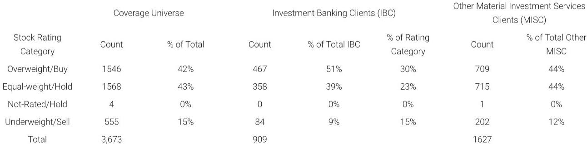

# AI in Drug Development Is Not a Revolution—It Is a Productivity Tool, and That Changes the Investment Thesis

The most provocative insight from a recent conversation with the CEO of Insilico Medicine is not that artificial intelligence can discover drugs faster. It is that the industry has been asking the wrong question. For years, the narrative surrounding AI in drug discovery has been one of displacement: machines replacing biologists, algorithms outperforming clinical trials, and data moats creating unassailable competitive advantages. That narrative is now being quietly retired by the very companies that helped build it. What emerges instead is a far more sober, and far more investable, reality. AI in drug development is not a paradigm shift in how we discover cures. It is a productivity enhancement layer within a system whose fundamental bottlenecks remain biological, regulatory, and human. For investors, this reframing changes everything—from how to value AIDD platforms to which business models will survive the next cycle.

The timing of this recalibration matters. The biopharma sector is emerging from a period of overcapitalization followed by a sharp correction. Many AIDD companies that went public in the 2020-2021 frenzy are now trading at fractions of their peak valuations. The market is searching for signals of which platforms have genuine durability and which were propped up by hype. Insilico Medicine, with 13 internally developed programs in the clinic and three Phase 2 assets, offers one of the most data-rich case studies available. Its CEO's willingness to publicly challenge the industry's own sacred cows—proprietary data as a moat, the near-term replacement of animal models, and the promise of end-to-end disruption—provides a rare window into what actually works and what does not.

The argument that follows is not a summary of that conversation. It is an analytical framework for understanding why the AIDD investment landscape is shifting, where the real value is being created, and what questions remain dangerously unanswered. The implications extend beyond any single company. They should reshape how institutional allocators think about exposure to AI in life sciences, how corporate development officers evaluate partnership opportunities, and how analysts build their valuation models for a sector that is finally growing up.

## The Most Validated AIDD Platforms Are Proving That Data Moats Are a Myth, Not a Moat

The single most consequential claim to emerge from the Insilico discussion is that proprietary datasets have not, and likely will not, provide a durable competitive advantage in AI-driven drug discovery. This is not a modest caveat. It is a direct challenge to the foundational thesis upon which dozens of AIDD companies have been built and funded. For years, the standard pitch has been straightforward: we generate massive amounts of proprietary biological data, train our models on that data, and create a flywheel that competitors cannot replicate because they lack the data. The CEO of Insilico, which maintains over 3,000 disease-target associations in its internal database, described the landscape of data-centric companies that failed as a "graveyard." That is a striking admission from a firm that has invested heavily in data generation.

The logic behind this claim deserves careful unpacking. The issue is not that data is irrelevant. It is that in drug discovery, the marginal value of proprietary data diminishes rapidly once a certain threshold of public and licensed data is reached. The key biological relationships that matter for early-stage target identification are increasingly well-catalogued in public databases. What differentiates successful programs is not having a unique dataset, but having a superior system for integrating, benchmarking, and orchestrating models across multiple data types. Insilico maintains approximately 1,200 proprietary benchmarks—a figure that speaks to process and validation infrastructure rather than raw data volume. The implication is clear: the competitive moat in AIDD is not data ownership; it is the quality of the iterative learning system that sits on top of the data.

For investors, this reframing has immediate consequences. Valuation models that assign a premium to companies based on the size or uniqueness of their proprietary datasets are likely overstating the durability of that advantage. Conversely, companies that have invested in benchmarking infrastructure, model orchestration, and systematic validation workflows may be undervalued if the market has not yet recognized the shift in what constitutes a defensible asset. The open question that remains—and one the report does not fully answer—is whether any AIDD platform has yet demonstrated that its benchmarking and orchestration capabilities can be scaled across therapeutic areas without degradation in performance. The answer to that question will determine whether the current leaders can sustain their positions or whether we are still in the early innings of a market that will see repeated leadership changes.

## The Real Bottleneck Is Not Safety Validation—It Is the Fundamental Inability of Preclinical Models to Predict Human Efficacy

One of the most persistent promises of AI in drug development has been the reduction or elimination of animal testing. The logic seems intuitive: if AI can model human biology more accurately than animal models, why subject compounds to species that often mispredict human outcomes? The Insilico CEO's response to this line of thinking is a necessary corrective. While safety testing can indeed be improved through robotic labs, organoids, and existing primate data, the regulatory pathway for completely animal-free validation packages remains extremely limited. No major regulatory agency has signaled willingness to accept a fully in silico or organoid-based safety package for first-in-human trials. That constraint is real and unlikely to change in the near term.

But the more critical bottleneck, and the one that deserves far more attention from investors, is efficacy. The CEO was explicit: the real challenge for AIDD is not that safety models are inadequate, but that efficacy models fail to translate reliably to human disease. This is particularly acute in chronic and age-related conditions such as Alzheimer's disease, Parkinson's disease, amyotrophic lateral sclerosis, and fibrosis. The fundamental problem is that short-lived mice and non-human primates cannot naturally replicate the long-cycle human pathology that characterizes these diseases. Researchers are forced to rely on artificially induced disease models in animals—injecting toxins, creating genetic knock-ins, or surgically inducing conditions—that have limited biological correlation with spontaneous human disease. An AI model trained on data from these artificial systems is, at best, learning to predict outcomes in a flawed proxy.

This insight has profound implications for where AIDD can and cannot add value. The technology's most validated benefit today lies in compressing early discovery timelines and reducing the cost to preclinical candidate. Insilico cited approximately 12 to 18 months and three to five million dollars to reach a preclinical candidate, with continued improvements in computational efficiency reducing processing time from weeks to days. But downstream development remains bounded by the same regulatory and biological constraints that have always governed drug development. No amount of AI acceleration in hit-to-lead or lead optimization can change the fact that a compound must still undergo IND-enabling studies, Phase 1 safety trials, and Phase 2 efficacy trials that take years and cost hundreds of millions of dollars. The AI does not make the biology any faster. It makes the chemistry and the target selection more efficient. That is a meaningful improvement, but it is not a revolution.

The unanswered question here is whether AIDD platforms can eventually contribute to solving the efficacy prediction problem itself. If AI could model human disease biology with sufficient fidelity to replace at least some animal efficacy studies, the value creation would be enormous. But the CEO's framing suggests that this remains a distant prospect, not a near-term catalyst. Investors should be skeptical of any AIDD company that promises near-term reductions in clinical development timelines or the replacement of animal efficacy testing. The technology is not there yet, and the biological barriers are structural, not computational.

## Commercial Viability in AIDD Requires a Deliberate Tradeoff Between Target Novelty and Clinical Validation—Most Companies Are Getting This Wrong

The discussion of commercialization strategy may be the most immediately actionable section of the entire analysis for investment professionals. The core insight is deceptively simple: in AIDD, the economic viability of a program depends on where it sits on the spectrum between target novelty and clinical validation. Novel targets command higher theoretical value—if they work, they can create entirely new drug classes and address previously undruggable biology. But novel targets require significant clinical de-risking, often through Phase 2 data, before they attract meaningful partnership interest from large pharmaceutical companies. That means higher capital intensity, longer timelines, and a greater risk of failure before any revenue is realized.

In contrast, programs against more validated targets, paired with improved molecular design, are more readily monetizable at earlier stages. A large pharma partner is far more willing to pay for a better molecule against a known target than to bet on an unvalidated target, even if the potential upside is lower. The Insilico CEO indicated that his company's strategy has shifted toward balancing novelty across both target and chemistry to optimize out-licensing opportunities and drive a path toward profitability. This is a pragmatic admission that the market for AIDD-derived assets is not willing to pay a premium for novelty alone. The assets must also come with reduced risk, either through target validation or through superior molecular properties that are immediately apparent.

For the broader AIDD landscape, this creates a clear strategic divide. Companies that have positioned themselves as pure-play novel target discovery engines face a more difficult path to revenue generation. They will need to fund their own clinical development through multiple phases, which requires either deep cash reserves, repeated capital raises, or a willingness to accept less favorable partnership terms later. Companies that have built platforms capable of working across the novelty-validation spectrum, and that can flexibly choose which programs to advance internally versus out-license, are likely to demonstrate more sustainable business models. The report does not fully answer how many AIDD companies have the operational flexibility to make this tradeoff effectively, nor does it provide a framework for identifying which platforms are truly adaptable versus which are locked into a single strategic approach. These are critical due diligence questions that investors must answer for themselves.

## A Decision Framework for Evaluating AIDD Platforms: Four Questions That Separate Signal From Noise

The insights from this analysis can be synthesized into a practical decision framework for investors, corporate development officers, and strategists evaluating AIDD platforms. The framework consists of four questions, each derived from a specific finding in the report and each designed to cut through the hype that still surrounds the sector.

First, how does the platform measure and improve its own performance? The report makes clear that benchmarking infrastructure, not data volume, is the true competitive differentiator. Ask for the number and variety of proprietary benchmarks, the frequency of model retraining, and the systematic processes for identifying when a model is underperforming. Companies that cannot articulate a rigorous benchmarking methodology are likely overstating their capabilities.

Second, what is the platform's demonstrated track record on cost and time to preclinical candidate? The Insilico benchmarks of 12 to 18 months and three to five million dollars provide a useful reference point. Any platform claiming significantly faster or cheaper timelines should be able to provide multiple examples, not just a single best case. Be wary of companies that cite only a handful of programs or that cannot disaggregate their own performance from that of their partners.

Third, what is the platform's strategic approach to the novelty-validation tradeoff? Does the company have a clear thesis for which programs it will advance internally versus out-license, and does that thesis align with its cash position and partnership network? Companies that are pursuing only novel targets without a clear path to funding clinical development are taking on significant execution risk. Companies that can demonstrate a balanced portfolio, with some programs targeting validated indications and others pursuing novel biology, are likely to have more resilient business models.

Fourth, and perhaps most importantly, what is the platform's honest assessment of where AI can and cannot add value in the drug development value chain? The most credible AIDD companies are those that acknowledge the limitations of their technology as clearly as they state its advantages. If a company claims that AI can accelerate clinical trials, replace animal efficacy studies, or fundamentally change the probability of success in Phase 2, that claim should be met with deep skepticism. The report's conclusion is unambiguous: AIDD's most validated benefit is in early discovery, not in downstream development. Companies that oversell their capabilities are either deluded or deceptive, and neither is a desirable investment characteristic.

## The Unanswered Questions That Will Define the Next Phase of AIDD Investment

For all the valuable insights this analysis provides, it leaves several critical questions unresolved. These are not weaknesses in the analysis itself, but rather honest acknowledgments of the limits of what any single company conversation or research report can answer. They are the questions that should drive the next phase of due diligence for serious investors.

The first unanswered question is whether the Insilico model is replicable or exceptional. Insilico is one of the most clinically validated AIDD platforms, with a CEO who is unusually willing to speak candidly about the industry's limitations. But is its performance representative of what the technology can achieve, or is it an outlier driven by exceptional management and specific strategic choices? The report does not provide a sufficient basis for answering this question, and investors should be cautious about extrapolating from a single data point.

The second question concerns the scalability of benchmarking and orchestration capabilities. Insilico's 1,200 proprietary benchmarks are impressive, but do they generalize across therapeutic areas, or are they concentrated in a few disease domains where the company has deep expertise? As AIDD platforms expand into new indications, the risk of performance degradation is real, and the report does not provide evidence on this point.

The third question is about the long-term competitive dynamics of the AIDD market. If proprietary data is not a durable moat, and if benchmarking infrastructure can be replicated with sufficient investment, what prevents large pharmaceutical companies from building equivalent or superior capabilities in-house? The report suggests that AIDD platforms offer a productivity enhancement, but if that enhancement can be internalized by the customers, the independent AIDD companies may face a commoditization risk that is not yet priced into their valuations.

The fourth and final question is perhaps the most consequential: what happens when the low-hanging fruit of early discovery optimization is exhausted? The compression of timelines from months to days in computational workflows is impressive, but it is a one-time improvement. Once that compression is achieved, what is the next source of value creation? The report does not speculate on this, and the absence of a clear answer suggests that the AIDD industry may need to reinvent itself within the next five to seven years if it is to sustain its growth trajectory.

These questions are not reasons to avoid the sector. They are reasons to approach it with rigor, to demand evidence rather than promises, and to build investment theses that are grounded in the technology's actual capabilities rather than its aspirational potential. The companies that can provide credible answers to these questions will be the ones that deliver sustained value. The rest will be remembered as part of the "graveyard" the Insilico CEO so candidly described.

Join the community to read the full report and review the original charts.

*This article is for learning and discussion only and does not constitute investment advice.*

Personal reading notes and learning share only. Not investment advice.

