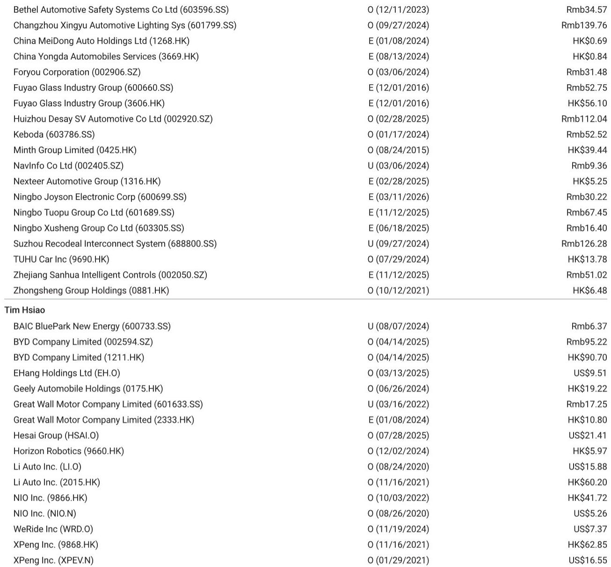
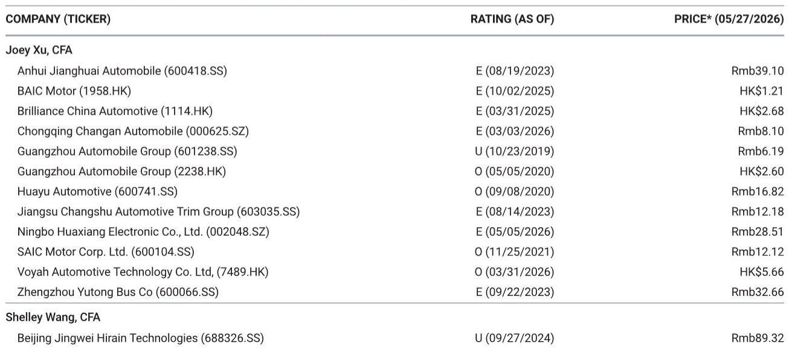
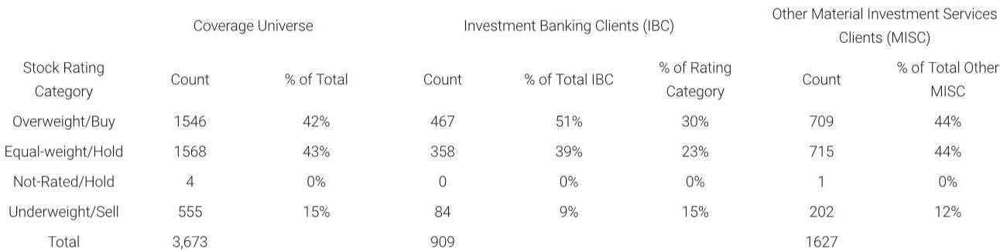

# Chinese Automakers Are Not Just Exporting Anymore—They Are Rebuilding the Global Sales Map, and Investors Need a New Framework to Track It

The narrative that Chinese original equipment manufacturers are simply flooding global markets with low-cost electric vehicles has become dangerously incomplete. The April 2026 overseas registration data for BYD, Geely, and Great Wall Motor reveals something far more strategic: these companies are constructing distinct, increasingly concentrated geographic strongholds, and their month-over-month performance diverges sharply based on local market conditions, not just global demand. For investors, the headline year-over-year growth numbers—BYD at 55-60%, Geely at 95-100%, and GWM at 15-20%—obscure a more important story about volatility, market share capture, and the uneven pace of expansion. The real question is not whether Chinese automakers are winning overseas, but where they are winning, why, and what that tells us about the sustainability of their global strategies.

The April data matters because it breaks the pattern of relentless upward momentum. After months of rapid growth, BYD's overseas registrations fell 10-15% month-over-month, driven primarily by a sharp normalization in the UK market, where sales dropped from 15,000 units in March to approximately 5,000 in April. This is not a sign of weakness. It is a sign of lumpiness in new market penetration, and it forces investors to distinguish between trend and noise. Meanwhile, Geely continued to accelerate, posting a 10-15% month-over-month gain, while GWM slipped 5-10%. The divergence among these three players is not random; it reflects fundamentally different geographic exposures, product strategies, and local market dynamics.

The strategic implication is clear. The era of treating "Chinese auto exports" as a single, monolithic growth story is over. The next phase of analysis requires a country-by-country, brand-by-brand framework that accounts for local registration volatility, regulatory risk, and competitive intensity. The April data provides the raw material for building that framework.

## The Concentration of Overseas Sales into a Few Key Markets Is Accelerating, Creating Both Opportunity and Single-Point Vulnerability

The most striking pattern in the April data is the degree to which a handful of countries now dominate overseas sales for each OEM. For BYD, Brazil, Australia, and Indonesia alone accounted for 44% of overseas sales. For Geely, Russia, Mexico, Brazil, and Australia represented 63%. For GWM, Russia, Brazil, and Australia made up 76%. This concentration is not accidental. It reflects deliberate channel investment, local assembly or partnership arrangements, and product-market fit in regions where Chinese brands have found receptive customers.

Brazil has emerged as the single most important battleground. BYD sold 18,000 units there in April, growing 12% month-over-month against a market that declined 9%. Geely’s Brazil sales surged 210% month-over-month to 3,600 units, albeit from a low base. GWM, despite a 23% month-over-month decline in Brazil, still sold 4,800 units and grew 110% year-over-year. Brazil is not just a large market; it is a market where Chinese OEMs are taking share from incumbents at an accelerating rate. The question for investors is whether this growth is sustainable or whether it will invite retaliatory trade measures, as has happened in other regions.

Australia is the second critical node. BYD grew 9% month-over-month to 8,200 units, Geely surged 57% to 3,000, and GWM declined 17% to 4,700. Australia is a mature, regulated market with strong consumer protection and environmental standards. Success there signals product quality and brand acceptance. It is also a market where Chinese brands are competing directly with Toyota, Hyundai, and the German premium players. The divergence between Geely's rapid gain and GWM's decline suggests that brand positioning and product cycle timing matter enormously, even within the same region.

The risk of concentration is obvious. A regulatory change, tariff increase, or economic downturn in Brazil or Australia would disproportionately impact these OEMs' overseas revenue. Investors must monitor not just total overseas sales, but the resilience of each country-specific operation.

## BYD's Month-Over-Month Decline Is a Story of Market Normalization, Not Demand Destruction, and It Highlights the Importance of Timing in New Market Entry

BYD's 10-15% month-over-month decline in overseas registrations has likely triggered concern among some investors. A closer look at the data suggests a more nuanced interpretation. The decline was almost entirely driven by the UK market, where registrations fell from approximately 15,000 in March to around 5,000 in April. This is a classic pattern of initial channel fill followed by stabilization. When a brand enters a new market, the first wave of registrations often includes dealer stocking, fleet orders, and promotional sales. The subsequent month reflects true retail demand.

The UK is a particularly instructive case. March is a key registration month in the UK due to the biannual plate change, which typically inflates sales across all brands. BYD's March number likely captured both genuine demand and this seasonal effect. The April normalization brings the run rate closer to underlying demand, which appears to be in the range of 5,000 to 6,000 units per month. That is still a strong performance for a brand that was barely present in the UK two years ago.

Offsetting the UK decline, BYD saw meaningful growth in Latin America and Southeast Asia. Brazil added approximately 2,500 units month-over-month, and Indonesia added about 1,000. Indonesia is particularly noteworthy: BYD's sales there rose 67% month-over-month to 5,600 units, against a market that grew only 32%. This suggests that BYD is gaining share rapidly in a large, growing, and relatively under-penetrated market.

The pattern across BYD's portfolio is one of geographic rotation. As one market normalizes, another accelerates. This is a sign of a maturing global operation, not a struggling one. The key risk is whether BYD can maintain this rotation as it enters more markets. Each new market requires investment in distribution, service, and brand building. The cost of this expansion is not visible in the registration data, but it will show up in the financial statements.

## Geely's Accelerating Overseas Momentum Suggests a Second-Mover Advantage Is Taking Shape, Especially in Markets Where BYD Has Already Paved the Way

Geely's 10-15% month-over-month increase and 95-100% year-over-year growth make it the standout performer in April. The composition of this growth is revealing. Brazil contributed approximately 2,500 units of month-over-month growth, and Australia contributed about 1,000. These are the same markets where BYD has been building presence and consumer awareness for Chinese EVs. Geely appears to be benefiting from a rising tide, but also from product differentiation.

Geely's product lineup includes both pure EVs and hybrids, which may give it an advantage in markets where charging infrastructure is still developing. Brazil, for example, has a growing but still limited public charging network. A plug-in hybrid or extended-range EV can appeal to consumers who want electrification without range anxiety. BYD also offers hybrids, but Geely's brand portfolio—including Zeekr, Lynk & Co, and Geely-branded vehicles—may be reaching different customer segments.

Russia remains Geely's largest overseas market by volume, with 7,500 units in April, growing 2% month-over-month. This is a market where Western automakers have largely exited, leaving a vacuum that Chinese brands are filling. The geopolitical risk here is substantial. Sanctions, payment disruptions, or a shift in Russian consumer preferences could impact this business significantly. Yet for now, it provides a stable base of volume and margin.

Mexico, Geely's second-largest market, saw a 6% month-over-month decline to 4,300 units, against a market that declined 10%. This is a relative outperformance, but the decline warrants monitoring. Mexico is a key gateway to North America, and any weakness there could signal challenges in the broader Latin American strategy.

The strategic question for Geely is whether its growth is sustainable at the current pace. A 95-100% year-over-year growth rate is extraordinary, but it is likely to decelerate as the base expands. The more important metric is market share trajectory. If Geely can continue to gain share in Brazil, Australia, and Southeast Asia, the absolute growth rate can normalize while still delivering impressive incremental volume.

## Great Wall Motor's Decline Reveals the Limits of a Legacy Product Cycle and the Risk of Being Squeezed Between BYD and Geely

GWM's 5-10% month-over-month decline and 15-20% year-over-year growth place it firmly in third place among the three major Chinese OEMs. The decline was driven by 1,000 to 1,500 unit drops in both Australia and Brazil. This is concerning because these are precisely the markets where BYD and Geely are growing. GWM appears to be losing ground to its Chinese competitors, not just to incumbents.

GWM's product lineup is heavily weighted toward SUVs and pickup trucks, which have been its core strength. The Haval and Ora brands have had success in markets like Russia and Australia. But the competitive intensity is rising. In Australia, BYD's Atto 3 and Seal are competing directly with GWM's Ora and Haval models. In Brazil, the same dynamic is playing out. GWM's 23% month-over-month decline in Brazil, despite 110% year-over-year growth, suggests that the initial wave of market entry has passed and the brand is now facing sustained competition.

Russia remains GWM's largest market, with 18,200 units in April, growing 11% month-over-month. This is a strong performance, but it is also a market that carries elevated geopolitical risk. The Russian market is becoming increasingly dependent on Chinese imports, but that dependence could create its own vulnerabilities, including pricing pressure and regulatory changes.

The challenge for GWM is clear. It needs to refresh its product lineup and accelerate its EV transition to compete with BYD and Geely in the markets that matter most. Its current growth rate of 15-20% year-over-year is respectable but lags behind its peers. Without a product cycle catalyst, GWM risks being relegated to a niche player in the overseas expansion story.

## What the Report Does Not Fully Answer: The Profitability of Overseas Sales and the Sustainability of Market Share Gains

The registration data provides volume and market share trends, but it does not answer the most important question for investors: Are these overseas sales profitable? The reported data does not include pricing, incentives, or cost structures. A global investment bank report would typically model these factors, but the public data leaves significant ambiguity.

Consider BYD's UK business. If the March spike was driven by aggressive pricing and dealer incentives, the profitability of those sales may be lower than the average. The April normalization could actually improve margins if the company pulled back on discounts. Similarly, Geely's 210% month-over-month surge in Brazil may have required significant marketing spend and channel investment. The volume growth is impressive, but the unit economics are unknown.

Another unanswered question is the sustainability of market share gains in markets like Brazil and Indonesia. Chinese OEMs are benefiting from a combination of product competitiveness and the relative weakness of legacy automakers in the EV transition. But incumbents are not standing still. Volkswagen, Toyota, and Hyundai are all investing in local EV production in these markets. Tariff and trade policy could also shift. The European Union's investigation into Chinese EV subsidies is a reminder that success attracts scrutiny.

Finally, the data does not reveal the mix between battery EVs, plug-in hybrids, and internal combustion vehicles. This matters for margin analysis and for understanding which products are driving demand. A shift toward lower-margin vehicles could offset the volume gains.

## A Decision Framework for Investors: How to Read the Monthly Registration Data and Identify the Signals That Matter

Given the complexity of the overseas registration data, investors need a structured approach to separate signal from noise. The following framework is designed to help interpret monthly data and identify the leading indicators of sustainable growth.

First, focus on market share relative to market growth. A company that grows faster than the local market is gaining share. BYD's 12% month-over-month growth in Brazil against a market decline of 9% is a strong signal. GWM's 23% month-over-month decline in Brazil against a market decline of 9% is a warning. The absolute growth rate matters less than the share trajectory.

Second, monitor the concentration risk. If a single market accounts for more than 25% of overseas sales, any disruption in that market will have an outsized impact. BYD's Brazil exposure at 25% is manageable but worth watching. GWM's Russia exposure at a similar level is a higher risk given the geopolitical context.

Third, track the month-over-month volatility in new markets. A spike followed by a sharp decline, as seen in BYD's UK data, is often a sign of channel fill rather than sustainable demand. Two to three months of stable data after the initial spike provides a more reliable baseline.

Fourth, compare the growth rates of different OEMs in the same market. If BYD and Geely are both growing in Brazil while GWM is declining, it suggests that the market itself is not the issue. The competitive dynamic is shifting, and the lagging brand may need a product or strategy refresh.

Fifth, consider the regulatory and trade policy environment in each key market. Brazil has a history of protectionist industrial policy. Australia is more open but has strong consumer protection laws. Russia is unpredictable. Each market requires a different risk assessment.

## The Next Phase of the Chinese Auto Export Story Will Be Written Market by Market, and the Full Report Contains the Charts That Make the Pattern Visible

The April registration data confirms that Chinese automakers are executing a deliberate, multi-market strategy that is producing real results. But the headline growth numbers are no longer sufficient for investment analysis. The divergence among BYD, Geely, and GWM, the concentration of sales in a few critical markets, and the month-over-month volatility all demand a more granular approach.

The full report, including the original treemap charts that break down overseas sales by country for BYD and Geely, provides the visual framework for understanding these patterns. Without the charts, the data points remain abstract. With them, the geographic concentration, the relative importance of each market, and the differences between the OEMs become immediately clear.

The unanswered questions about profitability, sustainability, and regulatory risk will only be resolved over time as more data becomes available. But the April data provides a crucial baseline. It shows that the Chinese auto export story is real, it is accelerating, and it is far more complex than the simple narrative of a flood of cheap EVs.

Join the community to read the full report and review the original charts.

*This article is for learning and discussion only and does not constitute investment advice.*

Personal reading notes and learning share only. Not investment advice.

