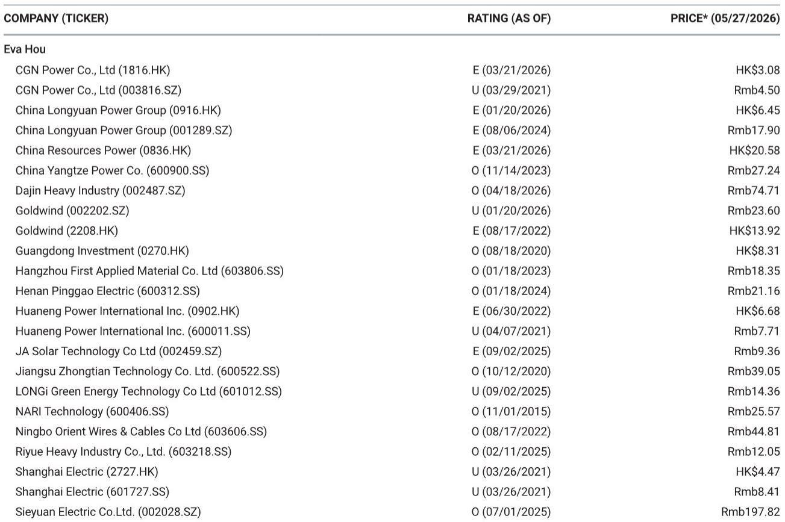
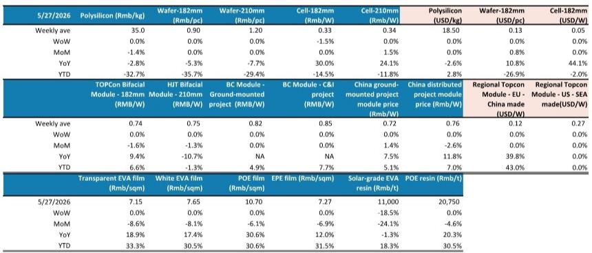
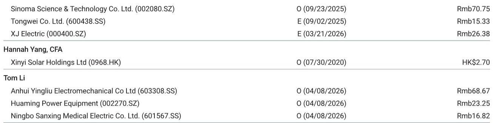

# 光伏产业链的真正企稳，或许不是底部，而是新一轮分化的起点

过去几周，光伏产业链价格传递出一个令市场既熟悉又陌生的信号：上游多晶硅价格在经历长达数月的阴跌后，终于止住了下滑势头，稳定在每公斤34.5至35元人民币的区间。硅片价格已经横盘超过一个月，电池片虽然周环比微跌0%至1.5%，但跌幅明显收窄。组件端，无论是国内集中式还是分布式项目，TOPCon组件价格均未出现进一步松动。

对于习惯了“跌跌不休”的市场参与者而言，这种全面企稳的态势，很容易被解读为底部信号。但某外资投行最新发布的太阳能产品价格追踪周报（截至2026年5月27日）揭示了一个更复杂的图景：价格的稳定并非源于需求的强劲复苏，而是供给端在极端亏损下的被动收缩。这意味着，当前的价格均衡是脆弱的，真正值得关注的不是“价格是否见底”，而是“哪些企业能在这种脆弱均衡中活下来，并重新获得议价权”。

这份报告的核心价值不在于罗列了哪些价格变化，而在于它提供了判断产业链竞争格局转折点的关键证据。以下是我们从这份周报中提炼出的五个核心洞察，它们将帮助产业决策者和投资者重新校准对光伏行业未来走势的认知框架。

## 1. 多晶硅价格止跌的真正含义不是供需再平衡，而是行业现金成本的硬约束被触及

报告中最引人注目的数据点，莫过于多晶硅均价在连续多周下跌后首次企稳。从历史价格走势图来看，多晶硅价格从2022年底的高点每公斤约300元一路下探至当前的35元附近，跌幅超过88%。这一价格水平意味着什么？它已经低于绝大多数二三线企业的现金成本。

报告并未直接披露各企业的成本曲线，但我们可以从行业常识推断：当价格跌破现金成本时，企业每生产一吨多晶硅都在消耗现金流，而非创造价值。此时，停产检修、推迟投产、甚至永久性退出成为理性选择。因此，本轮价格企稳的本质，是供给端在亏损压力下的被动出清，而不是需求端出现了足以消化过剩产能的增量。

这里需要特别注意的是，这种“成本支撑”并非坚不可摧。报告中没有展开讨论的一个关键变量是：如果龙头企业凭借更低的生产成本和更厚的资金储备，选择继续满产甚至增产以抢占市场份额，那么当前的价格均衡可能被迅速打破。换言之，多晶硅价格的稳定，更像是一场“谁先撑不住”的博弈暂时停火，而非终局。

## 2. 电池片价格微跌背后，是技术路线迭代带来的结构性分化，而非简单的周期波动

本周电池片价格环比微跌0%至1.5%，182mm TOPCon电池片均价落在每瓦0.325至0.335元。表面上看，这只是延续了前期的疲软态势。但结合报告中的历史价格图表，我们会发现一个被忽视的结构性变化：TOPCon电池片与PERC电池片之间的价差正在收窄。

从更长的时间维度看，PERC电池片价格从2018年的每瓦1.2元一路降至2024年的0.3元附近，此后长期维持在低位。而TOPCon电池片作为新一代技术，其溢价在过去一年中逐渐被压缩。这背后的驱动因素并非简单的“降价竞争”，而是TOPCon技术的扩散速度超出了市场预期——当越来越多的企业掌握了TOPCon量产工艺，技术红利自然消退。

对于投资者而言，这意味着电池片环节的竞争正在从“技术领先”转向“成本控制”。那些能够率先将TOPCon非硅成本降至与PERC相当甚至更低的公司，将在下一轮竞争中占据主动。报告没有直接点名哪些公司具备这种能力，但我们可以推断：拥有垂直一体化产能、且在硅片和组件环节也有布局的企业，在成本控制上往往更具优势。

## 3. 组件价格看似稳定，但海外市场的结构性溢价正在被侵蚀，这可能是未来最大的变数

国内组件价格方面，TOPCon分布式项目均价为每瓦0.76元，集中式项目为每瓦0.72元，连续多周持平。海外市场同样波澜不惊：中国产出口至欧盟的TOPCon组件维持在每瓦0.123美元，美国本土组装组件价格为每瓦0.30美元。

然而，表面的稳定掩盖了深层的变化。报告显示，中国产出口至欧盟的组件价格自年初以来（YTD）上涨了43%，而美国市场组件的YTD涨幅更是高达43%。这种涨幅主要来自贸易壁垒和本地化生产要求带来的结构性溢价，而非终端需求的强劲。问题在于：这种溢价能持续多久？

报告没有明确回答，但我们可以从逻辑上推演。随着东南亚产能的逐步释放和美国本土制造能力的提升，中国组件出口至欧美市场的“贸易溢价”可能被逐步压缩。如果这一判断成立，那么当前海外市场的高价格将成为国内组件企业的“利润缓冲垫”，而非长期增长的基石。对于依赖出口的企业而言，真正的考验在于：当贸易溢价消退后，你的产品是否还具备成本竞争力。

## 4. EVA树脂价格暴跌18.5%是一个被低估的信号，它指向的是辅材环节的结构性过剩

本周最剧烈的价格波动出现在辅材环节：EVA树脂价格单周暴跌18.5%，至每吨11,000元，而POE树脂价格则保持平稳。这一数据在报告中仅被简略提及，但它的含义可能比主材价格的企稳更为深远。

EVA树脂是光伏封装胶膜的主要原料。其价格暴跌的直接原因可能是下游胶膜厂商的采购意愿减弱，或者上游EVA产能的集中释放。但更深层次的原因在于：随着TOPCon和HJT等N型电池技术的渗透率提升，对POE胶膜的需求正在结构性增长，而EVA胶膜的市场份额则面临被侵蚀的风险。换言之，EVA树脂价格的暴跌，不仅是周期性的产能过剩，更是技术迭代带来的需求结构变化。

这意味着，对于主攻EVA胶膜的辅材企业而言，当前的价格压力可能不是暂时的，而是永久性的。而POE树脂价格的坚挺，则暗示了这一细分市场仍然存在供需缺口。报告覆盖的某家辅材龙头公司（603806.SS）获得了“超配”评级，这或许与它在POE胶膜领域的布局有关。

## 5. 报告没有完全回答的关键问题：这一轮出清何时结束？以及，谁会是最终的赢家？

尽管这份周报提供了丰富的价格数据和趋势判断，但它毕竟是一份以周度为频率的追踪报告，其核心任务是记录事实，而非预测终局。有几个关键问题，报告并未给出明确答案，而这恰恰是投资者和产业决策者最需要思考的。

第一，出清的触发条件是什么？当前的价格水平已经让大部分企业亏损，但为什么产能没有快速退出？是因为地方政府不愿意放弃税收和就业，还是龙头企业希望通过“熬死”对手来换取未来的垄断利润？这个问题的答案，决定了出清是“快刀斩乱麻”还是“钝刀子割肉”。

第二，谁是最终的赢家？报告给出了多家公司的评级，但并未详细解释其逻辑。例如，为什么在组件价格持续承压的背景下，某家组件龙头公司（601012.SS）仍被给予“中性”评级？为什么一家辅材公司（603806.SS）能获得“超配”？这些评级背后隐含的假设——比如成本优势、技术壁垒、客户粘性——正是我们需要深入挖掘的。

第三，需求端是否存在被低估的风险？报告的所有分析都建立在“需求稳定”的隐含假设之上。但2026年全球光伏装机量能否达到市场预期的500GW以上？欧洲的能源转型步伐是否会被地缘政治因素打断？美国的《通胀削减法案》补贴能否持续？这些问题如果出现负面变化，将对整个产业链的价格体系产生颠覆性影响。

这些未解问题，恰恰是这份周报最有价值的地方——它没有给出简单的答案，而是提供了足够多的数据点和逻辑线索，让我们能够提出更好的问题。

---

以上五个洞察，只是我们从这份周报中提取的一部分。报告中还有更多关于硅片、组件、以及海外市场的详细价格数据和历史走势图，它们共同勾勒出光伏产业链当前的真实状态。

如果你希望进一步探讨“多晶硅成本曲线如何影响企业定价策略”、“TOPCon与HJT的技术路线之争将如何演变”，或者想了解报告中提到的具体公司评级背后的逻辑，欢迎来我们的星球微信群里继续讨论。我们会在群里分享完整报告的解读、原始数据图表，以及更多基于产业链调研的一手判断。

Personal reading notes and learning share only. Not investment advice.

