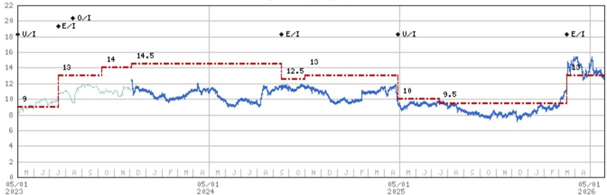
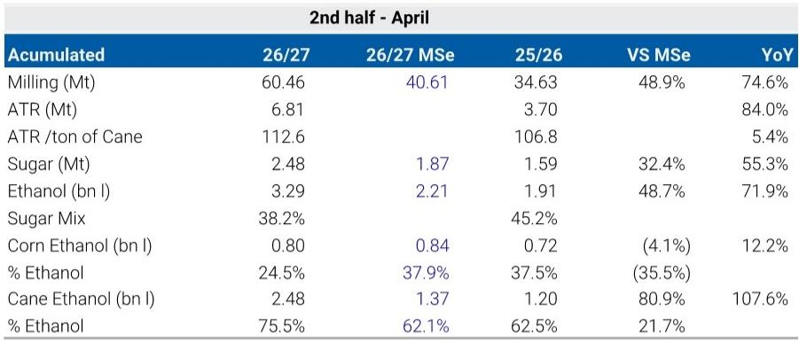

# Brazil's Sugar Surge Is a Short-Term Headwind That Sets Up a Structural Recovery

The 2026/27 Brazilian Center-South harvest has opened with a force that caught nearly every market participant off guard. Cane crushing in the first month surged 75% year-on-year, sugar production jumped 55%, and both figures ran roughly 30% to 50% above consensus expectations. This is not a marginal acceleration. It is a front-loaded supply shock that has already begun to pressure global sugar prices and will continue to do so through the first half of the harvest season.

Yet the most important insight from the early data is not the volume of sugar being produced. It is what mills are choosing not to produce. Despite the crushing bonanza, the sugar mix has fallen sharply to 38%, down seven percentage points from last year. Mills are allocating the vast majority of their cane to ethanol, which is trading at a premium to sugar on an energy-equivalent basis. This strategic shift is rational, but it carries a critical implication: the current pressure on sugar prices is self-limiting and temporary.

The argument that emerges from this harvest start is that the near-term pain from abundant supply is actually accelerating the timeline for a market rebalancing. The combination of aggressive ethanol diversion, an impending policy catalyst in the form of a mandated blend increase, and the rising probability of an El Niño-driven supply disruption later in the year creates a window of opportunity for investors who can look past the current inventory build. The cycle is turning, but it will turn faster for those who understand why the early surge is not the full story.

This article examines the structural logic behind Brazil's harvest dynamics, explains why the ethanol shift matters more than the sugar volume, and provides a decision framework for navigating the tension between near-term price pressure and medium-term recovery. It also identifies the key analytical gaps that the market must resolve before the full picture becomes clear.

## The Early Harvest Surge Is Real, But Its Composition Reveals a Strategic Pivot That Markets Are Underpricing

The raw numbers from the first month of the 2026/27 harvest are striking by any standard. Cane crushing reached 60.46 million tons, representing a 75% increase year-on-year and a 49% beat relative to what a global investment bank had modeled. Sugar production of 2.48 million tons came in 55% above last year and 32% above the same model. Ethanol production rose 72% year-on-year, driven by a 110% surge in cane-based ethanol output.

The temptation is to read these figures as a straightforward bearish signal for sugar prices. More cane, more sugar, more supply. That logic is correct in the very near term, and prices have already begun to reflect it. But the composition of the harvest tells a different story about the medium term.

The sugar mix has dropped from 45% last year to 38% this year. In absolute terms, sugar production rose because the total cane crush was so much larger. But the proportion of cane going to sugar fell sharply. Mills are making a deliberate choice to favor ethanol. This is not a passive outcome of operational constraints. It is an active response to relative pricing. Ethanol is trading at a premium to sugar on an energy-parity basis, and mills are optimizing their revenue mix accordingly.

The significance of this pivot extends beyond the current harvest. If mills were maximizing sugar output, the supply shock would be far worse. The fact that they are not means that the market is absorbing a supply increase that is already partially moderated by rational producer behavior. The bearish impulse from the harvest is real, but it is smaller than it could have been, and it is being cushioned by a structural shift in how Brazilian mills view the ethanol-sugar trade-off.

## Ethanol-Driven Pricing Dynamics Are Creating a Self-Correcting Mechanism That Will Tighten Sugar Supply in the Second Half

The current ethanol preference is not merely a matter of relative prices today. It is creating a cascade of effects that will reshape the supply-demand balance over the coming months.

Strong ethanol output is pushing producer prices for ethanol downward at the farm gate. This is improving ethanol's competitiveness at the pump relative to gasoline. When ethanol is cheaper than gasoline on an energy-adjusted basis, consumer demand for ethanol rises. This is already happening. The data show that ethanol at the pump is attractively priced versus gasoline, which should support demand growth through the middle of the year.

But there is a second-order effect that is more consequential for sugar markets. As ethanol inventories build from the strong production start, storage capacity becomes constrained. Mills face a choice: continue to produce ethanol and risk being unable to store it, or shift the mix back toward sugar. The inventory data already show that total ethanol stocks in the Center-South are up 150% year-on-year, and inventory days have risen to 35 from just 14 at the same point last year.

This inventory build is the mechanism that will eventually force the sugar mix higher. As ethanol storage fills, the marginal value of additional ethanol production declines. Mills will respond by diverting more cane to sugar, increasing sugar supply in the latter part of the harvest. This is the self-correcting dynamic that the market should be watching.

The timing of this shift matters enormously. If the sugar mix begins to rise in June or July, it will coincide with the peak of the crushing season. That would create a second wave of sugar supply that could keep prices depressed through the middle of the year. But if the mix shift is delayed or muted by policy intervention, the supply picture could tighten faster than expected.

## The Blend Increase Policy Is the Critical Release Valve That Could Accelerate Rebalancing, But It Remains Contingent on Political Will

The Brazilian government is expected to raise the mandated ethanol blend in gasoline from 30% to 32%, with implementation likely in June 2026. This policy would absorb approximately 800 to 900 million liters of ethanol annually. In the context of the current inventory overhang, this is a meaningful demand-side catalyst.

The policy logic is straightforward. A higher blend mandate creates structural demand for ethanol, which supports producer prices and reduces the incentive for mills to shift back to sugar. It acts as a release valve for the ethanol surplus, preventing the inventory build from becoming so severe that it forces a disorderly shift in the sugar mix.

However, the policy is not guaranteed. The main constraint is the political economy of gasoline subsidies. The Brazilian government has historically used gasoline pricing as a tool to manage inflation and consumer sentiment. A higher ethanol blend reduces gasoline consumption, which lowers tax revenue from gasoline and may require adjustments to subsidy programs. If the government is unwilling to accept these trade-offs, the blend increase could be delayed or diluted.

This creates a binary scenario for the sugar market. If the blend increase is implemented as expected, ethanol demand receives a structural boost that supports prices and keeps the sugar mix lower for longer. If it is delayed, the ethanol surplus grows, storage constraints tighten, and mills are forced to increase sugar production earlier in the season. The latter scenario would be more bearish for sugar prices in the near term but would also accelerate the eventual rebalancing by front-loading supply.

Investors should treat the blend policy as a critical inflection point. Its implementation or delay will determine whether the current inventory build is absorbed gradually or forces a more disruptive adjustment.

## The Report Leaves Unanswered Questions About the Interaction Between El Nino Risk and the Harvest Pace

The report identifies El Nino as a key risk factor for the second half of the harvest. Historically, strong El Nino events have been associated with above-average rainfall in Brazil's Center-South region, which can reduce milling days and lower sugar content in cane. The report notes that this risk enhances the risk-reward profile for sugar prices later in the year.

But the interaction between El Nino risk and the current harvest pace is more complex than the report fully addresses. A faster-than-normal start to the harvest means that a larger share of the crop has already been processed before the peak El Nino risk window. If the harvest front-loads enough volume, the impact of weather disruptions later in the season is partially mitigated. The crop is already in the mill.

Conversely, if El Nino materializes early and disrupts the second half of the harvest, the market could swing from surplus to deficit very quickly. The report's own price forecast shows sugar rising to 17 cents per pound by 2027/28, implying that the current weakness is seen as temporary. But the magnitude and timing of the recovery depend on whether El Nino actually arrives and how much of the crop has already been processed.

This is an analytical gap that the market needs to resolve. The current data do not tell us whether the fast start is a one-time acceleration or a signal that the entire harvest cycle is shifting earlier. If the latter, the weather risk window narrows, and the bearish case for near-term prices becomes stronger. If the former, the market remains vulnerable to a sharp reversal in the second half.

## A Decision Framework for Navigating the Sugar Cycle: Three Scenarios and Their Implications for Positioning

For investors looking to position in sugar and related equities, the current environment requires a scenario-based approach rather than a single directional view. The following framework captures the key variables and their implications.

Scenario One: Policy Delivered, El Nino Muted. In this scenario, the blend increase is implemented in June, ethanol demand rises, and weather conditions remain normal. The ethanol inventory build is absorbed gradually, and the sugar mix stays below 40% for most of the harvest. Sugar prices remain under pressure through August but begin to recover as the harvest winds down and global demand absorbs the surplus. This is the base case implied by the report. It favors a patient approach to building long positions, with entry points after the harvest peak.

Scenario Two: Policy Delayed, El Nino Materializes. If the blend increase is delayed and El Nino brings heavy rains in July and August, the market faces a double shock. Ethanol inventories remain elevated, forcing mills to shift to sugar just as weather disrupts crushing. This creates a temporary spike in sugar supply followed by a sharp contraction as the harvest is cut short. Prices could fall sharply in the near term before reversing just as quickly. This scenario favors tactical short positions early in the harvest window, followed by aggressive long positioning as weather risks become apparent.

Scenario Three: Policy Delivered, El Nino Strong. This is the most bullish scenario for medium-term prices. The blend increase supports ethanol demand, keeping the sugar mix low, while El Nino reduces total cane availability. Sugar supply falls short of expectations, and prices begin to recover earlier and more strongly than the base case. This scenario favors maintaining long exposure through the harvest and adding to positions on any weather-related dips.

The key variable that investors can monitor in real time is the weekly sugar mix data from UNICA. A sustained move above 42% would signal that ethanol storage constraints are forcing a shift back to sugar, which is bearish for prices. A mix below 38% would confirm that the ethanol preference is holding, which is supportive of the recovery narrative.

For equity investors focused on sugar and ethanol producers such as Sao Martinho and Adecoagro, the cycle-over-earnings framework is the correct lens. Near-term results will be weak as inventory builds and unhedged exposure to falling prices weighs on margins. But with prices below production cost for many mills and the forward curve steepening, the cycle is setting up a compelling recovery. The risk-reward is asymmetric: limited downside from current levels, and significant upside if any of the bullish scenarios materialize.

## Join the Community to Read the Full Report and Review the Original Charts

The analysis in this article is based on a detailed research report that includes proprietary data on cane crushing, sugar production, ethanol stocks, and pricing parity. The original charts provide a visual representation of the inventory build, the ethanol-sugar trade-off, and the historical context for the current harvest pace. They also include the full set of exhibits on price forecasts and inventory days that are essential for building conviction in the scenarios described above.

To access the complete report and the supporting data, join the community. The full document includes the analyst's detailed model assumptions, the sensitivity analysis around the blend policy, and the historical correlations between El Nino events and sugar price movements. These are the tools that allow investors to move beyond headlines and make informed decisions about positioning in the sugar cycle.

*This article is for learning and discussion only and does not constitute investment advice.*

Personal reading notes and learning share only. Not investment advice.

