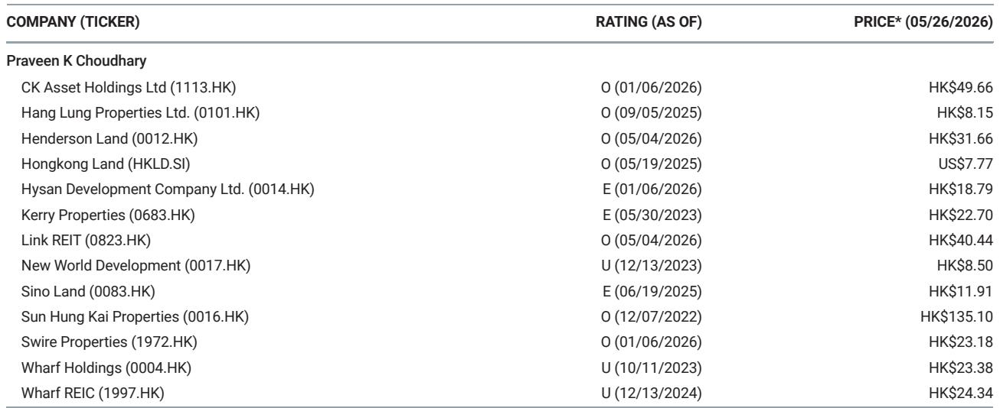
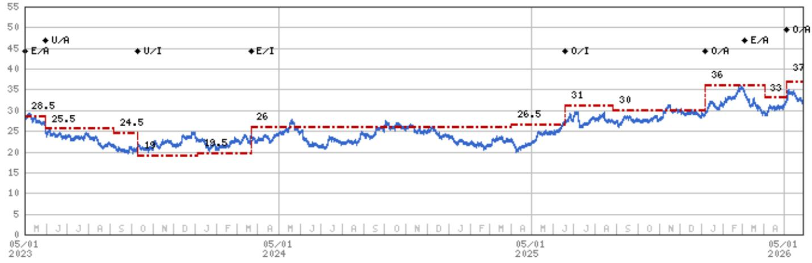
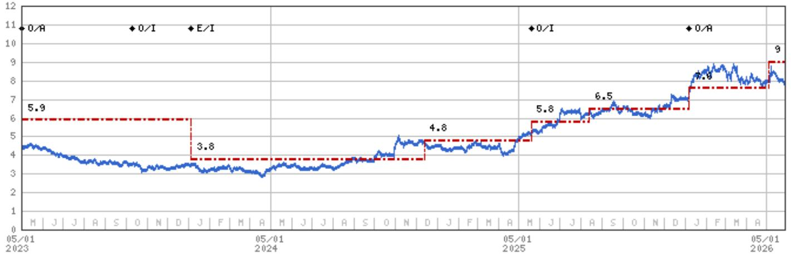

# Hong Kong Property Is Entering a Selective Recovery That Favors the Prepared Investor

The dominant narrative around Hong Kong property has been one of cautious pessimism. Inventory overhang, high interest rates, and shifting global capital flows have weighed on sentiment for years. That narrative is now incomplete. A detailed expert call with Knight Frank, layered with proprietary research from a leading global investment bank, reveals a market that is not simply recovering, but is instead fracturing into distinct sub-markets with divergent trajectories. The central insight for investors is this: the next twelve to eighteen months will not deliver a uniform tide that lifts all boats. They will instead reward those who can navigate the stark divergence between mass residential, luxury residential, and the highly stratified office sector. The broad-based opportunity is gone; the selective opportunity is here.

Why now? The data points are converging. Inventory months for residential have collapsed from a peak of 23.5 months to 11.7 months, signaling a fundamental clearing of supply. Luxury home prices have stabilized after a sharp correction. Office demand, long a source of concern, is showing genuine pockets of strength, particularly in premium Central locations. Yet the market's recent pullback suggests that investors are still anchored to the macro fear of higher-for-longer rates. This disconnect between underlying fundamentals and market pricing is precisely where strategic insight creates value. The recovery is real, but it is not uniform. Understanding the specific vectors of this recovery is the only way to avoid being caught in the segments that will continue to lag.

## The Residential Market Has Shifted from an Inventory Crisis to a Price Discovery Phase, with Mass Market Leading the Recovery

The most significant structural change in Hong Kong's residential market is the dramatic reduction in inventory. The number of completed but unsold units has fallen from a peak of approximately 28,000 to around 20,000. More importantly, the months of supply metric has more than halved, dropping from 23.5 months to 11.7 months. This is not a marginal improvement; it is a fundamental shift in the supply-demand balance. When inventory months fall below the 12-month threshold, developers gain pricing power. The market moves from a buyer's market to a more balanced or seller-favorable environment.

Knight Frank's forecast for 2026 mass residential prices to rise 8-10% should be read in this context. The headline number is important, but the real insight lies in the mechanism. The recovery is not being driven by speculative demand or a sudden influx of foreign capital into the mass market. It is being driven by the simple arithmetic of supply absorption. Developers have slowed new launches to allow the market to clear existing stock. This discipline is the necessary precondition for price recovery. The risk to this view is not a demand collapse, but a premature acceleration of new supply. If developers, emboldened by rising prices, flood the market with new projects, the inventory overhang could re-emerge. The key question for investors is whether developer discipline will hold as prices rise. The evidence from the recent cycle suggests it might, as balance sheets remain conservatively managed.

## Luxury Residential Is a Distinct Asset Class Driven by Wealth Repatriation, Not Local Demand

The luxury residential segment, defined by homes valued over USD 10 million, operates on a different logic than the mass market. Its recent performance is instructive. Prices grew by only 0.5% year-on-year in 2025, a far cry from the 8% decline from the 2021 peak. This stabilization, however modest, masks a powerful underlying current: the repatriation of wealth back to Hong Kong. According to Knight Frank, capital that had migrated to Singapore and the Middle East is now returning. This is not a cyclical shift; it is a structural realignment of global wealth flows.

The competitive landscape for luxury real estate is global. Dubai became the largest luxury market in the world in 2025, absorbing capital that might have previously flowed to Hong Kong. The question for Hong Kong is whether it can reclaim its position as a premier destination for ultra-high-net-worth capital. The early signs are positive, but the competition is intensifying. The luxury segment in Hong Kong is also more sensitive to policy signals, including tax incentives for family offices and the broader regulatory environment for wealth management. Investors in luxury residential are effectively making a bet on Hong Kong's continued relevance as a global financial hub. The data suggests that bet is currently paying off, but it requires constant monitoring of capital flow dynamics that are outside the control of the local property market.

## The Office Market Is a Story of Two Cities: Premium Central Is Booming While Fringe Districts Bleed

The most nuanced and potentially most rewarding opportunity lies in the office market. The aggregate numbers are misleading. Grade-A office rental change year-on-year in the first quarter of 2026 shows a stark divergence. Premium Central rentals increased by 9.2% year-on-year, a remarkable figure given the persistent narrative of office obsolescence. In stark contrast, rentals in Island East declined by 10.6% year-on-year. This is not a market; it is two markets operating under entirely different dynamics.

The driver of Premium Central's strength is a classic "flight to quality" phenomenon, but with a specific Hong Kong twist. The demand is coming from the Banking, Financial Services, and Insurance (BFSI) sector, which accounted for 44% of net take-up. These are not new entrants; they are existing firms expanding and upgrading their space. The Henderson, a new trophy building, is nearly fully leased. International Commerce Centre (ICC) is seeing strong demand from banks and wealth managers. Even more telling is that flexible space operators accounted for 18% of net take-up. This suggests that even the most forward-looking occupiers, who prize flexibility, see premium Central locations as essential for talent attraction and client meetings.

The implication for investors is clear. The recovery in office is not about a broad-based return to work. It is about the concentration of high-value activities in the most prestigious locations. Owners of premium Central assets are in a position of strength. Owners of fringe office assets face a structural headwind that will not be solved by a cyclical recovery. The market is pricing in this divergence, but perhaps not fully. The risk is that the premium commanded by Central assets widens further, leaving secondary office values permanently impaired.

## The Macro Risk Is Not Interest Rates but the Lingering Inventory Overhang, Which Has Already Begun to Clear

The market's recent pullback has been attributed to concerns about the interest rate outlook. This is a misdiagnosis. The macro analysts cited in the report expect no change in rates in 2026, followed by two cuts in 2027. This is a stable, not a threatening, backdrop. The real risk, as articulated by Knight Frank, is not interest rates but the high level of inventory. This risk, however, is rapidly receding. The inventory months have already collapsed from 23.5 to 11.7. The peak of the problem is behind us.

The analytical challenge is that the market's psychology is still anchored to the inventory peak. Investors remember the 28,000 unsold units and the 23.5 months of supply. They have not yet internalized the speed of the clearing. This creates an opportunity for those who can look past the lagging sentiment indicators and focus on the leading data. The question that remains unresolved is whether the clearing has been driven by genuine end-user demand or by developers offering deep discounts and creative financing. If it is the latter, the recovery in pricing may be fragile. If it is the former, the recovery has genuine legs. The report does not fully answer this question, and it is the most critical due-diligence item for any investor considering a position in Hong Kong residential.

## A Decision Framework for Navigating the Hong Kong Property Recovery

The complexity of the current market demands a structured decision framework, not a simple bullish or bearish view. Investors should evaluate opportunities based on three dimensions: asset class, location quality, and balance sheet exposure.

First, asset class. Residential and office are no longer correlated. An investment thesis must be specific to one or the other. Second, location quality. Within residential, mass market and luxury are driven by different factors. Within office, Premium Central is a different asset class from fringe office. Third, balance sheet exposure. Developers with high leverage and large unsold inventory in secondary locations face a different risk profile than those with trophy assets and low debt.

The report's top ideas reflect this framework. CK Asset, Henderson Land, and SHKP are developers with strong balance sheets and significant exposure to the mass residential recovery. Hongkong Land is a pure play on Premium Central office and luxury residential. Link REIT offers exposure to resilient retail and a yield that benefits from the rate cut cycle. The common thread is selectivity. The market is no longer rewarding broad exposure to Hong Kong property. It is rewarding precise positioning within the recovery.

The open question that the report leaves for the diligent reader is the trajectory of capital flows. The wealth repatriation from Singapore and the Middle East is a powerful force, but it is also a volatile one. The next macro shock or geopolitical shift could reverse these flows as quickly as they appeared. The investor who can build a thesis around the durability of these capital flows will have a genuine edge.

## Join the Community to Read the Full Report and Review the Original Charts

The analysis presented here is a synthesis of expert insights and proprietary research, but it necessarily leaves several layers of detail unexamined. The original report contains granular data on rental trajectories by sub-market, valuation methodologies for each top pick, and a full discussion of the risk factors that could derail the recovery. To make fully informed decisions, investors need access to the complete picture, including the original charts that illustrate the divergence between Premium Central and Island East, and the trajectory of inventory months from peak to current levels.

The most important questions are not answered in a single article. How sustainable is the flight to quality in the office market? Will developer discipline hold as prices rise? Can Hong Kong sustain its appeal to global luxury capital in the face of competition from Dubai and Singapore? These are the questions that separate a superficial understanding from a strategic one. The full report provides the data and the analytical framework to answer them. Join the community to read the full report and review the original charts.

*This article is for learning and discussion only and does not constitute investment advice.*

Personal reading notes and learning share only. Not investment advice.

